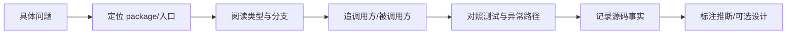

# 如何精读 Pi 源码

每篇源码文章固定记录：文件、核心 symbol、package、调用方、被调用方、研究 commit。先回答下面 12 个问题：

1. 文件为什么存在？
2. 它在系统哪一层？
3. exported 入口是什么？
4. 输入从哪里来？
5. 输出交给谁？
6. 核心 interface/type 是什么？
7. 正常流程是什么？
8. 错误、取消和空值怎么处理？
9. 哪些状态被持久化？
10. 设计是源码事实还是推断？
11. Go/Java 怎么表达同一边界？
12. 能做什么观察/修改/实现/设计实验？

## 最小引用规则

引用十几行能说明控制流的代码即可；代码下面说明输入、输出、状态变化和下一个调用方。需要全貌时给固定 commit 文件链接，而不是复制几百行。

```text
file path + symbol + commit
packages/agent/src/agent-loop.ts
runAgentLoop -> runLoop -> streamAssistantResponse -> executeToolCalls
```

TypeScript 里的 `interface`、泛型和 union 可以映射到 Java interface/泛型/密封层次或 Go interface/struct；不要因为语法不同就把架构边界删掉。

## 学习目标与准备

源码精读的产物不是“我看过这个文件”，而是一份可复查的行为说明。读完本页，你应能为一个 symbol 写出：职责、调用方、输入、输出、状态变化、错误边界和测试入口。准备好固定 commit、编辑器全文搜索和一个 faux provider；不要先打开几千行文件从第一行往下滚。

## 先看一个失败 trace

```text
看到 AgentSession.prompt()
 -> 直接认定它调用 LLM
 -> 在 AgentSession 找不到 HTTP
 -> 结论：源码很复杂/调用隐藏了
```

失败点在于把“产品入口”和“副作用入口”混为一谈。`AgentSession` 可能组装 context 和配置，真正请求由配置的 stream function 经 `pi-ai` 完成。正确做法是沿 symbol 和调用关系追踪数据，不是沿文件长度追踪。

## 十步阅读法

### 1. 先写问题，不先写答案

例如：“一次工具调用为什么会产生两条消息？”问题比“agent-loop 做什么”更可测。它要求你找到 assistant tool call、tool result、context append 和下一次 request 的关系。

### 2. 找 package manifest

打开 package.json，记录该包的 runtime dependencies、workspace dependencies、exports 和 test script。依赖说明可见的架构边界；它不能替代 import 证据。

### 3. 找 exported symbol

用 `rg '^export|export class|export function'` 找入口，再找所有调用处。对 TypeScript 来说，`type` 和 `interface` 多是编译期契约，不会像 Java class 一样出现在运行时。

### 4. 画最小数据流

```text
source input -> normalize -> state -> side effect -> result -> next caller
```

每个箭头都写具体类型。例如 `AgentLoopConfig` → `AssistantMessageEventStream`，不要只写“请求 → 响应”。

### 5. 读类型，再读分支

先看 `AgentEvent`、`ToolCall`、`Context` 等类型，确定哪些字段可以为空、哪些 union variant 存在；再读 `if`/`switch`。否则容易把 `stopReason: "length"`、`"toolUse"` 和普通 `"stop"` 当成同一终态。

### 6. 为每个 await 标注边界

`await stream()`、`await tool.execute()`、`await listener()` 都可能抛错、取消或延迟。标注“外部 I/O”“副作用”“观察者”三类边界，才能判断恢复和重试风险。

### 7. 记录正常和异常路径

至少画一条 final path、一条 tool path、一条 provider error path、一条 abort path。异常路径往往比 happy path 更能说明谁拥有状态。

### 8. 对照测试

测试是行为证据。先找到 faux provider 如何构造 delta、tool call 和 done，再回到实现对应分支。若文档与测试/源码冲突，当前源码和测试优先。

### 9. 区分事实与解释

```text
源码事实：函数在 before execute 前调用 prepareArguments。
合理推断：这样可以把非法参数拦在副作用之前。
可选设计：另一个 Harness 也可以用 schema validator middleware。
```

不要把推断写成作者意图；除非注释或文档明确说明“为什么”，否则使用“从行为上看”。

### 10. 最后才抽象

完成一次具体 trace 后，再总结“这是一个两阶段 tool lifecycle”。抽象必须能回到文件、symbol 和测试，否则只是术语。

## 从问题到证据的流程



这张图的关键是先提出可证伪的问题，再进入代码。若直接从抽象名词开始，最后通常只能复述类名，不能说明输入如何变成输出。

## 证据记录模板

```markdown
问题：工具参数非法时，副作用是否发生？
研究版本：853a80d26c90a14c1886f0ebb8ffaae133ca2185
入口：packages/agent/src/agent-loop.ts#prepareToolCall
调用方：runAgentLoop / runLoop
输入：ToolCall(name, arguments)
输出：PreparedToolCall 或错误 ToolResult
事实：validate 在 execute 前发生
推断：可以 fail-closed
测试：packages/agent/test/agent-loop.test.ts
```

模板中的 `#symbol` 只是人类定位提示，不是依赖稳定行号的 permalink。实际链接应固定 commit；源码变动后 symbol 名和职责更稳定。

## TypeScript 到 Java/Go 的阅读映射

| TypeScript | Java | Go | 阅读重点 |
| --- | --- | --- | --- |
| `interface AgentTool` | `interface Tool` | `type Tool interface` | 能力契约，不是执行本身 |
| `Promise<T>` | `CompletionStage<T>`/Future | 返回值 + goroutine/channel | 异步完成与错误传播 |
| `AbortSignal` | cancellation token/interruption | `context.Context` | 取消意图，不能自动撤销外部副作用 |
| union type | sealed interface/enum-like types | tagged struct/type switch | 分支是否穷尽 |
| callback | listener/Consumer | function/channel | 观察者是否影响主流程 |

## 实验：从 symbol 反推行为

**目标：** 为 `executeToolCalls` 做一页 trace。

**准备：** 打开 `packages/agent/src/agent-loop.ts`、`packages/agent/src/types.ts` 和一个 faux provider 测试。

**步骤：**

1. 找到 `executeToolCalls` 的 exported/内部定义和全部调用处。
2. 列出它读取的每个字段，标注来自 model、registry 还是 runtime config。
3. 对 prepare、execute、finalize 各写一个输入输出例子。
4. 找一个参数非法和一个 `length` stop reason 测试。
5. 把最终 tool result 放回下一次 provider request 的位置。

**观察点：** 函数名相近的 prepare/execute/finalize 并非重复；它们把验证、外部副作用和结果归一化分成不同可测阶段。

**预期结果：** 能从调用图判断哪个阶段可安全重试，哪个阶段可能已经产生副作用。

**思考题：** 如果只引用函数名、不记录类型和调用方，未来重命名后读者如何确认行为？如果 listener 抛错，是否应该回滚已经完成的 Tool？

## 小结

源码阅读要把“一个文件”转换成“一个可验证的行为模型”：入口、类型、数据流、异常、状态和测试证据。固定 commit 负责可复现，symbol 负责抗行号漂移，事实/推断/可选设计三分法负责避免过度解释。
