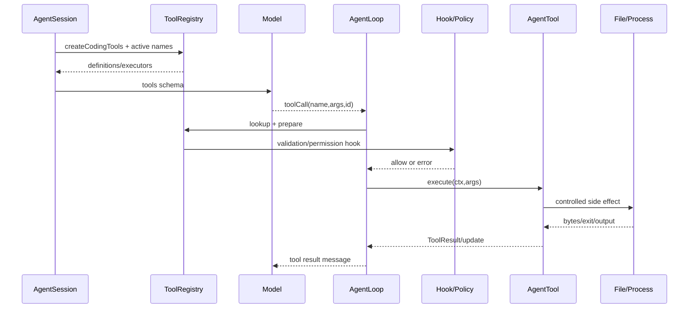

# 精读 Coding Agent 工具源码

**入口**：`packages/coding-agent/src/core/tools/index.ts`；**实现**：`read.ts`、`edit.ts`、`write.ts`、`bash.ts`；**symbol**：`createToolDefinition`、`createTool`、各 `create*Tool`；**commit**：`853a80d26c90a14c1886f0ebb8ffaae133ca2185`。

## Definition 与 executor 分开

`create*ToolDefinition` 只产生给模型看的 name/description/parameters；`create*Tool` 产生带 `execute` 的 AgentTool。`createCodingTools` 组合默认的 read/bash/edit/write，`createReadOnlyTools` 组合 read/grep/find/ls。

## read/edit/write 的关键点

- `read` 有行范围、图片/文本处理和 output truncation；路径要在 cwd 规则内。
- `edit` 需要旧文本匹配，避免“相似但错误”的替换；失败应返回明确错误。
- `write` 负责创建/覆盖内容和父目录，写失败不能伪装成成功。
- `bash` 通过 operations abstraction 执行进程，处理 cwd、输出、退出码、更新和取消。

## 调用链

```text
createAllTools -> AgentSession registry -> Agent tool definitions
-> model toolCall -> AgentLoop validation -> beforeTool hooks
-> tool.execute -> onUpdate/afterTool -> ToolResult
```

调试时同时观察 schema、validated args、实际 cwd 和截断后的结果；不要只看 UI 显示。

## 学习目标与前置知识

本页结束时，你应能从一个 `read` 或 `edit` 的 definition 追到最终副作用，并回答：模型看到的 schema 在哪里注册？参数何时校验？权限在哪一层？结果为什么可能被截断？前置知识是 JSON Schema object、文件读写和子进程；不需要先会写 TypeScript 工具框架。

## 失败 trace：把 definition 当 executor

```text
模型看到 write(path, content)
 -> Agent 直接信任 arguments
 -> 未校验路径
 -> 写入仓库外文件
 -> UI 只显示“tool called”
```

这里有两个独立错误：Tool definition 只是给模型的描述，不是安全策略；`tool called` 只是请求事件，不是写入成功。正确链路必须是 definition → registry → lookup/prepare → schema/path/permission → execute → result/update → Agent Loop 下一轮。

## 真实文件、symbol 和调用方

研究 commit 是 `853a80d26c90a14c1886f0ebb8ffaae133ca2185`。

- `packages/coding-agent/src/core/tools/index.ts`：`createToolDefinition`、`createTool`、`createCodingTools`、`createReadOnlyTools`，负责组合 active registry。
- `read.ts`：`createReadToolDefinition`、`createReadTool`，处理文本/图片、行范围和输出限制。
- `write.ts`：`createWriteToolDefinition`、`createWriteTool`，处理目录创建和写入。
- `edit.ts`：`createEditToolDefinition`、`createEditTool`，处理 oldText/newText 的精确替换。
- `bash.ts`：`createBashToolDefinition`、`createBashTool`，通过 operations/subprocess 边界处理 cwd、输出、退出和取消。
- `packages/agent/src/agent-loop.ts`：`prepareToolCall`、`executePreparedToolCall` 等 runtime 生命周期。

调用方是 `AgentSession` 创建/安装 AgentTool；被调用方是工具的 `execute` 与文件系统/进程 operations。Extension 可以提供额外工具或 hook，但不能因为注册了 definition 就绕过宿主权限。

## Definition 与执行对象

Definition 至少包含稳定的 `name`、人类可读 `description` 和参数 schema；executor 还需要 `execute`、可选 update callback、详情和错误语义。两者分离有三个好处：

1. 组装 provider request 时只需要 definitions，不触发副作用。
2. 测试可以检查模型看到什么而不执行工具。
3. allowlist/active tools 可以在 registry 层筛选，避免 prompt 出现不存在的工具。

```text
createCodingTools(options)
 -> ToolDefinition[] + AgentTool[]
 -> AgentSession active tool filter
 -> system prompt/provider request
```

## Definition、注册、执行的 Mermaid



## `read`

**Schema：** 路径、可选行起止等字段；真实字段以 `read.ts` definition 为准。**注册：** `createCodingTools` 或 read-only 组合返回它。**验证：** 路径解析、是否允许读取、参数类型和范围。**执行：** 根据目标是文本还是图片选择读取/编码，按行范围截取并限制输出长度。**结果：** 内容、文件信息或 error；过长内容应明确告知截断，而不是让模型以为看到了完整文件。

读取是只读副作用，但仍可能泄露 secret。workspace path restriction 不能自动允许 `~/.ssh/id_rsa`；权限 policy 和项目 trust 要在执行前介入。

## `write`

**Schema：** path 与 content。**注册：** coding tool registry。**验证：** 规范化路径、检查 workspace/permission、确认父目录策略。**执行：** 创建必要目录并写入内容；写入失败返回 error。**结果：** 成功信息或受控错误。

写入没有“只要返回成功就算成功”的捷径。磁盘满、权限拒绝和并发覆盖都必须向模型和 session 暴露。若业务需要原子写，应使用临时文件、fsync/rename 或更高层 transaction；不能假设普通 write 已经 durable。

## `edit`

**Schema：** path、oldText、newText，有时包含 replaceAll 等选项。**验证：** oldText 必须在目标中唯一匹配（或符合工具明确的重复匹配规则），否则拒绝执行。**执行：** 读取现有内容、做精确替换、写回；**结果：** changed/old missing/multiple match/error。

精确 oldText 是防止模型“凭相似文本改错位置”的护栏。它不是并发锁：另一个进程可能在读后写前修改文件，因此生产工具还需版本校验或 atomic compare-and-swap。

## `bash`

**Schema：** command、可选 timeout/cwd 等配置，真实字段以 `bash.ts` 为准。**注册：** 通常由 coding tools 组合启用。**验证：** command approval、project trust、cwd、sandbox/operations 和输出策略。**执行：** 启动受控子进程，流式报告 stdout/stderr，处理退出码和 cancellation。**结果：** exit code、输出、signal 或错误。

bash 是最危险的内置工具：`rm -rf`、凭据读取、网络上传和 `git push` 都可能产生不可逆影响。denylist 只能挡明显模式，不能证明命令安全；生产还需要 OS sandbox、资源限制、网络 policy、人工审批和 secret redaction。

## 输出截断与事件

工具输出通常同时有实时 update 和最终 result。实时输出用于 TUI/Telemetry，最终结果用于下一轮 context；二者不应被当成两份独立事实。截断应记录上限、原始长度或提示，并确保模型知道它没有看到全部输出。

```text
tool_start
 -> tool_update(chunk...)
 -> tool_end(summary/truncated/error)
 -> tool_result message(call id)
```

## Extension 与 tool hook

`ExtensionRunner` 可以在 tool call 前后监听或变换调用；`AgentSession._installAgentToolHooks` 将 extension hooks 接到工具生命周期。before hook 适合权限、参数修改或拒绝；after hook 适合补充 details、UI 渲染和结果变换。任何改变有效参数或结果的 hook 都应可观察、可测试；不能让模型看到 A、实际执行 B 而没有记录。

## 源码事实、推断、可选设计

> **源码事实：** Coding Agent 在 `core/tools` 以 definition/executor 组合 read/write/edit/bash，并由 Agent loop 进一步 prepare/execute；输出和路径处理由各工具实现。
>
> **推断：** Definition 与 executor 分离能让 active tool 筛选和离线测试更安全，这是从实际调用边界得到的分析。
>
> **可选设计：** 自建 Harness 可以用统一 `Tool` interface 和 JSON Schema validator；若采用强类型参数，也仍要对模型生成 JSON 做运行时校验。

## 实验 A：read 的完整生命周期

**目标：** 找到同一个 `read` 从注册到 result 的所有边界。

**准备：** 打开 `tools/index.ts`、`read.ts`、`agent-loop.ts` 和一个 coding-agent tool test；使用临时目录。

**步骤：**

1. 记录 definition 的 name、description 和 schema。
2. 找到 `createCodingTools` 把它放入 registry 的位置。
3. 用 faux model 返回 `read` tool call，记录 id/path。
4. 在 prepare 前后比较原始 args、规范化路径和校验错误。
5. 让文件超过输出上限，观察 result 的截断提示。
6. 确认下一次 model request 使用 tool result，而不是 UI update chunk。

**观察点：** schema、validated args、cwd、result content 和 UI update 是不同对象。

**预期结果：** 你能指出一次安全拒绝发生在 execute 之前。

## 实验 B：故障注入

分别让 oldText 匹配零次/多次、write 目录不可写、bash 返回非零退出码、Tool hook 抛错。记录哪些情况产生 error result，哪些情况应该阻止副作用，哪些情况需要重试。不要在真实仓库运行 `rm`、上传或 push。

## 思考题

1. 为什么把完整文件内容放进 definition 会浪费 context？
2. `read` 是只读工具，为什么仍然需要权限和 secret policy？
3. bash 重试前需要确认什么？一个命令已经创建远端资源时能否安全重放？
4. 如果并行执行两个 edit 修改同一文件，怎样定义冲突和回滚？

## 小结

工具系统的关键不是工具数量，而是 definition、registry、validation、permission、execution、update、result 和 persistence 的边界。`AgentSession` 组装工具，Agent Loop 驱动生命周期，具体 tool 控制本地副作用；模型只提出候选调用，不能把候选调用当授权。

**继续阅读：** 对照 `04-tools/tool-lifecycle` 的抽象模型和固定 commit 的 `tools/index.ts`，逐一核对每个状态转移。
