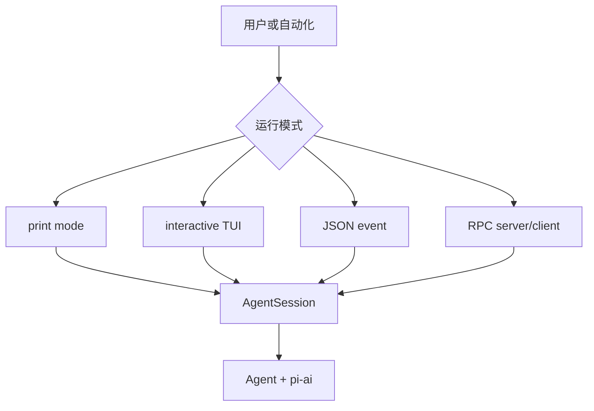
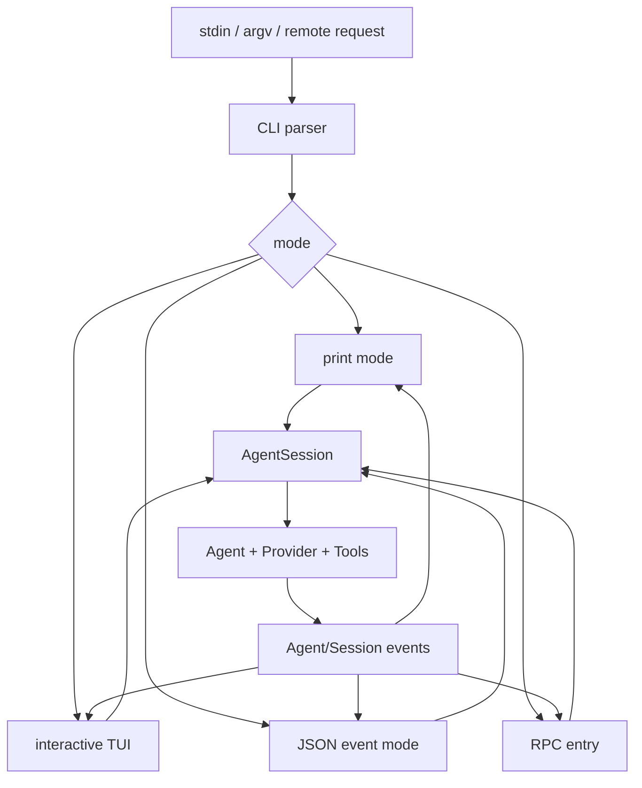

# CLI、TUI、JSON 与 RPC

## 四种表面

- Print/CLI：一次输入、文本输出，适合脚本。
- Interactive/TUI：编辑器、流式消息、Tool 状态和快捷键。
- JSON event mode：机器消费结构化 Agent/Session 事件。
- RPC：外部客户端通过协议控制一个 session/server。

它们共享 `AgentSession` 和核心 Loop，但 UI 不应自己实现 Tool execution 或 Session persistence。



## RPC 与 MCP 不同

RPC 的方法、权限和生命周期由 Pi 应用协议定义，用于控制 session；MCP 是外部 Tool/resource server 的协议。不要看到 JSON-RPC 就把两者当成同一接口。

## 调试

从 `packages/coding-agent/src/modes/`、`src/cli/` 和 `src/rpc-entry.ts` 找 mode 入口，再回到 `AgentSession`。先使用 print/faux provider 验证核心，最后才调 TUI redraw 和 transport。

## 学习目标与前置知识

本页要区分四个“入口/表面”：CLI 参数解析、print/JSON mode、interactive TUI 和 RPC。读完后，你应能解释它们为什么共享 `AgentSession`，又为什么不能把 UI、RPC 和 MCP 混成一个协议。前置知识是命令行 stdin/stdout、JSON 行协议和基本事件监听。

## 失败 trace：把终端输出当协议

```text
RPC client 启动 pi
 -> 读取 TUI ANSI 文本
 -> 遇到 spinner、颜色和重绘
 -> 无法知道 tool_result 是否已提交
 -> 客户端重复发送 prompt
```

这个失败 trace 把呈现层当成控制协议。TUI 可以重绘，同一行可能被覆盖；RPC 需要稳定的 request/response/event schema；JSON mode 需要机器可解析的 event。三者都应通过应用 session 产生状态，而不是互相解析。

## 真实文件和边界

研究 commit：`853a80d26c90a14c1886f0ebb8ffaae133ca2185`。

- `packages/coding-agent/src/cli.ts`：解析命令、环境和运行模式选择。
- `packages/coding-agent/src/modes/`：print、interactive/json 等模式的输入输出处理。
- `packages/coding-agent/src/rpc-entry.ts`：RPC 进程入口和连接生命周期。
- `packages/coding-agent/src/core/agent-session.ts`：所有 mode 复用的 session/application orchestration。
- `packages/protocol`、`packages/client`、`packages/server`：跨进程消息与远程 facade/transport。
- `packages/tui`：编辑器、组件、渲染和终端控制，不拥有 Agent Loop。

具体函数名以固定 commit 的入口文件为准；阅读时优先找 exports、mode dispatch 和 session method，不把本页伪代码当成源码 API。

## 四种模式的数据流



入口不同，核心动作相同：构造 prompt operation、等待 Agent event、显示 final/状态、处理 abort/exit。差异在输入控制、输出编码和连接生命周期。

## CLI/print mode

CLI 负责把 flags、environment、cwd 和 prompt 变成 mode options。print mode 适合 shell pipeline：一次输入、文本/结构化输出、进程退出。它不应该通过 stdout 混入 debug log；如果需要诊断，使用 stderr 或独立 telemetry。脚本使用 print mode 时仍要处理 exit code、model error、tool error 和超时。

## Interactive TUI

TUI 有 editor、selector、transcript、tool progress、overlay、快捷键和 resize 状态。它消费 stream update 以增量渲染，但最终一致性依赖 AgentSession/SessionManager 的 message/entry 状态。`Escape` 或绑定的 interrupt action 应进入 Agent abort；不能让 UI 绕过 loop 直接杀掉任意 tool。

TUI 的“看到成功”也不是持久化证明。一个 tool result 可能在屏幕显示后 session write 失败，宿主必须显示错误或恢复状态，而不是静默标为 done。

## JSON event mode

JSON mode 的目标是让自动化程序消费稳定事件。事件至少要有 type、关联 id、顺序/时间和必要 payload；消息内容、tool args 和文件输出应按安全策略处理。消费方不能假设每一条 event 都是 durable record，也不能只凭 `agent_end` 推断所有副作用已成功，需结合 result/status。

## RPC

RPC 是控制一个已运行 Agent/session 的远程边界。它需要连接握手、请求 id、方法参数、响应错误、事件订阅、取消和 close 语义；`packages/protocol`/client/server 提供相应契约。RPC server 可以调用 AgentSession 的 prompt、session 或配置操作，但权限仍由宿主 session/Tool policy 执行。

```text
RPC request(prompt)
 -> server validates request
 -> AgentSession.prompt
 -> Agent/loop events
 -> protocol response/events
 -> client updates its state
```

不要把 RPC 误读成“远程 bash”。客户端请求的是 session operation；是否能使用 shell 是宿主 registry、project trust 和 permission policy 的决定。

## RPC 与 MCP 的逐项区别

| 项目 | Pi RPC | MCP |
| --- | --- | --- |
| 目的 | 控制/观察一个 Agent 应用 | 发现/调用外部 server 能力 |
| 调用者 | 外部客户端、UI、自动化 | Agent 的 MCP client |
| 典型方法 | session/prompt/event/abort | `initialize`、`tools/list`、`tools/call` |
| 状态 | session、连接、运行 lifecycle | server capability、tool/resource |
| 安全主体 | Agent host/用户权限 | MCP server 与 client policy |
| 关系 | 应用控制面 | 能力接入面 |

两者都可能使用 JSON-RPC 风格 framing，但方法、生命周期和信任边界不同。不能因为有 `id`、`method`、`params` 就声称它们是同一协议。

## 源码事实、推断、可选设计

> **源码事实：** coding-agent 提供多种 mode，核心 session/Agent 可被不同 surface 复用；TUI 位于呈现层，RPC 位于控制/transport 边界。
>
> **推断：** 共享 `AgentSession` 能避免 print 和 TUI 各自实现 tool/session 语义；这是从调用结构得到的工程分析。
>
> **可选设计：** 小型单进程 Agent 可以只有 stdin/stdout JSON，不必先做 RPC server；当需要并发客户端时再加入 connection/session manager。

## 实验：同一 prompt 对照三种 surface

**目标：** 证明核心状态不依赖 UI。

**准备：** 使用 faux provider 和 calculator/read-only tool；准备 print、JSON 或测试 mode，不连接真实服务。

**步骤：**

1. 在 print mode 记录 prompt、tool call、final 和 exit code。
2. 在 JSON mode 记录 event type、call id、result status 和顺序。
3. 在 TUI 中观察 stream update、tool progress 和最终 transcript。
4. 若环境有 RPC 测试，发送同样 prompt，观察 response 与异步 event。
5. 把一个请求设为 abort，比较三种 surface 如何呈现 cancellation。

**观察点：** surface 改变编码和呈现，`AgentSession`/Agent 的 tool lifecycle 不应改变。

**预期结果：** 能指出 RPC 是应用控制面，MCP 是外部能力协议，TUI 是交互呈现。

**思考题：** 为什么把 debug 输出写 stdout 会破坏 JSON mode？RPC client 若直接执行 shell，会绕过哪些 policy？TUI 的 spinner 消失是否等于 session 写入成功？

## 小结

CLI 选择运行方式，print/JSON 输出结果，TUI 处理交互呈现，RPC 提供远程控制；它们都应通过 `AgentSession` 接入 Agent 和 Session。RPC 不等于 MCP，屏幕文本不等于协议，UI event 也不等于 durable record。
