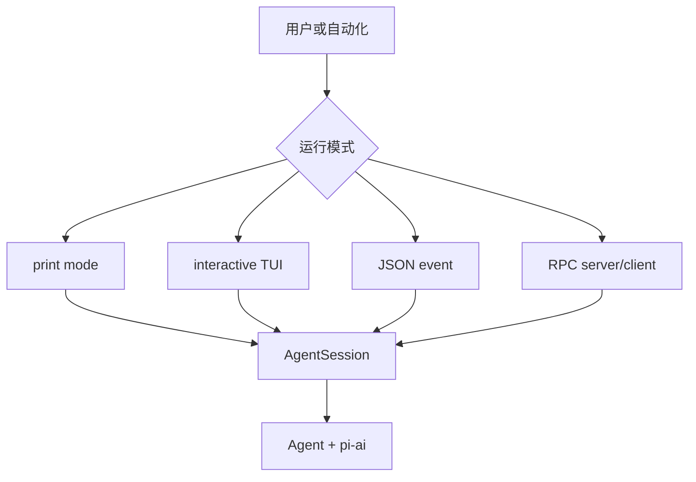

# CLI、TUI、JSON 与 RPC

## 四种表面

- Print/CLI：一次输入、文本输出，适合脚本。
- Interactive/TUI：编辑器、流式消息、Tool 状态和快捷键。
- JSON event mode：机器消费结构化 Agent/Session 事件。
- RPC：外部客户端通过协议控制一个 session/server。

它们共享 `AgentSession` 和核心 Loop，但 UI 不应自己实现 Tool execution 或 Session persistence。

## RPC 与 MCP 不同

RPC 的方法、权限和生命周期由 Pi 应用协议定义，用于控制 session；MCP 是外部 Tool/resource server 的协议。不要看到 JSON-RPC 就把两者当成同一接口。

## 调试

从 `packages/coding-agent/src/modes/`、`src/cli/` 和 `src/rpc-entry.ts` 找 mode 入口，再回到 `AgentSession`。先使用 print/faux provider 验证核心，最后才调 TUI redraw 和 transport。
