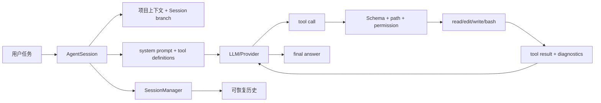

# Coding Agent 由什么组成

Coding Agent 不是“聊天框加 shell”。Pi 的当前运行路径可以拆成：

```text
CLI/TUI/RPC
  -> AgentSession
     -> Agent (agent-loop)
        -> pi-ai Provider
     -> SessionManager
     -> ResourceLoader / Skills / Prompt templates
     -> ExtensionRunner
     -> coding tools
     -> ModelRuntime / auth / settings
```

`AgentSession` 是核心编排点，负责订阅 Agent 事件、持久化消息、刷新 system prompt/tools、auto compaction、retry、bash 状态和 Extension hooks。不同 mode 只改变输入输出表面。

## 和最小 Agent 的差距

最小 Agent 只有 messages、model、tools 和 loop；Coding Agent 还必须知道 cwd、项目上下文、文件输出上限、可信度、认证、Session 分支、TUI 状态、远程 RPC 和插件故障。理解这些差距，就是从 Agent 进入 Harness 的入口。

## 核心问题

一个成熟 Coding Agent 的工程能力并不是模型“自带”的；它由 Agent core、coding-agent 编排层、Provider adapter、工具实现、资源系统、Session 和 UI 多个 package 共同提供。

## 学习目标与前置知识

本页建立从“能聊天”到“能安全修改仓库”的差异清单。读完后，你应能解释 `AgentSession` 为什么是编排层、为什么工具不应由模型直接执行、为什么 Session 与 TUI 不能互相代替。前置知识是已经完成 Tool Calling、Agent Loop 和基础 HTTP 章节；Java 后端读者可以把 `AgentSession` 类比为 application service，但它还要管理异步事件和交互状态。

## 失败 trace：把 Coding Agent 当聊天机器人

```text
用户：把测试修好
 -> LLM 返回一段建议
 -> 没有 cwd / repository context
 -> 没有 read/edit/bash policy
 -> 直接把文本显示为“已修复”
```

这个系统没有执行闭环，也没有证据证明文件变了。真正的 Coding Agent 必须把请求绑定到工作目录、加载项目指令、声明可用工具、验证参数、执行受控副作用、把结果送回模型，并将稳定结果写入 session。

## 组件职责

| 组件 | 输入 | 输出 | 不应该负责 |
| --- | --- | --- | --- |
| Mode/CLI/TUI/RPC | user input、control action | prompt operation、render event | 直接调用 shell |
| `AgentSession` | prompt、settings、session | Agent config、lifecycle/event | 亲自实现 provider wire format |
| `Agent`/loop | messages、tools、stream | assistant/tool events、终态 | 决定 UI 布局 |
| Provider adapter | provider-neutral request | unified stream | 读取本地文件 |
| Tool executor | validated arguments、policy | result/update | 把模型输出视为授权 |
| `SessionManager` | entries、leaf、options | context projection/persistence | 替代模型推理 |
| ResourceLoader/Skills | cwd、skill dirs | prompt resources | 自动获得执行权限 |
| ExtensionRunner | hooks/events | transformed behavior | 绕过宿主 policy |

## `AgentSession` 的真实位置

打开 `packages/coding-agent/src/core/agent-session.ts`。它通常持有 Agent、SessionManager、resource loader、settings、extension runner 和当前 model/runtime，并在 `_handleAgentEvent` 中把核心事件转换为应用状态。它还会安装 tool hooks、触发 compaction/retry 相关流程、为 mode 提供可消费的事件。

```text
mode command
 -> AgentSession.prompt
 -> load context/resources
 -> build system prompt + tools
 -> Agent.prompt
 -> Agent event listener
 -> session append / UI event
```

这里“AgentSession 调 Agent”是组合关系，不是两个 loop 叠加。Agent 决定 tool turn 是否继续；AgentSession 决定这个 turn 的上下文、资源、持久化和界面如何接入产品。

## 项目上下文为什么重要

同一个 prompt 在不同 cwd 中含义不同。`ResourceLoader` 可能发现 `AGENTS.md`、`CLAUDE.md`、skills 和 prompt templates；`buildSystemPrompt` 将允许暴露的内容与工具说明组合。项目文件内容不应无界塞入 system prompt，应该按规则、路径和 token 预算选择。

一个清晰的上下文层次是：

```text
system policy
 + project instructions
 + skill metadata
 + tool definitions
 + session branch messages
 + current user request
```

其中 tool definition 是“可调用能力的说明”，不是工具执行结果；project instruction 也不是权限授予。权限应在执行边界再次检查。

## Coding tool 的最小闭环



### read/edit/write/bash 的组合

`read` 让模型观察，`grep` 缩小搜索，`edit` 做精确变更，`write` 创建/覆盖文件，`bash` 执行测试或构建。实际生产还需要命令审批、sandbox、超时、输出上限和审计。工具多不代表能力安全，边界才是安全控制。

## 和 Pi 还差什么

一个教学 Agent 可以只有单进程 loop；Pi Coding Agent 还包含 session tree/branch、compaction、settings、project trust、extensions、skills、多种 mode、TUI rendering、RPC、Provider auth 和错误恢复。某些能力可能通过组合层或可选扩展提供，不能仅凭“目录里有文件”断言默认启用。

当前应特别区分：

1. `packages/agent` 的 Agent loop 是可运行控制流。
2. `packages/coding-agent` 的 `AgentSession` 是产品编排。
3. `packages/agent/src/harness/agent-harness.ts` 在研究版本仍是 scaffold，不能冒充完整 durable Harness。

## 源码事实、推断、可选设计

> **源码事实：** `AgentSession` 组合 Agent、SessionManager、资源、工具和 Extension；不同 mode 复用这条应用主链。
>
> **推断：** 把项目上下文放在编排层，可让通用 Agent 不知道 cwd 和文档搜索规则。
>
> **可选设计：** 自建 Coding Agent 可以先把资源加载和 session 合并进一个 application service，规模变大后再按变化原因拆包。

## 实验：从空目录建立最小 Coding Agent

**目标：** 观察项目上下文、tool definition 和 session history 如何共同影响一次请求。

**准备：** 用临时目录创建一份 `AGENTS.md`、一个文本文件和一个 fake model；不要指向真实凭据目录。

**步骤：**

1. 只启用 `read` 与 `grep`，打印最终 tool definitions。
2. 加载 `AGENTS.md`，比较 system prompt 的资源段。
3. 让 fake model 请求 read，再请求 edit；在 execute 前做路径断言。
4. 在 session manager 中记录 assistant/tool result entry。
5. 切换到 print 或 JSON mode，比较输出 surface，不改核心 loop。

**观察点：** 上下文决定模型能看到什么，registry 决定模型能请求什么，policy 决定请求是否能执行，session 决定之后能否解释发生过什么。

**预期结果：** 能说明“模型建议修改”与“文件实际修改”之间至少隔着 schema、权限和 executor 三道边界。

**思考题：** 如果把 `AGENTS.md` 当作权限文件会有什么风险？如果 UI 先显示成功而 session write 失败，用户应看到什么？为什么 RPC client 不应自己执行 bash？

## 小结

Coding Agent 是一个应用级 Harness：`AgentSession` 把通用 loop、provider、工具、项目资源、Session、Extension 和 mode 接起来。理解这层编排，才能从“调用 LLM”进入“可验证地修改代码”。
