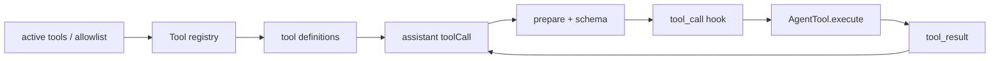
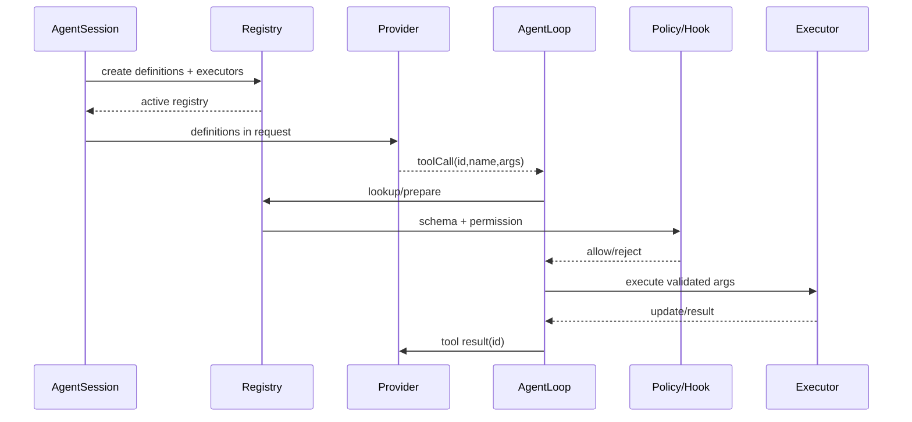
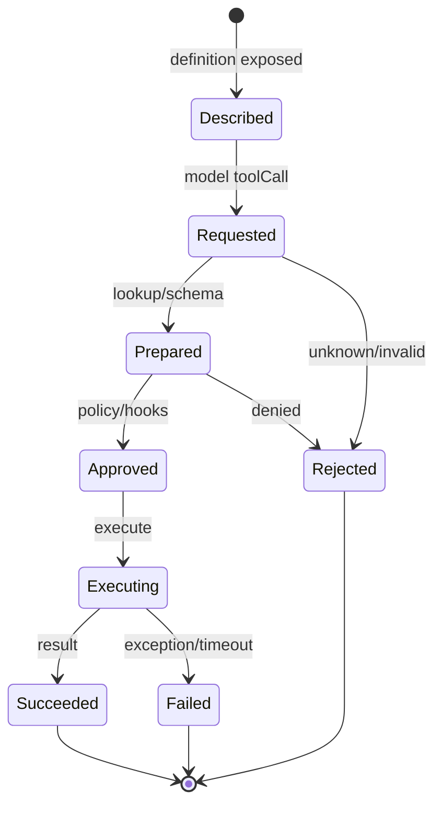

# Coding Agent 工具系统

## Definition-first registry

Pi 的工具先有 definition，再有执行对象。`AgentSession` 可以根据 active tool names、allowlist、denylist 和 extensions 构建当前 registry；system prompt 的工具描述也应和真正可执行的工具一致，不能让模型看到一个不存在的工具。

## 运行链



`core/tools/index.ts` 的 `createTool` 和 `createToolDefinition` 是集中入口；`AgentSession._installAgentToolHooks` 将 Extension 的 `tool_call` 和 `tool_result` 接在 Loop 的 before/after hook 上。

## 扩展能做什么

Extension 可以添加/替换工具、修改结果、提供渲染和事件处理；它不能绕过宿主的安全策略。一个 Tool 结果可标记 `addedToolNames`，但“模型看到了说明”仍不等于“权限已授予”。

## 实验

先设置 active tools 只含 `read`、`grep`，确认 write/bash 不在 definitions；再通过 Extension 添加一个只读工具，断言 prompt、registry 和执行都同步变化。

## 学习目标与前置知识

读完本页，你应能独立实现一个 definition-first registry，并定位 Pi Coding Agent 中“模型看到的工具”和“运行时执行的工具”之间的每个边界。前置知识是 JSON Schema object、回调和基本文件权限；不要求会写 TUI。

## 失败 trace：schema、registry、executor 不一致

```text
active tools = [read]
 -> system prompt 却包含 write
 -> 模型生成 write(path, content)
 -> registry 找不到/或绕过 allowlist 执行
 -> UI 只能显示 unknown tool
```

另一种更危险的故障是 schema 允许 `../secret`，而 executor 直接使用字符串路径。修复方法不是提示模型“请小心”，而是在 definition、registry、prepare、permission 和 executor 各自保留明确职责；最终副作用前必须再次检查。

## 真实入口和数据流

研究 commit：`853a80d26c90a14c1886f0ebb8ffaae133ca2185`。

`packages/coding-agent/src/core/tools/index.ts` 的 `createToolDefinition`/`createTool`/`createCodingTools` 负责组合；`read.ts`、`write.ts`、`edit.ts`、`bash.ts` 负责具体定义和执行；`AgentSession` 安装 active tools 和 Extension hooks；`packages/agent/src/agent-loop.ts` 的 `prepareToolCall`、`executePreparedToolCall` 和 `finalizeExecutedToolCall` 负责通用生命周期。



## Definition 到执行对象

Definition 是纯数据：name、description、parameters schema 和可选 metadata。它可以序列化给 provider，但调用 definition 不应产生文件或进程副作用。Executor 包含 `execute`、上下文、更新回调和错误处理；只有它才可能接触外部世界。

```text
createCodingTools
 -> createReadToolDefinition + createReadTool
 -> filter active names/allowlist
 -> system prompt/provider tools
 -> prepareToolCall
 -> executePreparedToolCall
```

`active tools` 是“当前可展示/可调度的能力集合”，不是 OS 权限；permission policy 是执行前的第二道门。Extension 添加的 tool 也必须进入同一 registry 和 hook 路径。

## Registry 应保证的契约

1. name 唯一，冲突必须显式处理。
2. definition 与 executor 一一对应。
3. provider tools 与 registry active set 一致。
4. lookup 失败生成可归因的 unknown tool result。
5. schema validation 在 execute 前完成。
6. tool result 保存原始 call id，支持下一轮配对。
7. execution update 不替代 final result。
8. 工具失败不能默认为模型成功。

## 一个请求的状态机



这个状态机说明“请求了”不等于“批准了”，“批准了”也不等于“成功了”。Telemetry 和 UI 可以观察每个状态，但不能把中间状态写成 final answer。

## Tool definitions 如何进入 prompt

`AgentSession` 根据 settings、active tool names、allowlist/denylist 和 extensions 建立当前 registry；context/system prompt 组装工具说明，provider request 还会收到结构化 tools 字段。工具名称如果只出现在 system prompt 而不在 API tools 字段，模型行为会依赖 provider；如果只在 API tools 中却没有清晰描述，选择质量会下降。真实采用哪种组合要回到当前 `system-prompt.ts` 和 AgentSession 配置。

## Hook 的放置

`_installAgentToolHooks` 将 Extension 的 `tool_call`、`tool_result` 等 hook 接到 loop。before hook 适合 deny、参数规范化和审批；after hook 适合 details、渲染和结果补充。hook 修改 effective args 时必须把修改后的值传给 executor，并在事件/日志里可追溯；否则模型看到的动作和实际动作不一致。

## 源码事实、推断、可选设计

> **源码事实：** `core/tools/index.ts` 创建 coding tool，AgentSession 按当前配置安装工具和 hooks，Agent loop 在执行前 prepare。
>
> **推断：** definition-first 让工具列表可以单独测试，并减少模型看到不存在工具的情况。
>
> **可选设计：** 自建 Harness 可以把 schema validator 放入 registry middleware；若使用 Java 强类型 record 或 Go struct，仍需校验模型传来的 JSON。

## 实验：故意制造 registry 不一致

**目标：** 观察 active tools、definition、lookup 和执行如何保持一致。

**准备：** 使用 faux provider、临时目录和 `AgentSession`/tool tests；不要使用真实 shell 危险命令。

**步骤：**

1. 只启用 `read`、`grep`，打印 provider request 的 tools names。
2. 让 fake model 返回 `write`，断言 lookup/allowlist 拒绝且 write executor 调用次数为零。
3. 返回非法 JSON/path，观察 schema 与 permission 的错误分别在哪一层产生。
4. 添加一个 Extension read-only tool，确认它出现在 definition、registry 和 execute 路径。
5. 让 tool output 很长，比较 update 与 final result 的差异。

**观察点：** registry 是执行入口，prompt 只是说明；UI 事件不能代替 result。

**预期结果：** 你能画出一次 toolCall 的六个状态，并知道哪一步会产生副作用。

**思考题：** 如果 Extension 注册同名工具，应该拒绝、覆盖还是按优先级选择？为什么？一个 tool result 已写入 session 但 UI listener 失败时，是否应重做工具？

## Go 与 Java 对照

| 边界 | Go | Java |
| --- | --- | --- |
| definition | struct + JSON tags | record/class + Jackson |
| registry | map + explicit Register | `ToolRegistry` + interface |
| validation | `json.RawMessage` + schema gate | `JsonNode` + schema gate |
| cancellation | `context.Context` | `CancellationToken`/interrupt |
| hook | function callback | Listener/interface |

## 小结

Coding Agent 的工具系统是一个受控状态机，不是“模型调用函数”。`AgentSession` 组装 definition 和 executor，Agent Loop 负责 prepare/execute/finalize，hooks 和 permission 在副作用前把关，result 再回到 provider context。保持这些边界，工具列表才能扩展而不失去可验证性。
