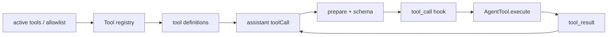

# Coding Agent 工具系统

## Definition-first registry

Pi 的工具先有 definition，再有执行对象。`AgentSession` 可以根据 active tool names、allowlist、denylist 和 extensions 构建当前 registry；system prompt 的工具描述也应和真正可执行的工具一致，不能让模型看到一个不存在的工具。

## 运行链

`core/tools/index.ts` 的 `createTool` 和 `createToolDefinition` 是集中入口；`AgentSession._installAgentToolHooks` 将 Extension 的 `tool_call` 和 `tool_result` 接在 Loop 的 before/after hook 上。

## 扩展能做什么

Extension 可以添加/替换工具、修改结果、提供渲染和事件处理；它不能绕过宿主的安全策略。一个 Tool 结果可标记 `addedToolNames`，但“模型看到了说明”仍不等于“权限已授予”。

## 实验

先设置 active tools 只含 `read`、`grep`，确认 write/bash 不在 definitions；再通过 Extension 添加一个只读工具，断言 prompt、registry 和执行都同步变化。
