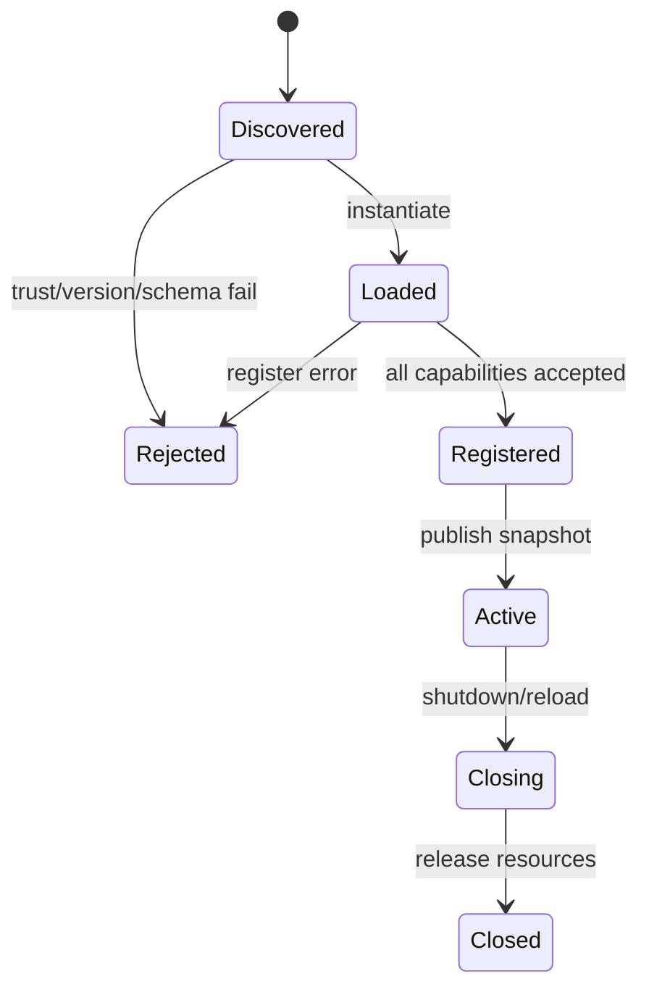

# Go 与 Java 的插件设计

## Go：显式注册

```go
type Plugin interface {
    Name() string
    Register(*Registry) error
    Close() error
}

manager.Load(WeatherPlugin{}, registry)
```

宿主控制注册顺序、冲突和权限；factory 可以延迟创建资源，callback/channel 传事件。不要把未经审查的 `.so` 当作默认插件格式。

## Java：interface + ServiceLoader

```java
public interface AgentPlugin extends AutoCloseable {
    String name();
    void register(ToolRegistry registry);
    @Override default void close() { }
}

ToolRegistry registry = new ToolRegistry();
ServiceLoader.load(AgentPlugin.class)
    .forEach(plugin -> plugin.register(registry));
```

`META-INF/services/...` 声明实现类；ClassLoader 能提供隔离边界，但不自动提供安全沙箱。若需要真正隔离，使用独立进程和受限协议。

## 共同契约

| 生命周期 | Go | Java |
| --- | --- | --- |
| load | `Register`/factory | `ServiceLoader`/constructor |
| register Tool | map 写入 | registry `put` |
| event | callback/channel | Listener |
| cancel | `context.Context` | Future/interruption |
| failure | error 返回 | exception + policy |
| unload | `Close` | `AutoCloseable`/manager |

练习是写一个 plugin 注册 `clock` Tool，注册两次时测试冲突；让插件事件 listener 抛错，确认宿主有记录且不会静默继续执行危险操作。
## 教材级重写

### 学习目标

本页把同一个插件需求分别落到 Go 和 Java：注册 `clock` Tool、拒绝重复名称、订阅事件、响应取消、在关闭时释放资源。你会看到语言差异如何改变发现机制，却不改变宿主必须维护的契约。

### 失败 trace

一个 Go 团队把插件注册写在 `init()` 中：测试 A 导入包后污染测试 B，第二次运行得到“already registered”。一个 Java 团队只调用 `ServiceLoader.load`，却没有检查 provider class 的版本和异常；某个坏插件抛异常后，整个应用启动失败。解决方案分别是显式 registry 和有策略的 manager，而不是隐藏全局状态。

### 共同接口

```text
load(candidate) -> plugin instance
register(registry) -> capability records
active snapshot -> Agent Loop definitions
invoke -> hook/event/Tool result
close -> resource release
```

`PluginContext` 应只暴露 capability，例如 `readWorkspace` 或 `emitEvent`，不要直接暴露 root filesystem、完整环境变量和任意 HTTP client。宿主保存 plugin name、version、source、permissions 和 registration ids，便于冲突诊断与恢复。

### Go 实现

```go
type Plugin interface {
    Name() string
    Register(*Registry) error
    Close() error
}

type ClockPlugin struct{}

func (ClockPlugin) Name() string { return "clock" }
func (ClockPlugin) Register(r *Registry) error {
    return r.Register(ClockTool{})
}
func (ClockPlugin) Close() error { return nil }
```

输入是宿主创建的 registry，输出是注册成功或 `error`；registry 状态从 absent 变成 active，失败时不得把半成品加入 definitions。显式调用比 Go 原生 `plugin` 更容易测试，也不依赖平台 ABI。

### Java 实现

```java
public interface AgentPlugin extends AutoCloseable {
    String name();
    void register(ToolRegistry registry);
    @Override default void close() { }
}

PluginManager pluginManager = new PluginManager();
ToolRegistry registry = new ToolRegistry();
ServiceLoader.load(AgentPlugin.class)
    .forEach(plugin -> pluginManager.load(plugin, registry));
```

`META-INF/services/learning.agent.AgentPlugin` 是 discovery 输入；`PluginManager` 应捕获构造和注册异常，按策略继续或 fail-fast。`ServiceLoader` 只负责找到 class，不提供隔离；ClassLoader 也不是自动 sandbox。

### 对照表

| 主题 | Go | Java | 教学判断 |
| --- | --- | --- | --- |
| Discovery | 显式 `Load`/factory | `ServiceLoader`/SPI | 显式更易调试，SPI 更适合 classpath |
| Registry | map + mutex | typed registry | 两者都要拒绝冲突 |
| Event | callback/channel | Listener/EventSink | 事件不应偷偷改状态 |
| Cancel | `context.Context` | token + interruption | Tool 必须主动检查 |
| Error | 返回 `error` | exception + policy | 记录 source 和 capability |
| Unload | `Close` | `AutoCloseable` | close 需要幂等 |

### 生命周期与权限



注册之前校验 version、name、schema 和 permission；执行之前再次做用户/项目策略检查。插件可以声明需要网络，但宿主不应把“声明”当成批准。

### 可执行实验

**目标**：让同一组断言在 Go 和 Java 中都成立。

**准备**：Go `plugin.go`、Java `PluginManager`、`ScriptedModel` 和临时 workspace。

**步骤**：1. 注册 `clock`。2. 重复注册并断言冲突。3. 让 Tool handler 取消，断言没有假成功结果。4. 触发 event listener 异常，确认主循环有诊断。5. 关闭 manager，断言插件按逆序各调用一次 `Close`；再试第二次关闭，记录当前示例会再次调用 `Close`，说明幂等关闭仍需由 manager 或插件补上。6. 给插件移除 network capability，验证策略在 Tool executor 前拒绝。

**观察点**：Go 错误在调用点返回，Java 错误可能从 `ServiceLoader` 或 Future 边界出现；测试应检查最终 registry snapshot，而不是只检查日志。

**预期结果**：语言只是实现手段，插件边界仍然是 capability、registry、lifecycle 和 failure policy。

**思考题**：什么时候必须改为独立 MCP server/进程？当插件需要第三方依赖、长期运行连接或不可信代码时，进程边界带来哪些通信和恢复成本？

### 小结

Go 选择显式注册并不是能力不足，而是让依赖可见；Java 选择 SPI 并不是安全隔离，而是 classpath discovery。两种实现都要把 Tool definition、权限、事件和关闭行为纳入测试。
### 代码审查清单

审查插件实现时依次确认：构造函数没有隐式外部连接，register 失败不会留下半注册能力，Tool schema 与 execute 参数一致，事件 listener 不拥有修改事实的权限，cancel 能传到长任务，close 能释放连接。测试要同时覆盖首次 load、重复 load、异常 load、reload 和 shutdown。

**结果解释**：如果 Go 测试只看 `error == nil`，还不足以证明 registry 正确；如果 Java 测试只看 `ServiceLoader` 找到 class，还不足以证明 plugin 已进入 active snapshot。最终断言应读取 registry definitions 和一次真实 Tool Loop 请求。
### 复盘问题

如果插件需要长期 socket，谁拥有重连和关闭？如果两个插件注册同名 Tool，哪个 registry 规则决定结果？如果插件已产生外部副作用后 unload，如何恢复？把答案写入 PluginContext 和 manager 契约，而不是藏在实现约定里。

### 前置知识

先熟悉 HTTP/JSON、Agent Loop、Tool Result 与基本的 Java/Go 接口；不需要先安装生产框架。
