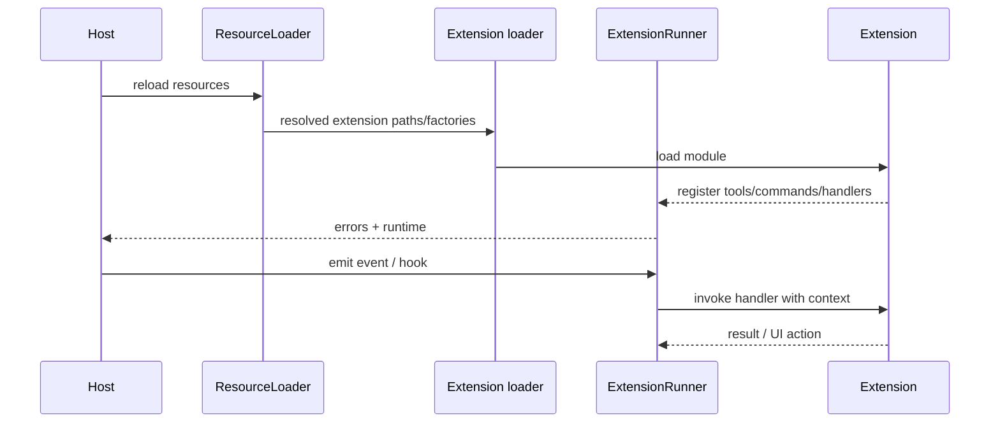
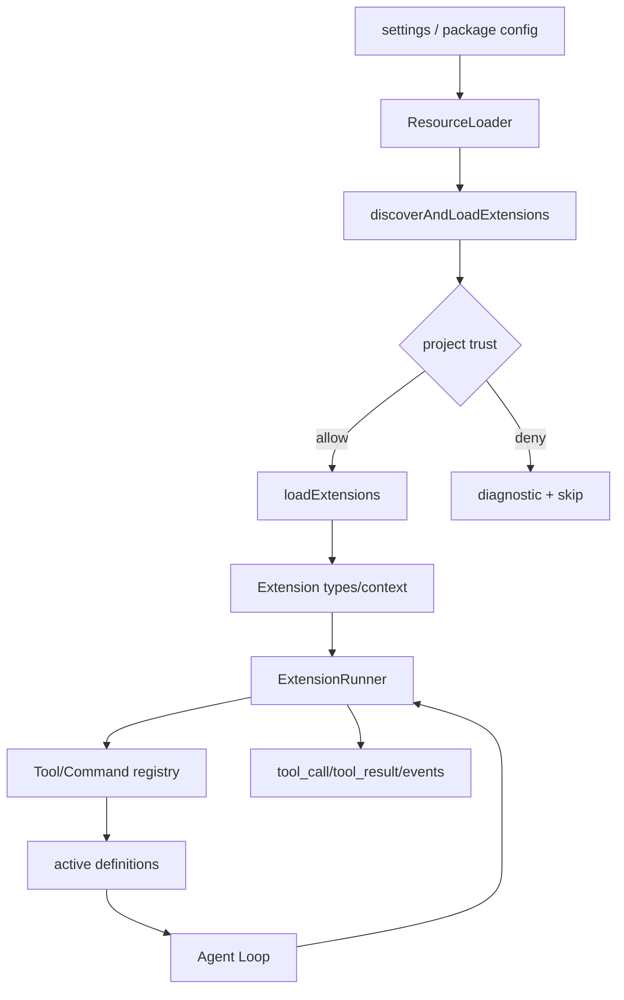

# Pi Extensions 源码导读

**源码**：`packages/coding-agent/src/core/extensions/loader.ts`、`runner.ts`、`types.ts`、`wrapper.ts`；**examples**：`packages/coding-agent/examples/extensions/`；**commit**：`853a80d26c90a14c1886f0ebb8ffaae133ca2185`。

## 发现和加载

`ResourceLoader`/package manager 解析扩展路径，`discoverAndLoadExtensions`、`loadExtensions` 和缓存函数负责加载；`createExtensionRuntime` 提供运行时上下文。Node/TypeScript 文件在宿主进程中通过 loader 执行，具体 trust、scope 和错误信息必须结合源码与 `docs/extensions.md` 查看。



## 能力

当前 Extension API 可涉及 Tool、Command、Event、Tool render、UI widget、prompt/context、session lifecycle、compaction 和 provider 行为。`ExtensionRunner` 统一 handler 调用与错误通知；`AgentSession` 在 `_installAgentToolHooks` 把 `tool_call`/`tool_result` 接入低层 Agent。

## 与 Skill/MCP 的边界

Skill 是文件资源和渐进加载的指令；Extension 是宿主内代码扩展；MCP 是跨进程/网络协议。一个 Extension 可以实现 MCP client，但三者的 trust、生命周期和故障面不同。

## 安全

项目本地扩展应受 project trust 控制；未审核的扩展可读取环境变量、文件并执行代码。阅读 `docs/extensions.md` 的加载范围、examples 的最小 API 和 `core/trust-manager.ts`，不要只看一个 hello 示例就认为隔离存在。
## 教材级重写

### 这页解决的具体问题

你要给 Pi 增加一个 `/hello` Command、一个 `weather` Tool，并在 Tool 调用前后显示诊断信息。若直接修改 `agent-loop.ts`，你会把产品能力和核心控制流绑在一起；若使用 Extension，核心只处理稳定的 hook 和 registry 契约。

失败 trace 很典型：扩展文件被发现，但默认导出形状不对；loader 捕获异常后继续启动，UI 没提示；模型仍看到旧 Tool Definition。排查时要分别检查“发现了什么、加载成了什么、注册了什么、active snapshot 是什么”，不要只看最后一个 Tool error。

### 入口、输入与输出

研究 commit：`853a80d26c90a14c1886f0ebb8ffaae133ca2185`。

| 层 | 关键文件/symbol | 输入 | 输出 |
| --- | --- | --- | --- |
| 资源解析 | `core/resource-loader.ts`：`ResourceLoader` | settings、项目资源、扩展路径 | resolved resources 与 diagnostics |
| 加载 | `core/extensions/loader.ts`：`discoverAndLoadExtensions`、`loadExtensions` | extension path/factory | loaded extensions、errors |
| 类型 | `core/extensions/types.ts`：`Extension`、`ExtensionContext`、`defineTool` | handler、metadata | 宿主可注册对象 |
| 调度 | `core/extensions/runner.ts`：`ExtensionRunner` | event、tool call/result | handler 结果、错误事件 |
| 组合 | `core/agent-session.ts`：`_installAgentToolHooks` | Agent event | before/after Tool 行为 |

**源码事实**：Extension loader 负责执行并收集扩展，runner 负责调用 handler，AgentSession 把这些 handler 接入运行时。**不要推测**：源码中的 loader 并不意味着任意扩展都在独立沙箱中运行；进程内代码仍可访问宿主能够访问的资源。

### Extension 模块的最小形状

具体 API 必须以当前 `types.ts` 为准；下面用伪代码说明信息流，标识符保持概念含义：

```ts
export default function setup(pi: ExtensionContext) {
  pi.registerTool(defineTool({
    name: "weather",
    description: "读取经过授权的天气数据",
    parameters: weatherSchema,
    execute: async (ctx, call) => fetchWeather(ctx, call)
  }));

  pi.registerCommand("hello", async (ctx) => {
    ctx.ui.notify("hello", "info");
  });

  pi.on("tool_call", async (event) => {
    return { ...event, metadata: { source: "weather" } };
  });
}
```

这个片段的输入是宿主提供的 `ExtensionContext` 和 Tool Call；输出不是“模型已经执行”，而是注册记录、hook 变换或 UI 操作。`execute` 的文件、网络和进程副作用必须继续经过宿主 Permission/Sandbox；Extension API 只是接入点，不是授权令牌。

### 真实加载链



`ResourceLoader` 解决来源与优先级，loader 解决模块加载，runner 解决执行时的 handler 调用；不要把三者压缩成“Extension manager”。当 diagnostics 被返回时，UI/日志应显示来源和错误，避免用户以为扩展已生效。

### Tool、Command、Event 和 UI 的差异

Tool 进入模型可见的 definitions，并在 Agent Loop 中产生 Tool Result。Command 通常由用户或 RPC 调用，不应伪装成模型 Tool。Event 是已发生事实的通知；`tool_call` hook 是执行前可拒绝或修改的拦截点。UI widget/render 只改变呈现，不应偷偷改变 Session 状态。

| 能力 | 谁触发 | 能否改输入 | 是否属于模型 context |
| --- | --- | --- | --- |
| Tool | 模型/Runtime | 参数经 schema 与 hook | definition/result 会进入 |
| Command | 用户/CLI/RPC | 由命令处理器决定 | 通常不直接进入 |
| Event | Runtime | 不应改变事实 | 不直接进入 |
| Hook | Runtime 边界 | 可以返回变换/拒绝 | 结果可能影响后续请求 |
| UI | 用户界面 | 可请求控制动作 | 不自动进入 |

### ExtensionRunner 的错误边界

推荐把 handler 分为可观察和 fail-closed 两类。普通 event handler 抛错时，runner 记录 `handler_error` 并继续；`before_tool` 等安全拦截点抛错时阻止执行，并返回可解释的 error Tool Result。handler 超时、取消和重复回调也要有测试。

```text
before_tool(call)
  -> validate effective args
  -> handler accepts or rejects
  -> execute Tool
  -> after_tool(result)
  -> emit tool_result
```

如果 `after_tool` 修改文本，原始 Tool 副作用不会消失；这就是为什么 telemetry 和审计必须记录安全的 hash/长度，而不能把“修改后的显示文本”当成执行事实。

### 与 Skill、MCP 的边界

Skill 是 `SKILL.md` 等资源，模型按需读取；Extension 是宿主进程内代码；MCP 是跨进程/网络 JSON-RPC 协议。Extension 可以实现 MCP Client，但这只是组合方式，不表示 Pi Core 默认内建 MCP。判断 MCP 是否可用，应检查当前 provider/agent core 的真实入口，而不是看社区宣传。

### Go 与 Java 实验对照

Go 示例使用 `PluginManager.Load` 显式注册和 `BeforeToolHook`/`AfterToolHook` callback；Java 示例使用 `ServiceLoader`、`PluginManager` 和 `EventSink`。两者都用 fake model 复现：第一轮返回 Tool Call，第二轮读取 Tool Result。测试必须断言 registry、请求 definitions 和执行次数三者一致。

**实验目标**：在 Pi Extension example 中加入只读 Tool，并在 Go/Java 示例中实现等价插件。

**准备**：打开 `packages/coding-agent/examples/extensions/`、`core/extensions/runner.ts`，再进入两个 `examples` 目录；不要使用真实 key。

**步骤**：

1. 记录 loader 返回的 extension path 和 diagnostics。
2. 让 Tool schema 缺一个 required 字段，观察注册阶段还是执行阶段报错。
3. 让 `before_tool` 拒绝一次调用，断言 Tool executor 没有运行。
4. 让 event listener 抛错，断言主 loop 仍能收到结构化诊断。
5. 在 UI command 与模型 Tool 各执行一次，比较触发者和事件路径。
6. 关闭扩展后重新构造 active registry，确认 definitions 移除。

**观察点**：只要模型请求里的 `tools` 还包含旧 definition，问题就不在 Tool 本身，而在 registry snapshot 或 session reload；只看到 UI 成功不代表 Tool 已成功。

**思考题**：如果一个 Extension 通过动态 import 读取环境变量，project trust 应在 loader 前还是后？为什么把 untrusted Extension 放进 worker thread 仍然不是安全 sandbox？

### 小结

Pi Extension 的价值在于把宿主内扩展接到明确的 loader、runner、types 和 AgentSession hook 上。它可以扩展 Tool、Command、Event 和 UI，但不绕过权限、不替代 Skill/MCP，也不自动拥有崩溃恢复。调试时按“发现 → 加载 → 注册 → definition → hook → execute → result”逐层观察。
### 逐步调试清单

遇到 Extension 不生效时，不要先修改 Tool executor，按以下顺序记录证据：

1. 配置是否让 `ResourceLoader` 看到了候选路径。
2. `discoverAndLoadExtensions` 返回的 path、diagnostics 和 cache key 是什么。
3. loader 是否成功执行模块，并得到预期导出形状。
4. `ExtensionContext` 中是否包含当前 session、UI 和 capability。
5. registry 是否新增了 definition，名称是否冲突。
6. Agent 发出的下一次 request 是否真的包含 definition。
7. `ExtensionRunner` 是否收到了 `tool_call`/`tool_result`。
8. handler 抛错时是继续、拒绝还是让进程退出。

每一步都写一个断言或结构化日志；只看最终 UI 会把加载失败和执行失败混在一起。

### 小练习

把一个只读 `weather` Tool 改成两个版本：本地 fake 版本和需要网络的版本。让 loader 只在配置明确开启网络 capability 时注册第二个版本。测试未开启时 definition 不出现，开启后 schema 和权限都出现；再让网络请求超时，确认 runner 产生错误事件而不是返回旧缓存。

### 学习目标

读完本页后，你应能用源码、一个最小数据流和一次失败测试解释本主题，而不是只复述术语。

### 前置知识

先熟悉 HTTP/JSON、Agent Loop、Tool Result 与基本的 Java/Go 接口；不需要先安装生产框架。

### 可执行实验

**目标**：把本页的边界变成一个可观察测试。

**准备**：使用临时目录、fake provider 或 `ScriptedModel`，不要使用真实凭据。

**步骤**：记录输入；运行一次成功路径；制造一个参数、取消或权限错误；检查事件、结果、状态和副作用次数。

**观察点**：不要只看最终文本，查看真正的 request、Tool Result、registry、Session 或 trace。

**预期结果**：能够指出哪一层拥有该事实，以及失败是否可重试。

**思考题**：如果输出丢失但副作用已发生，应该如何恢复？
