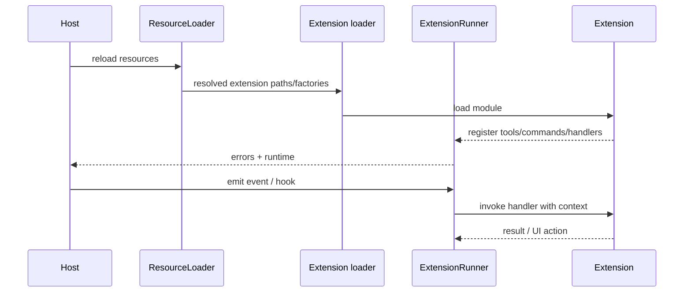

# Pi Extensions 源码导读

**源码**：`packages/coding-agent/src/core/extensions/loader.ts`、`runner.ts`、`types.ts`、`wrapper.ts`；**examples**：`packages/coding-agent/examples/extensions/`；**commit**：`853a80d26c90a14c1886f0ebb8ffaae133ca2185`。

## 发现和加载

`ResourceLoader`/package manager 解析扩展路径，`discoverAndLoadExtensions`、`loadExtensions` 和缓存函数负责加载；`createExtensionRuntime` 提供运行时上下文。Node/TypeScript 文件在宿主进程中通过 loader 执行，具体 trust、scope 和错误信息必须结合源码与 `docs/extensions.md` 查看。

## 能力

当前 Extension API 可涉及 Tool、Command、Event、Tool render、UI widget、prompt/context、session lifecycle、compaction 和 provider 行为。`ExtensionRunner` 统一 handler 调用与错误通知；`AgentSession` 在 `_installAgentToolHooks` 把 `tool_call`/`tool_result` 接入低层 Agent。

## 与 Skill/MCP 的边界

Skill 是文件资源和渐进加载的指令；Extension 是宿主内代码扩展；MCP 是跨进程/网络协议。一个 Extension 可以实现 MCP client，但三者的 trust、生命周期和故障面不同。

## 安全

项目本地扩展应受 project trust 控制；未审核的扩展可读取环境变量、文件并执行代码。阅读 `docs/extensions.md` 的加载范围、examples 的最小 API 和 `core/trust-manager.ts`，不要只看一个 hello 示例就认为隔离存在。
