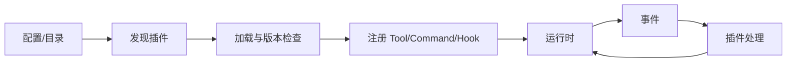
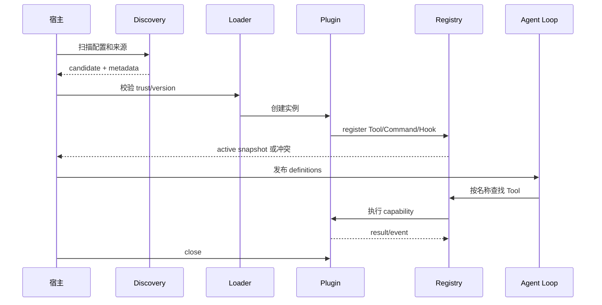

# 插件系统基础

## 典型组成

`Plugin Interface -> Discovery -> Loader -> Registry -> Lifecycle -> Hook/Event -> Context/Capability -> Isolation/Version`。插件不是一段神奇的动态代码：宿主必须决定它在哪里发现、何时加载、能访问什么、失败如何隔离。

Java 类比：`ServiceLoader`/SPI、Spring extension point、Listener、Interceptor、Filter、ApplicationEvent、ClassLoader。Go 类比：interface、显式 registry、factory、callback、event bus。Go 原生 `plugin` 只适合有限平台和部署场景，教学 Harness 采用显式注册而不是强行动态加载。



## Hook 和 Event

Event 告诉插件“发生了什么”；Hook 在宿主允许的位置接收输入并可返回修改。两者都要定义错误策略、超时、重入和取消语义。插件的副作用仍需幂等，不能以“插件”这个名字绕过权限。

## 设计问题

- 插件失败是阻止当前 Tool、记录 warning，还是让进程退出？
- 插件能否注册同名 Tool？优先级和冲突如何决定？
- 插件上下文是否能访问完整 Session 和凭据？默认应最小化。
- 版本不兼容时能否安全跳过？
## 教材级重写

### 学习目标

完成本页后，你应该能画出一个插件从发现到卸载的完整生命周期，并能回答三个问题：插件代码何时执行、插件注册的能力由谁拥有、插件失败时宿主如何保持可预测。你还会实现一个最小 `clock` Tool，而不是停留在“插件可以扩展系统”的口号。

### 前置知识与现实问题

假设产品经理要求“不修改 Agent 核心，就增加一个读取工单的工具”。最直接的做法是在核心文件里加一个 `if name == ...`。短期能工作，长期会出现注册逻辑散落、测试互相污染、升级时冲突难以发现的问题。插件系统把这段变化放到宿主定义的边界之外。

一个常见失败 trace 是：宿主先把插件标记为 loaded，插件随后注册 Tool 时抛异常；界面仍然显示该 Tool 可用，模型下一轮调用后却得到 unknown tool。正确顺序是先加载、校验能力、完成注册，再发布“可用”状态；任何一步失败都要回滚或明确跳过。

### 通俗解释：插件不是魔法

插件可以看成一组遵守宿主契约的对象。宿主提供入口、上下文和能力，插件返回 Tool、Command、Hook 或 Event handler。宿主仍拥有调度权。`Plugin Interface` 解决“能否调用”，`Discovery` 解决“去哪里找”，`Loader` 解决“如何创建”，`Registry` 解决“如何被运行时查到”，`Lifecycle` 解决“何时开始和结束”。

严格地说，插件系统是一个受版本和能力约束的扩展协议：

```text
candidate source
  -> discover metadata
  -> verify trust/version
  -> load module or instantiate class
  -> create PluginContext
  -> register capabilities
  -> publish active snapshot
  -> receive hooks/events
  -> close and release resources
```

这条链中只有 `register` 成功的能力才应该进入 Tool Definition。模型看到的工具列表必须来自 registry 的 active snapshot，不能来自插件目录的文件名。

### 契约拆解

| 部件 | 它解决的问题 | 最小实现 | 失败时的要求 |
| --- | --- | --- | --- |
| Interface | 宿主如何调用插件 | `Name`、`Register`、`Close` | 缺方法在加载时失败 |
| Discovery | 宿主发现候选插件 | 目录、配置、SPI | 记录来源和重复项 |
| Loader | 把候选变成实例 | factory、`ServiceLoader`、模块加载 | 不执行半加载对象 |
| Registry | 查找能力 | name → Tool/handler | 冲突必须显式处理 |
| Lifecycle | 管理资源 | load/start/close | close 要幂等 |
| Hook/Event | 接入运行过程 | awaited hook、被动 event | 定义超时和异常策略 |
| Capability | 限制可访问范围 | read-only、network、UI | 默认最小权限 |
| Isolation | 限制故障和权限 | 进程、容器、策略 | 进程内插件不等于沙箱 |

### 注册数据长什么样

下面是宿主内部的教学结构。它不是 Pi 的 TypeScript API，而是帮助我们辨认“元数据”和“可执行对象”的区别。

```json
{
  "plugin": "ticket-reader",
  "version": "1.2.0",
  "source": "project",
  "capabilities": ["tool:ticket_search"],
  "permissions": ["network:ticket.example.com"],
  "status": "active"
}
```

`source` 和 `permissions` 是宿主事实，不能让插件自己声明后就自动获得。`status` 只有在 registry 完成冲突、schema 和权限校验后才变成 `active`。如果插件只注册了一个失败的 Tool，宿主应该保留插件错误诊断，而不是把整个 registry 静默清空。

### 生命周期图



图中最重要的边界是：Agent Loop 只依赖 registry，不依赖某一个插件类。关闭时应先停止新请求，再等待进行中的 hook/tool，最后释放插件资源；否则会出现 registry 已删除而旧调用仍访问已关闭连接的竞态。

### Pi 源码证据

研究基线是 `853a80d26c90a14c1886f0ebb8ffaae133ca2185`。重点打开以下文件和符号：

- `packages/coding-agent/src/core/extensions/loader.ts`：`loadExtensions`、`loadExtensionsCached`、`discoverAndLoadExtensions`，关注发现、解析和缓存的输入输出。
- `packages/coding-agent/src/core/extensions/runner.ts`：`ExtensionRunner`、`emitToolCall`、`emitToolResult`，关注 handler 调用与错误通知。
- `packages/coding-agent/src/core/extensions/types.ts`：`Extension`、`ExtensionContext`、`ToolDefinition`、`defineTool`，关注宿主暴露的类型边界。
- `packages/coding-agent/src/core/agent-session.ts`：`_installAgentToolHooks`，关注低层 Tool Call 与 Extension hook 的连接。

**源码事实**：Pi 在 coding-agent 中有 Extension loader/runner/types；Extension 可以参与 Tool、Command、Event、UI 和生命周期。**合理推断**：把 runner 作为统一错误边界，可以避免每个调用方各自处理插件异常。**设计建议**：不要把该推断写成“Pi 保证了进程隔离”，进程内 Extension 仍然拥有宿主进程权限。

### Java 与 Go 对照

Java 的 `ServiceLoader` 适合发现 classpath 中声明的实现，`AgentPlugin` 接口适合做版本稳定的最小入口；`PluginManager` 应在注册成功后记录实例，并在 `close` 时逆序释放。Go 更适合显式 `PluginManager.Load(plugin, registry)` 或 factory 注入，依赖关系由构造函数可见，不要为了模拟 Node 动态 import 而默认使用原生 `plugin` 包。

```java
interface AgentPlugin extends AutoCloseable {
    String name();
    void register(ToolRegistry registry);
    @Override default void close() { }
}
```

```go
type Plugin interface {
    Name() string
    Register(*Registry) error
    Close() error
}
```

Java 接口方法抛异常时由 manager 决定继续还是失败；Go 的 `error` 更早暴露注册失败。两者都需要把 capability 放进 context，而不是把整个 `Session` 或环境变量直接交给插件。

### 可执行实验：实现一个 clock 插件

**目标**：验证重复注册、事件异常和关闭顺序。

**准备**：使用 Go `examples/go-agent/internal/agent/plugin.go` 或 Java `AgentPlugin`/`PluginManager`，使用 `ScriptedModel`，不调用真实 Provider。

**步骤**：

1. 注册一个名为 `clock` 的 Tool，schema 只接受可选 `timezone`。
2. 在 Tool 执行前记录 `tool_start`，执行后记录 `tool_end`。
3. 第二次注册同名 Tool，断言 registry 返回冲突而不是覆盖。
4. 让 `after_tool` handler 返回错误，观察错误是否变成结构化 Tool Result。
5. 关闭 manager，断言已加载插件按逆序各调用一次 `close`；注意当前教学 manager 没有 `closed` 状态，不会自动阻止后续 `load` 或 registry 调用，宿主必须额外加闸门。
6. 将插件注入的 `PermissionPolicy` 改成只读，验证 Tool 层不能写文件或读取 API key。

**观察点**：模型只能看到 active registry 的 definition；插件目录中存在文件不代表能力已注册；事件观察执行，hook 才能影响执行。

**预期结果**：每次副作用前都有清楚的 owner，插件失败不会偷偷改变模型可见的工具列表。

**思考题**：如果插件已经发出网络请求但 `after_tool` 失败，宿主能否回滚外部副作用？为什么需要 idempotency key 或独立进程？如果两个插件声明同一 Tool 名称，按加载顺序覆盖是否足够可审计？

### 小结

插件系统的核心不是“动态加载”，而是稳定契约、能力注册、生命周期和失败边界。Pi 的 Extension 是宿主内扩展，不等于 Skill，也不等于 MCP，更不自动提供 sandbox。读源码时先找 loader、runner、types 和 AgentSession 接缝，再判断某个能力是否真的被加入 registry。
