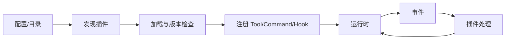

# 插件系统基础

## 典型组成

`Plugin Interface -> Discovery -> Loader -> Registry -> Lifecycle -> Hook/Event -> Context/Capability -> Isolation/Version`。插件不是一段神奇的动态代码：宿主必须决定它在哪里发现、何时加载、能访问什么、失败如何隔离。

Java 类比：`ServiceLoader`/SPI、Spring extension point、Listener、Interceptor、Filter、ApplicationEvent、ClassLoader。Go 类比：interface、显式 registry、factory、callback、event bus。Go 原生 `plugin` 只适合有限平台和部署场景，教学 Harness 采用显式注册而不是强行动态加载。

## Hook 和 Event

Event 告诉插件“发生了什么”；Hook 在宿主允许的位置接收输入并可返回修改。两者都要定义错误策略、超时、重入和取消语义。插件的副作用仍需幂等，不能以“插件”这个名字绕过权限。

## 设计问题

- 插件失败是阻止当前 Tool、记录 warning，还是让进程退出？
- 插件能否注册同名 Tool？优先级和冲突如何决定？
- 插件上下文是否能访问完整 Session 和凭据？默认应最小化。
- 版本不兼容时能否安全跳过？
