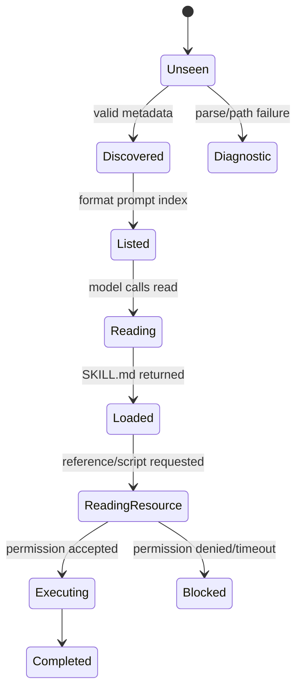

# Progressive Disclosure

## 三层加载

```text
Level 1: name + description + path     -> 模型发现能力
Level 2: SKILL.md                      -> 模型决定采用的方法
Level 3: references/scripts/assets     -> 完成当前子任务
```

这不是“把内容藏起来”。目标是让低概率资源不占据每次请求的 Context，同时保留按需读取的路径。

## 失败情况

metadata 无效、name 与目录不一致、重复 Skill、缺 description、frontmatter YAML 错误和路径不存在都应成为诊断；不能静默把一个错误 Skill 当作正常能力。加载失败也不能让模型以为它拥有该能力。

## 实验

建立 3 个 Skill：一个只含 metadata，一个需要 reference，一个带危险脚本。打印最终 system prompt，确认只出现摘要；让模型/测试显式 read reference；最后用 Permission 拒绝脚本。对比全量注入和按需加载的 token 估算。
## 教材级重写

### 先用一个数字建立直觉

如果每个 Skill 全文 2,000 token，50 个 Skill 会带来约 100,000 token 的启动成本。模型每轮都重读这些内容，既浪费预算，也让真正的用户约束变得不显眼。Progressive Disclosure 的做法是先给目录，再按需打开文件。

### 三层契约

| 层 | 内容 | 进入时机 | 测试断言 |
| --- | --- | --- | --- |
| L0 索引 | name、description、path | 构建 system prompt | 模型能判断是否相关 |
| L1 说明 | `SKILL.md` 正文 | 模型决定使用后 | 方法与约束进入 context |
| L2 资源 | references、scripts、assets | 子任务确实需要 | 来源、权限、输出受控 |

这三层不是隐藏内容的技巧，而是把“可发现性”和“可执行性”分开。L0 无法替代 L1，L1 也无法越过 Tool permission 直接执行 L2。

### 失败 trace：错误的全量加载

```text
startup
 -> read all SKILL.md
 -> concatenate 100k tokens
 -> context clamp
 -> user instruction/tool definition dropped
 -> model selects wrong tool
```

另一条失败路径是只把 `name` 放进 prompt，却不提供 `path`：模型知道有“review”，却不知道应调用哪个 read 参数。第三条路径是 path 未 canonicalize，`references/../secrets` 绕过目录检查。

### 伪代码与状态

```text
skills = discover(rootDirs)
valid = []
for candidate in skills:
    metadata = parseFrontmatter(candidate/SKILL.md)
    if validName(metadata) and validPath(candidate):
        valid.append({name, description, path, source})
        emit(skill_discovered)
    else:
        emit(skill_diagnostic)
prompt += formatIndex(valid)
```

输入是目录和配置；输出是 metadata snapshot；状态变化是 valid/diagnostic 列表，而不是模型已经执行 Skill。读取正文时才生成 Tool Result，并带 source path 与截断信息。

### Pi 研究路线

固定 commit：`853a80d26c90a14c1886f0ebb8ffaae133ca2185`。

1. 在 `packages/coding-agent/src/core/skills.ts` 阅读 `loadSkillsFromDir`，记录它如何处理 frontmatter、重复和路径。
2. 阅读 `formatSkillsForPrompt`，确认 prompt 实际包含哪些字段，不能用想象中的格式替代。
3. 阅读 `resource-loader.ts` 的 `ResourceLoader`，确认项目、用户和 Extension 来源如何合并。
4. 阅读 `system-prompt.ts` 的 `buildSystemPrompt`，确认 metadata 与 tools 的相对位置。
5. 对照 `packages/coding-agent/docs/skills.md` 的 `/skill:name` 行为，记录文档与实现差异。

**源码事实**与**设计推断**要分开：源码显示什么字段是事实；“这样做是为了节省 KV cache”若未被作者说明，只能写成合理推断。

### Discovery 与使用的状态机



状态图提醒我们：`Listed` 不等于 `Loaded`，`Loaded` 不等于 `Executing`。日志和 telemetry 应区分三个时刻，否则无法回答“模型是否真的读过这个 Skill”。

### 什么时候应该自动注入

自动注入适合每次请求都必须满足的规则，例如项目安全指令；按需 Skill 适合低频领域方法。折中办法是 L0 注入索引，加一个简短的“何时使用”字段；模型选择后通过 read 加载 L1。若任务成功率因模型忘记调用 read 而下降，可由 Harness 在特定 intent 下预读，而不是把所有 Skill 全量加入。

### 可执行实验

**目标**：测量三种加载策略的成本与正确性。

**准备**：创建 10 个 200 token Skill，其中一个与任务相关；准备 ScriptedModel 和 token estimate 函数。

**步骤**：

1. 方案 A 全文注入，记录 prompt token。
2. 方案 B 只注入 L0，记录首次请求 token。
3. 方案 C 注入 L0，并让模型调用 read，记录总 token。
4. 在相关 Skill 中加入一条必须遵守的约束，比较三种方案的遵守率。
5. 加入非法 path 和危险脚本，确认它们不会因为策略不同而越权。

**观察点**：成本要计算所有轮次，不只看首轮；正确性要看 Tool 参数和最终事实，不只看模型文字。

**预期结果**：相关任务中 B/C 的成本更低，C 比 B 多一次读取但方法更完整；A 的上下文噪声最高。

**思考题**：如果 Skill 说明依赖当前 Git branch，应该在 L0 还是 L1 计算？如何避免同一个 Skill 被模型重复 read？

### Go/Java 对照

Go 可以把 `[]SkillMetadata` 直接格式化成 prompt，并用 `context.Context` 传递读取取消；Java 使用 `List<SkillMetadata>`、`Path.normalize()` 和 `JsonNode`/文本读取。两者都要对目录排序，让测试稳定；不要把 map 迭代顺序当成模型行为。

### 小结

Progressive Disclosure 是一个可测的资源加载协议：索引、正文、资源分别有边界、成本和权限。先验证 state transition，再讨论模型效果；否则“节省 token”只是没有数据的口号。
### 迁移检查

把现有全量 prompt 改为分层加载时，先保留一份 baseline：首轮 token、成功率、Tool 次数和错误率。逐步启用 L0/L1/L2，确认遗漏 Skill 不是因为 description 太短、path 不可读或模型没有 read 能力。迁移完成后，为 reload、重复读取、版本更新和权限拒绝保留回归测试。

**结论**：分层加载的优化目标是控制上下文，不是减少验证；每一层仍需来源、版本和权限证据。

### 学习目标

读完本页后，你应能用源码、一个最小数据流和一次失败测试解释本主题，而不是只复述术语。

### 前置知识

先熟悉 HTTP/JSON、Agent Loop、Tool Result 与基本的 Java/Go 接口；不需要先安装生产框架。
