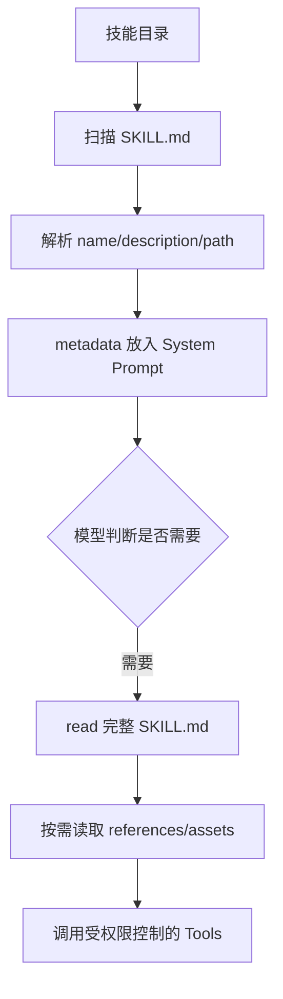

# Skills 与 `SKILL.md`

## Skill 是资源，不是函数

一个 Skill 通常包含 frontmatter 的 `name`、`description`、路径，以及 `SKILL.md`、scripts、references、assets。模型先看到简短 metadata，需要时通过 `read` 读取完整说明；执行脚本仍需 Tool 和权限。

## Pi 的源码路径

`packages/coding-agent/src/core/skills.ts` 的 `loadSkillsFromDir` 扫描目录、解析 frontmatter、检查 name/description/路径冲突；`formatSkillsForPrompt` 只把可发现信息格式化到 prompt；`ResourceLoader` 负责把内置、用户、项目和 Extension 提供的路径合并并报告 diagnostics。具体命令和优先级以 `packages/coding-agent/docs/skills.md` 为准。

## 为什么不全部注入

50 个 Skill × 每个 2000 token = 约 100,000 token，还会占用每一轮的缓存和注意力；只放每个 30 token 的 metadata 大约 1,500 token，模型再按需加载。数字是示例估算，不是 Pi 的固定成本。

## Skill 与 Extension

Skill 不能自行获得运行时权限；Extension 能注册代码、事件和 UI。Skill 与 prompt template 也不同：template 是用户调用的输入展开，Skill 是可被发现的能力说明。

## 安全检查

Skill 文件可能指示读取凭据、下载脚本或执行危险命令。`name`/description 不能替代审核；执行前仍走 Tool schema、Permission 和 sandbox。
