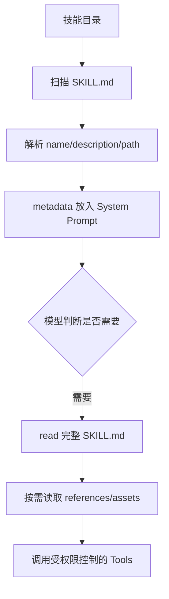
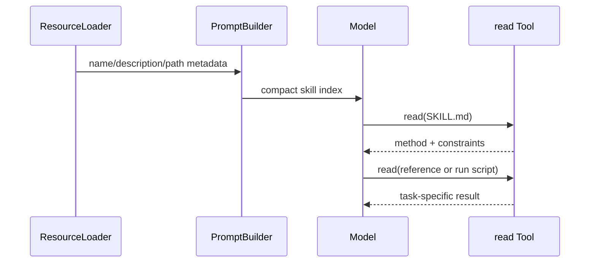

# Skills 与 `SKILL.md`

## Skill 是资源，不是函数

一个 Skill 通常包含 frontmatter 的 `name`、`description`、路径，以及 `SKILL.md`、scripts、references、assets。模型先看到简短 metadata，需要时通过 `read` 读取完整说明；执行脚本仍需 Tool 和权限。

## Pi 的源码路径

`packages/coding-agent/src/core/skills.ts` 的 `loadSkillsFromDir` 扫描目录、解析 frontmatter、检查 name/description/路径冲突；`formatSkillsForPrompt` 只把可发现信息格式化到 prompt；`ResourceLoader` 负责把内置、用户、项目和 Extension 提供的路径合并并报告 diagnostics。具体命令和优先级以 `packages/coding-agent/docs/skills.md` 为准。



## 为什么不全部注入

50 个 Skill × 每个 2000 token = 约 100,000 token，还会占用每一轮的缓存和注意力；只放每个 30 token 的 metadata 大约 1,500 token，模型再按需加载。数字是示例估算，不是 Pi 的固定成本。

## Skill 与 Extension

Skill 不能自行获得运行时权限；Extension 能注册代码、事件和 UI。Skill 与 prompt template 也不同：template 是用户调用的输入展开，Skill 是可被发现的能力说明。

## 安全检查

Skill 文件可能指示读取凭据、下载脚本或执行危险命令。`name`/description 不能替代审核；执行前仍走 Tool schema、Permission 和 sandbox。
## 教材级重写

### 学习目标与失败场景

Skill 解决的不是“怎样动态执行函数”，而是“怎样把一套可复用工作方法按需交给模型”。完成本页后，你应该能创建一个可发现、可读取、可审计的 `SKILL.md`，并解释为什么 metadata、正文、references 和 scripts 不应在启动时全部塞进 Context。

失败 trace：启动时把 50 个 Skill 的全文加入 system prompt，第一次请求已经接近 Context Window；于是模型回答慢、工具结果被截断。另一个失败是只校验 `name`，Skill 里的脚本却指示读取 `~/.ssh`。metadata 解决发现，不解决信任和执行权限。

### Skill 文件结构

```text
skills/review/
├── SKILL.md
├── references/checklist.md
├── scripts/run-check.sh
└── assets/example.json
```

`SKILL.md` 的 frontmatter 提供 `name`、`description` 等发现信息，正文解释方法，references 提供较少使用的细节，scripts/assets 是执行阶段资源。`path` 由宿主解析并展示给模型，但路径本身不能证明资源安全。

```markdown
---
name: review
description: Review a change for correctness and test coverage.
---

# Review

先确认变更边界，再运行针对性测试。需要数据库凭据时停止并请求人工确认。
```

输入是文件 bytes 和目录上下文；输出是 metadata 或完整资源；状态变化是 resource loader 的诊断与 active skills snapshot。frontmatter 解析失败时，该 Skill 不应静默出现在 system prompt。

### Pi 源码与调用链

研究 commit：`853a80d26c90a14c1886f0ebb8ffaae133ca2185`。

- `packages/coding-agent/src/core/skills.ts`：`loadSkillsFromDir` 扫描并解析 metadata，`formatSkillsForPrompt` 生成可发现的 prompt 片段，`loadSkills` 合并来源。
- `packages/coding-agent/src/core/resource-loader.ts`：`ResourceLoader`、`DefaultResourceLoader`、`loadProjectContextFiles` 管理内置、用户、项目和 Extension 资源。
- `packages/coding-agent/src/core/system-prompt.ts`：`buildSystemPrompt` 将工具、项目上下文和可用 Skill 组合成 system prompt。
- `packages/coding-agent/docs/skills.md`：行为和命令说明；文档与源码不一致时以当前源码为准。

**源码事实**：Skill discovery 与 prompt formatting 是独立步骤。**教学解释**：独立步骤让我们能测试“模型能发现”与“模型已读正文”不是同一件事。**安全建议**：任何 script 调用都回到 Tool permission，不能因为正文来自项目目录就跳过策略。

### Progressive disclosure 的三次请求



第一次请求携带低成本索引；第二次是模型决定使用某 Skill 后的读取；第三次才加载当前任务需要的细节。每次 Tool Result 都应被截断、脱敏并带来源，避免 Skill 通过长文本挤掉用户请求。

### Token 成本演算

假设有 50 个 Skill，每份全文 2,000 token：全量注入约 100,000 token，而且每一轮都重复发送。若只注入每个 30 token 的 `name + description + path`，索引约 1,500 token；使用率为 5% 时，只有少量请求会额外读取正文。数字是教学估算，不是 Pi 固定实现。

这不是无条件的优化：如果每个请求都需要同一安全规范，把它放入 system prompt 可能更可靠；如果 Skill 正文非常短，读取成本也可能不值得。评估应测首 token 延迟、总 token、任务成功率和误用率。

### Skill、Extension、MCP、RAG 的边界

| 能力 | 本质 | 模型何时获得内容 | 能否直接执行副作用 |
| --- | --- | --- | --- |
| Skill | 指令/资源 | discovery 后按需 read | 不能，仍需 Tool |
| Extension | 宿主内代码 | loader 后注册能力 | 可参与 Tool，但受宿主策略 |
| MCP | 协议端点 | `tools/list`/`resources` | server 执行，client 仍需授权 |
| RAG | 检索结果 | 自动注入或 search Tool | 不负责写操作 |

把 Skill 作为“工具”会造成误解：模型读取的是方法文本，真正写文件的是 `write` Tool。把 Skill 作为“记忆”也不准确：它是可版本控制资源，不是某次 Session 的事实。

### 安全与版本

宿主应检查 canonical path、frontmatter 长度、重复 name、目录逃逸和资源 hash；展示 `source` 与更新时间；执行脚本时设置 timeout、cwd、环境变量白名单和输出上限。Skill 文本可能包含提示注入，读取后仍要把其中指令当不可信输入，不能覆盖系统策略。

### 可执行实验

**目标**：观察 metadata 和正文的边界。

**准备**：在临时目录建 `safe-review`、`large-reference`、`dangerous-script` 三个 Skill；使用 Go `DiscoverSkills` 或 Java `SkillDiscovery`。

**步骤**：

1. 给三个 Skill 写合法和非法 frontmatter，各放一个重复 name。
2. 打印最终 system prompt，确认只出现 name、description、path。
3. 用 `ScriptedModel` 让第一轮调用 `read`，第二轮回答，断言正文进入第二轮 Context。
4. 把 reference 改成超长文本，确认 Tool Result 有上限。
5. 让 script 请求读取 workspace 外文件，断言 PermissionPolicy 拒绝。
6. 删除 `SKILL.md` 后 reload，确认 active snapshot 移除并留下诊断。

**观察点**：发现失败和执行失败是两类错误；Skill 内容进入 Context 不代表其中命令获得权限。

**预期结果**：低概率资源不会占满每一轮 prompt，真正副作用仍被 Tool executor 记录。

**思考题**：Skill description 写得越详细越好吗？如何在召回率和 token 成本之间做评估？如果两个来源提供同名 Skill，优先级应该属于 loader 还是 model？

### 小结

Skill 是可发现、可按需读取的资源。Pi 通过 `skills.ts`、`resource-loader.ts` 和 `system-prompt.ts` 把 metadata 接入上下文；它不自动赋予权限，也不等于 Extension、MCP 或 Memory。教学实现的关键测试是“发现、读取、执行权限”三段分别可验证。
### 常见误区与修正

**误区一：Skill 就是 Tool。** Skill 提供方法文本，Tool 才执行副作用。修正方法是分别记录 `skill_loaded` 和 `tool_start`。

**误区二：path 等于权限。** path 只是定位信息；读取和执行仍要经过 canonical path、workspace policy 和 sandbox。

**误区三：description 越长越好。** description 的职责是帮助选择，具体步骤应留在正文或 reference。过长会让 L0 索引变成隐形全文注入。

**误区四：一次读取永久有效。** Skill 可能随 branch、配置或版本变化；Session 中应记录 source/version，必要时重新读取。

### 教学验收表

| 问题 | 你应能指出的证据 |
| --- | --- |
| Skill 是否被发现 | discovery 结果和 metadata |
| 模型是否读过正文 | 对应 `read` Tool Call/Result |
| 脚本是否执行 | executor event 与 exit status |
| 是否越权 | policy decision、canonical path、sandbox log |
| 是否影响下一轮 | request 中的新增 Tool Result/context |

把这五项写成测试后，Skill 才不是一段无法验证的 prompt 文本。
### 代码审查与复盘

审查一个 Skill 时逐项问：metadata 是否足够让模型选择，path 是否经过 canonicalize，正文是否声明前置条件和停止条件，reference 是否按需读取，script 是否明确 interpreter/cwd/env，结果是否限制长度，来源和版本是否可追踪，内容中的外部指令是否被当作不可信输入。任何一项缺失，都不能用“它只是 Markdown”来降低风险。

**复盘练习**：把一个 2,000 token 的 Skill 拆成 30 token L0、300 token L1 和按需 L2；计算三轮请求的输入 token，画出哪一层发生 schema、permission、telemetry。再把同一 Skill 改成 Extension，列出获得的能力和新增的信任风险。

### 前置知识

先熟悉 HTTP/JSON、Agent Loop、Tool Result 与基本的 Java/Go 接口；不需要先安装生产框架。
