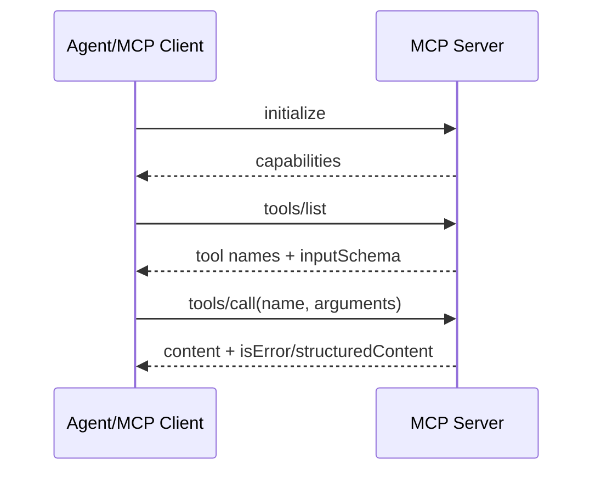
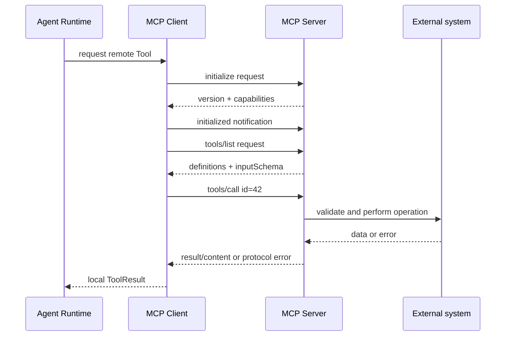

# JSON-RPC 与 MCP

## JSON-RPC 2.0 的最小形状

```json
{"jsonrpc":"2.0","id":1,"method":"tools/list","params":{}}
{"jsonrpc":"2.0","id":1,"result":{"tools":[]}}
{"jsonrpc":"2.0","method":"notifications/progress","params":{}}
{"jsonrpc":"2.0","id":1,"error":{"code":-32601,"message":"Method not found"}}
```

Request 有 `id` 并期待 response；notification 没有 `id`、不应得到 response。`result` 与 `error` 互斥。解析器必须校验 `jsonrpc`、id 类型、method 和消息边界。

## MCP 的位置

当前 MCP 规范定义 initialization、tools/resources/prompts 等能力和 stdio/HTTP transports；版本细节会演进，应阅读 [MCP 官方规范](https://modelcontextprotocol.io/specification)。本教材以协议层语义为准，不把某个旧 SDK 的字段写成永恒事实。



stdio server 由 client 启动子进程，stdout 只能放协议消息，日志放 stderr；HTTP transport 要处理连接、超时、认证和断线。
## 教材级重写

### 学习目标与现实问题

本页从 JSON-RPC 2.0 的消息边界开始，建立 MCP 的严格心智模型。完成后，你应该能手写一次 `initialize`、解释 request/response/notification 的差异，并知道为什么 MCP Tool 仍要经过本地 Agent Runtime 的 schema、权限和超时检查。

失败 trace：client 把 notification 当成 request 等待 id，整个连接永久阻塞；server 返回 `result` 和 `error` 两个字段，解析器选择了错误分支；stdio server 把日志写到 stdout，client 把日志当协议 JSON。协议边界必须先于 SDK。

### JSON-RPC 四种消息

```json
{"jsonrpc":"2.0","id":1,"method":"tools/list","params":{}}
{"jsonrpc":"2.0","id":1,"result":{"tools":[]}}
{"jsonrpc":"2.0","id":2,"error":{"code":-32601,"message":"Method not found"}}
{"jsonrpc":"2.0","method":"notifications/progress","params":{"value":0.5}}
```

Request 有 `id`、`method`、可选 `params`，需要一个对应 id 的 response。Response 必须有同一个 id，且 `result` 与 `error` 二选一。Notification 没有 id，发送方不等待 response。输入是单个 JSON message，输出是 response 或无输出；状态通常是 pending request map 的增加和删除。

常见错误：`-32700` parse error、`-32600` invalid request、`-32601` method not found、`-32602` invalid params、`-32603` internal error。业务错误可以放在 result/content 或协议 error，但 client 必须规定映射，而不是看到任意字符串就当成功。

### MCP 生命周期

MCP 在 JSON-RPC 之上定义初始化、能力协商和工具/资源/提示词接口。典型流程如下：

```text
client -> initialize(protocolVersion, capabilities, clientInfo)
server -> initialize result(serverInfo, capabilities)
client -> initialized notification
client -> tools/list
client -> tools/call
```

`initialize` 不是可选的装饰步骤：它确定版本和双方 capability。`tools/list` 返回名称、描述和 `inputSchema`；`tools/call` 发送名称与 arguments；`resources` 暴露可读取资源，`prompts` 暴露可复用 prompt 模板。具体字段随 MCP 规范演进，运行前要查看当前官方规范，而不是复制旧博客。

### 序列图



client 可缓存 tools/list，但必须处理 server capability/change notification 或 reconnect 后重新发现。缓存只影响 metadata，不等于跳过每次调用的 permission 和 argument validation。

### stdio 与 HTTP

stdio transport 中 client 启动 server 子进程；stdout 只放协议消息，stderr 放诊断。每行 framing 是教学实现常见选择，但当前 MCP transport 细节应以规范为准。HTTP transport 需要 URL、认证、超时、连接复用、断线与响应关联；不能把“能 curl”当成 MCP client 完成。

| 项目 | stdio | HTTP |
| --- | --- | --- |
| 生命周期 | client 管子进程 | server 独立运行 |
| 日志 | stderr | server logs/response channel |
| 故障 | exit、pipe close | timeout、5xx、disconnect |
| 安全 | cwd/env/command | auth、域名、网络策略 |
| 测试 | fake process/pipe | httptest server |

### Pi 的事实边界

固定研究 commit：`853a80d26c90a14c1886f0ebb8ffaae133ca2185`。检查 `packages/ai/src/providers/all.ts`、`packages/agent/src/agent-loop.ts` 与 coding-agent Extension 入口。**源码事实**：Pi Core 的默认 provider/agent core 路径不等于一个内建 MCP manager；本教材不会因为行业常说“Agent 支持 MCP”就声称 Pi Core 自动发现 server。若通过 Extension 或应用接入，应在 adapter 层明确加入。

### Tool 适配

```text
remote definition {name, description, inputSchema}
  -> local ToolDefinition {Name, Description, Schema}
remote call arguments
  -> local schema + Permission validation
  -> JSON-RPC tools/call
  -> map content/isError/error
  -> local ToolResult(callId)
```

输入是模型生成的本地 Tool Call；MCP server 只收到 client 允许发送的规范化参数；输出必须带 remote request id、local call id 和 error classification。不要把 remote `isError` 变成“调用失败但继续写文件”的隐式控制流。

### 可执行实验

**目标**：不用 SDK 验证协议状态机。

**准备**：一个 calculator fake server；Go `mcp.go` 或 Java `McpClient.java`；JSONL 临时管道。

**步骤**：

1. 发送无 id notification，断言 client 不等待 response。
2. 发送 `initialize`，保存 server capabilities。
3. 调用 `tools/list`，将 `inputSchema` 转成本地 ToolDefinition。
4. 用合法参数调用 calculator，断言 response id 与 call id 关联。
5. 发送坏 JSON、未知 method、错误参数和错误 id，检查不同错误分类。
6. 让 server stdout 输出日志或提前退出，确认 client 不把日志当成功结果。
7. 让 Agent 第一轮调用 remote Tool，第二轮读取 Tool Result 再回答。

**观察点**：协议 response 是 transport 事实，Tool Result 是 Agent context 事实；两者之间由 adapter 转换。

**预期结果**：notification 不阻塞、每个 request 有唯一 pending entry、错误不产生假成功 Tool Result。

**思考题**：如果 server 返回一个合法 schema 但描述要求读 secret，client 是否应该注册它？为什么 discovery 和 authorization 必须分开？

### 小结

MCP 是协议边界，不是权限边界。先掌握 JSON-RPC 的 id、错误和 framing，再处理 initialize、tools/list、tools/call、resources 和 prompts。Pi Core 默认没有被本页冒充成内建 MCP；Go/Java 适配器仍需把远程能力纳入本地 Harness 的验证、权限、超时和 telemetry。
### 协议排错表

| 症状 | 首先检查 | 不要直接做 |
| --- | --- | --- |
| 一直等待 | pending id、notification、EOF | 无限重试 |
| `parse error` | framing、编码、stdout 日志 | 把整行拼接 |
| `invalid params` | schema 与版本 | 自动删除字段 |
| id 不匹配 | dispatcher、并发 map | 按读取顺序配对 |
| tools 为空 | initialize capability、分页 | 假定 server 没能力 |
| call 成功但无结果 | content/structuredContent 映射 | 当作空字符串成功 |

**复盘**：为每种症状写最小 JSON 输入和预期状态；分别记录 transport error、protocol error、MCP `isError` 和 Agent Tool error。四者字符串可能相同，语义不能混淆。
### 版本与兼容策略

client 应把 negotiated protocol version、server capabilities 和 schema version 记录在连接状态中。遇到未知字段优先忽略可扩展字段，遇到缺少必需字段则 fail closed；不要把一个旧版 `tools/call` 参数静默改成新版本含义。测试中固定协议版本只是为了确定性，生产要允许官方规范演进。

**验收问题**：你能否从一条 response 判断它属于哪个 request、哪个 server、哪个 Agent Tool Call？如果不能，id 和 telemetry 设计还不完整。
### 实验记录模板

| 步骤 | 发送消息 | 期望 response | 状态变化 | 风险 |
| --- | --- | --- | --- | --- |
| initialize | version/capabilities | server info | connected | 版本不兼容 |
| initialized | 无 id | 无 response | ready | 错当 request |
| tools/list | cursor 可选 | definitions | cache 更新 | schema 过期 |
| tools/call | name/arguments | content/error | pending 删除 | 重复副作用 |
| disconnect | EOF/timeout | pending 结束 | closed | 无限等待 |

完成实验后把实际 JSON 和预期状态写进测试；不要只截图日志。协议课程的验收标准是可重放、可解释和失败有界。

### 前置知识

先熟悉 HTTP/JSON、Agent Loop、Tool Result 与基本的 Java/Go 接口；不需要先安装生产框架。
