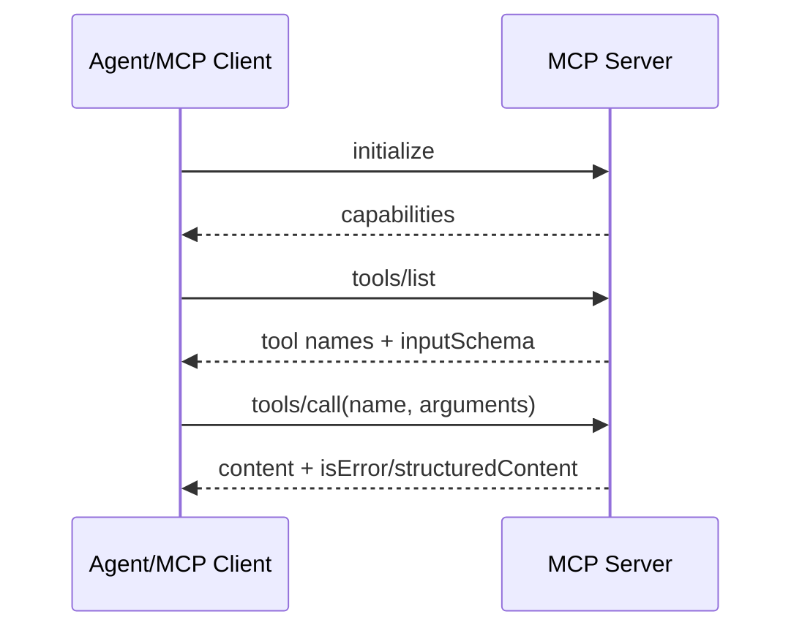

# JSON-RPC 与 MCP

## JSON-RPC 2.0 的最小形状

```json
{"jsonrpc":"2.0","id":1,"method":"tools/list","params":{}}
{"jsonrpc":"2.0","id":1,"result":{"tools":[]}}
{"jsonrpc":"2.0","method":"notifications/progress","params":{}}
{"jsonrpc":"2.0","id":1,"error":{"code":-32601,"message":"Method not found"}}
```

Request 有 `id` 并期待 response；notification 没有 `id`、不应得到 response。`result` 与 `error` 互斥。解析器必须校验 `jsonrpc`、id 类型、method 和消息边界。

## MCP 的位置

当前 MCP 规范定义 initialization、tools/resources/prompts 等能力和 stdio/HTTP transports；版本细节会演进，应阅读 [MCP 官方规范](https://modelcontextprotocol.io/specification)。本教材以协议层语义为准，不把某个旧 SDK 的字段写成永恒事实。



stdio server 由 client 启动子进程，stdout 只能放协议消息，日志放 stderr；HTTP transport 要处理连接、超时、认证和断线。
