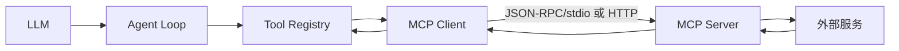
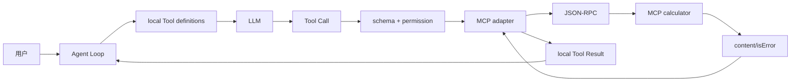

# 手工实现一个 MCP Client

## 最小 calculator

先写一个只实现 `tools/list` 和 `tools/call` 的 stdio server，再写 Client：启动进程、写一行 JSON、读取对应 id 的 response、处理错误和关闭。不要一开始引入 SDK，这样能看到 framing、id 匹配和断线。

```text
Agent Tool call
 -> MCP adapter 查找 remote name
 -> JSON-RPC tools/call
 -> server 校验 arguments
 -> calculator result
 -> adapter 变成本地 ToolResult
 -> Agent 下一轮请求
```



## 必须保留的边界

remote tool 的 schema 仍要在客户端缓存和调用前检查；MCP server 的 `isError` 要映射成 Tool Result 的 error 语义；网络超时、server 退出、unknown method 和响应 id 不匹配都要让 Loop 有界结束。MCP Tool 不应绕过本地 path/command/network policy。

## Pi 的事实

当前 `pi-ai` 的 `KnownApi`/`builtinProviders` 和 `pi-agent-core` 默认目录没有直接内建 MCP client。若通过 Extension 或应用接入，应在 Extension/adapter 层实现，而不是假定 Core 自动发现 MCP server。

## 练习

分别测试合法 calculator、错误参数、未知工具、server 提前退出和多个并发 id；再把远程定义转成 Go/Java 的本地 Tool interface。
## 教材级重写

### 你要实现什么

本页实现一个最小 calculator MCP server/client 组合，并把远程 Tool 接入 Agent Loop。目标不是复刻完整 MCP SDK，而是看见四个事实：进程如何通信、request id 如何匹配、远程 schema 如何变成本地 definition、server 错误如何回到模型。

### 失败 trace

```text
Agent calls calculator
 -> client writes request
 -> server writes response
 -> client reads a different response id
 -> wrong Tool Result is attached to call
 -> model reasons from another user's data
```

并发 request 时不能依赖读取顺序；必须用 id dispatcher。教学 client 可以串行发送来降低复杂度，但要在限制中写明。server 退出、pipe EOF、超时和 malformed JSON 都必须结束 pending call，而不是一直等待。

### 最小 server

```go
// conceptual server loop
for scanner.Scan() {
    req := decode(scanner.Bytes())
    switch req.Method {
    case "initialize": write(initializeResult(req.ID))
    case "tools/list": write(toolListResult(req.ID))
    case "tools/call": write(calculatorResult(req.ID, req.Params))
    default: write(methodNotFound(req.ID))
    }
}
```

输入是 newline-delimited JSON-RPC；输出是同 id 的 response；状态是每个请求被解析、校验、执行并回复。stdout 只能写协议，诊断写 stderr。server 仍应校验 arguments，不能相信 client 已经检查过。

### client adapter

```text
start process / connect HTTP
 -> send initialize
 -> await response(id)
 -> send initialized notification
 -> list = call(tools/list)
 -> for each remote definition:
      register RemoteTool
 -> Agent call:
      validate local args
      call(tools/call)
      map result to ToolResult
```

`RemoteTool` 的 `Name` 可以加 server namespace，避免两个 server 都注册 `search`；call id 要同时保留 local `ToolCallID` 和 remote JSON-RPC id。输入、输出和状态要在 telemetry 中区分，否则两个 server 的同名 Tool 很难排查。

### MCP 与 Agent Loop 的完整数据流



Tool Result 回到 loop 后，要追加 assistant Tool Call 和 tool message，再决定是否发下一轮。UI 不应自己调用 MCP，否则 Session、retry 和审计会分叉。

### stdio client 的工程边界

stdio 适合本地受控 server：设置 cwd、环境白名单、进程超时和最大行长度；监听 stderr；收到 EOF 时关闭所有 pending futures。HTTP 版本增加认证、域名 allowlist、TLS、响应体上限、重试和重连；重连后必须重新 initialize/list，不能直接复用过期 schema。

```text
pending[id] = call
write(request)
while pending not empty:
    message = read()
    if message.id in pending:
        resolve pending[id]
    else if notification:
        dispatch notification
    else:
        protocol error
```

这段伪代码的输入是 transport message，输出是一个已匹配的 Future/结果；`pending` 是关键状态。若同一个 id 被重复响应，第二个响应应记录协议错误而不是覆盖第一个结果。

### Pi 的事实边界与来源

研究 commit：`853a80d26c90a14c1886f0ebb8ffaae133ca2185`。从 `packages/ai/src/providers/all.ts` 的 provider 列表、`packages/agent/src/agent-loop.ts` 的 Tool 执行入口和 `packages/coding-agent/src/core/extensions/` 的扩展边界核对。**事实**：默认 Pi Core 路径不提供本页假设的 MCP client。**设计选择**：可由应用或 Extension 加 adapter。**不要声称**：引入一个 `McpClient` 类就等于 Pi 官方内建 MCP。

### Go 与 Java 对照

Go 示例 `MCPClient` 使用 stdio JSONL 和 `RemoteTool`，调用返回 `ToolResult`；Java 示例 `McpClient` 使用 `Process`、reader/writer 与 Jackson。Go 的 `context.Context` 适合同时取消 read/write；Java 要把 `Future.cancel(true)`、进程 destroy 和 reader interruption 一起设计。两个示例都是串行 id matching，生产实现需要 dispatcher。

### 可执行实验

**目标**：从协议日志追踪一次远程调用。

**准备**：启动 fake calculator server；关闭真实网络；打开 Go/Java MCP tests。

**步骤**：

1. 记录 client 生成的 initialize id 和 server response。
2. 验证 `initialized` 没有 id，client 不创建 pending entry。
3. 记录 tools/list 的 schema，并断言本地 registry 出现 remote Tool。
4. 发送 `{"left":2,"right":3}`，断言 server 返回 5。
5. 发送缺字段、未知工具、返回 error 和提前 EOF。
6. 并行发两个 id（若 client 不支持，断言它明确拒绝而不是串错）。
7. 让 Agent 第二轮看到带 source 的 Tool Result。

**观察点**：日志中至少出现 local call id、remote request id、method、latency 和 error classification；不要打印凭据和完整敏感 output。

**预期结果**：合法调用成功，所有异常有界返回，Agent 仍由自己的 Loop 决定下一轮。

**思考题**：schema 应该在发现时缓存还是每次调用刷新？server 升级导致 schema 变化时怎样避免旧模型继续使用参数？

### 小结

MCP client 是一个协议适配器，不是另一个 Agent Loop。它负责 transport、id matching、capability 和错误映射；本地 Harness 负责 Tool registry、权限、Session、retry、取消和 telemetry。把这两层分开，才能测试和替换 server。
### 断线恢复与幂等

MCP server 断线后，client 不能简单重发最后一个 `tools/call`：外部操作可能已经成功而 response 丢失。先记录 local call id、remote id、server identity 和 operation intent，再根据 Tool 的 replay policy 决定查询状态、返回 unknown outcome 或安全重试。对于只读搜索可重试；对于写入或付款类操作应使用外部幂等键。

重连流程通常是：关闭旧 reader/writer、结束所有 pending request、启动或连接新 server、重新 `initialize`、发送 `initialized`、重新 `tools/list`，最后比较 schema/version。旧 Tool Definition 不应在新 capability 未确认前继续展示给模型。

### 验收清单

- response id 永远匹配发出的 request id。
- notification 不进入 pending map。
- server stderr 不污染协议 stdout。
- EOF、超时和 malformed JSON 都会结束 pending call。
- remote `isError` 与 JSON-RPC transport error 可区分。
- local permission 在调用前执行，server permission 在调用中执行。
- retry 不会悄悄重复不可幂等副作用。

这些断言同时适用于 stdio 和 HTTP；transport 变了，Agent Tool 的安全边界不能变。
### 手工检查协议日志

检查一条日志时先定位 local call id，再定位 remote id，最后定位 server response。记录 `method`、server identity、schema version、duration 和错误分类；生产日志不要包含完整 arguments、Authorization 或文件正文。

**复盘练习**：让两个 server 都暴露 `search`，启用 namespace；重连其中一个并改变 schema，确认旧 definition 在 refresh 前不会误导模型。再模拟 response 丢失，说明为何只读调用可以按策略重试而写调用要返回 unknown outcome。

### 学习目标

读完本页后，你应能用源码、一个最小数据流和一次失败测试解释本主题，而不是只复述术语。

### 前置知识

先熟悉 HTTP/JSON、Agent Loop、Tool Result 与基本的 Java/Go 接口；不需要先安装生产框架。
