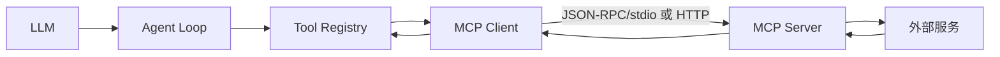

# 手工实现一个 MCP Client

## 最小 calculator

先写一个只实现 `tools/list` 和 `tools/call` 的 stdio server，再写 Client：启动进程、写一行 JSON、读取对应 id 的 response、处理错误和关闭。不要一开始引入 SDK，这样能看到 framing、id 匹配和断线。

```text
Agent Tool call
 -> MCP adapter 查找 remote name
 -> JSON-RPC tools/call
 -> server 校验 arguments
 -> calculator result
 -> adapter 变成本地 ToolResult
 -> Agent 下一轮请求
```



## 必须保留的边界

remote tool 的 schema 仍要在客户端缓存和调用前检查；MCP server 的 `isError` 要映射成 Tool Result 的 error 语义；网络超时、server 退出、unknown method 和响应 id 不匹配都要让 Loop 有界结束。MCP Tool 不应绕过本地 path/command/network policy。

## Pi 的事实

当前 `pi-ai` 的 `KnownApi`/`builtinProviders` 和 `pi-agent-core` 默认目录没有直接内建 MCP client。若通过 Extension 或应用接入，应在 Extension/adapter 层实现，而不是假定 Core 自动发现 MCP server。

## 练习

分别测试合法 calculator、错误参数、未知工具、server 提前退出和多个并发 id；再把远程定义转成 Go/Java 的本地 Tool interface。
