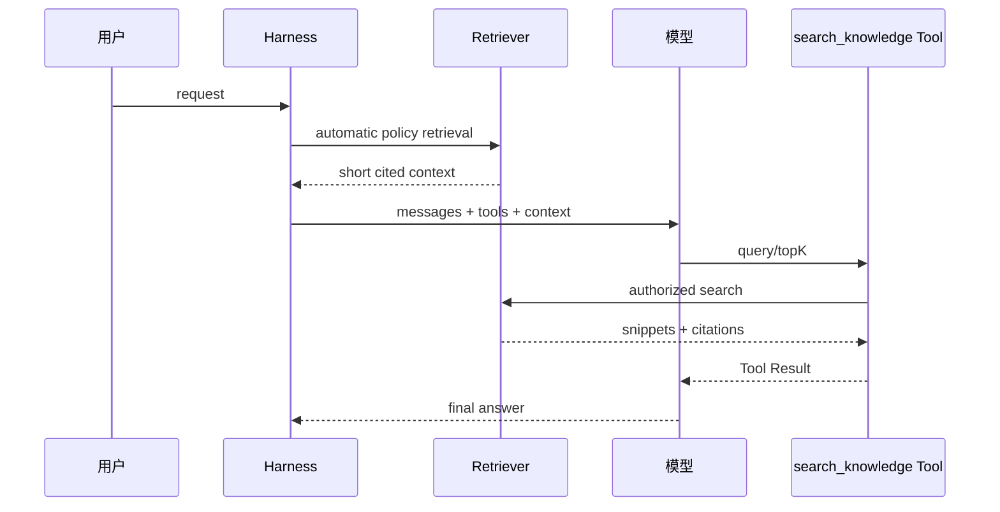

# 把 RAG 暴露成 Tool

## Tool 合约

```json
{
  "name": "search_knowledge",
  "parameters": {
    "type": "object",
    "properties": {
      "query": {"type":"string"},
      "topK": {"type":"integer","minimum":1,"maximum":8}
    },
    "required": ["query"]
  }
}
```

Executor 先限制 query 长度和 topK，再应用当前用户/项目的 metadata policy，返回 `source`、`score`、`snippet` 和检索时间。不要只返回拼接后的无来源长字符串。

## 和自动注入比较

自动注入适合每个请求都必须满足的租户知识或系统事实；Tool 适合用户意图不确定、查询代价高或需要模型决定何时查。折中做法是注入小型索引说明，详细内容走 Tool。

## 一个可运行的最小 Demo

示例代码 `examples/go-agent/internal/agent/rag.go` 的 `KnowledgeTool` 不依赖向量数据库：它对词项做 overlap score，先按 `Tenant` 过滤，再返回带 `source` 的 JSON snippet。这不是生产检索器，却把关键边界变成了可运行的 Tool。

```bash
cd ai-agent-learning/examples/go-agent
go test ./... -run KnowledgeTool
```

把它替换成 embedding/vector store 时，Tool schema 和权限过滤仍应留在 Runtime 这一侧；只有检索实现变化。

## 测试

用 5 个固定文档测试 exact term、同义表达、topK、无结果、跨租户过滤、超长 snippet 和重复 query。FakeModel 第一轮请求 search，第二轮用结果回答，断言来源进入下一次 Context，并且越权文档从未返回。
## 教材级重写

### Tool 合约先于检索实现

`search_knowledge` 是一个 Tool，所以模型只会提出结构化请求，真正检索由 Runtime 执行。Schema、租户、ACL、query 长度和 topK 都必须在执行前检查。

```json
{
  "name":"search_knowledge",
  "description":"搜索当前用户有权访问的知识片段",
  "parameters":{"type":"object","properties":{
    "query":{"type":"string","minLength":2,"maxLength":500},
    "topK":{"type":"integer","minimum":1,"maximum":8}
  },"required":["query"]}
}
```

输入是模型生成的 JSON，输出是带引用的 Tool Result，状态变化是一次 query telemetry 和可选 cache entry。schema 合法只说明形状合法，不说明 query 有权限，也不说明结果可信。

### 执行顺序

```text
parse JSON
 -> required/type/range validation
 -> normalize query
 -> identify user/tenant/project
 -> metadata/ACL filter
 -> retrieve sparse/dense candidates
 -> rerank and topK
 -> redact/limit snippets
 -> attach citations
 -> Tool Result
```

如果先检索后授权，错误结果可能已经出现在日志、cache 或 reranker；应尽可能让底层索引支持 filter，并在 adapter 层再次检查。

### 两种注入方案的时序



自动检索解决“必须知道”的少量事实；Tool 解决模型判断是否需要查询。不要同时无条件自动检索大块内容又暴露同样的 Tool，否则成本和重复都会上升。

### Go/Java 最小实现

Go `KnowledgeTool.Execute(ctx, raw)` 解析 query、过滤 `Tenant`、计算 overlap score 并返回 JSON citations。Java 可以用 `KnowledgeTool` 接受 `JsonNode`，用 `List<KnowledgeDocument>` 做同样的 deterministic score。两者不依赖数据库，便于测试边界；换成向量库时保留 Tool schema 与 policy 层。

```text
result = {
  "query": "retry policy",
  "hits": [
    {"source":"runbook.md","score":0.81,"snippet":"...","tenant":"team-a"}
  ],
  "truncated": false
}
```

`tenant` 是否直接返回要按泄露风险决定；至少返回 source/version/citation anchor，让用户能复核。snippet 超长时截断并标记，不让模型把截断当完整规范。

### 错误语义

| 错误 | Runtime 行为 | 模型可见结果 |
| --- | --- | --- |
| 缺 query | 不执行 retrieval | invalid arguments |
| topK 超范围 | 拒绝或 clamp（策略需固定） | policy error |
| tenant 缺失 | fail closed | authorization error |
| index timeout | 取消并记录 latency | temporary retrieval error |
| 无结果 | 成功的 empty result | 明确没有命中 |
| 文档越权 | 过滤并告警 | 不泄露存在性 |

不要把无结果伪装成“知识库没有这件事”之外的确定结论；模型应知道它只查了授权范围。

### 可执行实验

**目标**：验证 Tool 与检索器的边界。

**准备**：Go/Java 示例、5 个固定文档、两个 tenant、Fake/ScriptedModel。

**步骤**：

1. 测试合法 query、缺字段、数字 topK、超长 query 和 malformed JSON。
2. 测试同 tenant 命中与跨 tenant 文档，断言越权 source 从未出现在结果、日志和 cache。
3. 测试 index timeout、empty result、duplicate query 与 topK 上限。
4. 让 FakeModel 第一轮调用 Tool，第二轮使用 citation 回答。
5. 将 Tool 改成自动注入，比较请求次数、token 和遗漏查询。
6. 对同一文档改版本，断言 citation version 改变而不是复用旧 cache。

**观察点**：检查模型第二轮 request 的 Tool Result，而不是只看 UI；记录 query hash 和 result count，避免记录完整敏感文本。

**预期结果**：坏参数不会调用检索器，越权文档不出现，空结果和暂时错误可区分。

**思考题**：模型要求 `topK=10000` 时应返回错误还是限制到 8？怎样让产品策略、schema 和 executor 的答案一致？

### 小结

RAG Tool 的安全边界在检索前和结果返回前各有一次。模型决定是否查，Runtime 决定能查什么；citation、tenant filter、timeout 和 output limit 让 RAG 从概念变成可测试能力。
### 评估结果的最小格式

一次检索测试至少保存 query hash、tenant、filter、candidate count、returned count、topK、latency、citation ids、empty/error status；不要保存完整 query 或敏感 snippet。把这些字段接到 Telemetry 后，才能比较自动注入和 Tool 方案。

**复盘练习**：人为制造一个“高相似但无权限”和一个“权限正确但低相似”的文档，确认系统分别拒绝和排序；把错误结果送回 FakeModel，断言模型得到的是可解释错误而非伪造答案。
### 参数选择复盘

chunk size、overlap、embedding model、BM25 参数、fusion 权重和 topK 都是实验参数，不是通用常数。保存配置版本与评估集版本；否则一次排名变化无法判断是数据、模型还是算法改变。将 citation id 映射回原文位置，允许人工复核。

### 学习目标

读完本页后，你应能用源码、一个最小数据流和一次失败测试解释本主题，而不是只复述术语。

### 前置知识

先熟悉 HTTP/JSON、Agent Loop、Tool Result 与基本的 Java/Go 接口；不需要先安装生产框架。
