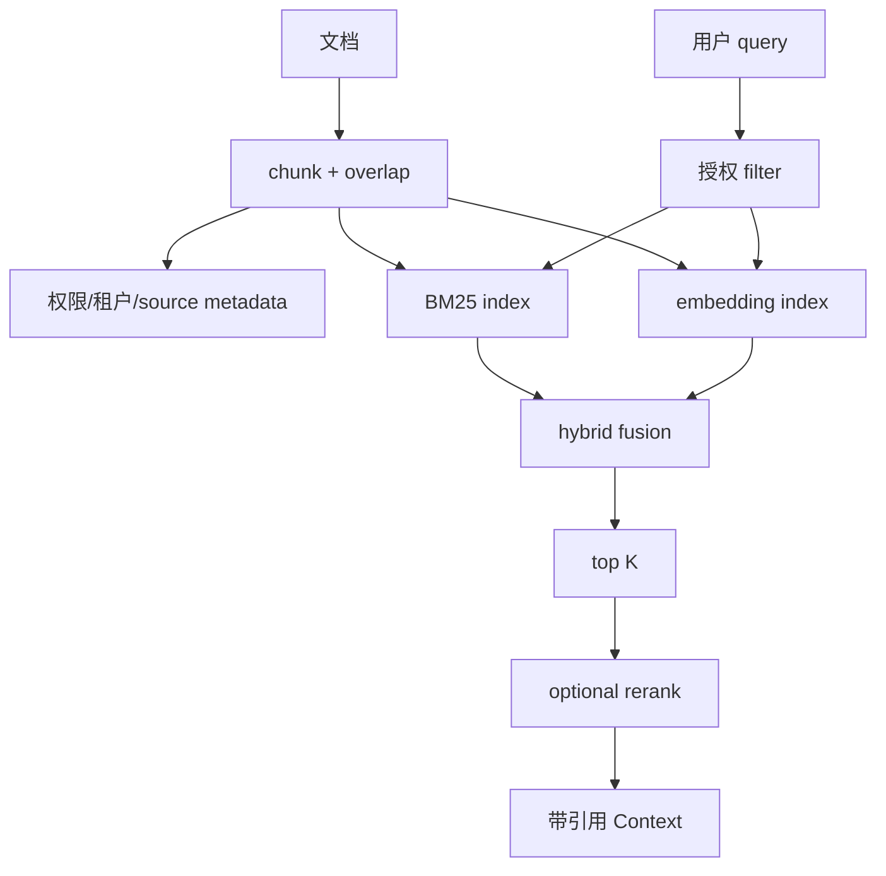

# RAG 与检索基础

## 索引和查询

```text
文档 -> chunk -> metadata
      -> embedding/vector index
      -> query embedding
      -> similarity / BM25
      -> top K -> rerank -> context
```

- Chunk 是可检索的文本片段，大小和重叠会影响召回。
- Embedding 把文本映射到向量；cosine similarity 比较方向。
- Sparse/BM25 依赖词项和频率，适合精确名字；dense retrieval 适合语义相似。
- Hybrid 将两者融合；rerank 用更贵的模型重排候选。
- Metadata filter 先限制租户、文件类型或权限；top K 是成本/召回的取舍。

## RAG 不是 Session

RAG 从索引找外部知识；Session 保存对话和工作状态。RAG 结果应带来源、时间和权限，不应悄悄写进长期 memory。Context Window 仍限制最终注入的片段总量。

## 两种接入

| 方案 | 优点 | 风险 |
| --- | --- | --- |
| Harness 自动检索 | 每次请求可强制加入相关知识，行为稳定 | 查询意图和成本由宿主承担，可能注入无关内容 |
| `search_knowledge` Tool | 模型按需查询，工具链清晰 | 模型可能忘记查、重复查或构造坏 query |

先用内存 BM25/余弦 Demo 验证数据流，再考虑数据库和框架；不要用向量库掩盖 chunk、权限和评估问题。
## 教材级重写

### 学习目标

本页从一段文档如何变成可检索 chunk 开始，逐步理解 sparse/BM25、dense embedding、cosine similarity、hybrid、rerank、topK 和 metadata filter。目标是能解释一次检索为什么返回某个片段，而不是只会说“接入向量数据库”。

### 现实问题：知识不等于上下文

用户问“我们的 retry 上限是多少”。把整个仓库塞给模型成本高且容易找到旧配置。RAG 把文档切成可定位片段，在查询时选出候选，再将少量带来源内容放进 context。RAG 不保存会话，也不保证答案正确。

失败 trace：先按相似度取 topK，再做租户过滤，结果把 team-b 的片段泄露给 team-a；或者 chunk 没有 source/line metadata，模型回答正确却无法审计。权限 filter 必须在候选进入模型前完成，最好在检索索引层就限制。

### 从文档到分数

```text
document
 -> normalize
 -> chunk with overlap
 -> metadata(source, tenant, ACL, timestamp)
 -> sparse index + embedding index
 -> query normalize
 -> filter authorized candidates
 -> score
 -> topK
 -> optional rerank
 -> cited context
```

Chunk 太小会失去上下文，太大则召回不精确；overlap 让句子跨边界时不容易丢失，但增加索引和重复 token。每个 chunk 的 source、版本、租户和权限应随索引保存。

### Sparse/BM25

BM25 用词项匹配、词频和文档长度计算相关度，适合类名、错误码、配置字段等精确查询。其直觉是：查询词在某文档出现越多越重要，在所有文档都出现则区分度低；长文档不会因为字数长而无条件占优势。

### Dense 与 cosine

Embedding 把文本映射到向量 `v`。cosine similarity 为 `dot(a,b)/(||a||*||b||)`，比较方向而不是绝对长度。语义相近但用词不同的文本可能获得较高分；模型、语言、领域和版本会影响效果。向量相似不等于权限允许，也不等于事实最新。

### Hybrid 与 rerank

Hybrid 可以分别得到 BM25 rank 与 dense rank，再用加权或 reciprocal rank fusion 合并。对少量候选使用更贵的 reranker，可以读取完整 chunk 与 query 做精排。不要把 rerank 当成事实校验；它只改变顺序。



图中 filter 同时位于两种检索路径之前；如果数据库只能在召回后 filter，也要在送入模型前做第二次 fail-closed 检查。

### RAG 与 Session/Memory/Tool

Session 记录对话和 Agent 工作状态；Memory 是更长期的用户/系统事实；RAG 是从外部索引选资料；Tool 是执行接口。RAG 结果可以通过自动 Context 注入，也可以作为 `search_knowledge` Tool，让模型决定何时查询。两者都要有 source/citation 和 ACL。

| 方案 | 优点 | 风险 | 适用 |
| --- | --- | --- | --- |
| Harness 自动注入 | 每轮一致、系统事实不依赖模型记得查询 | 可能无关、每轮付费 | 强制政策/短上下文 |
| search Tool | 按需、可观察查询 | 模型可能忘查或重复查 | 大知识库/任务意图不确定 |
| 混合 | 索引摘要自动注入，正文按需查 | 边界更复杂 | 教学和生产常见折中 |

### 可执行实验

**目标**：解释每个返回 chunk 的来源和分数。

**准备**：使用 `examples/go-agent/internal/agent/rag.go` 的 `KnowledgeTool`，准备同一主题的 team-a/team-b 文档。

**步骤**：

1. 用 6 个文档制造 exact term、同义表达、长文档和无关文档。
2. 先不做 tenant filter，观察错误结果。
3. 把 filter 前移，断言 team-b 永远不进入候选。
4. 比较 token overlap、BM25 和 cosine 的排序。
5. 设 `topK=1/3/8`，记录召回、重复和 prompt token。
6. 给每个 snippet 加 source、version 和 line range。
7. 让 FakeModel 调用 `search_knowledge`，断言下一轮带引用。

**观察点**：检索质量至少拆成 recall、precision、latency、cost 和 leakage；只看最终回答无法知道检索是否越权。

**预期结果**：同义 query 需要 dense/hybrid 才可能召回，精确符号通常 sparse 更稳，所有结果都遵守 metadata filter。

**思考题**：chunk overlap 增大后 recall 上升但 context 重复，怎样用实验选择值？如果文档版本更新，embedding index 与 citation 如何失效？

### 小结

RAG 是受权限约束的候选选择管线。chunk、score、filter、topK 和 citation 都必须可观察；向量库只是实现细节，不能替代数据清洗、授权、评估和 Context budget。
### 评估而不是凭感觉

建立一组带人工相关性标签的 query/doc 对，分别计算 recall@K、precision@K、MRR、nDCG、平均延迟和每次请求 token。加入权限标签后，再计算 unauthorized exposure 必须为 0；不能用平均相似度掩盖泄露。

**复盘练习**：同一 query 分别只用 BM25、只用 dense、hybrid 和 rerank，保存候选及分数。解释一个结果为什么从 rank 5 变成 rank 1，并指出这是词项、语义、融合还是 rerank 的贡献。最后修改文档版本，检查 citation 是否失效。
### 参数选择复盘

chunk size、overlap、embedding model、BM25 参数、fusion 权重和 topK 都是实验参数，不是通用常数。保存配置版本与评估集版本；否则一次排名变化无法判断是数据、模型还是算法改变。将 citation id 映射回原文位置，允许人工复核。

### 前置知识

先熟悉 HTTP/JSON、Agent Loop、Tool Result 与基本的 Java/Go 接口；不需要先安装生产框架。
