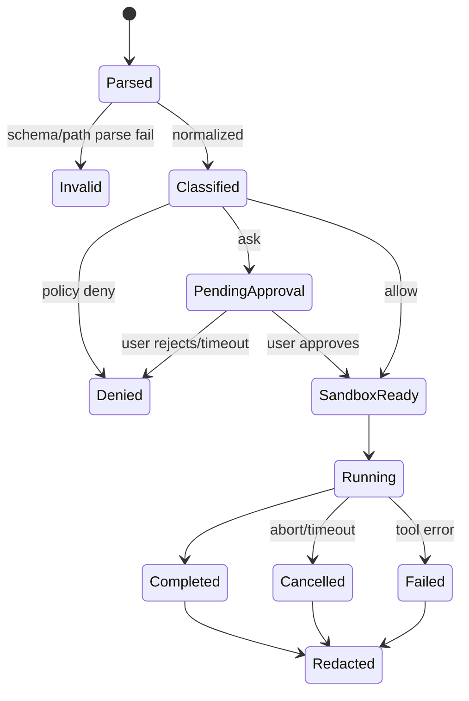

# 实现 Permission Layer

## 判定顺序

```text
normalize -> classify -> policy -> approval -> sandbox -> execute -> redact -> audit
```

`normalize` 很关键：`../secret`、符号链接、shell quoting 和 Windows 路径都不能用字符串前缀简单判断。教学示例只实现受限工作目录和危险命令拒绝；生产需要 OS/container 级别的边界。

```text
allow read if realpath(path) is under workspace
ask write/edit unless approved scope
deny command containing destructive pattern
set timeout and output limit
record decision without secret contents
```

## 与 Agent Loop 的位置

权限检查在 schema validation 之后、Tool `execute` 之前；它属于 Harness，不属于模型，也不应藏在 TUI。被拒绝的 Tool 仍返回结构化错误，让模型知道动作没有发生。

## 测试矩阵

测试 cwd 内外路径、符号链接、空命令、shell metacharacters、超时、取消、输出截断和审计 redaction。Go/Java 示例提供可离线运行的基础 policy；不要把它当成安全认证。
## 教材级重写

### Permission Layer 的位置

权限检查位于 Tool schema validation 之后、实际 `execute` 之前；它属于 Harness/Tool executor，不属于模型和 TUI。模型可提出请求，UI 可请求审批，但最终执行者必须再次检查 policy，避免 RPC 或插件绕过界面。

```text
model call
 -> decode JSON
 -> schema validate
 -> normalize path/command
 -> classify risk
 -> policy decision
 -> approval/sandbox
 -> execute
 -> redact result
 -> audit
```

输入是 untrusted Tool Call 和当前身份/工作区，输出是 allow/ask/deny 或受控 Tool Result，状态是 decision record。`allow` 不是永久授权，至少要绑定 session、tool、resource、policy version 和 expiry。

### 路径策略

字符串前缀不是路径安全检查：`/work/project-evil` 可能通过 `/work/project` 前缀；`../`、symlink、Windows drive 和 case folding 也会造成绕过。正确方向是 `realpath`/canonical path，再比较路径组件，并明确 symlink 是跟随还是拒绝。

```text
candidate = resolve(cwd, userPath)
if candidate escapes workspace: deny
if candidate is secret pattern: ask/deny
if operation == write and not approved scope: ask
```

输入是 cwd 与用户字符串，输出是 canonical path 或拒绝；状态不应修改文件。解析阶段不要执行 shell 来“帮忙判断路径”。

### 命令策略

shell 不是普通字符串。管道、重定向、命令替换、glob、后台执行和解释器参数都会改变实际效果。教学实现可以拒绝明显 destructive patterns，但生产策略需要 command AST/受限 shell、allowlist、cwd、环境白名单、timeout 和 sandbox。

```json
{
  "decision":"ask",
  "tool":"shell",
  "reason":"network and command chain",
  "policyVersion":"workspace-v3",
  "expiresAt":"2026-01-01T00:00:00Z"
}
```

这个 decision 可以展示给用户，但不应包含完整 secret arguments。审批系统要防止模型自己模拟“用户批准”文本。

### Go 与 Java 示例

Go `PermissionPolicy` 负责 workspace path 和危险命令检查，`BeforeToolHook` 在执行前调用；`context.Context` 传播 timeout。Java `PermissionPolicy` 使用 `Path.normalize`/`toRealPath` 思路，`BeforeToolHook` 接收 `CancellationToken`；`ExecutorService` 管理 shell 任务，Future cancellation 还需等待子进程退出。

两个示例都是教学级：它们没有宣称容器隔离、网络 namespace、完整 shell parser 或 secret scanner。教材代码应让读者看到缺口，而不是用几条 regex 伪装生产安全。

### 决策状态机



状态图把“用户拒绝”和“Tool 自己失败”分开；两者都可以是 error Tool Result，但审计 reason、是否产生副作用和是否可重试不同。

### 测试矩阵

| 输入 | 预期 | 必须验证 |
| --- | --- | --- |
| workspace file | allow/read | result limit |
| `../secret` | deny | no filesystem call |
| symlink outside | deny/ask | canonical target |
| write same file | ask/lock | diff/backup |
| empty shell | invalid | no process |
| pipeline/download | deny/ask | no network |
| timeout | cancelled | child process cleanup |
| output with token | completed+redacted | audit safe |
| approval race | one decision | no double execute |

### 可执行实验

**目标**：证明 policy 在 executor 前生效。

**准备**：为 Go/Java policy 写 table-driven/JUnit parameterized 风格测试，使用临时目录和 fake process。

**步骤**：

1. 为每个矩阵项写输入、decision、是否调用 executor 的断言。
2. 用一个 counting Tool 记录 `Execute` 次数；对 invalid/deny 断言为 0。
3. 让两个 goroutine/thread 同时请求同一 write，观察锁或审批结果。
4. 让 Tool 在中途返回 token，检查 result、event、telemetry 三条输出链。
5. 使用 cancel/interrupt，等待进程终止后才返回 run。

**观察点**：不要只断言错误字符串；要断言副作用次数、policy reason、Tool Result 的 `isError` 和审计是否脱敏。

**预期结果**：坏参数不触发副作用，拒绝可解释，取消不会把运行误报为 completed。

**思考题**：权限判断应在每次 retry 重做吗？如果审批成功后模型改变了 arguments，为什么不能复用原 approval？

### 小结

Permission Layer 不是一个 `if dangerous` helper，而是一条可测试的决策管线。规范化、身份、policy、审批、sandbox、timeout、redaction 和 audit 必须有明确 owner；Go/Java 示例提供边界，不替代生产隔离。
### 安全评审输出

安全评审不能只提交“通过/拒绝”。至少输出 decision、policy version、resource class、reason、approval identity、expiry、toolCallId 和副作用状态；敏感参数用 hash/类别替代。这样才能区分“未执行”“执行后失败”和“执行成功但结果脱敏”。

**复盘练习**：为同一个 write call 修改 path、arguments 和 session identity，各运行一次。确认旧 approval 不会被复用；再让 retry 发生，确认每次 attempt 都重新检查有效期和 resource scope。
### 与其他层的责任边界

Provider 负责请求格式和凭据注入，不负责允许 shell；TUI 负责展示审批，不负责最终执行；Extension 可以请求能力，不负责授予能力；MCP server 可以再次授权，但不能替代本地 policy。每一层都应在接口文档中写清“我检查了什么”和“我没有检查什么”。

**复盘**：画出一次 `bash` 调用的所有检查点，并在每个点标注输入、输出、状态和失败后的重试策略。
### 最小接口设计

```text
Decision evaluate(Identity, ToolCall, Resource, PolicyVersion)
Approval request(Decision)
Execution execute(ApprovedCall, Deadline, Sandbox)
AuditRecord record(Decision, Outcome, RedactedMetadata)
```

每个接口都有明确输入和输出：evaluate 不产生副作用，approval 不执行 Tool，execute 不修改审批范围，audit 不保存秘密。把这些边界写进单元测试，可以防止未来新增 RPC、Extension 或 MCP 入口时绕过 policy。

**验收**：新增一个调用入口后，仍能用同一 counting executor 证明 deny/invalid 的执行次数为零。
### 回归测试断言

- 同一 approval 只能绑定同一 call hash、resource scope 和有效期。
- retry 重新执行 evaluate，不继承已经过期的 approval。
- `context.Context`/interrupt 到达后，executor 不再启动新副作用。
- 子进程结束后才提交 terminal outcome，避免“返回取消但进程仍在跑”。
- redaction 发生在 event、log、Session 和 telemetry 四条输出链。
- policy backend 不可用时 fail closed，不将异常降级为 allow。

这些断言比覆盖几个危险字符串更接近可维护的 Permission Layer。

### 学习目标

读完本页后，你应能用源码、一个最小数据流和一次失败测试解释本主题，而不是只复述术语。

### 前置知识

先熟悉 HTTP/JSON、Agent Loop、Tool Result 与基本的 Java/Go 接口；不需要先安装生产框架。
