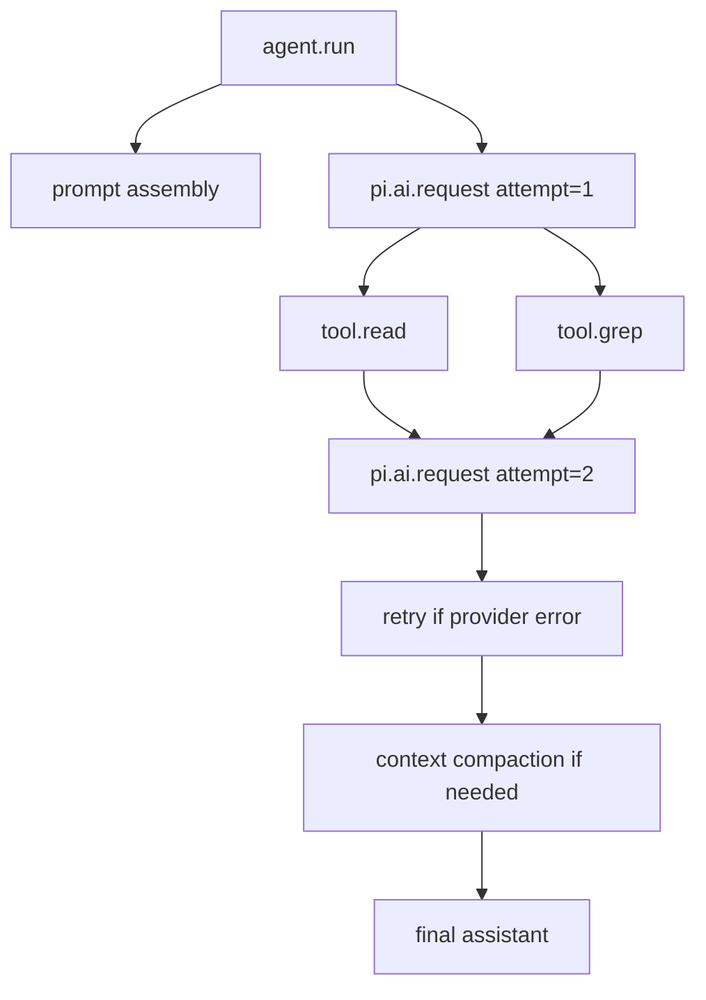

# Telemetry 与 Observability

## 为什么需要

只看最终回答无法解释“为什么慢、花了多少钱、哪一个 Tool 失败、重试了几次、用户何时 abort”。Agent 一次运行是多阶段工作：Provider、Tool、队列、compaction 和 Session 都需要关联 id。

## Pi 的入口

`packages/telemetry/src/index.ts` 提供通用 telemetry 类型/上下文；`packages/coding-agent/src/core/telemetry.ts` 和 AgentSession 将运行数据接入应用。`packages/ai/src/types.ts` 的 `Usage` 明确 input/output/cache/reasoning/cost；不要把 Tool 自己上报的 usage 误当成主 LLM usage。

## 建议事件字段

| 事件 | 字段 |
| --- | --- |
| run | runId、sessionId、lane、model、provider、start/end |
| llm request | attempt、latency、TTFT、stopReason、usage、responseId |
| tool | toolCallId、name、duration、isError、outputBytes |
| retry | reason、attempt、delay、retryable |
| control | abort、steer、follow-up、queue depth |
| compaction | reason、before/after tokens、duration、outcome |

## 日志 vs Trace

日志是离散文本/事件；Trace 是有 parent-child 关系的运行树。两者都不能默认记录完整 prompt、Tool 参数或文件内容，避免敏感数据泄露；保留 hash、长度和 redacted metadata 通常更安全。
## 教材级重写

### 为什么最终答案不够

一次 Agent Run 可能包含三次 LLM request、两个并行 Tool、一次 retry 和一次 compaction。只保存最终文本无法回答：慢在哪里、花费多少、哪个 Tool 失败、用户何时 abort、重试是否重复计费。Telemetry 把状态转换变成可以关联和聚合的记录。

失败 trace：日志显示“tool failed”，但没有 runId/toolCallId；重试后两个 Tool Result 无法配对；telemetry 把完整 prompt、API key 和文件内容写入集中系统。可观察性如果扩大泄露面，就不是免费能力。

### Logs、Events、Metrics、Traces

| 类型 | 形态 | 适合回答 |
| --- | --- | --- |
| Log | 独立文本/结构记录 | 某错误发生了什么 |
| Event | 有序运行通知 | 当前状态何时改变 |
| Metric | 聚合数字 | p95 latency/cost 如何 |
| Trace | parent-child spans | 一次 run 的完整因果链 |

Event 是应用运行语义，Trace 是诊断投影；不要让 telemetry listener 反过来修改 Agent state。日志和 trace 都要携带 schema version，并允许采样。

### 推荐字段

```json
{
  "traceId":"t-123",
  "runId":"r-7",
  "sessionId":"s-9",
  "lane":"main",
  "provider":"example",
  "model":"example-model",
  "operation":"llm.request",
  "attempt":2,
  "durationMs":812,
  "ttftMs":245,
  "inputTokens":1200,
  "outputTokens":180,
  "stopReason":"toolUse",
  "status":"ok"
}
```

字段输入来自 Runtime/Provider/Tool；输出是结构化 span/event；状态是 open span 到 ended span。不要默认把 `prompt`、completion、Tool args/output、文件内容、headers 或 credentials 放进属性。

### Pi 源码证据

固定 commit：`853a80d26c90a14c1886f0ebb8ffaae133ca2185`。

- `packages/telemetry/src/index.ts`：通用 telemetry context、span 与 no-op/in-memory contract。
- `packages/coding-agent/src/core/telemetry.ts`：coding-agent schema、session instrumentation 和属性边界。
- `packages/agent/src/harness/telemetry.ts`：`AI_TELEMETRY_SCHEMA`、`HARNESS_TELEMETRY_SCHEMA`、`AGENT_TELEMETRY_SCHEMAS`。
- `packages/ai/src/types.ts`：`Usage`、`AssistantMessageEvent` 等 Provider 侧事实。

**源码事实**：Pi 将 provider/model/usage/stop reason 等放在统一类型和 telemetry contract 中；**设计分析**：span parent 让一次 run 中的 LLM 与 Tool 可关联；**安全建议**：内容字段默认不采集，若调试必须显式脱敏和短期采样。

### Run Trace



真实 trace 中并行 Tool 可有不同完成时间，但 parent run 和 source toolCallId 要稳定。`TTFT` 只适用于流式 Provider；没有首 token事件时不要填 0 伪装测量。

### 指标定义

- LLM latency：请求开始到 settled response；区分 queue、network、provider 和 parse 时间。
- TTFT：请求发出到第一个可展示 token/delta；不等于完整响应时间。
- Tool duration：executor 开始到结果 settled；包括 timeout/cancel 分类。
- Retry count：实际再次请求次数，不能只看最终成功。
- Token usage/cost：按 provider response 的 usage 和价格版本计账，重试是否计费要以 provider 事实记录。
- Compaction duration：压缩操作独立计时，不能混进普通 LLM latency。

### Go 与 Java 对照

Go 示例 `Recorder.Start` 返回 finish callback，事件 callback 记录 span；Java `Telemetry.start` 返回 `SpanScope`，try-with-resources 保证关闭。两者都要在 exception、CancellationException、Future interruption 和 panic/unchecked exception 路径结束 span；结束 span 后写入应是 inert。

### 可执行实验

**目标**：为一次 Tool Loop 生成不泄露内容的 trace。

**准备**：Go `Recorder`、Java `Telemetry`、ScriptedModel、一个成功 Tool、一个失败 Tool。

**步骤**：

1. 给 run、LLM attempt、Tool、retry、compaction 建 parent-child 关系。
2. 让 Provider 第一次返回 503，第二次成功，断言两次 attempt 都有 span。
3. 让 Tool 超时和用户 abort，断言 span status 分别为 timeout/cancelled。
4. 计算输入/输出 token 和 cost，检查 retry 的费用策略。
5. 在 Tool output 放入假 token，断言 telemetry 只有 redacted/hash/length。
6. 聚合 10 次 run，计算 p50/p95 和错误率。

**观察点**：span end 必须先于 run end；同一 Tool Call 的 id 在模型、executor、result 和 trace 中一致。

**预期结果**：能从 trace 定位慢点和失败点，但无法从默认 telemetry 还原秘密正文。

**思考题**：什么时候需要采样完整 payload？如何使调试样本的 access control 与生产日志不同？如果 telemetry backend 挂掉，Agent 是否应该停止？

### 小结

Telemetry 是 passive diagnostics，不是第二个状态机。先定义字段、parent、结束语义和脱敏，再接 OpenTelemetry 或其他 backend。Pi 的 telemetry schema 给出真实边界，Go/Java 示例用 recorder/scope 展示可测试实现。
### Schema 与采集策略

Telemetry 字段应有 schema version、稳定枚举和明确单位。`durationMs` 不能有时写毫秒、有时写秒；`stopReason` 不能把 provider 原始字符串直接当作跨 provider 枚举。属性变化要向后兼容，敏感字段默认不存在比“写入后再删除”更安全。

```json
{
  "schemaVersion": 1,
  "event": "tool.end",
  "traceId": "t-123",
  "toolName": "read",
  "durationMs": 18,
  "status": "ok",
  "outputBytes": 420,
  "contentCaptured": false
}
```

输入是生命周期事实，输出是可聚合事件；`contentCaptured=false` 是策略证据而不是空字符串。exporter 失败时要有降级计数，但不应阻塞核心 Agent 或改变 Tool Result。

### 验收练习

给一次包含 retry、parallel tool、abort、compaction 的运行画出 parent-child 树。逐个标记 run/step/tool/LLM span 的开始和结束、TTFT、tokens、cost 与 status。最后用 grep 检查输出中没有 API key、完整 prompt、文件正文和 Tool arguments。
### 从字段到告警

字段不是越多越好：为 `llm_latency_p95`、`tool_error_rate`、`retry_rate`、`abort_rate`、`compaction_rate`、`token_cost` 和 `context_overflow` 定义单位、窗口、维度与告警阈值。维度应控制 cardinality，不能把完整 prompt 当作 label。

**复盘练习**：构造成功、429 retry、Tool timeout、abort 和 overflow 五次运行，生成同一 schema 的事件和聚合指标。检查 run end 之后是否还有 child span，检查重试成本是否被统计两次或漏记。
### 运行后诊断报告

一份最小报告应能按 `traceId` 回答：run 何时接受、每次 LLM attempt 多久、TTFT 多久、用了多少 input/output token、Tool 各自耗时和结果、是否 retry/abort/compaction、最终 status 是什么。报告不需要还原 prompt；如果缺少这些关联字段，应优先修 schema 而不是增加更多原文采集。

**复盘**：对同一错误分别看 log、metric 和 trace，说明三者提供的证据为何不同，以及哪一项可以直接驱动告警。
### 结构化排查演练

给 support 工程师的报告应提供 traceId、runId、provider/model、status、duration、attempt、toolName、error class、token counts 和 policy version；不应提供 API key、完整 prompt、文件正文或未经脱敏的 Tool arguments。若需要正文复现，应建立独立、短期、受审批的 debug capture。

**验收**：删除 exporter 后，Agent 的业务结果保持一致；替换 exporter 后，span schema 保持一致；在 retry、abort、compaction 后仍能从同一 traceId 重建因果链。

### 学习目标

读完本页后，你应能用源码、一个最小数据流和一次失败测试解释本主题，而不是只复述术语。

### 前置知识

先熟悉 HTTP/JSON、Agent Loop、Tool Result 与基本的 Java/Go 接口；不需要先安装生产框架。
