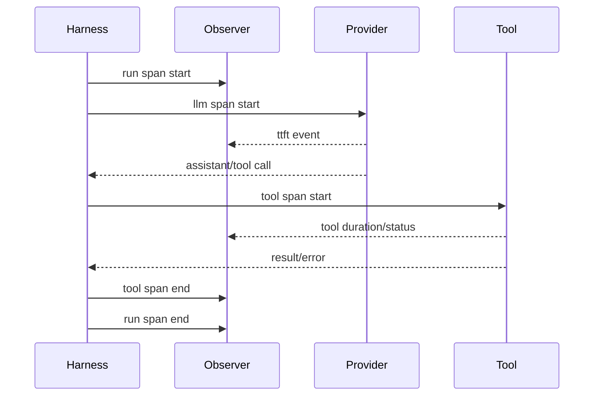

# 设计一次 Agent Run Trace

```text
run: refactor-auth
├── llm.request attempt=1 latency=1.2s input=... output=...
├── tool.read duration=15ms error=false
├── tool.grep duration=42ms error=false
├── llm.request attempt=1 latency=0.9s
├── tool.edit duration=21ms
├── tool.bash duration=3.1s exit=1
└── llm.request final
```

## 关联和采样

用 `traceId` 关联一次 run，`spanId` 表示请求/Tool，`sessionId` 关联持久化会话，`toolCallId` 关联模型调用和结果。高成本 payload 不应全量采样；生产可保留耗时、状态、token、错误类型和脱敏摘要。

## 练习

在 Go/Java `EventBus` 上挂一个 telemetry listener，生成上述树；测试 Tool exception、Provider 429→retry、abort 和 compaction。断言即使失败也有结束 span，且输出中不含 API key 或文件正文。

## 核心问题

可观测性不是把所有内容打印出来，而是让一次运行的状态转换、成本和故障可以被关联、聚合和诊断。
## 教材级重写

### Trace 的四层结构

把一次“修复测试失败”运行展开：

```text
run r-1
├── context.build
├── llm.request attempt=1
│   └── stream
├── tool.read call=a
├── tool.grep call=b
├── llm.request attempt=2
├── tool.edit call=c
├── tool.bash call=d status=error
└── llm.final
```

`run` 是根 span，`llm.request`、`tool.*`、`compaction` 是 child；stream chunk 更适合作为 event，不要为每个 token 创建 span。输入是 Runtime lifecycle，输出是 span tree 与 metrics projection。

### IDs 与关联

- `traceId`：一次诊断 trace 的根。
- `runId`：一次 Agent operation，可能在 retry/compaction 中继续。
- `sessionId`：跨运行的持久会话。
- `lane`：并行/线程工作边界（若系统有 lane）。
- `spanId`/`parentSpanId`：因果树关系。
- `toolCallId`：模型 Tool Call 与 Tool Result 的配对。
- `responseId`：Provider response，不能替代 runId。

不要用模型返回的文本或 Tool 名作为唯一 id；重试可能有同名 Tool，多租户环境也可能同名 session。

### Span 生命周期与取消

```text
start span
 -> set safe start attributes
 -> perform async work
 -> record event/error/status
 -> end exactly once
```

如果 Promise/Future/goroutine 被取消，span 仍要结束为 cancelled；如果 telemetry exporter 失败，span end 不能再次触发业务副作用。一个 `defer`、try-with-resources 或 finally 是结构保证，但仍要测试“同步 throw”和“异步 reject”。



Observer 只能收集；即使 observer handler 抛错，也不应改变 Tool Result。安全 hook 与 telemetry listener 是不同概念。

### Logs 与 traces 的实战判断

日志适合单条错误上下文，例如 `tool_error reason=timeout`；trace 适合从 run 跳到对应 LLM 和 Tool；metric 适合报警，例如 `agent_run_error_rate`。在日志里复制完整 trace tree 会造成重复和泄露，应使用 traceId 链接。

### 采样与隐私

默认采集 provider/model、duration、TTFT、usage、stop reason、status、error class、tool name 和 output length。敏感 payload 采用 hash、长度、schema version 或 allowlisted redacted fields；采样策略应按租户、环境和错误类型分开。API key、Authorization、cookie、文件正文和完整 prompt 禁止进入默认 span。

### 失败场景实验

**目标**：验证 trace 在失败路径仍然完整。

**准备**：Go/Java event sink、fake Provider、Tool；为每种异常配置固定脚本。

**步骤**：

1. Provider 429 后 retry，断言 root、两次 request span 都有 end。
2. Provider 返回 malformed JSON，断言 status=parse_error。
3. Tool 抛 exception、超时、用户 abort，断言 tool span 与 run span 有明确 outcome。
4. Context 过长触发 compaction，断言 compaction 是独立 child。
5. listener/exporter 自己抛错，断言 Agent 仍按业务结果继续或失败，不被 observer 改写。
6. 多个并行 Tool 完成顺序打乱，断言 source order 只影响 message/result，不能改变 trace parent。

**观察点**：查看 span 树而不是只看 console；对照 `toolCallId`，确认每个 Tool Call 至多一个逻辑结果。

**预期结果**：任何结束路径都有一个 terminal status，重复 end 被忽略或报告内部错误，不会产生双计费/双状态。

**思考题**：为什么每个 streaming token 不应创建 span？如何用 event 观察 token throughput 而不暴露 token 内容？

### Go/Java 代码边界

Go 的 callback 可以在 `defer` 中 finish；Java 的 `try (SpanScope ignored = ...)` 在 checked/unchecked exception 都会结束。若使用 `ExecutorService`/Future，提交任务和实际运行要分别记录 queue wait 与 execution duration；若使用 `context.Context`，取消发生时间应作为 event，而不是把整个 span 删除。

### 小结

Trace 的价值在于因果关系和可诊断性，不是“打印更多”。定义稳定 IDs、parent、终止状态和隐私边界，再实现 exporter；这样 run、LLM、Tool、retry、abort 和 compaction 才能被同一棵树解释。
### 设计审查问题

1. 一个 retry 是新的 LLM span 还是覆盖旧 span？应保留每次 attempt。
2. 并行 Tool 的 parent 是同一个 turn 吗？是，但 `toolCallId` 必须不同。
3. abort 后 span 是否结束？是，状态应为 cancelled/aborted。
4. compaction 算 LLM request 吗？如果调用模型，它有自己的 child span；压缩操作本身也要有 span。
5. exporter 崩溃会不会改变业务？不应该。

### 可执行验收

用一个 counting observer 记录 `start`/`end` 数量，运行成功、Tool error、429 retry、malformed JSON、timeout 和 abort 六组脚本。断言每个已开始的 span 恰好结束一次；断言每个 Tool Call 的 `toolCallId` 在 request、executor、result 和 trace 中一致；断言默认输出不含敏感正文。

### 小结

Trace 不是日志的长列表，而是一棵带因果关系的状态投影。稳定 ID、严格终态、采样和隐私策略比接入某个 exporter 更重要。
### Trace 与恢复的边界

Trace 可以帮助定位“哪个 effect 未返回”，但不是 durable ledger。崩溃恢复必须读取 Session/operation records；不能因为 trace 里有 `tool.start` 就假定 Tool 一定执行成功。反过来，telemetry 丢失也不应阻止 durable state 正常恢复。

**复盘练习**：删除一半 telemetry events，保持 Session records 不变，验证 Agent 仍能恢复；再保留完整 trace 但删除 Tool result，验证系统仍把结果视为未知而不是成功。
### 终态定义

建议固定 `ok`、`error`、`cancelled`、`timeout`、`aborted`、`unknown` 等少量终态，并把 provider 原始错误放到受控 attributes。`unknown` 很重要：response 丢失时不能伪装成 error 或 success，否则恢复和计费会被误导。所有 span 的终态应由 owner 写入，observer 只投影。

**验收问题**：一个已开始但没有返回的外部 Tool，trace 与 durable record 分别应该显示什么？

### 学习目标

读完本页后，你应能用源码、一个最小数据流和一次失败测试解释本主题，而不是只复述术语。

### 前置知识

先熟悉 HTTP/JSON、Agent Loop、Tool Result 与基本的 Java/Go 接口；不需要先安装生产框架。

### 可执行实验

**目标**：把本页的边界变成一个可观察测试。

**准备**：使用临时目录、fake provider 或 `ScriptedModel`，不要使用真实凭据。

**步骤**：记录输入；运行一次成功路径；制造一个参数、取消或权限错误；检查事件、结果、状态和副作用次数。

**观察点**：不要只看最终文本，查看真正的 request、Tool Result、registry、Session 或 trace。

**预期结果**：能够指出哪一层拥有该事实，以及失败是否可重试。

**思考题**：如果输出丢失但副作用已发生，应该如何恢复？
