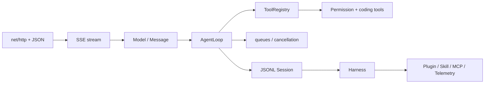

# Go Agent 实现路线

代码位于 `examples/go-agent/`，模块使用 Go 1.21 语法，当前环境用 Go 1.25.6 验证。它不依赖 LangChain 等框架；所有模型行为由 `ScriptedModel` 驱动，真实 HTTP 请求是显式选择。



## 阶段清单

| 页面 | 代码结果 |
| --- | --- |
| Go 01–02 | `HTTPModel`、SSE delta 和 ScriptedModel |
| Go 03–05 | `Tool`、schema gate、read/write/edit/grep/shell |
| Go 06–08 | Agent Loop、事件、并行、retry、`context.Context` abort |
| Go 09–11 | JSONL Session、估算压缩、steering/follow-up |
| Go 12–14 | explicit plugin、Skill metadata、stdio JSON-RPC MCP |
| Go 15 | `Harness` 组合和 Telemetry recorder |

运行：

```bash
cd ai-agent-learning/examples/go-agent
go test ./...
go vet ./...
go run ./cmd/agent --demo
```

每个阶段先读对应教材，再读测试；测试使用 `ScriptedModel`，不需要 API key。
