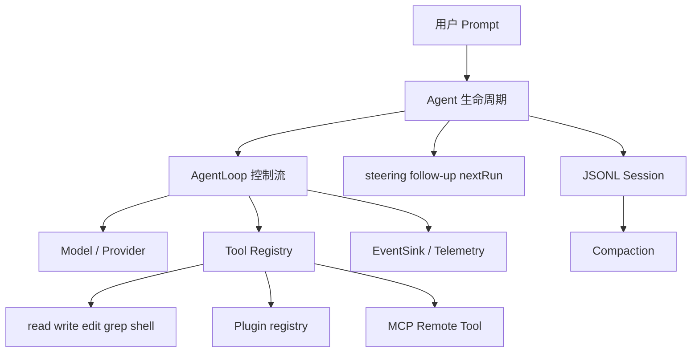

# Go Agent Runtime：阶段总览

这是一张 runtime 连接页，不是新的编号阶段：前面的 Loop 已能完成一次任务，但进程退出、上下文变长、能力扩展和外部进程接入都还没有位置。本页先解释后续阶段如何连接，具体 API 仍以各阶段源码和页面为准。

## 本页完成什么

- 说明 Session 如何保存 Message JSONL，并在进程重启后恢复。
- 说明 compaction 如何在 token 预算不足时保留 system/尾部并插入 summary。
- 说明 steering、follow-up、next-run 的消费边界。
- 说明显式 Plugin registry、Skill metadata 和 MCP JSON-RPC client 的组合。
- 画出运行时每一层的输入、输出和失败边界。

## 本页不完成什么

当前示例不是 durable v2 Harness。Session 是本地 transcript，不是 operation ledger；compaction 是确定性估算，不是 provider tokenizer；MCP client 是串行 newline-delimited JSON-RPC，不是完整 MCP SDK；Plugin 没有进程隔离。

## 前置知识

完成 Go 01–08，能看懂 `Message`、`AgentLoop`、`context.Context`、Tool 和 Event。先运行：

```bash
cd ai-agent-learning/examples/go-agent
go test ./...
```

## 运行时分层



每个箭头都代表数据边界：Prompt 不是直接执行 shell；MCP 返回的工具先适配为本地 Tool；Session 保存的是 Message，不是模型上下文里的任意临时 callback。

## Session：从内存到文件

`Session` 是一个带 mutex 的 Message slice。保存时当前实现先写临时文件，再 rename：

```go
func (s *Session) Save(path string) error {
    messages := s.Snapshot()
    temporary := path + ".tmp"
    file, err := os.Create(temporary)
    if err != nil { return err }
    encoder := json.NewEncoder(file)
    for _, message := range messages {
        if err := encoder.Encode(message); err != nil {
            _ = file.Close()
            return err
        }
    }
    if err := file.Close(); err != nil { return err }
    return os.Rename(temporary, path)
}
```

临时文件减少“直接覆盖导致半文件”的概率；它仍不是跨平台和跨进程的完整 atomic commit。`LoadSession` 一行一行解码，坏 JSON 应带行号返回。

```text
Session.Snapshot
 -> Agent/Harness 复制 history
 -> Loop 运行
 -> Session.Replace(result.Messages)
 -> Save JSONL
```

保留 `Message.Timestamp`、Role、ToolCallID 和 IsError，才能在恢复时判断 tool result 属于哪个 call。当前 Session 不记录 operation id、attempt、tool intent 或 external side effect 状态。

## Compaction：有限的教学策略

`Compact(messages, maxTokens)` 用估算 token 数决定是否压缩。教学策略通常是：保留 system message、插入 summary、保留最近尾部：

```text
old history: system + a + b + c + d + e
budget too small
compact:     system + summary(a..d) + e
```

不能只删除前半段：模型会失去关键约束和工具结果。也不能把 summary 当成原始 tool result 的等价替代；摘要可能遗漏路径、错误或未完成动作。

压缩的失败边界包括：

- `maxTokens <= 0` 的参数错误或默认策略。
- 没有足够消息可压缩。
- summary 生成失败（真实实现可能调用模型，当前示例是确定性的）。
- 压缩后仍超过预算，需要再次处理或报告无法压缩。

Pi 的 compaction 还要处理 branch summary、retained tail、tool pairing 和 session tree；Go 示例只用于建立概念。

## 队列边界

`Agent` 包裹 Loop 并保存三类队列：

| 方法 | 需要运行中 | 何时消费 | Abort 后 |
| --- | --- | --- | --- |
| `Steer` | 是 | 下一次 model request 前 | 丢弃 |
| `FollowUp` | 是 | assistant 无 Tool Call 的 finish boundary | 丢弃 |
| `NextRun` | 否 | 下一次 `Prompt` 开始时 | 保留 |

对应实现：

```go
func (a *Agent) Prompt(ctx context.Context, text string) (RunResult, error) {
    a.mu.Lock()
    if a.running { a.mu.Unlock(); return RunResult{}, errBusy }
    initial := append([]Message(nil), a.nextRun...)
    a.nextRun = nil
    initial = append(initial, Message{Role: RoleUser, Content: text})
    runContext, cancel := a.beginRunLocked(ctx)
    a.mu.Unlock()
    return a.execute(runContext, cancel, initial)
}
```

清空 `nextRun` 和设置 `running` 在同一把锁内，避免两个并发 Prompt 同时消费相同的输入。队列消息不能随便插进当前 HTTP request；它们只在 Loop 检查边界时进入 history。

## Plugin：显式注册而不是 native plugin

Go Plugin contract：

```go
type Plugin interface {
    Name() string
    Register(*Registry) error
    Close() error
}

type PluginManager struct { plugins []Plugin }
```

`PluginManager.Load` 调用 `Register`；registry 拒绝空名和重复 Tool。示例选择显式 registration，不使用 Go 原生 `plugin` package，因为 native plugin 对平台、编译器和部署方式有约束。插件失败应该让 Harness 启动失败或明确记录，不能静默少装一个 Tool。

## Skill：metadata 与正文分开

`DiscoverSkills(root)` 搜索目录下的 `SKILL.md`，读取 frontmatter 的 `name`、`description`、`path`，但不把完整正文全部塞入每次 Model Request：

```text
启动 -> 发现 name/description/path
模型判断需要 review
 -> ReadSkill(skill.path)
 -> 将正文作为当前任务 context
```

这是 progressive disclosure。metadata 用于选择，正文用于执行，脚本和 references 仍要经过权限边界。解析失败要报告文件路径和 frontmatter 错误，不能把无名 skill 当作可执行能力。

## MCP：把远端 Tool 适配到 Registry

示例 `MCPClient` 使用 stdin/stdout 每行一个 JSON-RPC message：

```go
type MCPClient struct {
    input  io.Reader
    output io.Writer
    nextID int
}

func (c *MCPClient) Call(ctx context.Context, method string, params any) (json.RawMessage, error) {
    id := c.nextID
    c.nextID++
    request := map[string]any{"jsonrpc":"2.0", "id":id,
        "method":method, "params":params}
    if err := json.NewEncoder(c.output).Encode(request); err != nil { return nil, err }
    // 当前教学实现随后读取 response 并校验 id；完整代码见 mcp.go。
    return readMatchingResponse(ctx, c.input, id)
}
```

真实 MCP 生命周期通常是 `initialize` → capability 协商 → `tools/list` → `tools/call`。本示例直接演示 list/call 的最小 boundary，生产代码必须补齐 initialize、超时、并发 dispatcher、断连和权限。

Remote Tool 的关键不是“把远程函数暴露给模型”，而是：

```text
MCP tools/list
 -> RemoteTool Definition
 -> Agent Request tools
 -> model ToolCall
 -> Registry/RemoteTool.Execute
 -> MCP tools/call
 -> ToolResult
 -> 下一轮 Model
```

## 失败 trace

### JSONL 损坏

```text
LoadSession line 7
 -> json.Decoder.Decode
 -> return line 7 error
 -> 不把部分 session 静默当完整历史
```

### 队列错误

```text
Agent.Steer while idle
 -> queue requires an active run
 -> 不写入 steering
```

### MCP id 不匹配

```text
send id=3
 -> read id=4
 -> client returns response id mismatch
 -> 不把别的请求结果交给当前 Tool
```

### Skill frontmatter 无效

```text
SKILL.md missing name/description
 -> DiscoverSkills returns parse/validation error
 -> 不把 unknown skill 放入 prompt
```

## 测试设计

- `TestSessionPersistenceAndCompaction`：保存 JSONL、加载两条消息、压缩较长 history。
- `TestSkillDiscoveryAndPluginRegistration`：临时目录创建 SKILL.md，确认 metadata；显式插件注册 count Tool。
- `mcp_test.go`：使用 in-memory pipes/fake server，断言 JSON-RPC method、id、result 和错误。
- `agent_test.go`：abort 阻塞 model，确认 `context.Canceled` 返回。

所有测试都使用 `t.TempDir`、`ScriptedModel` 或 fake transport。它们分别隔离 filesystem、model decision 和协议 IO。

## 运行方式

```bash
cd ai-agent-learning/examples/go-agent
go test ./... -run 'Session|Skill|MCP|Harness'
go test -race ./...
go vet ./...
```

## 与 Pi 对照

研究 commit：`853a80d26c90a14c1886f0ebb8ffaae133ca2185`。

- `packages/agent/src/agent.ts` 的 `PendingMessageQueue`、`steer`、`followUp`、`abort` 对应 Go `Agent`。
- `packages/agent/src/harness/session/` 的 Session/State/Context 分层远比 Go Session 丰富。
- `packages/agent/src/harness/compaction/` 处理 branch summarization 和压缩恢复；Go `Compact` 是教学策略。
- `packages/coding-agent/src/core/extensions/loader.ts`/`runner.ts` 是 Pi 的扩展加载与事件边界；Go 用显式 registry。
- Pi Core 默认不把 MCP 当作内建 provider；Go client 是独立可接入协议示例。

## Java 对照

Java `Session` 用 Jackson JSONL，`ServiceLoader` 用 `META-INF/services` 发现插件，`ExecutorService` 执行并行 calls；Go 使用显式注册、goroutine/WaitGroup 和 `json.Decoder`。Java 的 `CancellationToken` 对应 Go Context，但都要求实际 Model/Tool 主动检查取消。

## 实验：从内存 Loop 走到恢复

### 目标

观察一次 prompt 的 history 如何写入 JSONL，并确认恢复后不会丢失 Tool Result。

### 准备

使用 `t.TempDir()`，打开 `harness.go`、`session.go` 和 `session_test`；运行指定测试。

### 步骤

1. 创建 Harness，传入 ScriptedModel 和临时 session path。
2. 让模型第一轮返回 calculator call，第二轮返回 final。
3. 调用 `Harness.Prompt`，打印 `Session.Snapshot()`。
4. 读取 JSONL，观察每行一个 Message。
5. 新建 Harness，通过 `LoadHarness` 读取文件。
6. 对比 reload 前后的 Role、ToolCallID、Content。
7. 把文件第 2 行改坏，确认加载报错而不是静默截断。

### 观察点

Session 保存 transcript；它不知道一个 shell 是否已经产生外部副作用。真正的 durable Harness 还要保存 intent、result 和 terminal outcome。

### 预期结果

成功保存两轮历史，reload 后消息数量和关键字段相同；损坏 JSONL 给出明确错误。

### 思考题

如果写文件后进程在 rename 前崩溃，临时文件怎么处理？如果 MCP response id 不匹配，为什么不能“取最近一条 response”？如果 Skill 正文包含危险 shell，谁负责授权？

## 小结与下一阶段

Session、Compaction、队列、Plugin、Skill 和 MCP 都是 Runtime/Harness 的外围能力，不是 LLM 自己的能力。下一页专门实现 read/write/edit/grep/shell 的增量实验，并把这些边界连接到真实副作用。
