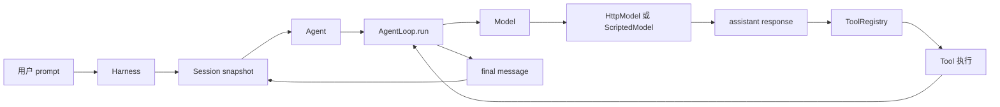

# Java Agent 实现路线

本章不是一个已经封装好的 Java SDK 使用说明，而是一条从零实现 Agent 的路线。你会先看见 HTTP 和 JSON，再亲手把消息、Tool、Agent Loop、取消、并行、Session 和 Harness 串起来。

## 本阶段目标

完成本章后，你应该能够：

1. 用 `java.net.http.HttpClient` 发出一次 OpenAI-compatible Chat Completions 请求。
2. 解释 `HttpRequest`、`HttpResponse`、状态码、header、JSON body 和认证之间的关系。
3. 读取 SSE 的 `data:` 行，把多个 delta 组装为一个 assistant response。
4. 用 Java `interface` 和 `record` 表达 Model、Message、Tool、ToolCall 和 ToolResult。
5. 看懂 `AgentLoop.run` 如何增长 history、发送下一次 request 和判断停止。
6. 选择 `SEQUENTIAL` 或 `PARALLEL` Tool 执行，并保持 Tool Result 的 source order。
7. 把 retry、backoff、`CancellationToken` 和线程中断放进正确的边界。
8. 在受限 workspace 内实现 `read`、`write`、`edit`、`grep` 和 `shell`。
9. 用 JSONL Session、SPI Plugin、Skill discovery、MCP client 和 Telemetry 组成 Harness。

## 本章的边界

示例是教学级 Harness，不是生产 Coding Agent。它没有实现完整的 durable operation ledger、崩溃恢复、exactly-once 外部副作用、OS sandbox、网络隔离或多进程 writer 协议。

`PermissionPolicy` 只做 workspace 路径检查和明显危险命令拦截；`McpClient` 只演示串行 JSON-RPC over stdio；`Compactor` 只做确定性的摘要占位。正因为边界小，测试才能直接指出每一次状态变化。

## 从用户输入到结果



图中的箭头不是网络调用的全部细节。`Harness` 先从 Session 得到历史；`AgentLoop` 再把历史和 Tool definitions 交给 `Model`；模型返回 Tool Call 后，Loop 才让 Registry 查找并执行 Tool。只有 `Tool.execute` 能产生文件或进程副作用。

## 每个阶段新增什么

| 阶段 | 新问题 | 主要文件 | 本阶段的可验证结果 |
| --- | --- | --- | --- |
| Java 01 | 一次请求怎样到达模型？ | `HttpModel.java` | fake HTTP server 收到 JSON、认证和 model id |
| Java 02 | 长回答怎样逐块返回？ | `HttpModel.stream` | SSE delta 拼成完整文本，断流不被伪装成成功 |
| Java 03 | 模型怎样提出结构化动作？ | `Tool.java`、`ToolRegistry.java` | unknown/invalid call 不进入 execute |
| Java 04 | 多轮循环怎样停止？ | `AgentLoop.java` | 第二次 request 含 assistant call 和 Tool Result |
| Java 05 | 文件和 shell 如何受限？ | `BuiltInTools.java` | workspace、超时、输出上限和非零退出可测试 |
| Java 06 | 一次 request 看到了什么？ | `Message.java`、`Request.java` | history 与 provider payload 边界清楚 |
| Java 07 | 如何重试和取消？ | `CancellationToken.java` | retry 有上限，abort 传播到模型和 Tool |
| Java 08 | 如何观察但不改变状态？ | `Event.java`、`EventSink.java` | event 能记录 step/tool 生命周期 |
| Java 09 | 进程重启后怎样继续？ | `Session.java` | JSONL 可保存、加载、发现坏行 |
| Java 10 | Context 过长怎么办？ | `Compactor.java` | 保留 system 和尾部，明确压缩损失 |
| Java 11 | 运行中如何接收新指令？ | `Agent.java`、`QueueSource.java` | steering/follow-up/nextRun 在边界消费 |
| Java 12 | 不改核心怎样加 Tool？ | `AgentPlugin`、`ServiceLoader` | SPI plugin 可发现、注册、关闭 |
| Java 13 | 能力说明如何按需加载？ | `SkillDiscovery.java` | 只暴露 metadata，正文延迟读取 |
| Java 14 | 外部进程如何提供 Tool？ | `McpClient.java` | JSON-RPC `tools/list`/`tools/call` 可测试 |
| Java 15 | 谁负责组合？ | `Harness.java` | Model、Loop、Session、Policy、Plugin、Telemetry 汇合 |

## Java API 与 Agent 语义

Java 的 `Future`、线程池和 callback 只是实现手段，不等于 Agent 语义。Agent 语义是：每一轮模型请求都有一个合法、完整、可解释的 history；每个 Tool Call 都必须和 Tool Result 配对；取消和失败必须保留可诊断的前缀。

本示例使用同步 `Model.complete`，在并行 Tool 阶段使用 `ExecutorService` 和 `Future`。如果以后需要异步 facade，可以用 `CompletableFuture` 包装这个同步边界，但不能因为换了 future 类型就省略 cancellation、timeout 和错误分类。

## 运行方式

```bash
cd ai-agent-learning/examples/java-agent
mvn test
mvn package
java -jar target/agent-harness-1.0.0.jar --demo
```

预期 demo 输出包含：

```text
工具结果：5
final> 2 + 3 = 5
```

实际输出的工具行格式由 `Main` 决定，关键断言是 calculator 先得到 `5`，第二轮模型再得到 `2 + 3 = 5`。demo 使用 `ScriptedModel`，不会访问真实 Provider。

## 测试策略

每个阶段都先写 fake 或 scripted test，再尝试真实 HTTP。`ScriptedModel` 可以预先排好 response：第一轮返回 `ToolCall`，第二轮返回 final text；因此测试可以断言 request 数量、history 内容、Tool 是否执行和 `maxSteps` 是否生效。

HTTP 测试使用 JDK `HttpServer`，绑定本机随机端口。MCP 测试使用 `PipedInputStream`/`PipedOutputStream` 模拟另一端。文件测试使用临时目录。任何测试都不应把 API key、真实 home 目录或付费 endpoint 作为前置条件。

## 与 Pi 的关系

研究 commit：`853a80d26c90a14c1886f0ebb8ffaae133ca2185`。

- Pi 的 provider-neutral 类型在 `packages/ai/src/types.ts`；本示例的 `Message`、`Request`、`Response` 是缩小后的学习版本。
- Pi 的模型选择和 provider dispatch 在 `packages/ai/src/models.ts`；本示例先只实现一个 OpenAI-compatible adapter。
- Pi 的 Agent Loop 在 `packages/agent/src/agent-loop.ts`；本示例的 `AgentLoop.run` 展示同样的“assistant → Tool → Tool Result → 下一轮”主线。
- Pi 的生命周期与队列在 `packages/agent/src/agent.ts`；本示例用 `Agent` 和 `QueueSource` 学习 steering/follow-up。
- Pi Coding Agent 把 Session、资源、工具和 UI 组合在 `packages/coding-agent/src/core/agent-session.ts`；本示例把同样的组合缩小到 `Harness`。

Pi 不是这份 Java 代码的依赖，也不是 Java 代码要复制的唯一答案。每个阶段都要先理解责任边界，再比较语言实现。

## Java、Go、Pi 三方对照

| 能力 | Pi/TypeScript | Go 示例 | Java 示例 |
| --- | --- | --- | --- |
| Model | Provider adapter | `Model.Complete` | `Model.complete` |
| Cancellation | `AbortSignal` | `context.Context` | `CancellationToken` + interruption |
| Async | `Promise`/`AsyncIterable` | goroutine/channel | `ExecutorService`/`Future` |
| Tool | `AgentTool` | `Tool` interface | `Tool` interface |
| Event | event stream/callback | `EventSink` | `EventSink` Listener |
| Plugin | Extension loader | explicit registry | `ServiceLoader` SPI |
| Session | SessionManager | JSONL Session | JSONL Session |

表格只说明对应问题，不表示三套系统的功能等价。尤其是 Pi 的 Provider 适配和 Session tree 比教学实现更丰富。

## 动手实验：建立阶段日志

### 目标

在不改变 Agent 行为的情况下，为每次模型请求、Tool 执行和 Session 保存打印一条带 step 的日志。

### 准备

先运行 `mvn test` 和 `--demo`。阅读 `AgentLoop.run`、`Harness.prompt` 和 `EventSink`。

### 步骤

1. 在 `LoopOptions.events` 中收集 `Event`。
2. 打印 `event.type()`、`event.step()` 和 `event.detail()`。
3. 对照 `ScriptedModel.requests()`，检查事件和 request 的顺序。
4. 在 calculator 第二轮前打印 history 的 role 列表。
5. 不要在 event listener 中修改 Session 或重新调用模型。

### 观察点

一个 assistant Tool Call 不是一个 Tool Result；`tool_start` 和 `tool_end` 之间才是执行区间。`run_end` 只能在没有 follow-up 或达到明确终止语义时出现。

### 预期结果

日志能回答：哪一步发了模型请求、哪一个 Tool 被调用、Tool Result 何时进入 history、最终 response 何时产生。

### 思考题

如果 event listener 自己追加一条 Message，会不会形成第二个状态机？如果 `Future` 被取消，远端 HTTP request 一定被撤销吗？如果 Session 保存成功但进程在显示 final 前崩溃，下一次启动应该依靠哪一种事实恢复？

## 小结与下一阶段

从 Java 01 开始，不要跳过 HTTP 和消息协议直接写 `while`。先证明模型返回什么，再证明 Runtime 如何执行，再把副作用、状态和可靠性逐层加回来。下一页从 `HttpClient` 和一次可测试请求开始。
