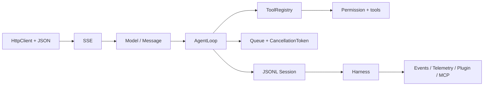

# Java Agent 实现路线

代码位于 `examples/java-agent/`，目标是让熟悉 Java 后端的读者看到 interface、record、`HttpClient`、`ExecutorService`、`Future`、Listener、SPI 和结构化取消如何组成 Agent。



运行：

```bash
cd ai-agent-learning/examples/java-agent
mvn test
mvn package
java -jar target/agent-harness-1.0.0.jar --demo
```

真实 HTTP 模式需要 `AGENT_MODEL_URL`、`AGENT_MODEL`、`AGENT_API_KEY`，测试不访问真实 API。
