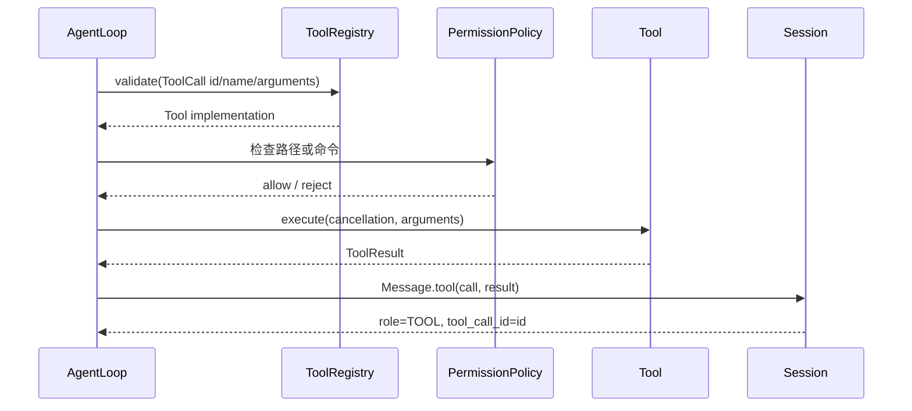

# Java 03：Tool Interface 与 Registry

## 本阶段要解决的问题

Java 01 只会把用户消息发送给模型，Java 02 会读取流式文本。现在加入 Tool Calling，但先不急着写完整循环。本阶段只回答一个问题：**模型说“请调用某工具”时，Java Runtime 如何确认这次调用可以执行？**

完成后，你应该能解释以下事实：模型输出的是 `ToolCall` 数据，不是 Java 方法调用；`ToolDefinition` 是发送给模型的说明；`ToolRegistry` 是 Runtime 的目录；`Tool.execute` 才可能产生文件、进程或网络副作用。

本阶段暂不负责：多轮 Agent Loop、并行执行、Session、MCP 远程工具和生产级 JSON Schema 验证。把闸门单独做出来，后面的 Loop 才不会把“模型请求”误当成“已授权动作”。

## 前置知识

需要掌握四个 Java 概念：

1. **interface** 只声明能力，不保存某个工具的实现细节。`Tool` 可以由文件工具、计算器或 MCP 代理实现。
2. **record** 适合表示不可变数据。`ToolCall`、`ToolDefinition` 和 `ToolResult` 都是传递边界上的值。
3. **JsonNode** 是 Jackson 的 JSON 树节点。它可以表示字符串、数组和对象，适合处理模型参数这种运行时才知道结构的数据。
4. **List.copyOf** 产生不可变快照。模型请求不应该在提交后被其他线程偷偷修改。

`JsonNode` 不等于已经验证过的参数。`ObjectNode` 只说明它是 JSON object；它没有自动保证 `path` 存在、类型正确或路径在 workspace 内。

## 上一阶段输入与本阶段新增接口

Java 02 的 `Request` 已包含 `List<Message>` 和 `List<ToolDefinition>`，但工具列表还是空的。本阶段使用下面三个边界：

```java
public interface Tool {
    ToolDefinition definition();

    ToolResult execute(
            CancellationToken cancellation,
            JsonNode arguments) throws Exception;
}
```

`definition()` 是纯描述，应该在构建每次 `Request` 时被读取。`execute()` 是副作用边界，必须在 schema gate、权限检查和取消检查之后调用。

```java
public record ToolDefinition(
        String name,
        String description,
        JsonNode schema) {
    public ToolDefinition {
        if (name == null || name.isBlank()) {
            throw new IllegalArgumentException("tool name is required");
        }
        description = description == null ? "" : description;
        if (schema == null || !schema.isObject()) {
            throw new IllegalArgumentException(
                    "tool schema must be an object");
        }
    }
}
```

这段 record 的输入是工具元数据，输出是不可变的三个字段；构造函数会在注册前拒绝空名称和非 object schema。它没有执行工具，也没有把 schema 变成完整的 JSON Schema validator。

## `ToolCall` 与 `ToolResult` 是两种不同事实

```java
public record ToolCall(
        String id,
        String name,
        JsonNode arguments) {
    public ToolCall {
        if (id == null || id.isBlank()) {
            throw new IllegalArgumentException(
                    "tool call id is required");
        }
        if (name == null || name.isBlank()) {
            throw new IllegalArgumentException(
                    "tool call name is required");
        }
        if (arguments == null || !arguments.isObject()) {
            throw new IllegalArgumentException(
                    "tool arguments must be a JSON object");
        }
    }
}
```

`id` 用来把 assistant 的调用和后续 `TOOL` 消息配对。模型可以返回两个同名调用，但它们必须拥有不同的 `id`。`arguments` 是候选输入，不能因此推断工具已经执行。

```java
public record ToolResult(
        String content,
        boolean isError,
        boolean terminate) {
    public ToolResult {
        content = content == null ? "" : content;
    }

    public static ToolResult error(String message) {
        return new ToolResult(message, true, false);
    }
}
```

`ToolResult` 是 Runtime 执行后的结果。`isError` 让下一轮模型知道调用失败；`terminate` 是教学实现给 Loop 的停止提示。注意：权限拒绝、未知工具和参数缺失也可以变成 error result，但它们不应该调用真实 Tool。

## Registry 是什么，不是什么

```java
public final class ToolRegistry {
    private final Map<String, Tool> tools = new LinkedHashMap<>();

    public synchronized void register(Tool tool) {
        String name = tool.definition().name();
        if (tools.containsKey(name)) {
            throw new IllegalArgumentException(
                    "tool already registered: " + name);
        }
        tools.put(name, tool);
    }

    public synchronized Tool find(String name) {
        return tools.get(name);
    }

    public synchronized List<ToolDefinition> definitions() {
        return tools.values().stream()
                .map(Tool::definition)
                .toList();
    }
}
```

`LinkedHashMap` 保留注册顺序，让测试和 provider 请求稳定；`synchronized` 保护注册和查询之间的竞态。Registry 不执行工具、不审批危险命令，也不负责保存 Session。它只提供名称到实现、名称到 definition 的映射。

如果同名工具允许后注册者覆盖，插件可以悄悄替换 `read` 或 `shell`。当前示例选择 fail-fast；生产系统也可以采用显式版本和 capability，但不能静默覆盖。

## Schema gate：先验证，再执行

示例 Registry 实现了一个教学级 `required` 检查：

```java
public Tool validate(ToolCall call) {
    Tool tool = find(call.name());
    if (tool == null) {
        throw new IllegalArgumentException(
                "unknown tool: " + call.name());
    }
    JsonNode required = tool.definition().schema().get("required");
    if (required instanceof ArrayNode requiredNames) {
        for (JsonNode name : requiredNames) {
            if (!call.arguments().has(name.asText())) {
                throw new IllegalArgumentException(
                        "missing required argument: " + name.asText());
            }
        }
    }
    return tool;
}
```

输入是带名称和 JSON object 参数的 `ToolCall`，输出是可执行的 `Tool`。第一步拒绝 unknown name；第二步读取 definition 中的 required 数组；第三步只检查字段存在。它没有验证 `type`、`enum`、格式或额外字段，因此生产系统需要真正的 JSON Schema validator。

一个 definition 示例：

```json
{
  "name": "read",
  "description": "读取 workspace 内的 UTF-8 文本文件",
  "parameters": {
    "type": "object",
    "properties": { "path": { "type": "string" } },
    "required": ["path"]
  }
}
```

注意 Pi/Provider 的外层字段可能叫 `input_schema` 或 `parameters`，但内部概念相同：给模型看的 schema 与 Runtime 真正使用的校验规则必须保持一致。不要因为模型收到了 `required: [path]`，就认为模型一定返回合法 path。

## 一次调用的完整生命周期



这里有四个不同对象：`ToolCall` 是模型输出，`Tool` 是注册的实现，`ToolResult` 是执行结果，`Message.tool` 是为了下一次模型请求而形成的消息。任何一步失败，都不应该伪造成功结果。

## 逐字段检查 `Message.tool`

```java
public static Message tool(ToolCall call, ToolResult result) {
    return new Message(
            Role.TOOL,
            result.content(),
            List.of(),
            call.id(),
            call.name(),
            result.isError(),
            0);
}
```

输入是调用及其结果，输出是一条 role 为 `TOOL` 的消息。`toolCallId` 必须沿用原来的 `call.id()`；如果改成数组下标，两个并行的同名调用会配错。`toolName` 便于日志和 provider 兼容层识别；`isError` 把失败事实传给下一轮模型；`timestamp=0` 让 record 构造器自动填充当前时间。

## 错误 trace：为什么 gate 必须在副作用之前

### unknown tool

```text
assistant tool_call {id:"c1", name:"delete_database"}
 -> registry.find("delete_database") == null
 -> 抛出 unknown tool
 -> 生成 error ToolResult
 -> execute 不被调用
```

### 缺少必填参数

```text
assistant tool_call {id:"c2", name:"read", arguments:{} }
 -> schema.required 包含 path
 -> arguments.has("path") == false
 -> 生成 missing required argument
 -> 文件系统没有被访问
```

### 工具内部失败

```text
ToolCall(path="missing.txt")
 -> registry 与 required 检查通过
 -> read.execute
 -> Files.readString 抛 NoSuchFileException
 -> AgentLoop 捕获并生成 isError=true
```

第三种情况与前两种不同：工具确实被调用了，但它没有返回成功结果。遥测和审计日志应该保留这个区别。

## 一个最小可测试 Tool

```java
Tool counter = new Tool() {
    @Override
    public ToolDefinition definition() {
        ObjectNode schema = mapper.createObjectNode().put("type", "object");
        schema.putArray("required").add("value");
        return new ToolDefinition("count", "记录一个值", schema);
    }

    @Override
    public ToolResult execute(
            CancellationToken cancellation,
            JsonNode arguments) {
        cancellation.throwIfCancelled();
        return new ToolResult(
                "counted " + arguments.path("value").asText(),
                false,
                false);
    }
};
```

这个实现展示了测试边界：definition 是纯元数据，execute 只在取消检查之后读取参数。真实的 `count` 仍可能需要检查 `value` 类型；本示例的 gate 只负责 required 存在性，所以不要把 `asText()` 的空字符串当作完整校验。

## 当前示例的安全边界

`ToolRegistry` 不是 sandbox。`BuiltInTools` 的 `PermissionPolicy` 负责 workspace 路径和明显危险命令；真正的生产系统仍应增加操作系统权限、容器、超时、网络策略、人工审批和 secret redaction。

`JsonNode` 也不是可信对象。模型可以返回 `{"path":"../../.ssh/id_rsa"}`；先经过 `PermissionPolicy.resolvePath`，才能决定是否拒绝。不要在 Tool 内部直接 `Path.of(arguments.path("path").asText())` 并读取。

## JUnit 测试清单

为这个阶段建立测试时，至少覆盖：

| 测试 | 准备 | 断言 |
| --- | --- | --- |
| definition 合法 | object schema、非空 name | `ToolDefinition` 创建成功 |
| 空 name | `name=""` | 抛 `IllegalArgumentException` |
| 非 object schema | `TextNode` | 抛 schema error |
| duplicate registration | 注册两次同名 Tool | 第二次 fail-fast |
| unknown tool | 调用 `missing` | Tool execute 次数为 0 |
| required 缺失 | `{}` | 返回 error ToolResult，次数为 0 |
| malformed call | 空 id 或非 object args | `ToolCall` 构造失败 |
| execute exception | Tool 主动抛错 | Loop 生成 error result |

测试应该使用 `AtomicInteger` 统计执行次数，而不是只看异常字符串。真正重要的不变量是：gate 失败时副作用计数仍为零。

运行单个测试：

```bash
cd ai-agent-learning/examples/java-agent
mvn -q -Dtest=AgentTest#invalidOrUnknownToolDoesNotInvokeTool test
mvn -q -Dtest=AgentTest#missingRequiredArgumentDoesNotInvokeTool test
```

当前项目的测试名称可能随实现调整；先用 `mvn test` 确认完整套件，再用 IDE 或 Surefire 报告定位单测。

## 与 Pi 源码对照

研究 commit：`853a80d26c90a14c1886f0ebb8ffaae133ca2185`。

- `packages/agent/src/types.ts` 的 `AgentTool` 描述 `name`、`label`、参数 schema、`execute` 和可选 `renderCall/renderResult`。
- `packages/agent/src/agent-loop.ts` 中 `prepareToolCall` 负责按名称查找和准备调用；`executePreparedToolCall` 才进入执行边界；`createToolResultMessage` 将结果放回消息历史。
- `packages/coding-agent/src/core/tools/index.ts` 的 `createTool`、`createToolDefinition` 和 `createCodingTools` 把 Coding Agent 工具装配进 registry。
- `packages/coding-agent/src/core/extensions/types.ts` 的 `ToolDefinition`/`defineTool` 是 Extension 注册工具的入口。

Pi 的核心契约比本示例丰富：有 tool call id、流式增量、渲染、权限和事件；Java 示例刻意只保留能观察 schema gate 的最小实现。当前本地 Pi 的具体行为以上述固定 commit 的 symbol 为准，不把 Java 的字段名反推成 Pi API。

## Go 对照

| Java | Go | 说明 |
| --- | --- | --- |
| `Tool` interface | `Tool` interface | 都把定义和执行能力放在同一抽象 |
| `ToolDefinition` record | `ToolDefinition` struct | 元数据可随请求复制 |
| `JsonNode` | `json.RawMessage` | 运行时 JSON，之后再解码 |
| `ToolCall.id()` | `ToolCall.ID` | 关联 assistant 与 tool result |
| `ToolRegistry.validate` | `Registry.Validate` | 执行前 gate |
| checked exception | `error` | 工具失败传播方式 |

Go 的 `json.RawMessage` 不会帮你验证 object；两边都必须把模型输入视为不可信数据。

## 动手实验

### 目标

写一个 `count` Tool，证明“看见 definition”与“执行 Tool”是两件事，并为每种 gate 失败保留证据。

### 准备

阅读 `Tool.java`、`ToolCall.java`、`ToolDefinition.java`、`ToolRegistry.java` 和 `AgentTest`。准备 JDK 21；不需要 API key。

### 步骤

1. 用 `ObjectNode` 创建 required 为 `value` 的 schema。
2. 注册 Tool，并打印 `registry.definitions()`，确认模型只能看到元数据。
3. 用 `{}` 创建 `ToolCall`，调用 `registry.validate`，确认抛 required 错误。
4. 用正确参数执行，记录计数器从 0 变成 1。
5. 再注册同名 Tool，观察 fail-fast。
6. 把 `value` 改成数组，记录当前简化 gate 没检查 type，并写下生产改进方案。

### 观察点

`definition()` 可以在不触发副作用的情况下被反复读取；`execute()` 只应在 lookup、schema、permission 和 cancellation 都通过后调用。`ToolCall.id()` 在多调用时比数组下标可靠。

### 预期结果

你能画出 `assistant ToolCall → Registry gate → Tool.execute → ToolResult → role=TOOL Message`，并说出每一步失败会留下什么证据。

### 思考题

如果两个 Tool 都叫 `read`，为什么静默覆盖危险？如果模型返回重复 id，应该由 Registry、Loop 还是 Session 拒绝？如果 after-tool hook 修改了结果，Telemetry 应记录原结果还是最终结果？

## 小结与下一阶段

Tool interface 解决“能力如何接入”，ToolDefinition 解决“模型能看到什么”，Registry 解决“名称如何找到实现”，schema gate 解决“什么输入允许到达副作用边界”。下一阶段把这些对象接入 `AgentLoop.run`，观察两轮模型请求如何形成。
