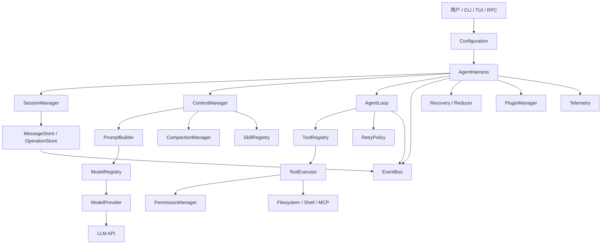
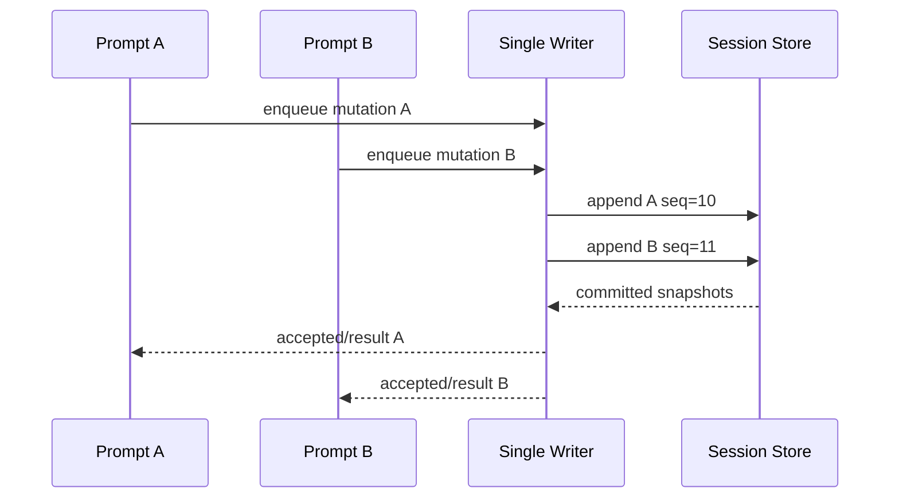

# 结课：AgentHarness 的完整架构

本页是阶段 19 的结课设计。它不是把十几个类画在一张图上，而是回答一个更具体的问题：**一次有副作用的 Agent 请求，如何从“用户接受”走到“可以恢复的终态”？**

## 学习目标

完成本页后，你应该能够：

1. 画出 `ModelProvider` 到 `Telemetry` 的完整依赖关系。
2. 区分 Agent Loop、Harness、Tool Runtime 和 UI 的职责。
3. 为一个 `edit` 操作定义 `acceptance → intent → effect → result → terminal` 边界。
4. 解释 single writer 解决的并发问题，以及它解决不了的远端副作用问题。
5. 为 Go、Java 和 Pi 分别指出真实入口、取消方式、持久化格式和插件边界。
6. 设计一次 crash-point 测试，并说明恢复后为什么不会重复执行副作用。

## 先看一个失败场景

用户输入：“把 `config.yaml` 中的超时时间改成 30 秒，然后运行测试。”模型可能先返回一个 `read`，再返回一个 `edit`，最后返回一个 `bash`。假设 `edit` 已经改写磁盘，但进程恰好在写入本地 session 之前崩溃：

```text
用户输入
  -> LLM 返回 edit(path=config.yaml, replacement=30s)
  -> Harness 校验参数
  -> 文件已改写
  -> 进程崩溃
  -> transcript 没有 tool result
  -> 重启后模型以为 edit 从未发生
  -> 再次 edit，副作用可能重复或覆盖人工修改
```

这里有两个独立事实：文件系统可能已经变化，session 却没有记录变化。只保存一条最终 transcript 不能回答“工具到底有没有执行”。成熟 Harness 必须在 effect 前写入意图，在 effect 后写入结果，并用终态告诉恢复器是否可以继续。

## 通俗解释：Harness 是交通控制台

把 Agent Loop 想成司机：它观察路况，决定下一步调用哪个工具。Harness 不是另一个司机，而是交通控制台：

- `ModelProvider` 决定如何把请求送到模型；
- `PromptBuilder` 决定模型这一轮看到什么；
- `ToolExecutor` 决定一个候选动作是否真的执行；
- `PermissionManager` 决定这条路是否允许通行；
- `MessageStore` 记录已经承诺过的事实；
- `SessionManager` 决定重启后从哪条分支继续；
- `EventBus` 告诉 UI 发生了什么，但不能替代 durable state；
- `RetryPolicy`、`CompactionManager` 和 `Recovery` 处理失败、上下文过长和崩溃。

严格地说，Harness 是围绕 Agent Loop 的生命周期与状态控制平面。它不能让模型变得更聪明，也不能因为保存了日志就自动获得沙箱能力。

## 总体架构



这张图的箭头表示调用或数据依赖，不表示信任自动传递。例如，MCP Server 的返回内容仍是不可信外部数据，Skill 的描述也不等于权限授权。

## 严格定义和三个状态

实现时不要把所有东西都放进 `Map<String,Object>` 或 `map[string]any`。至少分开三种状态：

```text
RunState     当前运行到哪里，包含 turn、step、队列和取消状态
DurableLog   已经写入 session 的 entries、records 和 terminal facts
Context      从 durable state、资源和配置计算出的本轮模型输入
```

它们的生命周期不同：`RunState` 可以在内存重建，`DurableLog` 是恢复依据，`Context` 是面向 Provider 的投影。事件是观察结果，不是第四种事实来源；事件丢失时，系统仍应能从 durable log 恢复。

## 模块一：ModelProvider 和 ModelRegistry

`ModelProvider` 是 Harness 与厂商 API 之间的端口。它至少要隐藏：认证、请求格式、流式事件、tool call 形状、usage、stop reason、retryable error 和 cancellation。

```go
type ModelProvider interface {
    Complete(ctx context.Context, request Request) (Response, error)
    Stream(ctx context.Context, request Request, onDelta func(string)) (Response, error)
}

type ModelRegistry interface {
    Resolve(provider, model string) (ModelProvider, error)
}
```

输入是内部 `Request`，输出是统一 `Response`；状态变化主要是 provider request 的 telemetry 和 usage record。失败点包括 429、5xx、坏 JSON、断流、认证失败和 context overflow。Provider 不应该决定 `edit` 是否允许，也不应该直接写 Session。

Java 示例的 `Model` 接口和 `HttpModel` 对应这层；Pi 的 `packages/ai/src/models.ts`、`packages/ai/src/types.ts` 以及 `packages/ai/src/api/*.ts` 是真实的 Provider 边界。Pi 的 `Agent` 不应直接依赖某个 OpenAI JSON 类型。

## 模块二：PromptBuilder 和 ContextManager

`PromptBuilder` 是纯投影优先的组件。它把 system prompt、项目指令、active skills、工具定义、session branch、当前用户消息和 token budget 组合成 Provider request。

```text
ContextInput
  = branch entries
  + system prompt
  + project files
  + skill metadata
  + ToolDefinition
  + current user input
  + model limits

ContextOutput
  = provider messages
  + active tools
  + estimated tokens
  + omitted/compacted facts
```

它不执行 shell、不发 HTTP、不修改 session。若需要读取 `AGENTS.md`，由 ResourceLoader 先产生受控资源快照，再传给 Builder。上下文过长时，`CompactionManager` 改变输入投影；不能原封不动重试同一个过大的 request。

Pi 的 `buildSystemPrompt`、`ResourceLoader`、`SessionManager.buildContextEntries` 和 `convertToLlm` 展示了这些边界。Go 示例把 history 直接投影成 request，Java 示例把 `Request` 和 `Message` 投影成 Jackson JSON；这两种实现仍是教学级简化。

## 模块三：MessageStore 和 SessionManager

`MessageStore` 负责追加不可变 entry，`SessionManager` 负责 session tree、leaf、branch、compaction 和恢复。不要把它们混成一个“保存字符串”的类。

```text
MessageStore
  append(entry)
  appendRecord(record)
  readBranch(leafId)
  findOpenOperations(lane)

SessionManager
  createSession()
  fork(leafId)
  navigate(targetId)
  buildContext(leafId)
  compact(leafId, policy)
  restore(lane)
```

输入是经过验证的领域对象，输出是 entry id、snapshot 或结构化错误。状态变化应通过 single writer 排序。保存 JSONL 时至少要处理半行、坏行、版本号、临时文件替换和跨进程锁。Pi 的 `SessionManager` 是真实 Coding Agent 主路径；`packages/agent/src/harness/session/` 则展示更明确的 session 类型与 reducer 方向。

## 模块四：ToolRegistry、ToolExecutor 和 Permission

Tool Registry 只回答“名称对应哪个定义”，Tool Executor 才负责一次执行。执行顺序应该可读地写成：

```text
lookup
  -> parse JSON arguments
  -> schema validation
  -> normalize path/command
  -> permission decision
  -> optional approval
  -> write intent
  -> execute effect
  -> write result
  -> write terminal
  -> return ToolResult to AgentLoop
```

```java
interface Tool {
    String name();
    ToolDefinition definition();
    ToolResult execute(CancellationToken cancellation, JsonNode args) throws Exception;
}
```

代码块中的 `execute` 不是模型直接调用的函数。模型只生成 `ToolCall` 数据；Runtime 经过 lookup、schema 和 policy 后才可能调用它。失败点包括 unknown tool、非法参数、权限拒绝、超时、子进程退出码、工具抛异常和结果过大。

Pi 的 `createCodingTools`、`createReadTool`、`createEditTool`、`createWriteTool` 和 `createBashTool` 是真实工具入口。Go/Java 的 `PermissionPolicy` 只做 workspace/path/危险命令检查，不是生产沙箱；生产部署还需要 OS 用户、容器、网络策略、资源限制和 secret redaction。

## 模块五：AgentLoop

AgentLoop 只负责控制流：发一轮 request、接受 assistant、准备工具、追加 result，然后决定继续或终止。它不应该偷偷创建 session，也不应该让 UI 执行工具。

```text
for step < maxSteps:
    apply steering at checkpoint
    request = ContextManager.build()
    response = ModelProvider.complete(request)
    append assistant message
    if no tool calls:
        consume follow-up or finish
    prepare every tool call
    execute sequentially or in parallel
    append paired tool results
return max_steps error if no terminal response
```

多个 tool call 并行时，执行完成顺序可能不同，但结果必须按 assistant 原始 index 配对。`read A` 与 `read B` 通常可以并行；`write A` 与 `read A` 需要顺序或依赖分析。Pi 的 `agent-loop.ts` 是该控制流的事实来源；Go 的 `loop.go` 和 Java 的 `AgentLoop.java` 是教学对应。

## 模块六：EventBus

EventBus 面向 UI、日志和 Telemetry。它不能成为第二个状态机，也不能假装观察到事件就代表已经持久化。

```text
operation_intent_persisted
  -> tool_started_observed
  -> tool_result_persisted
  -> operation_terminal_persisted
  -> run_end_persisted
```

推荐事件带 `sessionId`、`laneId`、`runId`、`step`、`operationId`、`entryId` 和 `timestamp`。Listener 抛错应被隔离，不能回滚核心 operation。Pi 的 Agent events、harness `events.ts` 和 coding-agent 的 `_handleAgentEvent` 说明了观察层与运行层的连接。

## 模块七：RetryPolicy 与 Cancellation

RetryPolicy 不是“每个异常都重试”。它要同时查看错误类别、attempt、operation 是否已经产生副作用以及模型请求是否可安全重放。

```text
429 / temporary network -> bounded exponential backoff
invalid JSON             -> usually fail or repair input
context overflow         -> compact, then one bounded retry
permission denied        -> return controlled ToolResult
unknown side effect      -> reconcile or human review
user abort               -> stop and terminal(aborted)
```

Go 使用 `context.Context`，Java 使用 `CancellationToken` 和线程中断，Pi 使用 `AbortController`/`AbortSignal`。取消只表达停止意图：已经被远端接受的请求、已经写入磁盘的文件和已经发送的邮件不一定能撤回。

## 模块八：Compaction、Skill、Plugin 和 MCP

这些模块解决不同问题：

- `CompactionManager` 减少 context token，不负责恢复外部副作用；
- `SkillRegistry` 发现 metadata，并按需加载 `SKILL.md`；
- `PluginManager` 加载宿主扩展并注册 tool、command、hook 或 event；
- `MCPManager` 管理 JSON-RPC client、server capability、tools/list 和 tools/call；
- `Telemetry` 记录 latency、usage、tool duration 和 recovery 诊断。

不要把 MCP Tool、Skill 和 Extension 当作三种同义插件。MCP 是协议边界，Skill 是可展开的指令资源，Extension/Plugin 是宿主进程内的扩展代码。

## Durable 边界：五个词必须分开

以 `edit` 为例，可靠版本的日志可以是：

```jsonl
{"kind":"operation_started","operationId":"op-9","tool":"edit","argsHash":"h1"}
{"kind":"tool_started","operationId":"op-9","resultEntryId":"e-10","replay":"never"}
{"kind":"tool_result","operationId":"op-9","status":"success","outputHash":"h2"}
{"kind":"operation_finished","operationId":"op-9","outcome":"completed"}
```

1. **Acceptance**：Harness 接受用户 prompt 或队列输入，并分配稳定 id；这不表示 effect 已经开始。
2. **Intent**：在 effect 前持久化“准备做什么”和参数摘要；恢复器据此知道有未完成工作。
3. **Effect**：真正写文件、运行命令或访问外部服务；它可能不可逆。
4. **Result**：执行器拿到返回值或错误，并以同一 operation id 记录。
5. **Terminal**：系统把 operation 标成 completed、failed、aborted 或 needs-review；终态不能被下一次恢复改写成 running。

`tool_result` 不是 `terminal` 的替代品。result 已写入但 terminal 未写入时，恢复器仍需要判断提交是否完成。

## Single writer：它究竟保证什么

假设两个请求同时修改同一 session：

```text
Thread A: read leaf=e7 -> append assistant=e8
Thread B: read leaf=e7 -> append assistant=e9
```

如果没有排序，两个 entry 可能拥有冲突 parent，队列消费顺序也不确定。Single writer 让所有 mutation job 经过同一条顺序线：



它保证本 writer 的顺序、seq 分配和状态检查；它不能保证远端 API 没有重复付款，也不能保证另一个进程没有绕过 writer 直接写文件。跨进程场景还需要 writer lease、数据库锁、fsync 策略和 crash recovery。

## Crash recovery：按记录恢复，不靠猜

恢复算法应先读完整记录，再重建状态：

```text
open session
  -> validate version, seq, ids and hashes
  -> find open operations for this lane
  -> reduce operation_started/tool_started/result/queue records
  -> classify missing terminal or unknown effect
  -> query external evidence when available
  -> append reconciliation/terminal record through writer
  -> rebuild branch context
  -> resume only safe model work
```

三个 crash point有不同处理：

| 崩溃位置 | 恢复结论 | 默认动作 |
| --- | --- | --- |
| intent 之后、effect 之前 | 可能未执行 | 对 `replay:safe` 可重试；不可逆操作进入 reconcile |
| effect 之后、result 之前 | 执行状态未知 | 查询外部证据；不能盲目重做 |
| result 之后、terminal 之前 | 结果已观察 | 校验 hash 后补 terminal，不再执行 effect |

这就是为什么“启动时加载最后一条消息”不等于恢复。必须知道 operation identity、effect policy 和 result 是否完整。

## 一次完整请求：从 prompt 到 final

具体 trace：用户要求读取 `a.txt`、`b.txt`，修改 `a.txt`，运行测试。

```text
1. CLI 收到 prompt，Configuration 解析 workspace 与 model。
2. SessionManager 返回 leaf 和当前 lane snapshot。
3. Harness 在 single writer 中接受 prompt，分配 runId，并写入 user entry。
4. PromptBuilder 加入 system prompt、tools、skills metadata 和 branch messages。
5. ModelProvider 流式返回 assistant tool calls：read(a.txt)、read(b.txt)。
6. AgentLoop 校验两个 call；PermissionManager 允许只读路径。
7. ToolExecutor 并行读取；结果按 call index 写回 context。
8. 下一轮模型返回 edit(a.txt)。
9. Writer 先写 operation intent/tool_started，再调用编辑器。
10. 结果写入 result entry；hash 和 changed paths 进入记录。
11. terminal 记录 completed，EventBus 发布 persisted 事件。
12. 模型返回 bash(test)；Policy 允许受限命令，记录退出码。
13. 模型返回 final text，Harness 写 assistant entry 和 run terminal。
14. Telemetry 关联 session/run/operation，脱敏后记录 latency 和 usage。
```

每一行都有失败点：provider 断流、参数错误、权限拒绝、工具超时、写盘失败、context overflow 和用户 abort。学习时要逐个注入，而不是只看最后的 final text。

## Pi、Go、Java 的真实边界

| 责任 | Pi 当前源码 | Go 教学实现 | Java 教学实现 |
| --- | --- | --- | --- |
| Model | `pi-ai` `Models` 与 adapters | `HTTPModel` / `ScriptedModel` | `HttpModel` / `ScriptedModel` |
| Loop | `agent-loop.ts` | `AgentLoop` | `AgentLoop` |
| 生命周期 | `Agent`、`AgentSession` | `Agent`、`Harness` | `Agent`、`Harness` |
| Session | `SessionManager` JSONL tree | `Session` JSONL snapshot | `Session` JSONL snapshot |
| Tool | `AgentTool`、coding tools | `Tool`、`Registry` | `Tool`、`ToolRegistry` |
| Extension | `ExtensionRunner`、loader | explicit `Plugin` registry | `ServiceLoader` SPI |
| Durable v2 | 当前 `AgentHarness` 仍是 scaffold | 未完整实现 operation ledger | 未完整实现 operation ledger |

Pi 的事实基线是 commit `853a80d26c90a14c1886f0ebb8ffaae133ca2185`。`packages/agent/docs/harness.v2.md` 是工作区的设计稿，描述了 durable operation、lanes 和 recovery；它不能被反写成当前运行时代码已经实现。

## 实验：实现一次可恢复 edit

### 目标

在不接真实模型和真实仓库的情况下，验证 intent/result/terminal 的顺序与恢复结果。

### 准备

使用 Go `ScriptedModel` 或 Java `ScriptedModel`，再注入一个可控 Fake Tool 和 Failing Writer。准备三个故障开关：`failAfterIntent`、`failAfterResult`、`failBeforeTerminal`。

### 步骤

1. 让模型返回 `edit` call，记录 call id 和 args hash。
2. 在 policy 通过后写 intent，但让 writer 在 effect 前失败；断言工具未调用。
3. 让 writer 在 effect 后失败，模拟结果未知；重启 reducer，断言进入 reconcile。
4. 让 result 写成功、terminal 写失败；重启后只补 terminal，不再调用工具。
5. 重放相同 `operationId`，断言 log 去重，Fake Tool 调用次数不增加。
6. 将 EventBus listener 改成抛异常，断言核心状态仍然完成。
7. 用相同记录跑第二次 reducer，断言状态不变。

### 观察点

观察 durable records，而不是只观察 stdout。检查 `operationId`、args hash、result hash、terminal outcome、writer seq 和事件是否在 commit 后发布。

### 预期结果

三个 crash point 会得到三种不同恢复分支；result 已经存在时不重做 effect；未知副作用不会被系统武断地当作“失败且安全重试”。

### 思考题

- 为什么 `operationId` 不能只用工具名称加时间戳？
- 如果外部 API 支持 idempotency key，key 应由谁生成并持久化？
- single writer 能否阻止另一个进程直接修改同一文件？
- compaction 后如何保证 tool call/result 配对？

## 结课验收清单

- [ ] 能画出 Model、Context、Loop、Tool、Store、Policy 和 EventBus 的依赖。
- [ ] 能说出模型返回 `ToolCall`，而不是直接调用 Go/Java 函数。
- [ ] 能定义 acceptance、intent、effect、result、terminal 五个边界。
- [ ] 能解释 result 和 terminal 的区别。
- [ ] 能写出 single-writer 的 mutation 顺序。
- [ ] 能为 intent 后、effect 后、terminal 前设计 crash test。
- [ ] 能把 abort、retry、overflow 和 permission 拆成不同错误语义。
- [ ] 能指出 Pi 当前 `AgentHarness` scaffold 与 `AgentSession` 主路径的区别。
- [ ] 能运行 Go/Java 的 ScriptedModel 测试，并说明它们没有生产 sandbox。

## 小结

完整 Harness 的核心不是“更多组件”，而是可解释的状态转换。模型负责提出候选动作，AgentLoop 负责控制流，ToolExecutor 负责受控副作用，MessageStore 负责 durable 事实，single writer 负责顺序，recovery 负责面对崩溃。只要这条链清楚，Go、Java 和 Pi 的差异就能被具体比较，而不是停留在名词表。