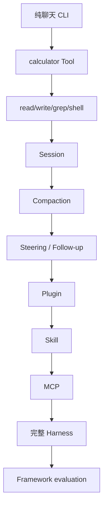

# 成熟 Harness 的实现顺序



## 最终边界

```text
AgentHarness
├── ModelProvider / ModelRegistry
├── PromptBuilder / ContextManager
├── MessageStore / SessionManager
├── ToolRegistry / ToolExecutor
├── AgentLoop
├── EventBus
├── RetryPolicy / Cancellation
├── PermissionManager / Sandbox
├── CompactionManager
├── SkillRegistry / PluginManager
├── MCPManager
├── Telemetry
└── Configuration + CLI/TUI/RPC surface
```

先让纯函数和 ScriptedModel 稳定，再接副作用；先有单进程 Session，再做 crash recovery；先有本地 Tool，再接 MCP。每一层都定义输入、输出、错误、取消和测试。

## Durable 版本还要补什么

当前 Go/Java 示例是教学组合层，不是 `harness.v2.md` 完整实现。要升级，需要 append-only tree、operation intent/result、provisioned ids、per-lane mutation line、usage ledger、terminal cleanup、manual drive、restore reduction、deferred provider 和完整 race/crash matrix。设计文件中的 invariant 是规格来源，不能靠一条 `while` 替代。
