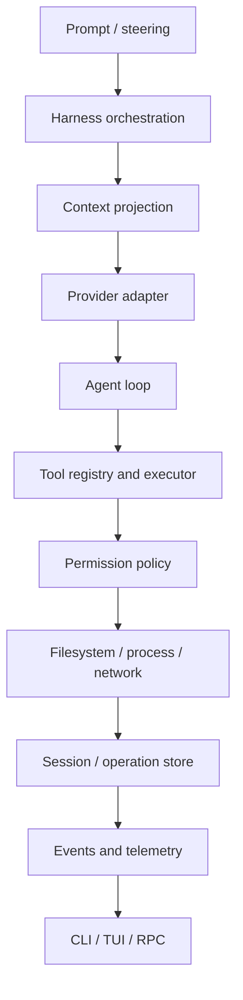
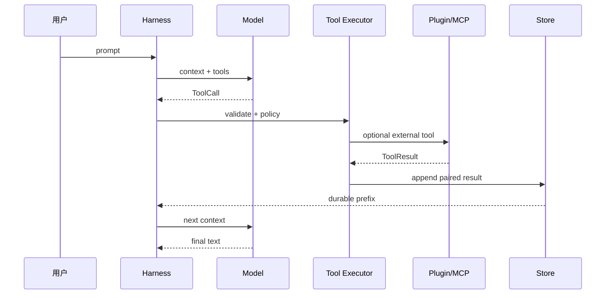

# Pi、Go、Java：同一 Harness 的三种落地

比较语言的目的不是选出“最好”的语言，而是看清同一条 Agent 生命周期在不同运行时里如何落地。若只写“Pi 用 TypeScript、Go 用 goroutine、Java 用线程池”，读者仍不知道谁保存状态、谁执行工具、谁负责取消。本页用一个具体请求贯穿三方。

## 学习目标

读完本页后，你应该能：

- 将同一个 `Model → Loop → Tool → Session` 设计映射到 Pi、Go、Java。
- 解释 `Promise`、`context.Context`、`Future`/线程中断的语义差异。
- 说明三方 streaming 如何从 delta 形成 settled assistant message。
- 比较 JSONL snapshot、Session tree 与 durable operation ledger 的边界。
- 为一个需要文件写入的 Agent 选择实现，并提出可验证而非凭印象的理由。

## 共同问题：修改一个配置文件

假设输入是：

```text
请读取 config.yaml，把 timeout 改成 30s，然后运行测试。
```

三种实现都应该产生近似这条逻辑 trace：

```text
user
  -> build context and tool definitions
  -> model returns read(config.yaml)
  -> validate and execute read
  -> append tool result
  -> model returns edit(config.yaml, ...)
  -> permission check
  -> execute edit
  -> model returns shell(test)
  -> return final answer
```

逻辑相同不代表物理实现相同。Pi 通过 TypeScript `Agent`、`AgentSession`、Provider adapter、Extension runner 和 SessionManager 组合；Go 示例通过显式 interface、`context.Context`、JSONL snapshot 和 registry 组合；Java 示例通过 interface、record、`ExecutorService`、Jackson 和 ServiceLoader 组合。

## 先区分四层



- **协议层**：JSON、SSE、provider headers 和 JSON-RPC。
- **控制流层**：assistant step、tool batch、retry、max steps 和 termination。
- **状态层**：messages、branch、queue、operation record、terminal outcome。
- **接口层**：CLI、TUI、RPC、Plugin、MCP 和 Telemetry。

三方的类名不同，但这四层不能被混为一谈。例如 Java 的 `HttpClient` 是协议层，不能因为它运行在 executor 里就变成 Harness；Pi 的 `AgentEvent` 是观察接口，也不能取代 Session entry。

## 类型边界的对照

### Model 和 Response

Pi 的 `pi-ai` 用统一的 `Model`、`Context`、`AssistantMessage`、`ToolCall`、`Usage` 和 `AssistantMessageEvent`，各 Provider adapter 负责转换厂商 payload。Go 的 `Model.Complete(context.Context, Request)` 返回 `Response`；Java 的 `Model.complete(Request, CancellationToken)` 返回 `Response`。

```go
type Model interface {
    Complete(context.Context, Request) (Response, error)
}
```

```java
public interface Model {
    Response complete(Request request, CancellationToken cancellation)
            throws Exception;
}
```

Go 的 `error` 是显式返回值；Java 的 checked exception 沿调用栈传播；Pi 的 Promise rejection 通过 `try/catch` 和事件处理。三者都应该让 Loop 依赖统一响应，而不是依赖 OpenAI 或 Anthropic 的原始 JSON。

### Tool

```text
Pi: AgentTool<TParameters> + ToolDefinition
Go: Tool.Definition() + Tool.Execute(ctx, json.RawMessage)
Java: Tool.definition() + Tool.execute(token, JsonNode)
```

输入都包含工具名称和结构化参数，输出都应包含可进入 context 的 Tool Result。差异在类型系统：Pi 可以用 TypeBox/schema 做静态推导与运行时校验；Go 示例自己解析 `json.RawMessage` 并做 required 检查；Java 示例使用 Jackson `JsonNode`，检查 object 和 required fields。

工具接口不表示权限。三方都需要在真正 `Execute` 前放置 policy，否则模型生成的合法 JSON 仍能读 SSH key 或执行危险命令。

## 异步、线程和取消

| 责任 | Pi / TypeScript | Go | Java |
| --- | --- | --- | --- |
| 异步值 | `Promise` | 返回值 + goroutine | `Future`/executor，必要时封装 `CompletableFuture` |
| 流 | `AsyncIterable` / EventStream | callback、channel 或 `io.Reader` | callback、`Flow` 或行读取 |
| 取消源 | `AbortController` | `context.Context` | `CancellationToken` + interruption |
| 运行中输入 | queue + event loop | mutex/channel | synchronized + queue/list |
| 事件 | callback/event emitter 风格 | `EventSink` callback | `EventSink`/Listener |

### 取消不是强杀

Pi 的 `AbortSignal`、Go 的 `ctx.Done()` 和 Java 的 interruption/token 都表达取消意图。它们不能撤销已经被远端 API 接受的请求，也不能自动回滚已经写入的文件。

```text
abort requested
  -> provider/tool observes signal
  -> current wait stops when possible
  -> durable state records aborted or unknown
  -> remote side effect requires reconciliation
```

Go 的优势是 `context.Context` 可以从入口传到 HTTP、Tool 和 backoff；代价是每个函数都必须正确接收并检查 context。Java 的 interruption 可能被库吞掉，所以示例另外传 `CancellationToken`；`Future.cancel(true)` 只是尝试中断线程。Pi 的 `AbortController` 与 `fetch`/stream 的组合依赖每个 adapter 正确传递 signal。

## Streaming：从 delta 到 settled message

三方都不应把每个网络 chunk 直接当作一个 assistant message。正确流程是：

```text
stream start
  -> text/tool/thinking deltas
  -> partial accumulator
  -> finish reason and usage
  -> settled assistant message
  -> loop decides tool or final
```

Pi 的 `AssistantMessageEventStream` 提供 `start`、`text_delta`、tool call delta、`done`、`error` 等事件；`convertToLlm` 在请求前做消息转换。Go 的 `HTTPModel.Stream` 读取 SSE `data:` 行，用 index 累积 tool call arguments，并通过 callback 发 text delta。Java 的 `HttpModel.stream` 用 `HttpClient` 行流和 `Consumer<String>` 发送增量，再返回完整 `Response`。

失败 trace：

```text
chunk 1: arguments="{\"path\":\"con"
chunk 2: arguments="fig.yaml\"}"
  -> 不能在 chunk 1 执行
  -> 必须累积完整 JSON
  -> decode 后才做 schema/policy
```

Pi 的 Provider 数量和 thinking/content block 形状更多；Go/Java 示例只覆盖 OpenAI-compatible 教学格式。不能把示例的 SSE parser 当作所有 Provider 的通用实现。

## Session、持久化和恢复

| 问题 | Pi | Go 示例 | Java 示例 |
| --- | --- | --- | --- |
| 最小消息 | entry + parent/metadata | `Message` JSONL | `Message` JSONL record |
| 分支 | SessionManager tree/leaf | 没有完整 tree | 没有完整 tree |
| 保存方式 | Coding Agent JSONL session | temp + rename JSONL | temp + atomic move/fallback |
| compaction | branch summary/retained context | deterministic summary | deterministic summary |
| durable ledger | `AgentHarness` 当前 scaffold；v2 是设计 | 未实现完整 ledger | 未实现完整 ledger |
| 损坏处理 | 版本/entry/tree 规则 | 行号错误 | 行号错误 |

Go/Java 的 `Session` 记录的是可继续对话的 transcript snapshot。它们没有把 intent、result、terminal 作为独立 operation record，因此不能保证崩溃后知道一个文件写入是否已经发生。Pi 的普通 Coding Agent Session 功能更丰富，但当前 `packages/agent/src/harness/agent-harness.ts` 仍是 scaffold；`harness.v2.md` 提出的 durable ledger 是设计约束，不是已交付运行时。

## 插件、Skill 和 MCP

Pi 的 Extension loader 会发现并加载 TypeScript extension，`ExtensionRunner` 运行 hooks、tool、command 和 event handler。Go 不强行使用原生 `plugin`，而用显式 `Plugin` interface + registry；Java 用 `AgentPlugin` interface + `ServiceLoader` SPI。显式注册和 SPI 解决发现与生命周期，但都不自动隔离恶意代码。

Skill 的共同语义是“资源按需展开”：Go/Java 只读 `SKILL.md` 的 metadata，正文由调用者显式读取。MCP 则是 JSON-RPC 客户端与外部 server 的协议；Go/Java 的教学 client 串行调用 `tools/list`/`tools/call`，生产实现还要处理 initialize、capability、并发 dispatcher、断线和权限。



## 一个请求的三方 trace

### Pi

```text
CLI/TUI input
  -> AgentSession.prompt
  -> SessionManager context + system prompt
  -> Agent.prompt / agent-loop
  -> pi-ai Models + provider adapter
  -> AssistantMessageEventStream
  -> prepare/execute tool hooks
  -> AgentSession handles event and persists session
  -> TUI renders events
```

真实入口和 symbol 需要以固定 commit 为准：`packages/agent/src/agent-loop.ts` 的 `runAgentLoop`/`executeToolCalls`，`packages/agent/src/agent.ts` 的 `Agent`，`packages/coding-agent/src/core/agent-session.ts` 的 `_handleAgentEvent`，以及 `SessionManager`。

### Go

```text
main.go
  -> NewHarness
  -> Harness.Prompt
  -> Session.Snapshot + Agent.Run
  -> AgentLoop.Run
  -> ScriptedModel/HTTPModel.Complete
  -> Registry.Validate + Tool.Execute
  -> RoleTool message
  -> next ScriptedModel response
  -> Session.Replace + Save
```

Go 的 `Harness.Prompt` 是组合层，`AgentLoop` 是控制流，`Session.Save` 是 JSONL snapshot。没有 durable operation intent/result；如果需要生产语义，必须在 ToolExecutor 与 Store 之间增加 operation store。

### Java

```text
Main
  -> Harness.prompt
  -> Session.snapshot + Agent.run
  -> AgentLoop.run
  -> ScriptedModel/HttpModel.complete
  -> ToolRegistry.validate + Tool.execute
  -> Message.tool
  -> next Response
  -> Session.replace + save
```

Java 的 `AgentLoop.executeBatch` 可以用 `ExecutorService` 并行多个 tool，再按 source order 收集 Future。`Agent` 的 synchronized queue 保证同一 Agent 不会并行启动两个 run；`Harness` 仍是教学组合层。

## 线程安全和单写入者

Pi 的单 Agent 运行状态和 queue 由 `Agent`/Session orchestration 管理；v2 设计进一步要求 lane mutation line。Go 示例用 mutex 保护 Agent running/queue，但 Session 本身不是跨进程 writer。Java 示例用 synchronized 保护 Agent queue，Session 保存也应由调用者避免并发写。

生产升级应把所有 session mutation 放进一个 single writer：

```text
prompt A -> writer queue
prompt B -> writer queue
writer validates current leaf
writer assigns seq=10, then seq=11
writer publishes persisted events
```

这保证本地记录顺序，不保证远端 effect exactly-once。三方都需要 operation id、result hash 和外部 idempotency key 才能处理 effect 后崩溃。

## 测试策略三方共用，工具不同

| 场景 | Pi 测试替身 | Go 测试 | Java 测试 |
| --- | --- | --- | --- |
| 模型 | faux provider | `ScriptedModel` | `ScriptedModel` |
| HTTP | faux/fixture | `httptest.Server` | `HttpServer` |
| 时间 | fake clock/controlled stream | context/latch | latch/Future |
| 工具 | fake AgentTool | fake Tool | fake Tool |
| 存储 | memory/session fixture | temp JSONL | temp JSONL |
| 插件 | test extension | explicit plugin | SPI test resource |

必须测试的边界不是“最后答案是否为 5”而已：

1. second request 是否包含配对的 Tool Result；
2. unknown tool 是否执行了零次；
3. invalid arguments 是否在 schema gate 被拒绝；
4. endless tool call 是否被 max steps 截停；
5. abort 是否到达模型、工具和 backoff；
6. session reload 是否保持消息顺序；
7. plugin/MCP 失败是否可诊断；
8. result 写入前后 crash 是否进入不同恢复分支。

## 实验：选择实现

### 目标

针对“企业内部代码审查 Agent”，在 Pi、Go、Java 中选择一个实现，并用事实而不是语言偏见证明选择。

### 准备

先阅读 `reference/source-map`、Go/Java 示例 README 和本页的请求 trace。列出模型 Provider、工具副作用、并发量、部署环境和合规要求。

### 步骤

1. 为 read、edit、shell 画出 acceptance/intent/effect/result/terminal。
2. 写出 Provider timeout、工具失败、用户 abort 和 session 损坏的处理。
3. 说明希望使用 `AbortSignal`、`context.Context` 或 token 的哪个性质。
4. 说明 streaming 是否需要 token-level UI，还是只需要 settled message。
5. 选取 persistence backend，并定义 single writer 的 owner。
6. 设计一个 fake model 和一个 crash-point test。
7. 检查插件是否需要进程隔离；若需要，三种语言的 interface 都不够。
8. 最后才根据团队现有技能和部署生态作选择。

### 观察点

如果你的选择理由只有“Go 快”“Java 成熟”或“Pi 已经支持”，说明还没有触及 Harness 的约束。应能指出具体 API、状态 owner、失败行为和测试替身。

### 预期结果

你能输出一页设计评审：三方各自的优势、缺口、不能承诺的语义，以及迁移到 durable ledger 需要新增哪些模块。

### 思考题

- Go `context` 能否撤回一个已经返回 202 的远端 edit？
- Java `Future.cancel(true)` 后，工具忽略 interruption 会发生什么？
- Pi 的 Session tree 和普通 JSONL snapshot 对 branch navigation 有什么不同？
- 如果三个实现都使用同一个 MCP server，权限边界是否因此相同？

## Pi 事实边界

研究 commit：`853a80d26c90a14c1886f0ebb8ffaae133ca2185`。

- **源码事实**：Pi 的统一 Provider/Message/Stream 类型在 `packages/ai`；Agent loop、Agent queue 和 Coding Agent orchestration 位于 `packages/agent` 与 `packages/coding-agent`。
- **源码事实**：Pi 的 Extension loader/runner 与 SessionManager 是真实产品路径的一部分。
- **设计事实**：`packages/agent/docs/harness.v2.md` 描述了 lanes、operation records、single writer 和 recovery。
- **未实现声明**：当前 `AgentHarness` scaffold、Go 示例和 Java 示例都不能被写成完整生产 durable Harness。

## 结课验收清单

- [ ] 能画出同一请求在 Pi、Go、Java 中的调用链。
- [ ] 能说出三方 Model、Tool、Session 和 Event 的真实入口。
- [ ] 能解释 `Promise`、`context.Context` 和 Java interruption 的不同保证。
- [ ] 能解释 streaming chunk 为什么必须累积成 settled message。
- [ ] 能指出三方示例都缺少完整 durable operation ledger 和生产 sandbox。
- [ ] 能设计 single writer、operation id 和外部幂等 key。
- [ ] 能用 fake model 测试错误、取消、重试和 max steps。
- [ ] 能对一个框架提出与本页同样的追问。

## 小结

三方共享 Agent 的逻辑骨架，却有不同的异步、类型、插件和持久化实现。可靠性不由语言名称保证，而由明确的状态 owner、可取消边界、single writer、operation identity 和故障测试保证。下一阶段不要问“哪个 API 最短”，要问“崩溃后我还能解释系统发生了什么吗”。