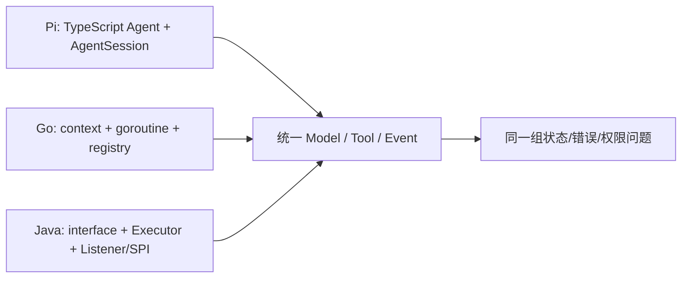

# Pi、Go、Java 三方对照

| 能力 | Pi / TypeScript | Go 示例 | Java 示例 |
| --- | --- | --- | --- |
| Cancellation | `AbortController` / `AbortSignal` | `context.Context` | `CancellationToken` + interruption/Future |
| Tool interface | `AgentTool` + TypeBox | `Tool` + `json.RawMessage` | `Tool` + `JsonNode` |
| Event | async listener / `AgentEvent` | `EventSink` / callback | `EventSink` / Listener |
| Plugin registry | `ExtensionRunner` + loader | explicit `Plugin.Register` | `ServiceLoader` + SPI |
| Async | `Promise` / `AsyncIterable` | goroutine / channel | `Future` / `ExecutorService`（可封装为 `CompletableFuture`） |
| Streaming | `AssistantMessageEventStream` | `StreamingModel` + callback | `StreamingModel` + Consumer |
| Session | `SessionManager` JSONL tree | JSONL snapshot | JSONL snapshot |
| Provider | `pi-ai` API adapters | `HTTPModel` | `HttpModel` |
| Context | `transformContext` + `convertToLlm` | request history | request history |
| Security | cwd/trust/shell policies | `PermissionPolicy` | `PermissionPolicy` |

差异不是“哪个语言更高级”：Pi 的现有 AgentSession 功能更多；示例刻意更小，让每个边界可读、可测。三者都需要独立处理 Provider 差异、权限、恢复和副作用幂等。
