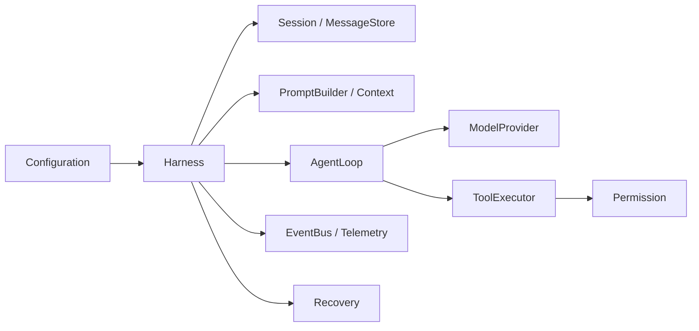

# 十个阶段性项目：从 Chat 到 Harness

这不是把功能清单换成编号，而是一条可验收的学习路线。每个 Milestone 都必须留下一个能运行的程序和一组能失败的测试；如果只有 demo 输出，没有测试边界，就还没有完成该阶段。

## 学习目标

完成本页后，你应该能把一个模糊的“做一个 Agent”拆成十个可提交、可运行、可回归的阶段；能为每阶段指出代码入口、故障注入点、升级条件和尚未提供的可靠性保证。你还要能把这条路线与 Pi 的真实模块对齐，而不是把示例代码误认为 Pi 的实现。

## Pi 作为校准案例

研究 commit：`853a80d26c90a14c1886f0ebb8ffaae133ca2185`。Pi 的 `packages/ai` 提供 Provider/Message/Stream 边界，`packages/agent/src/agent-loop.ts` 和 `agent.ts` 提供可运行 Loop、队列和 abort，Coding Agent 的 `AgentSession`、`SessionManager`、工具和 Extension runner 组成产品主路径。`packages/agent/src/harness/agent-harness.ts` 在该版本仍是 scaffold；`packages/agent/docs/harness.v2.md` 是工作区的 durable 设计稿。下表的 Milestone 是 Go/Java 学习顺序，不声称 Pi 按完全相同的十步实现。

## 如何使用本页

每个阶段按同一顺序推进：

1. 先运行当前版本的测试，确认基线是绿色。
2. 阅读对应 Go/Java 教材页和实现文件。
3. 做观察实验，打印输入、输出、状态和事件。
4. 做一个故意失败的实验，验证错误不会被吞掉。
5. 实现本阶段新增能力，再运行整套测试。
6. 只有达到“升级条件”才进入下一阶段。

Go 代码在 `examples/go-agent/internal/agent/`，Java 代码在 `examples/java-agent/src/main/java/learning/agent/`。两个项目都使用 `ScriptedModel`，因此以下验收不需要 API key，也不依赖收费 Provider。

## Milestone 1：纯聊天 CLI

### 目标和可运行定义

程序接收一条用户消息，构造 provider-neutral `Request`，调用一次 Model，展示 assistant text，然后正常退出。此时没有 Tool、没有第二轮循环，也没有把模型输出误称为执行结果。

```text
user input
  -> Request{messages}
  -> Model.complete
  -> Response{assistant message, stop reason, usage}
  -> stdout
```

Go 入口是 `model.go` 的 `HTTPModel.Complete` 和 `cmd/agent/main.go`；Java 入口是 `HttpModel.complete`、`Model` 和 `Main`。HTTP adapter 负责 URL、JSON、认证和状态码，业务代码不拼 provider-specific body。

### 测试与失败 trace

用 localhost fake server 断言 `model`、`messages` 和认证 header。测试 401、429、500、非法 JSON、`choices: []` 和取消前请求。典型失败应是：

```text
HTTP 200 + choices=[]
  -> JSON 解码成功
  -> 没有 assistant message
  -> 返回 "model response has no choices"
```

### 升级条件

能解释 HTTP response 和内部 `Response` 的区别；能证明错误不被当成 final text；`go test ./...` 或 `mvn test` 通过。

## Milestone 2：calculator Tool

### 目标和可运行定义

模型第一次返回结构化 `ToolCall`，Runtime 找到 calculator、校验参数、执行加法，把带 call id 的 `ToolResult` 放回第二次 request，模型第二次返回 final。

```json
{"id":"c1","name":"calculator","arguments":{"operation":"add","left":2,"right":3}}
```

模型只生成这份数据，不会调用 Go 函数或 Java 方法。Go 入口为 `tool.go` 的 `Tool`、`Registry`；Java 入口为 `Tool`、`ToolRegistry`。Schema 校验必须先于 `Execute`。

### 测试与失败 trace

测试 unknown tool、缺 required 参数、坏 JSON、除零和多个 call。坏参数的 trace 是：

```text
parse arguments
  -> required "right" missing
  -> Tool.execute 未调用
  -> error ToolResult
  -> 下一轮模型可见错误
```

### 升级条件

能指出 Tool Call、函数执行和 Tool Result 的三条边界；能从测试证明 invalid arguments 不会触发副作用。

## Milestone 3：最小 Coding Agent

### 目标和可运行定义

加入 `read`、`write`、`edit`、`grep`、`shell`，但所有路径都必须在 workspace 内，shell 必须通过基础 PermissionPolicy。Agent 有 `maxSteps`，模型永远返回 Tool Call 时也会停止。

```text
ToolRegistry
  -> schema gate
  -> normalize path/command
  -> PermissionPolicy
  -> Tool.Execute
```

Go 入口是 `builtin_tools.go`、`permission.go`；Java 入口是 `BuiltInTools.java`、`PermissionPolicy.java`。`shell` 的输出必须有长度上限，错误要保留退出信息。

### 测试与失败 trace

拒绝 `../secret`、`/etc/passwd`、危险 shell；确认被拒绝的工具函数没有执行。用 endless `ScriptedModel` 验证：

```text
assistant tool call
  -> tool result
  -> ...
  -> maxSteps reached
  -> stable error, not infinite loop
```

### 升级条件

读者能说明 Schema 合法不等于权限合法，并能在临时 workspace 中完成一次 read/edit/test trace。明确该 PermissionPolicy 不是 OS sandbox。

## Milestone 4：Session

### 目标和可运行定义

把 user、assistant 和 tool messages 以 JSONL 保存；进程退出后可加载并继续。每条 entry 至少有 role、内容、tool call id 和时间；坏行要指出行号。

Go 入口为 `session.go` 的 `Session.Save/LoadSession`；Java 入口为 `Session.save/load`。写入应使用临时文件再替换，避免直接覆盖旧文件。

### 测试与失败 trace

保存两条消息、重新加载、比较 snapshot；测试空文件、坏 JSON、坏中间行、半行和替换失败。注意 Session entry 不是一定可以原样提交给每个 Provider，Context 层仍要转换。

### 升级条件

能重启示例并看到同一 transcript；能解释 JSONL 保存了什么、没有保存什么；能证明坏文件不会静默得到空 session。

## Milestone 5：Compaction

### 目标和可运行定义

当估算 token 超过预算时保留 system 与最近尾部，用摘要替代旧消息，再把 compacted context 送给模型。它解决 context window，不解决外部副作用一致性。

```text
messages
  -> estimate tokens
  -> retain system + tail
  -> summary entry
  -> provider context
```

Go 为 `session.go` 的 `Compact`，Java 为 `Compactor.compact`。教学实现使用确定性摘要；生产实现要验证 tool call/result 配对、从哪个 entry 开始保留和 summary 是否可信。

### 测试与失败 trace

测试 budget 小于历史长度、只有 tool call 没有 result、超长单条消息和重复 compaction。不得把 `operation_intent` 只压进摘要后丢掉恢复依据。

### 升级条件

能拿出压缩前后消息列表，指出保留信息、丢弃信息和潜在风险；能解释 compaction 与 RAG、Session、Memory 的区别。

## Milestone 6：Steering / Follow-up

### 目标和可运行定义

Agent 正在运行时，新输入不直接启动第二个 loop：steering 在安全 turn 边界进入当前 run，follow-up 在本轮自然结束后追加，next-run 留给下一次 run，abort 清理当前队列。

```text
running + steering  -> pending steering
running + followUp -> pending follow-up
running + prompt   -> reject already running
running + abort    -> cancel + terminal(aborted)
```

Go 入口为 `agent.go` 的 `Steer/FollowUp/NextRun/Abort`；Java 入口为 `Agent.java`。队列状态必须有锁或明确的 mutation line。

### 测试与失败 trace

让 Fake Model 或 Tool 阻塞，分别注入 steering、follow-up 和 abort；断言它们在不同边界出现。测试重复 `Prompt` 的明确错误，不能靠 sleep 猜顺序。

### 升级条件

能解释 steering 与 abort 的差异，能说明 nextRun 为什么不应在 active run 中消费；能通过测试证明同一 Agent 不会并发修改 transcript。

## Milestone 7：Plugin

### 目标和可运行定义

不修改 Agent Core，就能注册一个 Tool 或 Hook，并在关闭时执行生命周期清理。Go 用显式 `Plugin.Register`，Java 用 `AgentPlugin` + `ServiceLoader`。

```text
discover
  -> load
  -> validate capabilities
  -> register
  -> run
  -> close
```

### 测试与失败 trace

测试插件注册、同名冲突、注册失败、close 失败和 ServiceLoader 缺失 provider。插件加载失败不能让系统假装“没有插件”；应该有结构化诊断和明确策略。

### 升级条件

能回答插件代码运行在哪个进程、拥有何种权限、如何卸载；能把插件错误和模型错误分开。ServiceLoader 只解决发现，不解决隔离和版本兼容。

## Milestone 8：Skill

### 目标和可运行定义

启动时扫描 `SKILL.md` frontmatter，只将 name、description、path 放入 prompt；模型需要时再读取正文和 references。完整 Skill 不应无条件塞进 context。

Go 入口为 `skill.go` 的 `DiscoverSkills/ReadSkill`；Java 入口为 `SkillDiscovery`。frontmatter 非法、重复 name、越权路径和脚本执行都必须有策略。

### 测试与失败 trace

测试缺少 name、description、结束分隔线、重复 skill、不可读文件和路径逃逸。错误 trace 应明确是 metadata invalid，而不是把坏文件当作可用 Skill。

### 升级条件

能用 token 估算说明 progressive disclosure 的收益；能区分 Skill（资源和方法）与 Plugin（宿主代码）及 Tool（执行能力）。

## Milestone 9：MCP

### 目标和可运行定义

从底层 JSON-RPC client 调用一个受控 MCP server：发送 request id，执行 `initialize`，发现 `tools/list`，再调用 `tools/call`，把远端工具适配为本地 Tool。stdio 的 framing、超时和断开都要可测试。

Go 入口为 `mcp.go`；Java 入口为 `McpClient.java`。当前示例 client 是教学级串行实现，不能冒充完整 MCP SDK 或生产连接管理器。

### 测试与失败 trace

使用本地 fake server 测试 id mismatch、JSON-RPC error、server disconnect、未知 tool、非法参数和工具错误。典型 trace：

```text
request id=7
  -> response id=8
  -> correlation failure
  -> 不把 response 当成 id=7 的结果
```

### 升级条件

能解释 MCP request、response、notification 与 Agent Tool 的转换；能指出 initialize/capability/权限是不同问题。

## Milestone 10：完整 Harness

### 目标和可运行定义

组合前九阶段，并新增 `Configuration`、`EventBus`、`Telemetry`、恢复入口和清晰的 durable 边界。教学项目的完成定义是“所有组件可以替换、关键失败有测试、session 可以恢复”；不是“已经具有生产级 exactly-once”。



Go 组合入口为 `harness.go`，Java 组合入口为 `Harness.java`。真正的 durable 版本还要把 operation acceptance、intent/result/terminal、single writer、crash recovery 和外部幂等 key 加入 storage contract。

### 测试与失败 trace

至少做以下集成测试：模型超时重试、权限拒绝、工具异常、context overflow、abort、session reload、插件发现、Skill invalid、MCP 断开、事件 listener 抛异常。再在 intent 后、effect 后、terminal 前分别注入 crash。

### 升级条件

能从一次 prompt 画出完整调用链；能指出每个状态的 owner；能说明当前 Go/Java 示例缺少 durable ledger 和生产 sandbox；能对一个框架提出同样的问题，而不是只调用 `invoke()`。

## Go / Java 对照验收

| 能力 | Go 入口 | Java 入口 | 必须看到的证据 |
| --- | --- | --- | --- |
| Model | `HTTPModel` | `HttpModel` | fake HTTP 测试 |
| Loop | `AgentLoop` | `AgentLoop` | second request 有 tool result |
| Cancel | `context.Context` | token/interruption | abort 测试 |
| Session | `Session` | `Session` | save/reload |
| Plugin | `PluginManager` | `ServiceLoader` | discovery test |
| MCP | `MCPClient` | `McpClient` | JSON-RPC fake |
| Harness | `Harness` | `Harness` | persist/reload + demo |

## 结课复习题

1. Tool Call 为什么不是函数执行证明？
2. 429、invalid arguments、permission deny、context overflow 是否应该同样 retry？
3. Session entry、Context message 和 durable operation record 各自回答什么问题？
4. Steering 为什么不能在任意 token 到达时插入 provider request？
5. intent 后崩溃和 result 后崩溃为什么不能用同一动作恢复？
6. Single writer 是否能防止远端支付重复？为什么？
7. Skill metadata 和 Plugin registry 哪个会执行代码？
8. 一个框架说“支持 memory”，你还需要追问哪些事实？

## 小结

Milestone 的价值在于可证伪：每阶段都有运行定义、失败 trace、测试和升级条件。走到第十阶段，读者应该能构建一个诚实的教学 Harness，并知道它与 durable 生产系统之间还隔着 operation ledger、恢复策略、sandbox 和外部幂等，而不是把一条成功 demo 当成完成证明。