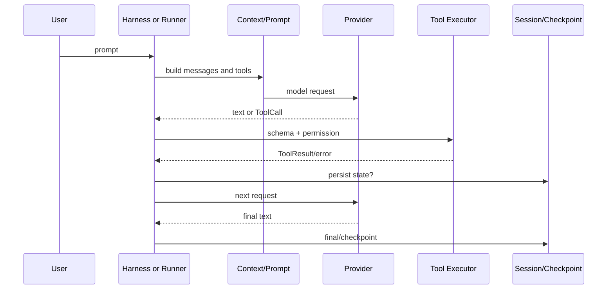

# 框架评估实验：不要被 `invoke` 迷惑

本页是最后一项实验。你要选择一个框架，完成一个带读取、修改和测试的任务，再交出一份可以被别人复现的 Harness 审计。重点不是代码能否返回“完成”，而是失败时系统是否仍然知道发生了什么。

## 学习目标

完成实验后，你应该能够：

- 从一次真实请求中提取 Model、Context、Tool、Loop、Session、Permission 和 Telemetry 的证据。
- 用 fake model 和 fake tool 测试，而不是把 API key 和真实仓库交给实验。
- 区分文档承诺、源码事实、默认行为和自己的配置。
- 设计 effect 后崩溃、重复执行、取消、超时和 context overflow 实验。
- 给出“适合 / 不适合 / 需要补齐”的框架结论，而不是凭印象排名。

## 实验任务

所有候选框架都实现同一逻辑任务：

```text
读取 a.txt 和 b.txt
  -> 比较两份内容
  -> 修改 a.txt 中一个明确字符串
  -> 运行测试命令
  -> 返回修改摘要和测试结果
```

为避免实验本身造成危险，文件系统、命令执行和模型都用 fake。`edit` fake 会记录 `operationId` 和调用次数；`test` fake 可以返回成功、失败或 timeout。

预期 trace：

```text
prompt accepted
  -> context built with read/edit/test definitions
  -> model: read(a), read(b)
  -> validate + permission
  -> tool results appended in source order
  -> model: edit(a)
  -> intent? effect? result? terminal?
  -> model: test
  -> final message
  -> session/checkpoint persisted
```

如果只能看到 final 文本，却不能回答中间问题，审计不算完成。

## 选择框架和版本

可以从 Spring AI、LangChain4j、LangChain、LangGraph、Eino、Google ADK 或 OpenAI Agents SDK 中选择一个。记录：

```text
framework:
version / commit:
language:
runtime:
model adapter:
state/session backend:
```

不要直接比较不同版本的博客示例。先锁定版本，再阅读该版本的官方文档、源码和测试。若某能力来自外部数据库、tracing backend 或 MCP server，也把它写在配置栏中。

## 实验安全边界

1. 不使用真实 API key；使用 fake model 或本地 mock server。
2. 不对真实仓库运行 write/edit/shell；使用临时目录和内存 fake。
3. 不让 fake Tool 访问网络；若必须测试 HTTP，监听随机 localhost 端口。
4. 所有日志中的 prompt、文件内容、token 和 credentials 都做脱敏。
5. 给每个有副作用的 fake Tool 分配稳定 `operationId`，记录调用次数。
6. 任何“框架自动重试”的结果都先检查是否重复调用了 fake effect。

## 第一步：画出框架调用链

先不读高层 helper 的名字，画出运行时对象：



为每条箭头写真实类名或函数名。若找不到，就写“未找到”，不要用框架品牌名替代。

### 记录模板

```text
用户入口：
Context builder：
Model/provider client：
Tool registry：
Schema validator：
Permission/approval：
Executor：
Loop/graph runner：
Session/checkpoint：
Event/callback：
Telemetry/tracing：
```

输入是用户 prompt 和当前配置；输出应包括 final、错误和持久化结果；状态变化要写出 owner；失败点至少标出 provider、tool、store 和 cancellation。

## 第二步：检查 ModelProvider

观察第一次 request 的原始 payload 和框架内部 request。检查：

- system、user、assistant、tool message 是否有明确类型；
- tool definition 是否真正发给模型；
- streaming delta 是否累积为 settled response；
- usage、stop reason 和 provider error 是否保留；
- request timeout、retry 和 cancellation 是否传到 HTTP 层；
- API key 是否出现在日志、异常或 trace。

### 故障实验：429 和坏 JSON

让 fake provider 第一次返回 429，第二次返回正常 response；再让它返回 200 但非法 JSON。记录 attempt 次数、backoff、最终错误和事件。若 429 与非法参数采用相同 retry，应解释这种选择会带来什么风险。

```text
429
  -> bounded retry may be safe for model request
invalid tool JSON
  -> retrying identical request may repeat invalid output
```

不要仅因为框架文档写“自动重试”就认为所有重试安全。

## 第三步：检查 Context 和 Memory

打印或捕获模型真正收到的：

```text
system prompt
project instructions
conversation history
tool definitions
retrieved documents
current user input
```

再回答：

1. 谁决定顺序和优先级？
2. 超过 context window 时裁剪什么？
3. summary 是否进入下一轮？
4. memory 是进程内列表、数据库记录还是 checkpoint？
5. session 是否能恢复 branch、queue 和 tool state？
6. 多租户检索是否在注入前过滤？

### 故障实验：overflow

将 fake model 的 context limit 设为很小，制造多轮 tool results。观察框架是 compact、截断、抛错还是无限 retry。检查被裁掉的 tool call 是否仍有配对 result；检查 operation ledger 是否独立于 summary。

```text
context overflow
  -> compaction changes provider projection
  -> operation records must remain intact
  -> retry at most the documented bound
```

“有 memory”只能证明存在某种历史存储，不能直接证明 durable Session。

## 第四步：检查 Tool Registry 和 Schema

定义三个 fake：

```text
read(path: string)
edit(path: string, replacement: string)
test(command: string)
```

让 fake model 依次返回合法调用、unknown tool、缺 required 参数和错误 JSON。记录：

- schema 在哪里声明；
- runtime 在哪里校验；
- invalid arguments 是否会调用 fake effect；
- unknown tool 是 ToolResult、异常还是静默忽略；
- Tool exception 是否回到模型；
- 多个 Tool Call 是否串行或并行；
- result 是否带原始 call id 并保持 source order。

失败 trace 应类似：

```text
edit(path missing)
  -> schema rejected
  -> edit fake calls = 0
  -> controlled tool error becomes next context
```

如果框架先调用函数、再验证参数，记录为 blocker；这不是偏好，而是权限和副作用边界错误。

## 第五步：检查 Permission 和 Sandbox

将 `edit` 配置为拒绝，将 `read` 配置为允许。然后尝试：

```text
../outside.txt
~/.ssh/id_rsa
rm -rf build
curl external.example
```

检查拒绝发生在 effect 前，并区分以下能力：

```text
schema validation  != permission policy
permission policy  != OS sandbox
approval callback   != audit ledger
```

框架的 guardrail、filter 或 middleware 可能只是在进程内拒绝一条调用；若 Tool 代码本身可以直接开网络或启动子进程，它就不等于 sandbox。记录真实运行用户、容器、网络出口和资源限制。

## 第六步：检查 Agent Loop、终止和队列

让 fake model 连续返回 tool call，直到框架停止。记录：

```text
max steps:
max wall time:
budget/token limit:
stop reason:
final/no-tool behavior:
```

再测试两个 tool call：`read(a)`、`read(b)`，以及有依赖的 `edit(a)`、`read(a)`。检查并行配置、结果顺序和共享资源规则。

### 取消实验

在 model request、tool effect 和 retry backoff 三个位置分别阻塞，然后触发 abort：

```text
abort requested
  -> did HTTP observe cancellation?
  -> did tool observe cancellation?
  -> did backoff stop?
  -> what durable state was written?
  -> is remote effect already accepted?
```

Go 的 `context.Context`、Java 的 `Future.cancel(true)` 和 JavaScript 的 `AbortSignal` 都需要下游代码合作；取消 API 名称本身不是证据。

## 第七步：检查 durable Session 和恢复

让 fake writer 在三个点故障：

```text
after acceptance / before intent
after effect / before result
after result / before terminal
```

重新构造 runner，检查它能否区分：

```text
not started
started but unknown
result observed but not terminal
terminal committed
```

理想的 durable trace：

```jsonl
{"kind":"operation_started","id":"op-1","tool":"edit"}
{"kind":"tool_started","id":"op-1","replay":"never"}
{"kind":"tool_result","id":"op-1","status":"success"}
{"kind":"operation_finished","id":"op-1","outcome":"completed"}
```

如果框架只保存一条 assistant message 和一条 tool result，记录“无法证明 effect 是否发生”。如果重启后自动再执行 `edit`，记录重复副作用风险。

## 第八步：检查 Plugin、MCP 和 RAG

### Plugin / hook

让插件注册一个同名 Tool、抛出一个 hook 异常并在 close 时失败。检查发现、版本、生命周期、权限和错误隔离。插件能在宿主进程执行代码时，interface 或 ServiceLoader 不是隔离边界。

### MCP

用本地 fake server 检查：

```text
initialize
  -> capability negotiation
  -> tools/list
  -> tools/call
  -> JSON-RPC id correlation
  -> disconnect / timeout
```

确认 MCP Tool 的权限仍由 Agent Runtime 决定；连接成功不代表 server 可信。

### RAG

为两个租户放入相同关键词的文档，只允许读取租户 A。检查 metadata filter 是在 embedding/retrieval 前还是模型注入前执行；记录 top-k、score、source 和 citation。RAG 返回的是证据，不是自动执行权限。

## 第九步：检查 Telemetry

收集一条完整 trace：

```text
sessionId
  -> runId
    -> model request / retry
      -> tool call / duration / error
    -> compaction or checkpoint
  -> final / terminal
```

回答：

- 是否有 request、run、tool、session 的关联 id？
- 是否区分 observed event 和 persisted fact？
- 是否记录 input/output/cache token 和 cost？
- prompt、文件内容、tool args、headers 和 credentials 是否脱敏？
- listener/tracer 抛异常会不会改变主流程？

日志、trace 和 durable operation ledger 不是同一个东西。一个漂亮的 trace 不能证明恢复安全。

## 第十步：填写评估报告

```text
框架和版本：
任务结果：

P ModelProvider：已证明 / 部分 / 未找到
C Context：已证明 / 部分 / 未找到
S Session：已证明 / 部分 / 未找到
T Tool schema/executor：已证明 / 部分 / 未找到
L Loop/termination：已证明 / 部分 / 未找到
Q Cancellation/queue：已证明 / 部分 / 未找到
R Retry/budget：已证明 / 部分 / 未找到
A Permission/sandbox：已证明 / 部分 / 未找到
K Compaction/RAG/memory：已证明 / 部分 / 未找到
X Plugin/lifecycle：已证明 / 部分 / 未找到
M MCP：已证明 / 部分 / 未找到
O Telemetry：已证明 / 部分 / 未找到

crash points tested:
operation idempotency:
unknown side-effect policy:
application code still required:
blocking risks:
```

每个“已证明”后面必须有证据：文档 URL、源码 symbol、测试名称、日志片段或可复现命令。“官方支持”但没有版本、路径和测试的说法只能标为“部分”。

## 对照 Pi、Go、Java

Pi 的固定研究 commit 是 `853a80d26c90a14c1886f0ebb8ffaae133ca2185`。用 `reference/source-map` 查 `agent-loop.ts`、`agent.ts`、`agent-session.ts`、`session-manager.ts` 和 Extension runner。Pi 当前 Coding Agent 主路径由这些模块组成；`packages/agent/src/harness/agent-harness.ts` 仍是 scaffold，`harness.v2.md` 是设计稿。

Go 示例可用 `ScriptedModel`、`PermissionPolicy`、`Session` 和 `Harness` 做同样实验；Java 示例可用 `ScriptedModel`、`CancellationToken`、`Session` 和 `Harness`。两者有可测试的 Tool Loop 和 JSONL snapshot，但没有完整 durable operation ledger 或生产 sandbox。这个缺口本身就是评估结果，不应隐藏。

## 结课验收

- [ ] 我记录了框架和精确版本。
- [ ] 我捕获了真实 model request 和 tool definitions。
- [ ] 我测试了 unknown tool、invalid arguments 和 Tool exception。
- [ ] 我测试了串行/并行、source order 和共享资源依赖。
- [ ] 我测试了 429、坏 JSON、timeout、abort 和 context overflow。
- [ ] 我测试了 acceptance、intent、effect、result、terminal 的 crash points。
- [ ] 我知道 session、memory、checkpoint 和 operation ledger 的区别。
- [ ] 我检查了 plugin、MCP、RAG 和 permission 的信任边界。
- [ ] 我检查了 telemetry 脱敏和关联 id。
- [ ] 我把官方承诺、源码事实、默认行为和个人推断分开。
- [ ] 我写出了框架仍要求应用实现的部分。

## 小结

框架评估的终点不是选一个最长的功能列表，而是知道它在失败时做了什么。把高层 API 还原成 Provider、Context、Tool、Loop、Session、Policy、Recovery 和 Telemetry，再用 fake 和 crash-point 实验证伪。这样你能使用框架的便利，同时不会把隐藏的 Harness 责任误交给一个无法证明的 helper。