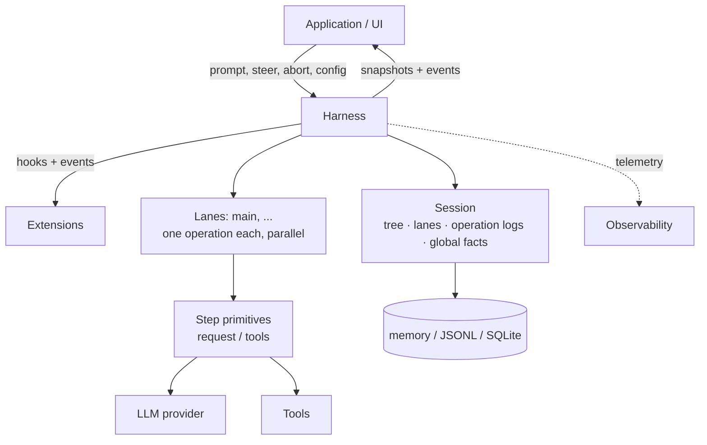
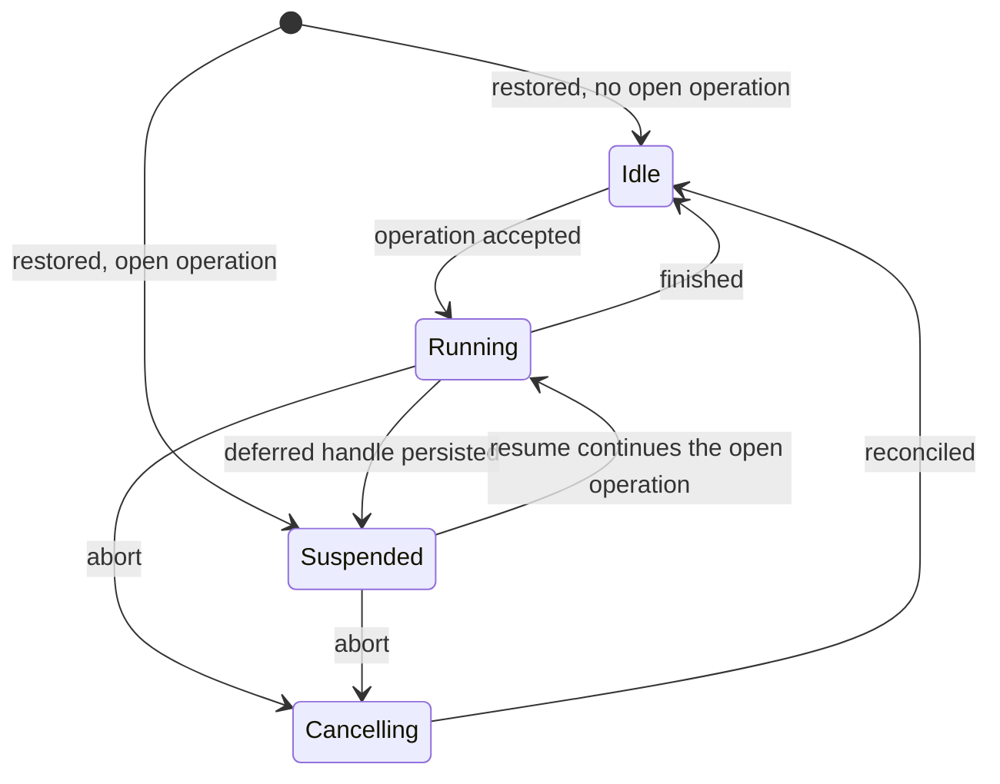

# Durable AgentHarness 设计

> 本页是 `packages/agent/docs/harness.v2.md` 的中文参考译本。该文件在当前工作区是未跟踪的设计稿，因此完整原文以本地文件为准，不能声称已存在于研究 commit；页面中的固定 commit 链接只用于关联已提交的 Harness package 目录。API 名称、命令、路径、配置字段和代码标识符保留原样。

## 中文导读

这份文档不是一个已经完成的运行时 API 说明，而是一份 Durable `AgentHarness` 设计稿。它要解决的问题是：一次 prompt 已经被系统接受、工具可能已经产生副作用、进程却在任意时刻崩溃时，新进程怎样判断“哪些事情已经发生、哪些事情必须继续、哪些事情绝不能重复”。

读者可以把它和普通 Agent Loop 区分开：普通 Loop 关心下一次向模型发送什么；本设计还要记录一次操作的意图、每个可重试 step、工具执行边界、队列输入、延迟写入、成本和恢复状态。记录不是为了打印日志，而是为了让 reducer 在重启后得到和运行中相同的状态。

本页的核心阅读问题有四个：

1. 一个 session 为什么同时需要 conversation tree、lane、operation log 和 global facts？
2. 为什么 effect 前要写 intent，effect 后还要用 provisioned id 写 result？
3. 为什么 `steer`、`followUp`、`nextRun` 和 deferred write 必须在 checkpoint 处理，而不能直接插进当前 request？
4. 为什么 manual drive、reduction 和 race catalog 是生产正确性的一部分，而不只是测试工具？

> 译者注：这里的 durable 可译成“可恢复持久化”，不是“调用 `fsync` 就万事大吉”。真正的语义是：任何允许进程崩溃的边界，都能从已经提交的数据推导出下一步；外部 HTTP 或 shell 副作用是否已经发生，仍可能需要 replay policy 和幂等键来处理。

### 如何阅读本页

先读 Part I 建立对象模型，再读 Part II 的记录和 crash trace，最后读 Part III 的 API、reducer、effects、telemetry 和测试策略。代码片段是接口契约或伪代码，不表示当前 scaffold 已经实现了这些方法。

文中有三种证据必须分开：

- **设计稿事实**：本文件规定的 record、lane、recovery 和测试语义。
- **源码事实**：当前 `packages/agent/src/harness` 实际已经实现的部分。
- **教学推断**：为了理解为什么要这样划分而做的解释。

当前工作区的 `packages/agent/docs/harness.v2.md` 是未跟踪设计稿。它描述了未来的 durable 目标，不能把它误报成研究 commit 中已经提交的完成实现；当前公共 `AgentHarness` 仍有 scaffold 方法返回 `HarnessNotImplemented`。

## 使用建议

1. 先读本页的 Part I–III 和章节对照，不要从英文附录第一行开始抄代码。
2. 每读完一个 record，回到 Part II 的 crash trace，问“如果进程在这两行之间退出，reducer 读到什么”。
3. 再阅读 `packages/agent/src/harness/` 中同名类型，确认设计稿和当前实现的差距。
4. Go/Java 示例只实现教学级组合 Harness；它们帮助理解接口边界，不宣称实现本页全部 operation ledger 和 crash recovery。
5. 运行测试时优先使用 fake provider、临时目录和手工 drive，不要把真实凭据或生产 shell 接到实验中。

> 译者注：Java 读者可以把 lane mutation line 类比为每个 aggregate 的单线程 command queue，把 record 看作事件/意图日志；Go 读者可以把它类比为 `context.Context` 加 channel，但 channel 本身不是 durable storage。两种语言都必须把“排队成功”和“操作成功”分开。

## 源码级中文译文

### Part I：概念

#### 1. Goals：设计目标

**Durable runs。** prompt 一旦被接受，就成为一个 durable operation。进程崩溃后，新进程打开同一个 session，从最后一个安全边界继续。重点不是“尽量恢复”，而是 crash 能产生的每一种中间状态都必须有定义的恢复路径。

**Lanes。** 一个 session 可以有多个 lane。lane 是 conversation tree 中一个命名的位置，也就是未来消息要接上的 leaf。每个 lane 同一时间最多运行一个 operation，但不同 lane 可以并行。Slack channel 可以是 session，thread 可以是 lane；subagent 也可以使用父 session 的另一个 lane。

交互式 Pi 的 UI 通常只显示一个 lane，但扩展 API 仍然需要完整 lane 能力。lane 不是复制一份历史：两个 lane 可以共享同一个 prefix，在各自下一次 append 时自然分叉。

**No partial outcomes。** run、compaction、navigation 之类的操作不能留下“看不出来到底完成没有”的状态。崩溃后只能看到未发生，或者看到足够的记录让 recovery 完成它。

**Harness API。** event 只观察执行，不能改变执行；hook 可以拦截并改变 context、request、tool 和 run boundary。Extensions 建立在 events 和 hooks 之上，而不是直接改写 reducer。

**Deterministic stepping。** durable write、provider request、tool、hook 和 timer 都经过注入的 effect boundary。`drive: "manual"` 在每个 boundary 前暂停，让测试逐个释放 effect、注入输入，或关闭并重新打开来模拟 crash。automatic 和 manual 使用同一套 procedure，差别只是 effect 何时释放。

**Observability。** provider request/response、tool duration、retry 和 recovery 都应可观测，但 telemetry 是 diagnostics，不应反过来决定业务状态。

**UI model。** 客户端先拿一个原子 snapshot，再订阅实时事件。事件不是 replay log；断线重连应重新取 snapshot，而不是假设遗漏事件可以补齐。

**Single writer。** 一个 session 同时只有一个 harness 写入。多个 lane 可以并行，但它们通过同一个 writer 和共享单调 `seq` 线性化。两个进程写同一 session 不属于本设计。

**v3 sessions load。** 唯一必须向后兼容的是旧 coding-agent v3 JSONL：它能打开并恢复成 idle。其他新格式和 API 可以破坏式演进。

> 译者注：这些目标共同约束了架构。若只实现“崩溃后重新 prompt”，就会丢失 accepted prompt、重复收费或重复写文件；若只实现 append-only transcript，又无法知道 operation 是否正在 tool 中间暂停。

#### Non-goals：明确不解决的事

本设计不承诺 hook 自己发出的 HTTP 或文件写入 exactly-once。hook 的结果在 harness 记录提交后才 durable；提交前崩溃，hook 可能再次执行。需要安全恢复的 hook 必须使用 operation id 做幂等键，或者自行拥有事务。

不承诺 partial provider stream 的断点续传。中断中的 stream 不是 durable message；它只能 retry 或 abandon。Deferred request 不同：provider 立即返回 handle，handle 被保存，之后用 `fetchDeferred` 兑换结果。

不支持多个进程同时写一个 session，也不处理多个副本的无协调同步。lane 解决的是同一 session 内的并行 thread，不是分布式冲突合并。

不把 coding-agent 迁移到 `AgentHarness`。v3 兼容只表示新的 JSONL repository 能读取支持的旧文件，不表示所有旧 API 都有迁移路径。

#### 2. What a session is：session 的四部分

Session 是 durable state，不只是 `List<Message>`。它包含四个互相分工的部分：

1. **Tree**：conversation entries，通过 `parentId` 串成树。它包含 message、model/thinking/tool activation、compaction summary、branch summary 和 custom entry。tree 共享、被动、只追加，不属于任何 lane。
2. **Lanes**：工作位置。lane 是名称加 leaf 指针；leaf 是未来 append 的父节点。每个 session 永远有 `main`，应用也可以用 Slack thread id、email thread id 等外部稳定键创建 lane。
3. **Lane operation logs**：执行记录。它按时间记录 operation start、step attempt、tool start、queued message 和 operation finish。正常 context 构建不读取它，recovery 才读取它。
4. **Global facts**：session name、entry label 等 latest-wins 值。它们不进入 conversation tree，但仍以 append-only 历史保存。

四部分共用一个单调递增的 `seq`。seq 把 global fact、tree append 和 lane log 放进同一个可排序的时间线，但不能把它误解为跨进程分布式事务。

```text
树：共享、只追加                 lane
 a ── b ── c ── d                main       → d
       └── e ── f                slack:...  → f
事实：name = "Refactor auth"
```

这张图的输入是 entry 和 lane leaf，输出是“未来工作从哪里继续”。operation record 不画在树上，因为它描述执行而不是对话；删除 records 后，tree 仍然应该是完整有效的 conversation。

##### Active and passive

Tree 和 global facts 是 passive：任何读者都可以读取，它们没有“正在执行”的生命周期。lane 是 active：它拥有 leaf、operation log、queues 和 pending writes。两个 lane 不共享这些 active state。

一个 lane 的动作要么沿 leaf append 新 entry，要么 navigation 跳到已有 entry，要么向自己 operation log 写 record。这样，recovery 可以只读某个 lane 的 bounded slice，不必扫描整个 session。

##### Invariants

- tree 只表示 conversation，不保存 orchestration pointer、running state 或 queue。
- entry 的 parent chain 永远不变；branch 共享 prefix，而不是复制 prefix。
- lane leaf 只有两种移动方式：append 后变成新 entry，或 navigation 跳到已有 entry。
- operation record 不进入 model context、transcript、branch query 或 fork。
- 每个 lane 至多一个 open operation；一个 lane 出现两个 open operation 就是 corruption。
- entry 可以被多个 lane 共享，record 只属于一个 lane。

> 译者注：把 record 混进 message tree 是最常见的错误之一。模型不应该看到“tool_started”这种内部协调信息；fork 也不应把父 session 尚未完成的 queue 和 operation 一起复制，否则 child 会凭空恢复出父进程的副作用。

#### 3. Lanes：并行工作的隔离单位

Lane 可以类比“绑定到某个 commit 的命名工作位置”，但它比 git branch 更自由：navigation 可以跳到任意 entry，不要求向前移动，也不重写历史。

lane 永久拥有四类状态：leaf、operation log、三种 queue，以及从 branch path 推导的 model/thinking/active tools。tool implementation、resources 和 stream options 通常是 harness-global；激活哪些 tool 可以按 lane 持久化。

不同 lane 的 operation 可以并行，所有写入仍由同一 session writer 通过 `seq` 交错。一个 lane 上的 validation、最多一次 durable write 和内存更新构成 mutation line 上的一个 job；provider、tool、hook、retry 等慢操作不能占用这条线。

创建 lane 不复制 tree，也不删除或重命名 lane。两个 lane 在同一 leaf 上时，下一次 append 让它们形成两个 child。某个 lane crash 后成为 suspended，不应阻塞兄弟 lane。

> 译者注：lane 解决“共享历史但独立推进”，fork 解决“复制历史后独立隔离”。Slack thread 更像 lane；导出一个实验 session 或运行隔离 subagent 更像 fork。

#### 4. How work executes：操作如何运行

##### Operations

Operation 是 lane 上需要 durable 解释的工作单位，共三类：

- `run`：从 accepted prompt 开始，包含 tool call、steering、follow-up 和 auto-compaction，直到没有 pending work。
- `compaction`：用 summary entry 替换旧 context；手动 compaction 是独立 operation。
- `navigation`：把 lane leaf 移到已有 entry，可选生成 branch summary。

acceptance 先于执行。accepted operation 必须有 `operation_started`，崩溃后要么 recovery 完成，要么写明确的 terminal outcome。run 的 outcome 是 `completed`、`failed` 或 `aborted`；compaction/navigation 还可因 decision hook 拒绝而 `declined`。

##### Runs, turns, and steps

run 由 turns 组成；turn 是一次 assistant step 加上该 assistant 要求的完整 tool batch。step 是可 retry 的工作单位，可以产生 assistant message、compaction summary 或 branch summary。

一次 step 可能发零个、一个或多个 provider request。attempt number 必须 durable，重启不能把 retry count 清零。deferred provider request 会先写一个携带 handle 的 assistant entry，关闭当前 step，随后 operation suspended，直到下一次 resume 兑换 handle。

每个真正启动 effect 的 tool call 也视作 step：`tool_started` 打开 step，tool-result entry 关闭 step。并行 batch 可以有多个 open tool step，但最终结果按原始 tool index finalize。

##### Queues and deferred writes

队列保存 conversational intent：

- `steer` 修正正在进行的工作，只有 active run 才能接受。
- `followUp` 在模型本来要停止时追加输入。
- `nextRun` 为下一次 run 预置输入，当前 run abort 后仍保留。

deferred write 保存 step 正在运行期间收到的 tree/config fact。它不是 conversational queue，abort 后仍要应用。

两者在 acceptance 时都写完整 payload 的 record，但 entry 在 consumption/checkpoint 才写入 tree。这样模型看到的 entry 位置与 provider context 的尾部一致。若 acceptance 和 tree append 之间 crash，recovery 通过 provisioned id 补齐。

##### Checkpoints

每个 turn 之间先应用 deferred writes，再消费 steering，最后检查下一次 request 是否超出 context；必要时 auto-compaction。tool result 要让模型看到，所以通常开启下一 turn；只有 batch 中所有 result 都持久化 `terminate: true` 时才抑制自动 continuation。

follow-up 只有在 tool continuation 和 steering 都耗尽后消费。finish boundary 必须重新检查 pending work；如果并发 steer 先在线程上排队，它会继续 run，如果 finish 先提交，steer 得到 `NoActiveRun`。

##### Append-only context

同一个 lane 的 provider context 在普通 turn 之间只能向尾部增长。中途追加 `[... U, M, A]` 会让当前请求中的 assistant `A` 看不到 `M`，并且破坏从 `M` 开始的 provider KV cache。deferred write 因此要等 checkpoint；compaction 是唯一有意的 cache invalidation。

##### Lane lifecycle

lane 的基本状态是 `Idle → Running → Idle`。abort 经过 `Cancelling`；deferred handle 或 crash 后是 `Suspended`，resume 继续同一个 operation，不新建 operation。

storage write 失败是 harness-global fault，不只是某个 lane 失败。faulted harness 停止 effect 并拒绝调用；修复后重新打开，reducer 再分别恢复每个 lane。

abort 要先 durable 写 cancellation marker，再 signal 正在运行的 effect，最后 reconciliation：未完成 tool 得到真实或 synthetic result，transcript 得到 closing assistant message。manual drive 会把 reconciliation 停在下一个 gate。

##### Resume

resume 永远继续 open operation，不启动新 operation。recovery 根据 records 末端选择路径：补 initial message、retry unfinished step、兑换 deferred handle、处理未完成 tool batch，或进入下一个 checkpoint。

> 译者注：`resume()` 不是“再 prompt 一次”。它必须保留原 operation id、attempt count、provisioned ids 和已接受的 queue；否则恢复会重新产生一笔 operation，导致重复 assistant、重复工具或重复收费。

### Part II：如何记录执行

#### 5. Records：durability 的事实载体

##### The durability rule

每个 effect 遵守同一条规则：effect 前写 intent record，声明动作和将产生的 id；effect 后用同一个 id 写 result entry。没有多记录原子事务，系统依靠 provisioned id 判断 intent 是否 fulfilled。

如果 intent 存在而 result 不存在，reducer 按类型决定 retry、complete 或 synthetic result。如果 result id 已存在但 payload 不同，这是 corruption，而不是“以最后一次为准”。

> 译者注：这和普通 access log 不同。日志只说“我打算做什么”，不能证明副作用完成；result entry 也不能证明 intent 早已 durable。两者配对，recovery 才能处理两者之间的 crash window。

##### Provisioned ids

`ProvisionedEntry` 先分配 id，但把 `parentId`、`seq` 和 `timestamp` 留给 storage append。append 时它会连接到 lane 当时的 leaf。这样，接受阶段可以把“将来的 entry id”写进 operation intent，即使 entry 尚未进入 tree。

代码语义是：输入是一个要保存的 entry payload；输出是去掉 storage-owned 字段后的 payload；storage 最终补齐 parent/seq/time。调用者不能自行伪造这些字段来跳过 lane mutation line。

##### Record catalog

所有 record 都属于一个 lane operation log。operation record 带 `runId`，而 next-run queue 和 standalone usage adjustment 可以没有 `runId`。基础字段 `id`、共享 `seq`、lane 和 Unix milliseconds timestamp 用于排序、查找和 corruption 诊断。

`operation_started` 是 acceptance boundary，保存 source leaf、normalized prompt、captured initial messages、system prompt override 和 hook `resumeData`。run、compaction、navigation 的 intent 字段不同，不能用一个模糊 JSON 字段替代。

`abort_requested` 只是请求标记，不是终态；后面必须 reconciliation，再写 `operation_finished(outcome: "aborted")`。`operation_finished` 说明 completed/failed/aborted/declined，并携带可诊断的 tagged error。

`step_attempt` 为每个 retryable step 编号。assistant attempt 每次可有新的 result id；compaction 和 branch summary 的同一 structural step 复用约定的 result id。attempt 计数必须跨 restart 保留。

`tool_started` 只有在 before_tool 和 validation 通过后才写。它保存 assistant entry、tool index、call id/name、经过 hook 后的 effective args、result id 和 `replay: "never" | "safe"`。

`queue_enqueued` 保存完整 payload，`queue_cancelled` 通过 entry id 撤回尚未消费的 item，`write_deferred` 保存 checkpoint 要应用的 entry/config。usage record 独立于 message result，确保失败 request、discarded overflow 和 retry 的费用不消失。

##### Cost ledger

usage 是账务 ledger，而不是 orchestration state。每个 provider request settle 后先写 usage，再做 overflow 分类或 retry 决策。tool/hook 报告的 usage 也分别记录；应用可写 adjustment 修正估算。

entry 的 `usage` 是 append 时写入的 immutable snapshot；entry effective cost 是读取时把绑定 records 相加；session cost 是所有 usage records 的总和。retry 或 safe replay 产生两条成本记录是有意的，因为它们确实可能向 provider 付了两次钱。

##### Validity

recovery 必须拒绝：一个 lane 有多个 open operation；record 引用不存在或已结束 operation；attempt 不连续；compaction reason 放错 step；abort 后又接受 steer/followUp；cancel 没有对应 enqueue 或 entry 已存在；structural step 的 result id 不一致；tool ordinal 与原 assistant call 不匹配；同一 invocation 有两个 `tool_started`；同一 provisioned id 绑定不同内容。

这些检查的输入是 bounded record slice 加 point lookup，不是“相信最后一条日志”。输出要么是可 reduction 的有效前缀，要么是 faulted/corrupt 状态。

#### 6. What each action writes：逐动作 crash trace

本节的符号：`E` 是 tree entry，`R` 是 operation record，`L` 是 lane move，`G` 是 global fact，`H` 是 awaited hook，`X` 是 crash site。每两行之间都可以退出，恢复规则必须能解释每个位置。

##### Run with one tool call

标准顺序是：`before_run` → `operation_started` → user entry → assistant `step_attempt` → assistant tool-call entry → `before_tool` → `tool_started` → `after_tool` → tool result → 下一 assistant attempt → final assistant → `before_run_end` → `operation_finished(completed)`。

如果 crash 在 `tool_started` 前，没有 effect intent；恢复可以重新验证/阻止该 call。如果 crash 在 `tool_started` 后而 result 不在，replay policy 决定重新执行还是写 synthetic interrupted。若 result 已经存在，则跳过该 call，继续 batch 的下一个 ordinal。

##### Retry

每次 attempt 都写 `step_attempt`；request 失败后 usage 先记账，再决定是否 backoff。backoff 中 crash 不会让下一次恢复重新从 attempt 1 开始。上限耗尽时写一个 terminal assistant error entry，再写 failed outcome。

失败 attempt 通常不写 assistant message；否则下一次 retry 会把失败响应错误地当成上下文。恢复看到 terminal failure marker 后，只 drain 已接受 input；除非 steer/followUp 真正启动新工作，否则不能把失败改写成 completed。

##### Context overflow at an assistant step

`stopReason: "length"` 不能直接等同于 context overflow。必须把实际 output usage 和调用者/模型原始 intended output cap 比较：低于 intended cap 可能是 context 被 clamp 或 provider window，才允许 discard、compaction、retry；达到 intended cap 是真实截断，应进入 transcript。

overflow-form provider error 也走相同分类。discarded response 不进入 tree，但它已经发生的 usage 仍写 ledger。一次 conversational input 最多进行一次 overflow recovery；第二次同一输入仍 overflow，就写 bounded failure，不能无限 compact/retry。

> 译者注：这里的 intended cap 很容易被实现成“实际发送给 provider 的 cap”。但 context clamp 可能把发送值缩小，Codex-style provider 也可能拒绝某个参数。若用 clamp 后的值判断，就会把真正的 context overflow 错误当作用户要求的输出上限。

##### Steering while a tool runs

tool 执行中收到 `steer` 时，调用方先拿到 queue acceptance 结果；`queue_enqueued` durable 后才表示输入已被接受。tool result 仍按原计划写入。下一 checkpoint 消费 queue item，把它 append 到 tree，下一 request 才看到它。

若 crash 在 enqueue 前，steer 从未被接受；若 crash 在 enqueue 后，recovery 补 provisioned entry。`cancelQueued` 和 consumption 都在 mutation line 上，所以只有 cancel-first 或 consume-first 两种历史。

##### Input at the finish boundary

finish 不是“检查一下然后返回”这么简单。`tryFinishRun` 把 pending-work check 和 terminal append 放在同一 mutation job。steer 先排队就会让 run continue；finish 先提交则 steer 看到 `NoActiveRun`。不存在第三种半接受状态。

deferred write 和 abort 使用同一排序规则：finish 前接受的 write 必须在关闭前应用，finish 后接受的 write 看到 idle lane，走普通 idle append；abort 先赢则进入 reconciliation。

##### Deferred write mid-turn

如果当前 provider request 的 context 是 `[..., U]`，调用方 append `M` 必须写 `write_deferred`，等 assistant `A` commit 后再把 `M` 接到尾部。直接 append 会形成 tree `[... U, M, A]`，却无法声称 A 看过 M；同时破坏 provider cache。

##### Abort during a tool

abort 调用返回表示 abort request 已 durable，不表示 tool 线程已经停止。随后写 `abort_requested`、清掉 steer/followUp、signal effect，真实完成的 tool 保留真实结果，未知的 tool 写 synthetic `interrupted`，再写 closing assistant 和 aborted finish。

`nextRun` 和 deferred writes 不被 abort 丢弃。suspended lane 的 abort 也要关闭 open operation；manual drive 会把关闭流程暴露为可释放 action。

##### Tool execution crash sites

X1/X2：before_tool 前没有记录，恢复重新走 validation/hook。X3/X4：`tool_started` 已写而结果未知，只有 persisted replay 与当前 declaration 都是 safe 才能重放 effective args；否则 synthetic result，不再运行 hook。X5：result entry 已存在，跳过调用。

并行 batch 仍按原始 tool index 对账。截断的 assistant batch 永不执行任何 tool，只为未完成 call 写 truncated result。这样“模型要求执行”不会被错误地解释为“所有副作用都已执行”。

##### Auto-compaction at a checkpoint

auto-compaction 属于当前 run，不新建 operation。checkpoint 调用 `before_compaction`；hook 可以 decline 或直接提供 summary。没有 hook summary 时，compaction step 自己写 attempt、usage 和 result entry，随后新的 assistant step 使用 compacted context。

manual `compact()` 则是独立 operation，有自己的 operation_started、structural step 和 operation_finished。两者共享 summary contract，但 recovery 查询路径不同。

##### Navigation

navigation 采用 move-first。接受时记录 target、summary id 和 label；hook/summary 在内存中准备；lane move 是 commit point；move 后 summary entry 沿 target leaf append，label 作为 global fact 写入，最后 finish。

move 后 crash 并不回滚：recovery 看到 leaf 已经等于 target，就只补 summary、label 和 finish。move 前 crash 则重新执行 decision/summary。禁止 `targetId === sourceLeafId`，因为必须让“move 是否已发生”可判定。

##### Deferred provider request

deferred assistant entry 保存完整 handle，不保存虚假的 content。该 entry 使 operation suspended；每次 `resume()` 最多 fetch 一次。provider 返回 pending 且 handle 相同，就重新 suspended；ready 追加普通 assistant；terminal/rejected fetch 转成 error entry 并 failed。

recovery 不应自动发一个新的付费 request。`cancelDeferred` 是 best effort；suspended entry 仍留在 transcript。handle 的 provider/model/api/id 必须与持久化值完全匹配，不匹配是 defect。

#### 7. Recovery：从 bounded state 继续

##### Restore

打开 session 时 restore 只读，不 append、不调用 provider、不执行 tool。首先通过 `findOpenOperations(lane, { limit: 2 })` 区分零个、一个和多个 open operation；两个就是 corruption。

idle lane 只需要查最近 run-kind operation 后的 nextRun queue。suspended lane 只读取 open operation 的 record slice、从 leaf 回溯到 source leaf 的 own entries，以及 provisioned ids 和配置的 point lookups。不能因为 session 很大而扫描全部历史。

##### The reduction

reducer 把 bounded reads 变成 `LaneState`：aborting、unfinished attempt、overflow guard、tool batch、deferred handle、pending queue、pending write、missing initial messages 和 structural target。它同时推导 effective model/thinking/active tools 和 terminal failure provenance。

live execution 和 restore 必须使用同一语义。运行中是每次 commit 更新 state，重启后是从 record/entry reduction；两者不应各自维护一套“差不多”的判断。usage 不进入 state，因为账务不应该改变 orchestration。

##### Resume

resume 顺序很重要：先补 accepted initial messages；aborting 就 reconciliation；有 unresolved tool batch 就按 crash site 处理；有 deferred handle 就兑换；terminal failure 只 drain accepted input；有 unfinished step 就按 durable attempt 继续；否则进入 checkpoint。

所有 recovery append 都是 `appendIfMissing`：id 已存在且内容一致就跳过，id 存在但内容不同就 corruption。重复运行 recovery 应得到 fixed point，而不是再产生第二份 entry。

> 译者注：reducer 是 Harness 的“可解释状态机”。如果状态只能从内存 flag 得到，进程退出后就无法恢复；如果每次 resume 都重新猜测上下文，又会重复 side effect。把 reduction 设计成纯函数，才能为 crash matrix 写确定性测试。

### Part III：API 与实现

#### 8. Public API

##### The lane surface

`AgentLane` 是单个 lane 的异步操作面：`prompt`、`skill`、`promptFromTemplate`、`compact`、`navigateTree`、`resume`、`abort`，以及 `steer`、`followUp`、`nextRun`、`cancelQueued`。getter 也返回 Promise，是为了让同一 interface 可由远程 proxy 实现；`name` 和 listener registration 是少数同步例外。

公共 operation 不应把正常业务失败作为 throw。调用返回 `Result<T, E>`：`Ok` 表示请求已接受，不保证最终 completed；`Err` 表示 lane busy、invalid input、unknown target、closed 或其他预期拒绝。storage fault 和 invariant defect 才会 fault harness。

`prompt` 的签名可以接 text、images 或 `AgentMessage[]`；skill/template 在 acceptance 前展开。`compact` 和 `navigateTree` 是 structural operation；`resume` 继续原 operation；`abort` 在返回后可能继续 background reconciliation。

##### The harness

`AgentHarness.create(options)` 打开 session、恢复 lanes，并返回 suspended inventory，但 restore 不能启动 effect。`lane(name)` 只查找，`createLane` 创建永久键，`lanes()` 至少包含 main。harness-global 的 tools/resources/stream policy 与 lane-specific model/thinking/active tools 要分开。

`systemPrompt` callback 默认每 request 运行；hook override 可以固定整次 run。`toProviderMessages` 和 `entryProjectors` 负责把 tree entry 投影到 provider context，避免让 operation record 泄漏给模型。

##### Options

options 要覆盖 model、tools、retry、compaction、stream、telemetry、hooks、events、drive mode、storage 和 permission。`telemetryContext` 默认 no-op；它应显式传递，不依赖 `AsyncLocalStorage` 或 global current span。

automatic drive 用真实 provider/tool；manual drive 使用相同 procedure，只是把 effects 包在 gate 中。权限策略必须在 tool effect 前执行，不能把模型生成的 name/args 当作授权。

##### Results and tagged errors

`RunResult` 要同时提供 outcome、final message、final entry id、leaf id、operation id 和 error。completed、aborted、failed、suspended 都是可解释状态；suspended 要携带 `DeferredHandle`。

`LaneBusy`、`InvalidMessage`、`NoActiveRun`、`NothingToResume`、`UnknownTarget` 和 `Closed` 是预期 tagged errors。`HarnessFault` 表示 storage/不变量错误，不能静默转换成空结果。

##### Suspended operations

`suspended` 表示 operation 仍 open，但当前没有 effect 运行。原因可以是 crash，也可以是 deferred handle。恢复信息应包含 lane、operation kind/id、startedAt、reason、normalized prompt、handle、被 abort 清掉的 queue payload 和缺失 identity。

##### Examples

示例的重点不是 API 的每个 overload，而是生命周期：创建 harness → 接受 prompt → append operation intent → stream assistant → 写 usage → 执行/记录 tool → commit message → finish。每个步骤都应有对应的 crash prefix 和 resume 测试。

#### 9. Snapshots and subscription

客户端先捕获 `LaneSnapshot`，再调用 `start(listener)`。两步之间到达的事件要 buffer，start 时先 flush，再转 live，保证没有 gap。snapshot 至少包含 transcript、leaf、operation status、streaming assistant、running tools、retry、三种 queue 和 pending writes。

`watchSession()` 只提供 lane inventory 和全局事件；`events.on` 是 live-only。事件不是恢复事实，重连必须重新取 snapshot。configuration 通过 getter 读取，不把一份可能过期的配置复制进 snapshot。

#### 10. Events

事件是有序、被动、非持久、非 replay 的 live stream。run、turn、step、message、tool、queue、entry、fact、config、compaction、navigation 和 usage 都可以有明确 event discriminant。

`message_end` 必须在 entry commit 后发送；`run_start` 到 `run_end` 可以驱动 UI busy indicator。listener 抛错由事件系统捕获并报告为 `handler_error`，不能改变 operation state，也不能让 handler_error 无限递归。

恢复时可以以 `recovery: true` 重发新的 start bracket，但不能把旧事件逐条 replay。这样 UI 得到当前状态，而不是把旧的执行过程误认为正在重新执行。

#### 11. Hooks

hook 是 awaited interception point，注册是 harness-global，但 event 带 lane，handler 可以自行过滤。`before_run` 和 `before_resume` 使用稳定 registration id；resumeData 按 id 保存，不能按数组位置恢复。

`transform_context`、`before_request`、`before_payload`、`after_response` 可能在 retry/resume 重跑；`before_tool` 在没有 `tool_started` 时重跑；`after_tool` 只有 safe replay 才重跑。进入 durable state 的 hook 输出必须在 effect 前落盘。

`before_tool` fail-closed：抛错就阻止 tool。其他 handler 可以隔离错误并发 `handler_error`，但错误处理规则要稳定。hook 自己的副作用不受 harness exactly-once 保护，必须由扩展作者负责幂等。

> 译者注：hook 和 event 的边界是“能否改变流程”。event 是观测，hook 是控制；不要为了方便让 event listener 修改全局 state，也不要把权限审批做成事后 event。

#### 12. Session and SessionTree

entry 的 storage 字段有 type、id、seq、parentId、timestamp。v4 tree 类型包括 message、model change、thinking level、active tools、compaction、branch summary 和 custom。tool result 的 `terminate` 属于 reduction 控制，不应泄漏成模型自然语言。

`SessionTree` 提供 leaf、entry、stats、facts、全树查询和 bounded branch query。context build 从最近 compaction summary、retained tail 和之后 entries 构建，不读取已被压缩的旧 history。SessionTree 不负责 navigation 的业务流程。

`Session` 绑定 main，提供 view、lane create/move、append entry/record、record query、open-operation query 和合并 seq 的 log。应用只能通过 Session 写 usage adjustment，不能绕过 Session storage。

#### 13. Storage

backend-neutral `SessionStorage` contract 要求一个 session、一条全局 seq、atomic append、immutable read、JSON payload、single-writer claim 和 open-operation projection。Memory 是参考实现，JSONL 是一 session 一文件，SQLite 用表和 writer lease 实现同样查询语义。

JSONL 要处理 format-4 header、entries、records、lanes、facts、statistics、fork、坏尾行和坏中间行。v3 read-only open 不改物理文件；首次 v4 write 才通过 temp+rename 转换。坏尾可以按设计截断，坏中间数据必须拒绝。

SQLite 的 branch cache 只是私有读缓存，不是恢复的唯一事实；cache repair 要显式进行。不同 backend 必须共享 query bounds、seq 顺序、JSON validation 和 recovery 行为。

fork 只复制允许的 tree/facts/lane pointer，不复制 operation logs、queues 或 open operation。fork 的成本从零开始，entry usage snapshot 仍可显示历史；subagent id 要由 parent session 和 tool call 稳定推导，safe replay 才不会产生 child twin。

#### 14. Agent-loop building blocks

`streamAssistant` 负责一次 provider request：context transform、message projection、authenticated model dispatch 和 settled assistant result。`prepareToolCall` 负责 lookup、参数准备、validation、before_tool 和 abort 检查；`executeToolCall` 执行 effect；`finalizeToolCall` 运行 after_tool patch；`createToolResultMessage` 统一结果。

`executeToolBatch` 把 phase 1（准备）和 phase 3（finalize）按 source order 串行化，只有 phase 2 的 tool effect 可以并行。`length` 截断的 batch 不执行。旧 `agentLoop`/`runAgentLoop` 是无 durable state 的 compatibility wrapper。

> 译者注：这个拆分让 durable Harness 可以在 tool effect 前写 `tool_started`，在 effect 后写 result，而不必把整个旧 loop 改造成一个巨型事务。

#### 15. Harness internals

##### The effects boundary

所有副作用都经过 `Effects`：append entry/record、move lane、set fact、conditional commit、provider stream/fetch/cancel、tool、hook 和 sleep。procedure 不直接持有 session、model、tools 或 hook runner；read 可以不 gate，effect 必须 gate。

##### The lane mutation line

每个 lane 有 FIFO promise chain。一个 mutation job 只做读取 live state、验证、至多一次 durable write 和内存更新；provider/tool/hook/backoff 在 job 外执行。这样慢 effect 不会阻塞同 lane 的 queue acceptance，也让 finish 和 steer 有明确定序。

##### Race catalog

必须覆盖 prompt/prompt、queue/finish、deferred write/finish、abort/finish、abort/queue consumption、abort/before_run_end follow-up、nextRun/acceptance、deferred write/abort close、config/acceptance snapshot、abort/in-flight effect、cross-lane writes 和 cancel/consume。

其中 abort 与 in-flight external effect 无法靠排序消除：effect 可能已发生但结果未到达。只能依靠 intent、replay declaration、synthetic result 和外部幂等。

##### Drive modes

automatic drive 直接执行 `fx`；manual drive 在每个 effect 前创建 JSON-safe `ActionInfo`。`peekAction()` 无副作用且稳定；`executeAction()` 只释放它描述的一个 action；`runToCompletion()` 释放到 operation settled。

manual gate 必须可重入。stream 内的 hook 可能产生 nested action，driver 要看到并释放 nested action，不能等待外层 action 而隐藏它。parallel tool 在 manual 下逐一释放，但 durable log 与 automatic mode 相同。

close parked operation 时，parked promise 拒绝为 `HarnessClosed`，已释放的 durable prefix 保留；重开后走普通 recovery。两个并发 driver 属于 programmer defect。

##### Live lane state

`LaneState` 是 records 和 own entries 的 reduction 结果，包含 lane/leaf、operation、aborting、unfinished step、tool batch、pending queues/writes、deferred、overflow guard、newest own entry 和 structural targets。

`RunFailed`、`Park`、`Aborted`、`Overflow` 是 procedure 内部控制信号。它们不能逃逸为混乱的 caller exception：RunFailed 进入 failure drain，Park 进入 suspended，Aborted 进入 abort path，Overflow 丢弃响应并触发 bounded compaction。

每次 resume/close/finish 后做 fixed-point self-check：从 storage 重新 reduction，必须和 live LaneState 相等。这样 reducer/writer drift 会在刚发生时暴露，而不是等到下一次 crash。

##### Dispatch and the loop

`resume()` 先检查 missing tools/models，再运行 `before_resume`，发 `run_resume`，按 operation kind dispatch 到 run、compaction 或 navigation procedure。run procedure 先补 initial messages，再处理 abort/deferred/tool batch/unfinished step，最后进入 driver loop。

driver loop 的 checkpoint 顺序是 apply pending writes → consume steering → abort check → context compaction → assistant step → tool continuation → follow-up → finish boundary。每个 effect 都通过 `fx`，所以 automatic/manual 看到同一条 durable trace。

assistant step 在 request 前写 step attempt，response settle 后写 usage；recoverable overflow 直接 discard；deferred 写 assistant handle 并 Park；retryable error sleep 后继续；terminal error 写 error entry 并进入 RunFailed。

##### Steps, tools and abort

tool batch 为每个 call 保留 source ordinal。live path 在 `before_tool` 与 validation 后写 `tool_started`，phase-2 execute，after_tool finalize，再 append result。recovery path 对每个 call 单独选择 skip/replay/synthetic，不能因为 batch 中另一个 call 成功就忽略当前 call 的 crash site。

abort path 可以 best-effort cancel deferred，给未完成 call 补 synthetic result，应用 deferred writes，写 closing assistant，再 finish aborted。structural compaction/navigation 没有 tool batch，但也必须通过同一 finish/abort boundary。

compaction 的 hook summary 要标记 `fromHook` 并记录 hook usage；navigation 先 move 再 summary/label。两者都要按 attempt cap 恢复，不能把生成 summary 的内存文本当作 durable fact。

### 16. pi-ai：deferred requests

deferred 是 per-request capability。`SimpleStreamOptions.deferred` 表达是否请求 deferred execution；settled assistant message 的 `stopReason` 可以是 `stop`、`length`、`toolUse`、`error`、`aborted` 或 `deferred`，而 `pending` 只允许存在于 mutable live stream。

`DeferredHandle` 至少包含 provider、modelId、api 和 provider id，可选 expiresAt、pollAfterMs 和 conversion data。handle 是 recovery 所需的事实，不是给用户展示的普通文本。

`ProviderStreams.fetchDeferred` 和 `cancelDeferred` 的存在就是 capability signal。Models 层负责 credential store、header merge、timeout 和 telemetry context；provider adapter 把 native reason 归一化为 core stop reason。fetch pending 必须返回同一个完整 handle，ready 才追加 successor entry。

> 译者注：deferred 和 retry 不等价。retry 会重新产生 provider request，可能再次收费；deferred redemption 是取回已经提交的同一请求。两者在 telemetry、成本和幂等语义上都必须分开。

### 17. Forks and subagents

fork 有 branch scope 和 tree scope。branch 只复制 root 到 fork point 的一条路径，tree 复制所有 entries、lanes 和 facts；两者都不复制 records、queues 或 open operations，因此 fork 从 idle 开始。

fork point 即便在 tool batch 中间也可以 prompt；message transform 可以为 orphaned tool call 插入 synthetic empty result。source 不变，`parentSessionId` 记录父子关系。subagent 的 child session id 要由 parent session 和 tool call id 确定性推导，safe replay 重连原 child，而不是创建 twin。

### 18. Telemetry

telemetry 使用显式 context，不依赖 Node/Bun/browser 某个 runtime 的 ambient current span。`TelemetryContext.startSpan` 用 callback 创建 child，保留同步 throw、异步 reject 和返回值；默认成功，显式 error status 不会被自动成功覆盖。

通用 contract、no-op 和 in-memory adapter 属于 `packages/telemetry`；AI request schema 和 Harness schema 属于 agent package。Pi 不内置 exporter，应用可以把显式 context 接到 OTel、Sentry 或日志系统。

schema 要限制 span name、parent、required start attributes、closed values 和 optional end attributes。`pi.ai.request` 记录 provider/model/api、streaming、stop reason、usage、chunk count 和 TTFC，但默认不记录 prompt、completion、tool args/output、payload、headers 或 credentials。

Harness spans 可以覆盖 operation、checkpoint、turn、step、tool、hook、sleep、event handler 和 session write。tool span 只描述 phase-2 raw execution；blocked/invalid tool 没有 tool intent，也不应产生虚假的 tool span。

span lifetime 跟普通执行 scope 一致：operation acceptance 成功后才开始 operation span；failed result 可以正常 resolve 但显式 error；close/fault/defect reject callback；进程死亡不执行 cleanup，下一进程创建新的 recovery span。telemetry 不写入 record、entry、snapshot 或 deferred handle。

> 译者注：日志回答“发生了什么”，trace 回答“这件事属于哪次 request/step”，durable record 回答“重启后下一步是什么”。三者都可以有 operation id，但不能相互替代。

### 19. Testing strategy

Tier A 是纯 reduction/resume：预填每一个 section 6 crash prefix，打开 harness，resume 并断言最终 durable state。Memory、JSONL、SQLite 必须跑 parity；还要覆盖 v3 normalization 和 malformed payload。

Tier B 是 writer conformance：instrument Session，精确断言 E/R/L/G/H 顺序。重点回归“effect 是否在 intent record 前启动”，以及 provider request 是否只在 tail 追加，compaction 才允许 cache invalidation。

Tier C 使用真实 harness、faux provider、真实 backend 和 manual drive。每次 `executeAction()` 后 snapshot，按每个 prefix close/reopen/resume，并把 recovery 重复两次。需要覆盖 race catalog 两种顺序、park/abort、automatic/manual 相同 durable log、fixed-point live/reduced state、peek 无副作用、恰好一个 finish 和 fault prefix。

额外 suite 还应验证 telemetry adapter contract、event ordering、hook registration id/resumeData、fail-closed before_tool、usage ledger、overflow classification、deferred pending/ready/terminal、fork cost/messageCount 和 v3 fixtures。

> 译者注：happy path 只能证明“代码能跑”，不能证明“代码崩了能恢复”。Tier A 测 reducer，Tier B 测 writer 顺序，Tier C 测真实 API 与任意 interleaving；三层缺一不可。

### 20. Implementation status and work packages

实现范围只包括 `packages/agent`、`packages/session-backends/sqlite-node`、`packages/telemetry` 和 `packages/ai` 的 telemetry request options；不迁移 `packages/coding-agent`。没有完成的 public operation 必须继续返回 `HarnessNotImplemented`，不能返回看似合理的 idle/no-op。

一个 package 的工作流程是：确认 dependency 与 reservation → 读取设计和 primary files → 在 primary files 实现行为 → 写覆盖 invariant 的 focused tests → 跑 `npm run check` → 合并后移除 reservation、勾选 package。设计与实现不一致时，先更新设计再继续，不要偷偷改语义。

Track F 负责 scaffold truth 和 public ownership。F0 已要求每个未完成 public method 明确 reject，record-free create 才可安全打开；R track 负责 indexed recovery query、validity 和 pure lane reduction；R3 才拥有 restore inventory。

Track J 负责 format-4 JSONL storage、repository lifecycle、fork、crash/corruption、v3 read-only normalization、first-write conversion 和 schema validation。J4/J5/J6 尚未完成时，不能声称 v3 转换和完整 durable payload 已交付。

Track I 负责 telemetry、hooks、passive events、mutation line、automatic effects 和 manual gate。I5 的 gate 仍是 primitive；只有 H/C/N/O tracks 才把它接入完整 public harness。

Track L 把 `agent-loop.ts` 拆成 streaming、tool-call phases、batch composition 和 compatibility wrapper。它必须保持已有 loop/agent suite 不变，并为 settled-result narrowing、abort、source order、truncation 加 focused tests。

Track H 按 H0–H8 逐步实现 lane facade、successful run、retry/resume、queues/checkpoints、deferred writes/config、abort/wait/close、live tool batch、tool recovery 和 deferred provider redemption。每一步都要加 Tier A/B/C 对应测试。

Track C/N 负责 manual compaction、threshold auto-compaction、overflow recovery 和 move-first navigation。overflow 要按 intended cap 分类、usage 先入 ledger，并按 conversational input bounded 到一次 recovery。

Track O 负责 snapshots、event completeness、runtime telemetry、QA salvage 和 core completion。QA3 不能恢复旧 API，只能把仍然成立的 invariant 映射到当前 public surface。

public method ownership 表的意义是防止“一个方法有很多看起来能工作的 placeholder”。`AgentHarness.create()`、lane facade、prompt、resume、queues、abort、tool recovery、deferred redemption、compaction、navigation、manual drive、watch 和 telemetry 各自有 owner 与 acceptance criteria；未由 owner 实现的方法必须保持显式未实现。

> 译者注：work package 不是项目管理装饰。它把“谁能改哪个文件、哪个测试证明完成、哪个依赖先落地”写成约束，避免多个人同时扩展 `agent-harness.ts`，最后无法判断哪一个状态语义是真实的。

### 21. Required reading

推荐顺序是：先读 `session/types.ts` 的 v4 contract，再读 `session/session.ts` 和 Memory backend；然后读 SQLite repository、`agent-harness.ts`、telemetry schema、`agent-loop.ts`、旧 `agent.ts` 的 queue/abort、messages/compaction/transform，最后读 coding-agent v3 session format 和 extension runner。

阅读每个文件时固定回答：文件为什么存在？入口 symbol 是什么？输入从哪里来？输出交给谁？哪一行产生 durable write？如果这一行之后 crash，reducer 会得到什么？

本页是设计稿参考译本，不是当前 scaffold 已完成的承诺。结合 `reference/source-map` 的固定 commit 路径和当前工作区源码阅读，才能区分目标架构与现状。

## 章节对照

| 源文档标题 | 中文阅读标题 |
| --- | --- |
| Durable AgentHarness design | Durable AgentHarness design |
| Part I — Concepts | 第一部分：概念 |
| 1. Goals | 1. Goals |
| Non-goals | Non-goals |
| 2. What a session is | 2. What a session is |
| Active and passive | Active and passive |
| Invariants | Invariants |
| 3. Lanes | 3. Lanes |
| 4. How work executes | 4. How work executes |
| Operations | Operations |
| Runs, turns, and steps | Runs, turns, and steps |
| Queues and deferred writes | Queues and deferred writes |
| Checkpoints | Checkpoints |
| Append-only context | Append-only context |
| Lane lifecycle | Lane lifecycle |
| Resume | Resume |
| Part II — How execution is recorded | 第二部分：如何记录执行 |
| 5. Records | 5. Records |
| The durability rule | The durability rule |
| Provisioned ids | Provisioned ids |
| Record catalog | Record catalog |
| Validity | Validity |
| 6. What each action writes | 6. What each action writes |
| Run with one tool call | Run with one tool call |
| Retry | Retry |
| Context overflow at an assistant step | Context overflow at an assistant step |
| Steering while a tool runs | Steering while a tool runs |
| Input at the finish boundary | Input at the finish boundary |
| Deferred write mid-turn | Deferred write mid-turn |
| Abort during a tool | Abort during a tool |
| Tool execution crash sites | Tool execution crash sites |
| Auto-compaction at a checkpoint | Auto-Compaction at a checkpoint |
| Navigation | Navigation |
| Deferred provider request | Deferred provider request |
| 7. Recovery | 7. Recovery |
| Restore | Restore |
| The reduction | The reduction |
| Resume | Resume |
| Part III — API and implementation | 第三部分：API 与实现 |
| 8. Public API | 8. Public API |
| The lane surface | The lane surface |
| The harness | The harness |
| Options | Options |
| Results and tagged errors | Results and tagged errors |
| Suspended operations | Suspended operations |
| Examples | Examples |
| 9. Snapshots and subscription | 9. Snapshots and subscription |
| 10. Events | 10. 事件 |
| Catalog | Catalog |
| Nesting | Nesting |
| 11. Hooks | 11. Hooks |
| Catalog | Catalog |
| Replay across retry and resume | Replay across retry and resume |
| 12. Session and SessionTree | 12. Session and SessionTree |
| Entries | Entries |
| SessionTree | SessionTree |
| Session | Session |
| 13. Storage | 13. Storage |
| Contract | Contract |
| Memory | Memory |
| JSONL | JSONL |
| SQLite | SQLite |
| 14. Agent-loop building blocks | 14. Agent-loop building blocks |
| Streaming one assistant response | Streaming one assistant response |
| Tool execution | Tool execution |
| Compatibility wrapper | Compatibility wrapper |
| 15. Harness internals | 15. Harness internals |
| The effects boundary | The effects boundary |
| The lane mutation line | The lane mutation line |
| Race catalog | Race catalog |
| Drive modes | Drive modes |
| Live lane state | Live lane state |
| Dispatch | Dispatch |
| The loop | The loop |
| Steps | Steps |
| Deferred redemption | Deferred redemption |
| Tools | Tools |
| Abort | Abort |
| Structural operations | Structural operations |
| 16. pi-ai: deferred requests | 16. pi-ai: deferred requests |
| 17. Forks and subagents | 17. Forks and subagents |
| 18. Telemetry | 18. Telemetry |
| Package ownership | Package ownership |
| Context contract | Context contract |
| Typed schema | Typed schema |
| Effects and nesting | Effects and nesting |
| Span lifetime | Span lifetime |
| Safety and testing | Safety and 测试 |
| 19. Testing strategy | 19. 测试 strategy |
| Tier A — reduction and resume | Tier A — reduction and resume |
| Tier B — writer conformance | Tier B — writer conformance |
| Tier C — deterministic interleavings | Tier C — deterministic interleavings |
| Other suites | Other suites |
| 20. Implementation status and work packages | 20. Implementation status and work packages |
| Claiming and completing a package | Claiming and completing a package |
| Track F — scaffold truth and public ownership | Track F — scaffold truth and public ownership |
| Public method ownership | Public method ownership |
| Track QA — legacy test salvage | Track QA — legacy test salvage |
| Track R — recovery query, reducer, and restore | Track R — recovery query, reducer, and restore |
| Track J — JSONL storage | Track J — JSONL storage |
| Track I — primitives | Track I — primitives |
| Track L — agent-loop building blocks | Track L — agent-loop building blocks |
| Track H — harness integration and run execution | Track H — harness integration and run execution |
| Track C/N — structural operations | Track C/N — structural operations |
| Track O — observability and core completion | Track O — observability and core completion |
| Dependency, priority, and merge summary | Dependency, priority, and merge summary |
| 21. Required reading | 21. Required reading |

## 使用建议

1. 先阅读本页标题和章节对照，明确你要解决的操作。
2. 再阅读下方完整内容，命令和代码可以直接复制，但先检查平台、权限和版本。
3. 如果页面描述了运行时行为，回到 `reference/source-map` 和固定 commit 的源码 symbol 验证。

## 源码级中文译文

本节按源文档的三大部分翻译并解释设计约束。这里的“持久化”特指写入 `Session` 后 promise resolve；事件、hook 和 telemetry 都不是恢复依据。源码事实以 [`packages/agent/src/harness/`](https://github.com/coolerks/pi-lean/tree/853a80d26c90a14c1886f0ebb8ffaae133ca2185/packages/agent/src/harness) 为准，尤其是 `session/types.ts`、`session/session.ts`、`reducer.ts`、`agent-harness.ts` 和 `events.ts`。

### 第一部分：概念

#### 1. 目标与非目标

Harness 在一个 session 上执行 durable run。prompt 一旦被接受就是一个持久 operation；进程崩溃后，新进程读取 session，并从最后一个安全边界继续。每个 lane 同时至多有一个 open operation，但多个 lane 可以并行；例如 Slack channel 是 session，thread 是 lane。事件只观察，hook 可以修改 context、request、tool 和 run 边界；`drive: "manual"` 则把每一个副作用停在可测试的 gate 前。

设计要求包括：没有“执行了一半但无法解释”的结果；单 writer；所有可能产生 crash state 的状态都可恢复；客户端先获得一个原子 snapshot，再获得实时事件流。旧 coding-agent v3 JSONL 必须能打开并恢复为 idle。非目标包括 hook 外部副作用的 exactly-once、部分 provider stream 的续传、多进程同时写一个 session、复制同步，以及把 coding-agent 迁移到 `AgentHarness`。hook 自己发出的 HTTP 或文件写入不受 harness 事务保护，必须自行使用 operation id 等幂等键。

#### 2. Session 的四种状态

Session 包含四部分，并由一条单调递增的 `seq` 排序：

1. **Tree**：由 `parentId` 串联的 message、model/thinking/tool 配置、compaction、branch summary 和 custom entry。它只追加、不修改、不删除，也不属于任何 lane。
2. **Lanes**：名称和 leaf 指针。每个 session 永远有 `main`；应用可用 Slack thread id 等外部稳定键创建其他 lane。
3. **Lane operation log**：该 lane 的按时间排列的 `operation_started`、`step_attempt`、`tool_started`、队列、deferred write 和 `operation_finished` records。它描述执行而不是对话，正常 context、transcript、branch query 和 fork 都不能读取它。
4. **Global facts**：session name、entry label 等 latest-wins 值。它们保留 append-only 历史，但不进入 tree。

Tree 和 facts 是 passive；lane 是 active，拥有 leaf、operation log、队列和 pending writes。关键不变量是：parent chain 不变；lane 只能因 append 前进或因 navigation 跳到已有 entry；一个 lane 至多一个 open operation；records 不会改变对话；不同 lane 可以共享 entry，但 record 只属于一个 lane。这样，删除所有 operation log 仍留下完整对话。

#### 3. Lane 与执行单位

Lane 是“命名的 tree 位置 + 串行工作”。它拥有 `leafId`、一个 open operation、`steer`/`followUp`/`nextRun` 队列以及从 branch path 推导出的 model、thinking level 和 active tools。创建 lane 不复制 tree，也不删除或重命名 lane；同一 leaf 的两个 lane 在下一次 append 时自然分叉。

Operation 有三类：`run`（prompt 及其 tool、steering、follow-up、auto-compaction）、`compaction`（写 summary entry）和 `navigation`（移动 leaf，可附 branch summary）。接受发生在执行前，接受本身必须 durable。Run 结束为 `completed`、`failed` 或 `aborted`；compaction/navigation 还可能因 hook 拒绝而为 `declined`。

Run 由 turns 组成；turn 是一次 assistant step 加该 assistant 请求的完整 tool batch。Step 是可重试的 assistant、compaction 或 branch-summary 工作。一次 step 可以发零个或多个 provider request，`attempt` 跨重启累计。每个真正启动的 tool call 也是一个 step：`tool_started` 打开，tool-result entry 关闭；并行执行仍按源顺序 finalize。

队列携带对话意图：`steer` 修正当前工作，`followUp` 在模型本来要停止时追加工作，`nextRun` 为下一次 run 预置输入。接受时先写完整 `queue_enqueued` record，消费时才把 provisioned entry 追加到 tree；abort 会清除前两者并把 payload 返回，`nextRun` 保留。运行中的 tree/config 写入是 `write_deferred`，在 checkpoint 应用，即使 abort 也不能丢。

每个 turn 间的 checkpoint 顺序固定为：应用 pending deferred writes，消费 steering，检查 context 并按需 compaction。随后 tool continuation 优先于 follow-up；一个 batch 若所有 result 都持久化 `terminate: true`，则不会仅因 tool result 自动开启下一 turn。Context 在请求尾部只追加；中途插入会破坏 provider KV cache，所以必须延迟到 checkpoint。Compaction 是唯一有意的 cache invalidation。

Lane 状态转换为 `Idle → Running → Idle`，abort 时经过 `Cancelling`，deferred handle 持久化后为 `Suspended`，`resume()` 回到 Running，`abort()` 做 reconciliation 后关闭。Suspended 表示 operation 仍 open 但没有 effect 在执行，既可能是崩溃恢复，也可能是 deferred provider request。`resume()` 从记录末端继续，绝不新建 operation。

### 第二部分：如何记录执行

#### 5. Intent、结果与字段

核心 durability rule 是：**effect 前写 intent record，声明动作和将产生的 id；effect 后用同一 provisioned id 追加结果 entry**。record 和 entry 没有多记录原子事务；崩溃留下未 fulfilled intent 时，reducer 按动作类型决定完成、重试或写 synthetic result。已有同 id 但内容不同是 corruption。

`ProvisionedEntry` 只预分配 entry id；`parentId`、`seq`、`timestamp` 由 storage append 时填入，并连接到当时 lane 的 leaf。`RecordBase` 的 `id`、共享 `seq`、`lane`、Unix ms `timestamp` 是所有 records 的基础字段。

`OperationStartedRecord` 的自身 `id` 就是 operation 的 `runId`，并保存 `sourceLeafId` 与 intent。run intent 保存规范化后的 `originalPrompt`、捕获的 `initialMessages`、可选固定 `systemPromptOverride` 和按稳定 hook id 索引的 `resumeData`；compaction intent 保存 `customInstructions` 和 `resultEntryId`；navigation intent 保存 `targetId`、`summarize`、可选 label 和 `summaryEntryId`。捕获 next-run 项目和写 operation_started 在同一 mutation job，因此边界明确：早到的属于本 run，晚到的属于下一 run。

`AbortRequestedRecord` 是取消请求标记，不是终态；随后必须 reconciliation 和 `operation_finished(outcome: "aborted")`。`OperationFinishedRecord` 记录 outcome 和可选 `{ code, message }`。`StepAttemptRecord` 记录 step 类型、1-based `attempt`、其 provisioned `resultEntryId`，compaction 还必须有 `compactionReason`：`manual`、`threshold` 或 `overflow`。重试次数写进 record，不能靠重启归零。

`ToolStartedRecord` 用 `assistantEntryId + toolIndex` 作为调用身份，保存校验和 `before_tool` 后的 `effectiveArgs`、result id、tool name/call id 以及执行时快照 `replay: "never" | "safe"`。只有 before_tool 和校验通过才写它；未知、非法或被阻止的 tool 不写 intent，而直接写 `isError: true` 的 tool-result entry。`QueueEnqueuedRecord` 携带完整 target payload，`QueueCancelledRecord` 通过 `entryId` 撤回未消费项目；`WriteDeferredRecord` 保存等待 checkpoint 的 entry。

`UsageRecord` 是独立 cost ledger：provider request 无论成功、失败、retry 或 overflow discard，都要在分类前写 usage；tool/hook usage 也单独记账。entry 上的 `usage` 是不可变显示快照，entry 的 effective cost 是读取时汇总所有绑定 records（包括 adjustment），session cost 是全部 usage records 总和。一次安全 replay 会产生两笔成本，这是可见且有意的。usage 不参与 reduction，因此不会制造额外恢复状态。

恢复把以下情况判为 corruption：多个 open operation；record 指向不存在或已结束的 operation；attempt 不连续；错误的 compactionReason；abort 后仍 enqueue steer/followUp；无对应 enqueue 或已存在 entry 的 cancellation；同一 structural step 的 result id/reason 不一致；tool ordinal 与原 assistant call 不匹配；重复 tool invocation identity；provisioned id 内容冲突。

#### 6. 各动作的持久化边界

普通一 tool run 的顺序是 `before_run → operation_started → user entry → step_attempt → assistant entry → before_tool → tool_started → after_tool → tool result → next step_attempt → final assistant entry → before_run_end → operation_finished`。每两行之间都可崩溃，恢复通过“已有 result id 就跳过、没有就按 policy 补齐”继续。

Retry 只追加新的 `step_attempt` 和 usage；失败 attempt 不变成 message。达到上限或遇到不可重试错误时，写带 error stop reason 的 assistant entry，再写 failed。该 error entry 是 terminal-failure marker；恢复会先 drain 已接受的 writes/输入，但不会把它误标为 completed。

`length` 必须与调用者或模型**原始 intended output cap** 比较，而不是 context clamp 后实际发送的 cap。低于 intended cap 的 `length` 或 overflow-form error 会 discard 响应、保留 usage，然后 compaction 并重试；已达到 intended cap 的 genuine `length` 会正常进入 transcript。每个 conversational input 最多进行一次 overflow recovery；hook decline 或无可 compaction 在 overflow 场景同样导致 bounded failure。

Steering 在 tool 执行期间只先写 `queue_enqueued`，下一 checkpoint 才追加 user entry；cancel 与 consume 的两种顺序分别是 cancelled 或 already consumed。finish boundary、deferred write、abort 也都进入同一 lane mutation line，因此不存在第三种交错历史。Abort 会写 marker、停止 effect、为未完成 tool 写真实或 synthetic result、写 closing assistant message，再关闭为 aborted；deferred facts 仍会应用，steer/followUp 不会复活。

Tool 崩溃点分为：before_tool 前无记录、`tool_started` 后结果未知、结果已存在。只有 record 与当前 tool declaration 都为 `safe` 才重放 persisted args，否则写 `interrupted` synthetic result；after_tool 在 safe replay 运行，synthetic result 不运行 hook。截断的 assistant batch 永不执行任何 tool。Auto-compaction 属于 run，不新建 operation；manual compaction 自己有 operation。Navigation 采用 move-first：lane move 是 commit point，之后才写 branch summary 和 label，因此 move 后崩溃可判断为已移动并重生 summary。

Deferred provider request 先持久化带 `stopReason: "deferred"` 和 handle 的 assistant entry，lane 挂起。每次 `resume()` 只 fetch 一次：仍 pending 就原 handle 重新挂起，ready 就追加普通 assistant message，terminal 或 fetch rejection 就追加 error message 并 failed。handle 必须完整相等；不会因为 fetch 失败自动新发一个付费请求。挂起 abort 可 best-effort cancel，但 transcript 中的 deferred entry 保留。

#### 7. Restore、reduction、resume

Restore 只读、不 append、不启动 effect。先用 `findOpenOperations(lane, { limit: 2 })` 做 indexed discovery：零个是 idle，一个是 suspended，两个是 corruption。idle lane 只查询最近 run-kind start 之后的 nextRun queue；open lane 只读取该 operation 的 records 和从当前 leaf 回溯到 `sourceLeafId` 的 own entries，再以 point lookup 补 provisioned ids 和配置。查询范围不随整个 session 历史增长，也不扫描其他 lane。

Reducer 从这些 bounded reads 推导 `LaneState`：是否 aborting、未完成 step 及其 attempt、overflow guard、tool batch 每个 call 的 started/result/terminate、deferred handle、newest own entry、pending queue、pending writes、missing initial messages 和 structural targets。配置从 branch path 加 options fallback 得到 effective model/thinking/active tools。terminal failure 只有“step 或 deferred fetch 产生的 error assistant entry”才算，任意 error-shaped deferred write 都不算。usage 完全不可见于该状态。

`resume()` 的优先顺序是：补齐 missing initial messages；aborting 则 reconciliation；未完成 tool batch 按 crash site 处理；deferred handle 先 redemption；terminal failure 先 drain accepted input；unfinished step 先以 durable attempt count 继续；否则进入新 checkpoint。所有 recovery append 都是 `appendIfMissing`，验证同 id 内容相同，所以恢复执行两次也是安全的。v3 session 没有 records，规范化后每个 lane 问题都回答 idle。

### 第三部分：API 与实现

#### 8. Public API、结果与 suspended operation

`AgentLane` 是 lane 的异步操作面：`prompt`、`skill`、`promptFromTemplate`、`compact`、`navigateTree`、`resume`、`abort`；队列方法是 `steer`、`followUp`、`nextRun`、`cancelQueued`；还有 `recordUsage`、`waitForIdle`、`runWhenIdle` 和 manual-drive 的 `peekAction`、`executeAction`、`runToCompletion`。getter 也返回 Promise，以便远程 proxy 使用；只有 `name` 和 listener registration 保持同步。

`AgentHarness.create(options)` 打开 session、恢复所有 lane，但不启动 effect，并返回 `suspended` inventory。`lane(name)` 只查找不创建；`createLane` 创建永久键；`lanes()` 总包含 main。tools、resources、stream/retry/compaction policy 是 harness-global，model、thinking level、active tool names 则按 lane 的 path 持久化。`systemPrompt` callback 默认每个 request 执行，hook override 则固定到整个 run。`toProviderMessages` 和 `entryProjectors` 明确隔离 tree entry 与 provider context。

公共 API 使用 `Result<T, E>`：`Ok` 表示请求已接受，不表示 run 成功；accepted run 即使最终 `failed`、`aborted` 或 `suspended` 也返回 Ok。预期拒绝是 tagged error，例如 `LaneBusy`、`InvalidMessage`、`NoActiveRun`、`NothingToResume`、`UnknownTarget`、`UnknownQueueItem` 和 `Closed`。storage 写失败不是 Err，而是 `HarnessFault`，并 fault 整个 harness；close 时本地 promise 以 `HarnessClosed` 拒绝，但 durable open operation 仍可恢复。

结果中的 `RunOutcome` 有 `completed`、`aborted`、`failed`、`suspended`；后者携带 `DeferredHandle`。`finalMessage` 是最新可投影 assistant entry，`finalEntryId` 是它的 id，`leafId` 是操作结束时的 branch anchor，可能因之后应用的 deferred write 而与 finalEntryId 不同。`SuspendedOperation` 保存 lane、operation kind/id、startedAt、crash/deferred reason、原始 normalized prompt、handle、abort 后清除的 queue payload 和缺失 tool/model identities。

#### 9. Snapshot 与订阅；10. Events

`watch()` 在一次操作中捕获 `LaneSnapshot` 并开始 buffer；客户端先发送 snapshot，再调用 `start(listener)`，即可无 gap 地 flush 后转为 live。snapshot 包含 lane transcript、leaf、operation status、streaming assistant message、running tools、retry info、三类 queue、pending writes 和 harness-wide `faulted`。配置不复制到 snapshot，`config_update` 后由 getter 重读。`watchSession()` 只给 lane inventory 和全局事件，不给 transcript；`events.on` 是 live-only。

事件是有序、被动、非持久、非 replay 的单流。durable fact 的事件在 commit 后发送；hook 变换后的最终值才会进入事件。核心目录包括 run 的 `run_start/run_resume/run_suspend/run_abort/run_end`，turn/ retry 的 `turn_start/turn_end/retry_*`，message 的 `message_start/message_update/message_end`，tool 的 `tool_start/tool_update/tool_end`，entry/queue/fact/config 事件，compaction/navigation/lane 事件和 harness-global `usage`。`message_end` 表示 entry 已 commit。抛错 listener 被捕获并报告为 `handler_error`，不会改变执行；handler_error 自身再抛错只进入 telemetry。

事件嵌套是 `run → turn → message/tool → turn_end`，checkpoint/compaction 可插在 run 内；UI busy indicator 可用 `run_start` 到 `run_end`。恢复会以 `recovery: true` 重发 start，使 start/end bracket 平衡，但不会 replay 旧事件。

#### 11. Hooks 与重放

Hook 是 awaited interception point，注册是 harness-global；每个事件含 lane，处理器自行过滤。`before_run` 与 `before_resume` 必须有稳定 registration id，前者的 `resumeData` 按 id 存入 operation_started，后者只收到同 id 的值。处理器按注册顺序串行执行；messages 追加，systemPrompt 替换。

抛错 handler 通常被跳过并发 `handler_error`，但 `before_tool` fail-closed，抛错即阻止 tool。进入 durable state 的 hook 结果必须在继续执行前落盘：before_run 到 operation_started，before_tool 的 effective args 到 tool_started，after_tool 的 result 与 terminate 到 tool-result entry。仅有 hook 返回值不能恢复，所以崩溃可能再次调用它。

`transform_context`、`before_request`、`before_payload` 和 `after_response` 按 request/response 重跑；`before_tool` 只在没有 tool_started 时重跑；`after_tool` 只在 safe replay 重跑；compaction/navigation decision hook 在已有 step_attempt 或 result 后不重跑。`before_run_end` 可能在同一 finish boundary 恢复时再次触发，必须由需要 exactly-once 的扩展自行持久化 marker。

#### 12. SessionTree；13. Storage

Entry 的 storage 字段是 `type`、`id`、`seq`、`parentId`、`timestamp`。v4 类型包括 `message`、`model_change`、`thinking_level_change`、`active_tools_change`、`compaction`、`branch_summary`、`custom`。assistant entry 必须是 settled message；tool result 的 `terminate` 是 reduction 状态，投影到 provider messages 时忽略。Compaction 总是保存完整 `retainedTail`，`fromHook` 区分 hook 提供和 harness 生成；details 对 hook 是 opaque。

`SessionTree` 提供 `getLeafId`、`getEntry`、`getStats`、name/label facts、全树 `findEntries` 以及带 `start`、`stopAtType`、`stopAtId`、filter、limit、cursor 的 branch query。context build 从最近 compaction 开始读取 summary、retainedTail 和其后的 entries，不读更老内容。append 写入在 idle 时直接发生，run open 时成为 deferred write，结构 operation open 时等待结束；SessionTree 本身不负责 navigation。

`Session` 绑定 main，同时提供 `view(lane)`、lane create/move、低级 `appendEntry`、`appendRecord`、`findRecords`、`findOpenOperations` 和合并 seq 的 `getLog`。应用只能追加 usage adjustment records；不能绕过 Session 拿 storage。传给 harness 后，在 `close()` 前不得通过原 standalone 引用并发写。

`SessionStorage` 是 backend-neutral contract：一个 session、一条全局 seq、原子 append、不可变 read、JSON-serializable payload、single-writer claim 和 required open-operation projection。Memory 用 map/list 和一个写队列作为参考实现。JSONL 一文件一 session：header 加每个 mutation 一行；v3 文件 read-only 打开不改写，第一次 v4 写入才 temp+rename 转换，坏尾行截断，坏中间行拒绝。SQLite 用 session sequence、entries、records、lanes、facts、lane_moves、branch cache 和 writer lease；branch cache 只是私有读缓存，重建是显式 repair，不是 runtime fallback。三个 backend 都必须做到相同 query、seq、JSON validation 和 recovery 语义。

v3 normalization 把 `custom_message` 变为 custom agent message，把 label/session_info 变为 facts，重挂 discarded entries，旧 compaction 的 `firstKeptEntryId` 物化为 `retainedTail`，保留 details/usage/fromHook，ISO timestamp 转 Unix ms，并让 main leaf 指向最终 retained ancestor。fork 只复制 entries，不复制 records、queues 或 open operations；成本从零开始，messageCount 按复制的 message 初始化。branch fork 只有 main，tree fork 复制 lanes 和 facts。subagent 可用确定性的 `f(parentSessionId, toolCallId)` 获得 child session id，safe replay 时重新连接而不是生成 twin。

#### 14. Agent-loop building blocks；15. Harness internals

`agent-loop.ts` 的 building blocks 不拥有 session、records 或 lanes。`streamAssistant` 负责一次 provider request：context transform、`toProviderMessages`、authenticated `Models` dispatch 和 settled assistant message；provider error 在 message 的 `stopReason` 中体现。`prepareToolCall` 只做 lookup、参数准备/校验、before_tool 和 abort 检查；`executeToolCall` 执行 effect 且把失败变成 result；`finalizeToolCall` 执行 after_tool patch；`createToolResultMessage` 做最终归一化。`executeToolBatch` 在 sequential 或 parallel 模式下都按源顺序做 phase 1 和 phase 3，parallel 只并行 phase 2，`length` batch 不执行 tool，terminate 由所有 finalized result 决定。既有 `agentLoop`、`runAgentLoop` 等 export 是无 durable state 的 compatibility wrapper。

Harness 内部的 `Effects` 是完整副作用边界：`appendEntry`、`appendRecord`、`moveLane`、`setFact`、条件提交方法、provider stream/fetch/cancel、tool、hook 和 sleep 全部经由 `fx`。procedure 不直接持有 session、models、tools 或 hook runner；read 不 gate。这样 automatic 与 manual 使用同一程序，manual 只在每个 effect 前暂停。

每个 lane 有 FIFO promise chain，即 lane mutation line。一个 job 只能执行“读取 live `LaneState`、校验、至多一次 durable write、更新内存状态”；provider、tool、hook、backoff 在 job 外执行。operation acceptance 捕获 nextRun 并写 start；queue acceptance/cancel、deferred-write acceptance、abort、resume admission 也在此排队。`tryFinishRun`、`consumeQueueItem`、`applyPendingWrite`、`commitRunEndFollowUp`、`finishOperation` 都在提交时重新校验，因此 finish 与 steer、abort、cancel 等竞争只有文档定义的两种顺序。

完整 race catalog 包括 prompt/prompt、queue/finish、deferred write/finish、abort/finish、abort/queue consumption、abort/before_run_end follow-up、nextRun/acceptance、deferred write/abort close、config/acceptance snapshot、abort/in-flight effect、cross-lane writes 和 cancel/consume。唯一无法由排序消除的是外部 effect 已发生但结果尚未到达；intent 加 replay policy 是它与 crash 相同的解决办法。

`drive: "manual"` 的 `GatedEffects` 为每个 parked call 生成 JSON-safe `ActionInfo`。`peekAction()` 无副作用且稳定，`executeAction()` 只释放它描述的一个 action，`runToCompletion()` 循环释放。gate 可重入：stream 内的 hook 会作为 nested action 暴露，不会被外层 action 隐藏；并行 tool 在 manual 下逐一释放，但 automatic/manual 的 durable log 相同。park 时 lane surface 仍可调用 steer、abort 和 session append；close 会拒绝 parked calls，留下已释放 effect 的 durable prefix，重开后走普通 recovery。

`reduceLaneState` 是 live state 的唯一语义来源。`Dispatch` 先检查 missing identities，调用 `before_resume`，发 `run_resume`，再按 operation kind 进入 run/compaction/navigation procedure。run procedure 依次补 initial messages、处理 abort/deferred/tool batch/unfinished step，再进入 driver loop。driver loop 每次 checkpoint 应用 writes、消费 steering、compaction、跑 assistant、消费 follow-ups，最后调用 `before_run_end` 和条件 `tryFinishRun`。assistant step 先写 step_attempt，再请求并写 usage，overflow discard 或 deferred park，最后 append assistant entry；工具 callbacks 经 fx 写 tool_started 和 result。structural procedure 采用同样的 attempt cap 和 resume 规则；navigation 先 move，再 summary，再 fact，确保恢复可判定。

#### 16. Deferred API；17. Fork/subagent；18. Telemetry

pi-ai 的 `DeferredHandle` 保存 `provider`、`modelId`、`api`、provider `id`、可选 `expiresAt`、`pollAfterMs` 和 conversion `data`。`StopReason` 中 `pending` 只存在于 live mutable stream；持久 entry、usage 和 settled request 只能使用 `TerminalStopReason`。`ProviderStreams.fetchDeferred` 和可选 `cancelDeferred` 是 capability signal；`Models` 层负责正常 model resolution、credential store、header merge、timeout 和 telemetry context 传递。adapter 负责把 provider 原因归一为 `stop`、`length`、`toolUse`、`error` 等，core 不读取 raw reason。

Fork 的 `scope: "branch"` 复制 root 到 fork point 的一条路径，`scope: "tree"` 复制所有 entries/lanes/facts；两者都从 idle 开始且不复制 operation log、queue 或 ledger。fork point 落在 tool batch 中也可 prompt，provider message transform 会为 orphaned tool call 注入 synthetic empty result。lane 适用于共享历史的 thread，fork 适用于 isolation、export、clone 和 subagent。

Telemetry 是显式 context 传递，不依赖 `AsyncLocalStorage`、global current span 或 runtime ambient API。`TelemetryContext.startSpan` 对 callback 建 child，保留同步 throw、异步 reject 和返回值，默认成功，显式 error status 不被自动成功覆盖；settled span 后的写入 inert。`packages/telemetry` 维护 generic/no-op/in-memory contract，`packages/agent/src/harness/telemetry.ts` 维护 `AI_TELEMETRY_SCHEMA`、`HARNESS_TELEMETRY_SCHEMA` 和 `AGENT_TELEMETRY_SCHEMAS`。

AI span 是 `pi.ai.request`；harness spans 包括 operation、checkpoint、turn、step、tool、hook、sleep、event_handler 和 `pi.session.write`。schema 约束 span 名、required start attributes、closed values、parent scope 和 optional end attributes；动态 id/name 只能成为 attributes。默认 telemetry 只记录 provider/model、计数、时长、stop reason、status 和 usage，不记录 prompt、completion、tool args/output、文件内容、payload、headers 或 credentials。telemetry 是 passive diagnostics，不参与 events、hooks 或 durable recovery；context/span 也不写入 record、entry、snapshot 或 deferred handle。

#### 19. 测试策略

Tier A 是纯 reduction/resume：用 `Session.appendRecord` 和低级 `appendEntry` 预填每个 crash prefix，打开 harness，resume 并断言 durable result，覆盖 tool X1–X5、retry cap、overflow、deferred、abort、queue、missing identities、navigation 和 v3 normalization。Memory 是 reference，Memory/JSONL/SQLite 跑 parity；还要验证 JSON payload rejection、跨 lane 唯一递增 seq 和二次 recovery 幂等。

Tier B 是 writer conformance：instrument Session，精确断言 E/R/L/G/H 顺序，尤其不能在 intent record 前启动 provider/tool；同时断言同一 run 的 provider messages 只在 tail 增长，compaction 才允许失效。它覆盖 one-tool、retry、terminal failure、steering、deferred write、abort、auto/manual compaction、overflow、navigation 和 deferred suspension。

Tier C 用真实 harness、faux provider、真实 backend 和 `drive: "manual"`，每个 `executeAction()` 后保存 backend snapshot，按每个 prefix close/reopen/resume，并对每个 snapshot recovery 两次。它必须覆盖 race catalog 两种顺序、任意 action 间注入 input、park/运行中的 abort、automatic/manual 相同 log。额外断言 fixed-point live/reduced state、peek 无副作用、exactly-one release、park 零 effect、accepted operation 恰好一个 finish，以及 fault write 留下 valid prefix。Telemetry adapter、事件/hook、ledger、overflow classification 和旧 agent-loop compatibility 另有专门套件。

#### 20. 实现包与 21. 阅读顺序

实现范围限于 `packages/agent`、`packages/session-backends/sqlite-node`、`packages/telemetry` 和 `packages/ai` 的 telemetry request options，不迁移 `packages/coding-agent`。每个 work package 先同步 main、登记 reservation，再实现行为和 focused tests；未实现 public operation 必须继续返回 `HarnessNotImplemented`，不能伪装成 idle/no-op 成功。

依赖主线是：存储 `R0 → J0 → J1 → J2 → J3 → J4 → J5 → J6`，reducer `R0 → R1 → R2 → R3`，loop `I0 → L1 → L2 → L3`，effects `R2 → I3 → I4 → I5`；runtime 则由 `H0 → H8 → C1 → C3 → N1 → O1 → O4` 串行推进，QA3 位于 O2 与 O3 之间。F track 负责 scaffold truth 和 public ownership，避免尚未实现的方法返回虚假成功。

推荐源码阅读顺序为：`session/types.ts` 的 v4 contract，`session/session.ts` 的 validation/view，Memory backend，SQLite repo/branch cache，`agent-harness.ts`，telemetry contract/schema，`agent-loop.ts`，旧 `agent.ts` 的 queue/abort 语义，messages/compaction/transform，coding-agent 的 `AgentSession` 和 extension runner（只读），以及 coding-agent v3 session format。完整路径和固定 commit 见本页顶部 GitHub 链接。

#### Go 与 Java 的对应概念

本页描述的是 protocol 和状态机，不要求语言绑定。Go 示例以 `context.Context` 传递取消，以 `Model`、`Tool`、`AgentLoop`、`Session` 和 `Harness` 对应 provider、执行器、tree/record storage 与 lane runtime；`sync.Mutex`/channel 可实现 mutation line，JSONL struct/tag 对应上述 records。Java 21 示例以 `HttpClient`/SSE 对应 `Models`，以 `CancellationToken` 加线程 interruption 对应 abort，以 `ServiceLoader` SPI 对应 hooks/plugins，以 `Session`、`Harness`、`ToolRegistry` 对应同名边界。两者都应使用 Scripted/Fake model 做离线测试。

语言差异不能改变 durable 语义：Go 的 context cancellation 和 Java `Future.cancel(true)` 都只表示请求取消意图，未必撤销远端计费；并行 tool 可以用 goroutine 或 `CompletableFuture`，但 result 必须按 source order 持久化；Go/Java 示例中的 PermissionPolicy 不能替代 OS sandbox、容器、网络隔离或人工审批。当前教学 Harness 是最小可测实现，不应宣称已经实现本文完整的 operation intent/result、crash recovery、幂等副作用和生产 sandbox；Pi 当前 coding-agent 主路径仍是 `Agent` + `AgentSession` + `SessionManager` + `ExtensionRunner`。

<Note>

以下原文是完整核对附录，不代表英文术语可以替代中文解释；它用于避免翻译过程中遗漏配置字段、示例和边界条件。

</Note>

## 完整原文对照

[在 GitHub 打开源文件](https://github.com/coolerks/pi-lean/blob/853a80d26c90a14c1886f0ebb8ffaae133ca2185/packages/agent/docs/harness.v2.md)

````markdown
# Durable AgentHarness design

> **Compatibility policy.** Old coding-agent v3 JSONL sessions must open and restore idle. This is the only backward-compatibility requirement. All other formats and APIs in `packages/agent/src/harness` and `packages/session-backends/sqlite-node` (and their respective tests) may break. We do not write migrations, schema versioning, or conversion paths for anything else.



The harness executes runs against one session. The session holds four kinds of state (section 2). Lanes execute in parallel inside one harness (section 3). Storage backends encode the session (Part III).

# Part I — Concepts

## 1. Goals

- **Durable runs.** An accepted prompt is a durable operation. After a crash, a new process restores the session. It resumes the run from the last safe boundary. Every state that a crash can produce is recoverable.
- **Lanes.** A session hosts one or more lanes. A lane is a named position in the conversation tree. Each lane runs at most one operation at a time. Lanes run in parallel. A run and its queued messages belong to the lane that accepted them. Example: a Slack channel is a session; each thread is a lane. Interactive pi uses one lane and does not show the concept in its UI. Extensions get the full harness API, including lanes. Example: a subagent tool runs on a second lane of its parent's session.
- **No partial outcomes.** A crash inside any operation — run, compaction, navigation — leaves one of two states: the operation has not happened, or recovery can complete it. Nothing in between is observable.
- **Harness API.** Events observe execution and cannot change it. Hooks intercept execution and can change it: context, requests, tools, run boundaries. Extensions build on events and hooks.
- **Deterministic stepping.** Every effect — durable write, provider request, tool execution, hook, timer — crosses one injected boundary. In `drive: "manual"` the harness parks before each effect and a test drives it call by call: stop at any boundary, inject input, or close and reopen to simulate a crash. Production and tests run the same procedures; the drive mode only controls the boundary (section 15).
- **Observability.** All execution is instrumentable for logging and tracing, down to provider request and response internals. This channel is separate from the hook system.
- **UI model.** A client gets one atomic snapshot, then a live event stream. Events are not replayed. Reconnect means a new snapshot.
- **Single writer.** One harness writes a session at a time. The serving layer enforces this. All lanes of a session live in that one harness. Restore treats states that a single writer cannot produce as corruption.
- **v3 sessions load.** Old coding-agent v3 JSONL files open unchanged and restore idle.

## Non-goals

- **Exactly-once hook side effects.** A hook result becomes durable when the record or entry that consumes it commits. A crash before that commit can run the hook again (section 11 replay table). Side effects a hook makes on its own are invisible to the harness: HTTP calls, file writes. A hook that needs crash-safe external effects must be idempotent, for example keyed by operation id.
- **Provider stream resumption.** Partial streams are never persisted. An interrupted streaming request is retried or abandoned. Deferred requests are different and in scope: the provider returns a handle at once and serves the result later (e.g. `background: true` on a Responses API, batch APIs). pi-ai returns an assistant message with stop reason `deferred` that carries the handle; it is persisted like any assistant message. Redeeming the handle appends a normal assistant message. Recovery sees the unredeemed handle and fetches instead of paying for a new request.
- **Multiple writers.** Two processes on one session are out of scope. The serving layer routes all traffic for a session to the process that holds its harness. Lanes cover the workloads that look like multi-writer: parallel threads over shared history.
- **Replication.** A session lives in one place. Coordination-free sync of diverging copies is a different design. Nothing forecloses it later.
- **Coding-agent migration.** Migrating coding-agent to `AgentHarness` is out of scope. Compatibility means the new JSONL repository can read supported coding-agent v3 files.

## 2. What a session is

A session is durable state with four parts:

1. **The tree** — the conversation. Entries with `parentId` links: messages, model/thinking/tool-activation changes, compaction summaries, branch summaries, custom entries. The tree is shared and passive. It belongs to no lane. It only grows; entries are never changed or deleted.
2. **Lanes** — where work happens. A lane is a name plus a leaf: the entry that future work extends. Every session has the lane `main`. Applications create more, keyed by external identity (a Slack thread id, an email thread id).
3. **Lane operation logs** — what happened and what must happen. One flat, chronological record sequence per lane: operation started, step attempted, tool started, message queued, operation finished. This is where durability is implemented: records exist so that a new process can continue a lane's work after a crash. Nothing reads them during normal execution.
4. **Global facts** — session-scoped values where the latest write wins: the session name, entry labels. Not part of the tree. Kept as append-only history; readers see the newest value.

All writes across the four parts share one monotonic sequence number. The sequence orders global-fact history and lets a lane's operation log refer to tree positions.

```text
tree (shared, append-only)          lanes
a ── b ── c ── d                    main            → d   (op log: …)
      └── e ── f                    slack:171943…   → f   (op log: …)

global facts: name = "Refactor auth", label(b) = "checkpoint-1"
```

### Active and passive

The tree and the global facts are passive: shared data, readable by anything.

A lane is active. It owns its leaf, its operation log (at most one open operation), its queues, and its pending writes. Two lanes never share any of these. Every action of a lane produces entries chained to its leaf, or records in its own operation log.

### Invariants

- The tree is conversation only. No lane state, no orchestration state, no pointers live in it.
- An entry's parent chain never changes. Branches share prefixes; nothing is copied.
- A lane's leaf moves in exactly two ways: the lane appends an entry (leaf becomes that entry), or the lane navigates (leaf jumps to an existing entry).
- Operation-log records never affect the tree. Deleting every operation log leaves a complete, valid conversation.
- At most one operation is open per lane. A state where one lane has two open operations is corruption.
- Entries are shared; records are not. Two lanes may have the same entry on their paths. A record belongs to exactly one lane.

Records are not tree entries because they describe execution, not conversation: they must never enter model context, transcripts, branch queries, or forks, and within one lane their order is already their meaning — parent links would add nothing.

## 3. Lanes

A lane is a named position in the tree plus the work serialized on it. The closest existing concept is a git branch checked out in its own worktree: a name attached to a position, advanced by new work, movable to any entry without rewriting history, and never checked out twice. One difference to git intuition: navigation moves a lane to any entry, not only forward.

Every session has the lane `main`. Applications create further lanes with a name and an anchor entry. Lane names are permanent application keys: a Slack thread id, an email thread id. No UI lists lanes in the abstract; the platform's own UI (the thread list) plays that role.

A lane owns:

- **Its leaf.** New entries chain to it and move it. Navigation jumps it.
- **Its operation log.** At most one open operation. A second operation on a busy lane is rejected; other lanes are unaffected.
- **Its queues.** Steering, follow-ups, and next-run messages target one lane.
- **Its configuration view.** Model, thinking level, and active tools are entries on the path behind the lane's leaf. Two lanes can run different models without knowing of each other. Tool implementations, resources, and stream options are harness-global; only their activation is per-lane.

Rules:

- Lanes run operations in parallel. The harness stays the single writer; lane records and entries interleave in the shared sequence.
- Creating a lane copies nothing. Lanes are not deleted or renamed.
- State-dependent mutations on one lane are linearized on that lane's mutation line: validation, at most one durable write, and the in-memory update complete before the next mutation starts (section 15). Provider, tool, hook, and retry work never occupies the mutation line.
- Two lanes at the same leaf diverge on their next append. The tree handles this; no coordination exists between lanes.
- A lane with an unfinished operation restores as suspended, independently of its siblings. Suspension has a reason: crash, or a deferred provider request (section 1).

## 4. How work executes

### Operations

An operation is the unit of durable work on a lane. Three kinds:

- **Run** — an accepted prompt, through all automatic continuations: tool calls, steering, follow-ups, auto-compaction. Ends when nothing is pending.
- **Compaction** — replaces old context with a summary entry.
- **Navigation** — moves the lane's leaf to an existing entry, optionally with a branch summary.

An operation is accepted before it executes. Acceptance is durable: after a crash, an accepted operation is either completed by recovery or explicitly closed. Every accepted run ends `completed`, `failed`, or `aborted` (stopped by abort). Compaction and navigation may additionally end `declined` when their decision hook vetoes the accepted structural operation before its effect.

### Runs, turns, and steps

A run is a sequence of turns. A turn is one assistant step plus the complete tool batch requested by that assistant message.

A step is a retryable unit of work inside an operation: produce an assistant message, a compaction summary, or a branch summary. A step may make zero, one, or several provider requests. A failed attempt retries the same step; the attempt count is durable and survives restarts. A deferred provider request ends an assistant step: the handle arrives inside a persisted assistant message that closes the step, the operation suspends, and redemption later appends the real result (section 1).

Each tool call that starts an effect is also a step. `tool_started` opens it; its tool-result entry closes it. A parallel batch holds several open tool steps at once; their effects run concurrently and finalize in source order (section 14).

### Queues and deferred writes

Two mechanisms carry input into a running lane. They differ in abort behavior:

- **Queues** carry conversational intent: `steer` corrects the current work, `followUp` adds work for when the model would stop, `nextRun` seeds the lane's next run. Steering and follow-ups die on abort; their payloads are returned to the caller. Next-run messages survive.
- **Deferred writes** carry facts: entries and configuration changes requested while a step is in flight. They survive abort and are applied even during cancellation.

Both are durable at acceptance: the accepting call writes a record with the full payload to the lane's operation log, then resolves. The tree entry is written later, when the item is applied or consumed — the position where the model first sees it. If the process dies between acceptance and the tree write, recovery reads the record and performs the append. Accepted input is never lost.

### Checkpoints

Between turns, the lane passes a checkpoint:

1. Apply pending deferred writes.
2. Consume queued steering messages.
3. Compact if the next request would not fit.

Compaction has a reactive trigger too: a provider response that reveals the request did not fit — an overflow-form error, or a `length` stop below the intended output cap. That response is discarded and the run compacts and retries once (section 6, "Context overflow at an assistant step").

A turn with tool calls forces another turn so the model sees its results — with one exception: a batch in which every finalized tool result persisted `terminate: true` suppresses automatic tool continuation (steering or follow-up input can still start another turn). Follow-up messages are consumed only when tool continuation and steering are exhausted. The run ends when a checkpoint finds nothing pending.

### Append-only context

> Across the requests of a lane, provider context only grows at the tail. An insertion before the previous request's tail invalidates the provider's KV cache from that point on and multiplies token cost.

This invariant is why mid-turn writes defer to checkpoints: checkpoint application appends at the tail. Compaction is the one deliberate exception; it trades one full cache invalidation for a smaller context.

### Lane lifecycle



- States are per lane. One exception: a failed storage write faults the whole harness. A faulted harness stops all effects and rejects all calls; after the cause is fixed, reopening restores each lane from its records.
- **Suspended** means: an operation is open, nothing executes. Reached by restore after a crash, or deliberately when a deferred handle is persisted. `resume()` continues the operation; `abort()` closes it without further execution.
- **Abort** records the cancellation durably, signals running effects, and returns. Reconciliation follows: unresolved tool calls get synthetic results, and the transcript gets a closing assistant message. Automatic drive runs it in the background; manual drive leaves it parked at its next action.

### Resume

Resume continues the open operation. It never starts a new one. The entry point is wherever the records end: retry an unfinished step, redeem a deferred handle, reconcile a half-finished tool batch, or continue at the next checkpoint. Queued messages and deferred writes accepted before the crash are still pending and apply normally.

# Part II — How execution is recorded

Part II is backend-neutral. It defines the records a lane writes, when it writes them, and how recovery reads them back. Part III maps this onto APIs and storage.

## 5. Records

### The durability rule

> Before an effect: write an intent record that names what will happen and the ids it will produce. After the effect: append the result as an entry with exactly those ids.

There is no multi-record atomicity and none is needed. Each record and each entry is durable alone. A crash between intent and result leaves the intent unfulfilled; recovery decides per intent type: complete it, retry it, or close it with a synthetic result. An intent is fulfilled if and only if an entry with its provisioned id exists. The entry can itself name the next durable state: an assistant entry with `stopReason: "deferred"` fulfills its attempt's provisioned append and closes the step; what stays outstanding is the operation — the persisted handle awaits redemption (section 6). A provisioned id that exists with different content is corruption.

### Provisioned ids

Intent records carry the ids of entries that do not exist yet:

```ts
/** An entry payload with its id pre-allocated. parentId, seq, and timestamp
    are assigned by storage when the entry is appended: it chains to the
    lane's then-current leaf. */
type ProvisionedEntry<T extends Entry = Entry> =
  T extends Entry ? Omit<T, "parentId" | "seq" | "timestamp"> : never;
```

### Record catalog

Every record belongs to one lane's operation log. Records that belong to an operation carry `runId`: the id of that operation's `operation_started` record. Next-run queue records (`queue_enqueued` and their `queue_cancelled`) and standalone `adjustment` usage records carry no `runId`.

```ts
interface RecordBase {
  id: string;
  seq: number;            // shared sequence, section 2
  lane: string;
  timestamp: number;      // Unix ms
}

// Acceptance boundary of an operation. Everything decided before acceptance
// is persisted here. This record's own id IS the runId that all other
// records of the operation carry.
interface OperationStartedRecord extends RecordBase {
  type: "operation_started";
  sourceLeafId: string | null;        // the lane's leaf at acceptance
  intent:
    | {
        kind: "run";
        /** Normalized caller input after skill/template expansion, before
            before_run. Kept for SuspendedOperation and before_resume. */
        originalPrompt: AgentMessage[];
        /** Captured nextRun items, then the prompt, then before_run
            injections. Full payloads, provisioned ids. Capture happens in
            the acceptance mutation (section 15): items present when it runs
            belong to this run; later items belong to the next. */
        initialMessages: ProvisionedEntry[];
        /** Present only when a hook overrode the system prompt; fixed for the
            whole run. Absent: the systemPrompt callback runs per request. */
        systemPromptOverride?: string;
        /** Opaque state keyed by stable hook registration id. Each
            before_resume handler receives only the value under its id. */
        resumeData?: Record<string, JsonValue>;
      }
    | {
        kind: "compaction";
        customInstructions?: string;
        resultEntryId: string;          // provisioned compaction entry
      }
    | {
        kind: "navigation";
        targetId: string | null;        // destination entry; null = root
        summarize: boolean;
        customInstructions?: string;
        label?: string;                 // global fact, written at completion
        summaryEntryId?: string;        // provisioned branch-summary entry
      };
}

// Written when abort() resolves. A request marker, not a terminal state:
// reconciliation follows, then operation_finished with outcome "aborted".
// Kills this operation's steer/follow-up queue items; next-run items survive.
interface AbortRequestedRecord extends RecordBase {
  type: "abort_requested";
  runId: string;
}

// Closes the operation. failed = orderly durable failure (for example,
// retries exhausted). aborted = closed by abort. declined = vetoed by a
// hook before any effect.
interface OperationFinishedRecord extends RecordBase {
  type: "operation_finished";
  runId: string;
  outcome: "completed" | "aborted" | "failed" | "declined";
  error?: { code: string; message: string };
}

// Written before each attempt at a retryable step. Marks: we are about to
// do this, for the n-th time. Steps are logged because they are
// retryable: the durable count caps retries across restarts — a
// crash-restart loop cannot reset it. One record per attempt; one attempt
// may make zero or several provider requests (split-turn compaction
// makes two). Deferred results need no extra
// record: the handle lives in the persisted assistant entry (section 1).
interface StepAttemptRecord extends RecordBase {
  type: "step_attempt";
  runId: string;
  step: "assistant" | "compaction" | "branch_summary";
  attempt: number;                     // 1-based within this step
  /** The entry this attempt produces if it succeeds. Assistant attempts
      provision a fresh id each; all attempts of one structural step reuse
      one id (manual: the intent's; auto: the first attempt's). The give-up
      error entry fulfills the last attempt's id. */
  resultEntryId: string;
  /** Required exactly for compaction steps. Persists why the summary is
      being generated so resume re-enters the same structural work without
      re-deriving context pressure. */
  compactionReason?: "manual" | "threshold" | "overflow";
}
// The model of a resumed request is not read from records: the lane's
// effective model is derived from its path, and a deferred handle's model
// is in the persisted assistant entry.

// Written after before_tool and validation pass, before the tool executes.
// assistantEntryId + toolIndex is the durable invocation identity.
interface ToolStartedRecord extends RecordBase {
  type: "tool_started";
  runId: string;
  assistantEntryId: string;
  toolIndex: number;
  toolCallId: string;
  toolName: string;
  effectiveArgs: Record<string, unknown>;   // after before_tool
  resultEntryId: string;                    // provisioned
  /** The tool's declared replay safety, snapshotted at execution time.
      Recovery re-executes an unfinished call only when this field AND the
      current tool declaration both say "safe"; otherwise it writes a
      synthetic "interrupted" result. */
  replay: "never" | "safe";
}

// Queue acceptance. The payload travels here; the entry appears at the
// consumption point.
interface QueueEnqueuedRecord extends RecordBase {
  type: "queue_enqueued";
  queue: "steer" | "followUp" | "nextRun";
  runId?: string;                      // absent for nextRun
  target: ProvisionedEntry;
}

// Durable retraction of a pending queue item, before consumption. Without
// this record a crash would resurrect the item: recovery treats a
// queue_enqueued without its entry as pending.
interface QueueCancelledRecord extends RecordBase {
  type: "queue_cancelled";
  runId?: string;                      // matches the queue_enqueued it kills
  entryId: string;                     // the enqueued target's provisioned id
}

// Deferred-write acceptance: an entry or configuration change requested
// while a step was in flight. Applied at the next checkpoint.
interface WriteDeferredRecord extends RecordBase {
  type: "write_deferred";
  runId: string;
  target: ProvisionedEntry;
}

// The cost ledger. Written whenever usage is reported or adjusted,
// whatever happens to the response. Pure accounting: the reduction,
// recovery, and validity checks never read it, so it adds no recovery
// states and no crash-matrix rows. It records reported usage; a transport
// death mid-stream can bill tokens no one reported, and a crash between
// settle and this write loses that one item — the irreducible window.
type UsageRecord = RecordBase & { type: "usage"; usage: Usage } & (
  // A provider request settled, whatever the outcome. Written before any
  // classification, retry decision, or discard. Split-turn compaction
  // writes two records sharing one attempt. A pending deferred fetch that
  // reports no usage writes no record.
  | { cause: "assistant" | "compaction" | "branch_summary" | "deferred_fetch";
      runId: string; entryId: string; attempt: number; stopReason: TerminalStopReason }
  // A finalized tool result reported nested LLM work; skipped when it
  // reports none. A safe replay writes a second record for the second
  // execution: both were billed.
  | { cause: "tool"; runId: string; entryId: string; toolCallId: string }
  // A hook-supplied summary carried usage the hook measured itself.
  | { cause: "hook"; runId: string; entryId: string }
  // Application-supplied, anytime (lane.recordUsage): reconciliation,
  // estimates, corrections. Negative values are legal.
  | { cause: "adjustment"; runId?: string; entryId?: string; details?: JsonValue }
);

type LaneRecord = OperationStartedRecord | AbortRequestedRecord | OperationFinishedRecord
  | StepAttemptRecord | ToolStartedRecord | QueueEnqueuedRecord | QueueCancelledRecord
  | WriteDeferredRecord | UsageRecord;

type NewRecord<T extends LaneRecord = LaneRecord> =
  T extends LaneRecord ? Omit<T, "seq" | "timestamp"> : never;
```

Blocked or invalid tool calls write no `tool_started`. No effect starts, so no intent is needed: the block is durable as a tool-result entry with `isError: true` and the block reason as content. A crash before that entry loses only the decision, and recovery makes it again — `before_tool` runs again for a call with no `tool_started` and no result.

A tool step needs no outcome record. Its result entry is the complete durable outcome, including the batch-control decision: the tool-result entry persists `terminate` (section 12). A crash after execution but before the result entry follows the replay policy (section 6); re-finalization runs `after_tool` again, which the section 1 non-goal explicitly permits.

Cost is the one concern where an outcome record exists: **cost durability must not depend on result durability**. Retryable steps are precisely the steps designed to produce responses that never become entries — failed attempts, exhausted series, discarded overflow responses — and their spend must not vanish with them. Every provider request therefore settles with a `usage` record before any classification, retry decision, or discard; tool-reported and hook-reported usage get records beside their entries; applications append `adjustment` records for anything the harness cannot see.

A harness-written `usage` record always binds `entryId` to the provisioned id of the entry its measurement belongs to; whether that entry exists is a separate question — a failed attempt's or a discarded response's id never materializes, which is the point. Three layers separate cleanly: an entry's `usage` field is an **immutable snapshot** of the response(s) that produced that entry, written once at append and never touched again; the **effective cost of an entry** is a read-time query — the sum of all lanes' `usage` records bound to its id, base plus adjustments; the **session's cost** is the sum of all `usage` records. Recovery can honestly bill twice — a retried step or a replayed tool writes one record per execution — and the entry snapshot equals the newest non-adjustment record(s) of its id (for compaction and branch summaries: the successful attempt's).

### Validity

Recovery rejects a lane's log as corrupt when:

- more than one operation is open;
- a record references an operation that does not exist, or follows its finish;
- attempt numbers are not consecutive within a step;
- `compactionReason` is absent from a compaction attempt or present on another step kind;
- a steer or follow-up `queue_enqueued` for a run follows its `abort_requested`;
- a `queue_cancelled` targets an id with no `queue_enqueued`, or one whose entry exists;
- attempts in one structural step disagree on `resultEntryId`, or any attempts of one step disagree on `compactionReason`;
- `tool_started.toolIndex` does not identify the stored `toolCallId` and `toolName` in its original assistant entry;
- two `tool_started` records share an invocation identity;
- a provisioned id exists with different content.

## 6. What each action writes

Traces at the storage level. All traces show one lane. Legend:

```text
E   entry appended to the tree (chained to the lane's leaf)
R   record appended to the lane's operation log
L   lane pointer move
G   global fact written
H   hook (awaited; hooks are Part I concepts, their API is Part III)
X   crash site
```

### Run with one tool call

```text
    prompt("fix the bug")
H   before_run                        may inject entries, override system prompt
R   operation_started                 kind run; initial messages with provisioned ids
E   user message                      the provisioned id from the intent
R   step_attempt                      step assistant, attempt 1
E   assistant message [tool call]
H   before_tool                       may change args or block
R   tool_started                      effective args, provisioned result id, replay
H   after_tool                        may patch result and terminate
E   tool result                       the provisioned result id; persists the terminate decision
R   step_attempt                      next turn's assistant step, attempt 1
E   assistant message "done"
H   before_run_end                    nothing pending, returns nothing
R   operation_finished                completed
```

A crash between any two lines is recoverable. The general rule: an intent without its result entry is completed, retried, or closed with a synthetic result by recovery; a result entry without a consumed intent cannot exist.

### Retry

```text
R   step_attempt                      attempt 1
    request fails
R   usage                             the failed attempt's cost — never lost
R   step_attempt                      attempt 2 — durable count
R   usage
E   assistant message
```

Every provider request settles with a `usage` record (section 5); the other traces omit them for brevity. Per-request hooks (`transform_context`, `before_request`, `after_response`) run inside every request and are omitted everywhere; Tier B records them (section 19).

Crash during backoff: restore counts two attempts; resume starts attempt 3. The count never resets. Retryable errors below the cap are never appended as entries. Attempts exhausted — or a non-retryable terminal error — appends an assistant message with the error, then `operation_finished` failed:

```text
E   assistant message                 stop reason error; the failure is durable
X   crash                             operation still open
R   operation_finished                recovery writes failed — never completed
```

The error entry is the terminal-failure marker. Recovery that finds it drains accepted writes and queued input; unless consumed steering or follow-up input starts new work, it closes the run failed (section 7). A run whose newest own message is a step-produced error can never be completed by recovery.

### Context overflow at an assistant step

`length` is ambiguous: generation stopped at some output boundary, but that boundary is either the intended output limit — compaction cannot help — or a smaller context or provider limit, where it can. The classification compares actual output usage (reasoning tokens included) against the **intended** output cap:

```ts
function isRecoverableLength(message: AssistantMessage, desiredMaxOutput: number): boolean {
  if (message.stopReason !== "length") return false;
  // Reaching the caller's or model's intended cap is a genuine output-limit stop.
  if (desiredMaxOutput > 0 && message.usage.output >= desiredMaxOutput) return false;
  // Stopped below the intended cap: context pressure or provider-side truncation.
  return true;
}
```

`desiredMaxOutput` is the caller-supplied `maxTokens` when set, else `model.maxTokens` — the intended limit **before** any context clamping. The value actually sent can never be the reference: some providers reject an explicit output cap outright (the OpenAI Codex backend returns HTTP 400 for `max_output_tokens`), and Pi clamps others to the remaining context. This covers a context-clamped request that returns 16 reasoning tokens against a 128k intent (recover), a Xiaomi/Qwen-style `length` with zero output (recover), and an explicit 1,024 cap fully used (genuine stop) — with no context-percentage heuristics. Overflow-form errors — a provider rejection matching the overflow patterns, or a silent success whose prompt exceeds the window — classify the same way and take the same path.

A recoverable response is **discarded**: like a retryable error, it never becomes an entry, so nothing has to be scrubbed from context on retry, live or after a crash. Its provisioned result id stays unfulfilled; its cost is already durable in the `usage` record written when the request settled (section 5).

```text
R   step_attempt                      step assistant, attempt 1
    response: recoverable             length below the intended cap, or overflow-form error
R   usage                             the discarded response's cost — never lost
    nothing else appended             the response itself is discarded
H   before_compaction                 reason overflow
R   step_attempt                      step compaction, attempt 1
E   compaction entry
R   step_attempt                      step assistant, attempt 1 — new step
E   assistant message
```

**One recovery per conversational input.** An overflow compaction may start only when no overflow-reason compaction `step_attempt` is newer than this run's newest consumed conversational message (prompt, steering, or follow-up). A second recoverable response inside that window appends the give-up error entry and fails the run through the drain path — a `length` response never resets the guard; only consumed conversational input does. This bounds the compact-and-retry loop at one attempt per user action. A `before_compaction` decline or an empty compaction preparation for reason `overflow` is equally terminal: without compaction the request cannot fit. A hook-supplied overflow compaction writes its compaction `step_attempt` before the entry so the guard counts it — the one hook-supplied summary that writes an attempt record.

Per crash site:

| crash after | durable state | recovery |
|---|---|---|
| `step_attempt` (assistant) | unfinished assistant step | resume retries; a recoverable response classifies again live |
| `step_attempt` (compaction, overflow) | unfinished compaction step | resume the compaction step with the recorded reason |
| compaction entry | step closed by its entry | checkpoint path; a fresh assistant step follows |

A genuine `length` stop — output at the intended cap — is appended and handled as before: with tool calls, the truncated batch fails every call without executing; without, the run proceeds to its normal finish. User-facing wording for any truncated response stays neutral ("response was truncated before completion") rather than claiming the configured output limit was reached.

### Steering while a tool runs

```text
E   assistant message [tool call]
R   tool_started
    steer("focus on the tests")       caller resolves here
R   queue_enqueued                    steer, full payload, provisioned id
E   tool result
E   user message                      checkpoint consumes the queue item; provisioned id
R   step_attempt                      next request sees the steering message
```

Crash before `queue_enqueued`: the steer never happened; the caller's promise never resolved. Crash after: recovery finds the record without its entry and appends it at the same point the checkpoint would have.

A queued item can be durably retracted before consumption:

```text
R   queue_enqueued                    steer, full payload, provisioned id
    cancelQueued(entryId)             caller resolves here
R   queue_cancelled                   the entry will never be appended
```

Crash between the two records: the item is still pending; the cancel promise never resolved. Cancellation and consumption are jobs on the lane mutation line, so `[cancel, consume]` and `[consume, cancel]` are the only histories (section 15).

### Input at the finish boundary

Same-lane decisions have one order: the lane mutation line (section 15). The final pending-work check and the terminal append are one `tryFinishRun` mutation, so a concurrent steer has exactly two histories:

```text
steer first                         finish first
R   queue_enqueued                  R   operation_finished
    tryFinishRun → continue             steer() → NoActiveRun
E   user message
... run continues
R   operation_finished
```

Deferred writes and abort use the same ordering. A deferred write accepted before finish must be applied before the run can close; one accepted after finish observes an idle lane and appends directly. `abort_requested` before finish selects abort reconciliation; abort after finish returns `NoActiveOperation`. There is no third history — that is the entire mechanism.

### Deferred write mid-turn

```text
R   step_attempt                      request in flight, context ends at user message U
    session.appendMessage(M)          caller resolves here
R   write_deferred                    full payload, provisioned id
E   assistant message A               provider cached [.., U, A]
E   message M                         checkpoint applies the write; tail append
```

Appending M directly would produce [.., U, M, A]: a valid provider sequence that invalidates the KV cache from M on, and a transcript claiming A saw M when it did not. The checkpoint prevents both (append-only context, section 4).

### Abort during a tool

```text
E   assistant message [tool call]
R   tool_started
    abort()                           caller resolves here
R   abort_requested                   steer/follow-up queues die; payloads returned
E   tool result                       synthetic "interrupted", or real if it finished
E   assistant message                 closing message, stop reason aborted
R   operation_finished                aborted
```

Crash after `abort_requested`: recovery completes the same reconciliation. Pending deferred writes are applied even here; queued steer/follow-up items are not.

### Tool execution crash sites

```text
E   assistant message, calls c1, c2
X1  before before_tool                nothing durable for c1
H   before_tool(c1)
X2  decision made, nothing written    same as X1
R   tool_started(c1)
X3  tool executing
H   after_tool(c1)
X4  hook interrupted                  same durable state as X3
E   tool result c1
X5  result durable                    c1 finished
```

| crash site | durable state | recovery |
|---|---|---|
| X1, X2 | no record, no result | full normal path; `before_tool` runs (again) |
| X3, X4 | `tool_started`, no result | replay safe (record AND current declaration): re-execute persisted args, `after_tool` on the fresh result. Otherwise: synthetic "interrupted" result, no hooks |
| X5 | result entry exists | skip c1; c2 is at X1 |

Reconciliation handles each call of a batch at its own site, in source order. The step then ends normally.

### Auto-compaction at a checkpoint

```text
E   tool result                       step ends
    checkpoint: next request would not fit
H   before_compaction                 may decline or supply the summary
R   step_attempt                      step compaction — skipped if hook supplied
E   compaction entry
R   step_attempt                      step assistant; run continues on compacted context
```

Auto-compaction writes no `operation_started`; it belongs to the run. Manual `compact()` is its own operation: `operation_started` (kind compaction, provisioned result id) → hook → attempt → compaction entry → `operation_finished`.

### Navigation

```text
    navigateTree(target, { summarize: true, label: "before-refactor" })
R   operation_started                 kind navigation; target, provisioned summary id, label
H   before_navigation                 may decline or supply the summary
R   step_attempt                      step branch_summary — skipped if hook supplied
    summary text generated            in memory only
L   lane move → target                one storage write; the commit point
E   branch summary entry              appends chain to the lane's leaf — now the target,
                                      so the summary lands on the target branch
G   label                             from the intent; latest-wins, idempotent
R   operation_finished                completed
```

The move commits first; every later write chains off durable state. No multi-object atomic write exists anywhere in the design. Acceptance rejects `target === sourceLeafId`, so "has the move happened" is always decidable: the lane's leaf equals `intent.targetId` if and only if the move committed. Per crash site:

| crash after | recovery sees | action |
|---|---|---|
| `operation_started` | leaf at `sourceLeafId` | rerun hook or summary step, then move |
| summary generated | nothing durable of the text | regenerate under the same attempt cap |
| lane move | leaf at `intent.targetId` | append summary if `summaryEntryId` missing |
| summary entry | entry exists | set label, finish |
| label | fact set (idempotent) | finish |

Between the move and `operation_finished`, readers see the lane at the target with an open navigation — a recoverable state, not an invalid one. The lane runs nothing else meanwhile; one operation per lane already guarantees that.

### Deferred provider request

```text
R   step_attempt                      stream options request deferred execution
E   assistant message                 stop reason deferred, carries the handle
    lane suspends; prompt() resolves with outcome "suspended"
    ... hours pass, maybe a different process ...
    resume()                          newest entry on the lane's path is a deferred
                                      assistant message with no successor
                                      → the handle is unredeemed, redeem it
    fetchDeferred(model, handle)      model and handle from that entry
E   assistant message                 the real result
    run continues normally
```

The suspended lane is indistinguishable from a crashed one in storage: an open operation whose newest entry is a deferred assistant message with no successor. Restore lists it as suspended; `resume()` checks the handle. Redemption writes no intent record: it starts no new model work, and a committed successor entry prevents another fetch.

Each `resume()` performs one fetch. Three outcomes:

- **pending** — the provider returns stop reason `deferred` again. Nothing but a possible `usage` record is written (section 15); the lane re-suspends. Poll cadence is application policy.
- **ready** — a normal assistant message. It is appended as the successor and the run continues.
- **terminal** — the provider returns stop reason `error` (expired, unknown, consumed), or the fetch itself rejects; the harness converts a rejection to the same error-message form. The message is appended and the run finishes failed. Redemption failure never starts an automatic replacement request; steering or follow-up input already accepted for this run can still start a later turn.

`abort()` on a suspended lane: `abort_requested` record, best-effort cancellation of the handle at the provider, then normal reconciliation and `operation_finished` aborted. The deferred entry stays in the transcript.

Deferred assistant messages carry a handle, not content; they project to nothing in provider context.

## 7. Recovery

### Restore

Opening a session restores every lane independently. Restore reads; it never appends and never starts effects.

Recovery starts with indexed discovery, not a full log scan:

1. `findOpenOperations(lane, { limit: 2 })` returns unfinished `operation_started` records newest first. Zero means idle, one means suspended, and two means corruption. Backends must answer this from replayed/indexed operation state; callers cannot infer it from only the newest start.
2. For an idle lane, one indexed query finds the newest run-kind `operation_started`, then filtered `queue_enqueued` / `queue_cancelled` queries above it reconstruct pending `nextRun` items. With no prior run, the same type-filtered queries read only pre-run queue state; unrelated usage adjustments are never scanned.
3. For a suspended lane, the open operation selects two bounded payload reads:
   - **The lane's records** since that `operation_started`. Everything after the finish of the previous operation is irrelevant history.
   - **The lane's own entries**: the path from its leaf back to the operation's anchor (`sourceLeafId`). These are exactly the entries this operation appended.

Reduction may additionally perform point lookups for provisioned entry ids and bounded branch lookups for effective model, thinking, and active-tool configuration at the operation anchor. These are indexed lookups, not extra history scans. Every scan is bounded by the open operation or the still-relevant idle queue, not by total session history or another lane's activity.

An idle lane's remaining state is pending next-run queue items. Next-run messages can be enqueued at any time; only the acceptance of a run consumes them — compaction and navigation pass over the queue. Pending items are the `queue_enqueued` records after the lane's most recent run-kind `operation_started` whose provisioned entries do not exist and that no `queue_cancelled` retracts. Items a run captured are listed in its intent's `initialMessages`, so a captured-but-unappended item is completed by that run's recovery and is never offered to the next run.

### The reduction

From those two reads, the lane's state:

- **aborting** — an `abort_requested` record exists.
- **attempts used** — the newest `step_attempt`, when its `resultEntryId` has no entry, is the unfinished step; its `attempt` field is the durable count, its kind and `compactionReason` select the resume path. Closure is a point lookup, not adjacency inference: a step is closed exactly when the newest attempt's provisioned result exists. Earlier attempts' unfulfilled ids belong to finished work and need no inspection.
- **overflow recovery used** — a compaction `step_attempt` with reason `overflow` is newer than the newest consumed conversational message of this run (section 6, overflow guard).
- **tool batch** — the newest assistant entry with tool calls, each call matched against `tool_started` records and result entries (section 6, crash-site table). The assistant stop reason is retained: a `length` batch is truncated and never executes on recovery. Persisted `terminate` values on result entries decide whether the completed batch forces another turn.
- **deferred handle** — the newest own entry is a deferred assistant message with no successor.
- **newest own entry** — the last entry of the second read; the pure predicates (`needsAssistant()`, terminal failure, abort closure) read it.
- **pending queue items** — `queue_enqueued` records whose provisioned entry does not exist, excluding items retracted by `queue_cancelled` and steer/follow-up items killed by this run's `abort_requested`.
- **pending writes** — `write_deferred` records whose provisioned entry does not exist.
- **missing initial messages** — provisioned ids from the run intent without entries.
- **structural targets** — for compaction and navigation: does the provisioned result entry exist.

The same rules run live: during normal execution the harness updates this state in memory as it writes; restore recomputes it from storage. State and records cannot disagree, because the state is defined as their reduction. `usage` records are invisible here: they are accounting, never orchestration.

### Resume

`resume()` continues the open operation from what the reduction says:

- missing initial messages → append them (accepted input is never lost), even when aborting.
- aborting → reconcile: synthetic tool results, closing assistant message, `operation_finished` aborted.
- unresolved tool batch → per call: skip, re-execute, or synthesize (section 6).
- deferred handle → redeem (section 6).
- terminal failure — the newest own message is a step-produced assistant error (a give-up entry, a non-retryable request error, or a failed redemption; never an arbitrary deferred-write message) → apply accepted writes and consume queued conversational input; if nothing consumed starts new work, append `operation_finished` failed. Recovery never completes such a run.
- unfinished step → resume that exact step before consuming new checkpoint input: next attempt if the cap allows, else fail the operation. A compaction step resumes with its recorded `compactionReason`.
- otherwise → continue at the next checkpoint; pending writes and queue items apply normally there.

Recovery appends are ordinary appends with one extra rule: skip any provisioned id that already exists. A crash during recovery therefore leaves less to recover; re-running recovery is always safe. Recovery repeats an unknown effect only when its policy permits it: a retryable step starts a new durable attempt, and a tool replays only when both replay declarations say `safe`. Interrupted hook handlers follow the section 11 replay table.

Old v3 sessions contain no records. Every lane question answers "idle"; section 12 normalization restores `main` at the final retained logical entry after discarded fact-like entries resolve through their nearest retained ancestor.

# Part III — API and implementation

## 8. Public API

### The lane surface

`AgentLane` is the operation surface of one lane. `AgentHarness` implements it for `main`: `harness.prompt(...)` is main's prompt. Every method is async, including getters an in-process implementation answers from memory: the interface must be implementable by a remote proxy, so no signature may promise synchronicity that only the local implementation can keep. Sync exceptions: `name`, and listener registration (`hooks.on`, `events.on`) — a server bridges events over its own transport, not registrations.

```ts
interface AgentLane {
  readonly name: string;                 // "main" on the harness itself
  getLeafId(): Promise<string | null>;

  // Operations. Never throw; every call resolves with a result (see below).
  // At most one operation per lane; other lanes are unaffected.
  prompt(text: string, images?: ImageContent[]): Promise<RunResult>;
  prompt(message: AgentMessage | AgentMessage[]): Promise<RunResult>;
  skill(name: string, additionalInstructions?: string): Promise<RunResult>;
  promptFromTemplate(name: string, args?: string[]): Promise<RunResult>;
  compact(options?: { customInstructions?: string }): Promise<CompactionResult>;
  navigateTree(targetId: string | null, options?: NavigateOptions): Promise<NavigationResult>;
  resume(): Promise<ResumeResult>;       // continue this lane's open operation
  abort(): Promise<AbortResult>;         // durable on resolve; reconciliation runs in background

  // Queues. Durable on resolve (queue_enqueued record); the returned
  // entryId identifies the item until consumption. steer/followUp require
  // an active run; nextRun and cancelQueued work anytime.
  steer(text: string, images?: ImageContent[]): Promise<QueueResult>;
  steer(message: AgentMessage): Promise<QueueResult>;
  followUp(text: string, images?: ImageContent[]): Promise<QueueResult>;
  followUp(message: AgentMessage): Promise<QueueResult>;
  nextRun(text: string, images?: ImageContent[]): Promise<QueueResult>;
  nextRun(message: AgentMessage): Promise<QueueResult>;
  /** Durably retract a pending queue item (queue_cancelled record). */
  cancelQueued(entryId: string): Promise<CancelQueuedResult>;
  /** Append an adjustment usage record (section 5): reconciliation,
      estimates, corrections. Allowed anytime; records are not context. */
  recordUsage(usage: Usage, options?: { entryId?: string; details?: JsonValue }):
    Promise<RecordUsageResult>;

  waitForIdle(): Promise<void>;
  runWhenIdle(callback: () => void | Promise<void>): Promise<void>;   // runtime-only

  // Manual drive controls. Section 15 defines their exact behavior; they
  // are usable only with AgentHarnessOptions.drive === "manual".
  peekAction(): Promise<ActionInfo | undefined>;
  executeAction(): Promise<ActionInfo | undefined>;
  runToCompletion(): Promise<void>;

  // Persisted configuration — entries on the path behind this lane's leaf,
  // resolved by point queries. Setters resolve on durable acceptance;
  // while a run is open they become deferred writes on this lane.
  getModel(): Promise<Model>;                 setModel(model: Model): Promise<void>;
  getThinkingLevel(): Promise<ThinkingLevel>; setThinkingLevel(level: ThinkingLevel): Promise<void>;
  getActiveTools(): Promise<string[]>;        setActiveTools(names: string[]): Promise<void>;

  /** This lane's view of the tree: reads default to this lane's leaf;
      appends defer while a run is open and otherwise chain to the leaf
      (section 12). */
  session: SessionTree;

  /** Scoped: this lane's transcript, state, queues, and events (section 9). */
  watch(): Promise<{ snapshot: LaneSnapshot; start: (listener) => void; unsubscribe: () => void }>;
}
```

All prompt overloads normalize to `AgentMessage[]`. Text plus images becomes one user message; an input message array keeps its order after validation. Skill and template expansion happens before normalization is stored. This normalized array is `OperationStartedRecord.intent.originalPrompt`; it excludes captured `nextRun` items and hook injections.

### The harness

```ts
class AgentHarness implements AgentLane {
  /** Opens the session, restores every lane, starts no effects.
      One suspended entry per lane with an open operation. */
  static create(options: AgentHarnessOptions): Promise<{
    harness: AgentHarness;
    suspended: SuspendedOperation[];
  }>;

  // Lane management. Names are permanent application keys
  // ("slack:1719432.0021"). Handles are stateless facades bound to the
  // name: any number may exist, all equivalent; identity is the name,
  // never the object. Lanes are not deleted or renamed.
  lane(name: string): Promise<AgentLane | undefined>;    // lookup, never creates
  createLane(name: string, at: string | null): Promise<CreateLaneResult>;
  /** Inventory. Always includes "main". */
  lanes(): Promise<LaneInfo[]>;

  // Harness-global configuration: registries and runtime capabilities.
  // Tool implementations are code and cannot persist; the active set
  // (names) persists per lane.
  getTools(): Promise<AgentTool[]>;      setTools(tools: AgentTool[], activeNames?: string[]): Promise<void>;
  getResources(): Promise<Resources>;    setResources(r: Resources): Promise<void>;
  getStreamOptions(): Promise<StreamOptions>;  setStreamOptions(o: StreamOptions): Promise<void>;
  getRetryPolicy(): Promise<RetryPolicy>;      setRetryPolicy(p: RetryPolicy): Promise<void>;
  getCompactionSettings(): Promise<CompactionSettings>; setCompactionSettings(s): Promise<void>;
  getSteeringMode(): Promise<QueueMode>;       setSteeringMode(m: QueueMode): Promise<void>;
  getFollowUpMode(): Promise<QueueMode>;       setFollowUpMode(m: QueueMode): Promise<void>;

  /** Session-wide observer: lane inventory snapshot plus the unfiltered
      event stream. No transcripts; compose with lane.watch(). */
  watchSession(): Promise<{ snapshot: SessionSnapshot; start; unsubscribe }>;

  // Harness-global. Every hook and event payload carries `lane`.
  hooks: Hooks;
  events: Events;

  /** Detach cleanly. Signals in-flight effects, waits for the append in
      progress, releases the writer claim. Open operations stay resumable;
      no shutdown record is needed. */
  close(): Promise<void>;
}

interface LaneInfo {
  name: string;
  leafId: string | null;
  operation: null | { id: string; kind: "run" | "compaction" | "navigation";
                      status: "running" | "suspended" | "aborting" };
}

```

### Options

```ts
interface AgentHarnessOptions {
  // Identity and providers
  session: Session;
  models: Models;                        // provider collection for all requests

  // Initial lane configuration — used when a lane's path has no persisted
  // config entries; persisted config wins otherwise.
  model: Model;
  thinkingLevel?: ThinkingLevel;
  activeToolNames?: string[];

  // Runtime capabilities — harness-global, reconstructed at create()
  tools?: AgentTool[];
  toolContext?: TContext | (() => TContext | Promise<TContext>);
  systemPrompt?: string | ((ctx) => string | Promise<string>);   // evaluated per request
  resources?: Resources;                 // skills, prompt templates

  // Execution policy
  streamOptions?: StreamOptions;         // transport, headers, timeouts, deferred
  retry?: RetryPolicy;                   // step attempt cap; the durable count
  compaction?: CompactionSettings;
  steeringMode?: QueueMode;
  followUpMode?: QueueMode;
  /** Batch default; a called tool declaring executionMode "sequential"
      forces sequential regardless (section 14). */
  toolExecution?: "sequential" | "parallel";   // default parallel
  /** automatic: operation methods drive their procedures to completion.
      manual: the operation's effects park at the gate; peekAction() /
      executeAction() / runToCompletion() drive them. Deterministic tests
      and debuggers. Section 15. */
  drive?: "automatic" | "manual";       // default automatic

  // Projection
  /** AgentMessage → provider messages, before each request. Default handles
      bash executions, custom messages, summaries; validates at acceptance
      that queued/prompted messages convert to user messages. */
  toProviderMessages?: (messages: AgentMessage[]) => Message[] | Promise<Message[]>;
  /** Custom entry → context messages, at context build. Entries without a
      projector never enter provider context. */
  entryProjectors?: Record<string, EntryProjector>;

  // Telemetry. The default context is a no-op. Section 18.
  telemetryContext?: TelemetryContext;
}
```

### Results and tagged errors

The public API uses a small vendored subset of the `better-result` v3 pattern. `packages/agent` does not take a runtime dependency on `better-result`.

The subset contains only:

- serializable `Result.ok()` and `Result.err()` values;
- `Result.isOk()` and `Result.isErr()` guards;
- `TaggedError` with a literal `_tag`, readonly payload, normal `Error` behavior, `.toJSON()`, and class-level `.is()`;
- exhaustive `matchError()`.

```ts
export type Result<T, E> =
  | { ok: true; value: T }
  | { ok: false; error: E };

export const Result = {
  ok<T>(value: T): Result<T, never> {
    return { ok: true, value };
  },
  err<E>(error: E): Result<never, E> {
    return { ok: false, error };
  },
  isOk<T, E>(result: Result<T, E>): result is { ok: true; value: T } {
    return result.ok;
  },
  isErr<T, E>(result: Result<T, E>): result is { ok: false; error: E } {
    return !result.ok;
  },
};

export interface TaggedErrorValue<Tag extends string> extends Error {
  readonly _tag: Tag;
  toJSON(): { _tag: Tag; message: string } & Record<string, unknown>;
}

export interface TaggedErrorFactory<Tag extends string> {
  new <Props extends { message: string }>(
    props: Props,
  ): TaggedErrorValue<Tag> & Readonly<Props>;
  is(value: unknown): value is TaggedErrorValue<Tag>;
}

export declare function TaggedError<Tag extends string>(tag: Tag): TaggedErrorFactory<Tag>;

export type ErrorMatchers<E extends TaggedErrorValue<string>, R> = {
  [Tag in E["_tag"]]: (error: Extract<E, { _tag: Tag }>) => R;
};

export declare function matchError<E extends TaggedErrorValue<string>, R>(
  error: E,
  matchers: ErrorMatchers<E, R>,
): R;
```

The implementation is expected to stay under about 80 lines, excluding tests. It has no mapping combinators, generator composition, promise wrappers, retry helpers, collection helpers, or `Panic` class. Promise remains the async boundary. `HarnessFault` uses native throwing and promise rejection for defects.

Each expected rejection is one class. Its tag is a string literal. Its fields carry the data a caller needs. Use the v3 class form shown below; do not add a trailing `()` after the property type:

```ts
class LaneBusy extends TaggedError("LaneBusy")<{
  lane: string;
  operationId: string;
  operationKind: "run" | "compaction" | "navigation";
  message: string;
}> {}

class MissingIdentities extends TaggedError("MissingIdentities")<{
  lane: string;
  tools: string[];
  models: string[];
  message: string;
}> {}
```

The remaining classes use the same base:

| class | payload besides `message` |
|---|---|
| `NoActiveRun` | `lane` |
| `NoActiveOperation` | `lane` |
| `NothingToResume` | `lane` |
| `InvalidMessage` | `lane`, `reason` |
| `UnknownSkill` | `name` |
| `UnknownTemplate` | `name` |
| `UnknownTarget` | `targetId` |
| `UnknownQueueItem` | `lane`, `entryId` |
| `LaneExists` | `lane` |
| `InvalidLane` | `lane`, `reason` |
| `NothingToCompact` | `lane` |
| `Closed` | none |

A transport serializes an error as `{ _tag, message, ...payload }` and reconstructs the class at the proxy boundary. Adding a rejection class changes the corresponding error union. An exhaustive `matchError` call then fails to type-check until its caller handles the new tag.

An `Err` means the call did not create or accept the requested work. While the harness remains open and writable, every accepted operation resolves with `Ok`, including `aborted`, `failed`, and `suspended`:

```ts
interface OperationError {
  code: string;
  message: string;
}

type RunOutcome =
  | { kind: "completed"; leafId: string; finalEntryId: string; finalMessage: AssistantMessage }
  | { kind: "aborted";   leafId: string; finalEntryId: string; finalMessage: AssistantMessage }
  | { kind: "failed";    leafId: string; error: OperationError;
                          finalEntryId?: string; finalMessage?: AssistantMessage }
  | { kind: "suspended"; leafId: string; finalEntryId: string; deferred: DeferredHandle };

type CompactionOutcome =
  | { kind: "completed"; leafId: string; entry: CompactionEntry }
  | { kind: "declined";  leafId: string }
  | { kind: "aborted";   leafId: string }
  | { kind: "failed";    leafId: string; error: OperationError };

type NavigationOutcome =
  | { kind: "completed"; newLeafId: string | null; summaryEntry?: BranchSummaryEntry }
  | { kind: "declined";  leafId: string | null }
  | { kind: "aborted";   leafId: string | null }
  | { kind: "failed";    leafId: string | null; error: OperationError };

type RunRejected = LaneBusy | InvalidMessage | UnknownSkill | UnknownTemplate | Closed;
type CompactionRejected = LaneBusy | NothingToCompact | Closed;
type NavigationRejected = LaneBusy | UnknownTarget | Closed;
type ResumeRejected = LaneBusy | NothingToResume | MissingIdentities | Closed;
type QueueRejected = NoActiveRun | InvalidMessage | Closed;
type CancelQueuedRejected = UnknownQueueItem | Closed;
type AbortRejected = NoActiveOperation | Closed;

type RunResult = Result<{ runId: string } & RunOutcome, RunRejected>;
type CompactionResult = Result<{ runId: string } & CompactionOutcome, CompactionRejected>;
type NavigationResult = Result<{ runId: string } & NavigationOutcome, NavigationRejected>;
type QueueResult = Result<{ entryId: string }, QueueRejected>;
type CancelQueuedResult = Result<{
  outcome: "cancelled" | "already_consumed" | "already_cleared";
}, CancelQueuedRejected>;
type RecordUsageResult = Result<void, Closed>;
type AbortResult = Result<{
  runId: string;
  steer: AgentMessage[];
  followUp: AgentMessage[];
}, AbortRejected>;

type ResumeOutcome =
  | ({ operation: "run"; runId: string } & RunOutcome)
  | ({ operation: "compaction"; runId: string } & CompactionOutcome)
  | ({ operation: "navigation"; runId: string } & NavigationOutcome);

type ResumeResult = Result<ResumeOutcome, ResumeRejected>;

type CreateLaneResult = Result<AgentLane, LaneExists | InvalidLane | UnknownTarget | Closed>;
```

`cancelQueued` outcomes mirror the mutation-line histories: `cancelled` means the entry will never be appended; `already_consumed` means the entry exists (the model saw or will see it); `already_cleared` means abort drained the item or an earlier cancel won.

A storage write failure is not an `Err`. It faults the harness and rejects the promise with `HarnessFault`:

```ts
class HarnessFault extends Error {
  readonly cause: unknown;

  constructor(message: string, cause: unknown) {
    super(message);
    this.name = "HarnessFault";
    this.cause = cause;
  }
}

class HarnessClosed extends Error {
  constructor() {
    super("AgentHarness was closed while the operation was active");
    this.name = "HarnessClosed";
  }
}
```

Calls on a faulted harness reject with the same `HarnessFault` instance until the session is reopened. `close()` rejects process-local promises for accepted operations with `HarnessClosed`; their durable operations remain open and resumable. Result-returning calls made after `close()` return `Err(new Closed(...))`; other calls reject with `HarnessClosed`. An invariant violation also rejects. Promise rejection therefore means a defect or a dead harness, not an expected operation outcome. These errors do not belong to public `Result` error unions.

`finalMessage` is the run's newest entry that projects to an assistant message; `finalEntryId` is that entry's id. `leafId` is the lane's leaf when the operation finished — the race-free anchor for branch queries (`findEntriesOnBranch({ start: leafId })`). The two differ when a deferred write was applied after the final assistant message. Full transcripts are not duplicated into results; they are in the session and were delivered as events.

**Type provenance.** Core conversation and tool types (`AgentMessage`, `AgentTool`, `AgentToolResult`, `QueueMode`, `ThinkingLevel`) come from `packages/agent/src/types.ts`. Provider types (`Model`, `Models`, `Usage`, `RetryPolicy`, stream options, deferred handles) come from `packages/ai`. The generic telemetry contract and schema machinery come from `packages/telemetry`; the AI-request and harness span schemas come from `packages/agent/src/harness/telemetry.ts`. Session, harness, hook, event, result, snapshot, navigation, and durable-record types are defined under `packages/agent/src/harness/`. Lowercase helpers in section 15 pseudocode without a definition (`preparation`, `runToolBatchForSingleCall`, request/option bags such as `AssistantRequest` and `FactWrite`) are constructive implementation detail, not contract.

### Suspended operations

```ts
interface SuspendedOperation {
  lane: string;
  kind: "run" | "compaction" | "navigation";
  id: string;
  startedAt: number;                             // Unix ms, from the operation_started record
  reason: "crash" | "deferred";
  prompt?: AgentMessage[];                       // runs: normalized original prompt
  deferred?: DeferredHandle;                     // reason "deferred"
  aborting?: { steer: AgentMessage[]; followUp: AgentMessage[] };  // abort accepted pre-crash;
                                                 // cleared payloads, offered for requeue
  missing: { tools: string[]; models: string[] };  // non-empty: resume() returns Err
}
```

### Examples

```ts
// Interactive pi. suspended has 0 or 1 entries, always "main".
const { harness, suspended } = await AgentHarness.create({ session, models, model });
for (const s of suspended) await (await harness.lane(s.lane))!.resume();
await harness.prompt("fix the bug");
await harness.steer("focus on the tests");
await harness.setModel(opus);

// Slack bot. Channel = session + main; thread = lane, keyed by thread id.
const key = `slack:${threadTs}`;
let thread = await harness.lane(key);
if (!thread) {
  const created = await harness.createLane(key, pingedEntryId);
  if (!created.ok) return handleLaneError(created.error);
  thread = created.value;
}
await thread.prompt("summarize this thread");   // parallel to main and other threads
await thread.setModel(haiku);                   // this thread only
await thread.session.appendMessage(msg);        // this thread's branch

// Thread renderer: this lane only.
const { snapshot, start } = await thread.watch();
render(snapshot.transcript);
start((event) => update(event));

// Deferred run (batch pricing). prompt() parks; a webhook or timer resumes.
const result = await thread.prompt("analyze this mailbox");
if (result.ok && result.value.kind === "suspended") schedulePoll(thread);
// later: await thread.resume();

// Dashboard: inventory + firehose, no transcripts.
const s = await harness.watchSession();
for (const lane of s.snapshot.lanes) {
  if (lane.operation?.status === "suspended") await (await harness.lane(lane.name))!.resume();
}
```

## 9. Snapshots and subscription

A UI needs current state plus every change after it, with no gap. This includes the transport gap: a server that proxies a harness must deliver the snapshot to its client before any event reaches the wire. `watch()` buffers until the consumer arms delivery:

```ts
const { snapshot, start, unsubscribe } = await lane.watch();   // harness.watch() = main's

await send(client, { kind: "snapshot", snapshot });   // snapshot is on the wire
start((event) => send(client, event));                // flush buffer in order, then live
```

`watch()` captures the snapshot and starts buffering in one step. `start(listener)` flushes the buffer in order and switches to live delivery. Each event arrives exactly once, in order. No sequence numbers, no registration race. `unsubscribe()` drops the subscription and its buffer; a watcher that never calls `start()` buffers without bound.

`watch()` is lane-scoped: this lane's transcript, operation state, queues, pending writes, and only this lane's events. A Slack thread renderer sees its thread and nothing else. `watchSession()` is the session-wide observer: lane inventory, no transcripts, unfiltered event stream. A dashboard composes both: `watchSession()` for the overview, `lane.watch()` per opened thread.

```ts
interface QueuedItem {
  entryId: string;                     // correlates with QueueResult and cancelQueued
  message: AgentMessage;
}

interface LaneSnapshot {
  lane: string;
  /** This lane's branch, oldest first: the context window plus its
      compaction entry. Older history is paged via session queries. */
  transcript: Entry[];
  leafId: string | null;

  operation: null | {
    id: string;
    kind: "run" | "compaction" | "navigation";
    status: "running" | "suspended" | "aborting";
    startedAt: number;                   // Unix ms
    /** status "suspended": everything a client needs to offer resume/abort.
        The same data create() returned; a remote UI only sees snapshots. */
    suspended?: SuspendedOperation;
    /** Live progress, when mid-turn. What the watcher would have
        accumulated from streaming events. */
    streamingMessage?: AssistantMessage;
    runningTools: {
      toolCallId: string;
      toolName: string;
      args: unknown;
      partialResult?: AgentToolResult;
    }[];
    retry?: { attempt: number; maxAttempts: number; nextAttemptAt: number };
  };

  queues: { steer: QueuedItem[]; followUp: QueuedItem[]; nextRun: QueuedItem[] };
  pendingWrites: { id: string; entry: ProvisionedEntry }[];

  faulted: boolean;                      // harness-wide, mirrored into every snapshot
}

interface SessionSnapshot {
  lanes: (LaneInfo & { suspended?: SuspendedOperation })[];
  faulted: boolean;
}
```

Rules:

- Configuration is not in snapshots. Getters return the current value; `config_update` events (section 10) tell a UI when to re-read. One source of truth.
- `streamingMessage` and `runningTools` let a client that attaches mid-turn render immediately, without replaying events.
- Reconnect means a new `watch()`. Against a living harness the new snapshot includes live progress. Only process death loses stream state: a restored harness has no partial streams to report, and the snapshot shows the suspended operation instead. The durable transcript is complete either way. Surviving transport drops is the serving layer's job.
- A lane watcher receives the section 10 event vocabulary filtered to its lane, plus harness-global events such as `fault` and `usage`. `watchSession()` and `events.on(type, listener)` receive everything; `events.on` is live-only — no snapshot, no buffer.
- Watchers are independent; each has its own buffer and its own `start()` gate.

## 10. Events

One flat stream. `events.on(type, listener)` receives everything; lane watchers receive their lane's events (section 9).

Guarantees:

- Passive. A throwing listener is caught and reported as a `handler_error` event plus telemetry; it never affects execution. A listener that throws while handling `handler_error` goes to telemetry only.
- Ordered. Delivery follows process order, identical for watchers and `events.on`. Concurrent lanes do not promise `seq`-ordered passive delivery; durable consumers use `getLog()`.
- Not persisted, not replayed. Reconnect means a new `watch()`.
- Events that report durable facts fire after the fact is committed; what an event announces is already queryable.
- Events report final values, after hook transformation.
- Payloads are JSON-serializable and secret-free; a server can proxy them verbatim. Live objects (models, tools) are referenced by name, never embedded.
- Lane-scoped events carry `lane: string` (omitted below); harness-global events omit it — except `usage`, which is delivered harness-globally and carries the record's lane in its payload. Operation-scoped events carry `runId`; turn-scoped events carry `turnId`; recovered work carries `recovery: true`.

### Catalog

```ts
// Run lifecycle
{ type: "run_start";   runId }
{ type: "run_resume";  runId }                       // resume() entered (any operation kind)
{ type: "run_suspend"; runId; deferred: DeferredHandle }   // lane parked
{ type: "run_abort";   runId; steer: AgentMessage[]; followUp: AgentMessage[] }  // abort accepted; cleared payloads
{ type: "run_end";     runId; outcome: "completed" | "aborted" | "failed";
                       leafId; finalEntryId?; finalMessage?; error? }
{ type: "fault";       code; message }               // harness-wide
{ type: "handler_error"; error; stack? } & ({ kind: "hook"; hook } | { kind: "event"; event })

// Steps and retries. First-try success emits no retry events.
{ type: "turn_start"; runId; turnId }
{ type: "turn_end";   runId; turnId; message: AssistantMessage; toolResults: ToolResultMessage[] }
{ type: "retry_scheduled"; runId; step; attempt; maxAttempts; delayMs; errorMessage }
{ type: "retry_start";     runId; step; attempt }
{ type: "retry_end";       runId; step; attempt; success: boolean; finalError? }

// Messages. Every message entering the tree fires these, regardless of
// source. message_end means committed; entryId is the tree entry.
{ type: "message_start";  runId?; message: AgentMessage }
{ type: "message_update"; runId; message: AgentMessage; event: AssistantMessageEvent }  // streaming only
{ type: "message_end";    runId?; message: AgentMessage; entryId: string }

// Tools
{ type: "tool_start";  runId; turnId; toolCallId; toolName; args }      // effective args
{ type: "tool_update"; runId; turnId; toolCallId; toolName; partialResult }
{ type: "tool_end";    runId; turnId; toolCallId; toolName; result; isError; terminate }

// Tree, queues, facts
{ type: "entry_added";   entry: Entry }              // non-message entries
{ type: "write_pending"; runId; entryId; entry }     // deferred write accepted; entry_added
                                                     // or message_end follows with the same id
{ type: "queue_update";  steer: QueuedItem[]; followUp: QueuedItem[]; nextRun: QueuedItem[] }
{ type: "fact_update" } & (
  | { fact: "name";  name: string }
  | { fact: "label"; targetId: string; label: string | undefined })

// Configuration. Compact payloads; clients re-read via getters.
{ type: "config_update" } & (
  | { property: "model"; value: { provider; modelId }; previous }
  | { property: "thinkingLevel"; value; previous }
  | { property: "activeTools"; value: string[]; previous: string[] }
  | { property: "tools" | "resources" | "streamOptions" | "retryPolicy"
              | "compactionSettings" | "steeringMode" | "followUpMode" })

// Structural operations. End events mirror operation outcomes.
{ type: "compaction_start"; runId; reason: "manual" | "threshold" | "overflow" }
{ type: "compaction_end";   runId; reason; outcome: "completed" | "declined" | "aborted" | "failed";
                            entry?: CompactionEntry; fromHook: boolean; error? }
{ type: "navigation_start"; runId; targetId }
{ type: "navigation_end";   runId; outcome: "completed" | "declined" | "aborted" | "failed";
                            oldLeafId; newLeafId; summaryEntry?; error? }

// Lanes
{ type: "lane_created"; at: string | null }

// Cost. Harness-global delivery — every watcher receives it — with the
// record's lane in the payload. totals is the session-wide ledger sum as
// of this commit: stateless consumers render it (seed once via getStats());
// provenance consumers read the record. Cross-lane delivery is
// process-ordered, not seq-ordered; a rare inversion self-heals on the
// next event.
{ type: "usage"; lane: string; record: UsageRecord; totals: Usage }
```

### Nesting

```text
run_start
  turn_start
    message_start / message_update* / message_end     assistant committed
    tool_start / tool_update* / tool_end              per call
    message_end                                       tool results, source order
  turn_end
  compaction_start ... compaction_end                 auto, at a checkpoint, when needed
  turn_start ... turn_end                             until nothing is pending
run_end
```

A UI's busy indicator spans `run_start`..`run_end`, and the `compaction_start`/`navigation_start` brackets for standalone operations. Resumed structural operations re-emit their start event (`recovery: true`) so brackets always balance.

Failed attempts emit `retry_scheduled`, then `retry_start`, then `retry_end` when retrying resolves either way. `run_suspend` ends event flow for the parked lane; the next `run_resume` continues it.

## 11. Hooks

Hooks are awaited interception points. Registration mirrors events, with an optional stable registration id:

```ts
const off = harness.hooks.on("before_tool", async (event) => {
  if (event.toolName === "bash") return { block: { reason: "not allowed" } };
});

harness.hooks.on("before_run", async () => ({
  resumeData: { version: 1 },
}), { id: "extension.example" });
```

Semantics, uniform across all hooks:

- Registration is harness-global. Every hook event carries `lane` (omitted below); a handler scopes itself.
- `before_run` and `before_resume` registrations require a stable `id`. An id is unique within one hook name; duplicate registration rejects synchronously. The same extension uses the same id for both hooks across restarts. The runner stores each `before_run` handler's `resumeData` under its id and hands each `before_resume` handler only the value under the same id.
- `before_run` runs on the normalized caller prompt, outside the lane mutation line, before acceptance. It does not see captured nextRun items; the acceptance mutation captures those afterwards (section 15). A rejected acceptance (busy lane) discards the hook output.
- Handlers run sequentially in registration order. Each transformation handler sees the output of the previous one; returned `messages` append and a returned `systemPrompt` replaces the current value.
- A throwing handler does not fail the run: it is skipped, reported via `handler_error`, and the remaining handlers run. One exception: `before_tool` fails closed — a throwing handler blocks the tool. A skipped policy handler must not allow a tool it might have blocked.
- Hook results that feed durable state are persisted before execution proceeds: `before_run` output lands in the `operation_started` record, `before_tool` effective arguments in the `tool_started` record, and the finalized `after_tool` result plus `terminate` decision in the tool-result entry. The hook's return alone is not durable; a crash before that commit can run it again.
- Events report post-hook values; observers never see pre-hook state.

### Catalog

```ts
// Run boundaries ------------------------------------------------------

// Once per run, before acceptance. Not re-run on retry or resume; its
// output is persisted in the operation_started record.
before_run: {
  event:  { prompt: AgentMessage[]; systemPrompt: string; resources };
  result: {
    messages?: AgentMessage[];       // persisted as entries after the prompt
    systemPrompt?: string;           // persisted override, fixed for the run
    resumeData?: JsonValue;          // stored under this handler's registration id
  } | undefined;
}

// On resume(), before any effect. Rebuilds process-local extension state.
// Must be idempotent: a crash can rerun it. Cannot rewrite the prompt.
before_resume: {
  event:
    | { runId; kind: "run"; prepared: { prompt: AgentMessage[]; systemPromptOverride? };
        resumeData?: JsonValue }
    | { runId; kind: "compaction" | "navigation"; resumeData?: JsonValue };
  result: void;
}

// At a normal finish boundary: no tool continuation, no queued messages.
// Returned follow-ups continue the same run; the runner commits them
// conditionally — an abort that wins while the hook runs drops the
// follow-up (section 15). Does not run for abort, terminal failure, or
// exhausted auto-compaction. May fire again after a crash at the same
// boundary; handlers that must not double-fire keep their own durable
// marker.
before_run_end: {
  event:  { runId; messages: AgentMessage[] };
  result: { followUp?: string } | undefined;
}

// Request pipeline ----------------------------------------------------

// Per request. AgentMessage level, before toProviderMessages. Pruning,
// injection, custom-message handling. Ephemeral: shapes what the provider
// sees, never what the session contains.
transform_context: {
  event:  { messages: AgentMessage[] };
  result: { messages: AgentMessage[] } | undefined;
}

// Per request. Provider-neutral request options.
before_request: {
  event:  { model: Model; step: "assistant" | "compaction" | "branch_summary"; attempt; streamOptions };
  result: { streamOptions?: StreamOptionsPatch } | undefined;
}

// Per request. Provider-specific wire payload. Last stop.
before_payload: {
  event:  { model: Model; payload: unknown };
  result: { payload: unknown } | undefined;
}

// Per response, after the stream finishes, before the assistant message
// is committed. The committed message is what events and the session see.
after_response: {
  event:  { status: number; headers: Record<string, string>; message: AssistantMessage };
  result: { message?: AssistantMessage } | undefined;   // must keep role
}

// Tools ---------------------------------------------------------------

// After validation, before execution. Effective args are persisted in the
// tool_started record. Not re-run for a call whose tool_started exists.
before_tool: {
  event:  { toolCallId; toolName; args: Record<string, unknown> };
  result: { args?: Record<string, unknown>; block?: { reason: string } } | undefined;
}

// After execution, before the result entry is committed. Patch semantics,
// field by field. Runs on safe replay; not on synthetic results.
after_tool: {
  event:  { toolCallId; toolName; args; content; details; isError; usage? };
  result: { content?; details?; isError?; usage?; terminate?: boolean } | undefined;
}

// Structural operations ------------------------------------------------

// Decline, adjust, or supply the summary. Runs after operation_started,
// live and on resume alike. Not re-run when the result entry exists or
// any step_attempt for this work already exists (hook-written or generated
// — records cannot distinguish them, and neither needs the hook again).
before_compaction: {
  event:  { reason: "manual" | "threshold" | "overflow"; preparation: CompactionPreparation; customInstructions? };
  /** A supplied compaction persists as a CompactionEntry with fromHook: true. */
  result: { decline?: boolean; compaction?: CompactResult } | undefined;
}

before_navigation: {
  event:  { targetId; preparation: NavigationPreparation };
  /** A supplied summary persists as a BranchSummaryEntry with fromHook: true. */
  result: { decline?: boolean; summary?: { summary: string; details?; usage? } } | undefined;
}
```

### Replay across retry and resume

Hooks re-run only where the work itself re-runs. Persisted outputs are never recomputed.

| hook | fresh | retry | resume |
|---|---|---|---|
| `before_run` | once | no | no (persisted) |
| `before_resume` | no | no | yes, idempotent |
| `transform_context`, `before_request`, `before_payload` | per request | yes | yes |
| `after_response` | per response | per response | per response |
| `before_tool` | per call | — | not when `tool_started` exists |
| `after_tool` | per executed result | — | on safe replay only |
| `before_compaction`, `before_navigation` | per operation | no | not when a result entry or any `step_attempt` for this work exists |
| `before_run_end` | per normal finish boundary | — | at the boundary resume reaches (may repeat); never for abort, terminal failure, or exhausted auto-compaction |

## 12. Session and SessionTree

### Entries

The tree content. No other entry types exist; pointers and global facts are not entries (section 2).

```ts
interface EntryBase {
  type: string;
  id: string;
  seq: number;                 // shared sequence; read-side, storage-assigned
  parentId: string | null;     // storage-assigned: the appending lane's leaf
  timestamp: number;           // Unix ms, storage-assigned
}

interface MessageEntry           extends EntryBase { type: "message"; message: AgentMessage;
                                                     terminate?: true }
interface ModelChangeEntry       extends EntryBase { type: "model_change"; provider: string; modelId: string }
interface ThinkingLevelEntry     extends EntryBase { type: "thinking_level_change"; thinkingLevel: string }
interface ActiveToolsEntry       extends EntryBase { type: "active_tools_change"; activeToolNames: string[] }
interface CompactionEntry        extends EntryBase { type: "compaction"; summary: string;
                                                     retainedTail: AgentMessage[];
                                                     tokensBefore: number; details?; usage?; fromHook: boolean }
interface BranchSummaryEntry     extends EntryBase { type: "branch_summary"; fromId: string; summary: string;
                                                     details?; usage?; fromHook: boolean }
interface CustomEntry            extends EntryBase { type: "custom"; customType: string; data? }

type Entry = MessageEntry | ModelChangeEntry | ThinkingLevelEntry | ActiveToolsEntry
           | CompactionEntry | BranchSummaryEntry | CustomEntry;
```

A harness-written assistant `MessageEntry` always contains a `SettledAssistantMessage`; `pending` is rejected before any durable write. A v4 tool-result `MessageEntry` additionally persists the finalized batch-control decision as `terminate?: true` beside `message`. It is orchestration state for the reduction (section 7), never model context; the projection to provider messages ignores it. `AgentToolResult.terminate` exists at the tool API level but `ToolResultMessage` does not carry it, so the entry field is the durable form.

For compaction and branch-summary entries, `fromHook: true` means the summary was supplied by `before_compaction` or `before_navigation`; `false` means the harness generated it. The field is required on every v4 entry. This durable provenance is also an ownership boundary for `details`: harness-generated summaries may use a harness-owned shape that later summary preparation can interpret (for example, cumulative file tracking), while hook-supplied details are opaque and must never be interpreted by the harness.

Every v4 compaction — generated or hook-supplied — stores the complete `retainedTail`; an empty tail is `[]`, never omission. The compaction entry is a self-contained checkpoint: context builds never read past it. Entry `usage` fields — on assistant messages, tool results, compactions, and branch summaries — are immutable display snapshots of the response(s) that produced that entry: a message entry matches its one producing record; a compaction or branch-summary entry carries its successful attempt's request(s), never failed attempts. The durable ledger is the `usage` records; effective cost including later adjustments is a read-time ledger query by `entryId` (sections 5, 13).

v3 files additionally contain `custom_message`, `label`, and `session_info` entries, plus old compaction entries that use `firstKeptEntryId`. Load normalizes them before exposing the v4 tree:

- `custom_message` becomes a custom agent message.
- `label` and `session_info` become global facts (latest by file position wins) and disappear from the logical tree. A label targets its nearest retained parent.
- Each retained child of a discarded entry is reparented to the discarded entry's nearest retained ancestor.
- `main`'s leaf is the final physical entry resolved through discarded entries to its nearest retained ancestor.
- An old compaction resolves `firstKeptEntryId` against its own branch and materializes that range as `retainedTail`. V4 never exposes or persists `firstKeptEntryId`.
- Existing `details` and `usage` on compaction and branch-summary entries are preserved unchanged. Existing `fromHook` provenance is preserved; an absent v3 value normalizes to `false`.
- v3 entry timestamps are ISO strings and convert to Unix milliseconds.

Read-only opens keep the physical v3 file unchanged; the first v4 write persists the normalized form (section 13).

### SessionTree

The tree-facing contract. Each lane exposes one view (`lane.session`); `Session` itself implements it for `main`. Reads pass through always. A write through a lane view enters that lane's mutation line: while a run is open — including suspension and cancellation — it becomes a durable deferred write; during compaction or navigation it waits for the operation to end; on an idle lane it appends directly. Writes on a standalone `Session` (no harness attached) apply immediately.

```ts
interface EntryQuery {
  type?: Entry["type"];
  customType?: string;                     // for type "custom"
  order?: "newestFirst" | "oldestFirst";   // default newestFirst
  limit?: number;
  cursor?: EntryCursor;
}

/** Bounds of a branch scan. Default: the whole path, leaf to root. */
interface BranchBounds {
  start?: string;              // default: the view's lane leaf
  stopAtType?: Entry["type"];  // scan ends after the first match, inclusive
  stopAtId?: string;
}

interface SessionTree {
  getLeafId(): Promise<string | null>;
  getEntry(id: string): Promise<Entry | undefined>;
  getStats(): Promise<SessionStats>;

  // Global facts. Latest wins; not branch-scoped. "set", not "append":
  // append vocabulary is reserved for tree writes.
  getName(): Promise<string | undefined>;
  setName(name: string): Promise<void>;
  getLabel(targetId: string): Promise<string | undefined>;
  setLabel(targetId: string, label: string | undefined): Promise<void>;

  /** Session-wide, all branches, sequence order. */
  findEntries(query?: EntryQuery): Promise<Entry[]>;
  findEntry(query?: EntryQuery): Promise<Entry | undefined>;

  /** Branch-scoped: the path from start toward root. */
  findEntriesOnBranch(query?: EntryQuery & BranchBounds): Promise<Entry[]>;
  findEntryOnBranch(query?: EntryQuery & BranchBounds): Promise<Entry | undefined>;

  // Writes. Resolve on durable acceptance; the returned id is the entry's
  // id (provisioned when the write defers).
  appendMessage(message: AgentMessage): Promise<string>;
  appendCustomEntry(customType: string, data?: unknown): Promise<string>;
}
```

Query semantics: a branch scan takes the path from `start` to root, walks it in `order` direction, stops after a `stopAt` match (inclusive), filters, then applies `limit` and `cursor`.

- `newestFirst` with `stopAtType: "compaction"` ends at the newest compaction: the context window.
- `type` and `customType` filter results; a `stopAt` entry is returned only if it passes the filter.
- Extension patterns: effective state = `findEntryOnBranch({ type: "custom", customType })`; collections = `findEntriesOnBranch(...)`; global inventory = `findEntries(...)`.
- Context build is a branch scan with `stopAtType: "compaction"`, projected through `entryProjectors` and `toProviderMessages`. Its projection is the compaction summary, the materialized `retainedTail`, then the entries after the compaction; nothing before the compaction is read.
- `SessionTree` has no navigation; moving a lane is `navigateTree()` on the lane.

Read consistency: finders and `getEntry` return committed entries only. A deferred write is not in the tree until applied; a handler that appends and immediately queries does not see its own write. Pending writes are visible in the snapshot, correlated by provisioned id.

### Session

`Session` adds the lane surface and the record log. It is usable standalone — no harness required. In production the harness writes records; recovery fixtures and Tier A tests prefill them through the same API. Lanes, entries, and facts are Session-level.

```ts
class Session implements SessionTree {          // bound to "main"
  constructor(storage: SessionStorage, options?: { idGenerator?: IdGenerator });
  /** Process-local id provisioning used by Session and harness. Default
      UUIDv7; tests inject a deterministic generator. Sync by design. */
  readonly idGenerator: IdGenerator;

  /** SessionTree bound to a lane: reads default to its leaf, appends chain
      to it and advance it. The only write-binding mechanism; no SessionTree
      method takes a lane parameter. view("main") behaves like the Session. */
  view(lane: string): SessionTree;

  // Lanes — permanent named pointers. Durable via storage (section 13).
  getLanes(): Promise<{ lane: string; leafId: string | null }[]>;
  createLane(lane: string, at: string | null): Promise<void>;   // rejects existing names
  moveLane(lane: string, to: string | null): Promise<void>;

  /** Low-level provisioned append for the harness, recovery, and test
      fixtures. Bypasses the SessionTree deferral policy; a harness caller
      already holds the lane mutation line. */
  appendEntry<T extends Entry>(entry: ProvisionedEntry<T>, lane: string): Promise<T>;

  // Records — harness and recovery write these; applications may append
  // usage adjustment records (section 5) and nothing else.
  appendRecord<T extends LaneRecord>(record: NewRecord<T>): Promise<T>;
  findRecords<K extends LaneRecord["type"]>(
    query: RecordQuery & { type: K },
  ): Promise<Extract<LaneRecord, { type: K }>[]>;
  findRecords(query?: RecordQuery): Promise<LaneRecord[]>;
  /** Unfinished operation starts, newest first. limit: 2 distinguishes the
      valid zero/one states from multiple-open-operation corruption. */
  findOpenOperations(lane: string, options?: { limit?: number }): Promise<OperationStartedRecord[]>;
  /** Full chronological view: entries, records, facts, lane moves,
      merged by seq. Debugging and tests. */
  getLog(options?: { afterSeq?: number; limit?: number }): Promise<LogItem[]>;
}

interface IdGenerator { next(): string; }

interface RecordQuery {
  /** Exact lane match. Omit to query every lane. */
  lane?: string;
  /** Exact record discriminant match. Omit to query every record type. */
  type?: LaneRecord["type"];
  /**
   * Operation identity. Matches OperationStartedRecord.id and the runId
   * property of operation-owned records. Records without an operation
   * identity do not match.
   */
  runId?: string;
  /** Exact operation intent kind. Valid only with type "operation_started". */
  operationKind?: OperationStartedRecord["intent"]["kind"];
  /** Exclusive chronological lower bound: seq > afterSeq, regardless of order. */
  afterSeq?: number;
  /** Sequence order. Default: "newestFirst". */
  order?: "oldestFirst" | "newestFirst";
  /** Positive maximum number of matching records. */
  limit?: number;
}
```

`Session` exposes no `getStorage()` escape hatch: all writes flow through `Session`, which is the single writer the storage contract assumes.

**Ownership rule:** after an application passes a `Session` to `AgentHarness.create()`, it mutates that session only through the harness and its lane views until `close()` resolves. Concurrent writes through the original standalone reference are unsupported caller misuse; the harness adds no machinery for it.

## 13. Storage

### Contract

One session per storage instance. Storage persists and answers queries; `Session` owns validation and view binding. Storage never executes operations, queues, or recovery. Record payloads are opaque except for indexed columns and the required open-operation recovery projection.

```ts
interface SessionStorage {
  getMetadata(): Promise<SessionMetadata>;

  // Lanes
  getLanes(): Promise<{ lane: string; leafId: string | null }[]>;
  createLane(lane: string, at: string | null): Promise<void>;
  moveLane(lane: string, to: string | null): Promise<void>;

  /** Durable on resolve. Input carries no parentId, seq, or timestamp;
      storage assigns all three. parentId is the lane's current leaf; the
      entry becomes the lane's new leaf, in the same transaction. Callers
      cannot pass a stale parent because they never pass one. */
  appendEntry<T extends Entry>(entry: ProvisionedEntry<T>, lane: string): Promise<T>;
  appendRecord<T extends LaneRecord>(record: NewRecord<T>): Promise<T>;

  // Reads
  getEntry(id: string): Promise<Entry | undefined>;
  findEntries(query?: EntryQuery): Promise<Entry[]>;
  /** start is mandatory here; defaulting to a lane's leaf is view sugar. */
  findEntriesOnBranch(query: EntryQuery & BranchBounds & { start: string }): Promise<Entry[]>;
  findRecords<K extends LaneRecord["type"]>(
    query: RecordQuery & { type: K },
  ): Promise<Extract<LaneRecord, { type: K }>[]>;
  findRecords(query?: RecordQuery): Promise<LaneRecord[]>;
  findOpenOperations(lane: string, options?: { limit?: number }): Promise<OperationStartedRecord[]>;
  getLog(options?): Promise<LogItem[]>;

  // Global facts
  getName(): Promise<string | undefined>;      setName(name: string): Promise<void>;
  getLabel(id: string): Promise<string | undefined>;  setLabel(id, label): Promise<void>;
  getStats(): Promise<SessionStats>;
}
```

Contract rules, all backends:

- One monotonic `seq` across entries, records, facts, and lane moves.
- Storage linearizes concurrent writes from all lanes of the session and allocates `seq` inside each write's atomic commit; callers never read, reserve, or increment the sequence. Write promises resolve in commit order. The lane mutation line (section 15) serializes decisions; this rule serializes the writes underneath them — both are needed, neither replaces the other.
- A write is durable when its promise resolves; events fire after.
- `Session` and the harness provision ids with `session.idGenerator`; storage enforces per-session uniqueness at append.
- Every durable payload must be JSON-serializable. `Session` validates before dispatch so Memory, JSONL, and SQLite accept the same values; Memory does not retain values JSONL would reject.
- Reads return immutable data.
- `findOpenOperations` is a required recovery projection: Memory maintains it with its record state, JSONL derives it while replaying the file, and SQLite answers it from the lane's current open-operation projection. It returns unfinished starts newest first and must expose a second result when a replayed/imported backend observes multiple open operations so recovery can reject corruption. Backends with conditional current-state projections may reject a second `operation_started` append instead of creating that corruption through their normal write API.
- No general conditional writes exist. Single-writer plus the lane mutation line make compare-and-set unnecessary for normal appends and pointer/fact updates. The lane open-operation projection is the narrow exception: starting an operation conditionally sets the lane's open operation from `null` to the run id, and a failed update means the lane is already busy.
- One writer per session, enforced by the serving layer; SQLite additionally rejects a second writer itself. Per session, not per backend: one SQLite database hosts many sessions, each with its own single writer.
- Any write failure faults the harness (section 4). The store is left a valid prefix.
- Global-fact and lane-move history is kept, never rewritten: latest by `seq` wins. History is the cheaper implementation (insert, never update), and lane-move history is a reflog if anyone ever wants one.
- For format-4 sessions, the token and cost fields returned by `getStats()` are the sum of `usage` records across all lanes — one rule, no entry-derived billing, and no double counting by construction. `messageCount` counts all message entries in the session tree, including entries copied into a fork. A fork initializes the count from its copied entries, then increments it for newly appended message entries. Backends maintain both as running projections, so reads and the `usage` event's totals are O(1). Format-3 sessions have no records; their usage stats stay entry-derived. The one-time v4 conversion writes one aggregate `adjustment` record (`details: { source: "v3-import" }`) summing the v3 entries' usage, so totals survive conversion. Outside the ledger's claim: the settle-to-write crash window, unreported mid-stream billing, tools that die without reporting, and extension-private LLM calls (section 1 non-goal) — though `adjustment` records let an application close even those after the fact.

### Memory

Plain structures: entry map, record list, lane map, fact lists, one seq counter, one session-wide write queue. Append validates, clones, allocates `seq` at the head of that queue, commits; reads clone out. The reference implementation: the parity test suite runs against it first.

### JSONL

The concrete repository is `JsonlSessionRepo`. Its metadata and options extend the backend-neutral contracts:

```ts
interface JsonlSessionMetadata extends SessionMetadata {
  cwd: string;
  path: string;
  modifiedAt: number;                 // filesystem mtime used for listing order
  sourceFormat: 3 | 4;
  /** Present only when a v3 parent path could not yet be resolved to an id. */
  legacyParentSessionPath?: string;
}
interface JsonlSessionCreateOptions extends SessionCreateOptions {
  cwd: string;
  metadata?: Record<string, JsonValue>;
}
interface JsonlSessionListOptions { cwd?: string; }
```

A v3 `parentSession` path resolves to the parent header's id when that file is available. If it is unavailable, metadata retains `legacyParentSessionPath`; first-write conversion preserves that optional header field rather than silently dropping the relationship. Format-4 code uses `parentSessionId` for repository relationships. `modifiedAt` is read from the filesystem and is not a sequenced session mutation.

The repository layout matches coding-agent v3. Under `sessionsRoot`, each resolved cwd uses a directory named `--${resolvedCwd.replace(/^[/\\]/, "").replace(/[/\\:]/g, "-")}--`. New files are named `${createdAtIso.replace(/[:.]/g, "-")}_${sessionId}.jsonl`. `list({ cwd })` scans that cwd's directory; `list()` scans every direct child directory. Listing reads only each file's header and filesystem metadata; it does not open or replay the session. A file with a missing or malformed header is omitted from the result. First-write v3 conversion replaces the original file in place and never changes its directory or filename.

One file per session: a header line, then one JSON object per line, in `seq` order. Every logical mutation is exactly one line; a line is the atomic unit.

```text
{"kind":"header", "version":4, id, createdAt, cwd, parentSessionId?, legacyParentSessionPath?, metadata?}
{"kind":"entry",  "lane":"main", id, parentId, type, timestamp, ...}  // append; advances main
{"kind":"entry",  id, parentId, type, timestamp, ...}                    // fork import; advances no lane
{"kind":"record", "lane":"main", id, runId?, type, timestamp, ...}
{"kind":"lane",   "lane":"slack:t1", "leafId":"e42"}        // create or move
{"kind":"fact",   "fact":"name",  "name":"Refactor auth"}
{"kind":"fact",   "fact":"label", "targetId":"e17", "label":"checkpoint"}
```

- Open reads the whole file into memory; all queries run against that state. One session-wide append queue serializes writes from every lane, one line each; the queue allocates `seq`, and its order is the line order. Every storage mutation in this section is exactly one line — nothing in the design needs a multi-line atomic write.
- The repository does not retain created or opened storage instances. It knows how to locate and load sessions, then transfers each storage and its write queue to the returned `Session`. Reopening loads a fresh storage instance; the serving layer's single-writer ownership rule prevents concurrent opens for writing. Repository operations are not serialized, so callers await operations with ordering dependencies.
- The optional `lane` on an entry line is envelope metadata and dies at decode. When present, the line atomically appends the entry and advances that lane; replay requires `parentId` to equal its current leaf. When absent, the line imports a fork entry without moving a lane. Entries expose `seq` but no lane.
- Torn tail: a malformed final line is the append that died mid-write. Open truncates it; the write was never acknowledged, nothing is lost. A malformed line anywhere else is corruption; open rejects.
- Durability is process-crash level: a resolved append call. No fsync promise; if power-loss durability is ever needed, it becomes an explicit capability.
- v3 files: entries only, no `kind` tags. Open builds the normalized logical tree from section 12; every entry belongs to `main`, and `main`'s leaf is the final physical entry resolved through discarded entries to its nearest retained ancestor. Before the first v4 append, the file is rewritten once with a v4 header (write temp, rename). This is the single conversion the compatibility policy allows. Read-only opens never rewrite.

### SQLite

SQLite uses a greenfield schema with one persisted leaf per lane.

```sql
session_sequences (session_id, next_seq)                    -- atomic seq allocator
entries        (session_id, seq, id, parent_id, type, timestamp, payload)
records        (session_id, seq, id, lane, run_id, type, op_kind, timestamp, payload)
lanes          (session_id, lane, leaf_id, open_operation_id) -- current pointer + open op projection
lane_moves     (session_id, seq, lane, leaf_id)     -- history; getLog parity
facts          (session_id, seq, kind, key, value)  -- name, labels; latest by seq
branch_entries (session_id, branch_id, entry_id, entry_seq, entry_type, custom_type)
branch_tips    (session_id, branch_id, tip_id)      -- PRIMARY KEY (session_id, tip_id)
writer_leases (session_id, owner_id, fence, expires_at_ms)  -- writer claim

-- indexes
records:        (session_id, lane, type, seq), (session_id, lane, type, op_kind, seq)
branch_entries: (session_id, branch_id, entry_type, entry_seq)
                (session_id, entry_id)              -- reverse lookup: entry → branches
```

`writer_leases` enforces one writer per session with expiring, fenced claims. Storage renews the claim inside every write transaction and while idle. Repository-owned cleanup releases only its matching owner and fence.

`open()` acquires that writer claim. `list()` never acquires or renews writer leases: it reads every matching session directly from the session catalog and projects the latest name fact into the top-level `SqliteSessionMetadata.name` field for server-side inventory. Application-owned `SqliteSessionMetadata.metadata` remains unchanged.

`branch_entries` and `branch_tips` are a private read cache. No interface exposes them; no other backend has them; rebuilding them from parent pointers is an explicit repair operation, never a runtime fallback.

Two invariants carry the whole design:

- **Every entry is in at least one branch.** Every append inserts its entry into a branch (extend or copy, below). A branch holds a full root path; below any entry it contains, it agrees with every other branch containing that entry, because parent chains are unique.
- **Tips are unique.** A branch only ever ends in the entry that was just created — extension and copy both place a brand-new entry at the end — so no two branches share a tip. `branch_tips` answers "does a branch end at X" with one point lookup, 0 or 1 rows.

**Read plan** — `findEntriesOnBranch({ start })`, any entry, tip or not:

1. Reverse index: look up `start` → any containing branch.
2. Range scan that branch, `entry_seq <= start.seq` (parent-before-child makes path order equal seq order), join entries, apply filters and stops.

**Append plan** — `appendEntry(entry, lane)`, one transaction. The storage instance queues writes before opening the transaction; the transaction increments the session's sequence row and uses the returned value, so concurrent lane calls cannot receive the same `seq` and their promises resolve in that order.

1. `leaf = lanes[lane].leaf_id`; allocate `seq` from `session_sequences`; insert the entry with `parent_id = leaf`.
2. `branch_tips` lookup: does a branch end at `leaf`?
   - Yes → insert one `branch_entries` row there; update that tip to the new entry.
   - No → new branch: copy rows `entry_seq <= leaf.seq` from any branch containing `leaf`, insert the new entry's row, insert its tip. (Empty lane: no copy, just the new branch.)
3. `lanes[lane].leaf_id = entry.id`. Update fact/stats projections. Commit, then events.

The four cases, `Bn: [...]` are one branch's rows in seq order:

```text
Case 1 — plain append. The overwhelmingly common case: one lookup, one row.

  tree: a(1)─b(2)─c(3)      lanes: main→c       cache: B1:[a b c]
  main appends d(4):        a branch ends at c → extend
  tree: a─b─c─d             lanes: main→d       cache: B1:[a b c d]

Case 2 — two lanes, one leaf. First extends, second copies.

  lanes: main→c, t1→c                           cache: B1:[a b c]
  t1 appends u(4):          B1 ends at c → extend        B1:[a b c u]
    (B1 now runs past main's leaf — harmless: main's reads stop at seq ≤ 3)
  main appends d(5):        no branch ends at c → copy   B2:[a b c d]
  tree: a─b─c─u                                 lanes: main→d, t1→u
            └─d

Case 3 — lane parked mid-history. createLane("t2", at=b), then append.

  lanes: main→d, t2→b                           cache: B1:[a b c u], B2:[a b c d]
  t2 reads:                 b found in B1 (or B2), scan seq ≤ 2 — nothing built
  t2 appends x(6):          no branch ends at b → copy   B3:[a b x]

Case 4 — a branch still ends at an entry that has children.

  From case 2: B1:[a b c u], B2:[a b c d]; t1 navigates away, main navigates to c.
  main appends e(7):        c has children (u, d) — but the tip test asks the
                            right question: does a branch END at c? No → copy.
  If instead a branch DID end there (its continuation had gone to another
  branch's copy), the tip test extends it — one row instead of a path copy.
  The has-children test would copy needlessly; the tip test never does.
```

Stale branches (no lane resolves through them) are kept.

Every restore query is an index seek plus a bounded scan: a lane's open operation via `(lane, type, seq)`, its last run-kind start via `(lane, type, op_kind, seq)`, its records above the operation via the same index, its own entries via the read plan from its leaf. No query touches another lane's traffic.

SQLite implementation follow-ups:

- Finish search backend work now in progress.
- Add limit and cursor support to search results.
- Route `findEntries` through indexed/search-backed query paths where possible instead of decoding and filtering all session entries.
- Re-audit SQLite query plans after search and `findEntries` changes to see whether further index or query-shape improvements are warranted.

## 14. Agent-loop building blocks

`agent-loop.ts` exposes building blocks that own no durable state and know nothing about sessions, records, or lanes. The harness composes them and inserts durability writes between their phases.

### Streaming one assistant response

```ts
export interface StreamAssistantConfig {
  model: Model;
  systemPrompt?: string;
  tools?: AgentTool[];
  /** AgentMessage[] → AgentMessage[]. Pruning, injection. */
  transformContext?: (messages: AgentMessage[], signal?: AbortSignal) => Promise<AgentMessage[]>;
  /** AgentMessage[] → provider messages. */
  toProviderMessages: (messages: AgentMessage[]) => Message[] | Promise<Message[]>;
  /** Dispatch. models.streamSimple resolves auth per request (credential
      store, expiring tokens, header merge, env, baseUrl) — no auth surface
      on this config. streamFn overrides dispatch for tests. */
  models: Models;
  streamFn?: StreamFn;
  /** SimpleStreamOptions carries apiKey/headers/env overrides, transport,
      timeouts, metadata, deferred — and onPayload/onResponse, the mounting
      points for the before_payload and after_response hooks. */
  streamOptions?: SimpleStreamOptions;
  /** Explicit parent for request telemetry. Section 18. */
  telemetryContext: TelemetryContext;
  signal?: AbortSignal;
}

/** One provider request. Emits message_start / message_update / message_end
    to the sink; returns the final assistant message. Provider errors are
    in-band: stopReason "error" | "aborted" | "deferred". Does not mutate
    its inputs — persistence is the caller's job. */
export function streamAssistant(
  messages: AgentMessage[],
  config: StreamAssistantConfig,
  emit: AgentEventSink,
): Promise<SettledAssistantMessage>;
```

### Tool execution

Tools declare recovery safety. Omission means `"never"`:

```ts
interface AgentTool {
  replay?: "never" | "safe";
  // existing fields
}
```

Three phases per call, exposed separately because the harness needs to write between them and recovery needs phase 2 and 3 without phase 1:

```ts
type PreparedToolCall  = { kind: "prepared"; toolCall: AgentToolCall; tool: AgentTool; args: unknown };
type ImmediateOutcome  = { kind: "immediate"; result: AgentToolResult; isError: true };
                         // unknown tool, invalid args, blocked, aborted
type FinalizedToolCall = { toolCall: AgentToolCall; result: AgentToolResult; isError: boolean };

/** Phase 1 — clearance. Tool lookup, prepareArguments, schema validation,
    beforeToolCall (may replace args or block), validation of replacement
    args, abort checks. No effect starts here. */
export function prepareToolCall(
  toolCall: AgentToolCall, tools: AgentTool[], callbacks: ToolCallbacks,
  telemetryContext: TelemetryContext, signal?: AbortSignal,
): Promise<PreparedToolCall | ImmediateOutcome>;

/** Phase 2 — the effect. Streams tool_execution_update via the sink and
    drains pending update events before resolving. Never throws; failures
    become error results. */
export function executeToolCall(
  prepared: PreparedToolCall, emit: AgentEventSink,
  telemetryContext: TelemetryContext, signal?: AbortSignal,
): Promise<{ result: AgentToolResult; isError: boolean }>;

/** Phase 3 — afterToolCall patch, field by field; a throwing callback
    becomes an error result. */
export function finalizeToolCall(
  prepared: PreparedToolCall, executed: { result; isError }, callbacks: ToolCallbacks,
  telemetryContext: TelemetryContext, signal?: AbortSignal,
): Promise<FinalizedToolCall>;

/** content ?? [] normalization, addedToolNames passthrough, timestamp. */
export function createToolResultMessage(finalized: FinalizedToolCall): ToolResultMessage;
export function createErrorToolResult(text: string): AgentToolResult;

export interface ToolCallbacks {
  beforeToolCall?(call, args, signal): Promise<{
    args?: Record<string, unknown>;
    block?: { reason: string };
  } | undefined>;
  afterToolCall?(call, args, result, isError, signal): Promise<ToolResultPatch | undefined>;
  /** Between phases 1 and 2: the durability point. The harness writes its
      tool_started record here. Called in source order in both modes —
      preparation is always sequential. */
  onToolStart?(call: AgentToolCall, effectiveArgs: Record<string, unknown>): Promise<void>;
  /** After phase 3, before the result message is emitted; source order.
      The harness appends the result entry here, persisting the finalized
      terminate decision on it (section 12). */
  onToolResult?(message: ToolResultMessage, terminate: boolean): Promise<void>;
}

/** Batch-driver rules:
    - stopReason "length" fails every call without executing: streamed
      arguments are salvage-parsed and can validate while silently
      truncated; none are safe.
    - Mode: sequential when options.toolExecution === "sequential" or when
      any called tool declares executionMode "sequential"; else parallel.
    - Parallel mode: phase 1 and onToolStart run sequentially in source
      order; phase 2 runs concurrently; phases 3, onToolResult, and message
      emission happen in source order after all executions settle.
    - Abort: no further calls are prepared; already-executing calls settle.
    - terminate: true when every finalized result sets terminate. */
export function executeToolBatch(
  assistant: AssistantMessage, tools: AgentTool[], callbacks: ToolCallbacks,
  options: { toolExecution?: "sequential" | "parallel" }, emit: AgentEventSink,
  telemetryContext: TelemetryContext, signal?: AbortSignal,
): Promise<{ messages: ToolResultMessage[]; terminate: boolean }>;
```

### Compatibility wrapper

The existing public interface of `agent-loop.ts` does not break. Every export keeps its signature and behavior: `agentLoop`, `agentLoopContinue`, `runAgentLoop`, `runAgentLoopContinue`, `AgentEventSink`, and the config surface they consume (`getSteeringMessages`, `getFollowUpMessages`, `prepareNextTurn`, `shouldStopAfterTurn`, `beforeToolCall`, `afterToolCall`, event order included). They compose `streamAssistant` and `executeToolBatch` with the no-op `TelemetryContext` — no durability, no new semantics. The existing `agent-loop` and `agent` test suites pass unchanged.

## 15. Harness internals

The code below is the specification of harness behavior, composed from the section 14 blocks. Live calls and resume run the same procedures: `prompt()` runs `runProcedure()` after acceptance; `resume()` runs it with the operation already recorded. Everything is lane-scoped; procedures of different lanes run concurrently and meet only at the storage append path.

Part III adds no new durability semantics over Part II. It adds two mechanisms: the **effects boundary**, which makes every crash site steppable, and the **lane mutation line**, which closes the check-then-act races between a running procedure and the public lane surface.

### The effects boundary

Every effect a procedure performs goes through one injected `Effects` handle, `fx`. In `drive: "automatic"` the handle passes straight through to the session, the models, the tools, and the hook runner. In `drive: "manual"` the same handle is wrapped in a gate (below). The method list is the complete crash-site catalog: stopping before or after one of these calls is exactly a section 6 X state.

```ts
interface Effects {
  // Durable writes. Each validates and commits at the head of the lane's
  // mutation line (below), then updates LaneState.
  appendEntry(entry: ProvisionedEntry, telemetryContext: TelemetryContext): Promise<Entry>;
  appendRecord<T extends LaneRecord>(record: NewRecord<T>, telemetryContext: TelemetryContext): Promise<T>;
  moveLane(to: string | null, telemetryContext: TelemetryContext): Promise<void>;
  setFact(fact: FactWrite, telemetryContext: TelemetryContext): Promise<void>;

  // Conditional commits. Decision and write in one mutation-line job.
  tryFinishRun(runId: string, outcome: "completed" | "failed",
               telemetryContext: TelemetryContext,
               error?: OperationError): Promise<"finished" | "continue">;
  finishOperation(runId: string, outcome: "completed" | "declined" | "failed" | "aborted",
                  telemetryContext: TelemetryContext,
                  error?: OperationError): Promise<"finished" | "continue">;
  commitRunEndFollowUp(runId: string, item: ProvisionedEntry,
                       telemetryContext: TelemetryContext): Promise<"committed" | "dropped">;
  consumeQueueItem(runId: string, queue: "steer" | "followUp", entryId: string,
                   telemetryContext: TelemetryContext): Promise<"consumed" | "skipped">;
  applyPendingWrite(runId: string, entryId: string,
                    telemetryContext: TelemetryContext): Promise<"applied" | "skipped">;

  // External effects.
  streamAssistant(request: AssistantRequest,
                  telemetryContext: TelemetryContext): Promise<SettledAssistantMessage>;
  executeTool(prepared: PreparedToolCall,
              telemetryContext: TelemetryContext): Promise<{ result: AgentToolResult; isError: boolean }>;
  fetchDeferred(model: Model, handle: DeferredHandle,
                telemetryContext: TelemetryContext): Promise<SettledAssistantMessage>;
  cancelDeferred(model: Model, handle: DeferredHandle,
                 telemetryContext: TelemetryContext): Promise<void>;

  // Interception and time.
  runHook<K extends HookName>(name: K, event: HookEvent<K>,
                              telemetryContext: TelemetryContext): Promise<HookResult<K>>;
  sleep(delayMs: number, telemetryContext: TelemetryContext): Promise<"elapsed" | "aborted">;
}
```

Rules:

- Reads (`getEntry`, `findEntriesOnBranch`, context building, id allocation) are not effects and never gate.
- **Construction rule:** procedures receive only `fx` plus their current `TelemetryContext` — never the session, models, tools, or hook runner directly. Every `Effects` call receives that context as its final non-payload parameter; section 15 procedure snippets omit repetitive context threading where it would obscure control flow and show it where parentage matters. Tool objects handed to `executeToolBatch` are wrapped so each `execute` routes through `fx.executeTool`; the section 14 callbacks route through `fx.runHook`, `fx.appendRecord`, and `fx.appendEntry`, always with the current scope context. The rule is enforced by construction and by a test: any operation driven in manual mode performs zero storage writes and zero provider or tool calls while parked.
- `fx.streamAssistant` wraps section 14 `streamAssistant` with authenticated dispatch through `Models`; `transform_context`, `before_payload`, and `after_response` run inside it via `fx.runHook`. Summary steps force `deferred: false`; a deferred structural result is a defect.
- The `fx` implementation converts a rejected `fetchDeferred` into a `stopReason: "error"` assistant message, so expected provider failures stay in-band. Unexpected rejections from durable writes fault the harness (section 4).

### The lane mutation line

Every race in this design has one shape: a decision is made from lane state, an `await` passes, then a durable write commits the stale decision. The fix is structural. Each lane has one process-local FIFO — a promise chain — and every state-dependent decision commits inside one job on it:

```ts
let tail: Promise<unknown> = Promise.resolve();

function mutateLane<T>(job: () => Promise<T>): Promise<T> {
  const result = tail.then(job);
  tail = result.then(() => undefined, () => undefined);
  return result;
}
```

A job is: validate against live `LaneState` → at most one durable write → update `LaneState`. Nothing else. Provider requests, tool executions, hooks, and backoff never run inside a job; they run between jobs, which is exactly why every commit revalidates inside its own job. Because jobs run one at a time, two concurrent operations on a lane have exactly two possible histories — `[A, B]` or `[B, A]` — and both are defined outcomes. No third, interleaved history exists.

The jobs, by caller:

- **Lane surface** (ungated, enqueue directly):
  - *Operation acceptance* — validate idle, capture the pending `nextRun` items into `initialMessages`, write `operation_started`, set `state.operation`. The second of two concurrent acceptances sees the first and rejects `busy` with no write. `before_run` ran before this job, outside the line, on the prompt only.
  - *Queue acceptance* (`steer`, `followUp`) — validate an active, non-aborting run; write `queue_enqueued`. `nextRun` validates nothing and always accepts.
  - *Queue cancellation* (`cancelQueued`) — no `queue_enqueued` for the id: `Err(UnknownQueueItem)`; target entry exists: `already_consumed`; not pending (abort-drained or already cancelled): `already_cleared`; else write `queue_cancelled` and remove the item from its pending set.
  - *Deferred-write acceptance* (lane-view writes, config setters) — run open: write `write_deferred`; structural operation open: wait for it to end, then re-enter; idle: append the entry directly.
  - *Abort* — write `abort_requested`, set `aborting`, drain `pendingSteer`/`pendingFollowUp` (payloads return to the abort caller and in the `run_abort` event), signal the active effect's `AbortController`.
  - *Resume admission* — reserve the lane's single execution slot; no write.
- **Procedure via `fx`** (gated in manual mode):
  - `tryFinishRun` — if aborting or anything pending, write nothing and return `"continue"`; else write `operation_finished` and idle the lane.
  - `consumeQueueItem` — if the item is still pending and the run is not aborting, append its entry and remove it; else `"skipped"`.
  - `applyPendingWrite` — same shape for deferred writes; they apply even while aborting.
  - `commitRunEndFollowUp` — write `queue_enqueued` only while the run is active and non-aborting; else `"dropped"`.
  - `finishOperation` — terminal record unless preempted: a non-abort outcome returns `"continue"` when an abort marker exists; an `"aborted"` outcome returns `"continue"` while deferred writes are still pending, so reconciliation applies them first.
  - Plain `appendEntry`/`appendRecord`/`moveLane`/`setFact` — unconditional single writes, still serialized by the line.

Two examples, both orders legal, nothing else possible:

```text
steer vs finish                          abort vs before_run_end follow-up
[steer, finish]:                         [abort, commit]:
  queue_enqueued; pendingSteer=[x]         abort_requested; queues drained
  tryFinishRun → "continue"                commitRunEndFollowUp → "dropped"
  run consumes the steer                   reconciliation; no record after abort
[finish, steer]:                         [commit, abort]:
  operation_finished; lane idle            queue_enqueued committed
  steer → NoActiveRun, no write            abort drains it; payload returned
```

### Race catalog

The complete list. Each row names the two legal histories and the jobs that force them. Tier C (section 19) tests both orders of every row.

| # | race | histories | mechanism |
|---|---|---|---|
| 1 | `prompt()` vs `prompt()` | one accepted; other `busy`, no write | acceptance job |
| 2 | `steer`/`followUp` vs run finish | consumed at a checkpoint · `NoActiveRun` | queue acceptance + `tryFinishRun` |
| 3 | deferred write vs run finish | applied before close · idle direct append | write acceptance + `tryFinishRun` |
| 4 | abort vs run finish | reconciliation, outcome `aborted` · `NoActiveOperation` | abort job + `tryFinishRun` |
| 5 | abort vs queue consumption | entry appended, not in abort payload · returned by abort, skipped | `consumeQueueItem` + abort drain |
| 6 | abort vs `before_run_end` follow-up | committed then drained by abort · dropped, nothing behind the marker | `commitRunEndFollowUp` |
| 7 | `nextRun` vs acceptance | captured by this run · belongs to the next | capture inside acceptance |
| 8 | deferred write vs abort close | applied during reconciliation · applied before it | `finishOperation("aborted")` loops |
| 9 | config/tree write vs acceptance snapshot | committed before the run's first request · deferred write | both are line jobs; snapshots read after acceptance |
| 10 | abort vs in-flight provider/tool effect | effect settles · effect interrupted | irreducible: signal cancellation; only the procedure commits results (abort path owns synthetics) |
| 11 | cross-lane writes | any interleaving | storage `seq` linearization (section 13); lanes share no state |
| 12 | `cancelQueued` vs consumption | consumed first: `already_consumed` · cancelled first: consumption skips, the model never sees it | cancel job + `consumeQueueItem` |

Row 10 is the one race no ordering can remove: an external effect may have happened even though its result never arrived. The design's answer is the section 5 intent record plus the replay policy — the same answer as for a crash.

### Drive modes

`drive: "automatic"` passes `fx` through; zero overhead. `drive: "manual"` wraps the operation's `fx` in a gate: every method call parks before executing and surfaces a JSON-safe description.

```ts
type ActionInfo =
  | { kind: "append_entry";  entryType: Entry["type"]; entryId: string }
  | { kind: "append_record"; recordType: LaneRecord["type"] }
  | { kind: "move_lane"; to: string | null }
  | { kind: "set_fact"; fact: "name" | "label" }
  | { kind: "try_finish_run"; outcome: "completed" | "failed" }
  | { kind: "finish_operation"; outcome: "completed" | "declined" | "failed" | "aborted" }
  | { kind: "commit_follow_up" }
  | { kind: "consume_queue_item"; queue: "steer" | "followUp"; entryId: string }
  | { kind: "apply_pending_write"; entryId: string }
  | { kind: "stream_assistant"; step: "assistant" | "compaction" | "branch_summary"; attempt: number }
  | { kind: "execute_tool"; toolCallId: string; toolName: string }
  | { kind: "fetch_deferred" | "cancel_deferred"; provider: string; id: string }
  | { kind: "hook"; name: HookName }
  | { kind: "sleep"; delayMs: number };
```

```ts
class GatedEffects implements Effects {
  private readonly queue: { info: ActionInfo; release: () => Promise<void> }[] = [];

  private gate<T>(info: ActionInfo, run: () => Promise<T>): Promise<T> {
    return new Promise((resolve, reject) => {
      this.queue.push({
        info,
        release: async () => { await run().then(resolve, reject); },
      });
      this.arrived();          // wakes a pending driver
    });
  }

  appendRecord(record: NewRecord, telemetryContext: TelemetryContext) {
    return this.gate({ kind: "append_record", recordType: record.type },
                     () => this.inner.appendRecord(record, telemetryContext));
  }
  // ... one wrapper per method
}
```

The public controls, on the lane (section 8):

- `peekAction()` resolves with the description of the next parked call, or `undefined` when no operation exists or the operation has settled. No side effect; calling it twice returns the same action.
- `executeAction()` releases exactly the parked call `peekAction()` describes. It then waits until that call settles, the operation settles, or the released call parks a nested action; it returns the next parked action or `undefined`. It never releases two actions.
- `runToCompletion()` releases until the operation settles.
- Two concurrent drivers are a programmer defect, as is calling the controls in automatic mode.

Semantics that make tests deterministic:

- The gate is reentrant. A released action may call another `fx` method — notably `transform_context`, `before_payload`, and `after_response` hooks reached inside `stream_assistant`. The nested call parks as its own action. The driver observes and releases it before the outer action can continue; it never waits for the outer action while hiding the nested park. Every hook therefore remains an independent crash boundary without deadlocking manual drive.
- The gate serializes. Parallel tool batches issue phase-2 calls in source order (phase 1 is sequential, section 14); the gate parks them as separate `execute_tool` actions and manual mode runs them one at a time. Parallelism is a production optimization; source-ordered finalization already fixes the semantics, so automatic and manual modes produce the same durable log.
- The lane surface stays ungated. While the procedure is parked, a test calls `steer()`, `abort()`, `session.appendMessage()` — their jobs run on the mutation line immediately. Both orders of every race-catalog row are constructed by choosing whether to call the surface method before or after `executeAction()`.
- `close()` while parked: every parked call rejects with `HarnessClosed`, the local operation promise rejects, nothing else commits. The durable state is exactly the prefix of released effects — the definition of a crash site. Reopen the backend and `resume()` runs ordinary section 7 recovery. In automatic mode `close()` signals the in-flight effect, waits for the append in progress, and releases the writer claim; open operations stay resumable either way.

### Live lane state

```ts
interface EffectiveLaneConfiguration {
  model: { provider: string; modelId: string };
  thinkingLevel: ThinkingLevel;
  activeToolNames: string[];
}

interface TerminalFailureState {
  entryId: string;
  source: "step" | "deferred_fetch";
  message: AssistantMessage;
}

/** In-memory orchestration state per lane. Always equal to the laneState
    produced by reducing the lane's records and own entries (section 7): live
    commits update it; restore recomputes it. */
interface LaneState {
  lane: string;
  leafId: string | null;
  operation: null | {
    id: string;
    kind: "run" | "compaction" | "navigation";
    intent: OperationStartedRecord["intent"];
    aborting: boolean;
    step: null | {                          // unfinished step: newest attempt's result entry missing
      kind: "assistant" | "compaction" | "branch_summary";
      attempts: number;
      resultEntryId: string;                // the newest attempt's provisioned result
      compactionReason?: "manual" | "threshold" | "overflow";
    };
    toolBatch: null | ToolBatchState;
    missingInitialMessages: ProvisionedEntry[];
    pendingSteer: ProvisionedEntry[];
    pendingFollowUp: ProvisionedEntry[];
    pendingWrites: ProvisionedEntry[];
    deferred: DeferredHandle | null;        // unredeemed handle
    overflowRecoveryUsed: boolean;          // section 6 overflow guard, from the reduction
    /** Newest entry this operation appended; pure predicates read it. */
    newestOwn: null | { entryId: string; type: Entry["type"];
                        role?: AgentMessage["role"]; stopReason?: TerminalStopReason };
    targets: { result?: boolean; summary?: boolean };   // structural ops
  };
  pendingNextRun: ProvisionedEntry[];
}

interface ToolBatchState {
  assistantEntryId: string;
  calls: {                                  // original source order and ordinals
    toolIndex: number;
    toolCall: AgentToolCall;
    started?: ToolStartedRecord;
    resultExists: boolean;
    terminate?: boolean;                    // persisted on the result entry
  }[];
  truncated: boolean;                       // assistant stopReason was "length"
  unresolved: boolean;
}

interface LaneReductionInput extends RecordLogSlice {
  leafId: string | null;
  /** Entries appended by the open operation, oldest first. Empty when idle. */
  ownEntries: readonly Entry[];
  /** Bounded effective-state lookups at the operation anchor or idle leaf,
      oldest first. */
  configurationEntries: readonly Entry[];
  /** Harness option fallbacks used when no persisted value exists. */
  defaults: EffectiveLaneConfiguration;
}

interface LaneReductionResult {
  laneState: LaneState;
  effectiveConfiguration: EffectiveLaneConfiguration;
  /** Non-null only when newestOwn is an error produced by a step or deferred fetch,
      never for an arbitrary error-shaped deferred write. */
  terminalFailure: TerminalFailureState | null;
}

function reduceLaneState(input: LaneReductionInput): LaneReductionResult;
```

Four control-flow signals travel by exception inside a procedure; none escapes to a caller. `RunFailed` carries a terminal failure into the drain-and-finish path. `Park` unwinds when a deferred handle was persisted; the lane suspends. `Aborted` unwinds to the abort path. `Overflow` routes a discarded recoverable response (section 6) into the compact-and-retry path. Any other rejection faults the harness.

```ts
class RunFailed { constructor(readonly error: OperationError) {} }
class Park      { constructor(readonly handle: DeferredHandle) {} }
class Aborted   {}
class Overflow  {}   // recoverable response discarded; its cost is already in the ledger

const newId = (): string => session.idGenerator.next();

/** Recovery-safe re-entry everywhere: skip a provisioned id that already
    exists (verify equal content; different content is corruption). */
async function appendIfMissing(target: ProvisionedEntry): Promise<void> {
  if (!(await session.getEntry(target.id))) await fx.appendEntry(target);
}
```

### Dispatch

```ts
async function resume(): Promise<ResumeResult> {
  if (missing.tools.length || missing.models.length) {
    return Result.err(new MissingIdentities({ lane: state.lane, ...missing,
                                              message: "Missing tools or models" }));
  }
  await fx.runHook("before_resume", beforeResumeEvent(state));  // per registration id (section 11)
  emit({ type: "run_resume", runId: op.id, recovery: true });
  // tagResume re-tags an operation Result as a ResumeResult: Ok gains
  // { operation }, Err passes through unchanged.
  switch (op.kind) {
    case "run":        return tagResume("run",        await runProcedure());
    case "compaction": return tagResume("compaction", await compactionProcedure());
    case "navigation": return tagResume("navigation", await navigationProcedure());
  }
}

async function runProcedure(): Promise<RunResult> {
  try {
    for (const m of [...op.missingInitialMessages]) await appendIfMissing(m);  // never dropped
    if (op.aborting) return await abortPath();

    if (op.deferred) {
      const redeemed = await redeemDeferred();               // may throw Park, RunFailed, Aborted
      if (hasToolCalls(redeemed)) await runToolBatch(redeemed);
    }
    if (op.toolBatch?.unresolved) await reconcileToolBatch(op.toolBatch);

    // A crash mid-step resumes that exact step before new checkpoint input
    // is consumed (section 7). Live retry and recovery consume identically.
    if (op.step?.kind === "assistant") {
      const outcome = await runTurn();
      if (outcome) return outcome;
    } else if (op.step?.kind === "compaction") {
      await autoCompact(requireAutoReason(op.step));         // recorded reason
    } else if (op.step) {
      throw new Error("Run has a branch-summary step");      // corruption
    }

    if (newestOwnMessageIsStepError(state)) {                // terminal-failure marker (section 7)
      return await handleRunFailed(existingFailure(state));
    }
    return await driverLoop();
  } catch (e) {
    return await handleRunSignal(e);
  }
}

async function handleRunSignal(e: unknown): Promise<RunResult> {
  if (e instanceof Park)      return suspended(e.handle);    // discard procedure; lane parked
  if (e instanceof Aborted)   return await abortPath();
  if (e instanceof RunFailed) return await handleRunFailed(e.error);
  throw e;                                                   // storage/defect → faulted harness
}
```


**Fixed-point self-check.** When `resume()` completes, parks, or closes its operation, the harness recomputes the section 7 reduction from storage and compares its `laneState` to the live `LaneState`. A mismatch is corruption and faults the harness — writer/reducer drift is caught the moment it happens instead of one crash later. The check is cheap (the same two bounded reads restore performs) and runs in production, not only under test.

### The loop

```ts
async function driverLoop(): Promise<RunResult> {
  while (true) {
    // checkpoint — each consumption is a conditional mutation-line job
    for (const w of [...op.pendingWrites])            await fx.applyPendingWrite(op.id, w.id);
    for (const m of steeringForThisCheckpoint(op))    await fx.consumeQueueItem(op.id, "steer", m.id);
    if (op.aborting) return await abortPath();
    if (await contextOverLimit()) {
      await autoCompact(pressureReason());                  // may throw RunFailed
      continue;                                             // fresh checkpoint: input may have arrived during compaction
    }

    if (needsAssistant()) {
      const outcome = await runTurn();
      if (outcome) return outcome;
      continue;                                              // fresh checkpoint
    }

    for (const m of followUpsForThisCheckpoint(op))   await fx.consumeQueueItem(op.id, "followUp", m.id);
    if (needsAssistant() || hasPendingWork()) continue;

    // finish boundary
    const r = await fx.runHook("before_run_end", { runId: op.id, messages: runMessages() });
    if (r?.followUp) {
      await fx.commitRunEndFollowUp(op.id, provisionUserMessage(newId(), r.followUp));
    }
    if (hasPendingWork()) continue;

    const done = await fx.tryFinishRun(op.id, "completed");
    if (done === "finished") return finished("completed");
    // "continue": accepted input or abort won the ordering — loop
  }
}

async function runTurn(): Promise<RunResult | undefined> {
  let assistant: AssistantMessage;
  try {
    assistant = await assistantStep();          // may throw Park, RunFailed, Aborted, Overflow
  } catch (e) {
    if (e instanceof Overflow) return await recoverOverflow();
    throw e;
  }
  if (assistant.stopReason === "aborted" || op.aborting) return await abortPath();
  if (hasToolCalls(assistant)) await runToolBatch(assistant);
  return undefined;
}

async function recoverOverflow(): Promise<RunResult | undefined> {
  if (op.aborting) return await abortPath();
  if (op.overflowRecoveryUsed) {                // once per conversational input (section 6)
    await fx.appendEntry(giveUpAssistantEntry(lastAttemptResultId(op), state, truncationError()));
    return await handleRunFailed(truncationError());
  }
  await autoCompact("overflow");              // declined or nothing to compact → RunFailed
  return undefined;                             // driverLoop loops; needsAssistant is still true
}

async function handleRunFailed(error: OperationError): Promise<RunResult> {
  try {
    // Drain accepted input. No before_run_end, no further model work
    // unless consumed conversational input restarts the loop.
    while (true) {
      for (const w of [...op.pendingWrites]) await fx.applyPendingWrite(op.id, w.id);
      let consumed = 0;
      for (const m of steeringForThisCheckpoint(op)) {
        if (await fx.consumeQueueItem(op.id, "steer", m.id) === "consumed") consumed++;
      }
      if (consumed === 0) {
        for (const m of followUpsForThisCheckpoint(op)) {
          if (await fx.consumeQueueItem(op.id, "followUp", m.id) === "consumed") consumed++;
        }
      }
      if (op.aborting) return await abortPath();
      if (consumed > 0) return await driverLoop();           // input clears the failure
      const done = await fx.tryFinishRun(op.id, "failed", error);
      if (done === "finished") return finished("failed", error);
    }
  } catch (e) {
    return await handleRunSignal(e);
  }
}
```

`needsAssistant()`: the newest own message is a user, steering, follow-up, or tool-result message — except a completed tool batch in which every result persisted `terminate: true`, which does not by itself force another turn (section 4). `hasPendingWork()`: pending writes, pending queue items, or `needsAssistant()`.

### Steps

A failed attempt appends nothing. Besides the successful response, only a deferred handle, a terminal message, or the final give-up error enters the tree (section 6, retry trace).

```ts
async function assistantStep(): Promise<SettledAssistantMessage> {
  while (true) {
    if (op.aborting) throw new Aborted();
    const attempt = (op.step?.kind === "assistant" ? op.step.attempts : 0) + 1;
    if (attempt > retry.maxAttempts) {
      const error = retriesExhausted();
      // The give-up entry fulfills the last attempt's provisioned id.
      await fx.appendEntry(giveUpAssistantEntry(lastAttemptResultId(op), state, error));
      throw new RunFailed(error);
    }

    const options = await fx.runHook("before_request",
      { model: laneModel(state), step: "assistant", attempt, streamOptions });
    const resultEntryId = newId();
    await fx.appendRecord(stepAttempt(op.id, "assistant", attempt, resultEntryId));

    const final = await fx.streamAssistant(assistantRequest(state, options));
    await fx.appendRecord(usageRecord("assistant", op.id, resultEntryId, attempt, final));  // ledger, before any branch

    if (isRecoverableOverflow(final, state)) {
      throw new Overflow();                     // discarded; resultEntryId stays unfulfilled
    }
    if (final.stopReason === "deferred") {
      await fx.appendEntry(assistantEntry(resultEntryId, final));
      emit({ type: "run_suspend", runId: op.id, deferred: final.deferred });
      throw new Park(final.deferred);
    }
    if (final.stopReason === "error" && isRetryable(final)) {
      await fx.sleep(retryDelay(attempt));                   // retry events around this
      continue;                                              // durable count already advanced
    }

    await fx.appendEntry(assistantEntry(resultEntryId, final));
    if (final.stopReason === "error") throw new RunFailed(messageError(final));
    return final;                                            // stop, toolUse, genuine length, aborted
  }
}
```

`isRecoverableOverflow(final, state)` is `isContextOverflow(final)` — overflow-pattern errors and silent overflow — or `isRecoverableLength(final, desiredMaxOutput(state))` from section 6, where `desiredMaxOutput(state)` is the caller-supplied `maxTokens` when set, else the lane model's `maxTokens`. The check runs before the retryable-error branch: an overflow-form error compacts instead of retrying the same oversized request.

`summaryStep(step, reason, resultEntryId)` has the same shape: `step_attempt` before each attempt (`compactionReason` for compaction steps) carrying the step's single result id, `before_request`, one or two non-deferred requests — each followed by its `usage` record bound to that id — durable cap. It returns the summary value; the caller appends the result entry under that id. A hook-supplied summary makes no request and no request record; its entry persists `fromHook: true`, and if it carries usage the hook measured itself, the appending procedure writes a `hook` usage record beside the entry. For reason `overflow` the appending procedure also writes the compaction `step_attempt`, so the once-per-input guard counts the recovery (section 6).

### Deferred redemption

```ts
async function redeemDeferred(): Promise<SettledAssistantMessage> {
  const final = await fx.fetchDeferred(deferredModel(state), op.deferred!);
  const resultEntryId = newId();
  if (final.stopReason !== "deferred" || hasReportedUsage(final)) {
    await fx.appendRecord(usageRecord("deferred_fetch", op.id, resultEntryId, 1, final));
  }
  if (op.aborting) throw new Aborted();
  if (final.stopReason === "deferred") {
    requireSameHandle(final.deferred, op.deferred!);           // mismatch is a defect (section 16)
    throw new Park(op.deferred!);                              // pending; no other write
  }
  if (final.stopReason === "aborted")  throw new Aborted();

  await fx.appendEntry(assistantEntry(resultEntryId, final));  // ready or terminal
  if (final.stopReason === "error") throw new RunFailed(messageError(final));
  return final;
}
```

One fetch per `resume()`. Pending re-parks without a write. A terminal answer — returned or converted from a rejected fetch — lands as the error entry and fails the run through the normal drain path, which still honors input accepted before the failure (section 6).

### Tools

The live path is section 14 `executeToolBatch`; the durability callbacks route through `fx`, so the gate and the traces see every write in order:

```ts
async function runToolBatch(assistant: AssistantMessage, telemetryContext: TelemetryContext): Promise<void> {
  const resultIds = new Map<string, string>();               // toolCallId → provisioned id

  await executeToolBatch(assistant, gatedActiveTools(), {
    beforeToolCall: async (call, args) => {
      return await fx.runHook("before_tool",
        { toolCallId: call.id, toolName: call.name, args });  // may patch args or block
    },
    onToolStart: async (call, effectiveArgs) => {
      const resultEntryId = newId();
      resultIds.set(call.id, resultEntryId);
      await fx.appendRecord(toolStarted(op.id, {
        assistantEntryId: newestAssistantEntryId(state),
        toolIndex: indexOf(assistant, call),
        toolCallId: call.id, toolName: call.name,
        effectiveArgs, resultEntryId,
        replay: declaredReplay(call),
      }));
    },
    afterToolCall: (call, args, result, isError) =>
      fx.runHook("after_tool", { toolCallId: call.id, toolName: call.name, args, ...result, isError }),
    onToolResult: async (message, terminate) => {
      // Blocked/invalid calls have no tool_started and no provisioned id;
      // their error result entry gets a fresh id (section 5).
      const entryId = resultIds.get(message.toolCallId) ?? newId();
      if (message.usage) {
        await fx.appendRecord(toolUsageRecord(op.id, entryId, message.toolCallId, message.usage));
      }
      await appendIfMissing(resultEntry(entryId, message, terminate));
    },
  }, { toolExecution: config.toolExecution }, emitLaneEvents, telemetryContext, abortSignal);
}
```

The recovery path handles each call at its crash site, in source order, keeping original ordinals:

```ts
async function reconcileToolBatch(batch: ToolBatchState, telemetryContext: TelemetryContext): Promise<void> {
  if (batch.truncated) {                                     // stopReason "length": never execute
    for (const call of batch.calls) {
      if (!call.resultExists) await appendIfMissing(truncatedToolResult(newId(), call.toolCall));
    }
    return;
  }

  for (const call of batch.calls) {
    if (call.resultExists) continue;

    if (call.started) {                                      // X3: effect outcome unknown
      if (call.started.replay === "safe" && currentDeclaration(call) === "safe") {
        const prepared = { kind: "prepared", toolCall: call.toolCall,
                           tool: toolByName(call.started.toolName),
                           args: call.started.effectiveArgs };   // persisted, not re-derived
        const executed  = await fx.executeTool(prepared);
        const finalized = await finalizeToolCall(prepared, executed,
          { afterToolCall }, telemetryContext, abortSignal); // fx-wired hook callback
        if (finalized.result.usage) {
          await fx.appendRecord(toolUsageRecord(op.id, call.started.resultEntryId,
            call.toolCall.id, finalized.result.usage));   // the replay's own record
        }
        await appendIfMissing(resultEntry(call.started.resultEntryId,
          createToolResultMessage(finalized), finalized.result.terminate === true));
      } else {
        await appendIfMissing(syntheticResult(call.started.resultEntryId, "interrupted"));
      }
    } else {                                                 // X1/X2: full path, original ordinal
      await runToolBatchForSingleCall(call);
    }
  }
}
```

### Abort

`abort()` itself is a lane-surface job (mutation line, above): marker, queue drain, signal, resolve. Reconciliation is procedure work. If the operation was suspended with no procedure running, `abort()` starts one at the abort path; manual mode leaves it parked at its first action.

```ts
async function abortPath(): Promise<RunResult> {
  if (op.deferred) await fx.cancelDeferred(deferredModel(state), op.deferred);  // best effort:
                                                             // rejection → telemetry, then proceed
  while (true) {
    for (const call of op.toolBatch?.calls ?? []) {
      if (call.resultExists) continue;
      await appendIfMissing(syntheticResult(idFor(call), call.started ? "interrupted" : "aborted"));
    }
    for (const w of [...op.pendingWrites]) await fx.applyPendingWrite(op.id, w.id);  // facts survive abort
    if (!newestOwnMessageIsAborted(state)) await appendIfMissing(abortClosureEntry(newId(), state));

    const done = await fx.finishOperation(op.id, "aborted");
    if (done === "finished") return finished("aborted");
    // "continue": a deferred write arrived meanwhile — apply it before closing
  }
}
```

### Structural operations

```ts
async function compactionProcedure(): Promise<CompactionResult> {
  try {
    if (op.aborting) return await abortStructural();
    if (!op.targets.result) {
      let result: CompactResult | undefined;
      let fromHook = false;
      if (!op.step) {          // no attempt yet: the decision hook may still run
        const hook = await fx.runHook("before_compaction",
          { reason: "manual", preparation: preparation(state),
            customInstructions: op.intent.customInstructions });
        if (hook?.decline) return await finishStructural("declined");
        result = hook?.compaction;
        fromHook = result !== undefined;
        if (result?.usage) {
          await fx.appendRecord(hookUsageRecord(op.id, op.intent.resultEntryId, result.usage));
        }
      }
      result ??= await summaryStep("compaction", "manual", op.intent.resultEntryId);
      await appendIfMissing(compactionEntry(op.intent.resultEntryId, result, fromHook));
    }
    return await finishStructural("completed");
  } catch (e) { return await handleStructuralSignal(e); }
}

/** Inside a run, at a checkpoint or after an overflow response. Same hook,
    same durable attempts and cap as manual compaction; no nested operation
    records. Exhausted retries throw RunFailed — the enclosing run drains
    and finishes failed, without before_run_end (section 11). For reason
    "overflow", a hook decline or an empty preparation also throws
    RunFailed: without compaction the request cannot fit (section 6). */
async function autoCompact(reason: "threshold" | "overflow"): Promise<void> {
  const resultEntryId = op.step?.kind === "compaction" ? op.step.resultEntryId : newId();
  if (op.step?.kind !== "compaction") {   // no durable compaction decision yet; on the overflow
                                          // path op.step is the abandoned assistant step
    const prep = preparation(state);
    if (nothingToCompact(prep)) {
      if (reason === "overflow") throw new RunFailed(truncationError());
      return;
    }
    const hook = await fx.runHook("before_compaction", { reason, preparation: prep });
    if (hook?.decline) {
      if (reason === "overflow") throw new RunFailed(truncationError());
      return;
    }
    if (hook?.compaction) {
      if (reason === "overflow") {        // the once-per-input guard counts this attempt
        await fx.appendRecord(stepAttempt(op.id, "compaction", 1, resultEntryId, reason));
      }
      if (hook.compaction.usage) {
        await fx.appendRecord(hookUsageRecord(op.id, resultEntryId, hook.compaction.usage));
      }
      await appendIfMissing(compactionEntry(resultEntryId, hook.compaction, true));
      return;
    }
  }
  const result = await summaryStep("compaction", reason, resultEntryId);
  await appendIfMissing(compactionEntry(resultEntryId, result, false));
}

async function navigationProcedure(): Promise<NavigationResult> {
  try {
    if (op.aborting) return await abortStructural();
    const moved = state.leafId === op.intent.targetId;       // acceptance rejected target == source
    let summary: SummaryValue | undefined;
    let fromHook = false;

    if (op.intent.summarize && !op.targets.summary) {
      if (!moved && !op.step) {                              // decision hook: once, pre-move
        const hook = await fx.runHook("before_navigation",
          { targetId: op.intent.targetId,
            preparation: preparation(state) });                // preparation derives from
                                                             // intent.sourceLeafId — valid pre- and post-move
        if (hook?.decline) return await finishStructural("declined");
        summary = hook?.summary;
        fromHook = summary !== undefined;
        if (summary?.usage) {
          await fx.appendRecord(hookUsageRecord(op.id, op.intent.summaryEntryId!, summary.usage));
        }
      }
      summary ??= await summaryStep("branch_summary", undefined,
                                    op.intent.summaryEntryId!);   // regenerates after a post-move crash
    }

    if (!moved) await fx.moveLane(op.intent.targetId);       // the commit point (section 6)
    if (op.intent.summarize && !op.targets.summary) {
      await appendIfMissing(summaryEntry(op.intent.summaryEntryId!, summary!, fromHook));  // chains to the target
    }
    if (op.intent.label !== undefined) {
      await fx.setFact(labelFact(op.intent.targetId, op.intent.label));          // idempotent
    }
    return await finishStructural("completed");
  } catch (e) { return await handleStructuralSignal(e); }
}

async function finishStructural(outcome: "completed" | "declined") {
  const done = await fx.finishOperation(op.id, outcome);
  if (done === "continue") return await abortStructural();   // abort won the ordering
  return structuralOutcome(outcome);
}

async function abortStructural() {
  // Nothing to reconcile: structural operations own no tool batch, and
  // lane-view writes wait for them (section 12).
  await fx.finishOperation(op.id, "aborted");
  return structuralOutcome("aborted");
}

async function handleStructuralSignal(e: unknown) {
  if (e instanceof Aborted)   return await abortStructural();
  if (e instanceof RunFailed) {
    const done = await fx.finishOperation(op.id, "failed", e.error);
    return done === "continue" ? await abortStructural() : structuralOutcome("failed", e.error);
  }
  throw e;
}
```

Hook-to-block wiring, in one table:

| harness hook | insertion point |
|---|---|
| `transform_context` | inside `fx.streamAssistant` (`StreamAssistantConfig.transformContext`) |
| `before_request` | before `fx.streamAssistant`, patches stream options |
| `before_payload` | inside the stream function, provider level |
| `after_response` | on the stream result, before the entry is appended |
| `before_tool` | `ToolCallbacks.beforeToolCall` (phase 1) |
| `after_tool` | `ToolCallbacks.afterToolCall` (phase 3) |
| `before_run_end` | `driverLoop` finish boundary; result committed via `fx.commitRunEndFollowUp` |
| `before_resume` | `resume()` dispatch, before any effect |
| — (record/entry writes) | `ToolCallbacks.onToolStart` / `onToolResult` via `fx` |

Notes:

- Auto-compaction inside a run runs under the run's own records; no nested operation.
- There is no "crashed mid-step" case in the code: an interrupted attempt is an attempt without a result entry, and the cap check decides retry versus `RunFailed`.
- Parallel batches and crash sites compose: `tool_started` records are written in source order during the sequential phase-1 pass, so a crash mid-batch leaves a source-order prefix of records — some with results, some without (section 6 table applies per call).
- An aborted assistant message (`stopReason: "aborted"`) skips tool execution; `abortPath()` owns the synthetic results.
- A crash between the navigation move and its summary entry loses the in-memory summary text; recovery regenerates it under the same attempt cap. A hook-supplied summary lost in that window is regenerated rather than re-asked: the hook's decline authority ended at the move.

## 16. pi-ai: deferred requests

Everything is per-request; batch APIs can implement the same shape through a custom provider.

```ts
// Request. Providers map this to their native mechanism, e.g.
// background: true on a Responses API, or a batch submission.
interface SimpleStreamOptions extends StreamOptions {
  deferred?: boolean | { window?: "15m" | "1h" | "24h" };
  // ... other options
}

// Response. A deferred request resolves quickly with a handle instead of
// content. The message is persisted like any assistant message; the handle
// is the durable fact recovery needs.
type StopReason = "pending" | "stop" | "length" | "toolUse" | "error" | "aborted" | "deferred";
// Agent-side settled-result narrowings.
type TerminalStopReason = Exclude<StopReason, "pending">;
type SettledAssistantMessage = AssistantMessage & { stopReason: TerminalStopReason };

interface DeferredHandle {
  provider: string;
  modelId: string;
  api: string;
  id: string;                    // provider token: response id, batch id + row
  expiresAt?: number;            // Unix ms
  pollAfterMs?: number;          // provider hint
  data?: JsonValue;              // provider conversion data
}

interface AssistantMessage {
  // ... other fields
  stopReason: StopReason;
  deferred?: DeferredHandle;     // present iff stopReason === "deferred"
}

// Authenticated HTTP request plumbing shared by stream, image, and deferred
// provider operations. Generation and streaming-transport controls are not
// part of this interface.
interface ProviderRequestOptions<TModel = Model<Api>> {
  signal?: AbortSignal;
  /** Explicit parent for this logical pi-ai operation. Inherited by stream,
      simple-stream, deferred fetch/cancel, and image options. */
  telemetryContext?: TelemetryContext;
  apiKey?: string;
  fetch?: FetchFunction;
  env?: ProviderEnv;
  onPayload?: (payload: unknown, model: TModel) =>
    unknown | undefined | Promise<unknown | undefined>;
  onResponse?: (response: ProviderResponse, model: TModel) => void | Promise<void>;
  headers?: ProviderHeaders;
  timeoutMs?: number;
  maxRetries?: number;
  maxRetryDelayMs?: number;
}

interface DeferredFetchOptions extends ProviderRequestOptions<Model<Api>> {
  /** Maximum provider long-poll duration. Omitted or zero checks once. */
  wait?: number;
}

type DeferredCancelOptions = ProviderRequestOptions<Model<Api>>;

// Redemption lives on the provider. The two methods are optional: their
// presence is the capability signal. A provider without them never returns
// stopReason "deferred" and ignores the deferred request option.
export interface ProviderStreams {
  stream(model: Model<Api>, context: Context, options?: StreamOptions): AssistantMessageEventStream;
  streamSimple(model: Model<Api>, context: Context, options?: SimpleStreamOptions): AssistantMessageEventStream;

  /** Redeem a handle. Same return type as streamSimple; downstream code is
      identical. Polls or re-attaches until terminal, then emits the normal
      events and final message. Resolution states, all in-band:
      - ready:          normal message (stop | toolUse | length)
      - still pending:  stopReason "deferred" with the same handle (after
                        `wait` expires; wait: 0 checks once)
      - terminal:       stopReason "error" (expired, unknown, consumed)     */
  fetchDeferred?(model: Model<Api>, handle: DeferredHandle,
                 options?: DeferredFetchOptions): AssistantMessageEventStream;

  /** Best effort; providers without cancellation omit it. */
  cancelDeferred?(model: Model<Api>, handle: DeferredHandle,
                  options?: DeferredCancelOptions): Promise<void>;
}
```

`ProviderRequestOptions.telemetryContext` is inherited by `StreamOptions`, `SimpleStreamOptions`, `DeferredFetchOptions`, `DeferredCancelOptions`, and `ImagesOptions`; provider, `Models`, `ImagesModels`, and direct stream/image dispatch preserve it unchanged. `buildBaseOptions()` also preserves it when built-in `streamSimple()` implementations convert to provider-specific stream options.

`pending` is internal to a mutable live-stream message. Request-wrapper results use `SettledAssistantMessage`; harness-written entries, durable usage records, and settled `pi.ai.request` spans cannot contain `pending`. Telemetry normalizes terminal `toolUse` to `tool_use`.

The harness uses the authenticated `Models` dispatch surface rather than talking to a provider object directly:

```ts
type ModelsDeferredFetchOptions = DeferredFetchOptions & ModelsRequestTransforms;
type ModelsDeferredCancelOptions = DeferredCancelOptions & ModelsRequestTransforms;

interface Models {
  // other methods
  fetchDeferred(model: Model<Api>, handle: DeferredHandle,
                options?: ModelsDeferredFetchOptions): Promise<AssistantMessage>;
  cancelDeferred(model: Model<Api>, handle: DeferredHandle,
                 options?: ModelsDeferredCancelOptions): Promise<void>;
}
```

`Models.fetchDeferred` and `Models.cancelDeferred` delegate to the provider methods with normal model resolution and authentication (credential store, expiring tokens, header merge). Their options carry the normal HTTP request settings, lifecycle callbacks, and model transforms; fetch options additionally carry the provider long-poll duration. A provider that returns `stopReason: "deferred"` must implement fetch; cancellation is best effort.

A terminal fetch answer is final for the run: the harness appends the error message and fails the operation, never starts an automatic replacement request, and converts a rejected fetch promise into the same `stopReason: "error"` message form so expected provider and authentication failures stay in-band. On a returned still-deferred message it requires the complete handle to equal the persisted handle: a provider cannot replace durable handle data without a write, so a mismatch is a defect.

Deferred assistant messages carry a handle, not content. Session context projection omits them from provider context; durable suspension and redemption use the persisted handle.

Stop-reason normalization is the adapter's job, and the harness branches only on the normalized value. For OpenAI Responses: `incomplete_details.reason === "max_output_tokens"` maps to `stopReason: "length"`; `content_filter` maps to a non-retryable `stopReason: "error"`. Adapters may retain the provider's reason as `rawStopReason` for diagnostics; core logic never reads it.

## 17. Forks and subagents

One copy primitive on the session repository:

```ts
type ForkOptions =
  | { scope?: "branch"; entryId?: string; position?: "before" | "at" }  // one path, root to fork point
  | { scope: "tree" };                                                  // all entries, every branch

repo.fork(source, options & { id?, parentSessionId? }): Promise<Session>;
repo.create({ id?, parentSessionId? }): Promise<Session>;
```

- Entries only. JSONL copies them without `lane`, then writes the final lane pointers. No records, no queues: a fork starts idle, every lane question answers "no open operation". No records also means no ledger: a fork's token and cost statistics start at zero — cost belongs to the session that incurred it; entry usage snapshots still display. Its `messageCount` is initialized from all copied message entries.
- Lanes: `scope: "branch"` → the fork has only `main`, at the fork point. `scope: "tree"` → every lane name and leaf pointer is copied. No operation logs or queues are copied either way, so every forked lane is idle.
- Facts: `scope: "tree"` copies all; `scope: "branch"` copies the name always, labels only when their target entry was copied.
- The fork point may be any message entry. A copy whose tip sits mid-tool-batch is still promptable: pi-ai's transformMessages inserts synthetic empty results for orphaned tool calls at request build time.
- The source is untouched; copying while it runs reads the committed prefix.
- Linkage is `parentSessionId`, set by `fork()` and settable on `create()` — the basis for subagent parent/child tracking and export bundles.
- A subagent tool derives its child session id deterministically from its invocation (`f(parentSessionId, toolCallId)`): a safe replay reattaches to the same child instead of spawning a twin, and the child stays discoverable from the parent even when a crash swallowed the tool result.
- Policy, restated from Part I: a platform thread that shares history with its channel is a lane; a fork is for isolation — subagents, exports, clones. A subagent can also run on a lane of its parent's session when isolation is not wanted.

## 18. Telemetry

Telemetry uses explicit context propagation. Core code does not use `AsyncLocalStorage`, global current-span state, or runtime-specific context APIs: pi runs in Node, Bun, browsers, and workers, so no runtime's ambient-context mechanism can be the core abstraction. An adapter may use ambient context internally — for example, an OpenTelemetry adapter may activate its native child context so HTTP auto-instrumentation attaches correctly — but pi always passes the parent explicitly.

Pi ships no exporter and requires no backend-specific telemetry implementation. It does ship `InMemoryTelemetryContext` as the deterministic backend-neutral reference implementation; applications may use it for process-local capture or supply a `TelemetryContext` adapter that bridges spans into OTel, Sentry, logs, or another backend. The adapter is trusted to obey the callback contract below. It owns backend ids and native context objects; core never carries trace-id plumbing.

### Package ownership

The generic contract, schema-definition machinery, shared no-op, and in-memory reference implementation live under `packages/telemetry/src/` and are exported from `@earendil-works/pi-telemetry`. The runner-independent conformance cases live under `packages/telemetry/src/testing/` and are exported from `@earendil-works/pi-telemetry/testing`. Pi-ai imports only `TelemetryContext` for request options; it owns no span schema or helper and emits no telemetry itself. `packages/agent/src/harness/telemetry.ts` owns both `AI_TELEMETRY_SCHEMA` / `startAiSpan()` and `HARNESS_TELEMETRY_SCHEMA` / `startHarnessSpan()`, plus the readonly `AGENT_TELEMETRY_SCHEMAS` tuple that composes their typed vocabularies without merging their schema data or versions. The agent package root re-exports those domain schemas, helpers, tuple, and the generic telemetry surface. There is one generic contract and one domain-schema owner.

`AgentHarnessOptions.telemetryContext` defaults to the no-op context, and the agent-side request wrapper emits `pi.ai.request` through the agent-owned AI schema.

Both schemas are pi-owned. Span names use the `pi.ai.*`, `pi.harness.*`, and `pi.session.*` families; attributes use the same pi-owned `pi.*` vocabulary and do not adopt an external semantic-convention namespace. Adapters translate them when useful; the emitted pi vocabulary remains stable regardless of backend convention churn.

### Context contract

```ts
type AttributeValue =
  | string
  | number
  | boolean
  | readonly string[]
  | readonly number[]
  | readonly boolean[];

interface SpanAttributes {
  [name: string]: AttributeValue | undefined;
}

interface SpanOptions {
  name: string;
  attributes?: SpanAttributes;
}

type SpanStatus =
  | { status: "ok" }
  | { status: "error"; error?: { name: string; message: string } };

interface TelemetryContext {
  startSpan<T>(
    options: SpanOptions,
    callback: (span: TelemetrySpan) => T | Promise<T>,
  ): Promise<T>;
}

interface TelemetrySpan extends TelemetryContext {
  addEvent(name: string, attributes?: SpanAttributes): void;
  setAttributes(attributes: SpanAttributes): void;
  setStatus(status: SpanStatus): void;
}
```

The telemetry package exports the shared no-op context and the deterministic in-memory reference context. The harness and compatibility wrapper select the no-op when no application context is supplied. Under the context contract, `startSpan()` creates the child and invokes its callback synchronously, exactly once, before returning a promise. It keeps the span open until the callback's value or promise settles:

- return or resolve: default status `ok`, then automatic end;
- synchronous throw: return a promise rejected with the same thrown value, after automatic error status and end;
- asynchronous rejection: automatic error status and end, then rejection with the same value;
- expected failure represented by a value: the callback calls `setStatus({ status: "error", ... })` before returning;
- repeated `setStatus()` calls are last-write-wins; automatic completion never overwrites an explicit status;
- `setAttributes()` merges keys; a later defined value overwrites an earlier one and `undefined` is ignored;
- calls on a settled span are inert and never throw.

Adapters preserve the callback's result and error. Their recording methods are synchronous, passive, and must not throw; asynchronous exporters buffer internally and flush on their own schedule. If native span creation or recording fails, the adapter suppresses that failure, ignores the failed recording call atomically, substitutes no-op behavior, and still invokes the business callback exactly once. A nonconforming adapter is an application defect. The no-op implementation invokes the callback with one shared inert span, allocates no per-span object, inspects and retains no attributes, and otherwise preserves the callback's behavior. Flushing a real adapter at shutdown is the application's responsibility.

The harness runtime passes context to every effectful implementation boundary as a normal argument. No core function looks up a current context:

```ts
streamAssistant(messages, configWithTelemetryContext, emit);
prepareToolCall(call, tools, callbacks, telemetryContext, signal);
executeToolCall(prepared, emit, telemetryContext, signal);
finalizeToolCall(prepared, executed, callbacks, telemetryContext, signal);
fx.appendEntry(entry, telemetryContext);
fx.runHook(name, event, telemetryContext);
```

A `TelemetrySpan` is also the explicit child `TelemetryContext`. Passing the callback span to lower-level work creates nesting through the ordinary call graph. The schema-typed API below automates that handoff by giving each callback a child starter bound to its live span; it does not use ambient mutable context. Every `Effects` method receives its parent as a parameter, and parallel tools use separate child spans and therefore separate parent contexts.

### Typed schema

The low-level adapter accepts the open `SpanAttributes` bag. Pi instrumentation never constructs untyped span names or attribute bags directly. The agent package exports the two plain, serializable domain schema objects and their typed helpers for that purpose.

```ts
type TelemetryAttributeType =
  | "string"
  | "number"
  | "boolean"
  | "string[]"
  | "number[]"
  | "boolean[]";

interface TelemetryAttributeMetadata {
  description: string;
  sensitive?: boolean;
  cardinality?: "low" | "high";
}

type TelemetryAttributeDefinition = TelemetryAttributeMetadata & (
  | { type: "string"; values?: readonly string[]; examples?: readonly string[] }
  | { type: "number"; values?: readonly number[]; examples?: readonly number[] }
  | { type: "boolean"; values?: readonly boolean[]; examples?: readonly boolean[] }
  | { type: "string[]"; elementValues?: readonly string[]; examples?: readonly (readonly string[])[] }
  | { type: "number[]"; elementValues?: readonly number[]; examples?: readonly (readonly number[])[] }
  | { type: "boolean[]"; elementValues?: readonly boolean[]; examples?: readonly (readonly boolean[])[] }
);

type TelemetryStartAttributeDefinition = TelemetryAttributeDefinition & { required: boolean };
type TelemetryEventAttributeDefinition = TelemetryAttributeDefinition & { required: boolean };

interface TelemetryEventDefinition {
  description: string;
  attributes: Record<string, TelemetryEventAttributeDefinition>;
}

type TelemetryParentDefinition =
  | { kind: "any" }
  | { kind: "root_or_external" }
  | { kind: "spans"; spans: readonly string[] };

interface TelemetrySpanDefinition {
  description: string;
  /** Exhaustive allowed-parent rule. "external" means a caller-owned span
      outside the pi schemas. */
  parents: TelemetryParentDefinition;
  startAttributes: Record<string, TelemetryStartAttributeDefinition>;
  /** Completion enrichment only. Every end attribute is optional; startSpan()
      owns ending the span regardless of which attributes were set. */
  endAttributes: Record<string, TelemetryAttributeDefinition>;
  events?: Record<string, TelemetryEventDefinition>;
  status: { default: "ok"; errorWhen: string };
}

interface TelemetrySchemaDefinition {
  version: number;
  spans: Record<string, TelemetrySpanDefinition>;
}

declare function defineTelemetrySchema<const T extends TelemetrySchemaDefinition>(schema: T): T;
```

`defineTelemetrySchema()` is a typed identity helper; the returned value is ordinary serializable data, not a validation runtime. Span names, attribute types, required keys, and literal `values` are inferred from that value. The tables below are the normative domain vocabulary; `packages/agent/docs/telemetry-schema.md` is its generated reference.

`createTypedSpanStarter(context, schemas)` binds one explicit parent context to the combined span vocabulary of a non-empty readonly schema tuple. The schemas retain independent objects, ownership, documentation, and versions; the tuple is not a third merged schema. Span names must be unique across the tuple and duplicate literal names fail compilation. The schema values are otherwise type-inference inputs only and are not inspected or retained at runtime.

The returned `TypedSpanStarter` is a per-name overload set that accepts only a declared literal name and that span's exact start attributes. A union-valued name must be narrowed before the call so its runtime name cannot be paired with another span's attributes. Its callback receives the schema-scoped span plus another starter over the same schema tuple bound to the callback span. The child starter therefore creates correctly nested spans without ambient context or manual rebinding, and concurrent callbacks receive independent starters:

```ts
const AGENT_TELEMETRY_SCHEMAS = [
  AI_TELEMETRY_SCHEMA,
  HARNESS_TELEMETRY_SCHEMA,
] as const;

const startSpan = createTypedSpanStarter(
  telemetryContext,
  AGENT_TELEMETRY_SCHEMAS,
);

await startSpan("pi.harness.step", stepAttributes, async (stepSpan, startChildSpan) => {
  stepSpan.setAttributes({ "pi.step.outcome": "succeeded" });
  return startChildSpan("pi.ai.request", requestAttributes, async (requestSpan) => {
    requestSpan.setAttributes({ "pi.ai.response.stop_reason": "stop" });
  });
});
```

The callback span still retains the open generic `TelemetryContext.startSpan()` method, so it can be passed to a starter for a different schema tuple when an integration intentionally crosses vocabularies. `createTypedSpanStarter()` itself adds no runtime span, schema validation, parent-rule enforcement, or durable state.

The following tables are normative input to the schema objects. `!` means a required start attribute; `?` means an optional start attribute. Every end attribute is optional enrichment. Array element sets use `elementValues`; all other closed sets use `values`. The automatic throw/reject rule from the context contract applies to every span in addition to the explicit status rule shown.

#### AI request schema

`AI_TELEMETRY_SCHEMA` declares no pi-written span events and one span. Its parent rule is `{ kind: "any" }`:

| span | allowed parents | status |
|---|---|---|
| `pi.ai.request` | root or any caller span | error on throw/reject or a returned result with stop reason `error`; `aborted` and `deferred` are normal outcomes |

| `pi.ai.request` start attribute | type | requirement | values / meaning |
|---|---|---|---|
| `pi.ai.operation` | string | ! | `stream`, `fetch_deferred`, `cancel_deferred`, `generate_images` |
| `pi.ai.provider` | string | ! | selected provider id |
| `pi.ai.model` | string | ! | requested model id |
| `pi.ai.api` | string | ! | provider API id |
| `pi.ai.streaming` | boolean | ! | whether this operation returns a stream |
| `pi.ai.deferred` | boolean | ? | whether the operation requests or participates in deferred execution |

| `pi.ai.request` end attribute | type | values / meaning |
|---|---|---|
| `pi.ai.response.model` | string | concrete response model, when reported |
| `pi.ai.response.id` | string | provider response id; high cardinality |
| `pi.ai.response.stop_reason` | string | `stop`, `length`, `tool_use`, `error`, `aborted`, `deferred`; terminal `toolUse` normalizes to `tool_use`, and `pending` is never recorded |
| `pi.ai.http.status_code` | number | final HTTP status when exposed by the provider path |
| `pi.ai.usage.input_tokens` | number | reported input tokens |
| `pi.ai.usage.output_tokens` | number | reported output tokens |
| `pi.ai.usage.cache_read_tokens` | number | reported cache-read tokens |
| `pi.ai.usage.cache_write_tokens` | number | reported cache-write tokens |
| `pi.ai.usage.reasoning_tokens` | number | reported reasoning subset of output |
| `pi.ai.usage.total_tokens` | number | reported total tokens |
| `pi.ai.usage.cost` | number | reported total cost |
| `pi.ai.stream.chunk_count` | number | number of streamed update chunks, without chunk content |
| `pi.ai.stream.time_to_first_chunk_ms` | number | elapsed milliseconds to first update chunk |
| `pi.ai.error.type` | string | low-cardinality provider or transport error class |

The schema declares no per-chunk telemetry event. The assistant stream carries live deltas while telemetry records only aggregate chunk count and first-chunk latency. Default telemetry never contains request or response content.

#### Harness schema

The three operation spans share `pi.session.id` (string, required, high cardinality), `pi.lane.name` (string, required, high cardinality), `pi.operation.id` (string, required, high cardinality), and `pi.operation.recovery` (boolean, required). Each also requires `pi.operation.kind` with only the literal matching that span. Operation error status may add optional end attributes `pi.error.code` and `pi.error.type`, both low-cardinality strings; free-form error messages are status diagnostics, not schema attributes.

| span | allowed parents | start attributes | optional end attributes | explicit error status |
|---|---|---|---|---|
| `pi.harness.run` | root or application span | common operation attributes plus `pi.operation.kind`: `run` | `pi.operation.outcome`: `completed`, `aborted`, `failed`, `suspended` | outcome `failed` |
| `pi.harness.compaction` | root or application span | common operation attributes plus `pi.operation.kind`: `compaction` | `pi.operation.outcome`: `completed`, `declined`, `aborted`, `failed` | outcome `failed` |
| `pi.harness.navigation` | root or application span | common operation attributes plus `pi.operation.kind`: `navigation` | `pi.operation.outcome`: `completed`, `declined`, `aborted`, `failed` | outcome `failed` |
| `pi.harness.checkpoint` | `pi.harness.run` | `pi.lane.name`!, `pi.operation.id`!, `pi.checkpoint.kind`!: `normal`, `failure_drain`, `abort_reconcile` | none | only throw/reject |
| `pi.harness.turn` | `pi.harness.run` | `pi.lane.name`!, `pi.operation.id`!, `pi.turn.id`! string, high cardinality | none | only throw/reject |
| `pi.harness.step` | `pi.harness.turn`, `pi.harness.checkpoint`, `pi.harness.compaction`, or `pi.harness.navigation` | `pi.lane.name`!, `pi.operation.id`!, `pi.step.kind`!: `assistant`, `compaction`, `branch_summary`; `pi.step.attempt`! number; `pi.compaction.reason`?: `manual`, `threshold`, `overflow` | `pi.step.outcome`: `succeeded`, `retry`, `failed`, `aborted`, `deferred`, `overflow` | outcome `retry` or `failed` |
| `pi.harness.tool` | `pi.harness.turn` for live work or `pi.harness.run` for reconciliation | `pi.lane.name`!, `pi.operation.id`!, `pi.turn.id`? string high-cardinality, `pi.tool.name`! string, `pi.tool.call_id`! string high-cardinality, `pi.tool.replay`!: `never`, `safe`; `pi.tool.recovery`! boolean | `pi.tool.is_error` boolean for the raw phase-2 execution result | `pi.tool.is_error: true` |
| `pi.harness.hook` | root or the current harness/AI scope | `pi.lane.name`!, `pi.operation.id`? string high-cardinality, `pi.hook.name`! string with values from `HookName`, `pi.hook.registration_id`? string | `pi.hook.outcome`: `completed`, `skipped`, `blocked`, `failed` | handler throw, including fail-closed `before_tool` |
| `pi.harness.sleep` | `pi.harness.step` or `pi.harness.run` | `pi.operation.id`!, `pi.sleep.delay_ms`! number | `pi.sleep.outcome`: `elapsed`, `aborted` | only throw/reject |
| `pi.harness.event_handler` | root or the scope emitting the event | `pi.event.type`! low-cardinality string with the section 10 event discriminants, `pi.lane.name`? string high-cardinality | none | listener throw; the event system catches it after the span rejects |
| `pi.session.write` | root or the current harness scope | `pi.lane.name`!, `pi.operation.id`? string high-cardinality, `pi.session.mutation`!: `entry`, `record`, `lane`, `fact`; `pi.session.item_type`? string | `pi.session.seq` number when the committed API exposes it | storage rejection |

The parent column maps directly to `TelemetryParentDefinition`: “root or application span” is `root_or_external`; “root or the current scope” and “root or any caller span” are `any`; every finite pi span list uses `spans` with exactly those names. `pi.harness.tool` wraps phase 2 (`executeTool`) only and settles before `after_tool` finalization: `pi.tool.is_error` describes the raw execution result, there is no final `terminate` attribute, and blocked or invalid calls that never execute emit no tool span. Live execution supplies the active turn id and parents the span to `pi.harness.turn`; reconciliation has no durable turn id, omits it, and parents the span directly to the resumed `pi.harness.run` invocation. The `pi.hook.name` values array is exactly `before_run`, `before_resume`, `before_run_end`, `transform_context`, `before_request`, `before_payload`, `after_response`, `before_tool`, `after_tool`, `before_compaction`, and `before_navigation`. The `pi.event.type` values array contains every `type` discriminant in the section 10 catalog and no others. `pi.harness.hook` describes one registered handler invocation, so isolated handler failures have their own status without failing the enclosing run. `pi.harness.event_handler` does the same for passive listener failures. The harness schema declares no span events initially.

Dynamic identifiers and names are attributes, never span names. The schema definitions are the exhaustive vocabulary pi instrumentation may emit.

The agent package exports both schemas, `AGENT_TELEMETRY_SCHEMAS`, each span-name union, per-name start/end/combined attribute types, event types, discriminated span unions, and typed `startAiSpan()` / `startHarnessSpan()` helpers. The telemetry package exports `createTypedSpanStarter()` and `TypedSpanStarter`; callers can bind the agent tuple when one scope needs both AI-request and harness spans. Every typed starter or domain helper accepts only that span's start attributes; its callback receives a schema-scoped view of the live span whose `setAttributes()` accepts only that span's optional end attributes and whose `addEvent()` accepts only declared event names and attributes. Individual calls reject missing required attributes, duplicate composed span names, unknown attributes, type mismatches, and invalid closed-set values at compile time. TypeScript does not try to prove that any end setter ran; `startSpan()` always owns automatic settlement. The scoped view erases to the generic `TelemetrySpan`; production performs no schema validation.

The schema objects are also the documentation source. `packages/agent/scripts/generate-telemetry-docs.ts`, exposed through package scripts `generate-telemetry-docs` and `check:telemetry-docs`, generates the combined AI-request and harness reference at `packages/agent/docs/telemetry-schema.md`. The Markdown file is repository documentation, not an npm package file; published consumers import both serializable schema objects from the agent package root. Schema `version` starts at 1; package changelogs record compatible additions and breaking renames, removals, type changes, or meaning changes. Explicit migration metadata is added only if a real consumer needs automatic translation.

### Effects and nesting

Telemetry wrappers follow ownership of ordinary work. The procedure layer wraps orchestration scopes — operation invocation, checkpoint, turn, and retryable step — and passes each callback's `TelemetrySpan` as the parent parameter to work below it. `Effects` wraps the atomic effect it owns. Telemetry is not part of the gated action vocabulary and creates no durable crash boundary.

```ts
async function assistantAttempt(
  turnContext: TelemetryContext,
  attempt: number,
  resultEntryId: string,
): Promise<SettledAssistantMessage> {
  return startHarnessSpan(
    turnContext,
    "pi.harness.step",
    {
      "pi.lane.name": state.lane,
      "pi.operation.id": op.id,
      "pi.step.kind": "assistant",
      "pi.step.attempt": attempt,
    },
    async (stepContext) => {
      await fx.appendRecord(
        stepAttempt(op.id, "assistant", attempt, resultEntryId),
        stepContext,
      );
      const final = await fx.streamAssistant(assistantRequest(state), stepContext);
      await fx.appendRecord(
        usageRecord("assistant", op.id, resultEntryId, attempt, final),
        stepContext,
      );
      return final;
    },
  );
}
```

Section 14's `streamAssistant()` is the logical model-request wrapper. It starts `pi.ai.request` with `startAiSpan()`, passes that callback span as `ProviderRequestOptions.telemetryContext` through `Models`, records only schema-declared aggregate response fields, and returns the same assistant message. `Effects.executeTool()` similarly wraps only phase 2 in `pi.harness.tool`; hook and event runners follow the same explicit-parent pattern.

| owner / method | target telemetry |
|---|---|
| operation dispatcher | `pi.harness.run`, `pi.harness.compaction`, or `pi.harness.navigation` |
| checkpoint / turn / step procedure scopes | corresponding `pi.harness.*` scope span |
| `appendEntry`, `appendRecord`, `moveLane`, `setFact`, and a conditional commit that writes | `pi.session.write`; a conditional no-write result emits no write span |
| `streamAssistant`, `fetchDeferred`, `cancelDeferred` | `pi.ai.request` with the matching `pi.ai.operation` |
| `executeTool` | `pi.harness.tool` |
| `runHook` | one `pi.harness.hook` per registered handler |
| `sleep` | `pi.harness.sleep` |
| passive event delivery | one `pi.harness.event_handler` per listener |

A context object and adapter-native span are process-local capabilities. Neither is persisted in a record, entry, snapshot, event, or deferred handle.

### Span lifetime

One operation span wraps one admitted in-process invocation of operation work. An initial `prompt()` / `compact()` / `navigateTree()` starts its span only after its `operation_started` acceptance commit; an admission `Err` such as `LaneBusy`, `InvalidMessage`, `NothingToCompact`, or `UnknownTarget` emits no operation span. A `resume()` starts its wrapper only after lane reservation, identity checks, and the other expected rejection checks pass. Each successful resume admission gets another span with the same durable operation id and recovery `true`. Repeated deferred polling therefore produces repeated ordinary wrapper spans correlated by operation id — no extra public lifecycle concept or durable telemetry state.

- a returned `completed`, `declined`, `aborted`, or `suspended` result resolves normally; instrumentation may enrich the span with the matching allowed outcome;
- a returned `failed` result explicitly sets error status and still resolves normally as the public API requires; it may also enrich the span with outcome `failed`;
- `close()`, a harness fault, or an invariant defect rejects the callback and therefore ends the local span as an error automatically;
- actual process death runs no cleanup, so the backend may lose or retain an incomplete span; the next process simply creates a new span on `resume()`.

If an outcome attribute is set, run spans never use `declined`; that value exists only in the compaction and navigation schemas. Trace context is not durable. Persisting a backend-specific trace token would couple recovery data to one telemetry system. A serving layer may link a resumed span to an earlier trace when it has that information.

The span tree follows execution scopes:

```text
pi.harness.run
├─ pi.harness.checkpoint
│  └─ pi.harness.step          compaction, attempt
├─ pi.harness.turn
│  ├─ pi.harness.step          assistant, attempt
│  │  ├─ pi.ai.request         provider, model, stop reason
│  │  └─ pi.harness.sleep      retry delay
│  └─ pi.harness.tool          tool name, call id, replay
├─ pi.harness.hook
├─ pi.harness.event_handler
└─ pi.session.write            entry/record/lane/fact

pi.harness.compaction          manual operation
pi.harness.navigation
```

The procedure layer owns operation, checkpoint, turn, and step scopes. `Effects` owns session writes, phase-2 tool execution, hooks, and sleep. The request-dispatch wrapper around `Models` owns `pi.ai.request`; passive event delivery owns handler spans. Each owner receives its parent context explicitly.

### Safety and testing

Default attributes carry only schema-declared identifiers, names, counts, durations, stop reasons, status codes, and usage. They must never carry prompts, completions, tool arguments, tool output, file content, provider payloads, headers, or credentials. Schema fields flag any future sensitive or high-cardinality attribute explicitly.

Telemetry remains separate from events and hooks:

- Events are public live observation.
- Hooks can change execution.
- Telemetry is passive process-local diagnostics.

## 19. Testing strategy

Three tiers. Each tests a different claim; none replaces another.

### Tier A — reduction and resume

Prefill a session with the records and entries of one section 6 crash state through the public `Session` API (`appendRecord`, low-level `appendEntry`), open the harness, call `resume()`, assert the durable result.

```ts
await session.appendRecord(opStarted("run", { originalPrompt, initialMessages: [userEntry] }));
await session.appendEntry(userEntry, "main");
await session.appendRecord(stepAttempt("assistant", 1));
await session.appendEntry(assistantWithToolCall, "main");
await session.appendRecord(toolStarted({ replay: "safe", resultEntryId: "result-1" }));
// This durable prefix is X3.

const { harness, suspended } = await AgentHarness.create(options);
expect(suspended).toHaveLength(1);
expect((await harness.resume()).ok).toBe(true);
```

Coverage: every X1–X5 tool state, replay safe/never/changed declarations, every source-order position in a batch, truncated (`length`) batches proving no execution, abort before and after each durable point, the terminal-failure marker with and without later consumed input, missing initial messages, pending, cancelled, and abort-killed queue items, deferred writes, deferred handles (pending, ready, terminal, rejected fetch, mismatched handle, abort), unfinished steps resuming before new checkpoint input is consumed — including steering accepted during an interrupted retry — attempt caps across restart including auto-compaction exhaustion, every overflow crash site from the section 6 table, post-move navigation states from the section 6 table, section 5 validity rejections, and half-completed recovery (run the same prefix through recovery twice).

The in-memory backend is the reference. The parity suite runs the same setups against memory, JSONL, and SQLite; one case runs concurrent writes on two lanes and asserts unique increasing `seq` and identical `getLog()` order; another asserts every backend rejects the same non-JSON payloads.

### Tier B — writer conformance

Tier A assumes live execution writes the correct prefix; Tier B verifies it. Run the public harness against an instrumented `Session` recording every entry (`E`), record (`R`), lane move (`L`), fact (`G`), and hook (`H`). Assert exact order against the section 6 traces: one-tool run, retry, terminal failure, steering during a tool, queue cancellation, finish-boundary orders, deferred write mid-turn, abort during a tool, auto-compaction, context overflow (discard, guard, hook-supplied), manual compaction, navigation (move-first), deferred suspension and every fetch outcome. This tier catches the critical regression class: an effect starting before its intent record.

Tier B also asserts the append-only-context invariant (section 4) executably: within a run, every faux-provider request's message list extends the previous request's as an exact prefix — except across a compaction entry, the one sanctioned invalidation. This turns the KV-cache discipline from prose into a failing test whenever a write path inserts before the tail.

### Tier C — deterministic interleavings

`drive: "manual"` against the real `AgentHarness`, the faux provider, and a real backend. The gate is the only test hook; there is no second machine.

```ts
const { harness } = await AgentHarness.create({ session, models, model, tools: [calc], drive: "manual" });
const promptResult = harness.prompt("calculate");

while ((await harness.peekAction())?.kind !== "execute_tool") await harness.executeAction();

// X3: intent durable, effect not started
const started = await session.findRecords({ lane: "main", type: "tool_started" });
expect(await session.getEntry(started[0]!.resultEntryId)).toBeUndefined();

expect((await harness.steer("focus on tests")).ok).toBe(true);   // surface is ungated
await harness.runToCompletion();
expect((await promptResult).ok).toBe(true);
```

Crash simulation is `close()` at a chosen boundary, then reopening the same backend and resuming. Crash sites are derived mechanically, not hand-picked: drive each section 6 trace in manual mode, snapshot the backend after **every** `executeAction()`, then reopen every snapshot and `resume()` — and run recovery twice per snapshot, proving half-completed recovery is safe. New effects added to a trace get crash coverage automatically. Coverage: **both orders of every race-catalog row (section 15)**, input injected between arbitrary actions, abort while a cancellable effect is parked and while it runs, and automatic versus manual drive producing identical durable logs and outcomes for the same scripted provider.

Gate invariants, asserted across Tier C:

- After every `resume()` outcome, the recomputed reduction's `laneState` equals live `LaneState` (the section 15 fixed-point self-check fired and passed).
- `peekAction()` has no side effect and is stable until `executeAction()`.
- `executeAction()` releases exactly the peeked action, never a later one.
- Stopping before an action leaves exactly the preceding durable prefix.
- While parked, zero storage writes and zero provider or tool calls happen (construction rule, section 15).
- Every accepted operation gets exactly one `operation_finished` unless it suspends.
- A faulted append leaves a valid prefix and faults the whole harness.

### Other suites

- The telemetry reference adapter and every third-party adapter run the exported conformance cases for synchronous admission, result/rejection identity, automatic and explicit status, attribute merging, event order, post-settlement behavior, parentage, and unreadable-payload suppression.
- Runtime telemetry tests use the in-memory reference to assert exact schema-conforming span trees and independently valid start/end/event bags on every status path. End attributes remain optional. Content and secret fixtures assert absence, not merely redaction.
- The existing `agent-loop` and `agent` suites pass unchanged — the section 14 compatibility criterion.
- Event ordering per section 10, including `message_end` after commit.
- Hooks: registration-id `resumeData` round trips, duplicate-id rejection, aggregation order, fail-closed `before_tool`, durable summary `fromHook` provenance, and no harness interpretation of hook-owned summary details.
- Ledger completeness and the match invariant: every provider request leaves exactly one `usage` record per physical request (split-turn: two per attempt; a pending deferred fetch that reports no usage writes none); failed compaction series and discarded overflow responses lose no recorded cost; each usage-bearing entry's snapshot equals the newest non-adjustment record(s) bound to its id; a replayed tool records both executions; adjustments never alter entries and sum into read-time effective cost; `getStats()` token and cost fields equal the ledger sum and the `usage` event's totals after every commit; fork token and cost fields start at zero while `messageCount` includes all copied message entries; v3 conversion preserves totals through the aggregate import adjustment.
- Overflow classification against the reported provider shapes: prompt 268,009 of a 272,000 window and 81,217 of 84,500 (recoverable), non-zero reasoning-only output, cache-write-heavy usage, a Codex-style provider that rejects `max_output_tokens`, a genuine 1,024-token cap fully used (not recoverable), and `length → length` stopping after exactly one recovery per conversational input.
- v3 fixtures: labels and session info mid-chain and at end of file, old `firstKeptEntryId` compactions, and preserved `fromHook` provenance on compaction and branch-summary entries — all open as one normalized idle `main` lane.

## 20. Implementation status and work packages

Work is limited to `packages/agent`, `packages/session-backends/sqlite-node`, `packages/telemetry`, and the telemetry request-option surface in `packages/ai`. Other package source is off limits. In particular, this plan does not migrate `packages/coding-agent`; I0's completed dependency wiring is the only exception. Coding-agent v3 compatibility means only that the new JSONL repository can read supported v3 sessions.

### Claiming and completing a package

1. Sync with `main`. A package is claimable only when its checkbox is empty, every dependency is checked, and no active reservation owns the package or overlapping primary files.
2. Add `**Reserved: <package-id> by @<username>.**` immediately above the package entry. Land that change alone with commit message `docs(agent): reserve <package-id>`. The package is claimed only after this commit reaches `main`; if another conflicting reservation lands first, remove yours and choose again.
3. Start from the reservation commit. Read the referenced design and primary files.
4. Work in this loop:
   1. Implement the package's described behavior within its primary files. Incomplete public operations keep rejecting with `HarnessNotImplemented`.
   2. Implement comprehensive focused tests that encode the package's acceptance criteria and every design invariant the package owns. Smoke tests and happy-path coverage alone are insufficient; each owned invariant must have an executable assertion.
   3. Iterate on the implementation and tests until the behavior is complete and all affected tests pass.
   4. If the design does not hold, stop and consult Mario on Discord. After agreement, update the design and package description, then return to step 1.
5. Run `npm run check`. The implementation PR or commit removes its reservation and changes the package checkbox to checked. If work is abandoned, remove the reservation without checking the package.

### Track F — scaffold truth and public ownership

- [x] **F0 — harden the scaffold.** Dependencies: none.
  - Primary files: `packages/agent/src/harness/agent-harness.ts`, `packages/agent/test/harness/agent-harness-scaffold.test.ts`.
  - Inventory every public method. Preserve only behavior that is genuinely correct without an operation runtime, such as immutable harness-global configuration copies and direct leaf reads. Make every other placeholder reject with `HarnessNotImplemented` instead of returning empty snapshots, idle state, or no-op drive/wait success.
  - Before R3, `AgentHarness.create()` may open only a record-free session. It rejects any session containing records rather than reporting a false empty suspended list.
  - Acceptance: a table-driven scaffold test covers every public method and proves no unfinished method reports plausible success.

### Public method ownership

This table is exhaustive. A package does not remove `HarnessNotImplemented` from a method until it owns the listed semantics and tests.

| public surface | owning package |
|---|---|
| scaffold-safe `name`, `getLeafId`, record-free create, runtime settings | F0 |
| `AgentHarness.create()` restore and `suspended` inventory | R3 |
| `lane`, `createLane`, `lanes`, lane facades, lane-bound session reads | H0 |
| resources, stream/retry/compaction settings, queue modes | F0 |
| tool registry plus persisted active-tool selection | H4 |
| `prompt`, `skill`, `promptFromTemplate` | H1 |
| run `resume`, retries, terminal failure | H2 |
| `steer`, `followUp`, `nextRun`, `cancelQueued` | H3 |
| persisted model/thinking/active-tools, lane-view writes, `recordUsage` | H4 |
| `abort`, `waitForIdle`, `runWhenIdle`, close settlement | H5 |
| live tools and tool events | H6 |
| tool recovery through `resume` | H7 |
| deferred-handle `resume` and cancellation | H8 |
| `compact` and compaction resume | C1–C3 |
| `navigateTree` and navigation resume | N1 |
| `peekAction`, `executeAction`, `runToCompletion` primitives/integration | I5/H0 |
| hooks/events registration primitives and harness wiring | I1/I2/H0 |
| `watch`, `watchSession`, complete snapshots | O1 |

### Track QA — legacy test salvage

Implementation packages derive their tests from this design and do not use the promotion test matrix. The QA track alone owns `packages/agent/docs/harness-v2-test-matrix.md`. Old tests are evidence, not specification: QA ports a case only when it still expresses a target-design invariant and comprehensive current coverage does not already exist.

- [x] **QA1 — inventory removed tests.** Dependencies: none.
  - Inventory the tests removed by the harness promotion and record whether each case is covered, inapplicable, or blocked on a new implementation package.
  - Acceptance: every removed case has a disposition in the matrix; no production or test code changes.

- [x] **QA2 — salvage storage and query tests.** Dependencies: QA1, R0.
  - Port worthwhile bounded-query, corruption, fork, immutable-read, lane, record-query, and recovery-query cases whose replacement APIs already exist. Skip deleted implementation details and behavior already covered by backend conformance.
  - Acceptance: each reviewed storage/query case is covered by a cited current test, ported as a comprehensive invariant test, marked inapplicable, or left blocked on J1–J6.

- [ ] **QA3 — salvage remaining legacy tests.** Dependencies: QA2, J6, O2.
  - After the new storage and harness runtime are complete, review every matrix case still blocked or uncovered. Port only still-valid invariants against the new public APIs; do not restore deleted APIs or old implementation details. QA3 may change focused tests and the matrix, but no production code.
  - Acceptance: every matrix row ends covered by a cited current test, ported by a comprehensive new test, or explicitly inapplicable; no row remains blocked or uncovered.

### Track R — recovery query, reducer, and restore

These packages merge R0 → R1 → R2 → R3. R1 and R2 add a reducer module instead of growing `agent-harness.ts`. R3 is the first package in this track that owns `agent-harness.ts` and therefore runs after F0.

- [x] **R0 — recovery-query contract.** Dependencies: none.
  - Primary files: `packages/agent/src/harness/session/types.ts`, `session.ts`, `memory.ts`, SQLite record storage/repository files, backend conformance, and focused recovery-query tests.
  - Add `RecordQuery.operationKind` and `findOpenOperations(lane, { limit })` exactly as specified in sections 7, 12, and 13. Memory maintains the projection, JSONL will derive it during replay, and SQLite answers it from the lane open-operation projection.
  - Prove that zero/one open operations are distinguishable, that normal writes cannot start a second operation on a busy lane, and that the latest run-kind start is an indexed query. Add the lane open-operation projection.
  - Acceptance: memory and SQLite have identical query behavior, invalid query combinations reject, and no restore algorithm needs a full historical scan.

- [x] **R1 — pure record-log validity.** Dependencies: R0.
  - Primary files: `packages/agent/src/harness/reducer.ts`, `packages/agent/test/harness/reducer.test.ts`.
  - Validate the section 5 corruption rules from discovered open starts, bounded records, and point-looked-up entries, with no writes or effects.
  - Acceptance: one focused rejection test per validity bullet, plus valid prefixes at every section 6 crash point.

- [x] **R2 — pure lane-state reduction.** Dependencies: R1.
  - Primary files: `packages/agent/src/harness/reducer.ts`, `packages/agent/test/harness/reducer.test.ts`.
  - Implement the section 15 `LaneReductionInput` → `LaneReductionResult` contract. Derive pending queues/writes, attempts, tool batches, deferred handles, structural targets, and idle next-run state into `laneState`; derive effective configuration and terminal-failure provenance beside it from the same section 7 query inputs.
  - Keep `LaneState` limited to orchestration state. Reduction exclusively owns all three outputs; later recovery packages consume `LaneReductionResult` and do not re-reduce tool or operation records.
  - Acceptance: table-driven tests cover idle and every suspended state, configuration fallback/override, and terminal-failure provenance; reduction is deterministic and performs no writes.

- [ ] **R3 — harness restore inventory.** Dependencies: F0, R2.
  - Primary files: `packages/agent/src/harness/agent-harness.ts`, reducer integration helpers, and restore tests.
  - Wire `AgentHarness.create()` to use indexed open-operation discovery, bounded idle/open scans, explicit provisioned-id point lookups, and bounded configuration lookups. Return accurate `SuspendedOperation[]` without starting effects.
  - Acceptance: idle and multi-lane restore write nothing, multiple open operations reject as corruption, suspended metadata is complete, and one lane never scans another lane's traffic. `resume()` may still reject as unimplemented.

### Track J — JSONL storage

**In progress and reserved: @davidbrai.** The work began before this plan was split into J0–J6. Before merge, the track owner must include or rebase onto R0's recovery-query contract and report which J packages are complete. Other agents must not pick a J package while this ownership marker remains.

These packages own `packages/agent/src/harness/session/jsonl/**`, the concrete `JsonlSessionRepo` export, and `packages/agent/test/harness/session/jsonl*.test.ts`. They merge J0 → J1 → J2 → J3 → J4 → J5 → J6 and may proceed in parallel with tracks L and I after R0.

- [x] **J0 — JSONL metadata and codec contracts.** Dependencies: R0.
  - Primary files: JSONL type/codec modules and focused codec tests; no public repository export yet.
  - Implement the `JsonlSessionMetadata`, create/list options, format-4 header, line discriminants, `modifiedAt`, metadata, and parent-id/legacy-parent-path rules from section 13.
  - Acceptance: type and codec round trips cover every header field and line kind; no filesystem lifecycle yet.
- [x] **J1 — format-4 per-session storage.** Dependencies: J0.
  - Implement one-session replay/write support for entries, records, lanes, facts, statistics, branch queries, operation-kind queries, and open-operation projection.
  - Keep it internal; do not export a partially implemented repository.
  - Acceptance: focused round-trip tests cover every mutation, shared `seq`, query bounds, immutable reads, and JSON validation.
- [x] **J2 — format-4 repository lifecycle and forks.** Dependencies: J1.
  - Add create/open/list/delete, one writer queue per session, metadata ordering/filtering, branch/tree forks, and the concrete public `JsonlSessionRepo` export.
  - Acceptance: the complete backend-neutral conformance suite passes against JSONL, including concurrent lane writes and forks.
- [x] **J3 — format-4 crash and corruption behavior.** Dependencies: J2.
  - Add torn-tail truncation, malformed-interior rejection, missing-reference rejection, and lifecycle/concurrency edge cases.
  - Acceptance: acknowledged writes survive reopen and malformed non-tail data is never silently repaired.
- [ ] **J4 — read-only v3 normalization.** Dependencies: J3.
  - Decode supported coding-agent v3 files into the normalized v4 logical tree: custom messages, labels, session info, discarded-entry reparenting, old compactions, summary `fromHook` provenance, timestamps, parent mapping, and idle `main` at the final retained logical entry.
  - A read-only open must not modify the physical file. No coding-agent source or test is changed.
  - Acceptance: fixture tests cover every normalization rule in section 12, including `fromHook` true and false plus absent v3 values normalizing to false, and malformed v3 input.
- [ ] **J5 — first-write v3 conversion.** Dependencies: J4.
  - Rewrite through a temporary format-4 file on the first mutation, preserve metadata/facts/tree and resolved or legacy parent linkage, and add the aggregate v3 usage adjustment.
  - Acceptance: crash-safe conversion tests cover failure before rename, successful reopen, statistics preservation, unresolved legacy parent paths, and no second conversion.

- [ ] **J6 — schema-based durable payload validation.** Dependencies: J5.
  - Define shared TypeBox schemas for format-4 JSON and derive session types from them, including runtime schema registration for application-defined `AgentMessage` variants.
  - Acceptance: malformed durable payloads are rejected consistently and JSONL decoding uses the shared schemas.

### Track I — primitives

I0, I1, and I2 may proceed independently. I3 → I4 → I5 is serial and begins after R2 fixes the `LaneState` shape. These packages use separate modules with focused unit tests; I5 remains primitive-only and does not edit `agent-harness.ts`.

- [x] **I0 — telemetry contracts, typed schemas, and no-op context.** Dependencies: none.
  - Primary files: `packages/telemetry/src/index.ts`, `packages/telemetry/src/memory.ts`, `packages/telemetry/src/testing/`, and focused tests; pi-ai request-option types/propagation and focused tests; `packages/agent/src/harness/telemetry.ts`, `packages/agent/src/index.ts`, focused tests, package scripts, `packages/agent/scripts/generate-telemetry-docs.ts`, and generated `packages/agent/docs/telemetry-schema.md`. Do not edit `agent-harness.ts`; its canonical context type is landed, while H0 owns option renaming/defaulting/storage and execution threading after convergence.
  - In telemetry, implement the one canonical section 18 callback-based `TelemetryContext` / `TelemetrySpan` contract, shared no-op context, deterministic in-memory reference adapter, runner-independent adapter conformance cases, serializable `defineTelemetrySchema()` machinery, and `createTypedSpanStarter(context, schemas)` composition with child-bound starters.
  - In pi-ai, add optional `telemetryContext` to `ProviderRequestOptions` so every stream, deferred, and image option inherits it; provider, `Models`, `ImagesModels`, direct dispatch, and simple-option conversion preserve it. Pi-ai owns no domain schema or helper.
  - In agent, define the complete normative `AI_TELEMETRY_SCHEMA` and `HARNESS_TELEMETRY_SCHEMA`, their inferred types, the readonly `AGENT_TELEMETRY_SCHEMAS` composition tuple, and typed `startAiSpan()` / `startHarnessSpan()` helpers. Export both schemas, the tuple, and helpers, and re-export the generic telemetry surface from the agent package root. Do not duplicate the generic contract and do not adopt OTel or another external semantic convention.
  - Generate the combined repository-only Markdown reference from the runtime schema values with the named agent package scripts. Production helpers perform no runtime schema validation; schemas compile-time-check each pi-written start/end/event call and remain importable as machine-readable data.
  - Wire telemetry before pi-ai in workspace, local-release, publish, profiling, and coding-agent binary build order; add source-test aliases and refresh workspace/generated dependency locks.
  - Landed coverage: focused tests exercise no-op synchronous admission, returned-value and sync/async rejection preservation, explicit no-op child propagation, one shared frozen inert span with no payload inspection, exact start/optional-end inference, multi-schema vocabulary composition, child-starter parent propagation, rejection of duplicate span names and missing, unknown, empty-schema, and invalid closed-set attributes, absence of declared span events, schema JSON serialization, the in-memory reference against every exported adapter conformance case, option propagation across provider/`Models` stream and deferred dispatch, direct and `ImagesModels` image dispatch, built-in simple-option conversion, and generated-document freshness. O2 will use the reference adapter to test pi's runtime status and nesting behavior with captured spans.
- [ ] **I1 — hook registry and runner.** Dependencies: none.
  - Primary files: `packages/agent/src/harness/hooks.ts`, `packages/agent/test/harness/hooks.test.ts`.
  - Implement typed registration, stable-id validation, ordered aggregation, error isolation, fail-closed `before_tool`, and per-id resume data handling.
  - Acceptance: focused tests cover every section 11 aggregation and failure rule; no operation wiring yet.

**Reserved: I2 by @vegarsti.**

- [ ] **I2 — passive events and watch buffering.** Dependencies: none.
  - Primary files: `packages/agent/src/harness/events.ts`, `packages/agent/test/harness/events.test.ts`.
  - Implement passive listener isolation and the snapshot/start/unsubscribe buffer primitive used by lane and session watchers.
  - Acceptance: no snapshot/event gap, ordered one-time flush, independent watchers, and `handler_error` recursion safety; no operation wiring yet.
- [ ] **I3 — lane mutation line.** Dependencies: R2.
  - Primary files: `packages/agent/src/harness/lane-runtime.ts`, focused mutation-line tests.
  - Implement the per-lane FIFO and state-update discipline with test-only jobs for every conditional history in section 15.
  - Acceptance: jobs never interleave, rejected jobs do not poison the queue, and no external effect runs inside a job.
- [ ] **I4 — automatic `Effects` implementation.** Dependencies: I0, I1, I3, L3.
  - Primary files: `packages/agent/src/harness/effects.ts`, focused effects tests.
  - Implement durable writes, conditional commits, provider/tool/hook adapters, sleep, fault propagation, and live-state updates behind the complete `Effects` interface.
  - Acceptance: every external effect and durable write crosses `Effects`, and a failed write faults the whole harness.
- [ ] **I5 — manual gate primitive.** Dependencies: I4.
  - Primary files: `packages/agent/src/harness/gated-effects.ts`, focused gate tests.
  - Implement `GatedEffects` action descriptions, stable peek, exactly-one release, reentrant nested actions, run-through, and parked rejection without wiring public lane controls yet.
  - Acceptance: zero effects while parked, nested hook actions surface without deadlocking their released parent, and durable-prefix close simulations pass at the primitive boundary.

### Track L — agent-loop building blocks

These packages all own `packages/agent/src/agent-loop.ts` and therefore merge strictly L1 → L2 → L3. Existing `agent-loop` and `agent` tests pass unchanged after each package.

**Reserved: L1 by @cristinaponcela.** Other agents must not pick L1 while this ownership marker remains.

- [ ] **L1 — extract assistant streaming.** Dependencies: I0.
  - Add `streamAssistant()` and `StreamAssistantConfig`, including explicit telemetry context; route the compatibility loop's request path through it without changing events or results.
  - Acceptance: focused stream tests cover settled-result narrowing (a final `pending` value is a defect), plus unchanged existing loop tests.
- [ ] **L2 — extract tool-call phases.** Dependencies: L1.
  - Add `prepareToolCall()`, `executeToolCall()`, `finalizeToolCall()`, result helpers, replay declaration, explicit telemetry contexts, and durability callbacks without changing batch behavior.
  - Acceptance: phase tests cover validation, blocking, abort, callback failure, updates, and patches.
- [ ] **L3 — compose tool batches and compatibility wrappers.** Dependencies: L2.
  - Add `executeToolBatch()` with sequential/parallel source ordering, truncation, abort, and `terminate` rules; make every legacy loop export a thin composition using the no-op context.
  - Acceptance: source-order and parallelism tests plus unchanged `agent-loop` and `agent` suites.

### Track H — harness integration and run execution

H0 converges restore and primitives into `agent-harness.ts`. H0–H8 then merge strictly in order. Each package adds its Tier A recovery cases, Tier B exact trace, relevant events/hooks, and Tier C interleavings rather than deferring testing to the end.

- [ ] **H0 — lane facades and primitive integration.** Dependencies: R3, I2, I5.
  - Wire durable lane lookup/creation/inventory, equivalent name-bound facades, canonical hook/event/telemetry types, rename `AgentHarnessOptions.context` to `telemetryContext` with the no-op default and stored root context, public manual-drive controls, and ownership/close plumbing.
  - Acceptance: repeated facades are equivalent, lanes remain isolated, public drive controls match gate actions, and no placeholder operation is accidentally enabled.
- [ ] **H1 — one successful no-tool run.** Dependencies: H0, L3, I1.
  - Implement `prompt`, skill/template expansion, run acceptance, capture of already-pending next-run items, initial appends, one assistant step, usage record, message commit, conditional finish, result, and basic run/turn/message events/hooks.
  - H3 later owns public next-run enqueue/cancel/race behavior; H1 owns capture into `operation_started.initialMessages`.
  - Acceptance: automatic/manual durable logs are identical; closing after every released action restores the expected suspended prefix.
- [ ] **H2 — retry, run resume, and terminal failure.** Dependencies: H1.
  - Add durable attempt counts, retry policy/backoff/events, unfinished-assistant resume, give-up error entries, terminal-failure drain, and fixed-point checks for these states.
  - Acceptance: retry caps survive reopen; failed attempts record usage but no message; half-completed recovery is idempotent.
- [ ] **H3 — queues and checkpoints.** Dependencies: H2.
  - Add next-run/steer/follow-up acceptance and modes, cancellation, checkpoint consumption, queue events, and finish-boundary conditionals. Consume the queue state produced exclusively by R2.
  - Acceptance: both orders of race rows 2, 5, 7, and 12; provider context grows only at the tail.
- [ ] **H4 — deferred writes, persisted configuration, and adjustments.** Dependencies: H3.
  - Add deferred lane-view tree/configuration writes, direct idle writes, model/thinking/active-tool persistence and lookup, `recordUsage`, pending-write snapshots/events, and finish conditionals.
  - Acceptance: both orders of race rows 3 and 9; accepted writes survive crashes and abort markers; adjustments affect ledger totals but never entries.
- [ ] **H5 — abort, wait, run-when-idle, and close.** Dependencies: H4.
  - Add durable abort acceptance, queue draining, pending-write application, synthetic closure messages/results, suspended abort, idle waiters/callbacks, and process-local close settlement.
  - Acceptance: both orders of race rows 4, 6, 8, and 10 and crash/reopen after every abort action.
- [ ] **H6 — live durable tool batches.** Dependencies: H5.
  - Wire section 14 tool callbacks through `Effects`; write `tool_started` before execution, persist finalized results and `terminate`, report usage, and emit tool events.
  - Acceptance: exact one-tool and parallel-batch traces; no blocked/invalid tool writes an intent; source-order finalization is stable.
- [ ] **H7 — tool recovery.** Dependencies: H6.
  - Consume R2's X1–X5 reduced state and reconcile it; replay only when persisted and current declarations are safe, preserve ordinals, and handle truncated batches without execution. Do not duplicate reducer logic.
  - Acceptance: complete tool crash matrix, changed replay declarations, parallel-prefix crashes, and idempotent second recovery.
- [ ] **H8 — deferred provider redemption.** Dependencies: H7.
  - Integrate the already-landed pi-ai deferred APIs: suspend, pending re-park, ready continuation, terminal/rejected fetch failure, handle mismatch, and best-effort cancellation.
  - Select and document whether `resume()` uses a non-zero `fetchDeferred` wait or checks once and re-parks immediately.
  - Acceptance: one fetch per resume; pending writes nothing except reported usage; terminal errors never start replacement requests.

### Track C/N — structural operations

These packages also own `agent-harness.ts` and merge after H8, in order C1 → C2 → C3 → N1.

- [ ] **C1 — manual compaction operation.** Dependencies: H8.
  - Add acceptance, hook decision, durable summary attempts/usage, complete `retainedTail`, result entry, abort/failure, and structural resume.
  - Acceptance: exact manual-compaction traces and every crash boundary; hook-supplied summaries obey the same persisted entry contract and persist `fromHook: true`.
- [ ] **C2 — threshold auto-compaction.** Dependencies: C1, H4.
  - Run compaction inside the active run at checkpoints without a nested operation and continue the assistant loop.
  - Acceptance: append-only context holds except at the compaction boundary; repeated compaction retains the previous checkpoint tail.
- [ ] **C3 — overflow recovery.** Dependencies: C2, H2.
  - Classify recoverable overflow/length results, discard them after usage accounting, compact, retry once per conversational input, and fail boundedly.
  - Acceptance: every provider shape and crash row from sections 6 and 20, including hook decline and `length → length`.
- [ ] **N1 — move-first navigation.** Dependencies: C3.
  - Add acceptance, abandoned-branch preparation, hook/generated summary, move commit, post-move summary/fact writes, abort/failure, and structural resume.
  - Acceptance: every navigation crash row, including regeneration after a post-move crash and target/source validation; hook-supplied summaries persist `fromHook: true`.

### Track O — observability and core completion

These packages merge O1 → O2 → O3 → O4 after N1, with QA3 between O2 and O3. QA3 also requires J6. They may not modify `packages/coding-agent/**`.

- [ ] **O1 — snapshots and event completeness.** Dependencies: N1, I2.
  - Finish live lane/session snapshots, event filtering, streaming/running-tool state, and all section 10 event insertion points.
  - Acceptance: event nesting/order tests and attach-mid-operation snapshot tests with no subscription gap.
- [ ] **O2 — runtime telemetry instrumentation.** Dependencies: O1, I0.
  - Insert operation/checkpoint/turn/step wrappers at their procedure scopes, effect and passive-handler spans at their owning boundaries with `startHarnessSpan()`, and logical model-request spans with `startAiSpan()`. Populate only schema-declared attributes, including parallel tool children and resumed operation correlation; expected in-band failures set error status explicitly.
  - Acceptance: captured telemetry has exact schema-conforming span trees for success, failure, suspend/resume, retry, compaction, and parallel tools; every emitted start/end/event bag conforms independently, callback spans settle exactly once, and no undeclared names, content, or secrets appear in defaults.
- [ ] **O3 — action-prefix and race audit.** Dependencies: O2, QA3.
  - Complete Tier C for every race row, mechanically reopen every action prefix, compare automatic/manual logs, and verify reducer/live-state fixed points.
  - Acceptance: every race row has both orders and no documented crash action lacks a reopen test.
- [ ] **O4 — backend parity and final core audit.** Dependencies: J6, O3.
  - Run the complete storage/recovery matrix across memory, JSONL, and SQLite; remove dead agent/storage declarations and compatibility comments; verify exports/declarations and `./node`; update changelogs and core documentation.
  - Acceptance: all non-e2e tests and `npm run check` pass, no active harness operation remains scaffolded, `packages/coding-agent/**` is unchanged, and the worktree is clean.

### Dependency, priority, and merge summary

The serial storage lane is **R0 → J0 → J1 → J2 → J3 → J4 → J5 → J6**. The reducer lane is **R0 → R1 → R2 → R3**. The loop lane is **I0 → L1 → L2 → L3**. The effects lane is **R2 → I3 → I4 → I5**, with I4 also requiring I0, I1, and L3. Before H0, the convergence gate is **F0 + R3 + I2 + I5**.

The runtime merge lane is strictly **H0 → H1 → H2 → H3 → H4 → H5 → H6 → H7 → H8 → C1 → C2 → C3 → N1 → O1 → O2 → QA3 → O3 → O4**. J6 may land independently at any time before QA3. This ordering prevents concurrent rewrites of `agent-harness.ts`, assigns every public method, and ensures every live path lands only after its reducer, telemetry, interception, and effect boundaries exist.

## 21. Required reading

For a fresh implementation session, in this order. This document wins over older harness designs.

1. `packages/agent/docs/harness-v2.md` — this document.
2. `packages/agent/src/harness/session/types.ts` — v4 entries, records, storage, and repository contracts.
3. `packages/agent/src/harness/session/session.ts` — session validation and lane-bound views.
4. `packages/agent/src/harness/session/memory.ts` — reference backend.
5. `packages/session-backends/sqlite-node/src/sqlite/repo.ts` — v4 SQLite repository, leases, and forks.
6. `packages/session-backends/sqlite-node/src/sqlite/storage/branch-entries.ts` — branch cache queries.
7. `packages/agent/src/harness/agent-harness.ts` — public harness API and runtime.
8. `packages/telemetry/src/index.ts` — canonical telemetry contract, schema machinery, typed starter, and public exports.
9. `packages/telemetry/src/noop.ts`, `memory.ts`, and `testing/` — no-op/reference contexts and reusable conformance cases.
10. `packages/agent/src/harness/telemetry.ts` — AI-request and harness schemas, combined schema tuple, and typed helpers.
11. `packages/agent/src/agent-loop.ts` — agent-loop implementation and section 14 building blocks.
12. `packages/agent/src/agent.ts` — queues, continuation, abort, settlement to preserve in spirit.
13. `packages/agent/src/harness/messages.ts` — message conversion (`toProviderMessages` default).
14. `packages/agent/src/harness/compaction/compaction.ts` — preparation and split-turn summaries.
15. `packages/ai/src/utils/transform-messages.ts` — orphaned-tool-call healing.
16. `packages/coding-agent/src/core/agent-session.ts` — read-only behavioral reference; do not modify it.
17. `packages/coding-agent/src/core/extensions/runner.ts` — read-only error-isolation reference; do not modify it.
18. `packages/coding-agent/docs/session-format.md` — read-only v3 JSONL format reference.
````
