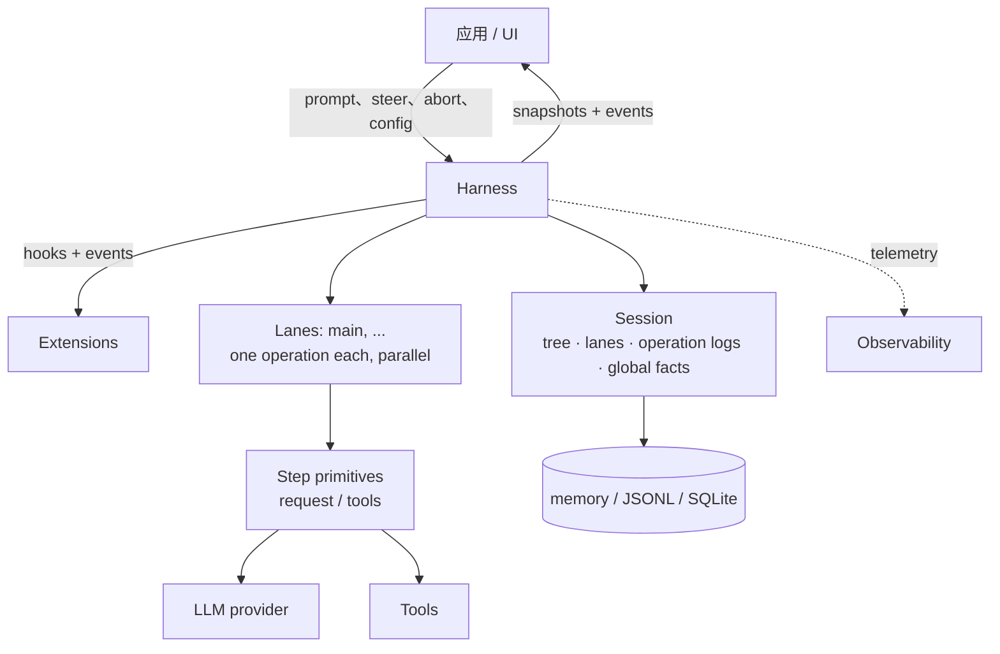
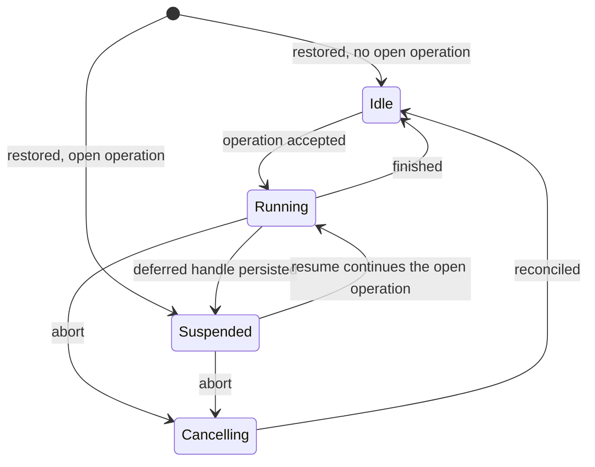
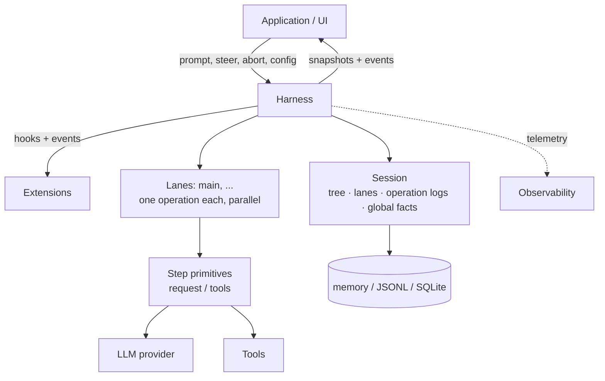

# 可恢复持久化 AgentHarness 设计

> **兼容性政策。** 旧版 coding-agent v3 JSONL 会话必须能够打开并恢复为空闲状态，这是唯一的向后兼容要求。`packages/agent/src/harness`、`packages/session-backends/sqlite-node` 及各自测试中的其他格式和 API 都允许发生破坏式变化。本设计不为其他内容编写迁移、Schema 版本化或转换路径。



Harness 针对一个 session 执行运行操作。Session 包含四类状态（第 2 节），多个 lane 在同一个 Harness 内并行工作（第 3 节），存储后端负责编码整个 session（第三部分）。

# 第一部分——概念

## 1. 目标

- **可恢复运行。** 已接受的 prompt 是一个可恢复操作。进程崩溃后，新进程恢复 session，并从最后一个安全边界继续运行。崩溃可能产生的每一种状态都必须能够恢复。
- **工作通道。** 一个 session 可以包含一个或多个 lane。lane 是对话树中的命名位置；每个 lane 同时最多运行一个 operation，多个 lane 可以并行。运行及其排队消息属于接受它们的 lane。例如，Slack channel 是一个 session，每个 thread 是一个 lane。交互式 pi 使用一个 lane，但 UI 不展示这一概念。扩展可以使用完整的 Harness API，包括 lane；例如，subagent 工具可以在父 session 的第二个 lane 上运行。
- **不产生半成品结果。** 任意 operation（run、compaction 或 navigation）中途崩溃后，只能留下两种状态：操作尚未发生，或恢复可以完成它。不能让中间状态对外可见。
- **Harness API。** Event 只能观察执行，不能改变执行。Hook 可以拦截执行并修改 context、request、tool 和 run boundary。Extension 建立在 event 和 hook 之上。
- **确定性步进。** 每个 effect——可恢复写入、provider 请求、工具执行、hook 和 timer——都必须跨过一个注入的边界。`drive: "manual"` 会在每个 effect 前停驻，测试可以逐次驱动：停在任意边界、注入输入，或关闭再打开以模拟崩溃。生产环境和测试使用相同的 procedure，驱动模式只控制边界（第 15 节）。
- **可观测性。** 所有执行都应可用于日志和 trace，细至 provider 请求和响应的内部过程。这条通道独立于 hook 系统。
- **UI 模型。** 客户端先取得一个原子 snapshot，再接收实时 event stream。事件不会重放；重连意味着重新取得 snapshot。
- **单写入者。** 同一时间只有一个 Harness 写入一个 session，由服务层强制执行。一个 session 的所有 lane 都属于该 Harness；恢复会把单写入者不可能产生的状态视为数据损坏。
- **载入 v3 session。** 旧版 coding-agent v3 JSONL 文件可以原样打开并恢复为空闲状态。

## 非目标

- **Hook 副作用恰好执行一次。** Hook 的结果在消费它的 record 或 entry 提交时才具备可恢复持久性。提交前崩溃可能导致 hook 再次执行（第 11 节的重放表）。Hook 自行产生的副作用（HTTP 调用、文件写入）对 Harness 不可见。需要抗崩溃的外部副作用时，hook 必须保证幂等，例如使用 operation id 作为幂等键。
- **恢复 provider 流。** 部分流永不持久化。中断的流式请求会重试或放弃。延迟请求不同，属于本设计范围：provider 立即返回 handle，稍后提供结果（例如 Responses API 的 `background: true` 或批处理 API）。pi-ai 返回携带 `deferred` stop reason 和 handle 的 assistant message；它像普通 assistant message 一样持久化。兑换 handle 会追加普通 assistant message。恢复时看到尚未兑换的 handle 会执行 fetch，而不是为同一工作付费发起新请求。
- **多个写入者。** 同一 session 上的两个进程不在范围内。服务层把一个 session 的全部流量路由到持有其 Harness 的进程。Lane 覆盖看似多写入者的场景：在共享历史上运行并行 thread。
- **复制。** Session 位于单一位置。对分叉副本做无协调同步是另一种设计，本设计不妨碍未来支持它。
- **迁移 coding-agent。** 把 coding-agent 迁移到 `AgentHarness` 不在范围内。兼容性仅表示新的 JSONL repository 可以读取受支持的 coding-agent v3 文件。

## 2. Session 的构成

Session 是可恢复状态，由四个部分组成：

1. **对话树。** 通过 `parentId` 连接的 entry，包含 message、模型/思考级别/工具启用变更、compaction summary、branch summary 和 custom entry。树是共享且被动的，不属于任何 lane；它只增长，entry 不会被修改或删除。
2. **Lanes。** 工作发生的位置。Lane 由名称和 leaf 组成，leaf 是未来工作要扩展的 entry。每个 session 都有 `main` lane；应用可以用外部身份（例如 Slack thread id 或 email thread id）创建更多 lane。
3. **Lane operation log。** 记录已经发生的事情和仍须发生的事情。每个 lane 有一条扁平的时间序列，记录 operation started、step attempted、tool started、message queued 和 operation finished。可恢复性由这些 record 实现：新进程可以在崩溃后继续 lane 的工作。正常执行时不会读取这些日志。
4. **全局事实。** 作用域为 session、遵循最新写入生效的值，例如 session name 和 entry label。它们不属于树，但以只追加历史保存，读取者看到最新值。

四个部分的写入共用一个单调递增的 sequence number。Sequence 会排列全局事实历史，并让 lane 的 operation log 能够引用树中的位置。

```text
tree (shared, append-only)          lanes
a ── b ── c ── d                    main            → d   (op log: …)
      └── e ── f                    slack:171943…   → f   (op log: …)

global facts: name = "Refactor auth", label(b) = "checkpoint-1"
```

### 主动状态与被动状态

树和全局事实是被动状态：它们是共享数据，可以被任意组件读取。

Lane 是主动状态。它拥有自己的 leaf、operation log（最多一个未关闭 operation）、队列和待处理写入。两个 lane 不会共享这些内容。Lane 的每个动作都会沿其 leaf 追加 entry，或向自己的 operation log 追加 record。

### 不变量

- 树只保存对话。Lane 状态、编排状态和指针不能放在树中。
- Entry 的父链永不改变。分支共享前缀，不复制内容。
- Lane 的 leaf 只以两种方式移动：lane 追加 entry（leaf 变为该 entry），或 lane 导航到已有 entry。
- Operation-log record 永不影响树。删除所有 operation log 后，仍应得到完整、有效的对话。
- 每个 lane 至多有一个未关闭 operation。一个 lane 出现两个未关闭 operation 就是数据损坏。
- Entry 可以共享，record 不能共享。两个 lane 可以在各自路径上拥有同一个 entry，但一条 record 只属于一个 lane。

Record 不是树 entry，因为它描述执行而不是对话：它不能进入模型上下文、transcript、branch query 或 fork；在同一个 lane 内，record 的顺序本身已经表达了含义，parent link 不会增加信息。

## 3. Lanes

Lane 是树中的命名位置，以及在该位置上串行化的工作。最接近的已有概念是检出到独立 worktree 中的 git branch：名称附着在一个位置，随着新工作前进，可以在不重写历史的情况下移动到任意 entry，而且不能被同时检出两次。与 git 的直觉不同，navigation 不限于向前移动。

每个 session 都有 `main` lane。应用可以用名称和锚点 entry 创建其他 lane。Lane 名称是永久的应用键，例如 Slack thread id 或 email thread id。抽象的 UI 不列出 lane；平台自己的 UI（如 thread 列表）承担这个角色。

Lane 拥有：

- **Leaf。** 新 entry 沿它连接并推动它；navigation 会跳转它。
- **Operation log。** 至多一个未关闭 operation。在忙碌 lane 上启动第二个 operation 会被拒绝，不影响其他 lane。
- **Queues。** Steering、follow-up 和 next-run message 都指向一个 lane。
- **Configuration view。** 模型、思考级别和启用工具是 lane leaf 后方路径上的 entry。两个 lane 可以运行不同模型而互不知晓。工具实现、资源和流选项属于 Harness 全局配置，只有启用哪些工具按 lane 区分。

规则如下：

- Lane 可以并行运行 operation。Harness 仍是单写入者，lane record 和 entry 会在共享 sequence 中交错。
- 创建 lane 不复制任何内容。Lane 不删除，也不重命名。
- 依赖 lane 状态的变更在线程变更线上线性化：校验、至多一次持久化写入和内存更新必须在下一次变更开始前完成（第 15 节）。Provider、tool、hook 和 retry 工作不会占用变更线。
- 两个 lane 位于同一个 leaf 时，它们会在下一次追加时分叉。树负责此事，lane 之间不做协调。
- 带有未完成 operation 的 lane 会恢复为 suspended，与兄弟 lane 独立。Suspension 的原因可能是崩溃，也可能是延迟 provider 请求（第 1 节）。

## 4. 工作如何执行

### 操作

Operation 是 lane 上可恢复工作的单位，共有三种：

- **Run。** 一个已接受的 prompt，经过所有自动续接：工具调用、steering、follow-up 和 auto-compaction，直到没有待处理工作。
- **Compaction。** 用 summary entry 替换旧上下文。
- **Navigation。** 把 lane 的 leaf 移到已有 entry，可选生成 branch summary。

Operation 在执行前先被接受。接受本身是持久化的：崩溃后，已接受的 operation 要么由恢复完成，要么被明确关闭。每个已接受的 run 最终都会得到 `completed`、`failed` 或 `aborted`（由 abort 停止）。Compaction 和 navigation 还可能在 effect 发生前被决策 hook 否决，得到 `declined`。

### Run、turn 与 step

Run 是一连串 turn。Turn 是一次 assistant step 加上该 assistant message 请求的完整 tool batch。

Step 是 operation 内可重试的工作单位：生成 assistant message、compaction summary 或 branch summary。一个 step 可以发出零个、一个或多个 provider 请求。失败的 attempt 会重试同一个 step；attempt count 可恢复持久化并跨重启保留。延迟 provider 请求会结束 assistant step：handle 位于已持久化的 assistant message 中，关闭该 step，使 operation 进入 suspended，之后兑换 handle 才会追加真正结果（第 1 节）。

每个启动 effect 的工具调用也算一个 step。`tool_started` 打开它，工具结果 entry 关闭它。并行 batch 可以同时持有多个未关闭的 tool step；它们并行运行 effect，但按源顺序完成最终化（第 14 节）。

### 队列与延迟写入

两种机制把输入带入运行中的 lane，它们的 abort 行为不同：

- **队列。** 携带对话意图：`steer` 修正当前工作，`followUp` 在模型本来要停止时追加工作，`nextRun` 为 lane 的下一次 run 提供初始输入。Abort 会丢弃 steering 和 follow-up，并把它们的 payload 返回调用方；next-run message 会保留。
- **延迟写入。** 携带事实：在 step 执行期间请求追加的 entry 和配置变更。它们在 abort 后仍保留，即使处于 cancellation 期间也会应用。

两者在接受时都具备持久性：接受调用把完整 payload 写入 lane 的 operation log 后才返回。树 entry 在稍后应用或消费项目时写入，也就是模型第一次看到它的位置。如果进程在接受与树写入之间死亡，恢复会读取 record 并执行追加。已接受的输入不会丢失。

### 检查点

在两个 turn 之间，lane 经过一个检查点：

1. 应用待处理的延迟写入。
2. 消费排队的 steering message。
3. 如果下一次请求放不下，则执行压缩。

压缩也有响应式触发条件：provider 响应揭示请求无法装入上下文——例如溢出形式的错误，或低于预期输出上限的 `length` stop。该响应会被丢弃，run 执行一次压缩后重试（第 6 节“assistant step 的上下文溢出”）。

包含工具调用的 turn 会强制进入下一 turn，让模型看到工具结果。例外是：如果一个 batch 中每个最终化的工具结果都持久化了 `terminate: true`，就会抑制自动工具续接（steering 或 follow-up 输入仍可启动下一 turn）。只有工具续接和 steering 都耗尽后才消费 follow-up。检查点发现没有待处理工作时，run 结束。

### 只追加上下文

> 一个 lane 的各次请求中，provider context 只能在尾部增长。在此前请求的尾部之前插入内容，会使 provider 从插入点起的 KV cache 失效，并增加 token 成本。

这条不变量解释了为什么 turn 中途的写入必须延迟到检查点：检查点应用会在尾部追加内容。Compaction 是唯一有意进行的例外，它用一次完整缓存失效换取更小的上下文。

### Lane 生命周期



- 状态按 lane 隔离。唯一例外是存储写入失败会使整个 Harness 进入故障状态。故障 Harness 会停止所有 effect 并拒绝所有调用；修复原因后重新打开，恢复会从各 lane 的 record 继续。
- **Suspended** 表示 operation 仍未关闭，但没有任何执行中的 effect。它可以由崩溃后的恢复产生，也可以由持久化 deferred handle 主动产生。`resume()` 继续 operation；`abort()` 在不再执行的情况下关闭它。
- **Abort** 会持久化取消，向运行中的 effect 发送信号并返回。随后进入协调流程：未解决的工具调用获得合成结果，对话记录追加收尾 assistant message。自动驱动会在后台执行协调；手动驱动会停在下一个 action。

### 恢复

恢复会继续未关闭的 operation，绝不会启动新的 operation。入口取决于 record 的末端：重试未完成 step、兑换 deferred handle、协调未完成的工具 batch，或继续下一个检查点。崩溃前接受的排队消息和延迟写入仍然待处理，并按正常流程应用。

# 第二部分——如何记录执行

第二部分与后端无关。它定义 lane 写入哪些 record、何时写入，以及恢复如何读取它们。第三部分把这些规则映射到 API 和存储。

## 5. Records

### 可恢复性的规则

> 在 effect 之前：写入一条意图 record，命名将发生的事情及其会产生的 id。在 effect 之后：使用完全相同的 id，把结果追加为 entry。

系统不需要多 record 原子性，也没有这种原子性。每条 record 和每个 entry 都可以单独持久化。意图与结果之间发生崩溃时，意图处于未兑现状态；恢复按意图类型决定完成它、重试它，或用合成结果关闭它。当且仅当具有其预留 id 的 entry 存在时，意图才算兑现。Entry 本身还可以命名下一项可恢复状态：带 `stopReason: "deferred"` 的 assistant entry 兑现该 attempt 的预留追加并关闭 step；尚未完成的是 operation，持久化的 handle 仍等待兑换（第 6 节）。预留 id 已存在但内容不同则是数据损坏。

### 预留 id

意图 record 携带尚不存在的 entry id：

```ts
/** An entry payload with its id pre-allocated. parentId, seq, and timestamp
    are assigned by storage when the entry is appended: it chains to the
    lane's then-current leaf. */
type ProvisionedEntry<T extends Entry = Entry> =
  T extends Entry ? Omit<T, "parentId" | "seq" | "timestamp"> : never;
```

### Record 目录

每条 record 都属于一个 lane 的 operation log。属于 operation 的 record 携带 `runId`，它是该 operation 的 `operation_started` record 的 id。下一次 run 的队列 record（`queue_enqueued` 及其 `queue_cancelled`）和独立的 `adjustment` usage record 不携带 `runId`。

```ts
interface RecordBase {
  id: string;
  seq: number;            // shared sequence, section 2
  lane: string;
  timestamp: number;      // Unix ms
}

// Acceptance boundary of an operation. Everything decided before acceptance
// is persisted here. This record's own id IS the runId that all other
// records of the operation carry.
interface OperationStartedRecord extends RecordBase {
  type: "operation_started";
  sourceLeafId: string | null;        // the lane's leaf at acceptance
  intent:
    | {
        kind: "run";
        /** Normalized caller input after skill/template expansion, before
            before_run. Kept for SuspendedOperation and before_resume. */
        originalPrompt: AgentMessage[];
        /** Captured nextRun items, then the prompt, then before_run
            injections. Full payloads, provisioned ids. Capture happens in
            the acceptance mutation (section 15): items present when it runs
            belong to this run; later items belong to the next. */
        initialMessages: ProvisionedEntry[];
        /** Present only when a hook overrode the system prompt; fixed for the
            whole run. Absent: the systemPrompt callback runs per request. */
        systemPromptOverride?: string;
        /** Opaque state keyed by stable hook registration id. Each
            before_resume handler receives only the value under its id. */
        resumeData?: Record<string, JsonValue>;
      }
    | {
        kind: "compaction";
        customInstructions?: string;
        resultEntryId: string;          // provisioned compaction entry
      }
    | {
        kind: "navigation";
        targetId: string | null;        // destination entry; null = root
        summarize: boolean;
        customInstructions?: string;
        label?: string;                 // global fact, written at completion
        summaryEntryId?: string;        // provisioned branch-summary entry
      };
}

// Written when abort() resolves. A request marker, not a terminal state:
// reconciliation follows, then operation_finished with outcome "aborted".
// Kills this operation's steer/follow-up queue items; next-run items survive.
interface AbortRequestedRecord extends RecordBase {
  type: "abort_requested";
  runId: string;
}

// Closes the operation. failed = orderly durable failure (for example,
// retries exhausted). aborted = closed by abort. declined = vetoed by a
// hook before any effect.
interface OperationFinishedRecord extends RecordBase {
  type: "operation_finished";
  runId: string;
  outcome: "completed" | "aborted" | "failed" | "declined";
  error?: { code: string; message: string };
}

// Written before each attempt at a retryable step. Marks: we are about to
// do this, for the n-th time. Steps are logged because they are
// retryable: the durable count caps retries across restarts — a
// crash-restart loop cannot reset it. One record per attempt; one attempt
// may make zero or several provider requests (split-turn compaction
// makes two). Deferred results need no extra
// record: the handle lives in the persisted assistant entry (section 1).
interface StepAttemptRecord extends RecordBase {
  type: "step_attempt";
  runId: string;
  step: "assistant" | "compaction" | "branch_summary";
  attempt: number;                     // 1-based within this step
  /** The entry this attempt produces if it succeeds. Assistant attempts
      provision a fresh id each; all attempts of one structural step reuse
      one id (manual: the intent's; auto: the first attempt's). The give-up
      error entry fulfills the last attempt's id. */
  resultEntryId: string;
  /** Required exactly for compaction steps. Persists why the summary is
      being generated so resume re-enters the same structural work without
      re-deriving context pressure. */
  compactionReason?: "manual" | "threshold" | "overflow";
}
// The model of a resumed request is not read from records: the lane's
// effective model is derived from its path, and a deferred handle's model
// is in the persisted assistant entry.

// Written after before_tool and validation pass, before the tool executes.
// assistantEntryId + toolIndex is the durable invocation identity.
interface ToolStartedRecord extends RecordBase {
  type: "tool_started";
  runId: string;
  assistantEntryId: string;
  toolIndex: number;
  toolCallId: string;
  toolName: string;
  effectiveArgs: Record<string, unknown>;   // after before_tool
  resultEntryId: string;                    // provisioned
  /** The tool's declared replay safety, snapshotted at execution time.
      Recovery re-executes an unfinished call only when this field AND the
      current tool declaration both say "safe"; otherwise it writes a
      synthetic "interrupted" result. */
  replay: "never" | "safe";
}

// Queue acceptance. The payload travels here; the entry appears at the
// consumption point.
interface QueueEnqueuedRecord extends RecordBase {
  type: "queue_enqueued";
  queue: "steer" | "followUp" | "nextRun";
  runId?: string;                      // absent for nextRun
  target: ProvisionedEntry;
}

// Durable retraction of a pending queue item, before consumption. Without
// this record a crash would resurrect the item: recovery treats a
// queue_enqueued without its entry as pending.
interface QueueCancelledRecord extends RecordBase {
  type: "queue_cancelled";
  runId?: string;                      // matches the queue_enqueued it kills
  entryId: string;                     // the enqueued target's provisioned id
}

// Deferred-write acceptance: an entry or configuration change requested
// while a step was in flight. Applied at the next checkpoint.
interface WriteDeferredRecord extends RecordBase {
  type: "write_deferred";
  runId: string;
  target: ProvisionedEntry;
}

// The cost ledger. Written whenever usage is reported or adjusted,
// whatever happens to the response. Pure accounting: the reduction,
// recovery, and validity checks never read it, so it adds no recovery
// states and no crash-matrix rows. It records reported usage; a transport
// death mid-stream can bill tokens no one reported, and a crash between
// settle and this write loses that one item — the irreducible window.
type UsageRecord = RecordBase & { type: "usage"; usage: Usage } & (
  // A provider request settled, whatever the outcome. Written before any
  // classification, retry decision, or discard. Split-turn compaction
  // writes two records sharing one attempt. A pending deferred fetch that
  // reports no usage writes no record.
  | { cause: "assistant" | "compaction" | "branch_summary" | "deferred_fetch";
      runId: string; entryId: string; attempt: number; stopReason: TerminalStopReason }
  // A finalized tool result reported nested LLM work; skipped when it
  // reports none. A safe replay writes a second record for the second
  // execution: both were billed.
  | { cause: "tool"; runId: string; entryId: string; toolCallId: string }
  // A hook-supplied summary carried usage the hook measured itself.
  | { cause: "hook"; runId: string; entryId: string }
  // Application-supplied, anytime (lane.recordUsage): reconciliation,
  // estimates, corrections. Negative values are legal.
  | { cause: "adjustment"; runId?: string; entryId?: string; details?: JsonValue }
);

type LaneRecord = OperationStartedRecord | AbortRequestedRecord | OperationFinishedRecord
  | StepAttemptRecord | ToolStartedRecord | QueueEnqueuedRecord | QueueCancelledRecord
  | WriteDeferredRecord | UsageRecord;

type NewRecord<T extends LaneRecord = LaneRecord> =
  T extends LaneRecord ? Omit<T, "seq" | "timestamp"> : never;
```

被阻止或无效的工具调用不会写入 `tool_started`。因为没有 effect 启动，所以不需要意图：阻止决定会以 `isError: true` 的工具结果 entry 持久化，内容是阻止原因。如果在该 entry 写入前崩溃，丢失的只有决定，恢复会重新生成它——对于没有 `tool_started` 和结果的调用，`before_tool` 会再次运行。

工具 step 不需要单独的 outcome record。它的结果 entry 就是完整的可恢复结果，包括 batch 控制决定：工具结果 entry 会持久化 `terminate`（第 12 节）。如果执行后、结果 entry 写入前崩溃，就按第 6 节的重放策略处理；最终化会再次运行 `after_tool`，第 1 节的非目标明确允许这种情况。

成本是唯一需要 outcome record 的问题：**成本的可恢复性不能依赖结果的可恢复性。** 可重试 step 正是那些可能产生永远不会成为 entry 的响应的步骤——失败 attempt、耗尽的尝试序列和被丢弃的溢出响应；它们产生的费用不能随这些响应消失。因此，每个 provider 请求都必须在分类、重试决策或丢弃前先结算并写入 `usage` record；工具和 hook 报告的用量也要在其 entry 旁写 record；应用可以为 Harness 无法看到的内容追加 `adjustment` record。

Harness 写入的 `usage` record 总是把 `entryId` 绑定到该用量所属 entry 的预留 id；该 entry 是否实际存在是另一个问题——失败 attempt 或被丢弃响应的 id 永远不会物化，这正是设计目的。三个层次彼此分离：entry 的 `usage` 字段是产生该 entry 的响应的**不可变快照**，追加时写入一次且永不修改；**entry 的有效成本**是读取时查询所有 lane 中绑定该 id 的 `usage` record 之和（基础用量加调整）；**session 成本**是所有 `usage` record 的总和。恢复可以诚实地记账两次：重试的 step 或重放的工具每次执行写一条 record；entry 快照等于其 id 对应的最新非 adjustment record（对 compaction 和 branch summary 则是成功 attempt 的记录）。

### 有效性

当 lane 日志出现以下情况时，恢复会将其视为损坏：

- 存在多个未关闭 operation；
- record 引用不存在的 operation，或出现在 operation 结束之后；
- 同一个 step 的 attempt number 不连续；
- compaction attempt 缺少 `compactionReason`，或其他 step 类型错误地带有该字段；
- 某个 run 的 `steer` 或 follow-up `queue_enqueued` 出现在它的 `abort_requested` 之后；
- `queue_cancelled` 指向没有 `queue_enqueued` 的 id，或指向已经存在 entry 的 id；
- 同一个结构 step 的 attempt 使用不同的 `resultEntryId`，或同一 step 的 attempt 使用不同的 `compactionReason`；
- `tool_started.toolIndex` 无法在原始 assistant entry 中对应保存的 `toolCallId` 和 `toolName`；
- 两条 `tool_started` record 共享一个调用身份；
- 某个预留 id 已存在但内容不同。

## 6. 各动作写入什么

这是存储层面的轨迹。所有轨迹都展示一个 lane。符号如下：

```text
E   entry appended to the tree (chained to the lane's leaf)
R   record appended to the lane's operation log
L   lane pointer move
G   global fact written
H   hook (awaited; hooks are Part I concepts, their API is Part III)
X   crash site
```

### 工具调用的 Run

```text
    prompt("fix the bug")
H   before_run                        可以注入条目、覆盖系统提示词
R   operation_started                 类型为 run；初始消息带预留 id
E   user message                      使用意图中的预留 id
R   step_attempt                      assistant 步骤，第 1 次尝试
E   assistant message [tool call]
H   before_tool                       可以修改参数或阻止调用
R   tool_started                      有效参数、预留结果 id、重放策略
H   after_tool                        可以修改结果并终止运行
E   tool result                       使用预留结果 id；保存 terminate 决定
R   step_attempt                      下一回合的 assistant 步骤，第 1 次尝试
E   assistant message "done"
H   before_run_end                    没有待处理工作，返回空值
R   operation_finished                completed
```

任意两行之间发生崩溃都可以恢复。一般规则是：没有结果条目的意图由恢复流程完成、重试或以合成结果关闭；没有被已消费意图对应的结果条目不可能存在。

### 重试

```text
R   step_attempt                      第 1 次尝试
    request fails
R   usage                             失败尝试的成本——绝不会丢失
R   step_attempt                      第 2 次尝试——计数持久化
R   usage
E   assistant message
```

每个提供方请求结算时都会写入 `usage` 记录（第 5 节）；为简洁起见，其他轨迹省略这些记录。每个请求都会运行请求级钩子（`transform_context`、`before_request`、`after_response`），其他地方省略；第 19 节的 B 层会记录它们。

退避期间崩溃：恢复会数出两次尝试，继续时从第 3 次开始。计数永远不会重置。未超过上限的可重试错误绝不追加为条目。尝试次数耗尽，或出现不可重试的终止错误时，会追加一条带错误的 assistant 消息，然后写入失败的 `operation_finished`：

```text
E   assistant message                 stop reason error；失败已持久化
X   crash                             operation 仍处于未关闭状态
R   operation_finished                恢复写入 failed；绝不会写 completed
```

错误条目就是终止失败标记。恢复发现该标记后会排空已接受的写入和排队输入；除非已消费的 steering 或 follow-up 输入启动了新工作，否则会以 failed 关闭 run（第 7 节）。如果某个 run 最新的自身消息是步骤产生的错误，恢复绝不能把它完成为 completed。

### Assistant 步骤的上下文溢出

`length` 含义并不唯一：生成可能在某个输出边界停止，但该边界可能是预期的输出上限（压缩无济于事），也可能是更小的上下文或提供方上限（压缩可以解决）。分类逻辑会把实际输出用量（包括推理 token）与**预期**输出上限比较：

```ts
function isRecoverableLength(message: AssistantMessage, desiredMaxOutput: number): boolean {
  if (message.stopReason !== "length") return false;
  // Reaching the caller's or model's intended cap is a genuine output-limit stop.
  if (desiredMaxOutput > 0 && message.usage.output >= desiredMaxOutput) return false;
  // Stopped below the intended cap: context pressure or provider-side truncation.
  return true;
}
```

`desiredMaxOutput` 是调用方设置的 `maxTokens`（如果设置），否则是 `model.maxTokens`——即任何上下文裁剪发生**之前**的预期上限。实际发送的值不能作为判断依据：有些提供方会直接拒绝显式输出上限（OpenAI Codex 后端对 `max_output_tokens` 返回 HTTP 400），Pi 还会把其他请求裁剪到剩余上下文。以下情况都属于同一条路径：上下文裁剪后的请求只返回 16 个推理 token，而预期上限是 128k（可恢复）；Xiaomi/Qwen 风格的 `length` 且输出为零（可恢复）；显式设置 1,024 上限并完全用尽（真正停止）——不需要依赖上下文百分比启发式。溢出形式的错误——匹配溢出模式的提供方拒绝，或提示超过窗口但请求静默成功——也按相同方式分类并走相同路径。

可恢复的响应会被**丢弃**：和可重试错误一样，它不会成为条目，因此无论在线重试还是崩溃后重试，都不必从上下文中清除内容。它的预留结果 id 仍未兑现；请求结算时写入的 `usage` 记录已经持久化了成本（第 5 节）。

```text
R   step_attempt                      assistant 步骤，第 1 次尝试
    response: recoverable             低于预期上限的 length，或溢出形式的错误
R   usage                             被丢弃响应的成本——绝不会丢失
    nothing else appended             响应本身被丢弃
H   before_compaction                 原因 overflow
R   step_attempt                      compaction 步骤，第 1 次尝试
E   compaction entry
R   step_attempt                      assistant 步骤，第 1 次尝试——新的步骤
E   assistant message
```

**每个对话输入最多恢复一次。** 只有在本次 run 最新消费的对话消息（提示、steering 或 follow-up）之后不存在更新的、原因是 `overflow` 的压缩 `step_attempt` 时，才可以启动溢出压缩。同一窗口内第二次出现可恢复响应时，会追加放弃错误条目，并通过失败排空路径使 run 失败；`length` 响应不会重置这个保护标记，只有消费新的对话输入才会重置。这样，每个用户动作最多触发一次“压缩并重试”，循环有明确上限。对于原因是 `overflow` 的压缩，`before_compaction` 拒绝或准备数据为空同样属于终止情况：没有压缩，请求就无法放入上下文。由钩子提供的溢出压缩会在条目之前写入它的压缩 `step_attempt`，所以保护标记会计入它；这是唯一会写入尝试记录的钩子摘要。

按崩溃位置区分：

| 崩溃发生在 | 持久化状态 | 恢复动作 |
|---|---|---|
| `step_attempt`（assistant） | 未完成的 assistant 步骤 | 恢复时重试；在线运行时再次对可恢复响应分类 |
| `step_attempt`（compaction，overflow） | 未完成的压缩步骤 | 使用记录的原因恢复压缩步骤 |
| 压缩条目 | 该条目已关闭步骤 | 进入检查点路径；随后开始新的 assistant 步骤 |

真正的 `length` 停止（输出达到预期上限）会像以前一样追加并处理：如果带工具调用，则不执行任何工具而使每个调用失败；如果不带工具调用，则继续正常结束。面向用户的任何截断响应都使用中性措辞（“响应在完成前被截断”），而不声称已经达到配置的输出上限。

### 工具运行期间的 Steering

```text
E   assistant message [tool call]
R   tool_started
    steer("focus on the tests")       调用方在此处收到结果
R   queue_enqueued                    steer，完整载荷，预留 id
E   tool result
E   user message                      检查点消费队列项目；使用预留 id
R   step_attempt                      下一次请求看到 steering 消息
```

如果在 `queue_enqueued` 之前崩溃，steer 从未发生，调用方的 Promise 也从未解决。如果在之后崩溃，恢复会发现没有条目的记录，并在检查点原本会追加的位置补上它。

队列项目可以在消费前持久化撤回：

```text
R   queue_enqueued                    steer，完整载荷，预留 id
    cancelQueued(entryId)             调用方在此处收到结果
R   queue_cancelled                    该条目永远不会追加
```

两条记录之间崩溃时，项目仍处于待处理状态；取消 Promise 从未解决。取消和消费都是 lane 变更串行线上的任务，因此 `[cancel, consume]` 和 `[consume, cancel]` 是仅有的两种历史（第 15 节）。

### 结束边界上的输入

同一 lane 的决定只有一个顺序来源：lane 变更串行线（第 15 节）。最终的待处理工作检查和终止追加属于同一个 `tryFinishRun` 变更，因此并发 steer 恰好有两种历史：

```text
steer first                         finish first
R   queue_enqueued                  R   operation_finished
    tryFinishRun → continue             steer() → NoActiveRun
E   user message
... run continues
R   operation_finished
```

延迟写入和中止使用相同的排序规则。结束前接受的延迟写入必须在 run 关闭前应用；结束后接受的写入看到空闲 lane，直接追加。`abort_requested` 在结束前提交会选择中止协调；结束后中止返回 `NoActiveOperation`。不存在第三种历史，这就是完整机制。

### 回合中途的延迟写入

```text
R   step_attempt                      请求进行中，上下文以用户消息 U 结束
    session.appendMessage(M)          调用方在此处收到结果
R   write_deferred                    完整载荷，预留 id
E   assistant message A               提供方缓存 [.., U, A]
E   message M                         检查点应用写入；追加到尾部
```

直接追加 M 会产生 `[.., U, M, A]`：这是有效的提供方序列，但会使从 M 开始的 KV 缓存失效，同时让对话记录声称 A 看到了 M，实际却没有看到。检查点同时避免这两种问题（第 4 节的只追加上下文）。

### 工具运行期间中止

```text
E   assistant message [tool call]
R   tool_started
    abort()                           调用方在此处收到结果
R   abort_requested                   steer/follow-up 队列终止；载荷返回调用方
E   tool result                       合成 "interrupted"，或工具已完成时使用真实结果
E   assistant message                 收尾消息，停止原因为 aborted
R   operation_finished                aborted
```

在 `abort_requested` 之后崩溃时，恢复会完成同一套协调流程。待处理的延迟写入即使在此处也会应用；排队的 steer/follow-up 项目不会应用。

### 工具执行的崩溃位置

```text
E   assistant message, calls c1, c2
X1  before before_tool                c1 没有任何持久化状态
H   before_tool(c1)
X2  decision made, nothing written    与 X1 相同
R   tool_started(c1)
X3  tool executing
H   after_tool(c1)
X4  hook interrupted                  与 X3 相同的持久化状态
E   tool result c1
X5  result durable                    c1 已完成
```

| 崩溃位置 | 持久化状态 | 恢复动作 |
|---|---|---|
| X1、X2 | 没有记录，也没有结果 | 完整的正常路径；`before_tool` 会再次运行 |
| X3、X4 | 有 `tool_started`，没有结果 | 仅当记录和当前声明都允许 safe replay 时重放：重新执行持久化参数，并对新结果运行 `after_tool`。否则写入合成的 `interrupted` 结果，不运行钩子 |
| X5 | 结果条目存在 | 跳过 c1；c2 从 X1 开始 |

协调流程会按源顺序在各自位置处理批次中的每个调用。随后步骤正常结束。

### 检查点处的自动压缩

```text
E   tool result                       步骤结束
    checkpoint: next request would not fit
H   before_compaction                 可以拒绝或提供摘要
R   step_attempt                      compaction 步骤——钩子提供摘要时跳过
E   compaction entry
R   step_attempt                      assistant 步骤；run 在压缩后的上下文中继续
```

自动压缩不会写入 `operation_started`，因为它属于当前 run。手动 `compact()` 是独立操作：`operation_started`（类型为 compaction，带预留结果 id）→ 钩子 → 尝试 → 压缩条目 → `operation_finished`。

### 导航

```text
    navigateTree(target, { summarize: true, label: "before-refactor" })
R   operation_started                 类型为 navigation；目标、预留摘要 id、标签
H   before_navigation                 可以拒绝或提供摘要
R   step_attempt                      branch_summary 步骤——钩子提供摘要时跳过
    summary text generated            仅存在于内存
L   lane move → target                一次存储写入；提交点
E   branch summary entry              沿 lane 的叶子追加链——现在叶子是 target，
                                      所以摘要落在 target 分支上
G   label                             来自意图；最新写入生效，且幂等
R   operation_finished                completed
```

移动先提交；之后每一笔写入都从已持久化状态继续。设计中任何地方都不存在多对象原子写入。接受阶段拒绝 `target === sourceLeafId`，所以“是否已经移动”总能判定：当且仅当 lane 叶子等于 `intent.targetId` 时，移动已经提交。按崩溃位置区分：

| 崩溃发生在 | 恢复看到的状态 | 恢复动作 |
|---|---|---|
| `operation_started` 后 | 叶子在 `sourceLeafId` | 重新运行钩子或摘要步骤，然后移动 |
| 摘要生成后 | 摘要文本没有任何持久化内容 | 按同一尝试上限重新生成 |
| lane 移动后 | 叶子在 `intent.targetId` | 如果缺少 `summaryEntryId`，追加摘要 |
| 摘要条目后 | 条目存在 | 设置标签，结束操作 |
| 标签后 | 事实已设置（幂等） | 结束操作 |

在移动和 `operation_finished` 之间，读者会看到 lane 位于目标位置且有一个未关闭的导航操作——这是可恢复状态，不是无效状态。期间 lane 不会运行其他工作；每个 lane 至多一个操作已经保证了这一点。

### 延迟提供方请求

```text
R   step_attempt                      流选项请求延迟执行
E   assistant message                 stop reason deferred，携带句柄
    lane suspends; prompt() resolves with outcome "suspended"
    ... hours pass, maybe a different process ...
    resume()                          lane 路径上的最新条目是没有后继的
                                      延迟 assistant 消息
                                      → 句柄尚未兑换，兑换它
    fetchDeferred(model, handle)      使用该条目中的模型和句柄
E   assistant message                 真实结果
    run continues normally
```

挂起 lane 在存储中与崩溃 lane 无法区分：都是一个仍未关闭的操作，且最新条目是没有后继的延迟 assistant 消息。恢复会把它列为挂起；`resume()` 检查句柄。兑换不会写入意图记录：它不会启动新的模型工作，已经提交的后继条目会阻止再次获取。

每次 `resume()` 执行一次获取。结果有三种：

- **pending**：提供方再次返回停止原因 `deferred`。除了可能的 `usage` 记录外不写入任何内容（第 15 节）；lane 再次挂起。轮询频率由应用决定。
- **ready**：普通 assistant 消息。它作为后继追加，run 继续执行。
- **terminal**：提供方返回停止原因 `error`（过期、未知或已消费），或者获取本身被拒绝；Harness 会把拒绝转换成相同的错误消息形式。消息会被追加，run 以 failed 结束。兑换失败不会启动自动替代请求；本次 run 已接受的 steering 或 follow-up 输入仍可以在之后启动新的回合。

挂起 lane 上的 `abort()`：写入 `abort_requested` 记录，尽力在提供方处取消句柄，然后执行正常协调并写入 `operation_finished` aborted。延迟条目仍保留在对话记录中。

延迟 assistant 消息携带句柄而不是内容；投影到提供方上下文时不会产生任何内容。

## 7. 恢复

### 恢复载入

打开会话时，每个 lane 独立恢复。恢复只读取，不追加，也不启动副作用。

恢复从索引发现开始，而不是扫描完整日志：

1. `findOpenOperations(lane, { limit: 2 })` 按最新到最旧返回未完成的 `operation_started` 记录。零个表示空闲，一个表示挂起，两个表示数据损坏。后端必须从重放或索引的操作状态回答这个查询；调用者不能只根据最近一次开始记录推断状态。
2. 对空闲 lane，一次索引查询找到最近的运行类 `operation_started`，随后对其之后的 `queue_enqueued` / `queue_cancelled` 做过滤查询，重建待处理的 `nextRun` 项目。没有历史 run 时，同样的类型过滤查询只读取运行前的队列状态；无关的用量调整绝不会被扫描。
3. 对挂起 lane，未关闭操作选择两次有界载荷读取：
   - **lane 的记录**：从该 `operation_started` 之后开始。上一次操作结束后产生的其他内容都是无关历史。
   - **lane 自身的条目**：从当前叶子回溯到操作锚点（`sourceLeafId`）的路径。这些正是该操作追加的条目。

归约还可以对预留条目 id 做定点查询，并在操作锚点处对有效模型、思考级别和启用工具配置做有界分支查询。这些都是索引查询，不是额外的历史扫描。每次扫描都由未关闭操作或仍相关的空闲队列限定，不会按会话总历史或其他 lane 的活动量增长。

空闲 lane 的剩余状态是待处理的下一次运行队列项目。下一次运行消息可以随时入队；只有接受 run 时才会消费它们，压缩和导航会跳过队列。待处理项目是最近一次运行类 `operation_started` 之后的 `queue_enqueued` 记录：其预留条目尚不存在，且没有被 `queue_cancelled` 撤回。run 捕获的项目会列在意图的 `initialMessages` 中，因此即使捕获后尚未追加，也会由该 run 的恢复完成，绝不会提供给下一次 run。

### 归约

根据这两次读取，得到 lane 状态：

- **正在中止**：存在 `abort_requested` 记录。
- **已使用的尝试次数**：最新的 `step_attempt` 如果没有对应条目，就是未完成步骤；它的 `attempt` 字段是持久化计数，步骤类型和 `compactionReason` 决定恢复路径。关闭状态通过定点查询判断，而不是推断相邻记录：只有最新尝试的预留结果存在时，步骤才确实关闭。更早尝试的未兑现 id 属于已完成工作，无需检查。
- **已使用溢出恢复**：原因是 `overflow` 的压缩 `step_attempt` 比本次 run 最新消费的对话消息更新（第 6 节的溢出保护）。
- **工具批次**：最新的带工具调用的 assistant 条目；每个调用都与 `tool_started` 记录和结果条目匹配（第 6 节的崩溃位置表）。保留 assistant 的停止原因：`length` 批次已截断，恢复时绝不执行。结果条目中持久化的 `terminate` 值决定已完成批次是否必须开启下一回合。
- **延迟句柄**：最新的自身条目是没有后继的延迟 assistant 消息。
- **最新自身条目**：第二次读取的最后一个条目；纯判断函数（`needsAssistant()`、终止失败、中止关闭）读取它。
- **待处理队列项目**：预留条目不存在的 `queue_enqueued` 记录，排除已由 `queue_cancelled` 撤回的项目，以及由本次 `abort_requested` 杀掉的 steer/follow-up 项目。
- **待处理写入**：预留条目不存在的 `write_deferred` 记录。
- **缺失的初始消息**：run 意图中的预留 id，其对应条目尚不存在。
- **结构目标**：对于压缩和导航，检查预留结果条目是否存在。

同一套规则也用于实时执行：正常运行时，Harness 在写入时更新内存中的状态；恢复时，从存储重新计算状态。状态的定义就是记录和条目的归约，因此二者不可能不一致。`usage` 记录在此不可见：它们只负责账务，不参与编排。

### 恢复执行

`resume()` 按归约结果继续未关闭操作：

- 缺失的初始消息 → 追加它们（已接受的输入绝不会丢失），即使当前正在中止。
- 正在中止 → 进入协调：合成工具结果、收尾 assistant 消息、`operation_finished` aborted。
- 未解决的工具批次 → 逐个调用处理：跳过、重新执行或合成（第 6 节）。
- 延迟句柄 → 兑换（第 6 节）。
- 终止失败——最新自身消息是步骤产生的 assistant 错误（放弃条目、不可重试的请求错误或兑换失败；绝不会是任意延迟写入消息）→ 应用已接受的写入并消费排队的对话输入；如果没有消费任何内容则写入失败的 `operation_finished`。恢复绝不把这样的 run 标记为完成。
- 未完成步骤 → 在消费新的检查点输入前，继续该确切步骤：如果未达到上限则进行下一次尝试，否则使操作失败。压缩步骤使用记录的 `compactionReason` 恢复。
- 其他情况 → 继续下一个检查点；待处理写入和队列项目在那里正常应用。

恢复追加使用普通追加逻辑，但多一条规则：已有的预留 id 直接跳过。因此恢复期间即使再次崩溃，也只会留下更少的待恢复内容；重复运行恢复始终安全。只有策略允许时，恢复才会重复未知副作用：可重试步骤会启动新的持久化尝试，工具只有在持久化声明和当前声明都为 `safe` 时才重放。中断的钩子处理器遵循第 11 节的重放表。

旧版 v3 会话不包含记录。对每个 lane 的询问都得到“空闲”；第 12 节的归一化会在类事实条目被丢弃后沿最近的保留祖先解析，并把 `main` 恢复到最后一个保留的逻辑条目。

# 第三部分 — API 与实现

## 8. 公共 API

### Lane 接口

`AgentLane` 是单个 lane 的操作接口。`AgentHarness` 为 `main` 实现了它：`harness.prompt(...)` 就是 `main` 的提示入口。每个方法都是异步的，包括本地实现可以直接从内存回答的获取器：该接口必须能够由远程代理实现，因此签名不能承诺只有本地实现才能保证的同步性。同步例外是 `name` 以及监听器注册（`hooks.on`、`events.on`）；服务器会通过自己的传输层转发事件，而不是转发注册操作。

```ts
interface AgentLane {
  readonly name: string;                 // "main" on the harness itself
  getLeafId(): Promise<string | null>;

  // Operations. Never throw; every call resolves with a result (see below).
  // At most one operation per lane; other lanes are unaffected.
  prompt(text: string, images?: ImageContent[]): Promise<RunResult>;
  prompt(message: AgentMessage | AgentMessage[]): Promise<RunResult>;
  skill(name: string, additionalInstructions?: string): Promise<RunResult>;
  promptFromTemplate(name: string, args?: string[]): Promise<RunResult>;
  compact(options?: { customInstructions?: string }): Promise<CompactionResult>;
  navigateTree(targetId: string | null, options?: NavigateOptions): Promise<NavigationResult>;
  resume(): Promise<ResumeResult>;       // continue this lane's open operation
  abort(): Promise<AbortResult>;         // durable on resolve; reconciliation runs in background

  // Queues. Durable on resolve (queue_enqueued record); the returned
  // entryId identifies the item until consumption. steer/followUp require
  // an active run; nextRun and cancelQueued work anytime.
  steer(text: string, images?: ImageContent[]): Promise<QueueResult>;
  steer(message: AgentMessage): Promise<QueueResult>;
  followUp(text: string, images?: ImageContent[]): Promise<QueueResult>;
  followUp(message: AgentMessage): Promise<QueueResult>;
  nextRun(text: string, images?: ImageContent[]): Promise<QueueResult>;
  nextRun(message: AgentMessage): Promise<QueueResult>;
  /** Durably retract a pending queue item (queue_cancelled record). */
  cancelQueued(entryId: string): Promise<CancelQueuedResult>;
  /** Append an adjustment usage record (section 5): reconciliation,
      estimates, corrections. Allowed anytime; records are not context. */
  recordUsage(usage: Usage, options?: { entryId?: string; details?: JsonValue }):
    Promise<RecordUsageResult>;

  waitForIdle(): Promise<void>;
  runWhenIdle(callback: () => void | Promise<void>): Promise<void>;   // runtime-only

  // Manual drive controls. Section 15 defines their exact behavior; they
  // are usable only with AgentHarnessOptions.drive === "manual".
  peekAction(): Promise<ActionInfo | undefined>;
  executeAction(): Promise<ActionInfo | undefined>;
  runToCompletion(): Promise<void>;

  // Persisted configuration — entries on the path behind this lane's leaf,
  // resolved by point queries. Setters resolve on durable acceptance;
  // while a run is open they become deferred writes on this lane.
  getModel(): Promise<Model>;                 setModel(model: Model): Promise<void>;
  getThinkingLevel(): Promise<ThinkingLevel>; setThinkingLevel(level: ThinkingLevel): Promise<void>;
  getActiveTools(): Promise<string[]>;        setActiveTools(names: string[]): Promise<void>;

  /** This lane's view of the tree: reads default to this lane's leaf;
      appends defer while a run is open and otherwise chain to the leaf
      (section 12). */
  session: SessionTree;

  /** Scoped: this lane's transcript, state, queues, and events (section 9). */
  watch(): Promise<{ snapshot: LaneSnapshot; start: (listener) => void; unsubscribe: () => void }>;
}
```

所有 `prompt` 重载都会规范化为 `AgentMessage[]`。文本加图片会变成一条用户消息；消息数组在校验后保留原有顺序。技能和模板会在规范化结果写入之前展开。这个规范化数组就是 `OperationStartedRecord.intent.originalPrompt`；它不包含捕获的 `nextRun` 项目和钩子注入内容。

### Harness

```ts
class AgentHarness implements AgentLane {
  /** Opens the session, restores every lane, starts no effects.
      One suspended entry per lane with an open operation. */
  static create(options: AgentHarnessOptions): Promise<{
    harness: AgentHarness;
    suspended: SuspendedOperation[];
  }>;

  // Lane management. Names are permanent application keys
  // ("slack:1719432.0021"). Handles are stateless facades bound to the
  // name: any number may exist, all equivalent; identity is the name,
  // never the object. Lanes are not deleted or renamed.
  lane(name: string): Promise<AgentLane | undefined>;    // lookup, never creates
  createLane(name: string, at: string | null): Promise<CreateLaneResult>;
  /** Inventory. Always includes "main". */
  lanes(): Promise<LaneInfo[]>;

  // Harness-global configuration: registries and runtime capabilities.
  // Tool implementations are code and cannot persist; the active set
  // (names) persists per lane.
  getTools(): Promise<AgentTool[]>;      setTools(tools: AgentTool[], activeNames?: string[]): Promise<void>;
  getResources(): Promise<Resources>;    setResources(r: Resources): Promise<void>;
  getStreamOptions(): Promise<StreamOptions>;  setStreamOptions(o: StreamOptions): Promise<void>;
  getRetryPolicy(): Promise<RetryPolicy>;      setRetryPolicy(p: RetryPolicy): Promise<void>;
  getCompactionSettings(): Promise<CompactionSettings>; setCompactionSettings(s): Promise<void>;
  getSteeringMode(): Promise<QueueMode>;       setSteeringMode(m: QueueMode): Promise<void>;
  getFollowUpMode(): Promise<QueueMode>;       setFollowUpMode(m: QueueMode): Promise<void>;

  /** Session-wide observer: lane inventory snapshot plus the unfiltered
      event stream. No transcripts; compose with lane.watch(). */
  watchSession(): Promise<{ snapshot: SessionSnapshot; start; unsubscribe }>;

  // Harness-global. Every hook and event payload carries `lane`.
  hooks: Hooks;
  events: Events;

  /** Detach cleanly. Signals in-flight effects, waits for the append in
      progress, releases the writer claim. Open operations stay resumable;
      no shutdown record is needed. */
  close(): Promise<void>;
}

interface LaneInfo {
  name: string;
  leafId: string | null;
  operation: null | { id: string; kind: "run" | "compaction" | "navigation";
                      status: "running" | "suspended" | "aborting" };
}

```

### 选项

```ts
interface AgentHarnessOptions {
  // Identity and providers
  session: Session;
  models: Models;                        // provider collection for all requests

  // Initial lane configuration — used when a lane's path has no persisted
  // config entries; persisted config wins otherwise.
  model: Model;
  thinkingLevel?: ThinkingLevel;
  activeToolNames?: string[];

  // Runtime capabilities — harness-global, reconstructed at create()
  tools?: AgentTool[];
  toolContext?: TContext | (() => TContext | Promise<TContext>);
  systemPrompt?: string | ((ctx) => string | Promise<string>);   // evaluated per request
  resources?: Resources;                 // skills, prompt templates

  // Execution policy
  streamOptions?: StreamOptions;         // transport, headers, timeouts, deferred
  retry?: RetryPolicy;                   // step attempt cap; the durable count
  compaction?: CompactionSettings;
  steeringMode?: QueueMode;
  followUpMode?: QueueMode;
  /** Batch default; a called tool declaring executionMode "sequential"
      forces sequential regardless (section 14). */
  toolExecution?: "sequential" | "parallel";   // default parallel
  /** automatic: operation methods drive their procedures to completion.
      manual: the operation's effects park at the gate; peekAction() /
      executeAction() / runToCompletion() drive them. Deterministic tests
      and debuggers. Section 15. */
  drive?: "automatic" | "manual";       // default automatic

  // Projection
  /** AgentMessage → provider messages, before each request. Default handles
      bash executions, custom messages, summaries; validates at acceptance
      that queued/prompted messages convert to user messages. */
  toProviderMessages?: (messages: AgentMessage[]) => Message[] | Promise<Message[]>;
  /** Custom entry → context messages, at context build. Entries without a
      projector never enter provider context. */
  entryProjectors?: Record<string, EntryProjector>;

  // Telemetry. The default context is a no-op. Section 18.
  telemetryContext?: TelemetryContext;
}
```

### 结果与带标签错误

公共 API 使用 `better-result` v3 模式中一个很小的内置子集。`packages/agent` 不对 `better-result` 产生运行时依赖。

这个子集只包含：

- 可序列化的 `Result.ok()` 和 `Result.err()` 值；
- `Result.isOk()` 和 `Result.isErr()` 守卫；
- 带字面量 `_tag`、只读载荷、普通 `Error` 行为、`.toJSON()` 和类级 `.is()` 的 `TaggedError`；
- 穷尽匹配用的 `matchError()`。

```ts
export type Result<T, E> =
  | { ok: true; value: T }
  | { ok: false; error: E };

export const Result = {
  ok<T>(value: T): Result<T, never> {
    return { ok: true, value };
  },
  err<E>(error: E): Result<never, E> {
    return { ok: false, error };
  },
  isOk<T, E>(result: Result<T, E>): result is { ok: true; value: T } {
    return result.ok;
  },
  isErr<T, E>(result: Result<T, E>): result is { ok: false; error: E } {
    return !result.ok;
  },
};

export interface TaggedErrorValue<Tag extends string> extends Error {
  readonly _tag: Tag;
  toJSON(): { _tag: Tag; message: string } & Record<string, unknown>;
}

export interface TaggedErrorFactory<Tag extends string> {
  new <Props extends { message: string }>(
    props: Props,
  ): TaggedErrorValue<Tag> & Readonly<Props>;
  is(value: unknown): value is TaggedErrorValue<Tag>;
}

export declare function TaggedError<Tag extends string>(tag: Tag): TaggedErrorFactory<Tag>;

export type ErrorMatchers<E extends TaggedErrorValue<string>, R> = {
  [Tag in E["_tag"]]: (error: Extract<E, { _tag: Tag }>) => R;
};

export declare function matchError<E extends TaggedErrorValue<string>, R>(
  error: E,
  matchers: ErrorMatchers<E, R>,
): R;
```

实现应控制在约 80 行以内（不含测试）。它没有映射组合器、生成器组合、Promise 包装器、重试辅助函数、集合辅助函数或 `Panic` 类。Promise 仍是异步边界。对于缺陷，`HarnessFault` 使用原生抛出和 Promise 拒绝。

每种预期拒绝对应一个类，其标签是字符串字面量，字段携带调用方所需的数据。使用下面展示的 v3 类形式；不要在属性类型后添加尾随 `()`：

```ts
class LaneBusy extends TaggedError("LaneBusy")<{
  lane: string;
  operationId: string;
  operationKind: "run" | "compaction" | "navigation";
  message: string;
}> {}

class MissingIdentities extends TaggedError("MissingIdentities")<{
  lane: string;
  tools: string[];
  models: string[];
  message: string;
}> {}
```

其余类使用相同的基类：

| 类 | 除 `message` 外的载荷 |
|---|---|
| `NoActiveRun` | `lane` |
| `NoActiveOperation` | `lane` |
| `NothingToResume` | `lane` |
| `InvalidMessage` | `lane`、`reason` |
| `UnknownSkill` | `name` |
| `UnknownTemplate` | `name` |
| `UnknownTarget` | `targetId` |
| `UnknownQueueItem` | `lane`、`entryId` |
| `LaneExists` | `lane` |
| `InvalidLane` | `lane`、`reason` |
| `NothingToCompact` | `lane` |
| `Closed` | 无 |

传输层把错误序列化为 `{ _tag, message, ...payload }`，并在代理边界重建该类。新增拒绝类会改变相应的错误联合；穷尽式 `matchError` 调用会一直无法通过类型检查，直到调用方处理新标签。

`Err` 表示调用没有创建或接受所请求的工作。只要 Harness 仍处于打开且可写状态，每个已接受的操作都会以 `Ok` 结算，包括 `aborted`、`failed` 和 `suspended`：

```ts
interface OperationError {
  code: string;
  message: string;
}

type RunOutcome =
  | { kind: "completed"; leafId: string; finalEntryId: string; finalMessage: AssistantMessage }
  | { kind: "aborted";   leafId: string; finalEntryId: string; finalMessage: AssistantMessage }
  | { kind: "failed";    leafId: string; error: OperationError;
                          finalEntryId?: string; finalMessage?: AssistantMessage }
  | { kind: "suspended"; leafId: string; finalEntryId: string; deferred: DeferredHandle };

type CompactionOutcome =
  | { kind: "completed"; leafId: string; entry: CompactionEntry }
  | { kind: "declined";  leafId: string }
  | { kind: "aborted";   leafId: string }
  | { kind: "failed";    leafId: string; error: OperationError };

type NavigationOutcome =
  | { kind: "completed"; newLeafId: string | null; summaryEntry?: BranchSummaryEntry }
  | { kind: "declined";  leafId: string | null }
  | { kind: "aborted";   leafId: string | null }
  | { kind: "failed";    leafId: string | null; error: OperationError };

type RunRejected = LaneBusy | InvalidMessage | UnknownSkill | UnknownTemplate | Closed;
type CompactionRejected = LaneBusy | NothingToCompact | Closed;
type NavigationRejected = LaneBusy | UnknownTarget | Closed;
type ResumeRejected = LaneBusy | NothingToResume | MissingIdentities | Closed;
type QueueRejected = NoActiveRun | InvalidMessage | Closed;
type CancelQueuedRejected = UnknownQueueItem | Closed;
type AbortRejected = NoActiveOperation | Closed;

type RunResult = Result<{ runId: string } & RunOutcome, RunRejected>;
type CompactionResult = Result<{ runId: string } & CompactionOutcome, CompactionRejected>;
type NavigationResult = Result<{ runId: string } & NavigationOutcome, NavigationRejected>;
type QueueResult = Result<{ entryId: string }, QueueRejected>;
type CancelQueuedResult = Result<{
  outcome: "cancelled" | "already_consumed" | "already_cleared";
}, CancelQueuedRejected>;
type RecordUsageResult = Result<void, Closed>;
type AbortResult = Result<{
  runId: string;
  steer: AgentMessage[];
  followUp: AgentMessage[];
}, AbortRejected>;

type ResumeOutcome =
  | ({ operation: "run"; runId: string } & RunOutcome)
  | ({ operation: "compaction"; runId: string } & CompactionOutcome)
  | ({ operation: "navigation"; runId: string } & NavigationOutcome);

type ResumeResult = Result<ResumeOutcome, ResumeRejected>;

type CreateLaneResult = Result<AgentLane, LaneExists | InvalidLane | UnknownTarget | Closed>;
```

`cancelQueued` 的结果对应变更串行线上的历史：`cancelled` 表示条目永远不会追加；`already_consumed` 表示条目已经存在（模型已经看到或将会看到它）；`already_cleared` 表示中止已排空该项目，或更早的取消操作已经获胜。

存储写入失败不是 `Err`。它会使 Harness 进入故障状态，并以 `HarnessFault` 拒绝 Promise：

```ts
class HarnessFault extends Error {
  readonly cause: unknown;

  constructor(message: string, cause: unknown) {
    super(message);
    this.name = "HarnessFault";
    this.cause = cause;
  }
}

class HarnessClosed extends Error {
  constructor() {
    super("AgentHarness was closed while the operation was active");
    this.name = "HarnessClosed";
  }
}
```

发生故障的 Harness 会一直以同一个 `HarnessFault` 实例拒绝调用，直到重新打开会话。`close()` 会以 `HarnessClosed` 拒绝已接受操作对应的进程内 Promise；这些操作在持久层仍保持打开并可恢复。关闭后进行的返回结果的调用会返回 `Err(new Closed(...))`，其他调用则以 `HarnessClosed` 拒绝。不变量破坏也会拒绝调用。因此，Promise 拒绝表示缺陷或 Harness 已失效，而不是预期的操作结果；这些错误不属于公共 `Result` 错误联合。

`finalMessage` 是运行过程中最新、能够投影为 assistant 消息的条目；`finalEntryId` 是该条目的 id。`leafId` 是操作结束时 lane 的叶子，是分支查询（`findEntriesOnBranch({ start: leafId })`）无竞态的锚点。延迟写入在最终 assistant 消息之后应用时，两者会不同。完整 transcript 不会复制进结果；它保存在 session 中，并通过事件发送。

**类型来源。** 核心对话和工具类型（`AgentMessage`、`AgentTool`、`AgentToolResult`、`QueueMode`、`ThinkingLevel`）来自 `packages/agent/src/types.ts`。提供方类型（`Model`、`Models`、`Usage`、`RetryPolicy`、流选项、延迟句柄）来自 `packages/ai`。通用遥测契约和 schema 机制来自 `packages/telemetry`；AI 请求及 Harness span schema 来自 `packages/agent/src/harness/telemetry.ts`。Session、Harness、hook、event、result、snapshot、navigation 和 durable-record 类型定义在 `packages/agent/src/harness/` 下。第 15 节伪代码中没有定义的小写辅助函数（`preparation`、`runToolBatchForSingleCall`，以及 `AssistantRequest`、`FactWrite` 等请求/选项对象）是构造性实现细节，不是契约。

### 挂起的操作

```ts
interface SuspendedOperation {
  lane: string;
  kind: "run" | "compaction" | "navigation";
  id: string;
  startedAt: number;                             // Unix ms, from the operation_started record
  reason: "crash" | "deferred";
  prompt?: AgentMessage[];                       // runs: normalized original prompt
  deferred?: DeferredHandle;                     // reason "deferred"
  aborting?: { steer: AgentMessage[]; followUp: AgentMessage[] };  // abort accepted pre-crash;
                                                 // cleared payloads, offered for requeue
  missing: { tools: string[]; models: string[] };  // non-empty: resume() returns Err
}
```

### 示例

```ts
// Interactive pi. suspended has 0 or 1 entries, always "main".
const { harness, suspended } = await AgentHarness.create({ session, models, model });
for (const s of suspended) await (await harness.lane(s.lane))!.resume();
await harness.prompt("fix the bug");
await harness.steer("focus on the tests");
await harness.setModel(opus);

// Slack bot. Channel = session + main; thread = lane, keyed by thread id.
const key = `slack:${threadTs}`;
let thread = await harness.lane(key);
if (!thread) {
  const created = await harness.createLane(key, pingedEntryId);
  if (!created.ok) return handleLaneError(created.error);
  thread = created.value;
}
await thread.prompt("summarize this thread");   // parallel to main and other threads
await thread.setModel(haiku);                   // this thread only
await thread.session.appendMessage(msg);        // this thread's branch

// Thread renderer: this lane only.
const { snapshot, start } = await thread.watch();
render(snapshot.transcript);
start((event) => update(event));

// Deferred run (batch pricing). prompt() parks; a webhook or timer resumes.
const result = await thread.prompt("analyze this mailbox");
if (result.ok && result.value.kind === "suspended") schedulePoll(thread);
// later: await thread.resume();

// Dashboard: inventory + firehose, no transcripts.
const s = await harness.watchSession();
for (const lane of s.snapshot.lanes) {
  if (lane.operation?.status === "suspended") await (await harness.lane(lane.name))!.resume();
}
```

## 9. 快照与订阅

UI 需要当前状态以及其后的每个变化，而且不能有间隙。这也包括传输间隙：代理 Harness 的服务器必须先把快照发送到客户端，之后任何事件才能上线路。`watch()` 会在消费者开启投递前缓冲事件：

```ts
const { snapshot, start, unsubscribe } = await lane.watch();   // harness.watch() = main's

await send(client, { kind: "snapshot", snapshot });   // snapshot is on the wire
start((event) => send(client, event));                // flush buffer in order, then live
```

`watch()` 在同一步中捕获快照并开始缓冲。`start(listener)` 按顺序清空缓冲并切换到实时投递。每个事件只到达一次且顺序稳定。不需要序列号，也没有注册竞态。`unsubscribe()` 丢弃订阅及其缓冲；从不调用 `start()` 的观察器会无限缓冲。

`watch()` 作用域限定在 lane：包含该 lane 的对话记录、操作状态、队列、待处理写入和仅属于该 lane 的事件。Slack 线程渲染器只能看到自己的线程。`watchSession()` 是 session 级观察器：提供 lane 清单、不提供对话记录，并提供未过滤的事件流。控制面板可以组合两者：用 `watchSession()` 展示总览，用每个打开线程的 `lane.watch()` 展示详情。

```ts
interface QueuedItem {
  entryId: string;                     // correlates with QueueResult and cancelQueued
  message: AgentMessage;
}

interface LaneSnapshot {
  lane: string;
  /** This lane's branch, oldest first: the context window plus its
      compaction entry. Older history is paged via session queries. */
  transcript: Entry[];
  leafId: string | null;

  operation: null | {
    id: string;
    kind: "run" | "compaction" | "navigation";
    status: "running" | "suspended" | "aborting";
    startedAt: number;                   // Unix ms
    /** status "suspended": everything a client needs to offer resume/abort.
        The same data create() returned; a remote UI only sees snapshots. */
    suspended?: SuspendedOperation;
    /** Live progress, when mid-turn. What the watcher would have
        accumulated from streaming events. */
    streamingMessage?: AssistantMessage;
    runningTools: {
      toolCallId: string;
      toolName: string;
      args: unknown;
      partialResult?: AgentToolResult;
    }[];
    retry?: { attempt: number; maxAttempts: number; nextAttemptAt: number };
  };

  queues: { steer: QueuedItem[]; followUp: QueuedItem[]; nextRun: QueuedItem[] };
  pendingWrites: { id: string; entry: ProvisionedEntry }[];

  faulted: boolean;                      // harness-wide, mirrored into every snapshot
}

interface SessionSnapshot {
  lanes: (LaneInfo & { suspended?: SuspendedOperation })[];
  faulted: boolean;
}
```

规则：

- 快照不包含配置。获取器返回当前值；`config_update` 事件（第 10 节）通知 UI 何时重新读取。只有一个事实来源。
- `streamingMessage` 和 `runningTools` 让中途接入的客户端可以立即渲染，无需重放事件。
- 重连意味着新的 `watch()`。对于仍在运行的 Harness，新快照包含实时进度。只有进程死亡会丢失流状态：恢复后的 Harness 没有可报告的部分流，快照会改为显示挂起操作。无论哪种情况，持久化对话记录都完整。存活进程的传输断连由服务层负责。
- lane 观察器接收第 10 节的事件词汇中筛选到本 lane 的事件，以及 Harness 全局事件，例如 `fault` 和 `usage`。`watchSession()` 和 `events.on(type, listener)` 接收全部内容；`events.on` 只接收实时事件，不提供快照或缓冲。
- 各观察器彼此独立；每个观察器拥有自己的缓冲区和 `start()` 闸门。

## 10. 事件

事件只有一条扁平流。`events.on(type, listener)` 接收全部事件；lane 观察器接收本 lane 的事件（第 9 节）。

保证如下：

- **被动。** 抛出异常的监听器会被捕获，并作为 `handler_error` 事件及遥测报告；它不会影响执行。处理 `handler_error` 时再次抛错的监听器只进入遥测。
- **有序。** 投递遵循进程顺序，观察器和 `events.on` 相同。并行 lane 的被动投递不承诺按 `seq` 排序；持久化消费者使用 `getLog()`。
- **不持久化、不重放。** 重连意味着新的 `watch()`。
- **报告持久事实的事件在事实提交后触发。** 事件宣布的内容已经可以查询。
- **事件报告钩子变换后的最终值。**
- **载荷可序列化为 JSON 且不含秘密。** 服务器可以逐字转发。实时对象（模型、工具）只按名称引用，不嵌入对象本身。
- lane 作用域事件携带 `lane: string`（下文省略）；Harness 全局事件不携带它，但 `usage` 例外：它全局投递，并在载荷中携带记录所属的 lane。操作作用域事件携带 `runId`；回合作用域事件携带 `turnId`；恢复的工作携带 `recovery: true`。

### 事件目录

```ts
// Run lifecycle
{ type: "run_start";   runId }
{ type: "run_resume";  runId }                       // resume() entered (any operation kind)
{ type: "run_suspend"; runId; deferred: DeferredHandle }   // lane parked
{ type: "run_abort";   runId; steer: AgentMessage[]; followUp: AgentMessage[] }  // abort accepted; cleared payloads
{ type: "run_end";     runId; outcome: "completed" | "aborted" | "failed";
                       leafId; finalEntryId?; finalMessage?; error? }
{ type: "fault";       code; message }               // harness-wide
{ type: "handler_error"; error; stack? } & ({ kind: "hook"; hook } | { kind: "event"; event })

// Steps and retries. First-try success emits no retry events.
{ type: "turn_start"; runId; turnId }
{ type: "turn_end";   runId; turnId; message: AssistantMessage; toolResults: ToolResultMessage[] }
{ type: "retry_scheduled"; runId; step; attempt; maxAttempts; delayMs; errorMessage }
{ type: "retry_start";     runId; step; attempt }
{ type: "retry_end";       runId; step; attempt; success: boolean; finalError? }

// Messages. Every message entering the tree fires these, regardless of
// source. message_end means committed; entryId is the tree entry.
{ type: "message_start";  runId?; message: AgentMessage }
{ type: "message_update"; runId; message: AgentMessage; event: AssistantMessageEvent }  // streaming only
{ type: "message_end";    runId?; message: AgentMessage; entryId: string }

// Tools
{ type: "tool_start";  runId; turnId; toolCallId; toolName; args }      // effective args
{ type: "tool_update"; runId; turnId; toolCallId; toolName; partialResult }
{ type: "tool_end";    runId; turnId; toolCallId; toolName; result; isError; terminate }

// Tree, queues, facts
{ type: "entry_added";   entry: Entry }              // non-message entries
{ type: "write_pending"; runId; entryId; entry }     // deferred write accepted; entry_added
                                                     // or message_end follows with the same id
{ type: "queue_update";  steer: QueuedItem[]; followUp: QueuedItem[]; nextRun: QueuedItem[] }
{ type: "fact_update" } & (
  | { fact: "name";  name: string }
  | { fact: "label"; targetId: string; label: string | undefined })

// Configuration. Compact payloads; clients re-read via getters.
{ type: "config_update" } & (
  | { property: "model"; value: { provider; modelId }; previous }
  | { property: "thinkingLevel"; value; previous }
  | { property: "activeTools"; value: string[]; previous: string[] }
  | { property: "tools" | "resources" | "streamOptions" | "retryPolicy"
              | "compactionSettings" | "steeringMode" | "followUpMode" })

// Structural operations. End events mirror operation outcomes.
{ type: "compaction_start"; runId; reason: "manual" | "threshold" | "overflow" }
{ type: "compaction_end";   runId; reason; outcome: "completed" | "declined" | "aborted" | "failed";
                            entry?: CompactionEntry; fromHook: boolean; error? }
{ type: "navigation_start"; runId; targetId }
{ type: "navigation_end";   runId; outcome: "completed" | "declined" | "aborted" | "failed";
                            oldLeafId; newLeafId; summaryEntry?; error? }

// Lanes
{ type: "lane_created"; at: string | null }

// Cost. Harness-global delivery — every watcher receives it — with the
// record's lane in the payload. totals is the session-wide ledger sum as
// of this commit: stateless consumers render it (seed once via getStats());
// provenance consumers read the record. Cross-lane delivery is
// process-ordered, not seq-ordered; a rare inversion self-heals on the
// next event.
{ type: "usage"; lane: string; record: UsageRecord; totals: Usage }
```

### 嵌套关系

```text
run_start
  turn_start
    message_start / message_update* / message_end     assistant committed
    tool_start / tool_update* / tool_end              per call
    message_end                                       tool results, source order
  turn_end
  compaction_start ... compaction_end                 auto, at a checkpoint, when needed
  turn_start ... turn_end                             until nothing is pending
run_end
```

UI 的忙碌指示器覆盖 `run_start` 到 `run_end`，以及独立操作的 `compaction_start`/`navigation_start` 括号。恢复的结构操作会重新发出开始事件（`recovery: true`），因此括号始终成对。

失败尝试会发出 `retry_scheduled`，然后在重试时发出 `retry_start`，最终以 `retry_end` 说明重试是否成功。挂起 lane 的 `run_suspend` 会结束事件流；下一次 `run_resume` 会继续它。

## 11. 钩子

钩子是等待完成的拦截点。其注册方式与事件类似，可选稳定注册 id：

```ts
const off = harness.hooks.on("before_tool", async (event) => {
  if (event.toolName === "bash") return { block: { reason: "not allowed" } };
});

harness.hooks.on("before_run", async () => ({
  resumeData: { version: 1 },
}), { id: "extension.example" });
```

所有钩子统一遵循以下语义：

- 注册是 Harness 全局的。每个钩子事件都携带 `lane`（下文省略）；处理器自行限定作用域。
- `before_run` 和 `before_resume` 注册必须提供稳定的 `id`。同一个钩子名称内 id 唯一；重复注册会同步拒绝。同一个扩展在重启前后对两个钩子使用相同 id。运行器按 id 保存每个 `before_run` 处理器的 `resumeData`，并只把同一 id 下的值交给对应的 `before_resume` 处理器。
- `before_run` 在规范化后的调用方提示上运行，位于 lane 变更串行线之外、接受之前。它看不到捕获的 `nextRun` 项目；接受变更之后才捕获这些项目（第 15 节）。接受被拒绝（例如 lane 忙）时，钩子输出会丢弃。
- 处理器按注册顺序串行运行。每个变换处理器看到前一个处理器的输出；返回的 `messages` 会追加，返回的 `systemPrompt` 会替换当前值。
- 处理器抛错不会使运行失败：该处理器会被跳过，并通过 `handler_error` 报告，剩余处理器继续运行。唯一例外是 `before_tool` 采用失败即阻止：处理器抛错会阻止工具。被跳过的策略处理器不得放行它本可能阻止的工具。
- 会进入可恢复持久化状态的钩子结果必须在执行继续前保存：`before_run` 的输出进入 `operation_started` 记录，`before_tool` 的有效参数进入 `tool_started` 记录，最终的 `after_tool` 结果和 `terminate` 决策进入工具结果条目。单独返回钩子结果并不持久；在提交前崩溃可能再次运行钩子。
- 事件报告钩子处理后的值；观察者永远看不到处理前的状态。

### 钩子目录

```ts
// Run boundaries ------------------------------------------------------

// Once per run, before acceptance. Not re-run on retry or resume; its
// output is persisted in the operation_started record.
before_run: {
  event:  { prompt: AgentMessage[]; systemPrompt: string; resources };
  result: {
    messages?: AgentMessage[];       // persisted as entries after the prompt
    systemPrompt?: string;           // persisted override, fixed for the run
    resumeData?: JsonValue;          // stored under this handler's registration id
  } | undefined;
}

// On resume(), before any effect. Rebuilds process-local extension state.
// Must be idempotent: a crash can rerun it. Cannot rewrite the prompt.
before_resume: {
  event:
    | { runId; kind: "run"; prepared: { prompt: AgentMessage[]; systemPromptOverride? };
        resumeData?: JsonValue }
    | { runId; kind: "compaction" | "navigation"; resumeData?: JsonValue };
  result: void;
}

// At a normal finish boundary: no tool continuation, no queued messages.
// Returned follow-ups continue the same run; the runner commits them
// conditionally — an abort that wins while the hook runs drops the
// follow-up (section 15). Does not run for abort, terminal failure, or
// exhausted auto-compaction. May fire again after a crash at the same
// boundary; handlers that must not double-fire keep their own durable
// marker.
before_run_end: {
  event:  { runId; messages: AgentMessage[] };
  result: { followUp?: string } | undefined;
}

// Request pipeline ----------------------------------------------------

// Per request. AgentMessage level, before toProviderMessages. Pruning,
// injection, custom-message handling. Ephemeral: shapes what the provider
// sees, never what the session contains.
transform_context: {
  event:  { messages: AgentMessage[] };
  result: { messages: AgentMessage[] } | undefined;
}

// Per request. Provider-neutral request options.
before_request: {
  event:  { model: Model; step: "assistant" | "compaction" | "branch_summary"; attempt; streamOptions };
  result: { streamOptions?: StreamOptionsPatch } | undefined;
}

// Per request. Provider-specific wire payload. Last stop.
before_payload: {
  event:  { model: Model; payload: unknown };
  result: { payload: unknown } | undefined;
}

// Per response, after the stream finishes, before the assistant message
// is committed. The committed message is what events and the session see.
after_response: {
  event:  { status: number; headers: Record<string, string>; message: AssistantMessage };
  result: { message?: AssistantMessage } | undefined;   // must keep role
}

// Tools ---------------------------------------------------------------

// After validation, before execution. Effective args are persisted in the
// tool_started record. Not re-run for a call whose tool_started exists.
before_tool: {
  event:  { toolCallId; toolName; args: Record<string, unknown> };
  result: { args?: Record<string, unknown>; block?: { reason: string } } | undefined;
}

// After execution, before the result entry is committed. Patch semantics,
// field by field. Runs on safe replay; not on synthetic results.
after_tool: {
  event:  { toolCallId; toolName; args; content; details; isError; usage? };
  result: { content?; details?; isError?; usage?; terminate?: boolean } | undefined;
}

// Structural operations ------------------------------------------------

// Decline, adjust, or supply the summary. Runs after operation_started,
// live and on resume alike. Not re-run when the result entry exists or
// any step_attempt for this work already exists (hook-written or generated
// — records cannot distinguish them, and neither needs the hook again).
before_compaction: {
  event:  { reason: "manual" | "threshold" | "overflow"; preparation: CompactionPreparation; customInstructions? };
  /** A supplied compaction persists as a CompactionEntry with fromHook: true. */
  result: { decline?: boolean; compaction?: CompactResult } | undefined;
}

before_navigation: {
  event:  { targetId; preparation: NavigationPreparation };
  /** A supplied summary persists as a BranchSummaryEntry with fromHook: true. */
  result: { decline?: boolean; summary?: { summary: string; details?; usage? } } | undefined;
}
```

### 重试与恢复期间的重放

只有当钩子所包围的工作本身重新运行时，钩子才会再次运行。已经持久化的输出绝不会重新计算。

| 钩子 | 新建操作 | 重试 | 恢复 |
|---|---|---|---|
| `before_run` | 一次 | 否 | 否（已持久化） |
| `before_resume` | 否 | 否 | 是，必须幂等 |
| `transform_context`、`before_request`、`before_payload` | 每次请求 | 是 | 是 |
| `after_response` | 每次响应 | 每次响应 | 每次响应 |
| `before_tool` | 每次调用 | — | 已有 `tool_started` 时不运行 |
| `after_tool` | 每个已执行结果 | — | 仅安全重放时运行 |
| `before_compaction`、`before_navigation` | 每个操作 | 否 | 当该工作已有结果条目或任意 `step_attempt` 时不运行 |
| `before_run_end` | 每个正常结束边界 | — | 在恢复到达的边界运行（可能重复）；中止、终止失败或自动压缩耗尽时不运行 |

## 12. 会话与 SessionTree

### 条目

这是对话树的内容。不存在其他条目类型；指针和全局事实不是条目（见第 2 节）。

```ts
interface EntryBase {
  type: string;
  id: string;
  seq: number;                 // shared sequence; read-side, storage-assigned
  parentId: string | null;     // storage-assigned: the appending lane's leaf
  timestamp: number;           // Unix ms, storage-assigned
}

interface MessageEntry           extends EntryBase { type: "message"; message: AgentMessage;
                                                     terminate?: true }
interface ModelChangeEntry       extends EntryBase { type: "model_change"; provider: string; modelId: string }
interface ThinkingLevelEntry     extends EntryBase { type: "thinking_level_change"; thinkingLevel: string }
interface ActiveToolsEntry       extends EntryBase { type: "active_tools_change"; activeToolNames: string[] }
interface CompactionEntry        extends EntryBase { type: "compaction"; summary: string;
                                                     retainedTail: AgentMessage[];
                                                     tokensBefore: number; details?; usage?; fromHook: boolean }
interface BranchSummaryEntry     extends EntryBase { type: "branch_summary"; fromId: string; summary: string;
                                                     details?; usage?; fromHook: boolean }
interface CustomEntry            extends EntryBase { type: "custom"; customType: string; data? }

type Entry = MessageEntry | ModelChangeEntry | ThinkingLevelEntry | ActiveToolsEntry
           | CompactionEntry | BranchSummaryEntry | CustomEntry;
```

Harness 写入的 assistant `MessageEntry` 始终包含 `SettledAssistantMessage`；`pending` 会在任何持久化写入前被拒绝。v4 工具结果 `MessageEntry` 还会在 `message` 旁持久化批次控制的最终决定 `terminate?: true`。该字段是供第 7 节归约使用的编排状态，不属于模型上下文；投影为提供方消息时会忽略它。`AgentToolResult.terminate` 存在于工具 API 层，但 `ToolResultMessage` 不携带它，因此条目字段才是持久化形式。

对于压缩和分支摘要条目，`fromHook: true` 表示摘要由 `before_compaction` 或 `before_navigation` 提供，`false` 表示由 Harness 生成。每个 v4 条目都必须有此字段。这一持久化来源信息也划定了 `details` 的所有权边界：Harness 生成的摘要可以使用由 Harness 所有、后续摘要准备阶段能够解释的形状（例如累计文件追踪）；钩子提供的 details 是不透明数据，Harness 绝不能解释它。

每个 v4 压缩条目（无论由 Harness 生成还是由钩子提供）都会保存完整的 `retainedTail`；尾部为空时使用 `[]`，绝不省略。压缩条目是自包含的检查点：构建上下文时不会读取它之前的内容。条目上的 `usage` 字段（包括 assistant 消息、工具结果、压缩和分支摘要）是生成该条目的响应所对应的不可变展示快照：消息条目对应唯一的生成记录；压缩或分支摘要条目只携带成功尝试的请求用量，不携带失败尝试。真正的持久化账本是 `usage` 记录；包含后续调整项的有效成本，则是在读取时按 `entryId` 查询账本得到（见第 5、13 节）。

v3 文件还包含 `custom_message`、`label` 和 `session_info` 条目，以及使用 `firstKeptEntryId` 的旧压缩条目。载入时会先将它们归一化，再对外暴露 v4 对话树：

- `custom_message` 变成自定义 agent 消息。
- `label` 和 `session_info` 变成全局事实（按文件位置取最新值），并从逻辑树中消失。标签指向其最近的保留父节点。
- 被丢弃条目的每个保留子节点，都会重新挂到该丢弃条目的最近保留祖先上。
- `main` 的叶子是沿被丢弃条目解析到最近保留祖先后的最终物理条目。
- 旧压缩会在自身分支上解析 `firstKeptEntryId`，并将该范围物化为 `retainedTail`。v4 永不暴露或持久化 `firstKeptEntryId`。
- 压缩和分支摘要条目中已有的 `details` 与 `usage` 原样保留。已有的 `fromHook` 来源信息也会保留；v3 中缺少该值时归一化为 `false`。
- v3 条目的时间戳是 ISO 字符串，会转换为 Unix 毫秒。

只读打开会保持物理 v3 文件不变；第一次 v4 写入时才持久化归一化后的形式（见第 13 节）。

### SessionTree

这是面向对话树的契约。每个 lane 暴露一个视图（`lane.session`）；`Session` 自身为 `main` 实现该视图。读取始终直接放行。通过 lane 视图写入时，会进入该 lane 的变更串行线：运行处于未关闭状态（包括挂起和取消）时，写入会变成可恢复持久化的延迟写入；压缩或导航进行期间，写入会等待操作结束；lane 空闲时则直接追加。独立 `Session`（未附加 Harness）上的写入会立即生效。

```ts
interface EntryQuery {
  type?: Entry["type"];
  customType?: string;                     // for type "custom"
  order?: "newestFirst" | "oldestFirst";   // default newestFirst
  limit?: number;
  cursor?: EntryCursor;
}

/** Bounds of a branch scan. Default: the whole path, leaf to root. */
interface BranchBounds {
  start?: string;              // default: the view's lane leaf
  stopAtType?: Entry["type"];  // scan ends after the first match, inclusive
  stopAtId?: string;
}

interface SessionTree {
  getLeafId(): Promise<string | null>;
  getEntry(id: string): Promise<Entry | undefined>;
  getStats(): Promise<SessionStats>;

  // Global facts. Latest wins; not branch-scoped. "set", not "append":
  // append vocabulary is reserved for tree writes.
  getName(): Promise<string | undefined>;
  setName(name: string): Promise<void>;
  getLabel(targetId: string): Promise<string | undefined>;
  setLabel(targetId: string, label: string | undefined): Promise<void>;

  /** Session-wide, all branches, sequence order. */
  findEntries(query?: EntryQuery): Promise<Entry[]>;
  findEntry(query?: EntryQuery): Promise<Entry | undefined>;

  /** Branch-scoped: the path from start toward root. */
  findEntriesOnBranch(query?: EntryQuery & BranchBounds): Promise<Entry[]>;
  findEntryOnBranch(query?: EntryQuery & BranchBounds): Promise<Entry | undefined>;

  // Writes. Resolve on durable acceptance; the returned id is the entry's
  // id (provisioned when the write defers).
  appendMessage(message: AgentMessage): Promise<string>;
  appendCustomEntry(customType: string, data?: unknown): Promise<string>;
}
```

查询语义：分支扫描从 `start` 沿路径到根，按 `order` 指定的方向遍历；遇到 `stopAt` 条目后停止（包含该条目），然后应用筛选，最后应用 `limit` 和 `cursor`。

- 使用 `stopAtType: "compaction"` 的 `newestFirst` 查询会在最近的压缩处结束，即上下文窗口的边界。
- `type` 和 `customType` 会筛选结果；只有通过筛选的 `stopAt` 条目才会返回。
- Extension 的常见模式：有效状态使用 `findEntryOnBranch({ type: "custom", customType })`；集合使用 `findEntriesOnBranch(...)`；全局清单使用 `findEntries(...)`。
- 构建上下文时，会使用 `stopAtType: "compaction"` 扫描分支，再通过 `entryProjectors` 和 `toProviderMessages` 投影。投影结果依次是压缩摘要、物化的 `retainedTail`，以及压缩之后的条目；不会读取压缩之前的内容。
- `SessionTree` 不负责导航；移动 lane 要在 lane 上调用 `navigateTree()`。

读取一致性：查询方法和 `getEntry` 只返回已经提交的条目。延迟写入在应用前不会出现在树中；处理器追加后立即查询，也看不到自己的写入。待处理写入会出现在快照中，并通过预留 id 关联。

### Session

`Session` 增加 lane 操作面和记录日志。它可以独立使用，不需要 Harness。在生产环境中由 Harness 写入记录；恢复夹具和 A 层测试则通过同一 API 预填这些记录。Lane、条目和事实都属于 Session 层。

```ts
class Session implements SessionTree {          // bound to "main"
  constructor(storage: SessionStorage, options?: { idGenerator?: IdGenerator });
  /** Process-local id provisioning used by Session and harness. Default
      UUIDv7; tests inject a deterministic generator. Sync by design. */
  readonly idGenerator: IdGenerator;

  /** SessionTree bound to a lane: reads default to its leaf, appends chain
      to it and advance it. The only write-binding mechanism; no SessionTree
      method takes a lane parameter. view("main") behaves like the Session. */
  view(lane: string): SessionTree;

  // Lanes — permanent named pointers. Durable via storage (section 13).
  getLanes(): Promise<{ lane: string; leafId: string | null }[]>;
  createLane(lane: string, at: string | null): Promise<void>;   // rejects existing names
  moveLane(lane: string, to: string | null): Promise<void>;

  /** Low-level provisioned append for the harness, recovery, and test
      fixtures. Bypasses the SessionTree deferral policy; a harness caller
      already holds the lane mutation line. */
  appendEntry<T extends Entry>(entry: ProvisionedEntry<T>, lane: string): Promise<T>;

  // Records — harness and recovery write these; applications may append
  // usage adjustment records (section 5) and nothing else.
  appendRecord<T extends LaneRecord>(record: NewRecord<T>): Promise<T>;
  findRecords<K extends LaneRecord["type"]>(
    query: RecordQuery & { type: K },
  ): Promise<Extract<LaneRecord, { type: K }>[]>;
  findRecords(query?: RecordQuery): Promise<LaneRecord[]>;
  /** Unfinished operation starts, newest first. limit: 2 distinguishes the
      valid zero/one states from multiple-open-operation corruption. */
  findOpenOperations(lane: string, options?: { limit?: number }): Promise<OperationStartedRecord[]>;
  /** Full chronological view: entries, records, facts, lane moves,
      merged by seq. Debugging and tests. */
  getLog(options?: { afterSeq?: number; limit?: number }): Promise<LogItem[]>;
}

interface IdGenerator { next(): string; }

interface RecordQuery {
  /** Exact lane match. Omit to query every lane. */
  lane?: string;
  /** Exact record discriminant match. Omit to query every record type. */
  type?: LaneRecord["type"];
  /**
   * Operation identity. Matches OperationStartedRecord.id and the runId
   * property of operation-owned records. Records without an operation
   * identity do not match.
   */
  runId?: string;
  /** Exact operation intent kind. Valid only with type "operation_started". */
  operationKind?: OperationStartedRecord["intent"]["kind"];
  /** Exclusive chronological lower bound: seq > afterSeq, regardless of order. */
  afterSeq?: number;
  /** Sequence order. Default: "newestFirst". */
  order?: "oldestFirst" | "newestFirst";
  /** Positive maximum number of matching records. */
  limit?: number;
}
```

`Session` 不暴露 `getStorage()` 逃生通道：所有写入都经过 `Session`，而存储契约假定它是唯一写入者。

**所有权规则：**应用将 `Session` 交给 `AgentHarness.create()` 后，直到 `close()` 完成，只能通过 Harness 及其 lane 视图修改该 Session。通过原来的独立引用并发写入属于调用方不受支持的误用；Harness 不会为此增加额外机制。

## 13. 存储

### 契约

每个存储实例对应一个会话。存储负责持久化数据并响应查询；`Session` 负责校验和视图绑定。存储绝不执行操作、队列或恢复流程。除索引列和恢复未关闭操作所需的投影外，记录载荷均视为不透明数据。

```ts
interface SessionStorage {
  getMetadata(): Promise<SessionMetadata>;

  // Lanes
  getLanes(): Promise<{ lane: string; leafId: string | null }[]>;
  createLane(lane: string, at: string | null): Promise<void>;
  moveLane(lane: string, to: string | null): Promise<void>;

  /** Durable on resolve. Input carries no parentId, seq, or timestamp;
      storage assigns all three. parentId is the lane's current leaf; the
      entry becomes the lane's new leaf, in the same transaction. Callers
      cannot pass a stale parent because they never pass one. */
  appendEntry<T extends Entry>(entry: ProvisionedEntry<T>, lane: string): Promise<T>;
  appendRecord<T extends LaneRecord>(record: NewRecord<T>): Promise<T>;

  // Reads
  getEntry(id: string): Promise<Entry | undefined>;
  findEntries(query?: EntryQuery): Promise<Entry[]>;
  /** start is mandatory here; defaulting to a lane's leaf is view sugar. */
  findEntriesOnBranch(query: EntryQuery & BranchBounds & { start: string }): Promise<Entry[]>;
  findRecords<K extends LaneRecord["type"]>(
    query: RecordQuery & { type: K },
  ): Promise<Extract<LaneRecord, { type: K }>[]>;
  findRecords(query?: RecordQuery): Promise<LaneRecord[]>;
  findOpenOperations(lane: string, options?: { limit?: number }): Promise<OperationStartedRecord[]>;
  getLog(options?): Promise<LogItem[]>;

  // Global facts
  getName(): Promise<string | undefined>;      setName(name: string): Promise<void>;
  getLabel(id: string): Promise<string | undefined>;  setLabel(id, label): Promise<void>;
  getStats(): Promise<SessionStats>;
}
```

所有后端都必须遵守以下契约规则：

- 条目、记录、事实和 lane 移动共用一个单调递增的 `seq`。
- 存储负责将会话内所有 lane 的并发写入线性化，并在每次写入的原子提交中分配 `seq`；调用方不能读取、预留或递增该序列。写入 Promise 按提交顺序完成。lane 变更串行线（第 15 节）负责串行化决策；这里负责串行化决策之下的实际写入，两者都不可缺少，也不能互相替代。
- 写入 Promise 完成时，写入才算持久化；事件随后触发。
- `Session` 和 Harness 使用 `session.idGenerator` 预留 id；存储在追加时保证每个会话内的 id 唯一。
- 每个持久化载荷都必须可序列化为 JSON。`Session` 在分派前完成校验，确保 Memory、JSONL 和 SQLite 接受相同的值；Memory 不能保留 JSONL 会拒绝的值。
- 读取返回不可变数据。
- `findOpenOperations` 是恢复所需的投影：Memory 随记录状态维护它，JSONL 在回放文件时推导它，SQLite 从 lane 当前的未关闭操作投影回答它。它按最新在前返回未完成的开始记录；当回放或导入后端观察到多个未关闭操作时，必须暴露第二个结果，使恢复可以拒绝数据损坏。带有条件当前状态投影的后端，也可以拒绝第二次 `operation_started` 追加，而不是通过正常写入 API 制造这种损坏。
- 不提供通用条件写入。单写入者加 lane 变更串行线已经使普通追加和指针/事实更新不需要比较并交换。未关闭操作投影是唯一的窄范围例外：开始操作时，条件地把 lane 的未关闭操作从 `null` 设置为 run id；更新失败表示 lane 已忙。
- 每个会话只有一个写入者，由服务层强制执行；SQLite 还会自行拒绝第二个写入者。这是按会话而不是按后端计算：一个 SQLite 数据库可以承载多个会话，每个会话都有自己的单一写入者。
- 任何写入失败都会使 Harness 进入故障状态（见第 4 节）。存储留下的仍是一个有效前缀。
- 全局事实和 lane 移动的历史会保留，从不重写；按 `seq` 最大值生效。保留历史的实现成本更低（只插入、从不更新），lane 移动历史还可以在需要时充当 reflog。
- 对于 format-4 会话，`getStats()` 返回的 token 和 cost 字段是所有 lane 的 `usage` 记录之和——统一使用一条规则，不从条目推导计费，也不会重复计数。`messageCount` 统计会话树中的所有消息条目，包括复制到 fork 中的条目。Fork 先根据复制的条目初始化计数，再为新追加的消息条目递增。后端把这两项维护为实时投影，因此读取和 `usage` 事件的总数都是 O(1)。format-3 会话没有记录，用量统计仍从条目推导。一次性的 v4 转换会写入一条聚合的 `adjustment` 记录（`details: { source: "v3-import" }`），汇总 v3 条目的用量，使总数在转换后仍然保留。以下内容不属于账本保证范围：结算到写入之间的崩溃窗口、未报告的流中途计费、未报告结果就退出的工具，以及扩展私有的 LLM 调用（第 1 节的非目标）；不过，应用可以事后用 `adjustment` 记录补上其中的统计。

### Memory

Memory 使用简单的数据结构：条目映射、记录列表、lane 映射、事实列表、一个 `seq` 计数器，以及一个会话级写入队列。追加时先校验并克隆数据，在队列头部分配 `seq`，然后提交；读取时返回克隆值。它是参考实现，一致性测试套件会首先针对它运行。

### JSONL

具体的仓库实现是 `JsonlSessionRepo`。它的元数据和选项扩展了与后端无关的契约：

```ts
interface JsonlSessionMetadata extends SessionMetadata {
  cwd: string;
  path: string;
  modifiedAt: number;                 // filesystem mtime used for listing order
  sourceFormat: 3 | 4;
  /** Present only when a v3 parent path could not yet be resolved to an id. */
  legacyParentSessionPath?: string;
}
interface JsonlSessionCreateOptions extends SessionCreateOptions {
  cwd: string;
  metadata?: Record<string, JsonValue>;
}
interface JsonlSessionListOptions { cwd?: string; }
```

如果 v3 的 `parentSession` 路径对应的文件可用，它会解析为父级 header 的 id。如果文件不可用，元数据会保留 `legacyParentSessionPath`；首次写入转换会保留这个可选的 header 字段，而不是静默丢弃父子关系。format-4 代码使用 `parentSessionId` 表示仓库关系。`modifiedAt` 从文件系统读取，不是带序列号的会话变更。

仓库布局与 coding-agent v3 匹配。在 `sessionsRoot` 下，每个解析后的 cwd 使用名为 `--${resolvedCwd.replace(/^[/\\]/, "").replace(/[/\\:]/g, "-")}--` 的目录。新文件名为 `${createdAtIso.replace(/[:.]/g, "-")}_${sessionId}.jsonl`。`list({ cwd })` 扫描该 cwd 的目录；`list()` 扫描每个直接子目录。列举会话时只读取每个文件的 header 和文件系统元数据，不会打开或回放会话。缺少 header 或 header 格式错误的文件会从结果中省略。首次写入的 v3 转换会原地替换原文件，从不改变其目录或文件名。

每个会话一个文件：先是一行 header，之后每行一个 JSON 对象，按 `seq` 排列。每次逻辑变更恰好占一行；一行就是原子单位。

```text
{"kind":"header", "version":4, id, createdAt, cwd, parentSessionId?, legacyParentSessionPath?, metadata?}
{"kind":"entry",  "lane":"main", id, parentId, type, timestamp, ...}  // append; advances main
{"kind":"entry",  id, parentId, type, timestamp, ...}                    // fork import; advances no lane
{"kind":"record", "lane":"main", id, runId?, type, timestamp, ...}
{"kind":"lane",   "lane":"slack:t1", "leafId":"e42"}        // create or move
{"kind":"fact",   "fact":"name",  "name":"Refactor auth"}
{"kind":"fact",   "fact":"label", "targetId":"e17", "label":"checkpoint"}
```

- 打开时将整个文件读入内存；所有查询都针对这份状态执行。一个会话级追加队列串行化所有 lane 的写入，每次一行；队列分配 `seq`，队列顺序就是行顺序。本节的每次存储变更恰好占一行；设计不需要多行原子写入。
- 仓库不保留已创建或已打开的存储实例。它只负责定位并加载会话，然后把存储及其写入队列移交给返回的 `Session`。重新打开时会加载新的存储实例；服务层的单写入者所有权规则防止并发以写入方式打开同一会话。仓库操作本身不串行化，因此调用方必须等待存在顺序依赖的操作。
- 条目行中的可选 `lane` 是信封元数据，在解码时丢弃。存在时，该行以原子方式追加条目并推进该 lane；回放要求 `parentId` 等于该 lane 的当前叶子。不存在时，该行导入 fork 条目而不移动 lane。条目暴露 `seq`，但不暴露 lane。
- 撕裂尾部：格式错误的最后一行表示追加过程在写入中途退出。打开时会截断它；该写入从未被确认，因此没有数据丢失。其他位置的格式错误行都属于数据损坏，打开时拒绝。
- 持久化保证只覆盖进程崩溃级别：追加调用返回即算完成。不承诺 `fsync`；如果未来需要断电级持久化，应将其作为显式能力提供。
- v3 文件只包含条目，没有 `kind` 标签。打开时根据第 12 节构建归一化的逻辑树；每个条目都属于 `main`，而 `main` 的叶子是沿废弃条目解析到最近保留祖先后的最终物理条目。首次 v4 追加前，文件只重写一次，写入 v4 header（写临时文件后重命名）。这是兼容性政策允许的唯一转换。只读打开从不重写。

### SQLite

SQLite 使用全新设计的 Schema，每个 lane 都有一个持久化叶子。

```sql
session_sequences (session_id, next_seq)                    -- atomic seq allocator
entries        (session_id, seq, id, parent_id, type, timestamp, payload)
records        (session_id, seq, id, lane, run_id, type, op_kind, timestamp, payload)
lanes          (session_id, lane, leaf_id, open_operation_id) -- current pointer + open op projection
lane_moves     (session_id, seq, lane, leaf_id)     -- history; getLog parity
facts          (session_id, seq, kind, key, value)  -- name, labels; latest by seq
branch_entries (session_id, branch_id, entry_id, entry_seq, entry_type, custom_type)
branch_tips    (session_id, branch_id, tip_id)      -- PRIMARY KEY (session_id, tip_id)
writer_leases (session_id, owner_id, fence, expires_at_ms)  -- writer claim

-- indexes
records:        (session_id, lane, type, seq), (session_id, lane, type, op_kind, seq)
branch_entries: (session_id, branch_id, entry_type, entry_seq)
                (session_id, entry_id)              -- reverse lookup: entry → branches
```

`writer_leases` 通过带过期时间并带 fencing 的租约，强制每个会话只有一个写入者。存储在每个写入事务中以及空闲期间续租。由仓库负责的清理只会释放与自身 owner 和 fence 匹配的租约。

`open()` 获取该写入者租约。`list()` 从不获取或续租写入者租约：它直接从会话目录读取所有匹配的会话，并把最新的名称事实投影到顶层 `SqliteSessionMetadata.name` 字段，供服务端列出会话。应用拥有的 `SqliteSessionMetadata.metadata` 保持不变。

`branch_entries` 和 `branch_tips` 是私有读取缓存。没有接口暴露它们，其他后端也没有这些缓存；从父指针重建它们必须是显式修复操作，绝不能作为运行时回退路径。

两个不变量支撑整个设计：

- **每个条目至少属于一个分支。** 每次追加都会把条目插入一个分支（下面会说明扩展或复制）。分支保存完整的根路径；对于它包含的任意条目，由于父链唯一，该条目以下的路径与其他包含该条目的分支一致。
- **叶端唯一。** 分支只会结束于刚创建的条目——扩展和复制都会把一个全新的条目放在末端——所以没有两个分支共享同一个叶端。`branch_tips` 用一次定点查询回答“分支是否在 X 结束”，结果为 0 或 1 行。

**读取计划** — `findEntriesOnBranch({ start })`，适用于任意条目，无论它是不是叶端：

1. 反向索引：查找包含 `start` 的任意分支。
2. 扫描该分支的范围，其中 `entry_seq <= start.seq`（父条目先于子条目，因此路径顺序等于 `seq` 顺序），连接条目并应用过滤条件和停止条件。

**追加计划** — `appendEntry(entry, lane)`，在一个事务中完成。存储实例在打开事务前先将写入排队；事务递增会话的序列行并使用返回值，因此并发 lane 调用不会获得相同的 `seq`，其 Promise 也会按该顺序完成。

1. `leaf = lanes[lane].leaf_id`；从 `session_sequences` 分配 `seq`；以 `parent_id = leaf` 插入条目。
2. 查询 `branch_tips`：是否有分支在 `leaf` 结束？
   - 是 → 在该分支插入一行 `branch_entries`，并将该叶端更新为新条目。
   - 否 → 创建新分支：从包含 `leaf` 的任意分支复制 `entry_seq <= leaf.seq` 的行，插入新条目的行，再插入它的叶端。（空 lane 不复制，只建立新分支。）
3. `lanes[lane].leaf_id = entry.id`。更新事实/统计投影。提交，然后发送事件。

下面四种情况中的 `Bn: [...]` 表示某个分支按 `seq` 顺序排列的行：

```text
Case 1 — plain append. The overwhelmingly common case: one lookup, one row.

  tree: a(1)─b(2)─c(3)      lanes: main→c       cache: B1:[a b c]
  main appends d(4):        a branch ends at c → extend
  tree: a─b─c─d             lanes: main→d       cache: B1:[a b c d]

Case 2 — two lanes, one leaf. First extends, second copies.

  lanes: main→c, t1→c                           cache: B1:[a b c]
  t1 appends u(4):          B1 ends at c → extend        B1:[a b c u]
    (B1 now runs past main's leaf — harmless: main's reads stop at seq ≤ 3)
  main appends d(5):        no branch ends at c → copy   B2:[a b c d]
  tree: a─b─c─u                                 lanes: main→d, t1→u
            └─d

Case 3 — lane parked mid-history. createLane("t2", at=b), then append.

  lanes: main→d, t2→b                           cache: B1:[a b c u], B2:[a b c d]
  t2 reads:                 b found in B1 (or B2), scan seq ≤ 2 — nothing built
  t2 appends x(6):          no branch ends at b → copy   B3:[a b x]

Case 4 — a branch still ends at an entry that has children.

  From case 2: B1:[a b c u], B2:[a b c d]; t1 navigates away, main navigates to c.
  main appends e(7):        c has children (u, d) — but the tip test asks the
                            right question: does a branch END at c? No → copy.
  If instead a branch DID end there (its continuation had gone to another
  branch's copy), the tip test extends it — one row instead of a path copy.
  The has-children test would copy needlessly; the tip test never does.
```

不再有 lane 解析到的陈旧分支仍然保留。

每次恢复查询都是一次索引定位加一次有界扫描：通过 `(lane, type, seq)` 查找 lane 的未关闭操作，通过相同索引查找最近一次运行类开始记录以及该操作之后的记录，再按照从叶子开始的读取计划查找该 lane 自身的条目。任何查询都不会触及其他 lane 的流量。

SQLite 后续实现工作：

- 完成当前正在进行的搜索后端工作。
- 为搜索结果增加 limit 和 cursor 支持。
- 在可能的情况下，让 `findEntries` 通过索引/搜索支持的查询路径执行，而不是解码并过滤所有会话条目。
- 在搜索和 `findEntries` 变更后重新审计 SQLite 查询计划，确认是否还需要改进索引或查询形状。


## 14. Agent-loop 构件

`agent-loop.ts` 提供的这些构件不拥有任何持久化状态，也不了解会话、记录或 lane。Harness 将它们组合起来，并在各阶段之间插入持久化写入。

### 流式生成一条 assistant 响应

```ts
export interface StreamAssistantConfig {
  model: Model;
  systemPrompt?: string;
  tools?: AgentTool[];
  /** AgentMessage[] → AgentMessage[]. Pruning, injection. */
  transformContext?: (messages: AgentMessage[], signal?: AbortSignal) => Promise<AgentMessage[]>;
  /** AgentMessage[] → provider messages. */
  toProviderMessages: (messages: AgentMessage[]) => Message[] | Promise<Message[]>;
  /** Dispatch. models.streamSimple resolves auth per request (credential
      store, expiring tokens, header merge, env, baseUrl) — no auth surface
      on this config. streamFn overrides dispatch for tests. */
  models: Models;
  streamFn?: StreamFn;
  /** SimpleStreamOptions carries apiKey/headers/env overrides, transport,
      timeouts, metadata, deferred — and onPayload/onResponse, the mounting
      points for the before_payload and after_response hooks. */
  streamOptions?: SimpleStreamOptions;
  /** Explicit parent for request telemetry. Section 18. */
  telemetryContext: TelemetryContext;
  signal?: AbortSignal;
}

/** One provider request. Emits message_start / message_update / message_end
    to the sink; returns the final assistant message. Provider errors are
    in-band: stopReason "error" | "aborted" | "deferred". Does not mutate
    its inputs — persistence is the caller's job. */
export function streamAssistant(
  messages: AgentMessage[],
  config: StreamAssistantConfig,
  emit: AgentEventSink,
): Promise<SettledAssistantMessage>;
```

### 工具执行

工具声明其恢复安全性。省略时取值为 `"never"`：

```ts
interface AgentTool {
  replay?: "never" | "safe";
  // existing fields
}
```

每次调用分为三个阶段，并分别暴露出来：Harness 需要在阶段之间写入记录，恢复时则需要从第 2 阶段或第 3 阶段继续，而无需重新执行第 1 阶段：

```ts
type PreparedToolCall  = { kind: "prepared"; toolCall: AgentToolCall; tool: AgentTool; args: unknown };
type ImmediateOutcome  = { kind: "immediate"; result: AgentToolResult; isError: true };
                         // unknown tool, invalid args, blocked, aborted
type FinalizedToolCall = { toolCall: AgentToolCall; result: AgentToolResult; isError: boolean };

/** Phase 1 — clearance. Tool lookup, prepareArguments, schema validation,
    beforeToolCall (may replace args or block), validation of replacement
    args, abort checks. No effect starts here. */
export function prepareToolCall(
  toolCall: AgentToolCall, tools: AgentTool[], callbacks: ToolCallbacks,
  telemetryContext: TelemetryContext, signal?: AbortSignal,
): Promise<PreparedToolCall | ImmediateOutcome>;

/** Phase 2 — the effect. Streams tool_execution_update via the sink and
    drains pending update events before resolving. Never throws; failures
    become error results. */
export function executeToolCall(
  prepared: PreparedToolCall, emit: AgentEventSink,
  telemetryContext: TelemetryContext, signal?: AbortSignal,
): Promise<{ result: AgentToolResult; isError: boolean }>;

/** Phase 3 — afterToolCall patch, field by field; a throwing callback
    becomes an error result. */
export function finalizeToolCall(
  prepared: PreparedToolCall, executed: { result; isError }, callbacks: ToolCallbacks,
  telemetryContext: TelemetryContext, signal?: AbortSignal,
): Promise<FinalizedToolCall>;

/** content ?? [] normalization, addedToolNames passthrough, timestamp. */
export function createToolResultMessage(finalized: FinalizedToolCall): ToolResultMessage;
export function createErrorToolResult(text: string): AgentToolResult;

export interface ToolCallbacks {
  beforeToolCall?(call, args, signal): Promise<{
    args?: Record<string, unknown>;
    block?: { reason: string };
  } | undefined>;
  afterToolCall?(call, args, result, isError, signal): Promise<ToolResultPatch | undefined>;
  /** Between phases 1 and 2: the durability point. The harness writes its
      tool_started record here. Called in source order in both modes —
      preparation is always sequential. */
  onToolStart?(call: AgentToolCall, effectiveArgs: Record<string, unknown>): Promise<void>;
  /** After phase 3, before the result message is emitted; source order.
      The harness appends the result entry here, persisting the finalized
      terminate decision on it (section 12). */
  onToolResult?(message: ToolResultMessage, terminate: boolean): Promise<void>;
}

/** Batch-driver rules:
    - stopReason "length" fails every call without executing: streamed
      arguments are salvage-parsed and can validate while silently
      truncated; none are safe.
    - Mode: sequential when options.toolExecution === "sequential" or when
      any called tool declares executionMode "sequential"; else parallel.
    - Parallel mode: phase 1 and onToolStart run sequentially in source
      order; phase 2 runs concurrently; phases 3, onToolResult, and message
      emission happen in source order after all executions settle.
    - Abort: no further calls are prepared; already-executing calls settle.
    - terminate: true when every finalized result sets terminate. */
export function executeToolBatch(
  assistant: AssistantMessage, tools: AgentTool[], callbacks: ToolCallbacks,
  options: { toolExecution?: "sequential" | "parallel" }, emit: AgentEventSink,
  telemetryContext: TelemetryContext, signal?: AbortSignal,
): Promise<{ messages: ToolResultMessage[]; terminate: boolean }>;
```

### 兼容包装器

现有 `agent-loop.ts` 的公共接口保持不变。每个导出都保留原有签名和行为：`agentLoop`、`agentLoopContinue`、`runAgentLoop`、`runAgentLoopContinue`、`AgentEventSink`，以及它们使用的配置面（包括 `getSteeringMessages`、`getFollowUpMessages`、`prepareNextTurn`、`shouldStopAfterTurn`、`beforeToolCall`、`afterToolCall` 和事件顺序）。它们使用空操作的 `TelemetryContext` 组合 `streamAssistant` 与 `executeToolBatch`，不增加持久化，也不改变语义。现有的 `agent-loop` 和 `agent` 测试套件无需修改即可通过。

## 15. Harness 内部实现

下面的代码规定 Harness 的行为，由第 14 节的构件组合而成。实时调用和 `resume` 使用相同的过程：接受请求后，`prompt()` 运行 `runProcedure()`；`resume()` 则在操作已经记录的情况下运行它。所有内容都限定在 lane 内；不同 lane 的过程可以并行运行，只有在存储追加路径处汇合。

第三部分不会在第二部分之上增加新的持久化语义，而是增加两种机制：**副作用边界**让每个崩溃位置都可以逐步驱动；**lane 变更串行线**则消除运行中过程与公共 lane 接口之间的“检查后执行”竞态。

### 副作用边界

过程执行的每个副作用都必须经过一个注入的 `Effects` 句柄 `fx`。在 `drive: "automatic"` 下，该句柄直接连接到 session、模型、工具和钩子运行器；在 `drive: "manual"` 下，同一个句柄会被下面的闸门包装。方法列表就是完整的崩溃位置目录：在其中任意一次调用之前或之后停下，分别对应第 6 节中的某个 X 状态。

```ts
interface Effects {
  // Durable writes. Each validates and commits at the head of the lane's
  // mutation line (below), then updates LaneState.
  appendEntry(entry: ProvisionedEntry, telemetryContext: TelemetryContext): Promise<Entry>;
  appendRecord<T extends LaneRecord>(record: NewRecord<T>, telemetryContext: TelemetryContext): Promise<T>;
  moveLane(to: string | null, telemetryContext: TelemetryContext): Promise<void>;
  setFact(fact: FactWrite, telemetryContext: TelemetryContext): Promise<void>;

  // Conditional commits. Decision and write in one mutation-line job.
  tryFinishRun(runId: string, outcome: "completed" | "failed",
               telemetryContext: TelemetryContext,
               error?: OperationError): Promise<"finished" | "continue">;
  finishOperation(runId: string, outcome: "completed" | "declined" | "failed" | "aborted",
                  telemetryContext: TelemetryContext,
                  error?: OperationError): Promise<"finished" | "continue">;
  commitRunEndFollowUp(runId: string, item: ProvisionedEntry,
                       telemetryContext: TelemetryContext): Promise<"committed" | "dropped">;
  consumeQueueItem(runId: string, queue: "steer" | "followUp", entryId: string,
                   telemetryContext: TelemetryContext): Promise<"consumed" | "skipped">;
  applyPendingWrite(runId: string, entryId: string,
                    telemetryContext: TelemetryContext): Promise<"applied" | "skipped">;

  // External effects.
  streamAssistant(request: AssistantRequest,
                  telemetryContext: TelemetryContext): Promise<SettledAssistantMessage>;
  executeTool(prepared: PreparedToolCall,
              telemetryContext: TelemetryContext): Promise<{ result: AgentToolResult; isError: boolean }>;
  fetchDeferred(model: Model, handle: DeferredHandle,
                telemetryContext: TelemetryContext): Promise<SettledAssistantMessage>;
  cancelDeferred(model: Model, handle: DeferredHandle,
                 telemetryContext: TelemetryContext): Promise<void>;

  // Interception and time.
  runHook<K extends HookName>(name: K, event: HookEvent<K>,
                              telemetryContext: TelemetryContext): Promise<HookResult<K>>;
  sleep(delayMs: number, telemetryContext: TelemetryContext): Promise<"elapsed" | "aborted">;
}
```

规则：

- 读取（`getEntry`、`findEntriesOnBranch`、上下文构建、id 分配）不是副作用，也不会经过闸门。
- **构造规则：**过程只接收 `fx` 和当前的 `TelemetryContext`，绝不能直接接收 session、模型、工具或钩子运行器。每次 `Effects` 调用都把该上下文作为最后一个非载荷参数；第 15 节的过程片段在重复传递上下文会遮挡控制流时会省略它，但涉及父子关系时会展示。传给 `executeToolBatch` 的工具对象会被包装，使每次 `execute` 都经由 `fx.executeTool`；第 14 节的回调会经由 `fx.runHook`、`fx.appendRecord` 和 `fx.appendEntry`，并始终使用当前作用域上下文。这个规则由构造方式和测试共同强制：手动驱动的操作停驻时，不会发生任何存储写入，也不会调用提供方或工具。
- `fx.streamAssistant` 通过 `Models` 对第 14 节的 `streamAssistant` 进行带认证的分派；`transform_context`、`before_payload` 和 `after_response` 会在其中经由 `fx.runHook` 运行。摘要步骤强制 `deferred: false`；结构操作返回延迟结果属于缺陷。
- `fx` 的实现会把被拒绝的 `fetchDeferred` 转换成带 `stopReason: "error"` 的 assistant 消息，使预期的提供方错误留在带内。持久化写入的意外拒绝会使 Harness 进入故障状态（见第 4 节）。

### Lane 变更串行线

本设计中的每个竞态都有相同形状：根据 lane 状态作出决定，经过一次 `await`，然后持久化写入提交了已经过时的决定。修复方式是结构性的。每个 lane 都有一个进程内 FIFO（Promise 链），所有依赖状态的决定都在该链上的一个任务中提交：

```ts
let tail: Promise<unknown> = Promise.resolve();

function mutateLane<T>(job: () => Promise<T>): Promise<T> {
  const result = tail.then(job);
  tail = result.then(() => undefined, () => undefined);
  return result;
}
```

一个任务的内容是：根据实时 `LaneState` 校验 → 至多一次持久化写入 → 更新 `LaneState`。除此之外什么也不做。提供方请求、工具执行、钩子和退避绝不在任务内运行，而是在任务之间运行；这正是每次提交都必须在自己的任务中重新校验的原因。由于任务一次只运行一个，同一 lane 上两个并发操作只有两种可能的历史——`[A, B]` 或 `[B, A]`——并且两种都是定义明确的结果，不存在第三种交错历史。

按调用者划分的任务如下：

- **Lane 接口**（不经过闸门，直接入队）：
  - *操作接受*：确认 lane 空闲，把待处理的 `nextRun` 项捕获到 `initialMessages`，写入 `operation_started`，设置 `state.operation`。两个并发接受中，后一个会看到前一个并在不写入任何内容的情况下以 `busy` 拒绝。`before_run` 只在 prompt 上运行，并且在该任务之前、在线外执行。
  - *队列接受*（`steer`、`followUp`）：确认运行处于活动状态且未中止，然后写入 `queue_enqueued`。`nextRun` 不做校验，始终接受。
  - *取消队列*（`cancelQueued`）：该 id 没有对应的 `queue_enqueued` 时返回 `Err(UnknownQueueItem)`；目标条目已存在时返回 `already_consumed`；项目不在待处理集合中（已被中止排空或已经取消）时返回 `already_cleared`；否则写入 `queue_cancelled`，并从待处理集合移除该项目。
  - *接受延迟写入*（lane 视图写入、配置 setter）：运行开放时写入 `write_deferred`；结构操作开放时等待其结束再重新进入；lane 空闲时直接追加条目。
  - *中止*：写入 `abort_requested`，设置 `aborting`，排空 `pendingSteer`/`pendingFollowUp`（载荷会返回给中止调用方，并出现在 `run_abort` 事件中），向活动副作用的 `AbortController` 发送信号。
  - *恢复准入*：预留 lane 唯一的执行槽位；不写入任何内容。
- **通过 `fx` 执行过程**（手动模式下经过闸门）：
  - `tryFinishRun`：如果正在中止或仍有任何待处理项，不写入并返回 `"continue"`；否则写入 `operation_finished`，使 lane 进入空闲。
  - `consumeQueueItem`：如果项目仍待处理且运行未中止，就追加其条目并移除项目；否则返回 `"skipped"`。
  - `applyPendingWrite`：对延迟写入执行相同处理；即使正在中止也会应用。
  - `commitRunEndFollowUp`：只有运行处于活动状态且未中止时才写入 `queue_enqueued`，否则返回 `"dropped"`。
  - `finishOperation`：除非被抢先，否则写入终止记录：非中止结果在发现取消标记时返回 `"continue"`；`"aborted"` 结果在仍有延迟写入时返回 `"continue"`，先完成协调再结束。
  - 普通的 `appendEntry`/`appendRecord`/`moveLane`/`setFact`：无条件执行单次写入，但仍由串行线统一串行化。

两个示例都合法，除此之外没有别的顺序：

```text
steer vs finish                          abort vs before_run_end follow-up
[steer, finish]:                         [abort, commit]:
  queue_enqueued; pendingSteer=[x]         abort_requested; queues drained
  tryFinishRun → "continue"                commitRunEndFollowUp → "dropped"
  run consumes the steer                   reconciliation; no record after abort
[finish, steer]:                         [commit, abort]:
  operation_finished; lane idle            queue_enqueued committed
  steer → NoActiveRun, no write            abort drains it; payload returned
```

### 竞态目录

完整列表如下。每一行都列出两种合法历史以及强制它们的任务。第 19 节的层级 C 会测试每一行的两种顺序。

| # | 竞态 | 历史 | 机制 |
|---|---|---|---|
| 1 | `prompt()` 与 `prompt()` | 一个接受；另一个 `busy`，不写入 | 接受任务 |
| 2 | `steer`/`followUp` 与运行结束 | 在检查点消费 · `NoActiveRun` | 队列接受 + `tryFinishRun` |
| 3 | 延迟写入与运行结束 | 关闭前应用 · 空闲时直接追加 | 写入接受 + `tryFinishRun` |
| 4 | 中止与运行结束 | 协调，结果为 `aborted` · `NoActiveOperation` | 中止任务 + `tryFinishRun` |
| 5 | 中止与队列消费 | 条目已追加，不在中止载荷中 · 由中止返回，消费被跳过 | `consumeQueueItem` + 中止排空 |
| 6 | 中止与 `before_run_end` 后续输入 | 已提交后由中止排空 · 丢弃，标记之后没有内容 | `commitRunEndFollowUp` |
| 7 | `nextRun` 与接受 | 被本次运行捕获 · 属于下一次运行 | 在接受任务中捕获 |
| 8 | 延迟写入与中止关闭 | 在协调期间应用 · 在协调前应用 | `finishOperation("aborted")` 循环 |
| 9 | 配置/树写入与接受快照 | 在运行第一次请求前提交 · 延迟写入 | 两者都是串行线任务；快照在接受后读取 |
| 10 | 中止与正在进行的提供方/工具副作用 | 副作用完成 · 副作用被中断 | 无法消除：发出取消信号；只有过程提交结果（中止路径负责合成结果） |
| 11 | 跨 lane 写入 | 任意交错 | 存储通过 `seq` 线性化（第 13 节）；lane 不共享状态 |
| 12 | `cancelQueued` 与消费 | 先消费：`already_consumed` · 先取消：消费跳过，模型看不到该项 | 取消任务 + `consumeQueueItem` |

第 10 行是唯一无法通过排序消除的竞态：外部副作用可能已经发生，但结果尚未到达。设计的答案是第 5 节的意图记录加重放策略——与处理崩溃时相同。

### 驱动模式

`drive: "automatic"` 直接传递 `fx`，没有额外开销。`drive: "manual"` 则用闸门包装操作的 `fx`：每次方法调用都会在执行前停驻，并公开一份 JSON 安全的描述。

```ts
type ActionInfo =
  | { kind: "append_entry";  entryType: Entry["type"]; entryId: string }
  | { kind: "append_record"; recordType: LaneRecord["type"] }
  | { kind: "move_lane"; to: string | null }
  | { kind: "set_fact"; fact: "name" | "label" }
  | { kind: "try_finish_run"; outcome: "completed" | "failed" }
  | { kind: "finish_operation"; outcome: "completed" | "declined" | "failed" | "aborted" }
  | { kind: "commit_follow_up" }
  | { kind: "consume_queue_item"; queue: "steer" | "followUp"; entryId: string }
  | { kind: "apply_pending_write"; entryId: string }
  | { kind: "stream_assistant"; step: "assistant" | "compaction" | "branch_summary"; attempt: number }
  | { kind: "execute_tool"; toolCallId: string; toolName: string }
  | { kind: "fetch_deferred" | "cancel_deferred"; provider: string; id: string }
  | { kind: "hook"; name: HookName }
  | { kind: "sleep"; delayMs: number };
```

```ts
class GatedEffects implements Effects {
  private readonly queue: { info: ActionInfo; release: () => Promise<void> }[] = [];

  private gate<T>(info: ActionInfo, run: () => Promise<T>): Promise<T> {
    return new Promise((resolve, reject) => {
      this.queue.push({
        info,
        release: async () => { await run().then(resolve, reject); },
      });
      this.arrived();          // wakes a pending driver
    });
  }

  appendRecord(record: NewRecord, telemetryContext: TelemetryContext) {
    return this.gate({ kind: "append_record", recordType: record.type },
                     () => this.inner.appendRecord(record, telemetryContext));
  }
  // ... one wrapper per method
}
```

所在 lane 的公共控制接口（见第 8 节）：

- `peekAction()` 返回下一个停驻调用的描述；如果不存在操作，或操作已经结算，则返回 `undefined`。它没有副作用；连续调用两次会得到同一个动作。
- `executeAction()` 恰好释放 `peekAction()` 描述的那个停驻调用。随后它会等待该调用结算、操作结算，或被释放的调用停驻出嵌套动作；最后返回下一个停驻动作，或者返回 `undefined`。它绝不会一次释放两个动作。
- `runToCompletion()` 持续释放动作，直到操作结算。
- 两个驱动器并发运行属于程序员错误，在自动驱动模式下调用这些控制接口也属于程序员错误。

使测试具有确定性的语义：

- 闸门可重入。已释放的动作可以调用另一个 `fx` 方法，尤其是 `stream_assistant` 内部触发的 `transform_context`、`before_payload` 和 `after_response` 钩子。嵌套调用会作为自己的动作停驻。驱动器会观察到它，并在外层动作继续之前释放它；它不会等待外层动作却隐藏嵌套停驻。因此，每个钩子都保持独立的崩溃边界，而不会使手动驱动死锁。
- 闸门会串行化操作。并行工具批次按源顺序发出第 2 阶段调用（第 1 阶段是串行的，见第 14 节）；闸门把它们作为独立的 `execute_tool` 动作停驻，手动模式再逐个运行。并行是生产环境中的优化；按源顺序完成最终化已经固定了语义，因此自动和手动模式产生相同的可恢复持久化日志。
- lane 接口不受闸门控制。过程停驻时，测试可以调用 `steer()`、`abort()`、`session.appendMessage()`；这些任务会立即在线程变更串行线上运行。竞态目录中每一行的两种顺序，都可以通过选择在 `executeAction()` 之前还是之后调用接口方法来构造。
- 停驻时调用 `close()`：每个停驻调用都以 `HarnessClosed` 拒绝，本地操作 Promise 也会拒绝，不再提交任何内容。可恢复持久化状态恰好是已释放副作用组成的前缀，这就是崩溃位置的定义。重新打开后端，再由 `resume()` 执行第 7 节的普通恢复流程。自动模式下，`close()` 会向正在执行的副作用发送信号，等待进行中的追加完成，并释放写入器租约；无论哪种模式，未关闭操作都可以继续恢复。

### 实时 lane 状态

```ts
interface EffectiveLaneConfiguration {
  model: { provider: string; modelId: string };
  thinkingLevel: ThinkingLevel;
  activeToolNames: string[];
}

interface TerminalFailureState {
  entryId: string;
  source: "step" | "deferred_fetch";
  message: AssistantMessage;
}

/** In-memory orchestration state per lane. Always equal to the laneState
    produced by reducing the lane's records and own entries (section 7): live
    commits update it; restore recomputes it. */
interface LaneState {
  lane: string;
  leafId: string | null;
  operation: null | {
    id: string;
    kind: "run" | "compaction" | "navigation";
    intent: OperationStartedRecord["intent"];
    aborting: boolean;
    step: null | {                          // unfinished step: newest attempt's result entry missing
      kind: "assistant" | "compaction" | "branch_summary";
      attempts: number;
      resultEntryId: string;                // the newest attempt's provisioned result
      compactionReason?: "manual" | "threshold" | "overflow";
    };
    toolBatch: null | ToolBatchState;
    missingInitialMessages: ProvisionedEntry[];
    pendingSteer: ProvisionedEntry[];
    pendingFollowUp: ProvisionedEntry[];
    pendingWrites: ProvisionedEntry[];
    deferred: DeferredHandle | null;        // unredeemed handle
    overflowRecoveryUsed: boolean;          // section 6 overflow guard, from the reduction
    /** Newest entry this operation appended; pure predicates read it. */
    newestOwn: null | { entryId: string; type: Entry["type"];
                        role?: AgentMessage["role"]; stopReason?: TerminalStopReason };
    targets: { result?: boolean; summary?: boolean };   // structural ops
  };
  pendingNextRun: ProvisionedEntry[];
}

interface ToolBatchState {
  assistantEntryId: string;
  calls: {                                  // original source order and ordinals
    toolIndex: number;
    toolCall: AgentToolCall;
    started?: ToolStartedRecord;
    resultExists: boolean;
    terminate?: boolean;                    // persisted on the result entry
  }[];
  truncated: boolean;                       // assistant stopReason was "length"
  unresolved: boolean;
}

interface LaneReductionInput extends RecordLogSlice {
  leafId: string | null;
  /** Entries appended by the open operation, oldest first. Empty when idle. */
  ownEntries: readonly Entry[];
  /** Bounded effective-state lookups at the operation anchor or idle leaf,
      oldest first. */
  configurationEntries: readonly Entry[];
  /** Harness option fallbacks used when no persisted value exists. */
  defaults: EffectiveLaneConfiguration;
}

interface LaneReductionResult {
  laneState: LaneState;
  effectiveConfiguration: EffectiveLaneConfiguration;
  /** Non-null only when newestOwn is an error produced by a step or deferred fetch,
      never for an arbitrary error-shaped deferred write. */
  terminalFailure: TerminalFailureState | null;
}

function reduceLaneState(input: LaneReductionInput): LaneReductionResult;
```

四种控制流信号在过程内部通过异常传递，不会逃逸到调用方。`RunFailed` 将终止性失败带入失败排空和结束路径。持久化延迟句柄后，`Park` 展开并使 lane 进入挂起状态。`Aborted` 展开并进入中止路径。`Overflow` 将被丢弃但可恢复的响应（见第 6 节）导向压缩和重试路径。任何其他拒绝都会使 Harness 进入故障状态。

```ts
class RunFailed { constructor(readonly error: OperationError) {} }
class Park      { constructor(readonly handle: DeferredHandle) {} }
class Aborted   {}
class Overflow  {}   // recoverable response discarded; its cost is already in the ledger

const newId = (): string => session.idGenerator.next();

/** Recovery-safe re-entry everywhere: skip a provisioned id that already
    exists (verify equal content; different content is corruption). */
async function appendIfMissing(target: ProvisionedEntry): Promise<void> {
  if (!(await session.getEntry(target.id))) await fx.appendEntry(target);
}
```

### 分派

```ts
async function resume(): Promise<ResumeResult> {
  if (missing.tools.length || missing.models.length) {
    return Result.err(new MissingIdentities({ lane: state.lane, ...missing,
                                              message: "Missing tools or models" }));
  }
  await fx.runHook("before_resume", beforeResumeEvent(state));  // per registration id (section 11)
  emit({ type: "run_resume", runId: op.id, recovery: true });
  // tagResume re-tags an operation Result as a ResumeResult: Ok gains
  // { operation }, Err passes through unchanged.
  switch (op.kind) {
    case "run":        return tagResume("run",        await runProcedure());
    case "compaction": return tagResume("compaction", await compactionProcedure());
    case "navigation": return tagResume("navigation", await navigationProcedure());
  }
}

async function runProcedure(): Promise<RunResult> {
  try {
    for (const m of [...op.missingInitialMessages]) await appendIfMissing(m);  // never dropped
    if (op.aborting) return await abortPath();

    if (op.deferred) {
      const redeemed = await redeemDeferred();               // may throw Park, RunFailed, Aborted
      if (hasToolCalls(redeemed)) await runToolBatch(redeemed);
    }
    if (op.toolBatch?.unresolved) await reconcileToolBatch(op.toolBatch);

    // A crash mid-step resumes that exact step before new checkpoint input
    // is consumed (section 7). Live retry and recovery consume identically.
    if (op.step?.kind === "assistant") {
      const outcome = await runTurn();
      if (outcome) return outcome;
    } else if (op.step?.kind === "compaction") {
      await autoCompact(requireAutoReason(op.step));         // recorded reason
    } else if (op.step) {
      throw new Error("Run has a branch-summary step");      // corruption
    }

    if (newestOwnMessageIsStepError(state)) {                // terminal-failure marker (section 7)
      return await handleRunFailed(existingFailure(state));
    }
    return await driverLoop();
  } catch (e) {
    return await handleRunSignal(e);
  }
}

async function handleRunSignal(e: unknown): Promise<RunResult> {
  if (e instanceof Park)      return suspended(e.handle);    // discard procedure; lane parked
  if (e instanceof Aborted)   return await abortPath();
  if (e instanceof RunFailed) return await handleRunFailed(e.error);
  throw e;                                                   // storage/defect → faulted harness
}
```

**不动点自检。** 当 `resume()` 完成、挂起或关闭操作时，Harness 会根据存储重新计算第 7 节的归约结果，并将其中的 `laneState` 与实时的 `LaneState` 比较。如果不一致，说明数据损坏，Harness 会进入故障状态——写入器与归约器的偏差会在发生时被发现，而不是等到下一次崩溃之后。检查成本很低（与恢复载入执行的同一组有界读取），生产环境也会执行，而不只是在测试中执行。

### 循环

```ts
async function driverLoop(): Promise<RunResult> {
  while (true) {
    // checkpoint — each consumption is a conditional mutation-line job
    for (const w of [...op.pendingWrites])            await fx.applyPendingWrite(op.id, w.id);
    for (const m of steeringForThisCheckpoint(op))    await fx.consumeQueueItem(op.id, "steer", m.id);
    if (op.aborting) return await abortPath();
    if (await contextOverLimit()) {
      await autoCompact(pressureReason());                  // may throw RunFailed
      continue;                                             // fresh checkpoint: input may have arrived during compaction
    }

    if (needsAssistant()) {
      const outcome = await runTurn();
      if (outcome) return outcome;
      continue;                                              // fresh checkpoint
    }

    for (const m of followUpsForThisCheckpoint(op))   await fx.consumeQueueItem(op.id, "followUp", m.id);
    if (needsAssistant() || hasPendingWork()) continue;

    // finish boundary
    const r = await fx.runHook("before_run_end", { runId: op.id, messages: runMessages() });
    if (r?.followUp) {
      await fx.commitRunEndFollowUp(op.id, provisionUserMessage(newId(), r.followUp));
    }
    if (hasPendingWork()) continue;

    const done = await fx.tryFinishRun(op.id, "completed");
    if (done === "finished") return finished("completed");
    // "continue": accepted input or abort won the ordering — loop
  }
}

async function runTurn(): Promise<RunResult | undefined> {
  let assistant: AssistantMessage;
  try {
    assistant = await assistantStep();          // may throw Park, RunFailed, Aborted, Overflow
  } catch (e) {
    if (e instanceof Overflow) return await recoverOverflow();
    throw e;
  }
  if (assistant.stopReason === "aborted" || op.aborting) return await abortPath();
  if (hasToolCalls(assistant)) await runToolBatch(assistant);
  return undefined;
}

async function recoverOverflow(): Promise<RunResult | undefined> {
  if (op.aborting) return await abortPath();
  if (op.overflowRecoveryUsed) {                // once per conversational input (section 6)
    await fx.appendEntry(giveUpAssistantEntry(lastAttemptResultId(op), state, truncationError()));
    return await handleRunFailed(truncationError());
  }
  await autoCompact("overflow");              // declined or nothing to compact → RunFailed
  return undefined;                             // driverLoop loops; needsAssistant is still true
}

async function handleRunFailed(error: OperationError): Promise<RunResult> {
  try {
    // Drain accepted input. No before_run_end, no further model work
    // unless consumed conversational input restarts the loop.
    while (true) {
      for (const w of [...op.pendingWrites]) await fx.applyPendingWrite(op.id, w.id);
      let consumed = 0;
      for (const m of steeringForThisCheckpoint(op)) {
        if (await fx.consumeQueueItem(op.id, "steer", m.id) === "consumed") consumed++;
      }
      if (consumed === 0) {
        for (const m of followUpsForThisCheckpoint(op)) {
          if (await fx.consumeQueueItem(op.id, "followUp", m.id) === "consumed") consumed++;
        }
      }
      if (op.aborting) return await abortPath();
      if (consumed > 0) return await driverLoop();           // input clears the failure
      const done = await fx.tryFinishRun(op.id, "failed", error);
      if (done === "finished") return finished("failed", error);
    }
  } catch (e) {
    return await handleRunSignal(e);
  }
}
```

`needsAssistant()`：最新的自身消息是用户消息、引导输入、后续输入或工具结果消息——但有一个例外：如果工具批次已经完成且每个结果都持久化了 `terminate: true`，它本身不会强制开启下一回合（见第 4 节）。`hasPendingWork()`：存在待处理写入、待处理队列项目或 `needsAssistant()` 为真。

### 步骤

失败的尝试不会追加任何内容。除成功响应外，只有延迟句柄、终止消息或最终的放弃错误会进入树（见第 6 节的重试轨迹）。

```ts
async function assistantStep(): Promise<SettledAssistantMessage> {
  while (true) {
    if (op.aborting) throw new Aborted();
    const attempt = (op.step?.kind === "assistant" ? op.step.attempts : 0) + 1;
    if (attempt > retry.maxAttempts) {
      const error = retriesExhausted();
      // The give-up entry fulfills the last attempt's provisioned id.
      await fx.appendEntry(giveUpAssistantEntry(lastAttemptResultId(op), state, error));
      throw new RunFailed(error);
    }

    const options = await fx.runHook("before_request",
      { model: laneModel(state), step: "assistant", attempt, streamOptions });
    const resultEntryId = newId();
    await fx.appendRecord(stepAttempt(op.id, "assistant", attempt, resultEntryId));

    const final = await fx.streamAssistant(assistantRequest(state, options));
    await fx.appendRecord(usageRecord("assistant", op.id, resultEntryId, attempt, final));  // ledger, before any branch

    if (isRecoverableOverflow(final, state)) {
      throw new Overflow();                     // discarded; resultEntryId stays unfulfilled
    }
    if (final.stopReason === "deferred") {
      await fx.appendEntry(assistantEntry(resultEntryId, final));
      emit({ type: "run_suspend", runId: op.id, deferred: final.deferred });
      throw new Park(final.deferred);
    }
    if (final.stopReason === "error" && isRetryable(final)) {
      await fx.sleep(retryDelay(attempt));                   // retry events around this
      continue;                                              // durable count already advanced
    }

    await fx.appendEntry(assistantEntry(resultEntryId, final));
    if (final.stopReason === "error") throw new RunFailed(messageError(final));
    return final;                                            // stop, toolUse, genuine length, aborted
  }
}
```

`isRecoverableOverflow(final, state)` 等于 `isContextOverflow(final)`（溢出模式错误和静默溢出），或第 6 节中的 `isRecoverableLength(final, desiredMaxOutput(state))`；其中 `desiredMaxOutput(state)` 在调用方设置了 `maxTokens` 时取调用方的值，否则取 lane 模型的 `maxTokens`。检查发生在可重试错误分支之前：溢出形式的错误应先压缩，而不是用同一个过大的请求直接重试。

`summaryStep(step, reason, resultEntryId)` 的形状相同：每次尝试前写入 `step_attempt`（压缩步骤携带 `compactionReason`），其中包含该步骤唯一的结果 id；随后运行 `before_request`，执行一次或两次非延迟请求，每次请求后都写入绑定到该 id 的 `usage` 记录，并受可恢复的上限约束。它返回摘要值，调用方再使用该 id 追加结果条目。钩子提供的摘要不发送请求，也不写请求记录；其条目持久化 `fromHook: true`。如果摘要带有用量，说明钩子自行测量过，追加过程会在条目旁写入 `hook` 用量记录。对于 `overflow` 原因，追加过程还会写入压缩 `step_attempt`，这样每个输入一次的保护才能把这次恢复计算在内（见第 6 节）。

### 延迟结果兑换

```ts
async function redeemDeferred(): Promise<SettledAssistantMessage> {
  const final = await fx.fetchDeferred(deferredModel(state), op.deferred!);
  const resultEntryId = newId();
  if (final.stopReason !== "deferred" || hasReportedUsage(final)) {
    await fx.appendRecord(usageRecord("deferred_fetch", op.id, resultEntryId, 1, final));
  }
  if (op.aborting) throw new Aborted();
  if (final.stopReason === "deferred") {
    requireSameHandle(final.deferred, op.deferred!);           // mismatch is a defect (section 16)
    throw new Park(op.deferred!);                              // pending; no other write
  }
  if (final.stopReason === "aborted")  throw new Aborted();

  await fx.appendEntry(assistantEntry(resultEntryId, final));  // ready or terminal
  if (final.stopReason === "error") throw new RunFailed(messageError(final));
  return final;
}
```

每次 `resume()` 只获取一次结果。待处理结果会重新挂起，且不会产生写入。终止答案（无论是直接返回的，还是从被拒绝的获取请求转换而来的）都会作为错误条目落盘，并通过正常的排空路径使运行失败；该路径仍会处理失败前已接受的输入（见第 6 节）。

### 工具


实时路径使用第 14 节的 `executeToolBatch`；持久化回调通过 `fx`，因此闸门和轨迹会按顺序观察到每一次写入：

```ts
async function runToolBatch(assistant: AssistantMessage, telemetryContext: TelemetryContext): Promise<void> {
  const resultIds = new Map<string, string>();               // toolCallId → provisioned id

  await executeToolBatch(assistant, gatedActiveTools(), {
    beforeToolCall: async (call, args) => {
      return await fx.runHook("before_tool",
        { toolCallId: call.id, toolName: call.name, args });  // may patch args or block
    },
    onToolStart: async (call, effectiveArgs) => {
      const resultEntryId = newId();
      resultIds.set(call.id, resultEntryId);
      await fx.appendRecord(toolStarted(op.id, {
        assistantEntryId: newestAssistantEntryId(state),
        toolIndex: indexOf(assistant, call),
        toolCallId: call.id, toolName: call.name,
        effectiveArgs, resultEntryId,
        replay: declaredReplay(call),
      }));
    },
    afterToolCall: (call, args, result, isError) =>
      fx.runHook("after_tool", { toolCallId: call.id, toolName: call.name, args, ...result, isError }),
    onToolResult: async (message, terminate) => {
      // Blocked/invalid calls have no tool_started and no provisioned id;
      // their error result entry gets a fresh id (section 5).
      const entryId = resultIds.get(message.toolCallId) ?? newId();
      if (message.usage) {
        await fx.appendRecord(toolUsageRecord(op.id, entryId, message.toolCallId, message.usage));
      }
      await appendIfMissing(resultEntry(entryId, message, terminate));
    },
  }, { toolExecution: config.toolExecution }, emitLaneEvents, telemetryContext, abortSignal);
}
```

恢复路径按源顺序、保留原始序号，在各调用的崩溃位置分别处理：

```ts
async function reconcileToolBatch(batch: ToolBatchState, telemetryContext: TelemetryContext): Promise<void> {
  if (batch.truncated) {                                     // stopReason "length": never execute
    for (const call of batch.calls) {
      if (!call.resultExists) await appendIfMissing(truncatedToolResult(newId(), call.toolCall));
    }
    return;
  }

  for (const call of batch.calls) {
    if (call.resultExists) continue;

    if (call.started) {                                      // X3: effect outcome unknown
      if (call.started.replay === "safe" && currentDeclaration(call) === "safe") {
        const prepared = { kind: "prepared", toolCall: call.toolCall,
                           tool: toolByName(call.started.toolName),
                           args: call.started.effectiveArgs };   // persisted, not re-derived
        const executed  = await fx.executeTool(prepared);
        const finalized = await finalizeToolCall(prepared, executed,
          { afterToolCall }, telemetryContext, abortSignal); // fx-wired hook callback
        if (finalized.result.usage) {
          await fx.appendRecord(toolUsageRecord(op.id, call.started.resultEntryId,
            call.toolCall.id, finalized.result.usage));   // the replay's own record
        }
        await appendIfMissing(resultEntry(call.started.resultEntryId,
          createToolResultMessage(finalized), finalized.result.terminate === true));
      } else {
        await appendIfMissing(syntheticResult(call.started.resultEntryId, "interrupted"));
      }
    } else {                                                 // X1/X2: full path, original ordinal
      await runToolBatchForSingleCall(call);
    }
  }
}
```

### 中止

`abort()` 本身是 lane 表面的任务（见上文的变更串行线）：写入标记、排空队列、发送信号并解析结果。协调流程属于过程工作。如果操作处于挂起状态且没有正在运行的过程，`abort()` 会从中止路径启动一个过程；手动模式会让它停在第一个动作之前。

```ts
async function abortPath(): Promise<RunResult> {
  if (op.deferred) await fx.cancelDeferred(deferredModel(state), op.deferred);  // best effort:
                                                             // rejection → telemetry, then proceed
  while (true) {
    for (const call of op.toolBatch?.calls ?? []) {
      if (call.resultExists) continue;
      await appendIfMissing(syntheticResult(idFor(call), call.started ? "interrupted" : "aborted"));
    }
    for (const w of [...op.pendingWrites]) await fx.applyPendingWrite(op.id, w.id);  // facts survive abort
    if (!newestOwnMessageIsAborted(state)) await appendIfMissing(abortClosureEntry(newId(), state));

    const done = await fx.finishOperation(op.id, "aborted");
    if (done === "finished") return finished("aborted");
    // "continue": a deferred write arrived meanwhile — apply it before closing
  }
}
```

### 结构操作

```ts
async function compactionProcedure(): Promise<CompactionResult> {
  try {
    if (op.aborting) return await abortStructural();
    if (!op.targets.result) {
      let result: CompactResult | undefined;
      let fromHook = false;
      if (!op.step) {          // no attempt yet: the decision hook may still run
        const hook = await fx.runHook("before_compaction",
          { reason: "manual", preparation: preparation(state),
            customInstructions: op.intent.customInstructions });
        if (hook?.decline) return await finishStructural("declined");
        result = hook?.compaction;
        fromHook = result !== undefined;
        if (result?.usage) {
          await fx.appendRecord(hookUsageRecord(op.id, op.intent.resultEntryId, result.usage));
        }
      }
      result ??= await summaryStep("compaction", "manual", op.intent.resultEntryId);
      await appendIfMissing(compactionEntry(op.intent.resultEntryId, result, fromHook));
    }
    return await finishStructural("completed");
  } catch (e) { return await handleStructuralSignal(e); }
}

/** Inside a run, at a checkpoint or after an overflow response. Same hook,
    same durable attempts and cap as manual compaction; no nested operation
    records. Exhausted retries throw RunFailed — the enclosing run drains
    and finishes failed, without before_run_end (section 11). For reason
    "overflow", a hook decline or an empty preparation also throws
    RunFailed: without compaction the request cannot fit (section 6). */
async function autoCompact(reason: "threshold" | "overflow"): Promise<void> {
  const resultEntryId = op.step?.kind === "compaction" ? op.step.resultEntryId : newId();
  if (op.step?.kind !== "compaction") {   // no durable compaction decision yet; on the overflow
                                          // path op.step is the abandoned assistant step
    const prep = preparation(state);
    if (nothingToCompact(prep)) {
      if (reason === "overflow") throw new RunFailed(truncationError());
      return;
    }
    const hook = await fx.runHook("before_compaction", { reason, preparation: prep });
    if (hook?.decline) {
      if (reason === "overflow") throw new RunFailed(truncationError());
      return;
    }
    if (hook?.compaction) {
      if (reason === "overflow") {        // the once-per-input guard counts this attempt
        await fx.appendRecord(stepAttempt(op.id, "compaction", 1, resultEntryId, reason));
      }
      if (hook.compaction.usage) {
        await fx.appendRecord(hookUsageRecord(op.id, resultEntryId, hook.compaction.usage));
      }
      await appendIfMissing(compactionEntry(resultEntryId, hook.compaction, true));
      return;
    }
  }
  const result = await summaryStep("compaction", reason, resultEntryId);
  await appendIfMissing(compactionEntry(resultEntryId, result, false));
}

async function navigationProcedure(): Promise<NavigationResult> {
  try {
    if (op.aborting) return await abortStructural();
    const moved = state.leafId === op.intent.targetId;       // acceptance rejected target == source
    let summary: SummaryValue | undefined;
    let fromHook = false;

    if (op.intent.summarize && !op.targets.summary) {
      if (!moved && !op.step) {                              // decision hook: once, pre-move
        const hook = await fx.runHook("before_navigation",
          { targetId: op.intent.targetId,
            preparation: preparation(state) });                // preparation derives from
                                                             // intent.sourceLeafId — valid pre- and post-move
        if (hook?.decline) return await finishStructural("declined");
        summary = hook?.summary;
        fromHook = summary !== undefined;
        if (summary?.usage) {
          await fx.appendRecord(hookUsageRecord(op.id, op.intent.summaryEntryId!, summary.usage));
        }
      }
      summary ??= await summaryStep("branch_summary", undefined,
                                    op.intent.summaryEntryId!);   // regenerates after a post-move crash
    }

    if (!moved) await fx.moveLane(op.intent.targetId);       // the commit point (section 6)
    if (op.intent.summarize && !op.targets.summary) {
      await appendIfMissing(summaryEntry(op.intent.summaryEntryId!, summary!, fromHook));  // chains to the target
    }
    if (op.intent.label !== undefined) {
      await fx.setFact(labelFact(op.intent.targetId, op.intent.label));          // idempotent
    }
    return await finishStructural("completed");
  } catch (e) { return await handleStructuralSignal(e); }
}

async function finishStructural(outcome: "completed" | "declined") {
  const done = await fx.finishOperation(op.id, outcome);
  if (done === "continue") return await abortStructural();   // abort won the ordering
  return structuralOutcome(outcome);
}

async function abortStructural() {
  // Nothing to reconcile: structural operations own no tool batch, and
  // lane-view writes wait for them (section 12).
  await fx.finishOperation(op.id, "aborted");
  return structuralOutcome("aborted");
}

async function handleStructuralSignal(e: unknown) {
  if (e instanceof Aborted)   return await abortStructural();
  if (e instanceof RunFailed) {
    const done = await fx.finishOperation(op.id, "failed", e.error);
    return done === "continue" ? await abortStructural() : structuralOutcome("failed", e.error);
  }
  throw e;
}
```

钩子到代码构件的接线如下表：

| Harness 钩子 | 接入位置 |
|---|---|
| `transform_context` | `fx.streamAssistant` 内部（`StreamAssistantConfig.transformContext`） |
| `before_request` | `fx.streamAssistant` 之前，修改流选项 |
| `before_payload` | 流函数内部、提供方层级 |
| `after_response` | 流结果上，在追加条目之前 |
| `before_tool` | `ToolCallbacks.beforeToolCall`（第 1 阶段） |
| `after_tool` | `ToolCallbacks.afterToolCall`（第 3 阶段） |
| `before_run_end` | `driverLoop` 的结束边界；结果通过 `fx.commitRunEndFollowUp` 提交 |
| `before_resume` | `resume()` 分派，在任何副作用之前 |
| —（记录/条目写入） | 通过 `fx` 调用 `ToolCallbacks.onToolStart` / `onToolResult` |

说明：

- 运行中的自动压缩使用该运行自身的记录；不会创建嵌套操作。
- 代码中不存在“步骤中途崩溃”这一独立情况：被中断的尝试就是缺少结果条目的尝试，由上限检查决定重试还是进入 `RunFailed`。
- 并行批次与崩溃位置可以组合：`tool_started` 记录在顺序执行的第 1 阶段按源顺序写入，因此批次中途崩溃会留下记录的源顺序前缀——有些已有结果，有些没有（第 6 节的表按调用分别适用）。
- 中止的 assistant 消息（`stopReason: "aborted"`）会跳过工具执行；合成结果由 `abortPath()` 负责。
- 如果在导航移动与摘要条目之间崩溃，内存中的摘要文本会丢失；恢复会在相同的尝试上限内重新生成摘要。若该窗口丢失的是钩子提供的摘要，恢复会重新生成，而不是再次询问钩子：钩子的拒绝权限在移动时已经结束。

## 16. pi-ai：延迟请求

所有内容都以请求为单位；批处理 API 也可以通过自定义提供方实现相同的形状。

```ts
// Request. Providers map this to their native mechanism, e.g.
// background: true on a Responses API, or a batch submission.
interface SimpleStreamOptions extends StreamOptions {
  deferred?: boolean | { window?: "15m" | "1h" | "24h" };
  // ... other options
}

// Response. A deferred request resolves quickly with a handle instead of
// content. The message is persisted like any assistant message; the handle
// is the durable fact recovery needs.
type StopReason = "pending" | "stop" | "length" | "toolUse" | "error" | "aborted" | "deferred";
// Agent-side settled-result narrowings.
type TerminalStopReason = Exclude<StopReason, "pending">;
type SettledAssistantMessage = AssistantMessage & { stopReason: TerminalStopReason };

interface DeferredHandle {
  provider: string;
  modelId: string;
  api: string;
  id: string;                    // provider token: response id, batch id + row
  expiresAt?: number;            // Unix ms
  pollAfterMs?: number;          // provider hint
  data?: JsonValue;              // provider conversion data
}

interface AssistantMessage {
  // ... other fields
  stopReason: StopReason;
  deferred?: DeferredHandle;     // present iff stopReason === "deferred"
}

// Authenticated HTTP request plumbing shared by stream, image, and deferred
// provider operations. Generation and streaming-transport controls are not
// part of this interface.
interface ProviderRequestOptions<TModel = Model<Api>> {
  signal?: AbortSignal;
  /** Explicit parent for this logical pi-ai operation. Inherited by stream,
      simple-stream, deferred fetch/cancel, and image options. */
  telemetryContext?: TelemetryContext;
  apiKey?: string;
  fetch?: FetchFunction;
  env?: ProviderEnv;
  onPayload?: (payload: unknown, model: TModel) =>
    unknown | undefined | Promise<unknown | undefined>;
  onResponse?: (response: ProviderResponse, model: TModel) => void | Promise<void>;
  headers?: ProviderHeaders;
  timeoutMs?: number;
  maxRetries?: number;
  maxRetryDelayMs?: number;
}

interface DeferredFetchOptions extends ProviderRequestOptions<Model<Api>> {
  /** Maximum provider long-poll duration. Omitted or zero checks once. */
  wait?: number;
}

type DeferredCancelOptions = ProviderRequestOptions<Model<Api>>;

// Redemption lives on the provider. The two methods are optional: their
// presence is the capability signal. A provider without them never returns
// stopReason "deferred" and ignores the deferred request option.
export interface ProviderStreams {
  stream(model: Model<Api>, context: Context, options?: StreamOptions): AssistantMessageEventStream;
  streamSimple(model: Model<Api>, context: Context, options?: SimpleStreamOptions): AssistantMessageEventStream;

  /** Redeem a handle. Same return type as streamSimple; downstream code is
      identical. Polls or re-attaches until terminal, then emits the normal
      events and final message. Resolution states, all in-band:
      - ready:          normal message (stop | toolUse | length)
      - still pending:  stopReason "deferred" with the same handle (after
                        `wait` expires; wait: 0 checks once)
      - terminal:       stopReason "error" (expired, unknown, consumed)     */
  fetchDeferred?(model: Model<Api>, handle: DeferredHandle,
                 options?: DeferredFetchOptions): AssistantMessageEventStream;

  /** Best effort; providers without cancellation omit it. */
  cancelDeferred?(model: Model<Api>, handle: DeferredHandle,
                  options?: DeferredCancelOptions): Promise<void>;
}
```

`ProviderRequestOptions.telemetryContext` 会被 `StreamOptions`、`SimpleStreamOptions`、`DeferredFetchOptions`、`DeferredCancelOptions` 和 `ImagesOptions` 继承；provider、`Models`、`ImagesModels` 以及直接的流/图像分派都会原样保留它。内置 `streamSimple()` 实现在转换为提供方专用流选项时，`buildBaseOptions()` 也会保留该上下文。

`pending` 是可变实时流消息的内部状态。请求包装器的结果使用 `SettledAssistantMessage`；Harness 写入的条目、持久化的用量记录以及已结算的 `pi.ai.request` Span 都不能包含 `pending`。遥测会将终态 `toolUse` 归一化为 `tool_use`。

Harness 使用经认证的 `Models` 分派接口，而不是直接调用 provider 对象：

```ts
type ModelsDeferredFetchOptions = DeferredFetchOptions & ModelsRequestTransforms;
type ModelsDeferredCancelOptions = DeferredCancelOptions & ModelsRequestTransforms;

interface Models {
  // other methods
  fetchDeferred(model: Model<Api>, handle: DeferredHandle,
                options?: ModelsDeferredFetchOptions): Promise<AssistantMessage>;
  cancelDeferred(model: Model<Api>, handle: DeferredHandle,
                 options?: ModelsDeferredCancelOptions): Promise<void>;
}
```

`Models.fetchDeferred` 和 `Models.cancelDeferred` 使用正常的模型解析和身份验证（凭据存储、会过期的令牌、请求头合并）委托给提供方方法。它们的选项携带常规 HTTP 请求设置、生命周期回调和模型转换；fetch 选项还携带提供方的长轮询时长。返回 `stopReason: "deferred"` 的提供方必须实现 fetch；取消操作尽力而为。

终止性的获取结果对本次运行是最终结果：Harness 会追加错误消息并使操作失败，绝不启动自动替代请求；它还会把被拒绝的 fetch Promise 转换为相同的 `stopReason: "error"` 消息形式，使预期的提供方和身份验证失败保持在带内。如果返回的消息仍处于 deferred 状态，则完整句柄必须等于已持久化的句柄：提供方不能不经写入就替换持久化句柄数据，因此不匹配属于缺陷。

延迟 assistant 消息携带句柄而不是内容。Session 上下文投影会将它们从提供方上下文中省略；持久化挂起和兑换使用已保存的句柄。

停止原因的归一化由适配器负责，Harness 只根据归一化后的值分支处理。对于 OpenAI Responses：`incomplete_details.reason === "max_output_tokens"` 映射为 `stopReason: "length"`；`content_filter` 映射为不可重试的 `stopReason: "error"`。适配器可以将提供方的原始原因保留为 `rawStopReason` 供诊断使用；核心逻辑不会读取它。

## 17. 分叉与子代理

会话仓库提供一个复制原语：

```ts
type ForkOptions =
  | { scope?: "branch"; entryId?: string; position?: "before" | "at" }  // one path, root to fork point
  | { scope: "tree" };                                                  // all entries, every branch

repo.fork(source, options & { id?, parentSessionId? }): Promise<Session>;
repo.create({ id?, parentSessionId? }): Promise<Session>;
```

- 只复制条目。JSONL 复制条目时不带 `lane`，然后写入最终的 lane 指针。不复制记录和队列：分叉从空闲状态开始，每个 lane 查询到的都是“没有未关闭操作”。没有记录也意味着没有账本：分叉的 token 和成本统计从零开始——成本属于实际产生它的会话；条目上的用量快照仍会显示。分叉的 `messageCount` 由复制得到的全部消息条目初始化。
- Lane：`scope: "branch"` → 分叉只有位于分叉点的 `main`；`scope: "tree"` → 复制所有 lane 名称和叶子指针。无论哪种范围都不复制操作日志或队列，因此分叉出的每个 lane 都是空闲的。
- 事实：`scope: "tree"` 复制全部事实；`scope: "branch"` 始终复制名称，只有标签所指向的条目也被复制时才复制该标签。
- 分叉点可以是任意消息条目。即使复制出的末端位于工具批次中间，仍然可以提交提示：pi-ai 的 `transformMessages` 会在构建请求时为孤立的工具调用插入合成空结果。
- 源会话不会改变；在源会话运行期间复制时，读取的是已经提交的前缀。
- 关联关系由 `parentSessionId` 表示，可由 `fork()` 设置，也可在 `create()` 时设置；它是子代理父子关系跟踪和导出包的基础。
- 子代理工具根据调用（`f(parentSessionId, toolCallId)`）确定性地推导子会话 id：安全重放会重新连接到同一个子会话，而不是生成副本；即使崩溃吞掉了工具结果，父会话仍能发现该子会话。
- 重申第一部分的原则：与频道共享历史的平台线程使用 lane；分叉用于隔离，例如子代理、导出和克隆。如果不需要隔离，子代理也可以运行在父会话的某个 lane 上。

## 18. 遥测

遥测使用显式的上下文传递。核心代码不使用 `AsyncLocalStorage`、全局当前 Span 状态或特定运行时的上下文 API：Pi 运行在 Node、Bun、浏览器和 worker 中，因此任何运行时提供的环境上下文机制都不能作为核心抽象。适配器可以在内部使用环境上下文——例如 OpenTelemetry 适配器可以激活其原生子上下文，以便 HTTP 自动插桩正确附加——但 Pi 始终显式传递父上下文。

Pi 不附带 exporter，也不要求实现特定后端的遥测。它提供 `InMemoryTelemetryContext`，作为确定性的、与后端无关的参考实现；应用可以用它捕获进程内数据，也可以提供一个 `TelemetryContext` 适配器，把 span 接入 OTel、Sentry、日志或其他后端。适配器必须遵守下文的回调契约。它负责维护后端 id 和原生上下文对象；核心代码不会携带 trace-id 的连接细节。

### 包归属

通用契约、Schema 定义机制、共享的空操作实现和内存参考实现位于 `packages/telemetry/src/`，并从 `@earendil-works/pi-telemetry` 导出。与 runner 无关的一致性测试位于 `packages/telemetry/src/testing/`，并从 `@earendil-works/pi-telemetry/testing` 导出。Pi-ai 只为请求选项导入 `TelemetryContext`；它不拥有 span Schema 或辅助函数，也不自行发出遥测。`packages/agent/src/harness/telemetry.ts` 同时负责 `AI_TELEMETRY_SCHEMA` / `startAiSpan()` 和 `HARNESS_TELEMETRY_SCHEMA` / `startHarnessSpan()`，以及只读的 `AGENT_TELEMETRY_SCHEMAS` 元组；该元组组合两套类型化词汇，但不合并它们的 Schema 数据或版本。agent 包根重新导出这些领域 Schema、辅助函数、元组和通用遥测接口。系统只有一份通用契约，每个领域各自拥有自己的 Schema。

`AgentHarnessOptions.telemetryContext` 默认使用空操作上下文，agent 侧的请求包装器通过 agent 自有的 AI Schema 发出 `pi.ai.request`。

两套 Schema 都由 Pi 负责。Span 名称使用 `pi.ai.*`、`pi.harness.*` 和 `pi.session.*` 这几组前缀；属性使用同样由 Pi 负责的 `pi.*` 词汇，不采用外部语义约定的命名空间。适配器可以在需要时进行转换；无论后端的约定如何变化，发出的 Pi 词汇保持稳定。

### 上下文契约

```ts
type AttributeValue =
  | string
  | number
  | boolean
  | readonly string[]
  | readonly number[]
  | readonly boolean[];

interface SpanAttributes {
  [name: string]: AttributeValue | undefined;
}

interface SpanOptions {
  name: string;
  attributes?: SpanAttributes;
}

type SpanStatus =
  | { status: "ok" }
  | { status: "error"; error?: { name: string; message: string } };

interface TelemetryContext {
  startSpan<T>(
    options: SpanOptions,
    callback: (span: TelemetrySpan) => T | Promise<T>,
  ): Promise<T>;
}

interface TelemetrySpan extends TelemetryContext {
  addEvent(name: string, attributes?: SpanAttributes): void;
  setAttributes(attributes: SpanAttributes): void;
  setStatus(status: SpanStatus): void;
}
```

遥测包导出共享的空操作上下文和确定性的内存参考上下文。没有提供应用上下文时，Harness 和兼容性包装器选择空操作上下文。按照上下文契约，`startSpan()` 创建子 span，并同步且恰好调用一次回调，然后返回 Promise。它会保持 span 打开，直到回调返回的值或 Promise 结算：

- 返回或 resolve：默认状态为 `ok`，然后自动结束；
- 同步抛出：先自动设置错误状态并结束，再返回一个以同一抛出值拒绝的 Promise；
- 异步拒绝：自动设置错误状态并结束，然后以同一值拒绝；
- 以值表示的预期失败：回调在返回前调用 `setStatus({ status: "error", ... })`；
- 多次调用 `setStatus()` 时后一次覆盖前一次；自动完成不会覆盖显式设置的状态；
- `setAttributes()` 合并键；后续的已定义值覆盖先前值，`undefined` 会被忽略；
- 对已结算 span 的调用不会产生作用，也绝不会抛出异常。

适配器保留回调的结果和错误。适配器的记录方法是同步、被动的，并且不得抛出异常；异步 exporter 在内部缓冲数据，并按自己的计划刷新。如果原生 span 创建或记录失败，适配器会抑制该失败，以原子方式忽略失败的记录调用，改用空操作行为，同时仍然恰好调用业务回调一次。不符合契约的适配器属于应用缺陷。空操作实现使用同一个共享的无行为 span 调用回调，不为每个 span 分配对象，不检查也不保留任何属性，同时保持回调的其他行为不变。应用负责在关闭时刷新真实适配器。

Harness 运行时把上下文作为普通参数传给每个有副作用的实现边界。核心函数不会查找当前上下文：

```ts
streamAssistant(messages, configWithTelemetryContext, emit);
prepareToolCall(call, tools, callbacks, telemetryContext, signal);
executeToolCall(prepared, emit, telemetryContext, signal);
finalizeToolCall(prepared, executed, callbacks, telemetryContext, signal);
fx.appendEntry(entry, telemetryContext);
fx.runHook(name, event, telemetryContext);
```

`TelemetrySpan` 同时也是显式的子 `TelemetryContext`。把回调收到的 span 传给下层工作，就能通过普通调用图建立嵌套关系。下面的 Schema 类型化 API 通过让每个回调获得绑定到其实时 span 的子启动器，自动完成这种传递；它不使用带可变状态的环境上下文。每个 `Effects` 方法都把父上下文作为参数，且并行工具使用独立的子 span，因此拥有独立的父上下文。

### 类型化 Schema

底层适配器接受开放的 `SpanAttributes` 属性包。Pi 的插桩代码绝不会直接构造无类型的 span 名称或属性包。agent 包导出两份普通的、可序列化的领域 Schema 对象及其类型化辅助函数，供此用途使用。

```ts
type TelemetryAttributeType =
  | "string"
  | "number"
  | "boolean"
  | "string[]"
  | "number[]"
  | "boolean[]";

interface TelemetryAttributeMetadata {
  description: string;
  sensitive?: boolean;
  cardinality?: "low" | "high";
}

type TelemetryAttributeDefinition = TelemetryAttributeMetadata & (
  | { type: "string"; values?: readonly string[]; examples?: readonly string[] }
  | { type: "number"; values?: readonly number[]; examples?: readonly number[] }
  | { type: "boolean"; values?: readonly boolean[]; examples?: readonly boolean[] }
  | { type: "string[]"; elementValues?: readonly string[]; examples?: readonly (readonly string[])[] }
  | { type: "number[]"; elementValues?: readonly number[]; examples?: readonly (readonly number[])[] }
  | { type: "boolean[]"; elementValues?: readonly boolean[]; examples?: readonly (readonly boolean[])[] }
);

type TelemetryStartAttributeDefinition = TelemetryAttributeDefinition & { required: boolean };
type TelemetryEventAttributeDefinition = TelemetryAttributeDefinition & { required: boolean };

interface TelemetryEventDefinition {
  description: string;
  attributes: Record<string, TelemetryEventAttributeDefinition>;
}

type TelemetryParentDefinition =
  | { kind: "any" }
  | { kind: "root_or_external" }
  | { kind: "spans"; spans: readonly string[] };

interface TelemetrySpanDefinition {
  description: string;
  /** Exhaustive allowed-parent rule. "external" means a caller-owned span
      outside the pi schemas. */
  parents: TelemetryParentDefinition;
  startAttributes: Record<string, TelemetryStartAttributeDefinition>;
  /** Completion enrichment only. Every end attribute is optional; startSpan()
      owns ending the span regardless of which attributes were set. */
  endAttributes: Record<string, TelemetryAttributeDefinition>;
  events?: Record<string, TelemetryEventDefinition>;
  status: { default: "ok"; errorWhen: string };
}

interface TelemetrySchemaDefinition {
  version: number;
  spans: Record<string, TelemetrySpanDefinition>;
}

declare function defineTelemetrySchema<const T extends TelemetrySchemaDefinition>(schema: T): T;
```

`defineTelemetrySchema()` 是一个带类型的恒等辅助函数；返回值是普通的可序列化数据，不是运行时校验器。Span 名称、属性类型、必需键和值为字面量的 `values` 都从该值推导。下列表格是规范性的领域词汇；`packages/agent/docs/telemetry-schema.md` 是它生成的参考文档。

`createTypedSpanStarter(context, schemas)` 把一个显式父上下文绑定到一个非空只读 Schema 元组的组合 span 词汇。各 Schema 保留独立的对象、归属、文档和版本；该元组不是第三份合并 Schema。元组中的 span 名称必须唯一，重复的字面量名称会导致编译失败。除此之外，Schema 值只用于类型推导，运行时不会检查或保留它们。

返回的 `TypedSpanStarter` 是按名称重载的接口，只接受已声明的字面量名称以及该 span 精确的起始属性。使用联合类型的名称时，调用前必须先收窄，这样运行时名称就不会与另一 span 的属性配对。回调会收到 Schema 作用域内的 span，以及另一个绑定到该回调 span、使用同一 Schema 元组的启动器。因此，子启动器无需环境上下文或手动重新绑定即可创建正确嵌套的 span，并且并发回调各自获得独立的启动器：

```ts
const AGENT_TELEMETRY_SCHEMAS = [
  AI_TELEMETRY_SCHEMA,
  HARNESS_TELEMETRY_SCHEMA,
] as const;

const startSpan = createTypedSpanStarter(
  telemetryContext,
  AGENT_TELEMETRY_SCHEMAS,
);

await startSpan("pi.harness.step", stepAttributes, async (stepSpan, startChildSpan) => {
  stepSpan.setAttributes({ "pi.step.outcome": "succeeded" });
  return startChildSpan("pi.ai.request", requestAttributes, async (requestSpan) => {
    requestSpan.setAttributes({ "pi.ai.response.stop_reason": "stop" });
  });
});
```

回调收到的 span 仍保留开放的通用 `TelemetryContext.startSpan()` 方法，因此在集成有意跨越词汇范围时，可以把它传给另一个 Schema 元组的启动器。`createTypedSpanStarter()` 本身不会增加运行时 span，不负责 Schema 校验或父规则强制执行，也不产生持久化状态。

下面的表格是 Schema 对象的规范性输入。`!` 表示必需的起始属性，`?` 表示可选的起始属性。每个结束属性都是可选的补充信息。数组元素集合使用 `elementValues`；其他封闭集合使用 `values`。除显式状态规则外，上下文契约中的自动抛出/拒绝规则同样适用于每个 span。

#### AI 请求 Schema

`AI_TELEMETRY_SCHEMA` 声明不含 Pi 编写的 span 事件，且只有一个 span。它的父规则是 `{ kind: "any" }`：

| span | 允许的父级 | 状态 |
|---|---|---|
| `pi.ai.request` | 根或任意调用方 span | 对抛出/拒绝或返回 `error` 停止原因的结果报错；`aborted` 和 `deferred` 是正常结果 |

| `pi.ai.request` 起始属性 | 类型 | 要求 | 值 / 含义 |
|---|---|---|---|
| `pi.ai.operation` | string | ! | `stream`、`fetch_deferred`、`cancel_deferred`、`generate_images` |
| `pi.ai.provider` | string | ! | 选中的 provider id |
| `pi.ai.model` | string | ! | 请求的 model id |
| `pi.ai.api` | string | ! | provider API id |
| `pi.ai.streaming` | boolean | ! | 此操作是否返回流 |
| `pi.ai.deferred` | boolean | ? | 此操作是否请求或参与延迟执行 |

| `pi.ai.request` 结束属性 | 类型 | 值 / 含义 |
|---|---|---|
| `pi.ai.response.model` | string | 具体的响应模型（如果有报告） |
| `pi.ai.response.id` | string | provider response id；高基数 |
| `pi.ai.response.stop_reason` | string | `stop`、`length`、`tool_use`、`error`、`aborted`、`deferred`；终态 `toolUse` 归一化为 `tool_use`，`pending` 从不记录 |
| `pi.ai.http.status_code` | number | provider 路径暴露的最终 HTTP 状态 |
| `pi.ai.usage.input_tokens` | number | 报告的输入 token 数 |
| `pi.ai.usage.output_tokens` | number | 报告的输出 token 数 |
| `pi.ai.usage.cache_read_tokens` | number | 报告的缓存读取 token 数 |
| `pi.ai.usage.cache_write_tokens` | number | 报告的缓存写入 token 数 |
| `pi.ai.usage.reasoning_tokens` | number | 报告的输出中推理部分 token 数 |
| `pi.ai.usage.total_tokens` | number | 报告的总 token 数 |
| `pi.ai.usage.cost` | number | 报告的总成本 |
| `pi.ai.stream.chunk_count` | number | 流式更新块数量，不含块内容 |
| `pi.ai.stream.time_to_first_chunk_ms` | number | 到第一个更新块经过的毫秒数 |
| `pi.ai.error.type` | string | 低基数的 provider 或传输错误类别 |

Schema 不声明逐块遥测事件。assistant 流携带实时增量，而遥测只记录聚合后的块数和首块延迟。默认遥测绝不包含请求或响应内容。

#### Harness Schema

三个操作 span 共享 `pi.session.id`（必需的 string、高基数）、`pi.lane.name`（必需的 string、高基数）、`pi.operation.id`（必需的 string、高基数）和 `pi.operation.recovery`（必需的 boolean）。每个 span 还要求 `pi.operation.kind`，其值只能是与该 span 对应的字面量。操作错误状态可以添加可选的结束属性 `pi.error.code` 和 `pi.error.type`，二者都是低基数字符串；自由格式的错误消息属于状态诊断信息，不是 Schema 属性。

| span | 允许的父级 | 起始属性 | 可选结束属性 | 显式错误状态 |
|---|---|---|---|---|
| `pi.harness.run` | 根或应用 span | 通用操作属性，加 `pi.operation.kind`: `run` | `pi.operation.outcome`: `completed`、`aborted`、`failed`、`suspended` | 结果为 `failed` |
| `pi.harness.compaction` | 根或应用 span | 通用操作属性，加 `pi.operation.kind`: `compaction` | `pi.operation.outcome`: `completed`、`declined`、`aborted`、`failed` | 结果为 `failed` |
| `pi.harness.navigation` | 根或应用 span | 通用操作属性，加 `pi.operation.kind`: `navigation` | `pi.operation.outcome`: `completed`、`declined`、`aborted`、`failed` | 结果为 `failed` |
| `pi.harness.checkpoint` | `pi.harness.run` | `pi.lane.name`!、`pi.operation.id`!、`pi.checkpoint.kind`!: `normal`、`failure_drain`、`abort_reconcile` | 无 | 仅抛出/拒绝 |
| `pi.harness.turn` | `pi.harness.run` | `pi.lane.name`!、`pi.operation.id`!、`pi.turn.id`! string、高基数 | 无 | 仅抛出/拒绝 |
| `pi.harness.step` | `pi.harness.turn`、`pi.harness.checkpoint`、`pi.harness.compaction` 或 `pi.harness.navigation` | `pi.lane.name`!、`pi.operation.id`!、`pi.step.kind`!: `assistant`、`compaction`、`branch_summary`；`pi.step.attempt`! number；`pi.compaction.reason`?: `manual`、`threshold`、`overflow` | `pi.step.outcome`: `succeeded`、`retry`、`failed`、`aborted`、`deferred`、`overflow` | 结果为 `retry` 或 `failed` |
| `pi.harness.tool` | 实时工作时为 `pi.harness.turn`，协调时为 `pi.harness.run` | `pi.lane.name`!、`pi.operation.id`!、`pi.turn.id`? string 高基数、`pi.tool.name`! string、`pi.tool.call_id`! string 高基数、`pi.tool.replay`!: `never`、`safe`；`pi.tool.recovery`! boolean | 原始第 2 阶段执行结果的 `pi.tool.is_error` boolean | `pi.tool.is_error: true` |
| `pi.harness.hook` | 根或当前 Harness/AI 作用域 | `pi.lane.name`!、`pi.operation.id`? string 高基数、`pi.hook.name`! string（取自 `HookName` 的值）、`pi.hook.registration_id`? string | `pi.hook.outcome`: `completed`、`skipped`、`blocked`、`failed` | handler 抛出异常，包括失败即阻止的 `before_tool` |
| `pi.harness.sleep` | `pi.harness.step` 或 `pi.harness.run` | `pi.operation.id`!、`pi.sleep.delay_ms`! number | `pi.sleep.outcome`: `elapsed`、`aborted` | 仅抛出/拒绝 |
| `pi.harness.event_handler` | 根或发出事件的作用域 | `pi.event.type`! 低基数字符串，取自第 10 节的事件判别值；`pi.lane.name`? string 高基数 | 无 | listener 抛出异常；事件系统在 span 拒绝后捕获该异常 |
| `pi.session.write` | 根或当前 Harness 作用域 | `pi.lane.name`!、`pi.operation.id`? string 高基数、`pi.session.mutation`!: `entry`、`record`、`lane`、`fact`；`pi.session.item_type`? string | `pi.session.seq` number（提交 API 暴露该值时） | 存储拒绝 |

父级列直接对应 `TelemetryParentDefinition`：“根或应用 span”是 `root_or_external`；“根或当前作用域”和“根或任意调用方 span”是 `any`；每个有限的 Pi span 列表都使用 `spans`，并且名称必须完全相同。`pi.harness.tool` 只包装第 2 阶段（`executeTool`），并在 `after_tool` 最终化前结算：`pi.tool.is_error` 描述原始执行结果，不存在最终的 `terminate` 属性，未执行的阻止或无效调用不会发出工具 span。实时执行提供当前 turn id，并把 span 的父级设为 `pi.harness.turn`；协调没有持久化的 turn id，会省略它，并直接把父级设为恢复后的 `pi.harness.run` 调用。`pi.hook.name` 的值数组正好是 `before_run`、`before_resume`、`before_run_end`、`transform_context`、`before_request`、`before_payload`、`after_response`、`before_tool`、`after_tool`、`before_compaction` 和 `before_navigation`。`pi.event.type` 的值数组包含第 10 节目录中的每一个 `type` 判别值，不多也不少。`pi.harness.hook` 描述一次注册 handler 的调用，因此孤立的 handler 失败有自己的状态，不会使外层运行失败。`pi.harness.event_handler` 对被动监听器失败做同样处理。Harness Schema 最初不声明 span 事件。

动态标识符和名称只能作为属性，不能作为 span 名称。Schema 定义是 Pi 插桩可以发出的完整词汇表。

agent 包导出两套 Schema、`AGENT_TELEMETRY_SCHEMAS`、每个 span 名称的联合类型、各名称的起始/结束/组合属性类型、事件类型、带判别的 span 联合类型，以及类型化的 `startAiSpan()` / `startHarnessSpan()` 辅助函数。遥测包导出 `createTypedSpanStarter()` 和 `TypedSpanStarter`；当一个作用域同时需要 AI 请求 span 和 Harness span 时，调用方可以绑定 agent 元组。每个类型化启动器或领域辅助函数只接受该 span 的起始属性；其回调会收到 Schema 作用域内的实时 span 视图，该视图的 `setAttributes()` 只接受该 span 的可选结束属性，`addEvent()` 只接受已声明的事件名称和属性。缺少必需属性、组合后的 span 名重复、未知属性、类型不匹配以及封闭集合值无效，都会在编译期被拒绝。TypeScript 不会尝试证明调用了某个结束设置器；`startSpan()` 始终负责自动结算。作用域视图最终会擦除为通用的 `TelemetrySpan`；生产运行时不会执行 Schema 校验。

Schema 对象同时也是文档来源。`packages/agent/scripts/generate-telemetry-docs.ts` 通过包脚本 `generate-telemetry-docs` 和 `check:telemetry-docs` 暴露，生成位于 `packages/agent/docs/telemetry-schema.md` 的 AI 请求与 Harness 合并参考文档。Markdown 文件属于仓库文档，不是 npm 包文件；已发布的使用者从 agent 包根导入两套可序列化 Schema 对象。Schema `version` 从 1 开始；包的变更日志记录兼容性新增，以及破坏性重命名、删除、类型变化或含义变化。只有真实使用者需要自动翻译时，才会添加显式迁移元数据。

### 副作用与嵌套

遥测包装器遵循普通工作项的归属关系。过程层包装编排作用域——操作调用、检查点、回合和可重试步骤——并把每个回调收到的 `TelemetrySpan` 作为父参数传给下层工作。`Effects` 包装它负责的原子副作用。遥测不属于闸门控制的动作词汇，也不会创建可恢复的崩溃边界。

```ts
async function assistantAttempt(
  turnContext: TelemetryContext,
  attempt: number,
  resultEntryId: string,
): Promise<SettledAssistantMessage> {
  return startHarnessSpan(
    turnContext,
    "pi.harness.step",
    {
      "pi.lane.name": state.lane,
      "pi.operation.id": op.id,
      "pi.step.kind": "assistant",
      "pi.step.attempt": attempt,
    },
    async (stepContext) => {
      await fx.appendRecord(
        stepAttempt(op.id, "assistant", attempt, resultEntryId),
        stepContext,
      );
      const final = await fx.streamAssistant(assistantRequest(state), stepContext);
      await fx.appendRecord(
        usageRecord("assistant", op.id, resultEntryId, attempt, final),
        stepContext,
      );
      return final;
    },
  );
}
```

第 14 节的 `streamAssistant()` 是逻辑上的模型请求包装器。它使用 `startAiSpan()` 启动 `pi.ai.request`，把回调 span 作为 `ProviderRequestOptions.telemetryContext` 通过 `Models` 传递，只记录 Schema 声明的聚合响应字段，并返回同一条 assistant 消息。`Effects.executeTool()` 同样只在第 2 阶段包装 `pi.harness.tool`；钩子和事件运行器遵循同样的显式父上下文模式。

| 负责人 / 方法 | 目标遥测 |
|---|---|
| 操作分派器 | `pi.harness.run`、`pi.harness.compaction` 或 `pi.harness.navigation` |
| 检查点 / 回合 / 步骤过程作用域 | 对应的 `pi.harness.*` 作用域 span |
| `appendEntry`、`appendRecord`、`moveLane`、`setFact` 以及实际写入的条件提交 | `pi.session.write`；没有写入的条件提交不发出写入 span |
| `streamAssistant`、`fetchDeferred`、`cancelDeferred` | 带匹配 `pi.ai.operation` 的 `pi.ai.request` |
| `executeTool` | `pi.harness.tool` |
| `runHook` | 每个注册 handler 一个 `pi.harness.hook` |
| `sleep` | `pi.harness.sleep` |
| 被动事件投递 | 每个 listener 一个 `pi.harness.event_handler` |

上下文对象和适配器原生 span 都是进程内能力。它们都不会持久化到 record、entry、snapshot、event 或 deferred handle 中。

### Span 生命周期

一个 operation span 包装一次已在进程内获准的操作调用。初始 `prompt()` / `compact()` / `navigateTree()` 只有在 `operation_started` 接受提交之后才启动 span；`LaneBusy`、`InvalidMessage`、`NothingToCompact` 或 `UnknownTarget` 等接受阶段的 `Err` 不会产生 operation span。`resume()` 只有在 lane 预留、身份检查和其他预期拒绝检查通过后才启动包装器。每次成功的恢复接受都会获得另一个 span，使用相同的持久化操作 id，并将 recovery 设为 `true`。因此，重复的延迟轮询会产生多个普通包装器 span，它们通过操作 id 关联；不会增加新的公共生命周期概念，也不会增加持久化遥测状态。

- 返回 `completed`、`declined`、`aborted` 或 `suspended` 结果时，调用正常 resolve；插桩可以用允许的对应结果补充 span；
- 返回 `failed` 结果时，按公共 API 要求显式设置错误状态，但仍正常 resolve；也可以用 `failed` 结果补充 span；
- `close()`、Harness 故障或不变量缺陷会拒绝回调，因此本地 span 会自动以错误状态结束；
- 进程实际死亡时不会执行清理，因此后端可能丢失或保留未完成的 span；下一进程只需在 `resume()` 时创建新的 span。

如果设置了结果属性，运行 span 绝不使用 `declined`；该值只存在于压缩和导航 Schema 中。Trace 上下文不是持久化数据。持久化特定后端的 trace token 会把恢复数据绑定到某个遥测系统。服务层如果掌握较早 trace 的信息，可以把恢复后的 span 与它关联。

Span 树遵循执行作用域：

```text
pi.harness.run
├─ pi.harness.checkpoint
│  └─ pi.harness.step          compaction, attempt
├─ pi.harness.turn
│  ├─ pi.harness.step          assistant, attempt
│  │  ├─ pi.ai.request         provider, model, stop reason
│  │  └─ pi.harness.sleep      retry delay
│  └─ pi.harness.tool          tool name, call id, replay
├─ pi.harness.hook
├─ pi.harness.event_handler
└─ pi.session.write            entry/record/lane/fact

pi.harness.compaction          manual operation
pi.harness.navigation
```

过程层负责操作、检查点、回合和步骤作用域。`Effects` 负责会话写入、第 2 阶段工具执行、钩子和休眠。`Models` 周围的请求分派包装器负责 `pi.ai.request`；被动事件投递负责 handler span。每个负责人都显式接收其父上下文。

### 安全与测试

默认属性只能包含 Schema 声明的标识符、名称、数量、耗时、停止原因、状态码和用量。绝不能包含提示词、补全内容、工具参数、工具输出、文件内容、provider payload、请求头或凭据。Schema 字段必须显式标记未来新增的敏感属性或高基数属性。

遥测始终与事件和钩子分离：

- 事件是公开的实时观察；
- 钩子可以改变执行；
- 遥测是进程内的被动诊断信息。

## 19. 测试策略

测试分为三个层级。每个层级验证不同的断言，不能相互替代。

### 层级 A——归约与恢复

通过公开的 `Session` API（`appendRecord`、底层的 `appendEntry`）预先写入第 6 节某个崩溃状态所需的记录和条目，打开 Harness，调用 `resume()`，然后断言持久化结果。

```ts
await session.appendRecord(opStarted("run", { originalPrompt, initialMessages: [userEntry] }));
await session.appendEntry(userEntry, "main");
await session.appendRecord(stepAttempt("assistant", 1));
await session.appendEntry(assistantWithToolCall, "main");
await session.appendRecord(toolStarted({ replay: "safe", resultEntryId: "result-1" }));
// This durable prefix is X3.

const { harness, suspended } = await AgentHarness.create(options);
expect(suspended).toHaveLength(1);
expect((await harness.resume()).ok).toBe(true);
```

覆盖范围包括：每一种 X1–X5 工具状态；`safe`/`never`/`changed` 的重放声明；批次中每个源顺序位置；证明不会执行的截断（`length`）批次；每个持久化点之前和之后的中止；有后续已消费输入和没有后续输入的终止失败标记；缺失的初始消息；处于待处理、已取消和因中止而终止状态的队列项目；延迟写入；延迟句柄（待处理、就绪、终止、获取被拒绝、句柄不匹配、中止）；在消费新的检查点输入之前恢复未完成步骤——包括在中断重试期间接受引导输入；跨重启保留的尝试上限，包括自动压缩耗尽；第 6 节表格中的每个上下文溢出崩溃位置；第 6 节表格中的移动后导航状态；第 5 节的有效性拒绝；以及只完成一半的恢复（对同一前缀执行两次恢复）。

内存后端是参考实现。对等测试会在 Memory、JSONL 和 SQLite 上运行相同的设置；其中一个案例在两个 lane 上并发写入，并断言 `seq` 唯一且递增、`getLog()` 顺序一致；另一个案例断言每个后端都会拒绝相同的非 JSON 载荷。

### 层级 B——写入器一致性

层级 A 假定实时执行写出了正确的前缀；层级 B 则验证这一点。使用带检测的 `Session` 运行公开 Harness，记录每个条目（`E`）、记录（`R`）、lane 移动（`L`）、事实（`G`）和钩子（`H`）。针对第 6 节的轨迹断言确切顺序：单工具运行、重试、终止失败、工具执行期间的引导输入、队列取消、结束边界顺序、回合中途的延迟写入、工具执行期间的中止、自动压缩、上下文溢出（丢弃、保护标记、钩子提供的结果）、手动压缩、导航（先移动后写入）、延迟挂起以及每种获取结果。这个层级可以捕获最关键的一类回归：副作用在意图记录之前启动。

层级 B 还会以可执行测试的形式断言第 4 节的只追加上下文不变量：一次运行中，每个伪造提供方请求的消息列表都必须以前一个请求的消息列表作为**完全前缀**扩展——压缩条目之间除外，因为那里是唯一获准的失效边界。这样，KV 缓存纪律不再只是文字说明；只要某条写入路径在尾部之前插入内容，就会变成失败测试。

### 层级 C——确定性交错

使用真实的 `AgentHarness`、伪造提供方和真实后端运行 `drive: "manual"`。闸门是唯一的测试钩子，不存在第二套状态机。

```ts
const { harness } = await AgentHarness.create({ session, models, model, tools: [calc], drive: "manual" });
const promptResult = harness.prompt("calculate");

while ((await harness.peekAction())?.kind !== "execute_tool") await harness.executeAction();

// X3: intent durable, effect not started
const started = await session.findRecords({ lane: "main", type: "tool_started" });
expect(await session.getEntry(started[0]!.resultEntryId)).toBeUndefined();

expect((await harness.steer("focus on tests")).ok).toBe(true);   // surface is ungated
await harness.runToCompletion();
expect((await promptResult).ok).toBe(true);
```

崩溃模拟是在选定边界调用 `close()`，然后重新打开同一个后端并恢复。崩溃位置由机械流程导出，而不是手工挑选：在手动模式下驱动第 6 节的每条轨迹，在**每次** `executeAction()` 后保存后端快照，然后重新打开每个快照并调用 `resume()`——并且对每个快照执行两次恢复，证明只完成一半的恢复也是安全的。轨迹新增的副作用会自动获得崩溃覆盖。覆盖范围包括：第 15 节竞态目录每一行的**两种顺序**；任意动作之间注入输入；可取消副作用停驻时和运行时的中止；以及对于同一个脚本化提供方，自动驱动与手动驱动产生相同的持久化日志和结果。

层级 C 会对以下闸门不变量进行断言：

- 每次 `resume()` 返回结果后，重新计算的归约结果中的 `laneState` 都等于实时 `LaneState`（第 15 节的不动点自检已触发并通过）。
- `peekAction()` 没有副作用，并且在 `executeAction()` 前保持稳定。
- `executeAction()` 恰好释放被查看的动作，绝不会释放之后的动作。
- 停在某个动作之前时，状态恰好保留该动作之前的持久化前缀。
- 停驻时不会发生任何存储写入、提供方请求或工具调用（第 15 节的构造规则）。
- 每个已接受的操作恰好得到一个 `operation_finished`，除非该操作进入挂起状态。
- 失败的追加会保留有效前缀，并使整个 Harness 进入故障状态。

### 其他测试套件

- 遥测参考适配器和每个第三方适配器都会运行导出的契约测试，覆盖同步接受、结果/拒绝身份、自动和显式状态、属性合并、事件顺序、结算后的行为、父子关系以及不可读载荷抑制。
- 运行时遥测测试使用内存参考实现，断言每条状态路径上的 Span 树都精确符合 Schema，并且每个状态下的开始/结束/事件载荷包都独立有效。结束属性仍为可选。内容和秘密测试样例断言它们根本不存在，而不仅仅是已被脱敏。
- 现有的 `agent-loop` 和 `agent` 测试套件保持不变并通过——这就是第 14 节的兼容性标准。
- 按第 10 节验证事件顺序，包括提交后才发送 `message_end`。
- 钩子测试：注册 id 的 `resumeData` 往返、重复 id 拒绝、聚合顺序、失败即阻止的 `before_tool`、持久化摘要的 `fromHook` 来源，以及 Harness 不解释钩子自有摘要详情。
- 账本完整性和匹配不变量：每个提供方请求恰好为每次物理请求留下一个 `usage` 记录（分段回合：每次尝试两个；不报告用量的待处理延迟获取不写入记录）；失败的压缩序列和被丢弃的溢出响应不能丢失已记录的成本；每个带用量条目的快照都等于绑定到其 id 的最新非 adjustment 记录；重放的工具要记录两次执行；adjustment 永不修改条目，并在读取时计入有效成本；每次提交后，`getStats()` 的 token/成本字段都等于账本总和以及 `usage` 事件的总量；分叉的 token/成本字段从零开始，而 `messageCount` 包含所有复制的消息条目；v3 转换通过聚合导入 adjustment 保留总量。
- 针对提供方报告的形状测试溢出分类：272,000 窗口中的 268,009 和 84,500 窗口中的 81,217（可恢复）；非零但仅有推理输出；以缓存写入为主的用量；拒绝 `max_output_tokens` 的 Codex 风格提供方；完整使用 1,024 token 上限的真正截断（不可恢复）；以及 `length → length`，确认每个对话输入恰好只恢复一次后停止。
- v3 测试样例：链中和文件末尾的 label 与 session info、使用旧 `firstKeptEntryId` 的压缩，以及压缩和分支摘要条目中保留的 `fromHook` 来源——所有样例都应作为一个规范化后的空闲 `main` lane 打开。

## 20. 实现状态与工作包

工作范围仅限于 `packages/agent`、`packages/session-backends/sqlite-node`、`packages/telemetry`，以及 `packages/ai` 中遥测请求选项的接口。其他包的源代码不在范围内。尤其是，本计划不会迁移 `packages/coding-agent`；唯一例外是 I0 已完成的依赖接线。coding-agent v3 兼容性只表示新的 JSONL 仓库能够读取受支持的 v3 会话。

### 认领并完成工作包

1. 与 `main` 同步。只有当工作包的复选框为空、所有依赖项都已勾选，并且没有活动保留项占用该工作包或重叠的主文件时，才能认领它。
2. 在工作包条目正上方立即添加 `**Reserved: <package-id> by @<username>.**`。单独提交这项变更，提交信息为 `docs(agent): reserve <package-id>`。只有该提交进入 `main` 后，工作包才算认领成功；如果另一个冲突的保留项先进入 `main`，就删除自己的保留项并重新选择。
3. 从保留项所在的提交开始。阅读所引用的设计和主文件。
4. 按以下循环工作：
   1. 在主文件中实现工作包描述的行为。未完成的公共操作继续返回 `HarnessNotImplemented`。
   2. 编写全面的、有针对性的测试，覆盖工作包的接受标准以及它所负责的每个设计不变量。仅有冒烟测试和成功路径覆盖是不够的；每个负责的不变量都必须有可执行断言。
   3. 反复迭代实现和测试，直到行为完整且所有受影响的测试都通过。
   4. 如果设计无法成立，停止并在 Discord 上咨询 Mario。达成共识后，更新设计和工作包描述，然后回到第 1 步。
5. 运行 `npm run check`。实现 PR 或提交会删除保留项，并把工作包复选框改为已勾选。如果工作被放弃，则删除保留项，但不要勾选工作包。

### 轨道 F——脚手架事实与公共所有权

- [x] **F0——加固脚手架。** 依赖：无。
  - 主文件：`packages/agent/src/harness/agent-harness.ts`、`packages/agent/test/harness/agent-harness-scaffold.test.ts`。
  - 盘点所有公共方法。只保留在没有操作运行时的情况下确实正确的行为，例如 Harness 全局配置的不可变副本和直接读取叶子。所有其他占位实现都必须返回 `HarnessNotImplemented`，不能返回空快照、空闲状态或无操作的驱动/等待成功。
  - 在 R3 之前，`AgentHarness.create()` 只能打开没有记录的会话。遇到包含记录的会话时应拒绝，而不是报告虚假的空挂起列表。
  - 接受标准：表格驱动的脚手架测试覆盖每个公共方法，并证明任何未完成的方法都不会报告看似合理的成功。

### 公共方法归属

这张表是完整清单。工作包在拥有列出的语义和测试之前，不得从方法中移除 `HarnessNotImplemented`。

| 公共表面 | 负责的工作包 |
|---|---|
| 对脚手架安全的 `name`、`getLeafId`、无记录创建、运行时设置 | F0 |
| `AgentHarness.create()` 恢复和 `suspended` 清单 | R3 |
| `lane`、`createLane`、`lanes`、lane 外观、绑定 lane 的会话读取 | H0 |
| 资源、流/重试/压缩设置、队列模式 | F0 |
| 工具注册表和持久化的启用工具选择 | H4 |
| `prompt`、`skill`、`promptFromTemplate` | H1 |
| 运行 `resume`、重试、终止失败 | H2 |
| `steer`、`followUp`、`nextRun`、`cancelQueued` | H3 |
| 持久化的模型/思考级别/启用工具、lane 视图写入、`recordUsage` | H4 |
| `abort`、`waitForIdle`、`runWhenIdle`、关闭结算 | H5 |
| 实时工具和工具事件 | H6 |
| 通过 `resume` 恢复工具 | H7 |
| 延迟句柄的 `resume` 和取消 | H8 |
| `compact` 和压缩恢复 | C1–C3 |
| `navigateTree` 和导航恢复 | N1 |
| `peekAction`、`executeAction`、`runToCompletion` 基本构件/集成 | I5/H0 |
| 钩子/事件注册基本构件及 Harness 接线 | I1/I2/H0 |
| `watch`、`watchSession`、完整快照 | O1 |

### 轨道 QA——旧测试的整理

实现工作包从本设计导出测试，不使用晋级测试矩阵。QA 轨道单独负责 `packages/agent/docs/harness-v2-test-matrix.md`。旧测试是证据而非规范：只有当某个案例仍表达目标设计的不变量，且当前全面覆盖并不存在时，QA 才会移植它。

- [x] **QA1——盘点已移除测试。** 依赖：无。
  - 盘点 Harness 晋级时移除的测试，并记录每个案例属于已覆盖、不适用，还是被新的实现工作包阻塞。
  - 接受标准：每个被移除的案例都在矩阵中有处理结论；不修改生产代码或测试代码。

- [x] **QA2——整理存储和查询测试。** 依赖：QA1、R0。
  - 移植有价值的有界查询、损坏数据、分叉、不可变读取、lane、记录查询和恢复查询案例，但前提是替代 API 已存在。跳过已删除的实现细节，以及后端一致性已经覆盖的行为。
  - 接受标准：每个审查过的存储/查询案例，都必须有引用的当前测试、作为全面不变量测试移植、标记为不适用，或标记为等待 J1–J6。

- [ ] **QA3——整理剩余旧测试。** 依赖：QA2、J6、O2。
  - 新存储和 Harness 运行时完成后，审查仍被阻塞或未覆盖的每个矩阵案例。只针对新的公共 API 移植仍然有效的不变量；不要恢复已删除的 API 或旧实现细节。QA3 可以修改有针对性的测试和矩阵，但不能修改生产代码。
  - 接受标准：每个矩阵行最终都要有引用的当前测试、全面的新测试，或明确标记为不适用；不允许有任何行仍处于阻塞或未覆盖状态。

### 轨道 R——恢复查询、归约与恢复载入

这些工作包按 R0 → R1 → R2 → R3 合并。R1 和 R2 增加独立的归约器模块，而不是继续扩大 `agent-harness.ts`。R3 是该轨道第一个负责 `agent-harness.ts` 的工作包，因此必须在 F0 之后进行。

- [x] **R0——恢复查询契约。** 依赖：无。
  - 主文件：`packages/agent/src/harness/session/types.ts`、`session.ts`、`memory.ts`、SQLite 记录存储/仓库文件、后端一致性测试，以及有针对性的恢复查询测试。
  - 按第 7、12、13 节的规定准确添加 `RecordQuery.operationKind` 和 `findOpenOperations(lane, { limit })`。Memory 维护该投影，JSONL 会在回放时推导它，SQLite 则从 lane 的未关闭操作投影回答它。
  - 证明可以区分零个和一个未关闭操作；正常写入不能在忙碌 lane 上启动第二个操作；最近一次运行类开始记录是索引查询。添加 lane 的未关闭操作投影。
  - 接受标准：Memory 和 SQLite 的查询行为一致；无效的查询组合会拒绝；没有恢复算法需要完整历史扫描。

- [x] **R1——纯记录日志有效性。** 依赖：R0。
  - 主文件：`packages/agent/src/harness/reducer.ts`、`packages/agent/test/harness/reducer.test.ts`。
  - 根据发现的未关闭开始记录、有界记录和通过定点查询得到的条目，校验第 5 节的损坏规则；不执行写入或副作用。
  - 接受标准：每条有效性规则都有一个专门的拒绝测试，并覆盖第 6 节每个崩溃点的有效前缀。

- [x] **R2——纯 lane 状态归约。** 依赖：R1。
  - 主文件：`packages/agent/src/harness/reducer.ts`、`packages/agent/test/harness/reducer.test.ts`。
  - 实现第 15 节的 `LaneReductionInput` → `LaneReductionResult` 契约。根据相同的第 7 节查询输入，把待处理队列/写入、尝试次数、工具批次、延迟句柄、结构目标和空闲时的下一次运行状态归约到 `laneState`；同时推导有效配置和终止失败来源。
  - 将 `LaneState` 限制为编排状态。归约过程独自负责三个输出；后续恢复工作包消费 `LaneReductionResult`，不再重新归约工具或操作记录。
  - 接受标准：表格驱动测试覆盖空闲状态和每种挂起状态、配置后备/覆盖以及终止失败来源；归约过程是确定性的且不执行写入。

- [ ] **R3——Harness 恢复清单。** 依赖：F0、R2。
  - 主文件：`packages/agent/src/harness/agent-harness.ts`、归约器集成辅助模块和恢复测试。
  - 接线 `AgentHarness.create()`，使其使用索引化的未关闭操作发现、有界的空闲/未关闭操作扫描、明确的预留 id 定点查询和有界配置查询。在不启动副作用的前提下，返回准确的 `SuspendedOperation[]`。
  - 接受标准：空闲和多 lane 恢复不写入；多个未关闭操作会被视为数据损坏而拒绝；挂起元数据完整；一个 lane 绝不会扫描另一个 lane 的活动。`resume()` 仍可以拒绝为未实现。

### 轨道 J——JSONL 存储

**进行中并已保留：@davidbrai。** 这项工作在计划拆分为 J0–J6 之前就已开始。合并前，轨道负责人必须纳入或变基到 R0 的恢复查询契约，并报告 J 工作包中哪些已经完成。在该归属标记存在期间，其他代理不得认领 J 工作包。

这些工作包负责 `packages/agent/src/harness/session/jsonl/**`、具体的 `JsonlSessionRepo` 导出，以及 `packages/agent/test/harness/session/jsonl*.test.ts`。它们按 J0 → J1 → J2 → J3 → J4 → J5 → J6 合并；R0 之后可以与轨道 L 和 I 并行推进。

- [x] **J0——JSONL 元数据和编解码契约。** 依赖：R0。
  - 负责 JSONL 类型/编解码模块和有针对性的编解码测试；暂不提供公共仓库导出。
  - 实现第 13 节中的 `JsonlSessionMetadata`、创建/列表选项、版本 4 的 header、行判别字段、`modifiedAt`、元数据以及 parent id/旧 parent 路径规则。
  - 接受标准：类型和编解码往返覆盖每个 header 字段和行类型；暂不涉及文件系统生命周期。
- [x] **J1——版本 4 的逐会话存储。** 依赖：J0。
  - 实现条目、记录、lane、事实、统计、分支查询、操作类型查询和未关闭操作投影的一会话回放/写入支持。
  - 保持内部实现，不要导出部分完成的仓库。
  - 接受标准：有针对性的往返测试覆盖每种变更、共享 `seq`、查询边界、不可变读取和 JSON 校验。
- [x] **J2——版本 4 的仓库生命周期与分叉。** 依赖：J1。
  - 添加创建/打开/列表/删除、每会话一个写入队列、元数据排序/过滤、分支/树分叉，以及具体的公共 `JsonlSessionRepo` 导出。
  - 接受标准：完整的后端无关一致性测试套件在 JSONL 上通过，包括并发 lane 写入和分叉。
- [x] **J3——版本 4 的崩溃和损坏行为。** 依赖：J2。
  - 添加尾部撕裂截断、内部格式错误拒绝、缺失引用拒绝以及生命周期/并发边界案例。
  - 接受标准：已确认的写入在重新打开后仍然存在，非尾部损坏数据绝不被静默修复。
- [ ] **J4——只读的 v3 规范化。** 依赖：J3。
  - 把受支持的 coding-agent v3 文件解码为规范化的 v4 逻辑树：自定义消息、标签、会话信息、废弃条目的重新挂接、旧压缩、摘要的 `fromHook` 来源、时间戳、父级映射，以及位于最终保留逻辑条目的空闲 `main`。
  - 只读打开不得修改物理文件。不修改 coding-agent 的源代码或测试。
  - 接受标准：固定样例测试覆盖第 12 节的每条规范化规则，包括 `fromHook` 为 true、false 以及缺失的 v3 值规范化为 false，还有格式错误的 v3 输入。
- [ ] **J5——首次写入时的 v3 转换。** 依赖：J4。
  - 第一次变更时通过临时的版本 4 文件重写，保留元数据/事实/对话树以及已解析或旧版 parent 关联，并添加聚合的 v3 用量 adjustment。
  - 接受标准：崩溃安全转换测试覆盖重命名之前失败、成功重新打开、统计保留、未解析的旧 parent 路径以及不会发生第二次转换。

- [ ] **J6——基于 Schema 的持久化载荷校验。** 依赖：J5。
  - 定义版本 4 JSON 的共享 TypeBox Schema，并从中派生会话类型，包括为应用自定义 `AgentMessage` 变体注册运行时 Schema。
  - 接受标准：格式错误的持久化载荷会被一致拒绝，JSONL 解码使用共享 Schema。

### 轨道 I——基本构件

I0、I1 和 I2 可以独立推进。I3 → I4 → I5 按顺序进行，并在 R2 修复 `LaneState` 形状后开始。这些工作包使用独立模块和有针对性的单元测试；I5 只负责基本构件，不修改 `agent-harness.ts`。

- [x] **I0——遥测契约、类型化 Schema 和空操作上下文。** 依赖：无。
  - 主文件：`packages/telemetry/src/index.ts`、`packages/telemetry/src/memory.ts`、`packages/telemetry/src/testing/` 及有针对性的测试；pi-ai 请求选项的类型/传递和有针对性的测试；`packages/agent/src/harness/telemetry.ts`、`packages/agent/src/index.ts`、有针对性的测试、包脚本、`packages/agent/scripts/generate-telemetry-docs.ts`、生成的 `packages/agent/docs/telemetry-schema.md`。不要编辑 `agent-harness.ts`；其规范上下文类型已经落地，而 H0 负责选项重命名/默认值/存储以及收敛后的执行接线。
  - 在遥测中实现第 18 节唯一规范的、基于回调的 `TelemetryContext`/`TelemetrySpan` 契约，共享空操作上下文，确定性的内存参考适配器，与运行器无关的适配器契约测试，可序列化的 `defineTelemetrySchema()` 机制，以及带子级绑定启动器的 `createTypedSpanStarter(context, schemas)` 组合。
  - 在 pi-ai 中为 `ProviderRequestOptions` 添加可选的 `telemetryContext`，使每个流、延迟请求和图像选项都继承它；Provider、`Models`、`ImagesModels`、直接分派和简单选项转换都保留它。Pi-ai 不拥有领域 Schema 或辅助函数。
  - 在 agent 中定义完整规范的 `AI_TELEMETRY_SCHEMA` 和 `HARNESS_TELEMETRY_SCHEMA`、它们推导出的类型、只读的 `AGENT_TELEMETRY_SCHEMAS` 组合元组，以及类型化的 `startAiSpan()`/`startHarnessSpan()` 辅助函数。导出两个 Schema、该元组和辅助函数，并从 agent 包根重新导出通用遥测表面。不要复制通用契约，也不要采用 OTel 或其他外部语义约定。
  - 使用指定的 agent 包脚本，根据运行时 Schema 值生成仅供仓库使用的合并 Markdown 参考。生产辅助函数不执行运行时 Schema 校验；Schema 在编译期检查每个 pi 写入的开始/结束/事件调用，并且仍可作为机器可读数据导入。
  - 在 workspace、本地发布、发布、性能分析和 coding-agent 二进制构建顺序中，把遥测接线放在 pi-ai 之前；添加源测试别名并刷新 workspace/生成的依赖锁文件。
  - 已落地的覆盖：有针对性的测试覆盖空操作同步接受、返回值和同步/异步拒绝的保留、显式空操作子级传递、一个共享且冻结的不活跃 Span（不检查载荷）、精确的开始/可选结束推导、多 Schema 词汇组合、子级启动器的父级传递、拒绝重复 Span 名以及缺失、未知、空 Schema 和无效封闭集合属性、不声明 Span 事件、Schema JSON 序列化、内存参考适配器对每个已导出的适配器契约案例、Provider/`Models` 流和延迟分派中的选项传递、直接和 `ImagesModels` 图像分派、内置简单选项转换，以及生成文档的新鲜度。O2 会使用参考适配器测试 Pi 的运行时状态和嵌套行为，并捕获 Span。
- [ ] **I1——钩子注册表和运行器。** 依赖：无。
  - 主文件：`packages/agent/src/harness/hooks.ts`、`packages/agent/test/harness/hooks.test.ts`。
  - 实现类型化注册、稳定 id 校验、有序聚合、错误隔离、失败即阻止的 `before_tool` 和按 id 处理恢复数据。
  - 接受标准：有针对性的测试覆盖第 11 节的每条聚合和失败规则；暂不接入操作。

**已保留：I2，由 @vegarsti 负责。**

- [ ] **I2——被动事件和 watch 缓冲。** 依赖：无。
  - 主文件：`packages/agent/src/harness/events.ts`、`packages/agent/test/harness/events.test.ts`。
  - 实现被动监听器隔离，以及供 lane/session 观察器使用的 snapshot/start/unsubscribe 缓冲基本构件。
  - 接受标准：没有快照/事件间隙，有序的一次性刷新，观察器互相独立，并且 `handler_error` 递归安全；暂不接入操作。
- [ ] **I3——lane 变更串行线。** 依赖：R2。
  - 主文件：`packages/agent/src/harness/lane-runtime.ts`、有针对性的变更串行线测试。
  - 实现每个 lane 的 FIFO 和状态更新纪律，并用测试专用任务覆盖第 15 节中的每种条件历史。
  - 接受标准：任务不会交错；被拒绝的任务不会污染队列；任何外部副作用都不会在任务内部执行。
- [ ] **I4——自动 `Effects` 实现。** 依赖：I0、I1、I3、L3。
  - 主文件：`packages/agent/src/harness/effects.ts`、有针对性的效果测试。
  - 在完整 `Effects` 接口之后实现持久化写入、条件提交、提供方/工具/钩子适配器、休眠、故障传播和实时状态更新。
  - 接受标准：每个外部副作用和持久化写入都经过 `Effects`，写入失败会使整个 Harness 进入故障状态。
- [ ] **I5——手动闸门基本构件。** 依赖：I4。
  - 主文件：`packages/agent/src/harness/gated-effects.ts`、有针对性的闸门测试。
  - 实现 `GatedEffects` 的动作描述、稳定查看、恰好释放一个动作、可重入嵌套动作、贯穿运行，以及停驻拒绝；暂不接入公共 lane 控制。
  - 接受标准：停驻时没有副作用；嵌套钩子动作会暴露出来而不会使已释放的父动作死锁；基本构件边界的持久化前缀关闭模拟通过。

### 轨道 L——Agent loop 基本构件

这些工作包都负责 `packages/agent/src/agent-loop.ts`，因此严格按 L1 → L2 → L3 合并。每个工作包之后，现有的 `agent-loop` 和 `agent` 测试都应保持不变并通过。

**已保留：L1，由 @cristinaponcela 负责。** 其他代理不得在该归属标记存在时认领 L1。

- [ ] **L1——提取 assistant 流式生成。** 依赖：I0。
  - 添加 `streamAssistant()` 和 `StreamAssistantConfig`，包括显式遥测上下文；让兼容循环的请求路径通过它，但不改变事件或结果。
  - 接受标准：有针对性的流式测试覆盖结算结果收窄（最终的 `pending` 值属于缺陷），并且现有循环测试保持不变。
- [ ] **L2——提取工具调用阶段。** 依赖：L1。
  - 添加 `prepareToolCall()`、`executeToolCall()`、`finalizeToolCall()`、结果辅助函数、重放声明、显式遥测上下文和持久化回调，但不改变批次行为。
  - 接受标准：阶段测试覆盖校验、阻止、中止、回调失败、更新和补丁。
- [ ] **L3——组合工具批次和兼容包装。** 依赖：L2。
  - 添加带顺序/并行源顺序、截断、中止和 `terminate` 规则的 `executeToolBatch()`；让每个旧循环导出都使用空操作上下文做薄封装。
  - 接受标准：源顺序和并行测试，以及保持不变的 `agent-loop` 和 `agent` 测试套件。

### 轨道 H——Harness 集成与运行执行

H0 将恢复和基本构件收敛到 `agent-harness.ts`。H0–H8 随后严格按顺序合并。每个工作包都添加自己的层级 A 恢复案例、层级 B 精确轨迹、相关事件/钩子以及层级 C 交错测试，而不是把测试推迟到最后。

- [ ] **H0——lane 外观和基本构件集成。** 依赖：R3、I2、I5。
  - 接入持久化 lane 的查找/创建/清单、等价的名称绑定外观、规范钩子/事件/遥测类型，把 `AgentHarnessOptions.context` 重命名为 `telemetryContext` 并提供空操作默认值和存储的根上下文、公共手动驱动控制，以及所有权/关闭流程。
  - 接受标准：重复取得的外观等价，lane 彼此隔离，公共驱动控制与闸门动作一致，并且不会意外启用占位操作。
- [ ] **H1——一次成功的无工具运行。** 依赖：H0、L3、I1。
  - 实现 `prompt`、技能/模板展开、运行接受、捕获已处于待处理状态的 next-run 项目、初始追加、一次 assistant 步骤、用量记录、消息提交、条件结束，以及基本的运行/回合/消息事件和钩子。
  - H3 随后负责公开的 next-run 入队/取消/竞态行为；H1 负责捕获到 `operation_started.initialMessages`。
  - 接受标准：自动/手动的持久化日志相同；在每个释放的动作后关闭，都能恢复预期的挂起前缀。
- [ ] **H2——重试、运行恢复和终止失败。** 依赖：H1。
  - 添加持久化尝试次数、重试策略/退避/事件、未完成 assistant 的恢复、放弃错误条目、终止失败排空，以及这些状态的不动点检查。
  - 接受标准：重试上限能在重新打开后保留；失败尝试记录用量但不写入消息；只完成一半的恢复具有幂等性。
- [ ] **H3——队列和检查点。** 依赖：H2。
  - 添加 next-run/steer/follow-up 的接受和模式、取消、检查点消费、队列事件以及结束边界条件；消费完全由 R2 产生的队列状态。
  - 接受标准：竞态行 2、5、7、12 的两种顺序；提供方上下文只在尾部增长。
- [ ] **H4——延迟写入、持久化配置和调整。** 依赖：H3。
  - 添加 lane 视图的延迟树/配置写入、空闲时直接写入、模型/思考级别/启用工具的持久化和查询、`recordUsage`、待处理写入快照/事件以及结束条件。
  - 接受标准：竞态行 3 和 9 的两种顺序；已接受写入在崩溃和中止标记后仍然存在；调整影响账本总量但绝不影响条目。
- [ ] **H5——中止、等待、空闲时运行和关闭。** 依赖：H4。
  - 添加持久化中止接受、队列排空、待处理写入应用、合成关闭消息/结果、挂起中止、空闲等待器/回调以及进程内关闭结算。
  - 接受标准：竞态行 4、6、8、10 的两种顺序，以及每个中止动作后的崩溃/重新打开。
- [ ] **H6——实时持久化工具批次。** 依赖：H5。
  - 让第 14 节的工具回调经过 `Effects`；在执行前写入 `tool_started`，持久化最终结果和 `terminate`，记录用量并发送工具事件。
  - 接受标准：单工具和并行批次的精确轨迹；被阻止/无效的工具不会写入意图；源顺序最终化稳定。
- [ ] **H7——工具恢复。** 依赖：H6。
  - 消费 R2 的 X1–X5 归约状态并进行协调；只有持久化声明和当前声明都安全时才重放，保留序号，并处理不执行的截断批次。不要复制归约器逻辑。
  - 接受标准：完整工具崩溃矩阵、声明变化后的重放、并行前缀崩溃以及第二次恢复的幂等性。
- [ ] **H8——延迟提供方兑换。** 依赖：H7。
  - 集成已经落地的 pi-ai 延迟 API：挂起、待处理时重新挂起、就绪后的继续、终止/拒绝获取失败、句柄不匹配和尽力而为的取消。
  - 选择并记录 `resume()` 是使用非零的 `fetchDeferred` 等待，还是检查一次后立即重新挂起。
  - 接受标准：每次恢复只获取一次；待处理状态除了已报告的用量外不写入；终止错误绝不启动替代请求。

### 轨道 C/N——结构操作

这些工作包同样负责 `agent-harness.ts`，并在 H8 之后按 C1 → C2 → C3 → N1 的顺序合并。

- [ ] **C1——手动压缩操作。** 依赖：H8。
  - 添加接受、钩子决策、持久化摘要尝试/用量、完整 `retainedTail`、结果条目、中止/失败以及结构化恢复。
  - 接受标准：精确的手动压缩轨迹和每个崩溃边界；钩子提供的摘要遵循相同的持久化条目契约，并持久化 `fromHook: true`。
- [ ] **C2——阈值自动压缩。** 依赖：C1、H4。
  - 在检查点的活动运行中执行压缩，不创建嵌套操作，并继续 assistant 循环。
  - 接受标准：除压缩边界外，只追加上下文不变量成立；重复压缩保留上一个检查点尾部。
- [ ] **C3——溢出恢复。** 依赖：C2、H2。
  - 对可恢复的溢出/长度结果进行分类，在记账用量后丢弃它们，压缩，并针对每个对话输入重试一次，然后有界失败。
  - 接受标准：覆盖第 6 节和第 20 节的每种提供方形状和崩溃行，包括钩子拒绝和 `length → length`。
- [ ] **N1——先移动后写入的导航。** 依赖：C3。
  - 添加接受、废弃分支准备、钩子/生成摘要、移动提交、移动后摘要/事实写入、中止/失败和结构化恢复。
  - 接受标准：每个导航崩溃行，包括移动后崩溃时重新生成，以及目标/来源校验；钩子提供的摘要持久化 `fromHook: true`。

### 轨道 O——可观测性与核心收尾

这些工作包在 N1 之后按 O1 → O2 → O3 → O4 合并，O2 和 O3 之间插入 QA3。QA3 也需要 J6。它们不能修改 `packages/coding-agent/**`。

- [ ] **O1——快照和事件完整性。** 依赖：N1、I2。
  - 完成实时 lane/会话快照、事件过滤、流式/运行中工具状态以及第 10 节所有事件插入点。
  - 接受标准：事件嵌套/顺序测试，以及操作进行中加入观察器时无订阅间隙。
- [ ] **O2——运行时遥测插桩。** 依赖：O1、I0。
  - 在过程作用域中加入操作/检查点/回合/步骤包装器，在所属边界使用 `startHarnessSpan()` 加入效果和被动处理器 Span，在逻辑模型请求中使用 `startAiSpan()` 加入请求 Span。只填充 Schema 声明的属性，包括并行工具子 Span 和恢复操作关联；预期的带内失败要显式设置错误状态。
  - 接受标准：捕获的遥测在成功、失败、挂起/恢复、重试、压缩和并行工具场景下都有精确符合 Schema 的 Span 树；每个发出的开始/结束/事件载荷包都独立符合契约；回调 Span 恰好结算一次；默认数据中没有未声明的名称、内容或秘密。
- [ ] **O3——动作前缀和竞态审计。** 依赖：O2、QA3。
  - 完成每个竞态行的层级 C，机械地重新打开每个动作前缀，比较自动/手动日志，并验证归约器/实时状态不动点。
  - 接受标准：每个竞态行都有两种顺序，并且没有记录在案的崩溃动作缺少重新打开测试。
- [ ] **O4——后端对等和核心最终审计。** 依赖：J6、O3。
  - 在 Memory、JSONL 和 SQLite 上运行完整的存储/恢复矩阵；删除无效的 agent/storage 声明和兼容性注释；校验导出/声明和 `./node`；更新变更日志与核心文档。
  - 接受标准：所有非 e2e 测试和 `npm run check` 通过；不再有仍是脚手架的活动 Harness 操作；`packages/coding-agent/**` 未被修改；工作区干净。

### 依赖、优先级与合并摘要

串行存储轨道为 **R0 → J0 → J1 → J2 → J3 → J4 → J5 → J6**。归约轨道为 **R0 → R1 → R2 → R3**。循环轨道为 **I0 → L1 → L2 → L3**。效果轨道为 **R2 → I3 → I4 → I5**，其中 I4 还需要 I0、I1 和 L3。在 H0 之前，收敛闸门是 **F0 + R3 + I2 + I5**。

运行时合并轨道严格为 **H0 → H1 → H2 → H3 → H4 → H5 → H6 → H7 → H8 → C1 → C2 → C3 → N1 → O1 → O2 → QA3 → O3 → O4**。J6 可以在 QA3 之前的任意时间独立进入。这个顺序避免同时重写 `agent-harness.ts`，为每个公共方法分配归属，并确保每条实时路径都只在相应的归约器、遥测、拦截和副作用边界存在后落地。

## 21. 推荐阅读

对于新的实现会话，请按以下顺序阅读。本文件优先于旧版 Harness 设计。

1. `packages/agent/docs/harness-v2.md`——本文档。
2. `packages/agent/src/harness/session/types.ts`——v4 条目、记录、存储和仓库契约。
3. `packages/agent/src/harness/session/session.ts`——会话校验和绑定 lane 的视图。
4. `packages/agent/src/harness/session/memory.ts`——参考后端。
5. `packages/session-backends/sqlite-node/src/sqlite/repo.ts`——v4 SQLite 仓库、租约和分叉。
6. `packages/session-backends/sqlite-node/src/sqlite/storage/branch-entries.ts`——分支缓存查询。
7. `packages/agent/src/harness/agent-harness.ts`——公开 Harness API 和运行时。
8. `packages/telemetry/src/index.ts`——规范遥测契约、Schema 机制、类型化启动器和公共导出。
9. `packages/telemetry/src/noop.ts`、`memory.ts` 和 `testing/`——空操作/参考上下文以及可复用的契约测试案例。
10. `packages/agent/src/harness/telemetry.ts`——AI 请求和 Harness Schema、合并 Schema 元组及类型化辅助函数。
11. `packages/agent/src/agent-loop.ts`——agent-loop 实现和第 14 节的基本构件。
12. `packages/agent/src/agent.ts`——队列、继续执行、中止以及应在语义上保留的结算行为。
13. `packages/agent/src/harness/messages.ts`——消息转换（默认的 `toProviderMessages`）。
14. `packages/agent/src/harness/compaction/compaction.ts`——准备和分段回合摘要。
15. `packages/ai/src/utils/transform-messages.ts`——孤立工具调用修复。
16. `packages/coding-agent/src/core/agent-session.ts`——只读行为参考；不要修改。
17. `packages/coding-agent/src/core/extensions/runner.ts`——只读错误隔离参考；不要修改。
18. `packages/coding-agent/docs/session-format.md`——只读 v3 JSONL 格式参考。

## 完整原文对照

[在 GitHub 打开源文件](https://github.com/coolerks/pi-lean/blob/853a80d26c90a14c1886f0ebb8ffaae133ca2185/packages/agent/docs/harness.v2.md)

````markdown
# Durable AgentHarness design

> **Compatibility policy.** Old coding-agent v3 JSONL sessions must open and restore idle. This is the only backward-compatibility requirement. All other formats and APIs in `packages/agent/src/harness` and `packages/session-backends/sqlite-node` (and their respective tests) may break. We do not write migrations, schema versioning, or conversion paths for anything else.



The harness executes runs against one session. The session holds four kinds of state (section 2). Lanes execute in parallel inside one harness (section 3). Storage backends encode the session (Part III).

# Part I — Concepts

## 1. Goals

- **Durable runs.** An accepted prompt is a durable operation. After a crash, a new process restores the session. It resumes the run from the last safe boundary. Every state that a crash can produce is recoverable.
- **Lanes.** A session hosts one or more lanes. A lane is a named position in the conversation tree. Each lane runs at most one operation at a time. Lanes run in parallel. A run and its queued messages belong to the lane that accepted them. Example: a Slack channel is a session; each thread is a lane. Interactive pi uses one lane and does not show the concept in its UI. Extensions get the full harness API, including lanes. Example: a subagent tool runs on a second lane of its parent's session.
- **No partial outcomes.** A crash inside any operation — run, compaction, navigation — leaves one of two states: the operation has not happened, or recovery can complete it. Nothing in between is observable.
- **Harness API.** Events observe execution and cannot change it. Hooks intercept execution and can change it: context, requests, tools, run boundaries. Extensions build on events and hooks.
- **Deterministic stepping.** Every effect — durable write, provider request, tool execution, hook, timer — crosses one injected boundary. In `drive: "manual"` the harness parks before each effect and a test drives it call by call: stop at any boundary, inject input, or close and reopen to simulate a crash. Production and tests run the same procedures; the drive mode only controls the boundary (section 15).
- **Observability.** All execution is instrumentable for logging and tracing, down to provider request and response internals. This channel is separate from the hook system.
- **UI model.** A client gets one atomic snapshot, then a live event stream. Events are not replayed. Reconnect means a new snapshot.
- **Single writer.** One harness writes a session at a time. The serving layer enforces this. All lanes of a session live in that one harness. Restore treats states that a single writer cannot produce as corruption.
- **v3 sessions load.** Old coding-agent v3 JSONL files open unchanged and restore idle.

## Non-goals

- **Exactly-once hook side effects.** A hook result becomes durable when the record or entry that consumes it commits. A crash before that commit can run the hook again (section 11 replay table). Side effects a hook makes on its own are invisible to the harness: HTTP calls, file writes. A hook that needs crash-safe external effects must be idempotent, for example keyed by operation id.
- **Provider stream resumption.** Partial streams are never persisted. An interrupted streaming request is retried or abandoned. Deferred requests are different and in scope: the provider returns a handle at once and serves the result later (e.g. `background: true` on a Responses API, batch APIs). pi-ai returns an assistant message with stop reason `deferred` that carries the handle; it is persisted like any assistant message. Redeeming the handle appends a normal assistant message. Recovery sees the unredeemed handle and fetches instead of paying for a new request.
- **Multiple writers.** Two processes on one session are out of scope. The serving layer routes all traffic for a session to the process that holds its harness. Lanes cover the workloads that look like multi-writer: parallel threads over shared history.
- **Replication.** A session lives in one place. Coordination-free sync of diverging copies is a different design. Nothing forecloses it later.
- **Coding-agent migration.** Migrating coding-agent to `AgentHarness` is out of scope. Compatibility means the new JSONL repository can read supported coding-agent v3 files.

## 2. What a session is

A session is durable state with four parts:

1. **The tree** — the conversation. Entries with `parentId` links: messages, model/thinking/tool-activation changes, compaction summaries, branch summaries, custom entries. The tree is shared and passive. It belongs to no lane. It only grows; entries are never changed or deleted.
2. **Lanes** — where work happens. A lane is a name plus a leaf: the entry that future work extends. Every session has the lane `main`. Applications create more, keyed by external identity (a Slack thread id, an email thread id).
3. **Lane operation logs** — what happened and what must happen. One flat, chronological record sequence per lane: operation started, step attempted, tool started, message queued, operation finished. This is where durability is implemented: records exist so that a new process can continue a lane's work after a crash. Nothing reads them during normal execution.
4. **Global facts** — session-scoped values where the latest write wins: the session name, entry labels. Not part of the tree. Kept as append-only history; readers see the newest value.

All writes across the four parts share one monotonic sequence number. The sequence orders global-fact history and lets a lane's operation log refer to tree positions.

```text
tree (shared, append-only)          lanes
a ── b ── c ── d                    main            → d   (op log: …)
      └── e ── f                    slack:171943…   → f   (op log: …)

global facts: name = "Refactor auth", label(b) = "checkpoint-1"
```

### Active and passive

The tree and the global facts are passive: shared data, readable by anything.

A lane is active. It owns its leaf, its operation log (at most one open operation), its queues, and its pending writes. Two lanes never share any of these. Every action of a lane produces entries chained to its leaf, or records in its own operation log.

### Invariants

- The tree is conversation only. No lane state, no orchestration state, no pointers live in it.
- An entry's parent chain never changes. Branches share prefixes; nothing is copied.
- A lane's leaf moves in exactly two ways: the lane appends an entry (leaf becomes that entry), or the lane navigates (leaf jumps to an existing entry).
- Operation-log records never affect the tree. Deleting every operation log leaves a complete, valid conversation.
- At most one operation is open per lane. A state where one lane has two open operations is corruption.
- Entries are shared; records are not. Two lanes may have the same entry on their paths. A record belongs to exactly one lane.

Records are not tree entries because they describe execution, not conversation: they must never enter model context, transcripts, branch queries, or forks, and within one lane their order is already their meaning — parent links would add nothing.

## 3. Lanes

A lane is a named position in the tree plus the work serialized on it. The closest existing concept is a git branch checked out in its own worktree: a name attached to a position, advanced by new work, movable to any entry without rewriting history, and never checked out twice. One difference to git intuition: navigation moves a lane to any entry, not only forward.

Every session has the lane `main`. Applications create further lanes with a name and an anchor entry. Lane names are permanent application keys: a Slack thread id, an email thread id. No UI lists lanes in the abstract; the platform's own UI (the thread list) plays that role.

A lane owns:

- **Its leaf.** New entries chain to it and move it. Navigation jumps it.
- **Its operation log.** At most one open operation. A second operation on a busy lane is rejected; other lanes are unaffected.
- **Its queues.** Steering, follow-ups, and next-run messages target one lane.
- **Its configuration view.** Model, thinking level, and active tools are entries on the path behind the lane's leaf. Two lanes can run different models without knowing of each other. Tool implementations, resources, and stream options are harness-global; only their activation is per-lane.

Rules:

- Lanes run operations in parallel. The harness stays the single writer; lane records and entries interleave in the shared sequence.
- Creating a lane copies nothing. Lanes are not deleted or renamed.
- State-dependent mutations on one lane are linearized on that lane's mutation line: validation, at most one durable write, and the in-memory update complete before the next mutation starts (section 15). Provider, tool, hook, and retry work never occupies the mutation line.
- Two lanes at the same leaf diverge on their next append. The tree handles this; no coordination exists between lanes.
- A lane with an unfinished operation restores as suspended, independently of its siblings. Suspension has a reason: crash, or a deferred provider request (section 1).

## 4. How work executes

### Operations

An operation is the unit of durable work on a lane. Three kinds:

- **Run** — an accepted prompt, through all automatic continuations: tool calls, steering, follow-ups, auto-compaction. Ends when nothing is pending.
- **Compaction** — replaces old context with a summary entry.
- **Navigation** — moves the lane's leaf to an existing entry, optionally with a branch summary.

An operation is accepted before it executes. Acceptance is durable: after a crash, an accepted operation is either completed by recovery or explicitly closed. Every accepted run ends `completed`, `failed`, or `aborted` (stopped by abort). Compaction and navigation may additionally end `declined` when their decision hook vetoes the accepted structural operation before its effect.

### Runs, turns, and steps

A run is a sequence of turns. A turn is one assistant step plus the complete tool batch requested by that assistant message.

A step is a retryable unit of work inside an operation: produce an assistant message, a compaction summary, or a branch summary. A step may make zero, one, or several provider requests. A failed attempt retries the same step; the attempt count is durable and survives restarts. A deferred provider request ends an assistant step: the handle arrives inside a persisted assistant message that closes the step, the operation suspends, and redemption later appends the real result (section 1).

Each tool call that starts an effect is also a step. `tool_started` opens it; its tool-result entry closes it. A parallel batch holds several open tool steps at once; their effects run concurrently and finalize in source order (section 14).

### Queues and deferred writes

Two mechanisms carry input into a running lane. They differ in abort behavior:

- **Queues** carry conversational intent: `steer` corrects the current work, `followUp` adds work for when the model would stop, `nextRun` seeds the lane's next run. Steering and follow-ups die on abort; their payloads are returned to the caller. Next-run messages survive.
- **Deferred writes** carry facts: entries and configuration changes requested while a step is in flight. They survive abort and are applied even during cancellation.

Both are durable at acceptance: the accepting call writes a record with the full payload to the lane's operation log, then resolves. The tree entry is written later, when the item is applied or consumed — the position where the model first sees it. If the process dies between acceptance and the tree write, recovery reads the record and performs the append. Accepted input is never lost.

### Checkpoints

Between turns, the lane passes a checkpoint:

1. Apply pending deferred writes.
2. Consume queued steering messages.
3. Compact if the next request would not fit.

Compaction has a reactive trigger too: a provider response that reveals the request did not fit — an overflow-form error, or a `length` stop below the intended output cap. That response is discarded and the run compacts and retries once (section 6, "Context overflow at an assistant step").

A turn with tool calls forces another turn so the model sees its results — with one exception: a batch in which every finalized tool result persisted `terminate: true` suppresses automatic tool continuation (steering or follow-up input can still start another turn). Follow-up messages are consumed only when tool continuation and steering are exhausted. The run ends when a checkpoint finds nothing pending.

### Append-only context

> Across the requests of a lane, provider context only grows at the tail. An insertion before the previous request's tail invalidates the provider's KV cache from that point on and multiplies token cost.

This invariant is why mid-turn writes defer to checkpoints: checkpoint application appends at the tail. Compaction is the one deliberate exception; it trades one full cache invalidation for a smaller context.

### Lane lifecycle


- States are per lane. One exception: a failed storage write faults the whole harness. A faulted harness stops all effects and rejects all calls; after the cause is fixed, reopening restores each lane from its records.
- **Suspended** means: an operation is open, nothing executes. Reached by restore after a crash, or deliberately when a deferred handle is persisted. `resume()` continues the operation; `abort()` closes it without further execution.
- **Abort** records the cancellation durably, signals running effects, and returns. Reconciliation follows: unresolved tool calls get synthetic results, and the transcript gets a closing assistant message. Automatic drive runs it in the background; manual drive leaves it parked at its next action.

### Resume

Resume continues the open operation. It never starts a new one. The entry point is wherever the records end: retry an unfinished step, redeem a deferred handle, reconcile a half-finished tool batch, or continue at the next checkpoint. Queued messages and deferred writes accepted before the crash are still pending and apply normally.

# Part II — How execution is recorded

Part II is backend-neutral. It defines the records a lane writes, when it writes them, and how recovery reads them back. Part III maps this onto APIs and storage.

## 5. Records

### The durability rule

> Before an effect: write an intent record that names what will happen and the ids it will produce. After the effect: append the result as an entry with exactly those ids.

There is no multi-record atomicity and none is needed. Each record and each entry is durable alone. A crash between intent and result leaves the intent unfulfilled; recovery decides per intent type: complete it, retry it, or close it with a synthetic result. An intent is fulfilled if and only if an entry with its provisioned id exists. The entry can itself name the next durable state: an assistant entry with `stopReason: "deferred"` fulfills its attempt's provisioned append and closes the step; what stays outstanding is the operation — the persisted handle awaits redemption (section 6). A provisioned id that exists with different content is corruption.

### Provisioned ids

Intent records carry the ids of entries that do not exist yet:

```ts
/** An entry payload with its id pre-allocated. parentId, seq, and timestamp
    are assigned by storage when the entry is appended: it chains to the
    lane's then-current leaf. */
type ProvisionedEntry<T extends Entry = Entry> =
  T extends Entry ? Omit<T, "parentId" | "seq" | "timestamp"> : never;
```

### Record catalog

Every record belongs to one lane's operation log. Records that belong to an operation carry `runId`: the id of that operation's `operation_started` record. Next-run queue records (`queue_enqueued` and their `queue_cancelled`) and standalone `adjustment` usage records carry no `runId`.

```ts
interface RecordBase {
  id: string;
  seq: number;            // shared sequence, section 2
  lane: string;
  timestamp: number;      // Unix ms
}

// Acceptance boundary of an operation. Everything decided before acceptance
// is persisted here. This record's own id IS the runId that all other
// records of the operation carry.
interface OperationStartedRecord extends RecordBase {
  type: "operation_started";
  sourceLeafId: string | null;        // the lane's leaf at acceptance
  intent:
    | {
        kind: "run";
        /** Normalized caller input after skill/template expansion, before
            before_run. Kept for SuspendedOperation and before_resume. */
        originalPrompt: AgentMessage[];
        /** Captured nextRun items, then the prompt, then before_run
            injections. Full payloads, provisioned ids. Capture happens in
            the acceptance mutation (section 15): items present when it runs
            belong to this run; later items belong to the next. */
        initialMessages: ProvisionedEntry[];
        /** Present only when a hook overrode the system prompt; fixed for the
            whole run. Absent: the systemPrompt callback runs per request. */
        systemPromptOverride?: string;
        /** Opaque state keyed by stable hook registration id. Each
            before_resume handler receives only the value under its id. */
        resumeData?: Record<string, JsonValue>;
      }
    | {
        kind: "compaction";
        customInstructions?: string;
        resultEntryId: string;          // provisioned compaction entry
      }
    | {
        kind: "navigation";
        targetId: string | null;        // destination entry; null = root
        summarize: boolean;
        customInstructions?: string;
        label?: string;                 // global fact, written at completion
        summaryEntryId?: string;        // provisioned branch-summary entry
      };
}

// Written when abort() resolves. A request marker, not a terminal state:
// reconciliation follows, then operation_finished with outcome "aborted".
// Kills this operation's steer/follow-up queue items; next-run items survive.
interface AbortRequestedRecord extends RecordBase {
  type: "abort_requested";
  runId: string;
}

// Closes the operation. failed = orderly durable failure (for example,
// retries exhausted). aborted = closed by abort. declined = vetoed by a
// hook before any effect.
interface OperationFinishedRecord extends RecordBase {
  type: "operation_finished";
  runId: string;
  outcome: "completed" | "aborted" | "failed" | "declined";
  error?: { code: string; message: string };
}

// Written before each attempt at a retryable step. Marks: we are about to
// do this, for the n-th time. Steps are logged because they are
// retryable: the durable count caps retries across restarts — a
// crash-restart loop cannot reset it. One record per attempt; one attempt
// may make zero or several provider requests (split-turn compaction
// makes two). Deferred results need no extra
// record: the handle lives in the persisted assistant entry (section 1).
interface StepAttemptRecord extends RecordBase {
  type: "step_attempt";
  runId: string;
  step: "assistant" | "compaction" | "branch_summary";
  attempt: number;                     // 1-based within this step
  /** The entry this attempt produces if it succeeds. Assistant attempts
      provision a fresh id each; all attempts of one structural step reuse
      one id (manual: the intent's; auto: the first attempt's). The give-up
      error entry fulfills the last attempt's id. */
  resultEntryId: string;
  /** Required exactly for compaction steps. Persists why the summary is
      being generated so resume re-enters the same structural work without
      re-deriving context pressure. */
  compactionReason?: "manual" | "threshold" | "overflow";
}
// The model of a resumed request is not read from records: the lane's
// effective model is derived from its path, and a deferred handle's model
// is in the persisted assistant entry.

// Written after before_tool and validation pass, before the tool executes.
// assistantEntryId + toolIndex is the durable invocation identity.
interface ToolStartedRecord extends RecordBase {
  type: "tool_started";
  runId: string;
  assistantEntryId: string;
  toolIndex: number;
  toolCallId: string;
  toolName: string;
  effectiveArgs: Record<string, unknown>;   // after before_tool
  resultEntryId: string;                    // provisioned
  /** The tool's declared replay safety, snapshotted at execution time.
      Recovery re-executes an unfinished call only when this field AND the
      current tool declaration both say "safe"; otherwise it writes a
      synthetic "interrupted" result. */
  replay: "never" | "safe";
}

// Queue acceptance. The payload travels here; the entry appears at the
// consumption point.
interface QueueEnqueuedRecord extends RecordBase {
  type: "queue_enqueued";
  queue: "steer" | "followUp" | "nextRun";
  runId?: string;                      // absent for nextRun
  target: ProvisionedEntry;
}

// Durable retraction of a pending queue item, before consumption. Without
// this record a crash would resurrect the item: recovery treats a
// queue_enqueued without its entry as pending.
interface QueueCancelledRecord extends RecordBase {
  type: "queue_cancelled";
  runId?: string;                      // matches the queue_enqueued it kills
  entryId: string;                     // the enqueued target's provisioned id
}

// Deferred-write acceptance: an entry or configuration change requested
// while a step was in flight. Applied at the next checkpoint.
interface WriteDeferredRecord extends RecordBase {
  type: "write_deferred";
  runId: string;
  target: ProvisionedEntry;
}

// The cost ledger. Written whenever usage is reported or adjusted,
// whatever happens to the response. Pure accounting: the reduction,
// recovery, and validity checks never read it, so it adds no recovery
// states and no crash-matrix rows. It records reported usage; a transport
// death mid-stream can bill tokens no one reported, and a crash between
// settle and this write loses that one item — the irreducible window.
type UsageRecord = RecordBase & { type: "usage"; usage: Usage } & (
  // A provider request settled, whatever the outcome. Written before any
  // classification, retry decision, or discard. Split-turn compaction
  // writes two records sharing one attempt. A pending deferred fetch that
  // reports no usage writes no record.
  | { cause: "assistant" | "compaction" | "branch_summary" | "deferred_fetch";
      runId: string; entryId: string; attempt: number; stopReason: TerminalStopReason }
  // A finalized tool result reported nested LLM work; skipped when it
  // reports none. A safe replay writes a second record for the second
  // execution: both were billed.
  | { cause: "tool"; runId: string; entryId: string; toolCallId: string }
  // A hook-supplied summary carried usage the hook measured itself.
  | { cause: "hook"; runId: string; entryId: string }
  // Application-supplied, anytime (lane.recordUsage): reconciliation,
  // estimates, corrections. Negative values are legal.
  | { cause: "adjustment"; runId?: string; entryId?: string; details?: JsonValue }
);

type LaneRecord = OperationStartedRecord | AbortRequestedRecord | OperationFinishedRecord
  | StepAttemptRecord | ToolStartedRecord | QueueEnqueuedRecord | QueueCancelledRecord
  | WriteDeferredRecord | UsageRecord;

type NewRecord<T extends LaneRecord = LaneRecord> =
  T extends LaneRecord ? Omit<T, "seq" | "timestamp"> : never;
```

Blocked or invalid tool calls write no `tool_started`. No effect starts, so no intent is needed: the block is durable as a tool-result entry with `isError: true` and the block reason as content. A crash before that entry loses only the decision, and recovery makes it again — `before_tool` runs again for a call with no `tool_started` and no result.

A tool step needs no outcome record. Its result entry is the complete durable outcome, including the batch-control decision: the tool-result entry persists `terminate` (section 12). A crash after execution but before the result entry follows the replay policy (section 6); re-finalization runs `after_tool` again, which the section 1 non-goal explicitly permits.

Cost is the one concern where an outcome record exists: **cost durability must not depend on result durability**. Retryable steps are precisely the steps designed to produce responses that never become entries — failed attempts, exhausted series, discarded overflow responses — and their spend must not vanish with them. Every provider request therefore settles with a `usage` record before any classification, retry decision, or discard; tool-reported and hook-reported usage get records beside their entries; applications append `adjustment` records for anything the harness cannot see.

A harness-written `usage` record always binds `entryId` to the provisioned id of the entry its measurement belongs to; whether that entry exists is a separate question — a failed attempt's or a discarded response's id never materializes, which is the point. Three layers separate cleanly: an entry's `usage` field is an **immutable snapshot** of the response(s) that produced that entry, written once at append and never touched again; the **effective cost of an entry** is a read-time query — the sum of all lanes' `usage` records bound to its id, base plus adjustments; the **session's cost** is the sum of all `usage` records. Recovery can honestly bill twice — a retried step or a replayed tool writes one record per execution — and the entry snapshot equals the newest non-adjustment record(s) of its id (for compaction and branch summaries: the successful attempt's).

### Validity

Recovery rejects a lane's log as corrupt when:

- more than one operation is open;
- a record references an operation that does not exist, or follows its finish;
- attempt numbers are not consecutive within a step;
- `compactionReason` is absent from a compaction attempt or present on another step kind;
- a steer or follow-up `queue_enqueued` for a run follows its `abort_requested`;
- a `queue_cancelled` targets an id with no `queue_enqueued`, or one whose entry exists;
- attempts in one structural step disagree on `resultEntryId`, or any attempts of one step disagree on `compactionReason`;
- `tool_started.toolIndex` does not identify the stored `toolCallId` and `toolName` in its original assistant entry;
- two `tool_started` records share an invocation identity;
- a provisioned id exists with different content.

## 6. What each action writes

Traces at the storage level. All traces show one lane. Legend:

```text
E   entry appended to the tree (chained to the lane's leaf)
R   record appended to the lane's operation log
L   lane pointer move
G   global fact written
H   hook (awaited; hooks are Part I concepts, their API is Part III)
X   crash site
```

### Run with one tool call

```text
    prompt("fix the bug")
H   before_run                        may inject entries, override system prompt
R   operation_started                 kind run; initial messages with provisioned ids
E   user message                      the provisioned id from the intent
R   step_attempt                      step assistant, attempt 1
E   assistant message [tool call]
H   before_tool                       may change args or block
R   tool_started                      effective args, provisioned result id, replay
H   after_tool                        may patch result and terminate
E   tool result                       the provisioned result id; persists the terminate decision
R   step_attempt                      next turn's assistant step, attempt 1
E   assistant message "done"
H   before_run_end                    nothing pending, returns nothing
R   operation_finished                completed
```

A crash between any two lines is recoverable. The general rule: an intent without its result entry is completed, retried, or closed with a synthetic result by recovery; a result entry without a consumed intent cannot exist.

### Retry

```text
R   step_attempt                      attempt 1
    request fails
R   usage                             the failed attempt's cost — never lost
R   step_attempt                      attempt 2 — durable count
R   usage
E   assistant message
```

Every provider request settles with a `usage` record (section 5); the other traces omit them for brevity. Per-request hooks (`transform_context`, `before_request`, `after_response`) run inside every request and are omitted everywhere; Tier B records them (section 19).

Crash during backoff: restore counts two attempts; resume starts attempt 3. The count never resets. Retryable errors below the cap are never appended as entries. Attempts exhausted — or a non-retryable terminal error — appends an assistant message with the error, then `operation_finished` failed:

```text
E   assistant message                 stop reason error; the failure is durable
X   crash                             operation still open
R   operation_finished                recovery writes failed — never completed
```

The error entry is the terminal-failure marker. Recovery that finds it drains accepted writes and queued input; unless consumed steering or follow-up input starts new work, it closes the run failed (section 7). A run whose newest own message is a step-produced error can never be completed by recovery.

### Context overflow at an assistant step

`length` is ambiguous: generation stopped at some output boundary, but that boundary is either the intended output limit — compaction cannot help — or a smaller context or provider limit, where it can. The classification compares actual output usage (reasoning tokens included) against the **intended** output cap:

```ts
function isRecoverableLength(message: AssistantMessage, desiredMaxOutput: number): boolean {
  if (message.stopReason !== "length") return false;
  // Reaching the caller's or model's intended cap is a genuine output-limit stop.
  if (desiredMaxOutput > 0 && message.usage.output >= desiredMaxOutput) return false;
  // Stopped below the intended cap: context pressure or provider-side truncation.
  return true;
}
```

`desiredMaxOutput` is the caller-supplied `maxTokens` when set, else `model.maxTokens` — the intended limit **before** any context clamping. The value actually sent can never be the reference: some providers reject an explicit output cap outright (the OpenAI Codex backend returns HTTP 400 for `max_output_tokens`), and Pi clamps others to the remaining context. This covers a context-clamped request that returns 16 reasoning tokens against a 128k intent (recover), a Xiaomi/Qwen-style `length` with zero output (recover), and an explicit 1,024 cap fully used (genuine stop) — with no context-percentage heuristics. Overflow-form errors — a provider rejection matching the overflow patterns, or a silent success whose prompt exceeds the window — classify the same way and take the same path.

A recoverable response is **discarded**: like a retryable error, it never becomes an entry, so nothing has to be scrubbed from context on retry, live or after a crash. Its provisioned result id stays unfulfilled; its cost is already durable in the `usage` record written when the request settled (section 5).

```text
R   step_attempt                      step assistant, attempt 1
    response: recoverable             length below the intended cap, or overflow-form error
R   usage                             the discarded response's cost — never lost
    nothing else appended             the response itself is discarded
H   before_compaction                 reason overflow
R   step_attempt                      step compaction, attempt 1
E   compaction entry
R   step_attempt                      step assistant, attempt 1 — new step
E   assistant message
```

**One recovery per conversational input.** An overflow compaction may start only when no overflow-reason compaction `step_attempt` is newer than this run's newest consumed conversational message (prompt, steering, or follow-up). A second recoverable response inside that window appends the give-up error entry and fails the run through the drain path — a `length` response never resets the guard; only consumed conversational input does. This bounds the compact-and-retry loop at one attempt per user action. A `before_compaction` decline or an empty compaction preparation for reason `overflow` is equally terminal: without compaction the request cannot fit. A hook-supplied overflow compaction writes its compaction `step_attempt` before the entry so the guard counts it — the one hook-supplied summary that writes an attempt record.

Per crash site:

| crash after | durable state | recovery |
|---|---|---|
| `step_attempt` (assistant) | unfinished assistant step | resume retries; a recoverable response classifies again live |
| `step_attempt` (compaction, overflow) | unfinished compaction step | resume the compaction step with the recorded reason |
| compaction entry | step closed by its entry | checkpoint path; a fresh assistant step follows |

A genuine `length` stop — output at the intended cap — is appended and handled as before: with tool calls, the truncated batch fails every call without executing; without, the run proceeds to its normal finish. User-facing wording for any truncated response stays neutral ("response was truncated before completion") rather than claiming the configured output limit was reached.

### Steering while a tool runs

```text
E   assistant message [tool call]
R   tool_started
    steer("focus on the tests")       caller resolves here
R   queue_enqueued                    steer, full payload, provisioned id
E   tool result
E   user message                      checkpoint consumes the queue item; provisioned id
R   step_attempt                      next request sees the steering message
```

Crash before `queue_enqueued`: the steer never happened; the caller's promise never resolved. Crash after: recovery finds the record without its entry and appends it at the same point the checkpoint would have.

A queued item can be durably retracted before consumption:

```text
R   queue_enqueued                    steer, full payload, provisioned id
    cancelQueued(entryId)             caller resolves here
R   queue_cancelled                   the entry will never be appended
```

Crash between the two records: the item is still pending; the cancel promise never resolved. Cancellation and consumption are jobs on the lane mutation line, so `[cancel, consume]` and `[consume, cancel]` are the only histories (section 15).

### Input at the finish boundary

Same-lane decisions have one order: the lane mutation line (section 15). The final pending-work check and the terminal append are one `tryFinishRun` mutation, so a concurrent steer has exactly two histories:

```text
steer first                         finish first
R   queue_enqueued                  R   operation_finished
    tryFinishRun → continue             steer() → NoActiveRun
E   user message
... run continues
R   operation_finished
```

Deferred writes and abort use the same ordering. A deferred write accepted before finish must be applied before the run can close; one accepted after finish observes an idle lane and appends directly. `abort_requested` before finish selects abort reconciliation; abort after finish returns `NoActiveOperation`. There is no third history — that is the entire mechanism.

### Deferred write mid-turn

```text
R   step_attempt                      request in flight, context ends at user message U
    session.appendMessage(M)          caller resolves here
R   write_deferred                    full payload, provisioned id
E   assistant message A               provider cached [.., U, A]
E   message M                         checkpoint applies the write; tail append
```

Appending M directly would produce [.., U, M, A]: a valid provider sequence that invalidates the KV cache from M on, and a transcript claiming A saw M when it did not. The checkpoint prevents both (append-only context, section 4).

### Abort during a tool

```text
E   assistant message [tool call]
R   tool_started
    abort()                           caller resolves here
R   abort_requested                   steer/follow-up queues die; payloads returned
E   tool result                       synthetic "interrupted", or real if it finished
E   assistant message                 closing message, stop reason aborted
R   operation_finished                aborted
```

Crash after `abort_requested`: recovery completes the same reconciliation. Pending deferred writes are applied even here; queued steer/follow-up items are not.

### Tool execution crash sites

```text
E   assistant message, calls c1, c2
X1  before before_tool                nothing durable for c1
H   before_tool(c1)
X2  decision made, nothing written    same as X1
R   tool_started(c1)
X3  tool executing
H   after_tool(c1)
X4  hook interrupted                  same durable state as X3
E   tool result c1
X5  result durable                    c1 finished
```

| crash site | durable state | recovery |
|---|---|---|
| X1, X2 | no record, no result | full normal path; `before_tool` runs (again) |
| X3, X4 | `tool_started`, no result | replay safe (record AND current declaration): re-execute persisted args, `after_tool` on the fresh result. Otherwise: synthetic "interrupted" result, no hooks |
| X5 | result entry exists | skip c1; c2 is at X1 |

Reconciliation handles each call of a batch at its own site, in source order. The step then ends normally.

### Auto-compaction at a checkpoint

```text
E   tool result                       step ends
    checkpoint: next request would not fit
H   before_compaction                 may decline or supply the summary
R   step_attempt                      step compaction — skipped if hook supplied
E   compaction entry
R   step_attempt                      step assistant; run continues on compacted context
```

Auto-compaction writes no `operation_started`; it belongs to the run. Manual `compact()` is its own operation: `operation_started` (kind compaction, provisioned result id) → hook → attempt → compaction entry → `operation_finished`.

### Navigation

```text
    navigateTree(target, { summarize: true, label: "before-refactor" })
R   operation_started                 kind navigation; target, provisioned summary id, label
H   before_navigation                 may decline or supply the summary
R   step_attempt                      step branch_summary — skipped if hook supplied
    summary text generated            in memory only
L   lane move → target                one storage write; the commit point
E   branch summary entry              appends chain to the lane's leaf — now the target,
                                      so the summary lands on the target branch
G   label                             from the intent; latest-wins, idempotent
R   operation_finished                completed
```

The move commits first; every later write chains off durable state. No multi-object atomic write exists anywhere in the design. Acceptance rejects `target === sourceLeafId`, so "has the move happened" is always decidable: the lane's leaf equals `intent.targetId` if and only if the move committed. Per crash site:

| crash after | recovery sees | action |
|---|---|---|
| `operation_started` | leaf at `sourceLeafId` | rerun hook or summary step, then move |
| summary generated | nothing durable of the text | regenerate under the same attempt cap |
| lane move | leaf at `intent.targetId` | append summary if `summaryEntryId` missing |
| summary entry | entry exists | set label, finish |
| label | fact set (idempotent) | finish |

Between the move and `operation_finished`, readers see the lane at the target with an open navigation — a recoverable state, not an invalid one. The lane runs nothing else meanwhile; one operation per lane already guarantees that.

### Deferred provider request

```text
R   step_attempt                      stream options request deferred execution
E   assistant message                 stop reason deferred, carries the handle
    lane suspends; prompt() resolves with outcome "suspended"
    ... hours pass, maybe a different process ...
    resume()                          newest entry on the lane's path is a deferred
                                      assistant message with no successor
                                      → the handle is unredeemed, redeem it
    fetchDeferred(model, handle)      model and handle from that entry
E   assistant message                 the real result
    run continues normally
```

The suspended lane is indistinguishable from a crashed one in storage: an open operation whose newest entry is a deferred assistant message with no successor. Restore lists it as suspended; `resume()` checks the handle. Redemption writes no intent record: it starts no new model work, and a committed successor entry prevents another fetch.

Each `resume()` performs one fetch. Three outcomes:

- **pending** — the provider returns stop reason `deferred` again. Nothing but a possible `usage` record is written (section 15); the lane re-suspends. Poll cadence is application policy.
- **ready** — a normal assistant message. It is appended as the successor and the run continues.
- **terminal** — the provider returns stop reason `error` (expired, unknown, consumed), or the fetch itself rejects; the harness converts a rejection to the same error-message form. The message is appended and the run finishes failed. Redemption failure never starts an automatic replacement request; steering or follow-up input already accepted for this run can still start a later turn.

`abort()` on a suspended lane: `abort_requested` record, best-effort cancellation of the handle at the provider, then normal reconciliation and `operation_finished` aborted. The deferred entry stays in the transcript.

Deferred assistant messages carry a handle, not content; they project to nothing in provider context.

## 7. Recovery

### Restore

Opening a session restores every lane independently. Restore reads; it never appends and never starts effects.

Recovery starts with indexed discovery, not a full log scan:

1. `findOpenOperations(lane, { limit: 2 })` returns unfinished `operation_started` records newest first. Zero means idle, one means suspended, and two means corruption. Backends must answer this from replayed/indexed operation state; callers cannot infer it from only the newest start.
2. For an idle lane, one indexed query finds the newest run-kind `operation_started`, then filtered `queue_enqueued` / `queue_cancelled` queries above it reconstruct pending `nextRun` items. With no prior run, the same type-filtered queries read only pre-run queue state; unrelated usage adjustments are never scanned.
3. For a suspended lane, the open operation selects two bounded payload reads:
   - **The lane's records** since that `operation_started`. Everything after the finish of the previous operation is irrelevant history.
   - **The lane's own entries**: the path from its leaf back to the operation's anchor (`sourceLeafId`). These are exactly the entries this operation appended.

Reduction may additionally perform point lookups for provisioned entry ids and bounded branch lookups for effective model, thinking, and active-tool configuration at the operation anchor. These are indexed lookups, not extra history scans. Every scan is bounded by the open operation or the still-relevant idle queue, not by total session history or another lane's activity.

An idle lane's remaining state is pending next-run queue items. Next-run messages can be enqueued at any time; only the acceptance of a run consumes them — compaction and navigation pass over the queue. Pending items are the `queue_enqueued` records after the lane's most recent run-kind `operation_started` whose provisioned entries do not exist and that no `queue_cancelled` retracts. Items a run captured are listed in its intent's `initialMessages`, so a captured-but-unappended item is completed by that run's recovery and is never offered to the next run.

### The reduction

From those two reads, the lane's state:

- **aborting** — an `abort_requested` record exists.
- **attempts used** — the newest `step_attempt`, when its `resultEntryId` has no entry, is the unfinished step; its `attempt` field is the durable count, its kind and `compactionReason` select the resume path. Closure is a point lookup, not adjacency inference: a step is closed exactly when the newest attempt's provisioned result exists. Earlier attempts' unfulfilled ids belong to finished work and need no inspection.
- **overflow recovery used** — a compaction `step_attempt` with reason `overflow` is newer than the newest consumed conversational message of this run (section 6, overflow guard).
- **tool batch** — the newest assistant entry with tool calls, each call matched against `tool_started` records and result entries (section 6, crash-site table). The assistant stop reason is retained: a `length` batch is truncated and never executes on recovery. Persisted `terminate` values on result entries decide whether the completed batch forces another turn.
- **deferred handle** — the newest own entry is a deferred assistant message with no successor.
- **newest own entry** — the last entry of the second read; the pure predicates (`needsAssistant()`, terminal failure, abort closure) read it.
- **pending queue items** — `queue_enqueued` records whose provisioned entry does not exist, excluding items retracted by `queue_cancelled` and steer/follow-up items killed by this run's `abort_requested`.
- **pending writes** — `write_deferred` records whose provisioned entry does not exist.
- **missing initial messages** — provisioned ids from the run intent without entries.
- **structural targets** — for compaction and navigation: does the provisioned result entry exist.

The same rules run live: during normal execution the harness updates this state in memory as it writes; restore recomputes it from storage. State and records cannot disagree, because the state is defined as their reduction. `usage` records are invisible here: they are accounting, never orchestration.

### Resume

`resume()` continues the open operation from what the reduction says:

- missing initial messages → append them (accepted input is never lost), even when aborting.
- aborting → reconcile: synthetic tool results, closing assistant message, `operation_finished` aborted.
- unresolved tool batch → per call: skip, re-execute, or synthesize (section 6).
- deferred handle → redeem (section 6).
- terminal failure — the newest own message is a step-produced assistant error (a give-up entry, a non-retryable request error, or a failed redemption; never an arbitrary deferred-write message) → apply accepted writes and consume queued conversational input; if nothing consumed starts new work, append `operation_finished` failed. Recovery never completes such a run.
- unfinished step → resume that exact step before consuming new checkpoint input: next attempt if the cap allows, else fail the operation. A compaction step resumes with its recorded `compactionReason`.
- otherwise → continue at the next checkpoint; pending writes and queue items apply normally there.

Recovery appends are ordinary appends with one extra rule: skip any provisioned id that already exists. A crash during recovery therefore leaves less to recover; re-running recovery is always safe. Recovery repeats an unknown effect only when its policy permits it: a retryable step starts a new durable attempt, and a tool replays only when both replay declarations say `safe`. Interrupted hook handlers follow the section 11 replay table.

Old v3 sessions contain no records. Every lane question answers "idle"; section 12 normalization restores `main` at the final retained logical entry after discarded fact-like entries resolve through their nearest retained ancestor.

# Part III — API and implementation

## 8. Public API

### The lane surface

`AgentLane` is the operation surface of one lane. `AgentHarness` implements it for `main`: `harness.prompt(...)` is main's prompt. Every method is async, including getters an in-process implementation answers from memory: the interface must be implementable by a remote proxy, so no signature may promise synchronicity that only the local implementation can keep. Sync exceptions: `name`, and listener registration (`hooks.on`, `events.on`) — a server bridges events over its own transport, not registrations.

```ts
interface AgentLane {
  readonly name: string;                 // "main" on the harness itself
  getLeafId(): Promise<string | null>;

  // Operations. Never throw; every call resolves with a result (see below).
  // At most one operation per lane; other lanes are unaffected.
  prompt(text: string, images?: ImageContent[]): Promise<RunResult>;
  prompt(message: AgentMessage | AgentMessage[]): Promise<RunResult>;
  skill(name: string, additionalInstructions?: string): Promise<RunResult>;
  promptFromTemplate(name: string, args?: string[]): Promise<RunResult>;
  compact(options?: { customInstructions?: string }): Promise<CompactionResult>;
  navigateTree(targetId: string | null, options?: NavigateOptions): Promise<NavigationResult>;
  resume(): Promise<ResumeResult>;       // continue this lane's open operation
  abort(): Promise<AbortResult>;         // durable on resolve; reconciliation runs in background

  // Queues. Durable on resolve (queue_enqueued record); the returned
  // entryId identifies the item until consumption. steer/followUp require
  // an active run; nextRun and cancelQueued work anytime.
  steer(text: string, images?: ImageContent[]): Promise<QueueResult>;
  steer(message: AgentMessage): Promise<QueueResult>;
  followUp(text: string, images?: ImageContent[]): Promise<QueueResult>;
  followUp(message: AgentMessage): Promise<QueueResult>;
  nextRun(text: string, images?: ImageContent[]): Promise<QueueResult>;
  nextRun(message: AgentMessage): Promise<QueueResult>;
  /** Durably retract a pending queue item (queue_cancelled record). */
  cancelQueued(entryId: string): Promise<CancelQueuedResult>;
  /** Append an adjustment usage record (section 5): reconciliation,
      estimates, corrections. Allowed anytime; records are not context. */
  recordUsage(usage: Usage, options?: { entryId?: string; details?: JsonValue }):
    Promise<RecordUsageResult>;

  waitForIdle(): Promise<void>;
  runWhenIdle(callback: () => void | Promise<void>): Promise<void>;   // runtime-only

  // Manual drive controls. Section 15 defines their exact behavior; they
  // are usable only with AgentHarnessOptions.drive === "manual".
  peekAction(): Promise<ActionInfo | undefined>;
  executeAction(): Promise<ActionInfo | undefined>;
  runToCompletion(): Promise<void>;

  // Persisted configuration — entries on the path behind this lane's leaf,
  // resolved by point queries. Setters resolve on durable acceptance;
  // while a run is open they become deferred writes on this lane.
  getModel(): Promise<Model>;                 setModel(model: Model): Promise<void>;
  getThinkingLevel(): Promise<ThinkingLevel>; setThinkingLevel(level: ThinkingLevel): Promise<void>;
  getActiveTools(): Promise<string[]>;        setActiveTools(names: string[]): Promise<void>;

  /** This lane's view of the tree: reads default to this lane's leaf;
      appends defer while a run is open and otherwise chain to the leaf
      (section 12). */
  session: SessionTree;

  /** Scoped: this lane's transcript, state, queues, and events (section 9). */
  watch(): Promise<{ snapshot: LaneSnapshot; start: (listener) => void; unsubscribe: () => void }>;
}
```

All prompt overloads normalize to `AgentMessage[]`. Text plus images becomes one user message; an input message array keeps its order after validation. Skill and template expansion happens before normalization is stored. This normalized array is `OperationStartedRecord.intent.originalPrompt`; it excludes captured `nextRun` items and hook injections.

### The harness

```ts
class AgentHarness implements AgentLane {
  /** Opens the session, restores every lane, starts no effects.
      One suspended entry per lane with an open operation. */
  static create(options: AgentHarnessOptions): Promise<{
    harness: AgentHarness;
    suspended: SuspendedOperation[];
  }>;

  // Lane management. Names are permanent application keys
  // ("slack:1719432.0021"). Handles are stateless facades bound to the
  // name: any number may exist, all equivalent; identity is the name,
  // never the object. Lanes are not deleted or renamed.
  lane(name: string): Promise<AgentLane | undefined>;    // lookup, never creates
  createLane(name: string, at: string | null): Promise<CreateLaneResult>;
  /** Inventory. Always includes "main". */
  lanes(): Promise<LaneInfo[]>;

  // Harness-global configuration: registries and runtime capabilities.
  // Tool implementations are code and cannot persist; the active set
  // (names) persists per lane.
  getTools(): Promise<AgentTool[]>;      setTools(tools: AgentTool[], activeNames?: string[]): Promise<void>;
  getResources(): Promise<Resources>;    setResources(r: Resources): Promise<void>;
  getStreamOptions(): Promise<StreamOptions>;  setStreamOptions(o: StreamOptions): Promise<void>;
  getRetryPolicy(): Promise<RetryPolicy>;      setRetryPolicy(p: RetryPolicy): Promise<void>;
  getCompactionSettings(): Promise<CompactionSettings>; setCompactionSettings(s): Promise<void>;
  getSteeringMode(): Promise<QueueMode>;       setSteeringMode(m: QueueMode): Promise<void>;
  getFollowUpMode(): Promise<QueueMode>;       setFollowUpMode(m: QueueMode): Promise<void>;

  /** Session-wide observer: lane inventory snapshot plus the unfiltered
      event stream. No transcripts; compose with lane.watch(). */
  watchSession(): Promise<{ snapshot: SessionSnapshot; start; unsubscribe }>;

  // Harness-global. Every hook and event payload carries `lane`.
  hooks: Hooks;
  events: Events;

  /** Detach cleanly. Signals in-flight effects, waits for the append in
      progress, releases the writer claim. Open operations stay resumable;
      no shutdown record is needed. */
  close(): Promise<void>;
}

interface LaneInfo {
  name: string;
  leafId: string | null;
  operation: null | { id: string; kind: "run" | "compaction" | "navigation";
                      status: "running" | "suspended" | "aborting" };
}

```

### Options

```ts
interface AgentHarnessOptions {
  // Identity and providers
  session: Session;
  models: Models;                        // provider collection for all requests

  // Initial lane configuration — used when a lane's path has no persisted
  // config entries; persisted config wins otherwise.
  model: Model;
  thinkingLevel?: ThinkingLevel;
  activeToolNames?: string[];

  // Runtime capabilities — harness-global, reconstructed at create()
  tools?: AgentTool[];
  toolContext?: TContext | (() => TContext | Promise<TContext>);
  systemPrompt?: string | ((ctx) => string | Promise<string>);   // evaluated per request
  resources?: Resources;                 // skills, prompt templates

  // Execution policy
  streamOptions?: StreamOptions;         // transport, headers, timeouts, deferred
  retry?: RetryPolicy;                   // step attempt cap; the durable count
  compaction?: CompactionSettings;
  steeringMode?: QueueMode;
  followUpMode?: QueueMode;
  /** Batch default; a called tool declaring executionMode "sequential"
      forces sequential regardless (section 14). */
  toolExecution?: "sequential" | "parallel";   // default parallel
  /** automatic: operation methods drive their procedures to completion.
      manual: the operation's effects park at the gate; peekAction() /
      executeAction() / runToCompletion() drive them. Deterministic tests
      and debuggers. Section 15. */
  drive?: "automatic" | "manual";       // default automatic

  // Projection
  /** AgentMessage → provider messages, before each request. Default handles
      bash executions, custom messages, summaries; validates at acceptance
      that queued/prompted messages convert to user messages. */
  toProviderMessages?: (messages: AgentMessage[]) => Message[] | Promise<Message[]>;
  /** Custom entry → context messages, at context build. Entries without a
      projector never enter provider context. */
  entryProjectors?: Record<string, EntryProjector>;

  // Telemetry. The default context is a no-op. Section 18.
  telemetryContext?: TelemetryContext;
}
```

### Results and tagged errors

The public API uses a small vendored subset of the `better-result` v3 pattern. `packages/agent` does not take a runtime dependency on `better-result`.

The subset contains only:

- serializable `Result.ok()` and `Result.err()` values;
- `Result.isOk()` and `Result.isErr()` guards;
- `TaggedError` with a literal `_tag`, readonly payload, normal `Error` behavior, `.toJSON()`, and class-level `.is()`;
- exhaustive `matchError()`.

```ts
export type Result<T, E> =
  | { ok: true; value: T }
  | { ok: false; error: E };

export const Result = {
  ok<T>(value: T): Result<T, never> {
    return { ok: true, value };
  },
  err<E>(error: E): Result<never, E> {
    return { ok: false, error };
  },
  isOk<T, E>(result: Result<T, E>): result is { ok: true; value: T } {
    return result.ok;
  },
  isErr<T, E>(result: Result<T, E>): result is { ok: false; error: E } {
    return !result.ok;
  },
};

export interface TaggedErrorValue<Tag extends string> extends Error {
  readonly _tag: Tag;
  toJSON(): { _tag: Tag; message: string } & Record<string, unknown>;
}

export interface TaggedErrorFactory<Tag extends string> {
  new <Props extends { message: string }>(
    props: Props,
  ): TaggedErrorValue<Tag> & Readonly<Props>;
  is(value: unknown): value is TaggedErrorValue<Tag>;
}

export declare function TaggedError<Tag extends string>(tag: Tag): TaggedErrorFactory<Tag>;

export type ErrorMatchers<E extends TaggedErrorValue<string>, R> = {
  [Tag in E["_tag"]]: (error: Extract<E, { _tag: Tag }>) => R;
};

export declare function matchError<E extends TaggedErrorValue<string>, R>(
  error: E,
  matchers: ErrorMatchers<E, R>,
): R;
```

The implementation is expected to stay under about 80 lines, excluding tests. It has no mapping combinators, generator composition, promise wrappers, retry helpers, collection helpers, or `Panic` class. Promise remains the async boundary. `HarnessFault` uses native throwing and promise rejection for defects.

Each expected rejection is one class. Its tag is a string literal. Its fields carry the data a caller needs. Use the v3 class form shown below; do not add a trailing `()` after the property type:

```ts
class LaneBusy extends TaggedError("LaneBusy")<{
  lane: string;
  operationId: string;
  operationKind: "run" | "compaction" | "navigation";
  message: string;
}> {}

class MissingIdentities extends TaggedError("MissingIdentities")<{
  lane: string;
  tools: string[];
  models: string[];
  message: string;
}> {}
```

The remaining classes use the same base:

| class | payload besides `message` |
|---|---|
| `NoActiveRun` | `lane` |
| `NoActiveOperation` | `lane` |
| `NothingToResume` | `lane` |
| `InvalidMessage` | `lane`, `reason` |
| `UnknownSkill` | `name` |
| `UnknownTemplate` | `name` |
| `UnknownTarget` | `targetId` |
| `UnknownQueueItem` | `lane`, `entryId` |
| `LaneExists` | `lane` |
| `InvalidLane` | `lane`, `reason` |
| `NothingToCompact` | `lane` |
| `Closed` | none |

A transport serializes an error as `{ _tag, message, ...payload }` and reconstructs the class at the proxy boundary. Adding a rejection class changes the corresponding error union. An exhaustive `matchError` call then fails to type-check until its caller handles the new tag.

An `Err` means the call did not create or accept the requested work. While the harness remains open and writable, every accepted operation resolves with `Ok`, including `aborted`, `failed`, and `suspended`:

```ts
interface OperationError {
  code: string;
  message: string;
}

type RunOutcome =
  | { kind: "completed"; leafId: string; finalEntryId: string; finalMessage: AssistantMessage }
  | { kind: "aborted";   leafId: string; finalEntryId: string; finalMessage: AssistantMessage }
  | { kind: "failed";    leafId: string; error: OperationError;
                          finalEntryId?: string; finalMessage?: AssistantMessage }
  | { kind: "suspended"; leafId: string; finalEntryId: string; deferred: DeferredHandle };

type CompactionOutcome =
  | { kind: "completed"; leafId: string; entry: CompactionEntry }
  | { kind: "declined";  leafId: string }
  | { kind: "aborted";   leafId: string }
  | { kind: "failed";    leafId: string; error: OperationError };

type NavigationOutcome =
  | { kind: "completed"; newLeafId: string | null; summaryEntry?: BranchSummaryEntry }
  | { kind: "declined";  leafId: string | null }
  | { kind: "aborted";   leafId: string | null }
  | { kind: "failed";    leafId: string | null; error: OperationError };

type RunRejected = LaneBusy | InvalidMessage | UnknownSkill | UnknownTemplate | Closed;
type CompactionRejected = LaneBusy | NothingToCompact | Closed;
type NavigationRejected = LaneBusy | UnknownTarget | Closed;
type ResumeRejected = LaneBusy | NothingToResume | MissingIdentities | Closed;
type QueueRejected = NoActiveRun | InvalidMessage | Closed;
type CancelQueuedRejected = UnknownQueueItem | Closed;
type AbortRejected = NoActiveOperation | Closed;

type RunResult = Result<{ runId: string } & RunOutcome, RunRejected>;
type CompactionResult = Result<{ runId: string } & CompactionOutcome, CompactionRejected>;
type NavigationResult = Result<{ runId: string } & NavigationOutcome, NavigationRejected>;
type QueueResult = Result<{ entryId: string }, QueueRejected>;
type CancelQueuedResult = Result<{
  outcome: "cancelled" | "already_consumed" | "already_cleared";
}, CancelQueuedRejected>;
type RecordUsageResult = Result<void, Closed>;
type AbortResult = Result<{
  runId: string;
  steer: AgentMessage[];
  followUp: AgentMessage[];
}, AbortRejected>;

type ResumeOutcome =
  | ({ operation: "run"; runId: string } & RunOutcome)
  | ({ operation: "compaction"; runId: string } & CompactionOutcome)
  | ({ operation: "navigation"; runId: string } & NavigationOutcome);

type ResumeResult = Result<ResumeOutcome, ResumeRejected>;

type CreateLaneResult = Result<AgentLane, LaneExists | InvalidLane | UnknownTarget | Closed>;
```

`cancelQueued` outcomes mirror the mutation-line histories: `cancelled` means the entry will never be appended; `already_consumed` means the entry exists (the model saw or will see it); `already_cleared` means abort drained the item or an earlier cancel won.

A storage write failure is not an `Err`. It faults the harness and rejects the promise with `HarnessFault`:

```ts
class HarnessFault extends Error {
  readonly cause: unknown;

  constructor(message: string, cause: unknown) {
    super(message);
    this.name = "HarnessFault";
    this.cause = cause;
  }
}

class HarnessClosed extends Error {
  constructor() {
    super("AgentHarness was closed while the operation was active");
    this.name = "HarnessClosed";
  }
}
```

Calls on a faulted harness reject with the same `HarnessFault` instance until the session is reopened. `close()` rejects process-local promises for accepted operations with `HarnessClosed`; their durable operations remain open and resumable. Result-returning calls made after `close()` return `Err(new Closed(...))`; other calls reject with `HarnessClosed`. An invariant violation also rejects. Promise rejection therefore means a defect or a dead harness, not an expected operation outcome. These errors do not belong to public `Result` error unions.

`finalMessage` is the run's newest entry that projects to an assistant message; `finalEntryId` is that entry's id. `leafId` is the lane's leaf when the operation finished — the race-free anchor for branch queries (`findEntriesOnBranch({ start: leafId })`). The two differ when a deferred write was applied after the final assistant message. Full transcripts are not duplicated into results; they are in the session and were delivered as events.

**Type provenance.** Core conversation and tool types (`AgentMessage`, `AgentTool`, `AgentToolResult`, `QueueMode`, `ThinkingLevel`) come from `packages/agent/src/types.ts`. Provider types (`Model`, `Models`, `Usage`, `RetryPolicy`, stream options, deferred handles) come from `packages/ai`. The generic telemetry contract and schema machinery come from `packages/telemetry`; the AI-request and harness span schemas come from `packages/agent/src/harness/telemetry.ts`. Session, harness, hook, event, result, snapshot, navigation, and durable-record types are defined under `packages/agent/src/harness/`. Lowercase helpers in section 15 pseudocode without a definition (`preparation`, `runToolBatchForSingleCall`, request/option bags such as `AssistantRequest` and `FactWrite`) are constructive implementation detail, not contract.

### Suspended operations

```ts
interface SuspendedOperation {
  lane: string;
  kind: "run" | "compaction" | "navigation";
  id: string;
  startedAt: number;                             // Unix ms, from the operation_started record
  reason: "crash" | "deferred";
  prompt?: AgentMessage[];                       // runs: normalized original prompt
  deferred?: DeferredHandle;                     // reason "deferred"
  aborting?: { steer: AgentMessage[]; followUp: AgentMessage[] };  // abort accepted pre-crash;
                                                 // cleared payloads, offered for requeue
  missing: { tools: string[]; models: string[] };  // non-empty: resume() returns Err
}
```

### Examples

```ts
// Interactive pi. suspended has 0 or 1 entries, always "main".
const { harness, suspended } = await AgentHarness.create({ session, models, model });
for (const s of suspended) await (await harness.lane(s.lane))!.resume();
await harness.prompt("fix the bug");
await harness.steer("focus on the tests");
await harness.setModel(opus);

// Slack bot. Channel = session + main; thread = lane, keyed by thread id.
const key = `slack:${threadTs}`;
let thread = await harness.lane(key);
if (!thread) {
  const created = await harness.createLane(key, pingedEntryId);
  if (!created.ok) return handleLaneError(created.error);
  thread = created.value;
}
await thread.prompt("summarize this thread");   // parallel to main and other threads
await thread.setModel(haiku);                   // this thread only
await thread.session.appendMessage(msg);        // this thread's branch

// Thread renderer: this lane only.
const { snapshot, start } = await thread.watch();
render(snapshot.transcript);
start((event) => update(event));

// Deferred run (batch pricing). prompt() parks; a webhook or timer resumes.
const result = await thread.prompt("analyze this mailbox");
if (result.ok && result.value.kind === "suspended") schedulePoll(thread);
// later: await thread.resume();

// Dashboard: inventory + firehose, no transcripts.
const s = await harness.watchSession();
for (const lane of s.snapshot.lanes) {
  if (lane.operation?.status === "suspended") await (await harness.lane(lane.name))!.resume();
}
```

## 9. Snapshots and subscription

A UI needs current state plus every change after it, with no gap. This includes the transport gap: a server that proxies a harness must deliver the snapshot to its client before any event reaches the wire. `watch()` buffers until the consumer arms delivery:

```ts
const { snapshot, start, unsubscribe } = await lane.watch();   // harness.watch() = main's

await send(client, { kind: "snapshot", snapshot });   // snapshot is on the wire
start((event) => send(client, event));                // flush buffer in order, then live
```

`watch()` captures the snapshot and starts buffering in one step. `start(listener)` flushes the buffer in order and switches to live delivery. Each event arrives exactly once, in order. No sequence numbers, no registration race. `unsubscribe()` drops the subscription and its buffer; a watcher that never calls `start()` buffers without bound.

`watch()` is lane-scoped: this lane's transcript, operation state, queues, pending writes, and only this lane's events. A Slack thread renderer sees its thread and nothing else. `watchSession()` is the session-wide observer: lane inventory, no transcripts, unfiltered event stream. A dashboard composes both: `watchSession()` for the overview, `lane.watch()` per opened thread.

```ts
interface QueuedItem {
  entryId: string;                     // correlates with QueueResult and cancelQueued
  message: AgentMessage;
}

interface LaneSnapshot {
  lane: string;
  /** This lane's branch, oldest first: the context window plus its
      compaction entry. Older history is paged via session queries. */
  transcript: Entry[];
  leafId: string | null;

  operation: null | {
    id: string;
    kind: "run" | "compaction" | "navigation";
    status: "running" | "suspended" | "aborting";
    startedAt: number;                   // Unix ms
    /** status "suspended": everything a client needs to offer resume/abort.
        The same data create() returned; a remote UI only sees snapshots. */
    suspended?: SuspendedOperation;
    /** Live progress, when mid-turn. What the watcher would have
        accumulated from streaming events. */
    streamingMessage?: AssistantMessage;
    runningTools: {
      toolCallId: string;
      toolName: string;
      args: unknown;
      partialResult?: AgentToolResult;
    }[];
    retry?: { attempt: number; maxAttempts: number; nextAttemptAt: number };
  };

  queues: { steer: QueuedItem[]; followUp: QueuedItem[]; nextRun: QueuedItem[] };
  pendingWrites: { id: string; entry: ProvisionedEntry }[];

  faulted: boolean;                      // harness-wide, mirrored into every snapshot
}

interface SessionSnapshot {
  lanes: (LaneInfo & { suspended?: SuspendedOperation })[];
  faulted: boolean;
}
```

Rules:

- Configuration is not in snapshots. Getters return the current value; `config_update` events (section 10) tell a UI when to re-read. One source of truth.
- `streamingMessage` and `runningTools` let a client that attaches mid-turn render immediately, without replaying events.
- Reconnect means a new `watch()`. Against a living harness the new snapshot includes live progress. Only process death loses stream state: a restored harness has no partial streams to report, and the snapshot shows the suspended operation instead. The durable transcript is complete either way. Surviving transport drops is the serving layer's job.
- A lane watcher receives the section 10 event vocabulary filtered to its lane, plus harness-global events such as `fault` and `usage`. `watchSession()` and `events.on(type, listener)` receive everything; `events.on` is live-only — no snapshot, no buffer.
- Watchers are independent; each has its own buffer and its own `start()` gate.

## 10. Events

One flat stream. `events.on(type, listener)` receives everything; lane watchers receive their lane's events (section 9).

Guarantees:

- Passive. A throwing listener is caught and reported as a `handler_error` event plus telemetry; it never affects execution. A listener that throws while handling `handler_error` goes to telemetry only.
- Ordered. Delivery follows process order, identical for watchers and `events.on`. Concurrent lanes do not promise `seq`-ordered passive delivery; durable consumers use `getLog()`.
- Not persisted, not replayed. Reconnect means a new `watch()`.
- Events that report durable facts fire after the fact is committed; what an event announces is already queryable.
- Events report final values, after hook transformation.
- Payloads are JSON-serializable and secret-free; a server can proxy them verbatim. Live objects (models, tools) are referenced by name, never embedded.
- Lane-scoped events carry `lane: string` (omitted below); harness-global events omit it — except `usage`, which is delivered harness-globally and carries the record's lane in its payload. Operation-scoped events carry `runId`; turn-scoped events carry `turnId`; recovered work carries `recovery: true`.

### Catalog

```ts
// Run lifecycle
{ type: "run_start";   runId }
{ type: "run_resume";  runId }                       // resume() entered (any operation kind)
{ type: "run_suspend"; runId; deferred: DeferredHandle }   // lane parked
{ type: "run_abort";   runId; steer: AgentMessage[]; followUp: AgentMessage[] }  // abort accepted; cleared payloads
{ type: "run_end";     runId; outcome: "completed" | "aborted" | "failed";
                       leafId; finalEntryId?; finalMessage?; error? }
{ type: "fault";       code; message }               // harness-wide
{ type: "handler_error"; error; stack? } & ({ kind: "hook"; hook } | { kind: "event"; event })

// Steps and retries. First-try success emits no retry events.
{ type: "turn_start"; runId; turnId }
{ type: "turn_end";   runId; turnId; message: AssistantMessage; toolResults: ToolResultMessage[] }
{ type: "retry_scheduled"; runId; step; attempt; maxAttempts; delayMs; errorMessage }
{ type: "retry_start";     runId; step; attempt }
{ type: "retry_end";       runId; step; attempt; success: boolean; finalError? }

// Messages. Every message entering the tree fires these, regardless of
// source. message_end means committed; entryId is the tree entry.
{ type: "message_start";  runId?; message: AgentMessage }
{ type: "message_update"; runId; message: AgentMessage; event: AssistantMessageEvent }  // streaming only
{ type: "message_end";    runId?; message: AgentMessage; entryId: string }

// Tools
{ type: "tool_start";  runId; turnId; toolCallId; toolName; args }      // effective args
{ type: "tool_update"; runId; turnId; toolCallId; toolName; partialResult }
{ type: "tool_end";    runId; turnId; toolCallId; toolName; result; isError; terminate }

// Tree, queues, facts
{ type: "entry_added";   entry: Entry }              // non-message entries
{ type: "write_pending"; runId; entryId; entry }     // deferred write accepted; entry_added
                                                     // or message_end follows with the same id
{ type: "queue_update";  steer: QueuedItem[]; followUp: QueuedItem[]; nextRun: QueuedItem[] }
{ type: "fact_update" } & (
  | { fact: "name";  name: string }
  | { fact: "label"; targetId: string; label: string | undefined })

// Configuration. Compact payloads; clients re-read via getters.
{ type: "config_update" } & (
  | { property: "model"; value: { provider; modelId }; previous }
  | { property: "thinkingLevel"; value; previous }
  | { property: "activeTools"; value: string[]; previous: string[] }
  | { property: "tools" | "resources" | "streamOptions" | "retryPolicy"
              | "compactionSettings" | "steeringMode" | "followUpMode" })

// Structural operations. End events mirror operation outcomes.
{ type: "compaction_start"; runId; reason: "manual" | "threshold" | "overflow" }
{ type: "compaction_end";   runId; reason; outcome: "completed" | "declined" | "aborted" | "failed";
                            entry?: CompactionEntry; fromHook: boolean; error? }
{ type: "navigation_start"; runId; targetId }
{ type: "navigation_end";   runId; outcome: "completed" | "declined" | "aborted" | "failed";
                            oldLeafId; newLeafId; summaryEntry?; error? }

// Lanes
{ type: "lane_created"; at: string | null }

// Cost. Harness-global delivery — every watcher receives it — with the
// record's lane in the payload. totals is the session-wide ledger sum as
// of this commit: stateless consumers render it (seed once via getStats());
// provenance consumers read the record. Cross-lane delivery is
// process-ordered, not seq-ordered; a rare inversion self-heals on the
// next event.
{ type: "usage"; lane: string; record: UsageRecord; totals: Usage }
```

### Nesting

```text
run_start
  turn_start
    message_start / message_update* / message_end     assistant committed
    tool_start / tool_update* / tool_end              per call
    message_end                                       tool results, source order
  turn_end
  compaction_start ... compaction_end                 auto, at a checkpoint, when needed
  turn_start ... turn_end                             until nothing is pending
run_end
```

A UI's busy indicator spans `run_start`..`run_end`, and the `compaction_start`/`navigation_start` brackets for standalone operations. Resumed structural operations re-emit their start event (`recovery: true`) so brackets always balance.

Failed attempts emit `retry_scheduled`, then `retry_start`, then `retry_end` when retrying resolves either way. `run_suspend` ends event flow for the parked lane; the next `run_resume` continues it.

## 11. Hooks

Hooks are awaited interception points. Registration mirrors events, with an optional stable registration id:

```ts
const off = harness.hooks.on("before_tool", async (event) => {
  if (event.toolName === "bash") return { block: { reason: "not allowed" } };
});

harness.hooks.on("before_run", async () => ({
  resumeData: { version: 1 },
}), { id: "extension.example" });
```

Semantics, uniform across all hooks:

- Registration is harness-global. Every hook event carries `lane` (omitted below); a handler scopes itself.
- `before_run` and `before_resume` registrations require a stable `id`. An id is unique within one hook name; duplicate registration rejects synchronously. The same extension uses the same id for both hooks across restarts. The runner stores each `before_run` handler's `resumeData` under its id and hands each `before_resume` handler only the value under the same id.
- `before_run` runs on the normalized caller prompt, outside the lane mutation line, before acceptance. It does not see captured nextRun items; the acceptance mutation captures those afterwards (section 15). A rejected acceptance (busy lane) discards the hook output.
- Handlers run sequentially in registration order. Each transformation handler sees the output of the previous one; returned `messages` append and a returned `systemPrompt` replaces the current value.
- A throwing handler does not fail the run: it is skipped, reported via `handler_error`, and the remaining handlers run. One exception: `before_tool` fails closed — a throwing handler blocks the tool. A skipped policy handler must not allow a tool it might have blocked.
- Hook results that feed durable state are persisted before execution proceeds: `before_run` output lands in the `operation_started` record, `before_tool` effective arguments in the `tool_started` record, and the finalized `after_tool` result plus `terminate` decision in the tool-result entry. The hook's return alone is not durable; a crash before that commit can run it again.
- Events report post-hook values; observers never see pre-hook state.

### Catalog

```ts
// Run boundaries ------------------------------------------------------

// Once per run, before acceptance. Not re-run on retry or resume; its
// output is persisted in the operation_started record.
before_run: {
  event:  { prompt: AgentMessage[]; systemPrompt: string; resources };
  result: {
    messages?: AgentMessage[];       // persisted as entries after the prompt
    systemPrompt?: string;           // persisted override, fixed for the run
    resumeData?: JsonValue;          // stored under this handler's registration id
  } | undefined;
}

// On resume(), before any effect. Rebuilds process-local extension state.
// Must be idempotent: a crash can rerun it. Cannot rewrite the prompt.
before_resume: {
  event:
    | { runId; kind: "run"; prepared: { prompt: AgentMessage[]; systemPromptOverride? };
        resumeData?: JsonValue }
    | { runId; kind: "compaction" | "navigation"; resumeData?: JsonValue };
  result: void;
}

// At a normal finish boundary: no tool continuation, no queued messages.
// Returned follow-ups continue the same run; the runner commits them
// conditionally — an abort that wins while the hook runs drops the
// follow-up (section 15). Does not run for abort, terminal failure, or
// exhausted auto-compaction. May fire again after a crash at the same
// boundary; handlers that must not double-fire keep their own durable
// marker.
before_run_end: {
  event:  { runId; messages: AgentMessage[] };
  result: { followUp?: string } | undefined;
}

// Request pipeline ----------------------------------------------------

// Per request. AgentMessage level, before toProviderMessages. Pruning,
// injection, custom-message handling. Ephemeral: shapes what the provider
// sees, never what the session contains.
transform_context: {
  event:  { messages: AgentMessage[] };
  result: { messages: AgentMessage[] } | undefined;
}

// Per request. Provider-neutral request options.
before_request: {
  event:  { model: Model; step: "assistant" | "compaction" | "branch_summary"; attempt; streamOptions };
  result: { streamOptions?: StreamOptionsPatch } | undefined;
}

// Per request. Provider-specific wire payload. Last stop.
before_payload: {
  event:  { model: Model; payload: unknown };
  result: { payload: unknown } | undefined;
}

// Per response, after the stream finishes, before the assistant message
// is committed. The committed message is what events and the session see.
after_response: {
  event:  { status: number; headers: Record<string, string>; message: AssistantMessage };
  result: { message?: AssistantMessage } | undefined;   // must keep role
}

// Tools ---------------------------------------------------------------

// After validation, before execution. Effective args are persisted in the
// tool_started record. Not re-run for a call whose tool_started exists.
before_tool: {
  event:  { toolCallId; toolName; args: Record<string, unknown> };
  result: { args?: Record<string, unknown>; block?: { reason: string } } | undefined;
}

// After execution, before the result entry is committed. Patch semantics,
// field by field. Runs on safe replay; not on synthetic results.
after_tool: {
  event:  { toolCallId; toolName; args; content; details; isError; usage? };
  result: { content?; details?; isError?; usage?; terminate?: boolean } | undefined;
}

// Structural operations ------------------------------------------------

// Decline, adjust, or supply the summary. Runs after operation_started,
// live and on resume alike. Not re-run when the result entry exists or
// any step_attempt for this work already exists (hook-written or generated
// — records cannot distinguish them, and neither needs the hook again).
before_compaction: {
  event:  { reason: "manual" | "threshold" | "overflow"; preparation: CompactionPreparation; customInstructions? };
  /** A supplied compaction persists as a CompactionEntry with fromHook: true. */
  result: { decline?: boolean; compaction?: CompactResult } | undefined;
}

before_navigation: {
  event:  { targetId; preparation: NavigationPreparation };
  /** A supplied summary persists as a BranchSummaryEntry with fromHook: true. */
  result: { decline?: boolean; summary?: { summary: string; details?; usage? } } | undefined;
}
```

### Replay across retry and resume

Hooks re-run only where the work itself re-runs. Persisted outputs are never recomputed.

| hook | fresh | retry | resume |
|---|---|---|---|
| `before_run` | once | no | no (persisted) |
| `before_resume` | no | no | yes, idempotent |
| `transform_context`, `before_request`, `before_payload` | per request | yes | yes |
| `after_response` | per response | per response | per response |
| `before_tool` | per call | — | not when `tool_started` exists |
| `after_tool` | per executed result | — | on safe replay only |
| `before_compaction`, `before_navigation` | per operation | no | not when a result entry or any `step_attempt` for this work exists |
| `before_run_end` | per normal finish boundary | — | at the boundary resume reaches (may repeat); never for abort, terminal failure, or exhausted auto-compaction |

## 12. Session and SessionTree

### Entries

The tree content. No other entry types exist; pointers and global facts are not entries (section 2).

```ts
interface EntryBase {
  type: string;
  id: string;
  seq: number;                 // shared sequence; read-side, storage-assigned
  parentId: string | null;     // storage-assigned: the appending lane's leaf
  timestamp: number;           // Unix ms, storage-assigned
}

interface MessageEntry           extends EntryBase { type: "message"; message: AgentMessage;
                                                     terminate?: true }
interface ModelChangeEntry       extends EntryBase { type: "model_change"; provider: string; modelId: string }
interface ThinkingLevelEntry     extends EntryBase { type: "thinking_level_change"; thinkingLevel: string }
interface ActiveToolsEntry       extends EntryBase { type: "active_tools_change"; activeToolNames: string[] }
interface CompactionEntry        extends EntryBase { type: "compaction"; summary: string;
                                                     retainedTail: AgentMessage[];
                                                     tokensBefore: number; details?; usage?; fromHook: boolean }
interface BranchSummaryEntry     extends EntryBase { type: "branch_summary"; fromId: string; summary: string;
                                                     details?; usage?; fromHook: boolean }
interface CustomEntry            extends EntryBase { type: "custom"; customType: string; data? }

type Entry = MessageEntry | ModelChangeEntry | ThinkingLevelEntry | ActiveToolsEntry
           | CompactionEntry | BranchSummaryEntry | CustomEntry;
```

A harness-written assistant `MessageEntry` always contains a `SettledAssistantMessage`; `pending` is rejected before any durable write. A v4 tool-result `MessageEntry` additionally persists the finalized batch-control decision as `terminate?: true` beside `message`. It is orchestration state for the reduction (section 7), never model context; the projection to provider messages ignores it. `AgentToolResult.terminate` exists at the tool API level but `ToolResultMessage` does not carry it, so the entry field is the durable form.

For compaction and branch-summary entries, `fromHook: true` means the summary was supplied by `before_compaction` or `before_navigation`; `false` means the harness generated it. The field is required on every v4 entry. This durable provenance is also an ownership boundary for `details`: harness-generated summaries may use a harness-owned shape that later summary preparation can interpret (for example, cumulative file tracking), while hook-supplied details are opaque and must never be interpreted by the harness.

Every v4 compaction — generated or hook-supplied — stores the complete `retainedTail`; an empty tail is `[]`, never omission. The compaction entry is a self-contained checkpoint: context builds never read past it. Entry `usage` fields — on assistant messages, tool results, compactions, and branch summaries — are immutable display snapshots of the response(s) that produced that entry: a message entry matches its one producing record; a compaction or branch-summary entry carries its successful attempt's request(s), never failed attempts. The durable ledger is the `usage` records; effective cost including later adjustments is a read-time ledger query by `entryId` (sections 5, 13).

v3 files additionally contain `custom_message`, `label`, and `session_info` entries, plus old compaction entries that use `firstKeptEntryId`. Load normalizes them before exposing the v4 tree:

- `custom_message` becomes a custom agent message.
- `label` and `session_info` become global facts (latest by file position wins) and disappear from the logical tree. A label targets its nearest retained parent.
- Each retained child of a discarded entry is reparented to the discarded entry's nearest retained ancestor.
- `main`'s leaf is the final physical entry resolved through discarded entries to its nearest retained ancestor.
- An old compaction resolves `firstKeptEntryId` against its own branch and materializes that range as `retainedTail`. V4 never exposes or persists `firstKeptEntryId`.
- Existing `details` and `usage` on compaction and branch-summary entries are preserved unchanged. Existing `fromHook` provenance is preserved; an absent v3 value normalizes to `false`.
- v3 entry timestamps are ISO strings and convert to Unix milliseconds.

Read-only opens keep the physical v3 file unchanged; the first v4 write persists the normalized form (section 13).

### SessionTree

The tree-facing contract. Each lane exposes one view (`lane.session`); `Session` itself implements it for `main`. Reads pass through always. A write through a lane view enters that lane's mutation line: while a run is open — including suspension and cancellation — it becomes a durable deferred write; during compaction or navigation it waits for the operation to end; on an idle lane it appends directly. Writes on a standalone `Session` (no harness attached) apply immediately.

```ts
interface EntryQuery {
  type?: Entry["type"];
  customType?: string;                     // for type "custom"
  order?: "newestFirst" | "oldestFirst";   // default newestFirst
  limit?: number;
  cursor?: EntryCursor;
}

/** Bounds of a branch scan. Default: the whole path, leaf to root. */
interface BranchBounds {
  start?: string;              // default: the view's lane leaf
  stopAtType?: Entry["type"];  // scan ends after the first match, inclusive
  stopAtId?: string;
}

interface SessionTree {
  getLeafId(): Promise<string | null>;
  getEntry(id: string): Promise<Entry | undefined>;
  getStats(): Promise<SessionStats>;

  // Global facts. Latest wins; not branch-scoped. "set", not "append":
  // append vocabulary is reserved for tree writes.
  getName(): Promise<string | undefined>;
  setName(name: string): Promise<void>;
  getLabel(targetId: string): Promise<string | undefined>;
  setLabel(targetId: string, label: string | undefined): Promise<void>;

  /** Session-wide, all branches, sequence order. */
  findEntries(query?: EntryQuery): Promise<Entry[]>;
  findEntry(query?: EntryQuery): Promise<Entry | undefined>;

  /** Branch-scoped: the path from start toward root. */
  findEntriesOnBranch(query?: EntryQuery & BranchBounds): Promise<Entry[]>;
  findEntryOnBranch(query?: EntryQuery & BranchBounds): Promise<Entry | undefined>;

  // Writes. Resolve on durable acceptance; the returned id is the entry's
  // id (provisioned when the write defers).
  appendMessage(message: AgentMessage): Promise<string>;
  appendCustomEntry(customType: string, data?: unknown): Promise<string>;
}
```

Query semantics: a branch scan takes the path from `start` to root, walks it in `order` direction, stops after a `stopAt` match (inclusive), filters, then applies `limit` and `cursor`.

- `newestFirst` with `stopAtType: "compaction"` ends at the newest compaction: the context window.
- `type` and `customType` filter results; a `stopAt` entry is returned only if it passes the filter.
- Extension patterns: effective state = `findEntryOnBranch({ type: "custom", customType })`; collections = `findEntriesOnBranch(...)`; global inventory = `findEntries(...)`.
- Context build is a branch scan with `stopAtType: "compaction"`, projected through `entryProjectors` and `toProviderMessages`. Its projection is the compaction summary, the materialized `retainedTail`, then the entries after the compaction; nothing before the compaction is read.
- `SessionTree` has no navigation; moving a lane is `navigateTree()` on the lane.

Read consistency: finders and `getEntry` return committed entries only. A deferred write is not in the tree until applied; a handler that appends and immediately queries does not see its own write. Pending writes are visible in the snapshot, correlated by provisioned id.

### Session

`Session` adds the lane surface and the record log. It is usable standalone — no harness required. In production the harness writes records; recovery fixtures and Tier A tests prefill them through the same API. Lanes, entries, and facts are Session-level.

```ts
class Session implements SessionTree {          // bound to "main"
  constructor(storage: SessionStorage, options?: { idGenerator?: IdGenerator });
  /** Process-local id provisioning used by Session and harness. Default
      UUIDv7; tests inject a deterministic generator. Sync by design. */
  readonly idGenerator: IdGenerator;

  /** SessionTree bound to a lane: reads default to its leaf, appends chain
      to it and advance it. The only write-binding mechanism; no SessionTree
      method takes a lane parameter. view("main") behaves like the Session. */
  view(lane: string): SessionTree;

  // Lanes — permanent named pointers. Durable via storage (section 13).
  getLanes(): Promise<{ lane: string; leafId: string | null }[]>;
  createLane(lane: string, at: string | null): Promise<void>;   // rejects existing names
  moveLane(lane: string, to: string | null): Promise<void>;

  /** Low-level provisioned append for the harness, recovery, and test
      fixtures. Bypasses the SessionTree deferral policy; a harness caller
      already holds the lane mutation line. */
  appendEntry<T extends Entry>(entry: ProvisionedEntry<T>, lane: string): Promise<T>;

  // Records — harness and recovery write these; applications may append
  // usage adjustment records (section 5) and nothing else.
  appendRecord<T extends LaneRecord>(record: NewRecord<T>): Promise<T>;
  findRecords<K extends LaneRecord["type"]>(
    query: RecordQuery & { type: K },
  ): Promise<Extract<LaneRecord, { type: K }>[]>;
  findRecords(query?: RecordQuery): Promise<LaneRecord[]>;
  /** Unfinished operation starts, newest first. limit: 2 distinguishes the
      valid zero/one states from multiple-open-operation corruption. */
  findOpenOperations(lane: string, options?: { limit?: number }): Promise<OperationStartedRecord[]>;
  /** Full chronological view: entries, records, facts, lane moves,
      merged by seq. Debugging and tests. */
  getLog(options?: { afterSeq?: number; limit?: number }): Promise<LogItem[]>;
}

interface IdGenerator { next(): string; }

interface RecordQuery {
  /** Exact lane match. Omit to query every lane. */
  lane?: string;
  /** Exact record discriminant match. Omit to query every record type. */
  type?: LaneRecord["type"];
  /**
   * Operation identity. Matches OperationStartedRecord.id and the runId
   * property of operation-owned records. Records without an operation
   * identity do not match.
   */
  runId?: string;
  /** Exact operation intent kind. Valid only with type "operation_started". */
  operationKind?: OperationStartedRecord["intent"]["kind"];
  /** Exclusive chronological lower bound: seq > afterSeq, regardless of order. */
  afterSeq?: number;
  /** Sequence order. Default: "newestFirst". */
  order?: "oldestFirst" | "newestFirst";
  /** Positive maximum number of matching records. */
  limit?: number;
}
```

`Session` exposes no `getStorage()` escape hatch: all writes flow through `Session`, which is the single writer the storage contract assumes.

**Ownership rule:** after an application passes a `Session` to `AgentHarness.create()`, it mutates that session only through the harness and its lane views until `close()` resolves. Concurrent writes through the original standalone reference are unsupported caller misuse; the harness adds no machinery for it.

## 13. Storage

### Contract

One session per storage instance. Storage persists and answers queries; `Session` owns validation and view binding. Storage never executes operations, queues, or recovery. Record payloads are opaque except for indexed columns and the required open-operation recovery projection.

```ts
interface SessionStorage {
  getMetadata(): Promise<SessionMetadata>;

  // Lanes
  getLanes(): Promise<{ lane: string; leafId: string | null }[]>;
  createLane(lane: string, at: string | null): Promise<void>;
  moveLane(lane: string, to: string | null): Promise<void>;

  /** Durable on resolve. Input carries no parentId, seq, or timestamp;
      storage assigns all three. parentId is the lane's current leaf; the
      entry becomes the lane's new leaf, in the same transaction. Callers
      cannot pass a stale parent because they never pass one. */
  appendEntry<T extends Entry>(entry: ProvisionedEntry<T>, lane: string): Promise<T>;
  appendRecord<T extends LaneRecord>(record: NewRecord<T>): Promise<T>;

  // Reads
  getEntry(id: string): Promise<Entry | undefined>;
  findEntries(query?: EntryQuery): Promise<Entry[]>;
  /** start is mandatory here; defaulting to a lane's leaf is view sugar. */
  findEntriesOnBranch(query: EntryQuery & BranchBounds & { start: string }): Promise<Entry[]>;
  findRecords<K extends LaneRecord["type"]>(
    query: RecordQuery & { type: K },
  ): Promise<Extract<LaneRecord, { type: K }>[]>;
  findRecords(query?: RecordQuery): Promise<LaneRecord[]>;
  findOpenOperations(lane: string, options?: { limit?: number }): Promise<OperationStartedRecord[]>;
  getLog(options?): Promise<LogItem[]>;

  // Global facts
  getName(): Promise<string | undefined>;      setName(name: string): Promise<void>;
  getLabel(id: string): Promise<string | undefined>;  setLabel(id, label): Promise<void>;
  getStats(): Promise<SessionStats>;
}
```

Contract rules, all backends:

- One monotonic `seq` across entries, records, facts, and lane moves.
- Storage linearizes concurrent writes from all lanes of the session and allocates `seq` inside each write's atomic commit; callers never read, reserve, or increment the sequence. Write promises resolve in commit order. The lane mutation line (section 15) serializes decisions; this rule serializes the writes underneath them — both are needed, neither replaces the other.
- A write is durable when its promise resolves; events fire after.
- `Session` and the harness provision ids with `session.idGenerator`; storage enforces per-session uniqueness at append.
- Every durable payload must be JSON-serializable. `Session` validates before dispatch so Memory, JSONL, and SQLite accept the same values; Memory does not retain values JSONL would reject.
- Reads return immutable data.
- `findOpenOperations` is a required recovery projection: Memory maintains it with its record state, JSONL derives it while replaying the file, and SQLite answers it from the lane's current open-operation projection. It returns unfinished starts newest first and must expose a second result when a replayed/imported backend observes multiple open operations so recovery can reject corruption. Backends with conditional current-state projections may reject a second `operation_started` append instead of creating that corruption through their normal write API.
- No general conditional writes exist. Single-writer plus the lane mutation line make compare-and-set unnecessary for normal appends and pointer/fact updates. The lane open-operation projection is the narrow exception: starting an operation conditionally sets the lane's open operation from `null` to the run id, and a failed update means the lane is already busy.
- One writer per session, enforced by the serving layer; SQLite additionally rejects a second writer itself. Per session, not per backend: one SQLite database hosts many sessions, each with its own single writer.
- Any write failure faults the harness (section 4). The store is left a valid prefix.
- Global-fact and lane-move history is kept, never rewritten: latest by `seq` wins. History is the cheaper implementation (insert, never update), and lane-move history is a reflog if anyone ever wants one.
- For format-4 sessions, the token and cost fields returned by `getStats()` are the sum of `usage` records across all lanes — one rule, no entry-derived billing, and no double counting by construction. `messageCount` counts all message entries in the session tree, including entries copied into a fork. A fork initializes the count from its copied entries, then increments it for newly appended message entries. Backends maintain both as running projections, so reads and the `usage` event's totals are O(1). Format-3 sessions have no records; their usage stats stay entry-derived. The one-time v4 conversion writes one aggregate `adjustment` record (`details: { source: "v3-import" }`) summing the v3 entries' usage, so totals survive conversion. Outside the ledger's claim: the settle-to-write crash window, unreported mid-stream billing, tools that die without reporting, and extension-private LLM calls (section 1 non-goal) — though `adjustment` records let an application close even those after the fact.

### Memory

Plain structures: entry map, record list, lane map, fact lists, one seq counter, one session-wide write queue. Append validates, clones, allocates `seq` at the head of that queue, commits; reads clone out. The reference implementation: the parity test suite runs against it first.

### JSONL

The concrete repository is `JsonlSessionRepo`. Its metadata and options extend the backend-neutral contracts:

```ts
interface JsonlSessionMetadata extends SessionMetadata {
  cwd: string;
  path: string;
  modifiedAt: number;                 // filesystem mtime used for listing order
  sourceFormat: 3 | 4;
  /** Present only when a v3 parent path could not yet be resolved to an id. */
  legacyParentSessionPath?: string;
}
interface JsonlSessionCreateOptions extends SessionCreateOptions {
  cwd: string;
  metadata?: Record<string, JsonValue>;
}
interface JsonlSessionListOptions { cwd?: string; }
```

A v3 `parentSession` path resolves to the parent header's id when that file is available. If it is unavailable, metadata retains `legacyParentSessionPath`; first-write conversion preserves that optional header field rather than silently dropping the relationship. Format-4 code uses `parentSessionId` for repository relationships. `modifiedAt` is read from the filesystem and is not a sequenced session mutation.

The repository layout matches coding-agent v3. Under `sessionsRoot`, each resolved cwd uses a directory named `--${resolvedCwd.replace(/^[/\\]/, "").replace(/[/\\:]/g, "-")}--`. New files are named `${createdAtIso.replace(/[:.]/g, "-")}_${sessionId}.jsonl`. `list({ cwd })` scans that cwd's directory; `list()` scans every direct child directory. Listing reads only each file's header and filesystem metadata; it does not open or replay the session. A file with a missing or malformed header is omitted from the result. First-write v3 conversion replaces the original file in place and never changes its directory or filename.

One file per session: a header line, then one JSON object per line, in `seq` order. Every logical mutation is exactly one line; a line is the atomic unit.

```text
{"kind":"header", "version":4, id, createdAt, cwd, parentSessionId?, legacyParentSessionPath?, metadata?}
{"kind":"entry",  "lane":"main", id, parentId, type, timestamp, ...}  // append; advances main
{"kind":"entry",  id, parentId, type, timestamp, ...}                    // fork import; advances no lane
{"kind":"record", "lane":"main", id, runId?, type, timestamp, ...}
{"kind":"lane",   "lane":"slack:t1", "leafId":"e42"}        // create or move
{"kind":"fact",   "fact":"name",  "name":"Refactor auth"}
{"kind":"fact",   "fact":"label", "targetId":"e17", "label":"checkpoint"}
```

- Open reads the whole file into memory; all queries run against that state. One session-wide append queue serializes writes from every lane, one line each; the queue allocates `seq`, and its order is the line order. Every storage mutation in this section is exactly one line — nothing in the design needs a multi-line atomic write.
- The repository does not retain created or opened storage instances. It knows how to locate and load sessions, then transfers each storage and its write queue to the returned `Session`. Reopening loads a fresh storage instance; the serving layer's single-writer ownership rule prevents concurrent opens for writing. Repository operations are not serialized, so callers await operations with ordering dependencies.
- The optional `lane` on an entry line is envelope metadata and dies at decode. When present, the line atomically appends the entry and advances that lane; replay requires `parentId` to equal its current leaf. When absent, the line imports a fork entry without moving a lane. Entries expose `seq` but no lane.
- Torn tail: a malformed final line is the append that died mid-write. Open truncates it; the write was never acknowledged, nothing is lost. A malformed line anywhere else is corruption; open rejects.
- Durability is process-crash level: a resolved append call. No fsync promise; if power-loss durability is ever needed, it becomes an explicit capability.
- v3 files: entries only, no `kind` tags. Open builds the normalized logical tree from section 12; every entry belongs to `main`, and `main`'s leaf is the final physical entry resolved through discarded entries to its nearest retained ancestor. Before the first v4 append, the file is rewritten once with a v4 header (write temp, rename). This is the single conversion the compatibility policy allows. Read-only opens never rewrite.

### SQLite

SQLite uses a greenfield schema with one persisted leaf per lane.

```sql
session_sequences (session_id, next_seq)                    -- atomic seq allocator
entries        (session_id, seq, id, parent_id, type, timestamp, payload)
records        (session_id, seq, id, lane, run_id, type, op_kind, timestamp, payload)
lanes          (session_id, lane, leaf_id, open_operation_id) -- current pointer + open op projection
lane_moves     (session_id, seq, lane, leaf_id)     -- history; getLog parity
facts          (session_id, seq, kind, key, value)  -- name, labels; latest by seq
branch_entries (session_id, branch_id, entry_id, entry_seq, entry_type, custom_type)
branch_tips    (session_id, branch_id, tip_id)      -- PRIMARY KEY (session_id, tip_id)
writer_leases (session_id, owner_id, fence, expires_at_ms)  -- writer claim

-- indexes
records:        (session_id, lane, type, seq), (session_id, lane, type, op_kind, seq)
branch_entries: (session_id, branch_id, entry_type, entry_seq)
                (session_id, entry_id)              -- reverse lookup: entry → branches
```

`writer_leases` enforces one writer per session with expiring, fenced claims. Storage renews the claim inside every write transaction and while idle. Repository-owned cleanup releases only its matching owner and fence.

`open()` acquires that writer claim. `list()` never acquires or renews writer leases: it reads every matching session directly from the session catalog and projects the latest name fact into the top-level `SqliteSessionMetadata.name` field for server-side inventory. Application-owned `SqliteSessionMetadata.metadata` remains unchanged.

`branch_entries` and `branch_tips` are a private read cache. No interface exposes them; no other backend has them; rebuilding them from parent pointers is an explicit repair operation, never a runtime fallback.

Two invariants carry the whole design:

- **Every entry is in at least one branch.** Every append inserts its entry into a branch (extend or copy, below). A branch holds a full root path; below any entry it contains, it agrees with every other branch containing that entry, because parent chains are unique.
- **Tips are unique.** A branch only ever ends in the entry that was just created — extension and copy both place a brand-new entry at the end — so no two branches share a tip. `branch_tips` answers "does a branch end at X" with one point lookup, 0 or 1 rows.

**Read plan** — `findEntriesOnBranch({ start })`, any entry, tip or not:

1. Reverse index: look up `start` → any containing branch.
2. Range scan that branch, `entry_seq <= start.seq` (parent-before-child makes path order equal seq order), join entries, apply filters and stops.

**Append plan** — `appendEntry(entry, lane)`, one transaction. The storage instance queues writes before opening the transaction; the transaction increments the session's sequence row and uses the returned value, so concurrent lane calls cannot receive the same `seq` and their promises resolve in that order.

1. `leaf = lanes[lane].leaf_id`; allocate `seq` from `session_sequences`; insert the entry with `parent_id = leaf`.
2. `branch_tips` lookup: does a branch end at `leaf`?
   - Yes → insert one `branch_entries` row there; update that tip to the new entry.
   - No → new branch: copy rows `entry_seq <= leaf.seq` from any branch containing `leaf`, insert the new entry's row, insert its tip. (Empty lane: no copy, just the new branch.)
3. `lanes[lane].leaf_id = entry.id`. Update fact/stats projections. Commit, then events.

The four cases, `Bn: [...]` are one branch's rows in seq order:

```text
Case 1 — plain append. The overwhelmingly common case: one lookup, one row.

  tree: a(1)─b(2)─c(3)      lanes: main→c       cache: B1:[a b c]
  main appends d(4):        a branch ends at c → extend
  tree: a─b─c─d             lanes: main→d       cache: B1:[a b c d]

Case 2 — two lanes, one leaf. First extends, second copies.

  lanes: main→c, t1→c                           cache: B1:[a b c]
  t1 appends u(4):          B1 ends at c → extend        B1:[a b c u]
    (B1 now runs past main's leaf — harmless: main's reads stop at seq ≤ 3)
  main appends d(5):        no branch ends at c → copy   B2:[a b c d]
  tree: a─b─c─u                                 lanes: main→d, t1→u
            └─d

Case 3 — lane parked mid-history. createLane("t2", at=b), then append.

  lanes: main→d, t2→b                           cache: B1:[a b c u], B2:[a b c d]
  t2 reads:                 b found in B1 (or B2), scan seq ≤ 2 — nothing built
  t2 appends x(6):          no branch ends at b → copy   B3:[a b x]

Case 4 — a branch still ends at an entry that has children.

  From case 2: B1:[a b c u], B2:[a b c d]; t1 navigates away, main navigates to c.
  main appends e(7):        c has children (u, d) — but the tip test asks the
                            right question: does a branch END at c? No → copy.
  If instead a branch DID end there (its continuation had gone to another
  branch's copy), the tip test extends it — one row instead of a path copy.
  The has-children test would copy needlessly; the tip test never does.
```

Stale branches (no lane resolves through them) are kept.

Every restore query is an index seek plus a bounded scan: a lane's open operation via `(lane, type, seq)`, its last run-kind start via `(lane, type, op_kind, seq)`, its records above the operation via the same index, its own entries via the read plan from its leaf. No query touches another lane's traffic.

SQLite implementation follow-ups:

- Finish search backend work now in progress.
- Add limit and cursor support to search results.
- Route `findEntries` through indexed/search-backed query paths where possible instead of decoding and filtering all session entries.
- Re-audit SQLite query plans after search and `findEntries` changes to see whether further index or query-shape improvements are warranted.

## 14. Agent-loop building blocks

`agent-loop.ts` exposes building blocks that own no durable state and know nothing about sessions, records, or lanes. The harness composes them and inserts durability writes between their phases.

### Streaming one assistant response

```ts
export interface StreamAssistantConfig {
  model: Model;
  systemPrompt?: string;
  tools?: AgentTool[];
  /** AgentMessage[] → AgentMessage[]. Pruning, injection. */
  transformContext?: (messages: AgentMessage[], signal?: AbortSignal) => Promise<AgentMessage[]>;
  /** AgentMessage[] → provider messages. */
  toProviderMessages: (messages: AgentMessage[]) => Message[] | Promise<Message[]>;
  /** Dispatch. models.streamSimple resolves auth per request (credential
      store, expiring tokens, header merge, env, baseUrl) — no auth surface
      on this config. streamFn overrides dispatch for tests. */
  models: Models;
  streamFn?: StreamFn;
  /** SimpleStreamOptions carries apiKey/headers/env overrides, transport,
      timeouts, metadata, deferred — and onPayload/onResponse, the mounting
      points for the before_payload and after_response hooks. */
  streamOptions?: SimpleStreamOptions;
  /** Explicit parent for request telemetry. Section 18. */
  telemetryContext: TelemetryContext;
  signal?: AbortSignal;
}

/** One provider request. Emits message_start / message_update / message_end
    to the sink; returns the final assistant message. Provider errors are
    in-band: stopReason "error" | "aborted" | "deferred". Does not mutate
    its inputs — persistence is the caller's job. */
export function streamAssistant(
  messages: AgentMessage[],
  config: StreamAssistantConfig,
  emit: AgentEventSink,
): Promise<SettledAssistantMessage>;
```

### Tool execution

Tools declare recovery safety. Omission means `"never"`:

```ts
interface AgentTool {
  replay?: "never" | "safe";
  // existing fields
}
```

Three phases per call, exposed separately because the harness needs to write between them and recovery needs phase 2 and 3 without phase 1:

```ts
type PreparedToolCall  = { kind: "prepared"; toolCall: AgentToolCall; tool: AgentTool; args: unknown };
type ImmediateOutcome  = { kind: "immediate"; result: AgentToolResult; isError: true };
                         // unknown tool, invalid args, blocked, aborted
type FinalizedToolCall = { toolCall: AgentToolCall; result: AgentToolResult; isError: boolean };

/** Phase 1 — clearance. Tool lookup, prepareArguments, schema validation,
    beforeToolCall (may replace args or block), validation of replacement
    args, abort checks. No effect starts here. */
export function prepareToolCall(
  toolCall: AgentToolCall, tools: AgentTool[], callbacks: ToolCallbacks,
  telemetryContext: TelemetryContext, signal?: AbortSignal,
): Promise<PreparedToolCall | ImmediateOutcome>;

/** Phase 2 — the effect. Streams tool_execution_update via the sink and
    drains pending update events before resolving. Never throws; failures
    become error results. */
export function executeToolCall(
  prepared: PreparedToolCall, emit: AgentEventSink,
  telemetryContext: TelemetryContext, signal?: AbortSignal,
): Promise<{ result: AgentToolResult; isError: boolean }>;

/** Phase 3 — afterToolCall patch, field by field; a throwing callback
    becomes an error result. */
export function finalizeToolCall(
  prepared: PreparedToolCall, executed: { result; isError }, callbacks: ToolCallbacks,
  telemetryContext: TelemetryContext, signal?: AbortSignal,
): Promise<FinalizedToolCall>;

/** content ?? [] normalization, addedToolNames passthrough, timestamp. */
export function createToolResultMessage(finalized: FinalizedToolCall): ToolResultMessage;
export function createErrorToolResult(text: string): AgentToolResult;

export interface ToolCallbacks {
  beforeToolCall?(call, args, signal): Promise<{
    args?: Record<string, unknown>;
    block?: { reason: string };
  } | undefined>;
  afterToolCall?(call, args, result, isError, signal): Promise<ToolResultPatch | undefined>;
  /** Between phases 1 and 2: the durability point. The harness writes its
      tool_started record here. Called in source order in both modes —
      preparation is always sequential. */
  onToolStart?(call: AgentToolCall, effectiveArgs: Record<string, unknown>): Promise<void>;
  /** After phase 3, before the result message is emitted; source order.
      The harness appends the result entry here, persisting the finalized
      terminate decision on it (section 12). */
  onToolResult?(message: ToolResultMessage, terminate: boolean): Promise<void>;
}

/** Batch-driver rules:
    - stopReason "length" fails every call without executing: streamed
      arguments are salvage-parsed and can validate while silently
      truncated; none are safe.
    - Mode: sequential when options.toolExecution === "sequential" or when
      any called tool declares executionMode "sequential"; else parallel.
    - Parallel mode: phase 1 and onToolStart run sequentially in source
      order; phase 2 runs concurrently; phases 3, onToolResult, and message
      emission happen in source order after all executions settle.
    - Abort: no further calls are prepared; already-executing calls settle.
    - terminate: true when every finalized result sets terminate. */
export function executeToolBatch(
  assistant: AssistantMessage, tools: AgentTool[], callbacks: ToolCallbacks,
  options: { toolExecution?: "sequential" | "parallel" }, emit: AgentEventSink,
  telemetryContext: TelemetryContext, signal?: AbortSignal,
): Promise<{ messages: ToolResultMessage[]; terminate: boolean }>;
```

### Compatibility wrapper

The existing public interface of `agent-loop.ts` does not break. Every export keeps its signature and behavior: `agentLoop`, `agentLoopContinue`, `runAgentLoop`, `runAgentLoopContinue`, `AgentEventSink`, and the config surface they consume (`getSteeringMessages`, `getFollowUpMessages`, `prepareNextTurn`, `shouldStopAfterTurn`, `beforeToolCall`, `afterToolCall`, event order included). They compose `streamAssistant` and `executeToolBatch` with the no-op `TelemetryContext` — no durability, no new semantics. The existing `agent-loop` and `agent` test suites pass unchanged.

## 15. Harness internals

The code below is the specification of harness behavior, composed from the section 14 blocks. Live calls and resume run the same procedures: `prompt()` runs `runProcedure()` after acceptance; `resume()` runs it with the operation already recorded. Everything is lane-scoped; procedures of different lanes run concurrently and meet only at the storage append path.

Part III adds no new durability semantics over Part II. It adds two mechanisms: the **effects boundary**, which makes every crash site steppable, and the **lane mutation line**, which closes the check-then-act races between a running procedure and the public lane surface.

### The effects boundary

Every effect a procedure performs goes through one injected `Effects` handle, `fx`. In `drive: "automatic"` the handle passes straight through to the session, the models, the tools, and the hook runner. In `drive: "manual"` the same handle is wrapped in a gate (below). The method list is the complete crash-site catalog: stopping before or after one of these calls is exactly a section 6 X state.

```ts
interface Effects {
  // Durable writes. Each validates and commits at the head of the lane's
  // mutation line (below), then updates LaneState.
  appendEntry(entry: ProvisionedEntry, telemetryContext: TelemetryContext): Promise<Entry>;
  appendRecord<T extends LaneRecord>(record: NewRecord<T>, telemetryContext: TelemetryContext): Promise<T>;
  moveLane(to: string | null, telemetryContext: TelemetryContext): Promise<void>;
  setFact(fact: FactWrite, telemetryContext: TelemetryContext): Promise<void>;

  // Conditional commits. Decision and write in one mutation-line job.
  tryFinishRun(runId: string, outcome: "completed" | "failed",
               telemetryContext: TelemetryContext,
               error?: OperationError): Promise<"finished" | "continue">;
  finishOperation(runId: string, outcome: "completed" | "declined" | "failed" | "aborted",
                  telemetryContext: TelemetryContext,
                  error?: OperationError): Promise<"finished" | "continue">;
  commitRunEndFollowUp(runId: string, item: ProvisionedEntry,
                       telemetryContext: TelemetryContext): Promise<"committed" | "dropped">;
  consumeQueueItem(runId: string, queue: "steer" | "followUp", entryId: string,
                   telemetryContext: TelemetryContext): Promise<"consumed" | "skipped">;
  applyPendingWrite(runId: string, entryId: string,
                    telemetryContext: TelemetryContext): Promise<"applied" | "skipped">;

  // External effects.
  streamAssistant(request: AssistantRequest,
                  telemetryContext: TelemetryContext): Promise<SettledAssistantMessage>;
  executeTool(prepared: PreparedToolCall,
              telemetryContext: TelemetryContext): Promise<{ result: AgentToolResult; isError: boolean }>;
  fetchDeferred(model: Model, handle: DeferredHandle,
                telemetryContext: TelemetryContext): Promise<SettledAssistantMessage>;
  cancelDeferred(model: Model, handle: DeferredHandle,
                 telemetryContext: TelemetryContext): Promise<void>;

  // Interception and time.
  runHook<K extends HookName>(name: K, event: HookEvent<K>,
                              telemetryContext: TelemetryContext): Promise<HookResult<K>>;
  sleep(delayMs: number, telemetryContext: TelemetryContext): Promise<"elapsed" | "aborted">;
}
```

Rules:

- Reads (`getEntry`, `findEntriesOnBranch`, context building, id allocation) are not effects and never gate.
- **Construction rule:** procedures receive only `fx` plus their current `TelemetryContext` — never the session, models, tools, or hook runner directly. Every `Effects` call receives that context as its final non-payload parameter; section 15 procedure snippets omit repetitive context threading where it would obscure control flow and show it where parentage matters. Tool objects handed to `executeToolBatch` are wrapped so each `execute` routes through `fx.executeTool`; the section 14 callbacks route through `fx.runHook`, `fx.appendRecord`, and `fx.appendEntry`, always with the current scope context. The rule is enforced by construction and by a test: any operation driven in manual mode performs zero storage writes and zero provider or tool calls while parked.
- `fx.streamAssistant` wraps section 14 `streamAssistant` with authenticated dispatch through `Models`; `transform_context`, `before_payload`, and `after_response` run inside it via `fx.runHook`. Summary steps force `deferred: false`; a deferred structural result is a defect.
- The `fx` implementation converts a rejected `fetchDeferred` into a `stopReason: "error"` assistant message, so expected provider failures stay in-band. Unexpected rejections from durable writes fault the harness (section 4).

### The lane mutation line

Every race in this design has one shape: a decision is made from lane state, an `await` passes, then a durable write commits the stale decision. The fix is structural. Each lane has one process-local FIFO — a promise chain — and every state-dependent decision commits inside one job on it:

```ts
let tail: Promise<unknown> = Promise.resolve();

function mutateLane<T>(job: () => Promise<T>): Promise<T> {
  const result = tail.then(job);
  tail = result.then(() => undefined, () => undefined);
  return result;
}
```

A job is: validate against live `LaneState` → at most one durable write → update `LaneState`. Nothing else. Provider requests, tool executions, hooks, and backoff never run inside a job; they run between jobs, which is exactly why every commit revalidates inside its own job. Because jobs run one at a time, two concurrent operations on a lane have exactly two possible histories — `[A, B]` or `[B, A]` — and both are defined outcomes. No third, interleaved history exists.

The jobs, by caller:

- **Lane surface** (ungated, enqueue directly):
  - *Operation acceptance* — validate idle, capture the pending `nextRun` items into `initialMessages`, write `operation_started`, set `state.operation`. The second of two concurrent acceptances sees the first and rejects `busy` with no write. `before_run` ran before this job, outside the line, on the prompt only.
  - *Queue acceptance* (`steer`, `followUp`) — validate an active, non-aborting run; write `queue_enqueued`. `nextRun` validates nothing and always accepts.
  - *Queue cancellation* (`cancelQueued`) — no `queue_enqueued` for the id: `Err(UnknownQueueItem)`; target entry exists: `already_consumed`; not pending (abort-drained or already cancelled): `already_cleared`; else write `queue_cancelled` and remove the item from its pending set.
  - *Deferred-write acceptance* (lane-view writes, config setters) — run open: write `write_deferred`; structural operation open: wait for it to end, then re-enter; idle: append the entry directly.
  - *Abort* — write `abort_requested`, set `aborting`, drain `pendingSteer`/`pendingFollowUp` (payloads return to the abort caller and in the `run_abort` event), signal the active effect's `AbortController`.
  - *Resume admission* — reserve the lane's single execution slot; no write.
- **Procedure via `fx`** (gated in manual mode):
  - `tryFinishRun` — if aborting or anything pending, write nothing and return `"continue"`; else write `operation_finished` and idle the lane.
  - `consumeQueueItem` — if the item is still pending and the run is not aborting, append its entry and remove it; else `"skipped"`.
  - `applyPendingWrite` — same shape for deferred writes; they apply even while aborting.
  - `commitRunEndFollowUp` — write `queue_enqueued` only while the run is active and non-aborting; else `"dropped"`.
  - `finishOperation` — terminal record unless preempted: a non-abort outcome returns `"continue"` when an abort marker exists; an `"aborted"` outcome returns `"continue"` while deferred writes are still pending, so reconciliation applies them first.
  - Plain `appendEntry`/`appendRecord`/`moveLane`/`setFact` — unconditional single writes, still serialized by the line.

Two examples, both orders legal, nothing else possible:

```text
steer vs finish                          abort vs before_run_end follow-up
[steer, finish]:                         [abort, commit]:
  queue_enqueued; pendingSteer=[x]         abort_requested; queues drained
  tryFinishRun → "continue"                commitRunEndFollowUp → "dropped"
  run consumes the steer                   reconciliation; no record after abort
[finish, steer]:                         [commit, abort]:
  operation_finished; lane idle            queue_enqueued committed
  steer → NoActiveRun, no write            abort drains it; payload returned
```

### Race catalog

The complete list. Each row names the two legal histories and the jobs that force them. Tier C (section 19) tests both orders of every row.

| # | race | histories | mechanism |
|---|---|---|---|
| 1 | `prompt()` vs `prompt()` | one accepted; other `busy`, no write | acceptance job |
| 2 | `steer`/`followUp` vs run finish | consumed at a checkpoint · `NoActiveRun` | queue acceptance + `tryFinishRun` |
| 3 | deferred write vs run finish | applied before close · idle direct append | write acceptance + `tryFinishRun` |
| 4 | abort vs run finish | reconciliation, outcome `aborted` · `NoActiveOperation` | abort job + `tryFinishRun` |
| 5 | abort vs queue consumption | entry appended, not in abort payload · returned by abort, skipped | `consumeQueueItem` + abort drain |
| 6 | abort vs `before_run_end` follow-up | committed then drained by abort · dropped, nothing behind the marker | `commitRunEndFollowUp` |
| 7 | `nextRun` vs acceptance | captured by this run · belongs to the next | capture inside acceptance |
| 8 | deferred write vs abort close | applied during reconciliation · applied before it | `finishOperation("aborted")` loops |
| 9 | config/tree write vs acceptance snapshot | committed before the run's first request · deferred write | both are line jobs; snapshots read after acceptance |
| 10 | abort vs in-flight provider/tool effect | effect settles · effect interrupted | irreducible: signal cancellation; only the procedure commits results (abort path owns synthetics) |
| 11 | cross-lane writes | any interleaving | storage `seq` linearization (section 13); lanes share no state |
| 12 | `cancelQueued` vs consumption | consumed first: `already_consumed` · cancelled first: consumption skips, the model never sees it | cancel job + `consumeQueueItem` |

Row 10 is the one race no ordering can remove: an external effect may have happened even though its result never arrived. The design's answer is the section 5 intent record plus the replay policy — the same answer as for a crash.

### Drive modes

`drive: "automatic"` passes `fx` through; zero overhead. `drive: "manual"` wraps the operation's `fx` in a gate: every method call parks before executing and surfaces a JSON-safe description.

```ts
type ActionInfo =
  | { kind: "append_entry";  entryType: Entry["type"]; entryId: string }
  | { kind: "append_record"; recordType: LaneRecord["type"] }
  | { kind: "move_lane"; to: string | null }
  | { kind: "set_fact"; fact: "name" | "label" }
  | { kind: "try_finish_run"; outcome: "completed" | "failed" }
  | { kind: "finish_operation"; outcome: "completed" | "declined" | "failed" | "aborted" }
  | { kind: "commit_follow_up" }
  | { kind: "consume_queue_item"; queue: "steer" | "followUp"; entryId: string }
  | { kind: "apply_pending_write"; entryId: string }
  | { kind: "stream_assistant"; step: "assistant" | "compaction" | "branch_summary"; attempt: number }
  | { kind: "execute_tool"; toolCallId: string; toolName: string }
  | { kind: "fetch_deferred" | "cancel_deferred"; provider: string; id: string }
  | { kind: "hook"; name: HookName }
  | { kind: "sleep"; delayMs: number };
```

```ts
class GatedEffects implements Effects {
  private readonly queue: { info: ActionInfo; release: () => Promise<void> }[] = [];

  private gate<T>(info: ActionInfo, run: () => Promise<T>): Promise<T> {
    return new Promise((resolve, reject) => {
      this.queue.push({
        info,
        release: async () => { await run().then(resolve, reject); },
      });
      this.arrived();          // wakes a pending driver
    });
  }

  appendRecord(record: NewRecord, telemetryContext: TelemetryContext) {
    return this.gate({ kind: "append_record", recordType: record.type },
                     () => this.inner.appendRecord(record, telemetryContext));
  }
  // ... one wrapper per method
}
```

The public controls, on the lane (section 8):

- `peekAction()` resolves with the description of the next parked call, or `undefined` when no operation exists or the operation has settled. No side effect; calling it twice returns the same action.
- `executeAction()` releases exactly the parked call `peekAction()` describes. It then waits until that call settles, the operation settles, or the released call parks a nested action; it returns the next parked action or `undefined`. It never releases two actions.
- `runToCompletion()` releases until the operation settles.
- Two concurrent drivers are a programmer defect, as is calling the controls in automatic mode.

Semantics that make tests deterministic:

- The gate is reentrant. A released action may call another `fx` method — notably `transform_context`, `before_payload`, and `after_response` hooks reached inside `stream_assistant`. The nested call parks as its own action. The driver observes and releases it before the outer action can continue; it never waits for the outer action while hiding the nested park. Every hook therefore remains an independent crash boundary without deadlocking manual drive.
- The gate serializes. Parallel tool batches issue phase-2 calls in source order (phase 1 is sequential, section 14); the gate parks them as separate `execute_tool` actions and manual mode runs them one at a time. Parallelism is a production optimization; source-ordered finalization already fixes the semantics, so automatic and manual modes produce the same durable log.
- The lane surface stays ungated. While the procedure is parked, a test calls `steer()`, `abort()`, `session.appendMessage()` — their jobs run on the mutation line immediately. Both orders of every race-catalog row are constructed by choosing whether to call the surface method before or after `executeAction()`.
- `close()` while parked: every parked call rejects with `HarnessClosed`, the local operation promise rejects, nothing else commits. The durable state is exactly the prefix of released effects — the definition of a crash site. Reopen the backend and `resume()` runs ordinary section 7 recovery. In automatic mode `close()` signals the in-flight effect, waits for the append in progress, and releases the writer claim; open operations stay resumable either way.

### Live lane state

```ts
interface EffectiveLaneConfiguration {
  model: { provider: string; modelId: string };
  thinkingLevel: ThinkingLevel;
  activeToolNames: string[];
}

interface TerminalFailureState {
  entryId: string;
  source: "step" | "deferred_fetch";
  message: AssistantMessage;
}

/** In-memory orchestration state per lane. Always equal to the laneState
    produced by reducing the lane's records and own entries (section 7): live
    commits update it; restore recomputes it. */
interface LaneState {
  lane: string;
  leafId: string | null;
  operation: null | {
    id: string;
    kind: "run" | "compaction" | "navigation";
    intent: OperationStartedRecord["intent"];
    aborting: boolean;
    step: null | {                          // unfinished step: newest attempt's result entry missing
      kind: "assistant" | "compaction" | "branch_summary";
      attempts: number;
      resultEntryId: string;                // the newest attempt's provisioned result
      compactionReason?: "manual" | "threshold" | "overflow";
    };
    toolBatch: null | ToolBatchState;
    missingInitialMessages: ProvisionedEntry[];
    pendingSteer: ProvisionedEntry[];
    pendingFollowUp: ProvisionedEntry[];
    pendingWrites: ProvisionedEntry[];
    deferred: DeferredHandle | null;        // unredeemed handle
    overflowRecoveryUsed: boolean;          // section 6 overflow guard, from the reduction
    /** Newest entry this operation appended; pure predicates read it. */
    newestOwn: null | { entryId: string; type: Entry["type"];
                        role?: AgentMessage["role"]; stopReason?: TerminalStopReason };
    targets: { result?: boolean; summary?: boolean };   // structural ops
  };
  pendingNextRun: ProvisionedEntry[];
}

interface ToolBatchState {
  assistantEntryId: string;
  calls: {                                  // original source order and ordinals
    toolIndex: number;
    toolCall: AgentToolCall;
    started?: ToolStartedRecord;
    resultExists: boolean;
    terminate?: boolean;                    // persisted on the result entry
  }[];
  truncated: boolean;                       // assistant stopReason was "length"
  unresolved: boolean;
}

interface LaneReductionInput extends RecordLogSlice {
  leafId: string | null;
  /** Entries appended by the open operation, oldest first. Empty when idle. */
  ownEntries: readonly Entry[];
  /** Bounded effective-state lookups at the operation anchor or idle leaf,
      oldest first. */
  configurationEntries: readonly Entry[];
  /** Harness option fallbacks used when no persisted value exists. */
  defaults: EffectiveLaneConfiguration;
}

interface LaneReductionResult {
  laneState: LaneState;
  effectiveConfiguration: EffectiveLaneConfiguration;
  /** Non-null only when newestOwn is an error produced by a step or deferred fetch,
      never for an arbitrary error-shaped deferred write. */
  terminalFailure: TerminalFailureState | null;
}

function reduceLaneState(input: LaneReductionInput): LaneReductionResult;
```

Four control-flow signals travel by exception inside a procedure; none escapes to a caller. `RunFailed` carries a terminal failure into the drain-and-finish path. `Park` unwinds when a deferred handle was persisted; the lane suspends. `Aborted` unwinds to the abort path. `Overflow` routes a discarded recoverable response (section 6) into the compact-and-retry path. Any other rejection faults the harness.

```ts
class RunFailed { constructor(readonly error: OperationError) {} }
class Park      { constructor(readonly handle: DeferredHandle) {} }
class Aborted   {}
class Overflow  {}   // recoverable response discarded; its cost is already in the ledger

const newId = (): string => session.idGenerator.next();

/** Recovery-safe re-entry everywhere: skip a provisioned id that already
    exists (verify equal content; different content is corruption). */
async function appendIfMissing(target: ProvisionedEntry): Promise<void> {
  if (!(await session.getEntry(target.id))) await fx.appendEntry(target);
}
```

### Dispatch

```ts
async function resume(): Promise<ResumeResult> {
  if (missing.tools.length || missing.models.length) {
    return Result.err(new MissingIdentities({ lane: state.lane, ...missing,
                                              message: "Missing tools or models" }));
  }
  await fx.runHook("before_resume", beforeResumeEvent(state));  // per registration id (section 11)
  emit({ type: "run_resume", runId: op.id, recovery: true });
  // tagResume re-tags an operation Result as a ResumeResult: Ok gains
  // { operation }, Err passes through unchanged.
  switch (op.kind) {
    case "run":        return tagResume("run",        await runProcedure());
    case "compaction": return tagResume("compaction", await compactionProcedure());
    case "navigation": return tagResume("navigation", await navigationProcedure());
  }
}

async function runProcedure(): Promise<RunResult> {
  try {
    for (const m of [...op.missingInitialMessages]) await appendIfMissing(m);  // never dropped
    if (op.aborting) return await abortPath();

    if (op.deferred) {
      const redeemed = await redeemDeferred();               // may throw Park, RunFailed, Aborted
      if (hasToolCalls(redeemed)) await runToolBatch(redeemed);
    }
    if (op.toolBatch?.unresolved) await reconcileToolBatch(op.toolBatch);

    // A crash mid-step resumes that exact step before new checkpoint input
    // is consumed (section 7). Live retry and recovery consume identically.
    if (op.step?.kind === "assistant") {
      const outcome = await runTurn();
      if (outcome) return outcome;
    } else if (op.step?.kind === "compaction") {
      await autoCompact(requireAutoReason(op.step));         // recorded reason
    } else if (op.step) {
      throw new Error("Run has a branch-summary step");      // corruption
    }

    if (newestOwnMessageIsStepError(state)) {                // terminal-failure marker (section 7)
      return await handleRunFailed(existingFailure(state));
    }
    return await driverLoop();
  } catch (e) {
    return await handleRunSignal(e);
  }
}

async function handleRunSignal(e: unknown): Promise<RunResult> {
  if (e instanceof Park)      return suspended(e.handle);    // discard procedure; lane parked
  if (e instanceof Aborted)   return await abortPath();
  if (e instanceof RunFailed) return await handleRunFailed(e.error);
  throw e;                                                   // storage/defect → faulted harness
}
```


**Fixed-point self-check.** When `resume()` completes, parks, or closes its operation, the harness recomputes the section 7 reduction from storage and compares its `laneState` to the live `LaneState`. A mismatch is corruption and faults the harness — writer/reducer drift is caught the moment it happens instead of one crash later. The check is cheap (the same two bounded reads restore performs) and runs in production, not only under test.

### The loop

```ts
async function driverLoop(): Promise<RunResult> {
  while (true) {
    // checkpoint — each consumption is a conditional mutation-line job
    for (const w of [...op.pendingWrites])            await fx.applyPendingWrite(op.id, w.id);
    for (const m of steeringForThisCheckpoint(op))    await fx.consumeQueueItem(op.id, "steer", m.id);
    if (op.aborting) return await abortPath();
    if (await contextOverLimit()) {
      await autoCompact(pressureReason());                  // may throw RunFailed
      continue;                                             // fresh checkpoint: input may have arrived during compaction
    }

    if (needsAssistant()) {
      const outcome = await runTurn();
      if (outcome) return outcome;
      continue;                                              // fresh checkpoint
    }

    for (const m of followUpsForThisCheckpoint(op))   await fx.consumeQueueItem(op.id, "followUp", m.id);
    if (needsAssistant() || hasPendingWork()) continue;

    // finish boundary
    const r = await fx.runHook("before_run_end", { runId: op.id, messages: runMessages() });
    if (r?.followUp) {
      await fx.commitRunEndFollowUp(op.id, provisionUserMessage(newId(), r.followUp));
    }
    if (hasPendingWork()) continue;

    const done = await fx.tryFinishRun(op.id, "completed");
    if (done === "finished") return finished("completed");
    // "continue": accepted input or abort won the ordering — loop
  }
}

async function runTurn(): Promise<RunResult | undefined> {
  let assistant: AssistantMessage;
  try {
    assistant = await assistantStep();          // may throw Park, RunFailed, Aborted, Overflow
  } catch (e) {
    if (e instanceof Overflow) return await recoverOverflow();
    throw e;
  }
  if (assistant.stopReason === "aborted" || op.aborting) return await abortPath();
  if (hasToolCalls(assistant)) await runToolBatch(assistant);
  return undefined;
}

async function recoverOverflow(): Promise<RunResult | undefined> {
  if (op.aborting) return await abortPath();
  if (op.overflowRecoveryUsed) {                // once per conversational input (section 6)
    await fx.appendEntry(giveUpAssistantEntry(lastAttemptResultId(op), state, truncationError()));
    return await handleRunFailed(truncationError());
  }
  await autoCompact("overflow");              // declined or nothing to compact → RunFailed
  return undefined;                             // driverLoop loops; needsAssistant is still true
}

async function handleRunFailed(error: OperationError): Promise<RunResult> {
  try {
    // Drain accepted input. No before_run_end, no further model work
    // unless consumed conversational input restarts the loop.
    while (true) {
      for (const w of [...op.pendingWrites]) await fx.applyPendingWrite(op.id, w.id);
      let consumed = 0;
      for (const m of steeringForThisCheckpoint(op)) {
        if (await fx.consumeQueueItem(op.id, "steer", m.id) === "consumed") consumed++;
      }
      if (consumed === 0) {
        for (const m of followUpsForThisCheckpoint(op)) {
          if (await fx.consumeQueueItem(op.id, "followUp", m.id) === "consumed") consumed++;
        }
      }
      if (op.aborting) return await abortPath();
      if (consumed > 0) return await driverLoop();           // input clears the failure
      const done = await fx.tryFinishRun(op.id, "failed", error);
      if (done === "finished") return finished("failed", error);
    }
  } catch (e) {
    return await handleRunSignal(e);
  }
}
```

`needsAssistant()`: the newest own message is a user, steering, follow-up, or tool-result message — except a completed tool batch in which every result persisted `terminate: true`, which does not by itself force another turn (section 4). `hasPendingWork()`: pending writes, pending queue items, or `needsAssistant()`.

### Steps

A failed attempt appends nothing. Besides the successful response, only a deferred handle, a terminal message, or the final give-up error enters the tree (section 6, retry trace).

```ts
async function assistantStep(): Promise<SettledAssistantMessage> {
  while (true) {
    if (op.aborting) throw new Aborted();
    const attempt = (op.step?.kind === "assistant" ? op.step.attempts : 0) + 1;
    if (attempt > retry.maxAttempts) {
      const error = retriesExhausted();
      // The give-up entry fulfills the last attempt's provisioned id.
      await fx.appendEntry(giveUpAssistantEntry(lastAttemptResultId(op), state, error));
      throw new RunFailed(error);
    }

    const options = await fx.runHook("before_request",
      { model: laneModel(state), step: "assistant", attempt, streamOptions });
    const resultEntryId = newId();
    await fx.appendRecord(stepAttempt(op.id, "assistant", attempt, resultEntryId));

    const final = await fx.streamAssistant(assistantRequest(state, options));
    await fx.appendRecord(usageRecord("assistant", op.id, resultEntryId, attempt, final));  // ledger, before any branch

    if (isRecoverableOverflow(final, state)) {
      throw new Overflow();                     // discarded; resultEntryId stays unfulfilled
    }
    if (final.stopReason === "deferred") {
      await fx.appendEntry(assistantEntry(resultEntryId, final));
      emit({ type: "run_suspend", runId: op.id, deferred: final.deferred });
      throw new Park(final.deferred);
    }
    if (final.stopReason === "error" && isRetryable(final)) {
      await fx.sleep(retryDelay(attempt));                   // retry events around this
      continue;                                              // durable count already advanced
    }

    await fx.appendEntry(assistantEntry(resultEntryId, final));
    if (final.stopReason === "error") throw new RunFailed(messageError(final));
    return final;                                            // stop, toolUse, genuine length, aborted
  }
}
```

`isRecoverableOverflow(final, state)` is `isContextOverflow(final)` — overflow-pattern errors and silent overflow — or `isRecoverableLength(final, desiredMaxOutput(state))` from section 6, where `desiredMaxOutput(state)` is the caller-supplied `maxTokens` when set, else the lane model's `maxTokens`. The check runs before the retryable-error branch: an overflow-form error compacts instead of retrying the same oversized request.

`summaryStep(step, reason, resultEntryId)` has the same shape: `step_attempt` before each attempt (`compactionReason` for compaction steps) carrying the step's single result id, `before_request`, one or two non-deferred requests — each followed by its `usage` record bound to that id — durable cap. It returns the summary value; the caller appends the result entry under that id. A hook-supplied summary makes no request and no request record; its entry persists `fromHook: true`, and if it carries usage the hook measured itself, the appending procedure writes a `hook` usage record beside the entry. For reason `overflow` the appending procedure also writes the compaction `step_attempt`, so the once-per-input guard counts the recovery (section 6).

### Deferred redemption

```ts
async function redeemDeferred(): Promise<SettledAssistantMessage> {
  const final = await fx.fetchDeferred(deferredModel(state), op.deferred!);
  const resultEntryId = newId();
  if (final.stopReason !== "deferred" || hasReportedUsage(final)) {
    await fx.appendRecord(usageRecord("deferred_fetch", op.id, resultEntryId, 1, final));
  }
  if (op.aborting) throw new Aborted();
  if (final.stopReason === "deferred") {
    requireSameHandle(final.deferred, op.deferred!);           // mismatch is a defect (section 16)
    throw new Park(op.deferred!);                              // pending; no other write
  }
  if (final.stopReason === "aborted")  throw new Aborted();

  await fx.appendEntry(assistantEntry(resultEntryId, final));  // ready or terminal
  if (final.stopReason === "error") throw new RunFailed(messageError(final));
  return final;
}
```

One fetch per `resume()`. Pending re-parks without a write. A terminal answer — returned or converted from a rejected fetch — lands as the error entry and fails the run through the normal drain path, which still honors input accepted before the failure (section 6).

### Tools

The live path is section 14 `executeToolBatch`; the durability callbacks route through `fx`, so the gate and the traces see every write in order:

```ts
async function runToolBatch(assistant: AssistantMessage, telemetryContext: TelemetryContext): Promise<void> {
  const resultIds = new Map<string, string>();               // toolCallId → provisioned id

  await executeToolBatch(assistant, gatedActiveTools(), {
    beforeToolCall: async (call, args) => {
      return await fx.runHook("before_tool",
        { toolCallId: call.id, toolName: call.name, args });  // may patch args or block
    },
    onToolStart: async (call, effectiveArgs) => {
      const resultEntryId = newId();
      resultIds.set(call.id, resultEntryId);
      await fx.appendRecord(toolStarted(op.id, {
        assistantEntryId: newestAssistantEntryId(state),
        toolIndex: indexOf(assistant, call),
        toolCallId: call.id, toolName: call.name,
        effectiveArgs, resultEntryId,
        replay: declaredReplay(call),
      }));
    },
    afterToolCall: (call, args, result, isError) =>
      fx.runHook("after_tool", { toolCallId: call.id, toolName: call.name, args, ...result, isError }),
    onToolResult: async (message, terminate) => {
      // Blocked/invalid calls have no tool_started and no provisioned id;
      // their error result entry gets a fresh id (section 5).
      const entryId = resultIds.get(message.toolCallId) ?? newId();
      if (message.usage) {
        await fx.appendRecord(toolUsageRecord(op.id, entryId, message.toolCallId, message.usage));
      }
      await appendIfMissing(resultEntry(entryId, message, terminate));
    },
  }, { toolExecution: config.toolExecution }, emitLaneEvents, telemetryContext, abortSignal);
}
```

The recovery path handles each call at its crash site, in source order, keeping original ordinals:

```ts
async function reconcileToolBatch(batch: ToolBatchState, telemetryContext: TelemetryContext): Promise<void> {
  if (batch.truncated) {                                     // stopReason "length": never execute
    for (const call of batch.calls) {
      if (!call.resultExists) await appendIfMissing(truncatedToolResult(newId(), call.toolCall));
    }
    return;
  }

  for (const call of batch.calls) {
    if (call.resultExists) continue;

    if (call.started) {                                      // X3: effect outcome unknown
      if (call.started.replay === "safe" && currentDeclaration(call) === "safe") {
        const prepared = { kind: "prepared", toolCall: call.toolCall,
                           tool: toolByName(call.started.toolName),
                           args: call.started.effectiveArgs };   // persisted, not re-derived
        const executed  = await fx.executeTool(prepared);
        const finalized = await finalizeToolCall(prepared, executed,
          { afterToolCall }, telemetryContext, abortSignal); // fx-wired hook callback
        if (finalized.result.usage) {
          await fx.appendRecord(toolUsageRecord(op.id, call.started.resultEntryId,
            call.toolCall.id, finalized.result.usage));   // the replay's own record
        }
        await appendIfMissing(resultEntry(call.started.resultEntryId,
          createToolResultMessage(finalized), finalized.result.terminate === true));
      } else {
        await appendIfMissing(syntheticResult(call.started.resultEntryId, "interrupted"));
      }
    } else {                                                 // X1/X2: full path, original ordinal
      await runToolBatchForSingleCall(call);
    }
  }
}
```

### Abort

`abort()` itself is a lane-surface job (mutation line, above): marker, queue drain, signal, resolve. Reconciliation is procedure work. If the operation was suspended with no procedure running, `abort()` starts one at the abort path; manual mode leaves it parked at its first action.

```ts
async function abortPath(): Promise<RunResult> {
  if (op.deferred) await fx.cancelDeferred(deferredModel(state), op.deferred);  // best effort:
                                                             // rejection → telemetry, then proceed
  while (true) {
    for (const call of op.toolBatch?.calls ?? []) {
      if (call.resultExists) continue;
      await appendIfMissing(syntheticResult(idFor(call), call.started ? "interrupted" : "aborted"));
    }
    for (const w of [...op.pendingWrites]) await fx.applyPendingWrite(op.id, w.id);  // facts survive abort
    if (!newestOwnMessageIsAborted(state)) await appendIfMissing(abortClosureEntry(newId(), state));

    const done = await fx.finishOperation(op.id, "aborted");
    if (done === "finished") return finished("aborted");
    // "continue": a deferred write arrived meanwhile — apply it before closing
  }
}
```

### Structural operations

```ts
async function compactionProcedure(): Promise<CompactionResult> {
  try {
    if (op.aborting) return await abortStructural();
    if (!op.targets.result) {
      let result: CompactResult | undefined;
      let fromHook = false;
      if (!op.step) {          // no attempt yet: the decision hook may still run
        const hook = await fx.runHook("before_compaction",
          { reason: "manual", preparation: preparation(state),
            customInstructions: op.intent.customInstructions });
        if (hook?.decline) return await finishStructural("declined");
        result = hook?.compaction;
        fromHook = result !== undefined;
        if (result?.usage) {
          await fx.appendRecord(hookUsageRecord(op.id, op.intent.resultEntryId, result.usage));
        }
      }
      result ??= await summaryStep("compaction", "manual", op.intent.resultEntryId);
      await appendIfMissing(compactionEntry(op.intent.resultEntryId, result, fromHook));
    }
    return await finishStructural("completed");
  } catch (e) { return await handleStructuralSignal(e); }
}

/** Inside a run, at a checkpoint or after an overflow response. Same hook,
    same durable attempts and cap as manual compaction; no nested operation
    records. Exhausted retries throw RunFailed — the enclosing run drains
    and finishes failed, without before_run_end (section 11). For reason
    "overflow", a hook decline or an empty preparation also throws
    RunFailed: without compaction the request cannot fit (section 6). */
async function autoCompact(reason: "threshold" | "overflow"): Promise<void> {
  const resultEntryId = op.step?.kind === "compaction" ? op.step.resultEntryId : newId();
  if (op.step?.kind !== "compaction") {   // no durable compaction decision yet; on the overflow
                                          // path op.step is the abandoned assistant step
    const prep = preparation(state);
    if (nothingToCompact(prep)) {
      if (reason === "overflow") throw new RunFailed(truncationError());
      return;
    }
    const hook = await fx.runHook("before_compaction", { reason, preparation: prep });
    if (hook?.decline) {
      if (reason === "overflow") throw new RunFailed(truncationError());
      return;
    }
    if (hook?.compaction) {
      if (reason === "overflow") {        // the once-per-input guard counts this attempt
        await fx.appendRecord(stepAttempt(op.id, "compaction", 1, resultEntryId, reason));
      }
      if (hook.compaction.usage) {
        await fx.appendRecord(hookUsageRecord(op.id, resultEntryId, hook.compaction.usage));
      }
      await appendIfMissing(compactionEntry(resultEntryId, hook.compaction, true));
      return;
    }
  }
  const result = await summaryStep("compaction", reason, resultEntryId);
  await appendIfMissing(compactionEntry(resultEntryId, result, false));
}

async function navigationProcedure(): Promise<NavigationResult> {
  try {
    if (op.aborting) return await abortStructural();
    const moved = state.leafId === op.intent.targetId;       // acceptance rejected target == source
    let summary: SummaryValue | undefined;
    let fromHook = false;

    if (op.intent.summarize && !op.targets.summary) {
      if (!moved && !op.step) {                              // decision hook: once, pre-move
        const hook = await fx.runHook("before_navigation",
          { targetId: op.intent.targetId,
            preparation: preparation(state) });                // preparation derives from
                                                             // intent.sourceLeafId — valid pre- and post-move
        if (hook?.decline) return await finishStructural("declined");
        summary = hook?.summary;
        fromHook = summary !== undefined;
        if (summary?.usage) {
          await fx.appendRecord(hookUsageRecord(op.id, op.intent.summaryEntryId!, summary.usage));
        }
      }
      summary ??= await summaryStep("branch_summary", undefined,
                                    op.intent.summaryEntryId!);   // regenerates after a post-move crash
    }

    if (!moved) await fx.moveLane(op.intent.targetId);       // the commit point (section 6)
    if (op.intent.summarize && !op.targets.summary) {
      await appendIfMissing(summaryEntry(op.intent.summaryEntryId!, summary!, fromHook));  // chains to the target
    }
    if (op.intent.label !== undefined) {
      await fx.setFact(labelFact(op.intent.targetId, op.intent.label));          // idempotent
    }
    return await finishStructural("completed");
  } catch (e) { return await handleStructuralSignal(e); }
}

async function finishStructural(outcome: "completed" | "declined") {
  const done = await fx.finishOperation(op.id, outcome);
  if (done === "continue") return await abortStructural();   // abort won the ordering
  return structuralOutcome(outcome);
}

async function abortStructural() {
  // Nothing to reconcile: structural operations own no tool batch, and
  // lane-view writes wait for them (section 12).
  await fx.finishOperation(op.id, "aborted");
  return structuralOutcome("aborted");
}

async function handleStructuralSignal(e: unknown) {
  if (e instanceof Aborted)   return await abortStructural();
  if (e instanceof RunFailed) {
    const done = await fx.finishOperation(op.id, "failed", e.error);
    return done === "continue" ? await abortStructural() : structuralOutcome("failed", e.error);
  }
  throw e;
}
```

Hook-to-block wiring, in one table:

| harness hook | insertion point |
|---|---|
| `transform_context` | inside `fx.streamAssistant` (`StreamAssistantConfig.transformContext`) |
| `before_request` | before `fx.streamAssistant`, patches stream options |
| `before_payload` | inside the stream function, provider level |
| `after_response` | on the stream result, before the entry is appended |
| `before_tool` | `ToolCallbacks.beforeToolCall` (phase 1) |
| `after_tool` | `ToolCallbacks.afterToolCall` (phase 3) |
| `before_run_end` | `driverLoop` finish boundary; result committed via `fx.commitRunEndFollowUp` |
| `before_resume` | `resume()` dispatch, before any effect |
| — (record/entry writes) | `ToolCallbacks.onToolStart` / `onToolResult` via `fx` |

Notes:

- Auto-compaction inside a run runs under the run's own records; no nested operation.
- There is no "crashed mid-step" case in the code: an interrupted attempt is an attempt without a result entry, and the cap check decides retry versus `RunFailed`.
- Parallel batches and crash sites compose: `tool_started` records are written in source order during the sequential phase-1 pass, so a crash mid-batch leaves a source-order prefix of records — some with results, some without (section 6 table applies per call).
- An aborted assistant message (`stopReason: "aborted"`) skips tool execution; `abortPath()` owns the synthetic results.
- A crash between the navigation move and its summary entry loses the in-memory summary text; recovery regenerates it under the same attempt cap. A hook-supplied summary lost in that window is regenerated rather than re-asked: the hook's decline authority ended at the move.

## 16. pi-ai: deferred requests

Everything is per-request; batch APIs can implement the same shape through a custom provider.

```ts
// Request. Providers map this to their native mechanism, e.g.
// background: true on a Responses API, or a batch submission.
interface SimpleStreamOptions extends StreamOptions {
  deferred?: boolean | { window?: "15m" | "1h" | "24h" };
  // ... other options
}

// Response. A deferred request resolves quickly with a handle instead of
// content. The message is persisted like any assistant message; the handle
// is the durable fact recovery needs.
type StopReason = "pending" | "stop" | "length" | "toolUse" | "error" | "aborted" | "deferred";
// Agent-side settled-result narrowings.
type TerminalStopReason = Exclude<StopReason, "pending">;
type SettledAssistantMessage = AssistantMessage & { stopReason: TerminalStopReason };

interface DeferredHandle {
  provider: string;
  modelId: string;
  api: string;
  id: string;                    // provider token: response id, batch id + row
  expiresAt?: number;            // Unix ms
  pollAfterMs?: number;          // provider hint
  data?: JsonValue;              // provider conversion data
}

interface AssistantMessage {
  // ... other fields
  stopReason: StopReason;
  deferred?: DeferredHandle;     // present iff stopReason === "deferred"
}

// Authenticated HTTP request plumbing shared by stream, image, and deferred
// provider operations. Generation and streaming-transport controls are not
// part of this interface.
interface ProviderRequestOptions<TModel = Model<Api>> {
  signal?: AbortSignal;
  /** Explicit parent for this logical pi-ai operation. Inherited by stream,
      simple-stream, deferred fetch/cancel, and image options. */
  telemetryContext?: TelemetryContext;
  apiKey?: string;
  fetch?: FetchFunction;
  env?: ProviderEnv;
  onPayload?: (payload: unknown, model: TModel) =>
    unknown | undefined | Promise<unknown | undefined>;
  onResponse?: (response: ProviderResponse, model: TModel) => void | Promise<void>;
  headers?: ProviderHeaders;
  timeoutMs?: number;
  maxRetries?: number;
  maxRetryDelayMs?: number;
}

interface DeferredFetchOptions extends ProviderRequestOptions<Model<Api>> {
  /** Maximum provider long-poll duration. Omitted or zero checks once. */
  wait?: number;
}

type DeferredCancelOptions = ProviderRequestOptions<Model<Api>>;

// Redemption lives on the provider. The two methods are optional: their
// presence is the capability signal. A provider without them never returns
// stopReason "deferred" and ignores the deferred request option.
export interface ProviderStreams {
  stream(model: Model<Api>, context: Context, options?: StreamOptions): AssistantMessageEventStream;
  streamSimple(model: Model<Api>, context: Context, options?: SimpleStreamOptions): AssistantMessageEventStream;

  /** Redeem a handle. Same return type as streamSimple; downstream code is
      identical. Polls or re-attaches until terminal, then emits the normal
      events and final message. Resolution states, all in-band:
      - ready:          normal message (stop | toolUse | length)
      - still pending:  stopReason "deferred" with the same handle (after
                        `wait` expires; wait: 0 checks once)
      - terminal:       stopReason "error" (expired, unknown, consumed)     */
  fetchDeferred?(model: Model<Api>, handle: DeferredHandle,
                 options?: DeferredFetchOptions): AssistantMessageEventStream;

  /** Best effort; providers without cancellation omit it. */
  cancelDeferred?(model: Model<Api>, handle: DeferredHandle,
                  options?: DeferredCancelOptions): Promise<void>;
}
```

`ProviderRequestOptions.telemetryContext` is inherited by `StreamOptions`, `SimpleStreamOptions`, `DeferredFetchOptions`, `DeferredCancelOptions`, and `ImagesOptions`; provider, `Models`, `ImagesModels`, and direct stream/image dispatch preserve it unchanged. `buildBaseOptions()` also preserves it when built-in `streamSimple()` implementations convert to provider-specific stream options.

`pending` is internal to a mutable live-stream message. Request-wrapper results use `SettledAssistantMessage`; harness-written entries, durable usage records, and settled `pi.ai.request` spans cannot contain `pending`. Telemetry normalizes terminal `toolUse` to `tool_use`.

The harness uses the authenticated `Models` dispatch surface rather than talking to a provider object directly:

```ts
type ModelsDeferredFetchOptions = DeferredFetchOptions & ModelsRequestTransforms;
type ModelsDeferredCancelOptions = DeferredCancelOptions & ModelsRequestTransforms;

interface Models {
  // other methods
  fetchDeferred(model: Model<Api>, handle: DeferredHandle,
                options?: ModelsDeferredFetchOptions): Promise<AssistantMessage>;
  cancelDeferred(model: Model<Api>, handle: DeferredHandle,
                 options?: ModelsDeferredCancelOptions): Promise<void>;
}
```

`Models.fetchDeferred` and `Models.cancelDeferred` delegate to the provider methods with normal model resolution and authentication (credential store, expiring tokens, header merge). Their options carry the normal HTTP request settings, lifecycle callbacks, and model transforms; fetch options additionally carry the provider long-poll duration. A provider that returns `stopReason: "deferred"` must implement fetch; cancellation is best effort.

A terminal fetch answer is final for the run: the harness appends the error message and fails the operation, never starts an automatic replacement request, and converts a rejected fetch promise into the same `stopReason: "error"` message form so expected provider and authentication failures stay in-band. On a returned still-deferred message it requires the complete handle to equal the persisted handle: a provider cannot replace durable handle data without a write, so a mismatch is a defect.

Deferred assistant messages carry a handle, not content. Session context projection omits them from provider context; durable suspension and redemption use the persisted handle.

Stop-reason normalization is the adapter's job, and the harness branches only on the normalized value. For OpenAI Responses: `incomplete_details.reason === "max_output_tokens"` maps to `stopReason: "length"`; `content_filter` maps to a non-retryable `stopReason: "error"`. Adapters may retain the provider's reason as `rawStopReason` for diagnostics; core logic never reads it.

## 17. Forks and subagents

One copy primitive on the session repository:

```ts
type ForkOptions =
  | { scope?: "branch"; entryId?: string; position?: "before" | "at" }  // one path, root to fork point
  | { scope: "tree" };                                                  // all entries, every branch

repo.fork(source, options & { id?, parentSessionId? }): Promise<Session>;
repo.create({ id?, parentSessionId? }): Promise<Session>;
```

- Entries only. JSONL copies them without `lane`, then writes the final lane pointers. No records, no queues: a fork starts idle, every lane question answers "no open operation". No records also means no ledger: a fork's token and cost statistics start at zero — cost belongs to the session that incurred it; entry usage snapshots still display. Its `messageCount` is initialized from all copied message entries.
- Lanes: `scope: "branch"` → the fork has only `main`, at the fork point. `scope: "tree"` → every lane name and leaf pointer is copied. No operation logs or queues are copied either way, so every forked lane is idle.
- Facts: `scope: "tree"` copies all; `scope: "branch"` copies the name always, labels only when their target entry was copied.
- The fork point may be any message entry. A copy whose tip sits mid-tool-batch is still promptable: pi-ai's transformMessages inserts synthetic empty results for orphaned tool calls at request build time.
- The source is untouched; copying while it runs reads the committed prefix.
- Linkage is `parentSessionId`, set by `fork()` and settable on `create()` — the basis for subagent parent/child tracking and export bundles.
- A subagent tool derives its child session id deterministically from its invocation (`f(parentSessionId, toolCallId)`): a safe replay reattaches to the same child instead of spawning a twin, and the child stays discoverable from the parent even when a crash swallowed the tool result.
- Policy, restated from Part I: a platform thread that shares history with its channel is a lane; a fork is for isolation — subagents, exports, clones. A subagent can also run on a lane of its parent's session when isolation is not wanted.

## 18. Telemetry

Telemetry uses explicit context propagation. Core code does not use `AsyncLocalStorage`, global current-span state, or runtime-specific context APIs: pi runs in Node, Bun, browsers, and workers, so no runtime's ambient-context mechanism can be the core abstraction. An adapter may use ambient context internally — for example, an OpenTelemetry adapter may activate its native child context so HTTP auto-instrumentation attaches correctly — but pi always passes the parent explicitly.

Pi ships no exporter and requires no backend-specific telemetry implementation. It does ship `InMemoryTelemetryContext` as the deterministic backend-neutral reference implementation; applications may use it for process-local capture or supply a `TelemetryContext` adapter that bridges spans into OTel, Sentry, logs, or another backend. The adapter is trusted to obey the callback contract below. It owns backend ids and native context objects; core never carries trace-id plumbing.

### Package ownership

The generic contract, schema-definition machinery, shared no-op, and in-memory reference implementation live under `packages/telemetry/src/` and are exported from `@earendil-works/pi-telemetry`. The runner-independent conformance cases live under `packages/telemetry/src/testing/` and are exported from `@earendil-works/pi-telemetry/testing`. Pi-ai imports only `TelemetryContext` for request options; it owns no span schema or helper and emits no telemetry itself. `packages/agent/src/harness/telemetry.ts` owns both `AI_TELEMETRY_SCHEMA` / `startAiSpan()` and `HARNESS_TELEMETRY_SCHEMA` / `startHarnessSpan()`, plus the readonly `AGENT_TELEMETRY_SCHEMAS` tuple that composes their typed vocabularies without merging their schema data or versions. The agent package root re-exports those domain schemas, helpers, tuple, and the generic telemetry surface. There is one generic contract and one domain-schema owner.

`AgentHarnessOptions.telemetryContext` defaults to the no-op context, and the agent-side request wrapper emits `pi.ai.request` through the agent-owned AI schema.

Both schemas are pi-owned. Span names use the `pi.ai.*`, `pi.harness.*`, and `pi.session.*` families; attributes use the same pi-owned `pi.*` vocabulary and do not adopt an external semantic-convention namespace. Adapters translate them when useful; the emitted pi vocabulary remains stable regardless of backend convention churn.

### Context contract

```ts
type AttributeValue =
  | string
  | number
  | boolean
  | readonly string[]
  | readonly number[]
  | readonly boolean[];

interface SpanAttributes {
  [name: string]: AttributeValue | undefined;
}

interface SpanOptions {
  name: string;
  attributes?: SpanAttributes;
}

type SpanStatus =
  | { status: "ok" }
  | { status: "error"; error?: { name: string; message: string } };

interface TelemetryContext {
  startSpan<T>(
    options: SpanOptions,
    callback: (span: TelemetrySpan) => T | Promise<T>,
  ): Promise<T>;
}

interface TelemetrySpan extends TelemetryContext {
  addEvent(name: string, attributes?: SpanAttributes): void;
  setAttributes(attributes: SpanAttributes): void;
  setStatus(status: SpanStatus): void;
}
```

The telemetry package exports the shared no-op context and the deterministic in-memory reference context. The harness and compatibility wrapper select the no-op when no application context is supplied. Under the context contract, `startSpan()` creates the child and invokes its callback synchronously, exactly once, before returning a promise. It keeps the span open until the callback's value or promise settles:

- return or resolve: default status `ok`, then automatic end;
- synchronous throw: return a promise rejected with the same thrown value, after automatic error status and end;
- asynchronous rejection: automatic error status and end, then rejection with the same value;
- expected failure represented by a value: the callback calls `setStatus({ status: "error", ... })` before returning;
- repeated `setStatus()` calls are last-write-wins; automatic completion never overwrites an explicit status;
- `setAttributes()` merges keys; a later defined value overwrites an earlier one and `undefined` is ignored;
- calls on a settled span are inert and never throw.

Adapters preserve the callback's result and error. Their recording methods are synchronous, passive, and must not throw; asynchronous exporters buffer internally and flush on their own schedule. If native span creation or recording fails, the adapter suppresses that failure, ignores the failed recording call atomically, substitutes no-op behavior, and still invokes the business callback exactly once. A nonconforming adapter is an application defect. The no-op implementation invokes the callback with one shared inert span, allocates no per-span object, inspects and retains no attributes, and otherwise preserves the callback's behavior. Flushing a real adapter at shutdown is the application's responsibility.

The harness runtime passes context to every effectful implementation boundary as a normal argument. No core function looks up a current context:

```ts
streamAssistant(messages, configWithTelemetryContext, emit);
prepareToolCall(call, tools, callbacks, telemetryContext, signal);
executeToolCall(prepared, emit, telemetryContext, signal);
finalizeToolCall(prepared, executed, callbacks, telemetryContext, signal);
fx.appendEntry(entry, telemetryContext);
fx.runHook(name, event, telemetryContext);
```

A `TelemetrySpan` is also the explicit child `TelemetryContext`. Passing the callback span to lower-level work creates nesting through the ordinary call graph. The schema-typed API below automates that handoff by giving each callback a child starter bound to its live span; it does not use ambient mutable context. Every `Effects` method receives its parent as a parameter, and parallel tools use separate child spans and therefore separate parent contexts.

### Typed schema

The low-level adapter accepts the open `SpanAttributes` bag. Pi instrumentation never constructs untyped span names or attribute bags directly. The agent package exports the two plain, serializable domain schema objects and their typed helpers for that purpose.

```ts
type TelemetryAttributeType =
  | "string"
  | "number"
  | "boolean"
  | "string[]"
  | "number[]"
  | "boolean[]";

interface TelemetryAttributeMetadata {
  description: string;
  sensitive?: boolean;
  cardinality?: "low" | "high";
}

type TelemetryAttributeDefinition = TelemetryAttributeMetadata & (
  | { type: "string"; values?: readonly string[]; examples?: readonly string[] }
  | { type: "number"; values?: readonly number[]; examples?: readonly number[] }
  | { type: "boolean"; values?: readonly boolean[]; examples?: readonly boolean[] }
  | { type: "string[]"; elementValues?: readonly string[]; examples?: readonly (readonly string[])[] }
  | { type: "number[]"; elementValues?: readonly number[]; examples?: readonly (readonly number[])[] }
  | { type: "boolean[]"; elementValues?: readonly boolean[]; examples?: readonly (readonly boolean[])[] }
);

type TelemetryStartAttributeDefinition = TelemetryAttributeDefinition & { required: boolean };
type TelemetryEventAttributeDefinition = TelemetryAttributeDefinition & { required: boolean };

interface TelemetryEventDefinition {
  description: string;
  attributes: Record<string, TelemetryEventAttributeDefinition>;
}

type TelemetryParentDefinition =
  | { kind: "any" }
  | { kind: "root_or_external" }
  | { kind: "spans"; spans: readonly string[] };

interface TelemetrySpanDefinition {
  description: string;
  /** Exhaustive allowed-parent rule. "external" means a caller-owned span
      outside the pi schemas. */
  parents: TelemetryParentDefinition;
  startAttributes: Record<string, TelemetryStartAttributeDefinition>;
  /** Completion enrichment only. Every end attribute is optional; startSpan()
      owns ending the span regardless of which attributes were set. */
  endAttributes: Record<string, TelemetryAttributeDefinition>;
  events?: Record<string, TelemetryEventDefinition>;
  status: { default: "ok"; errorWhen: string };
}

interface TelemetrySchemaDefinition {
  version: number;
  spans: Record<string, TelemetrySpanDefinition>;
}

declare function defineTelemetrySchema<const T extends TelemetrySchemaDefinition>(schema: T): T;
```

`defineTelemetrySchema()` is a typed identity helper; the returned value is ordinary serializable data, not a validation runtime. Span names, attribute types, required keys, and literal `values` are inferred from that value. The tables below are the normative domain vocabulary; `packages/agent/docs/telemetry-schema.md` is its generated reference.

`createTypedSpanStarter(context, schemas)` binds one explicit parent context to the combined span vocabulary of a non-empty readonly schema tuple. The schemas retain independent objects, ownership, documentation, and versions; the tuple is not a third merged schema. Span names must be unique across the tuple and duplicate literal names fail compilation. The schema values are otherwise type-inference inputs only and are not inspected or retained at runtime.

The returned `TypedSpanStarter` is a per-name overload set that accepts only a declared literal name and that span's exact start attributes. A union-valued name must be narrowed before the call so its runtime name cannot be paired with another span's attributes. Its callback receives the schema-scoped span plus another starter over the same schema tuple bound to the callback span. The child starter therefore creates correctly nested spans without ambient context or manual rebinding, and concurrent callbacks receive independent starters:

```ts
const AGENT_TELEMETRY_SCHEMAS = [
  AI_TELEMETRY_SCHEMA,
  HARNESS_TELEMETRY_SCHEMA,
] as const;

const startSpan = createTypedSpanStarter(
  telemetryContext,
  AGENT_TELEMETRY_SCHEMAS,
);

await startSpan("pi.harness.step", stepAttributes, async (stepSpan, startChildSpan) => {
  stepSpan.setAttributes({ "pi.step.outcome": "succeeded" });
  return startChildSpan("pi.ai.request", requestAttributes, async (requestSpan) => {
    requestSpan.setAttributes({ "pi.ai.response.stop_reason": "stop" });
  });
});
```

The callback span still retains the open generic `TelemetryContext.startSpan()` method, so it can be passed to a starter for a different schema tuple when an integration intentionally crosses vocabularies. `createTypedSpanStarter()` itself adds no runtime span, schema validation, parent-rule enforcement, or durable state.

The following tables are normative input to the schema objects. `!` means a required start attribute; `?` means an optional start attribute. Every end attribute is optional enrichment. Array element sets use `elementValues`; all other closed sets use `values`. The automatic throw/reject rule from the context contract applies to every span in addition to the explicit status rule shown.

#### AI request schema

`AI_TELEMETRY_SCHEMA` declares no pi-written span events and one span. Its parent rule is `{ kind: "any" }`:

| span | allowed parents | status |
|---|---|---|
| `pi.ai.request` | root or any caller span | error on throw/reject or a returned result with stop reason `error`; `aborted` and `deferred` are normal outcomes |

| `pi.ai.request` start attribute | type | requirement | values / meaning |
|---|---|---|---|
| `pi.ai.operation` | string | ! | `stream`, `fetch_deferred`, `cancel_deferred`, `generate_images` |
| `pi.ai.provider` | string | ! | selected provider id |
| `pi.ai.model` | string | ! | requested model id |
| `pi.ai.api` | string | ! | provider API id |
| `pi.ai.streaming` | boolean | ! | whether this operation returns a stream |
| `pi.ai.deferred` | boolean | ? | whether the operation requests or participates in deferred execution |

| `pi.ai.request` end attribute | type | values / meaning |
|---|---|---|
| `pi.ai.response.model` | string | concrete response model, when reported |
| `pi.ai.response.id` | string | provider response id; high cardinality |
| `pi.ai.response.stop_reason` | string | `stop`, `length`, `tool_use`, `error`, `aborted`, `deferred`; terminal `toolUse` normalizes to `tool_use`, and `pending` is never recorded |
| `pi.ai.http.status_code` | number | final HTTP status when exposed by the provider path |
| `pi.ai.usage.input_tokens` | number | reported input tokens |
| `pi.ai.usage.output_tokens` | number | reported output tokens |
| `pi.ai.usage.cache_read_tokens` | number | reported cache-read tokens |
| `pi.ai.usage.cache_write_tokens` | number | reported cache-write tokens |
| `pi.ai.usage.reasoning_tokens` | number | reported reasoning subset of output |
| `pi.ai.usage.total_tokens` | number | reported total tokens |
| `pi.ai.usage.cost` | number | reported total cost |
| `pi.ai.stream.chunk_count` | number | number of streamed update chunks, without chunk content |
| `pi.ai.stream.time_to_first_chunk_ms` | number | elapsed milliseconds to first update chunk |
| `pi.ai.error.type` | string | low-cardinality provider or transport error class |

The schema declares no per-chunk telemetry event. The assistant stream carries live deltas while telemetry records only aggregate chunk count and first-chunk latency. Default telemetry never contains request or response content.

#### Harness schema

The three operation spans share `pi.session.id` (string, required, high cardinality), `pi.lane.name` (string, required, high cardinality), `pi.operation.id` (string, required, high cardinality), and `pi.operation.recovery` (boolean, required). Each also requires `pi.operation.kind` with only the literal matching that span. Operation error status may add optional end attributes `pi.error.code` and `pi.error.type`, both low-cardinality strings; free-form error messages are status diagnostics, not schema attributes.

| span | allowed parents | start attributes | optional end attributes | explicit error status |
|---|---|---|---|---|
| `pi.harness.run` | root or application span | common operation attributes plus `pi.operation.kind`: `run` | `pi.operation.outcome`: `completed`, `aborted`, `failed`, `suspended` | outcome `failed` |
| `pi.harness.compaction` | root or application span | common operation attributes plus `pi.operation.kind`: `compaction` | `pi.operation.outcome`: `completed`, `declined`, `aborted`, `failed` | outcome `failed` |
| `pi.harness.navigation` | root or application span | common operation attributes plus `pi.operation.kind`: `navigation` | `pi.operation.outcome`: `completed`, `declined`, `aborted`, `failed` | outcome `failed` |
| `pi.harness.checkpoint` | `pi.harness.run` | `pi.lane.name`!, `pi.operation.id`!, `pi.checkpoint.kind`!: `normal`, `failure_drain`, `abort_reconcile` | none | only throw/reject |
| `pi.harness.turn` | `pi.harness.run` | `pi.lane.name`!, `pi.operation.id`!, `pi.turn.id`! string, high cardinality | none | only throw/reject |
| `pi.harness.step` | `pi.harness.turn`, `pi.harness.checkpoint`, `pi.harness.compaction`, or `pi.harness.navigation` | `pi.lane.name`!, `pi.operation.id`!, `pi.step.kind`!: `assistant`, `compaction`, `branch_summary`; `pi.step.attempt`! number; `pi.compaction.reason`?: `manual`, `threshold`, `overflow` | `pi.step.outcome`: `succeeded`, `retry`, `failed`, `aborted`, `deferred`, `overflow` | outcome `retry` or `failed` |
| `pi.harness.tool` | `pi.harness.turn` for live work or `pi.harness.run` for reconciliation | `pi.lane.name`!, `pi.operation.id`!, `pi.turn.id`? string high-cardinality, `pi.tool.name`! string, `pi.tool.call_id`! string high-cardinality, `pi.tool.replay`!: `never`, `safe`; `pi.tool.recovery`! boolean | `pi.tool.is_error` boolean for the raw phase-2 execution result | `pi.tool.is_error: true` |
| `pi.harness.hook` | root or the current harness/AI scope | `pi.lane.name`!, `pi.operation.id`? string high-cardinality, `pi.hook.name`! string with values from `HookName`, `pi.hook.registration_id`? string | `pi.hook.outcome`: `completed`, `skipped`, `blocked`, `failed` | handler throw, including fail-closed `before_tool` |
| `pi.harness.sleep` | `pi.harness.step` or `pi.harness.run` | `pi.operation.id`!, `pi.sleep.delay_ms`! number | `pi.sleep.outcome`: `elapsed`, `aborted` | only throw/reject |
| `pi.harness.event_handler` | root or the scope emitting the event | `pi.event.type`! low-cardinality string with the section 10 event discriminants, `pi.lane.name`? string high-cardinality | none | listener throw; the event system catches it after the span rejects |
| `pi.session.write` | root or the current harness scope | `pi.lane.name`!, `pi.operation.id`? string high-cardinality, `pi.session.mutation`!: `entry`, `record`, `lane`, `fact`; `pi.session.item_type`? string | `pi.session.seq` number when the committed API exposes it | storage rejection |

The parent column maps directly to `TelemetryParentDefinition`: “root or application span” is `root_or_external`; “root or the current scope” and “root or any caller span” are `any`; every finite pi span list uses `spans` with exactly those names. `pi.harness.tool` wraps phase 2 (`executeTool`) only and settles before `after_tool` finalization: `pi.tool.is_error` describes the raw execution result, there is no final `terminate` attribute, and blocked or invalid calls that never execute emit no tool span. Live execution supplies the active turn id and parents the span to `pi.harness.turn`; reconciliation has no durable turn id, omits it, and parents the span directly to the resumed `pi.harness.run` invocation. The `pi.hook.name` values array is exactly `before_run`, `before_resume`, `before_run_end`, `transform_context`, `before_request`, `before_payload`, `after_response`, `before_tool`, `after_tool`, `before_compaction`, and `before_navigation`. The `pi.event.type` values array contains every `type` discriminant in the section 10 catalog and no others. `pi.harness.hook` describes one registered handler invocation, so isolated handler failures have their own status without failing the enclosing run. `pi.harness.event_handler` does the same for passive listener failures. The harness schema declares no span events initially.

Dynamic identifiers and names are attributes, never span names. The schema definitions are the exhaustive vocabulary pi instrumentation may emit.

The agent package exports both schemas, `AGENT_TELEMETRY_SCHEMAS`, each span-name union, per-name start/end/combined attribute types, event types, discriminated span unions, and typed `startAiSpan()` / `startHarnessSpan()` helpers. The telemetry package exports `createTypedSpanStarter()` and `TypedSpanStarter`; callers can bind the agent tuple when one scope needs both AI-request and harness spans. Every typed starter or domain helper accepts only that span's start attributes; its callback receives a schema-scoped view of the live span whose `setAttributes()` accepts only that span's optional end attributes and whose `addEvent()` accepts only declared event names and attributes. Individual calls reject missing required attributes, duplicate composed span names, unknown attributes, type mismatches, and invalid closed-set values at compile time. TypeScript does not try to prove that any end setter ran; `startSpan()` always owns automatic settlement. The scoped view erases to the generic `TelemetrySpan`; production performs no schema validation.

The schema objects are also the documentation source. `packages/agent/scripts/generate-telemetry-docs.ts`, exposed through package scripts `generate-telemetry-docs` and `check:telemetry-docs`, generates the combined AI-request and harness reference at `packages/agent/docs/telemetry-schema.md`. The Markdown file is repository documentation, not an npm package file; published consumers import both serializable schema objects from the agent package root. Schema `version` starts at 1; package changelogs record compatible additions and breaking renames, removals, type changes, or meaning changes. Explicit migration metadata is added only if a real consumer needs automatic translation.

### Effects and nesting

Telemetry wrappers follow ownership of ordinary work. The procedure layer wraps orchestration scopes — operation invocation, checkpoint, turn, and retryable step — and passes each callback's `TelemetrySpan` as the parent parameter to work below it. `Effects` wraps the atomic effect it owns. Telemetry is not part of the gated action vocabulary and creates no durable crash boundary.

```ts
async function assistantAttempt(
  turnContext: TelemetryContext,
  attempt: number,
  resultEntryId: string,
): Promise<SettledAssistantMessage> {
  return startHarnessSpan(
    turnContext,
    "pi.harness.step",
    {
      "pi.lane.name": state.lane,
      "pi.operation.id": op.id,
      "pi.step.kind": "assistant",
      "pi.step.attempt": attempt,
    },
    async (stepContext) => {
      await fx.appendRecord(
        stepAttempt(op.id, "assistant", attempt, resultEntryId),
        stepContext,
      );
      const final = await fx.streamAssistant(assistantRequest(state), stepContext);
      await fx.appendRecord(
        usageRecord("assistant", op.id, resultEntryId, attempt, final),
        stepContext,
      );
      return final;
    },
  );
}
```

Section 14's `streamAssistant()` is the logical model-request wrapper. It starts `pi.ai.request` with `startAiSpan()`, passes that callback span as `ProviderRequestOptions.telemetryContext` through `Models`, records only schema-declared aggregate response fields, and returns the same assistant message. `Effects.executeTool()` similarly wraps only phase 2 in `pi.harness.tool`; hook and event runners follow the same explicit-parent pattern.

| owner / method | target telemetry |
|---|---|
| operation dispatcher | `pi.harness.run`, `pi.harness.compaction`, or `pi.harness.navigation` |
| checkpoint / turn / step procedure scopes | corresponding `pi.harness.*` scope span |
| `appendEntry`, `appendRecord`, `moveLane`, `setFact`, and a conditional commit that writes | `pi.session.write`; a conditional no-write result emits no write span |
| `streamAssistant`, `fetchDeferred`, `cancelDeferred` | `pi.ai.request` with the matching `pi.ai.operation` |
| `executeTool` | `pi.harness.tool` |
| `runHook` | one `pi.harness.hook` per registered handler |
| `sleep` | `pi.harness.sleep` |
| passive event delivery | one `pi.harness.event_handler` per listener |

A context object and adapter-native span are process-local capabilities. Neither is persisted in a record, entry, snapshot, event, or deferred handle.

### Span lifetime

One operation span wraps one admitted in-process invocation of operation work. An initial `prompt()` / `compact()` / `navigateTree()` starts its span only after its `operation_started` acceptance commit; an admission `Err` such as `LaneBusy`, `InvalidMessage`, `NothingToCompact`, or `UnknownTarget` emits no operation span. A `resume()` starts its wrapper only after lane reservation, identity checks, and the other expected rejection checks pass. Each successful resume admission gets another span with the same durable operation id and recovery `true`. Repeated deferred polling therefore produces repeated ordinary wrapper spans correlated by operation id — no extra public lifecycle concept or durable telemetry state.

- a returned `completed`, `declined`, `aborted`, or `suspended` result resolves normally; instrumentation may enrich the span with the matching allowed outcome;
- a returned `failed` result explicitly sets error status and still resolves normally as the public API requires; it may also enrich the span with outcome `failed`;
- `close()`, a harness fault, or an invariant defect rejects the callback and therefore ends the local span as an error automatically;
- actual process death runs no cleanup, so the backend may lose or retain an incomplete span; the next process simply creates a new span on `resume()`.

If an outcome attribute is set, run spans never use `declined`; that value exists only in the compaction and navigation schemas. Trace context is not durable. Persisting a backend-specific trace token would couple recovery data to one telemetry system. A serving layer may link a resumed span to an earlier trace when it has that information.

The span tree follows execution scopes:

```text
pi.harness.run
├─ pi.harness.checkpoint
│  └─ pi.harness.step          compaction, attempt
├─ pi.harness.turn
│  ├─ pi.harness.step          assistant, attempt
│  │  ├─ pi.ai.request         provider, model, stop reason
│  │  └─ pi.harness.sleep      retry delay
│  └─ pi.harness.tool          tool name, call id, replay
├─ pi.harness.hook
├─ pi.harness.event_handler
└─ pi.session.write            entry/record/lane/fact

pi.harness.compaction          manual operation
pi.harness.navigation
```

The procedure layer owns operation, checkpoint, turn, and step scopes. `Effects` owns session writes, phase-2 tool execution, hooks, and sleep. The request-dispatch wrapper around `Models` owns `pi.ai.request`; passive event delivery owns handler spans. Each owner receives its parent context explicitly.

### Safety and testing

Default attributes carry only schema-declared identifiers, names, counts, durations, stop reasons, status codes, and usage. They must never carry prompts, completions, tool arguments, tool output, file content, provider payloads, headers, or credentials. Schema fields flag any future sensitive or high-cardinality attribute explicitly.

Telemetry remains separate from events and hooks:

- Events are public live observation.
- Hooks can change execution.
- Telemetry is passive process-local diagnostics.

## 19. Testing strategy

Three tiers. Each tests a different claim; none replaces another.

### Tier A — reduction and resume

Prefill a session with the records and entries of one section 6 crash state through the public `Session` API (`appendRecord`, low-level `appendEntry`), open the harness, call `resume()`, assert the durable result.

```ts
await session.appendRecord(opStarted("run", { originalPrompt, initialMessages: [userEntry] }));
await session.appendEntry(userEntry, "main");
await session.appendRecord(stepAttempt("assistant", 1));
await session.appendEntry(assistantWithToolCall, "main");
await session.appendRecord(toolStarted({ replay: "safe", resultEntryId: "result-1" }));
// This durable prefix is X3.

const { harness, suspended } = await AgentHarness.create(options);
expect(suspended).toHaveLength(1);
expect((await harness.resume()).ok).toBe(true);
```

Coverage: every X1–X5 tool state, replay safe/never/changed declarations, every source-order position in a batch, truncated (`length`) batches proving no execution, abort before and after each durable point, the terminal-failure marker with and without later consumed input, missing initial messages, pending, cancelled, and abort-killed queue items, deferred writes, deferred handles (pending, ready, terminal, rejected fetch, mismatched handle, abort), unfinished steps resuming before new checkpoint input is consumed — including steering accepted during an interrupted retry — attempt caps across restart including auto-compaction exhaustion, every overflow crash site from the section 6 table, post-move navigation states from the section 6 table, section 5 validity rejections, and half-completed recovery (run the same prefix through recovery twice).

The in-memory backend is the reference. The parity suite runs the same setups against memory, JSONL, and SQLite; one case runs concurrent writes on two lanes and asserts unique increasing `seq` and identical `getLog()` order; another asserts every backend rejects the same non-JSON payloads.

### Tier B — writer conformance

Tier A assumes live execution writes the correct prefix; Tier B verifies it. Run the public harness against an instrumented `Session` recording every entry (`E`), record (`R`), lane move (`L`), fact (`G`), and hook (`H`). Assert exact order against the section 6 traces: one-tool run, retry, terminal failure, steering during a tool, queue cancellation, finish-boundary orders, deferred write mid-turn, abort during a tool, auto-compaction, context overflow (discard, guard, hook-supplied), manual compaction, navigation (move-first), deferred suspension and every fetch outcome. This tier catches the critical regression class: an effect starting before its intent record.

Tier B also asserts the append-only-context invariant (section 4) executably: within a run, every faux-provider request's message list extends the previous request's as an exact prefix — except across a compaction entry, the one sanctioned invalidation. This turns the KV-cache discipline from prose into a failing test whenever a write path inserts before the tail.

### Tier C — deterministic interleavings

`drive: "manual"` against the real `AgentHarness`, the faux provider, and a real backend. The gate is the only test hook; there is no second machine.

```ts
const { harness } = await AgentHarness.create({ session, models, model, tools: [calc], drive: "manual" });
const promptResult = harness.prompt("calculate");

while ((await harness.peekAction())?.kind !== "execute_tool") await harness.executeAction();

// X3: intent durable, effect not started
const started = await session.findRecords({ lane: "main", type: "tool_started" });
expect(await session.getEntry(started[0]!.resultEntryId)).toBeUndefined();

expect((await harness.steer("focus on tests")).ok).toBe(true);   // surface is ungated
await harness.runToCompletion();
expect((await promptResult).ok).toBe(true);
```

Crash simulation is `close()` at a chosen boundary, then reopening the same backend and resuming. Crash sites are derived mechanically, not hand-picked: drive each section 6 trace in manual mode, snapshot the backend after **every** `executeAction()`, then reopen every snapshot and `resume()` — and run recovery twice per snapshot, proving half-completed recovery is safe. New effects added to a trace get crash coverage automatically. Coverage: **both orders of every race-catalog row (section 15)**, input injected between arbitrary actions, abort while a cancellable effect is parked and while it runs, and automatic versus manual drive producing identical durable logs and outcomes for the same scripted provider.

Gate invariants, asserted across Tier C:

- After every `resume()` outcome, the recomputed reduction's `laneState` equals live `LaneState` (the section 15 fixed-point self-check fired and passed).
- `peekAction()` has no side effect and is stable until `executeAction()`.
- `executeAction()` releases exactly the peeked action, never a later one.
- Stopping before an action leaves exactly the preceding durable prefix.
- While parked, zero storage writes and zero provider or tool calls happen (construction rule, section 15).
- Every accepted operation gets exactly one `operation_finished` unless it suspends.
- A faulted append leaves a valid prefix and faults the whole harness.

### Other suites

- The telemetry reference adapter and every third-party adapter run the exported conformance cases for synchronous admission, result/rejection identity, automatic and explicit status, attribute merging, event order, post-settlement behavior, parentage, and unreadable-payload suppression.
- Runtime telemetry tests use the in-memory reference to assert exact schema-conforming span trees and independently valid start/end/event bags on every status path. End attributes remain optional. Content and secret fixtures assert absence, not merely redaction.
- The existing `agent-loop` and `agent` suites pass unchanged — the section 14 compatibility criterion.
- Event ordering per section 10, including `message_end` after commit.
- Hooks: registration-id `resumeData` round trips, duplicate-id rejection, aggregation order, fail-closed `before_tool`, durable summary `fromHook` provenance, and no harness interpretation of hook-owned summary details.
- Ledger completeness and the match invariant: every provider request leaves exactly one `usage` record per physical request (split-turn: two per attempt; a pending deferred fetch that reports no usage writes none); failed compaction series and discarded overflow responses lose no recorded cost; each usage-bearing entry's snapshot equals the newest non-adjustment record(s) bound to its id; a replayed tool records both executions; adjustments never alter entries and sum into read-time effective cost; `getStats()` token and cost fields equal the ledger sum and the `usage` event's totals after every commit; fork token and cost fields start at zero while `messageCount` includes all copied message entries; v3 conversion preserves totals through the aggregate import adjustment.
- Overflow classification against the reported provider shapes: prompt 268,009 of a 272,000 window and 81,217 of 84,500 (recoverable), non-zero reasoning-only output, cache-write-heavy usage, a Codex-style provider that rejects `max_output_tokens`, a genuine 1,024-token cap fully used (not recoverable), and `length → length` stopping after exactly one recovery per conversational input.
- v3 fixtures: labels and session info mid-chain and at end of file, old `firstKeptEntryId` compactions, and preserved `fromHook` provenance on compaction and branch-summary entries — all open as one normalized idle `main` lane.

## 20. Implementation status and work packages

Work is limited to `packages/agent`, `packages/session-backends/sqlite-node`, `packages/telemetry`, and the telemetry request-option surface in `packages/ai`. Other package source is off limits. In particular, this plan does not migrate `packages/coding-agent`; I0's completed dependency wiring is the only exception. Coding-agent v3 compatibility means only that the new JSONL repository can read supported v3 sessions.

### Claiming and completing a package

1. Sync with `main`. A package is claimable only when its checkbox is empty, every dependency is checked, and no active reservation owns the package or overlapping primary files.
2. Add `**Reserved: <package-id> by @<username>.**` immediately above the package entry. Land that change alone with commit message `docs(agent): reserve <package-id>`. The package is claimed only after this commit reaches `main`; if another conflicting reservation lands first, remove yours and choose again.
3. Start from the reservation commit. Read the referenced design and primary files.
4. Work in this loop:
   1. Implement the package's described behavior within its primary files. Incomplete public operations keep rejecting with `HarnessNotImplemented`.
   2. Implement comprehensive focused tests that encode the package's acceptance criteria and every design invariant the package owns. Smoke tests and happy-path coverage alone are insufficient; each owned invariant must have an executable assertion.
   3. Iterate on the implementation and tests until the behavior is complete and all affected tests pass.
   4. If the design does not hold, stop and consult Mario on Discord. After agreement, update the design and package description, then return to step 1.
5. Run `npm run check`. The implementation PR or commit removes its reservation and changes the package checkbox to checked. If work is abandoned, remove the reservation without checking the package.

### Track F — scaffold truth and public ownership

- [x] **F0 — harden the scaffold.** Dependencies: none.
  - Primary files: `packages/agent/src/harness/agent-harness.ts`, `packages/agent/test/harness/agent-harness-scaffold.test.ts`.
  - Inventory every public method. Preserve only behavior that is genuinely correct without an operation runtime, such as immutable harness-global configuration copies and direct leaf reads. Make every other placeholder reject with `HarnessNotImplemented` instead of returning empty snapshots, idle state, or no-op drive/wait success.
  - Before R3, `AgentHarness.create()` may open only a record-free session. It rejects any session containing records rather than reporting a false empty suspended list.
  - Acceptance: a table-driven scaffold test covers every public method and proves no unfinished method reports plausible success.

### Public method ownership

This table is exhaustive. A package does not remove `HarnessNotImplemented` from a method until it owns the listed semantics and tests.

| public surface | owning package |
|---|---|
| scaffold-safe `name`, `getLeafId`, record-free create, runtime settings | F0 |
| `AgentHarness.create()` restore and `suspended` inventory | R3 |
| `lane`, `createLane`, `lanes`, lane facades, lane-bound session reads | H0 |
| resources, stream/retry/compaction settings, queue modes | F0 |
| tool registry plus persisted active-tool selection | H4 |
| `prompt`, `skill`, `promptFromTemplate` | H1 |
| run `resume`, retries, terminal failure | H2 |
| `steer`, `followUp`, `nextRun`, `cancelQueued` | H3 |
| persisted model/thinking/active-tools, lane-view writes, `recordUsage` | H4 |
| `abort`, `waitForIdle`, `runWhenIdle`, close settlement | H5 |
| live tools and tool events | H6 |
| tool recovery through `resume` | H7 |
| deferred-handle `resume` and cancellation | H8 |
| `compact` and compaction resume | C1–C3 |
| `navigateTree` and navigation resume | N1 |
| `peekAction`, `executeAction`, `runToCompletion` primitives/integration | I5/H0 |
| hooks/events registration primitives and harness wiring | I1/I2/H0 |
| `watch`, `watchSession`, complete snapshots | O1 |

### Track QA — legacy test salvage

Implementation packages derive their tests from this design and do not use the promotion test matrix. The QA track alone owns `packages/agent/docs/harness-v2-test-matrix.md`. Old tests are evidence, not specification: QA ports a case only when it still expresses a target-design invariant and comprehensive current coverage does not already exist.

- [x] **QA1 — inventory removed tests.** Dependencies: none.
  - Inventory the tests removed by the harness promotion and record whether each case is covered, inapplicable, or blocked on a new implementation package.
  - Acceptance: every removed case has a disposition in the matrix; no production or test code changes.

- [x] **QA2 — salvage storage and query tests.** Dependencies: QA1, R0.
  - Port worthwhile bounded-query, corruption, fork, immutable-read, lane, record-query, and recovery-query cases whose replacement APIs already exist. Skip deleted implementation details and behavior already covered by backend conformance.
  - Acceptance: each reviewed storage/query case is covered by a cited current test, ported as a comprehensive invariant test, marked inapplicable, or left blocked on J1–J6.

- [ ] **QA3 — salvage remaining legacy tests.** Dependencies: QA2, J6, O2.
  - After the new storage and harness runtime are complete, review every matrix case still blocked or uncovered. Port only still-valid invariants against the new public APIs; do not restore deleted APIs or old implementation details. QA3 may change focused tests and the matrix, but no production code.
  - Acceptance: every matrix row ends covered by a cited current test, ported by a comprehensive new test, or explicitly inapplicable; no row remains blocked or uncovered.

### Track R — recovery query, reducer, and restore

These packages merge R0 → R1 → R2 → R3. R1 and R2 add a reducer module instead of growing `agent-harness.ts`. R3 is the first package in this track that owns `agent-harness.ts` and therefore runs after F0.

- [x] **R0 — recovery-query contract.** Dependencies: none.
  - Primary files: `packages/agent/src/harness/session/types.ts`, `session.ts`, `memory.ts`, SQLite record storage/repository files, backend conformance, and focused recovery-query tests.
  - Add `RecordQuery.operationKind` and `findOpenOperations(lane, { limit })` exactly as specified in sections 7, 12, and 13. Memory maintains the projection, JSONL will derive it during replay, and SQLite answers it from the lane open-operation projection.
  - Prove that zero/one open operations are distinguishable, that normal writes cannot start a second operation on a busy lane, and that the latest run-kind start is an indexed query. Add the lane open-operation projection.
  - Acceptance: memory and SQLite have identical query behavior, invalid query combinations reject, and no restore algorithm needs a full historical scan.

- [x] **R1 — pure record-log validity.** Dependencies: R0.
  - Primary files: `packages/agent/src/harness/reducer.ts`, `packages/agent/test/harness/reducer.test.ts`.
  - Validate the section 5 corruption rules from discovered open starts, bounded records, and point-looked-up entries, with no writes or effects.
  - Acceptance: one focused rejection test per validity bullet, plus valid prefixes at every section 6 crash point.

- [x] **R2 — pure lane-state reduction.** Dependencies: R1.
  - Primary files: `packages/agent/src/harness/reducer.ts`, `packages/agent/test/harness/reducer.test.ts`.
  - Implement the section 15 `LaneReductionInput` → `LaneReductionResult` contract. Derive pending queues/writes, attempts, tool batches, deferred handles, structural targets, and idle next-run state into `laneState`; derive effective configuration and terminal-failure provenance beside it from the same section 7 query inputs.
  - Keep `LaneState` limited to orchestration state. Reduction exclusively owns all three outputs; later recovery packages consume `LaneReductionResult` and do not re-reduce tool or operation records.
  - Acceptance: table-driven tests cover idle and every suspended state, configuration fallback/override, and terminal-failure provenance; reduction is deterministic and performs no writes.

- [ ] **R3 — harness restore inventory.** Dependencies: F0, R2.
  - Primary files: `packages/agent/src/harness/agent-harness.ts`, reducer integration helpers, and restore tests.
  - Wire `AgentHarness.create()` to use indexed open-operation discovery, bounded idle/open scans, explicit provisioned-id point lookups, and bounded configuration lookups. Return accurate `SuspendedOperation[]` without starting effects.
  - Acceptance: idle and multi-lane restore write nothing, multiple open operations reject as corruption, suspended metadata is complete, and one lane never scans another lane's traffic. `resume()` may still reject as unimplemented.

### Track J — JSONL storage

**In progress and reserved: @davidbrai.** The work began before this plan was split into J0–J6. Before merge, the track owner must include or rebase onto R0's recovery-query contract and report which J packages are complete. Other agents must not pick a J package while this ownership marker remains.

These packages own `packages/agent/src/harness/session/jsonl/**`, the concrete `JsonlSessionRepo` export, and `packages/agent/test/harness/session/jsonl*.test.ts`. They merge J0 → J1 → J2 → J3 → J4 → J5 → J6 and may proceed in parallel with tracks L and I after R0.

- [x] **J0 — JSONL metadata and codec contracts.** Dependencies: R0.
  - Primary files: JSONL type/codec modules and focused codec tests; no public repository export yet.
  - Implement the `JsonlSessionMetadata`, create/list options, format-4 header, line discriminants, `modifiedAt`, metadata, and parent-id/legacy-parent-path rules from section 13.
  - Acceptance: type and codec round trips cover every header field and line kind; no filesystem lifecycle yet.
- [x] **J1 — format-4 per-session storage.** Dependencies: J0.
  - Implement one-session replay/write support for entries, records, lanes, facts, statistics, branch queries, operation-kind queries, and open-operation projection.
  - Keep it internal; do not export a partially implemented repository.
  - Acceptance: focused round-trip tests cover every mutation, shared `seq`, query bounds, immutable reads, and JSON validation.
- [x] **J2 — format-4 repository lifecycle and forks.** Dependencies: J1.
  - Add create/open/list/delete, one writer queue per session, metadata ordering/filtering, branch/tree forks, and the concrete public `JsonlSessionRepo` export.
  - Acceptance: the complete backend-neutral conformance suite passes against JSONL, including concurrent lane writes and forks.
- [x] **J3 — format-4 crash and corruption behavior.** Dependencies: J2.
  - Add torn-tail truncation, malformed-interior rejection, missing-reference rejection, and lifecycle/concurrency edge cases.
  - Acceptance: acknowledged writes survive reopen and malformed non-tail data is never silently repaired.
- [ ] **J4 — read-only v3 normalization.** Dependencies: J3.
  - Decode supported coding-agent v3 files into the normalized v4 logical tree: custom messages, labels, session info, discarded-entry reparenting, old compactions, summary `fromHook` provenance, timestamps, parent mapping, and idle `main` at the final retained logical entry.
  - A read-only open must not modify the physical file. No coding-agent source or test is changed.
  - Acceptance: fixture tests cover every normalization rule in section 12, including `fromHook` true and false plus absent v3 values normalizing to false, and malformed v3 input.
- [ ] **J5 — first-write v3 conversion.** Dependencies: J4.
  - Rewrite through a temporary format-4 file on the first mutation, preserve metadata/facts/tree and resolved or legacy parent linkage, and add the aggregate v3 usage adjustment.
  - Acceptance: crash-safe conversion tests cover failure before rename, successful reopen, statistics preservation, unresolved legacy parent paths, and no second conversion.

- [ ] **J6 — schema-based durable payload validation.** Dependencies: J5.
  - Define shared TypeBox schemas for format-4 JSON and derive session types from them, including runtime schema registration for application-defined `AgentMessage` variants.
  - Acceptance: malformed durable payloads are rejected consistently and JSONL decoding uses the shared schemas.

### Track I — primitives

I0, I1, and I2 may proceed independently. I3 → I4 → I5 is serial and begins after R2 fixes the `LaneState` shape. These packages use separate modules with focused unit tests; I5 remains primitive-only and does not edit `agent-harness.ts`.

- [x] **I0 — telemetry contracts, typed schemas, and no-op context.** Dependencies: none.
  - Primary files: `packages/telemetry/src/index.ts`, `packages/telemetry/src/memory.ts`, `packages/telemetry/src/testing/`, and focused tests; pi-ai request-option types/propagation and focused tests; `packages/agent/src/harness/telemetry.ts`, `packages/agent/src/index.ts`, focused tests, package scripts, `packages/agent/scripts/generate-telemetry-docs.ts`, and generated `packages/agent/docs/telemetry-schema.md`. Do not edit `agent-harness.ts`; its canonical context type is landed, while H0 owns option renaming/defaulting/storage and execution threading after convergence.
  - In telemetry, implement the one canonical section 18 callback-based `TelemetryContext` / `TelemetrySpan` contract, shared no-op context, deterministic in-memory reference adapter, runner-independent adapter conformance cases, serializable `defineTelemetrySchema()` machinery, and `createTypedSpanStarter(context, schemas)` composition with child-bound starters.
  - In pi-ai, add optional `telemetryContext` to `ProviderRequestOptions` so every stream, deferred, and image option inherits it; provider, `Models`, `ImagesModels`, direct dispatch, and simple-option conversion preserve it. Pi-ai owns no domain schema or helper.
  - In agent, define the complete normative `AI_TELEMETRY_SCHEMA` and `HARNESS_TELEMETRY_SCHEMA`, their inferred types, the readonly `AGENT_TELEMETRY_SCHEMAS` composition tuple, and typed `startAiSpan()` / `startHarnessSpan()` helpers. Export both schemas, the tuple, and helpers, and re-export the generic telemetry surface from the agent package root. Do not duplicate the generic contract and do not adopt OTel or another external semantic convention.
  - Generate the combined repository-only Markdown reference from the runtime schema values with the named agent package scripts. Production helpers perform no runtime schema validation; schemas compile-time-check each pi-written start/end/event call and remain importable as machine-readable data.
  - Wire telemetry before pi-ai in workspace, local-release, publish, profiling, and coding-agent binary build order; add source-test aliases and refresh workspace/generated dependency locks.
  - Landed coverage: focused tests exercise no-op synchronous admission, returned-value and sync/async rejection preservation, explicit no-op child propagation, one shared frozen inert span with no payload inspection, exact start/optional-end inference, multi-schema vocabulary composition, child-starter parent propagation, rejection of duplicate span names and missing, unknown, empty-schema, and invalid closed-set attributes, absence of declared span events, schema JSON serialization, the in-memory reference against every exported adapter conformance case, option propagation across provider/`Models` stream and deferred dispatch, direct and `ImagesModels` image dispatch, built-in simple-option conversion, and generated-document freshness. O2 will use the reference adapter to test pi's runtime status and nesting behavior with captured spans.
- [ ] **I1 — hook registry and runner.** Dependencies: none.
  - Primary files: `packages/agent/src/harness/hooks.ts`, `packages/agent/test/harness/hooks.test.ts`.
  - Implement typed registration, stable-id validation, ordered aggregation, error isolation, fail-closed `before_tool`, and per-id resume data handling.
  - Acceptance: focused tests cover every section 11 aggregation and failure rule; no operation wiring yet.

**Reserved: I2 by @vegarsti.**

- [ ] **I2 — passive events and watch buffering.** Dependencies: none.
  - Primary files: `packages/agent/src/harness/events.ts`, `packages/agent/test/harness/events.test.ts`.
  - Implement passive listener isolation and the snapshot/start/unsubscribe buffer primitive used by lane and session watchers.
  - Acceptance: no snapshot/event gap, ordered one-time flush, independent watchers, and `handler_error` recursion safety; no operation wiring yet.
- [ ] **I3 — lane mutation line.** Dependencies: R2.
  - Primary files: `packages/agent/src/harness/lane-runtime.ts`, focused mutation-line tests.
  - Implement the per-lane FIFO and state-update discipline with test-only jobs for every conditional history in section 15.
  - Acceptance: jobs never interleave, rejected jobs do not poison the queue, and no external effect runs inside a job.
- [ ] **I4 — automatic `Effects` implementation.** Dependencies: I0, I1, I3, L3.
  - Primary files: `packages/agent/src/harness/effects.ts`, focused effects tests.
  - Implement durable writes, conditional commits, provider/tool/hook adapters, sleep, fault propagation, and live-state updates behind the complete `Effects` interface.
  - Acceptance: every external effect and durable write crosses `Effects`, and a failed write faults the whole harness.
- [ ] **I5 — manual gate primitive.** Dependencies: I4.
  - Primary files: `packages/agent/src/harness/gated-effects.ts`, focused gate tests.
  - Implement `GatedEffects` action descriptions, stable peek, exactly-one release, reentrant nested actions, run-through, and parked rejection without wiring public lane controls yet.
  - Acceptance: zero effects while parked, nested hook actions surface without deadlocking their released parent, and durable-prefix close simulations pass at the primitive boundary.

### Track L — agent-loop building blocks

These packages all own `packages/agent/src/agent-loop.ts` and therefore merge strictly L1 → L2 → L3. Existing `agent-loop` and `agent` tests pass unchanged after each package.

**Reserved: L1 by @cristinaponcela.** Other agents must not pick L1 while this ownership marker remains.

- [ ] **L1 — extract assistant streaming.** Dependencies: I0.
  - Add `streamAssistant()` and `StreamAssistantConfig`, including explicit telemetry context; route the compatibility loop's request path through it without changing events or results.
  - Acceptance: focused stream tests cover settled-result narrowing (a final `pending` value is a defect), plus unchanged existing loop tests.
- [ ] **L2 — extract tool-call phases.** Dependencies: L1.
  - Add `prepareToolCall()`, `executeToolCall()`, `finalizeToolCall()`, result helpers, replay declaration, explicit telemetry contexts, and durability callbacks without changing batch behavior.
  - Acceptance: phase tests cover validation, blocking, abort, callback failure, updates, and patches.
- [ ] **L3 — compose tool batches and compatibility wrappers.** Dependencies: L2.
  - Add `executeToolBatch()` with sequential/parallel source ordering, truncation, abort, and `terminate` rules; make every legacy loop export a thin composition using the no-op context.
  - Acceptance: source-order and parallelism tests plus unchanged `agent-loop` and `agent` suites.

### Track H — harness integration and run execution

H0 converges restore and primitives into `agent-harness.ts`. H0–H8 then merge strictly in order. Each package adds its Tier A recovery cases, Tier B exact trace, relevant events/hooks, and Tier C interleavings rather than deferring testing to the end.

- [ ] **H0 — lane facades and primitive integration.** Dependencies: R3, I2, I5.
  - Wire durable lane lookup/creation/inventory, equivalent name-bound facades, canonical hook/event/telemetry types, rename `AgentHarnessOptions.context` to `telemetryContext` with the no-op default and stored root context, public manual-drive controls, and ownership/close plumbing.
  - Acceptance: repeated facades are equivalent, lanes remain isolated, public drive controls match gate actions, and no placeholder operation is accidentally enabled.
- [ ] **H1 — one successful no-tool run.** Dependencies: H0, L3, I1.
  - Implement `prompt`, skill/template expansion, run acceptance, capture of already-pending next-run items, initial appends, one assistant step, usage record, message commit, conditional finish, result, and basic run/turn/message events/hooks.
  - H3 later owns public next-run enqueue/cancel/race behavior; H1 owns capture into `operation_started.initialMessages`.
  - Acceptance: automatic/manual durable logs are identical; closing after every released action restores the expected suspended prefix.
- [ ] **H2 — retry, run resume, and terminal failure.** Dependencies: H1.
  - Add durable attempt counts, retry policy/backoff/events, unfinished-assistant resume, give-up error entries, terminal-failure drain, and fixed-point checks for these states.
  - Acceptance: retry caps survive reopen; failed attempts record usage but no message; half-completed recovery is idempotent.
- [ ] **H3 — queues and checkpoints.** Dependencies: H2.
  - Add next-run/steer/follow-up acceptance and modes, cancellation, checkpoint consumption, queue events, and finish-boundary conditionals. Consume the queue state produced exclusively by R2.
  - Acceptance: both orders of race rows 2, 5, 7, and 12; provider context grows only at the tail.
- [ ] **H4 — deferred writes, persisted configuration, and adjustments.** Dependencies: H3.
  - Add deferred lane-view tree/configuration writes, direct idle writes, model/thinking/active-tool persistence and lookup, `recordUsage`, pending-write snapshots/events, and finish conditionals.
  - Acceptance: both orders of race rows 3 and 9; accepted writes survive crashes and abort markers; adjustments affect ledger totals but never entries.
- [ ] **H5 — abort, wait, run-when-idle, and close.** Dependencies: H4.
  - Add durable abort acceptance, queue draining, pending-write application, synthetic closure messages/results, suspended abort, idle waiters/callbacks, and process-local close settlement.
  - Acceptance: both orders of race rows 4, 6, 8, and 10 and crash/reopen after every abort action.
- [ ] **H6 — live durable tool batches.** Dependencies: H5.
  - Wire section 14 tool callbacks through `Effects`; write `tool_started` before execution, persist finalized results and `terminate`, report usage, and emit tool events.
  - Acceptance: exact one-tool and parallel-batch traces; no blocked/invalid tool writes an intent; source-order finalization is stable.
- [ ] **H7 — tool recovery.** Dependencies: H6.
  - Consume R2's X1–X5 reduced state and reconcile it; replay only when persisted and current declarations are safe, preserve ordinals, and handle truncated batches without execution. Do not duplicate reducer logic.
  - Acceptance: complete tool crash matrix, changed replay declarations, parallel-prefix crashes, and idempotent second recovery.
- [ ] **H8 — deferred provider redemption.** Dependencies: H7.
  - Integrate the already-landed pi-ai deferred APIs: suspend, pending re-park, ready continuation, terminal/rejected fetch failure, handle mismatch, and best-effort cancellation.
  - Select and document whether `resume()` uses a non-zero `fetchDeferred` wait or checks once and re-parks immediately.
  - Acceptance: one fetch per resume; pending writes nothing except reported usage; terminal errors never start replacement requests.

### Track C/N — structural operations

These packages also own `agent-harness.ts` and merge after H8, in order C1 → C2 → C3 → N1.

- [ ] **C1 — manual compaction operation.** Dependencies: H8.
  - Add acceptance, hook decision, durable summary attempts/usage, complete `retainedTail`, result entry, abort/failure, and structural resume.
  - Acceptance: exact manual-compaction traces and every crash boundary; hook-supplied summaries obey the same persisted entry contract and persist `fromHook: true`.
- [ ] **C2 — threshold auto-compaction.** Dependencies: C1, H4.
  - Run compaction inside the active run at checkpoints without a nested operation and continue the assistant loop.
  - Acceptance: append-only context holds except at the compaction boundary; repeated compaction retains the previous checkpoint tail.
- [ ] **C3 — overflow recovery.** Dependencies: C2, H2.
  - Classify recoverable overflow/length results, discard them after usage accounting, compact, retry once per conversational input, and fail boundedly.
  - Acceptance: every provider shape and crash row from sections 6 and 20, including hook decline and `length → length`.
- [ ] **N1 — move-first navigation.** Dependencies: C3.
  - Add acceptance, abandoned-branch preparation, hook/generated summary, move commit, post-move summary/fact writes, abort/failure, and structural resume.
  - Acceptance: every navigation crash row, including regeneration after a post-move crash and target/source validation; hook-supplied summaries persist `fromHook: true`.

### Track O — observability and core completion

These packages merge O1 → O2 → O3 → O4 after N1, with QA3 between O2 and O3. QA3 also requires J6. They may not modify `packages/coding-agent/**`.

- [ ] **O1 — snapshots and event completeness.** Dependencies: N1, I2.
  - Finish live lane/session snapshots, event filtering, streaming/running-tool state, and all section 10 event insertion points.
  - Acceptance: event nesting/order tests and attach-mid-operation snapshot tests with no subscription gap.
- [ ] **O2 — runtime telemetry instrumentation.** Dependencies: O1, I0.
  - Insert operation/checkpoint/turn/step wrappers at their procedure scopes, effect and passive-handler spans at their owning boundaries with `startHarnessSpan()`, and logical model-request spans with `startAiSpan()`. Populate only schema-declared attributes, including parallel tool children and resumed operation correlation; expected in-band failures set error status explicitly.
  - Acceptance: captured telemetry has exact schema-conforming span trees for success, failure, suspend/resume, retry, compaction, and parallel tools; every emitted start/end/event bag conforms independently, callback spans settle exactly once, and no undeclared names, content, or secrets appear in defaults.
- [ ] **O3 — action-prefix and race audit.** Dependencies: O2, QA3.
  - Complete Tier C for every race row, mechanically reopen every action prefix, compare automatic/manual logs, and verify reducer/live-state fixed points.
  - Acceptance: every race row has both orders and no documented crash action lacks a reopen test.
- [ ] **O4 — backend parity and final core audit.** Dependencies: J6, O3.
  - Run the complete storage/recovery matrix across memory, JSONL, and SQLite; remove dead agent/storage declarations and compatibility comments; verify exports/declarations and `./node`; update changelogs and core documentation.
  - Acceptance: all non-e2e tests and `npm run check` pass, no active harness operation remains scaffolded, `packages/coding-agent/**` is unchanged, and the worktree is clean.

### Dependency, priority, and merge summary

The serial storage lane is **R0 → J0 → J1 → J2 → J3 → J4 → J5 → J6**. The reducer lane is **R0 → R1 → R2 → R3**. The loop lane is **I0 → L1 → L2 → L3**. The effects lane is **R2 → I3 → I4 → I5**, with I4 also requiring I0, I1, and L3. Before H0, the convergence gate is **F0 + R3 + I2 + I5**.

The runtime merge lane is strictly **H0 → H1 → H2 → H3 → H4 → H5 → H6 → H7 → H8 → C1 → C2 → C3 → N1 → O1 → O2 → QA3 → O3 → O4**. J6 may land independently at any time before QA3. This ordering prevents concurrent rewrites of `agent-harness.ts`, assigns every public method, and ensures every live path lands only after its reducer, telemetry, interception, and effect boundaries exist.

## 21. Required reading

For a fresh implementation session, in this order. This document wins over older harness designs.

1. `packages/agent/docs/harness-v2.md` — this document.
2. `packages/agent/src/harness/session/types.ts` — v4 entries, records, storage, and repository contracts.
3. `packages/agent/src/harness/session/session.ts` — session validation and lane-bound views.
4. `packages/agent/src/harness/session/memory.ts` — reference backend.
5. `packages/session-backends/sqlite-node/src/sqlite/repo.ts` — v4 SQLite repository, leases, and forks.
6. `packages/session-backends/sqlite-node/src/sqlite/storage/branch-entries.ts` — branch cache queries.
7. `packages/agent/src/harness/agent-harness.ts` — public harness API and runtime.
8. `packages/telemetry/src/index.ts` — canonical telemetry contract, schema machinery, typed starter, and public exports.
9. `packages/telemetry/src/noop.ts`, `memory.ts`, and `testing/` — no-op/reference contexts and reusable conformance cases.
10. `packages/agent/src/harness/telemetry.ts` — AI-request and harness schemas, combined schema tuple, and typed helpers.
11. `packages/agent/src/agent-loop.ts` — agent-loop implementation and section 14 building blocks.
12. `packages/agent/src/agent.ts` — queues, continuation, abort, settlement to preserve in spirit.
13. `packages/agent/src/harness/messages.ts` — message conversion (`toProviderMessages` default).
14. `packages/agent/src/harness/compaction/compaction.ts` — preparation and split-turn summaries.
15. `packages/ai/src/utils/transform-messages.ts` — orphaned-tool-call healing.
16. `packages/coding-agent/src/core/agent-session.ts` — read-only behavioral reference; do not modify it.
17. `packages/coding-agent/src/core/extensions/runner.ts` — read-only error-isolation reference; do not modify it.
18. `packages/coding-agent/docs/session-format.md` — read-only v3 JSONL format reference.
````
