# AgentHarness——实现规范

- [第 0 部分——导览](#第-0-部分——导览)
  - [0.1 本文是什么](#0-1-本文是什么)
  - [0.2 系统模型](#0-2-系统模型)
  - [0.3 三种存储](#0-3-三种存储)
  - [0.4 贯穿示例——Slack 线程](#0-4-贯穿示例——slack-线程)
  - [0.5 贯穿示例——工具执行中途崩溃](#0-5-贯穿示例——工具执行中途崩溃)
  - [0.6 非目标](#0-6-非目标)
  - [0.7 记法与源类型](#0-7-记法与源类型)
- [第 1 部分——存储](#第一部分——存储)
  - [1.1 模型](#1-1-模型)
  - [1.2 身份](#1-2-标识)
  - [1.3 Register 命名空间](#1-3-寄存器命名空间)
  - [1.4 事务](#1-4-事务)
  - [1.5 查询](#1-5-查询)
  - [1.6 用量账本](#1-6-用量账本)
  - [1.7 后端](#1-7-后端)
  - [1.8 为什么采用只写一次加 registers](#1-8-为什么采用只写一次加寄存器)
- [第 2 部分——对话树](#第二部分——对话树)
  - [2.1 条目](#2-1-条目)
  - [2.2 放置](#2-2-放置)
  - [2.3 Lanes](#2-3-lanes)
  - [2.4 事实](#2-4-事实)
  - [2.5 分支查询与上下文](#2-5-分支查询与上下文)
  - [2.6 分支索引](#2-6-分支索引)
  - [2.7 分叉](#2-7-分叉)
  - [2.8 Session 与仓库边界](#2-8-session-与仓库边界)
  - [2.9 精确重写](#2-9-精确重写)
- [第 3 部分——操作状态机](#第三部分——操作状态机)
  - [3.1 操作](#3-1-操作)
  - [3.2 操作状态——程序计数器](#3-2-操作状态——程序计数器)
  - [3.3 Lane 状态与当前状态有效性](#3-3-lane-状态与当前状态有效性)
  - [3.4 原子转换规则](#3-4-原子转换规则)
  - [3.5 图](#3-5-状态图)
  - [3.6 接受](#3-6-接受)
  - [3.7 Assistant 生成](#3-7-assistant-生成)
  - [3.8 工具](#3-8-工具)
  - [3.9 摘要生成——压缩与导航摘要](#3-9-摘要生成——压缩与导航摘要)
  - [3.10 导航](#3-10-导航)
  - [3.11 收件箱、队列和延迟写入](#3-11-inbox、队列与延迟写入)
  - [3.12 检查点过程](#3-12-检查点流程)
  - [3.13 终止事务](#3-13-终止事务)
- [第 4 部分——执行、恢复、中止、关闭](#第-4-部分——执行、恢复、中止与关闭)
  - [4.1 解释器](#4-1-解释器)
  - [4.2 副作用边界](#4-2-副作用边界)
  - [4.3 Lane 变更串行线](#4-3-lane-变更串行线)
  - [4.4 恢复](#4-4-恢复)
  - [4.5 崩溃位置与恢复策略](#4-5-崩溃位置与恢复策略)
  - [4.6 中止](#4-6-中止)
  - [4.7 关闭——受控崩溃](#4-7-关闭——受控崩溃)
  - [4.8 故障](#4-8-故障)
  - [4.9 外部最终化](#4-9-外部结束)
- [第 5 部分——公共表面](#第-5-部分——公共接口)
  - [5.1 Lane 表面](#5-1-lane-接口)
  - [5.2 Harness](#5-2-harness)
  - [5.3 SessionTree](#5-3-sessiontree)
  - [5.4 快照与订阅](#5-4-快照与订阅)
  - [5.5 事件](#5-5-事件)
  - [5.6 钩子](#5-6-钩子)
  - [5.7 Agent-loop 构件](#5-7-agent-loop-基本构件)
  - [5.8 遥测](#5-8-遥测)
- [第 6 部分——未来：分区保留（Postgres）](#第-6-部分——未来：分区保留（postgres）)
- [第 7 部分——Schema 演进](#第-7-部分——schema-演进)
  - [7.1 问题](#7-1-问题)
  - [7.2 为什么本设计缩小了问题](#7-2-为什么本设计缩小了问题)
  - [7.3 机制：存储版本加打开时迁移](#7-3-机制：存储版本加打开时迁移)
  - [7.4 迁移是完备的](#7-4-迁移必须是完备的)
  - [7.5 重新表述三层策略](#7-5-三层，再述为策略)
- [第 8 部分——构建顺序](#第-8-部分——构建顺序)
- [第 9 部分——不变量与测试](#第-9-部分——不变量与测试)
  - [9.1 不变量](#9-1-不变量)
  - [9.2 竞态目录](#9-2-竞态目录)
  - [9.3 测试层级](#9-3-测试层级)
- [附录 A——术语表](#附录-a——术语表)
- [附录 B——Coding-agent v3 格式兼容性](#附录-b——coding-agent-v3-格式兼容性)
- [附录 C——待解决问题](#附录-c——待决问题)
# 第 0 部分——导览

## 0.1 本文是什么

这是一个面向 Agent 对话的可持久化运行时。它持久化对话和操作状态，使中断的工作能够继续，而不会重复已经结算的副作用。

## 0.2 系统模型

### Session

一个 Session 聚合相关工作，包含四个部分：

- **条目树。** 条目可以是消息、压缩结果、分支摘要或应用定义的自定义条目。条目不可变。每个分支都是一条对话线程；共享树在保留历史的同时支持分支、压缩、分叉和并行工作。

  ```text
  a ── b ── c ── d
        └── e ── f
  ```

- **事实。** 可变的、带命名空间的键值状态。内置事实包括 Session 名称和条目标签；应用可以存储自定义事实。
- **Lanes。** 指向树中位置的命名游标。每个 Session 都有 `main`。Lane 拥有自己的叶子、模型配置、队列和至多一个操作。额外的 lane 支持 Slack 线程、子代理以及其他基于共享历史的并行工作。
- **用量账本。** Session 的只追加 token 和成本事件。

### Harness 与操作

Session 层管理持久化数据，并提供类型化的树视图。Harness 驱动各个 lane：它接受提示，运行模型和工具步骤，管理队列，压缩或导航树，并恢复中断的工作。它还拥有 Harness 范围内的可用工具和提示资源注册表、拦截并转换执行的钩子、报告活动和持久化变更的被动事件，以及运行时配置。

**操作**是一个已接受的 lane 工作单元：一次 run、压缩或导航。它的不可变元数据记录身份、意图和起点；它的完整当前状态记录阶段、控制信息、队列和恢复数据。每次持久化转换都会替换当前状态。操作完成时会移除操作状态，并记录 lane 的结果。

### Storage

在 Session 和 Harness 之下，`Storage` 通过原子事务和查询暴露三种持久化形式：不可变条目、可变寄存器以及只追加的用量行。Registers 构成可变的、带命名空间的键值存储。事实位于其中；内部 Harness 命名空间会持久化崩溃恢复所需的待处理内容、lane 状态和操作状态。具体来说，`op.meta` 只写入一次，保存操作元数据；`op.state` 则在每次转换后替换为完整的当前状态。终止事务会删除二者，并写入 `lane.lastResult`。不会暴露部分事务。

## 0.3 三种存储

第 1–5 部分的一切内容都由以下原则推导而来。

**1. 三种存储，一个不变量。** 所有持久化内容都属于以下之一：

```text
entries        the conversation tree — write-once, append-only
registers      current mutable state — namespaced typed cells, overwrite or delete
usage ledger   cost history — append-only rows
```

*每个载荷都位于条目、寄存器或账本中；不存在第三个位置。* 条目是完整的对话记录——放置位置和载荷位于同一行。寄存器直接保存当前类型化值；覆盖会丢弃旧值，删除会移除键。在树中获得位置之前就已经持久化存在的内容（排队输入、延迟写入）会等待在 `pending.entry` 寄存器中，并在放置它的事务中变成条目。每个后端的投影——分支索引、全文搜索、统计——都可以从这三种存储重建，不拥有任何权威性。

**2. 原子事务。** 事务是一组条目插入、用量插入和寄存器写入（设置或删除），以严格递增的序列号全有或全无地提交。事务内部不存在崩溃状态。这是唯一的写入原语。

**3. 持久化程序计数器。** 每个步骤之后，Harness 都会用操作的*完整*当前状态覆盖一个寄存器——`op.state/{operationId}`。恢复不会重放日志，也不会根据缺失内容推断位置；它读取该寄存器并据此分支。状态是*完整的*，永远不依赖前一个状态。小型捕获值（配置、流选项、重试策略）直接内联；大型稳定载荷位于同级的 `op.*` 寄存器中，或由 id 命名。操作结束时，终止事务会删除其寄存器：已完成的 Session 恰好保存对话、账本以及少量 lane 和事实寄存器，不存在待清理的死状态。

**4. 副作用夹心。** 提供方请求和真实工具调用由两次提交包围：

```
commit:  "about to do X; its output will use ids R and U"     ← intent
         do X                                                  ← the uncertain part
commit:  output + usage + next state                           ← settlement
```

钩子改用自己的重放契约：结果会在消费它的事务中变得持久化，而该事务之前发生崩溃可能导致钩子再次运行。因此，每个外部副作用仍可能在没有持久化结算的情况下发生。提供方/工具意图在重放策略依赖它们时明确表达这种不确定性；幂等钩子则接受这项非目标。

## 0.4 贯穿示例——Slack 线程

用户在一个已经有 400 条历史条目的频道中发帖。应用为该线程创建一个 lane，以频道当前叶子为锚点。条目 id 是 UUIDv7（§1.2）；示例会缩写它们。

```
harness.createLane("slack:1719432.0021", at: "0195c8d1-4a2e-7b31-…")
lane.prompt("what changed in auth last week?")
```

执行顺序如下：

1. **接受。** Harness 校验数据、运行 `before_run` 钩子，并提交一个事务：用户消息条目、操作的 `op.meta` 寄存器以及它的首个 `op.state`——“我位于一个检查点，需要一个 assistant 响应。”
2. **意图。** 在内部 ready-state 提交之后，它提交请求意图：“我即将发出一个提供方请求。响应将是条目 `0195c8d1-53a0-7c44-…`，用量行将是 `0195c8d1-53a0-7d18-…`。”两个 id 现在就生成；此时尚未发送任何内容。
3. **请求。** 流式执行。这是唯一不持久化的部分。
4. **结算。** 一个事务提交响应条目、它的用量行和下一状态：“响应包含工具调用；这是批次计划，其中结果 id 已经分配。”
5. 工具调用遵循相同的意图 → 副作用 → 结算形状，每个调用各有一对提交。
6. 当模型在没有工具调用的情况下停止时，终止事务会删除操作寄存器，把结果记录到 `lane.lastResult`，并使 lane 进入空闲状态。

轨迹如下（id 已缩写；每个 `TX[...]` 都是一个原子提交）：

```text
TX[ insert entry n1 (user msg), upsert op.meta/O, upsert op.state/O = checkpoint,
    upsert lane.leaf = n1, upsert lane.state = { currentOperationId: O } ]
TX[ upsert op.state/O = assistant ready (config snapshot) ]
TX[ upsert op.state/O = effect_pending (reserves response n2, usage u1) ]
… provider streams …                                  ← the uncertain window
TX[ insert entry n2, insert usage u1, upsert lane.leaf = n2,
    upsert op.state/O = tools (result id n3 reserved) ]
TX[ upsert op.tool_args/O:s1:0, upsert op.state/O = call 0 effect_pending ]
… tool runs …
TX[ insert entry n3, upsert lane.leaf = n3, upsert op.state/O = checkpoint ]
… second turn: ready · intent · stream · settle (n4, u2) …
TX[ delete op.meta/O, op.state/O, op.tool_args/O:*,
    upsert lane.lastResult = { O, completed, n4 },
    upsert lane.state = { currentOperationId: null } ]
```

在其中任意两个事务之间终止进程，然后重新启动。Harness 读取 lane 的寄存器，准确看出最后提交的是哪一句，并继续执行。如果它在第 3 步死亡，它知道请求可能已经计费，也可能已经或尚未产生输出——这是整个系统中唯一真正不确定的窗口，并且对此有明确策略。

与此同时，同一频道中的第二个线程正在自己的 lane 上运行，使用同样的 400 条共享历史，二者互不协调。

## 0.5 贯穿示例——工具执行中途崩溃

```
lane.prompt("delete the stale migrations and run the test suite")
```

模型返回两个工具调用。Harness 提交批次计划，然后提交“即将使用这些确切参数执行调用 0，且该调用声明不安全重放”。工具开始删除文件。进程被终止。

```text
TX[ insert entry n2 (assistant, 2 calls), insert usage u1, upsert lane.leaf = n2,
    upsert op.state/O = tools (result ids n3, n4 reserved) ]
TX[ upsert op.tool_args/O:s1:0, upsert op.state/O = call 0 effect_pending,
                                                    replay: "never" ]
… tool deletes files …  ← CRASH
```

重启时，Harness 读取一个寄存器，发现 `calls[0].status = "effect_pending", replay = "never"`。它不会重新运行删除操作，而是以效果开始前预留的结果 id 追加一个合成错误结果，将调用标记为完成，然后继续调用 1：

```text
TX[ insert entry n3 (synthetic "interrupted" result), upsert lane.leaf = n3,
    upsert op.state/O = call 0 completed ]
```

对话保持连贯——每个工具调用都有结果，并且没有任何内容执行两次。

如果工具声明 `replay: "safe"`（读取、查询），Harness 则会改用之前持久化的参数重新执行它。

## 0.6 非目标

- **外部副作用恰好执行一次。** 见上文。带有自身副作用的钩子必须保证幂等，并以操作 id 为键。
- **恢复提供方流。** 部分流只存在于进程内，永不持久化。结算后的响应会在任何分类之前完整持久化。
- **多个写入者。** 每个 Session 一个进程。服务层据此路由，SQLite 后端通过带 fencing 的租约强制执行（§1.7）。Lane 覆盖看起来像多写入者的工作负载。
- **复制。** 一个 Session 位于一个位置。
- **持久化写入历史。** 寄存器只保存当前值：被覆盖的寄存器已经消失，没有 API 或表会暴露写入历史。测试中的写入顺序断言使用包裹 `commit()` 的检测型存储装饰器（第 9 部分）；生产审计属于遥测层（§5.8）。
- **把删除作为运行时功能。** 条目和用量行永不删除：压缩改变提供方上下文，而不是存储；终止清理只删除寄存器。注意，`retainedTail` 会把旧消息复制到较新的压缩条目中，摘要也从旧内容推导，因此压缩同样不是擦除。合规级的“删除这个”属于管理性的精确重写（§2.9），是唯一获准的例外。

## 0.7 记法与源类型

- `TX[ a, b, c ]`——一个原子提交，包含按该顺序排列的写入 `a`、`b`、`c`。写入词汇包括 `insert entry`、`insert usage`、`upsert namespace/key = value` 和 `delete namespace/key`。
- Id 是 UUIDv7（§1.2）。示例会缩写它们：短标签——`e_*` 条目 id、`u_*` 用量 id、`op_*` 操作 id——在时间前缀无关紧要时代表完整 id；前缀有意义时，示例会显示它（`0195c8d1-4a2e-7b31-…`）。
- `S(next)`——用下一份完整操作状态覆盖 `op.state/{operationId}` 寄存器。`L(next)`——对 `lane.state/{lane}` 做同样的操作。
- **must / must not** 具有规范性含义。其他内容都是解释。

源类型来源：

- `AgentMessage`、`AgentTool`、`AgentToolResult`、`QueueMode` 和 `ThinkingLevel`：`packages/agent/src/types.ts`。
- `AgentEventSink`：`packages/agent/src/agent-loop.ts`。
- `Skill`、`PromptTemplate`、`AgentHarnessResources`（下文简称 `Resources`）、`AgentHarnessTool`、`AgentHarnessStreamOptions` 和 `AgentHarnessStreamOptionsPatch`：`packages/agent/src/harness/types.ts`。
- `Model`、`Models`、`Usage`、`RetryPolicy`、`StopReason`、`AssistantMessage`、`ImageContent`、提供方消息、流选项和延迟句柄：`packages/ai`。
- `CompactionSettings`、`CompactionPreparation`、`CompactResult`、`BranchPreparation` 和 `BranchSummaryResult`：`packages/agent/src/harness/compaction/`。已有的准备和分段回合算法仍是实现起点，除非本文明确改变它们。
- `TelemetryContext` 和类型化 Schema 辅助函数：`packages/telemetry`；agent 所有的 Schema 仍位于 `packages/agent/src/harness/telemetry.ts`。
- `TSchema`（用于持久化自定义消息注册）：`typebox`。

公共 `QueueMode` 仍为 `"all" | "one-at-a-time"`。公共 `RetryPolicy` 仍采用 pi-ai 形状 `{ enabled, maxRetries, baseDelayMs }`；操作状态保存其归一化后的等价形式 `{ maxAttempts, baseDelayMs }`。`maxRetries` 和 `baseDelayMs` 必须是有限的、非负的安全整数，且 `maxRetries + 1` 必须仍为安全整数；禁用重试会归一化为一次尝试。指数延迟和 `notBefore` 算术会饱和在 `Number.MAX_SAFE_INTEGER`。公共 `CompactionSettings` 仍为 `{ enabled, reserveTokens, keepRecentTokens }`；两个 token 数都必须是有限的、非负的安全整数。构造函数和 setter 会在发布前拒绝无效设置。本设计向 `AgentHarnessStreamOptions` 及其 patch 类型添加 `deferred?: boolean | { window?: "15m" | "1h" | "24h" }`；结构操作始终将它强制为 false。

```ts
type SettledAssistantMessage = AssistantMessage & {
  stopReason: Exclude<StopReason, "pending">;
};

// Provider dispatch resolves the durable { provider, modelId } identity
// through Models at request time, which also applies auth. A missing or
// swapped registry entry fails the request in-band, like an unknown tool.
```

---
# 第一部分——存储

存储不了解 agents、lanes 或对话。它保存条目和用量行，更新寄存器，并回答一组固定且有限的查询。第 2–4 部分完全建立在这些能力之上。

## 1.1 模型

```ts
type JsonValue = null | boolean | number | string | JsonValue[] | { [k: string]: JsonValue };

/** Write-once. The complete conversation record: placement and payload in one
    row. Created in exactly one transaction, never modified or deleted. The
    four concrete entry types extending this base are defined in §2.1. */
interface EntryBase {
  id: string;                // UUIDv7 (§1.2)
  parentId: string | null;
  seq: number;               // storage-assigned at commit
  timestamp: number;         // Unix ms, storage-assigned at commit
  type: EntryType;
  customType?: string;       // when type === "custom"
  // ...payload fields per entry type (§2.1)
}

type EntryType = "message" | "compaction" | "branch_summary" | "custom";

/** The only mutable store. A namespaced key holding its current typed value
    directly. Overwrite replaces the value; delete removes the key. */
interface Register<N extends RegisterNamespace = RegisterNamespace> {
  namespace: N;
  key: string;
  value: RegisterValues[N];
  seq: number;               // seq of the write that last set this register
}

/** Append-only cost ledger row. Never modified, never deleted (§1.6). */
interface UsageRow {
  id: string;                // UUIDv7 (§1.2)
  seq: number;               // storage-assigned at commit
  usage: Usage;
  entryId?: string;          // the entry this cost belongs to, when there is one
  adjustment: boolean;       // true = caller-supplied reconciliation, not a provider report
  details?: JsonValue;
}
```

## 1.2 标识

每个 id——包括 entry、usage 以及每个预留 id——都是来自 session 的 id 生成器（§2.8）的 **UUIDv7**；旧版导入会重新铸造 id 以符合要求（附录 B）。前 48 位是铸造时间，因此每个引用都自带信息且可按时间排序。接受的代价是：id 会泄露创建时间。（未来分区式 Postgres 后端会利用这个前缀；详见第 6 部分的说明。）

铸造规则：

1. id 在**预留时**通过 `now()` 铸造。直接追加在同一事务中完成；assistant/tool id 的时间最多落后于放置操作一个请求时长。
2. **工具结果 id 继承 assistant id 的时间戳**（`idGenerator.next(timestampMs?)`，随机尾部保持新鲜），因此即使跨越午夜边界，一次调用及其结果组在 id 顺序下仍具有一致的时间。
3. 合成结算使用已经预留的 id 写入（§4.5），不需要特殊分支。

**不透明载荷**——自定义 entry 的 `data`、`details`、`fact.custom` 值、消息文本和 hook 的 `resumeData` 都可能嵌入 entry id。Harness 从不跟踪这些引用，它们也可能过期；应复制内容，不要建立引用。

**绝对规则。**在一个 session 内，entry 和 usage 行永不删除——精确重写（§2.9）是唯一例外。缺失 parent 始终表示数据损坏。

## 1.3 寄存器命名空间

```ts
interface RegisterValues {
  "lane.leaf":       string | null;                // entry id; null = lane at the root
  "lane.config":     LaneConfiguration;            // §2.3
  "lane.state":      LaneState;                    // §3.3
  "lane.lastResult": LaneLastResult;               // §3.13
  "op.meta":         Operation;                    // §3.1
  "op.state":        OperationState;               // §3.2 — the program counter
  "op.tool_args":    Record<string, JsonValue>;    // effective tool arguments (§3.8)
  "op.preparation":  DurableStructuralPreparation; // §3.9
  "pending.entry":   PendingEntry;                 // §2.2
  "fact.name":       string;
  "fact.label":      string;
  "fact.custom":     JsonValue;                    // JSON null is a legal value
}
type RegisterNamespace = keyof RegisterValues;

/** Unplaced content: current mutable state until the placement transaction
    writes the complete entry and deletes this register (§2.2). */
interface PendingEntry {
  type: "message" | "custom";
  customType?: string;
  payload?: JsonValue;       // the content that becomes the entry's payload;
                             // absent = a custom entry with no data
}

interface DurableFileOperations {
  read: string[]; written: string[]; edited: string[];
}
type DurableStructuralPreparation =
  | { kind: "compaction"; messagesToSummarize: AgentMessage[];
      turnPrefixMessages: AgentMessage[]; retainedTail: AgentMessage[];
      isSplitTurn: boolean; tokensBefore: number; previousSummary?: string;
      fileOps: DurableFileOperations; settings: CompactionSettings }
  | { kind: "branch_summary"; messages: AgentMessage[];
      fileOps: DurableFileOperations; totalTokens: number };
```

| 命名空间 | Key | Value | 含义 |
|---|---|---|---|
| `lane.leaf` | lane 名称 | entry id 或 `null` | 该 lane 下一次追加的位置 |
| `lane.config` | lane 名称 | `LaneConfiguration` | 完整的 lane 配置 |
| `lane.state` | lane 名称 | `LaneState`（§3.3） | `currentOperationId`、`pendingNextRun` |
| `lane.lastResult` | lane 名称 | `LaneLastResult`（§3.13） | lane 最近一次操作的终态结果 |
| `op.meta` | operation id | `Operation`（§3.1） | 接受数据；只写一次，从不覆盖 |
| `op.state` | operation id | `OperationState`（§3.2） | 完整的 operation 状态——**程序计数器** |
| `op.tool_args` | `{opId}:{stepId}:{sourceIndex}` | 有效参数 | 在工具准入时只写一次（§3.8） |
| `op.preparation` | `{opId}:{taskId}` | `DurableStructuralPreparation` | 在决策 hook 前只写一次（§3.9） |
| `pending.entry` | 预留的 entry id | `PendingEntry` | 等待放置的排队内容 |
| `fact.name` | `""` | string | session 名称 |
| `fact.label` | entry id | string | entry 标签 |
| `fact.custom` | 应用 key | `JsonValue` | 应用状态 |

这就是完整集合。key 的形状暴露出两种生命周期：

```text
lane.*  fact.*     session-lived; facts are deleted only by explicit application action
op.*               operation-lived; deleted by the terminal transaction (§3.13)
pending.entry      lives until its content is placed or cancelled
```

- `op.meta` 和 `op.preparation` key 恰好写入一次；`op.tool_args` 按 key 各写入一次，并以产生它的 step 作为键的一部分，因此批次之间不会冲突。它们最迟都会在终止事务中删除；只有 `op.state` 会在 operation 期间被覆盖。
- operation 所有的 `pending.entry` 寄存器如果在结束时仍未消费（剩余 inbox 项和中止排空项），会由终止事务删除——已消费项目的寄存器在其放置事务中消失；lane 所有的寄存器（`pendingNextRun`）会跨越 operation 生命周期，直到被消费或取消才消失（§3.11）。
- `lane.lastResult` 只由终止事务写入，并在该 lane 的下一次终止事务中覆盖——每个 lane 永远只有一个有界寄存器。恢复从不读取它；它存在的目的，是让一个已经接受 operation、随后崩溃并重新打开的应用仍能获知结果（§3.13）。
- 删除 fact 就是删除其寄存器。在 `fact.custom` 中存储 JSON `null` 是另一种合法状态；不存在墓碑。
- 取消不留下痕迹：`cancelQueued` 会把状态分为 pending → `cancelled`、entry 已存在 → `already_consumed`、其他 → `not_found`（§3.11）。客户端重试一个丢失的取消请求时，把 `not_found` 视为成功。

## 1.4 事务

```ts
/** Mapped discriminated union: the namespace forces the value type. */
type RegisterSetWrite = {
  [N in RegisterNamespace]: { kind: "register"; op: "set"; namespace: N;
                              key: string; value: RegisterValues[N] }
}[RegisterNamespace];

type Write =
  | { kind: "entry"; entry: Omit<Entry, "seq" | "timestamp"> }
  | { kind: "usage"; row: Omit<UsageRow, "seq"> }
  | RegisterSetWrite
  | { kind: "register"; op: "delete"; namespace: RegisterNamespace; key: string };

interface Transaction { writes: Write[] }

interface CommitResult { firstSeq: number; seqs: number[]; timestamp: number }
```

规则：

1. 事务要么**全部提交，要么全部不提交**。不存在只看到部分写入而看不到其他写入的可观察状态。
2. 写入按给定顺序获得**严格递增**的 `seq`；事务内和事务之间都允许有间隙。`seq` 在整个 session 中、跨所有 lane 和写入种类单调递增。寄存器 `set` 会把分配给它的 `seq` 写入寄存器。
3. 事务内按顺序应用写入：entry 可以引用同一事务中更早创建的 parent；寄存器值可以引用同一事务中更早创建的 entry 或 usage id。放置事务会同时插入完整 entry 并删除它的 `pending.entry` 寄存器（§2.2），两者之间不存在同时存在的时刻。
4. Entry 和 usage id 共用一个 session 级 id 命名空间。任何一种类型试图使用已有 id 写入，都属于**数据损坏**，而不是更新。
5. 对相同的 `(namespace, key)` 执行寄存器 `set` 会替换当前值；`delete` 删除 key；之后的 `set` 可以重新创建它。不保留历史。删除不存在的 key 是空操作，因此清除尚未设置的标签等公共删除操作仍然合法。
6. 同一 session 上的事务会被**串行化**。只有一个写入器和一个队列。

Session 会在存储接纳前校验完整事务，包括 JSON 序列化和运行时 Schema。一个已经接纳但提交失败的事务会**使 Harness 进入故障状态**：所有 effect 停止，所有调用拒绝，进程必须重启。不允许出现部分应用的事务。

## 1.5 查询

一个 `Storage` 实例服务一个 session。仓库发现和生命周期不属于此接口（§2.8）。

```ts
interface Storage {
  commit(tx: Transaction): Promise<CommitResult>;

  getEntries(ids: string[]): Promise<ReadonlyMap<string, Entry>>;

  getRegister<N extends RegisterNamespace>(namespace: N, key: string):
    Promise<Register<N> | undefined>;
  /** keyPrefix is an indexed prefix listing over (namespace, key); terminal
      cleanup's op.* prefix scans use it (§3.13). */
  listRegisters<N extends RegisterNamespace>(namespace: N, keyPrefix?: string):
    Promise<Register<N>[]>;

  scanBranch(q: BranchScan): Promise<Entry[]>;            // §2.5
  scanBranchStructure(q: BranchScan): Promise<EntryStructure[]>;
  scanEntries(q: EntryScan): Promise<Entry[]>;            // session-wide tree inventory
  scanUsage(q: UsageScan): Promise<UsageRow[]>;           // seq-ranged ledger read (§1.6)
  getStats(): Promise<SessionStats>;                      // maintained projection (§1.6)

  close(): Promise<void>;
}

/** Placement metadata without payload fields. */
type EntryStructure = Pick<Entry, "id" | "parentId" | "seq" | "timestamp" | "type" | "customType">;

interface EntryScan {
  type?: EntryType; customType?: string;
  fromSeq?: number; toSeq?: number;
  order?: "asc" | "desc"; limit?: number;
}

interface UsageScan {
  fromSeq?: number; toSeq?: number;
  order?: "asc" | "desc"; limit?: number;
}
```

这里刻意不提供跨命名空间的寄存器扫描，也不提供持久化写入日志。恢复、facts、forks 和执行都通过精确的 id 与 key 进行；entry 清单使用 `scanEntries`；账本读取使用 `scanUsage`；总量使用 stats 投影（§1.6）；测试顺序断言通过带检测的 storage 装饰器包装 `commit()`（第 9 部分）；生产审计属于 telemetry（§5.8）。

恢复和执行读取必须由索引驱动且有界。它们不能从缺失值推断状态，也没有寄存器历史可供折叠。允许精确解引用：一个当前状态可以命名一组有界的 entry 和寄存器，一次批量获取，不依赖顺序进行归约。公共清单和调试 API 可以有意读取比热路径更多的内容；其 `limit`/分页行为在 `SessionTree` 层明确规定。

`close()` 具有幂等性。它封闭接纳，拒绝该实例后续的读取/提交，排空封闭前已经接纳的提交，然后释放资源和写入器所有权。持久化数据通过 repository 重新打开。

## 1.6 用量账本

每个已结算的 provider attempt 都写入一行 `UsageRow`——无论成功、失败、重试还是合成 attempt，包括其 operation 后来中止的 attempt。结算事务会同时写入响应 entry 和用量行（§3.7）；合成结算则在预留的 usage id 下写入零用量。行只追加：终止清理会删除 operation 的寄存器，却从不删除账本行，因此无论编排状态发生什么，计费信息都会保留。

```jsonc
{ "id": "u_7", "seq": 815, "entryId": "e_51", "adjustment": false,
  "usage": { "input": 12000, "output": 431, "cost": { ... } } }
```

- `entryId` 指向成本所属的 entry（如果存在）。在产生 entry 之前失败的结构性（摘要）attempt，以及独立 adjustment，都没有这个字段。
- `adjustment: true` 表示调用方提供的对账记录（`recordUsage`，§5.1），而不是 provider 报告。format-3 导入会写入一行聚合 adjustment（附录 B）。
- Provider attempt 的 usage id 是在意图事务中预留的 UUIDv7（§1.2），因此结算会准确使用意图承诺的 id 写入。Adjustment 行、工具报告的用量行、hook 提供的压缩/导航用量行（§3.9、§3.10）以及导入聚合行都在提交时铸造 id；没有任何预留。
- `getStats()` 是对账本和消息 entry 数量的维护型投影——`messageCount` 只统计 `message` entry，不统计 compaction、summary 或 custom entry。每次提交后它都等于账本总和；一致性测试套件会断言这一点（第 9 部分）。单行数据在提交时通过 `usage` event 到达应用（§5.5），`scanUsage`（§1.5）按 seq 范围读回；持久化已处理的最大 event `seq` 的消费者可以通过 `scanUsage({ fromSeq })` 在停机后追赶。恢复从不读取账本。

## 1.7 后端

现在提供同一模型的三种编码——Memory、JSONL、SQLite——三者都通过同一套一致性测试（第 9 部分）。每个后端都记录 session 的 `storageVersion`（第 7 部分）：JSONL header 字段或 SQLite catalog 列。Memory session 始终是当前版本。可能存在的第四种后端——分区式 Postgres——只在第 6 部分作说明性草图；本设计不依赖它。

### Memory

```ts
entries:   Map<string, Entry>
registers: Map<string, Register>       // key: `${namespace}\u0000${key}`
usage:     Map<string, UsageRow>
children:  Map<string, string[]>       // parentId → entry ids, for tree walks
```

一个队列串行化提交。提交会校验写入，并应用到临时事务状态，然后一起发布这些 map。寄存器删除就是 map 删除。读取是 map 查找；`scanBranch` 沿 `parentId` 遍历并在 RAM 中过滤。这里没有日志：Memory 只持有实时状态，不保留其他内容。

### JSONL

文件不是状态本身，而是上述 Memory map 的**重放配方**。每次 `commit()` 占一条物理行。Storage 先分配 sequence/timestamp 字段，再把一次提交中的单个写入编码为一个 JSON 对象行，或把多个写入编码为一条**数组行**。

```jsonl
{"v":4,"kind":"header","id":"s_1","storageVersion":1,"createdAt":1700000000000,"cwd":"..."}
[{"kind":"entry","seq":101,"timestamp":1700000000000,"id":"e_50","parentId":"e_41","type":"message","message":{"role":"user","content":[...]}},
 {"kind":"register","op":"set","seq":102,"namespace":"op.meta","key":"op_9","value":{...}},
 {"kind":"register","op":"set","seq":103,"namespace":"op.state","key":"op_9","value":{...}},
 {"kind":"register","op":"set","seq":104,"namespace":"lane.leaf","key":"main","value":"e_50"},
 {"kind":"register","op":"set","seq":105,"namespace":"lane.state","key":"main","value":{...}}]
{"kind":"usage","seq":110,"id":"u_7","entryId":"e_51","adjustment":false,"usage":{...}}
{"kind":"register","op":"delete","seq":131,"namespace":"op.state","key":"op_9"}
```

- 这是 format 4。当前源代码树中的不兼容 format-4 实现尚未完成，会在原地替换；不需要为它编写迁移。Coding-agent format 3 仍受支持（附录 B）。
- 打开时按顺序将各行重放到 Memory map：entry 和 usage 行累积；后续寄存器 `set` 覆盖 key，`delete` 删除它。这是**解码**，不是恢复逻辑。打开过程会校验持久化 sequence 单调递增（严格递增，允许间隙；§1.4）和时间戳，从不重新生成已经提交的时间戳。之后所有查询都在 RAM 中运行。
- **撕裂的最后一行会整体丢弃**，包括数组中的每个元素，并在接纳新写入前截断文件。这正是这里能够保证“事务内部不存在崩溃前缀”的原因。
- 格式错误的**内部**行，或完整但无效的事务，都表示数据损坏。唯一例外是 Schema 迁移前的旧形状寄存器行：重放时会将它们宽松解码为带 key 的原始 JSON（第 7 部分）；压缩会淘汰这些旧行。
- 持久化保证是进程崩溃级别：已经 resolve 的 `commit()` 在进程死亡后仍然存在。不承诺 fsync。
- 可选：为每个 entry 保留 `(offset, length)`，延迟加载载荷，只让结构和寄存器常驻。只有性能分析确实提出需求时才这样做。

**快照压缩。**在 SQLite 中，寄存器 `set` 是原地 upsert——一次 30-turn 的运行留下一个 `op.state` 行，随后变成零行。在 JSONL 中，每次 `set` 都会追加，因此相同运行会追加约 10 条完整的 `op.state` 行；终止 `delete` 行一落地，它们就全部成为死数据：文件增长的是**写入历史**，而不是逻辑状态。修复方式是通过临时文件加原子重命名，把文件重写为 `header + current entries + current registers + usage rows`；保留下来的行继续使用原始 `seq`，被丢弃行留下的间隙是合法的（§1.4），所以压缩不需要重新编号机制。对于四条 entry 的运行：

```text
before compaction:  ~10 transaction lines, ~27 writes — op.state revisions,
                    tool args, pending payloads, all dead since the terminal line
after compaction:   header + 4 entry lines + 2 usage lines + 4 lane register lines
```

何时压缩：打开时死字节比例超过阈值；可选地在终止事务后；Schema 迁移后始终压缩（第 7 部分）。两次压缩之间，正常操作只追加，每次提交为 O(1)。有一个后果值得明确说明：已删除的 pending payload 和被覆盖的状态修订会作为**字节继续残留**，直到压缩发生——逻辑删除立即生效，物理删除延后。需要及时物理移除敏感取消内容的部署，应在终止边界积极压缩。

### SQLite

**每个 session 一个数据库文件。**该文件就是 session，和 JSONL
文件一样。数据损坏被限制在单个 session，删除就是解除文件链接；
SQLite 的每文件一个写入器规则
在设计上恰好与每 session 一个写入器规则一致。

```sql
entries(id TEXT PRIMARY KEY, parent_id TEXT, seq INTEGER, type TEXT,
        custom_type TEXT, timestamp INTEGER, payload TEXT) WITHOUT ROWID;
CREATE INDEX ix_entry_parent ON entries(parent_id);
CREATE INDEX ix_entry_seq ON entries(seq, type);

registers(namespace TEXT, key TEXT, seq INTEGER, value TEXT,
          PRIMARY KEY (namespace, key));

usage_ledger(id TEXT PRIMARY KEY, seq INTEGER, entry_id TEXT, adjustment INTEGER,
             usage TEXT, details TEXT) WITHOUT ROWID;
CREATE INDEX ix_usage_seq ON usage_ledger(seq);

-- Private branch index (§2.6). Not registers; no equivalent in the other backends.
branch_entries(branch_id TEXT, entry_id TEXT, entry_seq INTEGER, entry_type TEXT,
               PRIMARY KEY (branch_id, entry_id)) WITHOUT ROWID;
-- Ordered scans. entry_seq must follow branch_id directly or ORDER BY needs a
-- temp b-tree; entry_id and entry_type trail so the index covers id-only reads.
CREATE INDEX ix_be_seq  ON branch_entries(branch_id, entry_seq, entry_id, entry_type);
-- Type-filtered scans.
CREATE INDEX ix_be_type ON branch_entries(branch_id, entry_type, entry_seq, entry_id);
CREATE INDEX ix_be_entry ON branch_entries(entry_id);
branch_meta(branch_id TEXT PRIMARY KEY, tip_entry_id TEXT, tip_seq INTEGER,
            base_branch_id TEXT, base_seq INTEGER);
CREATE UNIQUE INDEX ix_bm_tip ON branch_meta(tip_entry_id);

-- One row each: the file is the session.
session(created_at, parent_session_id, storage_version, metadata,
        message_count, usage_payload, next_seq);
writer_lease(owner_id TEXT, fence INTEGER, expires_at_ms INTEGER);
```

一次 `commit()` 就是一笔 SQL 事务：插入 entry、插入账本行、upsert 或删除寄存器、维护 branch index、更新 `session_stats`。绝不对 entry 或账本行执行 UPDATE 或 DELETE；可变性仅限于寄存器、branch index（`branch_meta` 的 tip 和 base）、stats、sequence、session catalog 行以及租约。

**每笔事务都必须以 `BEGIN IMMEDIATE` 开始。**延迟的 `BEGIN` 会在写入前
读取时建立读快照，随后必须升级为写锁；如果期间另一写入器已经提交，
SQLite 会让该升级失败——而
`busy_timeout` **无法**挽救它，因为等待再久也不能刷新
陈旧快照。唯一的恢复方式是回滚并完整重试。

每次提交都采用这种形状，而不只是少数几种。分配 sequence 范围时先读取
session 行的 `next_seq` 并写入它，因此系统执行的每一笔事务都是先读后写。
创建 branch（§2.6）还会再出现一次这种情况，
插入前读取最新 compaction。`BEGIN IMMEDIATE` 提前取得写锁，
避免无法恢复的陈旧快照升级，因此不存在适合使用延迟 `BEGIN` 的情况。
使用延迟 `BEGIN` 的情况。

**`writer_lease` 强制执行单写入器规则。**WAL 可以让两个进程交替写入同一个文件，
这正是设计禁止的交错方式——因此每 session 一个文件并不能消除租约的需要。
带过期和 fencing 的所有权如下：
`open()` 获取声明，storage 在追加时和空闲期间续租，队列排空后 close
停止续租，并且只删除匹配的 `(owner_id,
fence)` 对——因此旧 owner 无法释放取代它的新 owner。
这样，“一个进程拥有一个 session”才是强制执行的属性，而不是依赖 serving layer 遵守的约定，
而非只依赖该层的约定。Memory 和 JSONL 没有等价机制，依赖进程所有权；一个 JSONL session
被打开两次时会损坏，
而且无法检测。

原子性本身不需要特殊处理。多写入事务由文件格式保证全部成功或全部失败
：WAL frame 只有在提交记录落地后才可见，因此并发读取者要么看不到该事务的任何写入，要么
看到全部写入。

每个 `scanBranch` 的物理分段使用一个 JOIN；§2.6 会组合这些分段范围：

```sql
SELECT e.id, e.parent_id, e.seq, e.type, e.custom_type, e.timestamp, e.payload
FROM branch_entries b
CROSS JOIN entries e ON e.id = b.entry_id
WHERE b.branch_id = ? AND b.entry_seq > ? AND b.entry_seq <= ?
ORDER BY b.entry_seq;
```

`CROSS JOIN` 至关重要：它强制 `branch_entries` 作为外层循环。若任由 planner 自行决定，
它可能从 `entries` 驱动、扫描整张表，再通过
临时 b-tree 排序。应在测试中断言执行计划：

```
SEARCH b USING COVERING INDEX ix_be_seq (branch_id=? AND entry_seq>?)
SEARCH e USING PRIMARY KEY (id=?)
```

任何包含 `USE TEMP B-TREE FOR ORDER BY` 或扫描 `entries` 的计划都是
回归。

`scanBranchStructure` 是不带 payload 列的同一查询。`getEntries` 是以 `e.id IN (...)` 为键的主键查询。

由于文件就是 session，精确重写（§2.9）和 fork 都是文件操作：创建新的数据库（`VACUUM INTO`，或在一次读快照上复制行），并且对重写操作将其原子替换到旧路径上——形状与 JSONL 相同。

## 1.8 为什么采用只写一次加寄存器

- **恢复就是读取。**每个 lane 做五次寄存器点查，然后精确解引用（§4.4）。不存在可出错的 reducer。
- **崩溃状态可枚举。**它们只发生在事务之间，不会发生在事务内部。
- **清理是删除，不是收集。**一次 30-turn 的运行会把一个 `op.state` 寄存器覆盖约 30 次，然后删除它。剩下的恰好是对话、账本以及少量 lane 和 fact 寄存器——没有死状态值，没有历史行，也没有需要垃圾回收的东西。（JSONL 将**物理**回收延迟到快照压缩；逻辑状态相同。）
- **不通过重写修复。**恢复只追加 entry，并且只覆盖自己拥有的寄存器，使用正常执行会提交的相同转移；中断后重新运行，结果相同。
- **并发很简单。**读取者永远看不到部分状态，因此无需加锁。
- **唯一刻意的双写。**排队内容会被序列化两次：入队时写入 `pending.entry` 寄存器，放置时再写入 entry。只有排队项承担这次开销——assistant 和 tool 结算（热路径）只写一次 entry。换来的好处是每个队列项只有一个 id，取消会彻底删除内容，并且任何载荷都不会在没有 owner 的情况下存在。

---

# 第二部分——对话树

## 2.1 条目

**条目（entry）**是完整的存储行（§1.1）：放置字段与载荷合在一起。`getEntries` 和各类扫描返回的内容，正是已经提交的内容——不存在物化步骤，也不存在 join。

```ts
interface MessageEntry       extends EntryBase { type: "message"; message: AgentMessage;
                                                 terminate?: true }
interface CompactionEntry    extends EntryBase { type: "compaction"; summary: string;
                                                 retainedTail: AgentMessage[]; tokensBefore: number;
                                                 details?: JsonValue; usage?: Usage; fromHook: boolean }
/** fromId is the summarized branch's pre-navigation leaf: the producing
    operation's sourceLeafId (§3.10). */
interface BranchSummaryEntry extends EntryBase { type: "branch_summary"; fromId: string;
                                                 summary: string; details?: JsonValue;
                                                 usage?: Usage; fromHook: boolean }
interface CustomEntry        extends EntryBase { type: "custom"; customType: string; data?: JsonValue }

type Entry = MessageEntry | CompactionEntry | BranchSummaryEntry | CustomEntry;
```

规则：

- `type` 和 `customType` 是结构字段：分支查询会按它们过滤，分支索引也会将它们反规范化存储（§2.6）。`customType` 只在自定义条目上设置；载荷字段绝不驱动结构。
- Assistant 条目始终包含已结算的 `SettledAssistantMessage`。写入前拒绝 `pending`。
- 工具结果条目携带 `terminate?: true`。这是编排状态，`ToolResultMessage` 没有对应字段。
- 每个压缩条目和分支摘要都携带 `fromHook`：钩子输出为 `true`，生成的内容为 `false`。
- 每个压缩条目都存储完整的 `retainedTail`（为空时为 `[]`）。**上下文绝不会读取压缩点之前的内容。**这使压缩成为自包含的检查点，而不是指向历史的指针。
- 自定义条目可以不带 `data`。条目要么能按其类型的运行时 Schema 解码，要么就是损坏数据。
- 载荷内联存储，因此两个条目不会共享已存储的内容；不存在去重层。

## 2.2 放置

树的核心规则是：

> **条目**在放置发生时就被完整创建。放置**之前**已经持久化的内容属于当前可变状态，会暂存在 `pending.entry` register 中；放置事务写入条目并删除该 register。此后两者都不会再被修改。

三个场景都完全机械化：

**先生成并放置（Born placed）**——assistant 响应、工具结果、向空闲 lane 直接追加的内容。内容与放置同时到达；一个事务即可完成：

```
TX[ insert e_a4 = { parent: e_q1, type: "message", message: <assistant response> },
    upsert lane.leaf/main = "e_a4" ]
```

**先有内容，稍后放置（Content first, placement later）**——排队输入（`steer`、`followUp`、`nextRun`）和延迟树写入。入队时生成条目 id，同时将其作为 register key；队列状态通过这一个 id 引用内容。两个事务可能相隔很久：

```
t0  TX[ upsert pending.entry/e_q1 = { type: "message", payload: <200KB message> },
        S(next){ ...inbox.steer += "e_q1" } ]

t1  TX[ insert e_q1 = { parent: e_a3, type: "message", message: <from the register> },
        delete pending.entry/e_q1,
        upsert lane.leaf/main = "e_q1",
        S(next){ ...inbox.steer -= "e_q1" } ]
```

register 在放置该条目的事务中消失。`t1` 之前崩溃：项目仍在队列中。之后崩溃：条目已放置，register 已删除。**不存在第三种状态**——在放置或取消之前，每个提交边界上 register 和条目恰好存在其一，绝不会同时存在或同时不存在。取消是另一条出口：`cancelQueued` 删除 register，内容从未触及树，直接消失（§3.11）。

**先预留 id，内容尚不存在（Id reserved before content exists）**——assistant 响应和工具结果。预留 id 只是 `op.state` 中生成的普通字符串；在结算插入完整条目之前，既没有 register，也没有数据行。预留本身不产生开销。

这就是**两种预留机制**：结算类 id（响应、工具结果、用量行）是操作状态中的字符串；排队内容的 id 则是 `pending.entry` register。“预留 id 只是字符串”只对第一类成立。

需要依赖的后果：

- 待处理项目对树查询**不可见**（没有条目），但在快照中**可见**：所属状态列出其 id，载荷则从 register 解引用。
- “它是否已经放置？”要通过所属队列列表和 register 是否存在来判断——绝不能通过条目不存在来判断。
- 这次双写是模型中唯一有意保留的冗余（§1.8）。SQLite 和 Postgres 可以在放置事务中从 register 行执行 `INSERT … SELECT`；JSONL 中两份内容会以字节形式同时保留，直到快照压缩（§1.7）。只有排队项目承担这项成本；结算永远不承担。

## 2.3 Lanes

一个已配置的 lane 由三个 register 组成——其第一次操作结束后还会有 `lane.lastResult`（§3.13）。新建的 `main` 或规范化后的 v3 `main`，在第一次连接 Harness 前可能暂时没有 `lane.config`：

```
lane.leaf/{name}    = entry id or null
lane.config/{name}  = LaneConfiguration      // absent only for unconfigured main
lane.state/{name}   = LaneState
```

```ts
interface LaneConfiguration {
  model: { provider: string; modelId: string };
  thinkingLevel: ThinkingLevel;
  activeToolNames: string[];
}
```

- lane 的叶子只有两种移动方式：lane 追加条目（叶子变为该条目），或 lane 导航（叶子跳转到已有条目）。
- `LaneConfiguration` 是**完整值**。setter 会覆盖整个 register；它绝不是补丁，也不是树条目。
- 创建 lane 不会从其锚点复制树内容、历史或配置：

```
TX[ upsert lane.config/{name} = <seed configuration>,
    upsert lane.leaf/{name}   = anchorEntryId,
    upsert lane.state/{name}  = { currentOperationId: null, pendingNextRun: [] } ]
```

- Lane 永不删除或重命名。名称是永久的应用键。
- 每个 session 都存在 `main`。
- 两个 lane 位于同一叶子时，会在下一次追加时自然分叉。

## 2.4 事实

事实属于 session 作用域，采用最新写入生效的规则，不属于树。

```
fact.name/""          = string
fact.label/{entryId}  = string
fact.custom/{key}     = JsonValue
```

将事实设置为 `undefined` 会删除其 register——是真正的删除，不是墓碑；删除尚未设置的事实则是无操作（§1.4）。JSON `null` 是合法的自定义值，会直接存储；它与删除的区别在于 register 本身是否存在。内置命名空间与自定义命名空间永不重叠。事实写入立即提交，且绝不移动叶子。

## 2.5 分支查询与上下文

```ts
interface BranchScan {
  start?: string;               // required at the Storage layer; the Session
                                // tree view defaults it to the view's lane leaf
  stopAtType?: EntryType;       // scan ends after the first match, inclusive
  stopAtId?: string;
  type?: EntryType;
  customType?: string;
  order?: "newestFirst" | "oldestFirst";   // default newestFirst
  limit?: number;
  cursor?: EntryCursor;
}
type EntryCursor = { seq: number };
```

语义：从 `start` 沿父链走向根，按顺序排列（默认 `newestFirst`），在第一个匹配 `stopAt` 的条目处**包含该条目**并停止，按 `type`/`customType` 过滤，应用排他的 cursor，最后应用 `limit`。对于 `newestFirst`，cursor 保留 `seq < cursor.seq` 的内容；对于 `oldestFirst`，保留 `seq > cursor.seq` 的内容。只有同时通过过滤条件的 `stopAt` 条目才会返回。

**上下文投影**——构建提供方请求的方式：

1. `scanBranch({ start: leaf, order: "newestFirst", stopAtType: "compaction" })`。
2. 反转为 oldest-first。如果扫描因压缩而终止，上下文依次为：压缩条目的 `summary`、它的 `retainedTail`，以及其后的每个条目。**更早的内容一律不读取。**
3. 丢弃停止原因为 `error`、`aborted` 或 `deferred` 的 assistant 响应。保留真正的输出上限 `length`。
4. 通过 `entryProjectors` 处理自定义条目。没有投影器的自定义条目绝不会进入上下文。
5. 运行 `transform_context`，然后运行 `toProviderMessages`。

溢出响应不需要专门的省略规则：它以停止原因 `error` 提交（§3.7），因此像其他错误一样按规则 3 丢弃；下游任何以相同方式过滤它的 `transformMessages` 也会丢弃它。

**只追加上下文不变量。**对于一个 lane 的连续请求，提供方上下文只能在尾部增长。在上一个请求尾部之前插入内容会使提供方的 KV cache 失效，并使成本倍增。这正是**运行中写入要延迟到检查点**的原因：检查点会在尾部追加它们。压缩是唯一有意进行的缓存失效，但它换来了更小的上下文。

## 2.6 分支索引

Memory 和 JSONL 在内存中沿父指针遍历。SQLite 维护一个私有的分段分支缓存，使分叉追加不必复制无界的根前缀。

`branch_entries` 存储一个分段中物理存在的条目。`branch_meta` 存储该分段的末端，以及可选的 `{ baseBranchId, baseSeq }`。从逻辑上看，一个分段包含其自身高于 `baseSeq` 的行，以及通过 `baseSeq` 引用的基础前缀。

追加：

1. 如果分支末端等于 lane 叶子，追加一行并移动该末端。
2. 否则解析出实际覆盖该叶子的分支，通过完整分段链找到位于叶子或其之前的最新压缩，只复制该压缩之后至该叶子的行，并将更早的前缀设为新分段的 base。
3. 追加新条目，并将它设为新分段的末端。

先读取最新分段。如果请求范围跨过 `baseSeq`，就沿基础链继续读取，并将上界限制在该边界。将各分段的结果合并为请求顺序后，再执行过滤和限制。

必须满足两个正确性规则：

- 基础分支本身必须在其逻辑范围内覆盖该叶子；仅仅由祖先包含该叶子并不充分。
- 查找最新压缩时必须遍历基础链；只检查最新物理分段可能漏掉它。

缓存必须保证：

- 沿分段链行走会得到没有间隙或重复的精确根路径；
- 所有包含某个条目的链在该条目以下保持一致；
- 运行时读取绝不退回表扫描或父链遍历；
- 过期分支仍作为有效的缓存历史保留；
- 只有显式 repair 操作才会根据条目重建缓存。

测试会断言这些不变量和所需的查询计划。没有任何墙上时钟阈值属于规范要求。

## 2.7 分叉

分叉是对一个连贯的源 session 快照执行的仓库操作。它复制选定的条目、最新事实、lane 叶子和完整配置；绝不复制 `op.*`、`pending.entry` 或 `lane.lastResult` register，也不复制账本行——目标 lane 从全新的空 `LaneState` 开始。

```ts
type ForkOptions =
  | { scope?: "branch"; entryId?: string; position?: "before" | "at" }
  | { scope: "tree" };
```

- Memory 和 JSONL 会在源存储队列上将快照作为一个任务取得。SQLite 使用一个读事务。
- branch 范围复制一条路径，并且只创建目标 `main`。tree 范围复制整个树以及每个 lane 的叶子/配置。
- 目标处于空闲状态，token/成本账本从零开始。条目本地的展示用量仍保留在复制的条目上。
- 事实遵循选定范围：名称/自定义事实总是复制；只有目标条目也被复制时才复制标签；tree 范围则复制所有目标。
- 任意消息都可以作为分叉点。构建请求时会修复孤立的工具调用。
- 复制的条目保留原 id。
- 目标元数据记录 `parentSessionId`。

只有全新的/未配置的 `main`——新格式 4，或只读规范化后的 v3——可能没有配置。无论哪种分叉范围，都会创建一个未配置的目标 `main`，它会在第一次连接 Harness 时正常写入种子配置。分叉复制的每个已配置 format-4 lane 都保留其当前的完整配置。

## 2.8 Session 与仓库边界

`Storage` 有意设计为单 session。`Session` 提供类型化校验、绑定 lane 的视图，以及类型化的条目/register 解码。`SessionRepo` 负责发现 session 和存储实例的生命周期：

```ts
interface SessionMetadata {
  id: string;
  createdAt: number;
  /** Current storage schema version (Part 7). */
  storageVersion: number;      // starts at 1 for new format-4 sessions
  cwd?: string;                // working directory, when the application records one
  parentSessionId?: string;
  /** Only when a v3 parent path cannot be resolved to an available header id. */
  legacyParentSessionPath?: string;
}

interface SessionCodecOptions {
  /** Built-in provider-message roles are registered by default. */
  customMessageSchemas?: Record<string, TSchema>;  // keyed by custom `role`
}

interface SessionRepo<M extends SessionMetadata = SessionMetadata,
                      C extends { id?: string; parentSessionId?: string } =
                        { id?: string; parentSessionId?: string },
                      L = void> {
  create(options: C): Promise<Session<M>>;
  open(metadata: M): Promise<Session<M>>;
  list(options?: L): Promise<M[]>;
  delete(metadata: M): Promise<void>;
  fork(source: M, options: ForkOptions & C): Promise<Session<M>>;
}

interface Session<M extends SessionMetadata = SessionMetadata> extends SessionTree {
  readonly metadata: M;
  /** Mints UUIDv7 ids; a supplied timestamp mints a follower id (§1.2). */
  readonly idGenerator: { next(timestampMs?: number): string };
  view(lane: string): SessionTree;

  /** Package-internal harness storage surface; validates before delegating to Storage. */
  commit(tx: Transaction): Promise<CommitResult>;
  getEntries(ids: string[]): Promise<ReadonlyMap<string, Entry>>;
  getRegister<N extends RegisterNamespace>(namespace: N, key: string):
    Promise<Register<N> | undefined>;
  listRegisters<N extends RegisterNamespace>(namespace: N, keyPrefix?: string):
    Promise<Register<N>[]>;

  close(): Promise<void>;
}
```

仓库构造器接受 `SessionCodecOptions`。每个通过声明合并添加的自定义 `AgentMessage` 都必须有字符串 `role` 和已注册的运行时 Schema；未知自定义 role 会在持久化前以及解码时被拒绝。新仓库 session 会创建带 null 叶子和空 `LaneState` 的 `main`，但不创建配置；第一次连接 Harness 时写入种子配置。

`open()` 会将存储的 `storageVersion` 与二进制文件的版本比较：相等则继续；较旧时在返回前、写入器租约内运行链式迁移（Part 7）；较新时拒绝打开。旧版 coding-agent v3 JSONL session 通过同一个仓库打开，并在载入时规范化（附录 B——其中的“v3”指旧版 JSONL session 格式，而不是本文档）。

仓库实现会把 `fork(source, ...)` 解析为源 session 的序列化快照边界：活跃的 Memory/JSONL 存储把快照与提交一起排队；不活跃的 JSONL 文件作为一个不可变前缀读取；SQLite 对 session 的文件使用一个读快照。仓库可以按 session id 维护活跃存储注册表，以实现这一点。这是仓库协调，不属于单 session `Storage` 契约。

仓库如何组织 session 是其自身选择，只受存储后端约束：JSONL 和 SQLite 存储每个 session 一个文件，因此仓库按文件组织；Postgres 存储则可以把所有 session 放在同一个数据库中。

### 搜索

搜索是**位于仓库之上的独立服务**，拥有自己的存储。依赖方向是单向的：服务消费 `repo.list()` 和只读 session 打开；仓库不了解搜索、不暴露搜索方法，也不存在覆盖这些内容的一致性测试。需要搜索的应用创建服务后直接查询：

```ts
const search = createSqliteSearchService({ repo, dbPath });    // reference impl
await search.sync();                                           // catch up cursors
events.on("entry_added", (e) => search.notify(e.sessionId));   // optional freshness

const hits = await search.searchSessions({ text: "auth migration", limit: 10 });
```

```ts
interface SessionSearchService {
  /** Sessions ranked by best match. Required. */
  searchSessions(query: SearchQuery): Promise<SessionSearchHit[]>;
  /** Entries ranked by match. Optional capability. */
  searchEntries?(query: SearchQuery): Promise<EntrySearchHit[]>;

  sync(): Promise<void>;              // enumerate sessions, catch up all cursors
  notify(sessionId: string): void;    // freshness hint; debounced single-session pull
  remove(sessionId: string): Promise<void>;
  close(): Promise<void>;
}

interface SearchQuery { text: string; limit?: number }  // limit counts the method's unit

interface SessionSearchHit {
  sessionId: string;
  score?: number;
  top?: { entryId: string; snippet?: string; timestamp: number };  // best match, for display
}

interface EntrySearchHit {
  sessionId: string; entryId: string; timestamp: number;
  snippet?: string; score?: number;
}
```

应用负责生命周期：启动时或按计划调用 `sync()`；希望保持新鲜度时，将 `notify()` 接到事件流；`remove()` 与 `repo.delete()` 一起调用（也可以留给下一次 `sync()`，它会根据 `repo.list()` 对账）。命中结果携带 `sessionId`；调用方通过手头已有的仓库关联元数据。

**索引采用拉取；事件只是提示。**服务为每个 session 保存一个持久化 cursor——已经索引的最高条目 `seq`。`sync()` 通过仓库枚举 session（旧的、新的以及通过复制到达的文件），对每个 session 读取 `scanEntries({ fromSeq: cursor + 1 })`，按 `(sessionId, entryId)` 对消息条目文本幂等建立索引，然后推进 cursor。批次中途崩溃会把少量行重新索引到相同状态；部署到多年已有 session 上的空服务，也通过同一循环追赶。`notify()` 不携带内容——它只是触发单个 session 延迟拉取的提示；丢失的提示会由下一次扫描捕获。索引是可重建的投影，完全没有权威性：索引失败绝不影响 Harness 或提交。

两个机械细节。读取另一个进程正在写入的 session 是合法的——写入器租约控制写入，WAL 提供跨进程快照读取——但扫描可以把持有租约的 session 暂时跳过作为优化，因为 `notify()` 会覆盖热点 session。精确重写（§2.9）会交换 session 的存储，也可能重新编号 seq，因此 cursor 以 `(sessionId, storeGeneration)` 为键；重写会在元数据中递增 generation counter，不匹配时触发该 session 的完整重新索引。

参考实现是一个独立的 SQLite 数据库——一个针对 `(session_id, entry_id, text)` 的 FTS5 表加 cursor 表——并且可以不加修改地用于 JSONL session 文件。多个进程可以按通常的纪律共享它（WAL、`busy_timeout`、`BEGIN IMMEDIATE`、幂等行、单调递增的 cursor 更新）；写入者会串行化。

**待决问题——元数据过滤。** Coding-agent 的恢复流程按 `cwd` 过滤 session；其他仓库完全没有 cwd 概念。仓库已经通过 `L` 泛型选项（`list(options?: L)`）对实现相关的列举建模，但 `SearchQuery` 有意保持通用——仓库特有的过滤条件如何传递到索引？由真正需要处理这个问题的人决定候选方案：

```ts
// (a) typed filter passthrough — service becomes generic over a filter type
await search.searchSessions({ text: "auth", filter: { cwd: "/repo" } });

// (b) pre-restrict via the repo's own listing; pass the candidate id set
const local = await repo.list({ cwd: "/repo" });
await search.searchSessions({ text: "auth", within: local.map((m) => m.id) });

// (c) post-filter in the app — breaks ranking: limit applies before the filter
const all = await search.searchSessions({ text: "auth", limit: 10 });
const hits = all.filter((h) => byId.get(h.sessionId)?.cwd === "/repo");

// (d) index chosen metadata fields at sync time; filter natively in the index
createSqliteSearchService({ repo, dbPath, metadataFields: ["cwd"] });
await search.searchSessions({ text: "auth", where: { cwd: "/repo" } });
```

(a) 保持一次往返，但会使服务对每个仓库的过滤词汇泛化；(b) 与任意仓库组合不变，但会将可能很大的 id 集合发送到查询中；(c) 如示例所示并不可靠——过滤发生在 `limit` 之后，会丢失结果；(d) 最符合索引的长处，但会把服务绑定到同步时选择的元数据字段，并且字段变化后需要重新 `sync`。

## 2.9 精确重写

条目和用量行永不删除（§1.2）。唯一获准的例外是**精确重写**：一种管理性仓库操作，它像分叉一样（§2.8）在连贯快照上将保留集合——条目、用量行、事实和 lane register——复制到全新的 session 存储中，然后原子地替换旧存储。其保留谓词可以表达任何运行时机制都不允许表达的需求：合规级擦除（包括已复制到 `retainedTail` 和摘要中的内容）、修剪废弃分支，以及重新生成旧格式 id（附录 B）。它属于 Harness 之上的工具层——Harness 表面不暴露它，核心规则也不依赖它。

# 第三部分——操作状态机

## 3.1 操作

```ts
interface Operation {
  operationId: string;
  lane: string;
  sourceLeafId: string | null;
  startedAt: number;
  intent:
    | { kind: "run"; promptEntryIds: string[];
        systemPromptOverride?: string; resumeData?: Record<string, JsonValue> }
    | { kind: "compaction"; customInstructions?: string }
    | { kind: "navigation"; targetId: string | null; summarize: boolean;
        label?: string; customInstructions?: string };
}
```

接受数据存放在 `op.meta/{operationId}` 寄存器中：在接受时写入一次，之后绝不覆盖，并由终止事务删除（§3.13）。`sourceLeafId` 是操作开始**之前** lane 的叶子；操作自身追加的条目都位于它之后。`promptEntryIds` 标识调用方规范化后的提示条目，它们在接受事务中就地创建（§3.6）。

## 3.2 操作状态——程序计数器

`op.state/{operationId}` 直接保存一个完整的 `OperationState`。每次转换都会覆盖整个寄存器；终止事务会删除它（§3.13）。联合类型中没有 finished 成员——操作结束后根本不存在状态，其结果保存在 `lane.lastResult` 中。

```ts
type OperationState = RunState | CompactionState | NavigationState;

type Control =
  | { status: "running" }
  | { status: "cancel_requested"; requestedAt: number;
      /** Drained queue ids. Their pending.entry registers survive the drain
          and are deleted only by the terminal transaction (§3.11, §3.13). */
      drainedSteer: string[]; drainedFollowUp: string[] };

interface RunState {
  kind: "run";
  control: Control;
  /** Captured atomically at acceptance; setters affect later operations. */
  settings: {
    compaction: CompactionSettings;
    steeringMode: QueueMode;
    followUpMode: QueueMode;
    toolExecution: "sequential" | "parallel";
  };
  phase: RunPhase;
  inbox: Inbox;
  /** Newest durable assistant generation/fetch response in this operation. */
  latestAssistantEntryId: string | null;
}

interface CheckpointPhase {
  kind: "checkpoint";
  continuation: Continuation;
  /** Durable correlation source for the next generation step. */
  triggerEntryId: string;
  /** Threshold compaction is attempted at most once per trigger boundary. */
  thresholdCheckedTriggerEntryId?: string;
  /** Generate before draining another queued input after one-at-a-time drain. */
  skipInboxOnce?: boolean;
}

type RunPhase =
  | CheckpointPhase
  | { kind: "assistant"; generation: Generation }
  | { kind: "tools"; batch: ToolBatch }
  | { kind: "compaction"; reason: "threshold" | "overflow";
      structural: StructuralDecision; resumeAfter: CheckpointPhase }
  | { kind: "deferred"; deferred: Deferred }
  | { kind: "failure_drain"; error: OperationError; provenance:
      | { kind: "response"; entryId: string }
      | { kind: "structural"; taskId: string } };

type Continuation =
  | { kind: "need_assistant"; overflowRecoveryUsed: boolean }
  | { kind: "may_finish"; includeFinalAssistant: boolean };

interface Inbox {
  /** Reserved entry ids. Payloads — and, for writes, the entry type and
      customType — live in each id's pending.entry register (§1.3, §2.2). */
  steer: string[];
  followUp: string[];
  writes: string[];
}

interface OperationError { code: string; message: string; details?: JsonValue }
```

队列项目就是一个条目 id；它的其他所有信息——载荷、写入类型和 `customType`——都从该 id 的 `pending.entry` 寄存器中解引用。

每次 assistant 生成或延迟获取响应时，`latestAssistantEntryId` 都在同一个结算事务中更新。这样 finish 和 resume 无需扫描分支就能构造结果/事件。工具工作仍在进行时，工具批次会保留产生它的 turn id。

任何追加对话输入或工具结果、并且需要下一次 assistant 的转换，都会写入一个 `need_assistant(false)` 检查点，并把追加的条目设为 `triggerEntryId`。`may_finish` 检查点则把 `triggerEntryId` 设为触发该边界的条目：`stop`/真正的 `length` 结算后的响应（§3.7），或全部终止的工具批次中最新的结果条目（§3.8）——因此阈值去重（§3.12）和恢复校验（§3.3）始终引用现有条目。未投影的自定义写入会保留当前检查点，包括触发条目和溢出标志。进入阈值压缩时，先将检查点复制到 `resumeAfter`，并设置 `thresholdCheckedTriggerEntryId = triggerEntryId`；因此拒绝、准备为空、成功和崩溃都不会再次检查同一个边界。

### Generation

```ts
interface NormalizedRetryPolicy { maxAttempts: number; baseDelayMs: number }

interface GenerationContext {
  stepId: string;
  triggerEntryId: string;
  /** Inline snapshot of the lane configuration at step start. */
  configuration: LaneConfiguration;
  streamOptions: AgentHarnessStreamOptions;
  retryPolicy: NormalizedRetryPolicy;
  /** Copied from the producing checkpoint's need_assistant continuation so a
      settlement classified after crash-restore still knows whether overflow
      recovery was already spent (§3.7, §3.9). */
  overflowRecoveryUsed: boolean;
}

type Generation =
  | { status: "ready"; context: GenerationContext; nextAttempt: number }
  | { status: "effect_pending"; context: GenerationContext; attempt: number;
      responseEntryId: string; usageId: string;
      intendedOutputLimit: number; contextWindow: number }
  | { status: "retry_wait"; context: GenerationContext; nextAttempt: number;
      notBefore: number; errorMessage: string };
```

该上下文将配置、流选项和重试策略**内联**保存；`LaneConfiguration` 很小。因此恢复时无需解析其他内容，就能准确报告缺少什么（§4.4）。每次尝试都从 generation 的 `ready` 状态运行 `before_request`（已到时间的 retry wait 会先回到 `ready`）。它产生的修补项会与上下文捕获的基础流选项组合，然后计算 `intendedOutputLimit` 和 `contextWindow`，并在分派前写入 `effect_pending` 意图。意图写入前崩溃时，钩子可能再次运行。Harness 自有的 `before_payload`/`after_response` 回调只有在意图写入后才挂载，不能通过流选项替换。

### Tool batch

```ts
interface ToolBatch {
  assistantEntryId: string;
  /** Producing generation/fetch snapshot; active tool names come from here. */
  configuration: LaneConfiguration;
  /** The assistant generation step id; recovered tool events use it as turnId. */
  turnId: string;
  calls: ToolCall[];
}

type ToolCall =
  | { status: "planned"; sourceIndex: number; resultEntryId: string }
  | { status: "effect_pending"; sourceIndex: number; resultEntryId: string;
      replay: "never" | "safe" }
  | { status: "completed"; sourceIndex: number; resultEntryId: string;
      terminate: boolean };
```

源调用由 `assistantEntryId` 加 `sourceIndex` 确定；大型有效参数只保存一次，位于 `op.tool_args/{operationId}:{stepId}:{sourceIndex}` 寄存器中——产生该批次的 generation 的 `stepId` 用来区分不同 turn 的批次——在放行阶段写入（§3.8），并通过这个确定性键定位；状态本身不携带每个调用的参数引用。必须无条件持久化这些参数，因为可能改变它们的不只是 `before_tool`，还有 `prepareArguments`。并行调用可以同时处于 effect_pending；结果条目按源顺序提交。

### Deferred

```ts
type Deferred =
  | { status: "suspended"; stepId: string; sourceEntryId: string; poll: number;
      configuration: LaneConfiguration; streamOptions: AgentHarnessStreamOptions }
  | { status: "effect_pending"; stepId: string; sourceEntryId: string; poll: number;
      responseEntryId: string; usageId: string;
      configuration: LaneConfiguration; streamOptions: AgentHarnessStreamOptions };
```

一次 `resume()` 至多执行一次 `fetchDeferred(handle, { wait: 0 })`。挂起状态中的 `poll` 是已完成轮询的次数；新意图使用 `poll + 1`，这个从 1 开始的值同时作为 `before_request.attempt` 和轮询 turn id 的后缀。轮询从原始 generation 复制的基础流选项开始，强制设置 `deferred:false`，运行 `before_request`，挂载 `before_payload`/`after_response`，随后提交新意图并像 assistant generation 一样分派。当前全局流设置不会影响它。轮询没有重试上限、退避或内部循环。待处理响应必须携带完全相同的句柄，并成为下一个来源。句柄不匹配的待处理响应会被规范化为解释不匹配原因的持久化 `error` 响应；响应、用量、`latestAssistantEntryId` 和响应来源的 `failure_drain` 会原子提交。

完整转换表如下——每行都是一次 `commit()`；分类顺序（§3.7）适用于每次轮询结算，并且先处理取消：

| 来源 | 触发条件 | 事务 | 目标 |
|---|---|---|---|
| assistant `effect_pending` | 结算将其分类为带有效句柄的 `deferred` | §3.7 的 deferred 行 | suspended，`poll: 0`，`sourceEntryId: R` |
| suspended，轮询 *k* | `resume()`：轮询的 `before_request` 结算提交其意图，消耗本次调用唯一的轮询许可 | 生成新的 R′ 和 U′，然后执行 `TX[ S(deferred{effect_pending, poll k+1, responseEntryId R′, usageId U′}) ]` | effect_pending，轮询 *k*+1 |
| effect_pending，轮询 *k*+1 | fetch 返回带完全相同句柄的 **pending** | `TX[ insert response entry R′, upsert lane.leaf = R′, insert usage U′, S(latestAssistantEntryId=R′, deferred{suspended, sourceEntryId R′, poll k+1}) ]`——待处理响应成为下一个来源，操作再次挂起；本次调用不会进行第二次轮询 | suspended，轮询 *k*+1 |
| effect_pending | fetch 返回句柄不匹配的 **pending** | 将其规范化为解释不匹配原因的持久化 `error` 响应：`TX[ insert normalized response R′, upsert lane.leaf = R′, insert usage U′, S(latestAssistantEntryId=R′, failure_drain{error, provenance:response R′}) ]` | failure_drain |
| effect_pending | fetch 返回带工具调用的 **ready** | `TX[ insert response R′, upsert lane.leaf = R′, insert usage U′, S(latestAssistantEntryId=R′, tools{plan with reserved result ids}) ]`——结果 id 作为 R′ 的后继生成（§1.2） | tools |
| effect_pending | fetch 返回不带工具调用的 **ready** | `TX[ insert response R′, upsert lane.leaf = R′, insert usage U′, S(latestAssistantEntryId=R′, checkpoint{may_finish, includeFinalAssistant:true}) ]` | checkpoint |
| effect_pending | fetch 以提供方 `error` 结算 | `TX[ insert response R′, upsert lane.leaf = R′, insert usage U′, S(latestAssistantEntryId=R′, failure_drain{error, provenance:response R′}) ]`——轮询没有重试路径 | failure_drain |
| effect_pending，已恢复，控制仍在运行 | 崩溃使轮询结果未知；下一次 `resume()` 替换它 | 生成新的 R″/U″，在**相同**轮询编号下提交新意图——结果未知的轮询从未完成，因此 `poll` 不递增；旧的预留 id 字符串被放弃，永远不会物化 | effect_pending，轮询 *k*+1 |
| effect_pending，已取消的控制 | 协调，实时或恢复后（§4.5、§4.6） | 使用**现有**预留 id 做合成结算：`TX[ insert synthetic aborted response R′, upsert lane.leaf = R′, insert zero usage U′, S(latestAssistantEntryId=R′, cancelled checkpoint{may_finish}) ]` | cancelled checkpoint → aborted finish |
| suspended，已取消的控制 | 协调 | 不启动 fetch；尽力而为的 `cancel_deferred` 以最新来源为目标（§4.6），操作通过中止终止事务结束 | terminal |

### Structural work

```ts
type StructuralDecision = { taskId: string } & (
  | { status: "deciding" }
  | { status: "generating"; generation: SummaryGeneration }
);

interface SummaryContext {
  taskId: string;
  resultEntryId: string;
  kind: "compaction" | "branch_summary";
  configuration: LaneConfiguration;
  streamOptions: AgentHarnessStreamOptions;
  retryPolicy: NormalizedRetryPolicy;
  reason?: "manual" | "threshold" | "overflow";
}

type SummaryGeneration =
  | { status: "ready"; context: SummaryContext; nextAttempt: number }
  | { status: "effect_pending"; context: SummaryContext; attempt: number;
      /** Current nested request intent; absent between requests. */
      request?: { index: number; usageId: string };
      usageIds: string[] }
  | { status: "retry_wait"; context: SummaryContext; nextAttempt: number;
      notBefore: number; errorMessage: string };

interface CompactionState {
  kind: "compaction";
  control: Control;
  customInstructions?: string;
  structural: StructuralDecision;
}

type NavigationState =
  | { kind: "navigation"; control: Control; targetId: string | null; label?: string;
      summarize: false; phase: { kind: "ready_to_commit" } }
  | { kind: "navigation"; control: Control; targetId: string; label?: string;
      customInstructions?: string; summarize: true;
      phase: { kind: "summary"; structural: StructuralDecision } };
```

结构准备基于预留的来源叶子和配置快照构建，并进行规范化（`Set<string>` 文件操作字段变为排序数组），然后在决策钩子之前、与 `deciding` 状态位于同一事务中，写入 `op.preparation/{operationId}:{taskId}` 寄存器（§3.9）。状态只携带 `taskId`；确定性键负责定位寄存器，钩子/生成器再将数组还原为来源准备类型。重新打开时不会依据当前设置重新构建，因此提供方看到的摘要输入与钩子批准的内容一致。

一次结构尝试可以使用现有压缩实现发出一到两次提供方请求。请求回调先提交 `request:{index,usageId}`，再通过嵌套的 Effects 动作执行请求，最后原子写入用量并清除/推进 request 字段。中间内容只存在于进程内；恢复到 `effect_pending` 的尝试会被视为完全不确定，并依据已捕获策略启动后续尝试，而不是继续第二个请求。持久化的 `generating` 决策保证决策钩子不会再次运行。

## 3.3 Lane 状态与当前状态有效性

```ts
interface LaneState {
  currentOperationId: string | null;
  /** Reserved entry ids; payloads in pending.entry registers (§2.2). */
  pendingNextRun: string[];
}
```

恢复只校验当前 lane 和操作寄存器，以及它们直接命名的条目/寄存器；不存在需要审计的历史，也没有历史可审计。必须检查：

- `lane.state/{lane}` 保存 `LaneState`；当它命名操作 O 时，`op.meta/O` 保存属于该 lane 的 `Operation`，`op.state/O` 保存与 O 的意图类型兼容的 `OperationState`；
- 当前状态或 `op.meta` 命名的每个条目 id——触发条目、最新 assistant、批次 assistant、延迟来源、已完成结果、提示条目、非空的 `sourceLeafId`、导航意图的非空 `targetId` 以及 lane 叶子——都解析为预期类型的现有条目；
- 已物化的预留响应/结果/用量 id 必须包含预期的类型和身份；未物化的预留 id 解析为空，这是结算前的预期状态，绝不是错误；
- `inbox.*`、`control.drained*` 和 `pendingNextRun` 中的每个 id 都有带有效载荷的 `pending.entry` 寄存器；每个 effect-pending 调用都有自己的 `op.tool_args` 寄存器；每个结构决策都有自己的 `op.preparation` 寄存器；
- 工具源索引完整、有序、唯一且在范围内，并使用唯一的结果 id；已完成的结果条目与其源调用匹配；
- 取消、导航来源/目标以及结构来源组合都满足状态判别字段的约束。

运行时 Schema 会在每个寄存器值解码并发布前进行校验。`lane.lastResult` 在公共读取路径上校验——结果/错误/`runCompletion` 的组合必须对该操作类型合法；已完成的 run 只有在 `runCompletion: "terminated_tools"` 时才能省略最终 assistant——但它绝不是恢复输入（§3.13）。这些有界校验会拒绝 TypeScript 转换函数不可能产生的损坏/导入状态。

## 3.4 原子转换规则

> 在内存中计算下一个完整状态，然后原子提交所有使该状态成立的条目插入、用量插入和寄存器写入。

写入完整 `LaneState` 的事务会在 lane 变更串行线中重新读取最新寄存器值，并且只修改该转换拥有的字段。特别是，终止事务会清除 `currentOperationId`，同时保留并发接受的 `pendingNextRun`。条件转换通过寄存器 `seq` 标识它们扩展的状态——`op.state` 的 seq、`lane.state` 的 seq，以及在转换捕获配置时预期的 `lane.config` seq（§4.1）——绝不通过值 id；变化的是 CAS token，线性化位置没有变化。下方每条边恰好是一次 `commit()`。

## 3.5 状态图



`terminal` 不是状态，而是终止事务（§3.13）：提交后，操作根本不存在 `op.state` 寄存器。

独立操作：

```
compaction:  deciding ──hook declines───────────→ terminal TX (declined)
                      ──hook supplies result────→ terminal TX (completed)
                      ──hook selects generation─→ generating ──→ terminal TX (completed|failed)

navigation:  ready_to_commit ───────────────────→ terminal TX (completed)
             summary.deciding ──hook declines───→ terminal TX (declined; no move)
                              ──→ generating ───→ terminal TX (completed|failed)
```

被拒绝的摘要导航不会移动任何内容：叶子仍位于来源处，终止事务记录结果 `declined`。在任何结构提交之前中止，同样会在不移动叶子的情况下以 `aborted` 结束（§4.6）。

## 3.6 接受

| 来源 | 触发条件 | 事务 |
|---|---|---|
| idle lane | `prompt()` 完成 `before_run` | `TX[ insert entries for captured nextRun items (payloads from their pending.entry registers) and the new messages (caller prompt, hook injections) in order, delete the captured pending.entry registers, upsert lane.leaf = newest entry, upsert op.meta/O, S(run{captured settings, checkpoint need_assistant(false), trigger = newest entry, skipInboxOnce, empty inbox}), L({currentOperationId: O, captured ids removed from pendingNextRun}) ]` |
| reserved idle lane | `compact()` 使用非空准备 | `TX[ upsert op.preparation/O:{taskId} = P, upsert op.meta/O, S(compaction{deciding, taskId}), L({currentOperationId: O}) ]` |
| idle lane | 校验后的无摘要 `navigateTree()` | `TX[ upsert op.meta/O, S(navigation{ready_to_commit}), L ]` |
| reserved idle lane | 带准备的摘要 `navigateTree()` | `TX[ upsert op.preparation/O:{taskId} = P, upsert op.meta/O, S(navigation{summary.deciding, taskId}), L ]` |

已捕获的 `nextRun` 项目的载荷已经位于 `pending.entry` 寄存器中；接受时从这些载荷插入它们的条目，删除寄存器，并从 `pendingNextRun` 移除对应 id——这是一次有意的双重写入中的放置部分（§1.8）。较晚捕获的项目保留入队时生成的 id（§1.2）。

手动压缩首先分配操作 id，并取得进程内 lane 接受预留，然后读取准备。摘要导航在收集/构建分支准备时使用同一预留；无摘要导航不需要预留，因为校验和接受共享一个 lane 串行线任务。预留期间，竞争操作会收到带有该临时 id/类型的 `LaneBusy`，空闲树写入会等待；`nextRun` 和配置变更仍可提交，因为它们不移动叶子。空的压缩准备会释放预留，并在不写入操作的情况下返回 `NothingToCompact`。非空准备只有在预留的来源叶子未改变时才会被接受。进程死亡会丢弃预留，使 lane 保持空闲。

接受前的拒绝**不写入任何内容**：`LaneBusy`、`NothingToCompact`、`InvalidNavigation`（目标是当前叶子、根目标上有标签、从根开始摘要，或摘要时目标为空）、`UnknownTarget`（非空目标不存在）、`MissingIdentities`（模型、提供方或某个启用工具名称无法解析），以及当接受会追加零条目时的 `InvalidMessage`——没有钩子注入、也没有捕获的 `nextRun` 项目时，空的规范化提示没有可作为检查点触发条目的最新条目。Prompt 会在 `before_run` 之前分配操作 id，使钩子幂等键保持稳定。钩子仍在接受前运行；如果并发调用者赢得 lane，它的输出和临时 id 会被丢弃，操作不会存在。

**接受必须观察到 `currentOperationId === null`。** 因为接受发生在 lane 变更串行线上，这属于校验，而不是比较并交换。

## 3.7 Assistant 生成

| 来源 | 触发条件 | 事务 | 目标 |
|---|---|---|---|
| checkpoint `need_assistant` | 驱动 | 在 `TX[ S(assistant{ready, nextAttempt:1}) ]` 中将当前 lane 配置、流选项和规范化重试策略有条件地内联快照到上下文 | ready |
| assistant `ready` | `before_request` 聚合完成 | 生成 R 和 U，然后执行 `TX[ S(assistant{effect_pending, attempt=nextAttempt, responseEntryId R, usageId U, intendedOutputLimit, contextWindow}) ]` | effect_pending |
| effect_pending | 结算得到工具调用 | `TX[ insert response entry R, upsert lane.leaf = R, insert usage U, S(latestAssistantEntryId=R, tools{plan with reserved result ids}) ]` | tools |
| effect_pending | 可重试错误，仍有尝试次数 | `TX[ insert response entry R, upsert lane.leaf = R, insert usage U, S(latestAssistantEntryId=R, assistant{retry_wait, nextAttempt k+1, notBefore}) ]` | retry_wait |
| effect_pending | 首次溢出，准备非空 | `TX[ insert response entry R **normalized to error**, upsert lane.leaf = R, insert usage U, upsert op.preparation/O:{taskId} = P, S(latestAssistantEntryId=R, compaction{reason:overflow, structural:{deciding, taskId}, resumeAfter:{checkpoint, prior trigger, need_assistant(true)}}) ]` | compaction |
| effect_pending | 首次溢出，准备为空 | `TX[ insert normalized response entry R, upsert lane.leaf = R, insert usage U, S(latestAssistantEntryId=R, failure_drain{error, provenance:response R}) ]` | failure_drain |
| effect_pending | `stopReason: "deferred"` | `TX[ insert response entry R, upsert lane.leaf = R, insert usage U, S(latestAssistantEntryId=R, deferred{suspended, sourceEntryId R, poll 0, configuration/options copied}) ]` | deferred |
| effect_pending | `stop` 或真正的 `length` | `TX[ insert response entry R, upsert lane.leaf = R, insert usage U, S(latestAssistantEntryId=R, checkpoint{may_finish, includeFinalAssistant:true}) ]` | checkpoint |
| effect_pending | 终止错误、重试耗尽或第二次溢出 | `TX[ insert response entry R, upsert lane.leaf = R, insert usage U, S(latestAssistantEntryId=R, failure_drain{error, provenance:response R}) ]` | failure_drain |
| retry_wait | `notBefore` 已到 | `TX[ S(assistant{ready, nextAttempt:k+1}) ]` | ready |

**持久化数据绝不会出现“有响应但没有用量”，也不会出现“有响应和用量但没有决策”。** 三者要么一起落盘，要么都不落盘。R 和 U 在意图阶段生成，在结算插入完整行之前只是状态中的字符串（§2.2）。计划工具的结算会把每个 `resultEntryId` 作为 R 的后继生成，并继承其 48 位时间戳（§1.2），因此 assistant 及其结果天然形成一组 id 一致的条目。

### Classification order

纯内存计算，在结算事务之前完成；按首次匹配为准。

| 条件 | 结果 |
|---|---|
| `control.status === "cancel_requested"` | 将停止原因规范化为 `aborted`；在已取消控制下提交 `checkpoint{may_finish, includeFinalAssistant:true}`，随后协调写入/结束 |
| 溢出：适配器报告，或 `error` 消息匹配上下文限制模式，或输出低于 `intendedOutputLimit` 的 `length` | **将停止原因规范化为 `error`**；第一次执行压缩，第二次进入 `failure_drain` |
| 带有效句柄的 `deferred` | deferred suspended |
| 可重试的 `error`，仍有尝试次数/否则 | retry_wait / failure_drain |
| `toolUse`，或接受的响应携带调用 | tools |
| `stop` 或真正的输出上限 `length` | checkpoint `may_finish` |

提交时会发生两种规范化，而且都是有意的。取消响应提交为 `aborted`，溢出分类响应提交为 `error`。两种情况下都会覆盖原始停止原因，并将原因以人类可读的形式保存在 `errorMessage` 中。

由于提交的响应是 `error`，§2.5 规则 3 会自动将其从上下文中删除——压缩和操作状态都不引用它，也不存在专门的省略规则。响应仍永久留在树中作为持久化历史，因为提供方请求已经发生且已计费。

**溢出检测是启发式规则，必须明确标注为启发式。** 来源按可靠性从高到低排列：

1. **适配器报告。** 如果提供方适配器能在结算时计算 `usage.input + usage.cacheRead > contextWindow`，就以匹配上下文限制模式的消息设置 `stopReason: "error"`。这不需要新增停止原因，也不改变任何适配器的停止原因映射；这一点很重要，因为这些映射通常会对未知值抛错。适配器还应要求输出可以忽略不计，这样实质性回答不会仅仅因为计数器触发而被丢弃。
2. **错误消息匹配。** 提供方通常以 HTTP 错误返回上下文限制失败，随后以带消息的 `error` 到达。匹配错误消息本质上是字符串匹配，无论放在哪里都很脆弱。
3. **低于 `intendedOutputLimit` 的 `length`。** 仅由 Harness 处理。适配器不能使用此规则，因为它无法区分请求过大和响应在思考过程中被截断；两者的处理相反，真正的截断必须留在上下文中。

溢出会在可重试错误之前检查，因此过大的请求会先压缩，而不是原样重试。

**`aborted` 不是分类输入。** 它表示 Harness 自身的中止信号已触发（§4.6）；`abort()` 会在发出信号前提交 `control`，所以已结算的 `aborted` 响应总有 `control.status === "cancel_requested"`，并由第一行捕获。`control.status === "running"` 下的 `aborted` 响应不可达，属于损坏状态（Part 9）。

溢出分类绝不会生成工具计划。携带工具调用的*真正* `length` 会生成完整计划，但不执行任何调用，并在源位置为每个调用追加一个 `isError: true` 的结果，说明截断可能损坏参数；这些结果随后需要另一个 assistant turn。

## 3.8 工具

| 来源 | 触发条件 | 事务 | 目标 |
|---|---|---|---|
| 调用 *i* 为 `planned` | 放行完成（`before_tool`、查找、参数校验） | `TX[ upsert op.tool_args/O:{stepId}:{i} = effective args, S(call i = effect_pending, replay) ]` | dispatch |
| 调用 *i* 为 `effect_pending` | 副作用结算并应用 `after_tool` | `TX[ insert result entry, upsert lane.leaf, insert tool usage row (if reported), S(call i = completed, terminate) ]` | tools 或 checkpoint |
| 调用 *i* 为 `planned` | 未知工具/参数无效/`before_tool` 阻止或抛出/控制已取消 | `TX[ insert synthetic error result entry, upsert lane.leaf, S(call i = completed, terminate from an intentional block, otherwise false) ]` | tools |
| 所有调用完成 | — | 合并到最后一次结算中；该结算还会删除批次的 `op.tool_args/{O}:{stepId}:*` 寄存器 | checkpoint |

批次完成转换为：

- 每个已完成调用都设置 `terminate: true` → `checkpoint{may_finish, includeFinalAssistant: false}`
- 否则 → `checkpoint{need_assistant(overflowRecoveryUsed: false)}`

`terminate` 让工具可以在不进行下一次提供方回合的情况下结束运行。动机是用来替代结构化输出的“提交最终结果”工具：模型调用它，Harness 提交结果，而运行以这些工具结果作为最终条目结束；此时 `run_end` 不携带 `finalMessage`。否则每次这样的运行都要额外付费请求一次模型，而那次请求唯一的任务只是停止。

模式：

- **Sequential**（选项设置如此，或任一调用工具声明 `executionMode: "sequential"`）：逐个调用执行 clear → intent → execute → finalize → commit。
- **Parallel**（默认）：放行和意图提交按源顺序进行；分派不等待更早的调用；副作用并发结算；第 3 阶段、结果消息生命周期和结果提交都按源顺序等待并最终化。

被阻止和无效的调用会跳过意图提交和副作用，但仍在源位置提交结果。它们从不写入 `op.tool_args` 寄存器。

调用在内部通过 `sourceIndex` 跟踪。钩子、事件和工具上下文看到的是提供方的 `toolCallId` 和工具名称，而不是索引。

## 3.9 摘要生成——压缩与导航摘要

两种操作都通过相同的 `deciding → generating → result` 机制生成摘要，因此合并规定。维度如下：

| | compaction | navigation |
|---|---|---|
| **独立操作** | `lane.compact()`——原因 `manual` | `lane.navigateTree(target)` |
| **运行内阶段** | 原因 `threshold`、`overflow` | — |

| 原因 | 发起者 | 钩子拒绝时 |
|---|---|---|
| `manual` | 调用方 | 操作以 `declined` 结束 |
| `threshold` | 检查点的上下文大小检查 | 回到保存的 `resumeAfter` |
| `overflow` | 无法容纳的请求 | `failure_drain` |

“自动压缩”就是运行内的那一行：`threshold` 和 `overflow`。非空准备与进入 `deciding` 的转换一起提交（`upsert op.preparation/O:{taskId}` 加结构状态，以及阈值情况下已标记的 `resumeAfter`）。准备返回 `undefined` 时绝不会创建 `StructuralDecision`：阈值会原子地标记检查点已检查并继续；溢出会使用规范化后的溢出响应，原子地进入响应来源的 `failure_drain`。两条路径都不发送结构生命周期事件。独立操作的空准备会在接受前拒绝。

| 来源 | 触发条件 | 事务 |
|---|---|---|
| deciding | 钩子拒绝 | 独立操作：带 `declined` 结果的终止事务（§3.13）· 阈值：`TX[ S(restore marked resumeAfter) ]` · 溢出：`TX[ S(failure_drain{error, provenance:structural taskId}) ]` |
| deciding | 钩子提供压缩结果 | 独立操作：`TX[ insert hook usage row?, insert compaction entry, upsert lane.leaf, terminal writes (§3.13) ]`；运行内：相同的结果发布写入加 `S(resumeAfter)` |
| deciding | 钩子提供导航摘要 | 使用 §3.10 的最终事务，并带钩子用量/结果 |
| deciding | 钩子选择生成 | 在 `TX[ S(generating{ready}) ]` 中有条件地将当前配置/策略内联快照——**决策钩子绝不会再次运行** |
| generating ready / 重试已到时 | 驱动 | `TX[ S(effect_pending, attempt k) ]` |
| generating effect_pending | 一个嵌套请求返回 | 在 `request.usageId` 下插入用量行，并执行 `TX[ insert usage row under request.usageId, S(effect_pending, request cleared, usageIds += id) ]`；在第二个请求前提交另一个请求意图 |
| generating effect_pending | 尝试结果可重试 | 用量已经持久化；`TX[ S(retry_wait) ]` |
| generating effect_pending | 终止或尝试耗尽 | 独立操作：带 `failed` 结果的终止事务（§3.13）·运行内：`TX[ S(failure_drain{provenance:structural taskId}) ]` |
| generating effect_pending | 压缩成功 | 独立操作：`TX[ insert result entry, upsert lane.leaf, terminal writes (§3.13) ]`；运行内：结果发布写入加 `S(resumeAfter)` |

结构化提供方流属于内部流程：不会发出任何公开的 assistant-message 生命周期事件。现有摘要生成器保留不变，但其一到两次请求的回调使用 §3.2 和 §4.2 中嵌套的请求意图/副作用/用量边界。中间内容不会持久化；最终事务前崩溃会使整次尝试结果未知，稍后编号更大的尝试只依据已捕获的重试策略启动。失败尝试的用量无论如何都留在账本中——终止清理只删除寄存器，不删除账本行（§1.6）。

### Worked example——overflow

`e_40` 是等待 assistant turn 的工具结果。该请求无法容纳。

```
… e_38 ── e_39 ── e_40                     phase: assistant, effect_pending
                                           continuation was need_assistant(false)
```

**1. 结算。** 分类结果为溢出。准备根据即将形成的分支构建；因为已知响应会规范化为 `error`，普通投影会将它排除。随后响应和准备一起提交：

```
TX[ insert e_41 = { …assistant response, stopReason: "error",
                    errorMessage: "context window exceeded: …" },
    upsert lane.leaf/main = "e_41", insert usage u_41,
    upsert op.preparation/op_9:t_1 = <structural preparation>,
    S(compaction{ reason: overflow,
                  structural: { deciding, taskId: "t_1" },
                  resumeAfter: { checkpoint, triggerEntryId: "e_40",
                                 continuation: need_assistant(true) } }) ]

… e_38 ── e_39 ── e_40 ── e_41
```

**2. 压缩。** 持久化准备根据 §2.5 的普通规则构建。`e_41` 是 `error` 响应，因此规则 3 会将它删除——从摘要输入和 `retainedTail` 中都删除，不设特殊情况：

```
… e_40 ── e_41 ── e_42 (compaction)
                  retainedTail: [e_39, e_40]        ← e_41 absent by rule 3
```

尾部以 `e_40` 这个工具结果结束，这是即将请求 assistant turn 时正确的形状。

**3. 恢复。** `resumeAfter` 恢复 `need_assistant(overflowRecoveryUsed: true)`。此时上下文是摘要、尾部以及 `e_42` 之后的所有内容，规模很小：

```
… e_41 ── e_42 ── e_43        the answer to e_40
   ✗ (error, out of context)
```

`e_41` 永久留在树中作为持久化历史——请求已经发出并计费。如果重试再次溢出，`overflowRecoveryUsed` 已经是 `true`，运行会进入 `failure_drain`，而不是循环压缩。消费新的用户输入会向树追加内容，并将标志重置为 `false`。

## 3.10 导航

无摘要和有摘要的导航都在**一次**事务中结束——导航的终止事务（§3.13），其中内联结果发布写入：

```
TX[ insert hook-reported usage row (only for a hook-supplied summary),
    upsert lane.leaf = target,
    insert summary entry with its display usage snapshot (when summarize;
      parent is the target; fromId = the operation's sourceLeafId — the
      pre-navigation source leaf),
    upsert lane.leaf = summary entry (when summarize),
    upsert fact.label (when a label is present),
    delete the operation's op.* registers,
    upsert lane.lastResult = { kind: "navigation", outcome: "completed", leafId },
    L({ currentOperationId: null }) ]
```

写入会在事务中按顺序应用。生成的提供方用量已经在 §3.9 中按请求写入，此处不会再次写入；摘要载荷只快照产生它的尝试的用量。摘要条目明确把目标命名为父级，紧接着的寄存器写入会将该摘要设为完成后的 lane 叶子。崩溃后要么看到仍位于来源的未改变导航，要么看到完全完成的导航。**不存在已准备摘要状态，也不存在移动后的恢复状态。**此事务之前中止会以不追加条目的中止终止事务结束；此事务之后中止则表示操作已经完成。

## 3.11 Inbox、队列与延迟写入

每次队列接受都会生成该项目的条目 id（§1.2），并将其载荷一次写入 `pending.entry/{id}`；队列列表只携带 id。

| 公共输入 | 何时接受 | 事务 |
|---|---|---|
| `nextRun(msg)` | 任何状态，包括 idle | `TX[ upsert pending.entry/{id} = payload, L(pendingNextRun += id) ]`——绝不启动运行 |
| `steer(msg)` | 控制运行中的开放 run——包括 deferred 挂起；在 `cancel_requested` 下 → `NoActiveRun` | `TX[ upsert pending.entry/{id} = payload, S(inbox.steer += id) ]` |
| `followUp(msg)` | 控制运行中的开放 run——包括 deferred 挂起；在 `cancel_requested` 下 → `NoActiveRun` | `TX[ upsert pending.entry/{id} = payload, S(inbox.followUp += id) ]` |
| 树写入，运行活跃 | 包括 suspended 和 cancelling | `TX[ upsert pending.entry/{id} = payload, S(inbox.writes += id) ]`——在中止后保留 |
| 树写入，lane 空闲 | idle | `TX[ insert entry, upsert lane.leaf ]` |
| 树写入，结构操作开放 | — | 等待操作结束，再重新评估 |
| `cancelQueued(id)` | 项目仍在待处理 | `TX[ S or L with the id removed, delete pending.entry/{id} ]` |
| 检查点消费输入 | 满足条件 | `TX[ insert entries from the register payloads, delete their pending.entry registers, upsert lane.leaf, S(ids removed, continuation → need_assistant(false), triggerEntryId = newest entry, skipInboxOnce = true) ]` |
| 首次 `abort()` | run 活跃 | `TX[ S(control = cancel_requested, requestedAt, drainedSteer, drainedFollowUp, steer/followUp emptied) ]`——排空的 pending.entry 寄存器**不会**删除 |
| finish | inbox 为空且不需要继续 | 终止事务（§3.13） |

`cancelQueued` 按顺序分流：id 仍在队列列表中 → 在一个事务中移除它并删除其 `pending.entry` 寄存器；内容从未接触树就已经消失，调用返回 `cancelled`。该 id 下存在条目 → `already_consumed`。两者都不是 → `not_found`——可能是此前已取消、已被中止清除，或从未存在。客户端重试一个丢失的取消请求时，将 `not_found` 视为成功。不存在 disposition 寄存器，这里的内容也绝不会成为恢复输入。

首次 `abort()` 会将 steer/follow-up id 移入 `control.drainedSteer`/`control.drainedFollowUp`，但不删除任何 `pending.entry` 寄存器：`AbortResult` 和崩溃后的 `SuspendedOperation.aborting` 会从这些寄存器解引用已排空载荷。它们直到终止事务才消失（§3.13），此前不会消失。延迟写入保留在 `inbox.writes`，并在协调期间应用。

因为接受、取消、消费、中止和结束都在 lane 变更串行线上串行化，每个竞态恰好有两种可能历史；持久化状态中**不可能既待处理又已应用**：在每个提交边界，一个排队 id 要么拥有其寄存器（pending 或 drained），要么拥有其条目（已消费），要么两者都没有（已取消），绝不会同时拥有两者。

## 3.12 检查点流程

顺序很重要。在每个队列排空点，`"all"` 按接受顺序消费当前所有符合条件的项目；`"one-at-a-time"` 只消费最旧项目，其余保持待处理。任何投影式排空都会设置持久化的 `skipInboxOnce`；下一次遍历时，规划器跳过第 1–2 步，启动 generation，并在 ready 状态转换中清除标志。因此崩溃不会把 one-at-a-time 变成一次排空全部项目。

1. 除非设置了 `skipInboxOnce`，原子应用已接受的延迟写入。
2. 除非设置了 `skipInboxOnce`，按 steering 模式原子消费符合条件的 steering。
3. 仅当 `thresholdCheckedTriggerEntryId !== triggerEntryId` 时运行阈值压缩，并在 `resumeAfter` 中保留已标记的检查点。
4. 如果 continuation 是 `need_assistant`，启动 generation 并清除 `skipInboxOnce`。
5. assistant 和工具继续执行都耗尽后，原子消费符合条件的 follow-up。
6. 如果 continuation 是 `may_finish` 且 inbox 为空，调用 `before_run_end`。
7. 有条件地结束——终止事务（§3.13）。

已消费的 steer/follow-up 和投影式消息写入会进入 `need_assistant(false)`，将 `triggerEntryId` 设为最新追加条目，并设置 `skipInboxOnce`。工具结果同样如此，除非每个结果都终止。未投影的自定义写入会追加后从 inbox 移除，但保留原有 continuation、失败来源和溢出标志。在已取消控制下，每个延迟写入都会被追加并移除，不改变 phase/continuation，也不启动工作；写入排空后，协调以中止终止事务结束。

`before_run_end` 可以返回 follow-up。只有当控制仍在运行、操作仍位于同一个结束边界时，它才会提交；否则会丢弃过期的钩子结果。该 follow-up 会就地创建——它的条目与 `need_assistant` 状态一起提交，没有 pending 寄存器。

`failure_drain` 会按相同顺序应用已接受的写入，再应用符合条件的 steer 和 follow-up 输入。投影式用户上下文输入会原子进入 `checkpoint{need_assistant(false)}`，并清除失败状态。未投影的自定义写入不会这样做。没有这类输入时，它会在不调用 `before_run_end`、也不再请求提供方的情况下以 failed 结束。

## 3.13 终止事务

不存在 finished 状态。操作通过停止存在而结束：一个**终止事务**删除操作拥有的每个寄存器，把结果记录到 `lane.lastResult`，并清除 lane 的 `currentOperationId`。提交后，操作唯一的持久化痕迹就是它生成的对话条目和账本行。

结果在提交前于内存中根据最终操作状态计算——这就是调用方 Promise 解析得到的同一个值。持久化的是它的寄存器形式：

```ts
type LaneLastResult = {
  operationId: string;
  kind: "run" | "compaction" | "navigation";
  leafId: string | null;
  /** Newest settled assistant, when the outcome includes one (runs only). */
  finalAssistantEntryId?: string;
} & (
  | { outcome: "failed"; error: OperationError; runCompletion?: never }
  | { outcome: "completed"; error?: never;
      runCompletion?: "assistant" | "terminated_tools" }
  | { outcome: "declined" | "aborted"; error?: never; runCompletion?: never }
);
```

正常的 run 结束会复制 `RunState.latestAssistantEntryId`；当 `may_finish.includeFinalAssistant` 为 true 时，记录 `runCompletion: "assistant"`。全部终止的工具批次记录 `runCompletion: "terminated_tools"`，并省略最终 assistant。失败和中止的 run 在最新结算 assistant 非空时包含它，否则省略该字段。结构操作省略 `runCompletion` 和最终 assistant。只有终止转换会构造 `LaneLastResult`。

每个操作类型和结果的终止事务都具有同一形状：

```
TX[ <result-publication writes, when the terminal transition also publishes
     content: §3.9's standalone summary entry and leaf move, §3.10's
     navigation writes>,
    delete op.meta/{O},
    delete op.state/{O},
    delete op.tool_args/{O}:*        defensive prefix scan — listRegisters with
                                     keyPrefix (§1.5); batch completion already
                                     deletes these atomically (§3.8),
    delete op.preparation/{O}:*      prefix scan; in-run compactions leave their
                                     preparation after resume,
    delete pending.entry/{id}        for every operation-owned pending id,
    upsert lane.lastResult/{lane} = <computed result>,
    L({ currentOperationId: null }) ]
```

操作拥有的待处理 id 是剩余的 `inbox.steer ∪ inbox.followUp ∪ inbox.writes`，加上 `control.drainedSteer ∪ control.drainedFollowUp`——在中止排空后幸存的寄存器会在这里消失（§3.11）。**绝不能删除 `lane.state.pendingNextRun`**：这些寄存器属于 lane，生命周期超过操作，只有消费或取消时才消失。账本行绝不删除（§1.6）。`L` 写入会在线程变更线上重新读取最新 `LaneState`，并且只清除 `currentOperationId`，保留并发接受的 `pendingNextRun`（§3.4）。

对于 §0.4 所示形状的已完成 run——提示 `e_50`、工具调用 `e_51`/`e_52`、最终回答 `e_53`：

```
TX[ delete op.meta/op_9,
    delete op.state/op_9,
    delete op.tool_args/op_9:s_1:0,   ← usually already gone at batch completion
    upsert lane.lastResult/main = { operationId: "op_9", kind: "run",
                                    outcome: "completed", leafId: "e_53",
                                    finalAssistantEntryId: "e_53",
                                    runCompletion: "assistant" },
    upsert lane.state/main = { currentOperationId: null, pendingNextRun: [] } ]
```

之后，会话恰好持有对话条目、账本行和 lane 寄存器（`lane.leaf`、`lane.config`、`lane.state`、`lane.lastResult`）。run 的约 10 次 `op.state` 修订、工具参数寄存器和任何待处理载荷都只作为寄存器覆盖存在过，随后已经消失——无需清理（§1.8）。

**观察契约。**终止结果通过实时调用方的 Promise（以及对应的 `run_end`/`compaction_end`/`navigation_end` 事件）对外观察一次，其中携带完整的内存结果；之后则可通过 `lane.lastResult` 观察，直到同一 lane 的下一次终止事务覆盖它。`lane.lastResult` 只由终止事务写入——每个 lane 永久只有一个有界寄存器。恢复从不读取它：无论寄存器内容是什么，只要 `currentOperationId: null`，恢复就把 lane 视为空闲。它存在的目的，是让接受了操作但丢失进程后重新打开的应用仍能回答“`op_9` 发生了什么？”——包括仅凭树无法重建的结果：结构失败的错误、`declined`，以及叶子已经移动时无法从树上区分的 `aborted` 与 `completed`。

本节携带的不变量（在 Part 9 重述）是：`op.*` 寄存器和操作拥有的 `pending.entry` 寄存器存在**当且仅当**操作处于开放状态，因为终止事务会在清除 `currentOperationId` 的同时原子删除它们。不存在需要观察或修复的部分清理状态。

# 第 4 部分——执行、恢复、中止与关闭

## 4.1 解释器

运行时根据完整的可持久化状态和一个小型的进程内调度器制定计划。计划前会批量加载状态所命名的条目和稳定寄存器值。驱动器还会把当前设置版本快照到 `RuntimeSnapshot`；这不会发起提供方请求。提供方和工具在分派时，依据状态中捕获的可持久化身份从各自注册表解析——缺失或被替换的条目会在带内使该次分派失败（合成失败结算），与未知工具完全相同。当工具批次第一次成为当前批次时，驱动器只解析一次 `toolContext`，并将其保留在 `DriveState.toolBatches` 中，供该批次的所有串行/并行调用使用。随后 `nextAction` 只对这些输入执行纯计算。

```ts
interface CurrentOperation {
  operation: Operation;
  state: OperationState;
  /** Register seqs at load time; conditional commits compare these (§3.4). */
  operationStateSeq: number;
  laneState: LaneState;
  laneStateSeq: number;
  leafId: string | null;
  configuration: LaneConfiguration;
  configurationSeq: number;
}

type EffectKey = string; // deterministic from durable step/attempt or assistant/sourceIndex

interface LiveEffect { plan: EffectPlan; promise: Promise<EffectOutput> }

interface DriveState {
  deferredPollsRemaining: 0 | 1;
  running: Map<EffectKey, LiveEffect>;
  /** One context/tool-definition snapshot per live or restored batch. */
  /** toolContext resolved once per batch; key: assistantEntryId. */
  toolBatches: Map<string, unknown>;
  /** Process-local best-effort attempts; reopen may attempt again. */
  deferredCancellations: Set<string>;
}

type EffectPlan = { telemetryContext: TelemetryContext } & (
  | { kind: "assistant"; key: EffectKey;
      generation: Extract<Generation, { status: "effect_pending" }>;
      streamOptions: AgentHarnessStreamOptions }
  | { kind: "summary"; key: EffectKey;
      generation: Extract<SummaryGeneration, { status: "effect_pending" }> }
  | { kind: "tool"; key: EffectKey; assistantEntryId: string;
      sourceIndex: number;
      /** Full op.tool_args register key: {opId}:{stepId}:{sourceIndex} (§3.8). */
      argsKey: string }
  | { kind: "deferred"; key: EffectKey;
      deferred: Extract<Deferred, { status: "effect_pending" }>;
      streamOptions: AgentHarnessStreamOptions }
  | { kind: "cancel_deferred"; key: EffectKey; sourceEntryId: string;
      handle: DeferredHandle }
  | { kind: "hook"; key: EffectKey; name: keyof HookMap; event: unknown }
);

type SummaryAttemptOutcome =
  | { kind: "success"; result: CompactResult | BranchSummaryResult }
  | { kind: "retry" | "failure"; error: OperationError };

type EffectOutput =
  | { kind: "not_started"; key: EffectKey }
  | { kind: "assistant" | "deferred"; key: EffectKey;
      message: SettledAssistantMessage }
  | { kind: "summary"; key: EffectKey; outcome: SummaryAttemptOutcome }
  | { kind: "tool_raw"; key: EffectKey;
      result: AgentToolResult<unknown>; isError: boolean }
  | { kind: "hook"; key: EffectKey; result: unknown }
  | { kind: "cancel_deferred"; key: EffectKey };

type SettlementOutput = Exclude<EffectOutput, { kind: "tool_raw" }> |
  { kind: "tool"; key: EffectKey; result: AgentToolResult<unknown>;
    isError: boolean; terminate: boolean };

interface SettlementResult {
  current: CurrentOperation;
  /** Immediate live dispatch prepared by a successful pre-intent hook. */
  dispatch?: EffectPlan;
  /** Identity resolution failed while durable state was still safely dispatchable. */
  suspend?: OperationResult;
  /** Poll intent committed; consume this resume invocation's sole permit. */
  consumeDeferredPoll?: true;
}

interface RuntimeSnapshot {
  settingsRevision: number;
  streamOptions: AgentHarnessStreamOptions;
  retryPolicy: NormalizedRetryPolicy;
}

type PlannerInputs = {
  /** Exact process-local plans; never reconstruct a live plan from durable ids. */
  running: ReadonlyMap<EffectKey, EffectPlan>;
  deferredPollsRemaining: 0 | 1;
  deferredCancellations: ReadonlySet<string>;
  /** Entries plus loaded op.tool_args/op.preparation/pending.entry register
      values — written once per key or stable until consumed, so safe as
      immutable planner inputs. Keyed by entry id or register key. */
  loaded: ReadonlyMap<string, Entry | Register>;
  runtime: RuntimeSnapshot;
  context?: AgentMessage[];
  now: number;
};

type OperationResult = RunOutcome | CompactionOutcome | NavigationOutcome;

type Action =
  | { kind: "transition"; next: OperationState; telemetryContext: TelemetryContext;
      /** Required when this transition snapshots current mutable request state. */
      expectedConfigurationSeq?: number;
      expectedSettingsRevision?: number }
  | { kind: "dispatch"; intent?: OperationState; effect: EffectPlan;
      consumeDeferredPoll?: true }
  | { kind: "await_effect"; key: EffectKey }
  | { kind: "wait"; until: number; telemetryContext: TelemetryContext }
  | { kind: "suspend"; result: OperationResult }
  | { kind: "finish"; result: OperationResult };

async function drive(current: CurrentOperation, live: DriveState): Promise<OperationResult> {
  while (true) {
    const inputs = await loadPlannerInputs(current, live); // bounded entry/register reads
    const action = nextAction(current.state, inputs);       // pure and exhaustive

    switch (action.kind) {
      case "transition": {
        const committed = await commitTransitionIfCurrent(
          current, action.next, action.telemetryContext,
          action.expectedConfigurationSeq, action.expectedSettingsRevision);
        current = committed ?? await reloadCurrent(current.operation.operationId);
        break;
      }

      case "dispatch": {
        if (action.intent) {
          const committed = await commitTransitionIfCurrent(
            current, action.intent, action.effect.telemetryContext);
          if (!committed) {
            current = await reloadCurrent(current.operation.operationId);
            break;                         // a lane mutation won; do not dispatch
          }
          current = committed;
        }
        if (action.consumeDeferredPoll) live.deferredPollsRemaining = 0;
        if (action.effect.kind === "cancel_deferred")
          live.deferredCancellations.add(action.effect.sourceEntryId);
        live.running.set(action.effect.key,
          { plan: action.effect, promise: fx.run(action.effect) });
        break;                             // permits source-ordered parallel dispatch
      }

      case "await_effect": {
        const liveEffect = live.running.get(action.key);
        if (!liveEffect) throw new Error("planned effect is not running");
        const { plan } = liveEffect;
        const output = await liveEffect.promise;
        live.running.delete(action.key);
        if (plan.kind === "cancel_deferred") {
          current = await reloadCurrent(current.operation.operationId); // no durable write
          break;
        }
        let settlement: SettlementOutput;
        if (output.kind === "tool_raw") {
          if (plan.kind !== "tool") throw new Error("tool output/plan mismatch");
          settlement = await fx.finalizeTool(plan, output); // source-ordered after_tool
        } else {
          settlement = output; // not_started settles synthetically without hooks
        }
        const settled = await commitEffectSettlement(
          current, plan, settlement, plan.telemetryContext);
        current = settled.current;
        if (settled.suspend) return settled.suspend;
        if (settled.consumeDeferredPoll) live.deferredPollsRemaining = 0;
        if (settled.dispatch)
          live.running.set(settled.dispatch.key,
            { plan: settled.dispatch, promise: fx.run(settled.dispatch) });
        break;
      }

      case "wait":
        await fx.sleep(
          Math.max(0, action.until - Date.now()), action.telemetryContext);
        current = await reloadCurrent(current.operation.operationId);
        break;

      case "finish":
        current = await fx.commitTerminal(current, action.result) ?? current;
        return action.result;

      case "suspend":
        return action.result;
    }
  }
}
```

意图转换或普通转换要求 `op.state` 寄存器仍携带预期的 `operationStateSeq`；否则返回 `undefined`，循环重新规划而不分派。如果条件提交或 `reloadCurrent` 发现操作寄存器已经消失——它不再是该 lane 的当前操作——驱动器会通过外部结束流程停止（§4.9）。成功的 `before_request`/`before_tool` 钩子结算会原子地提交效果意图（以及有效的 `op.tool_args` 寄存器），并返回完整的进程内分派计划；驱动器立即安装该 Promise。剩余的仅进程内间隙如果发生崩溃，会保守地按普通未知效果处理。创建 generation/summary `ready` 状态的转换还会提供它读取的 `lane.config` 寄存器序号和 Harness 设置版本；设置/lane 提交要求两者仍匹配，因此 setter 先发生和步骤先开始这两种顺序都能被区分。这样得到的上下文会持久化保存内联配置、规范化重试策略和基础流选项。在普通外部执行即将开始前，`fx.run` 会再次进入 lane 变更串行线：先取消则返回 `not_started`，先启动则登记实时效果/控制器，使后续中止能够向它发信号。分派随后依据捕获的可持久化身份从注册表解析提供方或工具；解析失败会在带内结算。因此，意图提交后、效果开始前的间隙不会脱离两种串行化顺序。结算会重新加载最新完整状态，确认相同的效果键仍处于待处理状态，把输出合并进该状态，并应用当前取消控制。这样，steer/写入接受、中止和其他并行工具意图都不能抹掉实时结果或覆盖更新后的收件箱/控制状态。

并行工具调用按源顺序将第 2 阶段分派到 `DriveState.running`。在较早 Promise 运行期间，规划器可以分派后续调用，但只会为第一个未完成的源位置发出 `await_effect`。该原始结果随后按源顺序经过 `fx.finalizeTool`/`after_tool`，再进行结算。后续已结算的原始 Promise 在轮到它之前仍只是进程内状态。重启后 `running` 为空，因此可持久化的 `effect_pending` 会遵循恢复策略，不会被误认为实时效果。

恢复规则：

- 取消控制下的 `not_started`：使用预留 id 将 assistant/fetch 结算为 `aborted`，使用计划的 aborted 结果结算工具而不运行 `after_tool`，丢弃尚未提交的钩子决定，在结束 aborted 前丢弃结构操作，并丢弃陈旧的延迟取消动作而不结算；
- ready 的 generation/summary 和已清空的工具会在 `dispatch` 前提交 `effect_pending`；
- 没有实时键的已恢复 generation/summary pending 会按捕获的重试策略推进，或在达到上限时进行合成结算；
- 只有当已持久化声明和当前声明都为 `safe` 时，已恢复工具才会重放，否则结算为 interrupted；
- 已恢复的 deferred pending 通常会挂起，直到应用调用 `resume()` 将它替换为一个新的轮询意图；取消控制则会在结束前使用已有的预留响应/用量 id 合成结算为 `aborted`；
- 通过 `before_request` 结算提交 deferred 意图会返回 `consumeDeferredPoll:true`；驱动器在安装分派前清除本次调用唯一的许可，因此 pending 响应会再次挂起，而不是再次轮询；
- 重试等待会经过 `fx.sleep`，手动驱动可以观察到它，随后会重新加载取消状态；
- 结构操作的决定钩子从 `deciding` 状态运行；其消费事务要么完成结构操作，要么记录 `generating`，所以只有提交前崩溃才会再次运行钩子。

新的操作驱动从零个 deferred 许可开始；`resume()` 从一个许可开始。修复和非轮询工作不会消耗它。

## 4.2 副作用边界

每次操作过程提交、提供方请求、工具调用、钩子调用和计时器都恰好经过一个注入的 `Effects`（`fx`）方法。过程接收 `fx`、自己的遥测上下文以及只读运行时视图——绝不直接接收 `Session`、`Models`、工具注册表或钩子运行器。未经过闸门的 lane 接口提交——接受、队列/配置调用、事实、lane 创建和空闲写入——使用同一条 lane 变更串行线以及类型化的 `Session` 事务 API。

```ts
type SummaryRequestOutput =
  | { kind: "response"; message: SettledAssistantMessage }
  | { kind: "not_started" };

interface Effects {
  commitTransition(current: CurrentOperation, next: OperationState,
                   telemetry: TelemetryContext,
                   expectedConfigurationSeq?: number,
                   expectedSettingsRevision?: number):
    Promise<CurrentOperation | undefined>;
  commitEffectSettlement(current: CurrentOperation, plan: EffectPlan,
                         output: SettlementOutput, telemetry: TelemetryContext):
    Promise<SettlementResult>;
  /** The terminal transaction (§3.13): register deletes, lane.lastResult,
      lane.state clear — plus any final entry/label writes the outcome carries
      (§3.10). Conditional on op.state still being present at its expected seq;
      undefined = externally finalized first (§4.9). Transition commits derive
      their entry/usage writes from the state diff the same way. */
  commitTerminal(current: CurrentOperation, result: OperationResult):
    Promise<CurrentOperation | undefined>;
  /** Runs after_tool for the raw phase-two result selected in source order. */
  finalizeTool(plan: Extract<EffectPlan, { kind: "tool" }>,
               output: Extract<EffectOutput, { kind: "tool_raw" }>):
    Promise<Extract<SettlementOutput, { kind: "tool" }>>;
  /** Composite summary plans use this reentrantly for each provider request. */
  runSummaryRequest(plan: { taskId: string; attempt: number; requestIndex: number;
                            usageId: string; configuration: LaneConfiguration;
                            messages: AgentMessage[];
                            telemetryContext: TelemetryContext }):
    Promise<SummaryRequestOutput>;
  settleSummaryRequest(current: CurrentOperation,
                       plan: { taskId: string; attempt: number; requestIndex: number;
                               usageId: string },
                       response: SettledAssistantMessage,
                       telemetry: TelemetryContext): Promise<CurrentOperation>;
  /** Revalidates/registers effect start on the lane mutation line before execution. */
  run(plan: EffectPlan): Promise<EffectOutput>;
  sleep(delayMs: number, telemetry: TelemetryContext): Promise<void>;
}
```

§4.1 中展示的提交辅助函数会委托给这些方法。预期的提供方、工具、结构操作和延迟取消失败会返回带内的 `EffectOutput` 变体；`run` 只会因关闭、Harness 故障或不变量缺陷而拒绝。`cancel_deferred` 是普通启动/结算的显式例外：它的启动检查要求同一个已打开的取消操作，以及 `abort()` 注册的进程内源目标（可持久化阶段可能已经前进）；它使用仅在关闭时触发的信号，而不是已经取出的操作信号；它的等待输出绕过 `commitEffectSettlement`，不产生持久化写入。自动效果直接执行；手动效果会对相同调用加闸门。被动事件监听器投递属于观察而不是解释器效果：发布后会隔离并包装到遥测中，但不会被手动驱动停驻。`sleep` 在 Harness 信号被取出时提前完成，之后循环会重新加载取消控制。对于分段回合摘要工作，请求意图的 `commitTransition`、`runSummaryRequest` 和用量/状态的 `settleSummaryRequest` 是三个不同的嵌套闸门动作。`runSummaryRequest` 执行与 `run` 相同的串行启动检查；先中止则返回 `not_started`，不产生用量，并使外层摘要计划返回自己的 `not_started` 结算，随后在取消控制下丢弃结构工作。外层摘要编排动作只是进程内组合；手动驱动和崩溃测试仍会在每个嵌套边界之间停下。这些方法构成完整的过程崩溃位置目录；未经过闸门的公共变更是第 9 部分的竞态边界。

**提供方信号由 Harness 所有。** `fx` 向每个提供方请求提供 `AbortSignal`。调用方不能提供信号：所有公共接口的选项类型中都没有 `signal`（§5.2），并且 Harness 会在分派前从 `streamOptions` 补丁中移除任何 signal。只有 `abort()` 和 `close()` 能够取出该信号。这正是 §4.6 保证成立的原因。

**手动驱动。** 使用 `drive: "manual"` 时，Harness 会在每个效果前停驻，并一次公开一个 JSON 安全动作：

```ts
peekAction(): Promise<ActionInfo | undefined>;      // stable, side-effect free
executeAction(): Promise<ActionInfo | undefined>;   // release exactly one
runToCompletion(): Promise<void>;
```

包括操作接受、`steer`、`abort`、配置 setter 和树写入在内的 lane 接口调用保持**未经过闸门**，因此测试可以驱动任何竞态的两种顺序。手动模式下，`before_run` 处理器会在接受前停驻；没有处理器时，接受会立即提交，第一次停驻动作是运行过程的第一次转换。闸门可重入：嵌套的 `fx` 调用（特别是流内的请求钩子）会独立停驻，驱动器会在父调用继续前释放它们。动作停驻时关闭会拒绝该动作且不执行；可持久化状态恰好是已经提交的前缀。

这由构造方式和测试共同强制：手动驱动的操作停驻时，不会产生任何存储写入，也不会调用提供方或工具。

## 4.3 Lane 变更串行线

Lane 上所有依赖状态的变更都会线性化：在下一次变更开始前，校验、至多一次原子提交和内存更新都已完成。提供方、工具、钩子和重试工作绝不占用这条线。

这里会串行化：操作接受、队列入队和取消、队列消费、延迟写入接受和应用、中止、lane 配置 setter、结束以及 lane 创建。Harness 全局的流/重试/压缩/队列设置使用第二条带单调递增进程版本的变更线。操作接受和 generation/summary 启动会先取得设置线，再取得 lane 线，并条件地提交两种预期令牌，从而快照设置；全局 setter 只取得设置线。没有代码以相反顺序取得它们。

结果是：两个公共调用之间的每个竞态恰好有**两种**可持久化历史，并且两种都必须测试（第 9 部分）。

## 4.4 恢复

恢复是对寄存器的定点查询。不读取历史，不折叠，不重放日志，不遍历树。每个 lane：

```ts
async function restore(lane: string): Promise<
  { kind: "idle"; lane: string } | { kind: "suspended"; current: CurrentOperation }
> {
  const config = await storage.getRegister("lane.config", lane);
  const state  = await storage.getRegister("lane.state", lane);
  const leaf   = await storage.getRegister("lane.leaf", lane);

  const opId = state.value.currentOperationId;
  const meta    = opId ? await storage.getRegister("op.meta", opId) : undefined;
  const opState = opId ? await storage.getRegister("op.state", opId) : undefined;

  // Idle lanes are validated too: leaf existence and every pendingNextRun
  // id's pending.entry register (§3.3). Only the operation checks are
  // conditional on an open operation.
  const entryIds     = directEntryIds(opState?.value, meta?.value, state.value, leaf.value);
  const registerKeys = directRegisterKeys(opState?.value, state.value);
  const [entries, registers] = await Promise.all([
    storage.getEntries(entryIds), getRegisters(registerKeys),
  ]);
  validateCurrent({ config, state, leaf, meta, opState }, entries, registers); // §3.3

  if (!opId) {
    // lane.lastResult is there if the application wants to reconcile a
    // pre-crash outcome; restore itself never reads it.
    return { kind: "idle", lane };
  }

  return { kind: "suspended", current: {
    operation: meta.value, state: opState.value,
    operationStateSeq: opState.seq,
    laneState: state.value, laneStateSeq: state.seq,
    leafId: leaf.value,
    configuration: config.value, configurationSeq: config.seq,
  } };
}
```

五次寄存器定点查询：三个 lane 寄存器，然后仅在操作打开时查询 `op.meta` 和 `op.state`。`op.state` **就是**程序计数器：解释器选择下一动作所需的一切，要么在其中，要么可以通过精确条目 id 或确定性寄存器键从它触达。

**有界水合与校验。** 从已加载状态收集它直接命名的内容，并在一次批量查询中获取：

- **entries：**`triggerEntryId`、`latestAssistantEntryId`、`batch.assistantEntryId`、deferred `sourceEntryId`、已完成的 `resultEntryId`、lane 叶子，以及从 `op.meta` 得到的内容——`meta.value` 是水合输入，不只是检查是否存在——`promptEntryIds`、非空的 `sourceLeafId` 和导航意图的非空 `targetId`；
- **registers：**效果 pending 调用的 `op.tool_args/…`、结构操作的 `op.preparation/…`、每个 `inbox.*`、`control.drained*` 以及 `pendingNextRun` id 对应的 `pending.entry/…`；

随后针对恰好这组内容执行 §3.3 的有界校验：每个命名对象都存在且形状正确；已经物化的预留 id 包含意图承诺的内容；工具调用索引完整且唯一。配置、流选项和重试策略完全不需要查询——它们已经内联在状态中。

恢复绝不会做这些事：读取寄存器历史（不存在）、折叠任何内容、扫描表、构建提供方上下文、探测缺失的计划条目、审计已完成操作，或从缺失的内容推断状态。

恢复已经获取了校验所需的直接命名条目和寄存器。驱动器会复用/缓存它们，只延迟构建下一动作需要的派生提供方上下文或额外分支投影；`nextAction` 本身只对标量和所提供的 loaded map 进行分支判断（§4.1）。

### 示例——在不确定窗口中崩溃

进程在 assistant 意图之后、流处理中途死亡（§3.7 的 `effect_pending` 行；即 §0.4 的运行）。重新打开：

```
lane.state/main -> { currentOperationId: "op_9" }
op.meta/op_9    -> { intent: run, sourceLeafId: "e_41" }
op.state/op_9   -> { phase: assistant effect_pending, attempt: 1,
                     responseEntryId: "e_51", usageId: "u_7",
                     context: { configuration: { model: {...}, ... },
                                retryPolicy: { maxAttempts: 3, ... } } }

getEntries(["e_50"]) -> exists ✓        the placed prompt
getEntries(["e_51"]) -> absent          reserved, unsettled — expected
```

Harness 在不启动任何效果的情况下恢复，并报告操作为 suspended。应用调用 `resume()` 后，解释器看到没有实时键的 `effect_pending`，因为进程内的 `running` 映射随进程消失；随后依据 §4.5 的不确定窗口策略处理——所有信息都来自捕获的状态本身：

- 尝试 1 < `maxAttempts` 3 → 使用**捕获的**配置和策略开始新的第 2 次尝试，即使用户昨天已经更改模型；
- 达到上限 → 插入条目 `e_51` `{ stopReason: "error", … }`，插入零用量 `u_7`，进入失败排空——完全使用意图中预留的 id 合成错误响应；
- 控制为 `cancel_requested` → 改为在 `e_51` 下合成 `aborted`，并且不重试。

工具和 deferred 也遵循相同形状（只有当捕获的**和**当前声明都表示 `safe` 时才重放，否则使用预留结果 id 合成 interrupted 结果）；deferred 则等待应用下一次 `resume()`，每次轮询都预留新的 id。

### 按后端

- **Memory：**映射就是状态；无需处理。
- **JSONL：**将文件重放到 entry/register/usage 映射中——这是**解码**而不是恢复逻辑（§1.7）；撕裂的最后一行会整体丢弃。解码后，恢复仍然只是读取寄存器。
- **SQLite**（以及未来的 Postgres）：就是上面的定点查询。

### 缺失身份

接纳阶段解析已配置身份，任何身份缺失时都会在写入前返回 `Err(MissingIdentities)`。此后分派信任运行环境：提供方和工具在使用时依据捕获的可持久化身份查找，查找失败会在带内按错误结算——与未知工具的契约相同。如果身份解析失败时状态仍可安全分派（`ready`、`planned` 或摘要请求之间），已接受调用会解析为 `Ok({kind:"suspended", reason:"missing_identities", ...})`，而不是消耗一次尝试；状态不变，操作保持打开。之后的 `resume()` 预检查在相同条件下返回 `Err(MissingIdentities)`。注册缺失部分不会自动驱动。由于捕获的配置是内联的，恢复无需解析任何内容就能准确报告缺失的身份。已恢复的 `effect_pending` 遵循未知效果恢复，而不是声称效果从未启动。合成结算、用量修复、队列应用、结束以及无需重放的协调都不需要身份。

## 4.5 崩溃位置与恢复策略

原子事务没有内部前缀，因此对任何对重复敏感的效果，都只有以下这些可持久化位置：

| 崩溃点 | 持久化内容 | 恢复操作 |
|---|---|---|
| 意图提交前 | 之前的状态 | 正常规划效果，仿佛什么也没有发生 |
| 意图之后、分派之前 | `effect_pending`；效果可能没有运行，也可能无法判断 | 应用下述策略 |
| 效果期间或之后、结算之前 | `effect_pending`；结果未知 | 同上 |
| 结算提交之后 | 输出 + 用量 + 下一状态 | 继续；绝不再次结算 |
| 队列应用提交之前/之后 | 项目完整待处理 / 条目存在且其寄存器已删除 | 稍后应用 / 绝不应用两次 |
| 结构最终提交之前 | 源叶子完整，生成工作尚未提交 | 根据当前状态和策略重新计算 |
| 结构最终提交之后 | 移动 + 摘要条目 + 标签 + 用量 + 终端清理 | 完成 |
| 第一次中止提交之后 | 取消和已排空 id 已持久化；排空载荷仍在 pending 寄存器中 | 不启动新的普通效果；进行协调 |
| 终端提交之后 | op 寄存器已删除，已写入 `lane.lastResult`，`currentOperationId` 为 null | lane 空闲 |

**整个系统唯一的不确定区间是：意图已持久化，但没有结算。** 以下三种策略覆盖它：

| 恢复状态 | 策略 |
|---|---|
| generation `effect_pending` | 只有**捕获的**重试策略允许时，才开始编号更大的尝试。否则在已经预留的 response id 下持久化合成错误。如果取消已持久化，则改为在该 id 下持久化合成 `aborted`，并且不重试。 |
| tool `effect_pending` | 只有保存的声明**和**当前工具声明都表示 `safe` 时，才重新执行已持久化的 `op.tool_args` 参数。否则在预留结果 id 下追加合成的 `interrupted` 错误。 |
| deferred `effect_pending` | 控制为 running 时，等待应用下一次 `resume()`，它会预留新的轮询/响应/用量 id；控制为 cancelled 时，在已有预留的响应/用量 id 下合成结算为 `aborted`。没有上限。 |

## 4.6 中止

中止不是一个阶段，而是 `control`。

- **第一次 `abort()`：**一次提交将 `control = cancel_requested`，记录 `requestedAt`，把确切排空的 steer 和 follow-up id 移入 `control.drained*`，并保持 `phase` 不变。排空项目的 `pending.entry` 寄存器**不会**删除：`AbortResult` 以及崩溃后的 `SuspendedOperation.aborting` 会从中解引用确切载荷，它们会一直保留到终端事务（§3.11、§3.13）。提交后，Harness 会取出信号并取消尚未释放的闸门效果。调用会在标记持久化后返回；协调会在后台运行（自动驱动），或在下一动作处停驻（手动驱动）。
- **操作打开时之后的 `abort()`：**不追加任何内容，不发送信号，返回相同的已排空载荷。终端状态之后返回 `NoActiveOperation`。
- **取消后仍允许：**结算已经产生意图的效果、写入其用量、应用已接受的延迟写入、提交配置变更，以及完成取消。
- **禁止：**启动新的提供方请求、工具、决定钩子或重试。
- **效果后钩子：**中止与尚未开始的 `after_response`/`after_tool` 会在效果启动检查处串行化。先中止则跳过钩子；assistant/fetch 结算使用原始响应，再将其规范化为 `aborted`，而实时工具保留原始结果并使用 `terminate:false`。先运行钩子则让它完成并使用转换后的值。已经运行的钩子不会被强制中断。
- **按输出协调：**计划中的工具调用获得 aborted 错误结果；已恢复且已启动的调用获得 `interrupted`；已启动的实时调用保留上述最终化或原始结果；中止后结算的 assistant 或 fetch 使用预留 response id 保存，停止原因为 `aborted`，并将操作移入已取消的检查点状态。

**信号所有权使 `aborted` 含义明确。** 提供方实现只有在收到的信号被取出时，才必须设置 `stopReason: "aborted"`；该信号由 Harness 独占（§4.2）。由于 `abort()` 会先提交 `control` 再取出信号，已结算的 `aborted` 响应总能保证取消已经持久化。超时、传输失败、格式错误的流和提供方拒绝都结算为 `error`，并进入普通重试路径——这是正确的，因为它们应当重试，而用户中止不应重试。带有 `control.status === "running"` 的 `aborted` 响应不可能发生；如果存在，则会话已损坏（第 9 部分）。

对于 deferred 源，`abort()` 的 lane 任务会将最新的已持久化句柄注册为进程内取消目标，并立即把 `EffectPlan{kind:"cancel_deferred"}` 安装到 `DriveState.running` 中，即使驱动器正在等待实时 fetch。它是取消控制下唯一允许启动的外部动作，在 fetch 结算推进可持久化阶段后仍然有效，经过正常手动闸门和 `pi.ai.request`，使用捕获的身份调用 `Models.cancelDeferred`，将成功/失败转换为带内输出，并且绝不写入操作状态。取消协调会在终端结束前等待/移除该实时计划。失败只进入遥测，绝不阻塞结束。`deferredCancellations` 防止同一进程内重复；协调期间崩溃/重新打开可能再次尝试。缺失提供方身份时跳过取消，但不跳过可持久化协调。

不存在通用的 assistant 收尾。Harness 绝不会仅为制造收尾而启动请求或追加 assistant 消息。因此，在步骤之间、工具工作期间或挂起时中止，可能根本不会产生专门的 abort assistant 事件。

对于结构操作，提交点决定竞态：先提交标记则丢弃内存中的生成工作并以 `aborted` 结束；如果结构提交获胜，过程会完成已经提交的压缩或导航，并以 `completed` 结束。

## 4.7 关闭——受控崩溃

**关闭不是中止。**关闭不会写入任何内容：没有取消、终端状态或结算。

```
close()
  → stop admitting new work
  → pull the signal, so in-flight provider requests and cooperative tools stop
  → reject parked manual actions and unresolved local promises
  → let commits already accepted by storage drain
  → close storage, release the writer lease (§1.7)
```

一个覆盖整个 Harness 的接纳屏障会将关闭与每个操作及接口提交线性化。先取得接纳权的提交可以完成，关闭会等待它；先封闭接纳权的关闭会阻止提交进入存储。封闭后发生的流会在本地结算为 `aborted`，但其结算事务不会被接纳。因此，可持久化状态会停在 `effect_pending`，与进程死亡后的状态完全相同。

因此关闭不需要自己的恢复机制：重新打开会发现 `effect_pending`，并应用 §4.5 的策略——依据捕获的重试策略开始编号更大的尝试，或在达到上限时合成错误。打开的操作仍保持打开并可恢复。

这也保持了“aborted 必然意味着 cancelled”的不变量（第 9 部分）。关闭取出与中止相同的信号，但封闭的接纳屏障阻止该本地 aborted 响应在 running 控制下提交。

## 4.8 故障

存储提交失败会使整个 Harness 进入故障。故障 Harness 会停止所有效果，并以 `HarnessFault` 拒绝待处理和未来调用；它绝不是 `Err` 结果。故障关闭观察前取得的快照中会显示 `faulted: true`。原因修复后，重新打开会根据各 lane 的寄存器恢复。关闭同样会以 `HarnessClosed` 拒绝已经接受的本地操作 Promise；尚未接受的调用返回 `Err(Closed)`。没有 `Result` 通道的接口——返回 `Promise<void>` 的配置和事实 setter、返回 id 字符串的 `SessionTree` 追加——在关闭时及之后都以 `HarnessClosed` 拒绝。提供方、工具和隔离的钩子失败仍然按 lane 隔离并在带内处理。受信任的确定性应用计算（`systemPrompt`、`toolContext`、`toProviderMessages` 或 `entryProjector`）抛出/拒绝属于应用缺陷，会使 Harness 进入故障；它绝不会作为未声明的操作错误逃逸。`AgentTool.prepareArguments` 是工具流水线按合成工具错误处理的有意例外。

## 4.9 外部结束

操作可以在自身驱动之外结束：管理用的强制终止工具——或任何未来的修复器（第 6 部分）——可以提交终端事务（§3.13），并可以在实时驱动仍将操作保留在内存中时，选择是否在预留 id 下进行合成结算。驱动器只通过一种方式发现它：条件提交或 `reloadCurrent` 发现该操作不再是 lane 的当前操作——其寄存器已经消失。

规则是：**驱动器停止。**它取出操作信号，使进行中的效果取消；丢弃所有内存中的结果而不写入——没有寄存器可以拥有结算；发送操作结束事件，并从 `lane.lastResult` 解析实时调用方的 Promise，而最终化事务已经写入了该结果（如果存在 `finalAssistantEntryId`，则解引用它以重建 `finalMessage`）。

在正式后端上，结束者要么在进程内——像其他任务一样在 lane 变更串行线上由管理接口提交——要么是先在关闭/崩溃后接管写入器租约的独立进程。每个终端事务（包括驱动器自己的事务）都要求 `op.state` 仍以预期序号存在的条件提交；这正是竞态下不变量 21（每个操作至多一次终端事务）成立的原因。它绝不重新创建寄存器，绝不提交相互竞争的终端事务，也不将寄存器缺失视为损坏：缺少 `op.*` 寄存器且 `currentOperationId` 已清除，是普通的终端后形状（§3.13）。

挂起的操作无需驱动器停止。结束者的终端事务会使 lane 进入空闲；之后的 `resume()` 发现 `currentOperationId: null` 并返回 `NothingToResume`，应用通过 `getLastResult()`（§5.1）读取结果——与任何崩溃后结果的协调路径相同。

---

# 第 5 部分——公共接口

## 5.1 Lane 接口

预期的拒绝结果返回 `Result.err`。已接受的操作返回 `Result.ok`，包括失败、中止和挂起结果。存储故障、已接受工作期间的关闭操作以及不变量缺陷都会使 Promise 被拒绝。

```ts
interface AgentLane {
  readonly name: string;
  getLeafId(): Promise<string | null>;
  /** The lane's most recent terminal outcome (§3.13); undefined before the
      first terminal transaction. Never consulted by recovery. */
  getLastResult(): Promise<LaneLastResult | undefined>;

  prompt(text: string, images?: ImageContent[]): Promise<RunResult>;
  prompt(message: AgentMessage | AgentMessage[]): Promise<RunResult>;
  skill(name: string, additionalInstructions?: string): Promise<RunResult>;
  promptFromTemplate(name: string, args?: string[]): Promise<RunResult>;
  compact(options?: { customInstructions?: string }): Promise<CompactionResult>;
  navigateTree(targetId: string | null, options?: NavigateOptions): Promise<NavigationResult>;
  resume(): Promise<ResumeResult>;
  abort(): Promise<AbortResult>;

  steer(message: string | AgentMessage, images?: ImageContent[]): Promise<QueueResult>;
  followUp(message: string | AgentMessage, images?: ImageContent[]): Promise<QueueResult>;
  nextRun(message: string | AgentMessage, images?: ImageContent[]): Promise<NextRunResult>;
  cancelQueued(entryId: string): Promise<CancelQueuedResult>;

  recordUsage(usage: Usage, options?: { entryId?: string; details?: JsonValue }):
    Promise<RecordUsageResult>;
  waitForIdle(): Promise<void>;
  runWhenIdle(callback: () => void | Promise<void>): Promise<void>;

  peekAction(): Promise<ActionInfo | undefined>;
  executeAction(): Promise<ActionInfo | undefined>;
  runToCompletion(): Promise<void>;

  /** Undefined when the durable provider/model identity is not registered. */
  getModel(): Promise<Model | undefined>;
  setModel(model: Model): Promise<void>;
  getThinkingLevel(): Promise<ThinkingLevel>; setThinkingLevel(l: ThinkingLevel): Promise<void>;
  getActiveTools(): Promise<string[]>;        setActiveTools(names: string[]): Promise<void>;

  session: SessionTree;
  watch(): Promise<WatchHandle<LaneSnapshot>>;
}

interface NavigateOptions { summarize?: boolean; label?: string; customInstructions?: string }
interface ActionInfo { kind: string; description: string; details?: JsonValue }
interface WatchHandle<T> { snapshot: T; start(listener: EventListener): void; unsubscribe(): void }
```

技能/模板展开发生在持久化之前。Prompt 意图只命名规范化后的调用方消息，不包括捕获的 `nextRun` 和钩子注入内容。

`getLastResult()` 是崩溃后的协调路径：应用接受一个操作、进程退出并重新打开后，可以读取 `lane.lastResult` 寄存器，得到原本不会由 Promise 交付的结果（§3.13）。调用方也通过它获知由外部完成的操作结果（§4.9）。

`waitForIdle()` 在 lane 变更串行线上注册，并在所有更早接纳的 lane 任务都已结算、`currentOperationId` 为 null 且没有进程内操作/接纳保留项时 resolve。它 resolve 后可以立即启动后续操作。多个等待者会一起 resolve；关闭或故障会拒绝尚未完成的等待者。

`runWhenIdle(callback)` 按相同规则等待，然后为回调取得进程内的 lane 接纳保留项。回调返回或抛出时释放该保留项；回调的拒绝会向上传播。回调不得调用同一 lane 上会改变状态的方法，否则会在自己的保留项后方死锁。关闭会拒绝尚未开始的回调，并等待已经运行的回调完成；后者无法被强制中断。

### 结果与错误

```ts
type Result<T, E> = { ok: true; value: T } | { ok: false; error: E };
type Tagged<Tag extends string, P extends object = Record<never, never>> =
  Error & { readonly _tag: Tag } & Readonly<P>;

type OptionalFinalAssistant =
  | { finalEntryId: string; finalMessage: AssistantMessage }
  | { finalEntryId?: never; finalMessage?: never };

type MissingIdentitySuspension = {
  kind: "suspended"; reason: "missing_identities";
  missing: { tools: string[]; models: string[] };
};

type RunOutcome =
  | ({ kind: "completed"; leafId: string } & OptionalFinalAssistant)
  | ({ kind: "aborted"; leafId: string } & OptionalFinalAssistant)
  | ({ kind: "failed"; leafId: string; error: OperationError } & OptionalFinalAssistant)
  | { kind: "suspended"; reason: "deferred"; leafId: string;
      finalEntryId: string; deferred: DeferredHandle }
  | (MissingIdentitySuspension & { leafId: string });

type CompactionOutcome =
  | { kind: "completed"; leafId: string; entry: CompactionEntry }
  | { kind: "declined" | "aborted"; leafId: string }
  | { kind: "failed"; leafId: string; error: OperationError }
  | (MissingIdentitySuspension & { leafId: string });

type NavigationOutcome =
  | { kind: "completed"; oldLeafId: string | null; newLeafId: string | null;
      summaryEntry?: BranchSummaryEntry }
  | { kind: "declined" | "aborted"; leafId: string | null }
  | { kind: "failed"; leafId: string | null; error: OperationError }
  | (MissingIdentitySuspension & { leafId: string | null });

type ResumeOutcome =
  | ({ operation: "run"; runId: string } & RunOutcome)
  | ({ operation: "compaction"; runId: string } & CompactionOutcome)
  | ({ operation: "navigation"; runId: string } & NavigationOutcome);
```

当每个已最终化的工具结果都会终止运行时，已完成的 run 可以省略最终 assistant 字段。这两个字段始终同时存在或同时缺失。

预期错误使用 `harness/result.ts` 中已有的 `TaggedError` 实现：

| 标签 | 除 `message` 外的字段 |
|---|---|
| `LaneBusy` | `lane`、`operationId`、`operationKind` |
| `MissingIdentities` | `lane`、`tools`、`models` |
| `NoActiveRun`、`NoActiveOperation`、`NothingToResume`、`NothingToCompact` | `lane` |
| `InvalidMessage`、`InvalidNavigation` | `lane`、`reason` |
| `UnknownSkill`、`UnknownTemplate` | `name` |
| `UnknownTarget` | `targetId` |
| `LaneExists`、`InvalidLane` | `lane`（`InvalidLane` 还包含 `reason`） |
| `Closed` | 无 |

```ts
type RunResult = Result<{ runId: string } & RunOutcome,
  LaneBusy | MissingIdentities | InvalidMessage | UnknownSkill | UnknownTemplate | Closed>;
type CompactionResult = Result<{ runId: string } & CompactionOutcome,
  LaneBusy | MissingIdentities | NothingToCompact | Closed>;
type NavigationResult = Result<{ runId: string } & NavigationOutcome,
  LaneBusy | MissingIdentities | InvalidNavigation | UnknownTarget | Closed>;
type ResumeResult = Result<ResumeOutcome,
  LaneBusy | NothingToResume | MissingIdentities | Closed>;
type QueueResult = Result<{ entryId: string }, NoActiveRun | InvalidMessage | Closed>;
type NextRunResult = Result<{ entryId: string }, InvalidMessage | Closed>;
type CancelQueuedResult = Result<
  { kind: "cancelled" | "already_consumed" | "not_found" }, Closed>;
type AbortResult = Result<{ runId: string; steer: AgentMessage[]; followUp: AgentMessage[] },
  NoActiveOperation | Closed>;
type RecordUsageResult = Result<{ usageId: string }, Closed>;

class HarnessFault extends Error {
  readonly cause: unknown;
  constructor(message: string, cause: unknown) { super(message); this.cause = cause; }
}
class HarnessClosed extends Error {}
```

`cancelQueued` 不会返回未知项目错误：既不处于待处理状态、也没有物化的 id 会返回 `not_found`（§3.11）——它可能已被取消、被 abort 清除，或从未存在；重试丢失的取消请求的客户端可以把它视为成功。`AbortResult` 的 steer/follow-up 载荷从被排空项目仍然存在的 `pending.entry` 寄存器中解引用（§4.6）。`recordUsage` 在提交时生成账本行 id（§1.6）并返回它。

`runId` 是操作持久化的 `operationId`；公共名称为保持兼容性而保留。`HarnessFault` 和 `HarnessClosed` 会拒绝 Promise；它们不是带标签的预期错误，也不属于这些联合类型。

## 5.2 Harness

```ts
class AgentHarness<TContext extends object | undefined = object | undefined>
  implements AgentLane {
  /** Initializes an unconfigured main when needed, then restores every lane
      without starting provider, tool, hook, or timer effects. One suspension
      descriptor per lane with an open operation. */
  static create<TContext extends object | undefined>(options: AgentHarnessOptions<TContext>): Promise<{
    harness: AgentHarness<TContext>;
    suspended: SuspendedOperation[];
  }>;

  lane(name: string): Promise<AgentLane | undefined>;      // lookup, never creates
  createLane(name: string, at: string | null): Promise<Result<AgentLane, LaneExists | InvalidLane | UnknownTarget | Closed>>;
  lanes(): Promise<LaneInfo[]>;                            // always includes "main"

  // Harness-global. Tool implementations are code and cannot persist; active
  // names live in each lane's configuration. setTools replaces only the registry.
  getTools(): Promise<AgentHarnessTool<TContext>[]>;
  setTools(t: AgentHarnessTool<TContext>[]): Promise<void>;
  getResources(): Promise<Resources>;            setResources(r: Resources): Promise<void>;
  getStreamOptions(): Promise<AgentHarnessStreamOptions>;
  setStreamOptions(o: AgentHarnessStreamOptions): Promise<void>;
  getRetryPolicy(): Promise<RetryPolicy>;        setRetryPolicy(p: RetryPolicy): Promise<void>;
  getCompactionSettings(): Promise<CompactionSettings>;
                                                 setCompactionSettings(s: CompactionSettings): Promise<void>;
  getSteeringMode(): Promise<QueueMode>;         setSteeringMode(m: QueueMode): Promise<void>;
  getFollowUpMode(): Promise<QueueMode>;         setFollowUpMode(m: QueueMode): Promise<void>;

  watchSession(): Promise<{ snapshot: SessionSnapshot;
                            start: (l: EventListener) => void; unsubscribe: () => void }>;

  hooks: Hooks;
  events: Events;

  /** Detach cleanly (§4.7). Open operations stay resumable. */
  close(): Promise<void>;
}

interface LaneInfo {
  name: string;
  leafId: string | null;
  operation: null | { id: string; kind: "run" | "compaction" | "navigation";
                      status: "running" | "suspended" | "aborting" };
}

interface SuspendedOperation {
  lane: string; operationId: string;
  kind: "run" | "compaction" | "navigation";
  reason: "crash" | "deferred" | "missing_identities";
  startedAt: number;
  prompt?: AgentMessage[];
  deferred?: DeferredHandle;
  /** Payloads dereferenced from the drained items' surviving pending.entry
      registers (§4.6). */
  aborting?: { steer: AgentMessage[]; followUp: AgentMessage[] };
  missing: { tools: string[]; models: string[] };
}

// QueueMode, RetryPolicy, and CompactionSettings use the source types named in §0.7.
```

### 选项

```ts
/** AgentHarnessStreamOptions is the curated source type from §0.7. It excludes
    signal and provider lifecycle callbacks, which the harness owns. */
interface AgentHarnessOptions<TContext extends object | undefined = object | undefined> {
  session: Session;
  models: Models;

  // Immutable lane seed captured at create(). Initializes main when the session
  // is first attached, and every lane later created by this harness. Never a
  // fallback for a lane that already has a configuration.
  model: Model;
  thinkingLevel?: ThinkingLevel;          // default "off"
  activeToolNames?: string[];             // default: initial tool names

  tools?: AgentHarnessTool<TContext>[];
  toolContext?: TContext | (() => TContext | Promise<TContext>);
  systemPrompt?: string | ((ctx: TContext) => string | Promise<string>);  // per request
  resources?: Resources;                  // skills, prompt templates

  streamOptions?: AgentHarnessStreamOptions;
  retry?: RetryPolicy;
  compaction?: CompactionSettings;
  steeringMode?: QueueMode;
  followUpMode?: QueueMode;
  toolExecution?: "sequential" | "parallel";   // default parallel
  drive?: "automatic" | "manual";              // default automatic

  toProviderMessages?: (m: AgentMessage[]) => Message[] | Promise<Message[]>;
  entryProjectors?: Record<string, EntryProjector>;
  /** Existing typed telemetry contract; defaults to no-op. */
  telemetryContext?: TelemetryContext;
}

type Resources = AgentHarnessResources<Skill, PromptTemplate>;
type EntryProjector = (entry: CustomEntry) =>
  AgentMessage[] | undefined | Promise<AgentMessage[] | undefined>;
```

`create()` 将三个种子字段复制到一个不可变的 `LaneConfiguration` 中，并将模型存储为 `{ provider, modelId }`。恢复前，它会把该种子作为全新或规范化 v3 `main` 的首个 `lane.config` 提交。已有 lane 只使用自身当前配置；种子绝不会覆盖它们。format-4 会话中没有配置的 lane 属于损坏状态。

`createLane(name, at)` 会原子地写入自身寄存器和最初捕获的种子，不受后续变更影响。Setter 只替换其 lane 的寄存器值。重新打开时的选项可以为新 lane 提供种子，但不能在没有 setter 的情况下修改已有 lane。应用可以通过 `setStreamOptions({ deferred: ... })` 或初始 `streamOptions` 选择延迟生成；`before_request` 可以在每次尝试中修改同一个精选字段。

初始、替换和钩子修改后的流选项在发布前会规范化为脱离引用的 JSON 安全值，因为就绪状态会持久化它们。元数据中的函数、symbol、bigint、循环引用、非有限数字和不受支持的原型会使构造函数或 setter 拒绝，但不会改变设置；无效的钩子补丁会被隔离为 `handler_error` 并忽略，也不会改变操作状态。补丁删除语义会在此校验前应用。

`systemPrompt`、`toolContext`、`toProviderMessages` 和 `entryProjectors` 是确定性/幂等的计算回调，崩溃后可以重复执行；有副作用的拦截应放在钩子中。`before_run` 会对 `systemPrompt` 做一次预览求值。钩子覆盖值会固定在 `Operation` 中；没有覆盖时，每次 provider 请求都会重新求值。

## 5.3 SessionTree

```ts
interface SessionTree {
  getLeafId(): Promise<string | null>;
  getEntry(id: string): Promise<Entry | undefined>;
  getStats(): Promise<SessionStats>;

  // Global facts. Latest wins; not branch-scoped. undefined deletes the
  // register; JSON null is a legitimate custom value. Custom keys cannot
  // collide with name or labels.
  getName(): Promise<string | undefined>;
  setName(name: string | undefined): Promise<void>;
  getLabel(targetId: string): Promise<string | undefined>;
  setLabel(targetId: string, label: string | undefined): Promise<void>;
  getCustomFact(key: string): Promise<JsonValue | undefined>;
  setCustomFact(key: string, value: JsonValue | undefined): Promise<void>;

  /** Session-wide, all branches, sequence order. */
  findEntries(query?: EntryQuery): Promise<Entry[]>;
  findEntry(query?: EntryQuery): Promise<Entry | undefined>;

  /** Branch-scoped: the path from start toward root (§2.5). */
  findEntriesOnBranch(query?: BranchScan): Promise<Entry[]>;
  findEntryOnBranch(query?: BranchScan): Promise<Entry | undefined>;

  // Writes resolve on durable acceptance; the returned id is the entry id,
  // reserved when the write defers.
  appendMessage(message: AgentMessage): Promise<string>;
  appendCustomEntry(customType: string, data?: JsonValue): Promise<string>;
}

interface EntryQuery { type?: EntryType; customType?: string;
                       order?: "asc" | "desc"; limit?: number; cursor?: EntryCursor }
interface SessionStats { messageCount: number; usage: Usage }
```

全局查询先过滤，再应用排他的 cursor，最后应用 `limit`；默认顺序为 `"desc"`。降序 cursor 保留 `seq < cursor.seq`，升序 cursor 保留 `seq > cursor.seq`。

有用的模式包括：有效的扩展状态使用 `findEntryOnBranch({ type: "custom", customType })`；集合使用 `findEntriesOnBranch(...)`；全局清单使用 `findEntries(...)`。注意，扩展状态查询**没有** `stopAt`，因此会越过压缩继续查找——这正是 §2.6 使用分段而不是截断的原因。

`SessionTree` 不负责导航；移动 lane 使用 lane 上的 `navigateTree()`。Finder 和 `getEntry` 只返回已提交的条目：延迟写入在应用前在这里不可见，但会以预留 id 出现在快照中。

## 5.4 快照与订阅

```ts
const { snapshot, start, unsubscribe } = await lane.watch();
await send(client, { kind: "snapshot", snapshot });   // snapshot on the wire first
start((event) => send(client, event));                // flush buffer in order, then live
```

`watch()` 会原子地创建快照并开始缓冲。`start(listener)` 按顺序刷新，然后交付实时事件；每个事件只到达一次且顺序不变，不使用 sequence number，也不存在注册竞态。`unsubscribe()` 会丢弃观察器及其缓冲区。永不启动的观察器会无限缓冲。

```ts
interface QueuedItem { entryId: string; message: AgentMessage }

interface LaneSnapshot {
  lane: string;
  transcript: Entry[];       // this lane's context window plus its compaction entry
  leafId: string | null;

  operation: null | {
    id: string;
    kind: "run" | "compaction" | "navigation";
    status: "running" | "suspended" | "aborting";
    startedAt: number;
    suspended?: SuspendedOperation;
    streamingMessage?: AssistantMessage;     // message_start until entry commit
    runningTools: { toolCallId: string; toolName: string; args: unknown;
                    partialResult?: AgentToolResult<unknown> }[];
    retry?: { attempt: number; maxAttempts: number; nextAttemptAt: number };
  };

  queues: { steer: QueuedItem[]; followUp: QueuedItem[]; nextRun: QueuedItem[] };
  pendingWrites: { entryId: string; type: EntryType; customType?: string;
                   message?: AgentMessage; data?: JsonValue }[];
  faulted: boolean;
}

interface SessionSnapshot {
  lanes: (LaneInfo & { suspended?: SuspendedOperation })[];
  faulted: boolean;
}
```

`operation.status` 由持久化状态和进程内挂起标记共同推导：延迟、恢复或缺失身份挂起时为 `suspended`；`control.status === "cancel_requested"` 时为 `aborting`；其他情况为 `running`。缺失身份标记保存精确的 `SuspendedOperation`，直到本进程中的一次成功恢复尝试或 abort 才消失，重新打开后会重建为 `reason:"crash"`。它会改变快照，但从不改变持久化恢复状态。`queues` 和 `pendingWrites` 从 `inbox` 与 `pendingNextRun` 推导，内容从每个 id 的 `pending.entry` 寄存器解引用；abort 排空的项目只通过 `AbortResult` 和 `SuspendedOperation.aborting` 暴露，不会继续显示为排队项目。`streamingMessage` 和 `runningTools` 是叠加其上的进程内附加状态。

规则：

- 配置**不在**快照中。Getter 返回当前值；`config_update` 事件通知 UI 重新读取。只有一个事实来源。
- `streamingMessage` 不属于 `transcript`。`message_end` 用钩子处理后的最终值替换它，但不会清除它；匹配的 `entry_added` 确认追加，将条目加入 `transcript`，并清除草稿。
- 直接消息和已最终化的工具结果使用相同的即时 `message_start` → `message_end` 生命周期，并且只有在 `entry_added` 时才进入 `transcript`。它们从不填充 `streamingMessage`。
- `aborting` 快照只报告实际存在的状态，从不合成流式 assistant 消息。
- 重连意味着新的 `watch()`。只有进程死亡会丢失流状态；恢复后的 Harness 会显示挂起操作。持久化 transcript 中的每个条目都是完整的——丢失的草稿从来不是条目。
- lane 观察器接收 `lane` 匹配的事件，以及没有 lane 的事件。Harness 全局的 `usage` 事件是明确的例外：它带有来源 lane，却会到达每个观察器，因为其总量是会话级的。

## 5.5 事件

一条扁平流。`events.on(type, listener)` 在整个 Harness 中匹配；lane 观察器按上文规则过滤。事件是**被动的**：监听器不能改变执行，载荷与过程状态隔离，抛出异常会产生 `handler_error` 和遥测，但不影响执行。只有钩子会拦截。

持久化事实事件在提交**之后**触发——`entry_added` 表示条目可查询。多写入事件等待全部成功，然后遵循变更顺序。进程内生命周期事件不必持久化：`message_end` 先于条目插入。

```ts
type HarnessEventPayload =
  // Run lifecycle
  | { type: "run_start"; runId: string }
  | { type: "run_resume"; runId: string }
  | { type: "run_suspend"; runId: string; reason: "deferred";
      deferred: DeferredHandle }
  | { type: "run_suspend"; runId: string; reason: "missing_identities";
      missing: { tools: string[]; models: string[] } }
  | { type: "run_abort"; runId: string; steer: AgentMessage[]; followUp: AgentMessage[] }
  | ({ type: "run_end"; runId: string; leafId: string | null } & (
      | ({ outcome: "completed" | "aborted" } & OptionalFinalAssistant)
      | ({ outcome: "failed"; error: OperationError } & OptionalFinalAssistant)))
  | { type: "fault"; code: string; message: string }
  | ({ type: "handler_error"; error: string; stack?: string } &
     ({ kind: "hook"; hook: string } | { kind: "event"; event: string }))

  // Steps and retries. First-try success emits no retry events.
  | { type: "turn_start"; runId: string; turnId: string }
  | { type: "turn_end"; runId: string; turnId: string;
      message: AssistantMessage; toolResults: ToolResultMessage[] }
  | { type: "retry_scheduled"; runId: string; step: string; attempt: number;
      maxAttempts: number; delayMs: number; errorMessage: string }
  | { type: "retry_start"; runId: string; step: string; attempt: number }
  | { type: "retry_end"; runId: string; step: string; attempt: number;
      success: boolean; finalError?: string }

  // Messages
  | { type: "message_start"; runId?: string; message: AgentMessage }
  | { type: "message_update"; runId: string; message: AgentMessage;
      event: AssistantMessageEvent }
  | { type: "message_end"; runId?: string; message: AgentMessage; entryId?: string }

  // Tools
  | { type: "tool_start"; runId: string; turnId: string; toolCallId: string;
      toolName: string; args: unknown }
  | { type: "tool_update"; runId: string; turnId: string; toolCallId: string;
      toolName: string; partialResult: AgentToolResult<unknown> }
  | { type: "tool_end"; runId: string; turnId: string; toolCallId: string;
      toolName: string; result: AgentToolResult<unknown>; isError: boolean; terminate: boolean }

  // Tree, queues, facts
  | { type: "entry_added"; entry: Entry }
  | { type: "write_pending"; runId: string; entryId: string; entryType: EntryType }
  | { type: "queue_update"; steer: QueuedItem[]; followUp: QueuedItem[];
      nextRun: QueuedItem[] }
  | ({ type: "fact_update" } & (
      | { fact: "name"; name: string | undefined }
      | { fact: "label"; targetId: string; label: string | undefined }
      | { fact: "custom"; key: string; value: JsonValue | undefined }))

  // Configuration
  | ({ type: "config_update" } & (
      | { property: "model"; value: { provider: string; modelId: string }; previous: unknown }
      | { property: "thinkingLevel"; value: ThinkingLevel; previous: ThinkingLevel }
      | { property: "activeTools"; value: string[]; previous: string[] }
      | { property: "tools" | "resources" | "streamOptions" | "retryPolicy"
                  | "compactionSettings" | "steeringMode" | "followUpMode" }))

  // Structural
  | { type: "compaction_start"; runId: string; reason: "manual" | "threshold" | "overflow" }
  | ({ type: "compaction_end"; runId: string; reason: "manual" | "threshold" | "overflow" } & (
      | { outcome: "completed"; entry: CompactionEntry; fromHook: boolean }
      | { outcome: "declined" | "aborted" }
      | { outcome: "failed"; error: OperationError }))
  | { type: "navigation_start"; runId: string; targetId: string | null }
  | ({ type: "navigation_end"; runId: string;
       oldLeafId: string | null; newLeafId: string | null } & (
      | { outcome: "completed"; summaryEntry?: BranchSummaryEntry }
      | { outcome: "declined" | "aborted"; summaryEntry?: never; error?: never }
      | { outcome: "failed"; error: OperationError; summaryEntry?: never }))

  // Lanes and cost
  | { type: "lane_created"; at: string | null }
  | { type: "usage"; lane: string; row: UsageRow; totals: Usage };

type SpecialEventPayload = Extract<HarnessEventPayload,
  { type: "fault" | "fact_update" | "usage" | "config_update" | "handler_error" }>;
type LaneEventPayload = Exclude<HarnessEventPayload, SpecialEventPayload>;
type ConfigEventPayload = Extract<HarnessEventPayload, { type: "config_update" }>;
type LaneConfigEventPayload = Extract<ConfigEventPayload,
  { property: "model" | "thinkingLevel" | "activeTools" }>;
type GlobalConfigEventPayload = Exclude<ConfigEventPayload, LaneConfigEventPayload>;
type HandlerErrorPayload = Extract<HarnessEventPayload, { type: "handler_error" }>;

type HarnessEvent =
  | (LaneEventPayload & { lane: string; recovery?: true })
  | (LaneConfigEventPayload & { lane: string; recovery?: true })
  | (Extract<HarnessEventPayload, { type: "fault" | "fact_update" }> &
      { lane?: never; recovery?: never })
  | (Extract<HarnessEventPayload, { type: "usage" }> & { recovery?: never })
  | (GlobalConfigEventPayload & { lane?: never; recovery?: never })
  | (HandlerErrorPayload & (
      | { lane: string; recovery?: true }
      | { lane?: never; recovery?: never }
    ));

type HarnessEventType = HarnessEvent["type"];
type EventListener<E extends HarnessEvent = HarnessEvent> =
  (event: E) => void | Promise<void>;

interface Events {
  on<T extends HarnessEventType>(
    type: T,
    listener: EventListener<Extract<HarnessEvent, { type: T }>>,
  ): () => void;
}
```

`lane` 必须存在于 run/turn/retry/message/tool、entry/write/queue、lane 模型/思考级别/启用工具配置、结构操作和 lane-created 事件中。事实、故障和 Harness 全局配置事件不带它。`handler_error` 遵循失败处理器的作用域。`usage` 是全局交付例外：基础事件不带 `lane`，但其载荷携带来源 lane 和完整账本行，包括持久化的 `seq`（§1.6）。进程死亡后由 `resume()` 重新发出的进程内生命周期事件带 `recovery: true`；已有持久化条目的事件永远不带它。跨 lane 事件按进程顺序排列，不按全局 sequence 排列。总量消费者保存已应用的最大 usage `row.seq`，防止较晚到达的旧事件使总量倒退。

流式 assistant 响应的顺序由一致性测试精确断言：

```
message_start → message_update* → after_response hook → message_end (final value,
optional reserved id) → atomic response + usage + classified-state commit
→ entry_added → usage
```

只有 `entry_added` 能证明持久化。分类在事务前计算，并随事务一起持久化；它不是独立事件。abort 和 overflow 分类可能在 `message_end` 后规范化已提交的响应，因此这两种情况以 `entry_added` 为准。合成结算不执行 provider 副作用、更新或响应钩子：`message_start → message_end → atomic commit → entry_added → usage`。

嵌套关系：

```
run_start
  message_start / message_end / entry_added         consumed prompt and queue messages
  turn_start
    message_start / message_update* / message_end    assistant stream finished
    entry_added                                     response committed
    tool_start / tool_update* / tool_end             per real call
    message_start / message_end                      tool results, source order
    entry_added                                     each result committed
  turn_end
  compaction_start … entry_added … compaction_end   auto, at a checkpoint
  turn_start … turn_end                              until nothing is pending
run_end
```

延迟和恢复的括号是确定性的：

- 初始 assistant 生成使用 `turnId = stepId`；持久化的延迟响应会结束该 turn，然后发出 `run_suspend`；
- 每次应用调用 `resume()` 都会发出 `run_resume`；只有当本 Harness 在进程丢失后恢复操作时才带 `recovery:true`，同进程延迟恢复不带；
- 一次延迟轮询会打开一个持久化 id 为 `${stepId}:poll:${poll}` 的 turn。待处理/错误/就绪结算以及任何就绪工具批次都在该 turn 内完成，随后是 `turn_end`，再随后是挂起/失败/检查点；
- 恢复未解决的工具时，会以 `recovery:true` 重新打开其持久化的 `ToolBatch.turnId`，只发出新的重放/中断工具生命周期，然后关闭该恢复 turn。已有的消息/条目事件永不重放；
- 恢复结构工作会以 `recovery:true` 重新发出结构开始事件；结构流不发出消息生命周期，只有其类型化结果会发出 `entry_added`。

延迟轮询不发出重试生命周期。事件可能包含敏感的对话和工具内容。服务层负责授权和脱敏。事件载荷与可变的过程状态隔离。默认情况下，遥测本身不包含内容和秘密。

## 5.6 钩子

钩子是等待完成的拦截点。注册是 Harness 全局的；每个载荷都带有 `lane`。

```ts
type BeforeResumePrepared =
  | { kind: "run"; prompt: AgentMessage[]; systemPromptOverride?: string }
  | { kind: "compaction"; sourceLeafId: string | null;
      customInstructions?: string }
  | { kind: "navigation"; sourceLeafId: string | null; targetId: string | null;
      summarize: boolean; label?: string; customInstructions?: string };

interface HookMap {
  before_run: {
    event: { prompt: AgentMessage[]; systemPrompt: string; resources: Resources };
    result: { messages?: AgentMessage[]; systemPrompt?: string; resumeData?: JsonValue } | undefined;
  };
  before_resume: {
    event: BeforeResumePrepared & { resumeData?: JsonValue };
    result: void;
  };
  before_run_end: {
    event: { runId: string; messages: AgentMessage[] };
    result: { followUp?: string } | undefined;
  };
  transform_context: {
    event: { messages: AgentMessage[] };
    result: { messages: AgentMessage[] } | undefined;
  };
  before_request: {
    event: { model: Model;
             step: "assistant" | "deferred" | "compaction" | "branch_summary";
             attempt: number; streamOptions: AgentHarnessStreamOptions };
    result: { streamOptions?: AgentHarnessStreamOptionsPatch } | undefined;
  };
  before_payload: {
    event: { model: Model; payload: unknown };
    result: { payload: unknown } | undefined;
  };
  after_response: {
    event: { status?: number; headers?: Record<string, string>;
             message: SettledAssistantMessage };
    result: { message?: SettledAssistantMessage } | undefined;
  };
  before_tool: {
    event: { toolCallId: string; toolName: string; args: Record<string, JsonValue> };
    result: { args?: Record<string, JsonValue>;
              block?: { reason: string; terminate?: boolean } } | undefined;
  };
  after_tool: {
    event: { toolCallId: string; toolName: string; args: Record<string, JsonValue>;
             content: AgentToolResult<unknown>["content"]; details?: JsonValue;
             isError: boolean; usage?: Usage };
    result: { content?: AgentToolResult<unknown>["content"]; details?: JsonValue;
              isError?: boolean; usage?: Usage; terminate?: boolean } | undefined;
  };
  before_compaction: {
    event: { reason: "manual" | "threshold" | "overflow";
             preparation: CompactionPreparation; customInstructions?: string };
    result: { decline?: boolean; compaction?: CompactResult } | undefined;
  };
  before_navigation: {
    event: { targetId: string; preparation: BranchPreparation;
             customInstructions?: string };
    result: { decline?: boolean; summary?: BranchSummaryResult } | undefined;
  };
}

type HookName = keyof HookMap;
type HookInvocation<K extends HookName> = HookMap[K]["event"] & {
  lane: string;
  /** Durable operation id, provisional for pre-acceptance before_run. */
  runId: string;
};
type HookHandler<K extends HookName> =
  (event: HookInvocation<K>) => Promise<HookMap[K]["result"]> | HookMap[K]["result"];

interface Hooks {
  on<K extends HookName>(name: K, handler: HookHandler<K>,
                         options?: { id?: string }): () => void;
}
```

统一语义：

- `before_run` 和 `before_resume` 要求稳定的 `id`，且在各自钩子名称内唯一；重复 id 会同步拒绝。扩展会在两个钩子之间以及重启后复用其 id；运行器按 id 保存 `resumeData`，每个恢复处理器只会得到自己的值。
- 处理器按注册顺序运行，每个处理器都看到前一个输出。`messages` 追加；`systemPrompt` 替换。
- 抛出异常会发出 `handler_error`，跳过该处理器并继续其余处理器。**但 `before_tool` 会闭锁失败，并阻止工具。**
- 持久化钩子输出在继续执行前提交。单独返回并不持久化；提交前崩溃可能再次运行钩子。
- 事件暴露钩子处理后的值。被动监听器不能转换它们。

一个 `EffectPlan{kind:"hook"}` 会运行该钩子名称注册的完整管线并返回最终聚合结果；单个处理器不是独立的持久化/手动动作。运行器仍会在内部隔离每个处理器并为其包装遥测。聚合是确定性的：

- `before_run` 追加消息，并让最近定义的 system prompt 替换此前的值；恢复数据按处理器 id 保存。
- context/request/payload/response 和 `after_tool` 转换按注册顺序运行，每个都看到上一个转换后的值；选项/结果补丁按字段合并。
- `before_tool` 参数替换会串接并重新校验；第一次阻止是终态，后续处理器不再运行。
- `before_compaction`/`before_navigation` 在第一次 decline 或提供结果处停止；如果所有处理器都没有返回二者，则选择生成。decline 与结果同时返回属于处理器错误，会像抛出异常一样被忽略。
- `before_run_end` 使用最近定义的 follow-up。

| 钩子 | 时机 | 事件 | 结果 |
|---|---|---|---|
| `before_run` | 一次，在接受前、变更串行线之外 | `{ prompt, systemPrompt, resources }` | `{ messages?, systemPrompt?, resumeData? }` |
| `before_resume` | `resume()` 时，在任何副作用前；必须幂等 | `BeforeResumePrepared + { lane, runId, resumeData? }` | `void` |
| `before_run_end` | 正常结束检查点 | `{ runId, messages }` | `{ followUp? }` |
| `transform_context` | 每次请求，`AgentMessage` 层级，在 `toProviderMessages` 前 | `{ messages }` | `{ messages }` |
| `before_request` | 每次请求，提供方无关的选项 | `{ model, step, attempt, streamOptions }` | `{ streamOptions? }` |
| `before_payload` | 每次请求，提供方特定的线上载荷 | `{ model, payload }` | `{ payload }` |
| `after_response` | 每个响应，在流结算后、`message_end` 和提交前 | `{ status, headers, message }` | `{ message? }`（必须保留 role） |
| `before_tool` | 校验后、执行前 | `{ toolCallId, toolName, args }` | `{ args?, block?: { reason: string; terminate?: boolean } }` |
| `after_tool` | 执行后、结果提交前；补丁语义 | `{ toolCallId, toolName, args, content, details, isError, usage? }` | `{ content?, details?, isError?, usage?, terminate? }` |
| `before_compaction` | 处于 `deciding` 时 | `{ reason, preparation, customInstructions? }` | `{ decline?, compaction? }` |
| `before_navigation` | 处于 `deciding` 时 | `{ targetId, preparation, customInstructions? }` | `{ decline?, summary? }` |

`before_request` 接收 `AgentHarnessStreamOptions` 并返回 `AgentHarnessStreamOptionsPatch`；两者都不能包含 signal 或提供方生命周期回调。`after_response` 必须保留 assistant 角色，并且只有在 Harness signal 已经 abort 时才能返回 `aborted`。`before_navigation` 只对带摘要的导航运行；无摘要导航不能 decline。

重试与恢复期间的重放：

| 钩子 | 新建 | 重试 | 恢复 |
|---|---|---|---|
| `before_run` | 一次 | 否 | 否（已持久化在 `Operation` 中） |
| `before_resume` | 否 | 否 | 是，幂等 |
| `transform_context`、`before_request`、`before_payload` | 每次请求 | 是 | 是 |
| `after_response` | 每个响应，除非 abort 在它启动前获胜 | 每个响应 | 相同规则 |
| `before_tool` | 每次调用 | — | 调用已经是 `effect_pending` 时不运行 |
| `after_tool` | 每个已执行结果，除非 abort 在它启动前获胜 | — | 仅在安全重放时运行，且遵循相同的 abort 规则 |
| `before_compaction`、`before_navigation` | 一次，直到结构来源提交 | 否 | `generating` 持久化后不再运行 |
| `before_run_end` | 每个正常结束检查点 | — | 在恢复到达的检查点运行（可能重复）；abort、终止失败或自动压缩耗尽时永不运行 |

`before_run_end` 可能在同一个检查点崩溃后再次触发。不能重复触发的处理器必须维护自己的持久化标记。这正是 §0.6 的“恰好一次”非目标在钩子层的体现。

## 5.7 Agent-loop 基本构件

现有 `agent-loop.ts` 保持行为兼容，并重构为这些导出的阶段。`AgentTool`、`AgentToolResult` 和 provider 消息上的现有字段继续保留。在 `AgentTool` 中加入恢复声明 `replay?: "never" | "safe"`；省略时取 `"never"`。`AgentHarnessTool` 继承它。下面的 `AgentEventSink` 是现有 agent-loop sink，不是 Harness 事件监听器；Harness 会将 agent 事件适配为 §5.5 的事件。

```ts
interface StreamAssistantConfig {
  model: Model;
  thinkingLevel: ThinkingLevel;
  systemPrompt?: string;
  tools?: AgentTool[];
  transformContext?: (messages: AgentMessage[], signal: AbortSignal) =>
    Promise<AgentMessage[]>;
  toProviderMessages: (messages: AgentMessage[]) => Message[] | Promise<Message[]>;
  models: Models;                           // resolves identity + auth per request
  streamOptions?: AgentHarnessStreamOptions;
  /** Harness-owned before_payload adapter; undefined keeps the payload. */
  transformPayload?: (payload: unknown, model: Model) =>
    unknown | undefined | Promise<unknown | undefined>;
  /** Final settled-message transform used by after_response, before message_end. */
  transformResponse?: (message: SettledAssistantMessage,
                       metadata: { status?: number; headers?: Record<string, string> }) =>
    Promise<SettledAssistantMessage>;
  telemetryContext: TelemetryContext;
  signal: AbortSignal;
}

function streamAssistant(messages: AgentMessage[], config: StreamAssistantConfig,
                         emit: AgentEventSink): Promise<SettledAssistantMessage>;
// The implementation converts curated streamOptions to provider options and
// installs harness-owned payload/response callbacks; callers cannot replace them.
// Existing summary helpers keep their Models-based request path.

type PreparedToolCall = { kind: "prepared"; toolCall: AgentToolCall;
  tool: AgentTool; args: Record<string, JsonValue> };
type ImmediateOutcome = { kind: "immediate"; result: AgentToolResult<unknown>;
  isError: true; terminate: boolean };
type FinalizedToolCall = { toolCall: AgentToolCall; result: AgentToolResult<unknown>;
  isError: boolean; terminate: boolean };

interface ToolCallbacks {
  beforeToolCall?(call: AgentToolCall, args: Record<string, JsonValue>):
    Promise<HookMap["before_tool"]["result"]>;
  afterToolCall?(call: AgentToolCall, args: Record<string, JsonValue>,
                 result: AgentToolResult<unknown>, isError: boolean):
    Promise<HookMap["after_tool"]["result"]>;
  executeTool?(call: PreparedToolCall):
    Promise<{ result: AgentToolResult<unknown>; isError: boolean }>;
  onToolStart?(call: AgentToolCall, effectiveArgs: Record<string, JsonValue>): Promise<void>;
  onToolResult?(call: AgentToolCall, message: ToolResultMessage,
                terminate: boolean): Promise<void>;
}

function prepareToolCall(call: AgentToolCall, tools: AgentTool[], callbacks: ToolCallbacks,
                         telemetry: TelemetryContext, signal: AbortSignal):
  Promise<PreparedToolCall | ImmediateOutcome>;
function executeToolCall(call: PreparedToolCall, emit: AgentEventSink,
                         telemetry: TelemetryContext, signal: AbortSignal):
  Promise<{ result: AgentToolResult<unknown>; isError: boolean }>;
function finalizeToolCall(call: PreparedToolCall,
                          executed: { result: AgentToolResult<unknown>; isError: boolean },
                          callbacks: ToolCallbacks, telemetry: TelemetryContext,
                          signal: AbortSignal): Promise<FinalizedToolCall>;
```

违反持久化 JSON/Schema 契约的外部输出会在结算前转换：无效的 provider 消息会在预留响应 id 下变为合成 assistant `error`；无效的工具结果会在计划的结果 id 下变为合成错误。能够独立校验的有效用量报告会保留，否则合成条目报告零用量。无效钩子输出按抛出处理器处理（`before_tool` 仍然闭锁失败）；无效调用方输入会在接受前返回 `InvalidMessage`。没有无效载荷会到达 `Storage.commit()`。

`AgentTool.prepareArguments` 是确定性/幂等的计算，可以在意图写入前重复执行；有副作用的策略属于 `before_tool`。`ToolCallbacks` 包含已有的 before/after 回调，以及 §3.8 描述的 `executeTool`、`onToolStart` 和 `onToolResult` 持久化回调。`onToolStart` 接收经过 `prepareArguments`、校验和 `before_tool` 后的有效参数；`onToolResult` 接收已最终化的消息和 terminate 决策。当 `before_tool.block.terminate` 为 true 时，被阻止的调用可以终止。替换后的参数会再次校验。

对每个实时工具批次，Harness 只解析一次 `toolContext`，在 `DriveState.toolBatches` 中缓存绑定的 `AgentHarnessTool<TContext>` 适配器，并将同一个上下文作为每次调用的第五个 execute 参数传入。重启后的安全重放会创建一个新的批次快照；上下文属于环境，从不持久化。

`executeToolBatch`（导出版本，是源文件私有 `executeToolCalls` 的后继者）保留现有的串行/并行行为：按源顺序准备和分派，并行模式下并发执行副作用，按源顺序最终化/产生结果；被阻止、无效和真正 length 的调用不产生副作用，且只有每个最终结果都终止时才为 `terminate: true`。兼容包装器保留现有公共循环签名和事件。

## 5.8 遥测

使用已有的基于回调的 `TelemetryContext`、空操作/参考实现、类型化 Schema 机制以及 agent 所有的 Schema。不要另造第二套契约。上下文显式传递；核心不使用 `AsyncLocalStorage` 或全局活动 span。

所需的 span 保持不变：

```text
pi.harness.run | compaction | navigation
pi.harness.checkpoint | turn | step | tool | hook | sleep | event_handler
pi.session.write
pi.ai.request
```

操作、步骤、工具、钩子、事件和写入的父级遵循实际解释器/副作用嵌套。Sleep span 允许 run、compaction、navigation、turn 和 checkpoint 作为父级。`stepId`/`taskId` 关联重试与恢复。每个 provider 请求/fetch/cancel 都使用 `pi.ai.request`；每个真实或安全重放的第 2 阶段工具副作用都使用一个工具 span。

每个存储事务都使用一个 `pi.session.write`。其起始属性包括 `pi.session.item_count` 和 `pi.session.item_kinds`（`entry`、`usage`、`register`）。调用过程可以提供 lane/operation id；存储从不从载荷推断它们。结束属性包括首个和最后一个已提交 sequence。将现有 Schema 从旧的单变更词汇更新为这种事务形状；条件无写入结果不产生 span。合成结算以及被阻止/无效工具不产生 provider/工具副作用 span。

遥测属性可以包含已声明的 id、名称、数量、耗时、状态和用量，但绝不能包含 prompt、补全、工具参数/结果、文件内容、provider 载荷、请求头、句柄或凭据。事件和钩子可以包含这些内容。现有生成的 Schema 文档以及适配器/运行时一致性测试仍是权威；实现切片只能通过这些 Schema 扩展插桩。

# 第 6 部分——未来：分区保留（Postgres）

**本部分仅供说明。** 交付中的后端不会受它约束：Memory、JSONL 和 SQLite 永远不会分区，也不会删除条目或用量行（§1.2）；核心规则中没有任何一条依赖本部分来保证正确性。本部分用于说明：§1.2 中的身份选择足以支撑未来唯一会淘汰旧数据的后端——一种带 TTL 保留策略的潜在 Postgres 部署。等真正需要时再跨过这座桥；这里的草图是当前的最佳猜测，不是契约。

- **id 是分区键。** UUIDv7 按时间顺序进行字节排序，因此批量表——entries、usage ledger——在 uuid id 列上使用 `PARTITION BY RANGE (id)`，并以尾部清零的周期边界 UUID 作为边界。任何地方都不设分区列；§1.2 的时间前缀就是完整机制。Registers、`branch_meta`、stats、leases 和 sessions 留在热的非分区 catalog 中。`branch_entries` 使用 `entry_id` 和相同边界进行分区，因此删除某个周期时会免费清理分支索引；`branch_meta` 保持为热数据，而指向已删除周期的 base pointers 会在首次访问时延迟清理。
- **预先修复。** 删除周期 P 之前，在线修复器会让活动状态停止引用它：把跨入 P 的父子边沿重新挂到最近的保留祖先上，该祖先通过索引化的 uuid 范围查询找到；通过 register-seq CAS 将任何解码后落入 P 的休眠 `lane.leaf` 置空；仅通过 register 强制使仍引用 P 的开放操作过期——由 §3.13 的终止事务写入 `lane.lastResult`，不生成合成条目；任何正在驱动的操作则通过 §4.9 的外部结算停止；对解码后键落入 P 的 `fact.label` registers 执行一次 uuid 范围删除。
- **提交屏障。** 修复会与普通提交竞争，因此最后一步必须对所有普通提交保持原子性：`BEGIN; LOCK entries, registers IN ACCESS EXCLUSIVE MODE; <delta repair for anything committed since the online pass>; ALTER TABLE … DETACH PARTITION p; COMMIT;`——使用普通的 `DETACH` 而不是 `CONCURRENTLY`，正是因为前者在锁内具备事务性；`DROP TABLE` 稍后从容执行。该屏障让“修复加分离”成为一个线性化点：每次提交看到的要么是完整挂载的周期，要么是不包含该周期且已完整修复的存储。
- **默认分区。** `DEFAULT` 分区吸收 id 早于所有已挂载分区的异常插入——多年后才消费的古老 `pendingNextRun` 项仍会按其预留 id 放入那里。不会报错，也不会丢失数据；默认分区保持很小，永远不会被删除。
- **外部修复器下的 Register 访问。** 允许外部修复器的后端必须在提交事务内部执行 register 读取和 CAS 检查，这样持有屏障的修复器就不能插入 Harness 的读取与依赖该读取的写入之间。交付中的后端不需要这条规则：单写入者会话没有外部修复器。

真正的部署还需要的其他内容——保留策略、按会话还是按部署划分周期、运行时分区数量限制——在后端真正存在之前都刻意不作规定。

# 第 7 部分——Schema 演进

## 7.1 问题

完整的持久化意味着要快照正在执行的状态，而正在执行的状态采用的是**今天**状态机的形状。发布使用不同状态机的新版本后，旧版本写入的持久化状态仍然存在——可能正处于运行、批次或排空的中间阶段。大多数持久化执行系统对此处理得很差，甚至完全不处理。本设计不能这样做：会话从一开始就被设计为长期存在。

## 7.2 为什么本设计缩小了问题

迁移成本与必须转换的内容成正比，而本设计让可转换表面保持很小（§1.8）：

```text
what exists at upgrade time            migration burden
────────────────────────────       ────────────────
entries, usage rows (years)            cannot rewrite — must stay read-compatible
lane/fact registers (a few per lane)   trivial: a for-loop at open
op.* registers                         only for OPEN operations — usually zero
pending.entry registers                open-operation inbox items plus
                                       lane-owned queued nextRun items
```

由于不保留历史，整个可变表面只有几十个当前 register，这正是 migrate-on-open 可行的原因。并且，带 fencing 的单写入者租约（§1.7）意味着打开进程独占该会话，迁移不需要解决并发问题。

## 7.3 机制：存储版本加打开时迁移

会话级别的 `storageVersion` 保存在 catalog 或 header 中（§1.7、§2.8）。版本号优于带版本的命名空间后缀（`lane.state.v2`）：只需检查一个数字，按 `v1→v2→v3` 链式迁移，不必探测历史命名空间名称，register key 也能保持稳定以便定点查询。

```text
open session:
  version == current → proceed
  version  < current → run migrations in order, each one transaction:
                         convert lane/fact/pending register values
                         handle open operations (§7.4)
                         bump the version
  version  > current → refuse to open (older binary, newer session)
```

链式迁移在 `open()` 返回前、写入者租约之下运行（§2.8）。每一步都会原子地提交转换和版本提升，因此链式迁移中途崩溃时，可以从已记录的版本继续；转换必须对已转换的值保持幂等，而字段映射天然满足这一点。

JSONL 在两个方向上各有一个细节。回放必须宽松地解码已被取代的旧形状 register 行——把它们视为带键的原始 JSON，只按 key 覆盖——因为迁移前的字节仍留在文件中（§1.7）。迁移还必须触发快照压缩；临时文件加重命名会原子地持久化新的 header 版本，并淘汰旧形状的字节。在崩溃与压缩之间，宽松回放加幂等转换会使中间状态保持无害。

旧版 coding-agent format 3 完全没有 `storageVersion`；加载时通过附录 B 进行归一化，并在第一次 format-4 写入时获得当前版本。

## 7.4 迁移必须是完备的

Register 转换是字段映射，但状态机形状变化更复杂。如果下一个版本移除 `failure_drain`，或重构工具批次生命周期，旧的、停在 `failure_drain` 中间的 `op.state` 就没有逐字段对应物。规则是：**迁移必须是完备的。** vN→vN+1 迁移要转换每个 register 值——包括 lane 和 fact registers、`pending.entry` 载荷，以及开放操作的 `op.meta` 和 `op.state`。状态机变化的作者必须在同一变更中编写映射，把每一个可达的旧状态带到新状态机中定义明确的新状态，并与变更一起审查和测试。没有自然后继的状态要映射到一个明确选择——通常是最近的安全 intent 之前状态，然后由普通恢复流程（§4.5）继续。不存在强制结算路径，也不存在局部逃生通道。

这之所以可行，与 migrate-on-open 可行的原因相同（§7.2）：整个可变表面只有几十个当前 register；迁移在打开时、写入者租约之下运行，因此看到的是**静止的** register——没有正在运行的驱动器，没有正在进行的副作用，每个 `op.state` 都恰好是某个事务提交的完整状态。迁移是对一个小型、完全可枚举且完全类型化的值集合执行的纯函数。

## 7.5 三层，再述为策略

```text
entries + usage      the stability budget goes HERE. Payloads are provider-shaped
                     messages plus three simple structural types; changes must be
                     read-compatible forever, because years of entries cannot
                     be rewritten at open time — the precise rewrite (§2.9)
                     exists, but it is administrative, not an open-time step. Custom
                     entry payloads are the application's contract.

lane / fact          migrate on open, mechanically. A few registers per lane,
registers            cheap forever.

op.* / pending.*     ephemeral by construction and few in number. Every
                     state-machine change ships the total register mapping for
                     its own states (§7.4). This is where the machine is allowed
                     to churn between versions, because the mapping cost is
                     bounded by open operations — usually zero.
```

设计结论是：系统中易变的部分——编排——被做成短暂状态，而持久化部分——对话——被做成结构上简单的状态。Schema 演进的难度恰好等于那部分简单状态的难度，这是现有条件下最好的结果。

# 第 8 部分——构建顺序

一个共享切片先落地完整的类型表面；之后拆成两条独立轨道。**轨道 S**（存储、搜索、开发 TUI）可以跨负责人并行，其切片只依赖切片 1–2，彼此之间不依赖。**轨道 R**（运行时）按顺序执行，完全针对 Memory 后端运行，永远不等待轨道 S。两条轨道不能互相阻塞。

每个切片都要端到端实现其名称所指的行为，并为正常路径、它引入的每种状态、它负责的每个崩溃边界以及它负责的竞态的两种顺序添加有针对性的测试。通过这些测试和 `npm run check` 就是其接受标准。如果实现暴露出设计矛盾、缺少转换，或明显更简单的设计，应停止并提交审查——不要在切片内部默默臆造新的持久化契约。

| # | 切片 | 实现内容 | 必需的针对性测试 |
|---|---|---|---|
| 1 | **Types** | 完整的共享类型表面，不含行为：`Entry`/`Register`/`UsageRow` 和 `RegisterValues`，包括完整的 Part 3 状态树；`Write`/`Transaction`/`Storage`/`Session`/`SessionTree`/`SessionRepo`；扫描、id-generator 和 `SessionSearchService` 接口、`storageVersion`，以及 Part 5 的表面类型（结果、错误、事件、快照、钩子）。直接删除 `packages/agent/src/harness/**` 及其测试；修补其余消费者。仓库在切片中途可以暂时无法编译；结束时必须重新编译，并且 `npm run check` 干净通过。 | 仅类型级别，不含行为。 |
| 2 | **Session layer, Memory, conformance** | 内联载荷的条目物化、lane/config/state registers、事实、分支/全局查询、上下文投影、`SessionTree`/视图、编解码以及运行时 entry/register/custom-message Schema、带 follower minting 的 UUIDv7 生成器、stats 投影、带仓库生命周期/分叉和打开时 `storageVersion` 门控的 Memory 后端、后端一致性测试套件，以及带插桩的存储装饰器（Part 9）。 | 回滚、序列顺序、重复 id、register set/delete/recreate、删除不存在 key 的 no-op、事实删除与 JSON `null` 的区别、Schema 校验、未知 custom role、不可变读取、stats 等于账本、follower minting、放置、分歧、filters/cursors/stops、带和不带 data 的 custom entries、上下文投影、首次附着前分叉、带配置的分叉快照/事实/零账本、close。 |
| S1 | **JSONL** | Format 4：单项/数组事务行、register set/delete 回放、带 `storageVersion` 的 header、尾部撕裂处理、快照压缩（GC keep-predicate）、文件仓库、format-3 读取归一化，以及带 id 重新铸造的首次写入临时文件/重命名转换（附录 B）。替换未完成的当前 v4，不做迁移。 | 后端一致性、损坏的内部/最终行、整个数组撕裂、压缩逻辑等价、包括 id 重新铸造和引用重映射在内的每条 format-3 规则、已解析/未解析的 parent 路径、聚合导入用量 adjustment。 |
| S2 | **SQLite** | 每个会话一个数据库文件：entries/registers/usage-ledger 表、单行 session/lease 行、事务、`storageVersion`、文件仓库、分段分支缓存、基于 `VACUUM INTO` 的重写/分叉以及显式修复。不设 values 表、`slot_history`、`getLog`、搜索投影或迁移。 | 共享一致性、`BEGIN IMMEDIATE`、fencing、查询计划、分段链正确性、register upsert/delete、分叉/stats/修复。 |
| S3 | **Search** | 独立的 `SessionSearchService`（§2.8）：每会话持久化游标、`sync()` 枚举和追赶、去抖的 `notify()`、`remove()`/reconciliation、`(sessionId, storeGeneration)` 游标键，以及可在任何后端仓库上工作的参考 SQLite FTS5 实现。 | 从空游标针对已有会话追赶、批次中途崩溃后的幂等重新索引、notify/sweep 等价性、sessions 与 entries 查询及排序、移除和协调、共享索引多进程纪律。 |
| S4 | **Dev TUI and Client** | 基于一个 lane 的最小 `AgentClient`——`LaneSnapshot` 加 `watch()` 事件、`prompt`/`steer`/`followUp`/`abort`/`resume`/`cancelQueued`、读取 `lane.lastResult`——以及 `packages/tui` 上的一次性 alt-screen TUI：来自快照和事件的 transcript、输入框、状态/队列显示、中止键。先基于切片 1 类型和脚本化 fake client 构建；随着轨道 R 推进再绑定真实 Harness。不是最终版本。 | 可编译；fake-client 冒烟测试。不承担持久化义务。 |
| R1 | **Runtime shell** | Lane/settings 变更线、完整状态校验（包括 idle lane）、register-seq CAS token、运行时快照、`Effects`、手动调度器/闸门、hook/event 基本构件、恢复清单（五次 register 读取加有界 hydration）、分派时身份解析、故障/关闭流程。公共操作仍可以报告未实现。 | 状态/动作穷举、seq-token 结算、并行调度器顺序、钩子聚合、事件缓冲、闸门嵌套、停驻时零副作用、不读历史的恢复、idle-lane 校验。 |
| R2 | **Minimal no-tool run** | Prompt 展开、`before_run`、带 pending-capture placement 的原子接受、内联捕获请求选项/思考级别、载荷/响应钩子、一次生成 intent/effect/settlement、用量、终止事务（register 清理加 `lane.lastResult`）、结果、基本事件/遥测。 | 带最终 assistant 字段的成功运行、无效调用方/提供方/钩子输出、精确事务/事件顺序、终止清理完整性和 `lastResult`、自动/手动状态一致、每个边界关闭。 |
| R3 | **Generation recovery and retry** | 重试等待、未知副作用恢复、合成上限结算、普通 stop/error/deferred 分类、符合提供方规范的 `aborted`，以及失败排空基础。溢出分类在 R9 之前明确保持未实现。 | 重新打开前后的每种生成状态、上限/退避、stop/error/aborted/deferred 分类、缺失身份。 |
| R4 | **Tools** | 将现有循环重构为三个阶段，绑定 `AgentHarnessTool` 上下文，持久化完整计划，带批次完成删除的 `op.tool_args/{opId}:{stepId}:{i}` registers，重放，顺序/并行模式，被阻止的 terminate，真正的 length 结果，工具事件/钩子/用量。 | 现有循环兼容性，加一个绑定上下文的内置工具、无效参数/结果、每种 planned/pending/completed 状态、包括崩溃泄漏前缀清理在内的 tool-args register 生命周期、安全/不安全重放、顺序、终止、中止就绪状态。 |
| R5 | **Inbox, configuration, and writes** | 通过 `pending.entry` registers 实现 `nextRun`/steer/follow-up，`cancelQueued` 分类（`not_found`），持久化排空标记，删除 register 的检查点消费，即时完整配置 setter，延迟树写入，调整。 | 捕获/取消/消费竞态、重复取消返回 `not_found`、一次排空后的逐项崩溃、每个边界的 register/entry 互斥、自定义写入继续执行、配置步骤竞态、写入在重新打开后仍存在。 |
| R6 | **Abort, close, and failure drain** | 正交控制、控制记录中带仍存活 pending registers 的 drained ids、发信号、逐阶段协调、尽力取消当前 deferred source、等待器/run-when-idle、受控崩溃关闭、终止删除 inbox-and-drained registers，以及在操作 registers 不存在时由外部结算停止（§4.9）。 | 每种已有状态下的中止、重复中止、延迟取消、实时/恢复后的工具结果、结束前写入、drained register 存活和终止删除、关闭竞态、外部已结算操作在不写入的情况下停止驱动并从 `lastResult` 返回、只有投影输入才能重新激活的失败。 |
| R7 | **Deferred provider redemption** | 每次恢复轮询一次、内联复制配置/选项、每次轮询请求钩子、精确源 lineage/equality、未知轮询后的新 intent、mismatch-to-error、就绪工具，以及将 R6 的取消推进到每个最新源。 | 重复 pending、ready/error/aborted/mismatch、崩溃位置、无上限/退避/循环、最新句柄取消。 |
| R8 | **Manual compaction** | 保留 lane 的准入、`op.preparation/{opId}:{taskId}` register、完整结构状态、钩子/生成来源、嵌套请求 intent/用量、保留尾部、重试/恢复/中止。 | 空状态/保留竞态、钩子拒绝/结果、分段回合生成中请求一之后的崩溃、每种状态/崩溃、不公开摘要流消息。 |
| R9 | **Threshold and overflow compaction** | 运行中结构决策、每次触发一次的持久化阈值标记、继续执行的保留、所有溢出谓词、原子响应/准备发布、规定的归一化/投影、一个溢出恢复标志、有界的第二次失败。 | 重新打开后阈值拒绝/空状态、所有溢出分类器/准备输入、没有溢出工具计划、真正的 length、每次转换的崩溃/重新打开。 |
| R10 | **Navigation** | 校验、带摘要的决策/生成，以及把移动/摘要/叶子/标签与终止写入组合起来的一次最终事务；仅摘要的导航钩子。 | 根/当前/未知目标拒绝、带摘要/不带摘要路径、最终叶子位于摘要处、中止竞态、包括 register 清理在内的精确原子发布。 |
| R11 | **Schema version and migrations** | 在写入者租约下链式 migrate-on-open，带完整 register 映射的迁移注册表——包括开放操作的 `op.meta`/`op.state`（§7.4）、JSONL 宽松旧形状回放和强制迁移后压缩、拒绝更新版本。 | 版本门控（相同/更旧/更新）、跨崩溃的链式幂等迁移、状态机变化时映射开放操作状态并正确恢复、对已取代形状的宽松回放、压缩淘汰旧字节。 |
| R12 | **Surface completion** | 完整快照/watch、事件目录/顺序/过滤、遥测插桩/Schema 新鲜度、公共导出、后端对等，并移除所有剩余死脚手架代码——包括 S4 fake client。 | 快照/事件间隙、每种实时状态下的接入、敏感事件/无内容遥测断言、所有后端上的完整竞态/崩溃矩阵。 |

现有源代码指引：

- `packages/agent/src/harness/**` 及其全部测试在切片 1 中可以**直接删除**——没有适配义务。抢救其中的部分内容（R8–R9 的压缩准备/分段回合算法、session/codec 片段）是可选项，绝不是必需项。
- `packages/agent/src/agent-loop.ts`：保持行为；R4 提取其阶段。
- `packages/session-backends/sqlite-node`：S2 可以保留现有可用的事务和租约基本构件，也可以从头开始。
- 遥测契约（`packages/telemetry` 及 agent 拥有的 Schema）仍是权威来源。
- 现有测试是证据，不是权威。保留断言行为不变的测试；其余测试连同被测试的代码一起删除。

# 第 9 部分——不变量与测试

## 9.1 不变量

存储：

1. 条目和用量行都是**只写一次**的，并共用一个会话级 id 命名空间。使用任何已存在的 id 写入任一类型都属于数据损坏。
2. 事务要么全部提交，要么全部不提交，并且按照写入顺序严格递增 `seq`；允许出现间隙。`seq` 在整个会话范围内单调递增。
3. Register 是唯一可变状态。删除 register 会移除该键；不存在 tombstone，JSON `null` 只有在命名空间类型允许时才是合法值。
4. **每个载荷恰好存在于一个位置**：条目、register 或账本。不存在数据可以藏身的第三个位置。
5. 热路径上的读取不能折叠历史或从缺失值推断状态——没有历史需要折叠。执行、恢复和分支热路径必须由索引驱动；清单和调试 API 通过索引分页读取。

树：

6. 条目的父链永远不变。分支共享前缀；不会复制任何内容。
7. 条目要么根据其类型的运行时 Schema 成功解码，要么就是数据损坏。只有 custom entry 可以省略载荷数据。
8. 配置和编排永远不会进入树。删除每一个 `op.*` 和 `pending.entry` register 后，仍必须留下完整、有效的对话和账本。
9. lane 的叶子只能通过追加或导航移动。
10. 沿分支段链追到末端，必须得到完整的根路径（§2.6）。
11. 缺失父级始终属于数据损坏（§1.2）。

操作：

12. `lane.state/{lane}` 授予 lane 所有权，`op.state/{operationId}` 授予操作状态所有权。打开的 lane 会命名操作 O，`op.meta/O` 保存与该 lane 兼容的 `Operation`，`op.state/O` 保存与 O 的意图类型兼容的 `OperationState`；状态值不携带重复的所有者元数据。
13. `op.*` register 和操作拥有的 `pending.entry` register **当且仅当**其操作处于打开状态时存在：终止事务会与清除 `currentOperationId` 原子地删除它们（§3.13）。Lane 拥有的 `pendingNextRun` register 不会被该事务删除。
14. 接受操作时必须观察到 `currentOperationId === null`。
15. 预留 id 只能与其意图命名的内容一起存在。预留有且只有两种机制（§2.2）：结算族 id 是 `op.state` 中的字符串；排队内容 id 是 `pending.entry` register 的键——在放置或取消之前，register 和 entry 恰好存在一个。
16. 只有终止转换会构造 `LaneLastResult`。终止结果通过实时 Promise 可观察一次，此后会一直保留在该 lane 的 `lane.lastResult` 中，直到该 lane 的下一次终止事务；恢复不会读取它。
17. 每个 lane 至多有一个打开的操作。出现两个就是数据损坏。
18. `overflowRecoveryUsed` 只有在溢出压缩之后才为 `true`。添加投影后的对话输入或工具结果且需要 assistant 的转换会写入 `false`；未投影的自定义写入会保留它。
19. **提交 `stopReason: "aborted"` 响应的结算事务，必须在同一事务中写入 `control.status === "cancel_requested"` 的操作状态。** 该不变量只约束提交事务——后续终止清理或分叉可以移除该状态而不违反不变量。提供方必须遵守 Harness 拥有的信号契约；违反契约属于数据损坏。
20. 每次执行前都要对解码后的最新 lane/operation 状态运行当前状态校验（§3.3），包括空闲 lane（§4.4）。`lane.lastResult` 永远不能决定打开操作的下一步动作。
21. 每个操作最多只能提交一次终止事务。如果条件提交或重新加载发现操作的 register 已不存在，驱动就停止，不再写入，并从 `lane.lastResult` 解析结果（§4.9）。

## 9.2 竞态目录

每个竞态恰好有两种可恢复历史。在手动驱动下按两种顺序都进行测试。

| 竞态 | 顺序 |
|---|---|
| 同一个 lane 上的 `prompt` 与 `prompt` | 一个接受，另一个得到 `LaneBusy` |
| `abort` 与响应结算 | 标记先发生 → 归一化为 `aborted`；响应先发生 → 保留停止原因 |
| `abort` 与工具结果提交 | 合成计划中的结果；或保留真实结果 |
| `abort` 与 `before_run_end` 后续输入 | 后续输入被丢弃；或提交后运行继续 |
| `cancelQueued` 与检查点消费 | `cancelled`；或 `already_consumed` |
| `setModel` 与生成步骤启动 | 使用旧快照；或使用新快照 |
| `abort` 与结构提交 | `aborted` 且没有条目；或 `completed` |
| `nextRun` 与接受操作 | 被本次运行捕获；或留给下一次运行 |
| 手动压缩预留与空闲树写入 | 预留先发生 → 写入等待；写入先发生 → 准备阶段使用新叶子 |
| 延迟写入与中止 | 无论哪种顺序，写入都会在中止后保留 |
| `close` 与停驻的手动动作 | 动作在未执行时被拒绝；可恢复状态是已提交的前缀 |
| `close` 与结算 | 结算被放弃，状态保持 `effect_pending`；或在设置标志前完成提交 |

## 9.3 测试层级

**层级 A——状态与恢复。** 对 Part 3 中的每一种状态，持久化构造它，关闭、重新打开，并断言下一步动作。覆盖范围必须包括：不遍历分支且不解析配置的恢复；没有结算、低于和达到重试上限的 assistant 意图；结算后进入每一种分类分支；除两个刻意的正常化之外每个已结算停止原因都能保留；自包含的延迟步骤，包括复制的配置、连续轮询、重复返回相同句柄的 pending 响应、ready 和 terminal 响应，以及将句柄不匹配归一化为持久化失败；每种工具状态，包括 planned、effect_pending safe、effect_pending unsafe 和 completed；每个调用都设置 `terminate`、无需进一步请求即可完成运行的批次；证明不会执行且每个调用都有一条说明性结果的真正 `length` 批次；每个溢出崩溃位置，包括压缩后的 `retainedTail` 按普通投影规则省略归一化后的 `error` 响应；每种没有后续生成的导航状态；在每个位置中止；接受和恢复时缺失的身份；每个终止事务都证明 register 被完整删除（包括清理崩溃泄漏键时对工具参数前缀的扫描）、`lane.lastResult` 正确且 `pendingNextRun` 保留；每个排队 id 在每个崩溃边界都满足 register/entry 互斥；以及每个只完成一半的恢复前缀。

对于每个恢复前缀：关闭、重新打开、恢复，并与不间断恢复进行比较。从初始前缀调用两次恢复**并不足够**。

有一项数据损坏断言会直接构造一个带有运行中 control 的 `aborted` 响应，并要求加载被拒绝。提供方一致性测试则单独证明实现只有在收到所提供的信号时才会发出 `aborted`。

**层级 B——写入器一致性。** 让公共 Harness 运行在带插桩存储装饰器上：一个包装 `Storage.commit()` 的 spy，按顺序记录每个事务的所有写入。根据 Part 3 的事务表和 §5.5 的顺序规则，断言精确的写入顺序和内容。没有可供比较的持久化日志；装饰器就是判定依据。伪造的提供方、工具和钩子 spy 会把自己的启动事件与装饰器的提交记录交错记录，因此可以观察副作用时序。这一层可以捕获关键回归类别：副作用在意图提交前启动、某种停止原因对应的响应缺失、分类在用量持久化前启动、结果 id 在 clearance 开始后才预留，或终止事务泄漏 register。

**层级 C——确定性交错。** §9.2 中的每个竞态都按两种顺序使用手动驱动测试。

**跨领域：**

- **后端一致性。** 一个测试套件覆盖三个后端并得到相同结果——每个场景之后的查询结果、register 状态和统计都相同，包括 register 的设置/删除/重新创建语义以及撕裂事务处理。写入顺序断言使用带插桩装饰器，绝不使用持久化日志。
- **驱动等价性。** 同一场景在自动和手动驱动下必须产生字节完全相同的持久化状态。
- **信号所有权。** 没有公共接口接受 signal；携带 signal 的 `before_request` 补丁会被剥除。通过类型和测试分别断言这一点。
- **账本完整性。** 每个已结算步骤都会提交其响应和用量。失败的结构步骤会保留成本。每次提交后 `getStats()` 都等于账本总和。分叉从零开始。
- **查询计划保护。** `scanBranch` 的 `EXPLAIN QUERY PLAN` 必须完全符合 §1.7——不能扫描 `entries`，也不能使用临时排序 B-tree。段测试断言复制的行数受最新压缩区间限制。
- **事务纪律。** 断言每个 SQLite 事务都以 `BEGIN IMMEDIATE` 开始。添加回归测试：先读取，让第二个连接提交，再写入——它必须成功；如果使用 deferred `BEGIN`，则会因 `database is locked` 失败。
- **段链健全性。** 通过在多次压缩之间交替执行 branch 和 append 构建一条链，然后断言沿该链完整追到根的扫描恰好返回扁平分支会返回的条目，没有重复或间隙。§2.6 的两条规则——通过 base 解析的覆盖范围，以及链上最新压缩的搜索——被违反时都会使该测试失败；没有它们则可能静默失败。

---

# 附录 A——术语表

| 术语 | 含义 |
|---|---|
| **Entry** | 只写一次的对话记录：放置和载荷位于同一行。其 id 是公开的 entry id。 |
| **Register** | 带命名空间的可变单元，直接保存当前的类型化值。覆盖会替换值；删除会移除键。 |
| **Usage row** | 只追加的成本账本行。从不修改，从不删除。 |
| **Pending entry** | 放置前位于 `pending.entry` register 中、以预留 entry id 为键的内容，直到放置或取消。 |
| **Session** | 一个对话：树、事实、账本和 lane。 |
| **Lane** | 指向树中某处的命名游标，拥有自己的配置、队列和一个操作。 |
| **Operation** | 一个已接受的工作单元：run、compaction 或 navigation。 |
| **Effect** | 任何非纯计算的事情：提交、提供方请求、工具、钩子和计时器。 |
| **Repeat-sensitive effect** | 重复执行后，在 Harness 外部可被观察到的副作用。 |
| **Operation state** | 某一时刻一个操作的完整状态——`op.state` register，也就是程序计数器。 |
| **Reserved id** | 在内容存在之前生成的 id：`op.state` 中的字符串（结算族），或 `pending.entry` 的键（排队内容）。 |
| **Follower id** | 使用 leader 的 48 位时间戳生成的 id，使调用/结果组共享一个时间前缀（§1.2）。 |
| **Lane mutation line** | 每个 lane 上所有依赖状态的变更排队经过的串行化点。 |
| **Control** | 正交的取消标志：`running` 或 `cancel_requested`。 |
| **Checkpoint** | 回合之间决定队列、写入和结束操作的状态。 |
| **Continuation** | 对“本次运行是否仍欠一个 assistant 回合？”这一问题的可恢复答案。 |
| **Terminal transaction** | 删除操作 register、写入 `lane.lastResult` 并清除 `currentOperationId` 的提交。 |
| **Segment** | 引用旧分支而不是复制旧分支的分支索引范围。 |
| **External finalization** | 在实时驱动之外提交的终止事务；驱动发现 register 缺失后停止写入，并从 `lane.lastResult` 解析结果（§4.9）。 |
| **Precise rewrite** | 复制保留内容并交换来重建会话存储的管理操作——唯一获准移除条目或用量行的路径（§2.9）。 |

# 附录 B——Coding-agent v3 格式兼容性

本附录中的“v3”指旧版 coding-agent JSONL 会话格式，而不是本文档。旧版 coding-agent v3 JSONL 文件必须原样打开并恢复为空闲状态。加载时进行如下归一化：

- `custom_message` 变为自定义 agent 消息。
- `label` 和 `session_info` 变为事实（按文件位置取最新值），并离开树。label 指向其最近的保留父级。
- 旧版 `model_change`、`thinking_level_change` 和 `active_tools_change` 节点会消失。它们不会初始化或修改 `LaneConfiguration`；归一化后的 `main` 使用不可变的 options seed。
- 被丢弃节点的每个保留子节点都会重新挂接到距离最近的保留祖先。
- `main` 的叶子是最终物理节点：沿被丢弃节点解析到最近保留祖先后得到的节点。
- 旧版压缩会在自身分支中解析其旧的 `firstKeptEntryId` 字段，并将该范围具体化为 `retainedTail`。Format 4 永远不会暴露或持久化该字段。
- 现有的 `details`、`usage` 和 `fromHook` 会保留；缺失的 `fromHook` 归一化为 `false`。
- v3 ISO 时间戳转换为 Unix 毫秒。
- v3 的 `parentSession` 路径会解析为可用的父级 header id；否则元数据和首次写入转换会保留它作为 `legacyParentSessionPath`。
- 首次进行 Format 4 写入时，追加一条带 `details: { source: "v3-import" }` 的聚合 adjustment 用量行，汇总 v3 节点用量，使账本推导的总量保持不变。
- 导入时会重新生成旧版 v3 id：每个条目得到一个 UUIDv7，其前缀是旧条目自身的时间戳（以随机尾部保证唯一性），保留时间顺序以及 §1.2 的“每个 id 都带时间前缀”属性。格式认识的所有引用都会重新映射——父链、`main` 的叶子、label 键、`fromId` 和用量 `entryId`。不透明载荷中嵌入的 id（自定义条目数据、`details`、消息文本）不会改写；不透明载荷契约（§1.2）已经覆盖这种情况。

只读打开会保持文件不变，并根据归一化后的条目快照计算统计。首次 Format 4 写入会通过临时文件和原子重命名，将归一化结果持久化回原路径，包括聚合 adjustment，使后续统计由账本推导，并写入当前的 `storageVersion`（§7.3）。从未配置的只读 v3 会话分叉时，遵循 §2.7，并将目标 `main` 留给首次 Harness 挂载来初始化。

# 附录 C——待决问题

1. **修复在打开操作中捕获的缺失模型。** 注册相同的 provider/model 身份即可解除阻塞而不改变状态。替换为不同的持久化身份需要明确的修复 API，`setModel` 不会静默执行替换。
2. **溢出检测仍是启发式的。** §3.7 中规定的归一化是权威规则。保留原始原因到 `errorMessage`，供诊断使用。
3. **待处理载荷的写放大。** 只有排队项目需要承担刻意的双写入（§1.8）；在优化前应针对病态载荷进行测量（SQL 后端已经存在 `INSERT … SELECT` 放置操作，JSONL 则有提前压缩）。

## 完整原文对照

[在 GitHub 打开源文件](https://github.com/coolerks/pi-lean/blob/853a80d26c90a14c1886f0ebb8ffaae133ca2185/packages/agent/docs/harness.md)

````markdown
# AgentHarness — implementation specification

- [Part 0 — Orientation](#part-0--orientation)
  - [0.1 What this is](#01-what-this-is)
  - [0.2 System model](#02-system-model)
  - [0.3 The three stores](#03-the-three-stores)
  - [0.4 Worked example — a Slack thread](#04-worked-example--a-slack-thread)
  - [0.5 Worked example — a crash mid-tool](#05-worked-example--a-crash-mid-tool)
  - [0.6 Non-goals](#06-non-goals)
  - [0.7 Notation and source types](#07-notation-and-source-types)
- [Part 1 — Storage](#part-1--storage)
  - [1.1 The model](#11-the-model)
  - [1.2 Identity](#12-identity)
  - [1.3 Register namespaces](#13-register-namespaces)
  - [1.4 Transactions](#14-transactions)
  - [1.5 Queries](#15-queries)
  - [1.6 Usage ledger](#16-usage-ledger)
  - [1.7 Backends](#17-backends)
  - [1.8 Why write-once plus registers](#18-why-write-once-plus-registers)
- [Part 2 — The conversation tree](#part-2--the-conversation-tree)
  - [2.1 Entries](#21-entries)
  - [2.2 Placement](#22-placement)
  - [2.3 Lanes](#23-lanes)
  - [2.4 Facts](#24-facts)
  - [2.5 Branch queries and context](#25-branch-queries-and-context)
  - [2.6 The branch index](#26-the-branch-index)
  - [2.7 Forks](#27-forks)
  - [2.8 Session and repository boundary](#28-session-and-repository-boundary)
  - [2.9 The precise rewrite](#29-the-precise-rewrite)
- [Part 3 — The operation state machine](#part-3--the-operation-state-machine)
  - [3.1 Operations](#31-operations)
  - [3.2 Operation state — the program counter](#32-operation-state--the-program-counter)
  - [3.3 Lane state and current-state validity](#33-lane-state-and-current-state-validity)
  - [3.4 The atomic transition rule](#34-the-atomic-transition-rule)
  - [3.5 The graph](#35-the-graph)
  - [3.6 Acceptance](#36-acceptance)
  - [3.7 Assistant generation](#37-assistant-generation)
  - [3.8 Tools](#38-tools)
  - [3.9 Summary generation — compaction and navigation summaries](#39-summary-generation--compaction-and-navigation-summaries)
  - [3.10 Navigation](#310-navigation)
  - [3.11 Inbox, queues, deferred writes](#311-inbox-queues-deferred-writes)
  - [3.12 The checkpoint procedure](#312-the-checkpoint-procedure)
  - [3.13 Terminal transactions](#313-terminal-transactions)
- [Part 4 — Execution, recovery, abort, close](#part-4--execution-recovery-abort-close)
  - [4.1 The interpreter](#41-the-interpreter)
  - [4.2 The effects boundary](#42-the-effects-boundary)
  - [4.3 The lane mutation line](#43-the-lane-mutation-line)
  - [4.4 Restore](#44-restore)
  - [4.5 Crash positions and recovery policy](#45-crash-positions-and-recovery-policy)
  - [4.6 Abort](#46-abort)
  - [4.7 Close — a controlled crash](#47-close--a-controlled-crash)
  - [4.8 Faults](#48-faults)
  - [4.9 External finalization](#49-external-finalization)
- [Part 5 — Public surface](#part-5--public-surface)
  - [5.1 The lane surface](#51-the-lane-surface)
  - [5.2 The harness](#52-the-harness)
  - [5.3 SessionTree](#53-sessiontree)
  - [5.4 Snapshots and subscription](#54-snapshots-and-subscription)
  - [5.5 Events](#55-events)
  - [5.6 Hooks](#56-hooks)
  - [5.7 Agent-loop building blocks](#57-agent-loop-building-blocks)
  - [5.8 Telemetry](#58-telemetry)
- [Part 6 — Future: partitioned retention (Postgres)](#part-6--future-partitioned-retention-postgres)
- [Part 7 — Schema evolution](#part-7--schema-evolution)
  - [7.1 The problem](#71-the-problem)
  - [7.2 Why this design shrinks the problem](#72-why-this-design-shrinks-the-problem)
  - [7.3 The mechanism: storage version plus migrate-on-open](#73-the-mechanism-storage-version-plus-migrate-on-open)
  - [7.4 Migrations are total](#74-migrations-are-total)
  - [7.5 The three strata, restated as policy](#75-the-three-strata-restated-as-policy)
- [Part 8 — Build order](#part-8--build-order)
- [Part 9 — Invariants and tests](#part-9--invariants-and-tests)
  - [9.1 Invariants](#91-invariants)
  - [9.2 Race catalog](#92-race-catalog)
  - [9.3 Test tiers](#93-test-tiers)
- [Appendix A — Glossary](#appendix-a--glossary)
- [Appendix B — Coding-agent v3-format compatibility](#appendix-b--coding-agent-v3-format-compatibility)
- [Appendix C — Open questions](#appendix-c--open-questions)
# Part 0 — Orientation

## 0.1 What this is

A durable runtime for agent conversations. It persists conversation and operation state so interrupted work can resume without repeating settled effects.

## 0.2 System model

### Session

A session groups related work and has four parts:

- **Entry tree.** An entry is a message, compaction, branch summary, or application-defined custom entry. Entries are immutable. Each branch is a conversational thread; the shared tree enables branching, compaction, forking, and parallel work while preserving history.

  ```text
  a ── b ── c ── d
        └── e ── f
  ```

- **Facts.** Mutable, namespaced key-value state. Built-ins include the session name and entry labels; applications may store custom facts.
- **Lanes.** Named cursors into the tree. Every session has `main`. A lane owns its leaf, model configuration, queues, and at most one operation. Additional lanes support Slack threads, subagents, and other parallel work over shared history.
- **Usage ledger.** Append-only token and cost events for the session.

### Harness and operations

The session layer manages durable data and exposes typed tree views. The harness drives lanes: it accepts prompts, runs model and tool steps, manages queues, compacts or navigates the tree, and resumes interrupted work. It also owns harness-wide registries of available tools and prompt resources, hooks that intercept and transform execution, passive events that report activity and durable changes, and runtime configuration.

An **operation** is one accepted unit of lane work: a run, compaction, or navigation. Its immutable metadata records its identity, intent, and starting point; its total current state records its phase, control, queues, and recovery data. Each durable transition replaces the current state. Completion removes the operation state and records the lane's result.

### Storage

Below the session and harness, `Storage` exposes atomic transactions and queries over three durable forms: immutable entries, mutable registers, and append-only usage rows. Registers form a mutable, namespaced key-value store. Facts live there; internal harness namespaces durably store pending content and lane and operation state needed for crash recovery. In particular, `op.meta` is written once with an operation's metadata, while `op.state` is replaced after each transition with its complete current state. The terminal transaction deletes both and writes `lane.lastResult`. No partial transaction is visible.

## 0.3 The three stores

Everything in Parts 1–5 follows from these.

**1. Three stores, one invariant.** Everything durable is one of:

```text
entries        the conversation tree — write-once, append-only
registers      current mutable state — namespaced typed cells, overwrite or delete
usage ledger   cost history — append-only rows
```

*Every payload is in an entry, a register, or the ledger; there is no third place.* An entry is the complete conversation record — placement and payload in one row. A register holds its current typed value directly; overwriting discards the old value, and deletion removes the key. Content that durably exists before it has a place in the tree (queued input, deferred writes) waits in a `pending.entry` register and becomes an entry in the transaction that places it. Per-backend projections — branch index, full-text search, stats — are rebuildable from the three stores and carry no authority.

**2. Atomic transactions.** A transaction is a set of entry inserts, usage inserts, and register writes (set or delete), committed all-or-none with strictly increasing sequence numbers. There is no crash state inside a transaction. This is the only write primitive.

**3. The durable program counter.** After every step, the harness overwrites one register — `op.state/{operationId}` — with the *complete* current state of the operation. Recovery does not replay a journal or infer position from what is missing; it reads that register and switches on it. The state is *total* — it never depends on a previous state. Small captured values (configuration, stream options, retry policy) are inline; large stable payloads live in sibling `op.*` registers or are named by id. When the operation ends, the terminal transaction deletes its registers: a finished session holds exactly the conversation, the ledger, and a handful of lane and fact registers. There is no dead state to collect.

**4. The effect sandwich.** Provider requests and real tool calls are wrapped in two commits:

```
commit:  "about to do X; its output will use ids R and U"     ← intent
         do X                                                  ← the uncertain part
commit:  output + usage + next state                           ← settlement
```

Hooks follow their replay contract instead: a result becomes durable in the transaction that consumes it, and a crash before that transaction may rerun the hook. Thus every external effect can still happen without durable settlement. Provider/tool intents make that uncertainty explicit where replay policy depends on it; idempotent hooks accept it as a non-goal.

## 0.4 Worked example — a Slack thread

A user posts in a channel that already has 400 entries of history. The application creates a lane for the thread, anchored at the channel's current leaf. Entry ids are UUIDv7s (§1.2); examples abbreviate them.

```
harness.createLane("slack:1719432.0021", at: "0195c8d1-4a2e-7b31-…")
lane.prompt("what changed in auth last week?")
```

What happens, in order:

1. **Acceptance.** The harness validates, runs the `before_run` hook, and commits one transaction: the user-message entry, the operation's `op.meta` register, and its first `op.state` — *"I am at a checkpoint, and I need an assistant response."*
2. **Intent.** After an internal ready-state commit, it commits the request intent: *"I am about to make a provider request. The response will be entry `0195c8d1-53a0-7c44-…` and the usage row will be `0195c8d1-53a0-7d18-…`."* Both ids are minted now; nothing has been sent yet.
3. **The request.** Streaming happens. This is the only part that is not durable.
4. **Settlement.** One transaction commits the response entry, its usage row, and the next state: *"the response has tool calls; here is the batch plan, with result ids already assigned."*
5. Tool calls follow the same intent → effect → settlement shape, one pair of commits each.
6. When the model stops without tool calls, a terminal transaction deletes the operation's registers, records the outcome in `lane.lastResult`, and leaves the lane idle.

As a trace (ids abbreviated; every `TX[...]` is one atomic commit):

```text
TX[ insert entry n1 (user msg), upsert op.meta/O, upsert op.state/O = checkpoint,
    upsert lane.leaf = n1, upsert lane.state = { currentOperationId: O } ]
TX[ upsert op.state/O = assistant ready (config snapshot) ]
TX[ upsert op.state/O = effect_pending (reserves response n2, usage u1) ]
… provider streams …                                  ← the uncertain window
TX[ insert entry n2, insert usage u1, upsert lane.leaf = n2,
    upsert op.state/O = tools (result id n3 reserved) ]
TX[ upsert op.tool_args/O:s1:0, upsert op.state/O = call 0 effect_pending ]
… tool runs …
TX[ insert entry n3, upsert lane.leaf = n3, upsert op.state/O = checkpoint ]
… second turn: ready · intent · stream · settle (n4, u2) …
TX[ delete op.meta/O, op.state/O, op.tool_args/O:*,
    upsert lane.lastResult = { O, completed, n4 },
    upsert lane.state = { currentOperationId: null } ]
```

Kill the process between any two of those transactions and restart. The harness reads the lane's registers, sees exactly which of those sentences was the last one committed, and continues. If it died in step 3, it knows a request may have been billed and may or may not have produced output — that is the one genuinely uncertain window in the whole system, and there is a stated policy for it.

Meanwhile a second thread in the same channel is running its own lane, over the same 400 entries of shared history, with no coordination between them.

## 0.5 Worked example — a crash mid-tool

```
lane.prompt("delete the stale migrations and run the test suite")
```

The model returns two tool calls. The harness commits the batch plan, then commits `call 0 is about to execute, with these exact arguments, and it declares itself unsafe to replay`. The tool starts deleting files. The process is killed.

```text
TX[ insert entry n2 (assistant, 2 calls), insert usage u1, upsert lane.leaf = n2,
    upsert op.state/O = tools (result ids n3, n4 reserved) ]
TX[ upsert op.tool_args/O:s1:0, upsert op.state/O = call 0 effect_pending,
                                                    replay: "never" ]
… tool deletes files …  ← CRASH
```

On restart the harness reads one register and finds `calls[0].status = "effect_pending", replay = "never"`. It does not re-run the deletion. It appends a synthetic error result under the result id that was reserved before the effect started, marks the call complete, and continues to call 1:

```text
TX[ insert entry n3 (synthetic "interrupted" result), upsert lane.leaf = n3,
    upsert op.state/O = call 0 completed ]
```

The conversation stays coherent — every tool call has a result — and nothing ran twice.

Had the tool declared `replay: "safe"` (a read, a query), the harness would have re-executed it with the persisted arguments instead.

## 0.6 Non-goals

- **Exactly-once external effects.** See above. Hooks with their own side effects must be idempotent, keyed by operation id.
- **Provider stream resumption.** Partial streams are process-local, never persisted. A settled response is persisted *completely* before anything classifies it.
- **Multiple writers.** One process per session. The serving layer routes accordingly, and the SQLite backend enforces it with a fenced lease (§1.7). Lanes cover the workload that looks like multi-writer.
- **Replication.** A session lives in one place.
- **Durable write history.** Registers hold only current values: an overwritten register is gone, and no API or table exposes write history. Order-of-write assertions in tests use an instrumented storage decorator around `commit()` (Part 9); production auditing belongs to the telemetry layer (§5.8).
- **Deletion as a runtime feature.** Entries and usage rows are never deleted: compaction changes provider context, not storage, and terminal cleanup deletes only registers. Note that `retainedTail` copies old messages forward into newer compaction entries and summaries derive from old content, so compaction is not erasure either. Compliance-grade "erase this" is the administrative precise rewrite (§2.9), the sole sanctioned exception.

## 0.7 Notation and source types

- `TX[ a, b, c ]` — one atomic commit containing writes `a`, `b`, `c` in that order. The write vocabulary is `insert entry`, `insert usage`, `upsert namespace/key = value`, and `delete namespace/key`.
- Ids are UUIDv7s (§1.2). Examples abbreviate them: short tags — `e_*` entry ids, `u_*` usage ids, `op_*` operation ids — stand in for full ids where the time prefix is irrelevant; where the prefix matters, examples show it (`0195c8d1-4a2e-7b31-…`).
- `S(next)` — overwrite the `op.state/{operationId}` register with the next total operation state. `L(next)` — the same for `lane.state/{lane}`.
- **must / must not** are normative. Everything else is explanation.

Source type provenance:

- `AgentMessage`, `AgentTool`, `AgentToolResult`, `QueueMode`, and `ThinkingLevel`: `packages/agent/src/types.ts`.
- `AgentEventSink`: `packages/agent/src/agent-loop.ts`.
- `Skill`, `PromptTemplate`, `AgentHarnessResources` (`Resources` below), `AgentHarnessTool`, `AgentHarnessStreamOptions`, and `AgentHarnessStreamOptionsPatch`: `packages/agent/src/harness/types.ts`.
- `Model`, `Models`, `Usage`, `RetryPolicy`, `StopReason`, `AssistantMessage`, `ImageContent`, provider messages, stream options, and deferred handles: `packages/ai`.
- `CompactionSettings`, `CompactionPreparation`, `CompactResult`, `BranchPreparation`, and `BranchSummaryResult`: `packages/agent/src/harness/compaction/`. Existing preparation and split-turn algorithms remain the implementation starting point unless this document explicitly changes them.
- `TelemetryContext` and typed schema helpers: `packages/telemetry`; the agent-owned schemas remain in `packages/agent/src/harness/telemetry.ts`.
- `TSchema` for durable custom-message registration: `typebox`.

The public `QueueMode` remains `"all" | "one-at-a-time"`. Public `RetryPolicy` remains the pi-ai shape `{ enabled, maxRetries, baseDelayMs }`; operation state stores its normalized `{ maxAttempts, baseDelayMs }` equivalent. `maxRetries` and `baseDelayMs` must be finite non-negative safe integers and `maxRetries + 1` must remain safe; disabled retry normalizes to one attempt. Exponential delay and `notBefore` arithmetic saturate at `Number.MAX_SAFE_INTEGER`. Public `CompactionSettings` remains `{ enabled, reserveTokens, keepRecentTokens }`; both token counts must be finite non-negative safe integers. Constructors and setters reject invalid settings before publication. This design adds `deferred?: boolean | { window?: "15m" | "1h" | "24h" }` to `AgentHarnessStreamOptions` and its patch type; structural requests always force it to false.

```ts
type SettledAssistantMessage = AssistantMessage & {
  stopReason: Exclude<StopReason, "pending">;
};

// Provider dispatch resolves the durable { provider, modelId } identity
// through Models at request time, which also applies auth. A missing or
// swapped registry entry fails the request in-band, like an unknown tool.
```

---

# Part 1 — Storage

Storage knows nothing about agents, lanes, or conversations. It stores entries and usage rows, updates registers, and answers a small fixed set of queries. Parts 2–4 are built entirely on this.

## 1.1 The model

```ts
type JsonValue = null | boolean | number | string | JsonValue[] | { [k: string]: JsonValue };

/** Write-once. The complete conversation record: placement and payload in one
    row. Created in exactly one transaction, never modified or deleted. The
    four concrete entry types extending this base are defined in §2.1. */
interface EntryBase {
  id: string;                // UUIDv7 (§1.2)
  parentId: string | null;
  seq: number;               // storage-assigned at commit
  timestamp: number;         // Unix ms, storage-assigned at commit
  type: EntryType;
  customType?: string;       // when type === "custom"
  // ...payload fields per entry type (§2.1)
}

type EntryType = "message" | "compaction" | "branch_summary" | "custom";

/** The only mutable store. A namespaced key holding its current typed value
    directly. Overwrite replaces the value; delete removes the key. */
interface Register<N extends RegisterNamespace = RegisterNamespace> {
  namespace: N;
  key: string;
  value: RegisterValues[N];
  seq: number;               // seq of the write that last set this register
}

/** Append-only cost ledger row. Never modified, never deleted (§1.6). */
interface UsageRow {
  id: string;                // UUIDv7 (§1.2)
  seq: number;               // storage-assigned at commit
  usage: Usage;
  entryId?: string;          // the entry this cost belongs to, when there is one
  adjustment: boolean;       // true = caller-supplied reconciliation, not a provider report
  details?: JsonValue;
}
```

## 1.2 Identity

Every id — entry, usage, and every reserved id — is a **UUIDv7** from the session's id generator (§2.8); legacy imports re-mint to conform (Appendix B). The first 48 bits are the mint time, so every reference is self-describing and time-sortable. Cost accepted: ids leak creation time. (A future partitioned Postgres backend would build on this prefix — informative Part 6.)

Minting rules:

1. Ids are minted with `now()` **at reservation**. Direct appends place in the same transaction; assistant/tool ids trail placement by at most the request duration.
2. **Tool-result ids inherit their assistant id's timestamp** (`idGenerator.next(timestampMs?)`, fresh random tail), so a call-and-results group is time-cohesive under id order even across a midnight boundary.
3. Synthetic settlements write under already-reserved ids (§4.5) — no special case.

**Opaque payloads** — custom entry `data`, `details`, `fact.custom` values, message text, hook `resumeData` — may embed entry ids. The harness never tracks those references and they may go stale; copy content, don't reference it.

**Absolutes.** Within a session, entries and usage rows are never deleted — the precise rewrite (§2.9) is the sole exception. A missing parent is always corruption.

## 1.3 Register namespaces

```ts
interface RegisterValues {
  "lane.leaf":       string | null;                // entry id; null = lane at the root
  "lane.config":     LaneConfiguration;            // §2.3
  "lane.state":      LaneState;                    // §3.3
  "lane.lastResult": LaneLastResult;               // §3.13
  "op.meta":         Operation;                    // §3.1
  "op.state":        OperationState;               // §3.2 — the program counter
  "op.tool_args":    Record<string, JsonValue>;    // effective tool arguments (§3.8)
  "op.preparation":  DurableStructuralPreparation; // §3.9
  "pending.entry":   PendingEntry;                 // §2.2
  "fact.name":       string;
  "fact.label":      string;
  "fact.custom":     JsonValue;                    // JSON null is a legal value
}
type RegisterNamespace = keyof RegisterValues;

/** Unplaced content: current mutable state until the placement transaction
    writes the complete entry and deletes this register (§2.2). */
interface PendingEntry {
  type: "message" | "custom";
  customType?: string;
  payload?: JsonValue;       // the content that becomes the entry's payload;
                             // absent = a custom entry with no data
}

interface DurableFileOperations {
  read: string[]; written: string[]; edited: string[];
}
type DurableStructuralPreparation =
  | { kind: "compaction"; messagesToSummarize: AgentMessage[];
      turnPrefixMessages: AgentMessage[]; retainedTail: AgentMessage[];
      isSplitTurn: boolean; tokensBefore: number; previousSummary?: string;
      fileOps: DurableFileOperations; settings: CompactionSettings }
  | { kind: "branch_summary"; messages: AgentMessage[];
      fileOps: DurableFileOperations; totalTokens: number };
```

| Namespace | Key | Value | Meaning |
|---|---|---|---|
| `lane.leaf` | lane name | entry id or `null` | where this lane appends next |
| `lane.config` | lane name | `LaneConfiguration` | total lane configuration |
| `lane.state` | lane name | `LaneState` (§3.3) | `currentOperationId`, `pendingNextRun` |
| `lane.lastResult` | lane name | `LaneLastResult` (§3.13) | terminal outcome of the lane's most recent operation |
| `op.meta` | operation id | `Operation` (§3.1) | acceptance data; written once, never overwritten |
| `op.state` | operation id | `OperationState` (§3.2) | total operation state — **the program counter** |
| `op.tool_args` | `{opId}:{stepId}:{sourceIndex}` | effective arguments | written once at tool clearance (§3.8) |
| `op.preparation` | `{opId}:{taskId}` | `DurableStructuralPreparation` | written once before the decision hook (§3.9) |
| `pending.entry` | reserved entry id | `PendingEntry` | queued content awaiting placement (§2.2) |
| `fact.name` | `""` | string | session name |
| `fact.label` | entry id | string | entry label |
| `fact.custom` | application key | `JsonValue` | application state |

That is the complete set. Two lifetimes are visible in the key shape:

```text
lane.*  fact.*     session-lived; facts are deleted only by explicit application action
op.*               operation-lived; deleted by the terminal transaction (§3.13)
pending.entry      lives until its content is placed or cancelled
```

- `op.meta` and `op.preparation` keys are written exactly once; `op.tool_args` keys are written once per key, keyed by the producing step so batches never collide. All are deleted no later than the terminal transaction; only `op.state` is overwritten during the operation.
- Operation-owned `pending.entry` registers still unconsumed at the end (remaining inbox items and abort-drained items) are deleted by the terminal transaction — a consumed item's register dies in its placement transaction; lane-owned ones (`pendingNextRun`) outlive operations and die when consumed or cancelled (§3.11).
- `lane.lastResult` is written only by terminal transactions and overwritten by the next one on its lane — one bounded register per lane, forever. Recovery never reads it; it exists so an application that accepted an operation, crashed, and reopened can still learn its outcome (§3.13).
- Deleting a fact removes its register. Storing JSON `null` in `fact.custom` is a different, legal state; there are no tombstones.
- Cancellations leave no trace: `cancelQueued` triages as pending → `cancelled`, entry exists → `already_consumed`, else → `not_found` (§3.11). A client retrying a lost cancel treats `not_found` as success.

## 1.4 Transactions

```ts
/** Mapped discriminated union: the namespace forces the value type. */
type RegisterSetWrite = {
  [N in RegisterNamespace]: { kind: "register"; op: "set"; namespace: N;
                              key: string; value: RegisterValues[N] }
}[RegisterNamespace];

type Write =
  | { kind: "entry"; entry: Omit<Entry, "seq" | "timestamp"> }
  | { kind: "usage"; row: Omit<UsageRow, "seq"> }
  | RegisterSetWrite
  | { kind: "register"; op: "delete"; namespace: RegisterNamespace; key: string };

interface Transaction { writes: Write[] }

interface CommitResult { firstSeq: number; seqs: number[]; timestamp: number }
```

Rules:

1. A transaction commits **all-or-none**. There is no observable state in which some of its writes exist and others do not.
2. Writes receive **strictly increasing** `seq` values in the order given; gaps are legal, within and between transactions. `seq` is monotonic session-wide across all lanes and all write kinds. A register `set` stamps the register with its assigned `seq`.
3. Within a transaction, writes apply in order: an entry may name a parent created earlier in the same transaction; a register value may reference entry or usage ids created earlier in the same transaction. A placement transaction inserts the complete entry and deletes its `pending.entry` register together (§2.2) — there is never a moment where both exist.
4. Entry and usage ids share one session-wide id namespace. Writing either kind under any existing id is **corruption**, not an update.
5. A register `set` with the same `(namespace, key)` replaces the current value; `delete` removes the key; a later `set` recreates it. No history is retained. A `delete` naming an absent key is a no-op, so public deletions such as clearing an unset label stay legal.
6. Transactions on one session are **serialized**. There is one writer and one queue.

Session validates the complete transaction, including JSON serialization and runtime schemas, before storage admission. A failed admitted commit **faults the harness**: all effects stop, all calls reject, and the process must be restarted. A partially applied transaction is not tolerated.

## 1.5 Queries

One `Storage` instance serves one session. Repository discovery and lifecycle are outside this interface (§2.8).

```ts
interface Storage {
  commit(tx: Transaction): Promise<CommitResult>;

  getEntries(ids: string[]): Promise<ReadonlyMap<string, Entry>>;

  getRegister<N extends RegisterNamespace>(namespace: N, key: string):
    Promise<Register<N> | undefined>;
  /** keyPrefix is an indexed prefix listing over (namespace, key); terminal
      cleanup's op.* prefix scans use it (§3.13). */
  listRegisters<N extends RegisterNamespace>(namespace: N, keyPrefix?: string):
    Promise<Register<N>[]>;

  scanBranch(q: BranchScan): Promise<Entry[]>;            // §2.5
  scanBranchStructure(q: BranchScan): Promise<EntryStructure[]>;
  scanEntries(q: EntryScan): Promise<Entry[]>;            // session-wide tree inventory
  scanUsage(q: UsageScan): Promise<UsageRow[]>;           // seq-ranged ledger read (§1.6)
  getStats(): Promise<SessionStats>;                      // maintained projection (§1.6)

  close(): Promise<void>;
}

/** Placement metadata without payload fields. */
type EntryStructure = Pick<Entry, "id" | "parentId" | "seq" | "timestamp" | "type" | "customType">;

interface EntryScan {
  type?: EntryType; customType?: string;
  fromSeq?: number; toSeq?: number;
  order?: "asc" | "desc"; limit?: number;
}

interface UsageScan {
  fromSeq?: number; toSeq?: number;
  order?: "asc" | "desc"; limit?: number;
}
```

There is deliberately no cross-namespace register scan and no durable write log. Restore, facts, forks, and execution follow exact ids and keys; entry inventory uses `scanEntries`; ledger reads use `scanUsage`; totals use the stats projection (§1.6); test-order assertions wrap `commit()` with the instrumented-storage decorator (Part 9); production auditing belongs to telemetry (§5.8).

Recovery and execution reads must be index-driven and bounded. They may not infer state from an absent value, and there is no register history to fold. Exact dereference is allowed: one current state may name a bounded set of entries and registers, fetched in one batch without order-dependent reduction. Public inventory and debugging APIs may intentionally read more than a hot path; their `limit`/pagination behavior is explicit at the `SessionTree` layer.

`close()` is idempotent. It seals admission, rejects later reads/commits on that instance, drains commits admitted before the seal, then releases resources and the writer claim. Durable data is reopened through the repository.

## 1.6 Usage ledger

Every settled provider attempt writes one `UsageRow` — successful, failed, retried, and synthetic attempts alike, including attempts whose operation later aborts. Settlement transactions write the response entry and its usage row together (§3.7); synthetic settlements write zero usage under the reserved usage id. Rows are append-only: terminal cleanup deletes an operation's registers but never its ledger rows, so billing survives everything that can happen to orchestration state.

```jsonc
{ "id": "u_7", "seq": 815, "entryId": "e_51", "adjustment": false,
  "usage": { "input": 12000, "output": 431, "cost": { ... } } }
```

- `entryId` names the entry the cost belongs to, when there is one. Structural (summary) attempts that fail before producing an entry, and standalone adjustments, have none.
- `adjustment: true` marks a caller-supplied reconciliation (`recordUsage`, §5.1) rather than a provider report. The format-3 import writes one aggregate adjustment row (Appendix B).
- Provider-attempt usage ids are UUIDv7s reserved in the intent commit (§1.2), so a settlement writes under exactly the id its intent promised. Adjustment rows, tool-reported usage rows, hook-supplied compaction/navigation usage rows (§3.9, §3.10), and import aggregates mint their ids at commit; nothing reserves them.
- `getStats()` is a maintained projection over the ledger and the message-entry count — `messageCount` counts `message` entries only, not compactions, summaries, or custom entries. After every commit it equals the ledger sum; the conformance suite asserts this (Part 9). Individual rows reach the application through the `usage` event at commit time (§5.5), and `scanUsage` (§1.5) reads them back by seq range — a consumer that persists the greatest event `seq` it applied catches up after downtime with `scanUsage({ fromSeq })`. Recovery never reads the ledger.

## 1.7 Backends

Three encodings of one model ship now — Memory, JSONL, SQLite — and all three pass the same conformance suite (Part 9). Each backend records the session's `storageVersion` (Part 7): a JSONL header field, a SQLite catalog column. Memory sessions are always current. A possible fourth backend — partitioned Postgres — is sketched informatively in Part 6; nothing here depends on it.

### Memory

```ts
entries:   Map<string, Entry>
registers: Map<string, Register>       // key: `${namespace}\u0000${key}`
usage:     Map<string, UsageRow>
children:  Map<string, string[]>       // parentId → entry ids, for tree walks
```

One queue serializes commits. A commit validates and applies writes to temporary transactional state, then publishes the maps together. A register delete is a map delete. Reads are map lookups; `scanBranch` walks `parentId` and filters in RAM. There is no log: Memory holds exactly the live state and nothing else.

### JSONL

The file is not the state; it is the **replay recipe** for the Memory maps above. One physical line per `commit()`. Storage assigns sequence/timestamp fields first, then encodes one committed write as a JSON object line or several as one **array line**.

```jsonl
{"v":4,"kind":"header","id":"s_1","storageVersion":1,"createdAt":1700000000000,"cwd":"..."}
[{"kind":"entry","seq":101,"timestamp":1700000000000,"id":"e_50","parentId":"e_41","type":"message","message":{"role":"user","content":[...]}},
 {"kind":"register","op":"set","seq":102,"namespace":"op.meta","key":"op_9","value":{...}},
 {"kind":"register","op":"set","seq":103,"namespace":"op.state","key":"op_9","value":{...}},
 {"kind":"register","op":"set","seq":104,"namespace":"lane.leaf","key":"main","value":"e_50"},
 {"kind":"register","op":"set","seq":105,"namespace":"lane.state","key":"main","value":{...}}]
{"kind":"usage","seq":110,"id":"u_7","entryId":"e_51","adjustment":false,"usage":{...}}
{"kind":"register","op":"delete","seq":131,"namespace":"op.state","key":"op_9"}
```

- This is format 4. The incompatible format-4 code currently in the source tree is unfinished and is replaced in place; no migration for it is required. Coding-agent format 3 remains supported (Appendix B).
- Open replays lines in order into the Memory maps: entries and usage rows accumulate; a later register `set` overwrites the key, `delete` removes it. That is *decoding*, not recovery logic. Open verifies persisted sequence monotonicity — strictly increasing, gaps legal (§1.4) — and timestamps, and never regenerates committed timestamps. All queries then run in RAM.
- **A torn final line is discarded whole**, including every element of an array, and is truncated before new writes are admitted. This is what makes "no crash prefix inside a transaction" true here.
- A malformed *interior* line, or a complete-but-invalid transaction, is corruption. The one exception: superseded old-shape register lines from before a schema migration decode leniently as keyed raw JSON during replay (Part 7); compaction retires them.
- Durability is process-crash level: a resolved `commit()` survives process death. No fsync promise.
- Optional: retain `(offset, length)` per entry and load payloads lazily, keeping only structure and registers resident. Do this only if profiling demands it.

**Snapshot compaction.** In SQLite a register `set` is an in-place upsert — a 30-turn run leaves one `op.state` row and then zero. In JSONL every `set` appends, so the same run appends ~10 full `op.state` lines, all dead the moment the terminal `delete` line lands: the file grows with *write history* even though the logical state does not. The fix is rewriting the file as `header + current entries + current registers + usage rows`, via temp file + atomic rename; surviving lines keep their original `seq` values, and the gaps the dropped lines leave are legal (§1.4), so compaction needs no renumbering machinery. For a four-entry run:

```text
before compaction:  ~10 transaction lines, ~27 writes — op.state revisions,
                    tool args, pending payloads, all dead since the terminal line
after compaction:   header + 4 entry lines + 2 usage lines + 4 lane register lines
```

When to compact: on open when the dead-bytes ratio crosses a threshold; optionally after terminal transactions; always after a schema migration (Part 7). Between compactions, normal operation is append-only and O(1) per commit. One consequence worth stating: deleted pending payloads and superseded state revisions **linger as bytes** until compaction — logical deletion is immediate, physical deletion is deferred. A deployment that needs prompt physical removal of sensitive cancelled content compacts eagerly at terminal boundaries.

### SQLite

**One database file per session.** The file is the session, exactly as a JSONL
file is. Corruption is confined to one session, deletion is unlinking a file, and
SQLite's one-writer-per-file rule coincides with the design's
one-writer-per-session rule by construction.

```sql
entries(id TEXT PRIMARY KEY, parent_id TEXT, seq INTEGER, type TEXT,
        custom_type TEXT, timestamp INTEGER, payload TEXT) WITHOUT ROWID;
CREATE INDEX ix_entry_parent ON entries(parent_id);
CREATE INDEX ix_entry_seq ON entries(seq, type);

registers(namespace TEXT, key TEXT, seq INTEGER, value TEXT,
          PRIMARY KEY (namespace, key));

usage_ledger(id TEXT PRIMARY KEY, seq INTEGER, entry_id TEXT, adjustment INTEGER,
             usage TEXT, details TEXT) WITHOUT ROWID;
CREATE INDEX ix_usage_seq ON usage_ledger(seq);

-- Private branch index (§2.6). Not registers; no equivalent in the other backends.
branch_entries(branch_id TEXT, entry_id TEXT, entry_seq INTEGER, entry_type TEXT,
               PRIMARY KEY (branch_id, entry_id)) WITHOUT ROWID;
-- Ordered scans. entry_seq must follow branch_id directly or ORDER BY needs a
-- temp b-tree; entry_id and entry_type trail so the index covers id-only reads.
CREATE INDEX ix_be_seq  ON branch_entries(branch_id, entry_seq, entry_id, entry_type);
-- Type-filtered scans.
CREATE INDEX ix_be_type ON branch_entries(branch_id, entry_type, entry_seq, entry_id);
CREATE INDEX ix_be_entry ON branch_entries(entry_id);
branch_meta(branch_id TEXT PRIMARY KEY, tip_entry_id TEXT, tip_seq INTEGER,
            base_branch_id TEXT, base_seq INTEGER);
CREATE UNIQUE INDEX ix_bm_tip ON branch_meta(tip_entry_id);

-- One row each: the file is the session.
session(created_at, parent_session_id, storage_version, metadata,
        message_count, usage_payload, next_seq);
writer_lease(owner_id TEXT, fence INTEGER, expires_at_ms INTEGER);
```

One `commit()` is one SQL transaction: insert entries, insert ledger rows, upsert or delete registers, maintain the branch index, bump `session_stats`. Never an UPDATE or DELETE on an entry or ledger row; mutability is confined to registers, the branch index (`branch_meta` tips and bases), stats, sequences, the session catalog row, and leases.

**Every transaction must open with `BEGIN IMMEDIATE`.** A deferred `BEGIN` that
reads before it writes takes a read snapshot and must later upgrade to the write
lock; if another writer committed in between, SQLite fails that upgrade — and
`busy_timeout` does **not** rescue it, because no amount of waiting can refresh a
stale snapshot. The only recovery is rollback and full retry.

Every commit has this shape, not just a few. Allocating the sequence range reads
the session row's `next_seq` and then writes it, so a read precedes a write in every
transaction the system performs. Branch creation (§2.6) adds a second instance,
reading the newest compaction before inserting. `BEGIN IMMEDIATE` takes the write
lock up front and avoids an unrecoverable stale-snapshot upgrade, so there is no case
where a deferred `BEGIN` is the right choice here.

**`writer_lease` enforces the single-writer rule.** WAL happily lets two
processes alternate writes to one file, which is exactly the interleaving the
design forbids — so per-session files do not remove the need for the lease. Expiring fenced ownership:
`open()` acquires the claim, storage renews it on appends and while idle, and close
stops renewal after the queue drains and deletes only its matching `(owner_id,
fence)` pair — so a stale owner cannot release the replacement that succeeded it.
This is what makes "one process owns one session" an enforced property rather than
a convention the serving layer is trusted to uphold. Memory and JSONL have no
equivalent and rely on process ownership; a JSONL session opened twice is corrupt
and undetected.

Atomicity itself needs no special handling. A multi-write transaction is all-or-none
by the file format: WAL frames become visible only when the commit record lands, so a
concurrent reader observes either none of a transaction's writes or all of them.

Each physical segment of `scanBranch` uses one JOIN; §2.6 combines segment ranges:

```sql
SELECT e.id, e.parent_id, e.seq, e.type, e.custom_type, e.timestamp, e.payload
FROM branch_entries b
CROSS JOIN entries e ON e.id = b.entry_id
WHERE b.branch_id = ? AND b.entry_seq > ? AND b.entry_seq <= ?
ORDER BY b.entry_seq;
```

`CROSS JOIN` is load-bearing: it forces `branch_entries` to be the outer loop. Left
to itself the planner may drive from `entries`, scan the table, and sort through a
temporary b-tree. Assert the plan in a test:

```
SEARCH b USING COVERING INDEX ix_be_seq (branch_id=? AND entry_seq>?)
SEARCH e USING PRIMARY KEY (id=?)
```

Any plan containing `USE TEMP B-TREE FOR ORDER BY` or a scan of `entries` is a
regression.

`scanBranchStructure` is the same query without the payload column. `getEntries` is a primary-key lookup keyed by `e.id IN (...)`.

Because the file is the session, the precise rewrite (§2.9) and forks are file operations: build a fresh database (`VACUUM INTO` or row copy over one read snapshot) and, for the rewrite, atomically swap it over the old path — the same shape JSONL uses.

## 1.8 Why write-once plus registers

- **Recovery is a read.** Five register point-lookups per lane, then exact-id dereference (§4.4). No reducer exists to have a bug.
- **Crash states are enumerable.** Between transactions, never inside one.
- **Cleanup is deletion, not collection.** A 30-turn run overwrites one `op.state` register ~30 times and then deletes it. What remains is exactly the conversation, the ledger, and a handful of lane and fact registers — no dead state values, no history rows, nothing to garbage-collect. (JSONL defers *physical* reclamation to snapshot compaction; the logical state is identical.)
- **No repair-by-rewrite.** Recovery appends entries and overwrites only the registers it owns, with the same transitions normal execution would commit; interrupt it and rerun it and you get the same result.
- **Concurrency is trivial.** Readers never see partial state; there is nothing to lock.
- **The one deliberate double-write.** Queued content is serialized twice: into its `pending.entry` register at enqueue and into its entry at placement. Only queued items pay it — assistant and tool settlements, the hot path, write their entries once. In exchange every queue item is one id, cancellation deletes content outright, and no payload ever exists without an owner.

---

# Part 2 — The conversation tree

## 2.1 Entries

An **entry** is the complete stored row (§1.1): placement fields and payload together. What `getEntries` and the scans return is exactly what was committed — there is no materialization step and no join.

```ts
interface MessageEntry       extends EntryBase { type: "message"; message: AgentMessage;
                                                 terminate?: true }
interface CompactionEntry    extends EntryBase { type: "compaction"; summary: string;
                                                 retainedTail: AgentMessage[]; tokensBefore: number;
                                                 details?: JsonValue; usage?: Usage; fromHook: boolean }
/** fromId is the summarized branch's pre-navigation leaf: the producing
    operation's sourceLeafId (§3.10). */
interface BranchSummaryEntry extends EntryBase { type: "branch_summary"; fromId: string;
                                                 summary: string; details?: JsonValue;
                                                 usage?: Usage; fromHook: boolean }
interface CustomEntry        extends EntryBase { type: "custom"; customType: string; data?: JsonValue }

type Entry = MessageEntry | CompactionEntry | BranchSummaryEntry | CustomEntry;
```

Rules:

- `type` and `customType` are structural fields: branch queries filter on them and the branch index denormalizes them (§2.6). `customType` is set exactly on custom entries; payload fields never drive structure.
- Assistant entries always contain a `SettledAssistantMessage`. Reject `pending` before writing.
- Tool-result entries carry `terminate?: true`. It is orchestration state that `ToolResultMessage` has no field for.
- Every compaction and branch summary carries `fromHook`: `true` for hook output, `false` for generated.
- Every compaction stores a complete `retainedTail` (`[]` when empty). **Context never reads past a compaction.** This is what makes a compaction a self-contained checkpoint rather than a pointer into history.
- A custom entry may carry no `data`. An entry either decodes against its type's runtime schema or is corruption.
- Payloads are inline, so two entries never share stored content; there is no deduplication layer.

## 2.2 Placement

The tree's central rule:

> An **entry** is created, complete, when placement happens. Content that is durable *before* placement is current mutable state and waits in a `pending.entry` register; the placement transaction writes the entry and deletes the register. Neither is ever modified after that.

Three cases, all mechanical:

**Born placed** — assistant responses, tool results, direct appends to an idle lane. Content and placement arrive together; one transaction:

```
TX[ insert e_a4 = { parent: e_q1, type: "message", message: <assistant response> },
    upsert lane.leaf/main = "e_a4" ]
```

**Content first, placement later** — queued input (`steer`, `followUp`, `nextRun`) and deferred tree writes. The entry id is minted at enqueue and doubles as the register key; queue state references content by that one id. Two transactions, possibly far apart:

```
t0  TX[ upsert pending.entry/e_q1 = { type: "message", payload: <200KB message> },
        S(next){ ...inbox.steer += "e_q1" } ]

t1  TX[ insert e_q1 = { parent: e_a3, type: "message", message: <from the register> },
        delete pending.entry/e_q1,
        upsert lane.leaf/main = "e_q1",
        S(next){ ...inbox.steer -= "e_q1" } ]
```

The register dies in the transaction that places the entry. Crash before `t1`: the item is still queued. Crash after: it is placed and the register is gone. **There is no third state** — until placement or cancellation, exactly one of register and entry exists at every commit boundary, never both and never neither. Cancellation is the other exit: `cancelQueued` deletes the register, and the content is simply gone, never having touched the tree (§3.11).

**Id reserved before content exists** — assistant responses and tool results. The reserved id is a plain minted string inside `op.state`; no register and no row exist until settlement inserts the complete entry. Reserving costs nothing.

These are the **two reservation regimes**: settlement-family ids (responses, tool results, usage rows) are strings in operation state; queued-content ids are `pending.entry` registers. "A reserved id is just a string" is true only of the first family.

Consequences to rely on:

- A pending item is **invisible to tree queries** (no entry) but **visible in snapshots**: the owning state lists its id, and the payload is dereferenced from its register.
- "Has this been placed yet?" is answered by the owning queue list and the register's existence — never by the absence of an entry.
- The double write is the model's one deliberate redundancy (§1.8). SQLite and Postgres can implement placement as `INSERT … SELECT` from the register row inside the placement transaction; in JSONL both copies persist as bytes until snapshot compaction (§1.7). Only queued items pay it; settlement never does.

## 2.3 Lanes

A configured lane is three registers — plus `lane.lastResult` once its first operation has ended (§3.13). Fresh or normalized-v3 `main` may temporarily lack `lane.config` until first harness attachment:

```
lane.leaf/{name}    = entry id or null
lane.config/{name}  = LaneConfiguration      // absent only for unconfigured main
lane.state/{name}   = LaneState
```

```ts
interface LaneConfiguration {
  model: { provider: string; modelId: string };
  thinkingLevel: ThinkingLevel;
  activeToolNames: string[];
}
```

- A lane's leaf moves in exactly two ways: the lane appends an entry (leaf becomes that entry), or the lane navigates (leaf jumps to an existing entry).
- `LaneConfiguration` is **total**. A setter overwrites the whole register; it is never a patch and never a tree entry.
- Creating a lane copies no tree content, no history, and no configuration from its anchor:

```
TX[ upsert lane.config/{name} = <seed configuration>,
    upsert lane.leaf/{name}   = anchorEntryId,
    upsert lane.state/{name}  = { currentOperationId: null, pendingNextRun: [] } ]
```

- Lanes are never deleted or renamed. Names are permanent application keys.
- `main` exists in every session.
- Two lanes at the same leaf simply diverge on their next append.

## 2.4 Facts

Session-scoped, latest-wins, not part of the tree.

```
fact.name/""          = string
fact.label/{entryId}  = string
fact.custom/{key}     = JsonValue
```

Setting a fact to `undefined` deletes its register — real deletion, not a tombstone; deleting an unset fact is a no-op (§1.4). JSON `null` is a legitimate custom value, stored directly, and is distinguishable from deletion because the register itself exists or does not. The built-in and custom namespaces never overlap. Fact writes commit immediately and never move a leaf.

## 2.5 Branch queries and context

```ts
interface BranchScan {
  start?: string;               // required at the Storage layer; the Session
                                // tree view defaults it to the view's lane leaf
  stopAtType?: EntryType;       // scan ends after the first match, inclusive
  stopAtId?: string;
  type?: EntryType;
  customType?: string;
  order?: "newestFirst" | "oldestFirst";   // default newestFirst
  limit?: number;
  cursor?: EntryCursor;
}
type EntryCursor = { seq: number };
```

Semantics: take the path from `start` toward the root, order it (default `newestFirst`), stop **inclusively** at the first `stopAt` match, filter by `type`/`customType`, apply the exclusive cursor, then apply `limit`. For `newestFirst`, a cursor retains `seq < cursor.seq`; for `oldestFirst`, it retains `seq > cursor.seq`. A `stopAt` entry is returned only if it also passes the filter.

**Context projection** — how a provider request is built:

1. `scanBranch({ start: leaf, order: "newestFirst", stopAtType: "compaction" })`.
2. Reverse to oldest-first. If a compaction terminated the scan, the context is: its `summary`, then its `retainedTail`, then every entry after it. **Nothing earlier is read.**
3. Drop assistant responses whose stop reason is `error`, `aborted`, or `deferred`. Retain genuine output-limit `length`.
4. Run custom entries through `entryProjectors`. An unprojected custom entry never enters context.
5. Run `transform_context`, then `toProviderMessages`.

An overflow response needs no dedicated omission rule: it is committed with stop reason `error` (§3.7) and is therefore dropped by rule 3 like any other error, and by any downstream `transformMessages` that filters the same way.

**Append-only context invariant.** Across the requests of one lane, provider context must only grow at the tail. An insertion before the previous request's tail invalidates the provider's KV cache and multiplies cost. This is *why* mid-run writes defer to checkpoints, where they append at the tail. Compaction is the one deliberate cache invalidation, and it trades that for a smaller context.

## 2.6 The branch index

Memory and JSONL walk parent pointers in RAM. SQLite maintains a private segmented branch cache so a diverging append does not copy an unbounded root prefix.

`branch_entries` stores the entries physically present in one segment. `branch_meta` stores its tip and optional `{ baseBranchId, baseSeq }`. A segment logically contains its own rows above `baseSeq` plus the referenced base prefix through `baseSeq`.

Append:

1. If a branch tip equals the lane leaf, append one row and move that tip.
2. Otherwise resolve a branch that actually covers the leaf, find the newest compaction at or below the leaf through the complete segment chain, copy only rows after that compaction through the leaf, and set the older prefix as the new segment's base.
3. Append the new entry and make it the new segment tip.

Read newest segment first. If the requested range crosses `baseSeq`, continue through the base chain with the upper bound capped at that boundary. Merge segment results into the requested order before filtering/limiting.

Two correctness rules are mandatory:

- The base branch must itself cover the leaf within its logical range; merely containing the leaf in an ancestor is insufficient.
- The newest compaction search must traverse the base chain; checking only the newest physical segment can miss it.

The cache must preserve:

- following a segment chain yields the exact root path with no gaps or duplicates;
- all chains containing an entry agree below it;
- runtime reads never fall back to a table scan or parent walk;
- stale branches remain valid cache history;
- only an explicit repair operation rebuilds the cache from entries.

Tests assert these invariants and the required query plans. No wall-clock threshold is normative.

## 2.7 Forks

A fork is a repository operation over one coherent source-session snapshot. It copies selected entries, latest facts, lane leaves, and total configuration; it never copies `op.*`, `pending.entry`, or `lane.lastResult` registers or ledger rows — destination lanes start with a fresh empty `LaneState`.

```ts
type ForkOptions =
  | { scope?: "branch"; entryId?: string; position?: "before" | "at" }
  | { scope: "tree" };
```

- Memory and JSONL obtain the snapshot as one job on the source storage queue. SQLite uses one read transaction.
- Branch scope copies one path and creates only destination `main`. Tree scope copies the whole tree and every lane leaf/configuration.
- The destination is idle and its token/cost ledger starts at zero. Entry-local display usage remains on copied entries.
- Facts follow the selected scope: name/custom facts always copy; labels copy only when their target copies unless tree scope copies all targets.
- Any message may be the fork point. Request construction heals orphaned tool calls.
- Copied entries keep their ids.
- The destination metadata records `parentSessionId`.

A source with only fresh/unconfigured `main`—new format 4 or read-only normalized v3—may have no configuration. Either fork scope then creates one unconfigured destination `main`, which first harness attachment seeds normally. Every configured format-4 lane copied by a fork keeps its current total configuration.

## 2.8 Session and repository boundary

`Storage` is deliberately one-session only. `Session` supplies typed validation, lane-bound views, and typed entry/register decoding. `SessionRepo` owns discovery and storage-instance lifecycle:

```ts
interface SessionMetadata {
  id: string;
  createdAt: number;
  /** Current storage schema version (Part 7). */
  storageVersion: number;      // starts at 1 for new format-4 sessions
  cwd?: string;                // working directory, when the application records one
  parentSessionId?: string;
  /** Only when a v3 parent path cannot be resolved to an available header id. */
  legacyParentSessionPath?: string;
}

interface SessionCodecOptions {
  /** Built-in provider-message roles are registered by default. */
  customMessageSchemas?: Record<string, TSchema>;  // keyed by custom `role`
}

interface SessionRepo<M extends SessionMetadata = SessionMetadata,
                      C extends { id?: string; parentSessionId?: string } =
                        { id?: string; parentSessionId?: string },
                      L = void> {
  create(options: C): Promise<Session<M>>;
  open(metadata: M): Promise<Session<M>>;
  list(options?: L): Promise<M[]>;
  delete(metadata: M): Promise<void>;
  fork(source: M, options: ForkOptions & C): Promise<Session<M>>;
}

interface Session<M extends SessionMetadata = SessionMetadata> extends SessionTree {
  readonly metadata: M;
  /** Mints UUIDv7 ids; a supplied timestamp mints a follower id (§1.2). */
  readonly idGenerator: { next(timestampMs?: number): string };
  view(lane: string): SessionTree;

  /** Package-internal harness storage surface; validates before delegating to Storage. */
  commit(tx: Transaction): Promise<CommitResult>;
  getEntries(ids: string[]): Promise<ReadonlyMap<string, Entry>>;
  getRegister<N extends RegisterNamespace>(namespace: N, key: string):
    Promise<Register<N> | undefined>;
  listRegisters<N extends RegisterNamespace>(namespace: N, keyPrefix?: string):
    Promise<Register<N>[]>;

  close(): Promise<void>;
}
```

Repository constructors accept `SessionCodecOptions`. Every declaration-merged custom `AgentMessage` must have a string `role` and a registered runtime schema; unknown custom roles are rejected before persistence and on decode. A new repository session creates `main` with null leaf and an empty `LaneState`, but no configuration; first harness attachment writes its seed configuration.

`open()` compares the stored `storageVersion` with the binary's: equal proceeds; older runs chained migrations under the writer lease before returning (Part 7); newer refuses to open. Old coding-agent v3 JSONL sessions open through the same repository and normalize on load (Appendix B — "v3" there names the legacy JSONL session format, not this document).

Repository implementations resolve `fork(source, ...)` to the source's serialized snapshot boundary: an active Memory/JSONL storage queues the snapshot with commits; an inactive JSONL file is read as one immutable prefix; SQLite uses one read snapshot of the session's file. Repositories may keep an active-storage registry by session id for this purpose. This is repository coordination, not part of the one-session `Storage` contract.

How a repository organizes its sessions is its own choice, constrained only by the storage backend: JSONL and SQLite storage are one file per session, so their repositories are file-based; a Postgres storage could hold every session in one database.

### Search

Search is a **standalone service over the repository**, with its own store. The dependency points one way: the service consumes `repo.list()` and read-only session opens; the repository knows nothing about search and exposes no search methods, and no conformance test covers any of this. An application that wants search constructs the service and queries it directly:

```ts
const search = createSqliteSearchService({ repo, dbPath });    // reference impl
await search.sync();                                           // catch up cursors
events.on("entry_added", (e) => search.notify(e.sessionId));   // optional freshness

const hits = await search.searchSessions({ text: "auth migration", limit: 10 });
```

```ts
interface SessionSearchService {
  /** Sessions ranked by best match. Required. */
  searchSessions(query: SearchQuery): Promise<SessionSearchHit[]>;
  /** Entries ranked by match. Optional capability. */
  searchEntries?(query: SearchQuery): Promise<EntrySearchHit[]>;

  sync(): Promise<void>;              // enumerate sessions, catch up all cursors
  notify(sessionId: string): void;    // freshness hint; debounced single-session pull
  remove(sessionId: string): Promise<void>;
  close(): Promise<void>;
}

interface SearchQuery { text: string; limit?: number }  // limit counts the method's unit

interface SessionSearchHit {
  sessionId: string;
  score?: number;
  top?: { entryId: string; snippet?: string; timestamp: number };  // best match, for display
}

interface EntrySearchHit {
  sessionId: string; entryId: string; timestamp: number;
  snippet?: string; score?: number;
}
```

The application owns the lifecycle: `sync()` at startup or on a schedule, `notify()` wired to its event stream when it wants freshness, `remove()` alongside `repo.delete()` (or left to the next `sync()`, which reconciles against `repo.list()`). Hits carry `sessionId`; callers join metadata through the repository they already hold.

**Indexing is pull-based; events are only hints.** The service keeps a durable cursor per session — the highest entry `seq` it has indexed. `sync()` enumerates sessions via the repository (old, new, and files that arrived by copy alike), reads `scanEntries({ fromSeq: cursor + 1 })` on each, indexes message-entry text idempotently per `(sessionId, entryId)`, and advances the cursor. A crash mid-batch re-indexes a few rows into the same state; a service deployed against years of existing sessions starts empty and catches up with the same loop. `notify()` never carries content — it is a poke that triggers a debounced pull of one session; a lost poke is caught by the next sweep. The index is a rebuildable projection with zero authority: indexing failures never affect the harness or commits.

Two mechanical notes. Reading a session another process is writing is legal — the writer lease gates writers, and WAL gives cross-process snapshot reads — but a sweep may skip lease-held sessions as an optimization, since `notify()` covers the hot ones. The precise rewrite (§2.9) swaps a session's store and may renumber seqs, so cursors key on `(sessionId, storeGeneration)`; the rewrite bumps a generation counter in metadata and a mismatch triggers a full re-index of that session.

The reference implementation is one standalone SQLite database — an FTS5 table over `(session_id, entry_id, text)` plus the cursor table — and works unchanged over JSONL session files. Several processes may share it under the usual discipline (WAL, `busy_timeout`, `BEGIN IMMEDIATE`, idempotent rows, monotonic cursor updates); writers serialize.

**Open question — metadata filtering.** Coding-agent's resume flow filters sessions by `cwd`; other repositories have no cwd concept at all. Repositories already model implementation-specific listing through their `L` options generic (`list(options?: L)`), but `SearchQuery` is deliberately generic — how does a repo-specific filter reach the index? Candidates, to be settled by the people who will fight over it:

```ts
// (a) typed filter passthrough — service becomes generic over a filter type
await search.searchSessions({ text: "auth", filter: { cwd: "/repo" } });

// (b) pre-restrict via the repo's own listing; pass the candidate id set
const local = await repo.list({ cwd: "/repo" });
await search.searchSessions({ text: "auth", within: local.map((m) => m.id) });

// (c) post-filter in the app — breaks ranking: limit applies before the filter
const all = await search.searchSessions({ text: "auth", limit: 10 });
const hits = all.filter((h) => byId.get(h.sessionId)?.cwd === "/repo");

// (d) index chosen metadata fields at sync time; filter natively in the index
createSqliteSearchService({ repo, dbPath, metadataFields: ["cwd"] });
await search.searchSessions({ text: "auth", where: { cwd: "/repo" } });
```

(a) keeps one round trip but makes the service generic over each repo's filter vocabulary; (b) composes with any repo unchanged but ships a possibly huge id set into the query; (c) is unsound as shown — filtering after `limit` drops results; (d) is what the index does best but couples the service to the metadata fields chosen at sync time and needs re-`sync` when they change.

## 2.9 The precise rewrite

Entries and usage rows are never deleted (§1.2). The sole sanctioned exception is the **precise rewrite**: an administrative repository operation that copies the retained set — entries, usage rows, facts, lane registers — into a fresh session store over a coherent snapshot, exactly as a fork does (§2.8), then atomically swaps it for the old store. Its keep-predicate can express what no runtime mechanism may: compliance-grade erasure (including content copied forward into `retainedTail`s and summaries), pruning abandoned branches, and re-minting legacy-format ids (Appendix B). It is tooling above the harness — no harness surface exposes it, and no core rule depends on it.

# Part 3 — The operation state machine

## 3.1 Operations

```ts
interface Operation {
  operationId: string;
  lane: string;
  sourceLeafId: string | null;
  startedAt: number;
  intent:
    | { kind: "run"; promptEntryIds: string[];
        systemPromptOverride?: string; resumeData?: Record<string, JsonValue> }
    | { kind: "compaction"; customInstructions?: string }
    | { kind: "navigation"; targetId: string | null; summarize: boolean;
        label?: string; customInstructions?: string };
}
```

Acceptance data lives in the `op.meta/{operationId}` register: written once at acceptance, never overwritten, and deleted by the terminal transaction (§3.13). `sourceLeafId` is the lane's leaf *before* the operation; entries the operation itself appends come after it. `promptEntryIds` name the caller's normalized prompt entries, born placed in the acceptance transaction (§3.6).

## 3.2 Operation state — the program counter

`op.state/{operationId}` holds one total `OperationState` directly. Every transition overwrites the whole register; the terminal transaction deletes it (§3.13). There is no finished member of the union — an ended operation has no state at all, and its outcome lives in `lane.lastResult`.

```ts
type OperationState = RunState | CompactionState | NavigationState;

type Control =
  | { status: "running" }
  | { status: "cancel_requested"; requestedAt: number;
      /** Drained queue ids. Their pending.entry registers survive the drain
          and are deleted only by the terminal transaction (§3.11, §3.13). */
      drainedSteer: string[]; drainedFollowUp: string[] };

interface RunState {
  kind: "run";
  control: Control;
  /** Captured atomically at acceptance; setters affect later operations. */
  settings: {
    compaction: CompactionSettings;
    steeringMode: QueueMode;
    followUpMode: QueueMode;
    toolExecution: "sequential" | "parallel";
  };
  phase: RunPhase;
  inbox: Inbox;
  /** Newest durable assistant generation/fetch response in this operation. */
  latestAssistantEntryId: string | null;
}

interface CheckpointPhase {
  kind: "checkpoint";
  continuation: Continuation;
  /** Durable correlation source for the next generation step. */
  triggerEntryId: string;
  /** Threshold compaction is attempted at most once per trigger boundary. */
  thresholdCheckedTriggerEntryId?: string;
  /** Generate before draining another queued input after one-at-a-time drain. */
  skipInboxOnce?: boolean;
}

type RunPhase =
  | CheckpointPhase
  | { kind: "assistant"; generation: Generation }
  | { kind: "tools"; batch: ToolBatch }
  | { kind: "compaction"; reason: "threshold" | "overflow";
      structural: StructuralDecision; resumeAfter: CheckpointPhase }
  | { kind: "deferred"; deferred: Deferred }
  | { kind: "failure_drain"; error: OperationError; provenance:
      | { kind: "response"; entryId: string }
      | { kind: "structural"; taskId: string } };

type Continuation =
  | { kind: "need_assistant"; overflowRecoveryUsed: boolean }
  | { kind: "may_finish"; includeFinalAssistant: boolean };

interface Inbox {
  /** Reserved entry ids. Payloads — and, for writes, the entry type and
      customType — live in each id's pending.entry register (§1.3, §2.2). */
  steer: string[];
  followUp: string[];
  writes: string[];
}

interface OperationError { code: string; message: string; details?: JsonValue }
```

A queue item is one entry id; everything else about it — payload, write type, `customType` — is dereferenced from its `pending.entry` register.

`latestAssistantEntryId` updates in the same settlement transaction as every assistant generation or deferred-fetch response. It lets finish and resume construct results/events without a branch scan. A tool batch retains its producing turn id while tool work remains active.

Any transition that appends conversational input or tool results and requires another assistant writes a checkpoint with `need_assistant(false)` and the appended entry as `triggerEntryId`. A `may_finish` checkpoint sets `triggerEntryId` to the entry that caused the boundary: the settled response for a `stop`/genuine-`length` settlement (§3.7), the newest result entry for an all-terminating tool batch (§3.8) — so threshold dedup (§3.12) and restore validation (§3.3) always name an existing entry. An unprojected custom write preserves the current checkpoint, including trigger and overflow flag. Entering threshold compaction first copies the checkpoint to `resumeAfter` with `thresholdCheckedTriggerEntryId = triggerEntryId`; decline, empty preparation, success, and crash therefore cannot recheck the same boundary.

### Generation

```ts
interface NormalizedRetryPolicy { maxAttempts: number; baseDelayMs: number }

interface GenerationContext {
  stepId: string;
  triggerEntryId: string;
  /** Inline snapshot of the lane configuration at step start. */
  configuration: LaneConfiguration;
  streamOptions: AgentHarnessStreamOptions;
  retryPolicy: NormalizedRetryPolicy;
  /** Copied from the producing checkpoint's need_assistant continuation so a
      settlement classified after crash-restore still knows whether overflow
      recovery was already spent (§3.7, §3.9). */
  overflowRecoveryUsed: boolean;
}

type Generation =
  | { status: "ready"; context: GenerationContext; nextAttempt: number }
  | { status: "effect_pending"; context: GenerationContext; attempt: number;
      responseEntryId: string; usageId: string;
      intendedOutputLimit: number; contextWindow: number }
  | { status: "retry_wait"; context: GenerationContext; nextAttempt: number;
      notBefore: number; errorMessage: string };
```

The context snapshots configuration, stream options, and retry policy **inline**; `LaneConfiguration` is small. Recovery can therefore report exactly what is missing without resolving anything (§4.4). For each attempt, `before_request` runs from generation `ready` (an elapsed retry wait first returns to `ready`). Its curated patch is composed with the context's captured base stream options, then `intendedOutputLimit` and `contextWindow` are calculated and persisted in the `effect_pending` intent before dispatch. A pre-intent crash may rerun the hook. Harness-owned `before_payload`/`after_response` callbacks are mounted only after intent and cannot be replaced through stream options.

### Tool batch

```ts
interface ToolBatch {
  assistantEntryId: string;
  /** Producing generation/fetch snapshot; active tool names come from here. */
  configuration: LaneConfiguration;
  /** The assistant generation step id; recovered tool events use it as turnId. */
  turnId: string;
  calls: ToolCall[];
}

type ToolCall =
  | { status: "planned"; sourceIndex: number; resultEntryId: string }
  | { status: "effect_pending"; sourceIndex: number; resultEntryId: string;
      replay: "never" | "safe" }
  | { status: "completed"; sourceIndex: number; resultEntryId: string;
      terminate: boolean };
```

The source call comes from `assistantEntryId` plus `sourceIndex`; large effective arguments live once in the `op.tool_args/{operationId}:{stepId}:{sourceIndex}` register — the producing generation's `stepId` disambiguates batches across turns — written at clearance (§3.8) and located by that deterministic key — the state carries no per-call argument reference. Persist them unconditionally because `prepareArguments`, not only `before_tool`, may change them. Parallel calls may be effect-pending together; result entries commit in source order.

### Deferred

```ts
type Deferred =
  | { status: "suspended"; stepId: string; sourceEntryId: string; poll: number;
      configuration: LaneConfiguration; streamOptions: AgentHarnessStreamOptions }
  | { status: "effect_pending"; stepId: string; sourceEntryId: string; poll: number;
      responseEntryId: string; usageId: string;
      configuration: LaneConfiguration; streamOptions: AgentHarnessStreamOptions };
```

One `resume()` performs at most one `fetchDeferred(handle, { wait: 0 })`. Suspended `poll` is the number of completed polls; a fresh intent uses `poll + 1`, and that 1-based value is `before_request.attempt` and the poll turn-id suffix. A poll starts from the original generation's copied base stream options, forces `deferred:false`, runs `before_request`, mounts `before_payload`/`after_response`, then commits its fresh intent and dispatches like assistant generation. Current global stream settings do not affect it. There is no polling retry cap, backoff, or internal loop. A pending response must have a completely equal handle and becomes the next source. A mismatched pending handle is normalized to a durable `error` response explaining the mismatch; response, usage, `latestAssistantEntryId`, and response-provenance `failure_drain` commit atomically.

The complete transition table — every row is one `commit()`; classification order (§3.7) applies to every poll settlement, cancellation first:

| From | Trigger | Transaction | To |
|---|---|---|---|
| assistant `effect_pending` | settlement classifies `deferred` with a valid handle | §3.7's deferred row | suspended, `poll: 0`, `sourceEntryId: R` |
| suspended, poll *k* | `resume()`: the poll's `before_request` settlement commits its intent, consuming the invocation's single poll permit | mint fresh R′ and U′, then `TX[ S(deferred{effect_pending, poll k+1, responseEntryId R′, usageId U′}) ]` | effect_pending, poll *k*+1 |
| effect_pending, poll *k*+1 | fetch returns **pending** with a completely equal handle | `TX[ insert response entry R′, upsert lane.leaf = R′, insert usage U′, S(latestAssistantEntryId=R′, deferred{suspended, sourceEntryId R′, poll k+1}) ]` — the pending response becomes the next source and the operation re-suspends; no second poll this invocation | suspended, poll *k*+1 |
| effect_pending | fetch returns **pending** with a mismatched handle | normalize to a durable `error` response explaining the mismatch: `TX[ insert normalized response R′, upsert lane.leaf = R′, insert usage U′, S(latestAssistantEntryId=R′, failure_drain{error, provenance:response R′}) ]` | failure_drain |
| effect_pending | fetch returns **ready** with tool calls | `TX[ insert response R′, upsert lane.leaf = R′, insert usage U′, S(latestAssistantEntryId=R′, tools{plan with reserved result ids}) ]` — result ids minted as followers of R′ (§1.2) | tools |
| effect_pending | fetch returns **ready** without tool calls | `TX[ insert response R′, upsert lane.leaf = R′, insert usage U′, S(latestAssistantEntryId=R′, checkpoint{may_finish, includeFinalAssistant:true}) ]` | checkpoint |
| effect_pending | fetch settles as a provider `error` | `TX[ insert response R′, upsert lane.leaf = R′, insert usage U′, S(latestAssistantEntryId=R′, failure_drain{error, provenance:response R′}) ]` — polls have no retry path | failure_drain |
| effect_pending, restored, running control | crash left the poll's outcome unknown; the next `resume()` replaces it | mint fresh R″/U″ and commit a fresh intent at the **same** poll number — an unknown-outcome poll never completed, so `poll` does not increment; the old reserved id strings are abandoned, never materialized | effect_pending, poll *k*+1 |
| effect_pending, cancelled control | reconciliation, live or restored (§4.5, §4.6) | synthetic settlement under the **existing** reserved ids: `TX[ insert synthetic aborted response R′, upsert lane.leaf = R′, insert zero usage U′, S(latestAssistantEntryId=R′, cancelled checkpoint{may_finish}) ]` | cancelled checkpoint → aborted finish |
| suspended, cancelled control | reconciliation | no fetch starts; best-effort `cancel_deferred` targets the newest source (§4.6), and the operation finishes through the aborted terminal transaction | terminal |

### Structural work

```ts
type StructuralDecision = { taskId: string } & (
  | { status: "deciding" }
  | { status: "generating"; generation: SummaryGeneration }
);

interface SummaryContext {
  taskId: string;
  resultEntryId: string;
  kind: "compaction" | "branch_summary";
  configuration: LaneConfiguration;
  streamOptions: AgentHarnessStreamOptions;
  retryPolicy: NormalizedRetryPolicy;
  reason?: "manual" | "threshold" | "overflow";
}

type SummaryGeneration =
  | { status: "ready"; context: SummaryContext; nextAttempt: number }
  | { status: "effect_pending"; context: SummaryContext; attempt: number;
      /** Current nested request intent; absent between requests. */
      request?: { index: number; usageId: string };
      usageIds: string[] }
  | { status: "retry_wait"; context: SummaryContext; nextAttempt: number;
      notBefore: number; errorMessage: string };

interface CompactionState {
  kind: "compaction";
  control: Control;
  customInstructions?: string;
  structural: StructuralDecision;
}

type NavigationState =
  | { kind: "navigation"; control: Control; targetId: string | null; label?: string;
      summarize: false; phase: { kind: "ready_to_commit" } }
  | { kind: "navigation"; control: Control; targetId: string; label?: string;
      customInstructions?: string; summarize: true;
      phase: { kind: "summary"; structural: StructuralDecision } };
```

Structural preparation is built from the reserved source leaf and settings snapshot, normalized (`Set<string>` file-operation fields become sorted arrays), and written once to the `op.preparation/{operationId}:{taskId}` register before the decision hook, in the same transaction as the `deciding` state (§3.9). State carries only `taskId`; the deterministic key locates the register, and hooks/generators hydrate arrays back to the source preparation types. Reopen never rebuilds it from current settings, so the provider sees the same summary input the hook approved.

One structural attempt may make one or two provider requests using the existing compaction implementation. Its request callback first commits `request:{index,usageId}`, then performs that provider request through a nested Effects action, then atomically writes usage and clears/advances the request field. Intermediate content remains process-local; any restored `effect_pending` attempt is treated as wholly uncertain and starts a later attempt under the captured policy rather than continuing request two. A durable `generating` decision prevents its decision hook from rerunning.

## 3.3 Lane state and current-state validity

```ts
interface LaneState {
  currentOperationId: string | null;
  /** Reserved entry ids; payloads in pending.entry registers (§2.2). */
  pendingNextRun: string[];
}
```

Restore validates only the current lane and operation registers and the entries/registers they directly name; there is no history to audit and none exists. Required checks:

- `lane.state/{lane}` holds a `LaneState`; when it names operation O, `op.meta/O` holds an `Operation` for that lane, and `op.state/O` holds an `OperationState` compatible with O's intent kind;
- every entry id the current state or `op.meta` names — trigger, latest assistant, batch assistant, deferred source, completed results, prompt entries, a non-null `sourceLeafId`, a navigation intent's non-null `targetId`, the lane leaf — resolves to an existing entry of the expected type;
- reserved response/result/usage ids, if materialized, contain the intended kind and identity; an unmaterialized reserved id resolves to nothing, which is the expected pre-settlement condition, never an error;
- every id in `inbox.*`, `control.drained*`, and `pendingNextRun` has a `pending.entry` register with a valid payload; every effect-pending call has its `op.tool_args` register; every structural decision has its `op.preparation` register;
- tool source indices are complete, ordered, unique, in range, and use unique result ids; completed result entries match their source calls;
- cancellation, navigation source/target, and structural-source combinations satisfy the state discriminants.

Runtime schemas validate every decoded register value before publication. `lane.lastResult` is validated on its public read path — outcome/error/`runCompletion` combinations must be legal for the operation kind, and a completed run omits its final assistant only with `runCompletion: "terminated_tools"` — but it is never a recovery input (§3.13). These bounded checks reject corrupted/imported state that TypeScript transition functions could not have produced.

## 3.4 The atomic transition rule

> Compute the next total state in memory, then atomically commit every entry insert, usage insert, and register write that makes that state true.

A transaction writing total `LaneState` rereads the latest register value inside the lane mutation line and changes only the fields owned by that transition. In particular, the terminal transaction clears `currentOperationId` while preserving concurrently accepted `pendingNextRun`. Conditional transitions identify the state they extend by register `seq` — the `op.state` seq, the `lane.state` seq, and, where a transition snapshots configuration, the expected `lane.config` seq (§4.1) — never by a value id; the CAS token changed, the linearization did not. Every edge below is exactly one `commit()`.

## 3.5 The graph

```mermaid
stateDiagram-v2
    [*] --> idle
    idle --> checkpoint : prompt() accepted

    checkpoint --> assistant : continuation = need_assistant
    checkpoint --> compaction : context threshold
    checkpoint --> checkpoint : apply write / consume steer / consume follow-up
    checkpoint --> terminal : may_finish + empty inbox

    assistant --> assistant : retryable error (retry_wait)
    assistant --> tools : toolUse
    assistant --> compaction : overflow (first time)
    assistant --> deferred : stopReason deferred
    assistant --> checkpoint : stop / genuine length
    assistant --> failure_drain : terminal error / retries exhausted / 2nd overflow

    tools --> tools : per-call intent + settlement
    tools --> checkpoint : batch complete

    compaction --> checkpoint : resumeAfter restored
    compaction --> failure_drain : overflow declined; threshold/overflow generation failed

    deferred --> deferred : poll returns pending
    deferred --> tools : ready response with calls
    deferred --> checkpoint : ready response without calls
    deferred --> failure_drain : provider error

    failure_drain --> checkpoint : new user-context input applied
    failure_drain --> terminal : inbox drained (failed)

    checkpoint --> terminal : abort reconciled (aborted)
    compaction --> terminal : abort before structural commit (aborted)
    failure_drain --> terminal : abort reconciled after writes drain (aborted)
    terminal --> [*]
```


`terminal` is not a state. It is the terminal transaction (§3.13): after it commits, the operation has no `op.state` register at all.

Standalone operations:

```
compaction:  deciding ──hook declines───────────→ terminal TX (declined)
                      ──hook supplies result────→ terminal TX (completed)
                      ──hook selects generation─→ generating ──→ terminal TX (completed|failed)

navigation:  ready_to_commit ───────────────────→ terminal TX (completed)
             summary.deciding ──hook declines───→ terminal TX (declined; no move)
                              ──→ generating ───→ terminal TX (completed|failed)
```

A declined summarized navigation moves nothing: the leaf stays at the source, and the terminal transaction records outcome `declined`. Abort before any structural commit finishes `aborted`, likewise without a move (§4.6).

## 3.6 Acceptance

| From | Trigger | Transaction |
|---|---|---|
| idle lane | `prompt()` after `before_run` | `TX[ insert entries for captured nextRun items (payloads from their pending.entry registers) and the new messages (caller prompt, hook injections) in order, delete the captured pending.entry registers, upsert lane.leaf = newest entry, upsert op.meta/O, S(run{captured settings, checkpoint need_assistant(false), trigger = newest entry, skipInboxOnce, empty inbox}), L({currentOperationId: O, captured ids removed from pendingNextRun}) ]` |
| reserved idle lane | `compact()` with non-empty preparation | `TX[ upsert op.preparation/O:{taskId} = P, upsert op.meta/O, S(compaction{deciding, taskId}), L({currentOperationId: O}) ]` |
| idle lane | unsummarized `navigateTree()` after validation | `TX[ upsert op.meta/O, S(navigation{ready_to_commit}), L ]` |
| reserved idle lane | summarized `navigateTree()` with preparation | `TX[ upsert op.preparation/O:{taskId} = P, upsert op.meta/O, S(navigation{summary.deciding, taskId}), L ]` |

Captured `nextRun` items already have their payloads in `pending.entry` registers; acceptance inserts their entries from those payloads, deletes the registers, and removes the ids from `pendingNextRun` — the placement half of the one deliberate double write (§1.8). A late-captured item keeps its enqueue-minted id (§1.2).

Manual compaction first allocates its operation id and takes a process-local lane admission reservation, then reads preparation. Summarized navigation uses the same reservation while collecting/building branch preparation; unsummarized navigation needs none because validation and acceptance share one lane-line job. While reserved, competing operations receive `LaneBusy` naming that provisional id/kind and idle tree writes wait; `nextRun` and configuration changes may still commit because they do not move the leaf. Empty compaction preparation releases the reservation and returns `NothingToCompact` with no operation write. Non-empty preparation is accepted only against the unchanged reserved source leaf. Process death drops the reservation and leaves the lane idle.

Pre-acceptance rejections write **nothing**: `LaneBusy`, `NothingToCompact`, `InvalidNavigation` (target is the current leaf, label on the root target, summarize from root, or a null target with summarize), `UnknownTarget` (non-null target missing), `MissingIdentities` (model, provider, or an active tool name does not resolve), and `InvalidMessage` when acceptance would append zero entries — an empty normalized prompt with no hook injections and no captured `nextRun` items leaves no newest entry to anchor the checkpoint's trigger. Prompt allocates its operation id before `before_run` so hook idempotency keys are stable. The hook still runs before acceptance; if a concurrent caller wins the lane, its output and provisional id are discarded and no operation exists.

**Acceptance must observe `currentOperationId === null`.** Because acceptance is on the lane mutation line, this is validation, not compare-and-swap.

## 3.7 Assistant generation

| From | Trigger | Transaction | To |
|---|---|---|---|
| checkpoint `need_assistant` | drive | conditionally snapshot current lane config, stream options, and normalized retry policy inline into the context in `TX[ S(assistant{ready, nextAttempt:1}) ]` | ready |
| assistant `ready` | `before_request` aggregate completes | mint R and U, then `TX[ S(assistant{effect_pending, attempt=nextAttempt, responseEntryId R, usageId U, intendedOutputLimit, contextWindow}) ]` | effect_pending |
| effect_pending | settles with tool calls | `TX[ insert response entry R, upsert lane.leaf = R, insert usage U, S(latestAssistantEntryId=R, tools{plan with reserved result ids}) ]` | tools |
| effect_pending | retryable error, attempts remain | `TX[ insert response entry R, upsert lane.leaf = R, insert usage U, S(latestAssistantEntryId=R, assistant{retry_wait, nextAttempt k+1, notBefore}) ]` | retry_wait |
| effect_pending | first overflow, preparation non-empty | `TX[ insert response entry R **normalized to error**, upsert lane.leaf = R, insert usage U, upsert op.preparation/O:{taskId} = P, S(latestAssistantEntryId=R, compaction{reason:overflow, structural:{deciding, taskId}, resumeAfter:{checkpoint, prior trigger, need_assistant(true)}}) ]` | compaction |
| effect_pending | first overflow, preparation empty | `TX[ insert normalized response entry R, upsert lane.leaf = R, insert usage U, S(latestAssistantEntryId=R, failure_drain{error, provenance:response R}) ]` | failure_drain |
| effect_pending | `stopReason: "deferred"` | `TX[ insert response entry R, upsert lane.leaf = R, insert usage U, S(latestAssistantEntryId=R, deferred{suspended, sourceEntryId R, poll 0, configuration/options copied}) ]` | deferred |
| effect_pending | `stop` or genuine `length` | `TX[ insert response entry R, upsert lane.leaf = R, insert usage U, S(latestAssistantEntryId=R, checkpoint{may_finish, includeFinalAssistant:true}) ]` | checkpoint |
| effect_pending | terminal error, retries exhausted, or 2nd overflow | `TX[ insert response entry R, upsert lane.leaf = R, insert usage U, S(latestAssistantEntryId=R, failure_drain{error, provenance:response R}) ]` | failure_drain |
| retry_wait | `notBefore` elapsed | `TX[ S(assistant{ready, nextAttempt:k+1}) ]` | ready |

**There is never a durable "response without usage" or "response and usage without a decision."** All three land together or none do. `R` and `U` are minted at intent and exist only as strings in the state until settlement inserts the complete rows (§2.2). A settlement that plans tools mints each `resultEntryId` as a follower of `R`, inheriting its 48-bit timestamp (§1.2), so the assistant and its results form one id-cohesive group by construction.

### Classification order

Pure, computed in memory before the settlement transaction. First match wins.

| Condition | Result |
|---|---|
| `control.status === "cancel_requested"` | normalize stop reason to `aborted`; commit `checkpoint{may_finish, includeFinalAssistant:true}` under cancelled control, then reconcile writes/finish |
| overflow: adapter-reported, or `error` whose message matches the context-limit patterns, or `length` with output below `intendedOutputLimit` | **normalize stop reason to `error`**; compact (first time) or `failure_drain` (second) |
| `deferred` with a valid handle | deferred suspended |
| retryable `error`, attempts remain / otherwise | retry_wait / failure_drain |
| `toolUse`, or an accepted response carrying calls | tools |
| `stop` or genuine output-limit `length` | checkpoint `may_finish` |

Two normalizations happen at commit, and both are deliberate. A cancelled response commits as `aborted`. An overflow-classified response commits as `error`. In both cases the original stop reason is overwritten and the reason is preserved in human-readable form in `errorMessage`.

Because the committed response is `error`, §2.5 rule 3 drops it from context automatically — the compaction and the operation state carry no reference to it, and no dedicated omission rule exists. The response stays in the tree as durable history, because a provider request happened and was billed.

**Overflow detection is a heuristic and must be labelled as one.** Three sources, in decreasing reliability:

1. **Adapter-reported.** A provider adapter that can compute `usage.input + usage.cacheRead > contextWindow` at settlement sets `stopReason: "error"` with a message matching the context-limit patterns. This requires no new stop reason and no change to any adapter's stop-reason mapping, which matters because those mappings typically throw on unknown values. An adapter doing this should also require negligible output, so a substantive answer that merely trips a counter is not discarded.
2. **Error-message matching.** Providers usually return a context-limit failure as an HTTP error, which arrives as `error` with a message. Matching it is string matching, and it is brittle wherever it lives.
3. **`length` below `intendedOutputLimit`.** Harness-side only. An adapter must not apply this rule, because it cannot distinguish an oversized request from a response truncated mid-thinking — and those need opposite treatment, since a genuine truncation must stay in context.

Overflow is checked before retryable error, so an oversized request compacts rather than retrying unchanged.

**`aborted` is not a classification input.** It means the harness's own abort signal fired (§4.6), and `abort()` commits `control` before signalling — so a settled `aborted` response always has `control.status === "cancel_requested"` and is caught by the first row. An `aborted` response with `control.status === "running"` is unreachable and is corruption (Part 9).

An overflow classification never produces a tool plan. A *genuine* `length` that carries tool calls does produce the full plan, executes nothing, and appends one `isError: true` result per call explaining that truncation may have corrupted the arguments — those results then require another assistant turn.

## 3.8 Tools

| From | Trigger | Transaction | To |
|---|---|---|---|
| call *i* `planned` | clearance passed (`before_tool`, lookup, arg validation) | `TX[ upsert op.tool_args/O:{stepId}:{i} = effective args, S(call i = effect_pending, replay) ]` | dispatch |
| call *i* `effect_pending` | effect settled, `after_tool` applied | `TX[ insert result entry, upsert lane.leaf, insert tool usage row (if reported), S(call i = completed, terminate) ]` | tools or checkpoint |
| call *i* `planned` | unknown tool / invalid args / `before_tool` blocks or throws / control cancelled | `TX[ insert synthetic error result entry, upsert lane.leaf, S(call i = completed, terminate from an intentional block, otherwise false) ]` | tools |
| all calls completed | — | folded into the last settlement, which also deletes the batch's `op.tool_args/{O}:{stepId}:*` registers | checkpoint |

The batch's completion transition is:

- **every** completed call set `terminate: true` → `checkpoint{may_finish, includeFinalAssistant: false}`
- otherwise → `checkpoint{need_assistant(overflowRecoveryUsed: false)}`

`terminate` exists so a tool can end the run without another provider turn. The motivating case is a "submit final result" tool used in place of structured output: the model calls it, the harness commits the result, and the run finishes with those tool results as its final entries — `run_end` then carries no `finalMessage`. Without this, every such run would pay for one more model turn whose only job is to stop.

Modes:

- **Sequential** (option, or any called tool declares `executionMode: "sequential"`): clear → intent → execute → finalize → commit, one call at a time.
- **Parallel** (default): clearance and intent commits happen in source order; dispatch does not await earlier calls; effects settle concurrently; phase 3, result-message lifecycle, and result commits are awaited and finalized in source order.

Blocked and invalid calls skip the intent commit and the effect, but still commit a result at their source position. Their `op.tool_args` register is never written.

Calls are tracked internally by `sourceIndex`. Hooks, events, and tool context see the provider `toolCallId` and tool name — never the index.

## 3.9 Summary generation — compaction and navigation summaries

Both operations generate a summary through the same `deciding → generating → result` machinery, which is why they are specified together. The axes:

| | compaction | navigation |
|---|---|---|
| **standalone operation** | `lane.compact()` — reason `manual` | `lane.navigateTree(target)` |
| **phase inside a run** | reasons `threshold`, `overflow` | — |

| reason | who asked | on hook decline |
|---|---|---|
| `manual` | the caller | operation finishes `declined` |
| `threshold` | context-size check at a checkpoint | back to the stored `resumeAfter` |
| `overflow` | a request that did not fit | `failure_drain` |

"Auto compaction" is the in-run row: `threshold` and `overflow`. Non-empty preparation and the transition into `deciding` commit together (`upsert op.preparation/O:{taskId}` plus the structural state and, for threshold, marked `resumeAfter`). Preparation returning `undefined` never creates `StructuralDecision`: threshold atomically marks the checkpoint checked and continues; overflow atomically enters response-provenance `failure_drain` using the normalized overflow response. Neither path emits structural lifecycle. Empty standalone preparation is rejected before acceptance.

| From | Trigger | Transaction |
|---|---|---|
| deciding | hook declines | standalone: the terminal transaction (§3.13) with outcome `declined` · threshold: `TX[ S(restore marked resumeAfter) ]` · overflow: `TX[ S(failure_drain{error, provenance:structural taskId}) ]` |
| deciding | hook supplies compaction | standalone: `TX[ insert hook usage row?, insert compaction entry, upsert lane.leaf, terminal writes (§3.13) ]`; in-run: same result-publication writes plus `S(resumeAfter)` |
| deciding | hook supplies navigation summary | use §3.10's final transaction with the hook usage/result |
| deciding | hook selects generation | conditionally snapshot current config/policy inline in `TX[ S(generating{ready}) ]` — **the decision hook will never run again** |
| generating ready / retry elapsed | drive | `TX[ S(effect_pending, attempt k) ]` |
| generating effect_pending | one nested request returns | `TX[ insert usage row under request.usageId, S(effect_pending, request cleared, usageIds += id) ]`; commit another request intent before request two |
| generating effect_pending | retryable attempt outcome | usage is already durable; `TX[ S(retry_wait) ]` |
| generating effect_pending | terminal or attempts exhausted | standalone: the terminal transaction (§3.13) with outcome `failed` · in-run: `TX[ S(failure_drain{provenance:structural taskId}) ]` |
| generating effect_pending | compaction succeeded | standalone: `TX[ insert result entry, upsert lane.leaf, terminal writes (§3.13) ]`; in-run: result-publication writes plus `S(resumeAfter)` |

Structural provider streams are internal: they emit **no** public assistant-message lifecycle. The existing summary generator is retained, but its one/two request callback uses the nested request intent/effect/usage boundaries from §3.2 and §4.2. Intermediate content is not persisted; a crash before the final transaction makes the whole attempt unknown, and a later numbered attempt starts only under the captured retry policy. Failed-attempt usage stays in the ledger regardless — terminal cleanup deletes registers, never ledger rows (§1.6).

### Worked example — overflow

`e_40` is a tool result awaiting an assistant turn. The request does not fit.

```
… e_38 ── e_39 ── e_40                     phase: assistant, effect_pending
                                           continuation was need_assistant(false)
```

**1. Settlement.** Classification says overflow. Preparation is built against the would-be branch; because the known response is normalized to `error`, ordinary projection excludes it. Response and preparation then commit together:

```
TX[ insert e_41 = { …assistant response, stopReason: "error",
                    errorMessage: "context window exceeded: …" },
    upsert lane.leaf/main = "e_41", insert usage u_41,
    upsert op.preparation/op_9:t_1 = <structural preparation>,
    S(compaction{ reason: overflow,
                  structural: { deciding, taskId: "t_1" },
                  resumeAfter: { checkpoint, triggerEntryId: "e_40",
                                 continuation: need_assistant(true) } }) ]

… e_38 ── e_39 ── e_40 ── e_41
```

**2. Compaction.** The durable preparation was built by the ordinary rules in §2.5. `e_41` is an `error` response, so rule 3 dropped it — from the summary input and from `retainedTail` alike, with no special case:

```
… e_40 ── e_41 ── e_42 (compaction)
                  retainedTail: [e_39, e_40]        ← e_41 absent by rule 3
```

The tail ends on `e_40`, a tool result, which is the correct shape for a request that is about to ask for an assistant turn.

**3. Resume.** `resumeAfter` restores `need_assistant(overflowRecoveryUsed: true)`. Context is now summary + tail + anything after `e_42`, which is small:

```
… e_41 ── e_42 ── e_43        the answer to e_40
   ✗ (error, out of context)
```

`e_41` remains in the tree forever as durable history — a request was made and billed. If the retry overflows *again*, `overflowRecoveryUsed` is already `true` and the run goes to `failure_drain` rather than compacting in a loop. Consuming new user input appends to the tree and resets the flag to `false`.

## 3.10 Navigation

Unsummarized and summarized both finish in **one** transaction — navigation's terminal transaction (§3.13) with its result-publication writes inline:

```
TX[ insert hook-reported usage row (only for a hook-supplied summary),
    upsert lane.leaf = target,
    insert summary entry with its display usage snapshot (when summarize;
      parent is the target; fromId = the operation's sourceLeafId — the
      pre-navigation source leaf),
    upsert lane.leaf = summary entry (when summarize),
    upsert fact.label (when a label is present),
    delete the operation's op.* registers,
    upsert lane.lastResult = { kind: "navigation", outcome: "completed", leafId },
    L({ currentOperationId: null }) ]
```

Writes apply in order inside the transaction. Generated provider usage was already written per request in §3.9 and is not written again here; the summary payload only snapshots its producing attempt's usage. The summary entry explicitly names the target as parent, and the following register write makes that summary the completed lane leaf. A crash sees either an untouched navigation still at its source, or a fully completed one. **No prepared-summary state and no post-move recovery state exist.** Abort before this transaction ends in an aborted terminal transaction with no entry appended; abort after it means the operation completed.

## 3.11 Inbox, queues, deferred writes

Every queued admission mints the item's entry id (§1.2) and writes its payload once into `pending.entry/{id}`; queue lists carry only the id.

| Public input | Admitted when | Transaction |
|---|---|---|
| `nextRun(msg)` | any state, including idle | `TX[ upsert pending.entry/{id} = payload, L(pendingNextRun += id) ]` — never starts a run |
| `steer(msg)` | open run with running control — including deferred suspension; under `cancel_requested` → `NoActiveRun` | `TX[ upsert pending.entry/{id} = payload, S(inbox.steer += id) ]` |
| `followUp(msg)` | open run with running control — including deferred suspension; under `cancel_requested` → `NoActiveRun` | `TX[ upsert pending.entry/{id} = payload, S(inbox.followUp += id) ]` |
| tree write, run active | including suspended and cancelling | `TX[ upsert pending.entry/{id} = payload, S(inbox.writes += id) ]` — survives abort |
| tree write, lane idle | idle | `TX[ insert entry, upsert lane.leaf ]` |
| tree write, structural op open | — | wait for the operation to end, then re-evaluate |
| `cancelQueued(id)` | item still pending | `TX[ S or L with the id removed, delete pending.entry/{id} ]` |
| checkpoint consumes input | eligible | `TX[ insert entries from the register payloads, delete their pending.entry registers, upsert lane.leaf, S(ids removed, continuation → need_assistant(false), triggerEntryId = newest entry, skipInboxOnce = true) ]` |
| first `abort()` | run active | `TX[ S(control = cancel_requested, requestedAt, drainedSteer, drainedFollowUp, steer/followUp emptied) ]` — drained pending.entry registers are **not** deleted |
| finish | inbox empty, no required continuation | the terminal transaction (§3.13) |

`cancelQueued` triage, in order: the id is still pending in a queue list → remove it and delete its `pending.entry` register in one transaction; the content is gone, never having touched the tree, and the call returns `cancelled`. An entry under that id exists → `already_consumed`. Neither → `not_found` — previously cancelled, cleared by abort, or never existed. A client retrying a lost cancel treats `not_found` as success. There are no disposition registers, and nothing here is ever a recovery input.

The first `abort()` moves steer/follow-up ids into `control.drainedSteer`/`control.drainedFollowUp` but deletes none of their `pending.entry` registers: `AbortResult` and a post-crash `SuspendedOperation.aborting` dereference the drained payloads from those registers. They die in the terminal transaction (§3.13), never earlier. Deferred writes stay in `inbox.writes` and are applied during reconciliation.

Because acceptance, cancellation, consumption, abort, and finish all serialize on the lane mutation line, every race has exactly two possible histories, and **no item can be both pending and applied** in durable state: at every commit boundary a queued id has its register (pending or drained), its entry (consumed), or neither (cancelled) — never both.

## 3.12 The checkpoint procedure

Order matters. At each queue drain point, `"all"` consumes every currently eligible item in acceptance order; `"one-at-a-time"` consumes only the oldest and leaves the rest pending. Any projecting drain sets durable `skipInboxOnce`; on that next pass the planner skips steps 1–2, starts generation, and clears the flag in the ready-state transition. Thus a crash cannot turn one-at-a-time into an all-item drain.

1. Unless `skipInboxOnce`, atomically apply accepted deferred writes.
2. Unless `skipInboxOnce`, atomically consume eligible steering, per the steering mode.
3. Run threshold compaction only when `thresholdCheckedTriggerEntryId !== triggerEntryId`, preserving the marked checkpoint in `resumeAfter`.
4. If the continuation is `need_assistant`, start generation and clear `skipInboxOnce`.
5. Once assistant and tool continuation are exhausted, atomically consume eligible follow-up.
6. If the continuation is `may_finish` and the inbox is empty, invoke `before_run_end`.
7. Conditionally finish — the terminal transaction (§3.13).

Consumed steer/follow-up and projecting message writes enter `need_assistant(false)`, set `triggerEntryId` to the newest appended entry, and set `skipInboxOnce`. Tool results do the same unless every result terminates. An unprojected custom write is appended and removed from the inbox but preserves the prior continuation, failure provenance, and overflow flag. Under cancelled control, every deferred write is appended and removed without changing phase/continuation or starting work; reconciliation ends in an aborted terminal transaction after writes drain.

`before_run_end` may return a follow-up. It commits **only** if control is still running and the operation is still at the same finish boundary; otherwise the stale hook result is dropped. The follow-up is born placed — its entry and the `need_assistant` state commit together, with no pending register.

`failure_drain` applies accepted writes, then eligible steer and follow-up input in the same order. Projecting user-context input atomically enters `checkpoint{need_assistant(false)}` and clears the failure. Unprojected custom writes do not. With no such input, it finishes failed without `before_run_end` or another provider request.

## 3.13 Terminal transactions

There is no finished state. An operation ends by ceasing to exist: one **terminal transaction** deletes every register the operation owns, records the outcome in `lane.lastResult`, and clears the lane's `currentOperationId`. After it commits, the operation's only durable footprint is the conversation entries and ledger rows it produced.

The result is computed in memory, pre-commit, from the final operation state — the same value the caller's promise resolves with. What lands durably is its register form:

```ts
type LaneLastResult = {
  operationId: string;
  kind: "run" | "compaction" | "navigation";
  leafId: string | null;
  /** Newest settled assistant, when the outcome includes one (runs only). */
  finalAssistantEntryId?: string;
} & (
  | { outcome: "failed"; error: OperationError; runCompletion?: never }
  | { outcome: "completed"; error?: never;
      runCompletion?: "assistant" | "terminated_tools" }
  | { outcome: "declined" | "aborted"; error?: never; runCompletion?: never }
);
```

A normal run finish copies `RunState.latestAssistantEntryId` and records `runCompletion: "assistant"` when `may_finish.includeFinalAssistant` is true. An all-terminating tool batch records `runCompletion: "terminated_tools"` and omits the final assistant. Failed and aborted run outcomes include the newest settled assistant when non-null and omit the field otherwise. Structural operations omit `runCompletion` and the final assistant. Only terminal transitions construct a `LaneLastResult`.

Every terminal transaction, for every operation kind and outcome, has one shape:

```
TX[ <result-publication writes, when the terminal transition also publishes
     content: §3.9's standalone summary entry and leaf move, §3.10's
     navigation writes>,
    delete op.meta/{O},
    delete op.state/{O},
    delete op.tool_args/{O}:*        defensive prefix scan — listRegisters with
                                     keyPrefix (§1.5); batch completion already
                                     deletes these atomically (§3.8),
    delete op.preparation/{O}:*      prefix scan; in-run compactions leave their
                                     preparation after resume,
    delete pending.entry/{id}        for every operation-owned pending id,
    upsert lane.lastResult/{lane} = <computed result>,
    L({ currentOperationId: null }) ]
```

Operation-owned pending ids are the remaining `inbox.steer ∪ inbox.followUp ∪ inbox.writes` plus `control.drainedSteer ∪ control.drainedFollowUp` — registers that survived an abort drain die here (§3.11). **Never `lane.state.pendingNextRun`**: those registers are lane-owned, outlive operations, and die only when consumed or cancelled. Ledger rows are never deleted (§1.6). The `L` write rereads the latest `LaneState` on the lane mutation line and clears only `currentOperationId`, preserving concurrently accepted `pendingNextRun` (§3.4).

For the completed run of §0.4's shape — prompt `e_50`, tool call `e_51`/`e_52`, final answer `e_53`:

```
TX[ delete op.meta/op_9,
    delete op.state/op_9,
    delete op.tool_args/op_9:s_1:0,   ← usually already gone at batch completion
    upsert lane.lastResult/main = { operationId: "op_9", kind: "run",
                                    outcome: "completed", leafId: "e_53",
                                    finalAssistantEntryId: "e_53",
                                    runCompletion: "assistant" },
    upsert lane.state/main = { currentOperationId: null, pendingNextRun: [] } ]
```

After it, the session holds exactly the conversation entries, the ledger rows, and the lane's registers (`lane.leaf`, `lane.config`, `lane.state`, `lane.lastResult`). The run's ~10 `op.state` revisions, its tool-args register, and any pending payloads existed only as register overwrites and are gone — nothing to collect (§1.8).

**The observation contract.** A terminal outcome is observable once through the live caller's promise (and the corresponding `run_end`/`compaction_end`/`navigation_end` event), which carries the full in-memory result, and thereafter through `lane.lastResult` until the next terminal transaction on the same lane overwrites it. `lane.lastResult` is written only by terminal transactions — one bounded register per lane, forever. Recovery never reads it: restore treats a lane with `currentOperationId: null` as idle regardless of the register's content. It exists so an application that accepted an operation, lost its process, and reopened can still answer "what happened to `op_9`?" — including outcomes the tree alone cannot reconstruct: a structural failure's error, `declined`, and the `aborted`-versus-`completed` ambiguity of a leaf that moved.

The invariant this section carries (restated in Part 9): `op.*` registers and operation-owned `pending.entry` registers exist **iff** their operation is open, because the terminal transaction deletes them atomically with clearing `currentOperationId`. There is no partial-cleanup state to observe or repair.

# Part 4 — Execution, recovery, abort, close

## 4.1 The interpreter

The runtime plans from total durable state plus a small process-local scheduler. Entries and stable register values named by the state are batch-loaded before planning. The driver also snapshots the current settings revision into `RuntimeSnapshot`; this performs no provider request. Providers and tools are resolved from their registries **at dispatch time** by the durable identities captured in state — a missing or replaced entry fails that dispatch in-band (synthetic error settlement), exactly like an unknown tool. When a tool batch first becomes current, the driver resolves `toolContext` once and retains it in `DriveState.toolBatches` for every sequential/parallel call in that batch. `nextAction` is then pure over those inputs.

```ts
interface CurrentOperation {
  operation: Operation;
  state: OperationState;
  /** Register seqs at load time; conditional commits compare these (§3.4). */
  operationStateSeq: number;
  laneState: LaneState;
  laneStateSeq: number;
  leafId: string | null;
  configuration: LaneConfiguration;
  configurationSeq: number;
}

type EffectKey = string; // deterministic from durable step/attempt or assistant/sourceIndex

interface LiveEffect { plan: EffectPlan; promise: Promise<EffectOutput> }

interface DriveState {
  deferredPollsRemaining: 0 | 1;
  running: Map<EffectKey, LiveEffect>;
  /** One context/tool-definition snapshot per live or restored batch. */
  /** toolContext resolved once per batch; key: assistantEntryId. */
  toolBatches: Map<string, unknown>;
  /** Process-local best-effort attempts; reopen may attempt again. */
  deferredCancellations: Set<string>;
}

type EffectPlan = { telemetryContext: TelemetryContext } & (
  | { kind: "assistant"; key: EffectKey;
      generation: Extract<Generation, { status: "effect_pending" }>;
      streamOptions: AgentHarnessStreamOptions }
  | { kind: "summary"; key: EffectKey;
      generation: Extract<SummaryGeneration, { status: "effect_pending" }> }
  | { kind: "tool"; key: EffectKey; assistantEntryId: string;
      sourceIndex: number;
      /** Full op.tool_args register key: {opId}:{stepId}:{sourceIndex} (§3.8). */
      argsKey: string }
  | { kind: "deferred"; key: EffectKey;
      deferred: Extract<Deferred, { status: "effect_pending" }>;
      streamOptions: AgentHarnessStreamOptions }
  | { kind: "cancel_deferred"; key: EffectKey; sourceEntryId: string;
      handle: DeferredHandle }
  | { kind: "hook"; key: EffectKey; name: keyof HookMap; event: unknown }
);

type SummaryAttemptOutcome =
  | { kind: "success"; result: CompactResult | BranchSummaryResult }
  | { kind: "retry" | "failure"; error: OperationError };

type EffectOutput =
  | { kind: "not_started"; key: EffectKey }
  | { kind: "assistant" | "deferred"; key: EffectKey;
      message: SettledAssistantMessage }
  | { kind: "summary"; key: EffectKey; outcome: SummaryAttemptOutcome }
  | { kind: "tool_raw"; key: EffectKey;
      result: AgentToolResult<unknown>; isError: boolean }
  | { kind: "hook"; key: EffectKey; result: unknown }
  | { kind: "cancel_deferred"; key: EffectKey };

type SettlementOutput = Exclude<EffectOutput, { kind: "tool_raw" }> |
  { kind: "tool"; key: EffectKey; result: AgentToolResult<unknown>;
    isError: boolean; terminate: boolean };

interface SettlementResult {
  current: CurrentOperation;
  /** Immediate live dispatch prepared by a successful pre-intent hook. */
  dispatch?: EffectPlan;
  /** Identity resolution failed while durable state was still safely dispatchable. */
  suspend?: OperationResult;
  /** Poll intent committed; consume this resume invocation's sole permit. */
  consumeDeferredPoll?: true;
}

interface RuntimeSnapshot {
  settingsRevision: number;
  streamOptions: AgentHarnessStreamOptions;
  retryPolicy: NormalizedRetryPolicy;
}

type PlannerInputs = {
  /** Exact process-local plans; never reconstruct a live plan from durable ids. */
  running: ReadonlyMap<EffectKey, EffectPlan>;
  deferredPollsRemaining: 0 | 1;
  deferredCancellations: ReadonlySet<string>;
  /** Entries plus loaded op.tool_args/op.preparation/pending.entry register
      values — written once per key or stable until consumed, so safe as
      immutable planner inputs. Keyed by entry id or register key. */
  loaded: ReadonlyMap<string, Entry | Register>;
  runtime: RuntimeSnapshot;
  context?: AgentMessage[];
  now: number;
};

type OperationResult = RunOutcome | CompactionOutcome | NavigationOutcome;

type Action =
  | { kind: "transition"; next: OperationState; telemetryContext: TelemetryContext;
      /** Required when this transition snapshots current mutable request state. */
      expectedConfigurationSeq?: number;
      expectedSettingsRevision?: number }
  | { kind: "dispatch"; intent?: OperationState; effect: EffectPlan;
      consumeDeferredPoll?: true }
  | { kind: "await_effect"; key: EffectKey }
  | { kind: "wait"; until: number; telemetryContext: TelemetryContext }
  | { kind: "suspend"; result: OperationResult }
  | { kind: "finish"; result: OperationResult };

async function drive(current: CurrentOperation, live: DriveState): Promise<OperationResult> {
  while (true) {
    const inputs = await loadPlannerInputs(current, live); // bounded entry/register reads
    const action = nextAction(current.state, inputs);       // pure and exhaustive

    switch (action.kind) {
      case "transition": {
        const committed = await commitTransitionIfCurrent(
          current, action.next, action.telemetryContext,
          action.expectedConfigurationSeq, action.expectedSettingsRevision);
        current = committed ?? await reloadCurrent(current.operation.operationId);
        break;
      }

      case "dispatch": {
        if (action.intent) {
          const committed = await commitTransitionIfCurrent(
            current, action.intent, action.effect.telemetryContext);
          if (!committed) {
            current = await reloadCurrent(current.operation.operationId);
            break;                         // a lane mutation won; do not dispatch
          }
          current = committed;
        }
        if (action.consumeDeferredPoll) live.deferredPollsRemaining = 0;
        if (action.effect.kind === "cancel_deferred")
          live.deferredCancellations.add(action.effect.sourceEntryId);
        live.running.set(action.effect.key,
          { plan: action.effect, promise: fx.run(action.effect) });
        break;                             // permits source-ordered parallel dispatch
      }

      case "await_effect": {
        const liveEffect = live.running.get(action.key);
        if (!liveEffect) throw new Error("planned effect is not running");
        const { plan } = liveEffect;
        const output = await liveEffect.promise;
        live.running.delete(action.key);
        if (plan.kind === "cancel_deferred") {
          current = await reloadCurrent(current.operation.operationId); // no durable write
          break;
        }
        let settlement: SettlementOutput;
        if (output.kind === "tool_raw") {
          if (plan.kind !== "tool") throw new Error("tool output/plan mismatch");
          settlement = await fx.finalizeTool(plan, output); // source-ordered after_tool
        } else {
          settlement = output; // not_started settles synthetically without hooks
        }
        const settled = await commitEffectSettlement(
          current, plan, settlement, plan.telemetryContext);
        current = settled.current;
        if (settled.suspend) return settled.suspend;
        if (settled.consumeDeferredPoll) live.deferredPollsRemaining = 0;
        if (settled.dispatch)
          live.running.set(settled.dispatch.key,
            { plan: settled.dispatch, promise: fx.run(settled.dispatch) });
        break;
      }

      case "wait":
        await fx.sleep(
          Math.max(0, action.until - Date.now()), action.telemetryContext);
        current = await reloadCurrent(current.operation.operationId);
        break;

      case "finish":
        current = await fx.commitTerminal(current, action.result) ?? current;
        return action.result;

      case "suspend":
        return action.result;
    }
  }
}
```

An intent/ordinary transition requires the `op.state` register still to carry its expected `operationStateSeq`; otherwise it returns `undefined` and the loop replans without dispatch. If a conditional commit or `reloadCurrent` instead finds the operation's registers gone — it is no longer the lane's current operation — the drive stops through external finalization (§4.9). A successful `before_request`/`before_tool` hook settlement atomically commits the effect intent (and the effective `op.tool_args` register) and returns the complete process-local dispatch plan; the drive installs that promise immediately. A crash in the remaining process-only gap is conservatively the ordinary unknown-effect case. A transition that creates a generation/summary `ready` state also supplies the `lane.config` register seq and harness-settings revision it read; the settings/lane commit requires both still match, giving setter-first or step-start-first ordering. The resulting context durably captures the inline configuration, normalized retry policy, and base stream options. Immediately before ordinary external execution, `fx.run` enters the lane mutation line once more: cancellation-first returns `not_started`, while start-first registers the live effect/controller so a later abort signals it. Dispatch then resolves the provider or tool from its registry by the captured durable identity; resolution failure settles in-band. Thus no effect starts in the gap after intent without belonging to one of the two serialized orders. Settlement reloads latest total state, verifies the same effect key remains pending, merges the output into that state, and applies current cancellation control. Thus steer/write acceptance, abort, and other parallel-tool intents cannot erase a live result or overwrite newer inbox/control state.

Parallel tool calls dispatch phase two in source order into `DriveState.running`. The planner may dispatch later calls while earlier promises run, but it emits `await_effect` only for the first incomplete source position. That raw result then crosses source-ordered `fx.finalizeTool`/`after_tool` before settlement. A later settled raw promise remains process-local until its turn. After restart `running` is empty, so durable `effect_pending` follows recovery policy rather than being mistaken for a live effect.

Recovery rules:

- `not_started` under cancelled control settles assistant/fetch under reserved ids as `aborted`, settles a tool with its planned aborted result without `after_tool`, drops an uncommitted hook decision, discards structural work before finishing aborted, and drops a stale deferred-cancel action without settlement;
- ready generation/summary and cleared tools commit `effect_pending` before `dispatch`;
- restored generation/summary pending with no live key advances under captured retry policy or settles synthetically at the cap;
- restored tools replay only when persisted and current declarations are `safe`, otherwise settle interrupted;
- restored deferred pending normally suspends until an application `resume()` replaces it with one fresh poll intent; cancelled control instead settles the existing reserved response/usage ids synthetically as `aborted` before finishing;
- committing a deferred intent through its `before_request` settlement returns `consumeDeferredPoll:true`; the drive clears the invocation's sole permit before installing dispatch, so a pending response re-suspends rather than polling again;
- retry wait crosses `fx.sleep`, which is visible to manual drive and reloads cancellation afterward;
- structural decision hooks run from `deciding`; their consumer transaction either finishes the structure or records `generating`, so only a pre-commit crash reruns them.

A fresh operation drive starts with zero deferred permits; `resume()` starts with one. Repairs and non-poll work do not consume it.

## 4.2 The effects boundary

Every operation-procedure commit, provider request, tool invocation, hook call, and timer crosses exactly one injected `Effects` (`fx`) method. Procedures receive `fx`, their telemetry context, and a read-only runtime view — never `Session`, `Models`, the tool registry, or the hook runner directly. Ungated lane-surface commits—acceptance, queue/configuration calls, facts, lane creation, and idle writes—use the same lane mutation line and typed `Session` transaction API directly.

```ts
type SummaryRequestOutput =
  | { kind: "response"; message: SettledAssistantMessage }
  | { kind: "not_started" };

interface Effects {
  commitTransition(current: CurrentOperation, next: OperationState,
                   telemetry: TelemetryContext,
                   expectedConfigurationSeq?: number,
                   expectedSettingsRevision?: number):
    Promise<CurrentOperation | undefined>;
  commitEffectSettlement(current: CurrentOperation, plan: EffectPlan,
                         output: SettlementOutput, telemetry: TelemetryContext):
    Promise<SettlementResult>;
  /** The terminal transaction (§3.13): register deletes, lane.lastResult,
      lane.state clear — plus any final entry/label writes the outcome carries
      (§3.10). Conditional on op.state still being present at its expected seq;
      undefined = externally finalized first (§4.9). Transition commits derive
      their entry/usage writes from the state diff the same way. */
  commitTerminal(current: CurrentOperation, result: OperationResult):
    Promise<CurrentOperation | undefined>;
  /** Runs after_tool for the raw phase-two result selected in source order. */
  finalizeTool(plan: Extract<EffectPlan, { kind: "tool" }>,
               output: Extract<EffectOutput, { kind: "tool_raw" }>):
    Promise<Extract<SettlementOutput, { kind: "tool" }>>;
  /** Composite summary plans use this reentrantly for each provider request. */
  runSummaryRequest(plan: { taskId: string; attempt: number; requestIndex: number;
                            usageId: string; configuration: LaneConfiguration;
                            messages: AgentMessage[];
                            telemetryContext: TelemetryContext }):
    Promise<SummaryRequestOutput>;
  settleSummaryRequest(current: CurrentOperation,
                       plan: { taskId: string; attempt: number; requestIndex: number;
                               usageId: string },
                       response: SettledAssistantMessage,
                       telemetry: TelemetryContext): Promise<CurrentOperation>;
  /** Revalidates/registers effect start on the lane mutation line before execution. */
  run(plan: EffectPlan): Promise<EffectOutput>;
  sleep(delayMs: number, telemetry: TelemetryContext): Promise<void>;
}
```

The commit helpers shown in §4.1 delegate to these methods. Expected provider, tool, structural, and deferred-cancel failures return in-band `EffectOutput` variants; `run` rejects only for close, harness fault, or invariant defects. `cancel_deferred` is the explicit exception to ordinary start/settlement: its start check requires the same open cancelled operation and the process-local source target registered by `abort()` (the durable phase may already have advanced), uses a close-only signal rather than the already-pulled operation signal, and its awaited output bypasses `commitEffectSettlement` with no durable write. Automatic effects execute directly; manual effects gate the same calls. Passive event-listener delivery is observation, not an interpreter effect: it is isolated and telemetry-wrapped after publication but never parked by manual drive. `sleep` resolves early when the harness signal is pulled, after which the loop reloads cancellation control. For split-turn summary work, request-intent `commitTransition`, `runSummaryRequest`, and usage/state `settleSummaryRequest` are three distinct nested gated actions. `runSummaryRequest` performs the same serialized start check as `run`; abort-first returns `not_started`, leaves no usage, and makes the outer summary plan return its own `not_started` settlement, which discards structural work under cancelled control. The outer summary orchestration action is only process-local composition; manual drive and crash tests still stop between each nested boundary. These methods are the complete procedure crash-site catalog; ungated public mutations are the race boundaries in Part 9.

**The provider signal is harness-owned.** `fx` supplies the `AbortSignal` passed to every provider request. No caller can supply one: `signal` is absent from the options type at every public surface (§5.2), and the harness strips any signal from a `streamOptions` patch before dispatch. Only `abort()` and `close()` can pull it. This is what makes §4.6's guarantee hold.

**Manual drive.** With `drive: "manual"` the harness parks before each effect and exposes one JSON-safe action at a time:

```ts
peekAction(): Promise<ActionInfo | undefined>;      // stable, side-effect free
executeAction(): Promise<ActionInfo | undefined>;   // release exactly one
runToCompletion(): Promise<void>;
```

Lane-surface calls—including operation acceptance, `steer`, `abort`, config setters, and tree writes—stay **ungated**, so a test can drive both orders of any race. In manual mode a `before_run` handler parks before acceptance; with no handler, acceptance commits immediately and the first parked action is the run's first procedure transition. The gate is reentrant: nested `fx` calls (notably request hooks inside a stream) park independently, and the driver releases them before their parent continues. Closing while an action is parked rejects it unexecuted; durable state is exactly the committed prefix.

Enforced by construction and by a test: an operation driven in manual mode performs zero storage writes and zero provider or tool calls while parked.

## 4.3 The lane mutation line

Every state-dependent mutation on a lane is linearized: validate, at most one atomic commit, and the in-memory update complete before the next mutation starts. Provider, tool, hook, and retry work never occupies the line.

What serializes here: operation acceptance, queue enqueue and cancel, queue consumption, deferred-write acceptance and application, abort, lane-configuration setters, finish, lane creation. Harness-global stream/retry/compaction/queue settings use a second mutation line with a monotonically increasing process revision. Operation acceptance and generation/summary starts snapshot settings by taking the settings line before the lane line and conditionally committing both expected tokens; global setters take only the settings line. No code acquires them in the reverse order.

Consequence: every race between two public calls has exactly **two** possible durable histories, and both must be tested (Part 9).

## 4.4 Restore

Recovery is point lookups against registers. No history, no folding, no journal replay, no tree walk. Per lane:

```ts
async function restore(lane: string): Promise<
  { kind: "idle"; lane: string } | { kind: "suspended"; current: CurrentOperation }
> {
  const config = await storage.getRegister("lane.config", lane);
  const state  = await storage.getRegister("lane.state", lane);
  const leaf   = await storage.getRegister("lane.leaf", lane);

  const opId = state.value.currentOperationId;
  const meta    = opId ? await storage.getRegister("op.meta", opId) : undefined;
  const opState = opId ? await storage.getRegister("op.state", opId) : undefined;

  // Idle lanes are validated too: leaf existence and every pendingNextRun
  // id's pending.entry register (§3.3). Only the operation checks are
  // conditional on an open operation.
  const entryIds     = directEntryIds(opState?.value, meta?.value, state.value, leaf.value);
  const registerKeys = directRegisterKeys(opState?.value, state.value);
  const [entries, registers] = await Promise.all([
    storage.getEntries(entryIds), getRegisters(registerKeys),
  ]);
  validateCurrent({ config, state, leaf, meta, opState }, entries, registers); // §3.3

  if (!opId) {
    // lane.lastResult is there if the application wants to reconcile a
    // pre-crash outcome; restore itself never reads it.
    return { kind: "idle", lane };
  }

  return { kind: "suspended", current: {
    operation: meta.value, state: opState.value,
    operationStateSeq: opState.seq,
    laneState: state.value, laneStateSeq: state.seq,
    leafId: leaf.value,
    configuration: config.value, configurationSeq: config.seq,
  } };
}
```

Five register point-lookups: three lane registers, then — only when an operation is open — `op.meta` and `op.state`. `op.state` **is** the program counter: everything the interpreter needs to pick the next action is either in it or reachable from it by exact entry id or deterministic register key.

**Bounded hydration and validation.** From the loaded state, collect what it names directly and fetch it in one batch:

- **entries:** `triggerEntryId`, `latestAssistantEntryId`, `batch.assistantEntryId`, deferred `sourceEntryId`, completed `resultEntryId`s, the lane leaf, and from `op.meta` — `meta.value` is a hydration input, not merely presence-checked — `promptEntryIds`, a non-null `sourceLeafId`, and a navigation intent's non-null `targetId`;
- **registers:** `op.tool_args/…` for effect-pending calls, `op.preparation/…` for structural work, `pending.entry/…` for every `inbox.*`, `control.drained*`, and `pendingNextRun` id.

Then §3.3's bounded validation over exactly that set: every named thing exists and has the right shape; reserved ids that *are* materialized contain what the intent promised; tool call indices are complete and unique. Configuration, stream options, and retry policy need no lookups at all — they are inline in the state itself.

What restore never does: read register history (none exists), fold anything, scan tables, build provider context, probe for missing planned entries, audit completed operations, or infer state from what is absent.

Restore already fetched the directly named entries and registers for validation. The driver reuses/caches them and lazily builds only derived provider context or additional branch projections needed by the next action; `nextAction` itself switches on scalars and the supplied loaded map (§4.1).

### Worked example — crash in the uncertain window

The process died mid-stream after an assistant intent (§3.7's `effect_pending` row; the §0.4 run). Reopen:

```
lane.state/main -> { currentOperationId: "op_9" }
op.meta/op_9    -> { intent: run, sourceLeafId: "e_41" }
op.state/op_9   -> { phase: assistant effect_pending, attempt: 1,
                     responseEntryId: "e_51", usageId: "u_7",
                     context: { configuration: { model: {...}, ... },
                                retryPolicy: { maxAttempts: 3, ... } } }

getEntries(["e_50"]) -> exists ✓        the placed prompt
getEntries(["e_51"]) -> absent          reserved, unsettled — expected
```

The harness restores without starting any effect and reports the operation as suspended. When the application calls `resume()`, the interpreter sees `effect_pending` with no live key (the process-local `running` map died with the process) and applies the §4.5 uncertain-window policy — from the captured state itself:

- attempt 1 < `maxAttempts` 3 → a fresh attempt 2 under the **captured** configuration and policy, even if the user changed the model yesterday;
- at the cap → synthesize an error response: insert entry `e_51` `{ stopReason: "error", … }`, insert zero usage `u_7`, enter failure drain — using exactly the ids reserved in the intent;
- control was `cancel_requested` → synthesize `aborted` under `e_51` instead, and never retry.

Same shape for tools (replay only if the captured **and** current declarations say `safe`, else a synthetic interrupted result under the reserved result id) and deferred (wait for the application's next `resume()`; each poll reserves fresh ids).

### Per backend

- **Memory:** the maps are the state; nothing to do.
- **JSONL:** replay the file into the entry/register/usage maps — that is *decoding*, not recovery logic (§1.7); a torn final line is discarded whole. After decoding, restore is the same register reads.
- **SQLite** (and future Postgres): literally the point lookups above.

### Missing identities

Admission resolves configured identities and returns `Err(MissingIdentities)` before writing when any are absent. After that, dispatch trusts the environment: providers and tools are looked up by their captured durable identities at use time, and a lookup that fails settles in-band as an error — the same contract as an unknown tool. If resolution fails while state is still safely dispatchable (`ready`, `planned`, or between summary requests), the accepted call resolves `Ok({kind:"suspended", reason:"missing_identities", ...})` instead of burning an attempt; state is unchanged and the operation stays open. A later `resume()` precheck returns `Err(MissingIdentities)` on the same condition. Registering missing pieces does not auto-drive. Because the captured configuration is inline, restore reports exactly what is missing without resolving anything. Restored `effect_pending` follows unknown-effect recovery rather than claiming the effect never started. Synthetic settlement, usage repair, queue application, finish, and non-replay reconciliation need no identities.

## 4.5 Crash positions and recovery policy

Atomic transactions have no internal prefix, so for any repeat-sensitive effect there are exactly these durable positions:

| Crash point | What is durable | Recovery |
|---|---|---|
| before the intent commit | the previous state | plan the effect normally, as if nothing happened |
| after intent, before dispatch | `effect_pending`; the effect did not run, or you cannot tell | apply the policy below |
| during or after the effect, before settlement | `effect_pending`; the outcome is unknown | same |
| after the settlement commit | output + usage + next state | continue; never re-settle |
| before / after a queue-application commit | the item is fully pending / the entry exists and its register is gone | apply later / never apply twice |
| before the final structural commit | source leaf intact, generated work uncommitted | recompute per the current state and policy |
| after the final structural commit | move + summary entry + label + usage + terminal cleanup | done |
| after the first abort commit | cancellation and drained ids durable; drained payloads still in their pending registers | start no new ordinary effects; reconcile |
| after the terminal commit | op registers deleted, `lane.lastResult` written, `currentOperationId` null | the lane is idle |

**The one uncertain interval in the entire system is: intent durable, settlement absent.** Three policies cover it:

| Restored state | Policy |
|---|---|
| generation `effect_pending` | start a later numbered attempt only if the **captured** retry policy allows. Otherwise persist a synthetic error under the already-reserved response id. If cancellation is durable, persist synthetic `aborted` under that id instead, and never retry. |
| tool `effect_pending` | re-execute the persisted `op.tool_args` arguments only if the stored declaration **and** the current tool declaration both say `safe`. Otherwise append a synthetic `interrupted` error under the reserved result id. |
| deferred `effect_pending` | with running control, wait for the application's next `resume()`, which reserves fresh poll/response/usage ids; with cancelled control, synthetically settle the existing reserved response/usage ids as `aborted`. No cap. |

## 4.6 Abort

Abort is not a phase. It is `control`.

- **First `abort()`**: one commit sets `control = cancel_requested`, records `requestedAt`, moves the exact drained steer and follow-up ids into `control.drained*`, and leaves `phase` untouched. The drained items' `pending.entry` registers are **not** deleted: `AbortResult` and a post-crash `SuspendedOperation.aborting` dereference the exact payloads from them, and they survive until the terminal transaction (§3.11, §3.13). After the commit, the harness pulls the signal and cancels unreleased gated effects. The call resolves once the marker is durable; reconciliation runs in the background (automatic drive) or parks at its next action (manual drive).
- **Later `abort()`** while the operation is open: appends nothing, signals nothing, returns the same drained payloads. After the terminal state: `NoActiveOperation`.
- **Still allowed after cancellation**: settling effects that were already intended, writing their usage, applying accepted deferred writes, committing configuration changes, and completing the cancellation.
- **Forbidden**: starting any new provider request, tool, decision hook, or retry.
- **Post-effect hooks**: abort and a not-yet-started `after_response`/`after_tool` serialize on the effect-start check. Abort-first skips the hook; assistant/fetch settlement uses the raw response then normalizes it to `aborted`, while a live tool keeps its raw result with `terminate:false`. Hook-first lets it finish and uses its transformed value. A hook already running is not forcibly interrupted.
- **Per-output reconciliation**: planned tool calls get an aborted error result; restored started calls get `interrupted`; live started calls keep their finalized or raw result as above; an assistant or fetch settlement after cancellation is stored under the reserved response id with stop reason `aborted` and moves to cancelled checkpoint state.

**Signal ownership makes `aborted` unambiguous.** Provider implementations must set `stopReason: "aborted"` if and only if the signal they were given was pulled, and the harness owns that signal exclusively (§4.2). Since `abort()` commits `control` before pulling it, a settled `aborted` response always has cancellation already durable. Timeouts, transport failures, malformed streams, and provider-side refusals all settle as `error` and take the ordinary retry path — which is correct, because those should retry and a user abort should not. An `aborted` response with `control.status === "running"` is unreachable; if one exists, the session is corrupt (Part 9).

On a deferred source, the `abort()` lane job registers the newest persisted handle as a process-local cancellation target and immediately installs `EffectPlan{kind:"cancel_deferred"}` in `DriveState.running`, even when the drive is awaiting a live fetch. It is the one external action permitted to start under cancelled control, remains valid if fetch settlement advances the durable phase, crosses normal manual gating and `pi.ai.request`, calls `Models.cancelDeferred` with the captured identity, converts success/failure to an in-band output, and never writes operation state. Cancellation reconciliation awaits/removes that live plan before terminal finish. Failure is telemetry only and never blocks finish. `deferredCancellations` prevents repetition in one process; crash/reopen during reconciliation may retry. Missing provider identity skips cancellation but not durable reconciliation.

There is no universal assistant closure. The harness never starts a request or appends an assistant message solely to manufacture one. An abort between steps, during tool work, or while suspended can therefore produce no abort-specific assistant event at all.

For structural operations the commit point decides the race: a marker committed first discards in-memory generated work and finishes `aborted`; if the structural commit won, the procedure completes that already-committed compaction or navigation and finishes `completed`.

## 4.7 Close — a controlled crash

**Close is not abort.** Close writes nothing: no cancellation, no terminal state, no settlement.

```
close()
  → stop admitting new work
  → pull the signal, so in-flight provider requests and cooperative tools stop
  → reject parked manual actions and unresolved local promises
  → let commits already accepted by storage drain
  → close storage, release the writer lease (§1.7)
```

A harness-wide admission barrier linearizes close against every operation and surface commit. A commit that acquires admission first is allowed to finish and close waits for it; close that seals admission first prevents the commit from entering storage. A stream cut after sealing settles locally as `aborted`, but its settlement transaction is never admitted. Durable state therefore stops at `effect_pending`, exactly as after process death.

So close needs no recovery machinery of its own: reopening finds `effect_pending` and applies the §4.5 policy — a later numbered attempt under the captured retry policy, or a synthetic error at the cap. Open operations remain open and resumable.

This also keeps the aborted-implies-cancelled invariant (Part 9) true. Close pulls the same signal as abort, but the sealed admission barrier prevents that locally aborted response from committing with running control.

## 4.8 Faults

A failed storage commit faults the whole harness. A faulted harness stops all effects and rejects pending and future calls with `HarnessFault`; it is never an `Err` result. `faulted: true` appears in snapshots obtained before the fault closes observation. After the cause is fixed, reopening restores each lane from its registers. Close likewise rejects already-accepted local operation promises with `HarnessClosed`; calls not yet accepted return `Err(Closed)`. Surfaces without a `Result` channel — configuration and fact setters returning `Promise<void>`, `SessionTree` appends returning an id string — reject with `HarnessClosed` on and after close. Provider, tool, and isolated hook failures remain per-lane and in-band. A throw/rejection from a trusted deterministic application computation (`systemPrompt`, `toolContext`, `toProviderMessages`, or an `entryProjector`) is an application defect and faults the harness; it never escapes as an undeclared operation error. `AgentTool.prepareArguments` is the deliberate exception handled by the tool pipeline as a synthetic tool error.

## 4.9 External finalization

An operation can end from outside its own drive: administrative force-kill tooling — or any future repairer (Part 6) — may commit the terminal transaction (§3.13), with or without synthetic settlements under the reserved ids, while a live drive still holds the operation in memory. The drive discovers this in exactly one way: a conditional commit or `reloadCurrent` finds the operation is no longer the lane's current operation — its registers are absent.

The rule: **the drive stops.** It pulls the operation signal so in-flight effects cancel, discards every in-memory result without writing — no register remains to own a settlement — emits the operation's end events, and resolves the live caller's promise from `lane.lastResult`, which the finalizing transaction wrote (dereferencing `finalAssistantEntryId` to reconstruct `finalMessage` when present).

On the shipping backends a finalizer is either in-process — an admin surface committing on the lane mutation line like any other job — or a separate process that first takes over the writer lease after close/crash. Every terminal transaction, the drive's own included, is conditional on `op.state` still existing at its expected seq, which is what makes invariant 21 (at most one terminal transaction per operation) hold under the race. It never re-creates registers, never commits a competing terminal transaction, and never treats the absence as corruption: absent `op.*` registers with a cleared `currentOperationId` is the ordinary post-terminal shape (§3.13).

A suspended operation needs no drive to stop. The finalizer's terminal transaction leaves the lane idle; a later `resume()` finds `currentOperationId: null` and returns `NothingToResume`, and the application reads the outcome from `getLastResult()` (§5.1) — the same reconciliation path as any post-crash outcome.

---

# Part 5 — Public surface

## 5.1 The lane surface

Expected rejection returns `Result.err`. Accepted operations return `Result.ok`, including failed, aborted, and suspended outcomes. Storage faults, close during accepted work, and invariant defects reject the promise.

```ts
interface AgentLane {
  readonly name: string;
  getLeafId(): Promise<string | null>;
  /** The lane's most recent terminal outcome (§3.13); undefined before the
      first terminal transaction. Never consulted by recovery. */
  getLastResult(): Promise<LaneLastResult | undefined>;

  prompt(text: string, images?: ImageContent[]): Promise<RunResult>;
  prompt(message: AgentMessage | AgentMessage[]): Promise<RunResult>;
  skill(name: string, additionalInstructions?: string): Promise<RunResult>;
  promptFromTemplate(name: string, args?: string[]): Promise<RunResult>;
  compact(options?: { customInstructions?: string }): Promise<CompactionResult>;
  navigateTree(targetId: string | null, options?: NavigateOptions): Promise<NavigationResult>;
  resume(): Promise<ResumeResult>;
  abort(): Promise<AbortResult>;

  steer(message: string | AgentMessage, images?: ImageContent[]): Promise<QueueResult>;
  followUp(message: string | AgentMessage, images?: ImageContent[]): Promise<QueueResult>;
  nextRun(message: string | AgentMessage, images?: ImageContent[]): Promise<NextRunResult>;
  cancelQueued(entryId: string): Promise<CancelQueuedResult>;

  recordUsage(usage: Usage, options?: { entryId?: string; details?: JsonValue }):
    Promise<RecordUsageResult>;
  waitForIdle(): Promise<void>;
  runWhenIdle(callback: () => void | Promise<void>): Promise<void>;

  peekAction(): Promise<ActionInfo | undefined>;
  executeAction(): Promise<ActionInfo | undefined>;
  runToCompletion(): Promise<void>;

  /** Undefined when the durable provider/model identity is not registered. */
  getModel(): Promise<Model | undefined>;
  setModel(model: Model): Promise<void>;
  getThinkingLevel(): Promise<ThinkingLevel>; setThinkingLevel(l: ThinkingLevel): Promise<void>;
  getActiveTools(): Promise<string[]>;        setActiveTools(names: string[]): Promise<void>;

  session: SessionTree;
  watch(): Promise<WatchHandle<LaneSnapshot>>;
}

interface NavigateOptions { summarize?: boolean; label?: string; customInstructions?: string }
interface ActionInfo { kind: string; description: string; details?: JsonValue }
interface WatchHandle<T> { snapshot: T; start(listener: EventListener): void; unsubscribe(): void }
```

Skill/template expansion precedes storage. Prompt intent names only normalized caller messages, excluding captured `nextRun` and hook injections.

`getLastResult()` is the post-crash reconciliation path: an application that accepted an operation, lost its process, and reopened reads the `lane.lastResult` register for the outcome its promise never delivered (§3.13). It is also how a caller learns the outcome of an operation finalized externally (§4.9).

`waitForIdle()` registers on the lane mutation line and resolves when all earlier admitted lane jobs have settled, `currentOperationId` is null, and no process-local operation/admission reservation is held. Later operations may start immediately after it resolves. Multiple waiters resolve together; close/fault rejects pending waiters.

`runWhenIdle(callback)` waits by the same rule, then takes a process-local lane admission reservation for the callback. The reservation is released on return or throw; callback rejection propagates. The callback must not invoke a state-mutating method on the same lane, which would deadlock behind its own reservation. Close rejects callbacks not yet started and waits for an already-running callback, which cannot be forcibly interrupted.

### Results and errors

```ts
type Result<T, E> = { ok: true; value: T } | { ok: false; error: E };
type Tagged<Tag extends string, P extends object = Record<never, never>> =
  Error & { readonly _tag: Tag } & Readonly<P>;

type OptionalFinalAssistant =
  | { finalEntryId: string; finalMessage: AssistantMessage }
  | { finalEntryId?: never; finalMessage?: never };

type MissingIdentitySuspension = {
  kind: "suspended"; reason: "missing_identities";
  missing: { tools: string[]; models: string[] };
};

type RunOutcome =
  | ({ kind: "completed"; leafId: string } & OptionalFinalAssistant)
  | ({ kind: "aborted"; leafId: string } & OptionalFinalAssistant)
  | ({ kind: "failed"; leafId: string; error: OperationError } & OptionalFinalAssistant)
  | { kind: "suspended"; reason: "deferred"; leafId: string;
      finalEntryId: string; deferred: DeferredHandle }
  | (MissingIdentitySuspension & { leafId: string });

type CompactionOutcome =
  | { kind: "completed"; leafId: string; entry: CompactionEntry }
  | { kind: "declined" | "aborted"; leafId: string }
  | { kind: "failed"; leafId: string; error: OperationError }
  | (MissingIdentitySuspension & { leafId: string });

type NavigationOutcome =
  | { kind: "completed"; oldLeafId: string | null; newLeafId: string | null;
      summaryEntry?: BranchSummaryEntry }
  | { kind: "declined" | "aborted"; leafId: string | null }
  | { kind: "failed"; leafId: string | null; error: OperationError }
  | (MissingIdentitySuspension & { leafId: string | null });

type ResumeOutcome =
  | ({ operation: "run"; runId: string } & RunOutcome)
  | ({ operation: "compaction"; runId: string } & CompactionOutcome)
  | ({ operation: "navigation"; runId: string } & NavigationOutcome);
```

A completed run may omit final assistant fields when every finalized tool result terminates. The two fields are always both present or both absent.

Expected errors use the existing `TaggedError` implementation in `harness/result.ts`:

| tag | fields beyond `message` |
|---|---|
| `LaneBusy` | `lane`, `operationId`, `operationKind` |
| `MissingIdentities` | `lane`, `tools`, `models` |
| `NoActiveRun`, `NoActiveOperation`, `NothingToResume`, `NothingToCompact` | `lane` |
| `InvalidMessage`, `InvalidNavigation` | `lane`, `reason` |
| `UnknownSkill`, `UnknownTemplate` | `name` |
| `UnknownTarget` | `targetId` |
| `LaneExists`, `InvalidLane` | `lane` (`InvalidLane` also has `reason`) |
| `Closed` | none |

```ts
type RunResult = Result<{ runId: string } & RunOutcome,
  LaneBusy | MissingIdentities | InvalidMessage | UnknownSkill | UnknownTemplate | Closed>;
type CompactionResult = Result<{ runId: string } & CompactionOutcome,
  LaneBusy | MissingIdentities | NothingToCompact | Closed>;
type NavigationResult = Result<{ runId: string } & NavigationOutcome,
  LaneBusy | MissingIdentities | InvalidNavigation | UnknownTarget | Closed>;
type ResumeResult = Result<ResumeOutcome,
  LaneBusy | NothingToResume | MissingIdentities | Closed>;
type QueueResult = Result<{ entryId: string }, NoActiveRun | InvalidMessage | Closed>;
type NextRunResult = Result<{ entryId: string }, InvalidMessage | Closed>;
type CancelQueuedResult = Result<
  { kind: "cancelled" | "already_consumed" | "not_found" }, Closed>;
type AbortResult = Result<{ runId: string; steer: AgentMessage[]; followUp: AgentMessage[] },
  NoActiveOperation | Closed>;
type RecordUsageResult = Result<{ usageId: string }, Closed>;

class HarnessFault extends Error {
  readonly cause: unknown;
  constructor(message: string, cause: unknown) { super(message); this.cause = cause; }
}
class HarnessClosed extends Error {}
```

`cancelQueued` has no unknown-item error: an id that is neither pending nor materialized returns `not_found` (§3.11) — previously cancelled, cleared by abort, or never existed — and a client retrying a lost cancel treats it as success. `AbortResult`'s steer/follow-up payloads are dereferenced from the drained items' surviving `pending.entry` registers (§4.6). `recordUsage` mints its ledger row id at commit (§1.6) and returns it.

`runId` is the operation's durable `operationId`; the public name remains for compatibility. `HarnessFault` and `HarnessClosed` reject promises; they are not tagged expected errors and not members of these unions.

## 5.2 The harness

```ts
class AgentHarness<TContext extends object | undefined = object | undefined>
  implements AgentLane {
  /** Initializes an unconfigured main when needed, then restores every lane
      without starting provider, tool, hook, or timer effects. One suspension
      descriptor per lane with an open operation. */
  static create<TContext extends object | undefined>(options: AgentHarnessOptions<TContext>): Promise<{
    harness: AgentHarness<TContext>;
    suspended: SuspendedOperation[];
  }>;

  lane(name: string): Promise<AgentLane | undefined>;      // lookup, never creates
  createLane(name: string, at: string | null): Promise<Result<AgentLane, LaneExists | InvalidLane | UnknownTarget | Closed>>;
  lanes(): Promise<LaneInfo[]>;                            // always includes "main"

  // Harness-global. Tool implementations are code and cannot persist; active
  // names live in each lane's configuration. setTools replaces only the registry.
  getTools(): Promise<AgentHarnessTool<TContext>[]>;
  setTools(t: AgentHarnessTool<TContext>[]): Promise<void>;
  getResources(): Promise<Resources>;            setResources(r: Resources): Promise<void>;
  getStreamOptions(): Promise<AgentHarnessStreamOptions>;
  setStreamOptions(o: AgentHarnessStreamOptions): Promise<void>;
  getRetryPolicy(): Promise<RetryPolicy>;        setRetryPolicy(p: RetryPolicy): Promise<void>;
  getCompactionSettings(): Promise<CompactionSettings>;
                                                 setCompactionSettings(s: CompactionSettings): Promise<void>;
  getSteeringMode(): Promise<QueueMode>;         setSteeringMode(m: QueueMode): Promise<void>;
  getFollowUpMode(): Promise<QueueMode>;         setFollowUpMode(m: QueueMode): Promise<void>;

  watchSession(): Promise<{ snapshot: SessionSnapshot;
                            start: (l: EventListener) => void; unsubscribe: () => void }>;

  hooks: Hooks;
  events: Events;

  /** Detach cleanly (§4.7). Open operations stay resumable. */
  close(): Promise<void>;
}

interface LaneInfo {
  name: string;
  leafId: string | null;
  operation: null | { id: string; kind: "run" | "compaction" | "navigation";
                      status: "running" | "suspended" | "aborting" };
}

interface SuspendedOperation {
  lane: string; operationId: string;
  kind: "run" | "compaction" | "navigation";
  reason: "crash" | "deferred" | "missing_identities";
  startedAt: number;
  prompt?: AgentMessage[];
  deferred?: DeferredHandle;
  /** Payloads dereferenced from the drained items' surviving pending.entry
      registers (§4.6). */
  aborting?: { steer: AgentMessage[]; followUp: AgentMessage[] };
  missing: { tools: string[]; models: string[] };
}

// QueueMode, RetryPolicy, and CompactionSettings use the source types named in §0.7.
```

### Options

```ts
/** AgentHarnessStreamOptions is the curated source type from §0.7. It excludes
    signal and provider lifecycle callbacks, which the harness owns. */
interface AgentHarnessOptions<TContext extends object | undefined = object | undefined> {
  session: Session;
  models: Models;

  // Immutable lane seed captured at create(). Initializes main when the session
  // is first attached, and every lane later created by this harness. Never a
  // fallback for a lane that already has a configuration.
  model: Model;
  thinkingLevel?: ThinkingLevel;          // default "off"
  activeToolNames?: string[];             // default: initial tool names

  tools?: AgentHarnessTool<TContext>[];
  toolContext?: TContext | (() => TContext | Promise<TContext>);
  systemPrompt?: string | ((ctx: TContext) => string | Promise<string>);  // per request
  resources?: Resources;                  // skills, prompt templates

  streamOptions?: AgentHarnessStreamOptions;
  retry?: RetryPolicy;
  compaction?: CompactionSettings;
  steeringMode?: QueueMode;
  followUpMode?: QueueMode;
  toolExecution?: "sequential" | "parallel";   // default parallel
  drive?: "automatic" | "manual";              // default automatic

  toProviderMessages?: (m: AgentMessage[]) => Message[] | Promise<Message[]>;
  entryProjectors?: Record<string, EntryProjector>;
  /** Existing typed telemetry contract; defaults to no-op. */
  telemetryContext?: TelemetryContext;
}

type Resources = AgentHarnessResources<Skill, PromptTemplate>;
type EntryProjector = (entry: CustomEntry) =>
  AgentMessage[] | undefined | Promise<AgentMessage[] | undefined>;
```

`create()` copies the three seed fields into one immutable `LaneConfiguration`, storing the model as `{ provider, modelId }`. Before restore, it commits that seed as the first `lane.config` for a fresh or normalized-v3 `main`. Existing lanes use only their current config; the seed never overrides them. A configuration-less lane in a format-4 session is corrupt.

`createLane(name, at)` atomically writes its registers and the original captured seed, regardless of later changes. Setters replace only their lane's register value. Reopen options can seed new lanes but cannot alter existing ones without a setter. Applications opt into deferred generation through `setStreamOptions({ deferred: ... })` or initial `streamOptions`; `before_request` may patch the same curated field per attempt.

Initial, replacement, and hook-patched stream options are normalized to detached JSON-safe values before publication because ready states persist them. Functions, symbols, bigint values, cycles, non-finite numbers, and unsupported prototypes in metadata reject construction/the setter without changing settings; an invalid hook patch is isolated as `handler_error` and ignored without changing operation state. Patch deletion semantics are applied before this validation.

`systemPrompt`, `toolContext`, `toProviderMessages`, and `entryProjectors` are deterministic/idempotent computation callbacks and may repeat after a crash; effectful interception belongs in hooks. `before_run` receives one preview evaluation of `systemPrompt`. A hook override is fixed in `Operation`; without one, the callback is evaluated again per provider request.

## 5.3 SessionTree

```ts
interface SessionTree {
  getLeafId(): Promise<string | null>;
  getEntry(id: string): Promise<Entry | undefined>;
  getStats(): Promise<SessionStats>;

  // Global facts. Latest wins; not branch-scoped. undefined deletes the
  // register; JSON null is a legitimate custom value. Custom keys cannot
  // collide with name or labels.
  getName(): Promise<string | undefined>;
  setName(name: string | undefined): Promise<void>;
  getLabel(targetId: string): Promise<string | undefined>;
  setLabel(targetId: string, label: string | undefined): Promise<void>;
  getCustomFact(key: string): Promise<JsonValue | undefined>;
  setCustomFact(key: string, value: JsonValue | undefined): Promise<void>;

  /** Session-wide, all branches, sequence order. */
  findEntries(query?: EntryQuery): Promise<Entry[]>;
  findEntry(query?: EntryQuery): Promise<Entry | undefined>;

  /** Branch-scoped: the path from start toward root (§2.5). */
  findEntriesOnBranch(query?: BranchScan): Promise<Entry[]>;
  findEntryOnBranch(query?: BranchScan): Promise<Entry | undefined>;

  // Writes resolve on durable acceptance; the returned id is the entry id,
  // reserved when the write defers.
  appendMessage(message: AgentMessage): Promise<string>;
  appendCustomEntry(customType: string, data?: JsonValue): Promise<string>;
}

interface EntryQuery { type?: EntryType; customType?: string;
                       order?: "asc" | "desc"; limit?: number; cursor?: EntryCursor }
interface SessionStats { messageCount: number; usage: Usage }
```

Global queries filter first, then apply the exclusive cursor, then `limit`; default order is `"desc"`. A descending cursor retains `seq < cursor.seq`, and an ascending cursor retains `seq > cursor.seq`.

Useful patterns: effective extension state is `findEntryOnBranch({ type: "custom", customType })`; a collection is `findEntriesOnBranch(...)`; a global inventory is `findEntries(...)`. Note that extension-state lookups have **no** `stopAt` and therefore walk past compactions — which is exactly why §2.6 segments rather than truncates.

`SessionTree` has no navigation; moving a lane is `navigateTree()` on the lane. Finders and `getEntry` return only committed entries: a deferred write is invisible here until applied, but appears in snapshots by its reserved id.

## 5.4 Snapshots and subscription

```ts
const { snapshot, start, unsubscribe } = await lane.watch();
await send(client, { kind: "snapshot", snapshot });   // snapshot on the wire first
start((event) => send(client, event));                // flush buffer in order, then live
```

`watch()` atomically snapshots and begins buffering. `start(listener)` flushes in order, then delivers live; each event arrives once, in order, without sequence numbers or registration races. `unsubscribe()` drops the watcher and its buffer. A never-started watcher buffers without bound.

```ts
interface QueuedItem { entryId: string; message: AgentMessage }

interface LaneSnapshot {
  lane: string;
  transcript: Entry[];       // this lane's context window plus its compaction entry
  leafId: string | null;

  operation: null | {
    id: string;
    kind: "run" | "compaction" | "navigation";
    status: "running" | "suspended" | "aborting";
    startedAt: number;
    suspended?: SuspendedOperation;
    streamingMessage?: AssistantMessage;     // message_start until entry commit
    runningTools: { toolCallId: string; toolName: string; args: unknown;
                    partialResult?: AgentToolResult<unknown> }[];
    retry?: { attempt: number; maxAttempts: number; nextAttemptAt: number };
  };

  queues: { steer: QueuedItem[]; followUp: QueuedItem[]; nextRun: QueuedItem[] };
  pendingWrites: { entryId: string; type: EntryType; customType?: string;
                   message?: AgentMessage; data?: JsonValue }[];
  faulted: boolean;
}

interface SessionSnapshot {
  lanes: (LaneInfo & { suspended?: SuspendedOperation })[];
  faulted: boolean;
}
```

`operation.status` derives from durable state plus a process-local suspension marker: `suspended` for deferred, restored, or missing-identity suspension; `aborting` when `control.status === "cancel_requested"`; otherwise `running`. The missing-identity marker stores the exact `SuspendedOperation`, survives until a successful resume attempt or abort in this process, and is reconstructed as `reason:"crash"` after reopen. It changes snapshots but never durable recovery state. `queues` and `pendingWrites` derive from `inbox` and `pendingNextRun`, with content dereferenced from each id's `pending.entry` register; abort-drained items are exposed only through `AbortResult` and `SuspendedOperation.aborting`, never as still-queued. `streamingMessage` and `runningTools` are process-local extras layered on top.

Rules:

- Configuration is **not** in snapshots. Getters return current values; `config_update` events tell a UI when to re-read. One source of truth.
- `streamingMessage` is not part of `transcript`. `message_end` replaces it with the final post-hook value but does not clear it; the matching `entry_added` confirms the append, adds the entry to `transcript`, and clears the draft.
- Direct messages and finalized tool results use the same immediate `message_start` → `message_end` lifecycle and enter `transcript` only on `entry_added`. They never populate `streamingMessage`.
- An `aborting` snapshot reports only state that actually exists. It never synthesizes a streaming assistant message.
- Reconnect means a new `watch()`. Only process death loses stream state; a restored harness shows the suspended operation instead. Every entry in the durable transcript is complete — a lost draft was never an entry.
- A lane watcher receives events whose `lane` matches, plus events with no lane. The harness-global `usage` event is the explicit exception: it carries its originating lane but reaches every watcher, because its totals are session-wide.

## 5.5 Events

One flat stream. `events.on(type, listener)` matches across the harness; lane watchers filter as above. Events are **passive**: listeners cannot mutate execution, payloads are isolated from procedure state, and a throw produces `handler_error` plus telemetry without affecting execution. Only hooks intercept.

Durable-fact events fire **after** commit — `entry_added` means queryable. Multi-write events wait for full success, then follow mutation order. Process-local lifecycle events need not be durable: `message_end` precedes the entry insert.

```ts
type HarnessEventPayload =
  // Run lifecycle
  | { type: "run_start"; runId: string }
  | { type: "run_resume"; runId: string }
  | { type: "run_suspend"; runId: string; reason: "deferred";
      deferred: DeferredHandle }
  | { type: "run_suspend"; runId: string; reason: "missing_identities";
      missing: { tools: string[]; models: string[] } }
  | { type: "run_abort"; runId: string; steer: AgentMessage[]; followUp: AgentMessage[] }
  | ({ type: "run_end"; runId: string; leafId: string | null } & (
      | ({ outcome: "completed" | "aborted" } & OptionalFinalAssistant)
      | ({ outcome: "failed"; error: OperationError } & OptionalFinalAssistant)))
  | { type: "fault"; code: string; message: string }
  | ({ type: "handler_error"; error: string; stack?: string } &
     ({ kind: "hook"; hook: string } | { kind: "event"; event: string }))

  // Steps and retries. First-try success emits no retry events.
  | { type: "turn_start"; runId: string; turnId: string }
  | { type: "turn_end"; runId: string; turnId: string;
      message: AssistantMessage; toolResults: ToolResultMessage[] }
  | { type: "retry_scheduled"; runId: string; step: string; attempt: number;
      maxAttempts: number; delayMs: number; errorMessage: string }
  | { type: "retry_start"; runId: string; step: string; attempt: number }
  | { type: "retry_end"; runId: string; step: string; attempt: number;
      success: boolean; finalError?: string }

  // Messages
  | { type: "message_start"; runId?: string; message: AgentMessage }
  | { type: "message_update"; runId: string; message: AgentMessage;
      event: AssistantMessageEvent }
  | { type: "message_end"; runId?: string; message: AgentMessage; entryId?: string }

  // Tools
  | { type: "tool_start"; runId: string; turnId: string; toolCallId: string;
      toolName: string; args: unknown }
  | { type: "tool_update"; runId: string; turnId: string; toolCallId: string;
      toolName: string; partialResult: AgentToolResult<unknown> }
  | { type: "tool_end"; runId: string; turnId: string; toolCallId: string;
      toolName: string; result: AgentToolResult<unknown>; isError: boolean; terminate: boolean }

  // Tree, queues, facts
  | { type: "entry_added"; entry: Entry }
  | { type: "write_pending"; runId: string; entryId: string; entryType: EntryType }
  | { type: "queue_update"; steer: QueuedItem[]; followUp: QueuedItem[];
      nextRun: QueuedItem[] }
  | ({ type: "fact_update" } & (
      | { fact: "name"; name: string | undefined }
      | { fact: "label"; targetId: string; label: string | undefined }
      | { fact: "custom"; key: string; value: JsonValue | undefined }))

  // Configuration
  | ({ type: "config_update" } & (
      | { property: "model"; value: { provider: string; modelId: string }; previous: unknown }
      | { property: "thinkingLevel"; value: ThinkingLevel; previous: ThinkingLevel }
      | { property: "activeTools"; value: string[]; previous: string[] }
      | { property: "tools" | "resources" | "streamOptions" | "retryPolicy"
                  | "compactionSettings" | "steeringMode" | "followUpMode" }))

  // Structural
  | { type: "compaction_start"; runId: string; reason: "manual" | "threshold" | "overflow" }
  | ({ type: "compaction_end"; runId: string; reason: "manual" | "threshold" | "overflow" } & (
      | { outcome: "completed"; entry: CompactionEntry; fromHook: boolean }
      | { outcome: "declined" | "aborted" }
      | { outcome: "failed"; error: OperationError }))
  | { type: "navigation_start"; runId: string; targetId: string | null }
  | ({ type: "navigation_end"; runId: string;
       oldLeafId: string | null; newLeafId: string | null } & (
      | { outcome: "completed"; summaryEntry?: BranchSummaryEntry }
      | { outcome: "declined" | "aborted"; summaryEntry?: never; error?: never }
      | { outcome: "failed"; error: OperationError; summaryEntry?: never }))

  // Lanes and cost
  | { type: "lane_created"; at: string | null }
  | { type: "usage"; lane: string; row: UsageRow; totals: Usage };

type SpecialEventPayload = Extract<HarnessEventPayload,
  { type: "fault" | "fact_update" | "usage" | "config_update" | "handler_error" }>;
type LaneEventPayload = Exclude<HarnessEventPayload, SpecialEventPayload>;
type ConfigEventPayload = Extract<HarnessEventPayload, { type: "config_update" }>;
type LaneConfigEventPayload = Extract<ConfigEventPayload,
  { property: "model" | "thinkingLevel" | "activeTools" }>;
type GlobalConfigEventPayload = Exclude<ConfigEventPayload, LaneConfigEventPayload>;
type HandlerErrorPayload = Extract<HarnessEventPayload, { type: "handler_error" }>;

type HarnessEvent =
  | (LaneEventPayload & { lane: string; recovery?: true })
  | (LaneConfigEventPayload & { lane: string; recovery?: true })
  | (Extract<HarnessEventPayload, { type: "fault" | "fact_update" }> &
      { lane?: never; recovery?: never })
  | (Extract<HarnessEventPayload, { type: "usage" }> & { recovery?: never })
  | (GlobalConfigEventPayload & { lane?: never; recovery?: never })
  | (HandlerErrorPayload & (
      | { lane: string; recovery?: true }
      | { lane?: never; recovery?: never }
    ));

type HarnessEventType = HarnessEvent["type"];
type EventListener<E extends HarnessEvent = HarnessEvent> =
  (event: E) => void | Promise<void>;

interface Events {
  on<T extends HarnessEventType>(
    type: T,
    listener: EventListener<Extract<HarnessEvent, { type: T }>>,
  ): () => void;
}
```

`lane` is required on run/turn/retry/message/tool, entry/write/queue, lane model/thinking/active-tool configuration, structural, and lane-created events. It is absent on facts, faults, and harness-global configuration. `handler_error` follows the failed handler's scope. `usage` is the global-delivery exception: base `lane` is absent, while its payload carries the origin lane and the complete ledger row, including its durable `seq` (§1.6). `recovery: true` appears on process-local lifecycle re-emitted by `resume()`, never on events for already-existing durable entries. Cross-lane events are process ordered, not globally sequence ordered. A totals consumer keeps the greatest usage `row.seq` it has applied, preventing a late older event from regressing totals.

Ordering for a streamed assistant response, asserted exactly by the conformance tests:

```
message_start → message_update* → after_response hook → message_end (final value,
optional reserved id) → atomic response + usage + classified-state commit
→ entry_added → usage
```

Only `entry_added` proves durability. Classification is computed before the transaction and becomes durable with it; it is not a separate event. Abort and overflow classification may normalize the committed response after `message_end`, so `entry_added` is authoritative for those two cases. A synthetic settlement performs no provider effect, update, or response hook: `message_start → message_end → atomic commit → entry_added → usage`.

Nesting:

```
run_start
  message_start / message_end / entry_added         consumed prompt and queue messages
  turn_start
    message_start / message_update* / message_end    assistant stream finished
    entry_added                                     response committed
    tool_start / tool_update* / tool_end             per real call
    message_start / message_end                      tool results, source order
    entry_added                                     each result committed
  turn_end
  compaction_start … entry_added … compaction_end   auto, at a checkpoint
  turn_start … turn_end                              until nothing is pending
run_end
```

Deferred and recovery brackets are deterministic:

- initial assistant generation uses `turnId = stepId`; a durable deferred response ends that turn, then emits `run_suspend`;
- every application `resume()` emits `run_resume`; `recovery:true` is present only when this harness restored the operation after process loss, not for same-process deferred resume;
- one deferred poll opens a turn whose durable id is `${stepId}:poll:${poll}`. Pending/error/ready settlement and any ready tool batch complete inside that turn, followed by `turn_end` and then suspend/failure/checkpoint;
- restored unresolved tools re-open their persisted `ToolBatch.turnId` with `recovery:true`, emit only new replay/interruption tool lifecycle, then close that recovery turn. Existing message/entry events are never replayed;
- resumed structural work re-emits its structural start with `recovery:true`; structural streams emit no message lifecycle and their typed result alone emits `entry_added`.

Deferred polls emit no retry lifecycle. Events may contain sensitive conversation and tool content. Serving layers own authorization and redaction. Event payloads are isolated from mutable procedure state. Telemetry alone is content- and secret-free by default.

## 5.6 Hooks

Hooks are awaited interception points. Registration is harness-global; every payload carries `lane`.

```ts
type BeforeResumePrepared =
  | { kind: "run"; prompt: AgentMessage[]; systemPromptOverride?: string }
  | { kind: "compaction"; sourceLeafId: string | null;
      customInstructions?: string }
  | { kind: "navigation"; sourceLeafId: string | null; targetId: string | null;
      summarize: boolean; label?: string; customInstructions?: string };

interface HookMap {
  before_run: {
    event: { prompt: AgentMessage[]; systemPrompt: string; resources: Resources };
    result: { messages?: AgentMessage[]; systemPrompt?: string; resumeData?: JsonValue } | undefined;
  };
  before_resume: {
    event: BeforeResumePrepared & { resumeData?: JsonValue };
    result: void;
  };
  before_run_end: {
    event: { runId: string; messages: AgentMessage[] };
    result: { followUp?: string } | undefined;
  };
  transform_context: {
    event: { messages: AgentMessage[] };
    result: { messages: AgentMessage[] } | undefined;
  };
  before_request: {
    event: { model: Model;
             step: "assistant" | "deferred" | "compaction" | "branch_summary";
             attempt: number; streamOptions: AgentHarnessStreamOptions };
    result: { streamOptions?: AgentHarnessStreamOptionsPatch } | undefined;
  };
  before_payload: {
    event: { model: Model; payload: unknown };
    result: { payload: unknown } | undefined;
  };
  after_response: {
    event: { status?: number; headers?: Record<string, string>;
             message: SettledAssistantMessage };
    result: { message?: SettledAssistantMessage } | undefined;
  };
  before_tool: {
    event: { toolCallId: string; toolName: string; args: Record<string, JsonValue> };
    result: { args?: Record<string, JsonValue>;
              block?: { reason: string; terminate?: boolean } } | undefined;
  };
  after_tool: {
    event: { toolCallId: string; toolName: string; args: Record<string, JsonValue>;
             content: AgentToolResult<unknown>["content"]; details?: JsonValue;
             isError: boolean; usage?: Usage };
    result: { content?: AgentToolResult<unknown>["content"]; details?: JsonValue;
              isError?: boolean; usage?: Usage; terminate?: boolean } | undefined;
  };
  before_compaction: {
    event: { reason: "manual" | "threshold" | "overflow";
             preparation: CompactionPreparation; customInstructions?: string };
    result: { decline?: boolean; compaction?: CompactResult } | undefined;
  };
  before_navigation: {
    event: { targetId: string; preparation: BranchPreparation;
             customInstructions?: string };
    result: { decline?: boolean; summary?: BranchSummaryResult } | undefined;
  };
}

type HookName = keyof HookMap;
type HookInvocation<K extends HookName> = HookMap[K]["event"] & {
  lane: string;
  /** Durable operation id, provisional for pre-acceptance before_run. */
  runId: string;
};
type HookHandler<K extends HookName> =
  (event: HookInvocation<K>) => Promise<HookMap[K]["result"]> | HookMap[K]["result"];

interface Hooks {
  on<K extends HookName>(name: K, handler: HookHandler<K>,
                         options?: { id?: string }): () => void;
}
```

Uniform semantics:

- `before_run` and `before_resume` require a stable `id`, unique within each hook name; duplicates reject synchronously. An extension reuses its id across both hooks and across restarts; the runner stores `resumeData` by id and gives each resume handler only its own value.
- Handlers run in registration order, each seeing the prior output. `messages` append; `systemPrompt` replaces.
- A throw emits `handler_error`, skips that handler, and lets the rest continue. **`before_tool` instead fails closed and blocks the tool.**
- Durable hook outputs commit before execution continues. A return alone is not durable; a pre-commit crash may rerun the hook.
- Events expose post-hook values. Passive listeners cannot transform them.

One `EffectPlan{kind:"hook"}` runs the complete registered pipeline for that hook name and returns its final aggregate; individual handlers are not separate durable/manual actions. The runner still isolates and telemetry-wraps each handler internally. Aggregation is deterministic:

- `before_run` appends messages and lets the latest defined system prompt replace the prior one; resume data is stored under each handler id.
- context/request/payload/response and `after_tool` transformations run in registration order, each seeing the prior transformed value; option/result patches merge field by field.
- `before_tool` argument replacements chain and are revalidated; the first block is terminal and later handlers do not run.
- `before_compaction`/`before_navigation` stop at the first decline or supplied result; if all handlers return neither, generation is selected. Returning decline plus a result is a handler error and is ignored like a throw.
- `before_run_end` uses the latest defined follow-up.

| Hook | When | Event | Result |
|---|---|---|---|
| `before_run` | once, before acceptance, outside the mutation line | `{ prompt, systemPrompt, resources }` | `{ messages?, systemPrompt?, resumeData? }` |
| `before_resume` | on `resume()`, before any effect; must be idempotent | `BeforeResumePrepared + { lane, runId, resumeData? }` | `void` |
| `before_run_end` | at a normal finish boundary | `{ runId, messages }` | `{ followUp? }` |
| `transform_context` | per request, `AgentMessage` level, before `toProviderMessages` | `{ messages }` | `{ messages }` |
| `before_request` | per request, provider-neutral options | `{ model, step, attempt, streamOptions }` | `{ streamOptions? }` |
| `before_payload` | per request, provider-specific wire payload | `{ model, payload }` | `{ payload }` |
| `after_response` | per response, after streaming settles, before `message_end` and the commit | `{ status, headers, message }` | `{ message? }` (must keep role) |
| `before_tool` | after validation, before execution | `{ toolCallId, toolName, args }` | `{ args?, block?: { reason: string; terminate?: boolean } }` |
| `after_tool` | after execution, before the result commits; patch semantics | `{ toolCallId, toolName, args, content, details, isError, usage? }` | `{ content?, details?, isError?, usage?, terminate? }` |
| `before_compaction` | in `deciding` | `{ reason, preparation, customInstructions? }` | `{ decline?, compaction? }` |
| `before_navigation` | in `deciding` | `{ targetId, preparation, customInstructions? }` | `{ decline?, summary? }` |

`before_request` receives `AgentHarnessStreamOptions` and returns `AgentHarnessStreamOptionsPatch`; neither can contain a signal or provider lifecycle callback. `after_response` must preserve the assistant role and may return `aborted` only when the harness signal is already aborted. `before_navigation` runs only for summarized navigation; unsummarized navigation cannot decline.

Replay across retry and resume:

| Hook | fresh | retry | resume |
|---|---|---|---|
| `before_run` | once | no | no (persisted in `Operation`) |
| `before_resume` | no | no | yes, idempotent |
| `transform_context`, `before_request`, `before_payload` | per request | yes | yes |
| `after_response` | per response unless abort wins before it starts | per response | same rule |
| `before_tool` | per call | — | not when the call is already `effect_pending` |
| `after_tool` | per executed result unless abort wins before it starts | — | on safe replay only, with the same abort rule |
| `before_compaction`, `before_navigation` | once, until a structural source commits | no | never once `generating` is durable |
| `before_run_end` | per normal finish boundary | — | at the boundary resume reaches (may repeat); never for abort, terminal failure, or exhausted auto-compaction |

`before_run_end` may fire again after a crash at the same boundary. Handlers that must not double-fire keep their own durable marker. This is the exactly-once non-goal (§0.6) surfacing in the hook layer.

## 5.7 Agent-loop building blocks

The existing `agent-loop.ts` remains behavior-compatible and is refactored into these exported phases. Existing fields on `AgentTool`, `AgentToolResult`, and provider messages are retained. Add recovery declaration `replay?: "never" | "safe"` to `AgentTool`; omission means `"never"`. `AgentHarnessTool` inherits it. The `AgentEventSink` below is the existing agent-loop sink, not the harness event listener; the harness adapts agent events into §5.5 events.

```ts
interface StreamAssistantConfig {
  model: Model;
  thinkingLevel: ThinkingLevel;
  systemPrompt?: string;
  tools?: AgentTool[];
  transformContext?: (messages: AgentMessage[], signal: AbortSignal) =>
    Promise<AgentMessage[]>;
  toProviderMessages: (messages: AgentMessage[]) => Message[] | Promise<Message[]>;
  models: Models;                           // resolves identity + auth per request
  streamOptions?: AgentHarnessStreamOptions;
  /** Harness-owned before_payload adapter; undefined keeps the payload. */
  transformPayload?: (payload: unknown, model: Model) =>
    unknown | undefined | Promise<unknown | undefined>;
  /** Final settled-message transform used by after_response, before message_end. */
  transformResponse?: (message: SettledAssistantMessage,
                       metadata: { status?: number; headers?: Record<string, string> }) =>
    Promise<SettledAssistantMessage>;
  telemetryContext: TelemetryContext;
  signal: AbortSignal;
}

function streamAssistant(messages: AgentMessage[], config: StreamAssistantConfig,
                         emit: AgentEventSink): Promise<SettledAssistantMessage>;
// The implementation converts curated streamOptions to provider options and
// installs harness-owned payload/response callbacks; callers cannot replace them.
// Existing summary helpers keep their Models-based request path.

type PreparedToolCall = { kind: "prepared"; toolCall: AgentToolCall;
  tool: AgentTool; args: Record<string, JsonValue> };
type ImmediateOutcome = { kind: "immediate"; result: AgentToolResult<unknown>;
  isError: true; terminate: boolean };
type FinalizedToolCall = { toolCall: AgentToolCall; result: AgentToolResult<unknown>;
  isError: boolean; terminate: boolean };

interface ToolCallbacks {
  beforeToolCall?(call: AgentToolCall, args: Record<string, JsonValue>):
    Promise<HookMap["before_tool"]["result"]>;
  afterToolCall?(call: AgentToolCall, args: Record<string, JsonValue>,
                 result: AgentToolResult<unknown>, isError: boolean):
    Promise<HookMap["after_tool"]["result"]>;
  executeTool?(call: PreparedToolCall):
    Promise<{ result: AgentToolResult<unknown>; isError: boolean }>;
  onToolStart?(call: AgentToolCall, effectiveArgs: Record<string, JsonValue>): Promise<void>;
  onToolResult?(call: AgentToolCall, message: ToolResultMessage,
                terminate: boolean): Promise<void>;
}

function prepareToolCall(call: AgentToolCall, tools: AgentTool[], callbacks: ToolCallbacks,
                         telemetry: TelemetryContext, signal: AbortSignal):
  Promise<PreparedToolCall | ImmediateOutcome>;
function executeToolCall(call: PreparedToolCall, emit: AgentEventSink,
                         telemetry: TelemetryContext, signal: AbortSignal):
  Promise<{ result: AgentToolResult<unknown>; isError: boolean }>;
function finalizeToolCall(call: PreparedToolCall,
                          executed: { result: AgentToolResult<unknown>; isError: boolean },
                          callbacks: ToolCallbacks, telemetry: TelemetryContext,
                          signal: AbortSignal): Promise<FinalizedToolCall>;
```

External output that violates durable JSON/schema contracts is converted before settlement: an invalid provider message becomes a synthetic assistant `error` under the reserved response id; an invalid tool result becomes a synthetic error under its planned result id. Valid reported usage is retained when it can be validated independently, otherwise the synthetic entry reports zero. Invalid hook output is handled like a throwing handler (`before_tool` still fails closed); invalid caller input returns `InvalidMessage` before acceptance. No invalid payload reaches `Storage.commit()`.

`AgentTool.prepareArguments` is deterministic/idempotent computation and may repeat before intent; effectful policy belongs in `before_tool`. `ToolCallbacks` contains the existing before/after callbacks plus `executeTool`, `onToolStart`, and `onToolResult` durability callbacks described in §3.8. `onToolStart` receives effective arguments after `prepareArguments`, validation, and `before_tool`; `onToolResult` receives the finalized message and terminate decision. Blocked calls may terminate when `before_tool.block.terminate` is true. Replacement arguments are validated again.

For each live tool batch, the harness resolves `toolContext` exactly once, caches bound `AgentHarnessTool<TContext>` adapters in `DriveState.toolBatches`, and passes that same context as the fifth execute argument for every call. Safe replay after restart creates one new batch snapshot; context is environmental and never persisted.

`executeToolBatch` (the exported successor of the source's private `executeToolCalls`) preserves the existing sequential/parallel behavior: source-ordered preparation and dispatch, concurrent effects in parallel mode, source-ordered finalization/results, no effect for blocked/invalid/genuine-length calls, and `terminate: true` only when every finalized outcome terminates. Compatibility wrappers keep existing public loop signatures and events.

## 5.8 Telemetry

Use the existing callback-based `TelemetryContext`, no-op/reference implementations, typed schema machinery, and agent-owned schemas. Do not invent a second contract. Context is passed explicitly; no core `AsyncLocalStorage` or global active span.

Required spans remain:

```text
pi.harness.run | compaction | navigation
pi.harness.checkpoint | turn | step | tool | hook | sleep | event_handler
pi.session.write
pi.ai.request
```

Operation, step, tool, hook, event, and write parents follow the actual interpreter/effect nesting. Sleep spans permit run, compaction, navigation, turn, and checkpoint parents. `stepId`/`taskId` correlate retries and recovery. Every provider request/fetch/cancel uses `pi.ai.request`; each real or safely replayed phase-two tool effect uses one tool span.

Every storage transaction uses one `pi.session.write`. Its start attributes include `pi.session.item_count` and `pi.session.item_kinds` (`entry`, `usage`, `register`). A calling procedure may supply its lane/operation ids; storage never infers them from payloads. End attributes include first and last committed sequence. Update the existing schema from old single-mutation vocabulary to this transaction shape; no span is emitted for a conditional no-write result. Synthetic settlements and blocked/invalid tools emit no provider/tool-effect span.

Telemetry attributes may contain declared ids, names, counts, durations, statuses, and usage. They must never contain prompts, completions, tool arguments/results, file contents, provider payloads, headers, handles, or credentials. Events and hooks may contain such content. The existing generated schema document and adapter/runtime conformance tests remain authoritative; implementation slices extend instrumentation only through those schemas.

# Part 6 — Future: partitioned retention (Postgres)

**This part is informative.** Nothing in it binds the shipping backends: Memory, JSONL, and SQLite never partition and never delete entries or usage rows (§1.2), and no core rule references this part for its correctness. It exists to show that the identity choices in §1.2 are sufficient for the one backend that would eventually retire old data — a possible Postgres deployment with TTL retention. It is a bridge we cross when we get there; this sketch is the current best guess, not a contract.

- **The id is the partition key.** UUIDv7 sorts bytewise in time order, so the bulk tables — entries, usage ledger — use `PARTITION BY RANGE (id)` on the uuid id column, with period-boundary UUIDs (zeroed tails) as bounds. No partition column exists anywhere; §1.2's time prefix is the whole mechanism. Registers, `branch_meta`, stats, leases, and sessions stay in a hot unpartitioned catalog. `branch_entries` partitions by `entry_id` with the same bounds, so dropping a period cleans the branch index for free; `branch_meta` stays hot, and base pointers dangling into a dropped period are trimmed lazily on first access.
- **Pre-pass repair.** Before a period P is dropped, an online repairer makes live state stop referencing it: reparent edges crossing into P onto the nearest retained ancestor, found by an indexed uuid-range query; null any dormant `lane.leaf` decoding into P via a register-seq CAS; force-expire open operations still referencing P register-only — the terminal transaction of §3.13 writing `lane.lastResult`, no synthetic entries, with any live drive stopping through external finalization (§4.9); delete `fact.label` registers whose keys decode into P with one uuid-range delete.
- **The commit barrier.** Repair races ordinary commits, so the final step is atomic against all of them: `BEGIN; LOCK entries, registers IN ACCESS EXCLUSIVE MODE; <delta repair for anything committed since the online pass>; ALTER TABLE … DETACH PARTITION p; COMMIT;` — plain `DETACH`, not `CONCURRENTLY`, precisely because it is transactional under the lock; the `DROP TABLE` happens later, unhurried. The barrier makes repair-plus-detach one linearization point: every commit sees either the fully attached period or a fully repaired store without it.
- **The default partition.** A `DEFAULT` partition absorbs stray inserts whose ids predate every attached partition — an ancient `pendingNextRun` item consumed years after its mint still places under its reserved id and simply lands there. Nothing errors and nothing is lost; the default partition stays small and is never dropped.
- **Register access under an external repairer.** A backend that admits an external repairer must perform register reads and CAS checks inside the commit transaction itself, so a repairer holding the barrier cannot interleave between a harness's read and its dependent write. The shipping backends need no such rule: single-writer sessions have no external repairer.

Everything else a real deployment would need — retention policy, per-session versus per-deployment periods, operational partition-count limits — is deliberately unspecified until the backend is real.

# Part 7 — Schema evolution

## 7.1 The problem

Full durability means snapshotting in-flight state, and in-flight state has the shape of *today's* state machine. Ship a new version with a different machine and the durable state written by the old one still exists — mid-run, mid-batch, mid-drain. Most durable-execution systems answer this badly or not at all. This design cannot: sessions are long-lived by intent.

## 7.2 Why this design shrinks the problem

Migration cost is proportional to what must be converted, and this design keeps the convertible surface small (§1.8):

```text
what exists at upgrade time            migration burden
────────────────────────────       ────────────────
entries, usage rows (years)            cannot rewrite — must stay read-compatible
lane/fact registers (a few per lane)   trivial: a for-loop at open
op.* registers                         only for OPEN operations — usually zero
pending.entry registers                open-operation inbox items plus
                                       lane-owned queued nextRun items
```

Because no history is retained, the entire mutable surface is a few dozen current registers — which is what makes migrate-on-open tractable at all. And the fenced single-writer lease (§1.7) means the opening process owns the session exclusively — migration has no concurrency story to solve.

## 7.3 The mechanism: storage version plus migrate-on-open

One session-level `storageVersion` lives in the catalog or header (§1.7, §2.8). A version number is preferable to versioned namespace suffixes (`lane.state.v2`): one number to check, chained `v1→v2→v3` migrations, no probing of historical namespace names, and register keys stay stable for point lookups.

```text
open session:
  version == current → proceed
  version  < current → run migrations in order, each one transaction:
                         convert lane/fact/pending register values
                         handle open operations (§7.4)
                         bump the version
  version  > current → refuse to open (older binary, newer session)
```

Chained migrations run under the writer lease before `open()` returns (§2.8). Each step commits its conversions and version bump atomically, so a crash mid-chain resumes at the recorded version; conversions must be idempotent over already-converted values, which field mappings are by construction.

JSONL has one wrinkle in each direction. Replay must decode superseded old-shape register lines leniently — as keyed raw JSON, overwrite-by-key only — because pre-migration bytes remain in the file (§1.7). And a migration must trigger snapshot compaction, whose temp-file-and-rename both persists the new header version atomically and retires the old-shape bytes. Between crash and compaction, lenient replay plus idempotent conversion make the intermediate state harmless.

Legacy coding-agent format 3 predates `storageVersion` entirely; it normalizes through Appendix B on load and receives the current version with its first format-4 write.

## 7.4 Migrations are total

Register conversion is a field mapping; a state-machine shape change is more. If the next version removes `failure_drain`, or restructures the tool-batch lifecycle, an old `op.state` sitting mid-`failure_drain` has no field-by-field equivalent in the new machine. The rule: **migrations are total.** A vN→vN+1 migration translates every register value — lane and fact registers, `pending.entry` payloads, and open operations' `op.meta` and `op.state` included. The author of a state-machine change writes the mapping that carries every reachable old state into a well-defined new one, in the same change, reviewed and tested with it. A state with no natural successor maps to an explicit choice — typically the nearest safe pre-intent state, from which ordinary recovery (§4.5) proceeds. There is no force-settle path and no partial escape hatch.

This is tractable for the same reason migrate-on-open is tractable at all (§7.2): the entire mutable surface is a few dozen current registers, and migration runs at open under the writer lease, so it sees **quiescent** registers — no drive is running, no effect is in flight, and every `op.state` is exactly the total state some transaction committed. A migration is a pure function over a small, fully enumerable, fully typed set of values.

## 7.5 The three strata, restated as policy

```text
entries + usage      the stability budget goes HERE. Payloads are provider-shaped
                     messages plus three simple structural types; changes must be
                     read-compatible forever, because years of entries cannot
                     be rewritten at open time — the precise rewrite (§2.9)
                     exists, but it is administrative, not an open-time step. Custom
                     entry payloads are the application's contract.

lane / fact          migrate on open, mechanically. A few registers per lane,
registers            cheap forever.

op.* / pending.*     ephemeral by construction and few in number. Every
                     state-machine change ships the total register mapping for
                     its own states (§7.4). This is where the machine is allowed
                     to churn between versions, because the mapping cost is
                     bounded by open operations — usually zero.
```

The design conclusion: the volatile part of the system — orchestration — was made ephemeral, and the durable part — the conversation — was made structurally boring. Schema evolution is exactly as hard as the boring part, which is the best available outcome.

# Part 8 — Build order

One shared slice lands the complete type surface; everything after it splits into two independent tracks. **Track S** (storage, search, dev TUI) parallelizes across owners — its slices depend only on slices 1–2 and never on each other. **Track R** (runtime) is sequential, runs entirely against the Memory backend, and never waits on Track S. The tracks cannot block each other.

Each slice implements its named behavior end to end and adds focused tests for its normal path, every state it introduces, every owned crash boundary, and both orders of owned races. Passing those tests and `npm run check` is its acceptance criterion. If implementation exposes a design contradiction, missing transition, or materially simpler design, stop and send it for review — do not silently improvise a new durable contract inside a slice.

| # | Slice | Implement | Required focused tests |
|---|---|---|---|
| 1 | **Types** | The complete shared type surface, behavior-free: `Entry`/`Register`/`UsageRow` and `RegisterValues` including the full Part 3 state tree, `Write`/`Transaction`/`Storage`/`Session`/`SessionTree`/`SessionRepo`, scans, the id-generator and `SessionSearchService` interfaces, `storageVersion`, and the Part 5 surface types (results, errors, events, snapshots, hooks). Delete `packages/agent/src/harness/**` and its tests outright; patch remaining consumers. The repo may not compile mid-slice; it compiles again — `npm run check` clean — at the end. | Type-level only; no behavior. |
| 2 | **Session layer, Memory, conformance** | Entry materialization with inline payloads, lane/config/state registers, facts, branch/global queries, context projection, `SessionTree`/views, codec plus runtime entry/register/custom-message schemas, UUIDv7 generator with follower minting, stats projection, the Memory backend with repository lifecycle/forks and the `storageVersion` gate at open, the backend conformance suite, and the instrumented-storage decorator (Part 9). | Rollback, sequence order, duplicate ids, register set/delete/recreate, delete-of-absent-key no-op, fact deletion vs JSON `null`, schema validation, unknown custom roles, immutable reads, stats-equals-ledger, follower minting, placement, divergence, filters/cursors/stops, custom entries with and without data, context projection, fork before first attachment, configured fork snapshots/facts/zero ledger, close. |
| S1 | **JSONL** | Format 4: single-item/array transaction lines, register set/delete replay, header `storageVersion`, torn-tail handling, snapshot compaction (GC keep-predicate), the file-based repository, format-3 read normalization and first-write temp/rename conversion with id re-minting (Appendix B). Replace the unfinished current v4 without migration. | Backend conformance, corrupt interior/final lines, whole-array tear, compaction logical-equivalence, every format-3 rule including id re-minting and reference remapping, resolved/unresolved parent paths, aggregate imported usage adjustment. |
| S2 | **SQLite** | One database file per session: entries/registers/usage-ledger tables, one-row session/lease rows, transactions, `storageVersion`, the file-based repository, segmented branch cache, `VACUUM INTO`-based rewrite/fork, and explicit repair. No values table, no `slot_history`, no `getLog`, no search projection, no migration. | Shared conformance, `BEGIN IMMEDIATE`, fencing, query plans, segment-chain soundness, register upsert/delete, forks/stats/repair. |
| S3 | **Search** | The standalone `SessionSearchService` (§2.8): durable per-session cursors, `sync()` enumeration and catch-up, debounced `notify()`, `remove()`/reconciliation, `(sessionId, storeGeneration)` cursor keys, and the reference SQLite FTS5 implementation working over any backend's repository. | Cursor catch-up from empty against existing sessions, idempotent re-index after crash mid-batch, notify/sweep equivalence, sessions-vs-entries queries and ranking, removal and reconciliation, shared-index multi-process discipline. |
| S4 | **Dev TUI and Client** | A minimal `AgentClient` over one lane — `LaneSnapshot` plus `watch()` events, `prompt`/`steer`/`followUp`/`abort`/`resume`/`cancelQueued`, `lane.lastResult` read — and a throwaway alt-screen TUI on `packages/tui`: transcript from snapshot and events, input box, status/queue display, abort key. Built first against a scripted fake client on the slice-1 types; binds to the real harness as Track R lands. Not final. | Compiles; fake-client smoke test. No durability obligations. |
| R1 | **Runtime shell** | Lane/settings mutation lines, total-state validation (idle lanes included), register-seq CAS tokens, runtime snapshots, `Effects`, manual scheduler/gate, hook/event primitives, restore inventory (five register reads plus bounded hydration), dispatch-time identity resolution, fault/close plumbing. Public operations may still report not implemented. | State/action exhaustiveness, seq-token settlement, parallel scheduler order, hook aggregation, event buffering, gate nesting, zero effects while parked, restore without history reads, idle-lane validation. |
| R2 | **Minimal no-tool run** | Prompt expansion, `before_run`, atomic acceptance with pending-capture placement, captured request options/thinking inline, payload/response hooks, one generation intent/effect/settlement, usage, the terminal transaction (register cleanup plus `lane.lastResult`), results, basic events/telemetry. | Successful run with final assistant fields, invalid caller/provider/hook output, exact transaction/event order, terminal cleanup completeness and `lastResult`, automatic/manual identical state, close at every boundary. |
| R3 | **Generation recovery and retry** | Retry waits, unknown-effect recovery, synthetic cap settlement, ordinary stop/error/deferred classification, provider-compliant `aborted`, and failure-drain foundation. Overflow classification remains explicitly unimplemented until R9. | Every generation state before/after reopen, caps/backoff, stop/error/aborted/deferred classification, missing identities. |
| R4 | **Tools** | Refactor the existing loop into three phases, bind `AgentHarnessTool` context, durable complete plans, `op.tool_args/{opId}:{stepId}:{i}` registers with batch-completion deletion, replay, sequential/parallel modes, blocked terminate, genuine-length results, tool events/hooks/usage. | Existing loop compatibility plus a built-in context-bound tool, invalid args/results, every planned/pending/completed state, tool-args register lifecycle including crash-leak prefix cleanup, safe/unsafe replay, ordering, termination, abort-ready states. |
| R5 | **Inbox, configuration, and writes** | `nextRun`/steer/follow-up via `pending.entry` registers, `cancelQueued` triage (`not_found`), durable drain markers, checkpoint consumption with register deletion, immediate total config setters, deferred tree writes, adjustments. | Capture/cancel/consume races, repeated cancellation answering `not_found`, one-at-a-time crash after one drain, register/entry exclusivity at every boundary, custom-write continuation, config-step race, writes surviving reopen. |
| R6 | **Abort, close, and failure drain** | Orthogonal control, drained ids in control with surviving pending registers, signalling, per-phase reconciliation, best-effort cancellation of the current deferred source, waiters/run-when-idle, controlled-crash close, terminal deletion of inbox-and-drained registers, and the external-finalization stop on absent operation registers (§4.9). | Abort at every existing state, repeated abort, deferred cancellation, live/restore tool outcomes, writes before finish, drained-register survival and terminal deletion, close races, an externally finalized operation stopping the drive without writes and resolving from `lastResult`, failure revived only by projecting input. |
| R7 | **Deferred provider redemption** | One poll per resume, copied configuration/options inline, per-poll request hooks, exact source lineage/equality, fresh intent after unknown poll, mismatch-to-error, ready tools, and advancement of R6 cancellation to each newest source. | Repeated pending, ready/error/aborted/mismatch, crash positions, no cap/backoff/loop, newest-handle cancellation. |
| R8 | **Manual compaction** | Reserved-lane admission, the `op.preparation/{opId}:{taskId}` register, total structural state, hook/generated sources, nested request intents/usage, retained tail, retry/recovery/abort. | Empty/reservation race, hook decline/result, crash after request one of split-turn generation, every state/crash, no public summary-stream messages. |
| R9 | **Threshold and overflow compaction** | In-run structural decision, durable once-per-trigger threshold marker, continuation preservation, all overflow predicates, atomic response/preparation publication, specified normalization/projection, one overflow recovery flag, bounded second failure. | Threshold decline/empty across reopen, all overflow classifier/preparation inputs, no overflow tool plan, genuine length, crash/reopen at every transition. |
| R10 | **Navigation** | Validation, summarized decision/generation, and one final transaction combining move/summary/leaf/label with the terminal writes; summary-only navigation hook. | Root/current/unknown rejection, summarized/unsummarized paths, final leaf at summary, abort race, exact atomic publication including register cleanup. |
| R11 | **Schema version and migrations** | Chained migrate-on-open under the writer lease, migration registry with total register mappings — open operations' `op.meta`/`op.state` included (§7.4), JSONL lenient old-shape replay and mandatory post-migration compaction, refuse-newer. | Version gate (equal/older/newer), chained idempotent migrations across crash, an open-operation state mapped across a state-machine change and resuming correctly, lenient replay of superseded shapes, compaction retiring old bytes. |
| R12 | **Surface completion** | Complete snapshots/watch, event catalog/order/filtering, telemetry instrumentation/schema freshness, public exports, backend parity, and remove any remaining dead scaffold code — including the S4 fake client. | Snapshot/event gap, attach during every live state, sensitive-event/content-free-telemetry assertions, full race/crash matrix on all backends. |

Existing source guidance:

- `packages/agent/src/harness/**` and all of its tests are **deletable outright** in slice 1 — no obligation to adapt anything. Salvaging pieces (the compaction preparation/split-turn algorithms for R8–R9, session/codec fragments) is optional and never required.
- `packages/agent/src/agent-loop.ts`: preserve behavior; R4 extracts its phases.
- `packages/session-backends/sqlite-node`: S2 may keep the working transaction and lease primitives or start clean.
- Telemetry contracts (`packages/telemetry`, the agent-owned schemas) remain authoritative.
- Existing tests are evidence, not authority. Keep those that assert unchanged behavior; delete the rest with the code they tested.

# Part 9 — Invariants and tests

## 9.1 Invariants

Storage:

1. Entries and usage rows are **write-once** and share one session-wide id namespace. Writing either kind under any existing id is corruption.
2. Transactions are all-or-none, with strictly increasing `seq` in write order; gaps are legal. `seq` is monotonic session-wide.
3. Registers are the only mutable state. A register delete removes the key; there are no tombstones, and JSON `null` is a legal value only where a namespace's type permits it.
4. **Every payload lives in exactly one place**: an entry, a register, or the ledger. There is no third place data can hide.
5. No read on a hot path may fold history or infer state from an absent value — no history exists to fold. Execution, recovery, and branch hot paths must be index-driven; inventory and debugging APIs page through indexes.

Tree:

6. An entry's parent chain never changes. Branches share prefixes; nothing is copied.
7. An entry either decodes against its type's runtime schema or is corruption. Only a custom entry may omit payload data.
8. Configuration and orchestration never enter the tree. Deleting every `op.*` and `pending.entry` register must leave a complete, valid conversation and ledger.
9. A lane's leaf moves only by append or navigation.
10. A branch segment chain, followed to its end, yields the full root path (§2.6).
11. A missing parent is corruption — always (§1.2).

Operations:

12. `lane.state/{lane}` confers lane ownership, and `op.state/{operationId}` confers operation-state ownership. An open lane names operation O, `op.meta/O` holds that lane's compatible `Operation`, and `op.state/O` holds an `OperationState` compatible with O's intent kind; state values carry no duplicate owner metadata.
13. `op.*` registers and operation-owned `pending.entry` registers exist **iff** their operation is open: the terminal transaction deletes them atomically with clearing `currentOperationId` (§3.13). Lane-owned `pendingNextRun` registers are never deleted by it.
14. Acceptance must observe `currentOperationId === null`.
15. A reserved id may exist only with the content its intent named. There are exactly two reservation regimes (§2.2): settlement-family ids are strings in `op.state`; queued-content ids are `pending.entry` registers — until placement or cancellation, exactly one of register and entry exists.
16. Only terminal transitions construct a `LaneLastResult`. A terminal outcome is observable once through the live promise and thereafter through `lane.lastResult` until the next terminal transaction on that lane; recovery never reads it.
17. At most one operation is open per lane. Two is corruption.
18. `overflowRecoveryUsed` is `true` only after overflow compaction. A transition that adds projecting conversational input or tool results and requires an assistant writes `false`; an unprojected custom write preserves it.
19. **The settlement transaction that commits a response with `stopReason: "aborted"` must, in that same transaction, write an operation state with `control.status === "cancel_requested"`.** The invariant is scoped to the committing transaction — later terminal cleanup or forks may remove the state without violating it. Providers must comply with the harness-owned signal contract; violation is corruption.
20. Current-state validation (§3.3) runs on every decoded latest lane/operation state before execution — idle lanes included (§4.4). `lane.lastResult` never determines an open operation's next action.
21. At most one terminal transaction ever commits per operation. A drive whose conditional commit or reload finds its operation's registers absent stops without writing and resolves from `lane.lastResult` (§4.9).

## 9.2 Race catalog

Each race has exactly two durable histories. Test both, in manual drive, in both orders.

| Race | Orders |
|---|---|
| `prompt` vs `prompt` on one lane | one accepts, one gets `LaneBusy` |
| `abort` vs response settlement | marker first → normalized `aborted`; response first → stop reason preserved |
| `abort` vs tool result commit | planned result synthesized; or the real result stands |
| `abort` vs `before_run_end` follow-up | follow-up dropped; or committed and the run continues |
| `cancelQueued` vs checkpoint consumption | `cancelled`; or `already_consumed` |
| `setModel` vs generation step start | old snapshot used; or new snapshot used |
| `abort` vs structural commit | `aborted` with no entry; or `completed` |
| `nextRun` vs acceptance | captured by this run; or stays for the next |
| manual-compaction reservation vs idle tree write | reservation first → write waits; write first → preparation uses the new leaf |
| deferred write vs abort | write survives abort either way |
| `close` vs parked manual action | action rejected unexecuted; durable state is the committed prefix |
| `close` vs settlement | settlement abandoned, state stays `effect_pending`; or it committed before the flag was set |

## 9.3 Test tiers

**Tier A — state and resume.** For every state in Part 3, construct it durably, close, reopen, and assert the next action. Coverage must include: restore with no branch walk and no configuration dereference; assistant intent with no settlement, below and at the retry cap; settlement followed by each classification branch; every settled stop reason surviving except the two deliberate normalizations; a self-contained deferred step with copied configuration, consecutive polls, repeated equal-handle pending responses, ready and terminal responses, and handle-mismatch normalization into durable failure; every tool state including planned, effect_pending safe and unsafe, and completed; a batch where every call sets `terminate` finishing the run with no further request; genuine-`length` batches proving no execution and one explanatory result per call; every overflow crash position, including that the compacted `retainedTail` omits the normalized-`error` response by the ordinary projection rule; every navigation state with no post-move generation; abort at every position; missing identities on accept and on resume; every terminal transaction proving complete register deletion (including tool-args prefix-scan cleanup of crash-leaked keys), `lane.lastResult` correctness, and preserved `pendingNextRun`; register/entry exclusivity for every queued id at every crash boundary; and every half-completed recovery prefix.

For each recovery prefix: close, reopen, resume, and compare against uninterrupted recovery. Invoking recovery twice from the initial prefix is **not** sufficient.

One corruption assertion constructs an `aborted` response with running control directly and requires load rejection. Provider conformance separately proves implementations emit `aborted` only for the supplied signal.

**Tier B — writer conformance.** Run the public harness against the instrumented-storage decorator: a spy wrapping `Storage.commit()` that records every transaction's writes in order. Assert exact write order and content against the Part 3 transaction tables and the §5.5 ordering rules. There is no durable log to compare against; the decorator is the oracle. Faux provider/tool/hook spies interleave their start events with the decorator's commit record, so effect timing is observable. This tier catches the critical regression classes: an effect starting before its intent commit, a response omitted for one stop reason, classification starting before usage is durable, a result id reserved after clearance began, or a terminal transaction leaking a register.

**Tier C — deterministic interleavings.** Every race in §9.2, both orders, manual drive.

**Cross-cutting:**

- **Backend conformance.** One suite, three backends, identical results — identical query results, register states, and stats after every scenario, including register set/delete/recreate semantics and torn-transaction handling. Write-order assertions use the instrumented decorator, never a durable log.
- **Drive equivalence.** The same scenario in automatic and manual drive must produce byte-identical durable state.
- **Signal ownership.** No public surface accepts a signal; a `before_request` patch carrying one has it stripped. Assert by type and by test.
- **Ledger completeness.** Every settled attempt commits its response and its usage. Failed structural attempts retain their cost. `getStats()` equals the ledger sum after every commit. A fork starts at zero.
- **Query-plan guards.** `EXPLAIN QUERY PLAN` for `scanBranch` matches §1.7 exactly — no `entries` scan or temporary ordering b-tree. Segment tests assert copied rows are bounded by the newest compaction interval.
- **Transaction discipline.** Assert every SQLite transaction opens with `BEGIN IMMEDIATE`. Add a regression test that reads, lets a second connection commit, then writes — it must succeed, and would fail with `database is locked` under a deferred `BEGIN`.
- **Segment chain soundness.** Build a chain by alternating branch-and-append across several compactions, then assert that a full-to-root scan through the chain returns exactly the entries a flat branch would, with no duplicates and no gaps. Both §2.6 rules — resolve-through-base coverage and the chain-searched newest compaction — fail this test when violated, and fail silently without it.

---

# Appendix A — Glossary

| Term | Meaning |
|---|---|
| **Entry** | Write-once conversation record: placement and payload in one row. Its id is the public entry id. |
| **Register** | Namespaced mutable cell holding its current typed value directly. Overwrite replaces; delete removes the key. |
| **Usage row** | Append-only cost ledger row. Never modified, never deleted. |
| **Pending entry** | Unplaced content in a `pending.entry` register keyed by its reserved entry id, until placement or cancellation. |
| **Session** | One conversation: tree, facts, ledger, lanes. |
| **Lane** | Named cursor into the tree with its own config, queues, and one operation. |
| **Operation** | One accepted unit of work: run, compaction, or navigation. |
| **Effect** | Anything not pure computation: commit, provider request, tool, hook, timer. |
| **Repeat-sensitive effect** | One whose repetition is observable outside the harness. |
| **Operation state** | The complete state of one operation at one moment — the `op.state` register, the program counter. |
| **Reserved id** | An id minted before its content exists: a string in `op.state` (settlement family) or a `pending.entry` key (queued content). |
| **Follower id** | An id minted with its leader's 48-bit timestamp so a call/result group shares one time prefix (§1.2). |
| **Lane mutation line** | Per-lane serialization point where all state-dependent mutations queue. |
| **Control** | Orthogonal cancellation flag: `running` or `cancel_requested`. |
| **Checkpoint** | The state between turns where queues, writes, and finishing are decided. |
| **Continuation** | Durable answer to "does this run still owe an assistant turn?" |
| **Terminal transaction** | The commit that deletes an operation's registers, writes `lane.lastResult`, and clears `currentOperationId`. |
| **Segment** | A branch-index range that references an older branch instead of copying it. |
| **External finalization** | A terminal transaction committed from outside the live drive; the drive detects absent registers, stops without writing, and resolves from `lane.lastResult` (§4.9). |
| **Precise rewrite** | The administrative copy-retained-and-swap rebuild of a session store — the sole sanctioned path that removes entries or usage rows (§2.9). |

# Appendix B — Coding-agent v3-format compatibility

"v3" in this appendix names the legacy coding-agent JSONL session format, not this document. Old coding-agent v3 JSONL files must open unchanged and restore idle. Normalization on load:

- `custom_message` becomes a custom agent message.
- `label` and `session_info` become facts (latest by file position wins) and leave the tree. A label targets its nearest retained parent.
- Legacy `model_change`, `thinking_level_change`, and `active_tools_change` nodes disappear. They do **not** initialize or alter `LaneConfiguration`; a normalized `main` uses the immutable options seed.
- Each retained child of a discarded node is reparented to its nearest retained ancestor.
- `main`'s leaf is the final physical node resolved through discarded nodes to its nearest retained ancestor.
- An old compaction resolves its legacy `firstKeptEntryId` field against its own branch and materializes that range as `retainedTail`. Format 4 never exposes or persists that field.
- Existing `details`, `usage`, and `fromHook` are preserved; an absent `fromHook` normalizes to `false`.
- v3 ISO timestamps convert to Unix milliseconds.
- A v3 `parentSession` path resolves to an available parent header id; otherwise metadata and first-write conversion preserve it as `legacyParentSessionPath`.
- On first format-4 write, append one aggregate adjustment usage row with `details: { source: "v3-import" }`, summing v3 node usage so ledger-derived totals remain unchanged.
- Legacy v3 ids are re-minted at import: each entry gets a UUIDv7 whose prefix is the legacy entry's own timestamp (random tail for uniqueness), preserving time order and §1.2's every-id-is-time-prefixed property. All references the format knows are remapped — parent chains, `main`'s leaf, label keys, `fromId`, usage `entryId`. Ids embedded in opaque payloads (custom entry data, `details`, message text) are not rewritten; the opaque-payload contract (§1.2) already covers them.

Read-only open leaves the file unchanged and computes stats from normalized entry snapshots. The first format-4 write persists normalization through a temporary file and atomic rename over the original path, including the aggregate adjustment so subsequent stats are ledger-derived, and stamps the current `storageVersion` (§7.3). A fork from an unconfigured read-only v3 session follows §2.7 and leaves destination `main` for first harness attachment to seed.

# Appendix C — Open questions

1. **Repairing a missing model captured inside an open operation.** Registering the same provider/model identity unblocks it without changing state. Replacing it with a different durable identity needs an explicit repair API and is not silently performed by `setModel`.
2. **Overflow detection remains heuristic.** The normalization specified in §3.7 is authoritative. Preserve the original reason in `errorMessage` for diagnosis.
3. **Pending-payload write amplification.** The deliberate double write (§1.8) is paid only by queued items; measure it for pathological payloads before optimizing (`INSERT … SELECT` placement exists on SQL backends, eager compaction on JSONL).

````
