# AgentHarness 实现规范

> 本页是 `packages/agent/docs/harness.md` 的中文参考译本，研究 commit 为 `853a80d26c90a14c1886f0ebb8ffaae133ca2185`。API 名称、命令、路径、配置字段和代码标识符保留原样。

## 中文导读

持久化 Agent Harness 的存储、状态机、恢复和公共 API 规范。 本页先用中文说明阅读重点，再保留源文件的完整内容以便逐项核对。涉及实现行为时，以当前工作区源码为准；文档和源码出现差异时，不用猜测填补。

## 源码级中文译文（Part 0–6）

> **译者说明。** 下文是 `packages/agent/docs/harness.md` Part 0–6 的中文技术译文与字段导读。它翻译的是设计规范，不把规范误写成当前实现：研究基线 commit 为 `853a80d26c90a14c1886f0ebb8ffaae133ca2185`；当前 `packages/agent/src/harness/agent-harness.ts` 仍是 scaffold，不能据此声称 durable Harness 已经交付。要核对实际行为，应同时阅读 `packages/agent/src/agent-loop.ts`、`packages/agent/src/harness/` 和本页下方的完整英文原文。
>
> **实现边界。** “必须”表示规范不变量；“建议/可以”表示实现选择。Go 示例使用 `context.Context`、接口和显式 registry；Java 示例使用 `CancellationToken`、接口、`Executor`/`Future` 与 `ServiceLoader`。两套示例用于映射概念和测试，不是 Pi 的兼容实现，也不是生产级 sandbox。文中的 `Storage`、状态机和效果边界应先在单线程、可测试的内存后端实现，再替换后端。

### Part 0：导览

#### 0.1 这是什么

AgentHarness 是面向 Agent 对话的 durable runtime。它同时持久化对话树和操作状态，使进程中断后可以从最后一个已提交状态继续，而不是重复已经结算的 provider 请求、工具效果或账单。它不是“让模型更聪明”的提示词层，而是对模型、工具、队列、压缩、导航和恢复进行串行化的执行层。

#### 0.2 系统模型

一个 `Session` 包含四类数据：

1. **Entry tree（条目树）**：不可变的消息、压缩结果、分支摘要和应用自定义条目。每个条目有 `id`、`parentId`、存储分配的 `seq`/`timestamp`、`type` 及内联 payload。分支共享前缀，因此可以从不同叶子继续，而不用复制历史。
2. **Facts（事实）**：命名空间化的可变键值，例如 `fact.name` 和 `fact.label`；自定义事实也在这里，不能混入树中。
3. **Lanes（车道）**：指向树叶子的命名游标。每个 session 必有 `main`；一个 lane 维护自己的叶子、完整配置、队列和至多一个 operation，所以 Slack thread、子 Agent 可以共享历史而独立推进。
4. **Usage ledger（用量账本）**：只追加的 token/cost 行。账本和条目同 session，但不随 operation 清理。

Harness 在 session 之上驱动 lane：接收 prompt，运行模型和工具步骤，处理 `steer`/`followUp`/`nextRun`，执行 compaction/navigation，恢复中断工作，并提供全局工具/资源注册表、hooks、被动 events 和配置。

一个 **operation** 是 lane 接受的一项工作：`run`、`compaction` 或 `navigation`。`op.meta/{operationId}` 一次写入不可覆盖，记录 lane、起点和意图；`op.state/{operationId}` 每次转换整体覆盖，记录当前阶段、控制标记、队列和恢复资料。完成时，terminal transaction 删除 operation 寄存器，并将结果写入 `lane.lastResult`。

`Storage` 只知道三种持久形式：不可变 entries、可覆盖/可删除的 typed registers、只追加 usage rows。一个 register 保存当前值本身，不保存历史；`op.meta` 是 operation 元数据，`op.state` 是完整程序计数器。所有写入必须通过 all-or-none transaction；事务中间状态不可见。

#### 0.3 三种存储与效果夹心

所有 durable payload 必须恰好位于 entry、register 或 usage ledger 之一，没有第四处。队列或 deferred tree write 在落树前放入 `pending.entry/{id}`；放置事务同时插入完整 entry 并删除 register，不能出现“两个都在”或“两个都不在”。branch index、FTS 和 stats 都是可重建投影，没有权威性。

一次 transaction 是 entry inserts、usage inserts、register set/delete 的有序集合。提交成功后为每个写入分配严格递增 `seq`；间隙允许，跨 lane 仍是全 session 单调序列。崩溃只能发生在事务之间。

每个可能重复的外部效果采用“效果夹心”：

```text
commit(intent: 将执行 X，输出预留为 R，费用为 U)
execute X                         # 唯一不持久化的未知窗口
commit(settlement: 输出 + usage + next state)
```

hook 不要求同样的 exactly-once；其结果随消费它的事务持久化，事务前崩溃可能再次调用，因此有副作用的 hook 必须以 operation/idempotency key 自己去重。

#### 0.4 Slack thread 示例

用户在已有 400 条历史的频道中发消息时，应用用频道当前 leaf 创建 `slack:1719432.0021` lane，然后调用 `lane.prompt(...)`。规范顺序是：先接受用户条目、`op.meta` 和 checkpoint；再写 assistant `effect_pending`（预留 response/usage id）；流式请求；一次事务写 response、usage 和下一状态；工具也遵循 intent→effect→settlement；最后删除 `op.*` 并写 `lane.lastResult`。kill 任意两次 commit 之间，重启只需读取最后一个完整状态。第二个 Slack thread 可在同一 session 的共享历史上独立运行。

#### 0.5 工具中途崩溃示例

模型返回两个工具调用后，Harness 先写 batch plan，再写 `call 0` 的参数和 `effect_pending`。删除类工具在效果窗口中崩溃时，恢复读取 `replay: "never"`，绝不重跑；它在事先预留的 result id 下写 synthetic `interrupted` error，标记 call 完成并继续 call 1。若声明 `replay: "safe"`（例如读取或查询），才可以用持久化参数重执行。

#### 0.6 明确非目标

规范不保证外部效果 exactly-once、不恢复半截 provider stream、不支持同 session 多进程写入、不做复制，也不提供 durable write history。entries 和 usage rows 在 runtime 中不删除；compaction 只改变 provider context，不是擦除。合规擦除只能由管理工具执行 Part 2.9 的 precise rewrite。JSONL 的物理旧字节可延迟到 snapshot compaction 才回收。

#### 0.7 记号与类型来源

`TX[...]` 表示一个原子 commit；`S(next)` 表示整体替换 `op.state`；`L(next)` 表示整体替换 `lane.state`。所有 id（entry、usage、reserved id）均为 UUIDv7：前 48 位是生成时间，tool result 使用 assistant id 的时间前缀。`SettledAssistantMessage` 排除 `stopReason: "pending"`。

来源应按 symbol 查证：Agent 基本类型在 `packages/agent/src/types.ts`，loop sink 在 `src/agent-loop.ts`，Harness 类型在 `src/harness/types.ts`，Model/Usage/stream/deferred 类型在 `packages/ai`，压缩类型在 `src/harness/compaction/`，telemetry 在 `packages/telemetry` 与 `src/harness/telemetry.ts`。这套来源关系比复制一份“相似类型”更重要。

### Part 1：存储

#### 1.1 数据模型与身份

核心类型可概括为：

```ts
interface EntryBase {
  id: string; parentId: string | null; seq: number; timestamp: number;
  type: "message" | "compaction" | "branch_summary" | "custom";
  customType?: string;
}
interface Register<N extends RegisterNamespace = RegisterNamespace> {
  namespace: N; key: string; value: RegisterValues[N]; seq: number;
}
interface UsageRow {
  id: string; seq: number; usage: Usage; entryId?: string;
  adjustment: boolean; details?: JsonValue;
}
```

`seq`/`timestamp`由 Storage 在 commit 时填写，不由调用者伪造。entry 与 usage 共用一个 id namespace；重复 id 是 corruption，不是 update。自定义 payload、`details`、`fact.custom`、消息文本和 hook `resumeData` 中若嵌入旧 id，Harness 不追踪也不重写，因为它们是 opaque data。entry/usage 永远不删（precise rewrite 除外），缺 parent 永远是 corruption。

#### 1.2 Register 命名空间

完整命名空间是：`lane.leaf`（entry id 或 null）、`lane.config`（`provider/modelId`、thinking level、active tools）、`lane.state`（current operation 与 `pendingNextRun`）、`lane.lastResult`、`op.meta`、`op.state`、`op.tool_args`、`op.preparation`、`pending.entry`、`fact.name`、`fact.label`、`fact.custom`。其中：

- `op.meta`、`op.preparation` 和每个 `op.tool_args` key 只写一次；只有 `op.state` 会在 operation 中覆盖。
- operation 结束时删除所有 `op.*` 及 operation-owned pending registers；lane-owned `pendingNextRun` 不删除。
- `lane.lastResult` 只由 terminal transaction 写入，保留最近结果，恢复时绝不作为下一状态输入。
- 删除 register 是真正删除，无 tombstone；`fact.custom` 中的 JSON `null` 是合法值，和 register 不存在不同。

`pending.entry` 的结构是 `{ type: "message" | "custom", customType?, payload? }`。它是“内容先存在、位置后决定”的唯一寄存器；settlement 的 response/result id 则只是 `op.state` 里的预留字符串，没有 register。

#### 1.3 事务、查询和账本

`Write` 是由 namespace 映射出的 discriminated union，所以设置 `lane.config` 时编译器强制要求 `LaneConfiguration`。事务规则如下：所有写入全成全败；按数组顺序分配递增 `seq`；同一事务前面的 entry 可作为后续 entry 的 parent；register set 覆盖当前值，delete 不存在 key 是 no-op；session 单 writer 串行提交。Storage 在 admission 前完成 JSON 序列化和 runtime schema 校验；已接受但提交失败会 fault 整个 Harness。

`Storage` 的固定查询包括 `getEntries(ids)`、精确 register 读取、按 namespace/prefix 列举 registers、`scanBranch`、`scanBranchStructure`、全树 `scanEntries`、按 seq 的 `scanUsage` 和 `getStats`。恢复/执行路径只能做有界、索引驱动读取，不可折叠历史或从“缺失值”推断状态；没有 cross-namespace scan 和 durable write log。`close()` 幂等：封闭 admission，拒绝后续操作，排空已接受 commit，再释放资源。

每个 settled provider attempt 都写一行 usage（成功、失败、retry、synthetic 都算）；response 与 usage 在同一事务中落地，synthetic 使用预留 usage id 和 zero usage。`adjustment: true` 表示 `recordUsage` 或 v3 import 的 reconciliation，不是 provider 报告。`getStats().messageCount` 只数 message entries，usage totals 必须等于 ledger 总和；consumer 用已处理的最大 seq 从 `scanUsage` 补偿。

#### 1.4 三种后端

Memory 用 `Map<id, Entry>`、寄存器 map、usage map 和 children map；commit 在临时状态中校验后一次发布。JSONL 是 Memory map 的 replay recipe：header 记录 format/storage version，每个 commit 一行，数组行代表一次多写事务；打开时按序重放。最终 torn line（包括整个数组）整行丢弃并截断，内部 malformed line 或完整但非法事务是 corruption；没有 fsync 承诺。register 的旧版本线在迁移期间可 lenient decode，迁移后 compaction 清掉旧字节。snapshot compaction 以 `header + current entries + current registers + usage rows` 写临时文件后 atomic rename，保留原 seq，逻辑删除立即生效、物理回收延后。

SQLite 每 session 一个文件，表包括 `entries`、`registers`、`usage_ledger`、私有 `branch_entries/branch_meta`、单行 `session` 和 fenced `writer_lease`。每个 transaction 必须从 `BEGIN IMMEDIATE` 开始：普通 deferred BEGIN 若先读后写可能升级旧 snapshot，遇到另一 writer 会不可恢复地 `database is locked`，`busy_timeout` 也救不了。entry/ledger 不得 UPDATE/DELETE；可变性只在 registers、branch cache、stats/catalog/lease。branch scan 必须由覆盖索引驱动，不能出现 `USE TEMP B-TREE FOR ORDER BY` 或全表 entries scan；SQLite 的 writer lease 防止 WAL 下两个进程交替写同一 session。

#### 1.5 写一次加寄存器为何必要

恢复变成有限次 point lookup；crash 状态只存在于事务边界；清理是删寄存器而不是收集历史；重放使用普通转换而非修复式重写；读者看不到半事务。代价是 queued payload 在 enqueue 和 placement 各序列化一次，但它保证一个队列 id 对应一个 owner，取消可直接删除内容，并且没有 payload 漂浮在无主状态。

### Part 2：对话树

#### 2.1 Entry、放置与 lane

四种 entry 的 payload 是：message（`AgentMessage`，assistant 必须已 settled；tool-result 可带 `terminate: true`）、compaction（`summary`、完整 `retainedTail`、`tokensBefore`、可选 details/usage、`fromHook`）、branch summary（`fromId`、summary、details/usage、`fromHook`）和 custom（`customType`、可选 data）。结构字段只来自 `type/customType`，不能从 payload 猜结构；自定义 entry 没有 data 也合法；每个 entry 一次完整写入，之后不修改。

放置有三种情形：

- assistant、tool result、idle direct append 是 born placed，entry 和 leaf 同一事务写入。
- `steer`、`followUp`、`nextRun`、deferred tree write 先 mint id 并写 `pending.entry`，之后 placement 事务从 register 插 entry、删 register、移动 leaf、更新队列。任意 commit 边界只有 pending register、已放置 entry 或两者都无（取消），绝不会两者同时存在。
- assistant/result 的 settlement id 在 `op.state` 内提前预留，settlement 才首次创建 entry；预留本身没有第三份 payload。

lane 的三个基本寄存器是 `lane.leaf`、完整 `lane.config` 和 `lane.state`；首次 attachment 前新 format-4/v3-normalized `main` 可以没有 config。创建 lane 只复制 seed configuration 和 anchor leaf，不复制内容/历史；lane 永不删除/改名，同叶子上的两个 lane 下一次 append 即分叉。

#### 2.2 Facts、branch query 与 context projection

Facts 是 session-scoped latest-wins：`fact.name/""`、`fact.label/{entryId}`、`fact.custom/{key}`。写 fact 不移动 leaf；label 指向 entry，删除是 delete register。

`BranchScan` 以 `start` 向 parent root 走，按 newest/oldest 排序（默认 newest），`stopAtType/stopAtId` **包含**首个匹配条目，之后才按 type/customType、exclusive seq cursor 和 limit 过滤。stopAt 只有同时通过过滤才返回。provider context 的投影步骤是：从 lane leaf 向上扫描到最近 compaction；反转后取 `summary + retainedTail + compaction 之后的 entries`，不读更早历史；删掉 stop reason 为 `error`、`aborted`、`deferred` 的 assistant；保留 genuine `length`；custom entry 交给 `entryProjectors`，没有 projector 就不进 context；最后执行 `transform_context` 和 `toProviderMessages`。overflow 响应被 normalize 为 error，因同一规则自动排除。

同 lane 的 provider context 必须只在尾部增长；中途把内容插入旧位置会破坏 provider KV cache。因此写入推迟到 checkpoint。compaction 是唯一刻意的 cache invalidation，用较小 context 换取成本。

#### 2.3 SQLite branch index、fork、repository 与 search

Memory/JSONL 直接 parent walk；SQLite 用 segment cache。`branch_entries` 保存 segment 自己的 rows，`branch_meta` 保存 tip 和可选 `{baseBranchId, baseSeq}`；逻辑 segment 还包含 base prefix。若 lane leaf 是当前 tip，直接追加；否则找到真正覆盖 leaf 的 branch，沿完整 chain 找 leaf 之前最近 compaction，只复制该 compaction 后至 leaf 的 rows，再把旧 prefix 设为 base，最后追加新 tip。读取从新 segment 开始，跨 `baseSeq` 继续 base chain，再合并排序。

必须验证两个容易漏掉的条件：base branch 自己要在 logical range 内覆盖 leaf（仅 ancestor 含有 leaf 不够）；找最新 compaction 必须搜索 base chain，不能只看最新物理 segment。chain 应无重复/缺口，运行时不得退回 table scan/parent walk，stale branch 仍是合法 cache history，只有显式 repair 才重建。

Fork 在一个一致 source snapshot 上复制选定 entries、facts、lane leaves/config；不复制 `op.*`、`pending.entry`、`lane.lastResult` 或 ledger。branch scope 只给目标路径和 destination `main`；tree scope 复制全树和每个 lane。目标 idle、ledger 从零开始、entry 内 display usage 可保留、metadata 写 `parentSessionId`、entry id 保持不变。新 session 的 `main` 有 null leaf/空 LaneState、没有配置，首次 harness attachment 才写 seed。

`SessionRepo` 负责发现和 Storage 生命周期，`Session` 负责 typed validation、lane-bound view、id generator 和 commit/query facade。`open()` 比较 `storageVersion`：equal 直接打开，旧版本在 writer lease 下链式迁移，新版本拒绝。自定义 AgentMessage role 必须登记 runtime schema；未知 role 在持久化和 decode 都拒绝。

Search 是 repository 之上的独立可选服务，不进入 Storage/Harness。它通过 `repo.list()` 和只读 opens 拉取 message entries，以每 session 的最大 entry seq 做 durable cursor；`sync()` 补齐、`notify(sessionId)` 只是无内容 freshness hint、`remove()` 删除索引。索引是可重建 projection，失败不能影响 commit。FTS5 reference implementation 可以服务 JSONL/SQLite session。precise rewrite 会改变 store generation，cursor key 必须是 `(sessionId, storeGeneration)`；metadata filter 尚未定案，不能偷偷假设某个 repository 都有 `cwd`。

#### 2.4 Precise rewrite

Entry/usage runtime 永远不删除；precise rewrite 是管理级例外：在 coherent snapshot 上按 keep-predicate 复制 entries、usage、facts 和 lane registers 到新 store，再 atomic swap。它可做合规擦除（包括 retainedTail 和 summary 中复制的内容）、废弃分支裁剪、legacy id 重铸。Harness public API 不暴露它，Part 0–5 的正确性不依赖它。

### Part 3：操作状态机

#### 3.1 Operation、state 与 control

`Operation` 含 `operationId`、`lane`、操作前 `sourceLeafId`、`startedAt` 和意图：run 的 `promptEntryIds/systemPromptOverride/resumeData`，compaction 的 instructions，navigation 的 `targetId/summarize/label/instructions`。`OperationState = RunState | CompactionState | NavigationState`，不是日志；每次写入都是完整状态，完成后没有 `finished` union member。

run state 的字段是 `control`、acceptance 时捕获的 compaction/queue/toolExecution settings、`phase`、`inbox` 和 `latestAssistantEntryId`。`Control` 是 `running` 或 `cancel_requested`，后者带时间和 drained steer/followUp ids。`CheckpointPhase` 含 `continuation`、用于 dedup 的 `triggerEntryId`、可选 `thresholdCheckedTriggerEntryId` 和 `skipInboxOnce`。continuation 是 `need_assistant(overflowRecoveryUsed)` 或 `may_finish(includeFinalAssistant)`。

phase 包括：checkpoint、assistant generation、tools batch、threshold/overflow compaction、deferred、failure_drain。`latestAssistantEntryId` 与 settlement 同事务更新，避免 finish/resume 扫 branch。所有 inbox 列表只存 entry id；payload 从对应 pending register 解引用。

#### 3.2 Generation、tools、deferred 与 structural

Generation context inline 捕获 `stepId`、trigger、lane configuration、streamOptions 和 normalized retry policy，并带 `overflowRecoveryUsed`。`ready` 有 `nextAttempt`；`effect_pending` 还含 response/usage reserved ids、attempt、`intendedOutputLimit`、`contextWindow`；`retry_wait` 含 `notBefore/errorMessage`。before_request 从 ready 运行，其 patch 和 captured base 合并后，limit/window 必须在 intent 中保存。

ToolBatch 捕获生产 assistant entry、configuration、turnId 和 calls。每 call 有 `sourceIndex/resultEntryId`，状态为 planned、effect_pending（`replay: never|safe`）或 completed（terminate）。有效参数写入 `op.tool_args/{opId}:{stepId}:{sourceIndex}`，并在 batch 完成时清掉；parallel 可以同时 effect_pending，但 result 按 source order settlement。每个 batch 的 toolContext 恰 resolve 一次。

Deferred 状态保存 `stepId/sourceEntryId/poll/configuration/streamOptions`；effect_pending 另有 response/usage ids。一次 `resume()` 最多一次 `fetchDeferred(handle,{wait:0})`，poll 是已完成次数，下一次使用 `poll+1`。poll 强制 `deferred:false`，用原始 captured options 和 per-request hooks；没有 retry cap/backoff/internal loop。pending 必须返回完全相等的 handle，否则写 explanatory error；ready 可转 tools 或 checkpoint；poll 的 usage 与 response 同事务。

Structural compaction/navigation 使用 `deciding → generating → result`。准备资料从 source leaf 和 settings snapshot 得到，规范化 Set 为排序数组，先写 `op.preparation/{opId}:{taskId}`，再进入 deciding；state 只存 taskId，恢复按确定性 key 读取。generation 可有一/两次 nested request，每次 request intent 记录 `{index,usageId}`，response intermediate 不公开、不持久化；决策一旦进入 generating，decision hook 不再运行。

#### 3.3 原子转换图

唯一转换规则是：在内存中根据完整当前状态算出 next state，一次 commit 写入所有 entry、usage 和 register，使 next state 成为事实。条件 commit 比较 `op.state`、`lane.state` 以及捕获 config 时的 register seq，而非 payload id。图的核心路径为：

```text
idle --prompt--> checkpoint
checkpoint --need_assistant--> assistant
assistant --toolUse--> tools --all complete--> checkpoint
assistant --stop/real length--> checkpoint --empty may_finish--> terminal
assistant --deferred--> deferred --resume/pending--> deferred
assistant --overflow first--> compaction --resumeAfter--> checkpoint
assistant --terminal error/second overflow--> failure_drain
failure_drain --new user-context--> checkpoint
checkpoint/compaction/failure_drain --abort reconcile--> terminal
```

terminal 不是持久状态，而是删除 operation registers、写 `lane.lastResult`、清 `currentOperationId` 的一笔事务。standalone compaction/navigation 也可从 deciding/ready_to_commit 直接 terminal。

#### 3.4 Acceptance、generation 与 classification

Prompt acceptance 先完成 caller normalization、`before_run`、identity/input 校验，再按顺序 placement captured `nextRun` 和 prompt/hook messages，删除 pending registers，写 `op.meta` 与 run checkpoint，并从 `pendingNextRun` 移除 captured ids。接受必须看到 `currentOperationId === null`；空 prompt 且没有 hook/nextRun 条目返回 `InvalidMessage`，不写任何东西。预留 lane 的 manual compaction/navigation 会先取得 process-local admission；空 compaction 返回 `NothingToCompact`，不产生 operation。

Assistant generation 的每个阶段都各占一笔 commit：checkpoint 捕获 config/options/retry→ready；before_request 完成后 mint response/usage id→effect_pending；效果结算时 response、usage、latest id 和下一 phase 一起提交；retry wait 到期回 ready。永远不能出现“有 response 无 usage”或“有 response/usage 无 decision”。

settlement classification 是纯内存计算、首项优先：

1. cancellation durable 时无条件 normalize 为 `aborted`，进入 cancelled checkpoint；
2. adapter overflow、context-limit error，或低于 intended output limit 的 harness-side `length` normalize 为 `error`，首次尝试 compaction、第二次 failure drain；
3. valid deferred handle→suspended；
4. retryable error→retry_wait 或 failure_drain；
5. toolUse→tools；
6. stop 或 genuine length→may_finish checkpoint。

`aborted` 不是普通分类输入：provider 只有在 harness-owned signal 被拉起时才可返回它；running control 下出现 aborted 是 corruption。overflow 是启发式，最可靠的是 adapter report，其次 error-message matching，最后是 harness 判断的短 `length`；adapter 不能把所有 length 都当 overflow，因为真实 thinking truncation 必须保留。overflow 不产生 tool plan；genuine length 即使带 tool calls 也不执行工具，而为每 call 写 explanatory error result，并要求下一次 assistant。

#### 3.5 Tools、compaction、navigation

Tool clearance 依次执行 lookup、参数准备/校验、`before_tool`；成功先写 effective args 和 effect_pending intent。未知工具、无效参数、before_tool block/throw、cancelled call 都跳过 effect intent，但仍在 source position 写 synthetic error result。执行后运行 after_tool，再写 result entry、可选 usage 和 completed call。所有 call `terminate:true` 时进入 `may_finish(includeFinalAssistant:false)`，否则回 `need_assistant(false)`。sequential 是 clear→intent→execute→finalize→commit 单个串行；parallel 按 source order clearance/intent/结果 finalize/commit，phase 2 effects 可并行。

Compaction reason：manual 由 caller 请求，decline 是 declined terminal；threshold 由 checkpoint context size 触发，decline 回 marked `resumeAfter`；overflow 由 request 不适配触发，decline/失败进入 failure_drain。准备为空时 threshold 只标记 checked，overflow 使用 normalized error 进入 drain，都不产生 structural lifecycle。hook-supplied summary 可以带 usage；generated attempts 的 usage 每个 nested request 已在 ledger，summary 的 usage 只是 display snapshot。

Navigation（有/无 summary）最终都在一笔 terminal transaction 中完成：必要时写 hook usage，移动到 target，插入 summary（parent 是 target、`fromId` 是操作前 source leaf）、移动到 summary、写 label、删除 `op.*`、写结果并清 lane operation。没有“移动后再恢复”的中间 durable 状态；commit 前 abort 不移动，commit 后 operation 已 completed。

#### 3.6 Inbox、checkpoint 和 terminal

`nextRun` 在任意状态只写 pending register 和 lane state，不启动 run；steer/followUp 只在 running open run 接受，cancel_requested 后返回 `NoActiveRun`；active run 的 tree write 进入 inbox 并在 abort 后继续，idle tree write 直接落树。`cancelQueued` 顺序判断：仍在 queue→删除 register/queue id，返回 cancelled；entry 已存在→already_consumed；两者皆无→not_found（重试 lost cancel 视为成功）。

checkpoint 顺序不可交换：除 `skipInboxOnce` 外先 apply writes，再按 steering mode drain steer，再做一次 threshold check；need_assistant 则生成并清 flag；assistant/tool continuation 耗尽后 drain followUp；may_finish 且 inbox 空才调用 before_run_end；最后条件 finish。projecting input 会设置 `need_assistant(false)`、新的 trigger 和 skip flag；unprojected custom write 保留既有 continuation/failure/overflow。`before_run_end` follow-up 只有在同一 finish boundary 且 control 仍 running 才提交。

terminal result 是从最终内存 state pre-commit 计算的 `LaneLastResult`：run 可为 completed/failed/aborted，compaction/navigation 可 completed/declined/failed/aborted；run `runCompletion` 是 assistant 或 terminated_tools。completed run 若有 final assistant 记录其 entry id；全 terminate 工具或无 assistant 则省略。终结事务删除 `op.meta`、`op.state`、所有 tool_args/preparation prefix 和 operation-owned pending ids，写 lastResult，清 current operation，但**保留** `pendingNextRun` 与所有 usage rows。条件 terminal 保证一个 operation 至多一个终结者。

### Part 4：执行、恢复、取消与关闭

#### 4.1 Interpreter 与 effects boundary

Interpreter 从 total durable state 和有界 hydration 生成纯 `nextAction`。`CurrentOperation` 携带 operation/state、它们的 register seq、lane state/seq、leaf、configuration/seq；`DriveState` 只保存 process-local live effects、deferred poll permit、batch context 和 deferred cancellation targets。`EffectPlan` 的 kind 是 assistant、summary、tool、deferred、cancel_deferred 或 hook；`EffectOutput` 包含 settled message、raw tool、summary outcome、hook result 等。

`drive` 循环为 load bounded inputs→纯 planner→transition/dispatch/await/wait/suspend/finish。intent commit 成功后才调用 `fx.run`；条件失败则 reload，不 dispatch。效果启动前还要在 lane line 做一次 start check：abort-first 得到 `not_started`，start-first 才登记 live controller，因此 intent 后不会产生脱离串行顺序的效果。settlement 再验证 effect key 仍 pending，并合并最新 control/inbox，避免并发 steer、write、abort 覆盖新状态。

所有 operation commit、provider request、tool invocation、hook、timer 都必须经过注入的 `Effects`；procedure 不直接持有 Session/Models/registry。`run` 只因 close、harness fault 或 invariant defect reject，普通 provider/tool/hook 失败用 in-band output。manual drive 的 `peekAction()` 无副作用，`executeAction()` 只放行一个效果；nested request hook 也独立停车。停车时必须零 storage writes、零 provider/tool call。公共 acceptance、队列、facts、config、idle writes 是 ungated lane-line mutation，以便测试 races。

signal 完全由 Harness 提供，公共 stream options 不接受 caller signal，hook patch 中的 signal 也剥离；只有 `abort()`/`close()` 能拉起它。deferred cancel 是唯一允许在 cancelled control 下启动的外部效果，使用 captured identity 调 `Models.cancelDeferred`，不写 operation state，失败只记 telemetry。

#### 4.2 Restore、未知窗口与缺失 identity

restore 不是日志 replay/reducer，而是：读取三个 lane registers；若 `currentOperationId` 非空，再精确读取 `op.meta`/`op.state`；从它们直接收集 entry ids 和确定性 register keys，批量加载并做 schema/关系验证。idle lane 也要验证 leaf 与每个 `pendingNextRun`。不得 scan history、fold register history、构造 context、探测“应该存在但没写出的” planned entry。configuration/options/retry 已 inline，不需额外 lookup。

各后端 restore 相同：Memory 直接 map；JSONL 只先 decode/replay，torn tail 丢弃；SQLite 做 point lookup。若 provider/tool identity 在 admission 缺失，返回 `MissingIdentities` 且不写；dispatch 时 registry entry 消失则 in-band synthetic error。ready/planned 或 summary request 间 identity 暂缺时可返回 suspended marker、保持 state，后续 resume 仍需先检查；synthetic settlement、queue apply、finish 不需要 identity。

effect_pending 的 uncertain window 有三种策略：generation 使用 captured retry policy，允许则编号更高的新 attempt，否则在原 response/usage id 下 synthetic error；tool 仅当 stored declaration **及当前 declaration** 都为 safe 才用持久参数重跑，否则 synthetic interrupted；deferred 不自动 poll，等待下一次应用 `resume()`，取消时用已有 response/usage id synthetic aborted。settlement 已提交则永不重复。

#### 4.3 Abort、close、fault 与 external finalization

Abort 不是 phase。第一次 abort 用一笔 commit 设置 `cancel_requested`、时间戳，并将 steer/followUp ids 移到 `control.drained*`；payload registers 保留到 terminal transaction。之后拉 signal、取消未启动 gate；后续 abort 返回同一 drained payload，terminal 后为 `NoActiveOperation`。取消后仍可结算已 intent 的效果、usage、deferred writes 和配置；禁止新 provider/tool/decision hook/retry。planned tool 写 aborted error，恢复后已开始且 unsafe 的 tool 写 interrupted，live tool 保留其已确定 raw/finalized result；assistant/fetch 写 aborted response。

deferred source 可由 abort 注册 process-local newest handle 并进行一次 `cancel_deferred`；普通 resume 不重复。它不改变 durable operation state，terminal reconciliation 会等待它；crash 后可重试。没有 universal assistant closure，abort 可能没有 abort-specific assistant event。structural commit 与 abort 竞争时，先 marker 则 aborted/no entry，先 structural commit 则 completed。

Close 与 abort 不同：close 不写 cancellation、terminal 或 settlement。它封 admission，拉 signal，拒绝 parked actions，排空已 admitted commits，关闭 storage/lease。若 stream 被切断，局部可得到 aborted，但 admission barrier 防止 response 在 running control 下落盘；重开看到 effect_pending，仍按 uncertain policy。faulted harness 在 storage commit failure 后停止所有效果并以 `HarnessFault` 拒绝；close 对已接受的本地 promise 以 `HarnessClosed` 拒绝，尚未接受的 `Result` 为 `Closed`。provider/tool/隔离 hook 错误仍是 lane 内 in-band；受信 deterministic callback 抛错会 fault。

External finalization 是 admin/repairer 在 live drive 外提交 terminal transaction。live drive 的 conditional commit/reload 发现 `op.*` 已消失后必须停止、拉 signal、丢弃内存结果、不再写，发 end event，并从 `lane.lastResult`（必要时 dereference final assistant）完成 promise。它不能重建 registers 或再做第二次 terminal；缺 operation registers 是正常 post-terminal 形态，不是 corruption。

### Part 5：公共表面

#### 5.1 Lane API、结果与错误

Lane API 的 mutation 以 `Result.ok/Result.err` 表达预期业务结果；accepted run 即使最终 failed/aborted/suspended 也属于 ok。close、fault 和 invariant defect 是 promise rejection。主要方法包括 `prompt`、`steer`、`followUp`、`nextRun`、`cancelQueued`、`abort`、`resume`、`compact`、`navigateTree`、`appendMessage`、`appendCustomEntry`、配置 getters/setters、`watch`、`getLastResult` 和 `runWhenIdle`。同一 lane 只允许一个 operation，竞争得到 `LaneBusy`。

错误 tag 及含义：`LaneBusy`（lane/operation id/kind）、`MissingIdentities`（tools/models）、`NoActiveRun`、`NoActiveOperation`、`NothingToResume`、`NothingToCompact`（lane）、`InvalidMessage`/`InvalidNavigation`（lane/reason）、`UnknownSkill`/`UnknownTemplate`（name）、`UnknownTarget`（targetId）、`LaneExists`、`InvalidLane`、`Closed`。`HarnessFault`/`HarnessClosed` 是 reject 的 Error，不是 Result union。

`RunOutcome` 是 completed/aborted/failed/suspended deferred/missing identities；`CompactionOutcome` 和 `NavigationOutcome` 也区分 completed、declined/aborted、failed。completed run 可没有 final assistant（所有 tool result terminate）；final id/message 必须同时存在或同时省略。`cancelQueued` 没有 unknown-item error，`not_found` 是幂等成功语义。

#### 5.2 Harness、SessionTree 与配置字段

`AgentHarness.create(options)` 返回 `{ harness, suspended }`，恢复每个 lane 但不启动 provider/tool/hook/timer；`lane(name)` 只 lookup，`createLane` 原子创建，`lanes()` 总含 main。Harness-global registry 是 tools/resources/stream options/retry/compaction/steering/follow-up settings；lane 级 model/thinking/active tools 在 lane config 中。`close()` 负责 clean detach，open operations 保持 resumable。

Options 的关键字段是 `session`、`models`、不可变 seed `model`、thinking level、active tool names、tools/toolContext、systemPrompt、resources、stream/retry/compaction/queue modes、toolExecution、drive、`toProviderMessages`、custom entry projectors、telemetryContext。seed 只用于初始化 main 或后续新 lane，绝不覆盖已有 config；setter 替换 register 中完整值。stream options 要先 normalize 为 detached JSON-safe；函数、symbol、bigint、cycle、非有限数和不支持 prototype 会拒绝，hook patch 非法则 isolate 成 handler_error 并忽略。systemPrompt/toolContext/projectors/toProviderMessages 必须 deterministic/idempotent，副作用放 hooks。

`SessionTree` 提供 `getLeafId/getEntry/getStats`、name/label/custom fact、全 session finders 与 branch finders，以及 append message/custom。global query 先 filter、再 exclusive cursor、再 limit；branch query 走 lane view 的 leaf。deferred entry 尚未 commit 前不在 finder 出现，但 reserved id 可在 snapshot 出现。`SessionTree` 不负责 navigation，navigation 属于 lane。

#### 5.3 Snapshot、events 与 hooks

`watch()` 原子取得 snapshot 并开始 buffer；先发送 snapshot，再 `start(listener)` 按序 flush buffer 和 live events；每个 event 仅一次且有序，不需要 sequence number。snapshot 的 operation 含 id/kind/status、startedAt、可选 suspended、streamingMessage、runningTools、retry；transcript 是当前 lane context + compaction；queues/pendingWrites 从 ids 解引用 registers；configuration 不进 snapshot，`config_update` 通知 UI 重新 getter。

`streamingMessage` 从 message_start 到 message_end 是 process-local draft，`entry_added` 才证明持久化并清 draft。watcher 收本 lane event 和无 lane event；`usage` 是带 origin lane 但发送给所有 watcher 的 session-global 例外。events 是 passive：listener 不能改变执行，throw 只产生 handler_error 和 telemetry。durable-fact event 在 commit 后发送。

事件类别覆盖 run_start/resume/suspend/abort/end、turn、retry、message、tool、entry/write/queue/fact、config、compaction/navigation、lane_created、usage/fault/handler_error。流式 assistant 的严格顺序是：

```text
message_start → message_update* → after_response → message_end
→ atomic response + usage + state commit → entry_added → usage
```

`recovery:true` 只标识 resume 重新发出的 process-local lifecycle，不重复已经存在的 durable entry event。事件可能含敏感内容，服务层必须授权/redact；telemetry 默认无 prompt/completion/tool payload。

Hooks 是 awaited interception points，registration harness-global、payload 带 lane/runId。hook pipeline 按注册顺序运行，后 handler 看前 handler 输出；throw 通常跳过该 handler 并继续，`before_tool` 则 fail closed。`before_run`/`before_resume` 需要稳定 id，resume data 按 handler id 保存。`before_request` 只改 provider-neutral curated stream options；`before_payload` 改 wire payload；`after_response` 必须保持 assistant role；`before_tool` 可替换 args 或 block；`after_tool` 可改 result/usage/terminate；compaction/navigation hook 可 decline 或提供结果。durable hook output 要随消费事务提交，事务前崩溃可重跑；before_run_end 不是 exactly-once。

#### 5.4 Agent-loop building blocks

现有 `agent-loop.ts` 应保持兼容并拆成 `streamAssistant`、`prepareToolCall`、`executeToolCall`、`finalizeToolCall`。新增 `AgentTool.replay?: "never" | "safe"`，遗漏即 never。Harness 负责装配 before_payload/after_response，调用者不能用 stream options 替换 signal/provider lifecycle callback。无效 provider message/tool result 在 settlement 前变成 reserved id 下 synthetic error；非法 caller input 在 acceptance 前返回 InvalidMessage，不让坏 payload 到 Storage。

Tool phase 的准备是 deterministic，可能重做；effectful policy 在 before_tool。`executeToolBatch` 保留 sequential/parallel 语义：准备和 dispatch 按 source order，parallel effects 可并发，finalization/results 仍 source order；blocked/invalid/genuine-length 不产生 effect。每个 live batch 的 context 只 resolve 一次；安全重放创建新 batch snapshot，环境 context 不落盘。

#### 5.5 Telemetry

沿用现有 callback-based `TelemetryContext`、typed schemas 和 agent-owned schema，不另造 contract。span 名称包括 `pi.harness.run`、`compaction`、`navigation`、`checkpoint`、`turn`、`step`、`tool`、`hook`、`sleep`、`event_handler`、`pi.session.write` 和 `pi.ai.request`。operation/step/tool/hook/event/write parent 必须反映真实 interpreter nesting；每 provider request/fetch/cancel 一个 `pi.ai.request`，每真实或安全 replay 的 phase-2 tool effect 一个 tool span。

每个 storage transaction 一个 write span，开始属性包括 item count/kinds，结束属性包括 first/last committed seq；conditional no-write 不发 span。telemetry 允许 id/name/count/duration/status/usage，禁止 prompt、completion、tool args/results、文件内容、provider payload/header、handle/credential。events/hooks 可以含内容但服务层负责保护。

### Part 6：未来的 Postgres 分区保留（信息性）

Part 6 不约束当前 Memory、JSONL、SQLite：它们不 partition、不删除 entry/usage，也不依赖本节正确性。它说明 UUIDv7 时间前缀足以支撑未来带 TTL 的 Postgres。

- entries/usage bulk table 以 UUIDv7 id 做 `PARTITION BY RANGE`；period boundary 是 timestamp 前缀、尾部归零的 UUID。不存在额外 partition column。registers、branch_meta、stats、leases、sessions 留在热的未分区 catalog；`branch_entries` 按 entry id 同样分区。
- 删除 period P 前，在线 repairer 必须先解除 live references：把跨 P 的 parent edge 接到最近保留 ancestor，CAS 清理指向 P 的 lane leaf，force-expire 仍引用 P 的 open operation，并删除指向 P 的 labels。open operation 的最后动作仍是 terminal transaction，不凭空制造 entry；live drive 通过 external finalization 停止。
- 最后用一个 transactional commit barrier 锁 entries/registers，补做在线 pass 之后的 delta repair，再 `DETACH PARTITION`；不能用 `CONCURRENTLY`。这样普通 commit 看到的不是“半修复”，就是“完整保留”，线性化点明确。
- `DEFAULT` partition 接收多年后才消费、id 早于当前 attached period 的 pending row，不报错不丢失。外部 repairer 存在时，register read 和依赖它的 CAS 必须在同一 commit transaction 中完成；当前 shipping backends 无此外部 repairer。

Postgres 的保留策略、每 session/每 deployment 的 period、partition 数量上限和运维流程都未指定；把它当作未来桥接方案，不要在现有后端中提前实现或把 informative sketch 当 API 合同。

### Part 7：Schema evolution（模式演进）

#### 7.1 问题：正在运行的状态也要迁移

持久化不只保存已经完成的消息，还会保存正在执行中的 state machine。旧版本可能停在 `failure_drain`、工具 batch 或重试等待；新版本发布后，旧的 `op.state` 仍然存在。因此迁移不能只改一个字段名，必须回答“每一个可到达的旧状态在新状态机里从哪里继续”。

> 译者注：普通数据库迁移往往只关注表结构，Agent Harness 还必须迁移程序计数器。Java 中这类似给一个正在运行的 workflow 恢复旧版本的 sealed state；Go 中类似把持久化 struct 解码后转换为新的 tagged state。若漏掉一个中间状态，重启时最容易出现“消息看起来完整，但工具不会继续或被重复执行”的故障。

#### 7.2 为什么当前设计缩小了迁移面

这个设计把长期数据和短期编排状态分开：

| 数据 | 生命周期 | 迁移策略 |
| --- | --- | --- |
| entries、usage rows | 多年保留 | 永远保持读取兼容，不能在打开 session 时重写全部历史 |
| lane/fact registers | 每个 lane 少量当前值 | 打开时执行小规模、机械的字段转换 |
| `op.*` registers | 只存在于 open operation | 只迁移当前打开的操作，通常没有或只有少数 |
| `pending.entry` | 队列和延迟写入 | 逐个校验 payload，并保留同一个 reserved id |

没有 register history，所以不需要把多年旧状态日志折叠成新状态；fenced writer lease 又保证打开者独占 session。迁移看到的是 quiescent state：没有另一个 drive 同时修改寄存器，也没有 effect 在迁移中途启动。

#### 7.3 `storageVersion` 与 migrate-on-open

一个 session 只有一个 `storageVersion`，位于 JSONL header 或 SQLite catalog。打开流程是：

```text
read storageVersion
  == current: open normally
  < current: acquire writer lease, run v1→v2→... migrations
  > current: refuse to open; this binary is older than the session
```

每个版本步骤都在独立事务中完成：转换 lane/fact/pending registers，转换 open operation 的 `op.meta` 和 `op.state`，然后原子地写入新版本号。步骤必须幂等；如果进程在 version bump 之后崩溃，重开时不能再把已经转换的值转换一遍。

JSONL 有一个额外边界：旧 register 行已经写在文件中，回放时要能够宽松地按 key 读取旧形状；迁移成功后用临时文件加 atomic rename 做 snapshot compaction，才会把旧形状字节物理移除。崩溃发生在迁移和 compaction 之间时，旧行仍可解码，新状态仍可重建。

#### 7.4 迁移必须是 total function

字段映射不是全部。若新版本移除了 `failure_drain`，旧的 `op.state` 可能没有一一对应的新 union member。规范要求迁移作者为所有 reachable old state 提供显式 mapping：

1. 读取旧值并验证它确实属于旧 schema。
2. 识别当前 phase、已分配 id、已结算结果和控制状态。
3. 映射到新版本中定义清楚的 state。
4. 无自然 successor 时选择最近的安全 pre-intent state，让普通 recovery 再决定动作。
5. 在同一 migration change 中增加该 mapping 的 crash/reopen 测试。

不允许 force-settle，也不能把无法理解的 state 静默改成 idle。把 open operation 当成“已经成功”会丢掉工具结果，把它改成“还没开始”则可能重复外部 effect。

> 译者注：这里的 total 不是“程序永远不报错”，而是对旧版本的每个合法输入都有定义的输出。非法或损坏的值仍应拒绝打开。这个区别很重要：migration 负责版本差异，corruption handling 负责数据不变量，不能用迁移吞掉损坏。

#### 7.5 三层策略

最终策略是：

```text
entries + usage: read-compatible forever
lane/fact:       mechanical migrate-on-open
op/pending:      explicit total mapping for current state only
```

这是一种有意的架构取舍：把会频繁变化的 orchestration state 做成短命，把需要多年兼容的 conversation record 做成结构稳定的 append-only 数据。长期数据越“无聊”，版本演进越可控。

### Part 8：Build order（实现顺序）

源文档把实现分成可并行的 storage/search/client track 和串行的 runtime track。不要一开始同时写三个后端和完整 TUI；先固定类型、状态和测试 oracle，再接入真实 effect。

#### 8.1 第一刀：类型，不写行为

第一步先定义 `Entry`、`Register`、`UsageRow`、`RegisterValues`、`Write`、`Transaction`、`Storage`、`Session`、`SessionTree`、id generator、search service、events、snapshots 和 hooks。类型阶段不应偷偷添加“缺失时返回空值”的实现，因为这种便利会掩盖恢复错误。

Go 对应的是明确的 struct、接口和带 discriminator 的字段；Java 对应 `record`、interface、`JsonNode` schema 和受约束的结果类型。两种语言都应让编译器/测试看见 operation kind，而不是把 phase 放在任意字符串里。

#### 8.2 第二刀：Memory + conformance

Memory backend 是 reference implementation。先实现：

- entry inline payload 和 parent chain；
- lane/config/state registers；
- facts、branch/global query、context projection；
- UUIDv7 id generator 和 follower timestamp；
- stats projection；
- repository lifecycle、fork 和 `storageVersion` gate；
- instrumented `commit()` decorator。

测试必须覆盖 all-or-none rollback、sequence gaps、duplicate id、register set/delete/recreate、`null` 与 deletion、unknown custom role、immutable reads、stats 等于 ledger、placement、fork、close 和 context cursor。后续 JSONL/SQLite 只要不能通过相同 conformance suite，就不能声称是同一个 Storage contract。

#### 8.3 后端和搜索

JSONL 每个 commit 一行，支持 single write 和 array transaction；要测试 torn final line 整行丢弃、interior corruption 拒绝、snapshot compaction 的逻辑等价以及 v3 normalization。SQLite 每个 session 一个文件，事务使用 `BEGIN IMMEDIATE`，需要测试 writer lease、query plan、segment chain、fork 和 repair。Search 是独立 projection，索引损坏不能阻塞 commit。

> 译者注：把 search 放在 Harness 外面并不是减少功能，而是保持 authority 单一。搜索结果可以重建，session state 不能；如果搜索索引反过来决定恢复位置，索引故障就会变成数据故障。

#### 8.4 Runtime track

runtime 应按下面顺序推进：

1. lane mutation line、total-state validation、CAS token 和 `Effects`。
2. no-tool run：acceptance、one assistant request、usage、terminal cleanup。
3. retry、unknown-effect recovery、synthetic settlement、stop/error/deferred classification。
4. tool phases、context-bound tool、safe/unsafe replay、sequential/parallel。
5. inbox、`nextRun`、steer/follow-up、deferred writes 和 config setters。
6. abort、close、failure drain、waiters 和 external finalization。
7. deferred redemption、manual compaction、threshold/overflow、navigation。
8. schema migration 和完整 public surface。

每个 slice 都要测试它新引入的每个 state、每个 crash boundary 和 race 的两种顺序。manual drive 不是另一套实现；它只是把同一个 effect 在调用前停住，让测试能够释放一个 action 后重新打开 session。

#### 8.5 与当前 Pi 的关系

这部分是 `harness.md` 的设计规范，不等于当前仓库已经完成这些 slice。当前 Pi 的可运行路径仍是 `Agent`、`AgentSession`、`SessionManager` 和 extension runner；`packages/agent/src/harness/agent-harness.ts` 仍有 scaffold/not-implemented API。Go/Java 示例实现的是教学级组合层，不应把这些设计目标冒充为现成的 durable backend。

### Part 9：不变量与测试

#### 9.1 Storage 不变量

1. Entry 和 usage row write-once，共享 session-wide id namespace；重复 id 是 corruption。
2. Transaction all-or-none，写入顺序分配严格递增 `seq`，允许 gaps。
3. Register 是唯一可变状态；delete 没有 tombstone，合法 JSON `null` 和 register 不存在不同。
4. 每个 payload 恰好位于 entry、register 或 ledger 之一。
5. 热路径不能通过折叠历史或猜测缺失值恢复状态；必须做有界 index-driven read。

#### 9.2 Tree 不变量

6. Parent chain 不改变；branch 共享前缀，不复制历史。
7. 每个 entry 必须通过自己的 runtime schema；只有 custom entry 可以省略 data。
8. 配置和 orchestration 不进入 conversation tree；删除 `op.*` 后对话和账本仍完整。
9. Lane leaf 只能 append 到新 entry 或 navigation 到已存在 entry。
10. Branch segment chain 展开后必须得到完整 root path。
11. 缺失 parent 永远是 corruption，不可当作“从 root 开始”。

#### 9.3 Operation 不变量

12. `lane.state` 拥有 lane operation，`op.state` 拥有该 operation 的 total state；二者 kind 必须一致。
13. Operation open 当且仅当它的 `op.*` 和 operation-owned pending registers 存在；terminal transaction 一次删除。
14. Acceptance 必须观察 `currentOperationId === null`。
15. Reserved id 只有两种 regime：settlement id 是 `op.state` 字符串，queued id 是 `pending.entry` key；placement/cancel 前二者恰好存在一个。
16. 只有 terminal transition 构造 `LaneLastResult`；recovery 不从它推导 next action。
17. 一个 lane 最多一个 open operation；发现两个是 corruption。
18. `overflowRecoveryUsed` 只能在 overflow compaction 后为 true；新的 conversational input 或 tool result 应按规则清除/保持该标记。
19. 写入 `stopReason: "aborted"` 的 response 时，同一 transaction 必须写 `control.status === "cancel_requested"`。
20. 每次 decode 都验证 current state，包括 idle lane；`lane.lastResult` 不参与恢复决策。
21. 每个 operation 最多有一个 terminal transaction；外部已经完成时，live drive 必须停止写入并从 `lane.lastResult` 解析。

#### 9.4 Race catalog：为什么要测两种顺序

每个 race 都只能产生规范定义的两种 durable history。以 `abort` 与 response settlement 为例：

```text
abort marker first
  -> response normalized as aborted
  -> terminal transaction closes operation
response settlement first
  -> settled response remains authoritative
  -> abort observes completed boundary
```

需要测试的 race 至少包括：

| Race | 顺序 A | 顺序 B |
| --- | --- | --- |
| prompt vs prompt | 一个成功，一个 `LaneBusy` | 无第二种成功历史 |
| abort vs tool result | 写 synthetic interrupted result | 保留已提交 real result |
| cancelQueued vs consume | `cancelled` | `already_consumed` |
| setModel vs step start | step 使用旧 snapshot | step 使用新 snapshot |
| abort vs structural commit | aborted、无新 entry | structural completed |
| nextRun vs acceptance | 被本次 run capture | 留给下一次 run |
| close vs parked action | action 不执行 | 已释放 prefix 保留 |
| deferred write vs abort | write survives | write survives，但提交顺序不同 |

测试要在 manual drive 中显式控制 commit 和 effect 的先后，并对每个 durable prefix 执行 close、reopen、resume。只测试“最终成功”不够，因为 bug 通常藏在 intent 已写而 result 尚未写的瞬间。

> 译者注：race 测试不是为了证明线程调度随机性，而是把每个外部效果前后的线性化点写成合同。Java 可用 `CountDownLatch`/fake `Executor` 停在 gate；Go 可用 channel 和 fake clock 停在 `intent` 与 `settlement` 之间。

#### 9.5 Tier A：state/recovery

Tier A 不依赖真实 provider。测试先直接写指定 prefix，再关闭并重开 Harness，断言下一 action。至少包括：

- assistant intent 无 settlement；
- retry cap 前后；
- 每种 stop reason 和 genuine `length`；
- deferred pending、ready、terminal、handle mismatch；
- tool planned、safe effect_pending、unsafe effect_pending、completed；
- all-terminate tool batch 不再发多余 assistant request；
- genuine length batch 不执行任何 tool，而给每个 call 一个 explanatory result；
- overflow 每个 crash point 和一次 recovery cap；
- navigation move 前后；
- abort 每个 phase；
- missing model/tool identity；
- terminal cleanup 的所有 register prefix；
- queued id 在 register/entry/none 三种边界的互斥性。

对每个 prefix，比较“中断后恢复”和“未中断执行”的 durable state，而不是只比较 final text。恢复调用两次也要是幂等的，但“从初始 prefix 调 recovery 两次”不能替代“每个中间 prefix 关闭后恢复”。

#### 9.6 Tier B：writer conformance

Tier B 使用 instrumented storage decorator，记录每个 `commit()` 的 writes 顺序，并让 fake provider/tool/hook 把自己的启动事件与 commit 记录交错。它可以捕获：

- effect 在 intent commit 之前启动；
- response 已写而 usage 漏写；
- result id 在 clearance 之后才分配；
- terminal transaction 遗漏 register；
- classification 在 usage durable 之前发生；
- hook output 没有跟消费它的 mutation 一起提交。

这不是生产 durable log。它只是测试 oracle；生产系统不应依赖它来做恢复。

#### 9.7 Tier C：deterministic interleavings

Tier C 使用真实 Harness、faux provider、真实 backend 和 `drive: "manual"`。每次 `executeAction()` 后保存 snapshot，按每个 prefix close/reopen/resume，再对同一个 snapshot 做第二次 recovery。断言 automatic/manual 产生相同 durable state，`peekAction()` 无副作用、park 时无 provider/tool call、一个 accepted operation 恰好一个 finish，fault commit 仍留下 valid prefix。

三个 backend 必须运行同一套测试：查询结果、register 值、stats、torn transaction、fork 和 sequence 都要一致。SQLite 还应通过 `EXPLAIN QUERY PLAN` 断言没有全表 entries scan 或 `USE TEMP B-TREE FOR ORDER BY`；每个 transaction 都要以 `BEGIN IMMEDIATE` 开始。

### Appendix A：术语补充

- **Entry**：一次写入即完整的 conversation record，placement 和 payload 在同一行。
- **Register**：带 namespace 的可变 typed cell；set 覆盖当前值，delete 移除 key。
- **Pending entry**：还没有放入树的 payload，位于 `pending.entry`，直到 placement 或 cancel。
- **Lane**：共享 conversation tree 上的命名 cursor，拥有自己的 config、queue 和 operation。
- **Operation**：一次被接受的 run、compaction 或 navigation。
- **Effect**：commit、provider request、tool、hook 或 timer 等可能重复或失败的动作。
- **Program counter**：`op.state` 中的完整 operation state，不依赖 register 历史。
- **Reserved id**：内容尚未存在时先生成的 id；settlement id 与 queued id 的存储 regime 不同。
- **Follower id**：沿用 leader 时间前缀的 UUIDv7，用于使 tool call/result 在排序上保持组相邻。
- **Lane mutation line**：按 lane 串行化所有依赖 state 的 mutation 的队列。
- **Checkpoint**：两次 assistant turn 之间，应用 deferred writes、消费 queue、检查 compaction 并决定 finish 的边界。
- **Terminal transaction**：删除 operation registers、写 `lane.lastResult`、清 `currentOperationId` 的最终 commit。
- **Precise rewrite**：管理级 copy-retain-and-swap，唯一允许从 store 删除 entry/usage 的路径。

### Appendix B：coding-agent v3 兼容性

这里的 v3 指旧 coding-agent JSONL 格式，不是本规范版本。打开旧文件时，先做只读 normalization，保证能恢复到 idle：

1. `custom_message` 转为 custom agent message。
2. `label` 和 `session_info` 转为 latest-wins facts；label 指向最近保留的 parent。
3. `model_change`、`thinking_level_change`、`active_tools_change` 节点不再进入 tree，也不初始化 `LaneConfiguration`；main 使用当前 options seed。
4. 被丢弃节点的保留 children 重挂到最近保留 ancestor。
5. 通过 discarded nodes 解析 main leaf 到最近保留 ancestor。
6. 旧 compaction 的 `firstKeptEntryId` 按 branch 物化为完整 `retainedTail`；format 4 不暴露该字段。
7. 保留 `details`、`usage`、`fromHook`，缺失 `fromHook` 归一为 false。
8. ISO timestamp 转 Unix milliseconds。
9. `parentSession` path 能解析就转 parent header id，不能解析则保留 `legacyParentSessionPath`。
10. 首次 format-4 write 追加 `{ source: "v3-import" }` 的 aggregate adjustment usage row。
11. Legacy ids 重新 mint 为带原 timestamp 前缀的 UUIDv7，并重映射 parent、leaf、label、`fromId`、usage `entryId`；opaque payload 中的 id 不改。

read-only open 不修改原文件；first format-4 write 使用临时文件和 atomic rename 写入 normalization、usage adjustment 和当前 `storageVersion`。fork 的 source/destination 规则继续遵循 Part 2.7。

> 译者注：为什么 opaque payload 不改？因为 Harness 不知道文本、custom data 或 details 里的字符串究竟是 id 还是普通业务文本。强行替换会改变用户数据；只有 schema 明确声明的引用才可以重映射。

### Appendix C：开放问题

1. Open operation 捕获的 model identity 缺失时，注册同一个 identity 可以解除 suspended；替换成另一个 identity 需要显式 repair API。
2. Overflow detection 仍是 heuristic；应保留原始 reason，避免把 rate limit 或普通 `length` 误判为 context overflow。
3. `pending.entry` 的 deliberate double write 只为 queued input 付出；是否需要更快的 `INSERT … SELECT` 或 eager compaction，应由实际 payload size 和运行数据决定。

> 译者注：开放问题不是实现遗漏，而是规范作者明确保留的设计空间。读者实现 Go/Java 版本时应先把不变量和恢复测试固定，再选择具体策略；不要把某个实现选择写成协议要求。

### 逐节实现核对：从请求到恢复

为了避免把“有类型定义”误读成“已经实现”，可以按下面的顺序做一次最小实现核对：

1. `prompt` 进入 acceptance；校验 lane 是否 idle、文本是否有效、hook 是否返回合法消息。
2. 为 prompt 和 hook 注入生成 entry id；将 payload 写到 `pending.entry`，再在 placement transaction 中落树。
3. 写 `op.meta` 和完整 `op.state`；此刻只表示“请求被接受”，不表示模型已经成功回答。
4. 根据 lane leaf 构造 branch context；从最近 compaction 的 summary 和 retained tail 开始，不把整个 session 历史无界地塞入请求。
5. 写 provider intent，预留 assistant response id 和 usage id。
6. 调用 provider stream；这是 intent 与 settlement 之间唯一无法从 Storage 观察的 uncertain window。
7. stream settled 后检查 stop reason、消息 schema、工具 calls、usage 和 abort signal。
8. 用一笔 transaction 写 response entry、usage row、lane leaf 和下一份 `op.state`。
9. 若存在工具 batch，逐个做 lookup、参数校验和 `before_tool`，只有 clearance 成功才写 tool intent。
10. 工具 effect 完成后执行 `after_tool`，按 source order 写 result entries，再决定下一次 assistant 或 terminal。
11. terminal transaction 清理 operation registers，写 `lane.lastResult`，但保留 conversation entries、usage ledger 和下一次 run 的 queue。

每个数字都是一个可以注入 crash 的位置。课堂上的 fake provider 不应只返回 final text，还应提供“intent 已提交但不返回”“返回坏 JSON”“工具启动后阻塞”等脚本。

#### 表格：哪些数据应该在哪里

| 数据 | 位置 | 原因 | 恢复时的处理 |
| --- | --- | --- | --- |
| 已完成 user/assistant/tool message | immutable entry | 对话需要长期保留 | 按 parent chain 查询 |
| 尚未放置的 steer/follow-up | `pending.entry` register | 可取消且有唯一 owner | 由 queue id 解引用 |
| 当前 phase、retry attempt | `op.state` register | 它是程序计数器 | 直接读取 total state |
| operation 原始意图 | `op.meta` register | 不应被后续 state 覆盖 | 与 state 一起验证 |
| 当前 lane leaf | `lane.leaf` register | append/navigation 会改变 | 作为 branch view 起点 |
| provider usage | append-only usage row | 账务不能因 abort 消失 | 通过 seq/cursor 补偿 |
| stream partial text | 进程内 snapshot | 未 settled 不能冒充 entry | 崩溃后按 unknown policy |

> 译者注：这里有一个常见误区：把所有东西都写进一张“events 表”。事件适合通知 UI，不适合恢复；事件丢失时不能决定工具是否执行过。真正决定恢复的是 `op.state`、intent/result 的 entry 和 register 不变量。

#### 三个 crash trace

**Trace A：intent 之前崩溃。**

```text
TX[ user entry, op.meta, op.state = ready ]
CRASH before provider-intent commit
```

重启后 state 仍是 `ready`，因此可以按照 captured configuration 重新创建 intent。此时没有理由假设 provider 已经收到请求。

**Trace B：intent 之后、settlement 之前崩溃。**

```text
TX[ op.state = effect_pending, responseId = r1, usageId = u1 ]
CRASH while provider stream is running
```

重启不能仅凭“没有 response entry”判断请求没有发生。系统要根据 retry policy 和 captured provider identity 选择新 attempt 或 synthetic error，并保留 usage 语义。

**Trace C：tool intent 之后崩溃。**

```text
TX[ op.tool_args = effectiveArgs, op.state = call_effect_pending,
    replay = "never" ]
CRASH after shell started
```

`replay: "never"` 时写 synthetic interrupted result；`replay: "safe"` 且当前 tool declaration 仍然 safe 时，才允许用持久参数重做 read/query。不能把“进程没有收到结果”当成“shell 没执行”。

#### 从 TypeScript 类型到测试断言

下面这些断言直接对应规范中的字段，而不是抽象的“运行成功”：

```ts
expect(state.control.status).toBe("running");
expect(state.phase.kind).toBe("assistant");
expect(state.phase.effect.responseId).toBeDefined();
expect(state.phase.effect.usageId).toBeDefined();
expect(entry.type).toBe("message");
expect(usage.entryId).toBe(entry.id);
```

第一组断言检查控制状态和 phase；第二组检查 response 与 usage 是否具有同一 settlement；第三组检查 entry/ledger 的可追溯关系。实际测试还要在 `commit()` spy 中检查写入顺序，因为最终状态正确并不能证明 effect 没有提前启动。

Go 的测试可以把 `Storage.Commit` 和 `Model.Complete` 都替换成 fake interface：

```go
model.OnComplete = func(ctx context.Context, request Request) (Response, error) {
    <-model.Release
    return response, nil
}
```

Java 可以把 provider 包装在 `CountDownLatch` 后面：

```java
latch.await();
return response;
```

阻塞点不应放在真实网络或真实 shell 中；它的目的是确定性地把 Harness 停在 intent、effect 和 settlement 之间。这样测试才能重复，而不是依赖时间窗口碰巧触发。

#### 读者检查清单

实现一个自己的版本时，逐项回答：

- 这个 id 是在 effect 前生成，还是 effect 后生成？
- 如果结果没有落盘，恢复能否知道“可能已经发生”的外部动作？
- queued payload 是否有唯一 owner？取消后 entry 和 register 是否都不存在？
- assistant 的 `stopReason` 是否已经 settled？`pending` 能否进入 immutable entry？
- usage 是否和 response 在同一 settlement transaction？
- 工具参数是否经过 schema 和 permission，再进入 effect？
- 并行工具是否按 source order 写回结果？
- abort 与 finish 的两种顺序是否都定义？
- event listener 抛错是否会污染运行状态？
- hook 结果是否在需要恢复的边界前持久化？
- storage close 后是否仍有已接受 commit 偷偷写入？
- 迁移能否处理一个打开中的旧 `op.state`，而不是只处理 idle session？

如果其中任何一项只能回答“通常不会发生”，实现就还没有 durable 语义；应先补状态和测试，再优化 API 形状。

> 译者注：中文教材里常把 durable 翻成“持久化”，但这里更准确的含义是“重启后能凭已提交事实继续决策”。把一个 JSON 文件写到磁盘并不自动获得 durable recovery；关键在于写入边界、uncertain window、重放策略和幂等外部效果。

#### 本页最小验收

- 连续运行两次普通 prompt，能看到每次 operation 的 acceptance、intent、settlement、terminal 四个边界。
- 在 provider intent 后杀掉进程，重开后不会把 uncertain window 隐藏成普通成功。
- 在 unsafe tool intent 后杀掉进程，恢复写 synthetic result 而不是盲目重跑。
- 取消一个尚未 placement 的 queue item 后，树查询找不到它，register 也被删除。
- 把 session 从 v3 打开，再执行第一次 v4 write，旧格式仍可读且 migration 是幂等的。
- 用 instrumented storage 记录所有 commit，并能解释每一笔写入为何发生。

如果实现只能通过“重放所有历史事件”恢复，说明它还没有实现本规范的 total `op.state`；如果实现只能在 happy path 保存 final answer，说明它还不是 durable Agent Harness。

> 译者注：这组验收把规范转成学习目标。先完成内存后端和 fake effect，再接 JSONL、SQLite、真实 provider；每增加一个外部副作用，都要同时增加 intent、settlement、crash prefix 和恢复测试。

完成以上验收后，再阅读英文附录中的完整 API 与 SQL 示例，逐一核对字段。任何未覆盖的状态都应加入测试矩阵，而不是用默认分支吞掉。

这份清单也适合作为 code review 模板：先审持久化边界，再审 effect 顺序，最后审用户界面如何观察状态。

记录每次检查的 crash prefix 和恢复结果，才能让实现随版本演进而不退化。

## 译者注：Go/Java 概念对应

| 规范概念 | Go 教学实现 | Java 教学实现 | 重要边界 |
| --- | --- | --- | --- |
| lane mutation line | `sync.Mutex`/串行 goroutine + `context.Context` | synchronized executor/lock + `CancellationToken` | 只保护状态提交，不在锁内执行 provider/tool |
| Result/Error | `(T, error)` 与显式错误类型 | `Result`/异常与 sealed-like 分支 | 业务失败和 Harness fault 必须分开 |
| operation state | struct + tagged `Phase` interface/字段 | interface/record 风格状态对象 | 每次整体替换，不依赖 reducer 历史 |
| Effects | interface 注入 fake model/tool/clock | interface 注入 model/tool/clock，Executor 控制并发 | 测试必须可停在 intent 与 settlement 之间 |
| replay/cancel | `context` 取消，tool registry 显式声明 safe | `CancellationToken` + `Future.cancel`，tool 声明 safe | 取消不等于 OS sandbox；unsafe tool 不重放 |
| pending queue | id→payload registry 与 placement transaction | id→payload map/session write | queued id 在 register/entry/none 三态中只能选一 |
| plugin/skill/MCP | interface/registry 与 stdio JSON-RPC 示例 | ServiceLoader、SPI 与 stdio JSON-RPC 示例 | 教学 client/permission policy 不是生产隔离 |
| telemetry | callback sink/context | listener/context | 不将 prompt、tool args 或 provider payload 放进 span |

Go 的 `context.Context` 对应规范的“harness-owned signal”，但不要把 caller context 直接传给 provider；Java 的 `CancellationToken` 也只表达 cooperative cancellation。两套示例的 HTTP/SSE、MCP、权限、RAG 和插件代码是可测试教学实现，不声称实现上述 TypeScript durable storage、UUIDv7 session repository 或 Postgres repair。实现顺序建议遵循 Part 8：先 types/session/conformance，再 Memory runtime，最后 JSONL/SQLite 和公共 surface。

<Note>
本节之后的 `完整原文对照` 必须视为规范核对材料。上文为了中文可读性重排了叙述，但没有改变字段名、状态名、事务边界或异常语义；若中文说明与源实现不一致，优先固定 commit 的源码和测试，并将差异记录为实现状态，而不是默默修改契约。
</Note>

## 章节对照

| 源文档标题 | 中文阅读标题 |
| --- | --- |
| AgentHarness — implementation specification | AgentHarness — implementation specification |
| Part 0 — Orientation | 第 0 部分：导览 |
| 0.1 What this is | 0.1 What this is |
| 0.2 System model | 0.2 System model |
| Session | Session |
| Harness and operations | Harness and operations |
| Storage | Storage |
| 0.3 The three stores | 0.3 The three stores |
| 0.4 Worked example — a Slack thread | 0.4 Worked example — a Slack thread |
| 0.5 Worked example — a crash mid-tool | 0.5 Worked example — a crash mid-tool |
| 0.6 Non-goals | 0.6 Non-goals |
| 0.7 Notation and source types | 0.7 Notation and source types |
| Part 1 — Storage | 第 1 部分：存储 |
| 1.1 The model | 1.1 The model |
| 1.2 Identity | 1.2 Identity |
| 1.3 Register namespaces | 1.3 Register namespaces |
| 1.4 Transactions | 1.4 Transactions |
| 1.5 Queries | 1.5 Queries |
| 1.6 Usage ledger | 1.6 使用方式 ledger |
| 1.7 Backends | 1.7 Backends |
| Memory | Memory |
| JSONL | JSONL |
| SQLite | SQLite |
| 1.8 Why write-once plus registers | 1.8 Why write-once plus registers |
| Part 2 — The conversation tree | 第 2 部分：对话树 |
| 2.1 Entries | 2.1 Entries |
| 2.2 Placement | 2.2 Placement |
| 2.3 Lanes | 2.3 Lanes |
| 2.4 Facts | 2.4 Facts |
| 2.5 Branch queries and context | 2.5 Branch queries and context |
| 2.6 The branch index | 2.6 The branch index |
| 2.7 Forks | 2.7 Forks |
| 2.8 Session and repository boundary | 2.8 Session and repository boundary |
| Search | Search |
| 2.9 The precise rewrite | 2.9 The precise rewrite |
| Part 3 — The operation state machine | 第 3 部分：操作状态机 |
| 3.1 Operations | 3.1 Operations |
| 3.2 Operation state — the program counter | 3.2 Operation state — the program counter |
| Generation | Generation |
| Tool batch | Tool batch |
| Deferred | Deferred |
| Structural work | Structural work |
| 3.3 Lane state and current-state validity | 3.3 Lane state and current-state validity |
| 3.4 The atomic transition rule | 3.4 The atomic transition rule |
| 3.5 The graph | 3.5 The graph |
| 3.6 Acceptance | 3.6 Acceptance |
| 3.7 Assistant generation | 3.7 Assistant generation |
| Classification order | Classification order |
| 3.8 Tools | 3.8 Tools |
| 3.9 Summary generation — compaction and navigation summaries | 3.9 Summary generation — Compaction and navigation summaries |
| Worked example — overflow | Worked example — overflow |
| 3.10 Navigation | 3.10 Navigation |
| 3.11 Inbox, queues, deferred writes | 3.11 Inbox, queues, deferred writes |
| 3.12 The checkpoint procedure | 3.12 The checkpoint procedure |
| 3.13 Terminal transactions | 3.13 Terminal transactions |
| Part 4 — Execution, recovery, abort, close | 第 4 部分：执行、恢复、取消与关闭 |
| 4.1 The interpreter | 4.1 The interpreter |
| 4.2 The effects boundary | 4.2 The effects boundary |
| 4.3 The lane mutation line | 4.3 The lane mutation line |
| 4.4 Restore | 4.4 Restore |
| Worked example — crash in the uncertain window | Worked example — crash in the uncertain window |
| Per backend | Per backend |
| Missing identities | Missing identities |
| 4.5 Crash positions and recovery policy | 4.5 Crash positions and recovery policy |
| 4.6 Abort | 4.6 Abort |
| 4.7 Close — a controlled crash | 4.7 Close — a controlled crash |
| 4.8 Faults | 4.8 Faults |
| 4.9 External finalization | 4.9 External finalization |
| Part 5 — Public surface | 第 5 部分：公共表面 |
| 5.1 The lane surface | 5.1 The lane surface |
| Results and errors | Results and errors |
| 5.2 The harness | 5.2 The harness |
| Options | Options |
| 5.3 SessionTree | 5.3 SessionTree |
| 5.4 Snapshots and subscription | 5.4 Snapshots and subscription |
| 5.5 Events | 5.5 事件 |
| 5.6 Hooks | 5.6 Hooks |
| 5.7 Agent-loop building blocks | 5.7 Agent-loop building blocks |
| 5.8 Telemetry | 5.8 Telemetry |
| Part 6 — Future: partitioned retention (Postgres) | 第 6 部分：未来的分区保留（Postgres） |
| Part 7 — Schema evolution | Part 7 — Schema evolution |
| 7.1 The problem | 7.1 The problem |
| 7.2 Why this design shrinks the problem | 7.2 Why this design shrinks the problem |
| 7.3 The mechanism: storage version plus migrate-on-open | 7.3 The mechanism: storage version plus migrate-on-open |
| 7.4 Migrations are total | 7.4 Migrations are total |
| 7.5 The three strata, restated as policy | 7.5 The three strata, restated as policy |
| Part 8 — Build order | Part 8 — Build order |
| Part 9 — Invariants and tests | Part 9 — Invariants and tests |
| 9.1 Invariants | 9.1 Invariants |
| 9.2 Race catalog | 9.2 Race catalog |
| 9.3 Test tiers | 9.3 Test tiers |
| Appendix A — Glossary | Appendix A — Glossary |
| Appendix B — Coding-agent v3-format compatibility | Appendix B — Coding-agent v3-format compatibility |
| Appendix C — Open questions | Appendix C — Open questions |

## 使用建议

1. 先阅读本页标题和章节对照，明确你要解决的操作。
2. 再阅读下方完整内容，命令和代码可以直接复制，但先检查平台、权限和版本。
3. 如果页面描述了运行时行为，回到 `reference/source-map` 和固定 commit 的源码 symbol 验证。

<Note>

以下原文是完整核对附录，不代表英文术语可以替代中文解释；它用于避免翻译过程中遗漏配置字段、示例和边界条件。

</Note>

## 完整原文对照

[在 GitHub 打开源文件](https://github.com/coolerks/pi-lean/blob/853a80d26c90a14c1886f0ebb8ffaae133ca2185/packages/agent/docs/harness.md)

````markdown
# AgentHarness — implementation specification

- [Part 0 — Orientation](#part-0--orientation)
  - [0.1 What this is](#01-what-this-is)
  - [0.2 System model](#02-system-model)
  - [0.3 The three stores](#03-the-three-stores)
  - [0.4 Worked example — a Slack thread](#04-worked-example--a-slack-thread)
  - [0.5 Worked example — a crash mid-tool](#05-worked-example--a-crash-mid-tool)
  - [0.6 Non-goals](#06-non-goals)
  - [0.7 Notation and source types](#07-notation-and-source-types)
- [Part 1 — Storage](#part-1--storage)
  - [1.1 The model](#11-the-model)
  - [1.2 Identity](#12-identity)
  - [1.3 Register namespaces](#13-register-namespaces)
  - [1.4 Transactions](#14-transactions)
  - [1.5 Queries](#15-queries)
  - [1.6 Usage ledger](#16-usage-ledger)
  - [1.7 Backends](#17-backends)
  - [1.8 Why write-once plus registers](#18-why-write-once-plus-registers)
- [Part 2 — The conversation tree](#part-2--the-conversation-tree)
  - [2.1 Entries](#21-entries)
  - [2.2 Placement](#22-placement)
  - [2.3 Lanes](#23-lanes)
  - [2.4 Facts](#24-facts)
  - [2.5 Branch queries and context](#25-branch-queries-and-context)
  - [2.6 The branch index](#26-the-branch-index)
  - [2.7 Forks](#27-forks)
  - [2.8 Session and repository boundary](#28-session-and-repository-boundary)
  - [2.9 The precise rewrite](#29-the-precise-rewrite)
- [Part 3 — The operation state machine](#part-3--the-operation-state-machine)
  - [3.1 Operations](#31-operations)
  - [3.2 Operation state — the program counter](#32-operation-state--the-program-counter)
  - [3.3 Lane state and current-state validity](#33-lane-state-and-current-state-validity)
  - [3.4 The atomic transition rule](#34-the-atomic-transition-rule)
  - [3.5 The graph](#35-the-graph)
  - [3.6 Acceptance](#36-acceptance)
  - [3.7 Assistant generation](#37-assistant-generation)
  - [3.8 Tools](#38-tools)
  - [3.9 Summary generation — compaction and navigation summaries](#39-summary-generation--compaction-and-navigation-summaries)
  - [3.10 Navigation](#310-navigation)
  - [3.11 Inbox, queues, deferred writes](#311-inbox-queues-deferred-writes)
  - [3.12 The checkpoint procedure](#312-the-checkpoint-procedure)
  - [3.13 Terminal transactions](#313-terminal-transactions)
- [Part 4 — Execution, recovery, abort, close](#part-4--execution-recovery-abort-close)
  - [4.1 The interpreter](#41-the-interpreter)
  - [4.2 The effects boundary](#42-the-effects-boundary)
  - [4.3 The lane mutation line](#43-the-lane-mutation-line)
  - [4.4 Restore](#44-restore)
  - [4.5 Crash positions and recovery policy](#45-crash-positions-and-recovery-policy)
  - [4.6 Abort](#46-abort)
  - [4.7 Close — a controlled crash](#47-close--a-controlled-crash)
  - [4.8 Faults](#48-faults)
  - [4.9 External finalization](#49-external-finalization)
- [Part 5 — Public surface](#part-5--public-surface)
  - [5.1 The lane surface](#51-the-lane-surface)
  - [5.2 The harness](#52-the-harness)
  - [5.3 SessionTree](#53-sessiontree)
  - [5.4 Snapshots and subscription](#54-snapshots-and-subscription)
  - [5.5 Events](#55-events)
  - [5.6 Hooks](#56-hooks)
  - [5.7 Agent-loop building blocks](#57-agent-loop-building-blocks)
  - [5.8 Telemetry](#58-telemetry)
- [Part 6 — Future: partitioned retention (Postgres)](#part-6--future-partitioned-retention-postgres)
- [Part 7 — Schema evolution](#part-7--schema-evolution)
  - [7.1 The problem](#71-the-problem)
  - [7.2 Why this design shrinks the problem](#72-why-this-design-shrinks-the-problem)
  - [7.3 The mechanism: storage version plus migrate-on-open](#73-the-mechanism-storage-version-plus-migrate-on-open)
  - [7.4 Migrations are total](#74-migrations-are-total)
  - [7.5 The three strata, restated as policy](#75-the-three-strata-restated-as-policy)
- [Part 8 — Build order](#part-8--build-order)
- [Part 9 — Invariants and tests](#part-9--invariants-and-tests)
  - [9.1 Invariants](#91-invariants)
  - [9.2 Race catalog](#92-race-catalog)
  - [9.3 Test tiers](#93-test-tiers)
- [Appendix A — Glossary](#appendix-a--glossary)
- [Appendix B — Coding-agent v3-format compatibility](#appendix-b--coding-agent-v3-format-compatibility)
- [Appendix C — Open questions](#appendix-c--open-questions)
# Part 0 — Orientation

## 0.1 What this is

A durable runtime for agent conversations. It persists conversation and operation state so interrupted work can resume without repeating settled effects.

## 0.2 System model

### Session

A session groups related work and has four parts:

- **Entry tree.** An entry is a message, compaction, branch summary, or application-defined custom entry. Entries are immutable. Each branch is a conversational thread; the shared tree enables branching, compaction, forking, and parallel work while preserving history.

  ```text
  a ── b ── c ── d
        └── e ── f
  ```

- **Facts.** Mutable, namespaced key-value state. Built-ins include the session name and entry labels; applications may store custom facts.
- **Lanes.** Named cursors into the tree. Every session has `main`. A lane owns its leaf, model configuration, queues, and at most one operation. Additional lanes support Slack threads, subagents, and other parallel work over shared history.
- **Usage ledger.** Append-only token and cost events for the session.

### Harness and operations

The session layer manages durable data and exposes typed tree views. The harness drives lanes: it accepts prompts, runs model and tool steps, manages queues, compacts or navigates the tree, and resumes interrupted work. It also owns harness-wide registries of available tools and prompt resources, hooks that intercept and transform execution, passive events that report activity and durable changes, and runtime configuration.

An **operation** is one accepted unit of lane work: a run, compaction, or navigation. Its immutable metadata records its identity, intent, and starting point; its total current state records its phase, control, queues, and recovery data. Each durable transition replaces the current state. Completion removes the operation state and records the lane's result.

### Storage

Below the session and harness, `Storage` exposes atomic transactions and queries over three durable forms: immutable entries, mutable registers, and append-only usage rows. Registers form a mutable, namespaced key-value store. Facts live there; internal harness namespaces durably store pending content and lane and operation state needed for crash recovery. In particular, `op.meta` is written once with an operation's metadata, while `op.state` is replaced after each transition with its complete current state. The terminal transaction deletes both and writes `lane.lastResult`. No partial transaction is visible.

## 0.3 The three stores

Everything in Parts 1–5 follows from these.

**1. Three stores, one invariant.** Everything durable is one of:

```text
entries        the conversation tree — write-once, append-only
registers      current mutable state — namespaced typed cells, overwrite or delete
usage ledger   cost history — append-only rows
```

*Every payload is in an entry, a register, or the ledger; there is no third place.* An entry is the complete conversation record — placement and payload in one row. A register holds its current typed value directly; overwriting discards the old value, and deletion removes the key. Content that durably exists before it has a place in the tree (queued input, deferred writes) waits in a `pending.entry` register and becomes an entry in the transaction that places it. Per-backend projections — branch index, full-text search, stats — are rebuildable from the three stores and carry no authority.

**2. Atomic transactions.** A transaction is a set of entry inserts, usage inserts, and register writes (set or delete), committed all-or-none with strictly increasing sequence numbers. There is no crash state inside a transaction. This is the only write primitive.

**3. The durable program counter.** After every step, the harness overwrites one register — `op.state/{operationId}` — with the *complete* current state of the operation. Recovery does not replay a journal or infer position from what is missing; it reads that register and switches on it. The state is *total* — it never depends on a previous state. Small captured values (configuration, stream options, retry policy) are inline; large stable payloads live in sibling `op.*` registers or are named by id. When the operation ends, the terminal transaction deletes its registers: a finished session holds exactly the conversation, the ledger, and a handful of lane and fact registers. There is no dead state to collect.

**4. The effect sandwich.** Provider requests and real tool calls are wrapped in two commits:

```
commit:  "about to do X; its output will use ids R and U"     ← intent
         do X                                                  ← the uncertain part
commit:  output + usage + next state                           ← settlement
```

Hooks follow their replay contract instead: a result becomes durable in the transaction that consumes it, and a crash before that transaction may rerun the hook. Thus every external effect can still happen without durable settlement. Provider/tool intents make that uncertainty explicit where replay policy depends on it; idempotent hooks accept it as a non-goal.

## 0.4 Worked example — a Slack thread

A user posts in a channel that already has 400 entries of history. The application creates a lane for the thread, anchored at the channel's current leaf. Entry ids are UUIDv7s (§1.2); examples abbreviate them.

```
harness.createLane("slack:1719432.0021", at: "0195c8d1-4a2e-7b31-…")
lane.prompt("what changed in auth last week?")
```

What happens, in order:

1. **Acceptance.** The harness validates, runs the `before_run` hook, and commits one transaction: the user-message entry, the operation's `op.meta` register, and its first `op.state` — *"I am at a checkpoint, and I need an assistant response."*
2. **Intent.** After an internal ready-state commit, it commits the request intent: *"I am about to make a provider request. The response will be entry `0195c8d1-53a0-7c44-…` and the usage row will be `0195c8d1-53a0-7d18-…`."* Both ids are minted now; nothing has been sent yet.
3. **The request.** Streaming happens. This is the only part that is not durable.
4. **Settlement.** One transaction commits the response entry, its usage row, and the next state: *"the response has tool calls; here is the batch plan, with result ids already assigned."*
5. Tool calls follow the same intent → effect → settlement shape, one pair of commits each.
6. When the model stops without tool calls, a terminal transaction deletes the operation's registers, records the outcome in `lane.lastResult`, and leaves the lane idle.

As a trace (ids abbreviated; every `TX[...]` is one atomic commit):

```text
TX[ insert entry n1 (user msg), upsert op.meta/O, upsert op.state/O = checkpoint,
    upsert lane.leaf = n1, upsert lane.state = { currentOperationId: O } ]
TX[ upsert op.state/O = assistant ready (config snapshot) ]
TX[ upsert op.state/O = effect_pending (reserves response n2, usage u1) ]
… provider streams …                                  ← the uncertain window
TX[ insert entry n2, insert usage u1, upsert lane.leaf = n2,
    upsert op.state/O = tools (result id n3 reserved) ]
TX[ upsert op.tool_args/O:s1:0, upsert op.state/O = call 0 effect_pending ]
… tool runs …
TX[ insert entry n3, upsert lane.leaf = n3, upsert op.state/O = checkpoint ]
… second turn: ready · intent · stream · settle (n4, u2) …
TX[ delete op.meta/O, op.state/O, op.tool_args/O:*,
    upsert lane.lastResult = { O, completed, n4 },
    upsert lane.state = { currentOperationId: null } ]
```

Kill the process between any two of those transactions and restart. The harness reads the lane's registers, sees exactly which of those sentences was the last one committed, and continues. If it died in step 3, it knows a request may have been billed and may or may not have produced output — that is the one genuinely uncertain window in the whole system, and there is a stated policy for it.

Meanwhile a second thread in the same channel is running its own lane, over the same 400 entries of shared history, with no coordination between them.

## 0.5 Worked example — a crash mid-tool

```
lane.prompt("delete the stale migrations and run the test suite")
```

The model returns two tool calls. The harness commits the batch plan, then commits `call 0 is about to execute, with these exact arguments, and it declares itself unsafe to replay`. The tool starts deleting files. The process is killed.

```text
TX[ insert entry n2 (assistant, 2 calls), insert usage u1, upsert lane.leaf = n2,
    upsert op.state/O = tools (result ids n3, n4 reserved) ]
TX[ upsert op.tool_args/O:s1:0, upsert op.state/O = call 0 effect_pending,
                                                    replay: "never" ]
… tool deletes files …  ← CRASH
```

On restart the harness reads one register and finds `calls[0].status = "effect_pending", replay = "never"`. It does not re-run the deletion. It appends a synthetic error result under the result id that was reserved before the effect started, marks the call complete, and continues to call 1:

```text
TX[ insert entry n3 (synthetic "interrupted" result), upsert lane.leaf = n3,
    upsert op.state/O = call 0 completed ]
```

The conversation stays coherent — every tool call has a result — and nothing ran twice.

Had the tool declared `replay: "safe"` (a read, a query), the harness would have re-executed it with the persisted arguments instead.

## 0.6 Non-goals

- **Exactly-once external effects.** See above. Hooks with their own side effects must be idempotent, keyed by operation id.
- **Provider stream resumption.** Partial streams are process-local, never persisted. A settled response is persisted *completely* before anything classifies it.
- **Multiple writers.** One process per session. The serving layer routes accordingly, and the SQLite backend enforces it with a fenced lease (§1.7). Lanes cover the workload that looks like multi-writer.
- **Replication.** A session lives in one place.
- **Durable write history.** Registers hold only current values: an overwritten register is gone, and no API or table exposes write history. Order-of-write assertions in tests use an instrumented storage decorator around `commit()` (Part 9); production auditing belongs to the telemetry layer (§5.8).
- **Deletion as a runtime feature.** Entries and usage rows are never deleted: compaction changes provider context, not storage, and terminal cleanup deletes only registers. Note that `retainedTail` copies old messages forward into newer compaction entries and summaries derive from old content, so compaction is not erasure either. Compliance-grade "erase this" is the administrative precise rewrite (§2.9), the sole sanctioned exception.

## 0.7 Notation and source types

- `TX[ a, b, c ]` — one atomic commit containing writes `a`, `b`, `c` in that order. The write vocabulary is `insert entry`, `insert usage`, `upsert namespace/key = value`, and `delete namespace/key`.
- Ids are UUIDv7s (§1.2). Examples abbreviate them: short tags — `e_*` entry ids, `u_*` usage ids, `op_*` operation ids — stand in for full ids where the time prefix is irrelevant; where the prefix matters, examples show it (`0195c8d1-4a2e-7b31-…`).
- `S(next)` — overwrite the `op.state/{operationId}` register with the next total operation state. `L(next)` — the same for `lane.state/{lane}`.
- **must / must not** are normative. Everything else is explanation.

Source type provenance:

- `AgentMessage`, `AgentTool`, `AgentToolResult`, `QueueMode`, and `ThinkingLevel`: `packages/agent/src/types.ts`.
- `AgentEventSink`: `packages/agent/src/agent-loop.ts`.
- `Skill`, `PromptTemplate`, `AgentHarnessResources` (`Resources` below), `AgentHarnessTool`, `AgentHarnessStreamOptions`, and `AgentHarnessStreamOptionsPatch`: `packages/agent/src/harness/types.ts`.
- `Model`, `Models`, `Usage`, `RetryPolicy`, `StopReason`, `AssistantMessage`, `ImageContent`, provider messages, stream options, and deferred handles: `packages/ai`.
- `CompactionSettings`, `CompactionPreparation`, `CompactResult`, `BranchPreparation`, and `BranchSummaryResult`: `packages/agent/src/harness/compaction/`. Existing preparation and split-turn algorithms remain the implementation starting point unless this document explicitly changes them.
- `TelemetryContext` and typed schema helpers: `packages/telemetry`; the agent-owned schemas remain in `packages/agent/src/harness/telemetry.ts`.
- `TSchema` for durable custom-message registration: `typebox`.

The public `QueueMode` remains `"all" | "one-at-a-time"`. Public `RetryPolicy` remains the pi-ai shape `{ enabled, maxRetries, baseDelayMs }`; operation state stores its normalized `{ maxAttempts, baseDelayMs }` equivalent. `maxRetries` and `baseDelayMs` must be finite non-negative safe integers and `maxRetries + 1` must remain safe; disabled retry normalizes to one attempt. Exponential delay and `notBefore` arithmetic saturate at `Number.MAX_SAFE_INTEGER`. Public `CompactionSettings` remains `{ enabled, reserveTokens, keepRecentTokens }`; both token counts must be finite non-negative safe integers. Constructors and setters reject invalid settings before publication. This design adds `deferred?: boolean | { window?: "15m" | "1h" | "24h" }` to `AgentHarnessStreamOptions` and its patch type; structural requests always force it to false.

```ts
type SettledAssistantMessage = AssistantMessage & {
  stopReason: Exclude<StopReason, "pending">;
};

// Provider dispatch resolves the durable { provider, modelId } identity
// through Models at request time, which also applies auth. A missing or
// swapped registry entry fails the request in-band, like an unknown tool.
```

---

# Part 1 — Storage

Storage knows nothing about agents, lanes, or conversations. It stores entries and usage rows, updates registers, and answers a small fixed set of queries. Parts 2–4 are built entirely on this.

## 1.1 The model

```ts
type JsonValue = null | boolean | number | string | JsonValue[] | { [k: string]: JsonValue };

/** Write-once. The complete conversation record: placement and payload in one
    row. Created in exactly one transaction, never modified or deleted. The
    four concrete entry types extending this base are defined in §2.1. */
interface EntryBase {
  id: string;                // UUIDv7 (§1.2)
  parentId: string | null;
  seq: number;               // storage-assigned at commit
  timestamp: number;         // Unix ms, storage-assigned at commit
  type: EntryType;
  customType?: string;       // when type === "custom"
  // ...payload fields per entry type (§2.1)
}

type EntryType = "message" | "compaction" | "branch_summary" | "custom";

/** The only mutable store. A namespaced key holding its current typed value
    directly. Overwrite replaces the value; delete removes the key. */
interface Register<N extends RegisterNamespace = RegisterNamespace> {
  namespace: N;
  key: string;
  value: RegisterValues[N];
  seq: number;               // seq of the write that last set this register
}

/** Append-only cost ledger row. Never modified, never deleted (§1.6). */
interface UsageRow {
  id: string;                // UUIDv7 (§1.2)
  seq: number;               // storage-assigned at commit
  usage: Usage;
  entryId?: string;          // the entry this cost belongs to, when there is one
  adjustment: boolean;       // true = caller-supplied reconciliation, not a provider report
  details?: JsonValue;
}
```

## 1.2 Identity

Every id — entry, usage, and every reserved id — is a **UUIDv7** from the session's id generator (§2.8); legacy imports re-mint to conform (Appendix B). The first 48 bits are the mint time, so every reference is self-describing and time-sortable. Cost accepted: ids leak creation time. (A future partitioned Postgres backend would build on this prefix — informative Part 6.)

Minting rules:

1. Ids are minted with `now()` **at reservation**. Direct appends place in the same transaction; assistant/tool ids trail placement by at most the request duration.
2. **Tool-result ids inherit their assistant id's timestamp** (`idGenerator.next(timestampMs?)`, fresh random tail), so a call-and-results group is time-cohesive under id order even across a midnight boundary.
3. Synthetic settlements write under already-reserved ids (§4.5) — no special case.

**Opaque payloads** — custom entry `data`, `details`, `fact.custom` values, message text, hook `resumeData` — may embed entry ids. The harness never tracks those references and they may go stale; copy content, don't reference it.

**Absolutes.** Within a session, entries and usage rows are never deleted — the precise rewrite (§2.9) is the sole exception. A missing parent is always corruption.

## 1.3 Register namespaces

```ts
interface RegisterValues {
  "lane.leaf":       string | null;                // entry id; null = lane at the root
  "lane.config":     LaneConfiguration;            // §2.3
  "lane.state":      LaneState;                    // §3.3
  "lane.lastResult": LaneLastResult;               // §3.13
  "op.meta":         Operation;                    // §3.1
  "op.state":        OperationState;               // §3.2 — the program counter
  "op.tool_args":    Record<string, JsonValue>;    // effective tool arguments (§3.8)
  "op.preparation":  DurableStructuralPreparation; // §3.9
  "pending.entry":   PendingEntry;                 // §2.2
  "fact.name":       string;
  "fact.label":      string;
  "fact.custom":     JsonValue;                    // JSON null is a legal value
}
type RegisterNamespace = keyof RegisterValues;

/** Unplaced content: current mutable state until the placement transaction
    writes the complete entry and deletes this register (§2.2). */
interface PendingEntry {
  type: "message" | "custom";
  customType?: string;
  payload?: JsonValue;       // the content that becomes the entry's payload;
                             // absent = a custom entry with no data
}

interface DurableFileOperations {
  read: string[]; written: string[]; edited: string[];
}
type DurableStructuralPreparation =
  | { kind: "compaction"; messagesToSummarize: AgentMessage[];
      turnPrefixMessages: AgentMessage[]; retainedTail: AgentMessage[];
      isSplitTurn: boolean; tokensBefore: number; previousSummary?: string;
      fileOps: DurableFileOperations; settings: CompactionSettings }
  | { kind: "branch_summary"; messages: AgentMessage[];
      fileOps: DurableFileOperations; totalTokens: number };
```

| Namespace | Key | Value | Meaning |
|---|---|---|---|
| `lane.leaf` | lane name | entry id or `null` | where this lane appends next |
| `lane.config` | lane name | `LaneConfiguration` | total lane configuration |
| `lane.state` | lane name | `LaneState` (§3.3) | `currentOperationId`, `pendingNextRun` |
| `lane.lastResult` | lane name | `LaneLastResult` (§3.13) | terminal outcome of the lane's most recent operation |
| `op.meta` | operation id | `Operation` (§3.1) | acceptance data; written once, never overwritten |
| `op.state` | operation id | `OperationState` (§3.2) | total operation state — **the program counter** |
| `op.tool_args` | `{opId}:{stepId}:{sourceIndex}` | effective arguments | written once at tool clearance (§3.8) |
| `op.preparation` | `{opId}:{taskId}` | `DurableStructuralPreparation` | written once before the decision hook (§3.9) |
| `pending.entry` | reserved entry id | `PendingEntry` | queued content awaiting placement (§2.2) |
| `fact.name` | `""` | string | session name |
| `fact.label` | entry id | string | entry label |
| `fact.custom` | application key | `JsonValue` | application state |

That is the complete set. Two lifetimes are visible in the key shape:

```text
lane.*  fact.*     session-lived; facts are deleted only by explicit application action
op.*               operation-lived; deleted by the terminal transaction (§3.13)
pending.entry      lives until its content is placed or cancelled
```

- `op.meta` and `op.preparation` keys are written exactly once; `op.tool_args` keys are written once per key, keyed by the producing step so batches never collide. All are deleted no later than the terminal transaction; only `op.state` is overwritten during the operation.
- Operation-owned `pending.entry` registers still unconsumed at the end (remaining inbox items and abort-drained items) are deleted by the terminal transaction — a consumed item's register dies in its placement transaction; lane-owned ones (`pendingNextRun`) outlive operations and die when consumed or cancelled (§3.11).
- `lane.lastResult` is written only by terminal transactions and overwritten by the next one on its lane — one bounded register per lane, forever. Recovery never reads it; it exists so an application that accepted an operation, crashed, and reopened can still learn its outcome (§3.13).
- Deleting a fact removes its register. Storing JSON `null` in `fact.custom` is a different, legal state; there are no tombstones.
- Cancellations leave no trace: `cancelQueued` triages as pending → `cancelled`, entry exists → `already_consumed`, else → `not_found` (§3.11). A client retrying a lost cancel treats `not_found` as success.

## 1.4 Transactions

```ts
/** Mapped discriminated union: the namespace forces the value type. */
type RegisterSetWrite = {
  [N in RegisterNamespace]: { kind: "register"; op: "set"; namespace: N;
                              key: string; value: RegisterValues[N] }
}[RegisterNamespace];

type Write =
  | { kind: "entry"; entry: Omit<Entry, "seq" | "timestamp"> }
  | { kind: "usage"; row: Omit<UsageRow, "seq"> }
  | RegisterSetWrite
  | { kind: "register"; op: "delete"; namespace: RegisterNamespace; key: string };

interface Transaction { writes: Write[] }

interface CommitResult { firstSeq: number; seqs: number[]; timestamp: number }
```

Rules:

1. A transaction commits **all-or-none**. There is no observable state in which some of its writes exist and others do not.
2. Writes receive **strictly increasing** `seq` values in the order given; gaps are legal, within and between transactions. `seq` is monotonic session-wide across all lanes and all write kinds. A register `set` stamps the register with its assigned `seq`.
3. Within a transaction, writes apply in order: an entry may name a parent created earlier in the same transaction; a register value may reference entry or usage ids created earlier in the same transaction. A placement transaction inserts the complete entry and deletes its `pending.entry` register together (§2.2) — there is never a moment where both exist.
4. Entry and usage ids share one session-wide id namespace. Writing either kind under any existing id is **corruption**, not an update.
5. A register `set` with the same `(namespace, key)` replaces the current value; `delete` removes the key; a later `set` recreates it. No history is retained. A `delete` naming an absent key is a no-op, so public deletions such as clearing an unset label stay legal.
6. Transactions on one session are **serialized**. There is one writer and one queue.

Session validates the complete transaction, including JSON serialization and runtime schemas, before storage admission. A failed admitted commit **faults the harness**: all effects stop, all calls reject, and the process must be restarted. A partially applied transaction is not tolerated.

## 1.5 Queries

One `Storage` instance serves one session. Repository discovery and lifecycle are outside this interface (§2.8).

```ts
interface Storage {
  commit(tx: Transaction): Promise<CommitResult>;

  getEntries(ids: string[]): Promise<ReadonlyMap<string, Entry>>;

  getRegister<N extends RegisterNamespace>(namespace: N, key: string):
    Promise<Register<N> | undefined>;
  /** keyPrefix is an indexed prefix listing over (namespace, key); terminal
      cleanup's op.* prefix scans use it (§3.13). */
  listRegisters<N extends RegisterNamespace>(namespace: N, keyPrefix?: string):
    Promise<Register<N>[]>;

  scanBranch(q: BranchScan): Promise<Entry[]>;            // §2.5
  scanBranchStructure(q: BranchScan): Promise<EntryStructure[]>;
  scanEntries(q: EntryScan): Promise<Entry[]>;            // session-wide tree inventory
  scanUsage(q: UsageScan): Promise<UsageRow[]>;           // seq-ranged ledger read (§1.6)
  getStats(): Promise<SessionStats>;                      // maintained projection (§1.6)

  close(): Promise<void>;
}

/** Placement metadata without payload fields. */
type EntryStructure = Pick<Entry, "id" | "parentId" | "seq" | "timestamp" | "type" | "customType">;

interface EntryScan {
  type?: EntryType; customType?: string;
  fromSeq?: number; toSeq?: number;
  order?: "asc" | "desc"; limit?: number;
}

interface UsageScan {
  fromSeq?: number; toSeq?: number;
  order?: "asc" | "desc"; limit?: number;
}
```

There is deliberately no cross-namespace register scan and no durable write log. Restore, facts, forks, and execution follow exact ids and keys; entry inventory uses `scanEntries`; ledger reads use `scanUsage`; totals use the stats projection (§1.6); test-order assertions wrap `commit()` with the instrumented-storage decorator (Part 9); production auditing belongs to telemetry (§5.8).

Recovery and execution reads must be index-driven and bounded. They may not infer state from an absent value, and there is no register history to fold. Exact dereference is allowed: one current state may name a bounded set of entries and registers, fetched in one batch without order-dependent reduction. Public inventory and debugging APIs may intentionally read more than a hot path; their `limit`/pagination behavior is explicit at the `SessionTree` layer.

`close()` is idempotent. It seals admission, rejects later reads/commits on that instance, drains commits admitted before the seal, then releases resources and the writer claim. Durable data is reopened through the repository.

## 1.6 Usage ledger

Every settled provider attempt writes one `UsageRow` — successful, failed, retried, and synthetic attempts alike, including attempts whose operation later aborts. Settlement transactions write the response entry and its usage row together (§3.7); synthetic settlements write zero usage under the reserved usage id. Rows are append-only: terminal cleanup deletes an operation's registers but never its ledger rows, so billing survives everything that can happen to orchestration state.

```jsonc
{ "id": "u_7", "seq": 815, "entryId": "e_51", "adjustment": false,
  "usage": { "input": 12000, "output": 431, "cost": { ... } } }
```

- `entryId` names the entry the cost belongs to, when there is one. Structural (summary) attempts that fail before producing an entry, and standalone adjustments, have none.
- `adjustment: true` marks a caller-supplied reconciliation (`recordUsage`, §5.1) rather than a provider report. The format-3 import writes one aggregate adjustment row (Appendix B).
- Provider-attempt usage ids are UUIDv7s reserved in the intent commit (§1.2), so a settlement writes under exactly the id its intent promised. Adjustment rows, tool-reported usage rows, hook-supplied compaction/navigation usage rows (§3.9, §3.10), and import aggregates mint their ids at commit; nothing reserves them.
- `getStats()` is a maintained projection over the ledger and the message-entry count — `messageCount` counts `message` entries only, not compactions, summaries, or custom entries. After every commit it equals the ledger sum; the conformance suite asserts this (Part 9). Individual rows reach the application through the `usage` event at commit time (§5.5), and `scanUsage` (§1.5) reads them back by seq range — a consumer that persists the greatest event `seq` it applied catches up after downtime with `scanUsage({ fromSeq })`. Recovery never reads the ledger.

## 1.7 Backends

Three encodings of one model ship now — Memory, JSONL, SQLite — and all three pass the same conformance suite (Part 9). Each backend records the session's `storageVersion` (Part 7): a JSONL header field, a SQLite catalog column. Memory sessions are always current. A possible fourth backend — partitioned Postgres — is sketched informatively in Part 6; nothing here depends on it.

### Memory

```ts
entries:   Map<string, Entry>
registers: Map<string, Register>       // key: `${namespace}\u0000${key}`
usage:     Map<string, UsageRow>
children:  Map<string, string[]>       // parentId → entry ids, for tree walks
```

One queue serializes commits. A commit validates and applies writes to temporary transactional state, then publishes the maps together. A register delete is a map delete. Reads are map lookups; `scanBranch` walks `parentId` and filters in RAM. There is no log: Memory holds exactly the live state and nothing else.

### JSONL

The file is not the state; it is the **replay recipe** for the Memory maps above. One physical line per `commit()`. Storage assigns sequence/timestamp fields first, then encodes one committed write as a JSON object line or several as one **array line**.

```jsonl
{"v":4,"kind":"header","id":"s_1","storageVersion":1,"createdAt":1700000000000,"cwd":"..."}
[{"kind":"entry","seq":101,"timestamp":1700000000000,"id":"e_50","parentId":"e_41","type":"message","message":{"role":"user","content":[...]}},
 {"kind":"register","op":"set","seq":102,"namespace":"op.meta","key":"op_9","value":{...}},
 {"kind":"register","op":"set","seq":103,"namespace":"op.state","key":"op_9","value":{...}},
 {"kind":"register","op":"set","seq":104,"namespace":"lane.leaf","key":"main","value":"e_50"},
 {"kind":"register","op":"set","seq":105,"namespace":"lane.state","key":"main","value":{...}}]
{"kind":"usage","seq":110,"id":"u_7","entryId":"e_51","adjustment":false,"usage":{...}}
{"kind":"register","op":"delete","seq":131,"namespace":"op.state","key":"op_9"}
```

- This is format 4. The incompatible format-4 code currently in the source tree is unfinished and is replaced in place; no migration for it is required. Coding-agent format 3 remains supported (Appendix B).
- Open replays lines in order into the Memory maps: entries and usage rows accumulate; a later register `set` overwrites the key, `delete` removes it. That is *decoding*, not recovery logic. Open verifies persisted sequence monotonicity — strictly increasing, gaps legal (§1.4) — and timestamps, and never regenerates committed timestamps. All queries then run in RAM.
- **A torn final line is discarded whole**, including every element of an array, and is truncated before new writes are admitted. This is what makes "no crash prefix inside a transaction" true here.
- A malformed *interior* line, or a complete-but-invalid transaction, is corruption. The one exception: superseded old-shape register lines from before a schema migration decode leniently as keyed raw JSON during replay (Part 7); compaction retires them.
- Durability is process-crash level: a resolved `commit()` survives process death. No fsync promise.
- Optional: retain `(offset, length)` per entry and load payloads lazily, keeping only structure and registers resident. Do this only if profiling demands it.

**Snapshot compaction.** In SQLite a register `set` is an in-place upsert — a 30-turn run leaves one `op.state` row and then zero. In JSONL every `set` appends, so the same run appends ~10 full `op.state` lines, all dead the moment the terminal `delete` line lands: the file grows with *write history* even though the logical state does not. The fix is rewriting the file as `header + current entries + current registers + usage rows`, via temp file + atomic rename; surviving lines keep their original `seq` values, and the gaps the dropped lines leave are legal (§1.4), so compaction needs no renumbering machinery. For a four-entry run:

```text
before compaction:  ~10 transaction lines, ~27 writes — op.state revisions,
                    tool args, pending payloads, all dead since the terminal line
after compaction:   header + 4 entry lines + 2 usage lines + 4 lane register lines
```

When to compact: on open when the dead-bytes ratio crosses a threshold; optionally after terminal transactions; always after a schema migration (Part 7). Between compactions, normal operation is append-only and O(1) per commit. One consequence worth stating: deleted pending payloads and superseded state revisions **linger as bytes** until compaction — logical deletion is immediate, physical deletion is deferred. A deployment that needs prompt physical removal of sensitive cancelled content compacts eagerly at terminal boundaries.

### SQLite

**One database file per session.** The file is the session, exactly as a JSONL
file is. Corruption is confined to one session, deletion is unlinking a file, and
SQLite's one-writer-per-file rule coincides with the design's
one-writer-per-session rule by construction.

```sql
entries(id TEXT PRIMARY KEY, parent_id TEXT, seq INTEGER, type TEXT,
        custom_type TEXT, timestamp INTEGER, payload TEXT) WITHOUT ROWID;
CREATE INDEX ix_entry_parent ON entries(parent_id);
CREATE INDEX ix_entry_seq ON entries(seq, type);

registers(namespace TEXT, key TEXT, seq INTEGER, value TEXT,
          PRIMARY KEY (namespace, key));

usage_ledger(id TEXT PRIMARY KEY, seq INTEGER, entry_id TEXT, adjustment INTEGER,
             usage TEXT, details TEXT) WITHOUT ROWID;
CREATE INDEX ix_usage_seq ON usage_ledger(seq);

-- Private branch index (§2.6). Not registers; no equivalent in the other backends.
branch_entries(branch_id TEXT, entry_id TEXT, entry_seq INTEGER, entry_type TEXT,
               PRIMARY KEY (branch_id, entry_id)) WITHOUT ROWID;
-- Ordered scans. entry_seq must follow branch_id directly or ORDER BY needs a
-- temp b-tree; entry_id and entry_type trail so the index covers id-only reads.
CREATE INDEX ix_be_seq  ON branch_entries(branch_id, entry_seq, entry_id, entry_type);
-- Type-filtered scans.
CREATE INDEX ix_be_type ON branch_entries(branch_id, entry_type, entry_seq, entry_id);
CREATE INDEX ix_be_entry ON branch_entries(entry_id);
branch_meta(branch_id TEXT PRIMARY KEY, tip_entry_id TEXT, tip_seq INTEGER,
            base_branch_id TEXT, base_seq INTEGER);
CREATE UNIQUE INDEX ix_bm_tip ON branch_meta(tip_entry_id);

-- One row each: the file is the session.
session(created_at, parent_session_id, storage_version, metadata,
        message_count, usage_payload, next_seq);
writer_lease(owner_id TEXT, fence INTEGER, expires_at_ms INTEGER);
```

One `commit()` is one SQL transaction: insert entries, insert ledger rows, upsert or delete registers, maintain the branch index, bump `session_stats`. Never an UPDATE or DELETE on an entry or ledger row; mutability is confined to registers, the branch index (`branch_meta` tips and bases), stats, sequences, the session catalog row, and leases.

**Every transaction must open with `BEGIN IMMEDIATE`.** A deferred `BEGIN` that
reads before it writes takes a read snapshot and must later upgrade to the write
lock; if another writer committed in between, SQLite fails that upgrade — and
`busy_timeout` does **not** rescue it, because no amount of waiting can refresh a
stale snapshot. The only recovery is rollback and full retry.

Every commit has this shape, not just a few. Allocating the sequence range reads
the session row's `next_seq` and then writes it, so a read precedes a write in every
transaction the system performs. Branch creation (§2.6) adds a second instance,
reading the newest compaction before inserting. `BEGIN IMMEDIATE` takes the write
lock up front and avoids an unrecoverable stale-snapshot upgrade, so there is no case
where a deferred `BEGIN` is the right choice here.

**`writer_lease` enforces the single-writer rule.** WAL happily lets two
processes alternate writes to one file, which is exactly the interleaving the
design forbids — so per-session files do not remove the need for the lease. Expiring fenced ownership:
`open()` acquires the claim, storage renews it on appends and while idle, and close
stops renewal after the queue drains and deletes only its matching `(owner_id,
fence)` pair — so a stale owner cannot release the replacement that succeeded it.
This is what makes "one process owns one session" an enforced property rather than
a convention the serving layer is trusted to uphold. Memory and JSONL have no
equivalent and rely on process ownership; a JSONL session opened twice is corrupt
and undetected.

Atomicity itself needs no special handling. A multi-write transaction is all-or-none
by the file format: WAL frames become visible only when the commit record lands, so a
concurrent reader observes either none of a transaction's writes or all of them.

Each physical segment of `scanBranch` uses one JOIN; §2.6 combines segment ranges:

```sql
SELECT e.id, e.parent_id, e.seq, e.type, e.custom_type, e.timestamp, e.payload
FROM branch_entries b
CROSS JOIN entries e ON e.id = b.entry_id
WHERE b.branch_id = ? AND b.entry_seq > ? AND b.entry_seq <= ?
ORDER BY b.entry_seq;
```

`CROSS JOIN` is load-bearing: it forces `branch_entries` to be the outer loop. Left
to itself the planner may drive from `entries`, scan the table, and sort through a
temporary b-tree. Assert the plan in a test:

```
SEARCH b USING COVERING INDEX ix_be_seq (branch_id=? AND entry_seq>?)
SEARCH e USING PRIMARY KEY (id=?)
```

Any plan containing `USE TEMP B-TREE FOR ORDER BY` or a scan of `entries` is a
regression.

`scanBranchStructure` is the same query without the payload column. `getEntries` is a primary-key lookup keyed by `e.id IN (...)`.

Because the file is the session, the precise rewrite (§2.9) and forks are file operations: build a fresh database (`VACUUM INTO` or row copy over one read snapshot) and, for the rewrite, atomically swap it over the old path — the same shape JSONL uses.

## 1.8 Why write-once plus registers

- **Recovery is a read.** Five register point-lookups per lane, then exact-id dereference (§4.4). No reducer exists to have a bug.
- **Crash states are enumerable.** Between transactions, never inside one.
- **Cleanup is deletion, not collection.** A 30-turn run overwrites one `op.state` register ~30 times and then deletes it. What remains is exactly the conversation, the ledger, and a handful of lane and fact registers — no dead state values, no history rows, nothing to garbage-collect. (JSONL defers *physical* reclamation to snapshot compaction; the logical state is identical.)
- **No repair-by-rewrite.** Recovery appends entries and overwrites only the registers it owns, with the same transitions normal execution would commit; interrupt it and rerun it and you get the same result.
- **Concurrency is trivial.** Readers never see partial state; there is nothing to lock.
- **The one deliberate double-write.** Queued content is serialized twice: into its `pending.entry` register at enqueue and into its entry at placement. Only queued items pay it — assistant and tool settlements, the hot path, write their entries once. In exchange every queue item is one id, cancellation deletes content outright, and no payload ever exists without an owner.

---

# Part 2 — The conversation tree

## 2.1 Entries

An **entry** is the complete stored row (§1.1): placement fields and payload together. What `getEntries` and the scans return is exactly what was committed — there is no materialization step and no join.

```ts
interface MessageEntry       extends EntryBase { type: "message"; message: AgentMessage;
                                                 terminate?: true }
interface CompactionEntry    extends EntryBase { type: "compaction"; summary: string;
                                                 retainedTail: AgentMessage[]; tokensBefore: number;
                                                 details?: JsonValue; usage?: Usage; fromHook: boolean }
/** fromId is the summarized branch's pre-navigation leaf: the producing
    operation's sourceLeafId (§3.10). */
interface BranchSummaryEntry extends EntryBase { type: "branch_summary"; fromId: string;
                                                 summary: string; details?: JsonValue;
                                                 usage?: Usage; fromHook: boolean }
interface CustomEntry        extends EntryBase { type: "custom"; customType: string; data?: JsonValue }

type Entry = MessageEntry | CompactionEntry | BranchSummaryEntry | CustomEntry;
```

Rules:

- `type` and `customType` are structural fields: branch queries filter on them and the branch index denormalizes them (§2.6). `customType` is set exactly on custom entries; payload fields never drive structure.
- Assistant entries always contain a `SettledAssistantMessage`. Reject `pending` before writing.
- Tool-result entries carry `terminate?: true`. It is orchestration state that `ToolResultMessage` has no field for.
- Every compaction and branch summary carries `fromHook`: `true` for hook output, `false` for generated.
- Every compaction stores a complete `retainedTail` (`[]` when empty). **Context never reads past a compaction.** This is what makes a compaction a self-contained checkpoint rather than a pointer into history.
- A custom entry may carry no `data`. An entry either decodes against its type's runtime schema or is corruption.
- Payloads are inline, so two entries never share stored content; there is no deduplication layer.

## 2.2 Placement

The tree's central rule:

> An **entry** is created, complete, when placement happens. Content that is durable *before* placement is current mutable state and waits in a `pending.entry` register; the placement transaction writes the entry and deletes the register. Neither is ever modified after that.

Three cases, all mechanical:

**Born placed** — assistant responses, tool results, direct appends to an idle lane. Content and placement arrive together; one transaction:

```
TX[ insert e_a4 = { parent: e_q1, type: "message", message: <assistant response> },
    upsert lane.leaf/main = "e_a4" ]
```

**Content first, placement later** — queued input (`steer`, `followUp`, `nextRun`) and deferred tree writes. The entry id is minted at enqueue and doubles as the register key; queue state references content by that one id. Two transactions, possibly far apart:

```
t0  TX[ upsert pending.entry/e_q1 = { type: "message", payload: <200KB message> },
        S(next){ ...inbox.steer += "e_q1" } ]

t1  TX[ insert e_q1 = { parent: e_a3, type: "message", message: <from the register> },
        delete pending.entry/e_q1,
        upsert lane.leaf/main = "e_q1",
        S(next){ ...inbox.steer -= "e_q1" } ]
```

The register dies in the transaction that places the entry. Crash before `t1`: the item is still queued. Crash after: it is placed and the register is gone. **There is no third state** — until placement or cancellation, exactly one of register and entry exists at every commit boundary, never both and never neither. Cancellation is the other exit: `cancelQueued` deletes the register, and the content is simply gone, never having touched the tree (§3.11).

**Id reserved before content exists** — assistant responses and tool results. The reserved id is a plain minted string inside `op.state`; no register and no row exist until settlement inserts the complete entry. Reserving costs nothing.

These are the **two reservation regimes**: settlement-family ids (responses, tool results, usage rows) are strings in operation state; queued-content ids are `pending.entry` registers. "A reserved id is just a string" is true only of the first family.

Consequences to rely on:

- A pending item is **invisible to tree queries** (no entry) but **visible in snapshots**: the owning state lists its id, and the payload is dereferenced from its register.
- "Has this been placed yet?" is answered by the owning queue list and the register's existence — never by the absence of an entry.
- The double write is the model's one deliberate redundancy (§1.8). SQLite and Postgres can implement placement as `INSERT … SELECT` from the register row inside the placement transaction; in JSONL both copies persist as bytes until snapshot compaction (§1.7). Only queued items pay it; settlement never does.

## 2.3 Lanes

A configured lane is three registers — plus `lane.lastResult` once its first operation has ended (§3.13). Fresh or normalized-v3 `main` may temporarily lack `lane.config` until first harness attachment:

```
lane.leaf/{name}    = entry id or null
lane.config/{name}  = LaneConfiguration      // absent only for unconfigured main
lane.state/{name}   = LaneState
```

```ts
interface LaneConfiguration {
  model: { provider: string; modelId: string };
  thinkingLevel: ThinkingLevel;
  activeToolNames: string[];
}
```

- A lane's leaf moves in exactly two ways: the lane appends an entry (leaf becomes that entry), or the lane navigates (leaf jumps to an existing entry).
- `LaneConfiguration` is **total**. A setter overwrites the whole register; it is never a patch and never a tree entry.
- Creating a lane copies no tree content, no history, and no configuration from its anchor:

```
TX[ upsert lane.config/{name} = <seed configuration>,
    upsert lane.leaf/{name}   = anchorEntryId,
    upsert lane.state/{name}  = { currentOperationId: null, pendingNextRun: [] } ]
```

- Lanes are never deleted or renamed. Names are permanent application keys.
- `main` exists in every session.
- Two lanes at the same leaf simply diverge on their next append.

## 2.4 Facts

Session-scoped, latest-wins, not part of the tree.

```
fact.name/""          = string
fact.label/{entryId}  = string
fact.custom/{key}     = JsonValue
```

Setting a fact to `undefined` deletes its register — real deletion, not a tombstone; deleting an unset fact is a no-op (§1.4). JSON `null` is a legitimate custom value, stored directly, and is distinguishable from deletion because the register itself exists or does not. The built-in and custom namespaces never overlap. Fact writes commit immediately and never move a leaf.

## 2.5 Branch queries and context

```ts
interface BranchScan {
  start?: string;               // required at the Storage layer; the Session
                                // tree view defaults it to the view's lane leaf
  stopAtType?: EntryType;       // scan ends after the first match, inclusive
  stopAtId?: string;
  type?: EntryType;
  customType?: string;
  order?: "newestFirst" | "oldestFirst";   // default newestFirst
  limit?: number;
  cursor?: EntryCursor;
}
type EntryCursor = { seq: number };
```

Semantics: take the path from `start` toward the root, order it (default `newestFirst`), stop **inclusively** at the first `stopAt` match, filter by `type`/`customType`, apply the exclusive cursor, then apply `limit`. For `newestFirst`, a cursor retains `seq < cursor.seq`; for `oldestFirst`, it retains `seq > cursor.seq`. A `stopAt` entry is returned only if it also passes the filter.

**Context projection** — how a provider request is built:

1. `scanBranch({ start: leaf, order: "newestFirst", stopAtType: "compaction" })`.
2. Reverse to oldest-first. If a compaction terminated the scan, the context is: its `summary`, then its `retainedTail`, then every entry after it. **Nothing earlier is read.**
3. Drop assistant responses whose stop reason is `error`, `aborted`, or `deferred`. Retain genuine output-limit `length`.
4. Run custom entries through `entryProjectors`. An unprojected custom entry never enters context.
5. Run `transform_context`, then `toProviderMessages`.

An overflow response needs no dedicated omission rule: it is committed with stop reason `error` (§3.7) and is therefore dropped by rule 3 like any other error, and by any downstream `transformMessages` that filters the same way.

**Append-only context invariant.** Across the requests of one lane, provider context must only grow at the tail. An insertion before the previous request's tail invalidates the provider's KV cache and multiplies cost. This is *why* mid-run writes defer to checkpoints, where they append at the tail. Compaction is the one deliberate cache invalidation, and it trades that for a smaller context.

## 2.6 The branch index

Memory and JSONL walk parent pointers in RAM. SQLite maintains a private segmented branch cache so a diverging append does not copy an unbounded root prefix.

`branch_entries` stores the entries physically present in one segment. `branch_meta` stores its tip and optional `{ baseBranchId, baseSeq }`. A segment logically contains its own rows above `baseSeq` plus the referenced base prefix through `baseSeq`.

Append:

1. If a branch tip equals the lane leaf, append one row and move that tip.
2. Otherwise resolve a branch that actually covers the leaf, find the newest compaction at or below the leaf through the complete segment chain, copy only rows after that compaction through the leaf, and set the older prefix as the new segment's base.
3. Append the new entry and make it the new segment tip.

Read newest segment first. If the requested range crosses `baseSeq`, continue through the base chain with the upper bound capped at that boundary. Merge segment results into the requested order before filtering/limiting.

Two correctness rules are mandatory:

- The base branch must itself cover the leaf within its logical range; merely containing the leaf in an ancestor is insufficient.
- The newest compaction search must traverse the base chain; checking only the newest physical segment can miss it.

The cache must preserve:

- following a segment chain yields the exact root path with no gaps or duplicates;
- all chains containing an entry agree below it;
- runtime reads never fall back to a table scan or parent walk;
- stale branches remain valid cache history;
- only an explicit repair operation rebuilds the cache from entries.

Tests assert these invariants and the required query plans. No wall-clock threshold is normative.

## 2.7 Forks

A fork is a repository operation over one coherent source-session snapshot. It copies selected entries, latest facts, lane leaves, and total configuration; it never copies `op.*`, `pending.entry`, or `lane.lastResult` registers or ledger rows — destination lanes start with a fresh empty `LaneState`.

```ts
type ForkOptions =
  | { scope?: "branch"; entryId?: string; position?: "before" | "at" }
  | { scope: "tree" };
```

- Memory and JSONL obtain the snapshot as one job on the source storage queue. SQLite uses one read transaction.
- Branch scope copies one path and creates only destination `main`. Tree scope copies the whole tree and every lane leaf/configuration.
- The destination is idle and its token/cost ledger starts at zero. Entry-local display usage remains on copied entries.
- Facts follow the selected scope: name/custom facts always copy; labels copy only when their target copies unless tree scope copies all targets.
- Any message may be the fork point. Request construction heals orphaned tool calls.
- Copied entries keep their ids.
- The destination metadata records `parentSessionId`.

A source with only fresh/unconfigured `main`—new format 4 or read-only normalized v3—may have no configuration. Either fork scope then creates one unconfigured destination `main`, which first harness attachment seeds normally. Every configured format-4 lane copied by a fork keeps its current total configuration.

## 2.8 Session and repository boundary

`Storage` is deliberately one-session only. `Session` supplies typed validation, lane-bound views, and typed entry/register decoding. `SessionRepo` owns discovery and storage-instance lifecycle:

```ts
interface SessionMetadata {
  id: string;
  createdAt: number;
  /** Current storage schema version (Part 7). */
  storageVersion: number;      // starts at 1 for new format-4 sessions
  cwd?: string;                // working directory, when the application records one
  parentSessionId?: string;
  /** Only when a v3 parent path cannot be resolved to an available header id. */
  legacyParentSessionPath?: string;
}

interface SessionCodecOptions {
  /** Built-in provider-message roles are registered by default. */
  customMessageSchemas?: Record<string, TSchema>;  // keyed by custom `role`
}

interface SessionRepo<M extends SessionMetadata = SessionMetadata,
                      C extends { id?: string; parentSessionId?: string } =
                        { id?: string; parentSessionId?: string },
                      L = void> {
  create(options: C): Promise<Session<M>>;
  open(metadata: M): Promise<Session<M>>;
  list(options?: L): Promise<M[]>;
  delete(metadata: M): Promise<void>;
  fork(source: M, options: ForkOptions & C): Promise<Session<M>>;
}

interface Session<M extends SessionMetadata = SessionMetadata> extends SessionTree {
  readonly metadata: M;
  /** Mints UUIDv7 ids; a supplied timestamp mints a follower id (§1.2). */
  readonly idGenerator: { next(timestampMs?: number): string };
  view(lane: string): SessionTree;

  /** Package-internal harness storage surface; validates before delegating to Storage. */
  commit(tx: Transaction): Promise<CommitResult>;
  getEntries(ids: string[]): Promise<ReadonlyMap<string, Entry>>;
  getRegister<N extends RegisterNamespace>(namespace: N, key: string):
    Promise<Register<N> | undefined>;
  listRegisters<N extends RegisterNamespace>(namespace: N, keyPrefix?: string):
    Promise<Register<N>[]>;

  close(): Promise<void>;
}
```

Repository constructors accept `SessionCodecOptions`. Every declaration-merged custom `AgentMessage` must have a string `role` and a registered runtime schema; unknown custom roles are rejected before persistence and on decode. A new repository session creates `main` with null leaf and an empty `LaneState`, but no configuration; first harness attachment writes its seed configuration.

`open()` compares the stored `storageVersion` with the binary's: equal proceeds; older runs chained migrations under the writer lease before returning (Part 7); newer refuses to open. Old coding-agent v3 JSONL sessions open through the same repository and normalize on load (Appendix B — "v3" there names the legacy JSONL session format, not this document).

Repository implementations resolve `fork(source, ...)` to the source's serialized snapshot boundary: an active Memory/JSONL storage queues the snapshot with commits; an inactive JSONL file is read as one immutable prefix; SQLite uses one read snapshot of the session's file. Repositories may keep an active-storage registry by session id for this purpose. This is repository coordination, not part of the one-session `Storage` contract.

How a repository organizes its sessions is its own choice, constrained only by the storage backend: JSONL and SQLite storage are one file per session, so their repositories are file-based; a Postgres storage could hold every session in one database.

### Search

Search is a **standalone service over the repository**, with its own store. The dependency points one way: the service consumes `repo.list()` and read-only session opens; the repository knows nothing about search and exposes no search methods, and no conformance test covers any of this. An application that wants search constructs the service and queries it directly:

```ts
const search = createSqliteSearchService({ repo, dbPath });    // reference impl
await search.sync();                                           // catch up cursors
events.on("entry_added", (e) => search.notify(e.sessionId));   // optional freshness

const hits = await search.searchSessions({ text: "auth migration", limit: 10 });
```

```ts
interface SessionSearchService {
  /** Sessions ranked by best match. Required. */
  searchSessions(query: SearchQuery): Promise<SessionSearchHit[]>;
  /** Entries ranked by match. Optional capability. */
  searchEntries?(query: SearchQuery): Promise<EntrySearchHit[]>;

  sync(): Promise<void>;              // enumerate sessions, catch up all cursors
  notify(sessionId: string): void;    // freshness hint; debounced single-session pull
  remove(sessionId: string): Promise<void>;
  close(): Promise<void>;
}

interface SearchQuery { text: string; limit?: number }  // limit counts the method's unit

interface SessionSearchHit {
  sessionId: string;
  score?: number;
  top?: { entryId: string; snippet?: string; timestamp: number };  // best match, for display
}

interface EntrySearchHit {
  sessionId: string; entryId: string; timestamp: number;
  snippet?: string; score?: number;
}
```

The application owns the lifecycle: `sync()` at startup or on a schedule, `notify()` wired to its event stream when it wants freshness, `remove()` alongside `repo.delete()` (or left to the next `sync()`, which reconciles against `repo.list()`). Hits carry `sessionId`; callers join metadata through the repository they already hold.

**Indexing is pull-based; events are only hints.** The service keeps a durable cursor per session — the highest entry `seq` it has indexed. `sync()` enumerates sessions via the repository (old, new, and files that arrived by copy alike), reads `scanEntries({ fromSeq: cursor + 1 })` on each, indexes message-entry text idempotently per `(sessionId, entryId)`, and advances the cursor. A crash mid-batch re-indexes a few rows into the same state; a service deployed against years of existing sessions starts empty and catches up with the same loop. `notify()` never carries content — it is a poke that triggers a debounced pull of one session; a lost poke is caught by the next sweep. The index is a rebuildable projection with zero authority: indexing failures never affect the harness or commits.

Two mechanical notes. Reading a session another process is writing is legal — the writer lease gates writers, and WAL gives cross-process snapshot reads — but a sweep may skip lease-held sessions as an optimization, since `notify()` covers the hot ones. The precise rewrite (§2.9) swaps a session's store and may renumber seqs, so cursors key on `(sessionId, storeGeneration)`; the rewrite bumps a generation counter in metadata and a mismatch triggers a full re-index of that session.

The reference implementation is one standalone SQLite database — an FTS5 table over `(session_id, entry_id, text)` plus the cursor table — and works unchanged over JSONL session files. Several processes may share it under the usual discipline (WAL, `busy_timeout`, `BEGIN IMMEDIATE`, idempotent rows, monotonic cursor updates); writers serialize.

**Open question — metadata filtering.** Coding-agent's resume flow filters sessions by `cwd`; other repositories have no cwd concept at all. Repositories already model implementation-specific listing through their `L` options generic (`list(options?: L)`), but `SearchQuery` is deliberately generic — how does a repo-specific filter reach the index? Candidates, to be settled by the people who will fight over it:

```ts
// (a) typed filter passthrough — service becomes generic over a filter type
await search.searchSessions({ text: "auth", filter: { cwd: "/repo" } });

// (b) pre-restrict via the repo's own listing; pass the candidate id set
const local = await repo.list({ cwd: "/repo" });
await search.searchSessions({ text: "auth", within: local.map((m) => m.id) });

// (c) post-filter in the app — breaks ranking: limit applies before the filter
const all = await search.searchSessions({ text: "auth", limit: 10 });
const hits = all.filter((h) => byId.get(h.sessionId)?.cwd === "/repo");

// (d) index chosen metadata fields at sync time; filter natively in the index
createSqliteSearchService({ repo, dbPath, metadataFields: ["cwd"] });
await search.searchSessions({ text: "auth", where: { cwd: "/repo" } });
```

(a) keeps one round trip but makes the service generic over each repo's filter vocabulary; (b) composes with any repo unchanged but ships a possibly huge id set into the query; (c) is unsound as shown — filtering after `limit` drops results; (d) is what the index does best but couples the service to the metadata fields chosen at sync time and needs re-`sync` when they change.

## 2.9 The precise rewrite

Entries and usage rows are never deleted (§1.2). The sole sanctioned exception is the **precise rewrite**: an administrative repository operation that copies the retained set — entries, usage rows, facts, lane registers — into a fresh session store over a coherent snapshot, exactly as a fork does (§2.8), then atomically swaps it for the old store. Its keep-predicate can express what no runtime mechanism may: compliance-grade erasure (including content copied forward into `retainedTail`s and summaries), pruning abandoned branches, and re-minting legacy-format ids (Appendix B). It is tooling above the harness — no harness surface exposes it, and no core rule depends on it.

# Part 3 — The operation state machine

## 3.1 Operations

```ts
interface Operation {
  operationId: string;
  lane: string;
  sourceLeafId: string | null;
  startedAt: number;
  intent:
    | { kind: "run"; promptEntryIds: string[];
        systemPromptOverride?: string; resumeData?: Record<string, JsonValue> }
    | { kind: "compaction"; customInstructions?: string }
    | { kind: "navigation"; targetId: string | null; summarize: boolean;
        label?: string; customInstructions?: string };
}
```

Acceptance data lives in the `op.meta/{operationId}` register: written once at acceptance, never overwritten, and deleted by the terminal transaction (§3.13). `sourceLeafId` is the lane's leaf *before* the operation; entries the operation itself appends come after it. `promptEntryIds` name the caller's normalized prompt entries, born placed in the acceptance transaction (§3.6).

## 3.2 Operation state — the program counter

`op.state/{operationId}` holds one total `OperationState` directly. Every transition overwrites the whole register; the terminal transaction deletes it (§3.13). There is no finished member of the union — an ended operation has no state at all, and its outcome lives in `lane.lastResult`.

```ts
type OperationState = RunState | CompactionState | NavigationState;

type Control =
  | { status: "running" }
  | { status: "cancel_requested"; requestedAt: number;
      /** Drained queue ids. Their pending.entry registers survive the drain
          and are deleted only by the terminal transaction (§3.11, §3.13). */
      drainedSteer: string[]; drainedFollowUp: string[] };

interface RunState {
  kind: "run";
  control: Control;
  /** Captured atomically at acceptance; setters affect later operations. */
  settings: {
    compaction: CompactionSettings;
    steeringMode: QueueMode;
    followUpMode: QueueMode;
    toolExecution: "sequential" | "parallel";
  };
  phase: RunPhase;
  inbox: Inbox;
  /** Newest durable assistant generation/fetch response in this operation. */
  latestAssistantEntryId: string | null;
}

interface CheckpointPhase {
  kind: "checkpoint";
  continuation: Continuation;
  /** Durable correlation source for the next generation step. */
  triggerEntryId: string;
  /** Threshold compaction is attempted at most once per trigger boundary. */
  thresholdCheckedTriggerEntryId?: string;
  /** Generate before draining another queued input after one-at-a-time drain. */
  skipInboxOnce?: boolean;
}

type RunPhase =
  | CheckpointPhase
  | { kind: "assistant"; generation: Generation }
  | { kind: "tools"; batch: ToolBatch }
  | { kind: "compaction"; reason: "threshold" | "overflow";
      structural: StructuralDecision; resumeAfter: CheckpointPhase }
  | { kind: "deferred"; deferred: Deferred }
  | { kind: "failure_drain"; error: OperationError; provenance:
      | { kind: "response"; entryId: string }
      | { kind: "structural"; taskId: string } };

type Continuation =
  | { kind: "need_assistant"; overflowRecoveryUsed: boolean }
  | { kind: "may_finish"; includeFinalAssistant: boolean };

interface Inbox {
  /** Reserved entry ids. Payloads — and, for writes, the entry type and
      customType — live in each id's pending.entry register (§1.3, §2.2). */
  steer: string[];
  followUp: string[];
  writes: string[];
}

interface OperationError { code: string; message: string; details?: JsonValue }
```

A queue item is one entry id; everything else about it — payload, write type, `customType` — is dereferenced from its `pending.entry` register.

`latestAssistantEntryId` updates in the same settlement transaction as every assistant generation or deferred-fetch response. It lets finish and resume construct results/events without a branch scan. A tool batch retains its producing turn id while tool work remains active.

Any transition that appends conversational input or tool results and requires another assistant writes a checkpoint with `need_assistant(false)` and the appended entry as `triggerEntryId`. A `may_finish` checkpoint sets `triggerEntryId` to the entry that caused the boundary: the settled response for a `stop`/genuine-`length` settlement (§3.7), the newest result entry for an all-terminating tool batch (§3.8) — so threshold dedup (§3.12) and restore validation (§3.3) always name an existing entry. An unprojected custom write preserves the current checkpoint, including trigger and overflow flag. Entering threshold compaction first copies the checkpoint to `resumeAfter` with `thresholdCheckedTriggerEntryId = triggerEntryId`; decline, empty preparation, success, and crash therefore cannot recheck the same boundary.

### Generation

```ts
interface NormalizedRetryPolicy { maxAttempts: number; baseDelayMs: number }

interface GenerationContext {
  stepId: string;
  triggerEntryId: string;
  /** Inline snapshot of the lane configuration at step start. */
  configuration: LaneConfiguration;
  streamOptions: AgentHarnessStreamOptions;
  retryPolicy: NormalizedRetryPolicy;
  /** Copied from the producing checkpoint's need_assistant continuation so a
      settlement classified after crash-restore still knows whether overflow
      recovery was already spent (§3.7, §3.9). */
  overflowRecoveryUsed: boolean;
}

type Generation =
  | { status: "ready"; context: GenerationContext; nextAttempt: number }
  | { status: "effect_pending"; context: GenerationContext; attempt: number;
      responseEntryId: string; usageId: string;
      intendedOutputLimit: number; contextWindow: number }
  | { status: "retry_wait"; context: GenerationContext; nextAttempt: number;
      notBefore: number; errorMessage: string };
```

The context snapshots configuration, stream options, and retry policy **inline**; `LaneConfiguration` is small. Recovery can therefore report exactly what is missing without resolving anything (§4.4). For each attempt, `before_request` runs from generation `ready` (an elapsed retry wait first returns to `ready`). Its curated patch is composed with the context's captured base stream options, then `intendedOutputLimit` and `contextWindow` are calculated and persisted in the `effect_pending` intent before dispatch. A pre-intent crash may rerun the hook. Harness-owned `before_payload`/`after_response` callbacks are mounted only after intent and cannot be replaced through stream options.

### Tool batch

```ts
interface ToolBatch {
  assistantEntryId: string;
  /** Producing generation/fetch snapshot; active tool names come from here. */
  configuration: LaneConfiguration;
  /** The assistant generation step id; recovered tool events use it as turnId. */
  turnId: string;
  calls: ToolCall[];
}

type ToolCall =
  | { status: "planned"; sourceIndex: number; resultEntryId: string }
  | { status: "effect_pending"; sourceIndex: number; resultEntryId: string;
      replay: "never" | "safe" }
  | { status: "completed"; sourceIndex: number; resultEntryId: string;
      terminate: boolean };
```

The source call comes from `assistantEntryId` plus `sourceIndex`; large effective arguments live once in the `op.tool_args/{operationId}:{stepId}:{sourceIndex}` register — the producing generation's `stepId` disambiguates batches across turns — written at clearance (§3.8) and located by that deterministic key — the state carries no per-call argument reference. Persist them unconditionally because `prepareArguments`, not only `before_tool`, may change them. Parallel calls may be effect-pending together; result entries commit in source order.

### Deferred

```ts
type Deferred =
  | { status: "suspended"; stepId: string; sourceEntryId: string; poll: number;
      configuration: LaneConfiguration; streamOptions: AgentHarnessStreamOptions }
  | { status: "effect_pending"; stepId: string; sourceEntryId: string; poll: number;
      responseEntryId: string; usageId: string;
      configuration: LaneConfiguration; streamOptions: AgentHarnessStreamOptions };
```

One `resume()` performs at most one `fetchDeferred(handle, { wait: 0 })`. Suspended `poll` is the number of completed polls; a fresh intent uses `poll + 1`, and that 1-based value is `before_request.attempt` and the poll turn-id suffix. A poll starts from the original generation's copied base stream options, forces `deferred:false`, runs `before_request`, mounts `before_payload`/`after_response`, then commits its fresh intent and dispatches like assistant generation. Current global stream settings do not affect it. There is no polling retry cap, backoff, or internal loop. A pending response must have a completely equal handle and becomes the next source. A mismatched pending handle is normalized to a durable `error` response explaining the mismatch; response, usage, `latestAssistantEntryId`, and response-provenance `failure_drain` commit atomically.

The complete transition table — every row is one `commit()`; classification order (§3.7) applies to every poll settlement, cancellation first:

| From | Trigger | Transaction | To |
|---|---|---|---|
| assistant `effect_pending` | settlement classifies `deferred` with a valid handle | §3.7's deferred row | suspended, `poll: 0`, `sourceEntryId: R` |
| suspended, poll *k* | `resume()`: the poll's `before_request` settlement commits its intent, consuming the invocation's single poll permit | mint fresh R′ and U′, then `TX[ S(deferred{effect_pending, poll k+1, responseEntryId R′, usageId U′}) ]` | effect_pending, poll *k*+1 |
| effect_pending, poll *k*+1 | fetch returns **pending** with a completely equal handle | `TX[ insert response entry R′, upsert lane.leaf = R′, insert usage U′, S(latestAssistantEntryId=R′, deferred{suspended, sourceEntryId R′, poll k+1}) ]` — the pending response becomes the next source and the operation re-suspends; no second poll this invocation | suspended, poll *k*+1 |
| effect_pending | fetch returns **pending** with a mismatched handle | normalize to a durable `error` response explaining the mismatch: `TX[ insert normalized response R′, upsert lane.leaf = R′, insert usage U′, S(latestAssistantEntryId=R′, failure_drain{error, provenance:response R′}) ]` | failure_drain |
| effect_pending | fetch returns **ready** with tool calls | `TX[ insert response R′, upsert lane.leaf = R′, insert usage U′, S(latestAssistantEntryId=R′, tools{plan with reserved result ids}) ]` — result ids minted as followers of R′ (§1.2) | tools |
| effect_pending | fetch returns **ready** without tool calls | `TX[ insert response R′, upsert lane.leaf = R′, insert usage U′, S(latestAssistantEntryId=R′, checkpoint{may_finish, includeFinalAssistant:true}) ]` | checkpoint |
| effect_pending | fetch settles as a provider `error` | `TX[ insert response R′, upsert lane.leaf = R′, insert usage U′, S(latestAssistantEntryId=R′, failure_drain{error, provenance:response R′}) ]` — polls have no retry path | failure_drain |
| effect_pending, restored, running control | crash left the poll's outcome unknown; the next `resume()` replaces it | mint fresh R″/U″ and commit a fresh intent at the **same** poll number — an unknown-outcome poll never completed, so `poll` does not increment; the old reserved id strings are abandoned, never materialized | effect_pending, poll *k*+1 |
| effect_pending, cancelled control | reconciliation, live or restored (§4.5, §4.6) | synthetic settlement under the **existing** reserved ids: `TX[ insert synthetic aborted response R′, upsert lane.leaf = R′, insert zero usage U′, S(latestAssistantEntryId=R′, cancelled checkpoint{may_finish}) ]` | cancelled checkpoint → aborted finish |
| suspended, cancelled control | reconciliation | no fetch starts; best-effort `cancel_deferred` targets the newest source (§4.6), and the operation finishes through the aborted terminal transaction | terminal |

### Structural work

```ts
type StructuralDecision = { taskId: string } & (
  | { status: "deciding" }
  | { status: "generating"; generation: SummaryGeneration }
);

interface SummaryContext {
  taskId: string;
  resultEntryId: string;
  kind: "compaction" | "branch_summary";
  configuration: LaneConfiguration;
  streamOptions: AgentHarnessStreamOptions;
  retryPolicy: NormalizedRetryPolicy;
  reason?: "manual" | "threshold" | "overflow";
}

type SummaryGeneration =
  | { status: "ready"; context: SummaryContext; nextAttempt: number }
  | { status: "effect_pending"; context: SummaryContext; attempt: number;
      /** Current nested request intent; absent between requests. */
      request?: { index: number; usageId: string };
      usageIds: string[] }
  | { status: "retry_wait"; context: SummaryContext; nextAttempt: number;
      notBefore: number; errorMessage: string };

interface CompactionState {
  kind: "compaction";
  control: Control;
  customInstructions?: string;
  structural: StructuralDecision;
}

type NavigationState =
  | { kind: "navigation"; control: Control; targetId: string | null; label?: string;
      summarize: false; phase: { kind: "ready_to_commit" } }
  | { kind: "navigation"; control: Control; targetId: string; label?: string;
      customInstructions?: string; summarize: true;
      phase: { kind: "summary"; structural: StructuralDecision } };
```

Structural preparation is built from the reserved source leaf and settings snapshot, normalized (`Set<string>` file-operation fields become sorted arrays), and written once to the `op.preparation/{operationId}:{taskId}` register before the decision hook, in the same transaction as the `deciding` state (§3.9). State carries only `taskId`; the deterministic key locates the register, and hooks/generators hydrate arrays back to the source preparation types. Reopen never rebuilds it from current settings, so the provider sees the same summary input the hook approved.

One structural attempt may make one or two provider requests using the existing compaction implementation. Its request callback first commits `request:{index,usageId}`, then performs that provider request through a nested Effects action, then atomically writes usage and clears/advances the request field. Intermediate content remains process-local; any restored `effect_pending` attempt is treated as wholly uncertain and starts a later attempt under the captured policy rather than continuing request two. A durable `generating` decision prevents its decision hook from rerunning.

## 3.3 Lane state and current-state validity

```ts
interface LaneState {
  currentOperationId: string | null;
  /** Reserved entry ids; payloads in pending.entry registers (§2.2). */
  pendingNextRun: string[];
}
```

Restore validates only the current lane and operation registers and the entries/registers they directly name; there is no history to audit and none exists. Required checks:

- `lane.state/{lane}` holds a `LaneState`; when it names operation O, `op.meta/O` holds an `Operation` for that lane, and `op.state/O` holds an `OperationState` compatible with O's intent kind;
- every entry id the current state or `op.meta` names — trigger, latest assistant, batch assistant, deferred source, completed results, prompt entries, a non-null `sourceLeafId`, a navigation intent's non-null `targetId`, the lane leaf — resolves to an existing entry of the expected type;
- reserved response/result/usage ids, if materialized, contain the intended kind and identity; an unmaterialized reserved id resolves to nothing, which is the expected pre-settlement condition, never an error;
- every id in `inbox.*`, `control.drained*`, and `pendingNextRun` has a `pending.entry` register with a valid payload; every effect-pending call has its `op.tool_args` register; every structural decision has its `op.preparation` register;
- tool source indices are complete, ordered, unique, in range, and use unique result ids; completed result entries match their source calls;
- cancellation, navigation source/target, and structural-source combinations satisfy the state discriminants.

Runtime schemas validate every decoded register value before publication. `lane.lastResult` is validated on its public read path — outcome/error/`runCompletion` combinations must be legal for the operation kind, and a completed run omits its final assistant only with `runCompletion: "terminated_tools"` — but it is never a recovery input (§3.13). These bounded checks reject corrupted/imported state that TypeScript transition functions could not have produced.

## 3.4 The atomic transition rule

> Compute the next total state in memory, then atomically commit every entry insert, usage insert, and register write that makes that state true.

A transaction writing total `LaneState` rereads the latest register value inside the lane mutation line and changes only the fields owned by that transition. In particular, the terminal transaction clears `currentOperationId` while preserving concurrently accepted `pendingNextRun`. Conditional transitions identify the state they extend by register `seq` — the `op.state` seq, the `lane.state` seq, and, where a transition snapshots configuration, the expected `lane.config` seq (§4.1) — never by a value id; the CAS token changed, the linearization did not. Every edge below is exactly one `commit()`.

## 3.5 The graph

```mermaid
stateDiagram-v2
    [*] --> idle
    idle --> checkpoint : prompt() accepted

    checkpoint --> assistant : continuation = need_assistant
    checkpoint --> compaction : context threshold
    checkpoint --> checkpoint : apply write / consume steer / consume follow-up
    checkpoint --> terminal : may_finish + empty inbox

    assistant --> assistant : retryable error (retry_wait)
    assistant --> tools : toolUse
    assistant --> compaction : overflow (first time)
    assistant --> deferred : stopReason deferred
    assistant --> checkpoint : stop / genuine length
    assistant --> failure_drain : terminal error / retries exhausted / 2nd overflow

    tools --> tools : per-call intent + settlement
    tools --> checkpoint : batch complete

    compaction --> checkpoint : resumeAfter restored
    compaction --> failure_drain : overflow declined; threshold/overflow generation failed

    deferred --> deferred : poll returns pending
    deferred --> tools : ready response with calls
    deferred --> checkpoint : ready response without calls
    deferred --> failure_drain : provider error

    failure_drain --> checkpoint : new user-context input applied
    failure_drain --> terminal : inbox drained (failed)

    checkpoint --> terminal : abort reconciled (aborted)
    compaction --> terminal : abort before structural commit (aborted)
    failure_drain --> terminal : abort reconciled after writes drain (aborted)
    terminal --> [*]
```



`terminal` is not a state. It is the terminal transaction (§3.13): after it commits, the operation has no `op.state` register at all.

Standalone operations:

```
compaction:  deciding ──hook declines───────────→ terminal TX (declined)
                      ──hook supplies result────→ terminal TX (completed)
                      ──hook selects generation─→ generating ──→ terminal TX (completed|failed)

navigation:  ready_to_commit ───────────────────→ terminal TX (completed)
             summary.deciding ──hook declines───→ terminal TX (declined; no move)
                              ──→ generating ───→ terminal TX (completed|failed)
```

A declined summarized navigation moves nothing: the leaf stays at the source, and the terminal transaction records outcome `declined`. Abort before any structural commit finishes `aborted`, likewise without a move (§4.6).

## 3.6 Acceptance

| From | Trigger | Transaction |
|---|---|---|
| idle lane | `prompt()` after `before_run` | `TX[ insert entries for captured nextRun items (payloads from their pending.entry registers) and the new messages (caller prompt, hook injections) in order, delete the captured pending.entry registers, upsert lane.leaf = newest entry, upsert op.meta/O, S(run{captured settings, checkpoint need_assistant(false), trigger = newest entry, skipInboxOnce, empty inbox}), L({currentOperationId: O, captured ids removed from pendingNextRun}) ]` |
| reserved idle lane | `compact()` with non-empty preparation | `TX[ upsert op.preparation/O:{taskId} = P, upsert op.meta/O, S(compaction{deciding, taskId}), L({currentOperationId: O}) ]` |
| idle lane | unsummarized `navigateTree()` after validation | `TX[ upsert op.meta/O, S(navigation{ready_to_commit}), L ]` |
| reserved idle lane | summarized `navigateTree()` with preparation | `TX[ upsert op.preparation/O:{taskId} = P, upsert op.meta/O, S(navigation{summary.deciding, taskId}), L ]` |

Captured `nextRun` items already have their payloads in `pending.entry` registers; acceptance inserts their entries from those payloads, deletes the registers, and removes the ids from `pendingNextRun` — the placement half of the one deliberate double write (§1.8). A late-captured item keeps its enqueue-minted id (§1.2).

Manual compaction first allocates its operation id and takes a process-local lane admission reservation, then reads preparation. Summarized navigation uses the same reservation while collecting/building branch preparation; unsummarized navigation needs none because validation and acceptance share one lane-line job. While reserved, competing operations receive `LaneBusy` naming that provisional id/kind and idle tree writes wait; `nextRun` and configuration changes may still commit because they do not move the leaf. Empty compaction preparation releases the reservation and returns `NothingToCompact` with no operation write. Non-empty preparation is accepted only against the unchanged reserved source leaf. Process death drops the reservation and leaves the lane idle.

Pre-acceptance rejections write **nothing**: `LaneBusy`, `NothingToCompact`, `InvalidNavigation` (target is the current leaf, label on the root target, summarize from root, or a null target with summarize), `UnknownTarget` (non-null target missing), `MissingIdentities` (model, provider, or an active tool name does not resolve), and `InvalidMessage` when acceptance would append zero entries — an empty normalized prompt with no hook injections and no captured `nextRun` items leaves no newest entry to anchor the checkpoint's trigger. Prompt allocates its operation id before `before_run` so hook idempotency keys are stable. The hook still runs before acceptance; if a concurrent caller wins the lane, its output and provisional id are discarded and no operation exists.

**Acceptance must observe `currentOperationId === null`.** Because acceptance is on the lane mutation line, this is validation, not compare-and-swap.

## 3.7 Assistant generation

| From | Trigger | Transaction | To |
|---|---|---|---|
| checkpoint `need_assistant` | drive | conditionally snapshot current lane config, stream options, and normalized retry policy inline into the context in `TX[ S(assistant{ready, nextAttempt:1}) ]` | ready |
| assistant `ready` | `before_request` aggregate completes | mint R and U, then `TX[ S(assistant{effect_pending, attempt=nextAttempt, responseEntryId R, usageId U, intendedOutputLimit, contextWindow}) ]` | effect_pending |
| effect_pending | settles with tool calls | `TX[ insert response entry R, upsert lane.leaf = R, insert usage U, S(latestAssistantEntryId=R, tools{plan with reserved result ids}) ]` | tools |
| effect_pending | retryable error, attempts remain | `TX[ insert response entry R, upsert lane.leaf = R, insert usage U, S(latestAssistantEntryId=R, assistant{retry_wait, nextAttempt k+1, notBefore}) ]` | retry_wait |
| effect_pending | first overflow, preparation non-empty | `TX[ insert response entry R **normalized to error**, upsert lane.leaf = R, insert usage U, upsert op.preparation/O:{taskId} = P, S(latestAssistantEntryId=R, compaction{reason:overflow, structural:{deciding, taskId}, resumeAfter:{checkpoint, prior trigger, need_assistant(true)}}) ]` | compaction |
| effect_pending | first overflow, preparation empty | `TX[ insert normalized response entry R, upsert lane.leaf = R, insert usage U, S(latestAssistantEntryId=R, failure_drain{error, provenance:response R}) ]` | failure_drain |
| effect_pending | `stopReason: "deferred"` | `TX[ insert response entry R, upsert lane.leaf = R, insert usage U, S(latestAssistantEntryId=R, deferred{suspended, sourceEntryId R, poll 0, configuration/options copied}) ]` | deferred |
| effect_pending | `stop` or genuine `length` | `TX[ insert response entry R, upsert lane.leaf = R, insert usage U, S(latestAssistantEntryId=R, checkpoint{may_finish, includeFinalAssistant:true}) ]` | checkpoint |
| effect_pending | terminal error, retries exhausted, or 2nd overflow | `TX[ insert response entry R, upsert lane.leaf = R, insert usage U, S(latestAssistantEntryId=R, failure_drain{error, provenance:response R}) ]` | failure_drain |
| retry_wait | `notBefore` elapsed | `TX[ S(assistant{ready, nextAttempt:k+1}) ]` | ready |

**There is never a durable "response without usage" or "response and usage without a decision."** All three land together or none do. `R` and `U` are minted at intent and exist only as strings in the state until settlement inserts the complete rows (§2.2). A settlement that plans tools mints each `resultEntryId` as a follower of `R`, inheriting its 48-bit timestamp (§1.2), so the assistant and its results form one id-cohesive group by construction.

### Classification order

Pure, computed in memory before the settlement transaction. First match wins.

| Condition | Result |
|---|---|
| `control.status === "cancel_requested"` | normalize stop reason to `aborted`; commit `checkpoint{may_finish, includeFinalAssistant:true}` under cancelled control, then reconcile writes/finish |
| overflow: adapter-reported, or `error` whose message matches the context-limit patterns, or `length` with output below `intendedOutputLimit` | **normalize stop reason to `error`**; compact (first time) or `failure_drain` (second) |
| `deferred` with a valid handle | deferred suspended |
| retryable `error`, attempts remain / otherwise | retry_wait / failure_drain |
| `toolUse`, or an accepted response carrying calls | tools |
| `stop` or genuine output-limit `length` | checkpoint `may_finish` |

Two normalizations happen at commit, and both are deliberate. A cancelled response commits as `aborted`. An overflow-classified response commits as `error`. In both cases the original stop reason is overwritten and the reason is preserved in human-readable form in `errorMessage`.

Because the committed response is `error`, §2.5 rule 3 drops it from context automatically — the compaction and the operation state carry no reference to it, and no dedicated omission rule exists. The response stays in the tree as durable history, because a provider request happened and was billed.

**Overflow detection is a heuristic and must be labelled as one.** Three sources, in decreasing reliability:

1. **Adapter-reported.** A provider adapter that can compute `usage.input + usage.cacheRead > contextWindow` at settlement sets `stopReason: "error"` with a message matching the context-limit patterns. This requires no new stop reason and no change to any adapter's stop-reason mapping, which matters because those mappings typically throw on unknown values. An adapter doing this should also require negligible output, so a substantive answer that merely trips a counter is not discarded.
2. **Error-message matching.** Providers usually return a context-limit failure as an HTTP error, which arrives as `error` with a message. Matching it is string matching, and it is brittle wherever it lives.
3. **`length` below `intendedOutputLimit`.** Harness-side only. An adapter must not apply this rule, because it cannot distinguish an oversized request from a response truncated mid-thinking — and those need opposite treatment, since a genuine truncation must stay in context.

Overflow is checked before retryable error, so an oversized request compacts rather than retrying unchanged.

**`aborted` is not a classification input.** It means the harness's own abort signal fired (§4.6), and `abort()` commits `control` before signalling — so a settled `aborted` response always has `control.status === "cancel_requested"` and is caught by the first row. An `aborted` response with `control.status === "running"` is unreachable and is corruption (Part 9).

An overflow classification never produces a tool plan. A *genuine* `length` that carries tool calls does produce the full plan, executes nothing, and appends one `isError: true` result per call explaining that truncation may have corrupted the arguments — those results then require another assistant turn.

## 3.8 Tools

| From | Trigger | Transaction | To |
|---|---|---|---|
| call *i* `planned` | clearance passed (`before_tool`, lookup, arg validation) | `TX[ upsert op.tool_args/O:{stepId}:{i} = effective args, S(call i = effect_pending, replay) ]` | dispatch |
| call *i* `effect_pending` | effect settled, `after_tool` applied | `TX[ insert result entry, upsert lane.leaf, insert tool usage row (if reported), S(call i = completed, terminate) ]` | tools or checkpoint |
| call *i* `planned` | unknown tool / invalid args / `before_tool` blocks or throws / control cancelled | `TX[ insert synthetic error result entry, upsert lane.leaf, S(call i = completed, terminate from an intentional block, otherwise false) ]` | tools |
| all calls completed | — | folded into the last settlement, which also deletes the batch's `op.tool_args/{O}:{stepId}:*` registers | checkpoint |

The batch's completion transition is:

- **every** completed call set `terminate: true` → `checkpoint{may_finish, includeFinalAssistant: false}`
- otherwise → `checkpoint{need_assistant(overflowRecoveryUsed: false)}`

`terminate` exists so a tool can end the run without another provider turn. The motivating case is a "submit final result" tool used in place of structured output: the model calls it, the harness commits the result, and the run finishes with those tool results as its final entries — `run_end` then carries no `finalMessage`. Without this, every such run would pay for one more model turn whose only job is to stop.

Modes:

- **Sequential** (option, or any called tool declares `executionMode: "sequential"`): clear → intent → execute → finalize → commit, one call at a time.
- **Parallel** (default): clearance and intent commits happen in source order; dispatch does not await earlier calls; effects settle concurrently; phase 3, result-message lifecycle, and result commits are awaited and finalized in source order.

Blocked and invalid calls skip the intent commit and the effect, but still commit a result at their source position. Their `op.tool_args` register is never written.

Calls are tracked internally by `sourceIndex`. Hooks, events, and tool context see the provider `toolCallId` and tool name — never the index.

## 3.9 Summary generation — compaction and navigation summaries

Both operations generate a summary through the same `deciding → generating → result` machinery, which is why they are specified together. The axes:

| | compaction | navigation |
|---|---|---|
| **standalone operation** | `lane.compact()` — reason `manual` | `lane.navigateTree(target)` |
| **phase inside a run** | reasons `threshold`, `overflow` | — |

| reason | who asked | on hook decline |
|---|---|---|
| `manual` | the caller | operation finishes `declined` |
| `threshold` | context-size check at a checkpoint | back to the stored `resumeAfter` |
| `overflow` | a request that did not fit | `failure_drain` |

"Auto compaction" is the in-run row: `threshold` and `overflow`. Non-empty preparation and the transition into `deciding` commit together (`upsert op.preparation/O:{taskId}` plus the structural state and, for threshold, marked `resumeAfter`). Preparation returning `undefined` never creates `StructuralDecision`: threshold atomically marks the checkpoint checked and continues; overflow atomically enters response-provenance `failure_drain` using the normalized overflow response. Neither path emits structural lifecycle. Empty standalone preparation is rejected before acceptance.

| From | Trigger | Transaction |
|---|---|---|
| deciding | hook declines | standalone: the terminal transaction (§3.13) with outcome `declined` · threshold: `TX[ S(restore marked resumeAfter) ]` · overflow: `TX[ S(failure_drain{error, provenance:structural taskId}) ]` |
| deciding | hook supplies compaction | standalone: `TX[ insert hook usage row?, insert compaction entry, upsert lane.leaf, terminal writes (§3.13) ]`; in-run: same result-publication writes plus `S(resumeAfter)` |
| deciding | hook supplies navigation summary | use §3.10's final transaction with the hook usage/result |
| deciding | hook selects generation | conditionally snapshot current config/policy inline in `TX[ S(generating{ready}) ]` — **the decision hook will never run again** |
| generating ready / retry elapsed | drive | `TX[ S(effect_pending, attempt k) ]` |
| generating effect_pending | one nested request returns | `TX[ insert usage row under request.usageId, S(effect_pending, request cleared, usageIds += id) ]`; commit another request intent before request two |
| generating effect_pending | retryable attempt outcome | usage is already durable; `TX[ S(retry_wait) ]` |
| generating effect_pending | terminal or attempts exhausted | standalone: the terminal transaction (§3.13) with outcome `failed` · in-run: `TX[ S(failure_drain{provenance:structural taskId}) ]` |
| generating effect_pending | compaction succeeded | standalone: `TX[ insert result entry, upsert lane.leaf, terminal writes (§3.13) ]`; in-run: result-publication writes plus `S(resumeAfter)` |

Structural provider streams are internal: they emit **no** public assistant-message lifecycle. The existing summary generator is retained, but its one/two request callback uses the nested request intent/effect/usage boundaries from §3.2 and §4.2. Intermediate content is not persisted; a crash before the final transaction makes the whole attempt unknown, and a later numbered attempt starts only under the captured retry policy. Failed-attempt usage stays in the ledger regardless — terminal cleanup deletes registers, never ledger rows (§1.6).

### Worked example — overflow

`e_40` is a tool result awaiting an assistant turn. The request does not fit.

```
… e_38 ── e_39 ── e_40                     phase: assistant, effect_pending
                                           continuation was need_assistant(false)
```

**1. Settlement.** Classification says overflow. Preparation is built against the would-be branch; because the known response is normalized to `error`, ordinary projection excludes it. Response and preparation then commit together:

```
TX[ insert e_41 = { …assistant response, stopReason: "error",
                    errorMessage: "context window exceeded: …" },
    upsert lane.leaf/main = "e_41", insert usage u_41,
    upsert op.preparation/op_9:t_1 = <structural preparation>,
    S(compaction{ reason: overflow,
                  structural: { deciding, taskId: "t_1" },
                  resumeAfter: { checkpoint, triggerEntryId: "e_40",
                                 continuation: need_assistant(true) } }) ]

… e_38 ── e_39 ── e_40 ── e_41
```

**2. Compaction.** The durable preparation was built by the ordinary rules in §2.5. `e_41` is an `error` response, so rule 3 dropped it — from the summary input and from `retainedTail` alike, with no special case:

```
… e_40 ── e_41 ── e_42 (compaction)
                  retainedTail: [e_39, e_40]        ← e_41 absent by rule 3
```

The tail ends on `e_40`, a tool result, which is the correct shape for a request that is about to ask for an assistant turn.

**3. Resume.** `resumeAfter` restores `need_assistant(overflowRecoveryUsed: true)`. Context is now summary + tail + anything after `e_42`, which is small:

```
… e_41 ── e_42 ── e_43        the answer to e_40
   ✗ (error, out of context)
```

`e_41` remains in the tree forever as durable history — a request was made and billed. If the retry overflows *again*, `overflowRecoveryUsed` is already `true` and the run goes to `failure_drain` rather than compacting in a loop. Consuming new user input appends to the tree and resets the flag to `false`.

## 3.10 Navigation

Unsummarized and summarized both finish in **one** transaction — navigation's terminal transaction (§3.13) with its result-publication writes inline:

```
TX[ insert hook-reported usage row (only for a hook-supplied summary),
    upsert lane.leaf = target,
    insert summary entry with its display usage snapshot (when summarize;
      parent is the target; fromId = the operation's sourceLeafId — the
      pre-navigation source leaf),
    upsert lane.leaf = summary entry (when summarize),
    upsert fact.label (when a label is present),
    delete the operation's op.* registers,
    upsert lane.lastResult = { kind: "navigation", outcome: "completed", leafId },
    L({ currentOperationId: null }) ]
```

Writes apply in order inside the transaction. Generated provider usage was already written per request in §3.9 and is not written again here; the summary payload only snapshots its producing attempt's usage. The summary entry explicitly names the target as parent, and the following register write makes that summary the completed lane leaf. A crash sees either an untouched navigation still at its source, or a fully completed one. **No prepared-summary state and no post-move recovery state exist.** Abort before this transaction ends in an aborted terminal transaction with no entry appended; abort after it means the operation completed.

## 3.11 Inbox, queues, deferred writes

Every queued admission mints the item's entry id (§1.2) and writes its payload once into `pending.entry/{id}`; queue lists carry only the id.

| Public input | Admitted when | Transaction |
|---|---|---|
| `nextRun(msg)` | any state, including idle | `TX[ upsert pending.entry/{id} = payload, L(pendingNextRun += id) ]` — never starts a run |
| `steer(msg)` | open run with running control — including deferred suspension; under `cancel_requested` → `NoActiveRun` | `TX[ upsert pending.entry/{id} = payload, S(inbox.steer += id) ]` |
| `followUp(msg)` | open run with running control — including deferred suspension; under `cancel_requested` → `NoActiveRun` | `TX[ upsert pending.entry/{id} = payload, S(inbox.followUp += id) ]` |
| tree write, run active | including suspended and cancelling | `TX[ upsert pending.entry/{id} = payload, S(inbox.writes += id) ]` — survives abort |
| tree write, lane idle | idle | `TX[ insert entry, upsert lane.leaf ]` |
| tree write, structural op open | — | wait for the operation to end, then re-evaluate |
| `cancelQueued(id)` | item still pending | `TX[ S or L with the id removed, delete pending.entry/{id} ]` |
| checkpoint consumes input | eligible | `TX[ insert entries from the register payloads, delete their pending.entry registers, upsert lane.leaf, S(ids removed, continuation → need_assistant(false), triggerEntryId = newest entry, skipInboxOnce = true) ]` |
| first `abort()` | run active | `TX[ S(control = cancel_requested, requestedAt, drainedSteer, drainedFollowUp, steer/followUp emptied) ]` — drained pending.entry registers are **not** deleted |
| finish | inbox empty, no required continuation | the terminal transaction (§3.13) |

`cancelQueued` triage, in order: the id is still pending in a queue list → remove it and delete its `pending.entry` register in one transaction; the content is gone, never having touched the tree, and the call returns `cancelled`. An entry under that id exists → `already_consumed`. Neither → `not_found` — previously cancelled, cleared by abort, or never existed. A client retrying a lost cancel treats `not_found` as success. There are no disposition registers, and nothing here is ever a recovery input.

The first `abort()` moves steer/follow-up ids into `control.drainedSteer`/`control.drainedFollowUp` but deletes none of their `pending.entry` registers: `AbortResult` and a post-crash `SuspendedOperation.aborting` dereference the drained payloads from those registers. They die in the terminal transaction (§3.13), never earlier. Deferred writes stay in `inbox.writes` and are applied during reconciliation.

Because acceptance, cancellation, consumption, abort, and finish all serialize on the lane mutation line, every race has exactly two possible histories, and **no item can be both pending and applied** in durable state: at every commit boundary a queued id has its register (pending or drained), its entry (consumed), or neither (cancelled) — never both.

## 3.12 The checkpoint procedure

Order matters. At each queue drain point, `"all"` consumes every currently eligible item in acceptance order; `"one-at-a-time"` consumes only the oldest and leaves the rest pending. Any projecting drain sets durable `skipInboxOnce`; on that next pass the planner skips steps 1–2, starts generation, and clears the flag in the ready-state transition. Thus a crash cannot turn one-at-a-time into an all-item drain.

1. Unless `skipInboxOnce`, atomically apply accepted deferred writes.
2. Unless `skipInboxOnce`, atomically consume eligible steering, per the steering mode.
3. Run threshold compaction only when `thresholdCheckedTriggerEntryId !== triggerEntryId`, preserving the marked checkpoint in `resumeAfter`.
4. If the continuation is `need_assistant`, start generation and clear `skipInboxOnce`.
5. Once assistant and tool continuation are exhausted, atomically consume eligible follow-up.
6. If the continuation is `may_finish` and the inbox is empty, invoke `before_run_end`.
7. Conditionally finish — the terminal transaction (§3.13).

Consumed steer/follow-up and projecting message writes enter `need_assistant(false)`, set `triggerEntryId` to the newest appended entry, and set `skipInboxOnce`. Tool results do the same unless every result terminates. An unprojected custom write is appended and removed from the inbox but preserves the prior continuation, failure provenance, and overflow flag. Under cancelled control, every deferred write is appended and removed without changing phase/continuation or starting work; reconciliation ends in an aborted terminal transaction after writes drain.

`before_run_end` may return a follow-up. It commits **only** if control is still running and the operation is still at the same finish boundary; otherwise the stale hook result is dropped. The follow-up is born placed — its entry and the `need_assistant` state commit together, with no pending register.

`failure_drain` applies accepted writes, then eligible steer and follow-up input in the same order. Projecting user-context input atomically enters `checkpoint{need_assistant(false)}` and clears the failure. Unprojected custom writes do not. With no such input, it finishes failed without `before_run_end` or another provider request.

## 3.13 Terminal transactions

There is no finished state. An operation ends by ceasing to exist: one **terminal transaction** deletes every register the operation owns, records the outcome in `lane.lastResult`, and clears the lane's `currentOperationId`. After it commits, the operation's only durable footprint is the conversation entries and ledger rows it produced.

The result is computed in memory, pre-commit, from the final operation state — the same value the caller's promise resolves with. What lands durably is its register form:

```ts
type LaneLastResult = {
  operationId: string;
  kind: "run" | "compaction" | "navigation";
  leafId: string | null;
  /** Newest settled assistant, when the outcome includes one (runs only). */
  finalAssistantEntryId?: string;
} & (
  | { outcome: "failed"; error: OperationError; runCompletion?: never }
  | { outcome: "completed"; error?: never;
      runCompletion?: "assistant" | "terminated_tools" }
  | { outcome: "declined" | "aborted"; error?: never; runCompletion?: never }
);
```

A normal run finish copies `RunState.latestAssistantEntryId` and records `runCompletion: "assistant"` when `may_finish.includeFinalAssistant` is true. An all-terminating tool batch records `runCompletion: "terminated_tools"` and omits the final assistant. Failed and aborted run outcomes include the newest settled assistant when non-null and omit the field otherwise. Structural operations omit `runCompletion` and the final assistant. Only terminal transitions construct a `LaneLastResult`.

Every terminal transaction, for every operation kind and outcome, has one shape:

```
TX[ <result-publication writes, when the terminal transition also publishes
     content: §3.9's standalone summary entry and leaf move, §3.10's
     navigation writes>,
    delete op.meta/{O},
    delete op.state/{O},
    delete op.tool_args/{O}:*        defensive prefix scan — listRegisters with
                                     keyPrefix (§1.5); batch completion already
                                     deletes these atomically (§3.8),
    delete op.preparation/{O}:*      prefix scan; in-run compactions leave their
                                     preparation after resume,
    delete pending.entry/{id}        for every operation-owned pending id,
    upsert lane.lastResult/{lane} = <computed result>,
    L({ currentOperationId: null }) ]
```

Operation-owned pending ids are the remaining `inbox.steer ∪ inbox.followUp ∪ inbox.writes` plus `control.drainedSteer ∪ control.drainedFollowUp` — registers that survived an abort drain die here (§3.11). **Never `lane.state.pendingNextRun`**: those registers are lane-owned, outlive operations, and die only when consumed or cancelled. Ledger rows are never deleted (§1.6). The `L` write rereads the latest `LaneState` on the lane mutation line and clears only `currentOperationId`, preserving concurrently accepted `pendingNextRun` (§3.4).

For the completed run of §0.4's shape — prompt `e_50`, tool call `e_51`/`e_52`, final answer `e_53`:

```
TX[ delete op.meta/op_9,
    delete op.state/op_9,
    delete op.tool_args/op_9:s_1:0,   ← usually already gone at batch completion
    upsert lane.lastResult/main = { operationId: "op_9", kind: "run",
                                    outcome: "completed", leafId: "e_53",
                                    finalAssistantEntryId: "e_53",
                                    runCompletion: "assistant" },
    upsert lane.state/main = { currentOperationId: null, pendingNextRun: [] } ]
```

After it, the session holds exactly the conversation entries, the ledger rows, and the lane's registers (`lane.leaf`, `lane.config`, `lane.state`, `lane.lastResult`). The run's ~10 `op.state` revisions, its tool-args register, and any pending payloads existed only as register overwrites and are gone — nothing to collect (§1.8).

**The observation contract.** A terminal outcome is observable once through the live caller's promise (and the corresponding `run_end`/`compaction_end`/`navigation_end` event), which carries the full in-memory result, and thereafter through `lane.lastResult` until the next terminal transaction on the same lane overwrites it. `lane.lastResult` is written only by terminal transactions — one bounded register per lane, forever. Recovery never reads it: restore treats a lane with `currentOperationId: null` as idle regardless of the register's content. It exists so an application that accepted an operation, lost its process, and reopened can still answer "what happened to `op_9`?" — including outcomes the tree alone cannot reconstruct: a structural failure's error, `declined`, and the `aborted`-versus-`completed` ambiguity of a leaf that moved.

The invariant this section carries (restated in Part 9): `op.*` registers and operation-owned `pending.entry` registers exist **iff** their operation is open, because the terminal transaction deletes them atomically with clearing `currentOperationId`. There is no partial-cleanup state to observe or repair.

# Part 4 — Execution, recovery, abort, close

## 4.1 The interpreter

The runtime plans from total durable state plus a small process-local scheduler. Entries and stable register values named by the state are batch-loaded before planning. The driver also snapshots the current settings revision into `RuntimeSnapshot`; this performs no provider request. Providers and tools are resolved from their registries **at dispatch time** by the durable identities captured in state — a missing or replaced entry fails that dispatch in-band (synthetic error settlement), exactly like an unknown tool. When a tool batch first becomes current, the driver resolves `toolContext` once and retains it in `DriveState.toolBatches` for every sequential/parallel call in that batch. `nextAction` is then pure over those inputs.

```ts
interface CurrentOperation {
  operation: Operation;
  state: OperationState;
  /** Register seqs at load time; conditional commits compare these (§3.4). */
  operationStateSeq: number;
  laneState: LaneState;
  laneStateSeq: number;
  leafId: string | null;
  configuration: LaneConfiguration;
  configurationSeq: number;
}

type EffectKey = string; // deterministic from durable step/attempt or assistant/sourceIndex

interface LiveEffect { plan: EffectPlan; promise: Promise<EffectOutput> }

interface DriveState {
  deferredPollsRemaining: 0 | 1;
  running: Map<EffectKey, LiveEffect>;
  /** One context/tool-definition snapshot per live or restored batch. */
  /** toolContext resolved once per batch; key: assistantEntryId. */
  toolBatches: Map<string, unknown>;
  /** Process-local best-effort attempts; reopen may attempt again. */
  deferredCancellations: Set<string>;
}

type EffectPlan = { telemetryContext: TelemetryContext } & (
  | { kind: "assistant"; key: EffectKey;
      generation: Extract<Generation, { status: "effect_pending" }>;
      streamOptions: AgentHarnessStreamOptions }
  | { kind: "summary"; key: EffectKey;
      generation: Extract<SummaryGeneration, { status: "effect_pending" }> }
  | { kind: "tool"; key: EffectKey; assistantEntryId: string;
      sourceIndex: number;
      /** Full op.tool_args register key: {opId}:{stepId}:{sourceIndex} (§3.8). */
      argsKey: string }
  | { kind: "deferred"; key: EffectKey;
      deferred: Extract<Deferred, { status: "effect_pending" }>;
      streamOptions: AgentHarnessStreamOptions }
  | { kind: "cancel_deferred"; key: EffectKey; sourceEntryId: string;
      handle: DeferredHandle }
  | { kind: "hook"; key: EffectKey; name: keyof HookMap; event: unknown }
);

type SummaryAttemptOutcome =
  | { kind: "success"; result: CompactResult | BranchSummaryResult }
  | { kind: "retry" | "failure"; error: OperationError };

type EffectOutput =
  | { kind: "not_started"; key: EffectKey }
  | { kind: "assistant" | "deferred"; key: EffectKey;
      message: SettledAssistantMessage }
  | { kind: "summary"; key: EffectKey; outcome: SummaryAttemptOutcome }
  | { kind: "tool_raw"; key: EffectKey;
      result: AgentToolResult<unknown>; isError: boolean }
  | { kind: "hook"; key: EffectKey; result: unknown }
  | { kind: "cancel_deferred"; key: EffectKey };

type SettlementOutput = Exclude<EffectOutput, { kind: "tool_raw" }> |
  { kind: "tool"; key: EffectKey; result: AgentToolResult<unknown>;
    isError: boolean; terminate: boolean };

interface SettlementResult {
  current: CurrentOperation;
  /** Immediate live dispatch prepared by a successful pre-intent hook. */
  dispatch?: EffectPlan;
  /** Identity resolution failed while durable state was still safely dispatchable. */
  suspend?: OperationResult;
  /** Poll intent committed; consume this resume invocation's sole permit. */
  consumeDeferredPoll?: true;
}

interface RuntimeSnapshot {
  settingsRevision: number;
  streamOptions: AgentHarnessStreamOptions;
  retryPolicy: NormalizedRetryPolicy;
}

type PlannerInputs = {
  /** Exact process-local plans; never reconstruct a live plan from durable ids. */
  running: ReadonlyMap<EffectKey, EffectPlan>;
  deferredPollsRemaining: 0 | 1;
  deferredCancellations: ReadonlySet<string>;
  /** Entries plus loaded op.tool_args/op.preparation/pending.entry register
      values — written once per key or stable until consumed, so safe as
      immutable planner inputs. Keyed by entry id or register key. */
  loaded: ReadonlyMap<string, Entry | Register>;
  runtime: RuntimeSnapshot;
  context?: AgentMessage[];
  now: number;
};

type OperationResult = RunOutcome | CompactionOutcome | NavigationOutcome;

type Action =
  | { kind: "transition"; next: OperationState; telemetryContext: TelemetryContext;
      /** Required when this transition snapshots current mutable request state. */
      expectedConfigurationSeq?: number;
      expectedSettingsRevision?: number }
  | { kind: "dispatch"; intent?: OperationState; effect: EffectPlan;
      consumeDeferredPoll?: true }
  | { kind: "await_effect"; key: EffectKey }
  | { kind: "wait"; until: number; telemetryContext: TelemetryContext }
  | { kind: "suspend"; result: OperationResult }
  | { kind: "finish"; result: OperationResult };

async function drive(current: CurrentOperation, live: DriveState): Promise<OperationResult> {
  while (true) {
    const inputs = await loadPlannerInputs(current, live); // bounded entry/register reads
    const action = nextAction(current.state, inputs);       // pure and exhaustive

    switch (action.kind) {
      case "transition": {
        const committed = await commitTransitionIfCurrent(
          current, action.next, action.telemetryContext,
          action.expectedConfigurationSeq, action.expectedSettingsRevision);
        current = committed ?? await reloadCurrent(current.operation.operationId);
        break;
      }

      case "dispatch": {
        if (action.intent) {
          const committed = await commitTransitionIfCurrent(
            current, action.intent, action.effect.telemetryContext);
          if (!committed) {
            current = await reloadCurrent(current.operation.operationId);
            break;                         // a lane mutation won; do not dispatch
          }
          current = committed;
        }
        if (action.consumeDeferredPoll) live.deferredPollsRemaining = 0;
        if (action.effect.kind === "cancel_deferred")
          live.deferredCancellations.add(action.effect.sourceEntryId);
        live.running.set(action.effect.key,
          { plan: action.effect, promise: fx.run(action.effect) });
        break;                             // permits source-ordered parallel dispatch
      }

      case "await_effect": {
        const liveEffect = live.running.get(action.key);
        if (!liveEffect) throw new Error("planned effect is not running");
        const { plan } = liveEffect;
        const output = await liveEffect.promise;
        live.running.delete(action.key);
        if (plan.kind === "cancel_deferred") {
          current = await reloadCurrent(current.operation.operationId); // no durable write
          break;
        }
        let settlement: SettlementOutput;
        if (output.kind === "tool_raw") {
          if (plan.kind !== "tool") throw new Error("tool output/plan mismatch");
          settlement = await fx.finalizeTool(plan, output); // source-ordered after_tool
        } else {
          settlement = output; // not_started settles synthetically without hooks
        }
        const settled = await commitEffectSettlement(
          current, plan, settlement, plan.telemetryContext);
        current = settled.current;
        if (settled.suspend) return settled.suspend;
        if (settled.consumeDeferredPoll) live.deferredPollsRemaining = 0;
        if (settled.dispatch)
          live.running.set(settled.dispatch.key,
            { plan: settled.dispatch, promise: fx.run(settled.dispatch) });
        break;
      }

      case "wait":
        await fx.sleep(
          Math.max(0, action.until - Date.now()), action.telemetryContext);
        current = await reloadCurrent(current.operation.operationId);
        break;

      case "finish":
        current = await fx.commitTerminal(current, action.result) ?? current;
        return action.result;

      case "suspend":
        return action.result;
    }
  }
}
```

An intent/ordinary transition requires the `op.state` register still to carry its expected `operationStateSeq`; otherwise it returns `undefined` and the loop replans without dispatch. If a conditional commit or `reloadCurrent` instead finds the operation's registers gone — it is no longer the lane's current operation — the drive stops through external finalization (§4.9). A successful `before_request`/`before_tool` hook settlement atomically commits the effect intent (and the effective `op.tool_args` register) and returns the complete process-local dispatch plan; the drive installs that promise immediately. A crash in the remaining process-only gap is conservatively the ordinary unknown-effect case. A transition that creates a generation/summary `ready` state also supplies the `lane.config` register seq and harness-settings revision it read; the settings/lane commit requires both still match, giving setter-first or step-start-first ordering. The resulting context durably captures the inline configuration, normalized retry policy, and base stream options. Immediately before ordinary external execution, `fx.run` enters the lane mutation line once more: cancellation-first returns `not_started`, while start-first registers the live effect/controller so a later abort signals it. Dispatch then resolves the provider or tool from its registry by the captured durable identity; resolution failure settles in-band. Thus no effect starts in the gap after intent without belonging to one of the two serialized orders. Settlement reloads latest total state, verifies the same effect key remains pending, merges the output into that state, and applies current cancellation control. Thus steer/write acceptance, abort, and other parallel-tool intents cannot erase a live result or overwrite newer inbox/control state.

Parallel tool calls dispatch phase two in source order into `DriveState.running`. The planner may dispatch later calls while earlier promises run, but it emits `await_effect` only for the first incomplete source position. That raw result then crosses source-ordered `fx.finalizeTool`/`after_tool` before settlement. A later settled raw promise remains process-local until its turn. After restart `running` is empty, so durable `effect_pending` follows recovery policy rather than being mistaken for a live effect.

Recovery rules:

- `not_started` under cancelled control settles assistant/fetch under reserved ids as `aborted`, settles a tool with its planned aborted result without `after_tool`, drops an uncommitted hook decision, discards structural work before finishing aborted, and drops a stale deferred-cancel action without settlement;
- ready generation/summary and cleared tools commit `effect_pending` before `dispatch`;
- restored generation/summary pending with no live key advances under captured retry policy or settles synthetically at the cap;
- restored tools replay only when persisted and current declarations are `safe`, otherwise settle interrupted;
- restored deferred pending normally suspends until an application `resume()` replaces it with one fresh poll intent; cancelled control instead settles the existing reserved response/usage ids synthetically as `aborted` before finishing;
- committing a deferred intent through its `before_request` settlement returns `consumeDeferredPoll:true`; the drive clears the invocation's sole permit before installing dispatch, so a pending response re-suspends rather than polling again;
- retry wait crosses `fx.sleep`, which is visible to manual drive and reloads cancellation afterward;
- structural decision hooks run from `deciding`; their consumer transaction either finishes the structure or records `generating`, so only a pre-commit crash reruns them.

A fresh operation drive starts with zero deferred permits; `resume()` starts with one. Repairs and non-poll work do not consume it.

## 4.2 The effects boundary

Every operation-procedure commit, provider request, tool invocation, hook call, and timer crosses exactly one injected `Effects` (`fx`) method. Procedures receive `fx`, their telemetry context, and a read-only runtime view — never `Session`, `Models`, the tool registry, or the hook runner directly. Ungated lane-surface commits—acceptance, queue/configuration calls, facts, lane creation, and idle writes—use the same lane mutation line and typed `Session` transaction API directly.

```ts
type SummaryRequestOutput =
  | { kind: "response"; message: SettledAssistantMessage }
  | { kind: "not_started" };

interface Effects {
  commitTransition(current: CurrentOperation, next: OperationState,
                   telemetry: TelemetryContext,
                   expectedConfigurationSeq?: number,
                   expectedSettingsRevision?: number):
    Promise<CurrentOperation | undefined>;
  commitEffectSettlement(current: CurrentOperation, plan: EffectPlan,
                         output: SettlementOutput, telemetry: TelemetryContext):
    Promise<SettlementResult>;
  /** The terminal transaction (§3.13): register deletes, lane.lastResult,
      lane.state clear — plus any final entry/label writes the outcome carries
      (§3.10). Conditional on op.state still being present at its expected seq;
      undefined = externally finalized first (§4.9). Transition commits derive
      their entry/usage writes from the state diff the same way. */
  commitTerminal(current: CurrentOperation, result: OperationResult):
    Promise<CurrentOperation | undefined>;
  /** Runs after_tool for the raw phase-two result selected in source order. */
  finalizeTool(plan: Extract<EffectPlan, { kind: "tool" }>,
               output: Extract<EffectOutput, { kind: "tool_raw" }>):
    Promise<Extract<SettlementOutput, { kind: "tool" }>>;
  /** Composite summary plans use this reentrantly for each provider request. */
  runSummaryRequest(plan: { taskId: string; attempt: number; requestIndex: number;
                            usageId: string; configuration: LaneConfiguration;
                            messages: AgentMessage[];
                            telemetryContext: TelemetryContext }):
    Promise<SummaryRequestOutput>;
  settleSummaryRequest(current: CurrentOperation,
                       plan: { taskId: string; attempt: number; requestIndex: number;
                               usageId: string },
                       response: SettledAssistantMessage,
                       telemetry: TelemetryContext): Promise<CurrentOperation>;
  /** Revalidates/registers effect start on the lane mutation line before execution. */
  run(plan: EffectPlan): Promise<EffectOutput>;
  sleep(delayMs: number, telemetry: TelemetryContext): Promise<void>;
}
```

The commit helpers shown in §4.1 delegate to these methods. Expected provider, tool, structural, and deferred-cancel failures return in-band `EffectOutput` variants; `run` rejects only for close, harness fault, or invariant defects. `cancel_deferred` is the explicit exception to ordinary start/settlement: its start check requires the same open cancelled operation and the process-local source target registered by `abort()` (the durable phase may already have advanced), uses a close-only signal rather than the already-pulled operation signal, and its awaited output bypasses `commitEffectSettlement` with no durable write. Automatic effects execute directly; manual effects gate the same calls. Passive event-listener delivery is observation, not an interpreter effect: it is isolated and telemetry-wrapped after publication but never parked by manual drive. `sleep` resolves early when the harness signal is pulled, after which the loop reloads cancellation control. For split-turn summary work, request-intent `commitTransition`, `runSummaryRequest`, and usage/state `settleSummaryRequest` are three distinct nested gated actions. `runSummaryRequest` performs the same serialized start check as `run`; abort-first returns `not_started`, leaves no usage, and makes the outer summary plan return its own `not_started` settlement, which discards structural work under cancelled control. The outer summary orchestration action is only process-local composition; manual drive and crash tests still stop between each nested boundary. These methods are the complete procedure crash-site catalog; ungated public mutations are the race boundaries in Part 9.

**The provider signal is harness-owned.** `fx` supplies the `AbortSignal` passed to every provider request. No caller can supply one: `signal` is absent from the options type at every public surface (§5.2), and the harness strips any signal from a `streamOptions` patch before dispatch. Only `abort()` and `close()` can pull it. This is what makes §4.6's guarantee hold.

**Manual drive.** With `drive: "manual"` the harness parks before each effect and exposes one JSON-safe action at a time:

```ts
peekAction(): Promise<ActionInfo | undefined>;      // stable, side-effect free
executeAction(): Promise<ActionInfo | undefined>;   // release exactly one
runToCompletion(): Promise<void>;
```

Lane-surface calls—including operation acceptance, `steer`, `abort`, config setters, and tree writes—stay **ungated**, so a test can drive both orders of any race. In manual mode a `before_run` handler parks before acceptance; with no handler, acceptance commits immediately and the first parked action is the run's first procedure transition. The gate is reentrant: nested `fx` calls (notably request hooks inside a stream) park independently, and the driver releases them before their parent continues. Closing while an action is parked rejects it unexecuted; durable state is exactly the committed prefix.

Enforced by construction and by a test: an operation driven in manual mode performs zero storage writes and zero provider or tool calls while parked.

## 4.3 The lane mutation line

Every state-dependent mutation on a lane is linearized: validate, at most one atomic commit, and the in-memory update complete before the next mutation starts. Provider, tool, hook, and retry work never occupies the line.

What serializes here: operation acceptance, queue enqueue and cancel, queue consumption, deferred-write acceptance and application, abort, lane-configuration setters, finish, lane creation. Harness-global stream/retry/compaction/queue settings use a second mutation line with a monotonically increasing process revision. Operation acceptance and generation/summary starts snapshot settings by taking the settings line before the lane line and conditionally committing both expected tokens; global setters take only the settings line. No code acquires them in the reverse order.

Consequence: every race between two public calls has exactly **two** possible durable histories, and both must be tested (Part 9).

## 4.4 Restore

Recovery is point lookups against registers. No history, no folding, no journal replay, no tree walk. Per lane:

```ts
async function restore(lane: string): Promise<
  { kind: "idle"; lane: string } | { kind: "suspended"; current: CurrentOperation }
> {
  const config = await storage.getRegister("lane.config", lane);
  const state  = await storage.getRegister("lane.state", lane);
  const leaf   = await storage.getRegister("lane.leaf", lane);

  const opId = state.value.currentOperationId;
  const meta    = opId ? await storage.getRegister("op.meta", opId) : undefined;
  const opState = opId ? await storage.getRegister("op.state", opId) : undefined;

  // Idle lanes are validated too: leaf existence and every pendingNextRun
  // id's pending.entry register (§3.3). Only the operation checks are
  // conditional on an open operation.
  const entryIds     = directEntryIds(opState?.value, meta?.value, state.value, leaf.value);
  const registerKeys = directRegisterKeys(opState?.value, state.value);
  const [entries, registers] = await Promise.all([
    storage.getEntries(entryIds), getRegisters(registerKeys),
  ]);
  validateCurrent({ config, state, leaf, meta, opState }, entries, registers); // §3.3

  if (!opId) {
    // lane.lastResult is there if the application wants to reconcile a
    // pre-crash outcome; restore itself never reads it.
    return { kind: "idle", lane };
  }

  return { kind: "suspended", current: {
    operation: meta.value, state: opState.value,
    operationStateSeq: opState.seq,
    laneState: state.value, laneStateSeq: state.seq,
    leafId: leaf.value,
    configuration: config.value, configurationSeq: config.seq,
  } };
}
```

Five register point-lookups: three lane registers, then — only when an operation is open — `op.meta` and `op.state`. `op.state` **is** the program counter: everything the interpreter needs to pick the next action is either in it or reachable from it by exact entry id or deterministic register key.

**Bounded hydration and validation.** From the loaded state, collect what it names directly and fetch it in one batch:

- **entries:** `triggerEntryId`, `latestAssistantEntryId`, `batch.assistantEntryId`, deferred `sourceEntryId`, completed `resultEntryId`s, the lane leaf, and from `op.meta` — `meta.value` is a hydration input, not merely presence-checked — `promptEntryIds`, a non-null `sourceLeafId`, and a navigation intent's non-null `targetId`;
- **registers:** `op.tool_args/…` for effect-pending calls, `op.preparation/…` for structural work, `pending.entry/…` for every `inbox.*`, `control.drained*`, and `pendingNextRun` id.

Then §3.3's bounded validation over exactly that set: every named thing exists and has the right shape; reserved ids that *are* materialized contain what the intent promised; tool call indices are complete and unique. Configuration, stream options, and retry policy need no lookups at all — they are inline in the state itself.

What restore never does: read register history (none exists), fold anything, scan tables, build provider context, probe for missing planned entries, audit completed operations, or infer state from what is absent.

Restore already fetched the directly named entries and registers for validation. The driver reuses/caches them and lazily builds only derived provider context or additional branch projections needed by the next action; `nextAction` itself switches on scalars and the supplied loaded map (§4.1).

### Worked example — crash in the uncertain window

The process died mid-stream after an assistant intent (§3.7's `effect_pending` row; the §0.4 run). Reopen:

```
lane.state/main -> { currentOperationId: "op_9" }
op.meta/op_9    -> { intent: run, sourceLeafId: "e_41" }
op.state/op_9   -> { phase: assistant effect_pending, attempt: 1,
                     responseEntryId: "e_51", usageId: "u_7",
                     context: { configuration: { model: {...}, ... },
                                retryPolicy: { maxAttempts: 3, ... } } }

getEntries(["e_50"]) -> exists ✓        the placed prompt
getEntries(["e_51"]) -> absent          reserved, unsettled — expected
```

The harness restores without starting any effect and reports the operation as suspended. When the application calls `resume()`, the interpreter sees `effect_pending` with no live key (the process-local `running` map died with the process) and applies the §4.5 uncertain-window policy — from the captured state itself:

- attempt 1 < `maxAttempts` 3 → a fresh attempt 2 under the **captured** configuration and policy, even if the user changed the model yesterday;
- at the cap → synthesize an error response: insert entry `e_51` `{ stopReason: "error", … }`, insert zero usage `u_7`, enter failure drain — using exactly the ids reserved in the intent;
- control was `cancel_requested` → synthesize `aborted` under `e_51` instead, and never retry.

Same shape for tools (replay only if the captured **and** current declarations say `safe`, else a synthetic interrupted result under the reserved result id) and deferred (wait for the application's next `resume()`; each poll reserves fresh ids).

### Per backend

- **Memory:** the maps are the state; nothing to do.
- **JSONL:** replay the file into the entry/register/usage maps — that is *decoding*, not recovery logic (§1.7); a torn final line is discarded whole. After decoding, restore is the same register reads.
- **SQLite** (and future Postgres): literally the point lookups above.

### Missing identities

Admission resolves configured identities and returns `Err(MissingIdentities)` before writing when any are absent. After that, dispatch trusts the environment: providers and tools are looked up by their captured durable identities at use time, and a lookup that fails settles in-band as an error — the same contract as an unknown tool. If resolution fails while state is still safely dispatchable (`ready`, `planned`, or between summary requests), the accepted call resolves `Ok({kind:"suspended", reason:"missing_identities", ...})` instead of burning an attempt; state is unchanged and the operation stays open. A later `resume()` precheck returns `Err(MissingIdentities)` on the same condition. Registering missing pieces does not auto-drive. Because the captured configuration is inline, restore reports exactly what is missing without resolving anything. Restored `effect_pending` follows unknown-effect recovery rather than claiming the effect never started. Synthetic settlement, usage repair, queue application, finish, and non-replay reconciliation need no identities.

## 4.5 Crash positions and recovery policy

Atomic transactions have no internal prefix, so for any repeat-sensitive effect there are exactly these durable positions:

| Crash point | What is durable | Recovery |
|---|---|---|
| before the intent commit | the previous state | plan the effect normally, as if nothing happened |
| after intent, before dispatch | `effect_pending`; the effect did not run, or you cannot tell | apply the policy below |
| during or after the effect, before settlement | `effect_pending`; the outcome is unknown | same |
| after the settlement commit | output + usage + next state | continue; never re-settle |
| before / after a queue-application commit | the item is fully pending / the entry exists and its register is gone | apply later / never apply twice |
| before the final structural commit | source leaf intact, generated work uncommitted | recompute per the current state and policy |
| after the final structural commit | move + summary entry + label + usage + terminal cleanup | done |
| after the first abort commit | cancellation and drained ids durable; drained payloads still in their pending registers | start no new ordinary effects; reconcile |
| after the terminal commit | op registers deleted, `lane.lastResult` written, `currentOperationId` null | the lane is idle |

**The one uncertain interval in the entire system is: intent durable, settlement absent.** Three policies cover it:

| Restored state | Policy |
|---|---|
| generation `effect_pending` | start a later numbered attempt only if the **captured** retry policy allows. Otherwise persist a synthetic error under the already-reserved response id. If cancellation is durable, persist synthetic `aborted` under that id instead, and never retry. |
| tool `effect_pending` | re-execute the persisted `op.tool_args` arguments only if the stored declaration **and** the current tool declaration both say `safe`. Otherwise append a synthetic `interrupted` error under the reserved result id. |
| deferred `effect_pending` | with running control, wait for the application's next `resume()`, which reserves fresh poll/response/usage ids; with cancelled control, synthetically settle the existing reserved response/usage ids as `aborted`. No cap. |

## 4.6 Abort

Abort is not a phase. It is `control`.

- **First `abort()`**: one commit sets `control = cancel_requested`, records `requestedAt`, moves the exact drained steer and follow-up ids into `control.drained*`, and leaves `phase` untouched. The drained items' `pending.entry` registers are **not** deleted: `AbortResult` and a post-crash `SuspendedOperation.aborting` dereference the exact payloads from them, and they survive until the terminal transaction (§3.11, §3.13). After the commit, the harness pulls the signal and cancels unreleased gated effects. The call resolves once the marker is durable; reconciliation runs in the background (automatic drive) or parks at its next action (manual drive).
- **Later `abort()`** while the operation is open: appends nothing, signals nothing, returns the same drained payloads. After the terminal state: `NoActiveOperation`.
- **Still allowed after cancellation**: settling effects that were already intended, writing their usage, applying accepted deferred writes, committing configuration changes, and completing the cancellation.
- **Forbidden**: starting any new provider request, tool, decision hook, or retry.
- **Post-effect hooks**: abort and a not-yet-started `after_response`/`after_tool` serialize on the effect-start check. Abort-first skips the hook; assistant/fetch settlement uses the raw response then normalizes it to `aborted`, while a live tool keeps its raw result with `terminate:false`. Hook-first lets it finish and uses its transformed value. A hook already running is not forcibly interrupted.
- **Per-output reconciliation**: planned tool calls get an aborted error result; restored started calls get `interrupted`; live started calls keep their finalized or raw result as above; an assistant or fetch settlement after cancellation is stored under the reserved response id with stop reason `aborted` and moves to cancelled checkpoint state.

**Signal ownership makes `aborted` unambiguous.** Provider implementations must set `stopReason: "aborted"` if and only if the signal they were given was pulled, and the harness owns that signal exclusively (§4.2). Since `abort()` commits `control` before pulling it, a settled `aborted` response always has cancellation already durable. Timeouts, transport failures, malformed streams, and provider-side refusals all settle as `error` and take the ordinary retry path — which is correct, because those should retry and a user abort should not. An `aborted` response with `control.status === "running"` is unreachable; if one exists, the session is corrupt (Part 9).

On a deferred source, the `abort()` lane job registers the newest persisted handle as a process-local cancellation target and immediately installs `EffectPlan{kind:"cancel_deferred"}` in `DriveState.running`, even when the drive is awaiting a live fetch. It is the one external action permitted to start under cancelled control, remains valid if fetch settlement advances the durable phase, crosses normal manual gating and `pi.ai.request`, calls `Models.cancelDeferred` with the captured identity, converts success/failure to an in-band output, and never writes operation state. Cancellation reconciliation awaits/removes that live plan before terminal finish. Failure is telemetry only and never blocks finish. `deferredCancellations` prevents repetition in one process; crash/reopen during reconciliation may retry. Missing provider identity skips cancellation but not durable reconciliation.

There is no universal assistant closure. The harness never starts a request or appends an assistant message solely to manufacture one. An abort between steps, during tool work, or while suspended can therefore produce no abort-specific assistant event at all.

For structural operations the commit point decides the race: a marker committed first discards in-memory generated work and finishes `aborted`; if the structural commit won, the procedure completes that already-committed compaction or navigation and finishes `completed`.

## 4.7 Close — a controlled crash

**Close is not abort.** Close writes nothing: no cancellation, no terminal state, no settlement.

```
close()
  → stop admitting new work
  → pull the signal, so in-flight provider requests and cooperative tools stop
  → reject parked manual actions and unresolved local promises
  → let commits already accepted by storage drain
  → close storage, release the writer lease (§1.7)
```

A harness-wide admission barrier linearizes close against every operation and surface commit. A commit that acquires admission first is allowed to finish and close waits for it; close that seals admission first prevents the commit from entering storage. A stream cut after sealing settles locally as `aborted`, but its settlement transaction is never admitted. Durable state therefore stops at `effect_pending`, exactly as after process death.

So close needs no recovery machinery of its own: reopening finds `effect_pending` and applies the §4.5 policy — a later numbered attempt under the captured retry policy, or a synthetic error at the cap. Open operations remain open and resumable.

This also keeps the aborted-implies-cancelled invariant (Part 9) true. Close pulls the same signal as abort, but the sealed admission barrier prevents that locally aborted response from committing with running control.

## 4.8 Faults

A failed storage commit faults the whole harness. A faulted harness stops all effects and rejects pending and future calls with `HarnessFault`; it is never an `Err` result. `faulted: true` appears in snapshots obtained before the fault closes observation. After the cause is fixed, reopening restores each lane from its registers. Close likewise rejects already-accepted local operation promises with `HarnessClosed`; calls not yet accepted return `Err(Closed)`. Surfaces without a `Result` channel — configuration and fact setters returning `Promise<void>`, `SessionTree` appends returning an id string — reject with `HarnessClosed` on and after close. Provider, tool, and isolated hook failures remain per-lane and in-band. A throw/rejection from a trusted deterministic application computation (`systemPrompt`, `toolContext`, `toProviderMessages`, or an `entryProjector`) is an application defect and faults the harness; it never escapes as an undeclared operation error. `AgentTool.prepareArguments` is the deliberate exception handled by the tool pipeline as a synthetic tool error.

## 4.9 External finalization

An operation can end from outside its own drive: administrative force-kill tooling — or any future repairer (Part 6) — may commit the terminal transaction (§3.13), with or without synthetic settlements under the reserved ids, while a live drive still holds the operation in memory. The drive discovers this in exactly one way: a conditional commit or `reloadCurrent` finds the operation is no longer the lane's current operation — its registers are absent.

The rule: **the drive stops.** It pulls the operation signal so in-flight effects cancel, discards every in-memory result without writing — no register remains to own a settlement — emits the operation's end events, and resolves the live caller's promise from `lane.lastResult`, which the finalizing transaction wrote (dereferencing `finalAssistantEntryId` to reconstruct `finalMessage` when present).

On the shipping backends a finalizer is either in-process — an admin surface committing on the lane mutation line like any other job — or a separate process that first takes over the writer lease after close/crash. Every terminal transaction, the drive's own included, is conditional on `op.state` still existing at its expected seq, which is what makes invariant 21 (at most one terminal transaction per operation) hold under the race. It never re-creates registers, never commits a competing terminal transaction, and never treats the absence as corruption: absent `op.*` registers with a cleared `currentOperationId` is the ordinary post-terminal shape (§3.13).

A suspended operation needs no drive to stop. The finalizer's terminal transaction leaves the lane idle; a later `resume()` finds `currentOperationId: null` and returns `NothingToResume`, and the application reads the outcome from `getLastResult()` (§5.1) — the same reconciliation path as any post-crash outcome.

---

# Part 5 — Public surface

## 5.1 The lane surface

Expected rejection returns `Result.err`. Accepted operations return `Result.ok`, including failed, aborted, and suspended outcomes. Storage faults, close during accepted work, and invariant defects reject the promise.

```ts
interface AgentLane {
  readonly name: string;
  getLeafId(): Promise<string | null>;
  /** The lane's most recent terminal outcome (§3.13); undefined before the
      first terminal transaction. Never consulted by recovery. */
  getLastResult(): Promise<LaneLastResult | undefined>;

  prompt(text: string, images?: ImageContent[]): Promise<RunResult>;
  prompt(message: AgentMessage | AgentMessage[]): Promise<RunResult>;
  skill(name: string, additionalInstructions?: string): Promise<RunResult>;
  promptFromTemplate(name: string, args?: string[]): Promise<RunResult>;
  compact(options?: { customInstructions?: string }): Promise<CompactionResult>;
  navigateTree(targetId: string | null, options?: NavigateOptions): Promise<NavigationResult>;
  resume(): Promise<ResumeResult>;
  abort(): Promise<AbortResult>;

  steer(message: string | AgentMessage, images?: ImageContent[]): Promise<QueueResult>;
  followUp(message: string | AgentMessage, images?: ImageContent[]): Promise<QueueResult>;
  nextRun(message: string | AgentMessage, images?: ImageContent[]): Promise<NextRunResult>;
  cancelQueued(entryId: string): Promise<CancelQueuedResult>;

  recordUsage(usage: Usage, options?: { entryId?: string; details?: JsonValue }):
    Promise<RecordUsageResult>;
  waitForIdle(): Promise<void>;
  runWhenIdle(callback: () => void | Promise<void>): Promise<void>;

  peekAction(): Promise<ActionInfo | undefined>;
  executeAction(): Promise<ActionInfo | undefined>;
  runToCompletion(): Promise<void>;

  /** Undefined when the durable provider/model identity is not registered. */
  getModel(): Promise<Model | undefined>;
  setModel(model: Model): Promise<void>;
  getThinkingLevel(): Promise<ThinkingLevel>; setThinkingLevel(l: ThinkingLevel): Promise<void>;
  getActiveTools(): Promise<string[]>;        setActiveTools(names: string[]): Promise<void>;

  session: SessionTree;
  watch(): Promise<WatchHandle<LaneSnapshot>>;
}

interface NavigateOptions { summarize?: boolean; label?: string; customInstructions?: string }
interface ActionInfo { kind: string; description: string; details?: JsonValue }
interface WatchHandle<T> { snapshot: T; start(listener: EventListener): void; unsubscribe(): void }
```

Skill/template expansion precedes storage. Prompt intent names only normalized caller messages, excluding captured `nextRun` and hook injections.

`getLastResult()` is the post-crash reconciliation path: an application that accepted an operation, lost its process, and reopened reads the `lane.lastResult` register for the outcome its promise never delivered (§3.13). It is also how a caller learns the outcome of an operation finalized externally (§4.9).

`waitForIdle()` registers on the lane mutation line and resolves when all earlier admitted lane jobs have settled, `currentOperationId` is null, and no process-local operation/admission reservation is held. Later operations may start immediately after it resolves. Multiple waiters resolve together; close/fault rejects pending waiters.

`runWhenIdle(callback)` waits by the same rule, then takes a process-local lane admission reservation for the callback. The reservation is released on return or throw; callback rejection propagates. The callback must not invoke a state-mutating method on the same lane, which would deadlock behind its own reservation. Close rejects callbacks not yet started and waits for an already-running callback, which cannot be forcibly interrupted.

### Results and errors

```ts
type Result<T, E> = { ok: true; value: T } | { ok: false; error: E };
type Tagged<Tag extends string, P extends object = Record<never, never>> =
  Error & { readonly _tag: Tag } & Readonly<P>;

type OptionalFinalAssistant =
  | { finalEntryId: string; finalMessage: AssistantMessage }
  | { finalEntryId?: never; finalMessage?: never };

type MissingIdentitySuspension = {
  kind: "suspended"; reason: "missing_identities";
  missing: { tools: string[]; models: string[] };
};

type RunOutcome =
  | ({ kind: "completed"; leafId: string } & OptionalFinalAssistant)
  | ({ kind: "aborted"; leafId: string } & OptionalFinalAssistant)
  | ({ kind: "failed"; leafId: string; error: OperationError } & OptionalFinalAssistant)
  | { kind: "suspended"; reason: "deferred"; leafId: string;
      finalEntryId: string; deferred: DeferredHandle }
  | (MissingIdentitySuspension & { leafId: string });

type CompactionOutcome =
  | { kind: "completed"; leafId: string; entry: CompactionEntry }
  | { kind: "declined" | "aborted"; leafId: string }
  | { kind: "failed"; leafId: string; error: OperationError }
  | (MissingIdentitySuspension & { leafId: string });

type NavigationOutcome =
  | { kind: "completed"; oldLeafId: string | null; newLeafId: string | null;
      summaryEntry?: BranchSummaryEntry }
  | { kind: "declined" | "aborted"; leafId: string | null }
  | { kind: "failed"; leafId: string | null; error: OperationError }
  | (MissingIdentitySuspension & { leafId: string | null });

type ResumeOutcome =
  | ({ operation: "run"; runId: string } & RunOutcome)
  | ({ operation: "compaction"; runId: string } & CompactionOutcome)
  | ({ operation: "navigation"; runId: string } & NavigationOutcome);
```

A completed run may omit final assistant fields when every finalized tool result terminates. The two fields are always both present or both absent.

Expected errors use the existing `TaggedError` implementation in `harness/result.ts`:

| tag | fields beyond `message` |
|---|---|
| `LaneBusy` | `lane`, `operationId`, `operationKind` |
| `MissingIdentities` | `lane`, `tools`, `models` |
| `NoActiveRun`, `NoActiveOperation`, `NothingToResume`, `NothingToCompact` | `lane` |
| `InvalidMessage`, `InvalidNavigation` | `lane`, `reason` |
| `UnknownSkill`, `UnknownTemplate` | `name` |
| `UnknownTarget` | `targetId` |
| `LaneExists`, `InvalidLane` | `lane` (`InvalidLane` also has `reason`) |
| `Closed` | none |

```ts
type RunResult = Result<{ runId: string } & RunOutcome,
  LaneBusy | MissingIdentities | InvalidMessage | UnknownSkill | UnknownTemplate | Closed>;
type CompactionResult = Result<{ runId: string } & CompactionOutcome,
  LaneBusy | MissingIdentities | NothingToCompact | Closed>;
type NavigationResult = Result<{ runId: string } & NavigationOutcome,
  LaneBusy | MissingIdentities | InvalidNavigation | UnknownTarget | Closed>;
type ResumeResult = Result<ResumeOutcome,
  LaneBusy | NothingToResume | MissingIdentities | Closed>;
type QueueResult = Result<{ entryId: string }, NoActiveRun | InvalidMessage | Closed>;
type NextRunResult = Result<{ entryId: string }, InvalidMessage | Closed>;
type CancelQueuedResult = Result<
  { kind: "cancelled" | "already_consumed" | "not_found" }, Closed>;
type AbortResult = Result<{ runId: string; steer: AgentMessage[]; followUp: AgentMessage[] },
  NoActiveOperation | Closed>;
type RecordUsageResult = Result<{ usageId: string }, Closed>;

class HarnessFault extends Error {
  readonly cause: unknown;
  constructor(message: string, cause: unknown) { super(message); this.cause = cause; }
}
class HarnessClosed extends Error {}
```

`cancelQueued` has no unknown-item error: an id that is neither pending nor materialized returns `not_found` (§3.11) — previously cancelled, cleared by abort, or never existed — and a client retrying a lost cancel treats it as success. `AbortResult`'s steer/follow-up payloads are dereferenced from the drained items' surviving `pending.entry` registers (§4.6). `recordUsage` mints its ledger row id at commit (§1.6) and returns it.

`runId` is the operation's durable `operationId`; the public name remains for compatibility. `HarnessFault` and `HarnessClosed` reject promises; they are not tagged expected errors and not members of these unions.

## 5.2 The harness

```ts
class AgentHarness<TContext extends object | undefined = object | undefined>
  implements AgentLane {
  /** Initializes an unconfigured main when needed, then restores every lane
      without starting provider, tool, hook, or timer effects. One suspension
      descriptor per lane with an open operation. */
  static create<TContext extends object | undefined>(options: AgentHarnessOptions<TContext>): Promise<{
    harness: AgentHarness<TContext>;
    suspended: SuspendedOperation[];
  }>;

  lane(name: string): Promise<AgentLane | undefined>;      // lookup, never creates
  createLane(name: string, at: string | null): Promise<Result<AgentLane, LaneExists | InvalidLane | UnknownTarget | Closed>>;
  lanes(): Promise<LaneInfo[]>;                            // always includes "main"

  // Harness-global. Tool implementations are code and cannot persist; active
  // names live in each lane's configuration. setTools replaces only the registry.
  getTools(): Promise<AgentHarnessTool<TContext>[]>;
  setTools(t: AgentHarnessTool<TContext>[]): Promise<void>;
  getResources(): Promise<Resources>;            setResources(r: Resources): Promise<void>;
  getStreamOptions(): Promise<AgentHarnessStreamOptions>;
  setStreamOptions(o: AgentHarnessStreamOptions): Promise<void>;
  getRetryPolicy(): Promise<RetryPolicy>;        setRetryPolicy(p: RetryPolicy): Promise<void>;
  getCompactionSettings(): Promise<CompactionSettings>;
                                                 setCompactionSettings(s: CompactionSettings): Promise<void>;
  getSteeringMode(): Promise<QueueMode>;         setSteeringMode(m: QueueMode): Promise<void>;
  getFollowUpMode(): Promise<QueueMode>;         setFollowUpMode(m: QueueMode): Promise<void>;

  watchSession(): Promise<{ snapshot: SessionSnapshot;
                            start: (l: EventListener) => void; unsubscribe: () => void }>;

  hooks: Hooks;
  events: Events;

  /** Detach cleanly (§4.7). Open operations stay resumable. */
  close(): Promise<void>;
}

interface LaneInfo {
  name: string;
  leafId: string | null;
  operation: null | { id: string; kind: "run" | "compaction" | "navigation";
                      status: "running" | "suspended" | "aborting" };
}

interface SuspendedOperation {
  lane: string; operationId: string;
  kind: "run" | "compaction" | "navigation";
  reason: "crash" | "deferred" | "missing_identities";
  startedAt: number;
  prompt?: AgentMessage[];
  deferred?: DeferredHandle;
  /** Payloads dereferenced from the drained items' surviving pending.entry
      registers (§4.6). */
  aborting?: { steer: AgentMessage[]; followUp: AgentMessage[] };
  missing: { tools: string[]; models: string[] };
}

// QueueMode, RetryPolicy, and CompactionSettings use the source types named in §0.7.
```

### Options

```ts
/** AgentHarnessStreamOptions is the curated source type from §0.7. It excludes
    signal and provider lifecycle callbacks, which the harness owns. */
interface AgentHarnessOptions<TContext extends object | undefined = object | undefined> {
  session: Session;
  models: Models;

  // Immutable lane seed captured at create(). Initializes main when the session
  // is first attached, and every lane later created by this harness. Never a
  // fallback for a lane that already has a configuration.
  model: Model;
  thinkingLevel?: ThinkingLevel;          // default "off"
  activeToolNames?: string[];             // default: initial tool names

  tools?: AgentHarnessTool<TContext>[];
  toolContext?: TContext | (() => TContext | Promise<TContext>);
  systemPrompt?: string | ((ctx: TContext) => string | Promise<string>);  // per request
  resources?: Resources;                  // skills, prompt templates

  streamOptions?: AgentHarnessStreamOptions;
  retry?: RetryPolicy;
  compaction?: CompactionSettings;
  steeringMode?: QueueMode;
  followUpMode?: QueueMode;
  toolExecution?: "sequential" | "parallel";   // default parallel
  drive?: "automatic" | "manual";              // default automatic

  toProviderMessages?: (m: AgentMessage[]) => Message[] | Promise<Message[]>;
  entryProjectors?: Record<string, EntryProjector>;
  /** Existing typed telemetry contract; defaults to no-op. */
  telemetryContext?: TelemetryContext;
}

type Resources = AgentHarnessResources<Skill, PromptTemplate>;
type EntryProjector = (entry: CustomEntry) =>
  AgentMessage[] | undefined | Promise<AgentMessage[] | undefined>;
```

`create()` copies the three seed fields into one immutable `LaneConfiguration`, storing the model as `{ provider, modelId }`. Before restore, it commits that seed as the first `lane.config` for a fresh or normalized-v3 `main`. Existing lanes use only their current config; the seed never overrides them. A configuration-less lane in a format-4 session is corrupt.

`createLane(name, at)` atomically writes its registers and the original captured seed, regardless of later changes. Setters replace only their lane's register value. Reopen options can seed new lanes but cannot alter existing ones without a setter. Applications opt into deferred generation through `setStreamOptions({ deferred: ... })` or initial `streamOptions`; `before_request` may patch the same curated field per attempt.

Initial, replacement, and hook-patched stream options are normalized to detached JSON-safe values before publication because ready states persist them. Functions, symbols, bigint values, cycles, non-finite numbers, and unsupported prototypes in metadata reject construction/the setter without changing settings; an invalid hook patch is isolated as `handler_error` and ignored without changing operation state. Patch deletion semantics are applied before this validation.

`systemPrompt`, `toolContext`, `toProviderMessages`, and `entryProjectors` are deterministic/idempotent computation callbacks and may repeat after a crash; effectful interception belongs in hooks. `before_run` receives one preview evaluation of `systemPrompt`. A hook override is fixed in `Operation`; without one, the callback is evaluated again per provider request.

## 5.3 SessionTree

```ts
interface SessionTree {
  getLeafId(): Promise<string | null>;
  getEntry(id: string): Promise<Entry | undefined>;
  getStats(): Promise<SessionStats>;

  // Global facts. Latest wins; not branch-scoped. undefined deletes the
  // register; JSON null is a legitimate custom value. Custom keys cannot
  // collide with name or labels.
  getName(): Promise<string | undefined>;
  setName(name: string | undefined): Promise<void>;
  getLabel(targetId: string): Promise<string | undefined>;
  setLabel(targetId: string, label: string | undefined): Promise<void>;
  getCustomFact(key: string): Promise<JsonValue | undefined>;
  setCustomFact(key: string, value: JsonValue | undefined): Promise<void>;

  /** Session-wide, all branches, sequence order. */
  findEntries(query?: EntryQuery): Promise<Entry[]>;
  findEntry(query?: EntryQuery): Promise<Entry | undefined>;

  /** Branch-scoped: the path from start toward root (§2.5). */
  findEntriesOnBranch(query?: BranchScan): Promise<Entry[]>;
  findEntryOnBranch(query?: BranchScan): Promise<Entry | undefined>;

  // Writes resolve on durable acceptance; the returned id is the entry id,
  // reserved when the write defers.
  appendMessage(message: AgentMessage): Promise<string>;
  appendCustomEntry(customType: string, data?: JsonValue): Promise<string>;
}

interface EntryQuery { type?: EntryType; customType?: string;
                       order?: "asc" | "desc"; limit?: number; cursor?: EntryCursor }
interface SessionStats { messageCount: number; usage: Usage }
```

Global queries filter first, then apply the exclusive cursor, then `limit`; default order is `"desc"`. A descending cursor retains `seq < cursor.seq`, and an ascending cursor retains `seq > cursor.seq`.

Useful patterns: effective extension state is `findEntryOnBranch({ type: "custom", customType })`; a collection is `findEntriesOnBranch(...)`; a global inventory is `findEntries(...)`. Note that extension-state lookups have **no** `stopAt` and therefore walk past compactions — which is exactly why §2.6 segments rather than truncates.

`SessionTree` has no navigation; moving a lane is `navigateTree()` on the lane. Finders and `getEntry` return only committed entries: a deferred write is invisible here until applied, but appears in snapshots by its reserved id.

## 5.4 Snapshots and subscription

```ts
const { snapshot, start, unsubscribe } = await lane.watch();
await send(client, { kind: "snapshot", snapshot });   // snapshot on the wire first
start((event) => send(client, event));                // flush buffer in order, then live
```

`watch()` atomically snapshots and begins buffering. `start(listener)` flushes in order, then delivers live; each event arrives once, in order, without sequence numbers or registration races. `unsubscribe()` drops the watcher and its buffer. A never-started watcher buffers without bound.

```ts
interface QueuedItem { entryId: string; message: AgentMessage }

interface LaneSnapshot {
  lane: string;
  transcript: Entry[];       // this lane's context window plus its compaction entry
  leafId: string | null;

  operation: null | {
    id: string;
    kind: "run" | "compaction" | "navigation";
    status: "running" | "suspended" | "aborting";
    startedAt: number;
    suspended?: SuspendedOperation;
    streamingMessage?: AssistantMessage;     // message_start until entry commit
    runningTools: { toolCallId: string; toolName: string; args: unknown;
                    partialResult?: AgentToolResult<unknown> }[];
    retry?: { attempt: number; maxAttempts: number; nextAttemptAt: number };
  };

  queues: { steer: QueuedItem[]; followUp: QueuedItem[]; nextRun: QueuedItem[] };
  pendingWrites: { entryId: string; type: EntryType; customType?: string;
                   message?: AgentMessage; data?: JsonValue }[];
  faulted: boolean;
}

interface SessionSnapshot {
  lanes: (LaneInfo & { suspended?: SuspendedOperation })[];
  faulted: boolean;
}
```

`operation.status` derives from durable state plus a process-local suspension marker: `suspended` for deferred, restored, or missing-identity suspension; `aborting` when `control.status === "cancel_requested"`; otherwise `running`. The missing-identity marker stores the exact `SuspendedOperation`, survives until a successful resume attempt or abort in this process, and is reconstructed as `reason:"crash"` after reopen. It changes snapshots but never durable recovery state. `queues` and `pendingWrites` derive from `inbox` and `pendingNextRun`, with content dereferenced from each id's `pending.entry` register; abort-drained items are exposed only through `AbortResult` and `SuspendedOperation.aborting`, never as still-queued. `streamingMessage` and `runningTools` are process-local extras layered on top.

Rules:

- Configuration is **not** in snapshots. Getters return current values; `config_update` events tell a UI when to re-read. One source of truth.
- `streamingMessage` is not part of `transcript`. `message_end` replaces it with the final post-hook value but does not clear it; the matching `entry_added` confirms the append, adds the entry to `transcript`, and clears the draft.
- Direct messages and finalized tool results use the same immediate `message_start` → `message_end` lifecycle and enter `transcript` only on `entry_added`. They never populate `streamingMessage`.
- An `aborting` snapshot reports only state that actually exists. It never synthesizes a streaming assistant message.
- Reconnect means a new `watch()`. Only process death loses stream state; a restored harness shows the suspended operation instead. Every entry in the durable transcript is complete — a lost draft was never an entry.
- A lane watcher receives events whose `lane` matches, plus events with no lane. The harness-global `usage` event is the explicit exception: it carries its originating lane but reaches every watcher, because its totals are session-wide.

## 5.5 Events

One flat stream. `events.on(type, listener)` matches across the harness; lane watchers filter as above. Events are **passive**: listeners cannot mutate execution, payloads are isolated from procedure state, and a throw produces `handler_error` plus telemetry without affecting execution. Only hooks intercept.

Durable-fact events fire **after** commit — `entry_added` means queryable. Multi-write events wait for full success, then follow mutation order. Process-local lifecycle events need not be durable: `message_end` precedes the entry insert.

```ts
type HarnessEventPayload =
  // Run lifecycle
  | { type: "run_start"; runId: string }
  | { type: "run_resume"; runId: string }
  | { type: "run_suspend"; runId: string; reason: "deferred";
      deferred: DeferredHandle }
  | { type: "run_suspend"; runId: string; reason: "missing_identities";
      missing: { tools: string[]; models: string[] } }
  | { type: "run_abort"; runId: string; steer: AgentMessage[]; followUp: AgentMessage[] }
  | ({ type: "run_end"; runId: string; leafId: string | null } & (
      | ({ outcome: "completed" | "aborted" } & OptionalFinalAssistant)
      | ({ outcome: "failed"; error: OperationError } & OptionalFinalAssistant)))
  | { type: "fault"; code: string; message: string }
  | ({ type: "handler_error"; error: string; stack?: string } &
     ({ kind: "hook"; hook: string } | { kind: "event"; event: string }))

  // Steps and retries. First-try success emits no retry events.
  | { type: "turn_start"; runId: string; turnId: string }
  | { type: "turn_end"; runId: string; turnId: string;
      message: AssistantMessage; toolResults: ToolResultMessage[] }
  | { type: "retry_scheduled"; runId: string; step: string; attempt: number;
      maxAttempts: number; delayMs: number; errorMessage: string }
  | { type: "retry_start"; runId: string; step: string; attempt: number }
  | { type: "retry_end"; runId: string; step: string; attempt: number;
      success: boolean; finalError?: string }

  // Messages
  | { type: "message_start"; runId?: string; message: AgentMessage }
  | { type: "message_update"; runId: string; message: AgentMessage;
      event: AssistantMessageEvent }
  | { type: "message_end"; runId?: string; message: AgentMessage; entryId?: string }

  // Tools
  | { type: "tool_start"; runId: string; turnId: string; toolCallId: string;
      toolName: string; args: unknown }
  | { type: "tool_update"; runId: string; turnId: string; toolCallId: string;
      toolName: string; partialResult: AgentToolResult<unknown> }
  | { type: "tool_end"; runId: string; turnId: string; toolCallId: string;
      toolName: string; result: AgentToolResult<unknown>; isError: boolean; terminate: boolean }

  // Tree, queues, facts
  | { type: "entry_added"; entry: Entry }
  | { type: "write_pending"; runId: string; entryId: string; entryType: EntryType }
  | { type: "queue_update"; steer: QueuedItem[]; followUp: QueuedItem[];
      nextRun: QueuedItem[] }
  | ({ type: "fact_update" } & (
      | { fact: "name"; name: string | undefined }
      | { fact: "label"; targetId: string; label: string | undefined }
      | { fact: "custom"; key: string; value: JsonValue | undefined }))

  // Configuration
  | ({ type: "config_update" } & (
      | { property: "model"; value: { provider: string; modelId: string }; previous: unknown }
      | { property: "thinkingLevel"; value: ThinkingLevel; previous: ThinkingLevel }
      | { property: "activeTools"; value: string[]; previous: string[] }
      | { property: "tools" | "resources" | "streamOptions" | "retryPolicy"
                  | "compactionSettings" | "steeringMode" | "followUpMode" }))

  // Structural
  | { type: "compaction_start"; runId: string; reason: "manual" | "threshold" | "overflow" }
  | ({ type: "compaction_end"; runId: string; reason: "manual" | "threshold" | "overflow" } & (
      | { outcome: "completed"; entry: CompactionEntry; fromHook: boolean }
      | { outcome: "declined" | "aborted" }
      | { outcome: "failed"; error: OperationError }))
  | { type: "navigation_start"; runId: string; targetId: string | null }
  | ({ type: "navigation_end"; runId: string;
       oldLeafId: string | null; newLeafId: string | null } & (
      | { outcome: "completed"; summaryEntry?: BranchSummaryEntry }
      | { outcome: "declined" | "aborted"; summaryEntry?: never; error?: never }
      | { outcome: "failed"; error: OperationError; summaryEntry?: never }))

  // Lanes and cost
  | { type: "lane_created"; at: string | null }
  | { type: "usage"; lane: string; row: UsageRow; totals: Usage };

type SpecialEventPayload = Extract<HarnessEventPayload,
  { type: "fault" | "fact_update" | "usage" | "config_update" | "handler_error" }>;
type LaneEventPayload = Exclude<HarnessEventPayload, SpecialEventPayload>;
type ConfigEventPayload = Extract<HarnessEventPayload, { type: "config_update" }>;
type LaneConfigEventPayload = Extract<ConfigEventPayload,
  { property: "model" | "thinkingLevel" | "activeTools" }>;
type GlobalConfigEventPayload = Exclude<ConfigEventPayload, LaneConfigEventPayload>;
type HandlerErrorPayload = Extract<HarnessEventPayload, { type: "handler_error" }>;

type HarnessEvent =
  | (LaneEventPayload & { lane: string; recovery?: true })
  | (LaneConfigEventPayload & { lane: string; recovery?: true })
  | (Extract<HarnessEventPayload, { type: "fault" | "fact_update" }> &
      { lane?: never; recovery?: never })
  | (Extract<HarnessEventPayload, { type: "usage" }> & { recovery?: never })
  | (GlobalConfigEventPayload & { lane?: never; recovery?: never })
  | (HandlerErrorPayload & (
      | { lane: string; recovery?: true }
      | { lane?: never; recovery?: never }
    ));

type HarnessEventType = HarnessEvent["type"];
type EventListener<E extends HarnessEvent = HarnessEvent> =
  (event: E) => void | Promise<void>;

interface Events {
  on<T extends HarnessEventType>(
    type: T,
    listener: EventListener<Extract<HarnessEvent, { type: T }>>,
  ): () => void;
}
```

`lane` is required on run/turn/retry/message/tool, entry/write/queue, lane model/thinking/active-tool configuration, structural, and lane-created events. It is absent on facts, faults, and harness-global configuration. `handler_error` follows the failed handler's scope. `usage` is the global-delivery exception: base `lane` is absent, while its payload carries the origin lane and the complete ledger row, including its durable `seq` (§1.6). `recovery: true` appears on process-local lifecycle re-emitted by `resume()`, never on events for already-existing durable entries. Cross-lane events are process ordered, not globally sequence ordered. A totals consumer keeps the greatest usage `row.seq` it has applied, preventing a late older event from regressing totals.

Ordering for a streamed assistant response, asserted exactly by the conformance tests:

```
message_start → message_update* → after_response hook → message_end (final value,
optional reserved id) → atomic response + usage + classified-state commit
→ entry_added → usage
```

Only `entry_added` proves durability. Classification is computed before the transaction and becomes durable with it; it is not a separate event. Abort and overflow classification may normalize the committed response after `message_end`, so `entry_added` is authoritative for those two cases. A synthetic settlement performs no provider effect, update, or response hook: `message_start → message_end → atomic commit → entry_added → usage`.

Nesting:

```
run_start
  message_start / message_end / entry_added         consumed prompt and queue messages
  turn_start
    message_start / message_update* / message_end    assistant stream finished
    entry_added                                     response committed
    tool_start / tool_update* / tool_end             per real call
    message_start / message_end                      tool results, source order
    entry_added                                     each result committed
  turn_end
  compaction_start … entry_added … compaction_end   auto, at a checkpoint
  turn_start … turn_end                              until nothing is pending
run_end
```

Deferred and recovery brackets are deterministic:

- initial assistant generation uses `turnId = stepId`; a durable deferred response ends that turn, then emits `run_suspend`;
- every application `resume()` emits `run_resume`; `recovery:true` is present only when this harness restored the operation after process loss, not for same-process deferred resume;
- one deferred poll opens a turn whose durable id is `${stepId}:poll:${poll}`. Pending/error/ready settlement and any ready tool batch complete inside that turn, followed by `turn_end` and then suspend/failure/checkpoint;
- restored unresolved tools re-open their persisted `ToolBatch.turnId` with `recovery:true`, emit only new replay/interruption tool lifecycle, then close that recovery turn. Existing message/entry events are never replayed;
- resumed structural work re-emits its structural start with `recovery:true`; structural streams emit no message lifecycle and their typed result alone emits `entry_added`.

Deferred polls emit no retry lifecycle. Events may contain sensitive conversation and tool content. Serving layers own authorization and redaction. Event payloads are isolated from mutable procedure state. Telemetry alone is content- and secret-free by default.

## 5.6 Hooks

Hooks are awaited interception points. Registration is harness-global; every payload carries `lane`.

```ts
type BeforeResumePrepared =
  | { kind: "run"; prompt: AgentMessage[]; systemPromptOverride?: string }
  | { kind: "compaction"; sourceLeafId: string | null;
      customInstructions?: string }
  | { kind: "navigation"; sourceLeafId: string | null; targetId: string | null;
      summarize: boolean; label?: string; customInstructions?: string };

interface HookMap {
  before_run: {
    event: { prompt: AgentMessage[]; systemPrompt: string; resources: Resources };
    result: { messages?: AgentMessage[]; systemPrompt?: string; resumeData?: JsonValue } | undefined;
  };
  before_resume: {
    event: BeforeResumePrepared & { resumeData?: JsonValue };
    result: void;
  };
  before_run_end: {
    event: { runId: string; messages: AgentMessage[] };
    result: { followUp?: string } | undefined;
  };
  transform_context: {
    event: { messages: AgentMessage[] };
    result: { messages: AgentMessage[] } | undefined;
  };
  before_request: {
    event: { model: Model;
             step: "assistant" | "deferred" | "compaction" | "branch_summary";
             attempt: number; streamOptions: AgentHarnessStreamOptions };
    result: { streamOptions?: AgentHarnessStreamOptionsPatch } | undefined;
  };
  before_payload: {
    event: { model: Model; payload: unknown };
    result: { payload: unknown } | undefined;
  };
  after_response: {
    event: { status?: number; headers?: Record<string, string>;
             message: SettledAssistantMessage };
    result: { message?: SettledAssistantMessage } | undefined;
  };
  before_tool: {
    event: { toolCallId: string; toolName: string; args: Record<string, JsonValue> };
    result: { args?: Record<string, JsonValue>;
              block?: { reason: string; terminate?: boolean } } | undefined;
  };
  after_tool: {
    event: { toolCallId: string; toolName: string; args: Record<string, JsonValue>;
             content: AgentToolResult<unknown>["content"]; details?: JsonValue;
             isError: boolean; usage?: Usage };
    result: { content?: AgentToolResult<unknown>["content"]; details?: JsonValue;
              isError?: boolean; usage?: Usage; terminate?: boolean } | undefined;
  };
  before_compaction: {
    event: { reason: "manual" | "threshold" | "overflow";
             preparation: CompactionPreparation; customInstructions?: string };
    result: { decline?: boolean; compaction?: CompactResult } | undefined;
  };
  before_navigation: {
    event: { targetId: string; preparation: BranchPreparation;
             customInstructions?: string };
    result: { decline?: boolean; summary?: BranchSummaryResult } | undefined;
  };
}

type HookName = keyof HookMap;
type HookInvocation<K extends HookName> = HookMap[K]["event"] & {
  lane: string;
  /** Durable operation id, provisional for pre-acceptance before_run. */
  runId: string;
};
type HookHandler<K extends HookName> =
  (event: HookInvocation<K>) => Promise<HookMap[K]["result"]> | HookMap[K]["result"];

interface Hooks {
  on<K extends HookName>(name: K, handler: HookHandler<K>,
                         options?: { id?: string }): () => void;
}
```

Uniform semantics:

- `before_run` and `before_resume` require a stable `id`, unique within each hook name; duplicates reject synchronously. An extension reuses its id across both hooks and across restarts; the runner stores `resumeData` by id and gives each resume handler only its own value.
- Handlers run in registration order, each seeing the prior output. `messages` append; `systemPrompt` replaces.
- A throw emits `handler_error`, skips that handler, and lets the rest continue. **`before_tool` instead fails closed and blocks the tool.**
- Durable hook outputs commit before execution continues. A return alone is not durable; a pre-commit crash may rerun the hook.
- Events expose post-hook values. Passive listeners cannot transform them.

One `EffectPlan{kind:"hook"}` runs the complete registered pipeline for that hook name and returns its final aggregate; individual handlers are not separate durable/manual actions. The runner still isolates and telemetry-wraps each handler internally. Aggregation is deterministic:

- `before_run` appends messages and lets the latest defined system prompt replace the prior one; resume data is stored under each handler id.
- context/request/payload/response and `after_tool` transformations run in registration order, each seeing the prior transformed value; option/result patches merge field by field.
- `before_tool` argument replacements chain and are revalidated; the first block is terminal and later handlers do not run.
- `before_compaction`/`before_navigation` stop at the first decline or supplied result; if all handlers return neither, generation is selected. Returning decline plus a result is a handler error and is ignored like a throw.
- `before_run_end` uses the latest defined follow-up.

| Hook | When | Event | Result |
|---|---|---|---|
| `before_run` | once, before acceptance, outside the mutation line | `{ prompt, systemPrompt, resources }` | `{ messages?, systemPrompt?, resumeData? }` |
| `before_resume` | on `resume()`, before any effect; must be idempotent | `BeforeResumePrepared + { lane, runId, resumeData? }` | `void` |
| `before_run_end` | at a normal finish boundary | `{ runId, messages }` | `{ followUp? }` |
| `transform_context` | per request, `AgentMessage` level, before `toProviderMessages` | `{ messages }` | `{ messages }` |
| `before_request` | per request, provider-neutral options | `{ model, step, attempt, streamOptions }` | `{ streamOptions? }` |
| `before_payload` | per request, provider-specific wire payload | `{ model, payload }` | `{ payload }` |
| `after_response` | per response, after streaming settles, before `message_end` and the commit | `{ status, headers, message }` | `{ message? }` (must keep role) |
| `before_tool` | after validation, before execution | `{ toolCallId, toolName, args }` | `{ args?, block?: { reason: string; terminate?: boolean } }` |
| `after_tool` | after execution, before the result commits; patch semantics | `{ toolCallId, toolName, args, content, details, isError, usage? }` | `{ content?, details?, isError?, usage?, terminate? }` |
| `before_compaction` | in `deciding` | `{ reason, preparation, customInstructions? }` | `{ decline?, compaction? }` |
| `before_navigation` | in `deciding` | `{ targetId, preparation, customInstructions? }` | `{ decline?, summary? }` |

`before_request` receives `AgentHarnessStreamOptions` and returns `AgentHarnessStreamOptionsPatch`; neither can contain a signal or provider lifecycle callback. `after_response` must preserve the assistant role and may return `aborted` only when the harness signal is already aborted. `before_navigation` runs only for summarized navigation; unsummarized navigation cannot decline.

Replay across retry and resume:

| Hook | fresh | retry | resume |
|---|---|---|---|
| `before_run` | once | no | no (persisted in `Operation`) |
| `before_resume` | no | no | yes, idempotent |
| `transform_context`, `before_request`, `before_payload` | per request | yes | yes |
| `after_response` | per response unless abort wins before it starts | per response | same rule |
| `before_tool` | per call | — | not when the call is already `effect_pending` |
| `after_tool` | per executed result unless abort wins before it starts | — | on safe replay only, with the same abort rule |
| `before_compaction`, `before_navigation` | once, until a structural source commits | no | never once `generating` is durable |
| `before_run_end` | per normal finish boundary | — | at the boundary resume reaches (may repeat); never for abort, terminal failure, or exhausted auto-compaction |

`before_run_end` may fire again after a crash at the same boundary. Handlers that must not double-fire keep their own durable marker. This is the exactly-once non-goal (§0.6) surfacing in the hook layer.

## 5.7 Agent-loop building blocks

The existing `agent-loop.ts` remains behavior-compatible and is refactored into these exported phases. Existing fields on `AgentTool`, `AgentToolResult`, and provider messages are retained. Add recovery declaration `replay?: "never" | "safe"` to `AgentTool`; omission means `"never"`. `AgentHarnessTool` inherits it. The `AgentEventSink` below is the existing agent-loop sink, not the harness event listener; the harness adapts agent events into §5.5 events.

```ts
interface StreamAssistantConfig {
  model: Model;
  thinkingLevel: ThinkingLevel;
  systemPrompt?: string;
  tools?: AgentTool[];
  transformContext?: (messages: AgentMessage[], signal: AbortSignal) =>
    Promise<AgentMessage[]>;
  toProviderMessages: (messages: AgentMessage[]) => Message[] | Promise<Message[]>;
  models: Models;                           // resolves identity + auth per request
  streamOptions?: AgentHarnessStreamOptions;
  /** Harness-owned before_payload adapter; undefined keeps the payload. */
  transformPayload?: (payload: unknown, model: Model) =>
    unknown | undefined | Promise<unknown | undefined>;
  /** Final settled-message transform used by after_response, before message_end. */
  transformResponse?: (message: SettledAssistantMessage,
                       metadata: { status?: number; headers?: Record<string, string> }) =>
    Promise<SettledAssistantMessage>;
  telemetryContext: TelemetryContext;
  signal: AbortSignal;
}

function streamAssistant(messages: AgentMessage[], config: StreamAssistantConfig,
                         emit: AgentEventSink): Promise<SettledAssistantMessage>;
// The implementation converts curated streamOptions to provider options and
// installs harness-owned payload/response callbacks; callers cannot replace them.
// Existing summary helpers keep their Models-based request path.

type PreparedToolCall = { kind: "prepared"; toolCall: AgentToolCall;
  tool: AgentTool; args: Record<string, JsonValue> };
type ImmediateOutcome = { kind: "immediate"; result: AgentToolResult<unknown>;
  isError: true; terminate: boolean };
type FinalizedToolCall = { toolCall: AgentToolCall; result: AgentToolResult<unknown>;
  isError: boolean; terminate: boolean };

interface ToolCallbacks {
  beforeToolCall?(call: AgentToolCall, args: Record<string, JsonValue>):
    Promise<HookMap["before_tool"]["result"]>;
  afterToolCall?(call: AgentToolCall, args: Record<string, JsonValue>,
                 result: AgentToolResult<unknown>, isError: boolean):
    Promise<HookMap["after_tool"]["result"]>;
  executeTool?(call: PreparedToolCall):
    Promise<{ result: AgentToolResult<unknown>; isError: boolean }>;
  onToolStart?(call: AgentToolCall, effectiveArgs: Record<string, JsonValue>): Promise<void>;
  onToolResult?(call: AgentToolCall, message: ToolResultMessage,
                terminate: boolean): Promise<void>;
}

function prepareToolCall(call: AgentToolCall, tools: AgentTool[], callbacks: ToolCallbacks,
                         telemetry: TelemetryContext, signal: AbortSignal):
  Promise<PreparedToolCall | ImmediateOutcome>;
function executeToolCall(call: PreparedToolCall, emit: AgentEventSink,
                         telemetry: TelemetryContext, signal: AbortSignal):
  Promise<{ result: AgentToolResult<unknown>; isError: boolean }>;
function finalizeToolCall(call: PreparedToolCall,
                          executed: { result: AgentToolResult<unknown>; isError: boolean },
                          callbacks: ToolCallbacks, telemetry: TelemetryContext,
                          signal: AbortSignal): Promise<FinalizedToolCall>;
```

External output that violates durable JSON/schema contracts is converted before settlement: an invalid provider message becomes a synthetic assistant `error` under the reserved response id; an invalid tool result becomes a synthetic error under its planned result id. Valid reported usage is retained when it can be validated independently, otherwise the synthetic entry reports zero. Invalid hook output is handled like a throwing handler (`before_tool` still fails closed); invalid caller input returns `InvalidMessage` before acceptance. No invalid payload reaches `Storage.commit()`.

`AgentTool.prepareArguments` is deterministic/idempotent computation and may repeat before intent; effectful policy belongs in `before_tool`. `ToolCallbacks` contains the existing before/after callbacks plus `executeTool`, `onToolStart`, and `onToolResult` durability callbacks described in §3.8. `onToolStart` receives effective arguments after `prepareArguments`, validation, and `before_tool`; `onToolResult` receives the finalized message and terminate decision. Blocked calls may terminate when `before_tool.block.terminate` is true. Replacement arguments are validated again.

For each live tool batch, the harness resolves `toolContext` exactly once, caches bound `AgentHarnessTool<TContext>` adapters in `DriveState.toolBatches`, and passes that same context as the fifth execute argument for every call. Safe replay after restart creates one new batch snapshot; context is environmental and never persisted.

`executeToolBatch` (the exported successor of the source's private `executeToolCalls`) preserves the existing sequential/parallel behavior: source-ordered preparation and dispatch, concurrent effects in parallel mode, source-ordered finalization/results, no effect for blocked/invalid/genuine-length calls, and `terminate: true` only when every finalized outcome terminates. Compatibility wrappers keep existing public loop signatures and events.

## 5.8 Telemetry

Use the existing callback-based `TelemetryContext`, no-op/reference implementations, typed schema machinery, and agent-owned schemas. Do not invent a second contract. Context is passed explicitly; no core `AsyncLocalStorage` or global active span.

Required spans remain:

```text
pi.harness.run | compaction | navigation
pi.harness.checkpoint | turn | step | tool | hook | sleep | event_handler
pi.session.write
pi.ai.request
```

Operation, step, tool, hook, event, and write parents follow the actual interpreter/effect nesting. Sleep spans permit run, compaction, navigation, turn, and checkpoint parents. `stepId`/`taskId` correlate retries and recovery. Every provider request/fetch/cancel uses `pi.ai.request`; each real or safely replayed phase-two tool effect uses one tool span.

Every storage transaction uses one `pi.session.write`. Its start attributes include `pi.session.item_count` and `pi.session.item_kinds` (`entry`, `usage`, `register`). A calling procedure may supply its lane/operation ids; storage never infers them from payloads. End attributes include first and last committed sequence. Update the existing schema from old single-mutation vocabulary to this transaction shape; no span is emitted for a conditional no-write result. Synthetic settlements and blocked/invalid tools emit no provider/tool-effect span.

Telemetry attributes may contain declared ids, names, counts, durations, statuses, and usage. They must never contain prompts, completions, tool arguments/results, file contents, provider payloads, headers, handles, or credentials. Events and hooks may contain such content. The existing generated schema document and adapter/runtime conformance tests remain authoritative; implementation slices extend instrumentation only through those schemas.

# Part 6 — Future: partitioned retention (Postgres)

**This part is informative.** Nothing in it binds the shipping backends: Memory, JSONL, and SQLite never partition and never delete entries or usage rows (§1.2), and no core rule references this part for its correctness. It exists to show that the identity choices in §1.2 are sufficient for the one backend that would eventually retire old data — a possible Postgres deployment with TTL retention. It is a bridge we cross when we get there; this sketch is the current best guess, not a contract.

- **The id is the partition key.** UUIDv7 sorts bytewise in time order, so the bulk tables — entries, usage ledger — use `PARTITION BY RANGE (id)` on the uuid id column, with period-boundary UUIDs (zeroed tails) as bounds. No partition column exists anywhere; §1.2's time prefix is the whole mechanism. Registers, `branch_meta`, stats, leases, and sessions stay in a hot unpartitioned catalog. `branch_entries` partitions by `entry_id` with the same bounds, so dropping a period cleans the branch index for free; `branch_meta` stays hot, and base pointers dangling into a dropped period are trimmed lazily on first access.
- **Pre-pass repair.** Before a period P is dropped, an online repairer makes live state stop referencing it: reparent edges crossing into P onto the nearest retained ancestor, found by an indexed uuid-range query; null any dormant `lane.leaf` decoding into P via a register-seq CAS; force-expire open operations still referencing P register-only — the terminal transaction of §3.13 writing `lane.lastResult`, no synthetic entries, with any live drive stopping through external finalization (§4.9); delete `fact.label` registers whose keys decode into P with one uuid-range delete.
- **The commit barrier.** Repair races ordinary commits, so the final step is atomic against all of them: `BEGIN; LOCK entries, registers IN ACCESS EXCLUSIVE MODE; <delta repair for anything committed since the online pass>; ALTER TABLE … DETACH PARTITION p; COMMIT;` — plain `DETACH`, not `CONCURRENTLY`, precisely because it is transactional under the lock; the `DROP TABLE` happens later, unhurried. The barrier makes repair-plus-detach one linearization point: every commit sees either the fully attached period or a fully repaired store without it.
- **The default partition.** A `DEFAULT` partition absorbs stray inserts whose ids predate every attached partition — an ancient `pendingNextRun` item consumed years after its mint still places under its reserved id and simply lands there. Nothing errors and nothing is lost; the default partition stays small and is never dropped.
- **Register access under an external repairer.** A backend that admits an external repairer must perform register reads and CAS checks inside the commit transaction itself, so a repairer holding the barrier cannot interleave between a harness's read and its dependent write. The shipping backends need no such rule: single-writer sessions have no external repairer.

Everything else a real deployment would need — retention policy, per-session versus per-deployment periods, operational partition-count limits — is deliberately unspecified until the backend is real.

# Part 7 — Schema evolution

## 7.1 The problem

Full durability means snapshotting in-flight state, and in-flight state has the shape of *today's* state machine. Ship a new version with a different machine and the durable state written by the old one still exists — mid-run, mid-batch, mid-drain. Most durable-execution systems answer this badly or not at all. This design cannot: sessions are long-lived by intent.

## 7.2 Why this design shrinks the problem

Migration cost is proportional to what must be converted, and this design keeps the convertible surface small (§1.8):

```text
what exists at upgrade time            migration burden
────────────────────────────       ────────────────
entries, usage rows (years)            cannot rewrite — must stay read-compatible
lane/fact registers (a few per lane)   trivial: a for-loop at open
op.* registers                         only for OPEN operations — usually zero
pending.entry registers                open-operation inbox items plus
                                       lane-owned queued nextRun items
```

Because no history is retained, the entire mutable surface is a few dozen current registers — which is what makes migrate-on-open tractable at all. And the fenced single-writer lease (§1.7) means the opening process owns the session exclusively — migration has no concurrency story to solve.

## 7.3 The mechanism: storage version plus migrate-on-open

One session-level `storageVersion` lives in the catalog or header (§1.7, §2.8). A version number is preferable to versioned namespace suffixes (`lane.state.v2`): one number to check, chained `v1→v2→v3` migrations, no probing of historical namespace names, and register keys stay stable for point lookups.

```text
open session:
  version == current → proceed
  version  < current → run migrations in order, each one transaction:
                         convert lane/fact/pending register values
                         handle open operations (§7.4)
                         bump the version
  version  > current → refuse to open (older binary, newer session)
```

Chained migrations run under the writer lease before `open()` returns (§2.8). Each step commits its conversions and version bump atomically, so a crash mid-chain resumes at the recorded version; conversions must be idempotent over already-converted values, which field mappings are by construction.

JSONL has one wrinkle in each direction. Replay must decode superseded old-shape register lines leniently — as keyed raw JSON, overwrite-by-key only — because pre-migration bytes remain in the file (§1.7). And a migration must trigger snapshot compaction, whose temp-file-and-rename both persists the new header version atomically and retires the old-shape bytes. Between crash and compaction, lenient replay plus idempotent conversion make the intermediate state harmless.

Legacy coding-agent format 3 predates `storageVersion` entirely; it normalizes through Appendix B on load and receives the current version with its first format-4 write.

## 7.4 Migrations are total

Register conversion is a field mapping; a state-machine shape change is more. If the next version removes `failure_drain`, or restructures the tool-batch lifecycle, an old `op.state` sitting mid-`failure_drain` has no field-by-field equivalent in the new machine. The rule: **migrations are total.** A vN→vN+1 migration translates every register value — lane and fact registers, `pending.entry` payloads, and open operations' `op.meta` and `op.state` included. The author of a state-machine change writes the mapping that carries every reachable old state into a well-defined new one, in the same change, reviewed and tested with it. A state with no natural successor maps to an explicit choice — typically the nearest safe pre-intent state, from which ordinary recovery (§4.5) proceeds. There is no force-settle path and no partial escape hatch.

This is tractable for the same reason migrate-on-open is tractable at all (§7.2): the entire mutable surface is a few dozen current registers, and migration runs at open under the writer lease, so it sees **quiescent** registers — no drive is running, no effect is in flight, and every `op.state` is exactly the total state some transaction committed. A migration is a pure function over a small, fully enumerable, fully typed set of values.

## 7.5 The three strata, restated as policy

```text
entries + usage      the stability budget goes HERE. Payloads are provider-shaped
                     messages plus three simple structural types; changes must be
                     read-compatible forever, because years of entries cannot
                     be rewritten at open time — the precise rewrite (§2.9)
                     exists, but it is administrative, not an open-time step. Custom
                     entry payloads are the application's contract.

lane / fact          migrate on open, mechanically. A few registers per lane,
registers            cheap forever.

op.* / pending.*     ephemeral by construction and few in number. Every
                     state-machine change ships the total register mapping for
                     its own states (§7.4). This is where the machine is allowed
                     to churn between versions, because the mapping cost is
                     bounded by open operations — usually zero.
```

The design conclusion: the volatile part of the system — orchestration — was made ephemeral, and the durable part — the conversation — was made structurally boring. Schema evolution is exactly as hard as the boring part, which is the best available outcome.

# Part 8 — Build order

One shared slice lands the complete type surface; everything after it splits into two independent tracks. **Track S** (storage, search, dev TUI) parallelizes across owners — its slices depend only on slices 1–2 and never on each other. **Track R** (runtime) is sequential, runs entirely against the Memory backend, and never waits on Track S. The tracks cannot block each other.

Each slice implements its named behavior end to end and adds focused tests for its normal path, every state it introduces, every owned crash boundary, and both orders of owned races. Passing those tests and `npm run check` is its acceptance criterion. If implementation exposes a design contradiction, missing transition, or materially simpler design, stop and send it for review — do not silently improvise a new durable contract inside a slice.

| # | Slice | Implement | Required focused tests |
|---|---|---|---|
| 1 | **Types** | The complete shared type surface, behavior-free: `Entry`/`Register`/`UsageRow` and `RegisterValues` including the full Part 3 state tree, `Write`/`Transaction`/`Storage`/`Session`/`SessionTree`/`SessionRepo`, scans, the id-generator and `SessionSearchService` interfaces, `storageVersion`, and the Part 5 surface types (results, errors, events, snapshots, hooks). Delete `packages/agent/src/harness/**` and its tests outright; patch remaining consumers. The repo may not compile mid-slice; it compiles again — `npm run check` clean — at the end. | Type-level only; no behavior. |
| 2 | **Session layer, Memory, conformance** | Entry materialization with inline payloads, lane/config/state registers, facts, branch/global queries, context projection, `SessionTree`/views, codec plus runtime entry/register/custom-message schemas, UUIDv7 generator with follower minting, stats projection, the Memory backend with repository lifecycle/forks and the `storageVersion` gate at open, the backend conformance suite, and the instrumented-storage decorator (Part 9). | Rollback, sequence order, duplicate ids, register set/delete/recreate, delete-of-absent-key no-op, fact deletion vs JSON `null`, schema validation, unknown custom roles, immutable reads, stats-equals-ledger, follower minting, placement, divergence, filters/cursors/stops, custom entries with and without data, context projection, fork before first attachment, configured fork snapshots/facts/zero ledger, close. |
| S1 | **JSONL** | Format 4: single-item/array transaction lines, register set/delete replay, header `storageVersion`, torn-tail handling, snapshot compaction (GC keep-predicate), the file-based repository, format-3 read normalization and first-write temp/rename conversion with id re-minting (Appendix B). Replace the unfinished current v4 without migration. | Backend conformance, corrupt interior/final lines, whole-array tear, compaction logical-equivalence, every format-3 rule including id re-minting and reference remapping, resolved/unresolved parent paths, aggregate imported usage adjustment. |
| S2 | **SQLite** | One database file per session: entries/registers/usage-ledger tables, one-row session/lease rows, transactions, `storageVersion`, the file-based repository, segmented branch cache, `VACUUM INTO`-based rewrite/fork, and explicit repair. No values table, no `slot_history`, no `getLog`, no search projection, no migration. | Shared conformance, `BEGIN IMMEDIATE`, fencing, query plans, segment-chain soundness, register upsert/delete, forks/stats/repair. |
| S3 | **Search** | The standalone `SessionSearchService` (§2.8): durable per-session cursors, `sync()` enumeration and catch-up, debounced `notify()`, `remove()`/reconciliation, `(sessionId, storeGeneration)` cursor keys, and the reference SQLite FTS5 implementation working over any backend's repository. | Cursor catch-up from empty against existing sessions, idempotent re-index after crash mid-batch, notify/sweep equivalence, sessions-vs-entries queries and ranking, removal and reconciliation, shared-index multi-process discipline. |
| S4 | **Dev TUI and Client** | A minimal `AgentClient` over one lane — `LaneSnapshot` plus `watch()` events, `prompt`/`steer`/`followUp`/`abort`/`resume`/`cancelQueued`, `lane.lastResult` read — and a throwaway alt-screen TUI on `packages/tui`: transcript from snapshot and events, input box, status/queue display, abort key. Built first against a scripted fake client on the slice-1 types; binds to the real harness as Track R lands. Not final. | Compiles; fake-client smoke test. No durability obligations. |
| R1 | **Runtime shell** | Lane/settings mutation lines, total-state validation (idle lanes included), register-seq CAS tokens, runtime snapshots, `Effects`, manual scheduler/gate, hook/event primitives, restore inventory (five register reads plus bounded hydration), dispatch-time identity resolution, fault/close plumbing. Public operations may still report not implemented. | State/action exhaustiveness, seq-token settlement, parallel scheduler order, hook aggregation, event buffering, gate nesting, zero effects while parked, restore without history reads, idle-lane validation. |
| R2 | **Minimal no-tool run** | Prompt expansion, `before_run`, atomic acceptance with pending-capture placement, captured request options/thinking inline, payload/response hooks, one generation intent/effect/settlement, usage, the terminal transaction (register cleanup plus `lane.lastResult`), results, basic events/telemetry. | Successful run with final assistant fields, invalid caller/provider/hook output, exact transaction/event order, terminal cleanup completeness and `lastResult`, automatic/manual identical state, close at every boundary. |
| R3 | **Generation recovery and retry** | Retry waits, unknown-effect recovery, synthetic cap settlement, ordinary stop/error/deferred classification, provider-compliant `aborted`, and failure-drain foundation. Overflow classification remains explicitly unimplemented until R9. | Every generation state before/after reopen, caps/backoff, stop/error/aborted/deferred classification, missing identities. |
| R4 | **Tools** | Refactor the existing loop into three phases, bind `AgentHarnessTool` context, durable complete plans, `op.tool_args/{opId}:{stepId}:{i}` registers with batch-completion deletion, replay, sequential/parallel modes, blocked terminate, genuine-length results, tool events/hooks/usage. | Existing loop compatibility plus a built-in context-bound tool, invalid args/results, every planned/pending/completed state, tool-args register lifecycle including crash-leak prefix cleanup, safe/unsafe replay, ordering, termination, abort-ready states. |
| R5 | **Inbox, configuration, and writes** | `nextRun`/steer/follow-up via `pending.entry` registers, `cancelQueued` triage (`not_found`), durable drain markers, checkpoint consumption with register deletion, immediate total config setters, deferred tree writes, adjustments. | Capture/cancel/consume races, repeated cancellation answering `not_found`, one-at-a-time crash after one drain, register/entry exclusivity at every boundary, custom-write continuation, config-step race, writes surviving reopen. |
| R6 | **Abort, close, and failure drain** | Orthogonal control, drained ids in control with surviving pending registers, signalling, per-phase reconciliation, best-effort cancellation of the current deferred source, waiters/run-when-idle, controlled-crash close, terminal deletion of inbox-and-drained registers, and the external-finalization stop on absent operation registers (§4.9). | Abort at every existing state, repeated abort, deferred cancellation, live/restore tool outcomes, writes before finish, drained-register survival and terminal deletion, close races, an externally finalized operation stopping the drive without writes and resolving from `lastResult`, failure revived only by projecting input. |
| R7 | **Deferred provider redemption** | One poll per resume, copied configuration/options inline, per-poll request hooks, exact source lineage/equality, fresh intent after unknown poll, mismatch-to-error, ready tools, and advancement of R6 cancellation to each newest source. | Repeated pending, ready/error/aborted/mismatch, crash positions, no cap/backoff/loop, newest-handle cancellation. |
| R8 | **Manual compaction** | Reserved-lane admission, the `op.preparation/{opId}:{taskId}` register, total structural state, hook/generated sources, nested request intents/usage, retained tail, retry/recovery/abort. | Empty/reservation race, hook decline/result, crash after request one of split-turn generation, every state/crash, no public summary-stream messages. |
| R9 | **Threshold and overflow compaction** | In-run structural decision, durable once-per-trigger threshold marker, continuation preservation, all overflow predicates, atomic response/preparation publication, specified normalization/projection, one overflow recovery flag, bounded second failure. | Threshold decline/empty across reopen, all overflow classifier/preparation inputs, no overflow tool plan, genuine length, crash/reopen at every transition. |
| R10 | **Navigation** | Validation, summarized decision/generation, and one final transaction combining move/summary/leaf/label with the terminal writes; summary-only navigation hook. | Root/current/unknown rejection, summarized/unsummarized paths, final leaf at summary, abort race, exact atomic publication including register cleanup. |
| R11 | **Schema version and migrations** | Chained migrate-on-open under the writer lease, migration registry with total register mappings — open operations' `op.meta`/`op.state` included (§7.4), JSONL lenient old-shape replay and mandatory post-migration compaction, refuse-newer. | Version gate (equal/older/newer), chained idempotent migrations across crash, an open-operation state mapped across a state-machine change and resuming correctly, lenient replay of superseded shapes, compaction retiring old bytes. |
| R12 | **Surface completion** | Complete snapshots/watch, event catalog/order/filtering, telemetry instrumentation/schema freshness, public exports, backend parity, and remove any remaining dead scaffold code — including the S4 fake client. | Snapshot/event gap, attach during every live state, sensitive-event/content-free-telemetry assertions, full race/crash matrix on all backends. |

Existing source guidance:

- `packages/agent/src/harness/**` and all of its tests are **deletable outright** in slice 1 — no obligation to adapt anything. Salvaging pieces (the compaction preparation/split-turn algorithms for R8–R9, session/codec fragments) is optional and never required.
- `packages/agent/src/agent-loop.ts`: preserve behavior; R4 extracts its phases.
- `packages/session-backends/sqlite-node`: S2 may keep the working transaction and lease primitives or start clean.
- Telemetry contracts (`packages/telemetry`, the agent-owned schemas) remain authoritative.
- Existing tests are evidence, not authority. Keep those that assert unchanged behavior; delete the rest with the code they tested.

# Part 9 — Invariants and tests

## 9.1 Invariants

Storage:

1. Entries and usage rows are **write-once** and share one session-wide id namespace. Writing either kind under any existing id is corruption.
2. Transactions are all-or-none, with strictly increasing `seq` in write order; gaps are legal. `seq` is monotonic session-wide.
3. Registers are the only mutable state. A register delete removes the key; there are no tombstones, and JSON `null` is a legal value only where a namespace's type permits it.
4. **Every payload lives in exactly one place**: an entry, a register, or the ledger. There is no third place data can hide.
5. No read on a hot path may fold history or infer state from an absent value — no history exists to fold. Execution, recovery, and branch hot paths must be index-driven; inventory and debugging APIs page through indexes.

Tree:

6. An entry's parent chain never changes. Branches share prefixes; nothing is copied.
7. An entry either decodes against its type's runtime schema or is corruption. Only a custom entry may omit payload data.
8. Configuration and orchestration never enter the tree. Deleting every `op.*` and `pending.entry` register must leave a complete, valid conversation and ledger.
9. A lane's leaf moves only by append or navigation.
10. A branch segment chain, followed to its end, yields the full root path (§2.6).
11. A missing parent is corruption — always (§1.2).

Operations:

12. `lane.state/{lane}` confers lane ownership, and `op.state/{operationId}` confers operation-state ownership. An open lane names operation O, `op.meta/O` holds that lane's compatible `Operation`, and `op.state/O` holds an `OperationState` compatible with O's intent kind; state values carry no duplicate owner metadata.
13. `op.*` registers and operation-owned `pending.entry` registers exist **iff** their operation is open: the terminal transaction deletes them atomically with clearing `currentOperationId` (§3.13). Lane-owned `pendingNextRun` registers are never deleted by it.
14. Acceptance must observe `currentOperationId === null`.
15. A reserved id may exist only with the content its intent named. There are exactly two reservation regimes (§2.2): settlement-family ids are strings in `op.state`; queued-content ids are `pending.entry` registers — until placement or cancellation, exactly one of register and entry exists.
16. Only terminal transitions construct a `LaneLastResult`. A terminal outcome is observable once through the live promise and thereafter through `lane.lastResult` until the next terminal transaction on that lane; recovery never reads it.
17. At most one operation is open per lane. Two is corruption.
18. `overflowRecoveryUsed` is `true` only after overflow compaction. A transition that adds projecting conversational input or tool results and requires an assistant writes `false`; an unprojected custom write preserves it.
19. **The settlement transaction that commits a response with `stopReason: "aborted"` must, in that same transaction, write an operation state with `control.status === "cancel_requested"`.** The invariant is scoped to the committing transaction — later terminal cleanup or forks may remove the state without violating it. Providers must comply with the harness-owned signal contract; violation is corruption.
20. Current-state validation (§3.3) runs on every decoded latest lane/operation state before execution — idle lanes included (§4.4). `lane.lastResult` never determines an open operation's next action.
21. At most one terminal transaction ever commits per operation. A drive whose conditional commit or reload finds its operation's registers absent stops without writing and resolves from `lane.lastResult` (§4.9).

## 9.2 Race catalog

Each race has exactly two durable histories. Test both, in manual drive, in both orders.

| Race | Orders |
|---|---|
| `prompt` vs `prompt` on one lane | one accepts, one gets `LaneBusy` |
| `abort` vs response settlement | marker first → normalized `aborted`; response first → stop reason preserved |
| `abort` vs tool result commit | planned result synthesized; or the real result stands |
| `abort` vs `before_run_end` follow-up | follow-up dropped; or committed and the run continues |
| `cancelQueued` vs checkpoint consumption | `cancelled`; or `already_consumed` |
| `setModel` vs generation step start | old snapshot used; or new snapshot used |
| `abort` vs structural commit | `aborted` with no entry; or `completed` |
| `nextRun` vs acceptance | captured by this run; or stays for the next |
| manual-compaction reservation vs idle tree write | reservation first → write waits; write first → preparation uses the new leaf |
| deferred write vs abort | write survives abort either way |
| `close` vs parked manual action | action rejected unexecuted; durable state is the committed prefix |
| `close` vs settlement | settlement abandoned, state stays `effect_pending`; or it committed before the flag was set |

## 9.3 Test tiers

**Tier A — state and resume.** For every state in Part 3, construct it durably, close, reopen, and assert the next action. Coverage must include: restore with no branch walk and no configuration dereference; assistant intent with no settlement, below and at the retry cap; settlement followed by each classification branch; every settled stop reason surviving except the two deliberate normalizations; a self-contained deferred step with copied configuration, consecutive polls, repeated equal-handle pending responses, ready and terminal responses, and handle-mismatch normalization into durable failure; every tool state including planned, effect_pending safe and unsafe, and completed; a batch where every call sets `terminate` finishing the run with no further request; genuine-`length` batches proving no execution and one explanatory result per call; every overflow crash position, including that the compacted `retainedTail` omits the normalized-`error` response by the ordinary projection rule; every navigation state with no post-move generation; abort at every position; missing identities on accept and on resume; every terminal transaction proving complete register deletion (including tool-args prefix-scan cleanup of crash-leaked keys), `lane.lastResult` correctness, and preserved `pendingNextRun`; register/entry exclusivity for every queued id at every crash boundary; and every half-completed recovery prefix.

For each recovery prefix: close, reopen, resume, and compare against uninterrupted recovery. Invoking recovery twice from the initial prefix is **not** sufficient.

One corruption assertion constructs an `aborted` response with running control directly and requires load rejection. Provider conformance separately proves implementations emit `aborted` only for the supplied signal.

**Tier B — writer conformance.** Run the public harness against the instrumented-storage decorator: a spy wrapping `Storage.commit()` that records every transaction's writes in order. Assert exact write order and content against the Part 3 transaction tables and the §5.5 ordering rules. There is no durable log to compare against; the decorator is the oracle. Faux provider/tool/hook spies interleave their start events with the decorator's commit record, so effect timing is observable. This tier catches the critical regression classes: an effect starting before its intent commit, a response omitted for one stop reason, classification starting before usage is durable, a result id reserved after clearance began, or a terminal transaction leaking a register.

**Tier C — deterministic interleavings.** Every race in §9.2, both orders, manual drive.

**Cross-cutting:**

- **Backend conformance.** One suite, three backends, identical results — identical query results, register states, and stats after every scenario, including register set/delete/recreate semantics and torn-transaction handling. Write-order assertions use the instrumented decorator, never a durable log.
- **Drive equivalence.** The same scenario in automatic and manual drive must produce byte-identical durable state.
- **Signal ownership.** No public surface accepts a signal; a `before_request` patch carrying one has it stripped. Assert by type and by test.
- **Ledger completeness.** Every settled attempt commits its response and its usage. Failed structural attempts retain their cost. `getStats()` equals the ledger sum after every commit. A fork starts at zero.
- **Query-plan guards.** `EXPLAIN QUERY PLAN` for `scanBranch` matches §1.7 exactly — no `entries` scan or temporary ordering b-tree. Segment tests assert copied rows are bounded by the newest compaction interval.
- **Transaction discipline.** Assert every SQLite transaction opens with `BEGIN IMMEDIATE`. Add a regression test that reads, lets a second connection commit, then writes — it must succeed, and would fail with `database is locked` under a deferred `BEGIN`.
- **Segment chain soundness.** Build a chain by alternating branch-and-append across several compactions, then assert that a full-to-root scan through the chain returns exactly the entries a flat branch would, with no duplicates and no gaps. Both §2.6 rules — resolve-through-base coverage and the chain-searched newest compaction — fail this test when violated, and fail silently without it.

---

# Appendix A — Glossary

| Term | Meaning |
|---|---|
| **Entry** | Write-once conversation record: placement and payload in one row. Its id is the public entry id. |
| **Register** | Namespaced mutable cell holding its current typed value directly. Overwrite replaces; delete removes the key. |
| **Usage row** | Append-only cost ledger row. Never modified, never deleted. |
| **Pending entry** | Unplaced content in a `pending.entry` register keyed by its reserved entry id, until placement or cancellation. |
| **Session** | One conversation: tree, facts, ledger, lanes. |
| **Lane** | Named cursor into the tree with its own config, queues, and one operation. |
| **Operation** | One accepted unit of work: run, compaction, or navigation. |
| **Effect** | Anything not pure computation: commit, provider request, tool, hook, timer. |
| **Repeat-sensitive effect** | One whose repetition is observable outside the harness. |
| **Operation state** | The complete state of one operation at one moment — the `op.state` register, the program counter. |
| **Reserved id** | An id minted before its content exists: a string in `op.state` (settlement family) or a `pending.entry` key (queued content). |
| **Follower id** | An id minted with its leader's 48-bit timestamp so a call/result group shares one time prefix (§1.2). |
| **Lane mutation line** | Per-lane serialization point where all state-dependent mutations queue. |
| **Control** | Orthogonal cancellation flag: `running` or `cancel_requested`. |
| **Checkpoint** | The state between turns where queues, writes, and finishing are decided. |
| **Continuation** | Durable answer to "does this run still owe an assistant turn?" |
| **Terminal transaction** | The commit that deletes an operation's registers, writes `lane.lastResult`, and clears `currentOperationId`. |
| **Segment** | A branch-index range that references an older branch instead of copying it. |
| **External finalization** | A terminal transaction committed from outside the live drive; the drive detects absent registers, stops without writing, and resolves from `lane.lastResult` (§4.9). |
| **Precise rewrite** | The administrative copy-retained-and-swap rebuild of a session store — the sole sanctioned path that removes entries or usage rows (§2.9). |

# Appendix B — Coding-agent v3-format compatibility

"v3" in this appendix names the legacy coding-agent JSONL session format, not this document. Old coding-agent v3 JSONL files must open unchanged and restore idle. Normalization on load:

- `custom_message` becomes a custom agent message.
- `label` and `session_info` become facts (latest by file position wins) and leave the tree. A label targets its nearest retained parent.
- Legacy `model_change`, `thinking_level_change`, and `active_tools_change` nodes disappear. They do **not** initialize or alter `LaneConfiguration`; a normalized `main` uses the immutable options seed.
- Each retained child of a discarded node is reparented to its nearest retained ancestor.
- `main`'s leaf is the final physical node resolved through discarded nodes to its nearest retained ancestor.
- An old compaction resolves its legacy `firstKeptEntryId` field against its own branch and materializes that range as `retainedTail`. Format 4 never exposes or persists that field.
- Existing `details`, `usage`, and `fromHook` are preserved; an absent `fromHook` normalizes to `false`.
- v3 ISO timestamps convert to Unix milliseconds.
- A v3 `parentSession` path resolves to an available parent header id; otherwise metadata and first-write conversion preserve it as `legacyParentSessionPath`.
- On first format-4 write, append one aggregate adjustment usage row with `details: { source: "v3-import" }`, summing v3 node usage so ledger-derived totals remain unchanged.
- Legacy v3 ids are re-minted at import: each entry gets a UUIDv7 whose prefix is the legacy entry's own timestamp (random tail for uniqueness), preserving time order and §1.2's every-id-is-time-prefixed property. All references the format knows are remapped — parent chains, `main`'s leaf, label keys, `fromId`, usage `entryId`. Ids embedded in opaque payloads (custom entry data, `details`, message text) are not rewritten; the opaque-payload contract (§1.2) already covers them.

Read-only open leaves the file unchanged and computes stats from normalized entry snapshots. The first format-4 write persists normalization through a temporary file and atomic rename over the original path, including the aggregate adjustment so subsequent stats are ledger-derived, and stamps the current `storageVersion` (§7.3). A fork from an unconfigured read-only v3 session follows §2.7 and leaves destination `main` for first harness attachment to seed.

# Appendix C — Open questions

1. **Repairing a missing model captured inside an open operation.** Registering the same provider/model identity unblocks it without changing state. Replacing it with a different durable identity needs an explicit repair API and is not silently performed by `setModel`.
2. **Overflow detection remains heuristic.** The normalization specified in §3.7 is authoritative. Preserve the original reason in `errorMessage` for diagnosis.
3. **Pending-payload write amplification.** The deliberate double write (§1.8) is paid only by queued items; measure it for pathological payloads before optimizing (`INSERT … SELECT` placement exists on SQL backends, eager compaction on JSONL).

````
