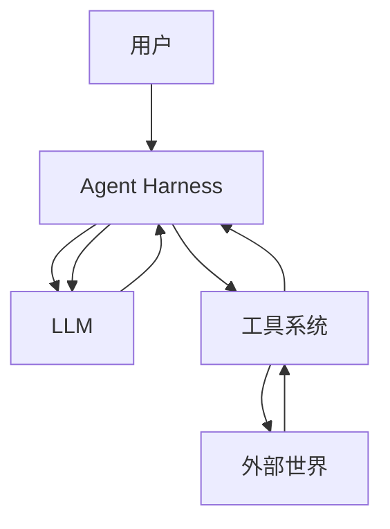

# 任务：基于 Pi 源码制作一套完整的中文 AI Agent 开发教材，并使用 Go、Java 从零实现 Agent Harness

你现在是一名同时熟悉以下领域的高级工程师和技术教师：

1. LLM 与 AI Agent 原理
2. Agent Harness 设计
3. ReAct Agent Loop
4. Coding Agent 架构
5. TypeScript / JavaScript
6. Go
7. Java
8. 插件系统与事件系统
9. MCP
10. Skills
11. RAG
12. Context Engineering
13. LLM API
14. CLI / TUI
15. 软件架构与源码教学
16. Mintlify 技术文档建设

你的任务不是简单总结 Pi，也不是写几篇博客。

你的任务是直接研究当前本地的 Pi 项目源码，并以 Pi 作为真实案例，制作一套接近在线教材规模的中文 AI Agent 开发学习网站。

最终目标是让我完成整套内容之后：

1. 理解 LLM 到 Agent 的演进过程。
2. 理解 Agent Loop 和 ReAct。
3. 理解 Agent Harness 到底解决什么问题。
4. 能读懂 Pi 的核心源码。
5. 能理解一个成熟 Coding Agent 的组成。
6. 能理解工具调用、上下文、Session、Compaction、Steering、Follow-up、Retry、Streaming 等机制。
7. 能理解插件式架构。
8. 能理解 Skills、MCP、RAG 在 Agent 系统里的位置。
9. 能使用 Go 从零实现一个 Agent。
10. 能使用 Java 从零实现一个 Agent。
11. 最终能够逐渐实现一个比较完整的 Agent Harness。
12. 以后再接触 LangChain、LangGraph、Spring AI、Eino、ADK 等框架时，可以理解框架替我完成了什么，而不是只会调用框架 API。

整个学习站点必须使用中文。

文档最终转换成当前版本 Mintlify 可以识别的形式，并经过本地验证。

实际部署到 Vercel 不属于你的任务范围。

---

# 一、项目环境

Pi 仓库已经 clone 到当前本地目录。

仓库地址：

https://github.com/earendil-works/pi

不要重新 clone 项目。

必须直接研究当前工作区里的代码。

当前本地源码是分析 Pi 实现时的最高优先级事实来源。

GitHub 仓库、Pi 官方文档、论文、厂商官方文档用于辅助研究。

博客、论坛、个人文章只能作为补充，不允许使用二手文章代替源码分析或官方资料。

开始工作时读取：

```bash
git rev-parse HEAD
git remote -v
git status
```

记录当前研究基于哪个 commit。

所有与 Pi 源码有关的教材内容都应尽可能绑定这个 commit。

---

# 二、我的开发背景

写文档时必须按照下面的学习者背景控制难度。

我是 Java 后端开发，大约两年工作经验。

主要使用 Java。

Go 只学习过基础语法，可以写一些简单代码，没有系统学习 Go Web 框架和 Go 工程体系。

前端方面能写 Vue、React，但没有系统深入学习 JavaScript 和前端体系。

因此：

涉及 TypeScript / JavaScript 特有语法时，不要默认我一定理解。

例如遇到以下内容时，需要适当解释：

```text
Promise
async / await
Generator
AsyncGenerator
EventEmitter
AbortController
AbortSignal
union type
generic
type narrowing
dynamic import
ESM
closure
callback
higher-order function
stream
iterator
symbol
module resolution
```

但不要把教材写成 JavaScript 入门教程。

解释程度以“足够理解 Pi 源码”为准。

可以大量使用 Java 和 Go 中对应的概念帮助理解。

例如：

```text
TypeScript interface
对应 Java interface
对应 Go interface
```

```text
AbortController
可以类比 Java Cancellation / Future cancellation
也可以对比 Go context.Context
```

```text
EventEmitter / callback
可以对比 Java Listener
可以对比 Go channel / callback
```

这种跨语言映射非常重要。

---

# 三、我目前对 AI Agent 的理解

以下内容代表我的当前认知。

不要把这些内容直接当作完全正确的事实。

你需要在教材中逐项校正、补充和深化。

我目前的理解如下：

1. LLM 的基础能力可以理解为基于已有上下文进行 token prediction，从而生成后续内容。

2. AI Agent 大致可以理解为：

```text
模型推理
→ 选择工具
→ 调用工具
→ 获得结果
→ 把结果返回模型
→ 模型继续推理
→ 再次选择工具
→ ...
→ 最终回答
```

3. AI 工具的一些扩展能力可以通过 hooks 等机制实现。

4. Coding Agent 一般会提供一些工具，例如：

```text
read
write
edit
grep
find
ls
bash
```

5. MCP 是 AI 应用与外部系统交互的一套协议。

我目前知道：

```text
stdio
HTTP
JSON-RPC
```

但没有真正实现过 MCP Client 和 MCP Server。

6. Skill 可以理解为把提示词、说明、脚本、参考资料等打包成一个能力单元。

我目前理解 Pi / Codex 这类系统会先把 Skill 的：

```text
name
description
path
```

等简要信息暴露给模型。

模型判断任务需要 Skill 后，再使用 read 等工具读取 `SKILL.md` 和相关文件。

这属于 progressive disclosure。

7. RAG 目前只理解概念。

知道：

```text
Sparse Retrieval
Dense Retrieval
Embedding
Vector Database
Similarity Search
Hybrid Search
```

但没有实际使用过向量数据库。

8. 简单了解过：

```text
Harness
ReAct
Agent Loop
```

但没有系统研究。

9. 知道一些 LLM API 形式：

```text
OpenAI Chat Completions API
OpenAI Responses API
Anthropic Messages API
```

但没有真正从 HTTP 请求开始完整实现一个 Agent。

教材需要以这些认知作为起点。

需要明确指出哪些理解基本正确，哪些过于简化，哪些概念之间容易混淆。

---

# 四、最终产物

请在当前仓库中新增独立目录：

```text
ai-agent-learning/
```

不要修改 Pi 原有英文文档的正文。

不要为了教材随意修改 Pi 本身的业务源码。

学习代码放在独立目录。

推荐结构：

```text
ai-agent-learning/
├── docs.json
├── index.mdx
├── README.md
├── PROGRESS.md
├── VALIDATION.md
│
├── 00-guide/
├── 01-foundations/
├── 02-llm-api/
├── 03-agent-loop/
├── 04-tools/
├── 05-context/
├── 06-session/
├── 07-harness/
├── 08-pi-architecture/
├── 09-pi-source/
├── 10-coding-agent/
├── 11-extensions/
├── 12-skills/
├── 13-mcp/
├── 14-rag/
├── 15-security/
├── 16-observability/
├── 17-go-agent/
├── 18-java-agent/
├── 19-build-harness/
├── 20-frameworks/
│
├── pi-docs/
│   ├── agent/
│   └── coding-agent/
│
├── reference/
│
└── examples/
    ├── go-agent/
    └── java-agent/
```

目录可以根据实际研究结果适当调整，但总体信息架构必须清晰。

不能把全部内容塞进少量超长 Markdown 文件。

应该按照在线教材的形式划分章节。

---

# 五、Mintlify 要求

使用当前最新版 Mintlify 官方规范。

不要根据旧教程创建已经废弃的配置。

创建并维护：

```text
ai-agent-learning/docs.json
```

页面推荐使用：

```text
.mdx
```

需要使用 Mintlify 支持的组件改善阅读体验，例如适合的：

```text
Card
CardGroup
Tabs
Accordion
Steps
Note
Warning
Tip
Info
CodeGroup
```

具体组件名称和语法必须以当前 Mintlify 官方文档为准。

不要凭记忆写组件。

如果当前 Mintlify 已调整 API，使用当前 API。

必须支持 Mermaid。

Mermaid 图中的：

```text
节点名称
流程名称
注释
分组名称
```

应该尽可能使用中文。

代码里的真实：

```text
class
function
method
type
interface
文件路径
变量
API 名称
```

不要翻译。

完成内容后至少执行当前 Mintlify 官方支持的：

```bash
mint validate
mint broken-links
```

并启动：

```bash
mint dev
```

确认站点能够被 Mintlify 正常解析。

如果当前 CLI 命令已经变化，以当前官方文档为准。

把验证结果写入：

```text
ai-agent-learning/VALIDATION.md
```

不要执行 Vercel 部署。

不要创建真实线上资源。

---

# 六、Pi 原始文档中文翻译

重点处理：

```text
packages/agent/docs/
packages/coding-agent/docs/
```

先扫描两个目录中的所有文档。

生成完整清单。

不能只翻译你认为重要的部分。

中文版本放到：

```text
ai-agent-learning/pi-docs/agent/
ai-agent-learning/pi-docs/coding-agent/
```

必须建立：

```text
原文件
→ 中文文件
```

映射。

检查源目录文档数量和翻译后的文档数量，避免遗漏。

## 翻译标准

不要逐字直译。

不要出现明显的英文句法。

目标是让一个中文开发者读起来像中文技术作者写的文章。

遇到原文解释较少或者比较晦涩的部分，可以增加：

```markdown
> 译者注：
> 这里实际解决的是……
```

译者注可以解释：

1. 为什么要这样设计。
2. 与 Java 的对应概念。
3. 与 Go 的对应概念。
4. 对 Agent Harness 有什么意义。
5. 对初学者容易造成什么误解。
6. 当前内容与后续源码章节有什么关系。

不要用译者注改变原作者本来的技术含义。

## 代码处理

原始代码默认保持原样。

不要为了中文化修改：

```text
API
类型名
函数名
类名
变量名
CLI 命令
路径
JSON 字段
配置字段
协议字段
```

需要解释代码时，在代码块后写中文说明。

## Mermaid

如果原文包含 Mermaid：

1. 保留图的逻辑。
2. 翻译可翻译的自然语言。
3. 代码标识符保持原名。
4. 确认 Mermaid 可以渲染。

---

# 七、不要把翻译文档和学习教材混为一类

网站需要同时存在两类内容。

第一类：

```text
Pi 官方文档中文版
```

主要目标是忠实、易读。

第二类：

```text
AI Agent 学习教材
```

主要目标是教学。

学习教材不能只是把 Pi 官方文档重新组织一遍。

它需要自己形成完整的知识体系。

---

# 八、教材总体学习路径

整个教材至少覆盖以下阶段。

## 阶段 0：阅读指南

解释：

1. 这套教材适合谁。
2. 学习完成后能做什么。
3. 学习路线。
4. 推荐学习顺序。
5. 哪些章节可以暂时略读。
6. TypeScript、Java、Go 在教材里的关系。
7. Pi 在教材中的角色。
8. 为什么一开始不使用 Agent Framework。

提供整个课程地图 Mermaid。

---

# 九、阶段 1：从 LLM 到 Agent

从最基础的 LLM API 开始。

至少包含：

```text
Token
Context Window
Message
System Prompt
User Message
Assistant Message
Sampling
Streaming
Structured Output
Tool Calling
Function Calling
Tool Result
Stop Reason
Usage
Reasoning / Thinking
```

重点解释：

模型自身到底做什么。

Agent Runtime 做什么。

Harness 做什么。

CLI / TUI 做什么。

MCP 做什么。

Skill 做什么。

RAG 做什么。

不要把这些概念混在一起。

需要画类似：



实际文档请继续完善这个图。

---

# 十、阶段 2：真正理解 Tool Calling

这一部分必须详细。

从完全没有 Agent 的场景开始。

首先实现：

```text
用户
→ HTTP 请求
→ LLM
→ 文本回答
```

然后加入 Tool Definition。

解释模型看到的工具是什么。

例如：

```json
{
  "name": "read_file",
  "description": "读取指定文件",
  "parameters": {
    "type": "object",
    "properties": {
      "path": {
        "type": "string"
      }
    },
    "required": ["path"]
  }
}
```

详细解释：

```text
Tool Name
Description
JSON Schema
Tool Arguments
Tool Call ID
Tool Result
```

尤其解释：

模型并没有真正调用 Java 方法、Go 函数或者操作系统。

模型只是生成一个结构化的 tool call。

真正执行工具的是 Agent Runtime。

必须让这个边界非常清楚。

需要画完整时序图：

```text
User
Agent
LLM API
Tool Registry
Tool Executor
Filesystem
```

然后研究 Pi 是怎么表示 Tool 的。

找到对应：

```text
type
interface
tool definition
validation
execution
tool result
event
```

不要只展示最终代码。

要解释完整调用过程。

---

# 十一、阶段 3：ReAct 与 Agent Loop

系统研究 ReAct。

需要查阅 ReAct 原始论文或者权威资料。

介绍：

```text
Reason
Act
Observe
Reason
Act
Observe
...
```

同时解释现代 Tool Calling Agent 与经典文本式 ReAct 有什么相同点和差异。

不要机械地把所有现代 Agent 都描述成严格输出：

```text
Thought:
Action:
Observation:
```

需要解释现代模型原生 tool calling 已经改变了工程实现形式。

然后自己写一个最基础的 Agent Loop 伪代码，例如：

```text
messages = [userMessage]

while true:
    response = llm(messages, tools)

    messages.append(response)

    if response 没有 tool call:
        return response

    for toolCall in response.toolCalls:
        result = execute(toolCall)
        messages.append(toolResult)
```

在此基础上逐渐增加：

```text
Streaming
Multiple Tool Calls
Sequential Execution
Parallel Execution
Abort
Retry
Steering
Follow-up
Events
Context Update
Usage
Error Handling
Max Steps
```

然后进入 Pi：

重点精读当前源码中与 Agent Loop 相关的真实实现。

当前版本中应重点关注类似：

```text
packages/agent/src/agent-loop.ts
packages/agent/src/agent.ts
packages/agent/src/types.ts
```

但不要假设这些路径永远存在。

必须以当前源码为准。

重点研究（需要翻译为中文）：

```text
runAgentLoop
executeToolCalls
sequential tool execution
parallel tool execution
event emission
message conversion
stream
abort
steering
follow-up
state
```

输出一张 Pi Agent Loop 完整 Mermaid 时序图。

---

# 十二、阶段 4：系统解释 Agent Harness

这是整套教材中最重要的模块之一。

需要专门回答：

```text
Agent 和 Agent Harness 到底有什么区别？
```

研究 Harness 概念的行业资料。

同时研究 Pi 当前源码。

当前 Pi 已存在类似：

```text
packages/agent/src/harness/
packages/agent/src/harness/agent-harness.ts
```

以本地版本为准。

不要给 Harness 一个模糊定义。

从工程结构解释 Harness。

至少研究下面这些模块是否属于 Harness，以及 Pi 中是谁负责（需要翻译为中文）：

```text
Model abstraction
Provider adapter
LLM request
Streaming
Prompt assembly
System prompt
Message history
Tool registry
Tool execution
Tool validation
Agent loop
State
Session
Context
Context compaction
Branching
Steering
Follow-up
Retry
Error handling
Cancellation
Events
Hooks
Extensions
Skills
MCP
Configuration
Permissions
Sandbox
Telemetry
CLI
TUI
RPC
Persistence
Resource loading
```

创建一张 Harness 全景架构图。

同时制作一个表格：

| Harness 能力 | 解决的问题 | Pi 对应模块 | 核心文件 | Go 实现计划 | Java 实现计划 |
| ---------- | ----- | ------- | ---- | ------- | --------- |

这张表应随着源码研究持续完善。

---

# 十三、阶段 5：Pi Monorepo 架构

研究整个 Pi 仓库。

不能只研究 `coding-agent`。

至少研究当前存在的这些包以及它们之间的依赖关系：

```text
packages/ai
packages/agent
packages/coding-agent
packages/client
packages/protocol
packages/server
packages/telemetry
packages/tui
```

如果本地还有其他重要 package，一并研究。

为每一个 package 回答：

1. 它解决什么问题。
2. 为什么要独立成一个 package。
3. 上游依赖是谁。
4. 下游被谁使用。
5. 主要入口是什么。
6. 核心类型有哪些。
7. 核心运行时流程是什么。
8. 如果自己设计一个 Agent Harness，是否需要类似模块。

需要生成 Monorepo 依赖 Mermaid 图。

例如：

```text
coding-agent
    ↓
agent
    ↓
ai
```

实际关系必须从 `package.json`、imports 和源码确认。

不能根据名字推测。

---

# 十四、阶段 6：LLM Provider 层源码精读

重点研究：

```text
packages/ai
```

理解 Pi 如何统一不同厂商 API。

研究：

```text
OpenAI
Anthropic
Google
其他当前实际支持的 provider
```

详细解释：

为什么 Coding Agent 不应该让 Agent Loop 直接依赖某个厂商的原始 API 类型。

解释 Provider Adapter 的价值。

研究：

```text
统一 Model
统一 Message
统一 Stream
统一 Tool Call
Usage
Thinking
Stop Reason
Error
Retry
```

不同厂商之间有哪些差异。

可以用表格表示。

同时解释：

```text
Chat Completions API
Responses API
Messages API
```

在概念和数据结构上的区别。

这里必须使用最新官方资料研究，不要依赖过时博客。

---

# 十五、阶段 7：Coding Agent 的工具系统

重点研究 Pi Coding Agent 的内置工具。

以当前源码实际存在的工具为准，例如可能包括：

```text
read
write
edit
grep
find
ls
bash
powershell
```

每个工具都要解释：

1. Tool Schema。
2. 注册位置。
3. Prompt 如何让模型知道工具存在。
4. 参数验证。
5. 实际执行。
6. 返回结果。
7. 错误处理。
8. 输出过长怎么办。
9. 与 Agent Loop 怎么连接。
10. Extensions 能否替换或者增强它。

特别研究：

```text
read
edit
write
bash
grep
```

这些工具足够组成一个基础 Coding Agent。

需要设计一个最基础 Coding Agent：

```text
LLM
+
read
+
write
+
edit
+
grep
+
shell
+
Agent Loop
```

然后讨论它距离 Pi 还缺什么。

---

# 十六、阶段 8：Context Engineering

专门写一个大模块讲 Context（需要翻译为中文）。

解释：

```text
Context Window
System Prompt
Conversation History
Tool Result
AGENTS.md
CLAUDE.md
Skills
Prompt Template
Environment Context
Repository Context
Current Working Directory
User Instruction
```

这些内容最终如何进入模型上下文。

研究 Pi 如何组装 System Prompt。

研究：

```text
AGENTS.md
CLAUDE.md
skills
prompt templates
extensions
```

是否以及如何影响 context。

给出一次真实 Prompt 组装过程。

建议用一个虚构但结构真实的示例：

```text
System Prompt
+ project instruction
+ available skills
+ tools
+ session messages
+ current user request
```

清楚区分：

```text
模型参数
系统提示词
消息历史
工具定义
Tool Result
```

它们在 API 请求里的位置不一定相同。

---

# 十七、阶段 9：Session、Message、Branch 与 Compaction

深入研究 Pi 的 Session 系统。

需要解释为什么 Coding Agent 不能简单保存：

```text
List<Message>
```

就结束。

研究（需要翻译为中文）：

```text
Session persistence
Session tree
Branch
Navigation
Compaction
Branch summary
Message conversion
State
Usage
Metadata
```

重点说明 Context Window 不够时怎么办。

讲清楚 Compaction。

不要只写：

```text
把历史聊天总结一下
```

需要解释：

1. 为什么需要 compaction。
2. 哪些内容可以压缩。
3. 哪些不能丢。
4. summary 怎么重新进入 context。
5. tool call 和 tool result 是否需要配对。
6. 压缩前后 message 如何处理。
7. Pi 如何实现。
8. 一个成熟 Harness 为什么需要它。

画 Compaction 流程图。

---

# 十八、阶段 10：Steering 与 Follow-up

这是很多初级 Agent 教程不会讲，但成熟 Harness 很重要的能力。

研究 Pi：

```text
steering
follow-up
queue
pending message
```

解释一个 Agent 正在调用工具时，用户突然输入新要求会发生什么。

例如：

```text
Agent 正在：
1. read
2. grep
3. edit
4. test
```

此时用户输入：

```text
不要修改数据库代码
```

成熟 Agent 如何感知并处理？

研究 Pi 的消息队列以及 Agent Loop 边界。

结合源码解释。

再比较：

```text
steering
follow-up
interrupt
abort
```

之间的区别。

Go 版和 Java 版 Agent 后面也需要实现类似机制。

---

# 十九、阶段 11：插件系统 / Extensions

这是重点模块。

我以前没有真正开发过插件式系统，所以需要从基础开始讲。

先脱离 Pi，介绍插件系统的典型组成（需要翻译为中文）：

```text
Plugin Interface
Plugin Discovery
Plugin Loader
Plugin Registry
Lifecycle
Hook
Event
Context
Capability
Configuration
Isolation
Dependency
Version Compatibility
```

结合熟悉的 Java 生态进行类比：

```text
SPI
ServiceLoader
Spring extension points
Listener
Interceptor
Filter
ApplicationEvent
ClassLoader
```

再对比 Go：

```text
interface
registry
init registration
factory
callback
event bus
```

然后进入 Pi Extensions。

重点研究当前：

```text
packages/coding-agent/docs/extensions.md
packages/coding-agent/examples/extensions/
packages/coding-agent/src/
```

实际 Extension loader 的代码位置必须通过源码确认。

研究：

1. Extension 如何被发现。
2. Extension 如何加载。
3. TypeScript 文件如何在运行时执行。
4. Extension API 是什么。
5. Extension 如何注册 Tool。
6. Extension 如何注册 Command。
7. Extension 如何监听 Event。
8. Extension 如何修改 Agent 行为。
9. Extension 如何影响 UI。
10. Extension 如何影响 Tool Call。
11. Extension 生命周期。
12. Extension 错误会怎么处理。
13. Extension 与 Agent Core 的边界。
14. Extension 与 Skill 的区别。
15. Extension 与 MCP 的区别。
16. Extension 为什么比直接修改核心源码更适合扩展 Coding Agent。

画 Plugin Loader 架构图。

画 Extension 生命周期图。

然后分别设计：

```text
Go Plugin System
Java Plugin System
```

学习版本不要求复刻 TypeScript 动态加载能力，但设计思想要一致。

Java 可以重点讨论：

```text
interface
ServiceLoader
SPI
reflection
ClassLoader
event listener
registry
```

Go 可以重点讨论：

```text
interface
registry
factory
explicit registration
callback
```

不要为了模仿 Node.js 而强行使用 Go 原生 `plugin` package。

先解释不同语言生态适合的实现方式。

---

# 二十、阶段 12：Skills

以 Pi 当前 Skill 实现为案例。

研究（需要翻译为中文）：

```text
Skill discovery
SKILL.md
frontmatter
name
description
path
progressive disclosure
resource loading
scripts
references
assets
```

重点解释：

为什么不把所有 Skill 全文直接塞进 System Prompt。

做一次 token 对比。

例如：

```text
50 个 Skill
每个完整说明 2000 token
```

和：

```text
只加载 name + description
```

比较上下文成本。

然后研究 Pi 实际：

1. 启动时如何搜索 Skill。
2. 如何读取 metadata。
3. 如何加入 System Prompt。
4. 模型什么时候读取完整 SKILL.md。
5. Skill 路径如何传递。
6. `/skill:name` 做什么。
7. Skill 是否可以附带脚本。
8. Skill 安全问题。
9. Skill 与 Extension 的边界。

画 Progressive Disclosure Mermaid 图。

---

# 二十一、阶段 13：MCP

从协议本身开始。

不要直接使用 MCP SDK 隐藏细节。

首先解释：

```text
JSON-RPC
request
response
notification
id
method
params
result
error
```

然后研究 MCP：

```text
initialize
tools/list
tools/call
resources
prompts
stdio
HTTP transport
```

具体协议细节使用当前 MCP 官方规范。

不要根据旧版本教程写死。

先手工实现一个很小的 MCP Client 或 MCP Server 示例。

例如：

```text
calculator MCP server
```

再考虑使用官方 SDK。

解释：

MCP Tool 最终是怎么转换成 Agent Tool 的。

画：

```text
LLM
→ Agent
→ MCP Client
→ MCP Server
→ External Service
```

完整流程。

如果 Pi Core 默认没有直接内建 MCP，要如实说明。

如果 MCP 能通过 Extension 实现，也研究对应例子。

不要因为“很多 Agent 都支持 MCP”就假定 Pi 内核一定实现了 MCP。

---

# 二十二、阶段 14：RAG

RAG 不需要成为 Pi 源码分析的中心。

目标是让我真正理解 Agent 如何使用 RAG。

讲清楚：

```text
Chunk
Embedding
Vector
Cosine Similarity
Sparse Retrieval
BM25
Dense Retrieval
Hybrid Search
Rerank
Top K
Metadata Filter
```

然后设计：

```text
search_knowledge
```

工具。

让 Agent 通过 Tool 使用 RAG。

解释两种方案：

```text
Harness 自动检索并注入 Context
```

以及：

```text
把检索暴露成 Tool，由模型决定何时查询
```

比较两者。

提供一个非常小的可运行 Demo。

不要一开始依赖大型 RAG Framework。

---

# 二十三、阶段 15：安全、权限和 Sandbox

这一部分不能省略。

研究当前 Pi 对权限的实际设计。

如果当前版本没有内建完整权限系统，要明确写出来。

研究（需要翻译为中文）：

```text
filesystem
shell
network
credentials
project trust
container
sandbox
extension security
skill security
```

尤其解释 Coding Agent 为什么危险。

例如：

```text
bash("rm -rf ...")
read("~/.ssh/id_rsa")
curl(...)
git push
```

从 Harness 角度讨论：

```text
permission policy
tool allowlist
path restriction
command approval
sandbox
container
timeout
resource limit
network policy
secret redaction
```

然后在自己的 Java / Go Harness 中逐渐加入基础 Permission Layer。

---

# 二十四、阶段 16：Telemetry 与 Observability

研究 Pi 当前：

```text
packages/telemetry
```

解释为什么 Agent 需要可观测性。

至少讨论（需要翻译为中文）：

```text
request latency
LLM latency
TTFT
token usage
tool duration
tool error
retry
agent step
session
model
provider
cost
abort
compaction
```

设计一次 Agent Run Trace。

例如：

```text
run
├── llm request
├── tool read
├── tool grep
├── llm request
├── tool edit
├── tool bash
└── llm final
```

解释日志与 Trace 的区别。

---

# 二十五、阶段 17：从零实现 Go Agent

这一部分必须有真实可运行代码。

代码目录：

```text
ai-agent-learning/examples/go-agent/
```

不要使用 LangChain 一类 Agent Framework。

早期阶段尽量使用 Go 标准库：

```text
net/http
context
encoding/json
os
io
bufio
```

可以使用少量必要依赖，但每个依赖都必须解释为什么需要。

实现过程必须分阶段。

## Go 01：最基础 LLM Client

实现：

```text
User
→ HTTP
→ LLM API
→ Assistant Text
```

学习：

```text
HTTP
JSON
Auth
Request
Response
Error
```

## Go 02：Streaming

使用流式 API。

解释：

```text
SSE
chunk
delta
finish reason
```

具体格式根据实际 Provider API。

## Go 03：Tool Definition

定义：

```go
type Tool interface {
    Name() string
    Description() string
    Schema() any
    Execute(ctx context.Context, args json.RawMessage) (ToolResult, error)
}
```

这里只是建议。

最终设计要经过教材解释。

## Go 04：Agent Loop

实现：

```text
LLM
→ tool call
→ execute
→ tool result
→ LLM
```

## Go 05：基础 Coding Tools

实现学习版本：

```text
read
write
grep
shell
```

然后逐渐增加 edit。

## Go 06：Context 和 Message

统一内部 Message 数据结构。

## Go 07：Retry / Abort

使用：

```go
context.Context
```

## Go 08：Events

设计 Agent Event。

## Go 09：Session

保存和恢复会话。

## Go 10：Compaction

实现基础 context compaction。

## Go 11：Steering / Follow-up

使用：

```text
channel
queue
context cancellation
```

## Go 12：Plugin System

使用 interface + registry。

## Go 13：Skill

扫描目录，解析 metadata，把技能描述提供给模型。

## Go 14：MCP

接入自己的 MCP Client。

## Go 15：Harness

把上面的能力组合成完整 Harness。

每一步必须：

1. 可以编译。
2. 有 README。
3. 有运行方式。
4. 有测试。
5. 有对应教材。
6. 解释与 Pi 的对应关系。

---

# 二十六、阶段 18：从零实现 Java Agent

代码目录：

```text
ai-agent-learning/examples/java-agent/
```

不要在基础章节直接使用 Spring AI、LangChain4j。

基础实现优先考虑：

```text
Java 21+
java.net.http.HttpClient
Jackson
CompletableFuture
ExecutorService
Flow
ServiceLoader
```

如果 Java 版本或者依赖需要调整，在 README 中解释。

## Java 01：LLM Client

使用：

```java
HttpClient
HttpRequest
HttpResponse
```

真正发送 HTTP 请求。

## Java 02：Streaming

理解 SSE。

## Java 03：Tool Interface

例如：

```java
public interface Tool {
    String name();
    String description();
    JsonNode schema();
    ToolResult execute(ToolContext context, JsonNode arguments);
}
```

最终接口需要结合实际实现调整。

## Java 04：Agent Loop

自己实现 Tool Calling Loop。

## Java 05：Coding Tools

实现学习版本：

```text
read
write
grep
shell
edit
```

## Java 06：Context

设计内部 message abstraction。

## Java 07：Retry / Cancellation

研究：

```text
CompletableFuture
ExecutorService
Future.cancel
Thread interruption
```

如果使用 Virtual Thread，需要解释原因。

## Java 08：Event

可以使用 Listener 模式。

## Java 09：Session

持久化会话。

## Java 10：Compaction

实现上下文压缩。

## Java 11：Steering / Follow-up

设计消息队列。

## Java 12：Plugin

重点实践：

```text
SPI
ServiceLoader
Plugin interface
registry
event listener
```

## Java 13：Skill

实现 Skill Discovery。

## Java 14：MCP

从底层协议理解后再接 SDK。

## Java 15：Harness

组合完整系统。

每一步与 Go 版保持知识点对应，但不要为了目录一致而写两份机械翻译的代码。

应该体现 Java 与 Go 的语言特点。

---

# 二十七、Go、Java、Pi 三方对照

核心章节都尽量增加这样的内容：

| 能力              | Pi / TypeScript      | Go                 | Java                  |
| --------------- | -------------------- | ------------------ | --------------------- |
| Cancellation    | AbortController      | context.Context    | Future / interruption |
| Tool interface  | TypeScript interface | interface          | interface             |
| Event           | callback / event     | channel / callback | Listener              |
| Plugin registry | Extension API        | registry           | SPI / ServiceLoader   |
| Async           | Promise              | goroutine          | CompletableFuture     |
| Streaming       | AsyncIterable        | channel / io       | Flow / callback       |

但必须根据真实代码继续完善。

不能为了做表格而写错误对应。

---

# 二十八、阶段 19：最终实现成熟 Harness

完成基础学习后，单独设计一个最终 Harness 架构。

不要把最终 Harness 理解为一个：

```text
while(true)
```

循环。

逐渐形成：

```text
AgentHarness
├── ModelProvider
├── ModelRegistry
├── PromptBuilder
├── ContextManager
├── MessageStore
├── SessionManager
├── ToolRegistry
├── ToolExecutor
├── AgentLoop
├── EventBus
├── RetryPolicy
├── PermissionManager
├── CompactionManager
├── SkillRegistry
├── PluginManager
├── MCPManager
├── Telemetry
└── Configuration
```

实际模块划分需要通过前面研究之后决定。

最终给出：

```text
Pi
vs
Go Harness
vs
Java Harness
```

三套架构对照图。

---

# 二十九、阶段 20：最后再看 Agent Framework

只有完成底层实现之后，再介绍：

```text
Spring AI
LangChain4j
LangChain
LangGraph
Eino
Google ADK
OpenAI Agents SDK
其他当前主流框架
```

具体框架以调研时仍然活跃的项目为准。

这里只需要回答：

```text
这个框架替我们实现了 Harness 中的哪些部分？
```

例如：

```text
Tool abstraction
Model abstraction
Memory
Agent loop
Workflow
MCP
RAG
Observability
```

不要把这一章写成框架 API 使用大全。

目的只是验证前面的底层知识。

---

# 三十、源码精读规范

源码分析是整套教材最重要的质量要求之一。

每篇 Pi 源码文章至少标明：

```text
源码文件
核心 symbol
所属 package
调用方
被调用方
研究 commit
```

例如：

```text
源码：
packages/agent/src/agent-loop.ts

核心符号：
runAgentLoop
executeToolCalls

研究版本：
<git commit SHA>
```

不要仅依赖行号。

因为源码变化后行号很容易失效。

优先记录：

```text
file path + symbol + commit
```

如果可以生成 GitHub permalink，则使用固定 commit 的 permalink。

## 讲源码的方法

不要上来贴几百行代码。

按照下面的方法讲：

### 1. 这个文件为什么存在

先解释职责。

### 2. 它在系统里的位置

画调用图。

### 3. 入口在哪里

找核心 exported function / class。

### 4. 数据从哪里来

解释输入。

### 5. 数据去了哪里

解释输出。

### 6. 核心类型

解释 interface / type / class。

### 7. 主流程

写伪代码。

### 8. 再阅读真实代码

引用少量关键片段。

### 9. 为什么这么设计

讨论架构选择。

### 10. Java 怎么实现

给 Java 思路。

### 11. Go 怎么实现

给 Go 思路。

### 12. 实验

提供一个可以实际修改、调试或者运行的练习。

---

# 三十一、调用链必须研究

不要只研究单个文件。

对于关键流程，需要给出完整调用链。

例如用户输入一条消息：

```text
用户输入
→ CLI/TUI
→ AgentSession
→ Harness
→ Agent
→ Agent Loop
→ Provider
→ LLM API
→ Stream
→ Tool Call
→ Tool Executor
→ Tool Result
→ Agent Loop
→ UI
```

具体名称必须根据当前 Pi 源码确认。

然后分别回答：

```text
哪个模块创建 session？
哪个模块构建 system prompt？
哪个模块调用模型？
哪个模块读取 streaming？
哪个模块发现 tool call？
哪个模块执行 tool？
哪个模块把 tool result 放回 message？
哪个模块决定继续下一次 LLM 请求？
哪个模块记录 session？
哪个模块发 event？
哪个模块更新 UI？
```

这是源码研究中的核心任务。

---

# 三十二、调试源码

不要只静态阅读。

在合适章节加入源码调试教程。

研究 Pi 官方开发文档后，说明怎么运行本地源码。

找到适合的位置增加：

```text
console log
debugger
VS Code breakpoint
```

观察：

```text
messages
tools
tool calls
events
state
system prompt
context
```

给出具体调试实验。

例如：

```text
实验：观察一次 read tool 的完整生命周期
```

记录：

```text
1. 在哪里注册 read
2. 模型返回什么
3. tool call 长什么样
4. 谁执行 read
5. tool result 长什么样
6. 谁重新提交给模型
```

---

# 三十三、教材写作方式

语言使用中文。

面向有实际后端开发经验，但刚进入 Agent 开发的工程师。

不要写成论文。

不要写成营销文章。

不要大量堆术语。

一个新概念第一次出现时：

1. 给出通俗解释。
2. 再给技术定义。
3. 给简单例子。
4. 放到 Pi 中看。
5. 最后进入源码。

例如讲 Agent Loop，不要直接从 `agent-loop.ts` 第一行开始。

先建立：

```text
为什么需要 loop
```

再讨论：

```text
最简单 loop
```

之后：

```text
成熟 loop 还需要什么
```

最后：

```text
Pi 怎么做
```

---

# 三十四、避免翻译腔

禁止类似：

```text
该机制促进了工具执行流程的实现。
```

优先写：

```text
模型返回 tool call 后，Pi 需要找到对应工具并真正执行它。模型本身不会读取文件，这一步由 Agent Runtime 完成。
```

禁止大量使用空泛描述：

```text
非常强大
灵活高效
极大提升
先进架构
优雅设计
```

需要解释具体机制。

---

# 三十五、重要概念必须区分

专门制作“概念辨析”章节。

至少比较（需要翻译为中文）：

```text
LLM vs Agent
Agent vs Agent Harness
Agent Loop vs ReAct
Tool vs MCP Tool
Tool vs Skill
Skill vs Extension
Extension vs MCP
System Prompt vs Context
Memory vs Session
Session vs Context
RAG vs Memory
RAG vs Tool
Plugin vs Hook
Hook vs Event
Tool Call vs Function Execution
Provider vs Model
Streaming vs Agent Event
Compaction vs RAG
Steering vs Follow-up
Abort vs Steering
CLI vs TUI
RPC vs MCP
```

每组都要有实际例子。

---

# 三十六、Mermaid 要求

大量使用 Mermaid，但不要为了数量乱画。

重点使用：

```text
flowchart
sequenceDiagram
stateDiagram
classDiagram
```

至少需要：

1. LLM 到 Agent 图。
2. ReAct Loop 图。
3. Tool Calling sequence。
4. Pi Monorepo 图。
5. Agent Loop 图。
6. Harness 架构图。
7. Tool lifecycle 图。
8. Context composition 图。
9. Session / Branch 图。
10. Compaction 图。
11. Extension lifecycle 图。
12. Plugin loader 图。
13. Skill progressive disclosure 图。
14. MCP sequence 图。
15. Go Harness 图。
16. Java Harness 图。
17. Pi、Go、Java对照图。

Mermaid 必须实际通过 Mintlify 渲染验证。

---

# 三十七、练习体系

教材不能只有阅读内容。

每个大模块增加实验。

可以分：

```text
观察实验
修改实验
实现实验
设计实验
```

例如 Agent Loop：

### 观察实验

观察 Pi 一次 Tool Call 的 Event。

### 修改实验

增加日志显示每一步 Agent Loop 状态。

### 实现实验

自己实现一个只有 calculator 的 Agent Loop。

### 设计实验

思考多个 Tool Call 应该串行还是并行。

每个实验给：

```text
目标
准备
步骤
观察点
预期结果
思考题
```

---

# 三十八、阶段性项目

除了单篇练习，再设计几个 Milestone。

## Milestone 1

纯聊天 CLI。

## Milestone 2

支持一个 calculator tool。

## Milestone 3

支持：

```text
read
write
grep
shell
```

成为最小 Coding Agent。

## Milestone 4

增加 Session。

## Milestone 5

增加 Compaction。

## Milestone 6

增加 Steering / Follow-up。

## Milestone 7

增加 Plugin。

## Milestone 8

增加 Skill。

## Milestone 9

增加 MCP。

## Milestone 10

形成完整 Harness。

Go 和 Java 都走这条学习路线。

---

# 三十九、测试要求

所有自己实现的 Go 和 Java 示例都需要测试。

测试重点包括：

```text
tool schema
tool dispatch
unknown tool
invalid arguments
tool error
multiple tool calls
agent termination
max steps
retry
abort
session serialization
plugin loading
skill discovery
```

LLM API 不要让单元测试全部依赖真实收费接口。

设计：

```text
FakeModel
MockModel
ScriptedModel
```

例如：

```text
第一次返回 tool call
第二次返回 final answer
```

这样测试 Agent Loop。

这个 Fake Model 本身也是很重要的教学内容。

---

# 四十、错误场景

不要只写成功流程。

必须讲：

```text
LLM timeout
429
5xx
invalid JSON
invalid tool arguments
unknown tool
tool execution error
tool timeout
user abort
context too long
broken stream
MCP disconnected
plugin load failed
skill file invalid
session corrupted
```

解释 Harness 需要怎么处理这些异常。

---

# 四十一、Agent Loop 终止条件

教材必须专门解释 Agent 为什么会停。

讨论：

```text
final text
stop reason
no tool calls
max steps
abort
fatal error
context limit
budget limit
```

避免写出可能无限调用工具的示例。

自己的 Java 和 Go 实现需要有：

```text
maxSteps
```

或者等价机制。

---

# 四十二、并行 Tool Call

研究 Pi 当前如何处理多个 Tool Call。

需要解释：

```text
sequential
parallel
```

什么时候工具可以并行。

例如：

```text
read A
read B
```

可能适合并行。

但：

```text
write file
read same file
```

存在顺序关系。

研究 Pi 是否为工具提供 execution mode 或类似设计。

必须使用当前源码验证。

然后在 Go 和 Java 版中实现一个教学版本。

---

# 四十三、Source of Truth

分析 Pi 时证据优先级：

```text
1. 当前本地源码
2. 当前仓库官方文档
3. Git history / commit
4. Pi 官方网站
5. 上游协议官方文档
6. 官方论文
7. 其他资料
```

如果官方文档与当前源码不一致：

以当前源码描述当前行为。

同时注明：

```text
当前源码与文档存在差异
```

不要自行选择一个然后假装不存在差异。

---

# 四十四、外部资料研究

以下概念必须查阅权威资料：

```text
ReAct
OpenAI APIs
Anthropic Messages
MCP
JSON-RPC
SSE
Agent Skills
RAG
Embedding
OpenTelemetry
Mintlify
```

引用原始论文和官方文档。

不要把搜索引擎摘要作为资料来源。

重要技术事实提供来源链接。

---

# 四十五、事实与推测分离

源码文章里遇到设计动机时，如果作者没有说明原因，不要写：

```text
作者这样设计是因为……
```

除非有证据。

应该区分：

```text
源码事实
官方说明
合理推断
我的教学解释
```

例如：

```markdown
> 源码事实：
> `Agent` 使用队列保存 steering message。

> 设计分析：
> 从行为上看，这让运行中的 Agent 可以在阶段边界处理新的用户指令。
```

---

# 四十六、源码引用规范

不要复制大段源码。

引用核心代码片段即可。

教材的重点是理解。

每段代码下面解释：

```text
输入是什么
输出是什么
状态改变什么
为什么调用它
后面调用谁
```

需要看到完整代码时，引导读者打开对应源码文件。

---

# 四十七、建立源码索引

创建：

```text
ai-agent-learning/reference/source-map.mdx
```

维护类似：

| 概念             | Package      | 文件  | Symbol | 教材  |
| -------------- | ------------ | --- | ------ | --- |
| Agent Loop     | agent        | ... | ...    | ... |
| Tool execution | agent        | ... | ...    | ... |
| Agent state    | agent        | ... | ...    | ... |
| Harness        | agent        | ... | ...    | ... |
| Session        | coding-agent | ... | ...    | ... |
| Extensions     | coding-agent | ... | ...    | ... |
| Skills         | coding-agent | ... | ...    | ... |
| Compaction     | ...          | ... | ...    | ... |

目标是以后想查某个 Agent 概念时，可以快速定位 Pi 源码。

---

# 四十八、建立术语表

创建中文 Agent Glossary。

至少包括：

```text
LLM
Agent
Harness
Agent Loop
ReAct
Tool
Tool Call
Tool Result
Function Calling
Context
Context Window
Context Engineering
Session
Memory
Compaction
Steering
Follow-up
Extension
Plugin
Hook
Event
Skill
MCP
RAG
Embedding
Provider
Model
Streaming
SSE
JSON-RPC
Telemetry
Trace
Span
Sandbox
Permission
```

中文解释要准确。

保留重要英文原文。

---

# 四十九、Progress 机制

任务规模很大。

不要只创建计划然后结束。

直接持续执行。

创建：

```text
ai-agent-learning/PROGRESS.md
```

记录：

```text
已完成
正在进行
尚未完成
验证状态
发现的问题
重要源码入口
研究 commit
```

每完成一个明显阶段就更新。

后续上下文不足时，根据 `PROGRESS.md` 恢复工作。

不要反复询问我是否继续。

除非遇到会破坏仓库、需要账号、需要密钥或者需要线上操作的问题，否则自己按照合理工程判断继续。

---

# 五十、不要执行的事情

不要：

1. 部署 Vercel。
2. push Git。
3. 修改远程仓库。
4. 创建 PR。
5. 上传源码。
6. 删除 Pi 原有文件。
7. 大规模格式化 Pi 原项目。
8. 修改 Pi 核心源码来适配教材。
9. 把 API Key 写进代码。
10. 假装运行了没有运行的验证。
11. 声称代码可运行但不进行实际 build/test。
12. 根据过时资料编写 Mintlify 配置。
13. 为了减少工作量省略原始文档。
14. 把教程写成简单 README。

---

# 五十一、验证标准

完成后必须实际检查。

## 文档完整性

检查：

```text
packages/agent/docs
packages/coding-agent/docs
```

所有需要翻译的源文档是否都有中文对应文件。

输出统计。

例如：

```text
agent docs:
source: N
translated: N

coding-agent docs:
source: N
translated: N
```

## Mintlify

实际执行官方当前支持的校验。

包括至少：

```text
mint validate
mint broken-links
mint dev
```

如果环境允许，再进行 accessibility 等检查。

## Mermaid

确认关键 Mermaid 没有语法错误。

## Go

执行：

```bash
go test ./...
```

以及必要的：

```bash
go vet ./...
```

## Java

根据项目选择 Maven 或 Gradle。

例如：

```bash
./mvnw test
```

或：

```bash
./gradlew test
```

只选择一种构建体系，不需要同时维护两套。

## 链接

检查：

```text
内部链接
导航链接
源码链接
文档链接
```

## 导航

`docs.json` 中引用的每个页面都必须存在。

页面应该按照学习路线排列。

---

# 五十二、VALIDATION.md

最终写：

```text
ai-agent-learning/VALIDATION.md
```

必须真实记录：

```text
研究 commit
Mintlify 版本
Node 版本
Go 版本
Java 版本
验证命令
验证结果
翻译文档数量
教材页面数量
Go tests
Java tests
broken links
未解决问题
```

不要把失败写成成功。

存在问题就记录真实问题和处理状态。

---

# 五十三、README

`ai-agent-learning/README.md` 至少说明：

```text
这是什么
如何阅读
如何启动 Mintlify
如何运行 Go Agent
如何运行 Java Agent
目录结构
学习路线
研究的 Pi commit
```

---

# 五十四、教材首页

首页不能只是：

```text
欢迎学习 AI Agent
```

需要明确展示课程地图。

首页应让人快速进入：

```text
AI Agent 基础
Agent Loop
Harness
Pi 架构
源码精读
Extensions
Skills
MCP
Go 实现
Java 实现
最终 Harness
```

推荐使用 Mintlify CardGroup。

---

# 五十五、教学深度

这是核心要求。

不要因为任务量大就把后面的章节写得越来越短。

下面这些内容属于重点，必须达到源码教材级深度：

```text
Agent Loop
Harness
Tool System
Context
Session
Compaction
Steering
Follow-up
Pi Architecture
Coding Agent
Extensions
Skills
Go Agent
Java Agent
```

单个重点主题可以由多篇文章组成。

例如 Harness 不应该只有一篇：

```text
harness.mdx
```

可以设计：

```text
07-harness/
├── what-is-harness.mdx
├── architecture.mdx
├── lifecycle.mdx
├── model-layer.mdx
├── tool-layer.mdx
├── context-layer.mdx
├── state-layer.mdx
├── session-layer.mdx
├── extension-layer.mdx
├── reliability.mdx
└── build-your-own.mdx
```

具体结构根据内容调整。

---

# 五十六、不要把 Pi 神化

Pi 是学习案例，不是唯一正确实现。

源码分析中要指出：

```text
这是 Pi 的选择
```

以及：

```text
还有哪些可选设计
```

例如：

```text
tool execution
plugin system
session persistence
context compaction
permissions
subagent
workflow
```

不同 Agent Harness 可以有不同选择。

教材目标是理解设计空间，而不是背 Pi 源码。

---

# 五十七、每完成一个模块都回答一个核心问题

例如：

## LLM API

```text
模型到底返回了什么？
```

## Tool

```text
到底是谁真正执行了工具？
```

## Agent Loop

```text
为什么模型会连续调用多个工具？
```

## Harness

```text
Agent Loop 外面的工程能力是谁负责？
```

## Context

```text
模型这一次到底看到了什么？
```

## Session

```text
一次进程结束后怎么继续聊天？
```

## Compaction

```text
上下文满了怎么办？
```

## Steering

```text
Agent 工作到一半时怎么改变要求？
```

## Extension

```text
不修改核心源码怎么增加行为？
```

## Skill

```text
为什么大量能力不应该全部写进 System Prompt？
```

## MCP

```text
Agent 怎么使用另一个进程或者远程系统提供的工具？
```

读完章节后，读者应该真的能回答这些问题。

---

# 五十八、最终验收目标

完成整套教材之后，我应该能够独立解释一次 Coding Agent 请求的完整生命周期：

```text
用户输入
→ Context 构建
→ System Prompt
→ Session History
→ Tool Definitions
→ LLM Request
→ Streaming Response
→ Tool Call
→ Validation
→ Tool Execution
→ Tool Result
→ Context Update
→ 下一轮 LLM
→ Compaction / Steering / Retry 等 Harness 行为
→ Final Answer
→ Session Persistence
→ Telemetry
```

我也应该能够分别使用：

```text
Go
Java
```

从 HTTP API 开始实现上述核心过程。

然后可以独立判断一个 Agent Framework：

```text
帮我实现了什么
隐藏了什么
哪些属于 Agent Loop
哪些属于 Harness
哪些属于 Provider
哪些属于 Tool System
哪些属于 Context
哪些属于 Plugin
哪些属于 RAG
```

做到这里，这套教材才算达到目标。

---

# 五十九、开始执行

现在直接读取当前仓库。

从以下工作开始：

1. 获取当前 Git commit。
2. 阅读根目录 `README.md`、`AGENTS.md`、`package.json`。
3. 扫描 `packages/`。
4. 扫描 `packages/agent/docs/`。
5. 扫描 `packages/coding-agent/docs/`。
6. 找出 Agent Loop、Agent、Harness、Coding Agent、Session、Extension、Skill、Tool、Provider 相关源码入口。
7. 阅读当前 Mintlify 官方规范。
8. 创建 `ai-agent-learning/`。
9. 创建 `PROGRESS.md`。
10. 创建完整教材信息架构和 `docs.json`。
11. 开始生成教材和翻译文档。
12. 持续进行源码研究、Go 实现、Java 实现和验证。

不要停留在目录规划。

目录规划完成后继续产生实际内容和代码。

所有技术结论必须来自当前源码或者可信的原始资料。

所有代码示例必须以“我最终能够自己写出 Agent Harness”为教学目标。
